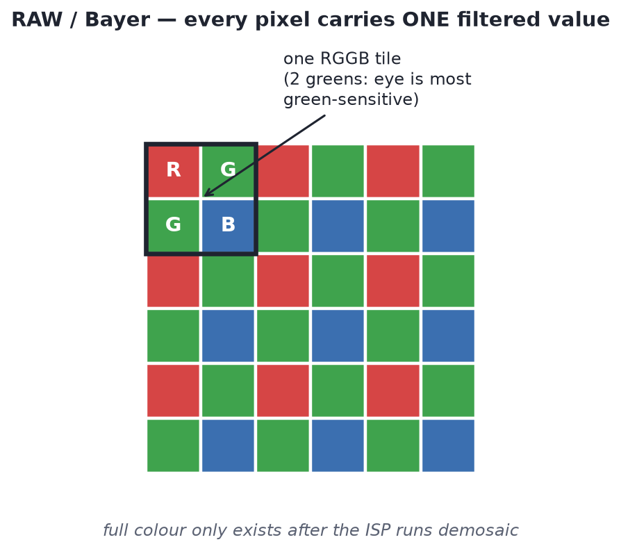
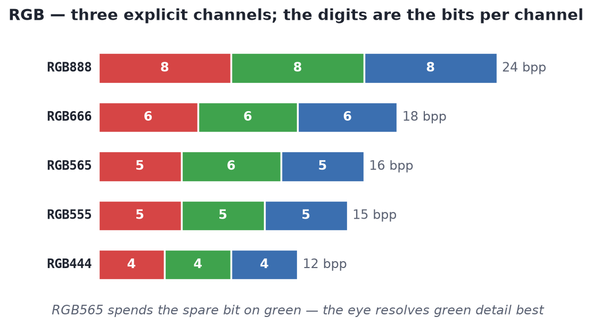
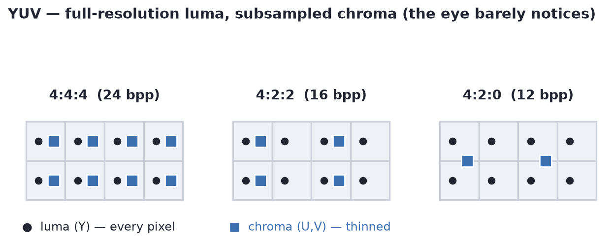

<h1 align="center">
 
  <br />
 CAMERA COLOUR FORMATS &amp; PIXEL METADATA
</h1>


> **Part 2 of the MIPI CSI-2 notes.** Continues from
> [**CAMERA MIPI CSI-2 →**](mipi_csi_2.md), picking up right after frame timings:
> what colour formats a camera can emit, a single worked example carried through
> RAW → RGB → YUV, and how per-frame metadata (embedded data) rides alongside the
> pixels.

---

## COLOR FORMATS OF THE CAMERA

A camera link does not just carry "an image" — it carries pixels in a specific
**data format**, and the format tells the receiver three things: how many bits are in
a pixel, which colour components those bits represent, and how the components are
packed into bytes on the wire. On CSI-2 the format is announced by the 6-bit
**Data Type** field in every long-packet header, so the ISP knows how to unpack the
payload before it has seen a single pixel.

There are three families, and they line up with three stages of the pipeline.

> **Mosaic** — the interleaved pattern of single-colour samples a Bayer sensor
> produces: each photosite sits under one R, G or B filter, so the raw frame is a
> *mosaic* of colours (the RGGB tile repeated across the array), never a full-colour
> image. "Mosaiced" data = one colour channel known per pixel.
>
> **Demosaic** (also *debayer* / CFA interpolation) — the ISP step that reconstructs
> the two missing colour channels at every pixel by interpolating from its
> neighbours, turning the single-channel mosaic into a full three-channel RGB image.
> It is the pivot between the RAW domain and the RGB domain, and the most
> quality-sensitive stage (bad interpolation → zippering and false colour on edges).
>
> **Subsampling** — deliberately storing one component at *lower spatial resolution*
> than another to save bandwidth. In YUV, luma (Y) is kept at full resolution while
> chroma (U, V) is sampled less often — `4:2:2` halves chroma horizontally, `4:2:0`
> halves it in both directions. The eye resolves brightness detail far better than
> colour detail, so the loss is mostly invisible. (Bayer is *not* subsampling — every
> pixel is still sampled, just through one filter.)

### 1. RAW / Bayer — one colour per pixel

The sensor's native output. Each pixel carries **a single value** — the light that
got through its one colour filter (R, Gr, Gb or B in the RGGB mosaic). There is no
full colour yet; colour only appears after the ISP runs demosaic.



- **Formats:** `RAW6, RAW7, RAW8, RAW10, RAW12, RAW14` (and RAW16/RAW20 on newer
  sensors). The number is the ADC bit depth per pixel.
- **Embedded information:** raw photo-charge, linear, sensor-specific — plus, on
  automotive sensors, HDR sub-exposures and optional *embedded data* lines (gain,
  exposure, temperature) prepended/appended to the frame.
- **Why use it:** highest fidelity, lowest sensor complexity, and it lets the *host*
  ISP do black-level, lens-shading, white balance, demosaic and tone-mapping with
  full precision. This is what the IMX623 sends.
- **Cost:** needs demosaic + a full ISP downstream; RAW12 is 12 bits/pixel with no
  chroma subsampling to shrink it.

**Worked example — one 4×4 patch of an orange subject** (true colour
≈ `R,G,B = 200,120,40`). Under the RGGB mosaic each pixel stores **one** number,
the level of *its* filter's colour only:

|        | col0     | col1     | col2     | col3     |
|--------|----------|----------|----------|----------|
| **row0** | `R:198` | `G:122` | `R:202` | `G:118` |
| **row1** | `G:121` | `B:39`  | `G:123` | `B:41`  |
| **row2** | `R:201` | `G:119` | `R:199` | `G:121` |
| **row3** | `G:120` | `B:40`  | `G:122` | `B:38`  |

On the wire that is just 16 values in row order: `198 122 202 118 121 39 123 41 …`
— no RGB triples exist yet. The `R:198` pixel knows nothing about green or blue.
`RAW8` → 1 byte each; `RAW10` → the same readings on a 0–1023 scale, 10 bits each.

### 2. RGB — three colour channels per pixel

Post-demosaic. Every pixel now has an explicit **red, green and blue** sample.



- **Formats:** `RGB888` (8 bits each, 24 bpp), `RGB666`, `RGB565`, `RGB555`,
  `RGB444` — the digits are the bits allocated to R/G/B, so RGB565 spends more bits
  on green because the eye is most green-sensitive.
- **Embedded information:** display-ready colour, usually already gamma-encoded and
  mapped toward sRGB/Rec.709 by the ISP's colour-correction matrix.
- **Why use it:** drives panels and simple display paths directly; no subsampling
  artefacts.
- **Cost:** the most bandwidth per pixel of the three families (24 bpp for RGB888),
  which is why it is rarely used for high-resolution sensor streams.

**Worked example (continued) — after demosaic.** Every pixel now gets **all three**
channels: its own measured one is kept, the other two are **interpolated from
neighbours**.

- Pixel `(2,2)`, an **R-site**, measured `R=199`:
  - R = **199** (measured)
  - G = avg of 4 green neighbours `(123,122,119,121)` = **121** (interpolated)
  - B = avg of 4 blue diagonals `(39,41,40,38)` = **40** (interpolated)
  - → `(199, 121, 40)`
- Pixel `(1,1)`, a **B-site**, measured `B=39`:
  - R = avg of 4 red diagonals `(198,202,201,199)` = **200** (interpolated)
  - G = avg of 4 green neighbours `(122,119,121,123)` = **121** (interpolated)
  - B = **39** (measured)
  - → `(200, 121, 39)`

So the same patch, now **1 measured + 2 interpolated** per pixel:

|        | col1            | col2            |
|--------|-----------------|-----------------|
| **row1** | `(199,121,40)` | `(201,122,41)` |
| **row2** | `(200,120,39)` | `(199,121,40)` |

Packing that pixel `(2,2) = (199,121,40)`:

| Format | Bits | Stored as | Bytes |
|--------|------|-----------|-------|
| `RGB888` | 8/8/8 = 24 bpp | 199, 121, 40 exactly | `C7 79 28` |
| `RGB565` | 5/6/5 = 16 bpp | 199»3=24, 121»2=30, 40»3=5 | `C3 C5` (slight loss) |
| `RGB444` | 4/4/4 = 12 bpp | 199»4=12, 121»4=7, 40»4=2 | `C7 2` |

The same pixel in `RAW8` was a single byte — `C7` (199). That is the whole
difference: RAW = one filtered number per pixel; RGB = a reconstructed 3-tuple per
pixel.

### 3. YUV — luma split from chroma, usually subsampled

The ISP's normal output for video and vision. Colour is stored as **Y** (luma /
brightness) plus **U and V** (blue- and red-difference chroma).



- **Formats:** `YUV444` (no subsampling), `YUV422` (chroma horizontally halved —
  the common ISP output, 16 bpp), `YUV420` (chroma halved both axes — 12 bpp, what
  H.264/JPEG expect). Each comes in 8-bit and 10-bit variants.
- **Embedded information:** same scene as RGB, but reorganised so brightness detail
  is kept at full resolution while colour detail is thinned — the eye barely
  notices, and it saves bandwidth.
- **Why use it:** matches codecs and displays, and lets the ISP denoise the noisy
  chroma hard while sharpening luma independently.
- **Cost:** subsampling is lossy for saturated fine detail (colour fringing on thin
  coloured edges); YUV420 is not suitable as an intermediate for heavy re-editing.

#### RGB → Y′CbCr conversion

The **BT.601 full-range** ("JFIF/JPEG") conversion, with `R, G, B` in `0–255`:

```
Y  =  0.299·R  + 0.587·G  + 0.114·B
Cb = 128 − 0.168736·R − 0.331264·G + 0.5·B
Cr = 128 + 0.5·R − 0.418688·G − 0.081312·B
```

- **Y** — a weighted sum of R, G, B (green weighted most; it carries the most
  perceived brightness). Range `0–255`.
- **Cb / Cr** — colour-difference terms: essentially scaled `B−Y` and `R−Y`, offset
  by 128 so neutral grey sits at `(128, 128)`. Range `0–255`.

Check against the example pixel `(199, 121, 40)`:

```
Y  = 0.299·199 + 0.587·121 + 0.114·40           = 59.50 + 71.03 + 4.56    = 135.1 → 135
Cb = 128 − 0.168736·199 − 0.331264·121 + 0.5·40  = 128 − 33.58 − 40.08 + 20 = 74.3  → 74
Cr = 128 + 0.5·199 − 0.418688·121 − 0.081312·40  = 128 + 99.5 − 50.66 − 3.25 = 173.6 → 174
```

**Matrix variants** — the luma weights change with the colour standard:

| Standard | Luma weights (R, G, B) | Used for |
|----------|------------------------|----------|
| BT.601   | 0.299, 0.587, 0.114    | SD video, JPEG |
| BT.709   | 0.2126, 0.7152, 0.0722 | HD video |
| BT.2020  | 0.2627, 0.6780, 0.0593 | UHD / HDR |

**Studio ("limited") range vs full range** — studio-swing packs Y into `16–235` and
Cb/Cr into `16–240` (headroom/footroom), which rescales the coefficients:

```
Y  =  16 + 0.257·R + 0.504·G + 0.098·B
Cb = 128 − 0.148·R − 0.291·G + 0.439·B
Cr = 128 + 0.439·R − 0.368·G − 0.071·B
```

An ISP register selects which matrix (601 / 709) and which range it emits.

#### Subsampling the worked example

Applying BT.601 full-range to the 2×2 block `rows 1–2 × cols 1–2`:

| pixel | RGB | Y | U (Cb) | V (Cr) |
|-------|-----|---|--------|--------|
| (1,1) | `(199,121,40)` | 135 | 74 | 174 |
| (1,2) | `(201,122,41)` | 136 | 74 | 174 |
| (2,1) | `(200,120,39)` | 135 | 74 | 174 |
| (2,2) | `(199,121,40)` | 135 | 74 | 174 |

Luma differs pixel-to-pixel (135/136); chroma barely moves — so it is safe to store
fewer chroma samples:

| Format | What is stored for this 2×2 block | Samples | Avg bpp |
|--------|-----------------------------------|---------|---------|
| `YUV444` | 4×Y + 4×(U,V) | 12 | 24 |
| `YUV422` | 4×Y + one (U,V) per horizontal pair → 2×(U,V) | 8 | 16 |
| `YUV420` | 4×Y + one (U,V) for the whole block | 6 | 12 |

Every pixel keeps its own **Y**; only the shared **(U,V)** count drops 4 → 2 → 1.
Because the colour here is nearly uniform, all three reconstruct to the same image —
that is exactly why chroma subsampling is close to free.

### How they differ at a glance

| Family | Colour per pixel | Typical bpp | Where in the pipeline | Main use |
|--------|------------------|-------------|-----------------------|----------|
| RAW / Bayer | 1 component (mosaic) | 8–14 (no subsampling) | sensor → ISP input | max quality, host does the ISP |
| RGB | R + G + B | 12–24 | after demosaic / CCM | direct-to-display |
| YUV444 | Y + U + V (full) | 24 | ISP internal | reference / high-quality |
| YUV422 | Y + ½ chroma | 16 | ISP output | video / vision pipelines |
| YUV420 | Y + ¼ chroma | 12 | encoder input | H.264 / HEVC / JPEG |

Two axes separate every format above: **bit depth** (dynamic range — RAW14 resolves
finer tonal steps than RAW8) and **colour representation** (one mosaiced component,
three full components, or luma + subsampled chroma). Bandwidth follows directly from
the two: `bytes/frame ≈ width × height × bpp / 8`; the per-format CSI-2
packet-length rules (min pixels per packet, packet length in bytes) are in
[**The calculations**](mipi_csi_2.md) table on the MIPI CSI-2 page.

---

## Embedded data — how per-frame metadata rides with the pixels

The pixel formats above say nothing about *exposure, gain, temperature* or which
HDR sub-frame you are looking at. That per-frame state travels alongside the pixels
in two places, and neither touches the pixel payload.

### 1. In the packet headers / short packets (tiny, fixed)

Every packet already carries structural metadata:

- **Short packets** `Frame Start (0x00)` / `Frame End (0x01)` have a 16-bit
  **Data Field** — usually the **frame number**. `Line Start/End` can carry the
  **line number**.
- **Long packet header (PH, 4 bytes):** Data Identifier (`VC` + `DT`) + 16-bit
  **Word Count** + ECC. The `VC` (virtual channel) lets a sensor tag, say, the HDR
  long exposure on VC0 and the short exposure on VC1.
- Optional **Generic Short Packets** (`DT 0x08–0x0F`) for a timestamp or sync
  marker.

There is no room here for exposure, gain or temperature — those need embedded data.

### 2. Embedded data lines — `DT = 0x12`

The sensor prepends (and/or appends) extra "lines" to the frame that are **byte
streams, not pixels**. They are ordinary long packets, but with `DT = 0x12`
(*Embedded 8-bit non-image data*) instead of the pixel DT.

**Frame layout — 1920×1080, RAW20** (`DT 0x2F`). Image line = `1920 × 20 / 8 = 4800`
bytes:

```
FS   short packet   DT=0x00   Data Field = 0x1A2C   (frame #6700)
────────────────────────────────────────────────────────────────
long packet  DT=0x12  WC=4800   ┐  embedded line 0  (register dump)
long packet  DT=0x12  WC=4800   ┘  embedded line 1  (AE/AWB stats)
long packet  DT=0x2F  WC=4800      image line 0     ┐
long packet  DT=0x2F  WC=4800      image line 1     │ 1080 lines
        …                              …            │ RAW20 = DT 0x2F
long packet  DT=0x2F  WC=4800      image line 1079  ┘
long packet  DT=0x12  WC=4800      embedded line (trailer, optional)
────────────────────────────────────────────────────────────────
FE   short packet   DT=0x01
```

Each line — embedded or image — is `PH(4B) + payload + PF(2B CRC)`. The embedded
lines are sent with the **same width and timing** as image lines, so the receiver's
line DMA handles them identically; only the `DT` differs.

### RAW20 pixel packing (`DT 0x2F`)

`LCM(20, 8) = 40` → **2 pixels per 5 bytes**:

```
P0 = 0xA3C5F   P1 = 0x1B240
byte0 = P0[19:12] = A3
byte1 = P0[11:4]  = C5
byte2 = P1[19:12] = 1B
byte3 = P1[11:4]  = 24
byte4 = P1[3:0]<<4 | P0[3:0] = 0F        ← the leftover LSB nibbles
        ─────────────────────────
wire:   A3 C5 1B 24 0F
reconstruct P0 = (A3<<12) | (C5<<4) | (0F & 0x0F) = A3C5F ✓
```

The embedded line right before it is **not** packed this way — it is plain bytes
(effectively RAW8), even though the frame is RAW20.

### What is inside an embedded line

Sensors log their register state in a self-describing format (SMIA / MIPI CCS style
— tag, address, value):

```
AA 02 02 03      reg 0x0202 = 0x03   ┐ coarse integration time
AA 02 03 E8      reg 0x0203 = 0xE8   ┘ → exposure = 0x03E8 = 1000 lines
AA 02 04 01      reg 0x0204 = 0x01   ┐ analogue gain code
AA 02 05 40      reg 0x0205 = 0x40   ┘ → 0x0140
AA 30 60 12      reg 0x3060 = 0x12   → HDR exposure-ratio code (×16)
AA 00 16 2D      reg 0x0016 = 0x2D   → die-temperature register
A5               end-of-embedded marker
07 07 07 …       padding out to WC = 4800
```

- Tag `0xAA` = "register value follows": next 2 bytes = address, next byte = data.
- `0xA5` = end; `0x07` = pad.
- The ISP driver knows each register's meaning from the sensor datasheet and pulls
  out **exposure, again/dgain, frame counter, temperature, black level**, and for
  HDR the **per-sub-exposure gains/times and knee points**.

### How the receiver uses it

The CSI-2 receiver demuxes on `DT`:

| DT | Routed to |
|----|-----------|
| `0x2F` (RAW20) | pixel frame buffer |
| `0x12` (embedded) | a small separate metadata buffer |

The ISP reads the metadata buffer **first**, configures its black-level /
lens-shading / white-balance / HDR-merge blocks for *this exact frame*, then
processes the pixel buffer. This per-frame hand-off is exactly why RAW20 sensors
(multi-exposure / LED-flicker-mitigation automotive parts) depend on embedded data:
without the exposure and gain of each sub-frame the ISP cannot linearise and merge
the 20-bit HDR data correctly.

---

[◀ Previous: **CAMERA MIPI CSI-2**](mipi_csi_2.md)
