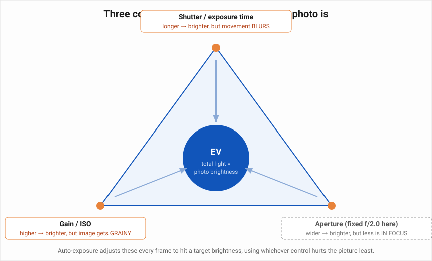
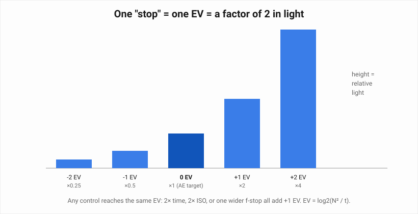
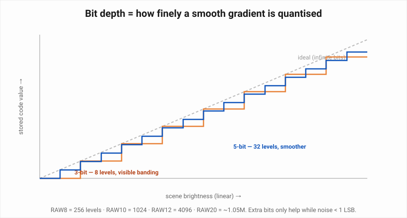
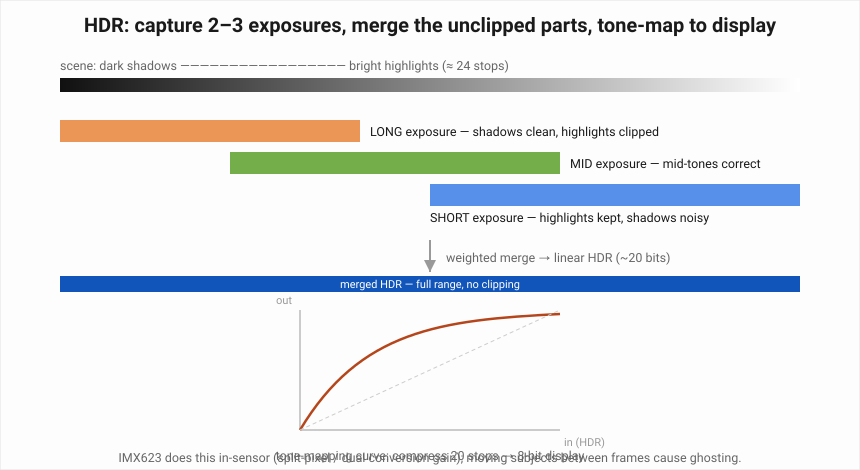
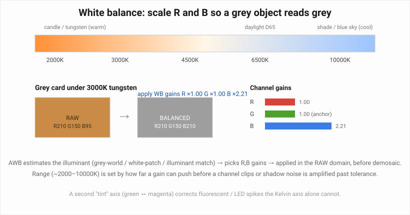
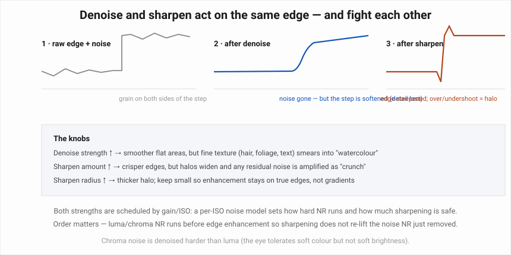
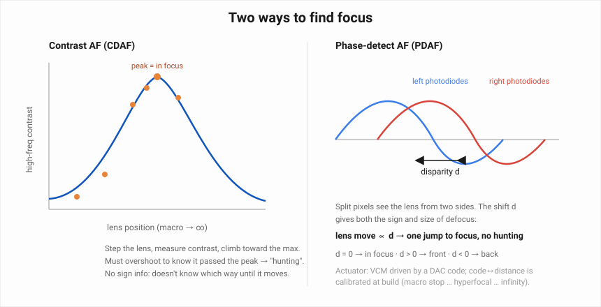

<h1 align="center">
 
  <br />
 CAMERA SETTINGS &amp; COLOUR BALANCING
</h1>


> **Part 3 of the MIPI CSI-2 notes.** Continues from
> [**CAMERA MIPI CSI-2 →**](mipi_csi_2.md) and
> [**Camera colour formats &amp; pixel metadata →**](camera_colors.md). Those two
> pages covered *how pixels move* and *how they are formatted*. This page covers
> *how the pixels are made to look right*: the exposure, HDR, bit-depth,
> white-balance, denoise, sharpness and focus controls — what each one changes in
> the image, how it does it, and how its usable range is decided.

---

## Where these controls live

A "camera setting" is not one thing. Each knob is a register or coefficient in a
particular block, and knowing which block tells you what the knob can and cannot do.

```
          SENSOR                         ISP (host or in-sensor)              LENS
 ┌───────────────────────┐   RAW   ┌──────────────────────────────┐   ┌─────────────┐
 │ exposure time (lines) │────────▶│ black level · lens shading   │   │ VCM focus   │
 │ analogue + digital gain│        │ white-balance gains (R,B)    │   │ actuator    │
 │ bit depth / ADC mode  │        │ demosaic                     │   │ (DAC code)  │
 │ HDR mode / exp. ratio │        │ colour-correction matrix     │   └──────┬──────┘
 │ frame length (VTS)    │        │ tone / gamma curve           │          │
 └───────────────────────┘        │ denoise (luma / chroma)      │◀─────────┘
             ▲                    │ sharpening / edge enhance    │   focus stats
             │  AE / AWB feedback │ 3A statistics engine         │
             └────────────────────┴──────────────────────────────┘
```

- **Sensor registers** set how much light is collected and how it is digitised —
  exposure, gain, bit depth, HDR. These change the *data you can never get back*
  once the frame is read out.
- **ISP blocks** reshape data that is already captured — white balance, tone curve,
  denoise, sharpening. Non-destructive in principle, but each one trades something.
- **The lens actuator** only moves focus.
- **The 3A statistics engine** watches every frame and drives the feedback loops:
  **AE** (auto-exposure) → sensor exposure/gain, **AWB** (auto-white-balance) → ISP
  R/B gains, **AF** (auto-focus) → lens actuator.

Reference hardware, as in the other pages: **Sony IMX623** — RGGB, f/2.0, electronic
rolling shutter, in-sensor split-pixel HDR — feeding a **MAX96717** over GMSL2.

---

## 1. Exposure — the light budget

"Exposure" just means **how bright the picture comes out**. Picture each pixel as a
tiny bucket that fills with light while the photo is being taken. Fill the buckets
too little and the image is dark and murky; overfill them and it washes out to
white. A good photo means filling them to roughly the right level.

You have three ways to control how full the buckets get:

- **Shutter / exposure time** — how *long* you leave the buckets out collecting light.
- **Gain / ISO** — an electronic *volume knob* that boosts whatever light was
  collected, after the fact.
- **Aperture** — how *wide* the lens opening is (fixed on this camera, so not a
  runtime knob here).

Each one has a side-effect, so you cannot simply max them all out. That trade-off is
what the diagram shows.



**How to read the diagram.** The three corners are the three controls. The blue
circle in the middle, **EV**, is the *total light* in the final picture. Turning up
any corner adds light and pushes toward a brighter image — but the label along each
edge is the price:

- more **shutter time** → more light, but moving things **blur**;
- more **gain / ISO** → more light, but the image gets **grainy / noisy**;
- wider **aperture** → more light, but **less of the scene is in focus**.

**Auto-exposure (AE)** is the software that, every single frame, picks one
combination of these three so the total (EV) lands on a target brightness — leaning
on whichever control hurts the picture least for the scene in front of it.

### 1.1 Shutter / exposure time (integration time)

**What it changes — in plain terms:** how long the camera *collects light* for each
frame. It is the biggest brightness control you have. Leave it open longer and the
picture is brighter; shorten it and the picture is darker but motion is frozen
sharp. "Integration time" is just the sensor's own name for the same thing — the
pixel is *integrating* (adding up) light for that long.

Two everyday effects:

- **Brightness** — double the time, double the light collected (twice as bright).
- **Motion** — anything that moves while the shutter is open gets *smeared* across
  the pixels it passed over. Long exposure of a moving car = blurred streak; short
  exposure = crisp, freezable frame.

**How it works:** this camera has no physical shutter blade — it is an *electronic
rolling shutter*. Each row of pixels is electronically emptied (reset), and then a
fixed amount of time later that same row is read out. **The gap between reset and
readout is the exposure.** Make that gap longer and every pixel in the row spends
longer collecting light.

The sensor does not take the exposure in milliseconds directly — it counts in
**rows**. You tell it "expose for N row-times", where one row-time is simply how
long the sensor spends handling one line of the image:

```
exposure time = number of rows  ×  time per row

time per row  = pixels in a row / pixel clock
example: 2200 pixels per row, pixel clock = 160 MHz
         time per row = 2200 / 160,000,000 = 13.75 µs

expose for 727 rows  →  727 × 13.75 µs ≈ 10 ms   (what a camera would label "1/100 s")
```

So "set the shutter to 10 ms" really means "write 727 into the exposure register",
and the sensor turns that number into a 727-row-time delay between reset and readout.

**Worked example — freezing vs blurring a car at 50 km/h (13.9 m/s):**

| Exposure | Subject travel during exposure | Result |
|----------|-------------------------------|--------|
| 10 ms  | 139 mm | heavy motion blur — a number plate is unreadable |
| 2 ms   | 28 mm  | soft |
| 500 µs | 7 mm   | number plate readable |
| 100 µs | 1.4 mm | frozen; needs bright scene or high gain to be bright enough |

**How the range is decided:**

- **Maximum** = frame length minus readout overhead. Frame length is the
  `VTS` (vertical total size) register: `frame_time = VTS × t_line`. At 30 fps,
  `frame_time = 33.3 ms`, so exposure can never exceed ~33 ms without dropping the
  frame rate (AE does exactly that in very low light — "night mode").
- **Minimum** = one line-time (rolling shutter cannot expose a row for less than it
  takes to clock a row), on IMX623 a few microseconds.
- **Flicker constraint:** under 50/60 Hz mains lighting, AE prefers exposures that
  are integer multiples of 10 ms / 8.33 ms so banding averages out. For pulsed LED
  signage the sensor's **LED-flicker-mitigation** (LFM) mode instead keeps a *long*
  minimum exposure so it always catches an LED "on" phase.

### 1.2 ISO / gain

**What it changes:** a multiplier applied to the signal *after* the photodiode.
It makes a dark frame brighter without a longer exposure — and amplifies the noise
along with the signal, so the shot stays "correct" brightness but gets grainier.

**How it works, in two stages:**

| Stage | Where | Effect on noise | Typical range |
|-------|-------|-----------------|---------------|
| **Analogue gain** | amplifier before the ADC | amplifies signal *before* the ADC quantises and before ADC/read noise is added → cleanest way to gain | 1×–16× (0–24 dB) |
| **Digital gain** | multiply the digital code | amplifies quantisation and read noise too; only stretches values, adds no real information | used only past analogue max |

Gain is usually a **code**, not a float. A common mapping (Smia-style):
`gain = 1024 / (1024 − code)` → code 512 = 2×, code 768 = 4×, code 960 = 16×.
"ISO" is just a tuning-team label glued onto (exposure, analogue gain) operating
points: ISO 100 ≈ base gain, ISO 1600 ≈ 16× — each doubling of ISO is +1 EV of
sensitivity and roughly √2 more visible noise.

**Worked example — same scene, same 8 ms exposure, gain traded for light:**

| Setting | Signal (e⁻) | Read noise (e⁻) | SNR | Look |
|---------|-------------|-----------------|-----|------|
| gain 1× | 4000 | 3 | ~63 (36 dB) | clean |
| gain 4× | 4000 (then ×4) | 3 | ~63 — *unchanged*; gain does not add photons | clean but no brighter data, just scaled |
| gain 4×, **light dropped 4×** | 1000 | 3 | ~31 (30 dB) | visibly grainy — this is the real trade |

The point: gain does not create signal-to-noise, it only rescales. It is worth
using when the alternative (longer exposure) would blur, or (wider aperture) is not
available — on this fixed-f/2.0 module it usually is not.

**How the range is decided:**

- **Analogue-gain ceiling** is where the amplifier runs out of linear headroom
  before the ADC clips — a sensor characteristic (IMX623: 24 dB).
- Above that, the ISP switches to **digital gain**, capped where the tuning team
  decides the noise is no longer acceptable for the product (an automotive viewing
  camera might stop at ISO 12800; a machine-vision one much lower).
- The **floor** is the sensor's base conversion gain — going below it just wastes
  ADC range.

### 1.3 Aperture

On the IMX623 module the aperture is **fixed at f/2.0**, so it is not a runtime knob
here — but it still sets two things permanently: the light the lens can gather
(f/2.0 gathers 4× an f/4.0 lens) and the **depth of field**. A fixed aperture is
normal for automotive and phone cameras because a moving iris is a reliability and
cost liability; exposure is then done entirely with time and gain.

### 1.4 EV and stops — the common unit

**What is a "stop"?** A stop is just a **unit for measuring light**, and the rule is
simple:

> **one stop = twice as much light (or half as much, going the other way).**

It is a *relative* step, not a fixed amount. Think of a volume knob with notches:
each notch up **doubles** the loudness, each notch down **halves** it. "Turn it up
2 stops" means double, then double again → **4× the light**. "Down 3 stops" means
half, half, half → **⅛ the light**.

| Change in stops | Light multiplier |
|-----------------|------------------|
| +3 stops | ×8 |
| +2 stops | ×4 |
| +1 stop | ×2 |
| 0 | ×1 (no change) |
| −1 stop | ×½ |
| −2 stops | ×¼ |
| −3 stops | ×⅛ |

The word comes from old lenses: the aperture ring had physical click-**stops**, and
each click let in half (or double) the light of the next. The name stuck and now
applies to *any* control that changes exposure.

**Why it is useful:** it puts the three controls on the **same ruler**. Shutter,
gain and aperture all change light in different physical units (milliseconds,
multipliers, f-numbers), but "+1 stop" means the same thing for all of them —
*twice the light*. That lets you trade one for another: give up 1 stop of shutter
time (halve it, to reduce blur) and get it back with +1 stop of gain (double it).

**EV** (exposure value) is the same idea as a number on that ruler instead of a
step along it. **1 EV = 1 stop.** The camera computes it from the actual settings:

```
EV = log2( N² / t )        N = f-number, t = exposure time in seconds
```

The `log2` is *why* the scale works in doublings: every time the light doubles, EV
goes up by exactly 1.



Because the scale counts doublings, combining controls becomes simple addition:

| Change | EV shift |
|--------|----------|
| exposure 10 ms → 20 ms | +1 EV |
| gain 2× → 4× | +1 EV |
| f/2.8 → f/2.0 | +1 EV |
| all three of the above together | +3 EV (×8 light) |

So AE does not think in milliseconds and gain codes — it computes "the scene is
2.3 EV under target" and then **distributes** those 2.3 EV across exposure and gain
according to a program line (bias toward exposure until motion blur risk, then lean
on gain).

### 1.5 Exposure compensation (EV ±)

**What it changes:** the *target* AE aims for, not a capture parameter directly.
`+1 EV` compensation tells AE "make the result one stop brighter than your meter
says".

**Why it exists:** the meter assumes the average scene reflects ~18% (mid-grey).
Scenes that break that assumption fool it:

| Scene | Meter does | Correct compensation | Why |
|-------|-----------|----------------------|-----|
| snow field / white wall | underexposes → grey snow | **+1 to +2 EV** | scene is far brighter than 18% average |
| stage spotlight on black | overexposes → blown face | **−1 to −2 EV** | scene is far darker than 18% average |
| strong backlight | underexposes the face | **+1 EV** (or spot-metering) | bright background drags the average up |

**How the range is decided:** typically **±3 EV** in ⅓-EV steps. The bound is
practical — beyond +3 EV the highlights clip past recovery, beyond −3 EV the shadows
disappear into read noise, so more range would not produce a usable frame anyway.

---

## 2. Bit depth &amp; dynamic range

**What it changes:** how finely the analogue pixel voltage is sliced into integer
codes. It does **not** change how much light was collected — it changes how much of
that information survives digitisation.



| Format | Levels | Code step over a 0–1 V swing |
|--------|--------|------------------------------|
| RAW8 | 256 | 3.9 mV |
| RAW10 | 1024 | 0.98 mV |
| RAW12 | 4096 | 0.24 mV |
| RAW16 | 65 536 | 15 µV |
| RAW20 | ~1.05 M | 0.95 µV |

**Worked example — a smooth sky gradient:** the sky spans 2% of the sensor's swing.

- In **RAW8** that 2% is `0.02 × 256 ≈ 5 code values` → the gradient renders as 5
  flat bands → visible **posterisation**.
- In **RAW12** it is `0.02 × 4096 ≈ 82 codes` → smooth.

**Dynamic range** is the ratio between the brightest non-clipped signal (full-well)
and the noise floor:

```
DR (stops) = log2( full_well_electrons / read_noise_electrons )
IMX623-class: log2( 10000 / 3 ) ≈ 11.7 stops  in a single exposure
```

**How the bit depth range is decided:**

- **Enough bits to cover the DR:** you want the LSB to sit at or just below the
  noise floor. ~12 bits covers ~11–12 stops of single-exposure DR; going to RAW16 /
  RAW20 only pays off when **HDR** has stretched the real DR to 16–20 stops (see
  next section) — otherwise the extra bits just encode noise.
- **Bandwidth cost is linear:** RAW12 is 50% more wire data than RAW8 for the same
  resolution and frame rate (see the packet-length table on the
  [MIPI CSI-2 page](mipi_csi_2.md)). Sensors offer a lower-bit "fast" mode for
  exactly this reason.
- **ADC speed:** more bits per conversion can cap the maximum frame rate, so a
  sensor may only offer RAW12 up to some resolution/fps and drop to RAW10 above it.

---

## 3. HDR — capturing more stops than one exposure holds

**The problem:** a sunlit street with shadowed doorways spans **20+ stops**. One
exposure of an ~12-stop sensor must choose: expose for the shadows and clip the sky,
or expose for the sky and lose the shadows.

**What HDR changes:** it captures the scene at **two or three sensitivities**, then
merges the parts of each that are neither clipped nor buried in noise into one
high-bit linear frame, and finally **tone-maps** that down to the output format.



**Methods (increasing sophistication):**

| Method | How | Cost |
|--------|-----|------|
| **Temporal bracket** | shoot frames at t, t/4, t/16 back to back, merge in software | motion between frames → ghosting; lower frame rate |
| **DOL / staggered HDR** | interleave long and short rows in the readout stream (separate VCs — see [embedded data](camera_colors.md)) | ~2× line rate / bandwidth |
| **Split-pixel / dual conversion gain** (IMX623) | each pixel has a large + small sub-photodiode, or two read-out gains, captured in one integration | best motion robustness; fixed exposure-ratio granularity |

**Worked example — 3-capture merge, exposure ratio 16:**

```
              collects        clips above     usable region
LONG  (t)     shadows+mids    ~40% of range   0 – 40%      → weight 1.0 in shadows
MID   (t/4)   mids            ~85% of range   10 – 85%     → blend zone
SHORT (t/16)  highlights      never clips     60 – 100%    → weight 1.0 in highlights

merged_linear = Σ (w_i · pixel_i · gain_i) / Σ w_i        gain_i = t / t_i  (1, 4, 16)
combined DR ≈ 11.7 stops + log2(16) = 11.7 + 4 = ~15.7 stops
```

Then a **tone curve** compresses those ~16 stops into the 8- or 10-bit output:

- **Global tone-mapping:** one curve for the whole frame (an S-curve / log curve).
  Cheap, no artefacts, but flattens local contrast.
- **Local tone-mapping:** the curve adapts per region so a face in shadow is lifted
  without washing out the sky behind it. Better looking; can produce "halos" around
  high-contrast edges if pushed.

**How the HDR range is decided:**

- **Exposure ratio** (4×, 8×, 16×, 64× …) sets the added stops: `extra = log2(ratio)`.
  Bigger ratio = more DR but a coarser "seam" where the two exposures blend, and
  more noise in the handover zone.
- **Bit depth must grow to match:** a 16-stop merged frame needs RAW16–RAW20 to
  hold it without re-quantising away what HDR just recovered — this is *the* reason
  RAW20 exists on automotive parts.
- **Motion budget:** temporal methods bound the ratio by how much subject movement
  is tolerable between sub-frames; split-pixel avoids this but the sensor fixes
  which ratios are available.

> HDR merge needs the **per-sub-exposure gain and integration time** for that exact
> frame. That is delivered in the `DT = 0x12` **embedded data lines** described on
> the [colour-formats page](camera_colors.md) — without them the ISP cannot
> linearise and combine the sub-frames.

---

## 4. White balance

**What it changes:** independent multipliers on the **R** and **B** channels (G is
the anchor, gain 1.0) so that a neutral object in the scene comes out neutral,
whatever colour the light source was.



**Why it is needed:** the sensor has no idea what "white" is. Tungsten light is
heavily red; open shade is heavily blue. The raw RGB of a grey card shifts with the
illuminant:

| Illuminant | ~CCT | Grey card raw (R, G, B) | WB gains applied (R, G, B) |
|------------|------|-------------------------|---------------------------|
| candle | 1900 K | 230, 150, 60 | 0.65, 1.00, 2.50 |
| tungsten | 3000 K | 210, 150, 95 | 0.71, 1.00, 1.58 |
| daylight D65 | 6500 K | 150, 150, 150 | 1.00, 1.00, 1.00 |
| open shade | 8000 K | 120, 150, 185 | 1.25, 1.00, 0.81 |

**How it works:**

1. **Estimate the illuminant** from the frame's 3A statistics. Common estimators:
   - *Grey-world* — assume the whole scene averages to grey; the average R:G:B ratio
     is the illuminant colour.
   - *White-patch / max-RGB* — assume the brightest non-clipped pixels are white.
   - *Illuminant matching* — correlate the scene chromaticity against a calibrated
     locus of known light sources (daylight curve + tungsten + fluorescent points).
2. **Pick gains** that would map that illuminant's grey to `R = G = B`.
3. **Apply in the RAW domain**, before demosaic, so interpolation works on
   already-balanced data.
4. The **colour-correction matrix (CCM)** downstream then does the rest — it is
   illuminant-dependent too, so AWB usually selects a matching CCM alongside the
   gains.

**How the range is decided:**

- Practical CCT span is about **2000 K – 10000 K**. Below ~2000 K the blue channel
  is so starved that the B gain needed (>3×) amplifies blue read-noise into visible
  chroma noise; above ~10000 K the same happens to red.
- Each gain is also bounded by **highlight clipping** — a channel already near
  full-scale cannot be multiplied up without clipping, which is why extreme WB is
  done partly by *pulling other channels down* instead.
- A second **tint** axis (green ↔ magenta) handles fluorescent and cheap-LED
  sources whose spectra spike in green and cannot be corrected on the warm–cool
  axis alone.

---

## 5. Denoise

**What it changes:** it suppresses the random pixel-to-pixel variation, at the cost
of some genuine fine detail — the two are hard to tell apart locally.

**Where the noise comes from:**

| Source | Behaviour | Dominant when |
|--------|-----------|---------------|
| **Photon shot noise** | σ = √(signal); unavoidable, it is the light itself | always; relatively worst in shadows |
| **Read noise** | fixed electrons added at readout | low light / short exposure |
| **Dark current** | thermal electrons, grows with exposure time & temperature | long exposure, hot sensor |
| **Fixed-pattern (PRNU/DSNU)** | per-pixel offset/gain — not random, calibrated out | removed by black-level + shading, not NR |

**How it works** — NR runs at several points:

- **RAW-domain NR** — before demosaic, cleans the mosaic so interpolation is not
  seeded with noise.
- **Luma NR** and **chroma NR** — separately, after demosaic. Chroma is denoised
  *hard* (the eye tolerates soft colour); luma gently (soft brightness reads as
  "out of focus").
- **Spatial** filters (bilateral, non-local-means): average only neighbours of
  similar value, so flat areas smooth but strong edges are preserved.
- **Temporal** filters: blend the current frame with previous frames, motion-
  compensated. Very effective on static scenes; needs a motion mask or it smears
  moving objects.



**Worked example — flat wall patch, standard deviation of a 32×32 block:**

| Stage | σ (codes, of 255) | Detail retained |
|-------|-------------------|-----------------|
| raw, ISO 3200 | 11.4 | 100% |
| NR low | 6.1 | ~95% — texture mostly intact |
| NR medium | 3.3 | ~80% — fine fabric weave starts to smear |
| NR high | 1.6 | ~55% — "watercolour" / plastic look |

**How the strength range is decided:**

- The tuning team **calibrates a noise model per ISO**: measure σ vs signal at each
  gain step, store the curve. At runtime the ISP looks up "expected noise for this
  gain" and sets NR strength to match — weak at ISO 100, aggressive at ISO 12800.
- The upper bound is a **texture-preservation limit** chosen on real test charts
  (a resolution chart, skin, foliage): NR is turned up only until the smallest
  target detail begins to disappear.

---

## 6. Sharpness

**What it changes:** it increases *local contrast at edges* so the image reads as
crisper. It adds no real resolution — it re-shapes what is already there.

**How it works** — classic **unsharp mask / edge enhancement**:

```
detail   = image − blur(image, radius)      # a high-pass of the image
sharpened = image + amount × detail         # add the high-pass back, scaled
```

At a dark→light edge this produces a bright lip just inside the light side and a
dark lip just inside the dark side — **overshoot / undershoot**. A little is read as
"sharp"; too much is a visible **halo** (see the third panel of the image above).

**Worked example — intensity profile across one edge (codes 0–255):**

| Position | Original | `amount = 0.5` | `amount = 1.5` |
|----------|----------|----------------|----------------|
| dark plateau | 40 | 40 | 40 |
| just before edge | 42 | 33 (slight undershoot) | 12 (dark halo) |
| just after edge | 205 | 216 (slight overshoot) | 246 (bright halo) |
| light plateau | 210 | 210 | 210 |
| edge slope width | 3 px | 2 px (steeper) | 1 px (hard, ringing) |

**Key parameters and how their range is decided:**

- **Amount** — bounded where the overshoot becomes visible on a natural edge at the
  intended viewing size. Automotive viewing cameras keep it modest; a document
  scanner can push harder.
- **Radius** — kept small (1–2 px). A large radius makes the "edge" band wide, so
  gradients and out-of-focus areas get haloed too.
- **Threshold / coring** — differences below a floor are *not* amplified, so
  sharpening skips noise and only acts on true edges. The floor tracks the same
  per-ISO noise model NR uses.
- **Ordering** — sharpening runs **after** denoise; otherwise it re-amplifies the
  noise NR just removed. At high ISO the ISP deliberately *reduces* sharpening
  because there is less trustworthy detail to enhance.

---

## 7. Autofocus

**What it changes:** the lens-to-sensor distance, via a **voice-coil motor (VCM)**
driven by a DAC code. It does not touch pixel data — it changes what the optics
deliver.



### 7.1 Contrast-detection AF (CDAF)

**Principle:** an in-focus image has more high-spatial-frequency energy. The ISP
computes a focus metric (e.g. sum of squared Laplacian, or high-pass energy) over
the AF window and the actuator **hill-climbs** it.

```
for each lens step:
    move VCM by ΔDAC
    F = Σ |high_pass(window)|²
    if F increased: keep going
    else: you passed the peak — step back and refine
```

**Worked example:**

| DAC code | Focus metric F | Action |
|----------|----------------|--------|
| 300 | 1.2e6 | move + |
| 380 | 4.8e6 | move + |
| 440 | 9.1e6 | move + |
| 470 | 9.6e6 | move + |
| 500 | 8.0e6 | **decreased — overshot**, go back |
| 485 | 9.9e6 | settle here |

**Limitations:** it must move past the peak to know it found it — visible
**hunting**; it has no idea which direction to start; and it needs texture in the
window (fails on a blank wall).

### 7.2 Phase-detection AF (PDAF)

**Principle:** dedicated pixels (masked pairs, or dual-photodiode "2×1 on-chip"
pixels — the IMX623 has these across the array) sample light from the **left** and
**right** halves of the lens. When the image is defocused the left-image and
right-image are **shifted** relative to each other; the shift **d** (disparity)
gives both the **direction** and the **magnitude** of defocus.

```
defocus_distance ≈ k × d          (k calibrated per module)
d = 0  → in focus
d > 0  → focused in front of subject → move lens one way
d < 0  → focused behind subject      → move lens the other way
```

So PDAF computes **one** move instead of a search — fast, no hunting. In practice
the camera uses PDAF to jump close, then a short CDAF refine to nail the peak
("hybrid AF").

### 7.3 How the focus range is decided

- **Mechanical:** the VCM has a physical travel limit; the module is built so DAC
  code `min` = macro (closest focus, e.g. 10 cm) and DAC code `max` = infinity.
- **Calibration:** at production, several code↔distance points are measured and
  stored (macro stop, ~1 m, hyperfocal, infinity), and the driver interpolates.
- **Hyperfocal:** focusing at the hyperfocal distance makes everything from half
  that distance to infinity acceptably sharp — many fixed-focus automotive cameras
  simply park the lens there and skip AF entirely.
- **Depth of field** (set by the fixed f/2.0 and focal length) decides how precise
  the focus has to be: shallow DoF near macro needs fine DAC steps, deep DoF near
  infinity tolerates coarse ones.

---

## 8. How it all runs together — the 3A loop

Every frame, the statistics engine produces histograms and region sums; three
controllers act on them with different time constants:

| Loop | Reads | Drives | Speed | If it overshoots |
|------|-------|--------|-------|------------------|
| **AE** | luma histogram vs target | sensor exposure + gain (via EV split) | smoothed over several frames to avoid flicker | oscillating brightness ("AE pumping") |
| **AWB** | colour ratios of near-grey pixels | ISP R/B gains + CCM | slow; changes only when the illuminant really changes | colour shifts as objects move through frame |
| **AF** | high-freq energy / PDAF disparity in the AF window | lens VCM DAC | fast when triggered, then idle | hunting |

**The tuning trade-offs, in one place:**

| Push this up | You gain | You pay |
|--------------|----------|---------|
| Exposure time | light, low noise | motion blur, lower max fps |
| Gain / ISO | light without blur | noise (no extra real signal) |
| Bit depth | smooth gradients, HDR headroom | wire bandwidth, maybe fps |
| HDR exposure ratio | dynamic range | blend-zone noise, motion ghosting, needs more bits |
| WB gain (extreme CCT) | correct colour under odd light | chroma noise, clipping risk |
| Denoise strength | clean flats, usable high ISO | lost fine texture |
| Sharpness amount | apparent crispness | halos, amplified noise |

Each knob is local; the image people actually judge is the whole chain's output,
which is why sensor bring-up and ISP tuning are done together, on the same test
charts, under the same lights.

---

[◀ Previous: **Camera colour formats &amp; pixel metadata**](camera_colors.md)
&nbsp;·&nbsp;
[Back to **CAMERA MIPI CSI-2**](mipi_csi_2.md)
