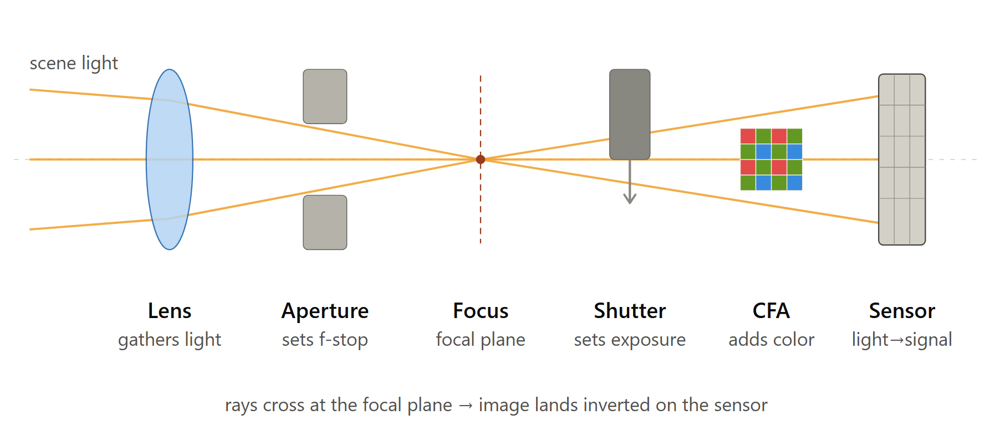
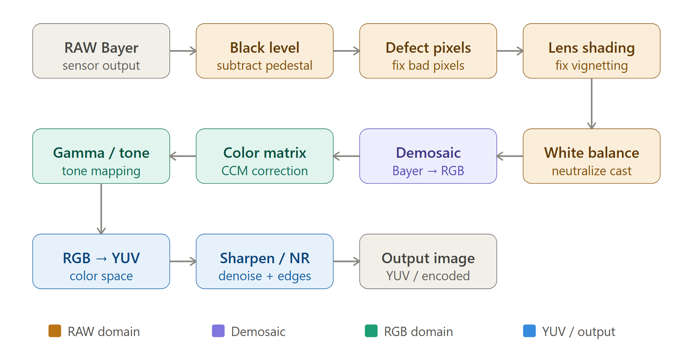
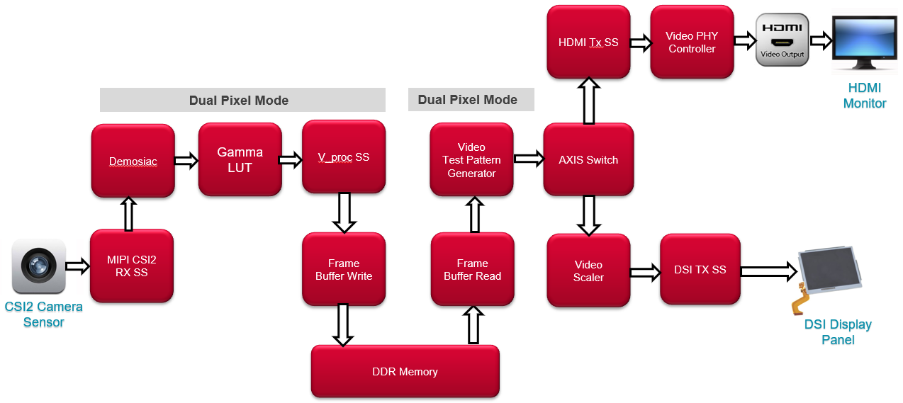
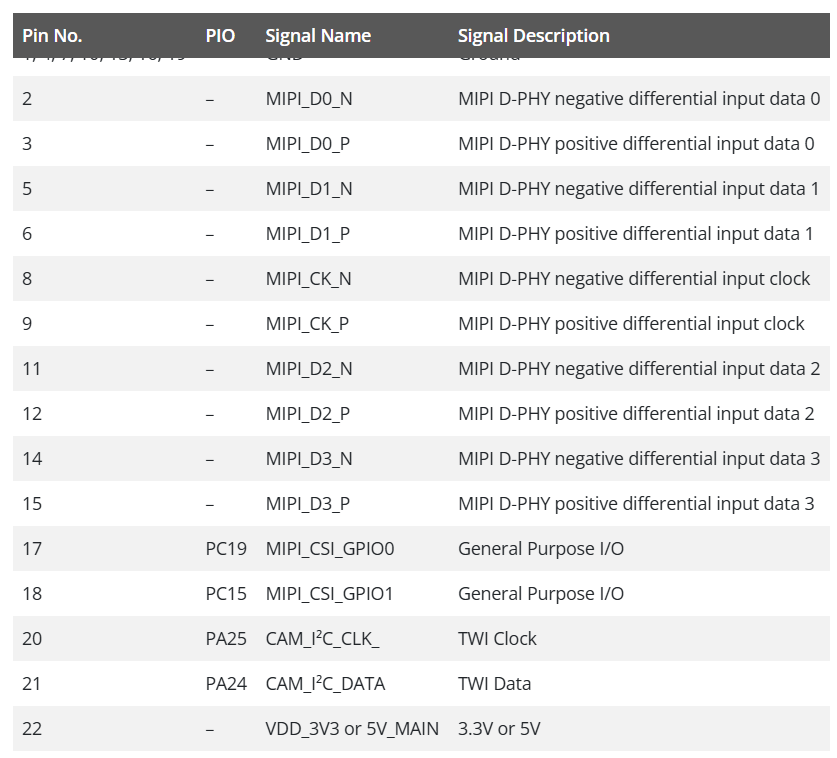
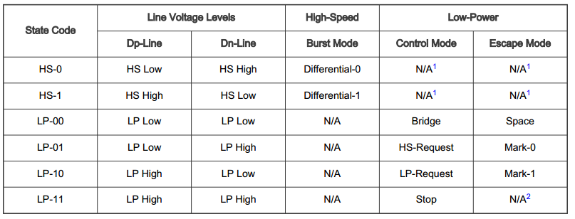
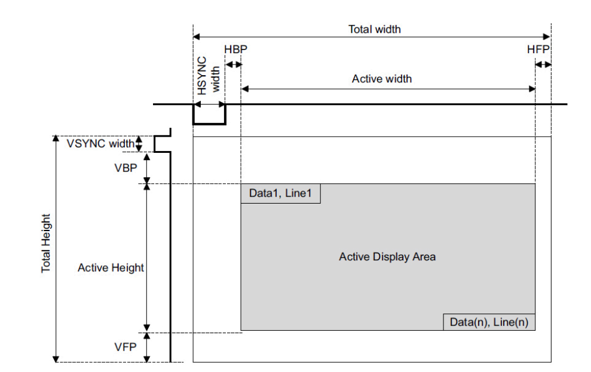
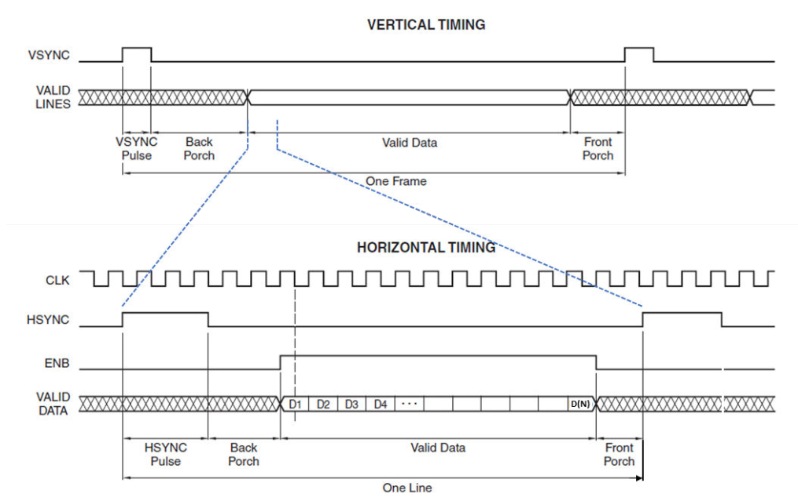

<h1 align="center">
 
  <br />
 CAMERA MIPI CSI-2
</h1>

<a href="https://github.com/veer-Singh?tab=followers">
  
</a>


---
## SUMMARY :

This post walks a camera module from front to back: what each part of the optical and
sensor stack does, how the ISP pipeline turns the sensor's RAW Bayer output into a
usable YUV image, and finally the **MIPI CSI-2** link that carries that data off the
sensor.

**Where MIPI CSI-2 sits in the pipeline.** It is the wire between the image *sensor*
and the *SoC* — the very last hop of the sensor side, right after the on-chip ADC and
just before the host's CSI-2 receiver feeds the ISP:

```
lens → aperture → shutter → CFA → pixel array → ADC → [ MIPI CSI-2 ] → SoC RX → ISP → YUV
```

In automotive the link is broken by a SerDes: sensor → CSI-2 → **GMSL2 / FPD-Link IV
serializer** → coax → deserializer → CSI-2 → SoC. The pixel data is one-way; sensor
configuration stays on a separate I2C/CCI bus.

**What it is.** A MIPI Alliance standard: a unidirectional, point-to-point,
packet-based serial interface running on the **D-PHY** physical layer — one clock lane
plus 1–4 data lanes, each a differential pair. Pixels are framed into packets with a
Data Type and Virtual Channel, header **ECC**, and payload **CRC**.

**Why it is required.** A parallel pixel bus does not scale — too many pins, tight
inter-line skew, and heavy EMI at speed. CSI-2 replaces it with a few differential
pairs at low voltage swing (~200 mV in high-speed mode), which keeps pin count,
power, and emissions low while allowing much higher clock rates.

**Advantages.**

- Far fewer wires; longer reach, especially over a SerDes bridge.
- Differential signalling → low EMI and good noise immunity.
- Built-in error handling (header ECC corrects 1 bit / detects 2; payload CRC).
- Multiple logical streams multiplexed on one link via Virtual Channels.
- Lane scaling — add data lanes to add bandwidth.
- Low-Power (LP) state lets lanes idle between bursts to save power.

**Speed.** D-PHY is DDR, so the data rate is 2× the lane clock. Roughly **1.5 Gbps
per lane** on D-PHY v1.2 (newer D-PHY revisions go higher), so a 4-lane link carries
about **10 Gbps** of payload — enough for multi-megapixel RAW10 / RAW12 video at
automotive frame rates. 

---

## Parts of the camera sensor



- **Lens**: Collects incoming light rays and bends them to focus a sharp image onto the focal plane.

  The **lens** is the light-gathering and image-forming element. Its whole job is to bend incoming rays so that light from each point in the scene converges to a corresponding point on the sensor. Without it, every pixel would see light from the entire scene at once and you'd get a uniform gray blur — the lens is what turns a wash of photons into a focused image. This is also where "focal length" belongs: it isn't a separate stage, it's a property of this same lens. Focal length sets how strongly the lens bends light, which fixes both the field of view (how wide a scene you capture) and where the focused image forms (the focal plane). So in the chain, "lens" and "focal length" are one physical element described two ways.

- **Aperture**: An adjustable iris opening that controls how much light passes through and affects the depth of field (background blur).

  The **aperture** is the adjustable opening (an iris of overlapping blades) that controls how much of the lens area light can pass through. It's there for two reasons. First, exposure: a wider opening lets in more light for dark scenes, a narrower one for bright scenes. Second, depth of field: a small aperture keeps more of the scene in focus front-to-back, a large one throws the background out of focus. The ratio of focal length to aperture diameter is the f-number (f/2.0 on the module in question).

  > **A note on focus and the focal plane.** The focal plane isn't really a component you add — it's the geometric plane where the converging rays actually meet and form a sharp image. Focusing the camera means moving the lens so that this plane lands exactly on the sensor surface. If the focal plane sits in front of or behind the sensor, the image is blurred. This is also where the rays cross and the image flips upside-down, which is why sensors read out an inverted image that the ISP later corrects.

- **Shutter**: A physical or electronic gate that opens and closes to let light hit the sensor for a specific duration of time (shutter speed).

  The **shutter** controls exposure *time* — how long light is allowed to accumulate on the sensor per frame. Here's the important correction for the IMX623: it has no mechanical shutter. It's an *electronic rolling shutter*, meaning exposure is controlled by resetting and reading out pixel rows in sequence rather than a physical blade opening and closing. That's why fast-moving objects or LED sources can show rolling-shutter artifacts, and it's also why LFM (LED flicker mitigation) matters so much on automotive sensors — the electronic shutter timing can otherwise beat against pulsed LED signage and traffic lights.

- **CFA (Color Filter Array)**: A mosaic of tiny color filters (usually Red, Green and Blue in a Bayer pattern) placed over the sensor so each pixel records only one primary color.

  The **CFA** is the Bayer mosaic bonded directly on top of the pixel array — and it's exactly the RGGB pattern from the sensor's spec line. Silicon photodiodes only count photons; they're colorblind. The CFA fixes that by placing a tiny red, green or blue filter over each pixel so each one records just one color channel. The 2×2 RGGB tile uses two greens because human vision (and luminance detail) is most sensitive to green. The downstream ISP then runs demosaicing to interpolate the two missing colors at every pixel and reconstruct a full-color image. On an RCCG variant the filter tile is different (clear pixels for sensitivity), so the debayer step changes.

- **Image Sensor**: A silicon chip (like CMOS) made of millions of light-sensitive photosites that convert light photons into electrical charges, creating the raw digital image.

  The **image sensor** is the final stage — the IMX623's photodiode array at the focal plane. Each pixel's photodiode converts incoming photons into electrical charge (the photoelectric effect), that charge is converted to a voltage, and the sensor's on-chip ADC digitizes it into the RAW values you receive. From here it's no longer optics — it's the MIPI CSI-2 stream going into the serializer, which is where GMSL2 bring-up work picks up: the sensor hands off digital RAW, the MAX96717 serializes it over coax, and the deserializer reconstructs it on the SoC side.

## Next step: the ISP pipeline



The pipeline splits into three domains, and that's the key mental model: everything before demosaic operates on single-channel Bayer pixels (RAW domain), demosaic is the transition, and everything after works on full RGB and then YUV.

### RAW domain

**Black level correction** is first because the sensor never reads true zero — even in total darkness there's a small offset (dark current plus a deliberate pedestal) sampled from the sensor's optical-black pixels. If you don't subtract it, your blacks come out gray and every later gain amplifies that error.

**Defective pixel correction** patches the handful of stuck-hot or dead pixels every silicon array has, by replacing them with a value interpolated from neighbors — do it now, on RAW, before demosaic spreads one bad pixel's error across a whole neighborhood.

**Lens shading correction** compensates for vignetting: the lens delivers less light to the corners than the center, and the CFA/microlens stack adds its own falloff, so the ISP multiplies each region by a calibrated gain map to flatten brightness (and color shading) across the frame.

**White balance** then applies per-channel gains (typically to the R and B pixels relative to G) so that something neutral in the scene reads as neutral, cancelling the color of the illuminant — daylight vs. tungsten vs. LED headlamps.

### Demosaic — the pivot

**Demosaic** is the pivot. Up to here every pixel knows only one color, per the RGGB tile. Demosaicing interpolates the two missing channels at every pixel from its neighbors, turning the single-channel mosaic into a full three-channel RGB image. This is the step that makes it an actual color image rather than a grayscale mosaic — and it's the most quality-sensitive stage, since bad interpolation produces zippering and false color along edges.

### RGB domain

The **color correction matrix (CCM)** is a 3×3 matrix that maps the sensor's native, somewhat-skewed spectral response into a standard color space (like sRGB/Rec.709), so colors look correct to a human or match what a perception stack expects. White balance made neutrals neutral; the CCM makes *all* the colors accurate.

**Gamma / tone mapping** then applies a non-linear curve: sensor data is linear in light, but displays and human vision are non-linear, so gamma encodes the data efficiently and lifts shadow detail. On an HDR automotive sensor like the IMX623 this is also where the wide split-pixel dynamic range gets tone-mapped down into a displayable range.

### YUV / output domain

**RGB → YUV** separates luminance (Y) from chrominance (U, V), which matters for two reasons: it matches how displays and video codecs work, and it lets you process brightness and color independently.

**Sharpen / noise reduction** exploits that split — you can denoise the noisy chroma channels aggressively while sharpening the luma channel for crisp edges, without the two interfering.

Then the **output** is a valid YUV image (often YUV422), ready to be encoded (H.264/JPEG) or handed to a display or a vision algorithm.

## THE INTERFACE: MIPI CSI-2 

MIPI CSI-2 is the standard interface for camera sensors to communicate with SoCs. It uses a high-speed serial protocol over differential pairs, allowing for efficient transmission of RAW image data from the sensor to the processor. The IMX623 outputs its RAW Bayer data through this interface, which is then serialized by the MAX96717 and sent over coaxial cables in automotive applications.
will understand the same with Camera IC - [LI-VENUS-IMX623-FP4-100H-R1](https://leopardimaging.com/product/automotive-cameras/cameras-by-interface/ti-ftplink-iv/li-venus-imx623-fp4/li-usb30-venus-imx623-fp4-100h-r1)
which is equipped with Sony diagonal 7.45 mm (Type 1/2.42) CMOS solid state
RGGB image sensor IMX623 and FPD Link IV serializer TI971

### Sensor IMX623
#### Basic camera pipeline 


#### PINOUT for MIPI CSI-2 interface


CSI-2 (Camera Serial Interface 2) is a MIPI Alliance standard for moving image data from a camera sensor to a host.
It's a unidirectional, point-to-point, packet-based interface.
Pixel data flows one way (sensor → receiver) at high speed; the sideband control of the sensor itself happens over a separate I2C/CCI bus, not over CSI-2.
pixels are framed into packets with type tags and error protection, and multiple logical streams can share one physical link.

### D_PHY ( CLK + LANES( 1/2/3/4) )
> **LINE :** Wire or trce between the host pin and peripheral pin <br>
> **LANE :** TWO Lines <br> 
> **LINK :** one clk lane + at least one data Lane


#### LAYERING of the CSI-2 interface
CSI-2 is defined as a stack, which matters because a bring-up problem almost always localizes to one layer:
* Physical layer (PHY) — D-PHY or C-PHY. The IMX623 uses D-PHY. This is where differential signaling, lane state machines, and timing live
  - D-PHY on the IMX623 is one clock lane plus 1, 2, or 4 data lanes, each lane being a differential pair. Two electrical modes coexist:
     - LP (Low-Power): single-ended, ~1.2 V, slow. Used for control states, lane turnaround, and entering/exiting high speed.
     - HS (High-Speed): differential, ~200 mV swing, DDR-clocked. Carries the actual packet bytes.
* Lane management / PPI — distributes bytes across lanes on TX and re-merges on RX (lane de-skew, byte alignment).
* Low-Level Protocol (LLP) — packet framing: start/end of transmission, packet headers, ECC, CRC.
* Pixel-to-byte packing — converts RAW10/RAW12/etc. pixels into byte streams and back.
* Application layer — the image/frame semantics the ISP consumes.

A burst looks like: lanes sit in LP-11 → LP-01 → LP-00 (HS-request/prepare sequence) → HS transmission → back to LP-11. The clock lane can 
run continuous (toggles even between bursts) or non-continuous (drops to LP between bursts to save power). This continuous-vs-non-continuous choice is a common bring-up mismatch between sensor and receiver — worth checking early against your serializer.

#### **Packet structure**

There are two packet types.
* Short packets carry synchronization events, no payload:
  - Frame Start (DT 0x00), Frame End (0x01), Line Start (0x02), Line End (0x03).

* Long packets carry pixel data:
  - Packet Header (PH, 4 bytes): Data Identifier (DI) + Word Count (16-bit) + ECC (8-bit).
  - Payload: the pixel bytes (length = Word Count).
  - Packet Footer (PF, 2 bytes): 16-bit checksum (CRC) over the payload.

The Data Identifier is one byte: the top 2 bits are the Virtual Channel and the bottom 6 bits are the Data Type. The ECC in the header protects the DI + Word Count — it can correct 1-bit and detect 2-bit errors in the header,
which is why a corrupted header often still gets flagged cleanly rather than desyncing the whole frame.


##### Modes of Operation
There are four modes of operation:

* Control
* High-Speed
* Escape
* Ultra-Low Power State (ULPS)

Data Lanes support all four modes, but Clock Lanes only support Control, High-Speed, and ULPS mode. During normal operation, a Data Lane is in Control or High-Speed mode. High-Speed data transmission happens in bursts and starts from and ends at a Stop state (usually referred to as an LP-11 state), which is in Control mode.
The Lane is only in High-Speed mode during data bursts.

##### I/O Signaling
The D-PHY IO pins have two different electrical modes of operation: single-ended and differential.

* The single-ended mode is referred to as Low Power(LP) mode. It is used during escape and control modes for system configuration/control between the host processor and the peripheral device. In LP mode, the IO circuits use a traditional CMOS output buffer (with slew rate control) that switches between ground and VDD_IO. In LP mode, the two IO circuits, which comprise a lane, can switch independently. They provide four different lane states: LP-00, LP-01, LP-10, and LP-11.
* The differential mode is referred to as the High-Speed (HS) mode. It is used only for data transfer. The differential mode only has two states: HS-0 and HS-1. During HS mode, the two IO circuits, which comprise a lane, are always in opposite output polarity. They can NEVER be logic high or low at the same time.

```
SDR( Single Data Rate ) :  The data is sampled on either the rising or the falling edge but not the both , so the data rate equal to the clock speed.

DDR( Dual Data rate) : Data can be sample on both the falling and rising edge hence the data rate is 2*clock speed .

Continuous clock : Clock Lane remains in high-speed mode generating active clock signals between HS data packet transmissions.

Non-Continuous Clock :  e Clock Lane enters the LP-11 state between HS data packet transmissions.

Continuous clock mode allows for higher data rates because the timing overhead of exiting and reentering HS mode on the clock lanes is eliminated


```




### FRAME TIMINGS : 


>**Active Image area** — the region of real, valid pixels that becomes your image; everything else is overhead.<br>
>**HSYNC** (horizontal sync) — a pulse marking the start of each new line.<br>
>**HBP** (horizontal back porch) — the idle gap after HSYNC and before the line's first active pixel.<br>
>**HFP** (horizontal front porch) — the idle gap after the line's last active pixel, before the next HSYNC.<br>
>**VSYNC** (vertical sync) — a pulse marking the start of each new frame.<br>
>**VBP** (vertical back porch) — the idle lines after VSYNC before the first active line.<br>
>**VFP** (vertical front porch) — the idle lines after the last active line, before the next VSYNC.



---

### Packet length per data format

The calculations : 
|Data format	|Bits per Pixel (bpp)|	Pixels per packet (min)|	Packet length (byte)|
|-------------|--------------------|-------------------------|----------------------|
|YUV420 8-bit (legacy)|	12	|2	|3|
|YUV420 8-bit	|12	|2	|2/4|
|YUV420 10-bit	|15	|4	|5/10|
|YUV422 8-bit	|16	|2	|4|
|YUV422 10-bit	|20	|2	|5|
|RGB888	|24	|1	|3
|RGB666	|18	|4	|9
|RGB565	|16	|1|2
|RGB555	|15	|1|	2
|RGB444	|12	|1	|2
|RAW6	|6	|4	|3
|RAW7	|7	|8	|7
|RAW8	|8	|1	|1
|RAW10	|10	|4	|5
|RAW12	|12	|2	|3
|RAW14	|14	|4	|7


Find the smallest number of pixels N such that N × bpp is divisible by 8:

$$
N = \frac{\operatorname{LCM}(bpp, 8)}{bpp}
$$

$$
\text{packet length} = \frac{N \times bpp}{8}
$$

###### Bandwith  : 

  ```Pixel Clock (Hz) = HTOT * VTOT * FPS```
  
  where :
 *  HTOT: Total line width = active pixels + horizontal blanking (pixels) (active pixels + HSYNC + HFP + HBP (pixels))
* VTOT: Total frame height = active lines + vertical blanking (lines)( active lines + VSYNC + VFP + VBP (lines))
* FPS: Frames per second

so ```Bandwidth  = Pixel Clock * Bits Per Pixel (bpp)```
<br>and<br>
 ```Data Rate Per Lane  = Bandwith / number of data lanes```

---

## Next page — colour formats & pixel metadata

The pixel data above can be carried in several **colour formats** (RAW / RGB /
YUV), each embedding different information and packed differently on the wire.
That, plus how per-frame **metadata (embedded data)** rides alongside the pixels,
is covered on the next page:

[**Camera colour formats &amp; pixel metadata →**](camera_colors.md)

---

## References
* [MIPI Transmissions](https://www.macnica.co.jp/en/business/semiconductor/articles/lattice/142604/)
* [Camera Sensor Basics](https://developer.ridgerun.com/wiki/index.php/Camera_Sensor_Basics)
