# Advanced FreeRTOS Debugging Questions

How to use this file: each card has a **Short answer**, an **Example** (with commented code where useful), an **Interview follow-up**, and a **Flow** diagram showing the debugging path. Cover the answer, explain it aloud, then check.

## Start here: the first five things to check

| Symptom | First checks |
| --- | --- |
| A task never runs | Creation result, priority, task state, what it is blocked on, scheduler started |
| System freezes | Task states, mutex owners, interrupt storm, HardFault, watchdog reason |
| Random crash | Stack watermarks, heap, fault registers (`CFSR`, `HFSR`), ISR misuse |
| Timing is wrong | Tick rate, `vTaskDelayUntil`, critical sections, higher-priority interference |
| Data is lost or corrupt | Queue item size, return values, DMA ownership, cache coherency |

Some cards overlap on purpose (for example Q1 and Q26, Q2 and Q33). Repeated topics come up in interviews from different angles.

---

## 1. A high-priority task never runs. How do you debug it?

**Short answer:** Check task creation, priority, state, stack health, scheduler startup, interrupts, and the object blocking the task.

**Example:**

```c
BaseType_t ok = xTaskCreate(task_fn, "hi", 512, NULL, 5, &handle);
configASSERT(ok == pdPASS);                 /* creation can fail if the heap is too small */
eTaskState st = eTaskGetState(handle);      /* Ready, Running, Blocked, Suspended, Deleted */
```

**Interview follow-up:** What if the task is ready but never scheduled? Check for an always-running higher-priority task.

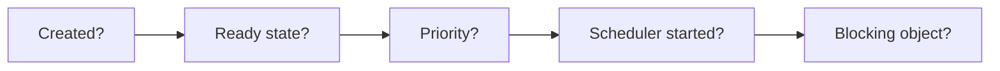

## 2. How do you prove priority inversion?

**Short answer:** Capture a timeline that shows a high-priority task blocked by a low-priority owner while medium-priority work runs.

**Example:** Trace mutex take, task switch, and mutex give timestamps.

**Interview follow-up:** What primitive normally mitigates it? A mutex with priority inheritance.

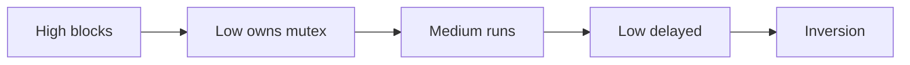

## 3. Sporadic deadlock: what is your method?

**Short answer:** Trace lock acquisition and release with task identity and timestamps, then reconstruct the wait-for graph.

**Example:** Log every mutex take and give with the current task name.

**Interview follow-up:** Why are random delays not a fix? They only change the timing.

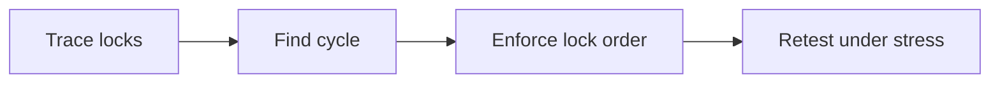

## 4. Queue full: bug or expected behaviour?

**Short answer:** It may be valid backpressure or a permanent producer-consumer rate mismatch. Define a documented policy.

**Example:** Drop the oldest telemetry sample when freshness matters more than completeness.

**Interview follow-up:** What policies are possible? Block, drop, overwrite, or escalate an error.

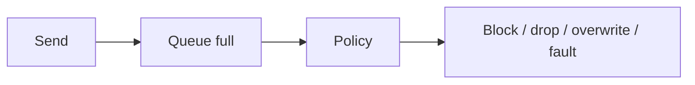

## 5. How do you detect stack overflow early?

**Short answer:** Enable RTOS checks, read `uxTaskGetStackHighWaterMark()`, use guard patterns, and test worst-case call paths.

**Example:** Logging and floating-point formatting reduce a task's remaining watermark.

```c
#define configCHECK_FOR_STACK_OVERFLOW 2       /* FreeRTOSConfig.h: pattern check on the stack */
UBaseType_t words_left = uxTaskGetStackHighWaterMark(NULL);   /* smallest free space ever seen */
```

**Interview follow-up:** Is the hook a complete solution? No. It detects a problem. Sizing and testing still matter.

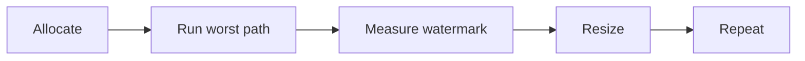

## 6. CPU load suddenly rises after a new feature. Why?

**Short answer:** Look for busy loops, logging, timer frequency, queue retries, interrupt storms, retransmissions, and tasks that stopped blocking.

**Example:** A zero-timeout queue receive inside `while (1)` creates a polling loop.

```c
while (1) {
    xQueueReceive(q, &item, 0);                 /* timeout 0: never blocks, so this spins at 100% CPU */
}
/* Fix: xQueueReceive(q, &item, portMAX_DELAY); blocks until data arrives */
```

**Interview follow-up:** What measurement helps? Per-task runtime statistics and event-rate counters.

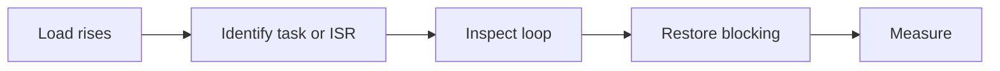

## 7. Why can logging itself cause bugs?

**Short answer:** Formatting is expensive, writes can block, buffers can overflow, and logging changes timing.

**Example:** `printf()` in a high-priority task delays a control task.

**Interview follow-up:** What is safer? Bounded asynchronous logging through RTT, DMA, or a logger task.

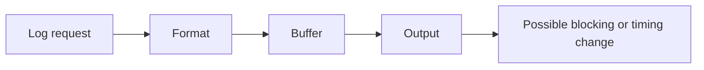

## 8. How do you debug a race condition?

**Short answer:** List every reader and writer, identify their execution contexts, capture the ordering, and fix ownership or synchronization.

**Example:** Two tasks update a shared state variable without a mutex.

**Interview follow-up:** Why not add a delay? It hides the ordering defect.

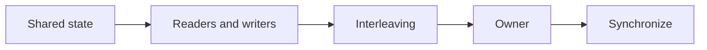

## 9. What should a Cortex-M fault dump contain?

**Short answer:** Fault registers and the stacked CPU context: PC, LR, SP, and xPSR.

**Example:**

```c
struct fault_dump {
    uint32_t cfsr, hfsr, bfar, mmfar;     /* which fault and the bad address */
    uint32_t r0, r1, r2, r3, r12, lr, pc, xpsr;   /* the stacked frame */
} __attribute__((section(".noinit")));    /* survives a reset so it can be read on next boot */
```

**Interview follow-up:** Why is PC important? It identifies the failing instruction.

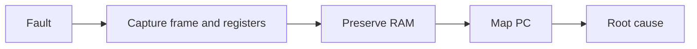

## 10. What is a good watchdog architecture?

**Short answer:** A supervisor refreshes the watchdog only after critical tasks report valid progress.

**Example:** Each task updates a heartbeat; the health task checks all heartbeats before feeding the watchdog.

**Interview follow-up:** Why not feed it from any idle loop? That can hide a stalled subsystem.

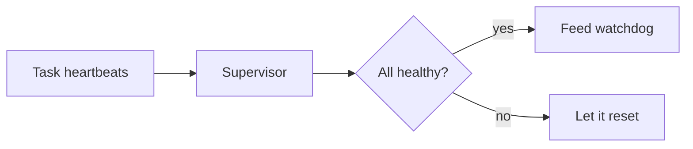

## 11. A task crashes only after long uptime. Where do you look?

**Short answer:** Leaks, heap fragmentation, growing queues, tick wraparound, timestamp rollover, and saturating counters.

**Example:** An object is allocated once per connection and never released.

**Interview follow-up:** What should be trended? Free heap, queue depth, object count, and uptime.

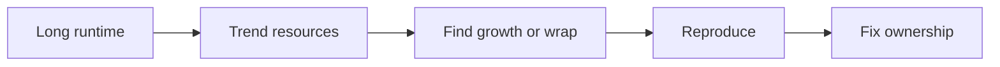

## 12. How do you debug a mutex that is never released?

**Short answer:** Find the owner, inspect its PC and stack, and look for early returns, task deletion, or faults before the give.

**Example:** An error branch returns before `xSemaphoreGive()`.

```c
xSemaphoreTake(m, portMAX_DELAY);
if (bad()) {
    return -1;                 /* BUG: returns while still holding the mutex */
}
xSemaphoreGive(m);
```

**Interview follow-up:** What design helps? A single cleanup path, or a bounded timeout with fault reporting.

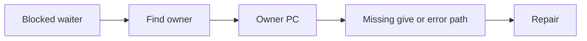

## 13. An interrupt fires but the task never wakes. Why?

**Short answer:** Verify the ISR-safe API, the wake flag, `portYIELD_FROM_ISR()`, and the permitted interrupt priority.

**Example:** `xSemaphoreGiveFromISR()` succeeds but no yield is requested.

```c
BaseType_t woken = pdFALSE;
xSemaphoreGiveFromISR(sem, &woken);
portYIELD_FROM_ISR(woken);          /* without this, the task waits until the next tick */
```

**Interview follow-up:** Can an ISR use a normal queue API? No. Use its `FromISR` variant.

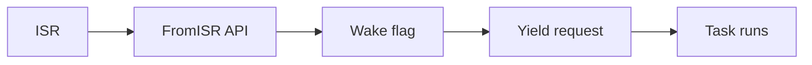

## 14. What is the difference between deadlock and livelock?

**Short answer:** Deadlocked tasks wait forever. Livelocked tasks keep running and changing state but make no useful progress.

**Example:** Two tasks repeatedly release and retry the same resource without blocking.

**Interview follow-up:** What metric separates them? Deadlock usually shows blocked tasks; livelock consumes CPU.

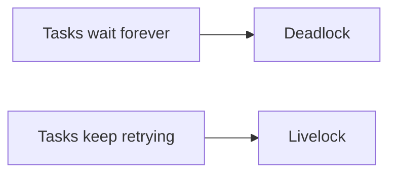

## 15. How do you distinguish starvation from a scheduling bug?

**Short answer:** Measure ready-to-run latency and per-task CPU time. A ready task that gets no CPU while higher-priority work dominates is starving.

**Example:** A priority-5 polling task prevents a priority-3 task from running.

**Interview follow-up:** What should you inspect? Ready lists, priorities, and whether the dominant task ever blocks.

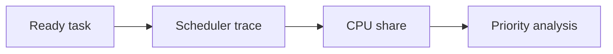

## 16. A queue works in testing but drops messages in the field. What changed?

**Short answer:** Field bursts may fill the queue. Check producer rate, consumer rate, queue depth, priorities, and unchecked return values.

**Example:** A network burst fills a queue whose send result is ignored.

**Interview follow-up:** Is a larger queue always the fix? No. A sustained rate mismatch remains.

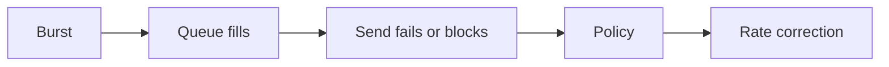

## 17. How do you debug priority inversion when no mutex is involved?

**Short answer:** Trace indirect resource ownership through queues, notifications, shared hardware, and driver tasks.

**Example:** A high-priority task waits for a low-priority SPI owner through a queue.

**Interview follow-up:** What must the trace include? The whole resource-owner chain, not only locks.

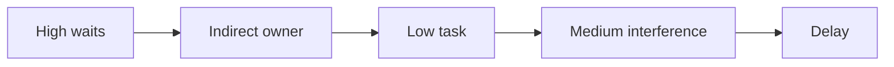

## 18. Why does adding a delay sometimes fix a bug?

**Short answer:** A delay changes the timing and hides a race or a missing memory-ordering rule.

**Example:** A producer happens to finish before a consumer reads a buffer.

**Interview follow-up:** What is the correct response? Find and encode the required synchronization.

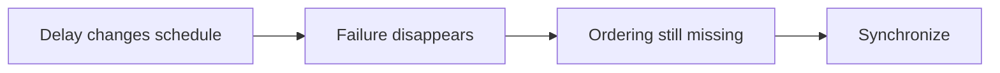

## 19. How do you diagnose a HardFault with no usable stack?

**Short answer:** Work out whether MSP or PSP was active, save the fault registers immediately, and keep the handler independent of the damaged stack.

**Example:** A corrupted task stack prevents a normal debugger backtrace.

```c
__attribute__((naked)) void HardFault_Handler(void)
{
    __asm volatile(
        "tst lr, #4      \n"      /* bit 2 of EXC_RETURN: 0 = MSP was used, 1 = PSP was used */
        "ite eq          \n"
        "mrseq r0, msp   \n"      /* r0 = pointer to the stacked frame */
        "mrsne r0, psp   \n"
        "b hardfault_c   \n");    /* C function copies the frame to a reserved RAM buffer */
}
```

**Interview follow-up:** What else helps? A handler that copies the exception frame to a reserved RAM buffer.

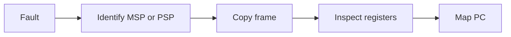

## 20. How do you find which task corrupted memory?

**Short answer:** MPU protection, guard words, canaries, ownership records, and write tracing.

**Example:** A canary after a DMA buffer changes before the task reports failure.

**Interview follow-up:** Why locate the writer? The damaged object is often only the victim.

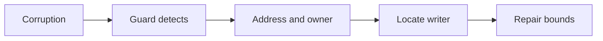

## 21. What causes a task to report ready but never execute?

**Short answer:** An always-runnable higher-priority task may monopolize the CPU. Confirm scheduler state and ready lists.

**Example:** A task loops without `vTaskDelay()`, a queue receive, or a notification wait.

**Interview follow-up:** What is the simplest remedy? Make the task block or yield.

```mermaid
flowchart LR
    A["Ready"] --> B["Higher task runs"] --> C["No block"] --> D["Starvation"] --> E["Redesign loop"]
```

## 22. How do you debug spurious semaphore wakeups?

**Short answer:** Check for duplicate ISR gives, binary-semaphore event collapse, and whether a counting semaphore is needed.

**Example:** Two interrupts occur before one task take; a binary semaphore records only "available".

**Interview follow-up:** What should be logged? Give and take source, timestamp, and semaphore count where available.

```mermaid
flowchart LR
    A["Event"] --> B["Give"] --> C["Count or availability"] --> D["Take"] --> E["Verify event semantics"]
```

## 23. A periodic task drifts over time. What is wrong?

**Short answer:** Relative delays include the execution time. Use `vTaskDelayUntil()` with an absolute reference.

**Example:** A 1000-tick delay after a 100-tick operation gives a 1100-tick cycle.

**Interview follow-up:** What remains? Tick rounding and higher-priority interference still affect jitter.

```mermaid
flowchart LR
    A["Release"] --> B["Execute"] --> C["Absolute deadline"] --> D["delay-until"] --> E["Next release"]
```

## 24. How do you trace timing without a full debugger?

**Short answer:** GPIO timing, DWT cycle counters, trace hooks, runtime statistics, or a logic analyzer.

**Example:** Toggle a GPIO at task entry and exit and measure the pulse width.

```c
void control_task(void *arg)
{
    for (;;) {
        GPIO_SET(DEBUG_PIN);        /* pin goes high when the work starts */
        control_step();
        GPIO_CLEAR(DEBUG_PIN);      /* pin goes low when it ends: pulse width = execution time */
        vTaskDelay(1);
    }
}
```

**Interview follow-up:** What risk exists? Instrumentation can disturb timing, so keep it bounded.

```mermaid
flowchart LR
    A["Instrument"] --> B["Capture"] --> C["Measure latency and execution"] --> D["Compare with deadline"]
```

## 25. What is the most common root cause of RTOS timing bugs?

**Short answer:** Unsynchronized shared state, and code that holds the CPU longer than expected (logging, long critical sections).

**Example:** A driver disables interrupts while performing a large copy.

**Interview follow-up:** What is the design rule? Bound critical sections and define ownership.

```mermaid
flowchart LR
    A["Shared resource"] --> B["Contention or blocking"] --> C["Timing variance"] --> D["Measure"] --> E["Bound"]
```

## 26. A task is created successfully but never runs

**Short answer:** Check the `xTaskCreate()` return value, scheduler startup, priority, task state, immediate blocking, stack validity, and deletion.

**Example:** A task starts with `xQueueReceive(..., portMAX_DELAY)` and correctly stays blocked until data arrives.

**Interview follow-up:** What proves creation? The API return value plus a task-state snapshot.

```mermaid
flowchart LR
    A["Create"] --> B["Scheduler start"] --> C["State"] --> D["Wait object"] --> E["Execution"]
```

## 27. A task runs once and then stops

**Short answer:** Add checkpoints around work, delay, and blocking calls. Check faults, stack overflow, blocked resources, disabled interrupts, and scheduler failure.

**Example:** Logging prints once, then `read_sensor()` blocks forever.

**Interview follow-up:** What does the last checkpoint tell you? The last completed region narrows the fault.

```mermaid
flowchart LR
    A["Start"] --> B["Work"] --> C["Checkpoint"] --> D["Block or fault"] --> E["Inspect last checkpoint"]
```

## 28. One high-priority task prevents all other tasks from running

**Short answer:** An always-runnable task starves lower-priority tasks. Make it block, yield, or wait for an event.

**Example:**

```c
/* BAD: never blocks, so every lower-priority task starves */
while (1) {
    do_work();
}

/* GOOD: blocks each iteration, letting lower priorities run */
while (1) {
    do_work();
    vTaskDelay(pdMS_TO_TICKS(1));      /* or wait on a queue, semaphore, or notification */
}
```

**Interview follow-up:** Does time slicing solve different priorities? No. Time slicing mainly affects equal-priority tasks.

```mermaid
flowchart LR
    A["High task ready"] --> B["Scheduler selects it"] --> C["No block"] --> D["Lower tasks starve"]
```

## 29. CPU usage is 100%

**Short answer:** Use `uxTaskGetSystemState()` or runtime statistics to find the consumer, then replace polling loops with blocking calls.

**Example:** Replace an empty loop with `ulTaskNotifyTake(pdTRUE, portMAX_DELAY)`.

**Interview follow-up:** What else can consume CPU? Interrupt storms and retry loops.

```mermaid
flowchart LR
    A["100% load"] --> B["Runtime stats"] --> C["Identify source"] --> D["Block or limit"] --> E["Remeasure"]
```

## 30. A task is stuck in the Blocked state

**Short answer:** Blocked is often correct. Identify the queue, semaphore, mutex, notification, delay, or event group it waits on.

**Example:** `xQueueReceive(queue, &data, portMAX_DELAY)` intentionally blocks until data arrives.

**Interview follow-up:** When is it suspicious? When the awaited producer or timeout can never happen.

```mermaid
flowchart LR
    A["Blocked"] --> B["Wait object"] --> C["Producer or event"] --> D["Wake or timeout"]
```

## 31. A task is permanently blocked on a mutex

**Short answer:** Find the mutex owner and check that every successful take has a matching give, including error paths.

**Example:**

```c
if (xSemaphoreTake(mutex, timeout) == pdTRUE) {
    critical_operation();
    xSemaphoreGive(mutex);              /* every path out of the block must give it back */
}
```

**Interview follow-up:** What can recover it? A bounded timeout and fault report, not an arbitrary delay.

```mermaid
flowchart LR
    A["Waiter"] --> B["Mutex owner"] --> C["Owner PC"] --> D["Missing give"] --> E["Repair cleanup path"]
```

## 32. Deadlock occurs between two tasks

**Short answer:** If Task A takes Mutex A then B while Task B takes B then A, both can wait forever. Use one global lock order.

**Example:**

```text
Task A -> Mutex A -> Mutex B
Task B -> Mutex B -> Mutex A       (opposite order: deadlock possible)
```

**Interview follow-up:** What is the prevention rule? Always acquire multiple locks in the same order.

```mermaid
flowchart LR
    A["Lock A"] --> B["Lock B"] --> C["Work"] --> D["Unlock B"] --> E["Unlock A"]
```

## 33. What is priority inversion?

**Short answer:** A low-priority task holds a mutex needed by a high-priority task while medium-priority work runs. A mutex can temporarily raise the owner's priority.

**Example:** High waits for Low, while Medium preempts Low.

**Interview follow-up:** Why not a binary semaphore? It does not express ownership or priority inheritance.

```mermaid
flowchart LR
    A["Low owns"] --> B["High waits"] --> C["Inheritance"] --> D["Low releases"] --> E["Priority restored"]
```

## 34. A mutex is released but the high-priority task does not run

**Short answer:** Check preemption, interrupt context, scheduler suspension, critical sections, interrupt priority, and context-switch requests.

**Example:**

```c
/* Mutexes cannot be given from an ISR. Use a binary semaphore for ISR-to-task signalling. */
BaseType_t woken = pdFALSE;
xSemaphoreGiveFromISR(event_sem, &woken);     /* event_sem is a binary semaphore, NOT a mutex */
portYIELD_FROM_ISR(woken);                    /* request a switch if a higher-priority task woke */

/* In a task, a mutex give is normal and can trigger a switch on its own: */
xSemaphoreGive(bus_mutex);
```

**Interview follow-up:** What is the ISR rule? Use the ISR-safe API and request a switch when indicated. Mutexes are for tasks only.

```mermaid
flowchart LR
    A["Give"] --> B["Waiter ready"] --> C["Yield requested"] --> D["Scheduler"] --> E["High task runs"]
```

## 35. Queue data is never received

**Short answer:** Verify the queue handle, item size, creation result, producer and consumer execution, return values, capacity, and ISR API usage.

**Example:**

```c
BaseType_t result = xQueueSend(queue, &data, 100);   /* wait up to 100 ticks for space */
if (result != pdPASS) {
    /* the queue was full for the whole timeout: handle it, do not ignore it */
}
```

**Interview follow-up:** What should never be ignored? Queue send and receive return values.

```mermaid
flowchart LR
    A["Producer"] --> B["Send result"] --> C["Queue state"] --> D["Consumer"] --> E["Receive result"]
```

## 36. Queue values are corrupted

**Short answer:** The queue item size must match the object sent. A queue created for `sizeof(uint32_t)` must not copy from a one-byte object.

**Example:** `xQueueCreate(10, sizeof(uint32_t))` requires a 32-bit item at send time.

```c
uint8_t small = 5;
xQueueSend(q, &small, 0);      /* BUG: copies 4 bytes from a 1-byte object, reading garbage */
```

**Interview follow-up:** What other issue matters? Pointer queues need lifetime and ownership rules.

```mermaid
flowchart LR
    A["Create with item size"] --> B["Send object"] --> C["Copy bytes"] --> D["Receive matching type"]
```

## 37. An ISR occasionally crashes the system

**Short answer:** Normal task APIs must not be called from an ISR. Use `xQueueSendFromISR()`, `xSemaphoreGiveFromISR()`, or the matching ISR-safe API.

**Example:**

```c
void USART_IRQHandler(void)
{
    BaseType_t woken = pdFALSE;                         /* must be declared and initialized */
    uint8_t data = (uint8_t)USART->RDR;
    xQueueSendFromISR(queue, &data, &woken);            /* ISR-safe version */
    portYIELD_FROM_ISR(woken);
}
```

**Interview follow-up:** What else must be checked? Interrupt priority and bounded ISR work.

```mermaid
flowchart LR
    A["Interrupt"] --> B["Capture minimal data"] --> C["FromISR API"] --> D["Optional yield"] --> E["Task"]
```

## 38. ISR priority causes a FreeRTOS assertion

**Short answer:** An ISR that calls FreeRTOS must use a priority the port allows. Check `configMAX_SYSCALL_INTERRUPT_PRIORITY`.

**Example:** An interrupt above the threshold calls `xQueueSendFromISR()` and triggers `configASSERT()`.

**Interview follow-up:** Which ISRs may avoid the restriction? ISRs that never call FreeRTOS APIs.

```mermaid
flowchart LR
    A["ISR priority"] --> B["API permission"] --> C["Assert or valid call"] --> D["Task wake"]
```

## 39. The system randomly HardFaults after hours

**Short answer:** Check stack overflow, heap failure, memory corruption, ISR misuse, buffer bounds, DMA ownership, and the fault registers.

**Example:** Inspect `SCB->CFSR`, `SCB->HFSR`, `SCB->BFAR`, and `SCB->MMFAR`.

**Interview follow-up:** What trend helps? Heap low-water marks and task stack watermarks over uptime.

```mermaid
flowchart LR
    A["Fault"] --> B["Capture registers"] --> C["Classify cause"] --> D["Reproduce"] --> E["Fix ownership or bounds"]
```

## 40. How do you debug a HardFault in FreeRTOS?

**Short answer:** Determine thread or handler mode, inspect the stacked registers, and map the stacked PC to the ELF or map file.

**Example:** The stacked frame order is:

```text
R0 R1 R2 R3 R12 LR PC xPSR
```

**Interview follow-up:** Which register is the first target? PC, then CFSR and HFSR.

```mermaid
flowchart LR
    A["Fault"] --> B["Exception frame"] --> C["PC"] --> D["Symbol map"] --> E["Failing instruction"]
```

## 41. A feature triggers a task stack overflow

**Short answer:** Logging, floating-point formatting, `sprintf()`, and large local arrays consume a lot of stack.

**Example:** Read `uxTaskGetStackHighWaterMark()` before and during logging.

**Interview follow-up:** What is safer? Bounded formatting and a dedicated logger task.

```mermaid
flowchart LR
    A["Feature"] --> B["Call depth and locals"] --> C["Watermark"] --> D["Resize or redesign"]
```

## 42. Why does `printf()` cause an RTOS timing problem?

**Short answer:** It can be slow, take locks, use a lot of stack, block on the UART, or change interrupt timing.

**Example:** `printf("Temperature = %f\n", temperature);` in a high-priority task delays control work.

**Interview follow-up:** Which alternatives help? ITM, RTT, UART DMA, or asynchronous logging.

```mermaid
flowchart LR
    A["Format"] --> B["Lock and output"] --> C["Block"] --> D["Priority interference"] --> E["Timing fault"]
```

## 43. The tick interrupt stops working

**Short answer:** Check SysTick, interrupt enable and priority, the tick handler, global interrupt state, tickless idle, clock configuration, and the RTOS port.

**Example:** Toggle a GPIO from the tick handler and measure its frequency.

**Interview follow-up:** What symptoms result? Delays, timeouts, and software timers stop progressing.

```mermaid
flowchart LR
    A["Clock"] --> B["Tick interrupt"] --> C["Kernel tick"] --> D["Timers and delays"] --> E["Task wake"]
```

## 44. `vTaskDelay(100)` gives inaccurate timing

**Short answer:** It delays about 100 **ticks**, not necessarily 100 ms. With a 1000 Hz tick, one tick is about 1 ms, plus scheduling latency.

**Example:** A higher-priority task adds latency after the delay expires.

```c
vTaskDelay(pdMS_TO_TICKS(100));      /* convert milliseconds to ticks: correct at any tick rate */
```

**Interview follow-up:** What improves periodic accuracy? `vTaskDelayUntil()`.

```mermaid
flowchart LR
    A["Delay ticks"] --> B["Tick expires"] --> C["Scheduler latency"] --> D["Task resumes"]
```

## 45. A periodic task slowly drifts over time

**Short answer:** Use `vTaskDelayUntil()` instead of repeatedly adding a relative delay.

**Example:**

```c
TickType_t last_wake_time = xTaskGetTickCount();     /* reference point */
while (1) {
    operation();
    vTaskDelayUntil(&last_wake_time, pdMS_TO_TICKS(1000));   /* wake at last+1000, last+2000, ... */
}
```

**Interview follow-up:** What remains? Tick rounding and higher-priority interference still cause jitter.

```mermaid
flowchart LR
    A["Absolute release"] --> B["Operation"] --> C["delay-until"] --> D["Next absolute release"]
```

## 46. A task misses its deadline even though CPU usage is low

**Short answer:** Measure release-to-completion time and include interrupt latency, blocking, mutex contention, critical sections, DMA delays, and higher-priority bursts.

**Example:** Low average CPU use hides a short high-priority burst at every deadline.

**Interview follow-up:** What should be measured? Worst-case response time, not average load.

```mermaid
flowchart LR
    A["Release"] --> B["Interference and blocking"] --> C["Execute"] --> D["Complete"] --> E["Compare with deadline"]
```

## 47. `vTaskDelay()` misbehaves inside a critical section

**Short answer:** A task must not block inside a critical section. Protect the data, exit the critical section, then delay.

**Example:**

```c
taskENTER_CRITICAL();
update_state();                          /* short, bounded work only */
taskEXIT_CRITICAL();
vTaskDelay(pdMS_TO_TICKS(100));          /* blocking is safe only AFTER leaving the critical section */
```

**Interview follow-up:** Why? Blocking while interrupts or scheduling are constrained can stop system progress.

```mermaid
flowchart LR
    A["Enter critical"] --> B["Protect"] --> C["Exit"] --> D["Block or delay"]
```

## 48. Why does disabling interrupts cause RTOS instability?

**Short answer:** Long interrupt-disabled regions delay SysTick, UART, and DMA interrupts, causing inaccurate timeouts and late task wakeups.

**Example:** Keep `__disable_irq()` around only a few atomic instructions, never a long transfer.

**Interview follow-up:** What is the design rule? Bound interrupt latency.

```mermaid
flowchart LR
    A["Disable IRQ"] --> B["Tick and ISR delayed"] --> C["Latency grows"] --> D["Re-enable"] --> E["Recovery"]
```

## 49. `taskENTER_CRITICAL()` versus a mutex

**Short answer:** A mutex can block and gives priority inheritance. A critical section is for very short atomic operations and adds interrupt latency.

**Example:** Use a mutex for a shared peripheral; use a critical section for a short index update.

**Interview follow-up:** Can a critical section replace every mutex? No, especially not for long or blocking work.

```mermaid
flowchart LR
    A["Shared resource"] --> B["Choose mutex or critical section"] --> C["Bound duration"] --> D["Verify latency"]
```

## 50. A queue works for 10 minutes and then stops

**Short answer:** Check queue occupancy, producer and consumer rates, blocked tasks, memory corruption, stack overflow, ISR overload, and priority starvation.

**Example:**

```c
UBaseType_t waiting   = uxQueueMessagesWaiting(queue);   /* items currently queued */
UBaseType_t available = uxQueueSpacesAvailable(queue);   /* free slots; 0 means full */
```

**Interview follow-up:** What does a permanently full queue indicate? The producer outpaces the consumer, or the consumer is stalled.

```mermaid
flowchart LR
    A["Queue works"] --> B["Occupancy grows"] --> C["Full"] --> D["Send policy"] --> E["Rate or consumer fix"]
```

## 51. Binary semaphore versus mutex: a debugging scenario

**Short answer:** Use a mutex for shared-resource ownership and priority inheritance. Use a binary semaphore for signalling.

**Example:** Protect a shared UART with a mutex; signal UART completion with a binary semaphore.

**Interview follow-up:** Why are they not interchangeable? Ownership and priority-inheritance semantics differ.

```mermaid
flowchart LR
    A["Resource ownership"] --> M["Mutex"]
    B["Completion event"] --> S["Binary semaphore"]
```

## 52. A semaphore is always available even though nobody gives it

**Short answer:** Check the handle, initialization, startup gives, object corruption, unexpected ISR gives, and every give and take call.

**Example:** Log `xSemaphoreGive()` and `xSemaphoreTake()` with task names and timestamps.

**Interview follow-up:** What can a binary semaphore hide? Multiple events collapse into one "available" state.

```mermaid
flowchart LR
    A["Give and take trace"] --> B["Identify source"] --> C["Verify initialization"] --> D["Repair ownership"]
```

## 53. Event group bits appear to be randomly cleared

**Short answer:** With `xEventGroupWaitBits()`, passing `pdTRUE` for `xClearOnExit` clears the matched bits after a successful wait.

**Example:**

```c
xEventGroupWaitBits(group, BIT_A | BIT_B,
                    pdTRUE,      /* xClearOnExit: clear the bits when the wait succeeds */
                    pdTRUE,      /* xWaitForAllBits: wait for BOTH bits */
                    portMAX_DELAY);
```

**Interview follow-up:** How do multiple consumers affect this? One consumer may clear bits before another observes them.

```mermaid
flowchart LR
    A["Set bits"] --> B["Wait condition"] --> C{"Clear on exit?"} --> D["Consumer observes state"]
```

## 54. Why is a task notification faster than a queue?

**Short answer:** Notifications live in the task control block and avoid general queue storage for simple signalling.

**Example:** A DMA ISR calls `vTaskNotifyGiveFromISR()` and the task calls `ulTaskNotifyTake()`.

**Interview follow-up:** When is a queue better? When payload buffering or multiple destinations are required.

```mermaid
flowchart LR
    A["ISR"] --> B["Task notification"] --> C["Task wakes"] --> D["Consume event"]
```

## 55. A DMA task receives corrupted data

**Short answer:** Check buffer lifetime, cache coherency, and ownership. Synchronize DMA completion, ISR notification, and task processing.

**Example:** Do not process a buffer while DMA is still writing it, and invalidate the cache where required.

**Interview follow-up:** What is the ownership rule? Exactly one context writes a buffer at a time.

```mermaid
flowchart LR
    A["DMA owns"] --> B["Transfer complete"] --> C["ISR"] --> D["Task owns"] --> E["Process"] --> F["Release"]
```

## 56. A task crashes when it is deleted

**Short answer:** Before `vTaskDelete()`, check held mutexes, owned memory, active DMA, peripheral state, callbacks, and dependent tasks.

**Example:** Stop DMA and release the peripheral before deleting its worker task.

**Interview follow-up:** Is deletion cleanup? No. Resources need explicit ownership and release.

```mermaid
flowchart LR
    A["Stop work"] --> B["Release resources"] --> C["Notify dependents"] --> D["Delete task"]
```

## 57. The FreeRTOS heap becomes fragmented

**Short answer:** Repeated allocate and free fragments the heap. Identify the selected heap implementation and prefer bounded allocation.

**Example:** Allocate fixed-size message blocks from a pool instead of varying heap sizes.

**Interview follow-up:** What should be monitored? Minimum free heap, allocation failures, and allocation lifetime.

```mermaid
flowchart LR
    A["Allocate and free cycles"] --> B["Fragmentation"] --> C["Allocation failure"] --> D["Pool or static storage"]
```

## 58. `malloc()` versus `pvPortMalloc()`

**Short answer:** Do not mix C-library allocation with FreeRTOS allocation unless the platform explicitly supports it.

**Example:** Use one allocator for task objects and define who releases every allocation.

**Interview follow-up:** Why does mixing fail? The allocators may use different heaps and free-list metadata.

```mermaid
flowchart LR
    A["Choose allocator"] --> B["Allocate"] --> C["Own"] --> D["Release with the same allocator"]
```

## 59. The idle task never runs

**Short answer:** Possible causes are CPU overload, an always-runnable high-priority task, an interrupt storm, or scheduler configuration. The idle task also frees deleted tasks.

**Example:** A polling task with no blocking call prevents idle processing.

**Interview follow-up:** What measurement helps? Idle time or idle-hook counters.

```mermaid
flowchart LR
    A["No idle"] --> B["Find ready task or ISR"] --> C["Restore blocking"] --> D["Verify idle time"]
```

## 60. A timer callback blocks the system

**Short answer:** Timer callbacks run in the timer service task and must stay short. Send an event to a worker task for long operations.

**Example:**

```c
void TimerCallback(TimerHandle_t timer)
{
    xTaskNotifyGive(worker_task);       /* hand the work off; return immediately */
}
```

**Interview follow-up:** Why not call `vTaskDelay()` there? It blocks every other timer callback.

```mermaid
flowchart LR
    A["Timer callback"] --> B["Notify worker"] --> C["Worker works or blocks"] --> D["Timer service stays free"]
```

## 61. A software timer does not execute on time

**Short answer:** Check the timer service task priority, queue length, callback duration, scheduler load, interrupt latency, tick frequency, and timer-command congestion.

**Example:** A long callback delays every callback behind it in the timer service task.

**Interview follow-up:** Which configuration matters? `configTIMER_TASK_PRIORITY`, queue length, and stack depth.

```mermaid
flowchart LR
    A["Timer command"] --> B["Timer queue"] --> C["Service task"] --> D["Callback"] --> E["Next timer"]
```

## 62. `xQueueSendFromISR()` sometimes fails

**Short answer:** The queue is often full. Keep an overflow counter in the ISR, and read `uxQueueSpacesAvailable()` from a task, rather than doing expensive diagnostics in the ISR.

**Example:**

```c
if (xQueueSendFromISR(q, &evt, &woken) != pdTRUE) {
    queue_overflow_count++;            /* cheap: one increment, inspect it later from a task */
}
```

**Interview follow-up:** What policy is needed? Drop, overwrite, defer, or signal overload. (Note: never call the plain `xQueueSend()` from an ISR.)

```mermaid
flowchart LR
    A["ISR event"] --> B["Send"] --> C{"Queue full?"}
    C -->|yes| D["Count, drop, or defer"]
    C -->|no| E["Consumer"]
```

## 63. A race condition disappears when the debugger is attached

**Short answer:** The debugger changes timing. Investigate synchronization, initialization, stack corruption, DMA ownership, and timing-sensitive ISRs.

**Example:** A breakpoint gives a producer time to finish before a consumer reads.

**Interview follow-up:** What is the correct conclusion? The bug is hidden, not fixed.

```mermaid
flowchart LR
    A["Debugger changes timing"] --> B["Race hidden"] --> C["Trace ordering"] --> D["Synchronize"]
```

## 64. A variable changes in an ISR but the task does not see it

**Short answer:** `volatile` can stop compiler caching, but it does not synchronize. Prefer a task notification, semaphore, queue, or event group.

**Example:** Replace a polling flag with `vTaskNotifyGiveFromISR()`.

**Interview follow-up:** What can `volatile` not guarantee? Atomicity, mutual exclusion, and memory ordering across all agents.

```mermaid
flowchart LR
    A["ISR event"] --> B["ISR-safe signal"] --> C["Task wakes"] --> D["Task reads shared state"]
```

## 65. Why does `volatile` not solve a race condition?

**Short answer:** An increment is a read-modify-write sequence. Two tasks can read the same value and overwrite each other's update.

**Example:**

```c
volatile uint32_t counter;
counter++;            /* load, add, store: another task can run between the load and the store */
/* Fix: protect with a mutex, a critical section, or use an atomic operation. */
```

**Interview follow-up:** What does `volatile` provide? Visibility of accesses to the compiler, not synchronization.

```mermaid
flowchart LR
    A["Read"] --> B["Modify"] --> C["Write"] --> D["Interleave"] --> E["Lost update"]
```

## 66. A context switch happens unexpectedly

**Short answer:** Common causes: a tick, a higher-priority task becoming ready, an ISR unblocking a task, a semaphore release, a queue event, or a notification.

**Example:** Inspect PendSV and the ready list when execution moves from Task A to Task B.

**Interview follow-up:** Is every unexpected switch a bug? No. It may be normal scheduler behaviour.

```mermaid
flowchart LR
    A["Event"] --> B["Task ready"] --> C["PendSV or tick"] --> D["Scheduler"] --> E["New task"]
```

## 67. Why does PendSV have the lowest priority?

**Short answer:** It performs the context switch only after all higher-priority interrupts finish, keeping interrupt latency predictable.

**Example:** An ISR sets an event; PendSV switches tasks after the ISR exits.

**Interview follow-up:** What should not run in the ISR? Long application work.

```mermaid
flowchart LR
    A["High-priority ISR"] --> B["Event"] --> C["PendSV pending"] --> D["ISR exits"] --> E["Switch"]
```

## 68. The system crashes only when optimization is enabled

**Short answer:** Investigate undefined behaviour, uninitialized variables, invalid pointers, races, buffer overflows, stack corruption, and strict-aliasing violations.

**Example:** Compare `-O0`, `-O1`, and `-O2` while checking warnings and fault registers.

**Interview follow-up:** Should optimization be disabled permanently? No. Find the underlying defect.

```mermaid
flowchart LR
    A["Optimization change"] --> B["Behaviour changes"] --> C["Identify UB or race"] --> D["Fix defect"]
```

## 69. Task stack usage keeps increasing

**Short answer:** `uxTaskGetStackHighWaterMark()` reports the **minimum remaining** stack, not current usage. A small value means danger.

**Example:** A logger's watermark falls after formatted floating-point output.

**Interview follow-up:** What should be tested? Worst-case call depth, locals, interrupts, and library paths.

```mermaid
flowchart LR
    A["Feature path"] --> B["Stack watermark"] --> C["Margin"] --> D["Resize or redesign"]
```

## 70. How do you debug a complete FreeRTOS deadlock?

**Short answer:** Identify stalled tasks, capture states and wait objects, find owners, check lock ordering and priority inversion, inspect scheduler and interrupt state, and check for memory corruption.

**Example:** Build `Task A -> Mutex 1 -> Task B -> Queue -> Task C` as a wait-for graph.

**Interview follow-up:** What evidence is strongest? Task states, owners, timestamps, and the dependency cycle.

```mermaid
flowchart LR
    A["Stalled tasks"] --> B["Wait objects"] --> C["Owners"] --> D["Dependency graph"] --> E["Break the cycle"]
```

## 71. How do you debug a production FreeRTOS system without stopping it?

**Short answer:** Runtime statistics, stack-watermark data, counters, trace hooks, GPIO timing, and watchdog reset-reason logging. Keep instrumentation non-intrusive.

**Example:** Record `hardfault_count`, queue overflows, malloc failures, and heartbeat age.

**Interview follow-up:** What must instrumentation avoid? Unbounded blocking and significant timing disturbance.

```mermaid
flowchart LR
    A["Instrument"] --> B["Observe live system"] --> C["Correlate counters"] --> D["Diagnose"] --> E["Recover"]
```

## 72. A watchdog resets the system every few seconds

**Short answer:** Find which task feeds it and why progress stops: blocking, deadlock, starvation, interrupt storms, long critical sections, HardFault, or stack overflow.

**Example:** A health-monitor task feeds the watchdog only after all heartbeats advance.

**Interview follow-up:** Why not increase the timeout first? It hides the failure and delays recovery.

```mermaid
flowchart LR
    A["Reset"] --> B["Read reason"] --> C["Inspect health"] --> D["Find stalled subsystem"] --> E["Repair or recover"]
```

## 73. A task is starved but never blocked

**Short answer:** A ready task can be starved by an always-runnable higher-priority task. Make the higher-priority task block or yield.

**Example:** Task A at priority 5 polls continuously while Task B at priority 4 stays ready.

**Interview follow-up:** What state does B show? Ready, but not Running.

```mermaid
flowchart LR
    A["Ready task"] --> B["Higher task always ready"] --> C["No CPU share"] --> D["Starvation"]
```

## 74. Priority inheritance is not working

**Short answer:** Confirm you used `xSemaphoreCreateMutex()`, not `xSemaphoreCreateBinary()`, and that `configUSE_MUTEXES` is enabled. Confirm the owner inherits priority while the waiter is blocked.

**Example:** Trace the low-priority owner's priority before, during, and after high-priority contention.

```c
SemaphoreHandle_t m = xSemaphoreCreateMutex();     /* has priority inheritance */
/* xSemaphoreCreateBinary() does NOT: it is only a signalling object */
```

**Interview follow-up:** When does inheritance end? After the owner releases the mutex, subject to any other mutexes it still holds.

```mermaid
flowchart LR
    A["Mutex owner"] --> B["High waiter"] --> C["Inherit"] --> D["Release"] --> E["Restore priority"]
```

## 75. The ultimate FreeRTOS debugging scenario

**Short answer:** For a system combining STM32, FreeRTOS, UART, SPI, DMA, tasks, interrupts, mutexes, and queues, investigate methodically instead of changing priorities at random.

**Example:** Collect the watchdog reason, last task and ISR, task states, stack watermarks, heap statistics, queue occupancy, mutex ownership, interrupt frequency, fault registers, DMA state, and deadline violations.

**Interview follow-up:** What is the first split? Separate CPU usage, task state, and fault or reset evidence.

```mermaid
flowchart TD
    F["System failure"] --> C["CPU usage"] --> C2["Runtime statistics"] --> C3["Identify task"]
    F --> T["Task state"] --> T2["Ready or blocked"] --> T3["Wait object"]
    F --> R["Fault or reset"] --> R2["HardFault"] --> R3["CFSR and HFSR"]
```
