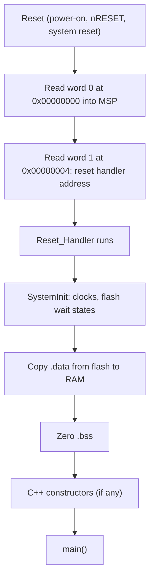
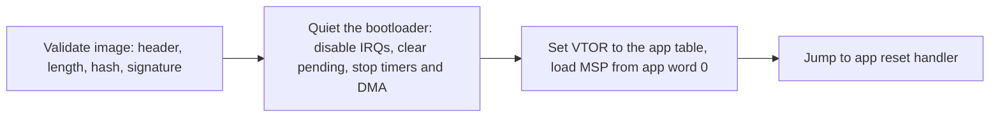
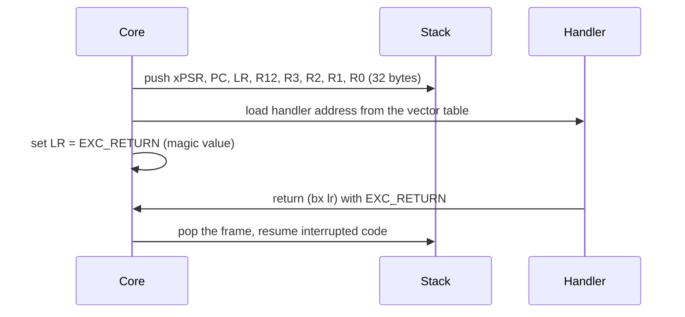
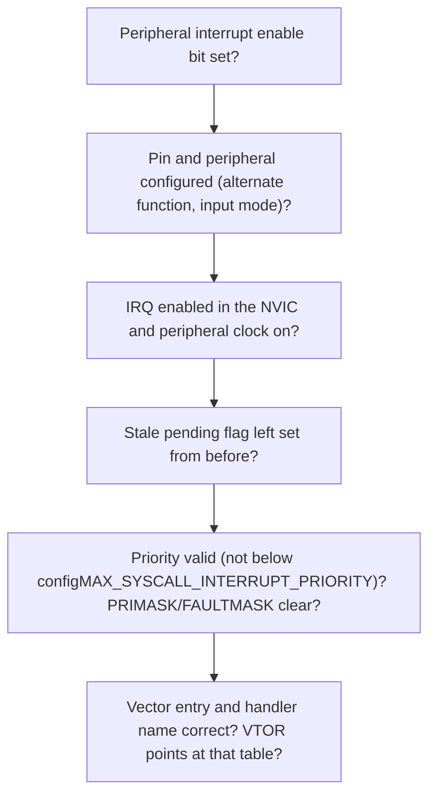
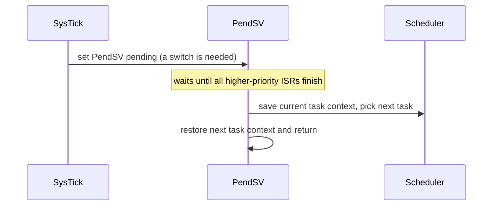
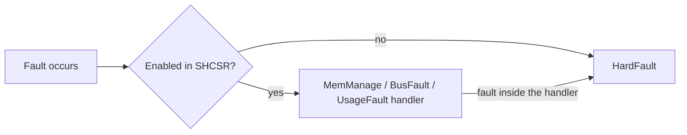
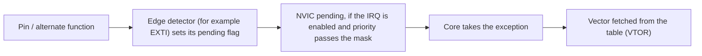

# Advanced MCU, Boot, Memory and Interrupt Questions

These questions cover what happens between reset and `main()`, how the linker and memory map shape a running firmware, and how exceptions and interrupts enter, nest, and return.

**Answer pattern for every question:** Definition, then Why, then How, then Example, then Failure mode or trade-off.

> Note: addresses, register names, alignment rules, and boot-memory aliases differ per Cortex-M profile and per vendor. Treat the numbers here as representative and confirm them against your reference manual.

## Contents

| Questions | Topic |
| --- | --- |
| 1-14 | Reset, vector table, startup, linker, memory sections |
| 15-28 | Interrupts, NVIC, exception entry and exit, PendSV |
| 29-40 | Stack overflow, faults, barriers, cache, MPU, and debugging |

---

## Part 1: Reset, vector table, startup, and linker

## 1. Explain a Cortex-M reset path

**Short answer:** The core reads the initial stack pointer and the reset handler address from the first two words of the vector table, then runs the reset handler.



Which physical memory appears at address `0x00000000` depends on the boot configuration (main flash, system memory, or SRAM).

**Failure mode:** a blank or mis-linked image, or a wrong boot-pin state, locks up before any user code runs.

**Remember:** the first two words of the table are MSP and Reset.

## 2. What is in the vector table and how is it laid out?

**Short answer:** An array of 32-bit words: initial MSP, then Reset, then the system exceptions, then the device IRQs.

```text
Word 0   initial MSP
Word 1   Reset
Word 2   NMI
Word 3   HardFault
 ...     MemManage, BusFault, UsageFault, SVC, DebugMon, PendSV, SysTick
Word 16+ device IRQ0, IRQ1, ...
```

- Each entry is the **address** of a handler. The low bit is the **Thumb bit** and must be 1.
- Entries are usually weak symbols, so your code can override a default infinite-loop handler by defining the same name.

**Failure mode:** an entry of `0` or a non-Thumb address faults the moment that exception is taken.

## 3. What is VTOR, and when do you relocate the vector table?

**Short answer:** VTOR (Vector Table Offset Register) holds the base address of the active vector table. Cortex-M0 has no VTOR.

Relocate the table when:

- A bootloader hands over to an application at a different flash address with its own table
- You want handlers in RAM so ISRs can be registered dynamically
- An RTOS or framework registers ISRs at runtime

```c
SCB->VTOR = APP_FLASH_BASE;     /* point the core at the application's vector table */
__DSB();                        /* wait until the write has completed */
__ISB();                        /* flush the pipeline so later fetches use the new table */
```

Requirements: respect the documented alignment, and write VTOR **before** enabling any interrupt that will use the new table.

## 4. What does the startup code do before `main()`?

**Short answer:** It prepares the CPU and the C runtime, then calls `main()`.

1. MSP is already loaded by hardware from word 0
2. `SystemInit()`: clock tree, flash wait states, optionally disable the watchdog
3. Set `VTOR` to the correct table
4. Copy `.data` from flash to RAM
5. Zero `.bss`
6. Initialize the C library (`__libc_init_array` runs C++ static constructors)
7. Call `main()`

**Why the order matters:** clocks must be right before code that depends on timing, and `.data` and `.bss` must be ready before any C code uses globals.

## 5. What is the difference between LMA and VMA?

**Short answer:** VMA is where a section lives while running. LMA is where its initial image is stored in non-volatile memory.

| Section | LMA (stored) | VMA (runs) |
| --- | --- | --- |
| `.text`, `.rodata` | Flash | Flash (same) |
| `.data` | Flash | RAM |

`.data` must be writable at run time (so it runs in RAM) but its start values must survive power loss (so they are stored in flash). Startup code copies them.

```c
/* Linker-provided boundary symbols, used by the startup copy and zero loops */
extern uint32_t _sidata;   /* start of .data initial values in flash (LMA) */
extern uint32_t _sdata;    /* start of .data in RAM (VMA) */
extern uint32_t _edata;    /* end of .data in RAM */
extern uint32_t _sbss;     /* start of .bss */
extern uint32_t _ebss;     /* end of .bss */

uint32_t *src = &_sidata, *dst = &_sdata;
while (dst < &_edata) { *dst++ = *src++; }     /* copy .data from flash to RAM */
for (dst = &_sbss; dst < &_ebss; ) { *dst++ = 0; }   /* zero .bss */
```

## 6. What happens if the vector table or reset vector is wrong?

**Short answer:** The core has no recovery of its own at reset, so it faults or runs garbage.

- Bad initial MSP: the first push or interrupt faults immediately
- Bad reset vector (not Thumb, erased `0xFFFFFFFF`, or garbage): the core branches into invalid code

Common causes: wrong link or load address, stale VTOR after a bootloader jump, half-programmed flash, wrong boot pins, or a misaligned table.

**How to diagnose:** no user code has run yet, so use the fault registers and a debugger attached at reset.

## 7. How does a bootloader-to-application handoff work?

**Short answer:** Validate the image, quiet the bootloader, then load the application's stack pointer and jump to its reset vector.



```c
typedef void (*app_entry_t)(void);

void jump_to_app(uint32_t app_base)
{
    uint32_t app_msp   = *(volatile uint32_t *)(app_base);        /* word 0: app's initial stack pointer */
    uint32_t app_reset = *(volatile uint32_t *)(app_base + 4u);   /* word 1: app's reset handler */

    __disable_irq();                        /* nothing may fire during the switch */
    /* ... stop bootloader timers/DMA, clear NVIC pending, reset used peripherals ... */
    SCB->VTOR = app_base;                   /* use the application's vector table */
    __set_MSP(app_msp);                     /* switch to the application's stack */
    ((app_entry_t)app_reset)();             /* branch to the application's reset handler */
}
```

**Failure modes:** bootloader interrupts still enabled, so an ISR vectors into the wrong table; peripheral state left behind; the app relying on clocks it never set up.

## 8. How does the application know the firmware is valid?

**Short answer:** Integrity (a hash detects corruption) plus authenticity (a signature proves who made it).

| Property | Mechanism | Note |
| --- | --- | --- |
| Integrity | CRC or SHA-256 over the image | A hash is only as trustworthy as where the expected value comes from |
| Authenticity | Digital signature over the hash | Public key or its hash is stored in immutable memory (OTP, ROM) |

A typical image header holds magic, version, length, hash, and signature.

**Key point:** if the trust anchor can be replaced or the verifier skipped, the whole scheme collapses. Protecting the anchor and the verification code is the real security boundary.

## 9. What is secure boot, and what is A/B with rollback?

**Short answer:** Secure boot is a chain of trust. A/B keeps two slots so a bad update can be undone.


**A/B update:** write the new firmware to the inactive slot, verify it, then switch using boot metadata updated atomically. Rollback protection uses a monotonic version counter so an attacker cannot re-flash an older vulnerable image.

**Trade-off:** authentication proves the signer but does not hide the contents. Confidentiality needs encryption as a separate goal.

## 10. What is the role of the boot pins (BOOT0/BOOT1)?

**Short answer:** At reset they choose which memory appears at `0x00000000`.

| Selection | Result |
| --- | --- |
| Main flash | Normal application boot |
| System memory | Vendor ROM bootloader (UART, USB, CAN DFU) for factory programming and recovery |
| SRAM | Debug or development boot |

The pins are sampled **only at reset**. A floating or wrongly strapped BOOT pin makes a device occasionally enter the ROM bootloader.

## 11. Why is clock configuration in `SystemInit` important before `main()`?

**Short answer:** Almost everything derives its timing from the clock tree, and the CPU-to-flash timing depends on it.

- After reset the core usually runs from a slow, imprecise internal RC oscillator
- To go faster, firmware uses the PLL, which needs **more flash wait states** at higher frequency
- UART, timers, ADC, and the RTOS tick all use divisors that are meaningless until the tree is set

```c
/* Correct order when raising the clock */
FLASH->ACR = FLASH_ACR_LATENCY_5WS;     /* 1. more wait states first */
RCC_EnablePLL();                        /* 2. start and lock the PLL */
RCC_SelectSysclk(PLL);                  /* 3. switch the system clock */
SystemCoreClockUpdate();                /* 4. update the variable used by the tick and drivers */
```

**Failure mode:** raising the clock without adding wait states gives unreliable instruction fetches.

## 12. How do `.text`, `.data`, `.bss`, `.rodata`, heap, and stack differ?

**Short answer:** They differ by what they hold and where they live.

| Section | Holds | Lives in | Set up at startup |
| --- | --- | --- | --- |
| `.text` | Code | Flash | Nothing |
| `.rodata` | `const` data, string literals | Flash | Nothing |
| `.data` | Initialized read/write globals | RAM (copied from flash) | Copied |
| `.bss` | Zero or uninitialized globals | RAM | Zeroed |
| heap | Dynamic allocations | RAM | Depends on toolchain |
| stack | Locals and exception frames | RAM, grows downward | Initial pointer loaded |

```c
const int a = 5;        /* .rodata */
int b = 7;              /* .data   */
int c;                  /* .bss    */
```

**Remember:** this is how you predict what uses RAM and what uses flash.

## 13. How does a linker script describe memory regions?

**Short answer:** `MEMORY` says where bytes may go; `SECTIONS` says what goes where.

```text
MEMORY
{
  FLASH (rx)  : ORIGIN = 0x08000000, LENGTH = 512K
  RAM   (rwx) : ORIGIN = 0x20000000, LENGTH = 128K
}

SECTIONS
{
  .isr_vector : { KEEP(*(.isr_vector)) } > FLASH            /* vector table first */
  .text       : { *(.text*) *(.rodata*) } > FLASH           /* code and constants */
  .data       : { *(.data*) } > RAM AT> FLASH               /* runs in RAM, stored in FLASH */
  .bss        : { *(.bss*) *(COMMON) } > RAM                /* zeroed at startup */
}
```

The design decisions (stack and heap sizes, code placed in RAM for speed) are expressed here, not in C.

## 14. Why keep the stack 8-byte aligned?

**Short answer:** The Arm procedure call standard (AAPCS) requires 8-byte stack alignment at public interfaces.

On exception entry, the core pushes a 32-byte frame on an aligned stack. If SP was not aligned, it adds padding and records this in `xPSR` bit 9. A correct compiler keeps alignment automatically.

**Linker error clue:** `undefined reference to _sbrk` means `malloc` is used but no heap or syscall stub is defined. Use the toolchain's default startup and linker files unless you have a reason to override them.

---

## Part 2: Interrupts, NVIC, and exceptions

## 15. How does interrupt-driven I/O differ from polling?

**Short answer:** Polling checks in a loop; an interrupt lets the peripheral call the CPU.

| | Polling | Interrupt-driven |
| --- | --- | --- |
| Simplicity | Simple, predictable | Concurrency hazards |
| CPU use | Wastes cycles | Efficient |
| Response | Delays other work | Responsive, but adds context overhead |

Safe interrupt rules: keep ISRs short, defer heavy work, mark shared variables `volatile`, guard multi-word state, never call blocking or non-reentrant APIs.

## 16. What are NVIC priority, preemption, and subpriority?

**Short answer:** Preemption decides who can interrupt whom. Subpriority only breaks ties.

- Each IRQ has a priority field. A fixed bit split divides it into **preemption** and **subpriority**
- A lower number means higher priority
- An ISR can preempt another only if its preemption priority is **strictly higher**
- Equal preemption priorities never preempt each other

**FreeRTOS rule:** every IRQ that calls a `...FromISR` function must have a preemption priority numerically **greater than or equal to** `configMAX_SYSCALL_INTERRUPT_PRIORITY`.

## 17. What are the Cortex-M exception entry and exit steps?

**Short answer:** Hardware pushes eight registers, jumps to the handler, and restores them on return.



If the FPU was in use, an FP frame is stacked as well. This is why an ISR looks like a normal function yet returns to the interrupted code.

## 18. What are tail-chaining, late arrival, and lazy FPU stacking?

**Short answer:** Three hardware features that make interrupt handling fast.

- **Tail-chaining:** if another exception is pending when an ISR finishes, the core skips unstacking and restacking and goes straight to the next handler
- **Late arrival:** if a higher-priority exception arrives while stacking for a lower one, the core goes to the higher one first
- **Lazy FPU stacking:** FP registers are stacked only if the interrupted code used floating point (recorded in `CONTROL.FPCA`)

**Consequence:** measured latency depends on pending state, not only on priority.

## 19. What is a memory barrier, and how does it differ from `volatile`?

**Short answer:** `volatile` stops the compiler from removing or merging accesses. A barrier controls the **order** in which accesses become visible.

| Tool | Purpose |
| --- | --- |
| `volatile` | Compiler must perform every access |
| Compiler barrier `asm volatile("" ::: "memory")` | Stop the compiler reordering around a point |
| `__DMB()` | Order data accesses |
| `__DSB()` | Complete all accesses before continuing |
| `__ISB()` | Flush the pipeline and refetch instructions |
| `LDREX/STREX`, C11 atomics | Atomic read-modify-write |

Needed when: releasing a lock, publishing a buffer pointer to DMA or another core, changing `VTOR` or MPU registers, or after cache maintenance.

## 20. What is cache coherency, and how do you handle DMA with caches?

**Short answer:** With a data cache, the CPU and DMA can see different copies of the same memory.

Rules for a cached core (for example Cortex-M7):

| Direction | Action |
| --- | --- |
| Memory to peripheral (DMA reads the buffer) | **Clean** the cache (write dirty lines to RAM) before starting DMA |
| Peripheral to memory (DMA writes the buffer) | **Invalidate** the cache before the CPU reads the result |

```c
SCB_CleanDCache_by_Addr((uint32_t *)tx_buf, sizeof tx_buf);        /* before DMA reads tx_buf */
/* ... DMA transfer completes ... */
SCB_InvalidateDCache_by_Addr((uint32_t *)rx_buf, sizeof rx_buf);   /* before CPU reads rx_buf */
```

Alternatives: place DMA buffers in a **non-cacheable** MPU region. Align buffers to the cache line size, and never share a cache line between CPU-owned and DMA-owned data.

On a cacheless MCU, none of this is needed.

## 21. What causes a HardFault, and how do you diagnose one?

**Short answer:** A HardFault is the catch-all for faults. Find the faulting instruction from the saved PC.

Typical causes: bus error (bad address, unclocked peripheral), usage error (undefined instruction, unaligned access, divide by zero if trapped), stack overflow, bad exception return.

```c
void HardFault_Handler_C(uint32_t *frame)     /* frame = stacked registers */
{
    volatile uint32_t r0  = frame[0];
    volatile uint32_t lr  = frame[5];
    volatile uint32_t pc  = frame[6];          /* the faulting instruction (or just after it) */
    volatile uint32_t cfsr = SCB->CFSR;        /* which fault, and why */
    volatile uint32_t hfsr = SCB->HFSR;
    /* MMFAR/BFAR hold the bad address only if the matching VALID bit in CFSR is set */
    for (;;) { }                               /* stop here so a debugger can inspect */
}
```

Steps: capture the frame, read `CFSR` and `HFSR`, map the saved `PC` to source or disassembly, check `LR` and `SP` if the stack may be corrupt.

## 22. Why does the CPU lock up after enabling an interrupt that has no handler?

**Short answer:** The default handler is usually an infinite loop, so the CPU sits there forever.

```c
void Default_Handler(void) { for (;;) { } }    /* typical startup default: "b ." */
```

**First debugging step:** when a program hangs, read the current PC. If it is inside a default handler name, you enabled an IRQ you never implemented.

## 23. Level-triggered vs edge-triggered interrupts

**Short answer:** Level stays pending while the source is active; edge fires once per transition.

| | Level-triggered | Edge-triggered |
| --- | --- | --- |
| Behaviour | Stays pending while the source is asserted | Latched on the transition only |
| ISR must | Clear or mask the source, or it fires again | Nothing extra, but events can be lost if faster than service |
| Watch out | Livelock in the handler | Needs debouncing for mechanical inputs |

## 24. How do you prioritize an interrupt that must be very fast?

**Short answer:** Give it a high preemption priority and make its ISR tiny; move everything else to deferred work.

- Highest frequency and shortest latency work goes at the top priority, with a tiny ISR (flag, counter, register read, handoff)
- Everything else goes to lower-priority deferred work (main loop, RTOS task, software-triggered low-priority IRQ)
- Use the lightest protection for shared data
- Do not call kernel APIs from a priority that is too high (it faults), and do not make unrelated ISRs equal priority (it blocks preemption)

**Trade-off:** a very high priority on a noisy source can starve the system.

## 25. How do you debug an interrupt that never fires?

**Short answer:** Walk the chain from the source to the vector.



Debug technique: toggle a GPIO in the handler and watch it on a scope, and poll the pending and enable registers from the main loop to see which stage stops.

## 26. How do you make interrupt latency deterministic?

**Short answer:** Latency is a sum of parts. Bound each part.

| Part | How to bound it |
| --- | --- |
| Hardware entry (stacking, FPU state) | Fixed for the core; worst case with late arrival |
| Masking (`PRIMASK`, critical sections) | Keep critical sections to a few instructions |
| Nesting | Priority scheme bounds preemption |
| ISR work | Keep the ISR small; no blocking calls or long floating-point |

Also use DMA to decouple bursts from the CPU, and **measure** with a GPIO toggled at ISR entry and exit.

## 27. What are PendSV and SysTick, and why use PendSV for context switching?

**Short answer:** SysTick provides the tick. PendSV, at the lowest priority, performs the actual switch.



Because PendSV is the lowest priority and software-triggered, it never interrupts another ISR, so the context switch happens in one deterministic place after other interrupt work is done.

## 28. What is `EXC_RETURN`, and what does it encode?

**Short answer:** A magic value placed in `LR` on exception entry that tells the core how to return.

It encodes: which stack to return to (MSP or PSP), Thread or Handler mode, and whether an FP frame is present.

A plain `bx lr` at the end of an ISR restores the interrupted context. A context switch **changes** the saved context so the return lands in a different task.

---

## Part 3: Stack, faults, barriers, cache, MPU

## 29. What does a stack overflow look like at the hardware level?

**Short answer:** The stack grows downward and, when it runs past its region, silently overwrites whatever is below it.

Symptoms:

- A variable that changes unexpectedly
- A HardFault whose faulting `SP` is outside the expected region
- Corrupted task stack, heap, or neighbouring data

Detection: an MPU guard region below the stack, a canary pattern scanned periodically, the RTOS high-water mark, or reserved guard memory.

Typical causes: deep recursion, a large local array in a small task stack, an ISR that preempts deep in the call tree.

## 30. How do faults progress from a configurable fault up to HardFault?

**Short answer:** An enabled fault goes to its own handler. Otherwise, or if it happens inside another fault handler, it escalates to HardFault.



Because a fault inside a fault handler escalates, keep the HardFault handler minimal so it does not fault again.

## 31. How do you split RAM between stack and heap deliberately?

**Short answer:** Give each a budget instead of leaving it to chance.

- Reserve the **stack** explicitly, sized for the worst-case path with margin
- Reserve a **heap** only if you actually use `malloc` or `new`. Many safety-critical designs forbid dynamic allocation
- On an RTOS, allocate per-task stacks and avoid heap-based queues and timers where bounded behaviour is needed

**Rule:** prefer static allocation on MCUs. Treat any heap as a fixed budget and measure it with a high-water mark.

## 32. What is `volatile` actually required for?

**Short answer:** Objects that can change outside the current flow of control.

Required for:

- Memory-mapped peripheral registers
- Variables shared between an ISR and main or task code
- Variables changed by DMA or another core

**It is not atomicity.** A 32-bit aligned read or write is atomic on Cortex-M, but `counter++` (read-modify-write), a bit-field, or a 64-bit value is not.

```c
volatile uint32_t tick;            /* observed correctly in main */
/* tick++ in main is NOT safe if an ISR also changes it: protect it with a critical section */
```

## 33. How does a peripheral interrupt get from the pin to the CPU?

**Short answer:** Through a chain of enables. A mistake at any stage stops it.



Typical breaks: unconfigured pin, wrong peripheral-to-line mapping, pending flag left set, wrong IRQ enabled, handler name mismatch.

## 34. What are the main sources of interrupt latency and jitter?

**Short answer:** A fixed hardware part and a variable part.

- **Fixed:** exception entry (stacking and vector fetch)
- **Variable:** tail-chaining or late arrival, waiting for a long critical section (`PRIMASK`) to end, and preemption by higher-priority IRQs

The same IRQ can show different latency in different runs. Always quote a **worst-case bound** and the conditions it holds under, not an average.

## 35. How do you write a C function to be an ISR safely?

**Short answer:** Correct name, tiny body, ISR-safe calls, hand off the real work.

```c
void USART2_IRQHandler(void)                  /* exact name from the vector table */
{
    if (USART2->ISR & USART_ISR_RXNE) {       /* which source fired? */
        uint8_t b = (uint8_t)USART2->RDR;     /* read data (this also clears the flag) */
        ring_push(&rx, b);                    /* O(1) hand-off; no blocking, no printf */
    }
}
```

- Use the **exact handler name**. A typo silently keeps the weak default handler
- Declare shared data `volatile` and protect it where atomicity is required
- On an RTOS, use `...FromISR` calls and yield on exit

## 36. What is the difference between an interrupt and an exception?

**Short answer:** "Exception" is the general term on Cortex-M. An interrupt (IRQ) is an exception that comes from a peripheral through the NVIC.

Exceptions include reset, NMI, HardFault, SVC, PendSV, SysTick, and external interrupts. The mechanism (save frame, vector, return) is the same for all except reset, which does not return in the normal way.

## 37. How do you debug a corrupted vector table or bad handler?

**Short answer:** Dump the table at `VTOR` and compare it with the linked image and the map file.

- Does `VTOR` match the running image base? (A stale `VTOR` after a bootloader jump is a classic cause.)
- Do handler symbol names match the vector declarations? A mismatch leaves the default loop in place.
- Is the image loaded at the address the linker assumed?
- Is a handler word `0xFFFFFFFF` or garbage? Suspect flash corruption.

A wrong table usually locks up the first time an affected IRQ fires, so correlate with the debugger's current PC and the fault registers.

## 38. What is an unaligned access, and how do you prevent a fault?

**Short answer:** Reading a wider value from an address that is not a multiple of its size.

Cortex-M allows some unaligned halfword and word accesses, but not all. Unaligned access to device memory, or with trapping enabled, raises a UsageFault (or HardFault if UsageFault is disabled).

```c
/* Unsafe: casting a byte buffer to uint32_t* may be misaligned */
uint32_t bad = *(uint32_t *)&buf[1];

/* Safe: memcpy handles any alignment */
uint32_t good;
memcpy(&good, &buf[1], sizeof good);
```

Also align buffers and structures with compiler alignment attributes.

## 39. What does a stack backtrace look like when the CPU is in an ISR?

**Short answer:** An ISR entered by hardware has an exception frame, not an ordinary call return address.

Debugger unwinders use the stacked `PC` and `LR` plus `EXC_RETURN` to rebuild the interrupted call chain. A naive frame-pointer walk may stop or misreport at the ISR boundary.

**Tip:** save the exception frame early in the handler if you want a trustworthy post-mortem.

## 40. What is the role of memory attributes (MPU and cacheability)?

**Short answer:** Each MPU region sets permissions and memory type, which controls both access rights and how the bus treats it.

Attributes: read, write, execute permissions, and type (Normal cached, Normal non-cacheable, Device, Strongly-ordered).

They matter for:

- **DMA and shared buffers:** mark non-cacheable, or manage the cache explicitly (Q20)
- **Protection:** make code and constants read-only to catch stray writes, and add a guard region to catch stack overflow
- **Peripherals:** keep device regions strongly ordered and non-cacheable to avoid stale reads and reordering

**Trade-off:** overlapping regions follow MPU priority rules, and marking shared RAM non-cacheable trades speed for simplicity.

---

## Quick reference

| Item | Representative value or rule |
| --- | --- |
| Initial MSP and reset vector | Words 0 and 1 of the active vector table |
| CPU exception frame size | 32 bytes (8 words); plus FP frame if the FPU is active |
| Thumb handler address | Low bit set to 1 |
| Default stack alignment | 8 bytes (AAPCS) at public interfaces |
| Typical Cortex-M7 D-cache line | 32 bytes (part dependent) |
| Fault status registers | `CFSR`, `HFSR`, `MMFAR`, `BFAR` |
| FreeRTOS ISR priority rule | Preemption priority numerically >= `configMAX_SYSCALL_INTERRUPT_PRIORITY` |

> Always confirm exact values against the target reference manual and the toolchain's linker and startup files before relying on them in production code.
