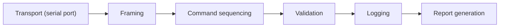

# Advanced Python Interview Questions (for Embedded Engineers)

How to use this file: this is a 50-question flashcard track. Answer each question aloud first, then compare with the **Short answer** and the explanation. Code examples are commented line by line.

## Contents

- Part A: Python language basics that come up in tooling (Q1-Q15)
- Part B: Concurrency and reliability of test tools (Q16-Q29)
- Part C: Test practices, configuration, and CI (Q30-Q40)
- Part D: Performance, safety, and the interview message (Q41-Q50)

---

## Part A: Python language basics that come up in tooling

## 1. Why is Python valuable to an embedded engineer?

**Short answer:** It automates the work around the firmware.

Uses: test automation, serial tools, log parsing, packet generation, CI utilities, manufacturing tools, data analysis.

## 2. List versus tuple

**Short answer:** Lists are mutable; tuples are immutable.

```python
values = [1, 2, 3]       # list: can change
values.append(4)         # OK

record = (0x12, "ok")    # tuple: fixed record
# record[0] = 5          # TypeError
```

Use a tuple for fixed records or values that must not change.

## 3. What is a set, and why is it useful in testing?

**Short answer:** A set stores unique hashable items with fast average-case membership checks.

```python
expected = {0x01, 0x02, 0x03}
received = {0x01, 0x03}
missing = expected - received        # set difference: {0x02}
duplicates_ok = len(received) == len(list_of_received)   # duplicate detection idea
```

Useful for duplicate detection and comparing expected against actual values.

## 4. What is a dict?

**Short answer:** A hash-table mapping from keys to values.

```python
register = {"name": "CTRL", "addr": 0x40, "reset": 0x00}   # register metadata
packet   = {"id": 0x12, "payload": b"\x01\x02"}            # decoded packet
```

Good for decoded packets, register metadata, and test configuration.

## 5. What is a generator?

**Short answer:** A lazy iterator that yields values on demand.

```python
def read_lines(path):
    with open(path) as f:
        for line in f:
            yield line.rstrip()      # produces one line, then pauses

# Only one line is in memory at a time, even for a multi-GB log.
errors = (l for l in read_lines("run.log") if "ERROR" in l)
```

## 6. What is a context manager?

**Short answer:** It controls setup and cleanup around a `with` block.

```python
with open("out.txt", "w") as f:    # opens the file
    f.write("data")                # use it
# the file is closed here, even if write() raised an exception
```

Common for files, serial ports, and locks.

## 7. How would you structure a UART test tool?

**Short answer:** Separate the layers so each can be tested alone.



## 8. How do you parse binary data safely?

**Short answer:** Check the length first, then decode with a defined byte order.

```python
import struct

def parse_header(data: bytes):
    if len(data) < 4:                                   # 1. validate length BEFORE reading
        raise ValueError("short packet")
    msg_id, length = struct.unpack_from("<HH", data, 0) # 2. '<' = little-endian, H = uint16
    return msg_id, length
```

## 9. Why is `struct.pack` useful?

**Short answer:** It turns Python values into an exact binary layout.

```python
import struct
# Layout: id (1 byte), length (2 bytes, little-endian), value (4 bytes, little-endian)
frame = struct.pack("<BHI", 0x12, 4, 0xDEADBEEF)
```

Packet generation becomes reproducible and explicit about field sizes.

## 10. What is `bytes` versus `bytearray`?

**Short answer:** `bytes` is immutable; `bytearray` is mutable.

```python
b = bytes([1, 2, 3])          # cannot change items
buf = bytearray(b"\x00" * 4)  # mutable buffer
buf[0] = 0xFF                 # in-place change works
```

Use `bytearray` when a buffer must be modified in place.

## 11. What is slicing?

**Short answer:** Selecting a sub-range with `start:stop:step`.

```python
data = b"ABCDEFGH"
data[2:5]      # b"CDE"
data[::2]      # b"ACEG"   (every second byte)
```

**Watch out:** slicing usually copies. On large binary data, use `memoryview` to avoid copies.

## 12. What is a shallow copy?

**Short answer:** It copies the outer container only; nested objects stay shared.

```python
import copy
a = [[1, 2], [3, 4]]
b = copy.copy(a)
b[0].append(99)      # a[0] also changes, because the inner list is shared
```

## 13. What is a deep copy?

**Short answer:** It recursively copies nested structures, so the copies are independent.

```python
c = copy.deepcopy(a)
c[0].append(7)       # a is unaffected
```

Cost: more memory and time.

## 14. What is an exception hierarchy?

**Short answer:** Exceptions are classes, so you can catch them at the right level.

```python
class InfraError(Exception): pass           # test setup or equipment problem
class TestFailure(Exception): pass          # the product really failed

try:
    run_test()
except InfraError:
    mark_retry()                            # not the product's fault
except TestFailure:
    mark_failed()
```

Embedded test code should distinguish expected test failures from infrastructure failures.

## 15. How do you avoid hiding test failures?

**Short answer:** Catch only what you can recover from, and let unexpected errors fail loudly.

```python
try:
    reply = port.readline()
except serial.SerialTimeoutException:
    log.warning("timeout, retrying")        # recoverable: handled
# any other exception is NOT caught, so the test fails with a real traceback
```

Avoid a bare `except:` that turns everything into a generic pass or fail.

---

## Part B: Concurrency and reliability of test tools

## 16. Threading or multiprocessing for test automation?

**Short answer:** Threads for I/O waiting; processes for CPU-heavy Python work.

| | Threads | Processes |
| --- | --- | --- |
| Good for | Serial, sockets, waiting | CPU-heavy parsing |
| GIL limit | Yes (for Python bytecode) | No |
| Memory | Shared | Separate |

## 17. What is asyncio useful for?

**Short answer:** Many I/O-bound operations coordinated cooperatively in one thread.

```python
import asyncio

async def talk(device):
    await asyncio.sleep(0.1)          # 'await' lets other tasks run meanwhile
    return device

async def main():
    results = await asyncio.gather(talk("A"), talk("B"), talk("C"))   # run concurrently
```

Good for network and device orchestration tools.

## 18. How would you implement a retry strategy?

**Short answer:** Bound the retries, use a timeout, back off, and only retry transient errors.

```python
import time

def with_retry(action, attempts=3, delay=0.5):
    for n in range(attempts):                    # bounded: never infinite
        try:
            return action()
        except TransientError:                   # only errors that can succeed later
            time.sleep(delay * (2 ** n))         # exponential backoff
    raise RuntimeError("gave up after retries")
# A configuration error (deterministic) should NOT be retried at all.
```

## 19. How do you parse logs robustly?

**Short answer:** Prefer structured fields, tolerate noise, and keep the raw log.

- Use structured fields (JSON or fixed tags) when you control the format
- Validate timestamps and IDs
- Ignore unrelated lines instead of crashing on them
- Save the original log as an artifact

## 20. What is a fixture in testing?

**Short answer:** Controlled setup and state provided to a test.

```python
import pytest

@pytest.fixture
def device():
    dev = FakeDevice()        # a simulated device for the test
    yield dev                 # the test runs here
    dev.close()               # teardown always runs
```

## 21. How would Python control a modem?

**Short answer:** Send AT commands through a command/response engine with timeouts.

Steps: open the transport, send a command, wait for an expected terminator (`OK` or `ERROR`), handle unsolicited messages separately, enforce a timeout, and record the whole transcript.

## 22. Why are timestamps important in HIL testing?

**Short answer:** They let you line up commands, hardware events, and firmware logs.

Especially for timing-sensitive failures, where "what happened first" is the whole question.

## 23. What is property-based testing?

**Short answer:** Test that general rules hold for many generated inputs, instead of a few fixed examples.

```python
from hypothesis import given, strategies as st

@given(st.binary())
def test_parser_never_crashes(data):
    parse_packet(data)          # invariant: no crash and no hang for ANY input
```

Suits packet parsers and state machines.

## 24. How would you fuzz a binary parser in Python?

**Short answer:** Feed valid and invalid bytes, limit input size, and assert it never crashes, hangs, or reads out of bounds.

## 25. What is a mock?

**Short answer:** A test double that simulates a collaborator and often records how it was called.

## 26. Stub versus mock

**Short answer:** A stub supplies answers; a mock also verifies interactions.

```python
from unittest.mock import Mock

port = Mock()
port.readline.return_value = b"OK\n"       # stub behaviour: a canned answer
port.write(b"AT\n")
port.write.assert_called_once_with(b"AT\n")  # mock behaviour: verify the interaction
```

## 27. What is dependency injection in Python test tooling?

**Short answer:** Pass the device interface in, so a fake can replace real hardware.

```python
class Tester:
    def __init__(self, port):        # the port is injected, not created inside
        self.port = port

    def ping(self):
        self.port.write(b"PING\n")
        return self.port.readline()

real = Tester(serial.Serial("COM3", 115200))
fake = Tester(FakeSerial(reply=b"PONG\n"))   # unit test without hardware
```

## 28. How do you handle flaky hardware tests?

**Short answer:** Separate transport failures from product failures, and track the failure rate instead of hiding it.

- Capture artifacts (logs, traces)
- Retry only for known transient conditions, with a bound
- Report how often a retry was needed

## 29. Why should test timeouts be explicit?

**Short answer:** An unbounded read can hang CI forever. A timeout turns a hang into a diagnosable failure.

```python
port = serial.Serial("COM3", 115200, timeout=2)   # readline() gives up after 2 s
```

---

## Part C: Test practices, configuration, and CI

## 30. How would you compare firmware versions?

**Short answer:** Compare version parts as numbers, not as strings.

```python
"1.10.0" > "1.9.0"                       # False as strings! ("1" < "9" character-wise)
tuple(map(int, "1.10.0".split("."))) > tuple(map(int, "1.9.0".split(".")))   # True: (1,10,0) > (1,9,0)
```

## 31. How do you store test configuration?

**Short answer:** Use a validated schema, reject bad values early, and keep secrets out of the repo.

## 32. Why avoid hard-coded serial ports?

**Short answer:** Port names differ between machines. Resolve by a stable identifier or configuration, and verify the device before testing.

```python
# Find the port by USB vendor/product ID instead of hard-coding "COM3"
from serial.tools import list_ports
port = next(p.device for p in list_ports.comports() if p.vid == 0x0483)
```

## 33. What is CRC testing?

**Short answer:** Compare your implementation against known vectors and an independent implementation.

Include the parameters: width, polynomial, initial value, reflection, final XOR. The standard check is the CRC of the ASCII string `"123456789"`.

## 34. How would you test endian conversion?

**Short answer:** Use a recognisable pattern and check both directions.

```python
value = 0x12345678
assert value.to_bytes(4, "little") == b"\x78\x56\x34\x12"   # little-endian encoding
assert value.to_bytes(4, "big")    == b"\x12\x34\x56\x78"   # big-endian encoding
assert int.from_bytes(b"\x78\x56\x34\x12", "little") == value   # decoding round-trip
```

## 35. What is a virtual environment?

**Short answer:** An isolated set of Python packages, so tooling is reproducible.

```text
python -m venv .venv          # create
.venv\Scripts\activate        # activate (Windows)
pip install -r requirements.txt
```

## 36. Why pin dependencies in CI?

**Short answer:** So the environment does not change unexpectedly. Update on purpose, and test the new versions.

```text
pyserial==3.5        # exact version, not "pyserial>=3"
```

## 37. What is a CLI entry point?

**Short answer:** A stable command interface for scripts.

```python
import argparse

def main():
    p = argparse.ArgumentParser()
    p.add_argument("--port", required=True)
    p.add_argument("--firmware", required=True)
    args = p.parse_args()
    flash(args.port, args.firmware)      # flashing, packet generation, regression runs...

if __name__ == "__main__":
    main()
```

## 38. How would you design a serial log recorder?

**Short answer:** Stream, timestamp, store raw and parsed output separately, and rotate files for long runs.

## 39. How do you handle binary plus text logs?

**Short answer:** Do not assume device bytes are valid UTF-8.

```python
text = raw_bytes.decode("utf-8", errors="replace")   # never crashes; bad bytes become a placeholder
# Keep the raw bytes as well, so nothing is lost.
```

## 40. What is a coroutine?

**Short answer:** A resumable function used by async frameworks. It is not an OS thread.

---

## Part D: Performance, safety, and the interview message

## 41. Why can Python memory usage matter even on a PC?

**Short answer:** Large logs or captures can slow or crash a test. Stream and bound your buffers.

## 42. How would you benchmark a parser?

**Short answer:** Use realistic and worst-case inputs, run several times, and separate parser time from I/O time.

```python
import timeit
t = timeit.timeit(lambda: parse(sample), number=10_000)   # many runs, parser only
```

## 43. How do you make a test deterministic?

**Short answer:** Control everything that varies: timeouts, random seeds, device state, network, and test order. Keep artifacts for failures.

```python
import random
random.seed(1234)      # same "random" data every run
```

## 44. What is serialization?

**Short answer:** Converting structured data to a form for transport or storage.

Define versioning, field widths, byte order, and validation rules.

## 45. Why validate every externally supplied length?

**Short answer:** A length field is untrusted input.

Check it before indexing or allocating, to prevent out-of-bounds access and denial-of-service style failures.

## 46. How would you build a firmware register checker?

**Short answer:** Describe registers as metadata, read them through a transport layer, and compare field by field.

```python
REG = {"name": "CTRL", "addr": 0x40, "reserved_mask": 0xFFFF0000, "expected": 0x0000_0003}

value = transport.read32(REG["addr"])
value &= ~REG["reserved_mask"]                     # ignore reserved bits
if value != REG["expected"]:
    print(f'{REG["name"]} @ {REG["addr"]:#x}: got {value:#x}, expected {REG["expected"]:#x}')
```

## 47. How can Python help with manufacturing?

**Short answer:** It automates flashing, calibration, serial-number provisioning, functional checks, result capture, and traceability records.

## 48. What is the main Python message for an embedded role?

**Short answer:** Python makes firmware development repeatable.

Show you can automate hardware tests, decode data, reproduce failures, and generate evidence.

## 49. How would you make a Python hardware test safe to rerun?

**Short answer:** Reset state in setup, clean up in teardown, use unique output files, and make provisioning steps idempotent.

## 50. How do you test timing-sensitive firmware with Python?

**Short answer:** Use monotonic timestamps, explicit timeout budgets, and raw traces.

```python
import time
start = time.monotonic()                 # monotonic: never jumps backwards (unlike time.time())
reply = wait_for_reply(timeout=0.5)
elapsed = time.monotonic() - start       # compare with the requirement
```

Use synchronized triggers when available, so software timing can be correlated with device behaviour.
