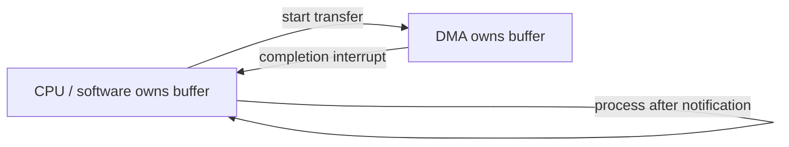
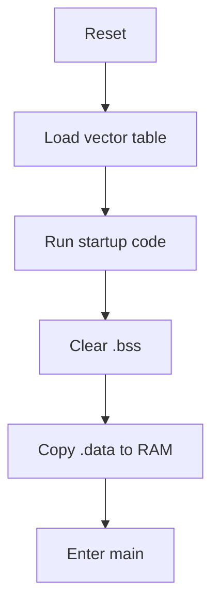
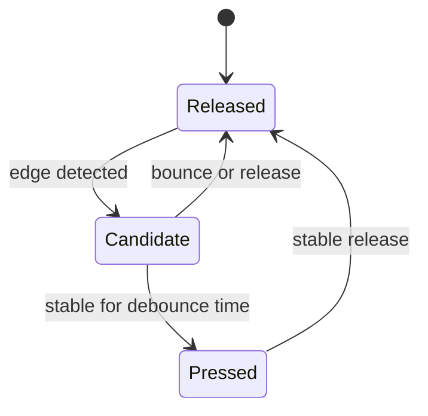
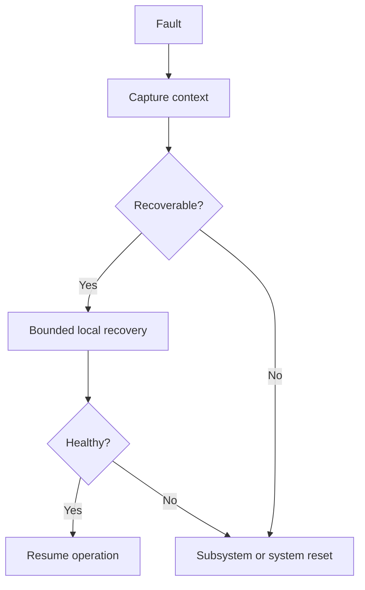
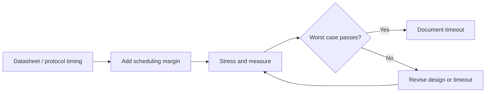

# Advanced Embedded C Study Notes

How to use this file: this is a 50-question track. Each question now has its **Short answer**, an **Example**, and a **Follow-up** in one place. Answer aloud first, then check.

## How to study

1. Read the question and answer it without looking.
2. Read the short answer in simple terms.
3. Explain the example in your own words.
4. Trace the flowchart when the topic involves state, ownership, startup, recovery, or timing.
5. Finish by stating one failure mode and one design rule.

## Topic map

| Questions | Topic |
| --- | --- |
| 1-10 | Registers, interrupts, critical sections, and DMA |
| 11-20 | Timing, startup code, memory sections, and board support |
| 21-30 | Drivers, timeouts, debouncing, and UART data flow |
| 31-40 | Interrupt debugging, linker data, memory maps, and recovery |
| 41-50 | Brownout safety, errata, testing, contracts, and validation |

## Plain-English terms

| Term | Simple meaning |
| --- | --- |
| `volatile` | Read or write the value every time, because hardware or another context may change it |
| DMA | Hardware moves data without the CPU copying every byte |
| ISR | A short function that runs when hardware raises an interrupt |
| Critical section | A small section of code protected from unsafe concurrent access |
| BSP | Board-specific setup for pins, clocks, and peripherals |
| HAL | A software layer that hides direct register access |
| `.bss` | RAM for static variables that start at zero |
| `.data` | RAM variables that start with stored non-zero values |
| `.rodata` | Read-only constants, often kept in flash |
| Erratum | A known hardware bug and its recommended workaround |

---

## Part 1: Registers, interrupts, and DMA (Q1-Q10)

## 1. Why is memory-mapped I/O central to MCU firmware?

**Short answer:** Peripherals are controlled through addressable registers, so C reads and writes become hardware operations.

**Example:**

```c
*(volatile uint32_t *)0x40020000u = 1u;     /* writes a peripheral register */
```

**Follow-up:** Why use a device header instead? It documents the addresses and fields.

## 2. Why should register definitions use `volatile`?

**Short answer:** Hardware can change a register independently of the C flow, so every access must really happen.

**Example:**

```c
volatile uint32_t status = peripheral->STATUS;   /* forces a real register read */
```

**Follow-up:** Does `volatile` make access atomic? No.

## 3. What is the read-modify-write risk?

**Short answer:** `reg |= mask` reads the whole register and writes it back. If some bits are hardware-changed or write-one-to-clear, other fields can be altered by accident.

**Example:** Prefer a dedicated atomic set register over `reg |= mask` when hardware can change bits asynchronously.

**Follow-up:** What is the risk? A read-modify-write race.

## 4. What is write-one-to-clear?

**Short answer:** A status bit clears when software writes a 1 to it. Do not treat these registers like ordinary read/write fields.

**Example:**

```c
peripheral->STATUS = STATUS_RX_READY;    /* writing 1 to this bit CLEARS the flag */
```

**Follow-up:** Why not write zero? Writing 0 usually has no effect.

## 5. Why do reserved bits matter?

**Short answer:** The reference manual may require them to keep their reset value or be written as a specific value. Blind writes can cause undefined behaviour.

**Example:** Preserve reserved bits with a documented mask instead of writing `0xFFFFFFFFu`.

**Follow-up:** Where is the required value defined? In the reference manual.

## 6. Polling versus interrupts in a driver?

**Short answer:** Polling is simple and good for short bounded operations. Interrupts improve responsiveness and CPU efficiency for asynchronous events.

**Example:** Poll a short ADC conversion, but use an interrupt for a long asynchronous transfer.

**Follow-up:** What decides the choice? Latency, CPU cost, and operation duration.

## 7. Why keep ISRs short?

**Short answer:** Long handlers raise interrupt latency and delay higher-priority work. Defer non-critical processing.

**Example:** An ISR stores the received byte and wakes a task; parsing stays outside the ISR.

**Follow-up:** What is the benefit? Lower interrupt latency.

## 8. What is DMA buffer ownership?

**Short answer:** At any moment, either software or DMA has the right to modify the buffer, never both.

**Example:** DMA owns a receive buffer during the transfer; software owns it only after the completion notification.

**Follow-up:** What causes corruption? Both contexts reading or writing it at once.



## 9. What is cache coherency in DMA?

**Short answer:** On cached systems, the CPU and DMA can see different versions of the same memory unless you maintain the cache or use coherent memory.

**Example:** Clean the D-cache before DMA reads a buffer; invalidate it before the CPU reads DMA-written data.

```c
SCB_CleanDCache_by_Addr((uint32_t *)tx_buf, sizeof tx_buf);        /* before DMA reads tx_buf */
SCB_InvalidateDCache_by_Addr((uint32_t *)rx_buf, sizeof rx_buf);   /* before CPU reads rx_buf */
```

**Follow-up:** Needed on every MCU? No, mainly on cached systems (for example Cortex-M7).

## 10. What is a critical section?

**Short answer:** A region protected against the concurrency hazard relevant to that resource. It can be interrupt masking, a mutex, an atomic operation, or something else.

**Example:** Protect a shared register update with a short critical section or an atomic operation.

**Follow-up:** Why not mask interrupts for a whole transaction? It increases latency.

---

## Part 2: Timing, startup, and memory sections (Q11-Q20)

## 11. Why avoid disabling interrupts for long periods?

**Short answer:** It increases interrupt latency and can break real-time behaviour, communication servicing, or watchdog assumptions.

**Example:** Measure an interrupt-disabled region with a GPIO and compare it with the maximum latency budget.

**Follow-up:** What can fail? UART overrun, missed deadlines, or watchdog timing.

## 12. What is a watchdog window?

**Short answer:** A watchdog that only accepts a refresh inside a permitted time window, so it detects both missed and premature refreshes.

**Example:** A windowed watchdog rejects a refresh that occurs immediately after the previous one.

**Follow-up:** What two failures does it detect? Missed and premature refreshes.

## 13. What is a brown-out reset?

**Short answer:** A protection that resets the system when the supply voltage drops below a threshold, preventing unreliable operation.

**Example:** Brown-out reset stops code from running when the supply falls below the safe level.

**Follow-up:** What must persistent data handle? Interrupted writes.

## 14. What is startup code responsible for?

**Short answer:** It sets up the CPU and runtime, initializes memory sections, and then transfers control to the application.

**Example:** Startup copies initialized globals from flash to RAM before calling `main()`.

**Follow-up:** What happens to uninitialized static data? It is cleared.



## 15. What is `.isr_vector`?

**Short answer:** A common section name for the interrupt vector table, placed at an address the architecture requires. Naming depends on the toolchain and startup files.

**Example:** The linker places `.isr_vector` at the reset-defined vector-table address.

**Follow-up:** What breaks if it is misplaced? Reset and interrupt dispatch.

## 16. What is `.bss`?

**Short answer:** Zero-initialized static storage. Startup code clears it before `main`.

**Example:** `static uint32_t counters[16];` lives in `.bss` and is cleared during startup.

**Follow-up:** Why is `.bss` not stored byte-for-byte in flash? Its initial value is zero, so there is nothing to store.

## 17. What is `.data`?

**Short answer:** Initialized writable data. Its initial values are stored in the program image and copied to RAM at startup.

**Example:** `uint32_t baud_rate = 115200u;` is copied from the image into writable RAM.

**Follow-up:** What increases image size? Initialized writable data.

## 18. What is `.rodata`?

**Short answer:** Read-only constants and string literals.

**Example:** `static const char banner[] = "Boot OK";` normally belongs in read-only storage.

**Follow-up:** Can the linker place it in flash? Yes, with the correct memory regions.

## 19. Why give peripheral initialization a single owner?

**Short answer:** Several modules writing the same clock, pin, or register setting creates hidden coupling and race conditions.

**Example:** One clock manager owns peripheral-clock setup; drivers request what they need through an API.

**Follow-up:** Why? It prevents hidden register conflicts.

## 20. What is a BSP?

**Short answer:** Board Support Package: code that adapts generic software to board-specific pins, clocks, peripherals, and startup details.

**Example:**

```c
#define BOARD_STATUS_LED   GPIO_PIN_B5     /* board revision A. Revision B changes only this line. */
```

**Follow-up:** What does application code avoid? Board-specific pin numbers.

---

## Part 3: Drivers, timeouts, and serial data (Q21-Q30)

## 21. HAL versus register-level programming?

**Short answer:** HAL reduces hardware coupling and improves reuse. Register-level code gives precise control but costs device-specific maintenance.

**Example:** A HAL function configures a UART while a register-level helper sets one exact bit for a timing workaround.

**Follow-up:** What is the trade-off? Reuse versus precise control.

## 22. Why can HAL APIs still fail in production?

**Short answer:** An API can return a timeout or error because of clocks, pins, electrical issues, sequence needs, or silicon errata. A successful call does not prove the hardware result.

**Example:** `hal_uart_send()` returns timeout because the UART clock was never enabled.

**Follow-up:** Does a successful API call prove data was transmitted? No. Verify hardware state.

## 23. How do you design a safe timeout?

**Short answer:** Base it on a real time source or a bounded deadline, not an arbitrary loop count, unless the iteration time is proven constant.

**Example:**

```c
uint32_t deadline = now_ms() + 10u;              /* a real deadline, not "loop 1000 times" */
while (!ready() && (int32_t)(now_ms() - deadline) < 0) { }   /* wrap-safe comparison */
```

**Follow-up:** What clock is suitable? A monotonic timer.

## 24. What is debouncing?

**Short answer:** Filtering mechanical switch bounce so one physical press produces one logical change.

**Example:** Require a button to remain pressed for 20 ms before accepting the change.

**Follow-up:** Why not delay in the ISR? It blocks other work.

## 25. Why use a state machine for debouncing?

**Short answer:** It makes the stable and candidate states and time thresholds explicit, without blocking the rest of the system.

**Example:** `RELEASED` to `CANDIDATE` and then `PRESSED` after the threshold.

**Follow-up:** What does it avoid? Blocking delays.



## 26. How do you handle UART framing?

**Short answer:** Define packet boundaries with delimiters, length fields, or fixed sizes. Validate length and checksum before dispatch.

**Example:** A frame uses sync, length, payload, and CRC fields.

**Follow-up:** What happens after a bad CRC? Discard and resynchronize.

## 27. What is an overrun error?

**Short answer:** New data arrived before the previous data was read, so bytes may be lost. Recovery depends on the peripheral.

**Example:** Read the UART status, clear the overrun condition, and reset the receive state if necessary.

**Follow-up:** Can the lost byte be recovered? Usually not.

## 28. What is a ring buffer good for?

**Short answer:** It decouples producer and consumer timing for streaming data using bounded memory.

**Example:** A ring buffer lets an ISR receive bytes while a task parses them later.

**Follow-up:** What must be bounded? Capacity and overflow behaviour.

## 29. Why use separate RX and TX state?

**Short answer:** Receive and transmit often have different lifecycles, buffering, and interrupt or DMA handling. Independent state reduces coupling.

**Example:** RX state tracks head and tail; TX state tracks pending bytes and DMA completion independently.

**Follow-up:** Why separate them? Their lifecycles differ.

## 30. What is an interrupt storm?

**Short answer:** An interrupt source fires so often that the CPU spends all its time servicing it, starving other work.

**Example:** A storm occurs when a handler returns without clearing the source flag.

**Follow-up:** What evidence helps? Event counters and scope captures.

---

## Part 4: Interrupts, linker data, and faults (Q31-Q40)

## 31. How would you debug an interrupt storm?

**Short answer:** Check the source flag, edge or polarity configuration, the handler's clearing sequence, signal quality, and the event rate.

**Example:** Verify the peripheral flag is cleared after servicing. Otherwise the CPU immediately re-enters the handler.

**Follow-up:** What else can cause storms? Wrong edge polarity or noisy wiring.

## 32. What is priority grouping?

**Short answer:** On some interrupt controllers, the priority number is split into a preemption field and a subpriority field. Behaviour depends on the ARM controller configuration.

**Example:** Configure preemption priority and subpriority according to the MCU's rules.

**Follow-up:** Are numeric priorities universal? No, encoding differs by controller.

## 33. Why use DMA circular mode for UART RX?

**Short answer:** It captures continuously into a ring-like buffer, so there is no interrupt per byte. Firmware tracks the write position and processes new data.

**Example:**

```c
uint16_t write_idx = RX_BUF_SIZE - dma_remaining();      /* where DMA has written up to */
while (read_idx != write_idx) {                          /* new bytes exist */
    process(rx_buf[read_idx]);
    read_idx = (read_idx + 1u) % RX_BUF_SIZE;            /* wrap around */
}
```

**Follow-up:** What must handle wraparound? The producer-index calculation.

## 34. What is a linker symbol?

**Short answer:** A named address or value created or resolved by the linker. Often used for section boundaries, stack limits, or bootloader and application interfaces.

**Example:** `__StackTop` and `__StackLimit` define startup and overflow checks.

**Follow-up:** Where are they created? In the linker script.

## 35. Why inspect the map file?

**Short answer:** It shows flash and RAM use, section placement, symbol addresses, and unexpected library or object contributions.

**Example:** A map file reveals that formatted logging pulled a large library into flash.

**Follow-up:** What action follows? Remove or replace the expensive path.

## 36. What is a memory map?

**Short answer:** The defined arrangement of code, data, peripherals, boot regions, and RAM and flash in the address space.

**Example:** Flash for code, SRAM for data, and a reserved region for boot metadata.

**Follow-up:** Why reserve regions? To protect bootloader and application contracts.

## 37. How do you detect stack overflow without hardware trace?

**Short answer:** RTOS stack checks, guard patterns, high-water marks, and fault dumps.

**Example:** Fill a task stack with `0xA5A5A5A5`, run a stress test, then scan for the untouched pattern.

**Follow-up:** What does the watermark show? The minimum remaining stack.

## 38. Why can logging change a bug?

**Short answer:** Logging changes timing, interrupt load, memory pressure, and sometimes synchronization, so race and timing bugs can vanish or get worse.

**Example:** Adding `printf()` makes a race disappear because it changes task scheduling.

**Follow-up:** Is logging a fix? No, it only changes timing.

## 39. What is a safe-state concept?

**Short answer:** A predefined hardware and software condition that minimizes hazard when normal operation cannot continue.

**Example:** A motor controller enters a disabled-output state after a watchdog fault.

**Follow-up:** What defines "safe"? Product hazard analysis and system requirements.

## 40. How do you design fault recovery?

**Short answer:** Classify the fault, keep useful context, try bounded local recovery, and escalate to a subsystem or system reset if needed.

**Example:** Save fault context, retry a peripheral once, then escalate to a subsystem reset if recovery fails.

**Follow-up:** Why bound recovery? To avoid endless unsafe retries.



---

## Part 5: Validation, testing, and driver contracts (Q41-Q50)

## 41. What is a brown-out-sensitive firmware design issue?

**Short answer:** Non-volatile writes can be interrupted and peripheral state can become invalid. Update protocols need power-loss recovery and validated metadata.

**Example:** Store firmware metadata in two records with sequence numbers and CRC, so after a brown-out you can pick the newest valid record.

**Follow-up:** What prevents partial metadata? Atomic commit markers.

## 42. Why is the datasheet not enough for register programming?

**Short answer:** The reference manual has the detailed peripheral behaviour; the datasheet has electrical, package, timing, and device limits. Errata may add more.

**Example:** Use the reference manual for a timer's register sequence and the datasheet for its maximum input frequency.

**Follow-up:** What does errata add? Known device-specific exceptions.

## 43. What is a silicon erratum?

**Short answer:** A documented hardware deviation from expected behaviour, often needing a firmware workaround.

**Example:** Add a delay or an alternate register access sequence required by a documented erratum.

**Follow-up:** How should it be tracked? As a versioned, device-specific workaround.

## 44. How do you unit-test register-level logic?

**Short answer:** Separate the calculation and state logic from the register access, then use fakes for the hardware operations.

**Example:** Test a register calculation with a fake register block, with hardware access injected behind an interface.

**Follow-up:** What stays out of the unit test? Real peripheral side effects.

## 45. What is a driver contract?

**Short answer:** The API plus defined states, timing, ownership, errors, concurrency assumptions, and recovery behaviour.

**Example:** Document that `driver_start()` is task-context only, may return timeout, and transfers buffer ownership after success.

**Follow-up:** Why document context? Callers need concurrency and timing guarantees.

## 46. What is the strongest Embedded C interview answer pattern?

**Short answer:** State the concept, explain why the hardware needs it, show a small example, then explain a failure mode or trade-off.

**Example:** Explain a `volatile` register, show a masked write, and describe what happens if another agent changes the register between read and write.

**Follow-up:** What makes the answer senior? The hardware consequence and the trade-off.

## 47. Why is board-level validation necessary after a clean compile?

**Short answer:** Correctness includes electrical behaviour, timing, pin configuration, clocking, and real device responses, none of which a compiler can check.

**Example:** A clean compile cannot detect a swapped UART pin, a wrong pull-up, or a marginal clock.

**Follow-up:** What validates those? Board-level tests and instruments.

## 48. How do you design an ISR-safe peripheral API?

**Short answer:** Separate ISR-safe operations from blocking task APIs, document the execution context of each function, and give explicit handoff for deferred work.

**Example:** `uart_rx_isr()` enqueues a byte while `uart_read_frame()` blocks only in task context.

**Follow-up:** Why separate APIs? ISR code must not block.

## 49. How do you detect peripheral state corruption?

**Short answer:** Compare register and state invariants, log transition points, reset and reinitialize in a controlled test, and correlate with bus waveforms.

**Example:** Compare an expected enable-bit invariant with a register dump after a fault, and correlate it with a logic-analyzer capture.

**Follow-up:** What does this distinguish? Software corruption from an electrical or protocol failure.

## 50. How do you prove a driver timeout is sufficient?

**Short answer:** Base it on the datasheet or protocol worst-case timing plus scheduling margin, and verify by stress testing, not by an arbitrary constant.

**Example:** Set the timeout from the datasheet's worst-case conversion time plus scheduler margin and verify it under load.

**Follow-up:** What proves sufficiency? Stress tests and measured worst-case timing.


