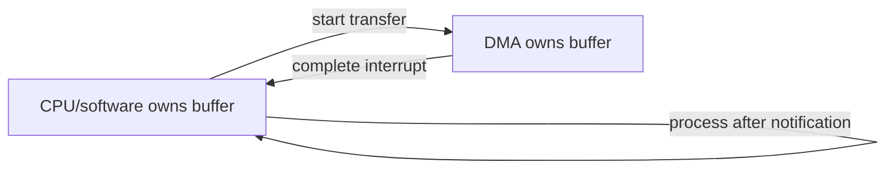
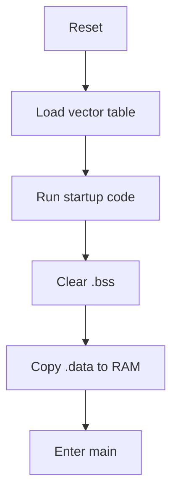
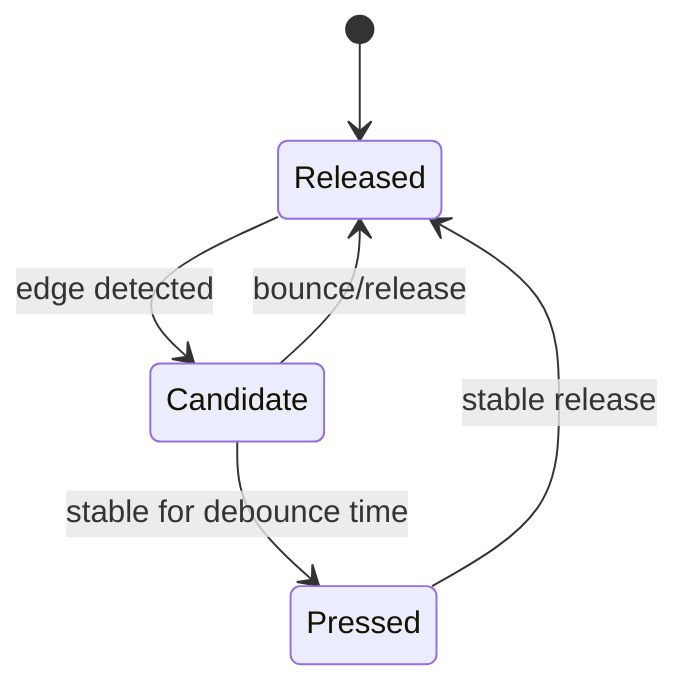
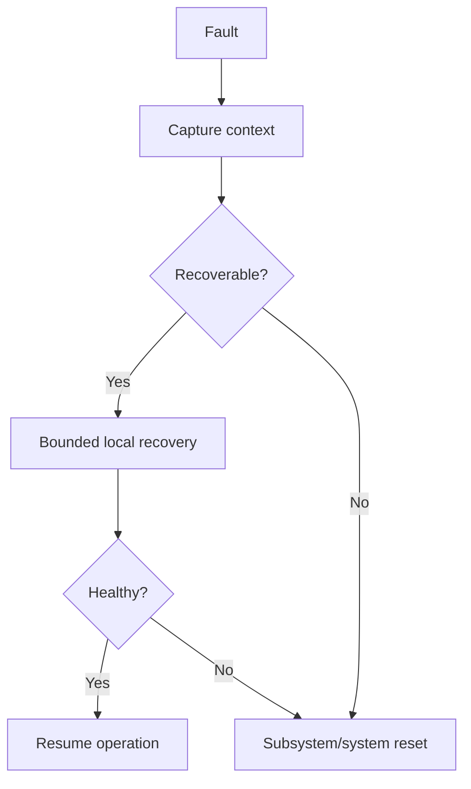
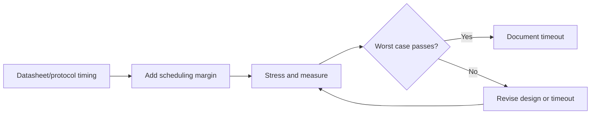

# Advanced 04 Embedded C Study Notes

> 50-question deep-dive track. Use each Q&A as a flashcard: answer aloud, review the example, then explain the failure mode or trade-off.

## How to Study

1. Read the question and answer it without looking at the notes.
2. Read the short answer in simple terms.
3. Explain the practical example in your own words.
4. Trace the flowchart when the topic involves state, ownership, startup, recovery, or timing.
5. Finish by stating one failure mode and one design rule.

## Topic Map

| Questions | Topic |
| --- | --- |
| 1-10 | Registers, interrupts, critical sections, and DMA |
| 11-20 | Timing, startup code, memory sections, and board support |
| 21-30 | Drivers, timeouts, debouncing, and UART data flow |
| 31-40 | Interrupt debugging, linker data, memory maps, and recovery |
| 41-50 | Brownout safety, errata, testing, contracts, and validation |

## Plain-English Terms

| Term | Simple meaning |
| --- | --- |
| `volatile` | Read or write the value because hardware or another context may change it. |
| DMA | Hardware moves data without the CPU copying every byte. |
| ISR | A short function that runs when hardware raises an interrupt. |
| Critical section | A small section of code protected from unsafe concurrent access. |
| BSP | Board-specific setup for pins, clocks, and peripherals. |
| HAL | A software layer that hides direct register access. |
| `.bss` | RAM for static variables that start at zero. |
| `.data` | RAM variables that start with stored non-zero values. |
| `.rodata` | Read-only constants, often kept in flash. |
| Erratum | A known hardware bug and its recommended workaround. |

## Core Questions

Each answer is intentionally short. Use the review section below for the example, follow-up, and flowchart.

### 1. Why is memory-mapped I/O central to MCU firmware?

Peripherals are commonly controlled through addressable registers, so C reads/writes become hardware operations.

### 2. Why should register definitions use volatile?

Hardware can change register values independently of the C flow, so accesses must remain observable.

### 3. What is read-modify-write risk?

A statement like reg |= mask reads the whole register and writes it back. If some bits are write-one-to-clear or changed by hardware, the operation can unintentionally alter other fields.

### 4. What is write-one-to-clear?

A status bit may clear when software writes a 1 to that bit. Such registers should not be treated like ordinary read/write fields.

### 5. Why do reserved bits matter?

The reference manual may require them to retain reset values or be written as specific values. Blind writes can cause undefined peripheral behavior.

### 6. Polling versus interrupts in a driver?

Polling is simpler and sometimes useful for short bounded operations. Interrupts improve responsiveness and CPU efficiency for asynchronous events.

### 7. Why keep ISRs short?

Long handlers raise interrupt latency and can delay higher-priority work. Defer noncritical processing.

### 8. What is DMA buffer ownership?

At any instant software or DMA should have a clearly defined right to modify the buffer. Ambiguous ownership causes races and stale data.

### 9. What is cache coherency in DMA?

On cached systems, CPU and DMA may observe different versions unless cache maintenance or a coherent memory mechanism is used.

### 10. What is a critical section?

A region protected against the concurrency hazard relevant to the resource. Its exact implementation can be interrupt masking, a mutex, atomic operation, or another mechanism.

### 11. Why avoid disabling interrupts for long periods?

It increases interrupt latency and can break real-time behavior, communication servicing, or watchdog assumptions.

### 12. What is a watchdog window?

A watchdog variant that expects refresh only within a permitted time interval, allowing detection of both missed and premature refreshes.

### 13. What is brownout reset?

A protection mechanism that resets the system when supply voltage falls below a configured threshold to prevent unreliable operation.

### 14. What is startup code responsible for?

It establishes the CPU/runtime environment, initializes memory sections as required, and then transfers control to application code.

### 15. What is .isr_vector?

A common section name for the interrupt/vector table placed at an architecture-appropriate memory address. Exact section naming depends on toolchain and startup files.

### 16. What is .bss?

A section typically used for zero-initialized static storage. Startup code normally clears it before main.

### 17. What is .data?

Initialized writable data whose initial values are stored in the program image and copied to RAM during startup.

### 18. What is .rodata?

A common section for read-only constants and string literals.

### 19. Why should firmware have explicit ownership of peripheral initialization?

Multiple modules writing the same clock, pin, or register configuration create hidden coupling and race conditions.

### 20. What is a BSP?

Board Support Package code that adapts generic software to board-specific pins, clocks, peripherals, and startup details.

### 21. HAL versus register-level programming?

HAL reduces direct hardware coupling and improves reuse; register-level code gives precise control but increases device-specific maintenance.

### 22. Why can HAL APIs still fail in production?

An API may return a timeout or error because of clocks, pins, electrical issues, sequence requirements, or silicon errata. A successful function call does not prove the hardware result.

### 23. How do you design a safe timeout?

Base it on an actual time source or bounded deadline, not an arbitrary loop count, unless iteration timing is proven constant.

### 24. What is debouncing?

Filtering mechanical switch transitions so one physical press generates one logical state change.

### 25. Why use a state machine for debouncing?

It makes the stable/candidate states and time thresholds explicit without blocking the rest of the system.

### 26. How do you handle UART framing?

Define packet boundaries using delimiters, length fields, or fixed sizes; validate lengths and checksum/CRC before dispatching.

### 27. What is an overrun error?

The receiver failed to consume incoming data before new data arrived, potentially losing bytes. The recovery method depends on the peripheral.

### 28. What is a ring buffer good for?

It decouples producer and consumer timing for streaming data with bounded memory.

### 29. Why use separate RX and TX state?

Receive and transmit often have different lifecycles, buffering, and interrupt/DMA handling; independent state reduces coupling.

### 30. What is an interrupt storm?

An interrupt source generates events so frequently that the CPU spends excessive time servicing it, starving other work.

### 31. How would you debug an interrupt storm?

Check the source flag, polarity/edge configuration, handler clearing sequence, electrical signal quality, and event rate using registers plus a logic analyzer/scope.

### 32. What is priority grouping?

A mechanism on some interrupt controllers that splits priority representation into preemption and subpriority fields. Exact behavior depends on the ARM interrupt controller configuration.

### 33. Why use DMA circular mode for UART RX?

It allows continuous capture into a ring-like memory area, reducing per-byte interrupts. Firmware tracks the producer position and processes new data.

### 34. What is a linker symbol?

A named address/value created or resolved by the linker, often used for section boundaries, stack limits, or bootloader/application interfaces.

### 35. Why inspect the map file?

It reveals flash/RAM usage, section placement, symbol addresses, and unexpected library or object contributions.

### 36. What is a memory map?

A defined arrangement of code, data, peripherals, boot regions, and RAM/flash areas in the processor address space.

### 37. How do you detect stack overflow without hardware trace?

Use RTOS stack checks where available, guard patterns, high-water marks, and fault dumps.

### 38. Why can logging change a bug?

Logging changes timing, interrupt load, memory pressure, and sometimes synchronization, so race/timing bugs can disappear or worsen.

### 39. What is a safe-state concept?

A predefined hardware/software condition that minimizes hazard when normal operation cannot be maintained.

### 40. How do you design fault recovery?

Classify the fault, preserve useful context, attempt bounded local recovery, and escalate to subsystem/system reset when required.

### 41. What is a brownout-sensitive firmware design issue?

Nonvolatile writes can be interrupted and peripheral state can become invalid. Update protocols need power-loss recovery and validated persistent metadata.

### 42. Why is the datasheet not enough for register programming?

The reference manual contains detailed peripheral behavior; the datasheet contains electrical, package, timing, and device-specific limits. Errata may add further constraints.

### 43. What is a silicon erratum?

A documented hardware deviation from expected behavior, often requiring firmware workarounds.

### 44. How do you unit-test register-level logic?

Separate calculation/state logic from actual register access, then use fakes or abstraction layers for hardware operations.

### 45. What is a driver contract?

The API plus defined states, timing, ownership, errors, concurrency assumptions, and recovery behavior expected by callers.

### 46. What is the strongest Embedded C interview answer pattern?

State the concept, explain why the hardware needs it, show a small example, then explain a failure mode or trade-off.

### 47. Why is board-level validation necessary after a clean compile?

Firmware correctness includes electrical behavior, timing, pin configuration, clocking, signal integrity, and actual device responses that a compiler cannot verify.

### 48. How do you design an ISR-safe peripheral API?

Separate ISR-safe operations from blocking task APIs, document execution context for each function, and provide explicit handoff mechanisms for deferred processing.

### 49. How do you detect a peripheral state corruption?

Compare expected register/state invariants, log transition points, reset/reinitialize the peripheral in a controlled test, and correlate faults with bus waveforms.

### 50. How do you prove a driver timeout is sufficient?

Base it on the peripheral datasheet/protocol worst-case timing plus system scheduling margin, and verify the timeout through stress testing rather than an arbitrary constant.

## Review Examples and Flowcharts

Use this section after attempting the core questions. The examples show the expected engineering reasoning; the flowcharts summarize topics where sequence or ownership matters.

### Questions 1-10: Registers, Interrupts, and DMA

- **1 Example:** `*(volatile uint32_t*)0x40020000u = 1u;` writes a memory-mapped peripheral register. **Follow-up:** Why use a device header instead? It documents addresses and fields.
- **2 Example:** `volatile uint32_t status = peripheral->STATUS;` forces the compiler to perform the register read. **Follow-up:** Does volatile make access atomic? No.
- **3 Example:** Prefer an atomic set register over `reg |= mask` when hardware can change bits asynchronously. **Follow-up:** What is the risk? A read-modify-write race.
- **4 Example:** `peripheral->STATUS = STATUS_RX_READY;` clears a write-one-to-clear flag. **Follow-up:** Why not write zero? It may have no effect.
- **5 Example:** Preserve reserved bits with a documented mask instead of writing `0xFFFFFFFFu`. **Follow-up:** Where is the required value defined? The reference manual.
- **6 Example:** Poll a short ADC conversion, but use an interrupt for a long asynchronous transfer. **Follow-up:** What decides the choice? Latency, CPU cost, and operation duration.
- **7 Example:** An ISR stores the received byte and wakes a task; parsing stays outside the ISR. **Follow-up:** What is the benefit? Lower interrupt latency.
- **8 Example:** DMA owns a receive buffer during transfer; software owns it only after completion notification. **Follow-up:** What causes corruption? Both contexts write or read it at once.
- **9 Example:** Clean the D-cache before DMA reads a buffer and invalidate it before the CPU consumes DMA-written data. **Follow-up:** Is this needed on every MCU? No, mainly on cached systems.
- **10 Example:** Protect a shared register update with a short critical section or atomic operation. **Follow-up:** Why not mask interrupts for a whole transaction? It increases latency.

### Questions 11-20: Timing, Startup, and Memory Sections

- **11 Example:** Measure an interrupt-disabled region with a GPIO and compare it with the maximum latency budget. **Follow-up:** What can fail? UART overrun, missed deadlines, or watchdog timing.
- **12 Example:** A windowed watchdog rejects a refresh that occurs immediately after the previous refresh. **Follow-up:** What two failures does it detect? Missed and premature refreshes.
- **13 Example:** Brownout reset prevents code from continuing when the supply falls below the safe threshold. **Follow-up:** What must persistent data handle? Interrupted writes.
- **14 Example:** Startup copies initialized globals from flash to RAM before calling `main()`. **Follow-up:** What happens to uninitialized static data? It is cleared.
- **15 Example:** The linker places `.isr_vector` at the reset-defined vector-table address. **Follow-up:** What breaks if it is misplaced? Reset and interrupt dispatch.
- **16 Example:** `static uint32_t counters[16];` is placed in `.bss` and cleared during startup. **Follow-up:** Why is `.bss` not stored byte-for-byte in flash? Its initial value is zero.
- **17 Example:** `uint32_t baud_rate = 115200u;` is copied from the image into writable RAM. **Follow-up:** What increases image size? Initialized writable data.
- **18 Example:** `static const char banner[] = "Boot OK";` normally belongs in read-only storage. **Follow-up:** Can the linker place it in flash? Yes, with the correct memory regions.
- **19 Example:** One clock manager owns peripheral-clock setup while drivers request capabilities through an API. **Follow-up:** Why? It prevents hidden register conflicts.
- **20 Example:** A BSP maps `BOARD_STATUS_LED` to the actual GPIO for a board revision. **Follow-up:** What does application code avoid? Board-specific pin numbers.

### Questions 21-30: Drivers, Timeouts, and Serial Data

- **21 Example:** A HAL function configures a UART while a register-level helper sets one exact bit for a timing workaround. **Follow-up:** What is the trade-off? Reuse versus precise control.
- **22 Example:** `hal_uart_send()` returns timeout because the UART clock was never enabled. **Follow-up:** Does a successful API call prove data was transmitted? No, verify hardware state.
- **23 Example:** Use a deadline instead of an arbitrary loop count: `deadline = now + 10u;`. **Follow-up:** What clock is suitable? A monotonic timer.
- **24 Example:** Require a button to remain pressed for 20 ms before accepting a state change. **Follow-up:** Why not delay in the ISR? It blocks other work.
- **25 Example:** A debounce state machine moves from `RELEASED` to `CANDIDATE` and then `PRESSED` after the threshold. **Follow-up:** What does it avoid? Blocking delays.
- **26 Example:** A UART frame uses sync, length, payload, and CRC fields. **Follow-up:** What happens after a bad CRC? Discard and resynchronize.
- **27 Example:** Read the UART status register, clear the overrun condition, and reset the receive state if necessary. **Follow-up:** Can the lost byte be recovered? Usually not.
- **28 Example:** A ring buffer lets an ISR receive bytes while a task parses them later. **Follow-up:** What must be bounded? Capacity and overflow behavior.
- **29 Example:** RX state tracks head/tail while TX state tracks pending bytes and DMA completion independently. **Follow-up:** Why separate them? Their lifecycles differ.
- **30 Example:** An interrupt storm can occur when the handler returns without clearing the source flag. **Follow-up:** What evidence helps? Event counters and scope captures.

### Questions 31-40: Interrupts, Linker Data, and Faults

- **31 Example:** Verify the peripheral interrupt flag is cleared after servicing; otherwise the CPU immediately re-enters the handler. **Follow-up:** What else can cause storms? Wrong edge polarity or noisy wiring.
- **32 Example:** Configure an interrupt controller with preemption priority and subpriority fields according to the MCU rules. **Follow-up:** Are numeric priorities universal? No, encoding differs by controller.
- **33 Example:** UART RX DMA continuously fills a circular buffer while software compares the DMA write index with its last index. **Follow-up:** What must handle wraparound? The producer-index calculation.
- **34 Example:** Linker symbols such as `__StackTop` and `__StackLimit` define startup and overflow checks. **Follow-up:** Where are they created? In the linker script.
- **35 Example:** A map file reveals that formatted logging pulled a large library into flash. **Follow-up:** What action follows? Remove or replace the expensive path.
- **36 Example:** A memory map assigns flash for code, SRAM for data, and a reserved region for boot metadata. **Follow-up:** Why reserve regions? To protect bootloader/application contracts.
- **37 Example:** Fill a task stack with `0xA5A5A5A5` and scan the untouched pattern after stress testing. **Follow-up:** What does the watermark show? Minimum remaining stack.
- **38 Example:** Adding `printf()` makes a race disappear because it changes task scheduling. **Follow-up:** Is logging a fix? No, it changes timing.
- **39 Example:** A motor controller enters a disabled output state after a watchdog fault. **Follow-up:** What defines safe? Product hazard analysis and system requirements.
- **40 Example:** Save fault context, retry a peripheral once, then escalate to subsystem reset if recovery fails. **Follow-up:** Why bound recovery? To avoid endless unsafe retries.

### Questions 41-50: Validation, Testing, and Driver Contracts

- **41 Example:** Store firmware metadata in two records with sequence numbers and CRC so a brownout can select the newest valid record. **Follow-up:** What prevents partial metadata? Atomic commit markers.
- **42 Example:** Use the reference manual for a timer's register sequence and the datasheet for maximum input frequency. **Follow-up:** What does errata add? Known device-specific exceptions.
- **43 Example:** Add a delay or alternate register access sequence required by a documented silicon erratum. **Follow-up:** How should it be tracked? As a versioned, device-specific workaround.
- **44 Example:** Test a register calculation with a fake register block while hardware access is injected behind an interface. **Follow-up:** What stays out of the unit test? Real peripheral side effects.
- **45 Example:** Document that `driver_start()` is task-context only, may return timeout, and transfers buffer ownership after success. **Follow-up:** Why document context? Callers need concurrency and timing guarantees.
- **46 Example:** Explain a volatile register, show a masked write, and describe what happens if another agent changes the register between read and write. **Follow-up:** What makes the answer senior? Hardware consequence and trade-off.
- **47 Example:** A clean compile cannot detect a swapped UART pin, wrong pull-up, or marginal clock. **Follow-up:** What validates those? Board-level tests and instruments.
- **48 Example:** `uart_rx_isr()` enqueues a byte while `uart_read_frame()` blocks only in task context. **Follow-up:** Why separate APIs? ISR code must not block.
- **49 Example:** Compare an expected enable-bit invariant with the register dump after a fault and correlate it with a logic-analyzer capture. **Follow-up:** What does this distinguish? Software corruption from electrical/protocol failure.
- **50 Example:** Set a timeout from datasheet worst-case conversion time plus scheduler margin and verify it under load. **Follow-up:** What proves sufficiency? Stress tests and measured worst-case timing.

