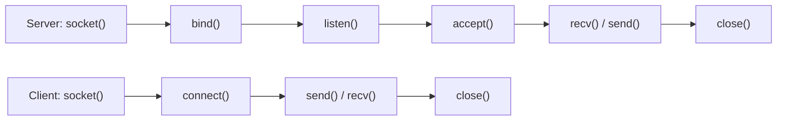
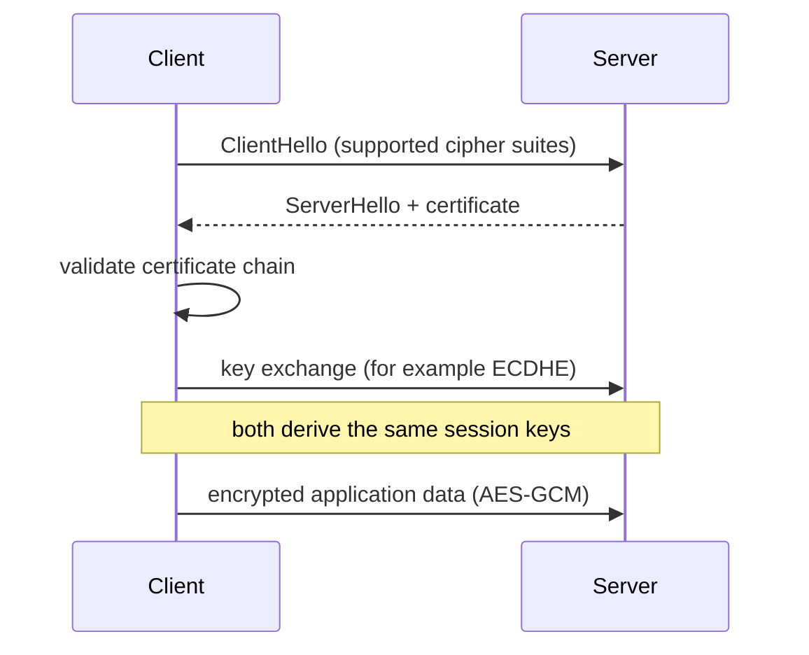
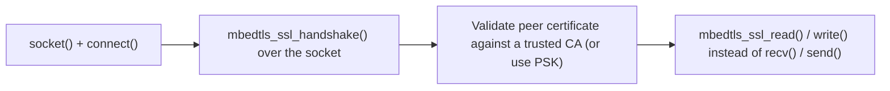

# Advanced Networking and Embedded Security Questions

How to use this file: read the **Short answer** first, then the details and the commented example. Each question ends with a **Remember** line.

## Contents

| Questions | Topic |
| --- | --- |
| 1-10 | Sockets, TCP and UDP, TLS, crypto basics, credentials, OTA |
| 11-20 | Embedded cryptography and network security |
| 21-32 | Socket programming |

---

## 1. TCP vs UDP in firmware

**Short answer:** TCP is a reliable byte stream. UDP is unreliable datagrams where the application handles reliability.

| | TCP | UDP |
| --- | --- | --- |
| Connection | Yes | No |
| Delivery | Reliable, ordered | No guarantee |
| Overhead | Higher | Lower |
| Message boundaries | No (byte stream) | Yes (datagrams) |

Choose by latency, reliability, connection management, and protocol requirements.

## 2. What is a socket?

**Short answer:** An operating-system API abstraction for network communication.



## 3. Why can a TCP receive return fewer bytes than requested?

**Short answer:** TCP is a byte stream, not a message protocol. A receive returns any positive number of bytes up to the requested size.

Applications need their own framing on top of TCP.

**Remember:** one `send()` does not equal one `recv()`.

## 4. HTTP vs HTTPS

**Short answer:** HTTPS is HTTP carried over TLS. It gives encryption and server authentication when certificates and trust anchors are validated correctly.

## 5. What is TLS doing in an IoT device?

**Short answer:** It gives confidentiality, integrity, and peer authentication.

Embedded implementation must consider:

- Certificate storage
- Entropy (random number source)
- Session lifecycle
- Memory footprint
- Algorithm availability
- Credential provisioning
- Failure handling

## 6. Symmetric vs asymmetric cryptography

| | Symmetric (AES) | Asymmetric (RSA, ECC) |
| --- | --- | --- |
| Keys | One shared secret | A key pair (public and private) |
| Speed | Fast, good for bulk data | Slower |
| Typical job | Encrypt the data | Authenticate and establish keys |

## 7. What is SHA-256?

**Short answer:** A cryptographic hash function producing a 256-bit digest. It gives integrity properties, but it is not encryption.

## 8. How should device credentials be protected?

- Do not hard-code reusable secrets into public source code
- Use secure provisioning and protected key storage when the hardware supports it
- Limit credentials to the permissions required
- Define rotation and revocation procedures

## 9. How would you secure firmware OTA?

- Authenticate the image before activation
- Protect the transport with appropriate security
- Use version and rollback protection
- Keep an interrupted update recoverable
- Log failures without exposing secrets

Product security requirements decide the exact design.

## 10. Why is entropy important?

**Short answer:** Security operations such as nonce and key generation need unpredictable randomness.

Prefer a cryptographically secure RNG or hardware entropy source over counters or timestamps.

## 11. What is a MAC, and how does it differ from a hash?

**Short answer:** A MAC (for example HMAC-SHA256) mixes a secret key into the tag, so it proves integrity **and** authenticity.

| | Plain hash | MAC |
| --- | --- | --- |
| Needs a key | No | Yes |
| Anyone can compute it | Yes | No, only key holders |
| Proves who sent it | No | Yes |

HMAC is commonly used to authenticate firmware packets or sensor payloads over unauthenticated transports like UDP.

## 12. What is AEAD, and what is an embedded example?

**Short answer:** Authenticated Encryption with Associated Data: confidentiality plus integrity in one primitive.

AES-GCM and ChaCha20-Poly1305 are common. "Associated data" (a packet header, a sequence number) is authenticated but not encrypted. AES-GCM is common in mbedTLS and wolfSSL because it is efficient with hardware AES, but **each encryption needs a unique nonce**. Reusing a nonce with the same key breaks confidentiality.

## 13. Why is nonce or IV reuse dangerous?

**Short answer:** In CTR and GCM the keystream comes from key plus nonce. Reusing both produces the same keystream.

```text
C1 = P1 XOR keystream
C2 = P2 XOR keystream      (same nonce and key)
C1 XOR C2 = P1 XOR P2      the keystream cancels, leaking the plaintexts
```

On constrained devices this can happen after a reset if the nonce counter was not saved in non-volatile storage. Persist counters, derive nonces from a monotonic source, or use large random nonces.

## 14. What is a replay attack, and how do you prevent it?

**Short answer:** An attacker records a valid message and sends it again later.

Example: replaying an "unlock door" command. Mitigations: sequence numbers or timestamps inside the authenticated data, short validity windows, and tracking recently seen message IDs.

Even encrypted and authenticated messages need this. AEAD alone does not stop replay of a captured ciphertext.

## 15. Explain a TLS handshake for an MCU with limited RAM and flash

**Short answer:** Negotiate, authenticate, exchange keys, then switch to fast symmetric encryption.



On MCUs, X.509 chain validation and RSA are costly in RAM, flash, and time. Prefer ECC, or TLS-PSK and session resumption, trading some flexibility for footprint.

## 16. What is Perfect Forward Secrecy, and why does it matter for IoT fleets?

**Short answer:** If a long-term key is stolen later, past recorded traffic still cannot be decrypted.

Each session uses an ephemeral key (for example ECDHE) that is discarded afterwards. For fleets where a device key might eventually be extracted, PFS limits the damage to future sessions instead of exposing recorded history.

## 17. How do you defend against buffer overflows in a network-facing parser?

```c
bool parse_frame(const uint8_t *buf, size_t len)
{
    if (buf == NULL || len < HEADER_SIZE) return false;     /* reject short input */

    uint16_t payload_len = read_u16_le(&buf[1]);            /* untrusted length field */
    if (payload_len > MAX_PAYLOAD || payload_len > len - HEADER_SIZE) {
        return false;                                       /* validate BEFORE copying */
    }
    memcpy(local, &buf[HEADER_SIZE], payload_len);          /* now safe */
    return true;
}
```

- Validate every length against buffer capacity before copying
- Avoid `strcpy`, `sprintf`, and unchecked `memcpy`
- Prefer a state-machine parser that consumes bytes incrementally
- Enable stack canaries (`-fstack-protector`) and MPU stack and heap separation where available

Many embedded targets lack ASLR and DEP, so one overflow in a network parser is a high-severity bug.

## 18. What is a side-channel attack, and how does it apply to embedded crypto?

**Short answer:** It extracts keys from physical behaviour (timing, power, electromagnetic emissions) instead of breaking the maths.

Example: an AES implementation with data-dependent timing can leak key bits through variations measurable on the power rail.

```c
/* Constant-time comparison: takes the same time whether or not the bytes match. */
int ct_equal(const uint8_t *a, const uint8_t *b, size_t n)
{
    uint8_t diff = 0;
    for (size_t i = 0; i < n; i++) diff |= a[i] ^ b[i];    /* no early exit */
    return diff == 0;
}
```

Mitigations: constant-time code, no secret-dependent branches or array indexes, and hardware crypto accelerators designed to resist power analysis.

## 19. Secure boot vs secure OTA: how do they relate?

**Short answer:** They are complementary.

| | Secure boot | Authenticated OTA |
| --- | --- | --- |
| Checks | The image at startup | The image when it arrives |
| Stops | Malicious code running, even if it got onto the device another way (debug port) | Malicious firmware delivered over the air |

## 20. What is a Root of Trust?

**Short answer:** The minimal hardware or immutable code that is trusted by definition and cannot be bypassed.

Examples: a secure element, a hardware unique key in fuses, or a boot ROM that cannot be reflashed. Secure boot, secure storage, and attestation are built on top. If the root is compromised, the whole chain of trust collapses.

---

## Socket programming

## 21. TCP server socket lifecycle (C, POSIX)

```c
int sfd = socket(AF_INET, SOCK_STREAM, 0);                 /* 1. create a TCP socket */
setsockopt(sfd, SOL_SOCKET, SO_REUSEADDR, &opt, sizeof(opt));   /* allow quick restart */
bind(sfd, (struct sockaddr *)&addr, sizeof(addr));         /* 2. attach to a local address and port */
listen(sfd, backlog);                                      /* 3. mark as passive, set the pending queue */
int cfd = accept(sfd, NULL, NULL);                         /* 4. wait for a client; returns a NEW socket */
read(cfd, buf, sizeof(buf));                               /* 5. receive on the connected socket */
write(cfd, resp, resp_len);                                /*    and reply */
close(cfd);                                                /* 6. close the client socket */
close(sfd);                                                /*    and the listening socket */
```

`accept()` returns a new file descriptor per connection. The listening socket keeps listening.

## 22. Client-side TCP socket lifecycle

```c
int sfd = socket(AF_INET, SOCK_STREAM, 0);                 /* create */
connect(sfd, (struct sockaddr *)&server_addr, sizeof(server_addr));   /* TCP three-way handshake */
write(sfd, req, req_len);                                  /* send the request */
read(sfd, buf, sizeof(buf));                               /* read the reply */
close(sfd);
```

No `bind()` is needed. The OS assigns an ephemeral local port.

## 23. Blocking vs non-blocking sockets

**Short answer:** A blocking call waits. A non-blocking call returns immediately with `EWOULDBLOCK` or `EAGAIN`.

Non-blocking sockets combined with `select()` or `poll()` (or lwIP's callback API) let one task serve several connections while still doing other work, without a thread per socket.

```c
int flags = fcntl(fd, F_GETFL, 0);
fcntl(fd, F_SETFL, flags | O_NONBLOCK);       /* make the socket non-blocking */
```

## 24. What do `select()` and `poll()` do?

**Short answer:** One thread watches many sockets and wakes when at least one is ready.

```c
fd_set rfds;
FD_ZERO(&rfds);
FD_SET(server_fd, &rfds);                      /* watch the listening socket */
FD_SET(client_fd, &rfds);                      /* and a client socket */
struct timeval tv = { .tv_sec = 1, .tv_usec = 0 };
int n = select(max_fd + 1, &rfds, NULL, NULL, &tv);   /* wait up to 1 second */
if (n > 0 && FD_ISSET(client_fd, &rfds)) { /* client_fd has data */ }
```

This avoids a thread per connection, which matters with little RAM per stack.

## 25. TCP socket vs UDP socket API

| | TCP (`SOCK_STREAM`) | UDP (`SOCK_DGRAM`) |
| --- | --- | --- |
| Setup | `connect()` and `accept()` | None: `bind()` then `recvfrom()` and `sendto()` |
| Peer address | Fixed by the connection | Given on every packet (or fixed with `connect()`) |
| Reliability | Built in | None: datagrams can be lost or reordered |

## 26. Why must you handle partial reads and writes on TCP?

**Short answer:** One `send()` may write fewer bytes than asked, and one `recv()` may return fewer than sent.

```c
size_t total = 0;
while (total < len) {
    ssize_t n = send(fd, buf + total, len - total, 0);   /* send the rest */
    if (n <= 0) { /* handle error or EINTR */ break; }
    total += n;                                          /* advance by what was really sent */
}
```

## 27. How do you implement message framing over TCP?

| Method | How | Note |
| --- | --- | --- |
| Fixed length | Every message is the same size | Simple, inflexible |
| Length prefix | A 2 or 4 byte length before the payload | Preferred for binary data |
| Delimiter | A terminator such as a newline | Good for text protocols |

Length-prefixing avoids scanning and handles arbitrary binary payloads.

## 28. `close()` vs `shutdown()`

**Short answer:** `close()` releases the descriptor. `shutdown()` half-closes the connection.

```c
shutdown(fd, SHUT_WR);        /* send FIN: "I am done sending", but keep reading the reply */
```

This suits a client that sends a request, signals "done", and then reads the full response.

## 29. How do you set socket timeouts?

```c
struct timeval tv = { .tv_sec = 5, .tv_usec = 0 };
setsockopt(fd, SOL_SOCKET, SO_RCVTIMEO, &tv, sizeof(tv));     /* recv() gives up after 5 s */
```

Without a timeout, `recv()` on a dead peer or dropped Wi-Fi link can block forever, which is unacceptable on a device that must stay responsive.

## 30. How do you secure a raw socket with TLS (for example mbedTLS)?

**Short answer:** Wrap the connected socket in a TLS layer. The socket API itself does not change.



## 31. What is `SO_REUSEADDR`, and why set it on servers that restart?

**Short answer:** It lets `bind()` reuse an address in the `TIME_WAIT` state.

Without it, `bind()` can fail with "address already in use" for a couple of minutes after a restart. That is a problem for a device that reboots its network stack and must reopen its listener immediately.

## 32. How do you handle a peer that disconnects abruptly?

**Short answer:** `recv()` returning 0 means the peer closed cleanly. A negative return with `ECONNRESET` means it reset the connection.

```c
ssize_t n = recv(fd, buf, sizeof buf, 0);
if (n == 0)          { /* orderly close from the peer */ }
else if (n < 0)      { /* error: check errno (ECONNRESET, ETIMEDOUT, ...) */ }

send(fd, data, len, MSG_NOSIGNAL);    /* avoid SIGPIPE killing the process when the peer is gone */
```

Writing to a reset socket can raise `SIGPIPE`, which kills the process by default. Servers ignore `SIGPIPE` or use `MSG_NOSIGNAL`, and clean up that connection's resources instead of treating it as fatal.
