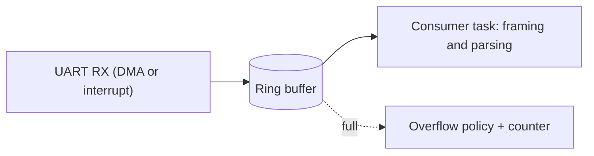

# Advanced Driver Engineering Questions

How to use this file: read the **Short answer**, explain it aloud, then check the details and the commented example. Each question ends with a **Remember** line.

## 1. What makes a good peripheral driver?

**Short answer:** A small clear API, ownership of its own hardware, explicit state and errors, no hidden globals, and documented timing.

A good driver:

- Has a clear API (`init`, `read`, `write`, `deinit`)
- Owns the hardware configuration it is responsible for
- Has explicit initialization, state, and error behaviour
- Avoids hidden global coupling
- Documents timing and concurrency assumptions (can it be called from an ISR? is it thread-safe?)

**Remember:** if a caller must know internals to use it safely, the API is wrong.

## 2. Blocking vs non-blocking driver API

**Short answer:** Blocking is simple but stalls the caller. Non-blocking is responsive but needs interrupts or DMA and a completion mechanism.

```c
/* Blocking: caller waits until done. Simple, but the task is stuck for the device's time. */
drv_status_t uart_write_blocking(const uint8_t *data, size_t len, uint32_t timeout_ms);

/* Non-blocking: returns immediately; the driver calls back when finished. */
drv_status_t uart_write_async(const uint8_t *data, size_t len,
                              void (*on_done)(drv_status_t result, void *ctx),
                              void *ctx);
```

**Remember:** pick the style that matches the system's timing requirements. A blocking call inside a fast control task is a bug.

## 3. How would you design a UART driver for high throughput?

**Short answer:** Interrupt or DMA receive into a ring buffer, explicit framing, bounded memory, and a non-blocking consumer.



Define in advance what happens on:

- **Overflow** (drop newest, drop oldest, count it)
- **Framing or parity errors** (discard the byte, count it, resynchronize)

**Remember:** the interrupt or DMA moves bytes; a task does the parsing.

## 4. How do you handle hardware timeout?

**Short answer:** Every wait on external hardware needs a limit. On timeout, report it, save diagnostics, and reset the peripheral to a known state before retrying.

```c
drv_status_t i2c_read_reg(uint8_t addr, uint8_t reg, uint8_t *out)
{
    uint32_t start = get_tick_ms();

    /* Wait for the "transfer complete" flag, but never forever */
    while (!i2c_transfer_done()) {
        if ((get_tick_ms() - start) > I2C_TIMEOUT_MS) {
            i2c_log_fault(addr, reg);      /* keep diagnostics: which device, which register */
            i2c_reset_peripheral();        /* return the hardware to a known state */
            return DRV_ERR_TIMEOUT;        /* a distinct error, not a generic failure */
        }
    }
    *out = i2c_read_data();
    return DRV_OK;
}
```

**Remember:** distinct error code, diagnostics, known state, then retry.

## 5. How do you make a driver testable without hardware?

**Short answer:** Keep hardware access separate from protocol and state logic, and inject the hardware access.

```c
/* The driver only knows this interface, not the real I2C peripheral */
typedef struct {
    bool (*read)(uint8_t addr, uint8_t reg, uint8_t *val);
    bool (*write)(uint8_t addr, uint8_t reg, uint8_t val);
} bus_ops_t;

float sensor_read_temp(const bus_ops_t *bus)
{
    uint8_t raw;
    if (!bus->read(SENSOR_ADDR, REG_TEMP, &raw)) {
        return NAN;                          /* transport failure is reported, not hidden */
    }
    return raw * 0.5f;                       /* protocol/conversion logic under test */
}
/* In a unit test, pass a fake bus_ops_t that returns scripted values or errors. */
```

**Remember:** a test can now force a NACK, a timeout, or a bad value without any hardware.

## 6. What belongs in the BSP/HAL layer vs the device driver?

**Short answer:** MCU-specific work goes low; device-specific sequencing goes in the device driver.

| Layer | Contains | Example |
| --- | --- | --- |
| BSP / HAL (lower) | Pins, clocks, registers of the MCU | `i2c_transfer()`, `gpio_write()` |
| Device driver (upper) | Register map and protocol of one chip | "write 0x01 to CTRL, wait 10 ms, read TEMP" |

The boundary should be stable, so you can change the MCU without rewriting the sensor driver.

**Remember:** HAL knows the MCU; the device driver knows the chip.

## 7. What is idempotent initialization?

**Short answer:** Calling `init()` twice is safe, or fails in a predictable way without leaving corrupted state.

```c
drv_status_t uart_init(const uart_cfg_t *cfg)
{
    if (s_initialized) {
        uart_deinit();            /* clean restart, so a repeat call does not stack state */
    }
    /* ... configure clocks, pins, registers ... */
    s_initialized = true;
    return DRV_OK;
}
```

**Why it matters:** recovery code and controlled peripheral restarts call `init` again.

**Remember:** design `init` so it can be called after a failure.

## 8. How do you review register-level code?

**Short answer:** Check the details the reference manual makes easy to miss.

Checklist:

- Reset values and access types (read-only, write-only, read/write)
- Reserved bits (preserve or write as specified)
- Required ordering of writes
- Clock enabled before the register is touched
- **Write-one-to-clear** bits (writing 0 does nothing)
- `volatile` on register accesses
- **Read-modify-write** hazards with interrupts
- Silicon **errata** (the reference manual alone may not list every issue)

**Remember:** read the errata sheet for the exact silicon revision.
