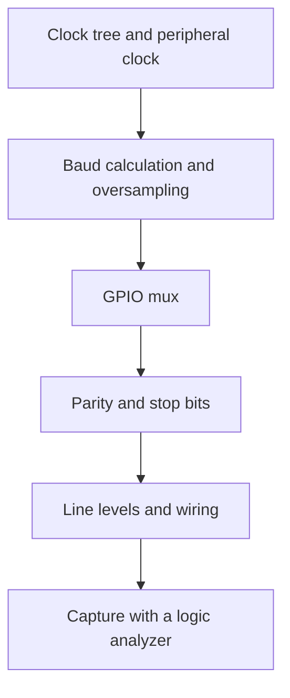
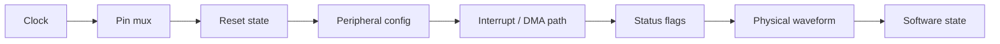

# Advanced STM32 Interview Questions

How to use this file: this is a 50-question flashcard track in numbered order. Answer each question aloud first, then compare with the **Short answer** and the explanation. Each question has a **Topic** tag so you can study one area at a time.

Topic tags: Clock, Timer, GPIO, UART, SPI, I2C, CAN, ADC, Interrupt, Fault, Tools, Practice.

---

## 1. What is RCC and why does every STM32 project care about it?

**Topic:** Clock

**Short answer:** RCC controls clocks and resets. A peripheral with no clock does nothing.

```c
RCC->APB1ENR |= RCC_APB1ENR_TIM2EN;    /* enable the clock for TIM2 before touching TIM2 registers */
```

A missing or wrong clock source makes a peripheral fail or behave strangely.

## 2. How do you derive a timer period?

**Topic:** Timer

**Short answer:** Start from the timer's input clock, then apply the prescaler and auto-reload.

```text
timer_clock = (input clock of THAT timer, not the CPU clock)
update_freq = timer_clock / ((PSC + 1) x (ARR + 1))
period      = 1 / update_freq
```

Example: timer clock 84 MHz, PSC = 83, ARR = 999. Counter clock = 84 MHz / 84 = 1 MHz. Update frequency = 1 MHz / 1000 = 1 kHz (1 ms).

## 3. Why can the STM32 timer clock differ from the APB clock?

**Topic:** Clock

**Short answer:** On many families, if the APB prescaler is not 1, the timer clock is doubled.

```text
Example: APB1 prescaler = 4  ->  APB1 bus = 42 MHz  ->  TIM2 clock = 84 MHz (x2)
```

The exact rule is family-specific. Check the clock tree in the reference manual.

## 4. How do you calculate PWM duty?

**Topic:** Timer

**Short answer:** Compare value relative to the period.

```text
duty % = CCR / (ARR + 1) x 100        (edge-aligned PWM mode 1, active-high)
```

Exact edge behaviour depends on the mode and polarity.

## 5. What is center-aligned PWM?

**Topic:** Timer

**Short answer:** The timer counts up and then down, so the pulse is centred in the period.

```text
Edge-aligned:    counter only counts up     /|/|/|/|
Center-aligned:  counter counts up and down /\/\/\/\
```

It changes spectral characteristics and timing compared with edge-aligned PWM.

## 6. What is input capture?

**Topic:** Timer

**Short answer:** The timer saves its counter value when an edge arrives on an input pin.

```text
pulse_width = capture_falling - capture_rising     (in timer ticks)
```

It measures pulse width or period without tight polling.

## 7. What is output compare?

**Topic:** Timer

**Short answer:** The timer triggers an event when its counter equals the compare value. Used to generate delayed or timed outputs.

## 8. What is one-pulse mode?

**Topic:** Timer

**Short answer:** The timer produces one programmed pulse and then stops. Availability depends on the timer.

## 9. What is EXTI?

**Topic:** GPIO

**Short answer:** It routes GPIO events to interrupt lines. The exact multiplexing is family-specific.

## 10. How do internal GPIO pull-ups differ from external pull-ups?

**Topic:** GPIO

**Short answer:** Internal pulls are weak and loosely specified; external resistors are stronger and more predictable.

| | Internal pull-up | External pull-up |
| --- | --- | --- |
| Value | Roughly 30-50 kOhm, wide tolerance | You choose it |
| Use | Buttons, simple inputs | I2C, long lines, noise-sensitive lines |

## 11. What is alternate-function remapping (pin mux)?

**Topic:** GPIO

**Short answer:** It selects which peripheral signal is routed to a pin.

Peripherals can compete for the same pin, so the board design and mux configuration must agree.

## 12. How would you debug UART garbage data?

**Topic:** UART

**Short answer:** Work from the clock to the wire.



## 13. How does DMA improve UART throughput?

**Topic:** UART

**Short answer:** It moves data between the UART and memory with far fewer CPU interrupts.

Firmware must still handle buffer ownership, transfer completion, and errors.

## 14. What is ADC sample time?

**Topic:** ADC

**Short answer:** The time the ADC gives its sampling capacitor to charge to the input voltage.

High source impedance or high accuracy needs a longer sample time.

## 15. Resolution versus accuracy in an ADC

**Topic:** ADC

**Short answer:** Resolution is the number of codes; accuracy includes all the errors.

Accuracy includes offset, gain, linearity, reference, and noise.

## 16. What is oversampling?

**Topic:** ADC

**Short answer:** Combining several samples to reduce noise or gain effective resolution.

```c
uint32_t sum = 0;
for (int i = 0; i < 16; i++) sum += adc_read();
uint16_t result = (uint16_t)(sum >> 2);     /* 16 samples, shift right 2 -> about 2 extra bits */
```

The gain depends on the noise characteristics.

## 17. What is a DAC?

**Topic:** ADC

**Short answer:** It converts a digital code to an analog voltage, subject to reference, settling time, linearity, and output-stage limits.

## 18. IWDG versus WWDG

**Topic:** Fault

**Short answer:** Both reset a stuck system; the window watchdog also rejects a refresh that comes too early.

| | IWDG (independent) | WWDG (window) |
| --- | --- | --- |
| Clock | Separate low-speed oscillator | APB clock |
| Refresh rule | Any time before timeout | Only inside a time window |
| Catches | A hang | A hang, or code running too fast |

Configuration differs by family.

## 19. What is the NVIC?

**Topic:** Interrupt

**Short answer:** The Nested Vectored Interrupt Controller on Cortex-M. It handles enable, priority, pending state, and exception dispatch.

## 20. How do you avoid interrupt priority bugs?

**Topic:** Interrupt

**Short answer:** Plan a priority scheme, know the API restrictions, understand preemption, and test nested interrupts.

With FreeRTOS, interrupts that call `...FromISR` functions must have a priority value at or below `configMAX_SYSCALL_INTERRUPT_PRIORITY`.

## 21. What is SysTick typically used for?

**Topic:** Interrupt

**Short answer:** A regular system tick for the RTOS or timekeeping. Another timer can sometimes be used instead.

## 22. Why configure clocks before peripherals?

**Topic:** Clock

**Short answer:** Baud rates, timer periods, ADC timing, and bus speeds all depend on the clocks.

Wrong clocks create symptoms that look like peripheral bugs.

## 23. What is clock source failover?

**Topic:** Clock

**Short answer:** Some families monitor the oscillator (Clock Security System). If it fails, they switch to a backup source or force a safe state.

## 24. What are HSE and HSI?

**Topic:** Clock

**Short answer:** HSE is an external high-speed crystal or oscillator; HSI is an internal RC oscillator.

| | HSE (external) | HSI (internal) |
| --- | --- | --- |
| Accuracy | High (crystal) | Lower (RC, drifts with temperature) |
| Cost | Needs a crystal | Free |
| Use | UART baud accuracy, USB, precise timing | Simple applications, startup |

Names and frequencies vary by family.

## 25. What is the PLL used for?

**Topic:** Clock

**Short answer:** It multiplies or divides a source clock to get the core and peripheral frequencies you need, within device limits.

```text
SYSCLK = (HSE / M) x N / P         (typical STM32F4 form)
```

## 26. How do you debug a timer that runs twice as fast as expected?

**Topic:** Timer

**Short answer:** Recompute the real timer clock (including the APB x2 rule), then check PSC and ARR, and check whether you measured one or two edges per period.

## 27. Polling versus DMA for ADC

**Topic:** ADC

**Short answer:** Polling makes the CPU wait and read. DMA streams samples into memory with no CPU work per sample.

## 28. How would you implement periodic sampling?

**Topic:** ADC

**Short answer:** Use a timer to trigger the ADC, optionally with DMA, rather than software delays.


## 29. What are SPI CPOL and CPHA?

**Topic:** SPI

**Short answer:** CPOL is the clock idle level; CPHA selects which edge samples data.

| Mode | CPOL | CPHA |
| --- | --- | --- |
| 0 | 0 | 0 |
| 1 | 0 | 1 |
| 2 | 1 | 0 |
| 3 | 1 | 1 |

Master and slave must both match the slave's datasheet.

## 30. Why can I2C get stuck low?

**Topic:** I2C

**Short answer:** A slave may hold SDA or SCL low after a reset or fault.

Recovery: pulse SCL up to 9 times until SDA releases, send a STOP, then reinitialize the peripheral.

## 31. What does open-drain mean electrically?

**Topic:** I2C

**Short answer:** The output only pulls low, and otherwise lets go. A pull-up resistor makes the high level.

This lets many devices share one line safely.

## 32. How do you debug CAN no-ACK?

**Topic:** CAN

**Short answer:** Check the physical layer and the timing settings.

- Transceiver power and mode
- Bus termination (120 Ohm at each end)
- Bit rate and sample point
- Wiring and filters
- Is another active node present to acknowledge?

## 33. What is CAN bus-off?

**Topic:** CAN

**Short answer:** After too many transmit errors, the controller disconnects itself from the bus.

Recovery behaviour depends on the controller and configuration. Make it part of the driver design.

## 34. What is STM32CubeMX good for?

**Topic:** Tools

**Short answer:** Generating initial clock, pin, and peripheral configuration and project scaffolding.

Review the generated code against the reference manual and your requirements.

## 35. HAL callback pitfalls?

**Topic:** Tools

**Short answer:** Weak callbacks and hidden globals hide ownership and concurrency problems.

```c
/* Weak by default in HAL; you override it. Keep it short: it runs in interrupt context. */
void HAL_UART_RxCpltCallback(UART_HandleTypeDef *huart)
{
    /* set a flag or post to a queue only */
}
```

## 36. How do you choose HAL, LL, or registers?

**Topic:** Tools

**Short answer:** Use the highest layer that meets your timing and control needs. Drop lower only where justified.

## 37. What is a linker scatter or load issue?

**Topic:** Fault

**Short answer:** Code or data placed in the wrong memory region, or startup copy/clear that does not match the section layout.

The **map file** and **linker script** are the main debugging tools.

## 38. How do you debug a HardFault on STM32?

**Topic:** Fault

**Short answer:** Get the stacked registers and fault status, then map the PC to source.

```c
/* Typical approach: a naked handler passes the stack pointer to a C function */
void hardfault_c(uint32_t *stack)
{
    uint32_t pc   = stack[6];       /* PC when the fault happened */
    uint32_t lr   = stack[5];       /* link register */
    uint32_t psr  = stack[7];
    uint32_t cfsr = SCB->CFSR;      /* configurable fault status: why it faulted */
    /* Look up 'pc' in the map file or disassembly to find the faulting line. */
}
```

## 39. What common causes lead to a HardFault?

**Topic:** Fault

**Short answer:** Bad memory access, invalid instruction or state, corrupted stack, bad function pointer, or an escalated configurable fault.

## 40. Why check the exact STM32 part number?

**Topic:** Practice

**Short answer:** Capabilities, registers, memory sizes, pin mux, clocks, and errata differ across families and even close sub-parts.

## 41. What is TrustZone on applicable STM32 MCUs?

**Topic:** Practice

**Short answer:** Hardware isolation of secure and non-secure code and resources, on Cortex-M33 based devices.

## 42. How do you validate a 20 kHz PWM?

**Topic:** Timer

**Short answer:** Measure it. Do not trust the arithmetic alone.

Steps: scope the output, verify period and duty, then correlate with the timer clock, prescaler, and ARR.

## 43. What should a production STM32 peripheral driver expose?

**Topic:** Practice

**Short answer:** Init and config, start and stop, data APIs, status and errors, and recovery semantics. Keep register details inside.

## 44. How do you handle a peripheral reset during recovery?

**Topic:** Practice

**Short answer:** Return the block to a known state, clear stale flags and FIFOs, reapply configuration, and make sure no transaction uses it mid-reset.

## 45. What is an STM32 errata workaround?

**Topic:** Practice

**Short answer:** A firmware sequence that avoids a documented silicon bug.

Apply it only to the affected parts and revisions, and validate it during bring-up.

## 46. What is the best STM32 debugging sequence?

**Topic:** Practice

**Short answer:** Work from the foundation upward.



## 47. How do you verify an STM32 clock-tree assumption?

**Topic:** Clock

**Short answer:** Read the clock registers, calculate the real kernel clock, and compare with a measured output.

```c
uint32_t sysclk = HAL_RCC_GetSysClockFreq();     /* what the firmware thinks */
uint32_t pclk1  = HAL_RCC_GetPCLK1Freq();
/* Then measure a timer or UART output on a scope to confirm. */
```

## 48. How do you handle DMA transfer completion races?

**Topic:** Practice

**Short answer:** Define the exact point where buffer ownership changes, and never let code touch a buffer the hardware still owns.

## 49. How do you design STM32 low-power wakeup logic?

**Topic:** Practice

**Short answer:** List wake sources, retained state, clock and peripheral reinitialization needs, and the maximum wake-to-service latency.

## 50. Why should STM32 register code check errata?

**Topic:** Practice

**Short answer:** The silicon can deviate from the reference manual, and affected revisions may need workarounds.
