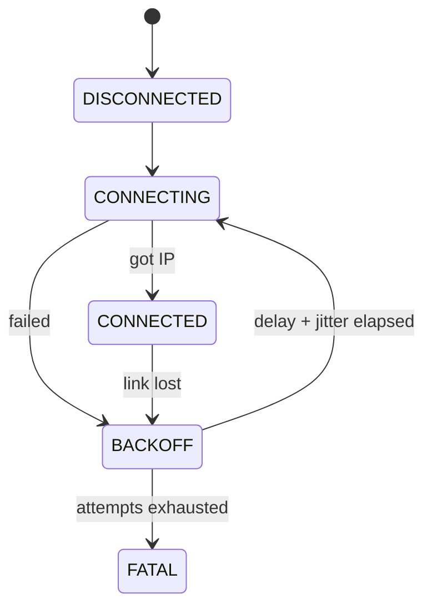
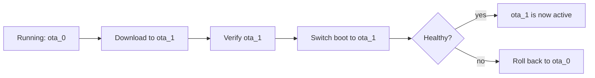

# Advanced ESP32 Interview Questions

How to use this file: this is a 50-question flashcard track in numbered order. Answer each question aloud first, then compare with the **Short answer** and the explanation. Each question has a **Topic** tag so you can study one area at a time.

Topic tags: Platform, RTOS, Wi-Fi, Storage, OTA, Security, Debug, Memory, Power, Design, Test.

---

## 1. What is ESP-IDF?

**Topic:** Platform

**Short answer:** Espressif's official development framework for ESP32 chips.

It provides drivers, networking, RTOS integration, build and configuration tools, and chip-specific APIs.

## 2. Why choose ESP-IDF instead of Arduino?

**Topic:** Platform

**Short answer:** More control and better production features.

Choose ESP-IDF when low-level control, production diagnostics, networking, OTA, power management, or chip-specific features matter.

## 3. How does FreeRTOS fit into ESP-IDF?

**Topic:** RTOS

**Short answer:** It is built in. Tasks, queues, synchronization, and timers are part of the normal application model.

## 4. What is task affinity on a multicore ESP32?

**Topic:** RTOS

**Short answer:** It selects which core a task may run on.

```c
/* Create a task pinned to core 1 (core 0 typically runs the Wi-Fi/system tasks). */
xTaskCreatePinnedToCore(
    worker_task,      /* task function */
    "worker",         /* name */
    4096,             /* stack size (bytes on ESP-IDF) */
    NULL,             /* parameter */
    5,                /* priority */
    NULL,             /* handle */
    1);               /* core id: 0, 1, or tskNO_AFFINITY */
```

Poor affinity choices can create contention or complicate synchronization.

## 5. What is the event loop concept in ESP-IDF?

**Topic:** RTOS

**Short answer:** Components publish events; registered handlers react.

```c
/* Register a handler: called whenever Wi-Fi reports a disconnect */
esp_event_handler_register(WIFI_EVENT, WIFI_EVENT_STA_DISCONNECTED, &on_wifi_event, NULL);
```

This decouples producers (the Wi-Fi driver) from the application's reactions.

## 6. How would you design Wi-Fi reconnect logic?

**Topic:** Wi-Fi

**Short answer:** Explicit states, bounded retry with backoff, and separate from application logic.



Do not block the whole system while waiting for the network to recover.

## 7. What is NVS?

**Topic:** Storage

**Short answer:** A non-volatile key-value store for configuration and small persistent state.

Consider update frequency and flash wear.

## 8. How would you store calibration data?

**Topic:** Storage

**Short answer:** Versioned, validated, with defaults, and written safely.

```c
typedef struct {
    uint16_t version;      /* schema version, so future firmware can migrate old data */
    float    gain;
    float    offset;
    uint32_t crc;          /* detects corruption or a partial write */
} calib_t;
/* On load: check version and CRC. If invalid, fall back to factory defaults. */
```

## 9. What is OTA on ESP32?

**Topic:** OTA

**Short answer:** Storing and activating a new firmware image using the partition and update mechanisms.

Secure designs authenticate the image and support recovery or rollback.

## 10. Why use A/B (alternate) update partitions?

**Topic:** OTA

**Short answer:** A known-good image always stays available while the new one is downloaded and validated.



## 11. What is secure boot?

**Topic:** Security

**Short answer:** A chain of trust that stops unauthorized firmware from running.

The key property is **authentication**. Encryption is a separate feature.

## 12. What is flash encryption?

**Topic:** Security

**Short answer:** It protects the stored flash contents against simple physical readout.

Capability and configuration depend on the chip generation.

## 13. How do you debug a panic and backtrace?

**Topic:** Debug

**Short answer:** Capture it, decode it with the exact build, and classify the cause.

```text
Backtrace: 0x400d1234:0x3ffb5e10 0x400d5678:0x3ffb5e30 ...
```

Decode the addresses against the same `.elf` that was flashed (`idf.py monitor` does this, or use `addr2line`). Then inspect the faulting task and the call chain.

## 14. Why can watchdog resets occur in ESP32 applications?

**Topic:** Debug

**Short answer:** Something stopped the watchdog from being serviced.

- A task blocked too long
- An interrupt monopolized the CPU
- A deadlock prevented progress
- Another condition violated watchdog expectations

## 15. How do you design low-power ESP32 firmware?

**Topic:** Power

**Short answer:** Minimize active time, batch work, pick sleep modes by need, cut radio use, and measure real current.

## 16. What is deep sleep?

**Topic:** Power

**Short answer:** A low-power mode that shuts down most of the chip and keeps only defined resources.

Wake behaviour and retained state depend on the device generation.

## 17. What is light sleep?

**Topic:** Power

**Short answer:** A lighter sleep that keeps more context and wakes faster than deep sleep.

| | Light sleep | Deep sleep |
| --- | --- | --- |
| Context kept | More (CPU state, RAM) | Little (RTC memory only) |
| Wake latency | Lower | Higher (like a reboot) |
| Current | Higher | Lowest |

## 18. What is the difference between Wi-Fi connected and IP connected?

**Topic:** Wi-Fi

**Short answer:** Being associated with the access point does not mean the internet works.


Model each layer as its own state.

## 19. How would you detect network health?

**Topic:** Wi-Fi

**Short answer:** Check each layer explicitly with timeouts. One event does not prove the whole path is healthy.

## 20. How do you avoid reconnect storms?

**Topic:** Wi-Fi

**Short answer:** Backoff plus jitter plus a limit.

```c
uint32_t delay_ms = base_ms << attempt;                 /* exponential growth */
if (delay_ms > MAX_DELAY_MS) delay_ms = MAX_DELAY_MS;   /* cap it */
delay_ms += esp_random() % (delay_ms / 4 + 1);          /* jitter so devices do not retry in lockstep */
```

Also set an attempt limit and a clear failure state.

## 21. How would you design MQTT offline buffering?

**Topic:** Wi-Fi

**Short answer:** A bounded queue with a clear drop policy and controlled retry on reconnect.

- Decide which messages may be dropped
- Restore connectivity with controlled retries
- Handle duplicate delivery (QoS 1 can repeat messages)

## 22. How do you secure device credentials?

**Topic:** Security

**Short answer:** Unique credentials per device, protected key storage, least privilege, and no hard-coded production secrets.

## 23. What is heap capability in ESP-IDF?

**Topic:** Memory

**Short answer:** Memory is categorized by properties, so you can ask for the kind you need.

```c
/* Ask for memory that DMA can access */
uint8_t *buf = heap_caps_malloc(1024, MALLOC_CAP_DMA);
```

The exact API depends on the framework version.

## 24. Why can DMA-capable memory matter?

**Topic:** Memory

**Short answer:** Some peripherals cannot reach every memory region. Buffers may need specific capability and alignment.

## 25. How do you debug memory corruption?

**Topic:** Memory

**Short answer:** Turn on heap checks, find who writes, and do not blame the crash site.

```c
heap_caps_check_integrity_all(true);    /* verify heap structures; print any corruption */
```

The crash point is often far from the buggy write. Compare allocation lifetimes, guard buffers where supported, and isolate the writer.

## 26. What is a stack high-water mark?

**Topic:** Memory

**Short answer:** The minimum free stack a task has ever had. It is used for sizing and overflow-risk analysis.

```c
UBaseType_t free_words = uxTaskGetStackHighWaterMark(NULL);   /* NULL = this task */
```

## 27. How do you avoid long work in callbacks?

**Topic:** RTOS

**Short answer:** Callbacks may run in framework or interrupt-sensitive contexts, so defer heavy work to a task.

```c
static void on_event(void *arg, esp_event_base_t base, int32_t id, void *data)
{
    xQueueSend(work_queue, &id, 0);     /* just hand off; do not do the real work here */
}
```

## 28. What is a partition table?

**Topic:** Storage

**Short answer:** A map of how flash is divided into application images, data, filesystems, and other areas.

```text
# Name,   Type, SubType, Offset,   Size
nvs,      data, nvs,     0x9000,   0x6000
otadata,  data, ota,     0xf000,   0x2000
ota_0,    app,  ota_0,   0x10000,  1M
ota_1,    app,  ota_1,   0x110000, 1M
```

The layout must match the boot and update design.

## 29. How do you make OTA power-loss safe?

**Topic:** OTA

**Short answer:** Keep explicit update state, verify before switching, and always keep a recovery path.

## 30. Why is TLS memory-heavy?

**Topic:** Security

**Short answer:** The handshake and crypto need buffers, certificates, keys, and temporary state.

Tune certificate chains and buffer sizes without breaking security requirements.

## 31. How would you measure boot time?

**Topic:** Power

**Short answer:** Timestamp defined stages from reset to application ready.

Separate hardware init, storage, radio and network bring-up, and application startup.

## 32. How do you make ESP32 logging production-safe?

**Topic:** Design

**Short answer:** Levels, bounded buffers, asynchronous output, and rate limiting. Never log secrets, and do not flood timing-sensitive paths.

## 33. What is a race condition on a dual-core MCU?

**Topic:** RTOS

**Short answer:** Two cores touch shared state without correct ordering or ownership.

Use proper synchronization and memory-ordering primitives.

## 34. Why are CPU affinity and synchronization related?

**Topic:** RTOS

**Short answer:** Running on two cores allows interleavings that were impossible on one.

Assumptions that were safe on a single core can fail on two.

## 35. How would you isolate a network stack failure?

**Topic:** Wi-Fi

**Short answer:** Keep the network in its own task, use queues and timeouts, and never let a dead network block essential local functions.

## 36. What is brown-out handling on an IoT device?

**Topic:** Power

**Short answer:** Detect and record low-voltage resets, and design persistent writes so an interrupted operation recovers safely.

## 37. How do you decide between NVS and a filesystem?

**Topic:** Storage

**Short answer:** NVS for small key-value data; a filesystem for larger files or records.

Consider wear, atomicity, update frequency, and how the data is read back.

## 38. What is an event group good for?

**Topic:** RTOS

**Short answer:** Waiting on several boolean conditions at once.

```c
#define WIFI_UP  (1 << 0)
#define MQTT_UP  (1 << 1)

/* Block until BOTH bits are set (pdFALSE = do not clear, pdTRUE = wait for all bits) */
xEventGroupWaitBits(group, WIFI_UP | MQTT_UP, pdFALSE, pdTRUE, portMAX_DELAY);
```

## 39. Why might a queue be better than a global flag?

**Topic:** RTOS

**Short answer:** A queue keeps every event and its data; a flag merges repeated events into one.

## 40. How do you test Wi-Fi failure behaviour?

**Topic:** Test

**Short answer:** Create each failure on purpose and check the state transitions and bounded recovery.

Failures to induce: access-point loss, DNS failure, DHCP failure, TCP timeout, server refusal, weak signal.

## 41. How do you test OTA rollback?

**Topic:** Test

**Short answer:** Install an image that is designed to fail, reboot, and confirm the device returns to the known-good image.

Also check that the persistent update metadata is still consistent afterwards.

## 42. What is chip revision awareness?

**Topic:** Design

**Short answer:** Firmware may need different workarounds depending on the silicon revision. Detect the revision and isolate revision-specific code.

## 43. How do you structure ESP-IDF components?

**Topic:** Design

**Short answer:** One clear API and dependency boundary per component, hardware details kept local, and no unnecessary shared globals.

## 44. What is the strongest ESP32 interview answer pattern?

**Topic:** Design

**Short answer:** Explain the platform mechanism, then show how you make it reliable.


## 45. How would you partition an ESP-IDF application into components?

**Topic:** Design

**Short answer:** Clear API and lifecycle per component, chip-specific details local, and no hidden global dependencies between the application and drivers.

## 46. How do you debug a task that crashes only under Wi-Fi traffic?

**Topic:** Debug

**Short answer:** Look at stack margin, heap use, concurrent access, callback context, interrupt load, and network-driven timing.

Reproduce with controlled traffic and capture the exact panic context.

## 47. How do you handle NVS schema evolution?

**Topic:** Storage

**Short answer:** Store a version field, validate every load, migrate known older versions, and fall back safely on unknown or corrupt data.

## 48. How do you test deep-sleep wake behaviour?

**Topic:** Test

**Short answer:** Test every wake source, the retained-state path, peripheral reinitialization, reset reason, and repeated sleep/wake cycles.

Measure current and wake latency at the same time.

## 49. How do you separate connectivity failure from application failure?

**Topic:** Wi-Fi

**Short answer:** Model link, IP, transport, TLS, and application readiness as separate states, so an outage does not look like a generic device fault.

## 50. How do you protect OTA against downgrade?

**Topic:** OTA

**Short answer:** Enforce a minimum accepted version (rollback protection) when the product requires it.
