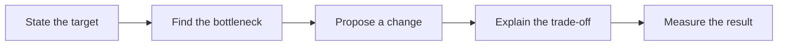
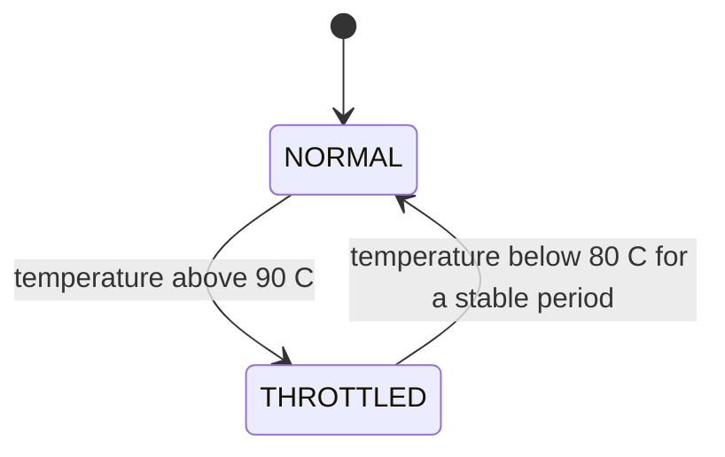

# Advanced Power and Performance Study Notes

How to use this file: answer each question first, then read the **Short answer**, the **Example**, and the **How to measure** line. In power and performance interviews, the measurement is half of the answer.

## Quick formulas

| Quantity | Formula |
| --- | --- |
| Average current | total charge over a cycle / cycle time |
| Battery life | capacity (mAh) / average current (mA) |
| Energy | voltage x current x time |
| Dynamic power | proportional to C x V^2 x f |

Example: 180 mA for 20 ms, then 5 mA for 980 ms. Average = (180 x 0.02 + 5 x 0.98) / 1.0 = 3.6 + 4.9 = 8.5 mA.



---

## Part A: Power fundamentals

## 1. Why is average current more important than peak current for a battery product?

**Short answer:** Battery life depends on charge used over time. Peak current still matters for brown-outs and voltage droop.

Peak current can still cause regulator limits, radio problems, and battery voltage droop.

**Example:** A radio draws 180 mA for 20 ms and 5 mA the rest of the time.

**How to measure:** integrate current over a whole workload cycle, not only the radio peak.

## 2. How do you reduce MCU power?

**Short answer:** Reduce active time first.

Steps: sleep instead of polling, lower frequency when allowed, batch work, offload to peripherals and DMA, disable unused clocks and blocks.

**Example:** Replace a 1 ms polling loop with a timer interrupt and sleep until the next event.

**How to measure:** compare active time and average current before and after.

## 3. What is dynamic power conceptually?

**Short answer:** Switching power grows with capacitance, voltage squared, switching activity, and frequency.

```text
P_dynamic  ~  C x V^2 x f x activity
```

Lowering voltage or activity reduces energy, within device limits.

**Example:** Lowering a peripheral clock reduces switching, but the peripheral must still meet its timing.

**How to measure:** energy per completed transaction.

## 4. CPU load versus energy efficiency

**Short answer:** Lower CPU load does not automatically mean lower energy.

A task can run briefly at high frequency and then sleep, or run longer at low frequency. Optimize energy per useful operation.

**Example:** A sensor task uses less CPU after optimization but keeps the MCU awake longer.

**How to measure:** sleep time and joules per sample, not CPU percentage alone.

## 5. How do you optimize a 20 kHz PWM application?

**Short answer:** Use a timer peripheral, not software toggling.

First define resolution, timer clock, acceptable jitter, duty granularity, and power-stage needs.

**Example:** Configure a timer for 20 kHz PWM instead of toggling a GPIO in a loop.

**How to measure:** scope the frequency, duty, jitter, and edges.

## 6. Why can compiler optimization change firmware behaviour?

**Short answer:** Correct code stays correct, but hidden bugs show up when generated code changes.

Typical causes: undefined behaviour, missing synchronization, timing-dependent bugs, wrong register declarations (missing `volatile`).

**Example:** An uninitialized variable works at `-O0` but fails at `-O2`.

**How to measure:** enable warnings and inspect the generated code before blaming the optimizer.

## 7. What is a performance budget?

**Short answer:** Written limits for CPU time, RAM, flash, ISR latency, throughput, boot time, and energy.

Treat them as design constraints and review them early, not at integration.

**Example:** Maximum ISR time 10 us, boot limit 500 ms, an energy budget per sample.

**How to measure:** track every limit in automated performance tests.

## 8. What is dynamic voltage and frequency scaling (DVFS)?

**Short answer:** Change voltage and clock to match the current workload.

Lower settings save energy but reduce available performance.

```c
/* Idea only: raise the clock for the computation, drop it before sleeping. */
set_clock(HIGH_SPEED);
process_samples();
set_clock(LOW_SPEED);
enter_sleep();
```

**How to measure:** voltage, frequency, execution time, and energy per operation.

## 9. How do you choose between sleep modes?

**Short answer:** Compare wake latency, retained state, wake sources, RAM retention, and current.

| Mode | Wake latency | Current | State kept |
| --- | --- | --- | --- |
| Active | none | highest | all |
| Light sleep | short | medium | most |
| Deep sleep | long | lowest | little |

**Example:** Light sleep for a 1 ms response requirement; deep sleep when the next event is seconds away.

**How to measure:** entry time, wake time, current, and missed events for each mode.

## 10. What is energy per operation?

**Short answer:** The total energy to complete a useful piece of work. Often more useful than instantaneous current.

**Example:** A DMA transfer may draw more peak current but use less total energy than a CPU byte-copy loop.

**How to measure:** integrate voltage x current over the whole operation.

## 11. How do you measure embedded power accurately?

**Short answer:** Use the right instrument with enough bandwidth, and capture both active and sleep.

Options: shunt resistor, current monitor, power analyzer, oscilloscope.

**Example:** A slow multimeter can hide a 2 ms radio burst that causes a brown-out.

**How to measure:** validate instrument bandwidth, shunt impact, sample rate, trigger, and calibration.

## 12. What is clock gating?

**Short answer:** Turning off the clock to unused blocks to cut switching power.

Do not gate a block that software or DMA still needs.

```c
RCC->APB2ENR &= ~RCC_APB2ENR_ADC1EN;    /* ADC idle: clock off */
/* ... later ... */
RCC->APB2ENR |=  RCC_APB2ENR_ADC1EN;    /* clock on before the next measurement */
```

**How to measure:** confirm the block is inactive and compare current before and after.

---

## Part B: Performance

## 13. How can DMA improve both performance and power?

**Short answer:** It moves data without the CPU, so the CPU can sleep or do other work.

Setup overhead means it is not worth it for tiny transfers.

**Example:** DMA for a 512-byte SPI transfer instead of 512 receive interrupts.

**How to measure:** CPU cycles, transfer time, interrupt count, and energy per transfer.

## 14. What is the cache impact on embedded performance?

**Short answer:** Caches cut latency when access has locality; misses and coherency work add cost.

**Example:** A sequential buffer scan benefits from cache; random peripheral descriptors may not.

**How to measure:** hardware counters or trace data: hit rate and execution time.

## 15. How do you optimize memory bandwidth?

**Short answer:** Copy less.

Reduce copies, use DMA, align buffers if required, process in cache-friendly blocks, avoid re-reading data.

**Example:** Parse a network packet in place instead of copying the payload into temporary arrays.

**How to measure:** bus utilization, copy time, cache misses, end-to-end latency.

## 16. What is interrupt latency?

**Short answer:** The time from the event to the first instruction of its handler.

Disabled interrupts, higher-priority handlers, and long critical sections increase it.

**Example:** Toggle a GPIO at the first line of the ISR and compare with the external event on a scope.

**How to measure:** minimum, average, and worst case under maximum load.

## 17. How do you optimize ISR performance safely?

**Short answer:** Keep it short and bounded, then defer the rest.

```c
void UART_IRQHandler(void)
{
    uint8_t b = UART->RDR;      /* read (this also clears the source) */
    ring_push(&rx, b);          /* store: O(1) */
    notify_parser_task();       /* the parser task does the decoding */
}
```

**How to measure:** handler duration and check for missed or nested events.

## 18. What is thermal throttling?

**Short answer:** Reducing frequency, workload, or output power when temperature nears a limit.

It protects reliability at the cost of performance.

**Example:** Reduce CPU frequency above a warning temperature and restore it after cooling.

**How to measure:** temperature, workload, frequency transitions, and recovery hysteresis.

## 19. How do you prevent thermal oscillation?

**Short answer:** Use different enter and exit thresholds, and a minimum dwell time.



**How to measure:** plot temperature and mode over time under a repeatable load.

## 20. How do you profile firmware without changing timing too much?

**Short answer:** Use hardware cycle counters, trace, GPIO markers, or sampling. Avoid heavy logging in the measured path.

```c
uint32_t t0 = DWT->CYCCNT;          /* cycle counter (Cortex-M3/M4/M7) */
work();
uint32_t dt = DWT->CYCCNT - t0;     /* cycles taken */
if (dt > max_cycles) max_cycles = dt;   /* store only an aggregate maximum */
```

**How to measure:** compare timing with instrumentation on and off to estimate the disturbance.

## 21. How do you find the source of a CPU hotspot?

**Short answer:** Measure by task, function, interrupt, and event type. A total CPU percentage alone does not show the cause.

**Example:** A low-priority task looks expensive because it keeps retrying a full queue.

**How to measure:** call sampling, runtime statistics, and event counters together.

## 22. How do you reduce boot time?

**Short answer:** Measure each phase, then defer, skip, or parallelize what is not needed immediately.

**Example:** Start the UI after the essential safety checks while a non-critical sensor calibrates in the background.

**How to measure:** timestamps at reset, clock setup, memory init, driver init, scheduler start, and application ready.

## 23. How do you balance flash size and performance?

**Short answer:** Decide from measurements, not from size alone.

**Example:** An inline helper may be faster but grows flash when instantiated many times.

**How to measure:** compare map-file size, hot-path cycles, and worst-case timing per build option.

## 24. How do you optimize a memory-constrained system?

**Short answer:** Measure first, and remove duplication before removing safety checks.

Measure static usage, stack high-water marks, heap behaviour, buffer peaks, and fragmentation.

**Example:** Share a scratch buffer between non-overlapping stages with explicit ownership.

**How to measure:** minimum free RAM and peak buffer use during stress tests.

## 25. What is performance regression testing?

**Short answer:** Automatically comparing timing, memory, throughput, power, and boot metrics against a baseline.

**Example:** Fail CI if a driver raises worst-case ISR time by more than 10 percent.

**How to measure:** store repeatable workload results with build and hardware identifiers.

---

## Part C: System-level trade-offs

## 26. How do you optimize communication throughput?

**Short answer:** Right frame sizes, DMA, batching, flow control, efficient parsing, enough buffering, all within the latency budget.

**Example:** Batch sensor samples into one DMA transfer while keeping frame delay inside the control budget.

**How to measure:** payload throughput, bus utilization, queue depth, retries, latency percentiles.

## 27. How do you reduce power in a wireless product?

**Short answer:** Keep the radio off as much as possible.

Reduce radio-on time, batch transmissions, use suitable transmit power, sleep between events, avoid unnecessary reconnects.

**Example:** Collect ten samples and publish one packet instead of waking the radio for every sample.

**How to measure:** energy per packet, connection time, retry rate, and battery life under realistic signal conditions.

## 28. How do you detect a power regression?

**Short answer:** Repeatable workload, fixed configuration, calibrated equipment, automatic comparison with a baseline.

**Example:** A new logging feature adds 4 mA in every idle interval even though CPU load looks unchanged.

**How to measure:** compare current waveforms, sleep percentage, wake count, and energy per test cycle.

## 29. How do you handle performance versus safety trade-offs?

**Short answer:** Keep safety limits, watchdogs, bounds checks, and fault handling unless a review accepts the risk.

Optimize the implementation around them.

**Example:** Replace expensive diagnostic logging with a bounded counter, not remove an over-temperature shutdown.

**How to measure:** verify both the performance targets and the safety-response timing.

## 30. What is the strongest power and performance interview answer?

**Short answer:** Target, bottleneck, change, trade-off, measurement.

**Example:** "DMA reduces CPU time for the SPI transfer, but I will verify cache ownership, completion latency, and energy per transfer."

**How to measure:** always report the workload, hardware, baseline, metric, and worst-case result.
