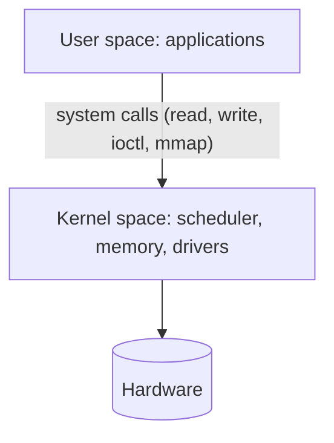
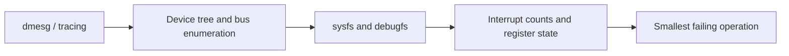
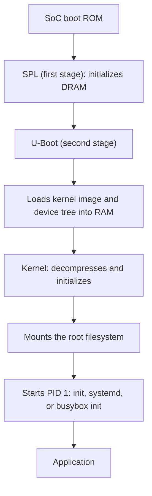
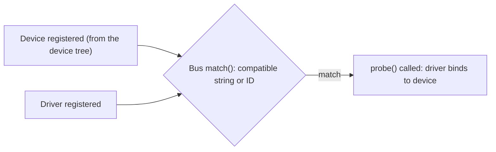

# Advanced Embedded Linux and Driver Questions

How to use this file: read the **Short answer** first, then the details. Each question ends with a **Remember** line you can say in an interview.

## Contents

| Questions | Topic |
| --- | --- |
| 1-7 | Kernel basics, device tree, drivers, interrupts, DMA |
| 8-24 | Boot flow, driver model, memory, IPC, real-time, build systems |
| 25-40 | The most commonly asked questions: processes, concurrency, debugging |

---

## 1. User-space vs kernel-space

**Short answer:** User space runs with restricted privileges. Kernel space runs with full privilege and controls hardware.



Device drivers normally run in kernel space. If the kernel already exposes an interface (sysfs, `/dev/spidev`, `libgpiod`), prefer using it from user space.

**Remember:** keep as much as possible out of the kernel.

## 2. What is a device tree?

**Short answer:** A description of the hardware, kept separate from the kernel image.

```text
&i2c1 {
    status = "okay";
    temp_sensor@48 {                    /* a device at I2C address 0x48 */
        compatible = "ti,tmp102";       /* matches a driver's compatible string */
        reg = <0x48>;
    };
};
```

The exact binding syntax and boot flow depend on the platform.

**Remember:** the `compatible` string is what binds a device to its driver.

## 3. Character vs block device

**Short answer:** Character devices are stream-like. Block devices are block-oriented with random access.

| | Character | Block |
| --- | --- | --- |
| Access | Byte stream | Fixed-size blocks, random access |
| Buffering | Usually none | Page cache and I/O scheduler |
| Examples | UART, `/dev/spidev`, GPIO | eMMC, SD card, flash disk |

## 4. Interrupt handler design in Linux

**Short answer:** Do the minimum in the hard interrupt, and defer the rest.

Use threaded interrupts or workqueues, depending on the driver.

**Remember:** hard IRQ = acknowledge and capture; everything else is deferred.

## 5. Why use DMA in Linux drivers?

**Short answer:** It cuts CPU copying and raises throughput for high-bandwidth devices.

A correct driver uses the kernel's DMA mapping and synchronization APIs (`dma_alloc_coherent`, `dma_map_single`). It must not assume physical addresses are directly usable.

**Remember:** use the DMA API, never raw physical addresses.

## 6. How would you debug a Linux device driver?

**Short answer:** Start with logs, then check that the device was found, then narrow down.



## 7. Embedded Linux interview focus

Expect questions on boot flow, U-Boot, device tree, kernel and user boundaries, driver binding, sysfs, interrupts, DMA, memory mapping, and networking.

## 8. Describe the embedded Linux boot flow from power-on to a running application

**Short answer:** Each stage runs with more capability than the last and loads the next.



Each stage exists because the previous one runs with fewer capabilities (no DRAM yet, no filesystem yet).

## 9. What is U-Boot, and what can you do at its prompt?

**Short answer:** A second-stage bootloader with an interactive console for bring-up and recovery.

```text
printenv                   # show environment variables
setenv bootargs console=ttyS0,115200 root=/dev/mmcblk0p2
saveenv                    # store them
tftpboot 0x82000000 zImage # load a kernel over the network
md 0x82000000 40           # memory display (inspect RAM)
bootm 0x82000000           # boot the kernel image
```

## 10. Why does the kernel need a device tree, and what if it does not match the hardware?

**Short answer:** The device tree describes non-discoverable hardware, so one kernel binary supports many boards.

If it does not match: drivers fail to probe, peripherals are missing, or the kernel can crash early (for example using a memory region that does not exist).

## 11. initramfs vs initrd vs a persistent root filesystem

| | initramfs | initrd | Persistent rootfs |
| --- | --- | --- | --- |
| Lives in | RAM (cpio archive) | RAM (filesystem image) | Flash, eMMC, SD |
| Purpose | Early user space, then `switch_root` | Older equivalent | The real system |
| Freed after switch | Yes | Yes | No |

Many embedded systems skip the initramfs and boot straight into the persistent rootfs.

## 12. Explain the Linux driver model: bus, device, and driver matching

**Short answer:** A bus matches devices to drivers, then calls the driver's `probe()`.



## 13. Platform driver vs bus drivers (I2C, SPI)

**Short answer:** Platform drivers handle SoC-internal, non-enumerable peripherals. I2C and SPI drivers register with their subsystem.

- **Platform driver:** UART controllers, GPIO controllers, described in the device tree
- **I2C or SPI driver:** matched to chips declared as child nodes of a controller. The subsystem handles the bus details, and the driver calls `i2c_transfer()` or `spi_sync()`

## 14. The roles of sysfs, procfs, and debugfs

| Filesystem | Shows | Stable ABI |
| --- | --- | --- |
| `/sys` (sysfs) | The device and driver model, attributes | Yes |
| `/proc` (procfs) | Process and kernel info (`/proc/interrupts`, `/proc/meminfo`) | Mostly |
| `/sys/kernel/debug` (debugfs) | Driver-defined debug data | No |

## 15. Top half vs bottom half in Linux interrupt handling

**Short answer:** The top half is the fast hard ISR. The bottom half is deferred work.

| Mechanism | Context | Can sleep | Use |
| --- | --- | --- | --- |
| Softirq and tasklet | Interrupt context | No | Latency-critical subsystems such as networking |
| Workqueue | Process context | Yes | Deferred work that blocks |
| Threaded IRQ | Kernel thread | Yes | The modern preferred approach |

```c
/* Threaded IRQ: the primary handler is fast, the thread handler does the real work and may sleep. */
request_threaded_irq(irq, fast_handler, thread_fn, IRQF_ONESHOT, "mydev", dev);
```

## 16. `kmalloc` vs `vmalloc`

| | `kmalloc` | `vmalloc` |
| --- | --- | --- |
| Memory | Physically contiguous | Virtually contiguous only |
| Speed | Fast | Slower (page tables) |
| DMA | Usable | Not directly |
| Size | Small to moderate | Large |

## 17. What is `mmap` used for, and how do drivers support it?

**Short answer:** It maps memory into a process's address space, avoiding read and write syscall overhead.

Used for framebuffers, shared memory, and peripheral registers. A driver implements the `mmap` file operation using `remap_pfn_range()` (or `dma_mmap_coherent()` for DMA buffers).

## 18. Kernel module vs built-in driver

| | Loadable module (`.ko`) | Built-in |
| --- | --- | --- |
| Load at run time | Yes (`insmod`, `modprobe`) | No |
| Rebuild kernel to change | No | Yes |
| Needed early (root storage) | Awkward | Yes |
| Production simplicity | Module dependency issues | Simpler |

Products often build essential drivers in and use modules for optional or field-upgradable functionality.

## 19. How do the Linux IPC mechanisms compare?

| Mechanism | Boundaries | Speed | Note |
| --- | --- | --- | --- |
| Pipe or FIFO | Byte stream | Medium | Simple |
| Message queue | Preserves messages, has priorities | Medium | Structured commands |
| Shared memory | None (raw memory) | Fastest | Needs your own synchronization |
| Unix domain socket | Stream or datagram | Medium | Bidirectional, can pass file descriptors |

## 20. What is the OOM killer, and why does it matter on embedded devices?

**Short answer:** When memory runs out and cannot be reclaimed, the kernel kills a process to free memory.

Small RAM and often no swap mean a leak can trigger it and kill a critical application. Mitigations: bound memory use, use `cgroups` memory limits, or lower `oom_score_adj` for critical processes.

## 21. Hard vs soft real-time, and can vanilla Linux meet hard deadlines?

**Short answer:** Vanilla Linux cannot guarantee hard real-time deadlines.

| | Hard real-time | Soft real-time |
| --- | --- | --- |
| Missed deadline | System failure | Quality degrades |
| Example | Engine control cycle | Video jitter |

`PREEMPT_RT` makes most of the kernel preemptible, threads interrupt handlers, and turns spinlocks into sleepable mutexes, greatly reducing worst-case latency. True hard real-time systems may pair Linux with an RTOS (Xenomai, or an RTOS on a separate core).

## 22. What are cgroups and namespaces?

**Short answer:** Namespaces isolate what a process can see. cgroups limit what it can use.

Together they are the building blocks of containers (Docker, LXC), used on edge devices to isolate applications and limit runaway resource use.

## 23. How would you reduce boot time?

- Trim the bootloader delay and unneeded probing
- Use a minimal kernel configuration
- Skip the initramfs if it is not needed
- Use a small rootfs (BusyBox)
- Start services in parallel, and defer non-critical ones
- **Measure first** (`bootchart`, `initcall_debug`, `dmesg` timestamps), do not guess

## 24. Yocto vs Buildroot

| | Buildroot | Yocto |
| --- | --- | --- |
| Build system | Makefile and Kconfig | BitBake with recipes and layers |
| Speed and simplicity | Fast, simple | Steeper learning curve |
| Best for | Single-purpose small images | Large, long-lived, multi-board products |

Both cross-compile a fully custom image, and give control over size, packages, and licensing.

---

## Most commonly asked questions

## 25. What is cross-compilation, and why is it needed?

**Short answer:** Building on a host (x86_64) for a different target (ARM, RISC-V) using a cross-toolchain.

```bash
arm-linux-gnueabihf-gcc main.c -o app      # runs on ARM, built on your PC
```

Targets are often too limited to build large software natively. The toolchain must match the target's C library (glibc, musl, uClibc) and ABI.

## 26. What happens when you call `fork()`? How is it different from `exec()`?

```c
pid_t pid = fork();            /* creates a child that is a copy of this process */
if (pid == 0) {
    execl("/bin/ls", "ls", NULL);   /* child: replace itself with a new program */
    _exit(127);                     /* only reached if exec failed */
} else {
    waitpid(pid, NULL, 0);          /* parent: wait for the child */
}
```

`fork()` returns 0 in the child and the child's PID in the parent (copy-on-write memory). `exec()` replaces the process image but keeps the PID and most file descriptors. Shells and `init` combine the two.

## 27. Process vs thread on an embedded target

| | Process | Thread |
| --- | --- | --- |
| Address space | Separate (MMU-protected) | Shared |
| A crash affects | Only itself | Possibly others |
| Communication | IPC needed | Shared memory |
| Context switch | More expensive | Cheaper |

Use separate processes for distinct or safety-critical components. Use threads for tightly coupled work in one component.

## 28. What is a race condition, and how do mutexes and semaphores help?

**Short answer:** The result depends on timing because a read-modify-write is not atomic.

```c
counter++;      /* load, add, store: two threads can interleave and lose an update */
```

A **mutex** allows one thread at a time into a critical section. A **semaphore** counts, and can be signalled from a different context than the one that waited (for example ISR to task).

## 29. Mutex vs binary semaphore

| Mutex | Binary semaphore |
| --- | --- |
| Has an owner: only the locker unlocks | No owner: any context can post |
| Often has priority inheritance | No |
| For protecting a critical section | For signalling between contexts |

## 30. What is priority inversion, and how does priority inheritance solve it?

**Short answer:** A high-priority task waits on a low-priority mutex holder while a medium-priority task keeps the holder from running.

Priority inheritance temporarily boosts the holder to the waiter's priority so it can finish and release. This is the classic Mars Pathfinder bug.

## 31. What is a deadlock, and what are the four conditions?

**Short answer:** Tasks wait on each other in a cycle.

The four Coffman conditions (all must hold): mutual exclusion, hold and wait, no preemption, circular wait. Breaking any one prevents deadlock. The most practical fix is one **global lock order**, which removes circular wait.

## 32. Static vs dynamic (shared) linking

| | Static | Dynamic |
| --- | --- | --- |
| Library code | Copied into the executable | Separate `.so`, loaded at run time |
| Size | Larger | Smaller (shared by processes) |
| Dependencies | None at run time | Must match ABI and version |
| Updates | Recompile | Replace the library |

## 33. What does `volatile` do in C, and why is it critical in driver code?

**Short answer:** It stops the compiler from caching or removing accesses to a variable that hardware or an ISR can change.

```c
while (!flag) { }        /* without volatile the compiler may read flag once and loop forever */
volatile int flag;       /* with volatile, every iteration reads memory */
```

## 34. What is endianness, and why does it matter?

**Short answer:** The byte order of multi-byte values.

It matters for network protocols (big-endian, so use `htons()` and `ntohl()`), raw register values, binary file formats, and exchanging data between different CPUs. A mismatch corrupts values silently.

## 35. How would you find and debug a memory leak in a long-running application?

- **Valgrind `memcheck`** (heavy for constrained targets)
- **AddressSanitizer** (`-fsanitize=address`) in a debug build
- `mtrace`, or custom `malloc` and `free` wrappers
- Sample `VmRSS` from `/proc/<pid>/status` over time to confirm a real upward trend
- In production, a watchdog with resource monitoring restarts a leaking service while you fix the root cause

## 36. What is a watchdog timer, and how is it used in embedded Linux?

**Short answer:** A timer that resets the system unless it is kicked in time.

```c
int fd = open("/dev/watchdog", O_WRONLY);
for (;;) {
    if (system_is_healthy()) {
        write(fd, "\0", 1);        /* kick the watchdog only when healthy */
    }
    sleep(5);
}
```

A supervisory process should check that the real application is healthy, not just alive.

## 37. What is a signal, and how should handlers be written safely?

**Short answer:** An asynchronous notification (`SIGSEGV`, `SIGTERM`, `SIGCHLD`) that interrupts normal flow.

Only **async-signal-safe** functions are allowed in a handler (`write()` yes, `malloc()` and `printf()` no). The safe pattern is to set a flag and act on it in the main loop.

```c
static volatile sig_atomic_t stop_requested;

void on_term(int sig) { stop_requested = 1; }     /* just set a flag */
/* main loop: while (!stop_requested) { ... } */
```

## 38. Why is `/dev/mem` dangerous, and what are the safer alternatives?

**Short answer:** It gives user space raw access to physical memory, including kernel memory, bypassing every driver check.

Safer options: a proper kernel driver, subsystem frameworks (`libgpiod`, `spidev`, `i2c-dev`), or UIO for bounded user-space device access.

## 39. Polling vs interrupt-driven I/O: when still choose polling?

**Short answer:** Interrupts save CPU but have latency and overhead. Polling has low, predictable latency but burns CPU.

Choose polling for very high event rates (interrupt overhead dominates), for very short waits, or where interrupts are not reliable.

## 40. How do you cross-debug an application on target hardware?

```bash
# On the target:
gdbserver :2345 ./app

# On the host:
gdb-multiarch ./app
(gdb) target remote 192.168.1.50:2345
(gdb) break main
(gdb) continue
```

For kernel or very early boot debugging, use a JTAG or SWD probe (OpenOCD), which works before Linux runs.
