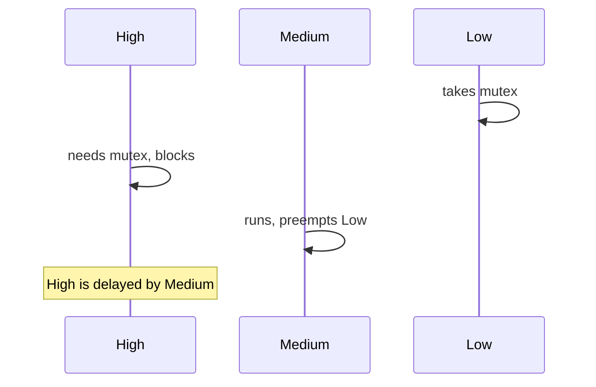

# Advanced FreeRTOS Interview Questions

How to use this file: this is a 50-question flashcard track in numbered order. Answer each question aloud first, then compare with the **Short answer** and the explanation. Each question has a **Topic** tag so you can study one area at a time.

Topic tags: Sync, Priority, Scheduling, Timing, Messaging, ISR, Measure, Memory, Debug, Design.

## Quick comparison: which primitive?

| You need | Use |
| --- | --- |
| Protect a shared resource (ownership, priority inheritance) | Mutex |
| Signal "an event happened" | Binary semaphore or task notification |
| Count several events or resources | Counting semaphore |
| Pass data items | Queue |
| Wait on several conditions | Event group |
| Fastest, simplest one-task signal | Task notification |

Note: the unrelated "Advanced C" questions that used to sit at the end of this file were moved to the C advanced file, so this file now covers FreeRTOS only.

---

## 1. Why use a mutex if a binary semaphore can also synchronize?

**Topic:** Sync

**Short answer:** A mutex has an owner and usually priority inheritance. A binary semaphore is for signalling.

```c
xSemaphoreTake(mutex, portMAX_DELAY);   /* the task that takes it must give it back */
use_shared_resource();
xSemaphoreGive(mutex);
```

## 2. Why use a queue instead of a semaphore?

**Topic:** Messaging

**Short answer:** A queue carries data; a semaphore only signals.

If the receiver needs the payload, use a data-bearing mechanism.

## 3. What is priority inversion?

**Topic:** Priority

**Short answer:** A high-priority task waits on a resource held by a low-priority task, while a medium-priority task keeps the low one from running.



## 4. How does priority inheritance help?

**Topic:** Priority

**Short answer:** The mutex holder temporarily gets the priority of the highest waiter, so it can finish and release sooner.

## 5. Can priority inheritance solve every inversion problem?

**Topic:** Priority

**Short answer:** No.

It handles one class of mutex inversion. Poor lock design, long critical sections, multiple resources, and external blocking can still cause delays.

## 6. What is deadlock?

**Topic:** Sync

**Short answer:** Tasks wait on each other in a cycle, so none can progress.

```text
Task A holds Lock 1, wants Lock 2
Task B holds Lock 2, wants Lock 1
```

## 7. How do you prevent deadlock?

**Topic:** Sync

**Short answer:** Consistent lock ordering, small lock scope, few nested locks, and bounded timeouts.

## 8. What is starvation?

**Topic:** Scheduling

**Short answer:** A task stays runnable but never gets the CPU or resource because other work dominates.

## 9. Preemptive versus cooperative scheduling?

**Topic:** Scheduling

**Short answer:** Preemptive: the scheduler switches tasks by priority. Cooperative: tasks must yield or block themselves.

## 10. How is preemption configured in FreeRTOS?

**Topic:** Scheduling

**Short answer:** With compile-time options in `FreeRTOSConfig.h`.

```c
#define configUSE_PREEMPTION   1     /* 1 = preemptive, 0 = cooperative */
```

The exact options depend on the kernel version.

## 11. What is the RTOS tick?

**Topic:** Timing

**Short answer:** A periodic interrupt used as the scheduler's time base.

Tick frequency affects timer resolution and interrupt overhead.

```c
#define configTICK_RATE_HZ   1000    /* 1 ms tick */
```

## 12. What is SysTick?

**Topic:** Timing

**Short answer:** A Cortex-M timer often used to generate the RTOS tick. The exact source can differ per platform.

## 13. What is `vTaskDelay` versus a delay-until pattern?

**Topic:** Timing

**Short answer:** `vTaskDelay` is a relative delay; `vTaskDelayUntil` schedules from a fixed reference time.

```c
TickType_t last = xTaskGetTickCount();
for (;;) {
    work();
    vTaskDelayUntil(&last, pdMS_TO_TICKS(10));   /* wake at last+10, last+20, ... */
}
```

## 14. What causes periodic task drift?

**Topic:** Timing

**Short answer:** Relative delays add on top of the work time.

```text
vTaskDelay(10) after 3 ms of work -> period is 13 ms, and it grows if the work varies
vTaskDelayUntil(10)               -> period stays 10 ms
```

## 15. What is a task notification?

**Topic:** Messaging

**Short answer:** A lightweight per-task signal that can carry an event, count, or value.

```c
xTaskNotifyGive(task_handle);                   /* signal */
ulTaskNotifyTake(pdTRUE, portMAX_DELAY);        /* wait */
```

It often uses less memory than general objects.

## 16. Why might task notifications be faster than queues?

**Topic:** Messaging

**Short answer:** They use a small built-in field in the task, avoiding generic object overhead.

## 17. When is a queue better than a task notification?

**Topic:** Messaging

**Short answer:** When several independent messages must be buffered, or arbitrary producers and consumers share the channel.

## 18. What is an event group?

**Topic:** Messaging

**Short answer:** A set of event bits a task can wait on, good for combinations of conditions (not for carrying data).

```c
xEventGroupWaitBits(group, WIFI_UP | MQTT_UP, pdFALSE, pdTRUE, portMAX_DELAY);   /* wait for both */
```

## 19. What is a counting semaphore?

**Topic:** Sync

**Short answer:** A semaphore with a count, representing several available units or events.

## 20. What is a binary semaphore?

**Topic:** Sync

**Short answer:** A semaphore with two states (available or not), commonly used for event signalling.

## 21. What is a mutex owner?

**Topic:** Sync

**Short answer:** The task that took the mutex, which must release it.

## 22. Why not use a mutex from an ISR?

**Topic:** ISR

**Short answer:** A mutex involves ownership, blocking, and priority inheritance, which do not fit interrupt context. Use ISR-safe primitives.

## 23. What are `FromISR` APIs?

**Topic:** ISR

**Short answer:** RTOS calls designed for interrupt context. They never block, and they report whether a context switch is needed.

```c
BaseType_t woken = pdFALSE;
xQueueSendFromISR(q, &item, &woken);
portYIELD_FROM_ISR(woken);          /* switch now if a higher-priority task became ready */
```

## 24. What is a critical section in FreeRTOS?

**Topic:** Sync

**Short answer:** A short region protected from scheduling or interrupts, according to the port.

```c
taskENTER_CRITICAL();
shared_counter++;          /* keep it very short */
taskEXIT_CRITICAL();
```

## 25. What is scheduler suspension?

**Topic:** Scheduling

**Short answer:** Temporarily stopping task switching. It is not the same as disabling all interrupts.

```c
vTaskSuspendAll();
/* no task switch here, but interrupts still run */
xTaskResumeAll();
```

## 26. How do you measure task execution time?

**Topic:** Measure

**Short answer:** Hardware cycle counter, trace hooks, or timestamps. Measure worst-case paths, not only typical runs.

## 27. How do you measure CPU load?

**Topic:** Measure

**Short answer:** Measure idle time (or use trace), and include the instrumentation overhead.

## 28. What is the stack high-water mark?

**Topic:** Measure

**Short answer:** The minimum unused stack a task has ever had. Used for sizing.

```c
UBaseType_t words_free = uxTaskGetStackHighWaterMark(NULL);
```

## 29. What is the stack overflow hook?

**Topic:** Measure

**Short answer:** A callback when the kernel detects a likely overflow. It is detection, not a substitute for correct sizing.

```c
void vApplicationStackOverflowHook(TaskHandle_t task, char *name)
{
    /* log the task name, then reset or enter a safe state */
}
```

## 30. Why can logging cause task starvation?

**Topic:** Design

**Short answer:** Blocking output, heavy formatting, or a high-priority logger can consume the CPU and starve lower-priority work.

## 31. What is priority ceiling?

**Topic:** Priority

**Short answer:** Each resource has a ceiling priority; a task holding it runs at that ceiling, which bounds blocking. Support depends on the RTOS.

## 32. What is WCET in RTOS scheduling?

**Topic:** Timing

**Short answer:** The upper bound on execution time, needed for schedulability analysis. Tie it to a defined platform and configuration.

## 33. What is response time?

**Topic:** Timing

**Short answer:** The time from an event becoming ready to the required response.

```text
response = interrupt latency + blocking + higher-priority interference + execution time
```

## 34. What is jitter in a periodic task?

**Topic:** Timing

**Short answer:** Variation of release or completion time around the planned schedule.

## 35. How do you design a 1 ms control task?

**Topic:** Design

**Short answer:** A proper time base, absolute periodic scheduling, bounded work, and no long blocking.

```c
void control_task(void *arg)
{
    TickType_t last = xTaskGetTickCount();
    for (;;) {
        control_step();                                   /* bounded, deterministic */
        vTaskDelayUntil(&last, pdMS_TO_TICKS(1));
    }
}
```

## 36. What is a producer-consumer architecture?

**Topic:** Design

**Short answer:** Producers put data into a bounded buffer; consumers process it independently.

It decouples rates, but needs a full-buffer policy.

## 37. What should happen when a queue is full?

**Topic:** Messaging

**Short answer:** A documented policy: block, drop newest, drop oldest, overwrite, or signal a fault.

```c
if (xQueueSend(q, &item, 0) != pdTRUE) {     /* timeout 0: do not block the producer */
    dropped_count++;                         /* drop newest, but make the loss visible */
}
```

## 38. How do you debug a task that never runs?

**Topic:** Debug

**Short answer:** Check the creation result, priority, state, what it is blocked on, stack, core affinity, scheduler state, and whether a resource owner is stuck.

## 39. How do you debug a task that runs too often?

**Topic:** Debug

**Short answer:** Check loop blocking, timer notifications, queue processing, interrupt rates, wakeup sources, and zero or already-satisfied timeouts.

## 40. How do you debug a deadlock?

**Topic:** Debug

**Short answer:** Capture task states, resource ownership, and timestamps; rebuild the wait-for graph; fix the ordering. Do not add arbitrary delays.

## 41. What is an ISR-to-task handoff?

**Topic:** ISR

**Short answer:** The ISR captures the minimum and signals a task through an ISR-safe queue, semaphore, notification, or event.

## 42. Why can a binary semaphore hide event loss?

**Topic:** Sync

**Short answer:** Several gives before one take collapse into one, because the semaphore stays "available" instead of counting.

Use a counting semaphore or a queue if every event matters.

## 43. Why can a queue overflow be a throughput problem?

**Topic:** Messaging

**Short answer:** If producers sustain a higher average rate than consumers, any buffer eventually fills. Fix the rate mismatch, not just the size.

## 44. What is memory fragmentation in an RTOS application?

**Topic:** Memory

**Short answer:** Repeated variable-size allocations leave unusable gaps, so a later allocation can fail even when total free memory is enough.

## 45. Static versus dynamic task allocation?

**Topic:** Memory

**Short answer:** Static: deterministic storage, no heap. Dynamic: flexible but adds allocator policy and failure cases.

```c
static StaticTask_t tcb;
static StackType_t  stack[512];
xTaskCreateStatic(task_fn, "worker", 512, NULL, 3, stack, &tcb);   /* no heap used */
```

## 46. Why use memory pools?

**Topic:** Memory

**Short answer:** Fixed-size blocks with predictable, bounded allocation. Good for messages with a known maximum count.

## 47. What should a watchdog monitor in an RTOS system?

**Topic:** Design

**Short answer:** The real health of critical tasks, not merely that some task is running.

```c
if (sensor_alive && comms_alive && control_alive) { watchdog_kick(); }
```

## 48. What is the strongest FreeRTOS interview answer?

**Topic:** Design

**Short answer:** Semantics, execution context, blocking behaviour, failure mode, and why this primitive fits better than another.

## 49. How do you reason about a missed real-time deadline?

**Topic:** Timing

**Short answer:** Measure release-to-completion time, include blocking and higher-priority interference, check WCET assumptions, and decide whether to degrade, retry, or declare a fault.

## 50. How do you avoid priority abuse in an RTOS?

**Topic:** Priority

**Short answer:** Assign priorities from timing and criticality, keep high-priority tasks bounded, and verify that lower-priority tasks still get enough CPU and resources.
