# Advanced Communication Protocols Interview Questions

How to use this file: this is a 90-question deep-dive track with practical coding examples. Answer each question aloud first, then compare with the **Short answer**, the **Example**, and the **Follow-up**. Each question ends with the ideas interviewers listen for.

## Contents

| Part | Topic | Questions |
| --- | --- | --- |
| Frame diagrams | UART, I2C, SPI timing pictures | - |
| 1 | UART, SPI, I2C | 1-13 |
| 2 | CAN, RS-485, Modbus | 14-23 |
| 3 | MQTT | 24-29 |
| 4 | TCP, UDP, HTTP, TLS, crypto basics | 30-39 |
| 5 | Framing, CRC, flow control, protocol design | 40-50 |
| 6 | Senior protocol engineering | 51-75 |
| 7 | USB, Ethernet, TCP/IP | 76-90 |
| Code | Commented coding examples | - |

---

## Frame Diagrams

### UART frame (8N1: 8 data bits, no parity, 1 stop bit)

```text
Idle    Start   D0   D1   D2   D3   D4   D5   D6   D7   Stop    Idle
(high)  (low)  (LSB) ...................................  (MSB)  (high)  (high)

Line level:
 1111111 0  b0   b1   b2   b3   b4   b5   b6   b7   1    1111111
         ^                                          ^
    Start bit                                   Stop bit(s)
    (falling edge marks the frame start)        (line returns to idle high)
```

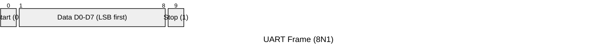

Each frame begins with a low start bit (the falling edge the receiver uses to synchronize its sample clock), then the data bits (LSB first for most UARTs), an optional parity bit, and one or two high stop bits that guarantee the line returns to idle before the next frame.

### I2C frame (7-bit addressing, single-byte register write)

```text
 S | A6 A5 A4 A3 A2 A1 A0 R/W | ACK | D7 D6 D5 D4 D3 D2 D1 D0 | ACK | P
   |------- 7-bit address ----|      |------- data byte -------|

S    = START condition (SDA falls while SCL is high)
R/W  = 0 for write, 1 for read
ACK  = receiver pulls SDA low for one clock to acknowledge
P    = STOP condition (SDA rises while SCL is high)
```

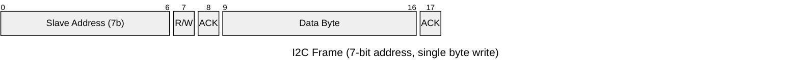

The controller drives SCL for every clock pulse (a target can also hold SCL low to stretch the clock). START and STOP are defined by SDA transitions while SCL is high. That is what makes them unambiguous, because a data bit only changes while SCL is low.

### SPI transaction (single byte, Mode 0)

```text
CS   : ‾\_________________________/‾
SCK  : __/‾\_/‾\_/‾\_/‾\_/‾\_/‾\_/‾\_/‾\__
MOSI : ==[b7][b6][b5][b4][b3][b2][b1][b0]==
MISO : ==[b7][b6][b5][b4][b3][b2][b1][b0]==
           (data sampled on the rising edge in Mode 0: CPOL=0, CPHA=0)
```

CS goes low to select the target before the clock starts and stays low for the whole transaction. MOSI and MISO shift a bit per clock edge at the same time (full duplex), so a "read" is really sending a command while discarding the byte received, and a "write" discards the byte received while sending data.

---

## Part 1: UART, SPI, and I2C

## 1. Why is UART asynchronous?

**Short answer:** The two ends share no clock line. Each relies on configured timing and frame bits to find symbol boundaries.

**Example:** A UART frame has a start bit, eight data bits, optional parity, and stop bits.

**Follow-up:** What causes framing errors? Baud or format mismatch, noise, or bad timing.

## 2. Baud rate versus bit rate?

**Short answer:** Baud is symbols per second. In simple binary UART one symbol carries one bit, but the terms are not always interchangeable.

**Example:** 115200 baud gives about 115200 symbols per second before framing overhead.

**Follow-up:** Why is payload throughput lower? Start and stop bits use time.

```text
8N1 = 10 bits on the wire per data byte  ->  115200 / 10 = 11520 bytes per second at best
```

## 3. What causes UART framing errors?

**Short answer:** Wrong baud or format, excessive clock mismatch, noise, poor line integrity, or invalid frame timing.

**Example:** A receiver using 7 data bits while the sender uses 8 can sample the stop bit wrongly.

**Follow-up:** How does software recover? Discard the invalid frame and resynchronize.

## 4. What is parity?

**Short answer:** A simple error-detection bit derived from the data bits. It detects some single-bit errors but is weak on its own.

**Example:** Even parity makes the total number of one bits (data plus parity) even.

**Follow-up:** Can parity correct errors? No.

## 5. Why is SPI called synchronous?

**Short answer:** A clock line defines the data timing between master and slave.

**Example:** The SPI master toggles SCK while MOSI and MISO shift data.

**Follow-up:** Who supplies the clock? The master.

## 6. What do CPOL and CPHA define?

**Short answer:** CPOL is the clock idle polarity. CPHA selects which edge samples or shifts data.

**Example:** A sensor needing mode 3 needs CPOL=1 and CPHA=1.

**Follow-up:** What does a wrong mode look like? Shifted or corrupted bits.

## 7. Why does SPI need chip select?

**Short answer:** The clock and data lines are shared by all devices, so chip select picks which slave is active.

**Example:** CS1 selects a flash chip while CS2 selects a display on the shared lines.

**Follow-up:** What must inactive slaves do? Release MISO (high impedance).

## 8. Why can SPI be full duplex?

**Short answer:** Separate transmit and receive lines let both directions shift at the same time.

**Example:** A transmitted SPI byte can simultaneously receive a status byte.

**Follow-up:** Does SPI define message boundaries? The application and chip select do.

## 9. What is I2C arbitration?

**Short answer:** Several masters can contend while watching the bus. The one that sees it has lost stops driving.

**Example:** An I2C master that loses arbitration stops and retries later.

**Follow-up:** Is that a bus fault? No, it is normal arbitration.

## 10. Why are I2C outputs open-drain?

**Short answer:** Devices only pull low and release for high, so many devices share the lines without fighting.

**Example:** Devices pull SDA and SCL low and release them high through resistors.

**Follow-up:** What controls rise time? The pull-up value and bus capacitance.

## 11. What determines the I2C pull-up resistor choice?

**Short answer:** Bus capacitance, voltage, speed, device sink capability, and the allowed rise time. Too weak is slow; too strong exceeds sink-current limits.

**Example:** A long, fast I2C bus may need stronger pull-ups, limited by sink current.

**Follow-up:** How do you verify them? Measure rise time and the low-level voltage.

## 12. What is I2C clock stretching?

**Short answer:** A target holds SCL low to delay the controller, where supported.

**Example:** A sensor stretches SCL while completing a conversion.

**Follow-up:** What controller issue matters? Some controllers do not support indefinite stretching.

## 13. What is a repeated START?

**Short answer:** A new START issued without first releasing the bus, often to switch from a register-address write to a read.

**Example:** Write a register address, issue a repeated START, then read, with no STOP between.

**Follow-up:** Why use it? To keep the transaction continuous.

---

## Part 2: CAN, RS-485, and Modbus

## 14. Why does CAN use differential signaling?

**Short answer:** It rejects common-mode noise much better than single-ended signaling.

**Example:** CANH and CANL reject noise that appears on both wires.

**Follow-up:** What else is needed? Termination and correct topology.

## 15. What is CAN arbitration?

**Short answer:** Nodes send identifiers while watching the bus, so the highest-priority frame continues and the others back off, without corrupting it.

**Example:** A node sending recessive while seeing dominant loses arbitration.

**Follow-up:** Does the winning frame get corrupted? No.

## 16. Why is CAN identifier priority important?

**Short answer:** Lower numerical identifiers win arbitration on standard CAN, so identifier choice affects latency.

**Example:** An emergency frame uses a lower ID than a diagnostic frame.

**Follow-up:** What is the risk? Starvation of low-priority messages.

## 17. What is CAN ACK?

**Short answer:** Receivers acknowledge a valid frame on the bus. A transmitter with no ACK can infer that no node accepted it.

**Example:** No receiver ACK increases the transmitter's error counters.

**Follow-up:** Does ACK prove the application processed it? No.

## 18. What is CAN error-passive?

**Short answer:** A node with high error counts signals errors less aggressively, before it reaches bus-off.

**Example:** A faulty node enters error-passive.

**Follow-up:** What should be monitored? Error counters and state.

## 19. What is CAN bus-off?

**Short answer:** A node is removed from active bus participation after excessive errors and needs a defined recovery.

**Example:** A controller enters bus-off and begins recovery.

**Follow-up:** Should recovery be silent? No. Record it and bound it.

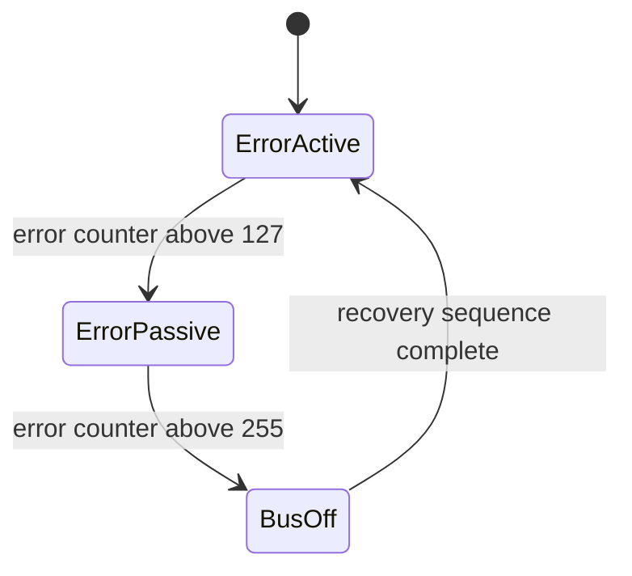

## 20. Why does RS-485 differ from UART?

**Short answer:** UART is asynchronous framing. RS-485 is a differential electrical interface used to carry serial protocols over longer, noisier links.

**Example:** Modbus RTU uses UART framing over an RS-485 transceiver.

**Follow-up:** Is RS-485 an application protocol? No.

## 21. What is Modbus RTU?

**Short answer:** A serial application protocol with framed requests and responses and a CRC, often over RS-485.

**Example:** A master reads holding registers from slave 3 using function 0x03.

**Follow-up:** Why does the silent interval matter? It marks RTU frame boundaries.

## 22. What is Modbus TCP?

**Short answer:** Modbus application data carried over TCP/IP, usually on Ethernet.

**Example:** A gateway converts Modbus TCP requests into Modbus RTU transactions.

**Follow-up:** Does TCP remove application timeouts? No.

## 23. Why does Modbus need a timeout?

**Short answer:** A requester must handle lost frames, disconnected devices, or protocol failures without blocking forever.

**Example:** A master starts a 100 ms response timer and applies bounded retries.

**Follow-up:** What must retries consider? Duplicate side effects.

---

## Part 3: MQTT

## 24. What is MQTT?

**Short answer:** A lightweight publish/subscribe protocol, with a broker between publishers and subscribers.

**Example:** A sensor publishes `site/line1/temperature` to a broker.

**Follow-up:** What does the broker do? Routes topics and manages sessions.

## 25. What are MQTT QoS levels?

**Short answer:** At-most-once (0), at-least-once (1), and exactly-once (2) delivery semantics.

**Example:** QoS 1 may deliver one command twice.

**Follow-up:** How should the device cope? Command IDs or idempotent operations.

## 26. Does MQTT QoS guarantee exactly-once effects in the application?

**Short answer:** No. Delivery semantics do not make a device's business operation idempotent. The application may need deduplication.

**Example:** Repeating `increment counter` twice creates two effects despite reliable delivery.

**Follow-up:** How do you fix it? Deduplicate by command ID.

## 27. What is an MQTT retained message?

**Short answer:** The broker stores the latest retained message for a topic, so a new subscriber gets the current state.

**Example:** A new dashboard receives the retained latest device state.

**Follow-up:** Is retained data history? Usually no.

## 28. What is an MQTT last-will message?

**Short answer:** A message the broker publishes if the client disconnects unexpectedly.

**Example:** An MQTT will publishes `offline` after an unexpected disconnect.

**Follow-up:** When is it cleared? On a clean disconnect.

## 29. What is keep-alive in MQTT?

**Short answer:** A negotiated interval used to detect silence and keep the connection alive with protocol traffic.

**Example:** A client sends PINGREQ before the keep-alive expires.

**Follow-up:** What happens after expiry? Reconnect with bounded backoff.

---

## Part 4: TCP, UDP, HTTP, TLS, and crypto basics

## 30. What is a TCP stream?

**Short answer:** An ordered, reliable byte stream, not a message-framed transport. The application needs its own framing.

**Example:** A TCP receiver reads a length header, then accumulates that many bytes.

**Follow-up:** Does one send equal one recv? No.

## 31. Why can `recv()` return fewer bytes than requested?

**Short answer:** TCP delivers a stream. Any positive number of available bytes may be returned. Code must accumulate until the frame is complete.

**Example:** A parser loops until a length-prefixed frame arrives.

**Follow-up:** What does zero from `recv()` mean? Orderly shutdown.

## 32. What is socket half-close?

**Short answer:** One direction of a TCP connection closes while the other still works.

**Example:** A client half-closes its transmit side while still receiving.

**Follow-up:** Which API is commonly used? `shutdown()`.

## 33. TCP versus UDP in embedded systems?

**Short answer:** TCP gives reliable ordered delivery with congestion control. UDP is datagram-based with less overhead and no delivery guarantee.

**Example:** TCP for firmware transfer, UDP with sequence numbers for telemetry.

**Follow-up:** Does UDP guarantee low latency? No.

## 34. What is HTTP request/response?

**Short answer:** A client sends a request (method, target, headers, body) and the server returns a response (status, headers, body).

**Example:** An embedded client sends `GET /status` and parses a bounded 200 response.

**Follow-up:** What must be bounded? Headers, body, redirects, and timeout.

## 35. What makes HTTPS different?

**Short answer:** HTTP over TLS, which gives encryption, integrity, and peer authentication when the trust chain is validated.

**Example:** A device validates the server certificate before sending credentials.

**Follow-up:** Does encryption alone authenticate? No.

## 36. What is TLS certificate validation?

**Short answer:** The client checks that the certificate is valid for the identity, within its validity period, and chains to a trusted authority.

**Example:** Validate the hostname, expiry, signature chain, and trusted root.

**Follow-up:** What if there is no RTC? Use a trusted time strategy.

## 37. Why is random number generation important in security protocols?

**Short answer:** Keys, nonces, and ephemeral values need unpredictable randomness. A weak RNG undermines strong cryptography.

**Example:** Predictable nonces undermine otherwise strong TLS encryption.

**Follow-up:** What needs testing? Entropy at startup and RNG health.

## 38. What is SHA-256?

**Short answer:** A cryptographic hash function producing a 256-bit digest. It is not encryption.

**Example:** Store a SHA-256 digest with firmware metadata before signature verification.

**Follow-up:** Does a hash authenticate the publisher? No.

## 39. What is AES?

**Short answer:** A symmetric block cipher. It needs a key and a secure mode, nonce, or IV design.

**Example:** AES-GCM protects data when nonce reuse is prevented.

**Follow-up:** What is a critical mistake? Reusing a nonce with the same key.

---

## Part 5: Framing, CRC, flow control, and protocol design

## 40. What is framing?

**Short answer:** A method to tell where one message begins and ends on a byte stream or serial channel.

**Example:** A frame contains sync, length, type, payload, and CRC.

**Follow-up:** How does a parser recover? Search for the next valid sync.

## 41. What is CRC?

**Short answer:** A cyclic redundancy check that detects many accidental transmission errors. The polynomial and initialization must match the protocol.

**Example:** Modbus RTU appends a protocol-specific CRC-16.

**Follow-up:** Does CRC stop tampering? No. Authentication is required.

## 42. Checksum versus CRC?

**Short answer:** Simple checksums are easy but detect fewer errors than a well-chosen CRC.

**Example:** An additive checksum can miss two changes that cancel each other.

**Follow-up:** How do you choose? Match the protocol and its error model.

## 43. What is backpressure in communication software?

**Short answer:** A mechanism that stops producers from overwhelming consumers: bounded queues, flow control, or a drop policy.

**Example:** A UART driver stops accepting data at a ring-buffer high-water mark.

**Follow-up:** What happens without backpressure? Overflow or unbounded latency.

## 44. What is hardware flow control?

**Short answer:** Signals such as RTS and CTS regulate transmission when the receiver has limited capacity.

**Example:** CTS goes inactive when a receiver buffer is nearly full.

**Follow-up:** What must be checked? Pin routing and polarity.

## 45. What is software flow control?

**Short answer:** XON and XOFF control characters sent inside the data stream to regulate the sender.

**Example:** XOFF pauses transmission until XON arrives.

**Follow-up:** What is the limitation? The control bytes are in-band.

## 46. How do you make a protocol parser robust?

**Short answer:** An explicit state machine, bounds-checked lengths, validated type and checksum, handling of malformed input, and guaranteed progress after errors.

**Example:** A parser returns to `WAIT_SYNC` after an invalid length or CRC.

**Follow-up:** What is a denial-of-service risk? Unbounded lengths or no timeout.

## 47. Why should TCP application protocols include a length or delimiter?

**Short answer:** TCP does not preserve message boundaries. Framing says how much data belongs to one message.

**Example:** A TCP header contains magic, version, payload length, and CRC.

**Follow-up:** Delimiter or length? Choose based on binary data and recovery needs.

## 48. How would you choose between UART, SPI, I2C, CAN, and MQTT?

**Short answer:** Start with distance and topology, electrical constraints, throughput and latency, number of nodes, fault model, and application architecture.

**Example:** CAN for multi-node arbitration, SPI for short-board speed, MQTT for brokered telemetry.

**Follow-up:** What should not drive the choice alone? Familiarity.

| Need | Good fit |
| --- | --- |
| Short board-level, high speed | SPI |
| Few slow on-board devices, two wires | I2C |
| Simple point-to-point debug or modem link | UART |
| Noisy multi-node, priority messaging | CAN |
| Cloud telemetry through a broker | MQTT |

## 49. What is the strongest protocol interview answer?

**Short answer:** Explain protocol semantics **and** the system consequences: timing, buffering, errors, retries, framing, electrical layer, security, and recovery.

**Example:** A senior CAN answer covers arbitration latency, bus-off recovery, queue sizing, and diagnostics.

**Follow-up:** What separates senior answers? System-level consequences.

## 50. How do you make retries safe?

**Short answer:** Bounded attempts and timeouts, classify retryable failures, include request IDs or sequence numbers, and make side effects idempotent when practical.

**Example:** A command carries sequence number 42 and the receiver ignores a duplicate 42.

**Follow-up:** What should not be blindly retried? Non-idempotent operations.

---

## Part 6: Senior protocol engineering

## 51. How do you design a protocol driver for bounded latency?

**Short answer:** Separate ISR capture, buffering, parsing, and application handling. Bound every queue, loop, timeout, and retry path.

**Example:** An ISR pushes bytes into a fixed ring buffer and wakes a parser task. It never parses a full frame in interrupt context.

**Follow-up:** What do you measure? Worst-case ISR time, parser time, queue depth, and end-to-end latency.

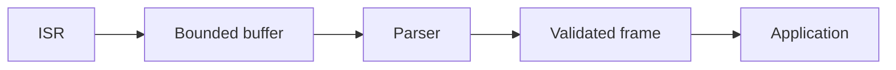

## 52. How do you handle protocol versioning in deployed devices?

**Short answer:** Explicit version and capability fields, backward compatibility where possible, and safe rejection of unsupported features.

**Example:** A frame header carries major version, minor version, length, and a feature bitmap.

**Follow-up:** Why not infer version from length alone? Optional fields and malformed frames make that ambiguous.

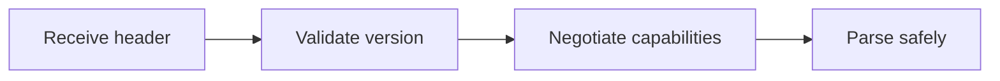

## 53. How do you prevent a malformed frame from exhausting memory?

**Short answer:** Validate the length against a fixed maximum before allocating or copying, and discard incrementally if the limit is exceeded.

**Example:** Reject a declared 64 KB payload when the parser buffer is 512 bytes.

**Follow-up:** What if the length field is corrupted? Check bounds before any arithmetic or allocation.

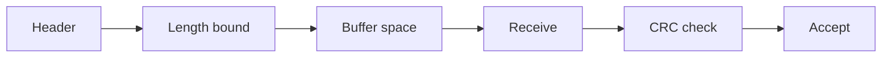

## 54. How do you design recovery after a corrupted stream?

**Short answer:** Discard invalid data, search for a sync marker, enforce a timeout, and guarantee parser progress after errors.

**Example:** After a CRC failure, scan for the next sync byte instead of retrying the same byte forever.

**Follow-up:** What prevents an infinite loop? A progress invariant and bounded scan work.

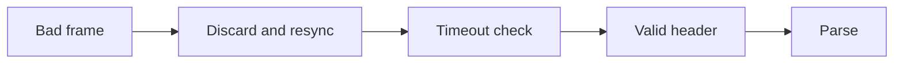

## 55. How do you test interoperability with another vendor?

**Short answer:** Golden frames, boundary values, negative tests, timing tests, and captures from both implementations.

**Example:** Test zero length, maximum length, reserved flags, bad CRC, retransmission, and endianness.

**Follow-up:** What artifact should be maintained? A versioned protocol conformance suite.


## 56. How do you calculate communication bandwidth for a product?

**Short answer:** Include payload, headers, framing, retries, idle gaps, arbitration loss, flow-control pauses, and worst-case bursts.

**Example:** UART payload throughput is lower than the baud rate because each byte includes framing bits.

**Follow-up:** Average or worst case? Buffers and deadlines use the worst-case burst.


## 57. How do you debug an intermittent bus fault in production?

**Short answer:** Capture timestamps, error counters, bus state, reset reason, supply condition, temperature, and bounded raw-frame samples.

**Example:** Correlate CAN error-passive transitions with motor-current spikes and cable noise.

**Follow-up:** How do you avoid changing the fault? Compact counters and non-blocking trace storage.

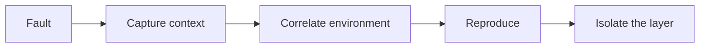

## 58. How should a secure firmware-update protocol be designed?

**Short answer:** Authenticate the image, check version and target, protect against rollback, and make power loss recoverable.

**Example:** Download to an inactive slot, verify signature and hash, then atomically update boot metadata.

**Follow-up:** Why is encryption alone insufficient? It does not prove who wrote the image.

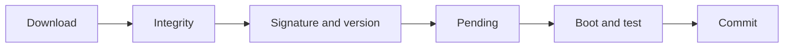

## 59. How do you handle duplicate commands safely?

**Short answer:** Sequence numbers, transaction IDs, idempotent operations, and persisted state when duplicates can survive a reboot.

**Example:** `set output=ON` is idempotent. `increment counter` needs deduplication.

**Follow-up:** What state may need persistence? Enough transaction state to prevent unsafe replay.

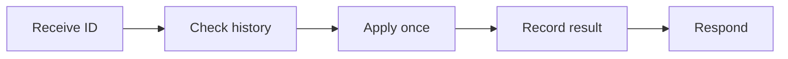

## 60. How do you handle timeouts and retries across protocol layers?

**Short answer:** Give retry policy to one layer, use bounded backoff, classify failures, and keep the request identity.

**Example:** The application retries a transaction while the transport only reconnects.

**Follow-up:** What is retry amplification? Several layers retrying the same failure and multiplying traffic.

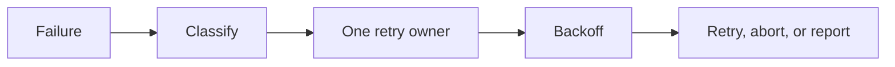

## 61. How do you design protocol APIs for RTOS tasks and ISRs?

**Short answer:** Separate ISR-safe and task-context APIs, document blocking behaviour, and make ownership explicit.

**Example:** `receive_from_isr()` only enqueues a byte. `read_frame()` may block in a task.

**Follow-up:** Why separate APIs? To prevent accidental blocking or unsafe calls from interrupt context.

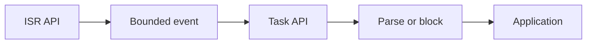

## 62. How do you size queues and ring buffers?

**Short answer:** From worst-case burst, service latency, frame size, retry behaviour, and memory budget. Not from average traffic.

**Example:** Size a UART ring buffer for the maximum interrupt-disabled interval plus parser scheduling latency.

```text
buffer bytes >= baud/10 (bytes per second) x worst-case service latency (seconds)
Example: 115200 baud, 20 ms latency -> 11520 x 0.02 = about 230 bytes, plus margin
```

**Follow-up:** What should telemetry expose? High-water mark, drops, overflows, and current occupancy.

## 63. How do you handle endian and alignment portability?

**Short answer:** Decode bytes explicitly or use tested serialization helpers. Do not cast arbitrary byte pointers to packed multi-byte types.

**Example:** Assemble a 32-bit little-endian value with four shifts and ORs.

**Follow-up:** What else varies? Alignment rules, integer widths, compiler packing, and floating-point representation.

## 64. How do you design protocol logging for field diagnostics?

**Short answer:** Compact structured events with timestamp, direction, interface, error code, sequence, and bounded payload samples.

**Example:** Record CAN ID, DLC, error state, and a monotonic timestamp instead of formatted text in an ISR.

**Follow-up:** What privacy concern exists? Payloads may contain credentials or personal data and need filtering.

## 65. What is protocol observability beyond logging?

**Short answer:** Counters, state transitions, queue high-water marks, retry counts, latency, and last-error context.

**Example:** Report CAN bus-off count, MQTT reconnect count, and parser CRC failures separately.

**Follow-up:** Why separate counters? Aggregated errors hide which layer is failing.

## 66. How do you prevent protocol state-machine lockups?

**Short answer:** Define legal transitions, entry and exit actions, a timeout for every wait state, and a recovery state for invalid input.

**Example:** A response-wait state returns to idle after a timeout instead of waiting forever.

**Follow-up:** What should every state guarantee? Bounded work and progress, or a timed exit.

## 67. How do you review a protocol change for backward compatibility?

**Short answer:** Compare wire layout, defaults, reserved fields, error behaviour, timing, maximum sizes, and old-client behaviour. Add golden-vector tests.

**Example:** Append optional fields after the original payload, keeping the old length interpretation.

**Follow-up:** What silently breaks compatibility? Changed endianness, enum values, timeout meaning, or CRC parameters.

## 68. How do you handle protocol security key rotation?

**Short answer:** Authenticated key updates, versioned key identifiers, overlap periods, rollback protection, and power-loss recovery.

**Example:** Accept a new key only after verifying an update signed by the current trusted key.

**Follow-up:** What if power fails during rotation? Store old and new metadata atomically.

## 69. How do you handle clock drift in time-sensitive protocols?

**Short answer:** Measure drift, synchronize or correct timestamps, define tolerance windows, and use monotonic clocks for local timeouts.

**Example:** Timestamped samples use a synchronized epoch plus local monotonic intervals.

**Follow-up:** What is unsafe? Comparing unsynchronized absolute times directly.

## 70. How do you design a protocol for power-loss recovery?

**Short answer:** Sequence numbers, durable checkpoints, atomic metadata, idempotent commands, and explicit resume behaviour.

**Example:** A firmware download resumes from the last verified chunk after reboot.

**Follow-up:** What must not be assumed? That the last transmitted message was committed.

## 71. How do you diagnose a field-only protocol failure?

**Short answer:** Compare firmware, configuration, physical environment, peer versions, timing, traffic volume, and reset history.

**Example:** A failure only with long cables and high temperature points to signal integrity or timing margin.

**Follow-up:** What is the first comparison? Known-good and failing captures with identical decoded context.

## 72. How do you verify a protocol implementation for production?

**Short answer:** Specification review, golden vectors, property tests, fuzzing, fault injection, interoperability, and hardware-in-the-loop testing.

**Example:** Fuzz every length, flag, CRC, and state transition while asserting bounded memory and progress.

**Follow-up:** What property is essential? Malformed input must not crash, hang, or exceed resource limits.

## 73. How do you handle protocol overload gracefully?

**Short answer:** Prioritize critical traffic, apply backpressure, shed optional work, bound retries, and expose the overload state.

**Example:** Drop debug telemetry before safety commands when a CAN queue reaches its high-water mark.

**Follow-up:** What must remain deterministic? The overload policy and the recovery path.

## 74. How do you separate protocol, transport, and application errors?

**Short answer:** Use distinct error domains and keep the original cause while mapping it to an application result.

**Example:** Distinguish CRC failure, TCP timeout, TLS validation failure, and an invalid business command.

**Follow-up:** Why avoid one generic error? Recovery and field diagnosis become ambiguous.

## 75. What does an eight-year protocol engineer bring to a design review?

**Short answer:** They connect wire semantics to electrical behaviour, timing, memory, security, interoperability, diagnostics, upgradeability, and recovery.

**Example:** For a CAN bootloader, review arbitration, bus-off recovery, framing, authentication, rollback, power loss, watchdog behaviour, and logs.

**Follow-up:** The key question: can the system fail safely, recover predictably, and explain what happened in the field?

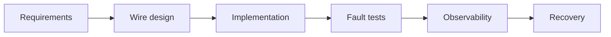

---

## Part 7: USB, Ethernet, and TCP/IP

## 76. What is USB differential signaling, and how does the host know a device just connected?

**Short answer:** USB data (D+ and D-) is sent differentially for noise immunity. Pull-up resistors tell the host a device is present and how fast it is.

A full-speed device pulls D+ high, a low-speed device pulls D- high, and a high-speed device starts as full-speed and negotiates further. The host or hub senses which line is pulled up to detect the connection and initial speed before enumeration.

## 77. Walk through USB enumeration after a device is plugged in

**Short answer:** Reset, learn the device, assign an address, read the configuration, activate it, then class drivers bind.

```mermaid
sequenceDiagram
    participant Host
    participant Device
    Host->>Device: Bus reset (device uses default address 0)
    Host->>Device: GET_DESCRIPTOR (device): vendor ID, product ID, class, endpoint 0 size
    Host->>Device: SET_ADDRESS (unique address)
    Host->>Device: GET_DESCRIPTOR (configuration): interfaces, endpoints, power
    Host->>Device: SET_CONFIGURATION
    Note over Host,Device: Class driver (HID, CDC, mass storage) binds; normal transfers begin
```

## 78. What are the four USB transfer types, and when would you use each?

| Type | Guarantee | Use |
| --- | --- | --- |
| Control | Guaranteed, low throughput | Enumeration, configuration, vendor commands (endpoint 0 on every device) |
| Bulk | Error retry, no guaranteed bandwidth or latency | Mass storage, firmware transfer |
| Interrupt | Guaranteed maximum polling interval | HID keyboards, periodic sensor data |
| Isochronous | Guaranteed bandwidth and timing, no retry | Audio and video streaming |

**Remember:** isochronous prefers a dropped sample over a stalled stream.

## 79. Why is USB polled by the host rather than device-initiated?

**Short answer:** USB is host-centric. The host schedules every transaction, so bus access is central and deterministic.

Even "interrupt" transfers are host-polled at a negotiated interval, not pushed asynchronously. That removes the need for a bus arbitration protocol like CAN's and keeps device logic simple, at the cost of no true asynchronous push.

## 80. How does an Ethernet MAC frame look, and what are the preamble and FCS for?

```text
| Preamble+SFD (8) | Dest MAC (6) | Src MAC (6) | EtherType (2) | Payload (46-1500) | FCS (4) |
```

- **Preamble and SFD:** a fixed bit pattern that lets the receiver's clock recovery lock on. It is removed by the MAC before the frame goes up.
- **FCS:** a CRC-32 over the frame. The receiver discards corrupted frames.
- **Payload:** padded to at least 46 bytes if shorter.

## 81. What is CSMA/CD, and is it still relevant on modern embedded Ethernet?

**Short answer:** It was the arbitration scheme for shared-medium half-duplex Ethernet. Nodes listened before sending and backed off after a collision. It is largely obsolete.

Modern embedded designs use switched full-duplex Ethernet (one switch port per device), where collisions cannot happen. It is still asked to check that you understand why full-duplex switching removes the problem.

## 82. What is the difference between MII, RMII, and RGMII?

**Short answer:** They are digital interfaces between the MAC (often in the SoC) and the PHY chip.

| Interface | Pins | Clock | Note |
| --- | --- | --- | --- |
| MII | Most | 25 MHz for 100 Mbps | Simple, needs more routing |
| RMII | About half of MII | 50 MHz | Common when pins and board area are tight |
| RGMII | Fewest for gigabit | Both clock edges (DDR) | Gigabit with few signals |

The choice is a board layout and pin-budget trade-off, not a software behaviour difference.

## 83. What is ARP, and why does an embedded device need it even with a static IP?

**Short answer:** ARP maps an IP address to the MAC address needed to actually deliver an Ethernet frame on the local segment.

Even with a static IP, the device must ARP-resolve its gateway (or any local peer) at least once before sending, because an Ethernet frame needs a hardware destination address. Entries are cached and refreshed.

## 84. Explain the TCP three-way handshake, and why two steps are not enough

```mermaid
sequenceDiagram
    participant Client
    participant Server
    Client->>Server: SYN (my initial sequence number)
    Server-->>Client: SYN-ACK (I got yours; here is mine)
    Client->>Server: ACK (I got yours)
    Note over Client,Server: Both sides have confirmed send and receive with agreed sequence numbers
```

Two steps are not enough because the initiator alone cannot confirm the second party received its SYN and picked a consistent sequence number. The third step confirms the return path and prevents half-open connections and old duplicate SYNs from being mistaken for a new connection.

## 85. What is the Nagle algorithm, and why do real-time applications disable it (`TCP_NODELAY`)?

**Short answer:** Nagle buffers small TCP writes and merges them into fewer, larger packets. That saves overhead but adds delay.

```c
int flag = 1;
setsockopt(sock, IPPROTO_TCP, TCP_NODELAY, &flag, sizeof flag);   /* send every write immediately */
```

For command-and-response control protocols the delay is unwanted. Nagle also interacts badly with delayed ACKs on the other side and can create visible stalls of about 200 ms unless both ends are addressed.

## 86. What is MTU, and what happens when a packet exceeds it?

**Short answer:** The largest frame a link can carry (1500 bytes for Ethernet). Larger IP packets are fragmented, or dropped with an ICMP error if "Don't Fragment" is set.

IoT designs keep messages well under the path MTU, because fragmentation adds reassembly complexity, and one lost fragment forces retransmission of the whole packet.

## 87. What is TCP congestion control, and why does it matter for a constrained IoT link?

**Short answer:** It limits how much unacknowledged data is in flight, growing on success and shrinking sharply on loss.

On satellite, cellular, or LPWAN links, high round-trip time and non-congestion loss (radio interference) look like congestion, so TCP may throttle even when the link is not congested. Some IoT designs prefer UDP with an application-level reliability scheme tuned to the real link.

## 88. What is DHCP, and what should an embedded device do if it fails to get a lease?

**Short answer:** DHCP assigns an IP address, mask, gateway, and DNS through a DISCOVER, OFFER, REQUEST, ACK exchange.

A robust device uses bounded retry with backoff and a defined fallback: a static or link-local address, background retry while non-network functions keep running, or a clear fault state. It must not block boot forever waiting for a lease.

## 89. What is the difference between TCP keep-alive and an application heartbeat?

| | TCP keep-alive | Application heartbeat |
| --- | --- | --- |
| Layer | Transport (`SO_KEEPALIVE`) | Protocol (for example MQTT PINGREQ/PINGRESP) |
| Detects | A dead peer or dropped link | That the remote application is alive |
| Default timing | Often hours | You choose it |

They are complementary. Many embedded stacks shorten or disable OS keep-alive in favour of an application heartbeat tuned to the product's failure-detection needs.

## 90. How would you design a TCP client to survive a flaky cellular or Wi-Fi link?

- Use non-blocking sockets or hard timeouts on `connect()`, `recv()`, and `send()`, so a stalled link never hangs the task
- Reconnect with exponential backoff, a cap, and jitter, to avoid a reconnect storm
- Detect a dead connection early with a short application heartbeat, not TCP's long default timers
- Follow a defined policy for queued outbound data while disconnected (no unbounded queue)
- Make resend logic idempotent (sequence numbers, resume points), because a connection can drop mid-message with the peer's receipt state unknown

---

## Coding Examples

### UART receive ring buffer

**Idea:** A bounded ring buffer moves bytes from an ISR to a parser task. The ISR only stores data.

```c
#define UART_BUFFER_SIZE 128u

static volatile uint8_t  uart_buffer[UART_BUFFER_SIZE];
static volatile uint16_t uart_head;      /* next write index (ISR) */
static volatile uint16_t uart_tail;      /* next read index (task) */

void uart_rx_isr(uint8_t byte)
{
    uint16_t next = (uint16_t)((uart_head + 1u) % UART_BUFFER_SIZE);

    if (next != uart_tail) {             /* not full */
        uart_buffer[uart_head] = byte;
        uart_head = next;                /* publish after storing */
    }                                    /* else: full, so drop (and count it in real code) */
}

bool uart_read_byte(uint8_t* byte)
{
    if (byte == NULL || uart_head == uart_tail) {   /* NULL argument, or buffer empty */
        return false;
    }

    *byte = uart_buffer[uart_tail];
    uart_tail = (uint16_t)((uart_tail + 1u) % UART_BUFFER_SIZE);
    return true;
}
```

### UART framed parser

**Idea:** Parse sync, length, payload, and CRC, and reject oversized frames.

```c
typedef enum {
    WAIT_SYNC,
    READ_LENGTH,
    READ_PAYLOAD,
    READ_CRC
} parser_state_t;

bool parser_push(uint8_t byte)
{
    static parser_state_t state = WAIT_SYNC;
    static uint8_t payload[64];
    static uint8_t length;
    static uint8_t index;

    switch (state) {
    case WAIT_SYNC:
        if (byte == 0xA5u) {                        /* sync byte found */
            state = READ_LENGTH;
        }
        break;
    case READ_LENGTH:
        if (byte == 0u || byte > sizeof(payload)) { /* reject 0 and oversized lengths BEFORE storing */
            state = WAIT_SYNC;
        } else {
            length = byte;
            index = 0u;
            state = READ_PAYLOAD;
        }
        break;
    case READ_PAYLOAD:
        payload[index++] = byte;
        if (index == length) {
            state = READ_CRC;
        }
        break;
    case READ_CRC:
        state = WAIT_SYNC;                          /* always return to sync, pass or fail */
        return crc8(payload, length) == byte;       /* true means a valid frame is in payload[] */
    }

    return false;
}
```

### SPI register transaction

**Idea:** Keep chip-select control and the full-duplex transfer inside one bounded transaction.

```c
uint8_t spi_read_register(uint8_t chip_select, uint8_t address)
{
    uint8_t command = (uint8_t)(address | 0x80u);   /* bit 7 set means "read" on many devices */
    uint8_t value;

    gpio_write(chip_select, false);                 /* select the device */
    spi_transfer(&command, NULL, 1u);               /* send the register address */
    spi_transfer(NULL, &value, 1u);                 /* clock in the register value */
    gpio_write(chip_select, true);                  /* deselect, always, even on error paths in real code */
    return value;
}
```

### SPI mode and timeout validation

**Idea:** Validate the device mode, and never wait forever for a peripheral or DMA completion.

```c
bool spi_configure(const spi_device_t* device)
{
    if (device == NULL || device->mode > SPI_MODE_3 || device->clock_hz == 0u) {
        return false;                               /* reject invalid configuration */
    }

    spi_set_mode(device->mode);                     /* CPOL and CPHA */
    spi_set_clock(device->clock_hz);
    return true;
}
```

### I2C register write

**Idea:** A register write sends the address, the register number, and the payload in one controller transaction.

```c
bool i2c_write_register(uint8_t address, uint8_t reg, uint8_t value)
{
    uint8_t bytes[] = {reg, value};                 /* register pointer, then data */
    return i2c_write(address, bytes, sizeof(bytes), 20u) == I2C_OK;   /* 20 ms timeout */
}
```

### I2C repeated-start register read

**Idea:** A write phase for the register address, then a repeated-start read phase.

```c
bool i2c_read_register(uint8_t address, uint8_t reg, uint8_t* value)
{
    if (value == NULL) {
        return false;
    }

    /* write 'reg', repeated START, then read 1 byte: no STOP in between */
    if (i2c_write_then_read(address, &reg, 1u, value, 1u, 20u) != I2C_OK) {
        return false;
    }

    return true;
}
```

### I2C bus recovery

**Idea:** If SDA is held low, clock SCL up to nine times so the slave can release it, then reinitialize.

```c
bool i2c_recover_bus(void)
{
    i2c_disable_peripheral();
    gpio_configure_scl_output();
    gpio_configure_sda_input();

    for (uint8_t pulse = 0u; pulse < 9u && !gpio_read_sda(); ++pulse) {
        gpio_write_scl(false);
        delay_us(5u);
        gpio_write_scl(true);
        delay_us(5u);
    }

    i2c_generate_stop();
    i2c_enable_peripheral();
    return gpio_read_sda();                         /* true means the bus is free again */
}
```

### CRC-16 calculation

**Idea:** The polynomial, initial value, reflection, and final XOR must match the protocol specification.

```c
/* CRC-16/MODBUS: poly 0xA001 (reflected 0x8005), init 0xFFFF, no final XOR */
uint16_t crc16_update(uint16_t crc, const uint8_t* data, size_t length)
{
    while (length-- > 0u) {
        crc ^= *data++;                                       /* mix in the next byte */
        for (uint8_t bit = 0u; bit < 8u; ++bit) {
            crc = (crc & 1u) ? (crc >> 1u) ^ 0xA001u : crc >> 1u;   /* shift, XOR the polynomial if a 1 fell off */
        }
    }
    return crc;
}
/* Call with crc = 0xFFFF for the first block. Check value for "123456789" is 0x4B37. */
```

### MQTT publish and reconnect policy

**Idea:** Keep MQTT callbacks short, bound the reconnect delay, and never publish sensitive data before TLS validation.

```c
bool mqtt_publish_temperature(mqtt_client_t* client, float temperature)
{
    char payload[32];
    int length = snprintf(payload, sizeof(payload), "%.2f", temperature);

    if (length < 0 || (size_t)length >= sizeof(payload)) {   /* formatting failed or was truncated */
        return false;
    }

    return mqtt_publish(client,
                        "device/temperature",
                        payload,
                        (size_t)length,
                        MQTT_QOS_AT_LEAST_ONCE,             /* QoS 1: may arrive twice */
                        false);                             /* not retained */
}
```

### MQTT command deduplication

**Idea:** Use a command ID so a QoS 1 redelivery does not repeat a non-idempotent operation.

```c
bool handle_command(uint32_t command_id, command_type_t type)
{
    if (command_id == last_command_id) {
        return true;                    /* duplicate delivery: already applied, just acknowledge */
    }

    if (!apply_command(type)) {
        return false;                   /* failed: do not record it, so a retry can succeed */
    }

    last_command_id = command_id;       /* record only after success */
    return true;
}
```

### TCP exact-length receive

**Idea:** TCP is a stream, so keep reading until the requested frame is complete or the peer closes.

```c
bool receive_exact(socket_t socket, uint8_t* buffer, size_t length)
{
    size_t received = 0u;

    while (received < length) {
        int count = socket_receive(socket, buffer + received, length - received);
        if (count <= 0) {               /* 0 = orderly close, negative = error */
            return false;
        }
        received += (size_t)count;      /* partial reads are normal: loop until complete */
    }

    return true;
}
```
