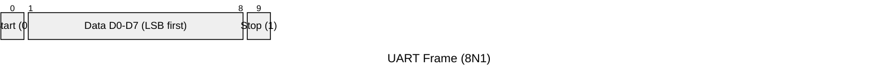
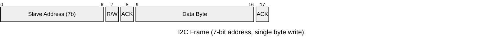

# Advanced 08 Communication Protocols Interview Questions

> 90-question deep-dive track with practical coding examples. Use each Q&A as a flashcard: answer aloud, study the example, then compare with the follow-up.

## Frame Diagrams

### UART frame (8N1: 8 data bits, no parity, 1 stop bit)

```text
Idle    Start   D0   D1   D2   D3   D4   D5   D6   D7   Stop    Idle
(high) (low)  (LSB) ...................................  (MSB) (high) (high)

Line level:
 1111111 0  b0   b1   b2   b3   b4   b5   b6   b7   1    1111111
         ^                                          ^
    Start bit                                   Stop bit(s)
    (falling edge                               (line returns
     marks frame start)                          to idle/high)
```



Each frame begins with a low start bit (the falling edge the receiver uses to synchronize its sample clock), followed by the data bits (LSB first for most UARTs), an optional parity bit, and one or two high stop bits that guarantee the line returns to idle before the next frame.

### I2C frame (7-bit addressing, single-byte register write)

```text
 S | A6 A5 A4 A3 A2 A1 A0 R/W | ACK | D7 D6 D5 D4 D3 D2 D1 D0 | ACK | P
   |------- 7-bit address ----|      |------- data byte -------|

SCL: _/‾\_/‾\_/‾\_/‾\_/‾\_/‾\_/‾\_/‾\____/‾\_/‾\_/‾\_/‾\_/‾\_/‾\_/‾\_/‾\____
SDA:  [   address bits, MSB first  ]      [    data bits, MSB first   ]

S    = START condition (SDA falls while SCL is high)
R/W  = 0 for write, 1 for read
ACK  = receiver pulls SDA low for one clock to acknowledge
P    = STOP condition (SDA rises while SCL is high)
```



The controller drives SCL for every clock pulse (including during clock stretching, where a target can hold SCL low itself). Both START and STOP are defined by SDA transitions while SCL is held high — this is what makes them unambiguous compared to a data bit, which only changes while SCL is low.

### SPI transaction (single byte, Mode 0)

```text
CS   : ‾\_________________________/‾
SCK  : __/‾\_/‾\_/‾\_/‾\_/‾\_/‾\_/‾\_/‾\__
MOSI : ==[b7][b6][b5][b4][b3][b2][b1][b0]==
MISO : ==[b7][b6][b5][b4][b3][b2][b1][b0]==
           (data sampled on rising edge in Mode 0: CPOL=0, CPHA=0)
```

CS goes low to select the target before the clock starts and stays low for the whole transaction; MOSI and MISO shift a bit per clock edge simultaneously (full duplex), so a "read" is really just discarding the byte received while sending a command, and a "write" discards the byte received while sending data.

---

## 1. Why is UART asynchronous?

The endpoints do not share a clock line; each side relies on configured timing and frame bits to recover symbol boundaries.

## 2. Baud rate versus bit rate?

Baud is symbols per second; in simple binary UART one symbol commonly carries one bit, but the terms are not universally interchangeable.

## 3. What causes UART framing errors?

Incorrect baud/format, excessive clock mismatch, noise, line integrity issues, or invalid frame timing.

## 4. What is parity?

A simple error-detection bit derived from data bits. It can detect some single-bit errors but cannot provide strong integrity by itself.

## 5. Why is SPI called synchronous?

A clock line defines data timing between master and slave.

## 6. What do CPOL and CPHA define?

Clock idle polarity and which edge is used for sampling/shifting data.

## 7. Why does SPI need chip select?

It typically selects which slave is active because the clock/data lines are shared across multiple devices.

## 8. Why can SPI be full duplex?

Separate transmit and receive data lines allow simultaneous shifting in both directions.

## 9. What is I2C arbitration?

Multiple masters can contend while monitoring the bus; the controller that detects it has lost arbitration stops driving according to the protocol.

## 10. Why are I2C outputs open-drain/open-collector?

Devices pull low and release high, allowing multiple devices to share the same lines without actively driving opposing levels.

## 11. What determines I2C pull-up resistor choice?

Bus capacitance, voltage, speed, device sink capability, and allowed rise time. Too weak is slow; too strong can exceed sink-current limits.

## 12. What is I2C clock stretching?

A target can hold SCL low to delay the controller, where supported and permitted by the bus/device.

## 13. What is a repeated START?

An I2C transaction can issue another START without first releasing the bus, often to switch from write/register-address phase to read.

## 14. Why does CAN use differential signaling?

It improves common-mode noise rejection over a shared bus compared with single-ended signaling.

## 15. What is CAN arbitration?

Nodes transmit identifiers while monitoring the bus, allowing the highest-priority frame to continue without corrupting the bus.

## 16. Why is CAN identifier priority important?

Lower numerical identifiers commonly represent dominant bits and win arbitration on standard CAN, so identifier selection affects latency.

## 17. What is CAN ACK?

Receivers acknowledge a valid frame on the bus. A transmitter with no ACK can infer that no node accepted it, depending on the controller state.

## 18. What is CAN error passive?

A node with high error counts can enter a less aggressive error-signaling state before bus-off, according to CAN controller behavior.

## 19. What is CAN bus-off?

A node is disconnected from active bus participation after excessive errors, requiring defined recovery behavior.

## 20. Why does RS-485 differ from UART?

UART describes asynchronous serial framing; RS-485 describes a differential electrical interface commonly used to transport serial protocols over longer/noisier links.

## 21. What is Modbus RTU?

A serial application protocol commonly transported over links such as RS-485, using framed requests/responses and CRC.

## 22. What is Modbus TCP?

Modbus application data transported over TCP/IP, commonly on Ethernet-based networks.

## 23. Why does Modbus need a timeout?

A requester must handle lost frames, disconnected devices, or protocol failures without blocking forever.

## 24. What is MQTT?

A lightweight publish/subscribe messaging protocol commonly used in IoT with a broker mediating publishers and subscribers.

## 25. What are MQTT QoS levels?

At-most-once, at-least-once, and exactly-once delivery semantics.

## 26. Does MQTT QoS guarantee application-level exactly-once effects?

No. Protocol delivery semantics do not automatically make a device-side business operation idempotent; applications may need deduplication.

## 27. What is an MQTT retained message?

A broker can store the latest retained message for a topic so a new subscriber can receive current state, subject to broker/session rules.

## 28. What is an MQTT last-will message?

A broker can publish a preconfigured will message when the client connection terminates unexpectedly under the protocol conditions.

## 29. What is keep-alive in MQTT?

A negotiated interval used to detect lack of communication and keep the connection active through protocol traffic.

## 30. What is a TCP stream?

An ordered reliable byte stream, not a message-framed transport. Applications need their own framing.

## 31. Why can recv() return fewer bytes than requested?

TCP delivers a stream; any available positive number of bytes may be returned. Code must accumulate until the application frame is complete.

## 32. What is socket half-close?

One direction of a TCP connection can be closed while the other remains usable, depending on application behavior.

## 33. TCP versus UDP in embedded systems?

TCP gives reliable ordered stream delivery with connection/congestion mechanisms; UDP is datagram-based with less protocol overhead but no built-in delivery guarantee.

## 34. What is HTTP request/response?

A client sends a request with method/target/headers/body and a server returns a response with status/headers/body.

## 35. What makes HTTPS different?

HTTP carried over TLS, which provides encryption/integrity and peer authentication when the trust chain is validated.

## 36. What is TLS certificate validation?

The client verifies that the peer certificate is valid for the identity, within its validity constraints, and chains to a trusted authority according to the configured policy.

## 37. Why is random number generation important in security protocols?

Keys, nonces, and ephemeral values need unpredictable randomness. A weak RNG can undermine otherwise strong cryptography.

## 38. What is SHA-256?

A cryptographic hash function producing a 256-bit digest. It is not encryption.

## 39. What is AES?

A symmetric block cipher. It requires a key and a secure mode/nonce/IV design appropriate to the application.

## 40. What is framing?

A method for determining where one application message begins and ends on a byte stream or serial channel.

## 41. What is CRC?

A cyclic redundancy check for detecting many accidental transmission errors. Exact polynomial/initialization parameters must match the protocol.

## 42. Checksum versus CRC?

Simple checksums are easy but generally provide weaker error-detection properties than a well-chosen CRC.

## 43. What is backpressure in communication software?

A mechanism that prevents producers from overwhelming downstream consumers, such as bounded queues, flow control, or dropping policy.

## 44. What is hardware flow control?

Signals such as RTS/CTS can regulate transmission when receiver capacity is limited. Support depends on hardware and configuration.

## 45. What is software flow control?

Protocols such as XON/XOFF use in-band control characters to regulate sender behavior.

## 46. How do you make a protocol parser robust?

Use an explicit state machine, bounds-check lengths, validate message type and checksum, handle malformed input, and guarantee progress after errors.

## 47. Why should TCP application protocols include a length or delimiter?

TCP does not preserve message boundaries. Framing tells the receiver how much data belongs to one message.

## 48. How would you choose between UART, SPI, I2C, CAN, and MQTT?

Start with physical distance/topology, electrical constraints, throughput/latency, multi-node requirements, fault model, and application architecture before choosing the protocol.

## 49. What is the strongest protocol interview answer?

Explain both the protocol semantics and the system-level consequences: timing, buffering, errors, retries, framing, electrical layer, security, and recovery.

## 50. How do you make retries safe?

Use bounded attempts and timeouts, identify retryable failures, include request IDs or sequence numbers where duplicates are possible, and make side effects idempotent when practical.

## 51. How do you design a protocol driver for bounded latency?

Separate ISR capture, buffering, parsing, and application handling. Bound every queue, loop, timeout, and retry path.

**Example:** An ISR pushes bytes into a fixed ring buffer and wakes a parser task; it never parses a full frame in interrupt context.

**Interview follow-up:** What do you measure? Worst-case ISR time, parser time, queue depth, and end-to-end latency.

**Flow:**
```text
ISR -> bounded buffer -> parser -> validated frame -> application
```

## 52. How do you handle protocol versioning in deployed devices?

Include explicit version and capability fields, maintain backward compatibility where possible, and reject unsupported features safely.

**Example:** A frame header carries major version, minor version, length, and feature bitmap.

**Interview follow-up:** Why not infer version from length alone? Optional fields and malformed frames make that ambiguous.

**Flow:**
```text
receive header -> validate version -> negotiate capabilities -> parse safely
```

## 53. How do you prevent a malformed frame from exhausting memory?

Validate length against a fixed maximum before allocation or copying, and discard incrementally when limits are exceeded.

**Example:** Reject a declared 64 KB payload when the parser buffer is limited to 512 bytes.

**Interview follow-up:** What if the length field is corrupted? Check bounds before arithmetic or allocation.

**Flow:**
```text
header -> length bound -> buffer space -> receive -> CRC/check -> accept
```

## 54. How do you design recovery after a corrupted stream?

Discard invalid data, search for a synchronization marker, enforce a timeout, and guarantee parser progress after errors.

**Example:** After a CRC failure, scan for the next sync byte instead of retrying the same byte forever.

**Interview follow-up:** What prevents an infinite loop? A progress invariant and bounded scan work.

**Flow:**
```text
bad frame -> discard/resync -> timeout check -> valid header -> parse
```

## 55. How do you test interoperability with another vendor?

Use golden frames, boundary values, negative tests, timing tests, and captures from both implementations.

**Example:** Test zero length, maximum length, reserved flags, bad CRC, retransmission, and endianness.

**Interview follow-up:** What artifact should be maintained? A versioned protocol conformance suite.

**Flow:**
```text
spec -> golden vectors -> vendor capture -> differential decode -> conformance report
```

## 56. How do you calculate communication bandwidth for a product?

Include payload, headers, framing, retries, idle gaps, arbitration loss, flow-control pauses, and worst-case bursts.

**Example:** UART payload throughput is lower than baud rate because each byte includes framing bits.

**Interview follow-up:** Average or worst case? Buffers and deadlines use worst-case bursts.

**Flow:**
```text
payload rate -> overhead -> retries/gaps -> peak rate -> buffer/deadline budget
```

## 57. How do you debug an intermittent bus fault in production?

Capture timestamps, error counters, bus state, reset reason, supply condition, temperature, and bounded raw-frame samples.

**Example:** Correlate CAN error-passive transitions with motor-current spikes and cable noise.

**Interview follow-up:** How do you avoid changing the fault? Use compact counters and non-blocking trace storage.

**Flow:**
```text
fault -> capture context -> correlate environment -> reproduce -> isolate layer
```

## 58. How should a secure firmware-update protocol be designed?

Authenticate the image, verify version and target, protect against rollback, and make power loss recoverable.

**Example:** Download to an inactive slot, verify signature and hash, then atomically update boot metadata.

**Interview follow-up:** Why is encryption alone insufficient? It does not prove who authored the image.

**Flow:**
```text
download -> integrity -> signature/version -> pending -> boot/test -> commit
```

## 59. How do you handle duplicate commands safely?

Use sequence numbers, transaction IDs, idempotent operations, and persisted state when duplicates may survive a reboot.

**Example:** `set output=ON` is idempotent, while `increment counter` requires deduplication.

**Interview follow-up:** What state may need persistence? Enough transaction state to prevent unsafe replay.

**Flow:**
```text
receive ID -> check history -> apply once -> record result -> respond
```

## 60. How do you handle timeouts and retries across protocol layers?

Assign retry policy to one layer, use bounded backoff, classify failures, and preserve request identity.

**Example:** The application retries a transaction while the transport only reconnects.

**Interview follow-up:** What is retry amplification? Multiple layers retrying the same failure and multiplying traffic.

**Flow:**
```text
failure -> classify -> one retry owner -> backoff -> retry/abort/report
```

## 61. How do you design protocol APIs for RTOS tasks and ISRs?

Expose separate ISR-safe and task-context APIs, document blocking behavior, and make ownership explicit.

**Example:** `receive_from_isr()` only enqueues a byte; `read_frame()` may block in a task.

**Interview follow-up:** Why separate APIs? To prevent accidental blocking or unsafe calls from interrupt context.

**Flow:**
```text
ISR API -> bounded event -> task API -> parse/block -> application
```

## 62. How do you size queues and ring buffers?

Use worst-case burst, service latency, frame size, retry behavior, and memory budget rather than average traffic alone.

**Example:** Size a UART ring buffer for the maximum interrupt-disabled interval plus parser scheduling latency.

**Interview follow-up:** What should telemetry expose? High-water mark, drops, overflows, and current occupancy.

**Flow:**
```text
burst + latency -> capacity -> stress test -> high-water mark -> tune
```

## 63. How do you handle endian and alignment portability?

Decode bytes explicitly or through tested serialization helpers; avoid casting arbitrary byte pointers to packed multi-byte types.

**Example:** Assemble a 32-bit little-endian value with four shifts and OR operations.

**Interview follow-up:** What else varies? Alignment rules, integer widths, compiler packing, and floating-point representation.

**Flow:**
```text
wire bytes -> validate length -> decode order -> typed value
```

## 64. How do you design protocol logging for field diagnostics?

Log compact structured events with timestamps, direction, interface, error code, sequence, and bounded payload samples.

**Example:** Record CAN ID, DLC, error state, and monotonic timestamp instead of formatted text in an ISR.

**Interview follow-up:** What privacy concern exists? Payloads may contain credentials or personal data and need filtering.

**Flow:**
```text
event -> compact record -> ring buffer -> persistent export -> analysis
```

## 65. What is protocol observability beyond logging?

Expose counters, state transitions, queue high-water marks, retry counts, latency, and last-error context.

**Example:** Report CAN bus-off count, MQTT reconnect count, and parser CRC failures separately.

**Interview follow-up:** Why separate counters? Aggregated errors hide the failing layer.

**Flow:**
```text
event -> metric -> threshold -> diagnostic state -> recovery
```

## 66. How do you prevent protocol state-machine lockups?

Define legal transitions, entry and exit actions, timeouts for every wait state, and a recovery state for invalid input.

**Example:** A response-wait state returns to idle after timeout instead of waiting forever.

**Interview follow-up:** What should every state guarantee? Bounded work and progress or a timed exit.

**Flow:**
```text
input -> validate transition -> state action -> timeout/progress -> next state
```

## 67. How do you review a protocol change for backward compatibility?

Compare wire layout, defaults, reserved fields, error behavior, timing, maximum sizes, and old-client behavior. Add golden-vector tests.

**Example:** Append optional fields after the original payload while preserving the old length interpretation.

**Interview follow-up:** What silently breaks compatibility? Changed endianness, enum values, timeout meaning, or CRC parameters.

**Flow:**
```text
change -> compatibility matrix -> vectors -> old/new peer test -> release
```

## 68. How do you handle protocol security key rotation?

Use authenticated key updates, versioned key identifiers, overlap periods, rollback protection, and power-loss recovery.

**Example:** Accept a new key only after verifying an update signed by the current trusted key.

**Interview follow-up:** What if power fails during rotation? Store old and new metadata atomically.

**Flow:**
```text
authenticated update -> verify key -> store atomically -> activate -> retire old key
```

## 69. How do you handle clock drift in time-sensitive protocols?

Measure drift, synchronize or correct timestamps, define tolerance windows, and use monotonic clocks for local timeouts.

**Example:** Timestamped samples use a synchronized epoch plus local monotonic intervals.

**Interview follow-up:** What is unsafe? Comparing unsynchronized absolute times directly.

**Flow:**
```text
local clock -> measure drift -> synchronize/correct -> validate window
```

## 70. How do you design a protocol for power-loss recovery?

Use sequence numbers, durable checkpoints, atomic metadata, idempotent commands, and explicit resume behavior.

**Example:** A firmware download resumes from the last verified chunk after reboot.

**Interview follow-up:** What must not be assumed? That the last transmitted message was committed.

**Flow:**
```text
power loss -> recover metadata -> verify checkpoint -> resume/replay safely
```

## 71. How do you diagnose a field-only protocol failure?

Compare firmware, configuration, physical environment, peer versions, timing, traffic volume, and reset history.

**Example:** A failure only with long cables and high temperature suggests signal integrity or timing margin.

**Interview follow-up:** What is the first comparison? Known-good and failing captures with identical decoded context.

**Flow:**
```text
field failure -> collect context -> compare baseline -> isolate variable -> reproduce
```

## 72. How do you verify a protocol implementation for production?

Combine specification review, golden vectors, property tests, fuzzing, fault injection, interoperability, and hardware-in-loop testing.

**Example:** Fuzz every length, flag, CRC, and state transition while asserting bounded memory and progress.

**Interview follow-up:** What property is essential? Malformed input must not crash, hang, or exceed resource limits.

**Flow:**
```text
spec -> unit tests -> fuzz/fault injection -> HIL -> interoperability -> evidence
```

## 73. How do you handle protocol overload gracefully?

Prioritize critical traffic, apply backpressure, shed optional work, bound retries, and expose overload state.

**Example:** Drop debug telemetry before safety commands when a CAN queue reaches its high-water mark.

**Interview follow-up:** What must remain deterministic? The overload policy and recovery path.

**Flow:**
```text
overload -> classify traffic -> prioritize/shed -> recover capacity -> report
```

## 74. How do you separate protocol, transport, and application errors?

Use distinct error domains and preserve the original cause while mapping it to an application result.

**Example:** Distinguish CRC failure, TCP timeout, TLS validation failure, and invalid business command.

**Interview follow-up:** Why avoid one generic error? Recovery and field diagnosis become ambiguous.

**Flow:**
```text
wire error -> transport error -> application error -> policy/recovery
```

## 75. What does an eight-year protocol engineer bring to a design review?

They connect wire semantics to electrical behavior, timing, memory, security, interoperability, diagnostics, upgradeability, and recovery.

**Example:** For a CAN bootloader, review arbitration, bus-off recovery, framing, authentication, rollback, power loss, watchdog behavior, and logs.

**Interview follow-up:** Can the system fail safely, recover predictably, and explain what happened in the field?

**Flow:**
```text
requirements -> wire design -> implementation -> fault tests -> observability -> recovery
```

## USB, Ethernet, and TCP/IP: Additional Advanced Questions

## 76. What is USB differential signaling, and how does the host know a device just connected?

USB data (D+/D-) is transmitted differentially (NRZI-encoded) for noise immunity, similar in spirit to CAN/RS-485. Detection of connection/speed uses pull-up resistors: a full-speed device pulls D+ high, a low-speed device pulls D- high, and a high-speed device negotiates further after starting as full-speed; the host/hub senses which line is pulled up to detect both "something connected" and the initial signaling speed before enumeration begins.

## 77. Walk through USB enumeration after a device is plugged in

After the host detects a connection and resets the bus, it assigns a temporary default address (0), then requests the device descriptor (`GET_DESCRIPTOR`) to learn vendor/product ID, class, and endpoint 0's max packet size. The host then assigns a unique address (`SET_ADDRESS`), reads the full configuration descriptor (interfaces, endpoints, power requirements), and finally activates a configuration (`SET_CONFIGURATION`) — after which class drivers (HID, CDC, mass storage, etc.) bind and normal data transfers can begin.

## 78. What are the four USB transfer types, and when would you use each in an embedded product?

Control transfers (used for enumeration/configuration and vendor-specific commands, guaranteed but not high throughput) — every device must support them on endpoint 0. Bulk transfers (large, non-time-critical data with error retry, no guaranteed bandwidth or latency — mass storage, firmware transfer). Interrupt transfers (small, low-latency, polled at a guaranteed minimum rate — HID devices like keyboards, or a sensor needing periodic guaranteed servicing). Isochronous transfers (guaranteed bandwidth and timing but no retry on error — audio/video streaming where a dropped sample is better than a stalled stream).

## 79. Why is USB polled by the host rather than device-initiated like an interrupt line?

USB is a host-centric bus — the host schedules every transaction (even "interrupt" transfers are host-polled at a negotiated interval, not asynchronously pushed by the device) so that bus arbitration is centrally managed and multiple devices can share bandwidth deterministically without needing an arbitration protocol like CAN's. This trades true asynchronous push notification for predictable bus scheduling and simpler device-side logic (a device only needs to respond when addressed, never contend for the bus).

## 80. How does an Ethernet MAC frame look, and what is the role of the preamble and FCS?

An Ethernet frame is: preamble + SFD (7+1 bytes, a fixed bit pattern letting the receiver's clock-recovery circuitry lock onto the incoming bit stream), destination MAC, source MAC, EtherType/length, payload (46-1500 bytes, padded if shorter), and a 4-byte FCS (a CRC-32 covering the frame, letting the receiver discard corrupted frames). The preamble is discarded by the receiving MAC before the frame is handed up — it exists purely for physical-layer synchronization, not addressing.

## 81. What is CSMA/CD, and is it still relevant on modern embedded Ethernet?

CSMA/CD (Carrier Sense Multiple Access with Collision Detection) was the arbitration scheme for shared-medium (hub-based, half-duplex) Ethernet: a node listens before transmitting, and if two nodes transmit simultaneously and detect a collision, both back off for a random interval before retrying. It's largely obsolete on modern embedded systems, which almost always use switched, full-duplex Ethernet (a dedicated switch port per device) where collisions structurally cannot occur — but it's still asked about because some interviewers want to confirm you understand why full-duplex switching eliminates the whole problem class.

## 82. What is the difference between MII, RMII, and RGMII in an embedded Ethernet design?

These are standardized digital interfaces between the MAC (often inside the SoC) and the PHY (the physical-layer transceiver chip). MII uses more pins (a wider parallel bus, lower clock — 25MHz for 100Mbps) which is simple but uses more board routing. RMII reduces pin count by roughly half at a higher clock rate, popular for area-constrained designs. RGMII further reduces pins by using both clock edges (DDR-style) to reach gigabit speeds with far fewer signals than a straightforward MII scale-up would need. Choosing between them is mostly a board layout/pin-budget/speed trade-off, not a protocol behavior difference visible to software.

## 83. What is ARP, and why does an embedded device need it even for a purely local/static-IP network?

ARP (Address Resolution Protocol) maps an IP address to the MAC address needed to actually deliver an Ethernet frame on the local network segment — IP is a logical addressing scheme, but the physical Ethernet frame needs the destination's hardware address. Even with a static IP, a device must ARP-resolve its default gateway (or any local peer) at least once (and refresh a cached entry periodically) before it can send the first Ethernet frame to that IP, since without a MAC address the frame has nowhere to be physically addressed to.

## 84. Explain the TCP three-way handshake and why two steps aren't enough

The client sends SYN (proposing an initial sequence number), the server responds SYN-ACK (acknowledging the client's sequence number and proposing its own), and the client responds ACK (acknowledging the server's sequence number) — after which both sides have confirmed they can send and receive with an agreed-upon starting point for reliable, ordered delivery. Two steps aren't enough because the initiator alone can't confirm that the second party actually received its SYN and picked a consistent sequence number; the third step confirms the return path also works, preventing "half-open" connections and old duplicate SYNs from a previous connection attempt being misinterpreted as a new one.

## 85. What is the Nagle algorithm, and why do embedded/real-time TCP applications often disable it (TCP_NODELAY)?

Nagle's algorithm delays sending small TCP segments, buffering them to coalesce into fewer, larger packets, which reduces overhead for bulk transfers of many small writes (like older Telnet sessions echoing one keystroke at a time). For latency-sensitive embedded protocols (a command/response control loop, or transmitting one part of a message per line), this delay is undesirable, so `TCP_NODELAY` disables it so each `send()` goes out immediately — the classic reason it interacts badly with is delayed ACKs on the other side, which can compound into visible ~200ms round-trip stalls if not addressed on both ends.

## 86. What is MTU, and what happens when a packet exceeds it?

The Maximum Transmission Unit is the largest frame size a given link layer can carry (commonly 1500 bytes for Ethernet). If an IP packet exceeds the outgoing link's MTU, it's fragmented into multiple IP packets (each independently routed and reassembled at the destination) unless the "Don't Fragment" flag is set, in which case an ICMP "fragmentation needed" error is returned instead. Embedded/IoT designs often deliberately keep application messages well under the path MTU to avoid fragmentation entirely, since fragmentation adds reassembly complexity/failure modes and a single lost fragment forces retransmission of the whole original packet.

## 87. What is TCP congestion control, and why does it matter for a constrained IoT link (e.g., cellular/LPWAN backhaul)?

TCP congestion control (e.g., the classic slow-start plus congestion-avoidance approach) dynamically limits how much unacknowledged data a sender can have in flight, growing the window when acknowledgments arrive promptly and shrinking sharply on loss (interpreted as a sign of congestion), so that many concurrent TCP flows on a shared network converge toward fair, sustainable throughput rather than overwhelming a bottleneck link. On a constrained/high-latency IoT backhaul (satellite, cellular, LPWAN), high round-trip time and non-congestion packet loss (radio interference) can be misinterpreted as congestion, causing TCP to throttle aggressively even when the link isn't actually congested — a reason some IoT designs prefer UDP with an application-level reliability/rate scheme tuned for the link's actual characteristics.

## 88. What is DHCP, and what should an embedded device do if it fails to get a lease?

DHCP (Dynamic Host Configuration Protocol) lets a device automatically obtain an IP address, subnet mask, gateway, and DNS servers from a server on the local network via a DISCOVER/OFFER/REQUEST/ACK exchange, avoiding manual per-device IP configuration. A robust embedded device should have a bounded retry/backoff strategy and a defined fallback behavior if no DHCP server responds (e.g., fall back to a static/link-local address, retry indefinitely in the background while still bringing up whatever functionality doesn't need networking, or surface a clear fault state) rather than blocking boot indefinitely waiting for a lease that may never come.

## 89. What is the difference between TCP keep-alive and an application-level heartbeat?

TCP keep-alive is a transport-layer mechanism (enabled via socket options, `SO_KEEPALIVE` plus interval/count settings) where the OS periodically sends a probe on an otherwise-idle connection to detect a dead peer or a silently-dropped link (e.g., a NAT timeout or router reboot with no clean FIN), but it doesn't tell the application anything about the peer's actual health beyond "the socket is still connected." An application-level heartbeat is a message exchanged at the protocol layer (like MQTT's PINGREQ/PINGRESP) that can confirm the remote application is actually alive and responsive, not just that the underlying TCP session hasn't been torn down — the two are complementary, not redundant, and many embedded network stacks disable or shorten OS keep-alive defaults (which are often hours) in favor of an application heartbeat tuned to the product's actual failure-detection needs.

## 90. How would you design a TCP client to survive a flaky cellular/Wi-Fi link on an embedded device?

Use non-blocking sockets or a hard `connect()`/`recv()`/`send()` timeout so a stalled link never hangs the application task indefinitely; implement exponential backoff with a cap and jitter for reconnect attempts to avoid a "reconnect storm" against a struggling access point/base station; detect a truly dead connection early with a short application-level heartbeat rather than relying on TCP's often very long default keep-alive timers; buffer or discard queued outbound data according to a defined policy (don't grow an unbounded queue while disconnected); and make the reconnect/resend logic idempotent (sequence numbers, resume points) since a connection can drop mid-message with the peer's actual receipt state unknown.

---

## Examples and Follow-ups for Questions 1-50

### Questions 1-10

- **1 Example:** A UART frame has a start bit, eight data bits, optional parity, and stop bits. **Follow-up:** What causes framing errors? Baud or format mismatch, noise, or bad timing.
- **2 Example:** 115200 baud gives roughly 115200 symbols per second before framing overhead. **Follow-up:** Why is payload throughput lower? Start and stop bits consume time.
- **3 Example:** A receiver using 7 data bits while the sender uses 8 may sample the stop bit incorrectly. **Follow-up:** How does software recover? Discard the invalid frame and resynchronize.
- **4 Example:** Even parity makes the number of one bits in the protected field even. **Follow-up:** Can parity correct errors? No.
- **5 Example:** The SPI master toggles SCK while MOSI and MISO shift data. **Follow-up:** Who supplies the clock? The master.
- **6 Example:** A sensor requiring mode 3 needs CPOL=1 and CPHA=1. **Follow-up:** What does a wrong mode look like? Shifted or corrupted bits.
- **7 Example:** CS1 selects flash while CS2 selects a display on shared SPI lines. **Follow-up:** What must inactive slaves do? Release MISO.
- **8 Example:** A transmitted SPI byte can simultaneously receive a status byte. **Follow-up:** Does SPI define message boundaries? The application and chip select do.
- **9 Example:** An I2C master that loses arbitration stops and retries later. **Follow-up:** Is that a bus fault? No, it is normal arbitration.
- **10 Example:** Open-drain devices pull SDA/SCL low and release them high through resistors. **Follow-up:** What controls rise time? Pull-up value and bus capacitance.

### Questions 11-20

- **11 Example:** A long fast I2C bus may need stronger pull-ups, limited by sink current. **Follow-up:** How do you verify them? Measure rise time and low-level voltage.
- **12 Example:** A sensor stretches SCL while completing a conversion. **Follow-up:** What controller issue matters? Some controllers do not support indefinite stretching.
- **13 Example:** Write a register address, issue repeated START, then read without STOP. **Follow-up:** Why use repeated START? To keep the transaction continuous.
- **14 Example:** CANH/CANL reject noise common to both conductors. **Follow-up:** What else is needed? Termination and correct topology.
- **15 Example:** A node transmitting recessive while observing dominant loses CAN arbitration. **Follow-up:** Does the winning frame get corrupted? No.
- **16 Example:** An emergency CAN frame uses higher priority than diagnostics. **Follow-up:** What is the risk? Lower-priority starvation.
- **17 Example:** No CAN receiver ACK increases transmitter error counters. **Follow-up:** Does ACK prove application processing? No.
- **18 Example:** A faulty node enters error-passive and signals errors less aggressively. **Follow-up:** What should be monitored? Error counters and state.
- **19 Example:** A controller enters bus-off after excessive errors and starts recovery. **Follow-up:** Should recovery be silent? No, record and bound it.
- **20 Example:** Modbus RTU uses UART framing over an RS-485 transceiver. **Follow-up:** Is RS-485 an application protocol? No.

### Questions 21-30

- **21 Example:** A Modbus master reads holding registers from slave 3 with function 0x03. **Follow-up:** Why does the silent interval matter? It delimits RTU frames.
- **22 Example:** A gateway converts Modbus TCP requests into Modbus RTU transactions. **Follow-up:** Does TCP remove application timeouts? No.
- **23 Example:** A master starts a 100 ms response timer and applies bounded retries. **Follow-up:** What must retries consider? Duplicate side effects.
- **24 Example:** A sensor publishes `site/line1/temperature` to an MQTT broker. **Follow-up:** What does the broker do? Routes topics and manages sessions.
- **25 Example:** QoS 1 may deliver one command twice. **Follow-up:** How should the device cope? IDs or idempotent operations.
- **26 Example:** Repeating `increment counter` twice creates two effects despite reliable delivery. **Follow-up:** How do you fix it? Deduplicate by command ID.
- **27 Example:** A new dashboard receives the retained latest device state. **Follow-up:** Is retained data history? Usually no.
- **28 Example:** An MQTT will publishes `offline` after an unexpected disconnect. **Follow-up:** When is it cleared? On clean disconnect.
- **29 Example:** A client sends PINGREQ before keep-alive expiry. **Follow-up:** What happens after expiry? Reconnect with bounded backoff.
- **30 Example:** A TCP receiver reads a length header, then accumulates that many bytes. **Follow-up:** Does one send equal one recv? No.

### Questions 31-40

- **31 Example:** A parser loops until a complete length-prefixed TCP frame arrives. **Follow-up:** What does zero from `recv()` mean? Orderly shutdown.
- **32 Example:** A client half-closes transmit while continuing to receive. **Follow-up:** Which API is commonly used? `shutdown()`.
- **33 Example:** Use TCP for firmware transfer and UDP with sequence numbers for telemetry. **Follow-up:** Does UDP guarantee low latency? No.
- **34 Example:** An embedded client sends `GET /status` and parses a bounded 200 response. **Follow-up:** What must be bounded? Headers, body, redirects, and timeout.
- **35 Example:** A device validates a server certificate before sending credentials. **Follow-up:** Does encryption alone authenticate? No.
- **36 Example:** Validate hostname, expiry, signature chain, and trusted root. **Follow-up:** What if there is no RTC? Use a trusted time strategy.
- **37 Example:** Predictable nonces undermine otherwise strong TLS encryption. **Follow-up:** What needs testing? Entropy startup and RNG health.
- **38 Example:** Store a SHA-256 digest with firmware metadata before signature verification. **Follow-up:** Does a hash authenticate the publisher? No.
- **39 Example:** AES-GCM protects data when nonce reuse is prevented. **Follow-up:** What is a critical mistake? Reusing a nonce with the same key.
- **40 Example:** A frame contains sync, length, type, payload, and CRC. **Follow-up:** How does a parser recover? Search for the next valid sync.

### Questions 41-50

- **41 Example:** Modbus RTU appends a protocol-specific CRC-16. **Follow-up:** Does CRC stop tampering? No, authentication is required.
- **42 Example:** An additive checksum can miss two changes that cancel each other. **Follow-up:** How do you choose? Match the protocol and error model.
- **43 Example:** A UART driver stops accepting data at a ring-buffer high-water mark. **Follow-up:** What happens without backpressure? Overflow or unbounded latency.
- **44 Example:** CTS goes inactive when a receiver buffer approaches overflow. **Follow-up:** What must be checked? Pin routing and polarity.
- **45 Example:** XOFF pauses transmission until XON arrives. **Follow-up:** What is the limitation? Control bytes are in-band.
- **46 Example:** A parser returns to `WAIT_SYNC` after invalid length or CRC. **Follow-up:** What is a denial-of-service risk? Unbounded lengths or no timeout.
- **47 Example:** A TCP header contains magic, version, payload length, and CRC. **Follow-up:** Delimiter or length? Choose based on binary data and recovery.
- **48 Example:** Choose CAN for multi-node arbitration, SPI for short-board speed, and MQTT for brokered telemetry. **Follow-up:** What should not drive the choice alone? Familiarity.
- **49 Example:** A senior CAN answer covers arbitration latency, bus-off recovery, queue sizing, and diagnostics. **Follow-up:** What separates senior answers? System-level consequences.
- **50 Example:** A command carries sequence number 42 and ignores duplicate 42. **Follow-up:** What should not be blindly retried? Non-idempotent operations.

## Coding Examples

### UART receive ring buffer

Use a bounded ring buffer to move bytes from an ISR into a parser task. The ISR should only store data and signal availability.

```c
#define UART_BUFFER_SIZE 128u

static volatile uint8_t uart_buffer[UART_BUFFER_SIZE];
static volatile uint16_t uart_head;
static volatile uint16_t uart_tail;

void uart_rx_isr(uint8_t byte)
{
	uint16_t next = (uint16_t)((uart_head + 1u) % UART_BUFFER_SIZE);

	if (next != uart_tail) {
		uart_buffer[uart_head] = byte;
		uart_head = next;
	}
}

bool uart_read_byte(uint8_t* byte)
{
	if (byte == NULL || uart_head == uart_tail) {
		return false;
	}

	*byte = uart_buffer[uart_tail];
	uart_tail = (uint16_t)((uart_tail + 1u) % UART_BUFFER_SIZE);
	return true;
}
```

### UART framed parser

Parse a sync byte, length, payload, and CRC while rejecting oversized frames.

```c
typedef enum {
	WAIT_SYNC,
	READ_LENGTH,
	READ_PAYLOAD,
	READ_CRC
} parser_state_t;

bool parser_push(uint8_t byte)
{
	static parser_state_t state = WAIT_SYNC;
	static uint8_t payload[64];
	static uint8_t length;
	static uint8_t index;

	switch (state) {
	case WAIT_SYNC:
		if (byte == 0xA5u) {
			state = READ_LENGTH;
		}
		break;
	case READ_LENGTH:
		if (byte == 0u || byte > sizeof(payload)) {
			state = WAIT_SYNC;
		} else {
			length = byte;
			index = 0u;
			state = READ_PAYLOAD;
		}
		break;
	case READ_PAYLOAD:
		payload[index++] = byte;
		if (index == length) {
			state = READ_CRC;
		}
		break;
	case READ_CRC:
		state = WAIT_SYNC;
		return crc8(payload, length) == byte;
	}

	return false;
}
```

### SPI register transaction

Keep chip-select control and full-duplex transfer in one bounded transaction.

```c
uint8_t spi_read_register(uint8_t chip_select, uint8_t address)
{
	uint8_t command = (uint8_t)(address | 0x80u);
	uint8_t value;

	gpio_write(chip_select, false);
	spi_transfer(&command, NULL, 1u);
	spi_transfer(NULL, &value, 1u);
	gpio_write(chip_select, true);
	return value;
}
```

### SPI mode and timeout validation

Validate the device mode and avoid waiting forever for a peripheral or DMA completion.

```c
bool spi_configure(const spi_device_t* device)
{
	if (device == NULL || device->mode > SPI_MODE_3 || device->clock_hz == 0u) {
		return false;
	}

	spi_set_mode(device->mode);
	spi_set_clock(device->clock_hz);
	return true;
}
```

### I2C register write

A register write typically sends the target address, register address, and payload under one controller transaction.

```c
bool i2c_write_register(uint8_t address, uint8_t reg, uint8_t value)
{
	uint8_t bytes[] = {reg, value};
	return i2c_write(address, bytes, sizeof(bytes), 20u) == I2C_OK;
}
```

### I2C repeated-start register read

Use a write phase for the register address followed by a repeated-start read phase.

```c
bool i2c_read_register(uint8_t address, uint8_t reg, uint8_t* value)
{
	if (value == NULL) {
		return false;
	}

	if (i2c_write_then_read(address, &reg, 1u, value, 1u, 20u) != I2C_OK) {
		return false;
	}

	return true;
}
```

### I2C bus recovery

If SDA is held low, recover only according to the hardware design and then reinitialize the controller.

```c
bool i2c_recover_bus(void)
{
	i2c_disable_peripheral();
	gpio_configure_scl_output();
	gpio_configure_sda_input();

	for (uint8_t pulse = 0u; pulse < 9u && !gpio_read_sda(); ++pulse) {
		gpio_write_scl(false);
		delay_us(5u);
		gpio_write_scl(true);
		delay_us(5u);
	}

	i2c_generate_stop();
	i2c_enable_peripheral();
	return gpio_read_sda();
}
```

### CRC-16 calculation

The polynomial, initial value, reflection, and final XOR must match the protocol specification.

```c
uint16_t crc16_update(uint16_t crc, const uint8_t* data, size_t length)
{
	while (length-- > 0u) {
		crc ^= *data++;
		for (uint8_t bit = 0u; bit < 8u; ++bit) {
			crc = (crc & 1u) ? (crc >> 1u) ^ 0xA001u : crc >> 1u;
		}
	}
	return crc;
}
```

### MQTT publish and reconnect policy

Keep MQTT callbacks short, bound reconnect delay, and do not publish sensitive data before TLS validation.

```c
bool mqtt_publish_temperature(mqtt_client_t* client, float temperature)
{
	char payload[32];
	int length = snprintf(payload, sizeof(payload), "%.2f", temperature);

	if (length < 0 || (size_t)length >= sizeof(payload)) {
		return false;
	}

	return mqtt_publish(client,
						"device/temperature",
						payload,
						(size_t)length,
						MQTT_QOS_AT_LEAST_ONCE,
						false);
}
```

### MQTT command deduplication

Use a command ID so QoS 1 redelivery does not repeat a non-idempotent operation.

```c
bool handle_command(uint32_t command_id, command_type_t type)
{
	if (command_id == last_command_id) {
		return true;
	}

	if (!apply_command(type)) {
		return false;
	}

	last_command_id = command_id;
	return true;
}
```

### TCP exact-length receive

TCP is a stream, so accumulate until the requested application frame is complete or the peer closes.

```c
bool receive_exact(socket_t socket, uint8_t* buffer, size_t length)
{
	size_t received = 0u;

	while (received < length) {
		int count = socket_receive(socket, buffer + received, length - received);
		if (count <= 0) {
			return false;
		}
		received += (size_t)count;
	}

	return true;
}
```

