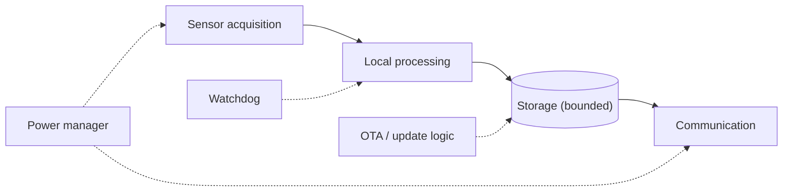
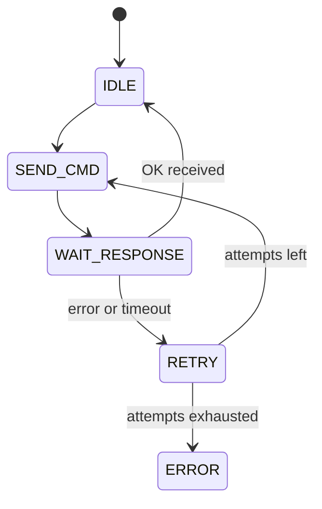
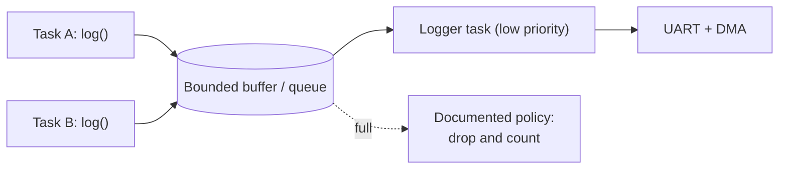

# Advanced Embedded System Design Questions

How to use this file: read the **Short answer**, try to explain it in your own words, then read the details. Each question ends with a **Remember** line.

## 1. Design a battery-powered IoT sensor node

**Short answer:** Start from requirements, then split the device into small subsystems that talk through narrow, bounded interfaces.

**Step 1: ask for requirements.** Measurement rate, radio duty cycle, battery life, latency, environment, updateability, security, failure recovery.

**Step 2: split into subsystems.**

**Why it works:** each block has one job and one interface. A design where every subsystem can call every other subsystem cannot be tested or reasoned about.

**Remember:** explicit state machines and bounded interfaces, not "everything calls everything".

## 2. Design a modem controller

**Short answer:** A command engine (state machine) sits between the application and the modem's UART, and it separates bytes from AT-command meaning.

Key design points:

- **Transport is separate from parsing:** one layer moves bytes, another turns them into tokens like `OK`, `ERROR`, `+CREG:`.
- **Every command has a deadline**, so a silent modem cannot hang the system.
- **Unsolicited messages** (incoming SMS, network change) arrive at any time. Handle them on a side path, not inside the command state machine.

**Remember:** one outstanding command at a time, a deadline on every command, unsolicited events handled separately.

## 3. Design a UART logging system

**Short answer:** Producers write into a bounded buffer; one low-priority task drains it to the UART (ideally with DMA).

**Why:** the slow UART must never block a time-critical task. On overflow, follow a documented policy such as dropping low-priority logs or counting lost records, so you can see that loss happened.

**Remember:** producers never wait on the UART; overflow behaviour is a decision, not an accident.

## 4. Design a firmware update system

**Short answer:** Decide the image format, verification, storage layout, and recovery rules first. Pick the transport last.

Checklist (in order):

1. **Image format:** header with version, size, hash, signature.
2. **Verification:** signature check before the image can ever run.
3. **Version policy:** block downgrades if rollback protection is required.
4. **Storage layout:** two slots (active and inactive) so the running image is never overwritten.
5. **Update state metadata:** written atomically so power loss at any point is safe.
6. **Rollback:** boot the new image on trial, and revert if it does not confirm it is healthy.
7. **Diagnostics:** report why an update failed.

**Remember:** design for power loss at every step, and choose the transport (UART, BLE, Wi-Fi) last.

## 5. How do you choose RTOS task boundaries?

**Short answer:** One task per independent flow of execution that needs its own blocking or scheduling behaviour. Not one task per function.

Ask these questions for each candidate task:

- Does it need to wait on something independently (a queue, a timer, an interrupt)?
- Does it have a different timing or priority requirement from its neighbours?
- Does it justify its own stack RAM?

**Why not too many:** each task costs stack RAM, adds scheduling overhead, and adds synchronization complexity.

**Remember:** tasks model concurrency, not code organisation.

## 6. Queue, ring buffer, mutex, semaphore, event flag, or notification?

**Short answer:** Pick by meaning, not by habit.

| You want to... | Use |
| --- | --- |
| Move data items between contexts | Queue or ring buffer |
| Give one context exclusive access to a resource | Mutex |
| Signal "an event happened" or "a resource is free" | Semaphore |
| Wait for one or more of several conditions | Event flags |
| Wake one specific task cheaply | Task notification |

Always state who owns the data and how long it lives.

**Remember:** mutex means ownership, semaphore means signalling, queue means data.

## 7. How do you design for observability?

**Short answer:** Build in the ability to explain a failure after it happened.

Include:

- Event IDs and error codes (compact numbers, not long strings)
- Counters (errors, retries, overflows)
- Timestamps
- **Reset reason** (power-on, watchdog, brown-out, software)
- Fault context saved before a reset
- Firmware version

**Why:** a system that cannot explain why it failed is expensive to maintain in the field.

**Remember:** log the reset reason and version on every boot.
