# Bootloader Interview Questions and Answers

Study notes with examples, commented code, and update-flow diagrams.

How to use this file: read the **Short answer**, then the details. Q1 to Q45 are the numbered questions. After them come the OTA walkthrough and the SHA-256 and AES notes, which are the most-asked topics.

## Contents

| Section | Topic | Questions |
| --- | --- | --- |
| Basics | What a bootloader is and why it exists | 1-5 |
| STM32 specifics | MSP, VTOR | 6-10 |
| Firmware validation | Checksum, CRC, hash, signature | 11-14 |
| Jumping to the application | The jump sequence | 15-17 |
| Firmware update | Interfaces, flash programming, power loss | 18-22 |
| OTA | Over-the-air updates, A/B, rollback | 23-26 |
| Secure boot | Integrity vs authentication | 27-31 |
| Advanced | Dual bank, chain loading, cleanup, flash protection | 32-40 |
| Real-project | Production design questions | 41-45 |
| Study notes | Jump sequence, 16-step OTA, SHA-256, AES | - |

---

## Basic Questions

### 1. What is a bootloader?

**Short answer:** A small program that runs right after reset, before the main application.

It initializes hardware, verifies firmware integrity, supports firmware updates, and transfers execution to the application.

### 2. Why do we need a bootloader?

**Short answer:** To update, recover, and validate firmware without special tools.

- Firmware updates without a debugger
- Recovery from corrupted firmware
- Secure firmware validation
- OTA updates
- Manufacturing and programming support

### 3. What happens after MCU reset?

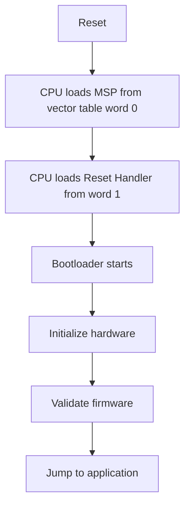

### 4. What is the difference between Boot ROM and a bootloader?

| Boot ROM | Bootloader |
| --- | --- |
| Factory programmed | User programmed |
| Cannot be modified | Can be modified |
| Limited functionality | Custom functionality |
| Permanent | Upgradeable |

Example: the STM32 ROM bootloader supports flashing over UART and USB.

### 5. Where is the bootloader stored?

**Short answer:** Usually in a protected flash region at the start of flash.

```text
0x08000000 - 0x0800FFFF   Bootloader
0x08010000 - end          Application
```

---

## STM32-Specific Questions

### 6. What is MSP?

**Short answer:** MSP is the Main Stack Pointer. The first word of the vector table holds its initial value.

```c
__set_MSP(*(uint32_t *)APP_ADDR);     /* load the application's initial stack pointer from its vector table */
```

### 7. Why must MSP be changed before jumping to the application?

**Short answer:** The application has its own stack location.

Without updating MSP, the application keeps using the bootloader's stack, which can corrupt memory.

### 8. What is VTOR?

**Short answer:** The Vector Table Offset Register. It points to the interrupt vector table.

```c
SCB->VTOR = APP_ADDR;       /* make interrupts use the application's vector table */
```

### 9. Why update VTOR before jumping?

**Short answer:** Otherwise interrupts still use the bootloader's handlers.

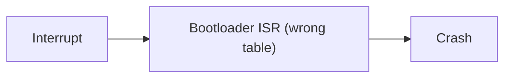

### 10. What happens if VTOR is not updated?

**Short answer:** Interrupts run the wrong handlers.

Common symptoms: HardFault, random resets, unexpected behaviour.

---

## Firmware Validation

### 11. How do you verify firmware before execution?

| Method | Detects | Security |
| --- | --- | --- |
| Checksum | Simple errors | None |
| CRC | Corruption, burst errors | None |
| SHA hash | Any modification | None by itself |
| Digital signature | Modification and untrusted source | Yes |

### 12. What is the difference between a checksum and CRC?

| Checksum | CRC |
| --- | --- |
| Simple addition | Polynomial based |
| Fast | Fast with hardware or tables |
| Weak detection | Strong error detection |
| Two errors can cancel out | Widely used in protocols and storage |

### 13. Why is CRC preferred?

**Short answer:** It detects single-bit errors, burst errors, and communication corruption much better than a plain sum.

### 14. Can CRC provide security?

**Short answer:** No. CRC checks integrity only, and anyone can recompute it.

For security use SHA-256 with an RSA or ECC signature.

---

## Jumping to the Application

### 15. How does a bootloader jump to the application?

```c
typedef void (*app_entry_t)(void);

void jump_to_app(uint32_t app_addr)
{
    uint32_t app_msp   = *(volatile uint32_t *)(app_addr);        /* word 0: application's stack pointer */
    uint32_t app_reset = *(volatile uint32_t *)(app_addr + 4u);   /* word 1: application's reset handler */

    __disable_irq();                    /* no interrupt may fire during the switch */
    SCB->VTOR = app_addr;               /* use the application's vector table */
    __set_MSP(app_msp);                 /* switch to the application's stack */
    ((app_entry_t)app_reset)();         /* branch to the reset handler; never returns */
}
```

### 16. Why is `APP_ADDR + 4` used?

**Short answer:** The vector table layout puts the reset handler in word 1.

| Offset | Content |
| --- | --- |
| 0 | Initial MSP |
| 4 | Reset handler address |

### 17. What checks should be performed before jumping?

- Valid stack pointer
- Valid reset handler
- CRC (or hash and signature) OK
- Application exists (flash is not erased)

```c
bool app_looks_valid(uint32_t app_addr)
{
    uint32_t msp   = *(volatile uint32_t *)app_addr;
    uint32_t reset = *(volatile uint32_t *)(app_addr + 4u);

    /* The stack pointer must point into RAM (0x2000xxxx on many STM32 parts). */
    if ((msp & 0x2FFE0000u) != 0x20000000u) return false;

    /* The reset handler must lie inside flash, and have the Thumb bit set. */
    if (reset < app_addr || reset >= FLASH_END || (reset & 1u) == 0u) return false;

    return true;   /* then verify CRC or signature before jumping */
}
```

---

## Firmware Update Questions

### 18. What interfaces can be used for bootloader updates?

UART, CAN, USB, SPI, Ethernet, BLE, Wi-Fi, LTE.

### 19. Explain the UART bootloader flow

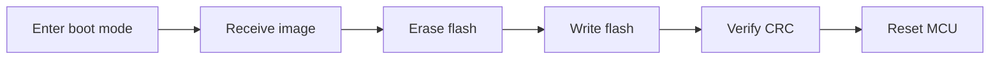

### 20. How is flash programmed?


```c
HAL_FLASH_Unlock();                                       /* 1. unlock the flash controller */
/* 2. erase the sector (HAL_FLASHEx_Erase) */
HAL_FLASH_Program(FLASH_TYPEPROGRAM_WORD, addr, data);    /* 3. program one word */
/* 4. read back and compare */
HAL_FLASH_Lock();                                         /* 5. lock again so stray writes fail */
```

### 21. Why erase flash before programming?

**Short answer:** Programming can only change bits from 1 to 0. Only an erase sets them back to 1.

```text
1 -> 0 is possible by programming
0 -> 1 is impossible without erasing the whole sector
```

### 22. What happens if power fails during an update?

**Short answer:** The firmware may be corrupted, so design for it.

Solutions: dual bank, backup image, rollback.

---

## OTA Questions

### 23. What is OTA?

**Short answer:** Over-The-Air update. Firmware is downloaded remotely over Wi-Fi, LTE, or BLE.

### 24. How do you prevent a device from being bricked during OTA?

- A/B partitions
- Rollback
- Image validation
- Watchdog recovery

### 25. What is A/B partitioning?

**Short answer:** Two application slots. Update the inactive one first.

```text
Flash
+--------------------+
| Bootloader         |
+--------------------+
| App A (current)    |
+--------------------+
| App B (new image)  |
+--------------------+
```

### 26. What is rollback?

**Short answer:** If the new firmware fails, the bootloader restores the old image.

---

## Secure Boot Questions

### 27. What is Secure Boot?

**Short answer:** Only authenticated firmware is allowed to execute.

### 28. What is the difference between integrity and authentication?

| Property | Question it answers |
| --- | --- |
| Integrity | Was the firmware modified? |
| Authentication | Is the firmware source trusted? |

### 29. How is firmware authentication implemented?

SHA-256 hash of the image, signed with an RSA or ECC private key. The device verifies with the public key.

### 30. Why is CRC not enough for Secure Boot?

**Short answer:** An attacker can recalculate the CRC, and CRC does not verify who created the firmware.

### 31. Explain the Secure Boot flow

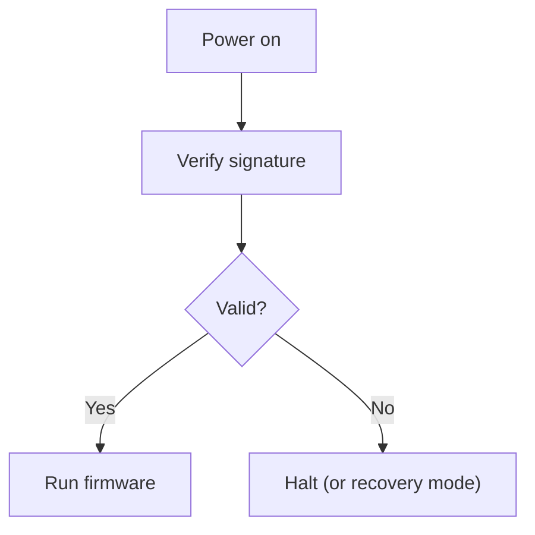

---

## Advanced Questions

### 32. What is a dual-bank bootloader?

**Short answer:** Two flash banks. One runs while the other is updated.

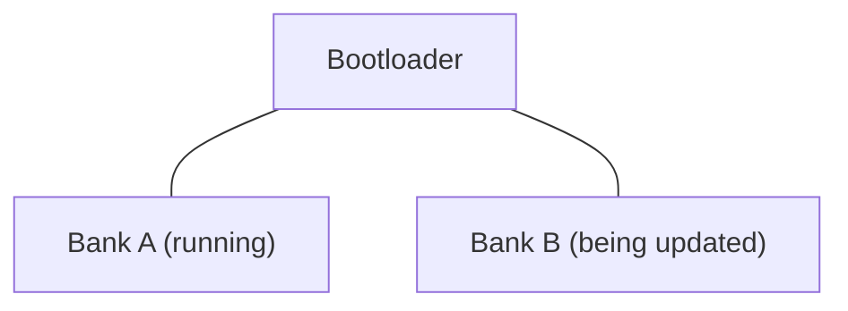

### 33. What are the benefits of a dual-bank update?

- No downtime during the update
- Rollback is possible
- Safer OTA

### 34. What is chain loading?

**Short answer:** One bootloader loads another.

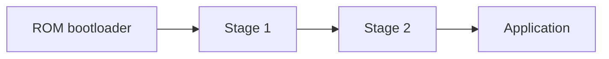

### 35. What is a second-stage bootloader?

**Short answer:** A larger, more capable bootloader loaded by the small ROM bootloader.

Example: the ESP32 ROM bootloader loads a second-stage bootloader, which then loads the application.

### 36. Why disable interrupts before the jump?

```c
__disable_irq();       /* stop any ISR from running during the transition */
```

To avoid an ISR running while the stack and vector table are half-switched.

### 37. What should be cleaned before jumping?

- Interrupts and pending IRQs
- SysTick
- DMA
- Peripherals the bootloader used

### 38. Why stop SysTick?

**Short answer:** The bootloader's SysTick configuration can conflict with the application's (for example a tick interrupt firing into the wrong handler).

### 39. What happens if the watchdog expires during an update?

**Short answer:** The MCU resets. The bootloader should resume the update or roll back.

### 40. How do you protect the bootloader from accidental overwrite?

Use flash protection: write protection, read protection, and option bytes.

---

## Real-Project Questions (6 to 8 Years of Experience)

### 41. How would you design a production OTA bootloader?

Expected answer:

- Secure boot
- AES encryption
- SHA-256 verification
- Dual-bank firmware
- Rollback
- Watchdog recovery
- Version control

### 42. How would you detect corrupted firmware?

CRC, SHA hash, and signature verification.

### 43. How would you recover if firmware is corrupted?

- Stay in the bootloader (recovery mode)
- UART or USB update
- Rollback

### 44. How would you update 1000 deployed devices remotely?

- OTA server
- Version management
- A/B images
- Rollback
- Secure boot
- Staged rollout (small group first, then wider)

### 45. Why do automotive ECUs require robust bootloaders?

Because failed firmware can affect engine control, braking, steering, and safety systems.

Hence they use secure boot, dual-bank update, rollback, and CAN or Ethernet flashing.

---

## Interview Favorite: Explain the Bootloader Jump Sequence

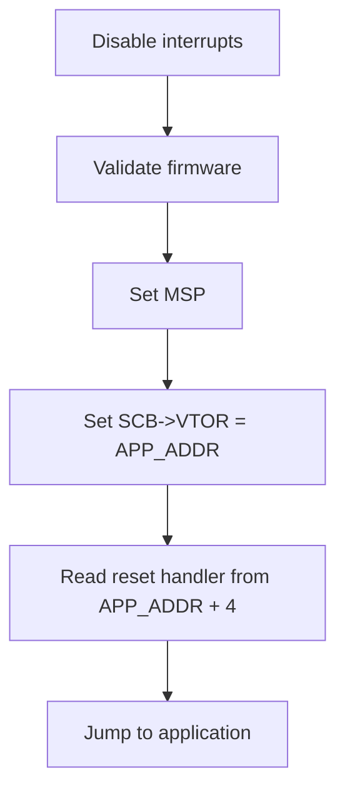

A concise answer:

> "The bootloader validates the firmware, disables interrupts, updates MSP and VTOR to the application's vector table, fetches the application's reset handler address from APP_ADDR + 4, and branches to it. After that, the application runs as if it had booted directly after reset."

---

## Detailed OTA Walkthrough

### What OTA is

OTA allows a device to update its firmware remotely without physical access.

Examples: smart TVs, smart watches, ESP32 devices, IoT sensors, automotive ECUs, cameras.

### High-level OTA flow

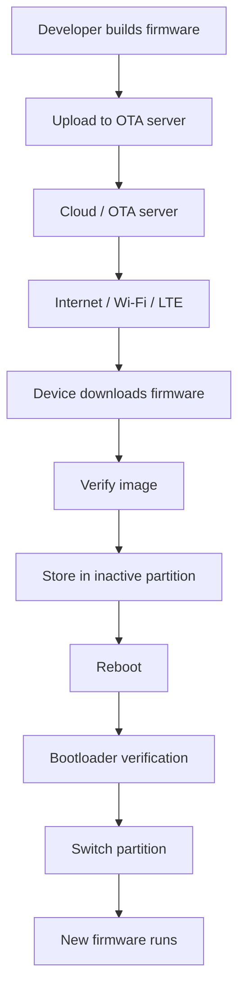

### Flash layout for OTA

**Single image (unsafe):**

```text
Flash
+------------------+
| Bootloader       |
+------------------+
| Application      |
+------------------+

Power failure during update -> device bricked
```

**Dual partition (recommended):**

```text
Flash
+------------------+
| Bootloader       |
+------------------+
| App A (running)  |
+------------------+
| App B (OTA)      |
+------------------+

App A = active, App B = empty. New firmware goes into App B.
```

### Step 1: Firmware creation

The developer builds `app_v1.0.bin` with a toolchain such as `arm-none-eabi-gcc`, producing `firmware.bin`.

### Step 2: Generate metadata

Information created with the image:

- Version
- Size
- CRC
- Hash
- Signature

```c
typedef struct {
    uint32_t magic;          /* identifies a valid image header, e.g. 0x46574D44 */
    uint32_t version;        /* e.g. 2.0 encoded as 0x00020000 */
    uint32_t size;           /* image size in bytes, e.g. 512 KB */
    uint32_t crc32;          /* quick corruption check */
    uint8_t  sha256[32];     /* hash of the image */
    uint8_t  signature[64];  /* ECDSA signature over the hash */
} image_header_t;
```

### Step 3: Upload firmware to the OTA server

Stored on AWS, Azure, GCP, or a private server, for example `https://server.com/fw/v2.bin`.

### Step 4: Device checks for an update

```c
void ota_task(void *arg)
{
    for (;;) {
        check_server();                               /* HTTP GET to the update server */
        vTaskDelay(pdMS_TO_TICKS(CHECK_INTERVAL_MS));
    }
}
```

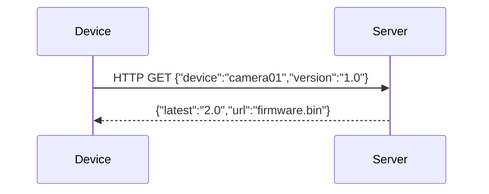

### Step 5: Version comparison

```c
if (server_version > current_version) {     /* compare as numbers, not text: "1.10" > "1.9" */
    start_update();
}
```

### Step 6: Download the firmware

Protocols: HTTP, HTTPS, MQTT, FTP. Mostly **HTTPS**, for security.

Download in chunks (for example 1024 bytes each), because firmware may be 500 KB, 1 MB, or 10 MB and cannot be held entirely in RAM.

### Step 7: Store the image in the inactive partition

```text
Current:  App A running at 0x08010000
New:      write to App B at 0x08100000
```

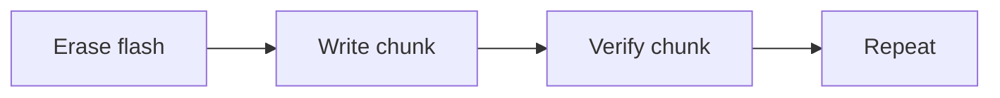

### Step 8: Verify the downloaded firmware

**CRC check:**

```c
uint32_t crc = CalculateCRC();
if (crc == received_crc) { /* image intact */ }
```

**SHA-256 check:** the generated hash must match the stored hash.

**Digital signature check:** verify with RSA or ECC to ensure the firmware is from a trusted source.

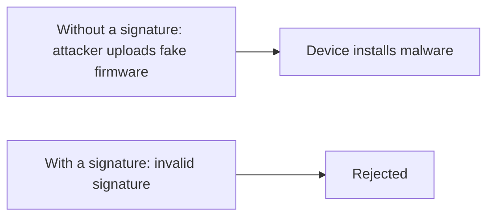

### Step 9: Mark the update as pending

```c
ota_flag = OTA_PENDING;      /* stored in flash, EEPROM, or NVS so it survives reset */
```

### Step 10: Reboot the device

```c
NVIC_SystemReset();
```

### Step 11: Bootloader starts

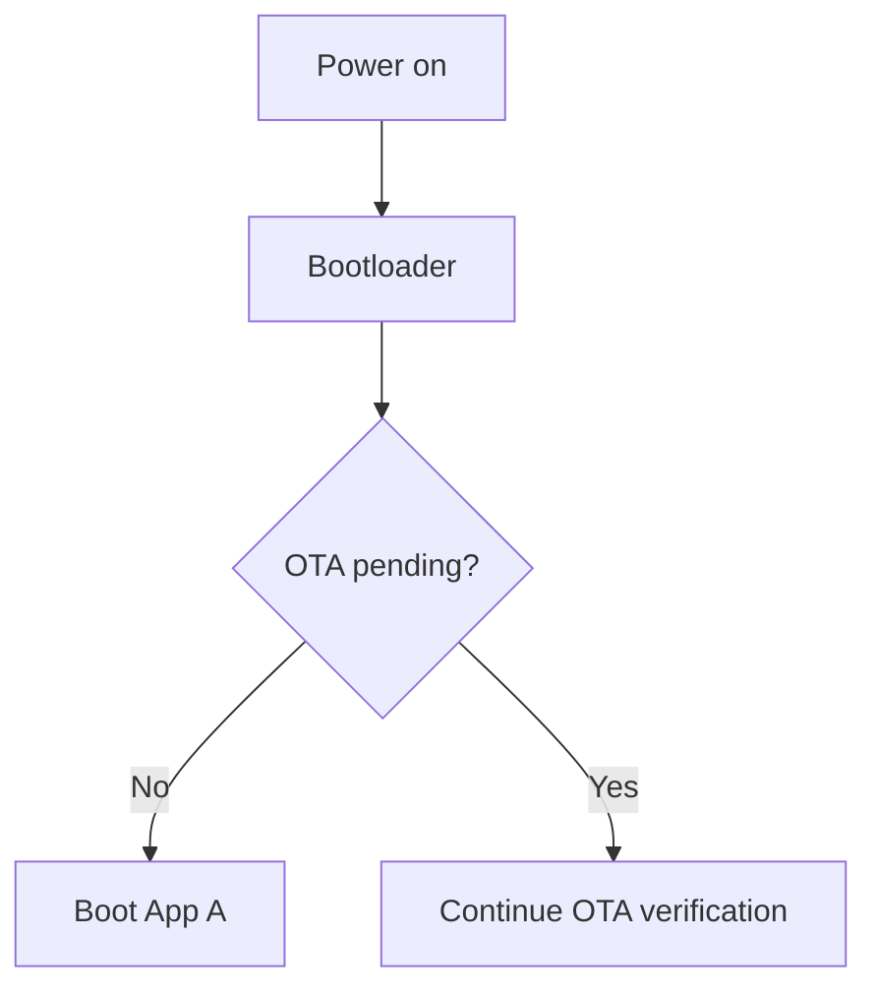

### Step 12: Validate the new firmware again

The bootloader checks CRC, SHA-256, signature, header, and version.

```c
if (image_valid()) {
    activate_image();
}
```

### Step 13: Switch the active partition

```text
Before: Active = App A
After:  Active = App B
```

Stored in a flash config area, EEPROM, or a metadata sector.

### Step 14: Jump to the new firmware

Set MSP, set VTOR, jump to the reset handler. The new firmware starts.

### Step 15: Self-test

The new firmware runs diagnostics: RAM test, sensor test, network test, filesystem test.

```c
if (all_tests_pass()) {
    OTA_SUCCESS = TRUE;
}
```

### Step 16: Confirm the firmware

The new firmware tells the bootloader it is healthy by storing `BOOT_OK = TRUE`.

### Rollback mechanism

If the new firmware crashes before confirmation, the bootloader sees `BOOT_OK = FALSE` and rolls back.

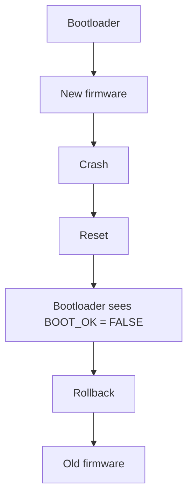

### A/B OTA update example

```text
Before:  App A <- running    App B <- empty
Download: write the new firmware to App B
After verification:  App B <- active
```

### Security in OTA

| Mechanism | Protects against |
| --- | --- |
| HTTPS | Man-in-the-middle attack |
| SHA-256 | Corruption |
| RSA or ECC signature | Unauthorized firmware |
| AES encryption | Loss of firmware confidentiality |

### Failure scenarios

| Case | Result |
| --- | --- |
| Wi-Fi lost during download | Resume the download |
| Power failure during download | App A is still active; the device is safe |
| Corrupted firmware (CRC fail) | Reject the update |
| New firmware crashes | Rollback |

### OTA state machine

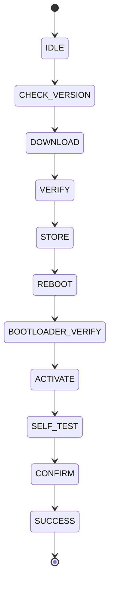

### Production OTA design summary

Expected answer:

- Bootloader with A/B partitions
- HTTPS download
- SHA-256 verification
- RSA or ECC signature check
- AES encryption
- Watchdog recovery
- Rollback support
- Version control
- Power-failure recovery

### The 6 to 8 years experience answer

> "In OTA, the device periodically checks a server for a newer firmware version. If available, it downloads the image in chunks and stores it in an inactive partition. After download, the image is verified using CRC, SHA-256, and digital signature checks. An OTA pending flag is set and the device reboots. The bootloader validates the new image again, switches the active partition, and boots the new firmware. The application performs self-tests and confirms successful boot. If confirmation is not received due to crashes or resets, the bootloader rolls back to the previous firmware, ensuring the device never becomes unusable."

---

## SHA-256 and AES Study Notes

### SHA-256 versus AES: the key difference

They solve different security problems.

| Feature | SHA-256 | AES |
| --- | --- | --- |
| Type | Cryptographic hash | Symmetric encryption |
| Main purpose | Integrity, fingerprint | Confidentiality |
| Reversible? | No | Yes, with the key |
| Key required? | No | Yes |
| Output | 256 bits (32 bytes) | Same size as the input (block cipher) |
| Typical use | Firmware verification, signatures | Encrypt firmware or data |
| Example | `SHA256(firmware)` | `AES(key, firmware)` |

**Analogy:** suppose your firmware is a document.

- SHA-256: "Give me a unique fingerprint of this document."
- AES: "Lock this document so only someone with the key can read it."

So SHA-256 answers "has the data changed?" and AES answers "can someone read the data?".

### SHA-256 in detail

SHA-256 is the Secure Hash Algorithm with a 256-bit output, from the SHA-2 family. It takes an input of practically any length and produces exactly 256 bits, which is 32 bytes or 64 hexadecimal characters.

Changing the input even slightly (for example `Hello` versus `hello`) changes the hash dramatically.

### SHA-256 properties

- **Fixed-size output:** 10 bytes or 10 MB in, 256 bits out.
- **One-way:** you cannot practically recover the data from `SHA256(data)`.
- **Avalanche effect:** one changed bit gives a completely different hash.

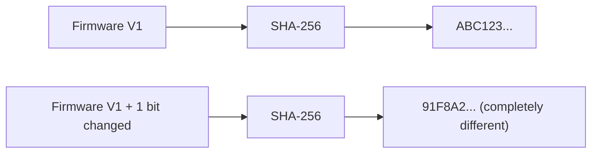

### How SHA-256 works internally

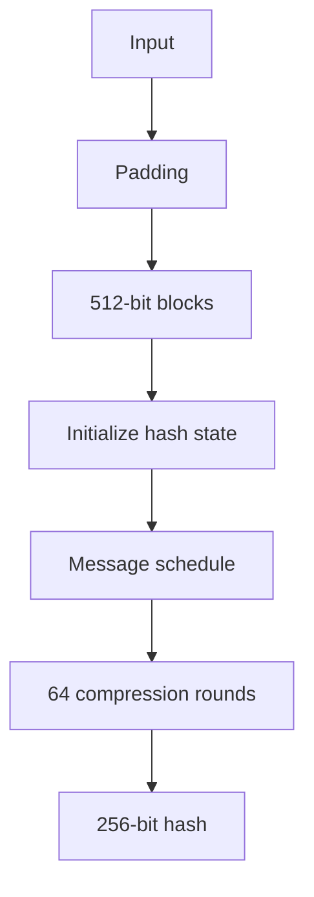

SHA-256 operates on 512-bit blocks. Its internal state is eight 32-bit words, H0 to H7 (8 x 32 = 256 bits).

**Padding:** append a 1 bit, then 0 bits, then the original message length, so the total is a multiple of 512 bits.

**Compression:** each block goes through 64 rounds using XOR, AND, NOT, right rotation, right shift, and addition modulo 2^32. Two key functions:

```text
Ch(x,y,z)  = (x AND y) XOR (NOT x AND z)
Maj(x,y,z) = (x AND y) XOR (x AND z) XOR (y AND z)
```

There are also the Sigma functions built from rotations and shifts. You do not need to memorize all 64 rounds unless you implement cryptography yourself.

### SHA-256 in OTA

The server computes `SHA256(firmware.bin)` and stores the expected hash. The device downloads the image, computes `SHA256(downloaded_firmware)`, and compares.

- Expected equals calculated: the image is unaltered with respect to that hash
- Not equal: reject the image

### Interview trap: is SHA-256 enough for secure OTA?

**No.** An attacker can replace the firmware **and** the expected hash. Then `SHA256(malicious firmware)` equals the attacker's hash, and the comparison passes.

A plain hash does not authenticate who created the firmware. Use a digital signature:

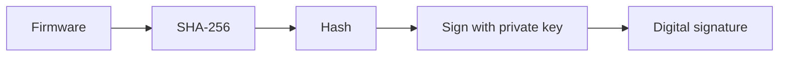

The device verifies the signature using the manufacturer's **public key**.

### SHA-256 versus encryption

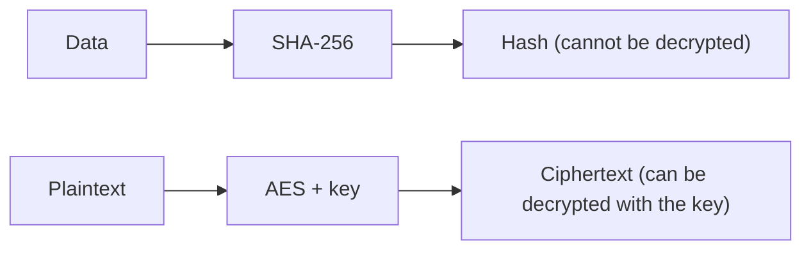

Hashing is not encryption.

### AES in detail

AES is the Advanced Encryption Standard, a **symmetric-key block cipher**. The same secret key encrypts and decrypts.


### AES key sizes and block size

| Variant | Key size | Rounds |
| --- | --- | --- |
| AES-128 | 128 bits | 10 |
| AES-192 | 192 bits | 12 |
| AES-256 | 256 bits | 14 |

**Block size is always 128 bits (16 bytes), regardless of key size.** AES-256 means a 256-bit key, not a 256-bit block.

### AES encryption structure

```mermaid
flowchart TD
    A["Plaintext"] --> B["Initial AddRoundKey"] --> C["Round 1"] --> D["Round 2"] --> E["..."] --> F["Final round"] --> G["Ciphertext"]
```

### AES main operations

Each round uses four operations:

1. **SubBytes:** each byte is substituted using the S-box.
2. **ShiftRows:** rows are cyclically shifted (row 0 by 0, row 1 by 1, row 2 by 2, row 3 by 3).

   ```text
   Before:        After:
   A B C D        A B C D
   E F G H        F G H E
   I J K L        K L I J
   M N O P        P M N O
   ```

3. **MixColumns:** bytes within each column are mixed for diffusion. The final round omits this step.
4. **AddRoundKey:** the state is XORed with a round key. This is where the key directly influences the state.

### AES modes of operation

AES works on a 16-byte block. To encrypt more data securely you need a **mode**: ECB, CBC, CTR, GCM, CCM.

**ECB (avoid):** each block is encrypted independently, so identical plaintext blocks give identical ciphertext blocks and reveal patterns. Not recommended for structured data.

**CBC (Cipher Block Chaining):** each plaintext block is XORed with the previous ciphertext block before encryption. It needs an **IV** (initialization vector). The IV need not be secret, but must be unpredictable or unique as the scheme requires. CBC gives confidentiality only, not authentication.

**CTR (Counter mode):** AES encrypts a counter to make a keystream, which is XORed with the plaintext. It behaves like a stream cipher. The counter or nonce must **never repeat** with the same key.

**AES-GCM:** provides confidentiality, integrity, and authentication together. It is an AEAD mode (Authenticated Encryption with Associated Data).

```mermaid
flowchart LR
    P["Plaintext"] --> G["AES-GCM + key + nonce"]
    G --> C["Ciphertext"]
    G --> T["Authentication tag"]
```

On decryption, the tag is verified first. If valid, the plaintext is returned. If invalid, reject.

### Why AES-GCM is useful for OTA

The firmware is encrypted and produces an authentication tag. The device decrypts only after successful authentication. That protects confidentiality and detects modification of the encrypted data.

For firmware **authenticity** (who made it), production secure-boot designs commonly also use a digital signature.

### AES and SHA-256 together in OTA

```mermaid
flowchart TD
    subgraph Server
        A["Firmware image"] --> B["SHA-256 hash"] --> C["Digital signature"] --> D["Encrypt"]
    end
    D --> E["Internet"] --> F["Device downloads"]
    F --> G["AES decryption"] --> H["SHA-256 / signature verification"] --> I["Bootloader"] --> J["Application"]
```

The exact order depends on the product's security architecture.

### AES versus SHA-256 in OTA

| Requirement | SHA-256 | AES |
| --- | --- | --- |
| Detect modification | Yes, as a hash primitive | Not by encryption alone |
| Encrypt firmware | No | Yes |
| Decrypt firmware | No | Yes |
| Hide firmware contents | No | Yes |
| Requires a secret key | No | Yes |
| Used for digital signatures | The hash is part of the signature process | No |
| Confidentiality | No | Yes |

### Important: hashing is not authentication

"If I calculate SHA-256 on firmware, is the firmware secure?" **Not by itself.** A publicly known or attacker-replaceable hash does not authenticate the firmware source. For secure boot and OTA, use a digital signature or another properly designed authenticated mechanism.

### Important: AES does not provide integrity by itself

"If firmware is encrypted using AES, is it automatically secure?" **No.** Encryption provides confidentiality. You also need integrity and authentication, such as AES-GCM or CCM, or a separate signature.

### Where are keys stored in an embedded system?

Possible locations:

- Secure element
- OTP memory
- eFuse
- Protected flash
- TPM
- Hardware security module
- MCU key storage

Secret keys should not be ordinary plaintext constants in application flash. Avoid this in production:

```c
#define AES_KEY "1234567890123456"     /* bad: readable by anyone who dumps the flash */
```

### Hardware crypto acceleration

Many MCUs have a crypto accelerator. Instead of software AES on the CPU, the CPU hands the work to crypto hardware for AES and SHA.

Benefits: lower CPU usage, better performance, lower energy, and sometimes stronger key isolation. The exact capabilities depend on the MCU.

### Embedded example

The device receives `firmware_v2.bin`. The OTA metadata says: Version 2, Size 512 KB, SHA-256 `ABCD...`, Signature `XYZ...`.

1. Download the encrypted firmware
2. Decrypt and authenticate it with the configured AES scheme
3. Check the firmware hash and signature
4. Store it in the inactive flash partition
5. The bootloader verifies the image again
6. The bootloader starts the firmware
7. The firmware performs a self-test
8. The firmware marks the update successful

If anything fails: rollback to the previous firmware.

---

## Quick Interview Review

### Q1. What is SHA-256?

A cryptographic hash function from the SHA-2 family that maps input of any length to a fixed 256-bit digest. Used for integrity checking and as part of digital signatures.

### Q2. Is SHA-256 encryption?

No. It is hashing and is not reversible.

### Q3. What is AES?

A symmetric block cipher with a 128-bit block size and 128-, 192-, or 256-bit keys.

### Q4. What does AES-256 mean?

A 256-bit key, not a 256-bit block.

### Q5. How many rounds does AES-256 have?

14 rounds.

### Q6. What is an IV or nonce?

Extra per-operation input used by many encryption modes. Its required properties depend on the mode. For GCM, reusing a nonce with the same key is especially dangerous and must be prevented.

### Q7. Why use AES-GCM?

It provides authenticated encryption: confidentiality plus integrity and authentication.

### Q8. Can SHA-256 protect against a malicious firmware replacement?

A bare hash comparison cannot authenticate the firmware source. Use a digital signature or another authenticated mechanism.

### Q9. Can AES alone guarantee firmware authenticity?

No. Encryption alone does not establish who created the firmware.

### Q10. SHA-256 plus AES: why use both?

A typical design uses:

| Tool | Job |
| --- | --- |
| AES | Confidentiality |
| SHA-256 | Cryptographic digest |
| Signature | Firmware authenticity |

Or it uses an authenticated encryption mode such as AES-GCM for confidentiality and data authentication, while still using a digital signature for publisher authenticity.

---

## The 30-Second Interview Answer

> "A bootloader is a small program that runs first after reset. It checks that the application image is valid, using a CRC for corruption and a signature for authenticity. It also handles firmware updates: for OTA I keep two slots, download into the inactive one, verify it, mark it pending, and reboot. The bootloader then re-verifies it, sets MSP and the vector table offset to the new image, and jumps to its reset handler. The new firmware must confirm it is healthy, and if it crashes first, the bootloader rolls back to the old image. That way a power loss or a bad update never bricks the device."
