# Bootloader: Study Guide and Interview Questions

Everything about bootloaders in one file, for embedded interview preparation.

- **Part 1: Study Guide.** 13 modules that teach the topic step by step, with diagrams, code, and self-check questions. Read these in order.
- **Part 2: Question Bank.** Short-answer questions, the 16-step OTA walkthrough, and SHA-256 / AES notes. Use these to drill once you've done Part 1.

| Part | Jump to |
| --- | --- |
| Part 1 | [Study Guide: course map](#course-map) |
| Part 2 | [Question Bank](#part-2-question-bank) |

---

# Part 1: Study Guide

A step-by-step course on bootloaders for embedded interviews. Each module teaches one idea, builds on the one before it, and ends with questions to check yourself.

---

## The big picture in one diagram

Everything in this course is some part of this picture:

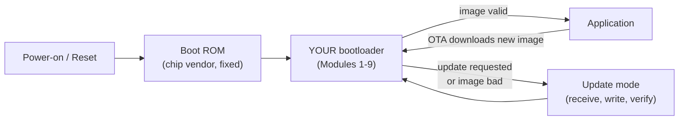

---

## Course map

Study in order. Each module assumes the ones before it.

| # | Module | You will be able to... | Time |
| --- | --- | --- | --- |
| 1 | [What is a bootloader?](#module-1-what-is-a-bootloader) | Explain what a bootloader does, and why products need one | 20 min |
| 2 | [Reset and startup on Cortex-M](#module-2-reset-and-startup-on-cortex-m) | Walk through what the CPU does from reset to `main()` | 40 min |
| 3 | [Memory map and linker scripts](#module-3-memory-map-and-linker-scripts) | Split flash between bootloader and app, and write both linker scripts | 40 min |
| 4 | [Jumping to the application](#module-4-jumping-to-the-application) | Write a correct jump function and explain every line | 45 min |
| 5 | [Flash programming](#module-5-flash-programming) | Erase and write flash safely; explain sectors, alignment, ECC | 40 min |
| 6 | [Entering the bootloader and the update protocol](#module-6-entering-the-bootloader-and-the-update-protocol) | Design a UART packet protocol with ACK/NACK and CRC | 50 min |
| 7 | [Image validation](#module-7-image-validation) | Choose between checksum, CRC, hash, and signature, and implement CRC-32 | 40 min |
| 8 | [Fail-safe updates: A/B, swap, rollback](#module-8-fail-safe-updates-ab-swap-and-rollback) | Design an update that survives power loss and bad firmware | 60 min |
| 9 | [Secure boot](#module-9-secure-boot) | Explain root of trust, chain of trust, signing, encryption, anti-rollback | 60 min |
| 10 | [Real-world bootloaders: STM32, ESP32, MCUboot](#module-10-real-world-bootloaders-stm32-esp32-mcuboot) | Describe how the bootloaders you'll meet at work actually behave | 45 min |
| 11 | [Linux boot flow and U-Boot](#module-11-linux-boot-flow-and-u-boot) | Walk from Boot ROM to Linux shell: SPL, U-Boot, kernel, rootfs | 50 min |
| 12 | [Debugging bootloaders](#module-12-debugging-bootloaders) | Diagnose "it crashes right after the jump" and similar bugs | 35 min |
| 13 | [Interview drill and cheat sheet](#module-13-interview-drill-and-cheat-sheet) | Answer the common questions and the system-design question | 60 min |

**Total:** about 10 hours of focused study. Spread it over a week.

---

## How each module is built

Every module follows the same pattern, so you always know where to look:

1. **The idea in one sentence**: the thing to remember if you remember nothing else.
2. **Why it matters**: the problem this idea solves.
3. **Step-by-step teaching**: diagrams, examples, and code.
4. **Common mistakes**: what goes wrong in real projects.
5. **Interview angle**: how interviewers ask about it and what a strong answer contains.
6. **Check yourself**: questions to answer out loud before moving on. Answers are hidden in collapsible blocks.

---

## A suggested study plan

| Day | Modules | Goal |
| --- | --- | --- |
| 1 | 1, 2 | Understand reset and startup well enough to draw it from memory |
| 2 | 3, 4 | Be able to write the jump code on a whiteboard |
| 3 | 5, 6 | Be able to design an update protocol |
| 4 | 7, 8 | Be able to design a fail-safe OTA |
| 5 | 9 | Be able to explain secure boot end to end |
| 6 | 10, 11 | Connect the theory to STM32, ESP32, MCUboot, and U-Boot |
| 7 | 12, 13 | Practise out loud: debugging stories and the design question |

> **Tip:** Teaching is the fastest way to learn. After each module, close the file and explain the idea out loud as if to a junior engineer. If you get stuck, that's the part to re-read.

---

## Terms used throughout

| Term | Meaning |
| --- | --- |
| **Image** | A firmware binary, usually with a header or trailer added |
| **Slot / partition** | A region of flash that holds one image |
| **Vector table** | Table at the start of an image: initial stack pointer, then handler addresses |
| **MSP** | Main Stack Pointer (Cortex-M) |
| **VTOR** | Vector Table Offset Register: tells the CPU where the vector table is |
| **OTA** | Over-the-air update |
| **RoT** | Root of Trust: the first code and key the system trusts without checking |
| **DFU** | Device Firmware Update (also a USB class) |

---

## Sources used to build this guide

- ST [AN2606: STM32 microcontroller system memory boot mode](https://www.st.com/resource/en/application_note/an2606-stm32-microcontroller-system-memory-boot-mode-stmicroelectronics.pdf)
- ST [AN3155: USART protocol used in the STM32 bootloader](https://www.st.com/resource/en/application_note/an3155-usart-protocol-used-in-the-stm32-bootloader-stmicroelectronics.pdf)
- [MCUboot design documentation](https://docs.mcuboot.com/design.html)
- Espressif [ESP-IDF OTA documentation](https://docs.espressif.com/projects/esp-idf/en/stable/esp32/api-reference/system/ota.html)
- Espressif [ESP-IDF application startup flow](https://docs.espressif.com/projects/esp-idf/en/stable/esp32/api-guides/startup.html)
- Arm [Cortex-M4 Devices Generic User Guide](https://developer.arm.com/documentation/dui0553/latest/) (reset behaviour, VTOR, MSP)
- [U-Boot documentation](https://docs.u-boot.org/en/latest/)

---

## Module 1: What Is a Bootloader?

---

### The idea in one sentence

> A bootloader is a **small program that runs first after reset**. It decides **whether the main firmware is safe to run**, can **replace that firmware with a new version**, and then **hands control over** to it.

---

### Step 1: Start with a story

Imagine you've shipped 10,000 smart thermostats. A month later you find a bug.

- **Without a bootloader:** each thermostat has to come back, someone opens the case, connects a debugger (ST-Link, J-Link), and reflashes it. That costs a lot of money and time.
- **With a bootloader:** each thermostat downloads the fix, writes it into flash, checks it, and reboots into the new version. Nobody touches the hardware.

That is the reason bootloaders exist: **to change firmware in the field, safely.**

---

### Step 2: The analogy

Think of a building's **security guard at the front door**:

| Security guard | Bootloader |
| --- | --- |
| Arrives first, before anyone else | Runs first after reset |
| Checks each visitor's ID | Checks the firmware's CRC or signature |
| Lets valid visitors in | Jumps to valid firmware |
| Turns away invalid visitors | Refuses to run corrupted or unsigned firmware |
| Lets the new tenant move in, then checks their papers | Receives new firmware, writes it, verifies it |
| Is small and stays in the lobby | Is small and lives in a protected flash region |

---

### Step 3: The five jobs of a bootloader

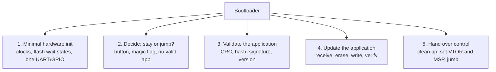

| Job | What it means in practice |
| --- | --- |
| **Minimal init** | Only what the bootloader itself needs. The application will set up the rest. |
| **Decide** | "Should I stay in update mode or start the app?" |
| **Validate** | "Is the app complete, uncorrupted, and (if secure) signed by us?" |
| **Update** | "Get the new image in, write it to flash, and verify it." |
| **Hand over** | "Leave the CPU in a clean state and start the app." |

---

### Step 4: Where it sits in memory

On a typical microcontroller (here, an STM32 with 512 KB flash):

```text
 Flash address                       Contents
 ┌──────────────────────────────┐ 0x0808_0000  (end of flash)
 │                              │
 │        APPLICATION           │  ← the product's real firmware
 │   (vector table at its start)│
 │                              │
 ├──────────────────────────────┤ 0x0801_0000
 │   Shared config / metadata   │  (optional: version, flags, CRC)
 ├──────────────────────────────┤ 0x0800_C000
 │        BOOTLOADER            │  ← runs first, write-protected
 │   (vector table at 0x0800_0000)
 └──────────────────────────────┘ 0x0800_0000  (start of flash = reset target)
```

Why at the **start** of flash? Because on reset, a Cortex-M CPU reads its vector table from the start of the boot memory (address 0 is aliased to 0x0800_0000 on STM32 when booting from flash). Whatever lives there runs first. We want that to be the bootloader.

---

### Step 5: Boot ROM vs your bootloader

People mix these up. There are often **two** bootloaders on a chip:

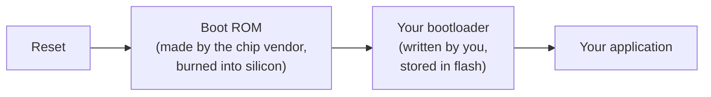

| | Boot ROM (1st stage) | Your bootloader (2nd stage) |
| --- | --- | --- |
| Written by | Chip vendor (ST, Espressif, NXP) | You / your company |
| Stored in | Mask ROM or OTP, inside the chip | Flash |
| Can be changed? | No, never | Yes (carefully) |
| Features | Fixed: UART/USB/CAN flashing, sometimes secure boot | Whatever you design: OTA, encryption, A/B, logging |
| Example | STM32 "System Memory" bootloader, ESP32 ROM loader | MCUboot, a custom UART bootloader, U-Boot |

> **Key point:** On STM32 the ROM bootloader is selected by the **BOOT0 pin** (and option bytes). On ESP32 the ROM **always** runs first, then loads the second-stage bootloader from flash at a fixed offset.

---

### Step 6: What a bootloader is *not*

- **Not the application.** It should do as little as possible. Every extra feature is extra code that can't easily be fixed later.
- **Not usually updatable.** Many products never update the bootloader, because a failed bootloader update bricks the device. If it must be updatable, use a small immutable first stage plus an updatable second stage (Module 9).
- **Not the startup code.** `Reset_Handler` and `SystemInit()` are startup code, and *both* the bootloader and the app have their own copy (Module 2).

---

### Step 7: Types of bootloader you'll hear about

| Type | Example | Typical use |
| --- | --- | --- |
| ROM / system bootloader | STM32 system memory, NXP ISP | Factory programming, recovery |
| Custom MCU bootloader | Your own UART/CAN/USB bootloader | Field updates on small MCUs |
| Open-source MCU bootloader | MCUboot, Zephyr + MCUboot, TF-M BL2 | Secure OTA on Cortex-M |
| Vendor SDK bootloader | ESP-IDF second-stage bootloader | ESP32 OTA with partitions |
| Automotive bootloader | UDS-over-CAN (ISO 14229) flash bootloader | ECU reflashing at dealer or over the air |
| Linux bootloader | U-Boot, barebox, GRUB | Loads kernel + device tree + rootfs |

---

### Common mistakes

1. **Putting too much in the bootloader** (a full TCP/IP stack, a file system, an RTOS). It grows, gains bugs, and can't be fixed in the field.
2. **Forgetting that the bootloader and app are two separate programs.** They have different linker scripts, different vector tables, and different startup code.
3. **No recovery path.** If the app is corrupted and the bootloader can't receive a new one, the device is bricked.

---

### Interview angle

**Q: "What is a bootloader and why do we need one?"**

A strong answer has three parts:

1. **Definition:** "A small program that runs first after reset, validates the application, can update it, and then jumps to it."
2. **Why:** "It lets us update firmware in the field without a debugger, recover from corrupted firmware, and (with secure boot) guarantee that only our signed code runs."
3. **Constraint:** "It must be small, reliable, and usually write-protected, because if the bootloader breaks, the device is bricked."

---

### Check yourself

1. Name the five jobs of a bootloader.
2. Why is the bootloader placed at the start of flash?
3. What's the difference between the STM32 system memory bootloader and a custom one?
4. Why should a bootloader be as small as possible?

<details>
<summary>Answers</summary>

1. Minimal init, decide (stay or jump), validate, update, hand over control.
2. Because the CPU fetches the vector table (initial SP and reset handler) from the start of the boot memory on reset, so whatever is there runs first.
3. The system memory bootloader is in ROM, written by ST, fixed, and selected by BOOT0/option bytes. A custom one lives in flash, is written by you, and can do whatever you design (OTA, signatures, A/B).
4. Less code means fewer bugs, and the bootloader is usually not updatable. A bug in it can live in the field forever or brick the device.

</details>

---

---

## Module 2: Reset and Startup on Cortex-M

---

### The idea in one sentence

> On reset, a Cortex-M CPU **reads two words** from the vector table: word 0 becomes the **stack pointer**, word 1 is the **address of `Reset_Handler`**. Then startup code copies `.data`, zeroes `.bss`, and calls `main()`.

You can't write a bootloader jump (Module 4) until you understand this, because **the jump is you doing by hand what the hardware does at reset.**

---

### Step 1: What is a vector table?

A vector table is an **array of 32-bit addresses** at the very start of the image.

```text
Offset   Contents                         Meaning
0x000    0x2002_0000                      Initial MSP (top of RAM)
0x004    0x0800_01C1  (Reset_Handler|1)   Where to start running
0x008    0x0800_01C9                      NMI_Handler
0x00C    0x0800_01CB                      HardFault_Handler
0x010    ...                              MemManage, BusFault, UsageFault
 ...
0x03C    0x0800_0215                      SysTick_Handler
0x040    ...                              IRQ0 (e.g. WWDG), IRQ1, ...
```

Two things to notice:

1. **Word 0 is not code.** It's a *data value*: the address the stack starts at.
2. **Handler addresses are odd** (bit 0 = 1). That's the **Thumb bit**. Cortex-M only runs Thumb code, and a branch to an even address causes a fault.

In C, the startup file defines it like this (simplified from ST's `startup_stm32f4xx.s`):

```c
extern uint32_t _estack;               /* defined by the linker script */
void Reset_Handler(void);
void NMI_Handler(void);
void HardFault_Handler(void);

__attribute__((section(".isr_vector")))
const void *vector_table[] = {
    &_estack,            /* 0x00: initial MSP        */
    Reset_Handler,       /* 0x04: reset              */
    NMI_Handler,         /* 0x08                     */
    HardFault_Handler,   /* 0x0C                     */
    /* ... more handlers ... */
};
```

---

### Step 2: What the hardware does at reset

The CPU does this **before any of your code runs**. There's no software involved yet:

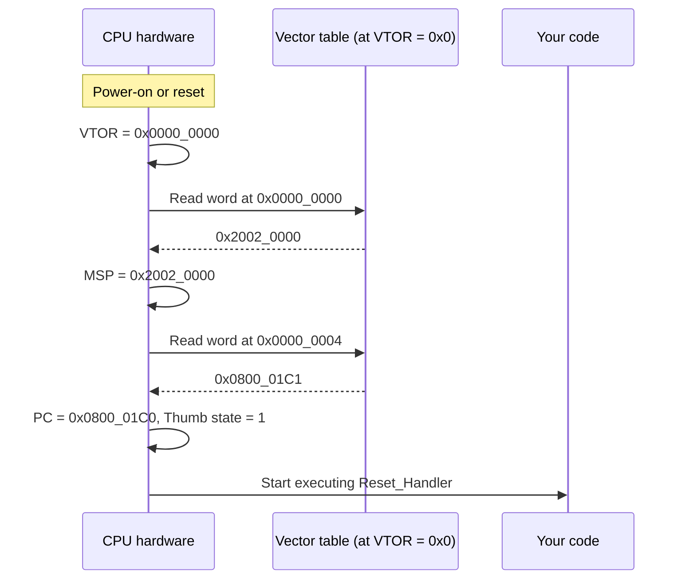

Also at reset: privileged Thread mode, MSP in use, interrupts enabled at the core (PRIMASK = 0) but every peripheral interrupt disabled in the NVIC.

#### Wait, the vector table is at 0x0, but flash is at 0x0800_0000?

On STM32, address `0x0000_0000` is an **alias**. The BOOT pins decide what gets mapped there:

| BOOT0 | BOOT1 / option | Mapped at 0x0000_0000 | Result |
| --- | --- | --- | --- |
| 0 | x | Main flash (0x0800_0000) | Your bootloader runs |
| 1 | 0 | System memory (ROM) | ST's ROM bootloader runs |
| 1 | 1 | SRAM (0x2000_0000) | Code in RAM runs (debug) |

> The exact pins and option bits vary by family (e.g. newer STM32s use `nBOOT0` option bits). Check AN2606 for your part.

---

### Step 3: What startup code does (`Reset_Handler`)

The hardware has given you a stack and a program counter. That's all. Global variables haven't been initialised yet. `Reset_Handler` fixes that:

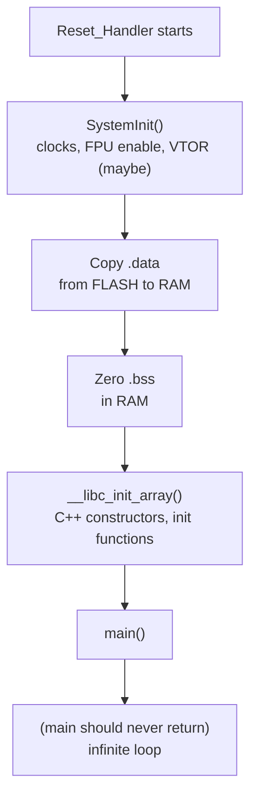

Here it is in C so you can see every step:

```c
/* Symbols created by the linker script (Module 3) */
extern uint32_t _sidata;  /* start of .data initial values, in FLASH */
extern uint32_t _sdata;   /* start of .data in RAM                   */
extern uint32_t _edata;   /* end of .data in RAM                     */
extern uint32_t _sbss;    /* start of .bss in RAM                    */
extern uint32_t _ebss;    /* end of .bss in RAM                      */

void Reset_Handler(void)
{
    SystemInit();                       /* clocks, FPU, VTOR */

    /* 1. Copy initialised globals from flash into RAM */
    uint32_t *src = &_sidata;
    uint32_t *dst = &_sdata;
    while (dst < &_edata) {
        *dst++ = *src++;
    }

    /* 2. Zero uninitialised globals */
    dst = &_sbss;
    while (dst < &_ebss) {
        *dst++ = 0;
    }

    __libc_init_array();                /* C++ static constructors */
    main();

    while (1) { }                       /* main must not return */
}
```

#### Why copy `.data`?

Take `int counter = 5;` as a global.

- The **value 5** must survive power-off, so it's stored in **flash**.
- The **variable** must be writable, so it lives in **RAM**.
- At startup, someone has to copy 5 from flash into RAM. That's the `.data` copy loop.

```text
FLASH                               RAM
┌─────────────┐                     ┌─────────────┐
│ .text (code)│                     │ .data       │ ← counter = 5 (copied)
├─────────────┤    copy at boot     ├─────────────┤
│ .data init  │ ─────────────────▶  │ .bss        │ ← zeroed at boot
│ values (5)  │                     ├─────────────┤
└─────────────┘                     │ heap  ↓     │
                                    │             │
                                    │ stack ↑     │ ← MSP starts at the top
                                    └─────────────┘
```

---

### Step 4: Why this matters for bootloaders

Here's the key insight. Your system has **two** complete programs, and **each has its own vector table and its own `Reset_Handler`**:

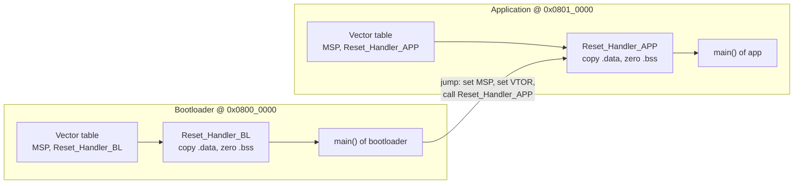

At reset, the **hardware** loads MSP and PC from the bootloader's table. When the bootloader jumps, **it must do the same thing by hand** for the app:

| At reset (hardware does it) | At the jump (bootloader must do it) |
| --- | --- |
| VTOR = 0 (→ bootloader's table) | Set VTOR = app's vector table address |
| MSP = word 0 of the table | MSP = word 0 of the **app's** table |
| PC = word 1 of the table | Call word 1 of the **app's** table |
| Peripherals are at reset defaults | De-initialise what the bootloader used |

Keep this table in mind. Module 4 is built on it.

---

### Step 5: `SystemInit()` and VTOR in the application

Every interrupt looks up its handler through **VTOR** (the Vector Table Offset Register at `0xE000_ED08`). If VTOR still points at the bootloader's table when the app enables SysTick, the CPU will run the **bootloader's** SysTick handler. That's usually a crash.

So somebody has to set `SCB->VTOR = 0x0801_0000` for the app. Two common places:

1. **In the bootloader, just before the jump** (Module 4).
2. **In the app's `SystemInit()`**. In ST's code:

```c
/* system_stm32f4xx.c (application project) */
#define USER_VECT_TAB_ADDRESS          /* uncomment this in ST's template */
#define VECT_TAB_BASE_ADDRESS FLASH_BASE
#define VECT_TAB_OFFSET       0x00010000U   /* app starts 64 KB into flash */

void SystemInit(void)
{
    /* ... FPU enable ... */
#if defined(USER_VECT_TAB_ADDRESS)
    SCB->VTOR = VECT_TAB_BASE_ADDRESS | VECT_TAB_OFFSET;
#endif
}
```

> **Best practice:** do both. Or better, have the app set VTOR from the linker symbol of its own vector table (`SCB->VTOR = (uint32_t)&g_pfnVectors;`) so it's never out of sync with the linker script.

> **Cortex-M0 has no VTOR.** On STM32F0 you copy the app's vector table into the start of SRAM and remap SRAM to address 0 (`SYSCFG->CFGR1 MEM_MODE = 0b11`). Cortex-M0+ has an optional VTOR (STM32G0/L0 have it).

---

### Common mistakes

1. **Forgetting that `.data` and `.bss` aren't ready before `Reset_Handler` finishes.** Code that runs "before main" (e.g. in `SystemInit`) must not rely on globals.
2. **Assuming address 0 is always flash.** It depends on BOOT pins and remapping.
3. **Stripping the Thumb bit.** If you build a function pointer by hand with an even address, you get a UsageFault (INVSTATE).
4. **App never sets VTOR.** The app starts and then crashes on the first interrupt.

---

### Interview angle

**Q: "What happens when a Cortex-M MCU comes out of reset?"**

Model answer:

> "The core sets VTOR to 0 and reads two words from the vector table: word 0 is loaded into MSP, word 1 into PC. Bit 0 must be 1 for Thumb. Execution starts at `Reset_Handler`, which calls `SystemInit` to set up clocks, copies `.data` from flash to RAM, zeroes `.bss`, runs C++ constructors, and calls `main`. On STM32, what's mapped at address 0 depends on the BOOT0 pin: main flash, system ROM, or SRAM."

**Follow-up: "Why is the first entry the stack pointer and not code?"**

> "So the CPU has a valid stack before running a single instruction. Even `Reset_Handler` is plain C, and an exception could arrive immediately; both need a stack."

---

### Check yourself

1. What are the first two words of a Cortex-M vector table?
2. Why are handler addresses in the vector table odd numbers?
3. What does `Reset_Handler` do, in order?
4. Why must the application update VTOR?
5. What would happen if `.bss` weren't zeroed?

<details>
<summary>Answers</summary>

1. Initial MSP value, then the address of `Reset_Handler`.
2. Bit 0 is the Thumb bit. Cortex-M only runs Thumb code, so the bit must be 1.
3. `SystemInit()`, copy `.data` flash→RAM, zero `.bss`, static constructors, `main()`.
4. So interrupts use the app's handlers instead of the bootloader's.
5. Globals that the C standard says start at 0 would contain leftover RAM contents (possibly from the bootloader), which causes random bugs.

</details>

---

---

## Module 3: Memory Map and Linker Scripts

---

### The idea in one sentence

> The bootloader and the application are **two separate programs** that share one flash chip. The **linker script** of each one tells it which part of flash (and RAM) it owns, and the boundaries must line up with **flash erase sectors**.

---

### Step 1: Know your flash sectors first

You can only erase flash in whole **sectors** (or **pages**). So every region must start on a sector boundary. If the bootloader and the app share a sector, erasing the app would erase part of the bootloader.

Example: **STM32F411** (512 KB flash). The sectors are *not* all the same size:

```text
Sector   Address range              Size
  0      0x0800_0000 - 0x0800_3FFF   16 KB
  1      0x0800_4000 - 0x0800_7FFF   16 KB
  2      0x0800_8000 - 0x0800_BFFF   16 KB
  3      0x0800_C000 - 0x0800_FFFF   16 KB
  4      0x0801_0000 - 0x0801_FFFF   64 KB
  5      0x0802_0000 - 0x0803_FFFF  128 KB
  6      0x0804_0000 - 0x0805_FFFF  128 KB
  7      0x0806_0000 - 0x0807_FFFF  128 KB
```

Compare with **STM32L4 / G4**: uniform **2 KB pages**. Or **ESP32** external SPI flash: **4 KB sectors**. Always read the reference manual's "Flash memory organisation" table first.

> **Why ST made sectors 0-3 small:** so a bootloader can fit in 16-48 KB without wasting a 128 KB sector.

---

### Step 2: Draw the memory map

Here's the layout we'll use for the rest of the course (single app slot for now; Module 8 adds a second slot):

```text
FLASH (512 KB)
┌───────────────────────────────┐ 0x0808_0000
│                               │
│   APPLICATION                 │ Sectors 4-7  (448 KB)
│   ┌───────────────────────┐   │
│   │ vector table          │   │ ← 0x0801_0000 (must be aligned, see Step 5)
│   │ .text / .rodata       │   │
│   │ .data init values     │   │
│   └───────────────────────┘   │
├───────────────────────────────┤ 0x0801_0000
│   METADATA (boot flags,       │ Sector 3  (16 KB)
│   app size, CRC, version)     │
├───────────────────────────────┤ 0x0800_C000
│   BOOTLOADER                  │ Sectors 0-2  (48 KB), write-protected
└───────────────────────────────┘ 0x0800_0000

RAM (128 KB)
┌───────────────────────────────┐ 0x2002_0000
│  Stack / heap / .data / .bss  │ ← used by whichever program is running
│  (bootloader first, then app  │   The app reuses the SAME RAM
│   overwrites it all)          │
├───────────────────────────────┤ 0x2000_0020
│  NOINIT shared area (32 B)    │ ← magic word to talk BL ⇄ app
└───────────────────────────────┘ 0x2000_0000
```

Why a separate **metadata sector**? Because you'll write flags ("update pending", "app valid") often, and you don't want to erase the app sector to do it.

---

### Step 3: The bootloader's linker script

Only the `MEMORY` block needs to change from the default. Here's the bootloader's version:

```ld
/* bootloader.ld */
MEMORY
{
  FLASH  (rx)  : ORIGIN = 0x08000000, LENGTH = 48K     /* sectors 0-2 only */
  NOINIT (rwx) : ORIGIN = 0x20000000, LENGTH = 32      /* shared with app  */
  RAM    (rwx) : ORIGIN = 0x20000020, LENGTH = 128K - 32
}

_estack = ORIGIN(RAM) + LENGTH(RAM);   /* initial MSP = top of RAM */

SECTIONS
{
  .isr_vector : { KEEP(*(.isr_vector)) } > FLASH   /* vector table first */
  .text       : { *(.text*) *(.rodata*) } > FLASH
  /* ... .data, .bss as usual ... */

  .noinit (NOLOAD) : { *(.noinit*) } > NOINIT      /* NOT zeroed at boot */
}
```

If the bootloader grows beyond 48 KB, **the link fails**: "region FLASH overflowed". That's a feature. The linker is guarding your boundary.

---

### Step 4: The application's linker script

Same idea, different origin:

```ld
/* application.ld */
MEMORY
{
  FLASH  (rx)  : ORIGIN = 0x08010000, LENGTH = 448K    /* sectors 4-7 */
  NOINIT (rwx) : ORIGIN = 0x20000000, LENGTH = 32
  RAM    (rwx) : ORIGIN = 0x20000020, LENGTH = 128K - 32
}
```

Plus the matching VTOR setting from Module 2 (`VECT_TAB_OFFSET 0x00010000`).

> **Common bug:** someone changes `ORIGIN` in the linker script but forgets `VECT_TAB_OFFSET`, or the other way round. Fix: set VTOR from the linker's own symbol:
> ```c
> extern uint32_t g_pfnVectors[];
> SCB->VTOR = (uint32_t)g_pfnVectors;
> ```

#### How to check the result

After building, check where things actually landed:

```bash
arm-none-eabi-objdump -h app.elf | grep isr_vector
#  0 .isr_vector   000001c4  08010000  08010000  ...   ← VMA must be 0x08010000

arm-none-eabi-size app.elf          # is it under 448 KB?
xxd -l 8 app.bin                    # first word = MSP (0x2002xxxx), second = Reset_Handler|1
```

---

### Step 5: Vector table alignment rule

VTOR has **alignment requirements**. The table must be aligned to its size, rounded up to the next power of two, and at least 128 bytes (32 words).

Example: STM32F407 has 16 system exceptions + 82 IRQs = 98 entries = 392 bytes → round up to **512** bytes. Any count from 33 to 128 entries (most STM32F4 parts) also ends up at 512. So the app's vector table must start at an address that's a multiple of 0x200.

`0x0801_0000` is a multiple of 0x200, so it's fine. `0x0801_0100` would **not** be: the CPU silently ignores the low bits and uses the wrong table.

> If you add an **image header** in front of the app (Step 7), make the header size a multiple of the alignment, e.g. 0x200 bytes. MCUboot and Zephyr use a header of 0x200 for this reason.

---

### Step 6: Sharing information between bootloader and app

The two programs often need to talk. For example, the app says "please stay in update mode after the next reset".

#### Option A: A magic word in NOINIT RAM (most common)

RAM keeps its contents through a **software reset** (not a power cycle). Put a variable in a section that startup code doesn't zero:

```c
/* shared_boot.h: included by BOTH projects */
#define BOOT_MAGIC_ENTER_DFU   0xB00710ADu

typedef struct {
    uint32_t magic;       /* request from app → bootloader */
    uint32_t boot_count;  /* bootloader counts boots (Module 8) */
    uint32_t reason;      /* why the last reset happened */
} boot_shared_t;

__attribute__((section(".noinit")))
volatile boot_shared_t g_boot_shared;
```

```c
/* In the APPLICATION: user pressed "Update firmware" */
g_boot_shared.magic = BOOT_MAGIC_ENTER_DFU;
NVIC_SystemReset();

/* In the BOOTLOADER, early in main() */
if (g_boot_shared.magic == BOOT_MAGIC_ENTER_DFU) {
    g_boot_shared.magic = 0;           /* consume the request */
    enter_update_mode();
}
```

> **Why a 32-bit magic, not a `bool`?** After power-on, RAM contains random garbage. Random garbage equal to `true` is likely; random garbage equal to `0xB00710AD` is very unlikely.

#### Option B: Backup registers
STM32 **RTC backup registers** (`RTC->BKPxR`) survive resets and even `VBAT`-powered power loss. Same idea, more robust.

#### Option C: A flag in the metadata flash sector
Survives power loss. Slower, and uses erase cycles. Used for persistent state like "update pending", "image confirmed" (Module 8).

| Mechanism | Survives soft reset | Survives power loss | Cost |
| --- | --- | --- | --- |
| NOINIT RAM | Yes | No | Free |
| RTC backup register | Yes | Yes, if VBAT is present | Free, few words |
| Flash metadata | Yes | Yes | Erase cycles, slow |

---

### Step 7: The image header (metadata about the firmware)

A raw `.bin` doesn't say how long it is or what its CRC should be. So production bootloaders add a **header** (or trailer) at build time:

```c
/* image_header.h: shared by bootloader, build tools, and app */
#define IMAGE_MAGIC  0x494D4721u   /* "IMG!" */

typedef struct __attribute__((packed)) {
    uint32_t magic;          /* IMAGE_MAGIC: "is there an image here at all?" */
    uint32_t header_size;    /* 0x200: app vector table starts after this      */
    uint32_t image_size;     /* bytes of firmware after the header             */
    uint32_t version;        /* e.g. 0x01020003 = v1.2.3                        */
    uint32_t load_addr;      /* where this image must run                      */
    uint32_t crc32;          /* CRC over the image_size bytes                  */
    uint8_t  sha256[32];     /* optional: hash for secure boot                 */
    uint8_t  reserved[0x200 - 56]; /* pad to 0x200 for VTOR alignment          */
} image_header_t;
```

Layout in flash with a header:

```text
0x0801_0000  ┌────────────────────────┐
             │ image_header_t (0x200) │ ← bootloader reads this
0x0801_0200  ├────────────────────────┤
             │ app vector table       │ ← VTOR / jump target
             │ app code ...           │
             └────────────────────────┘
```

The header is added by a **post-build script** (Python or `imgtool` from MCUboot). In that case the app's linker `ORIGIN` becomes `0x08010200`.

---

### Common mistakes

1. **Region boundaries not on sector boundaries.** Erasing one region destroys the other.
2. **Vector table not aligned** after adding a header, so interrupts jump to garbage.
3. **Linker script and VTOR out of sync.** The app works when flashed alone by the debugger at 0x0800_0000 but crashes when started by the bootloader.
4. **Magic flag in normal `.bss`.** Startup code zeroes it before you can read it.
5. **Bootloader too close to its limit.** Leave ~20% headroom for future fixes.

---

### Interview angle

**Q: "How do you place the bootloader and the application in flash?"**

> "I check the flash sector layout first, because erase granularity drives everything. I give the bootloader the first sectors and write-protect them, maybe a small sector for metadata, and the rest for the application. Each has its own linker script with a matching `ORIGIN` and `LENGTH`, so the linker fails if either overflows. The app's vector table must be aligned for VTOR, so if I add an image header I pad it to 0x200. The app sets VTOR to its own table at startup."

**Q: "How can the application tell the bootloader to enter update mode?"**

> "Write a 32-bit magic value into a `.noinit` RAM variable or an RTC backup register and trigger `NVIC_SystemReset()`. The bootloader checks the magic early, clears it, and enters update mode. For state that must survive power loss, I use a flag in a metadata flash sector."

---

### Check yourself

1. Why must the bootloader/app boundary match a flash sector boundary?
2. On STM32F411, why is the app placed at 0x0801_0000 and not 0x0800_C000 in our design?
3. What is `.noinit` and why does the magic word need it?
4. With 98 vector entries, what alignment does the app's vector table need?
5. What goes wrong if the header is 0x100 bytes when 0x200 alignment is required?

<details>
<summary>Answers</summary>

1. Flash erases whole sectors. A shared sector means erasing the app also erases part of the bootloader.
2. Sector 3 (0x0800_C000) is reserved for metadata, so it can be erased often without touching the app.
3. A RAM section that startup code doesn't zero or initialise. A normal global would be wiped by the `.bss` loop before the bootloader reads it.
4. 98 × 4 = 392 bytes → next power of two = 512 → 0x200 alignment.
5. The vector table would sit at 0x…100, which isn't 512-aligned. VTOR ignores the low bits and points at the header instead of the table, so interrupts jump to garbage.

</details>

---

---

## Module 4: Jumping to the Application

---

### The idea in one sentence

> The jump is **you pretending to be a reset**: leave the hardware as clean as reset would, point VTOR at the app's vector table, load MSP from its word 0, and branch to its word 1.

This is the **single most asked bootloader coding question**. By the end of this module you should be able to write it on a whiteboard and explain every line.

---

### Step 1: Recall the table from Module 2

| At reset (hardware does it) | At the jump (we must do it) |
| --- | --- |
| Peripherals, clocks, interrupts are at reset state | **De-initialise** everything the bootloader touched |
| VTOR → table at address 0 | **VTOR** = app's vector table |
| MSP = word 0 | **MSP** = app's word 0 |
| PC = word 1 | **Branch** to app's word 1 |

---

### Step 2: The full sequence as a picture

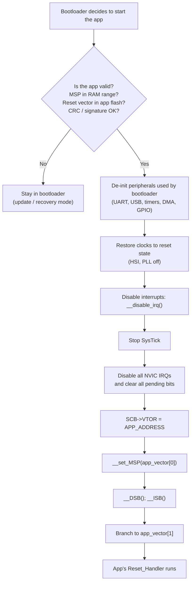

---

### Step 3: The code, line by line

```c
#include "stm32f4xx.h"

#define APP_ADDRESS    0x08010000u
#define APP_END        0x08080000u
#define RAM_START      0x20000000u
#define RAM_END        0x20020000u   /* 128 KB */

typedef void (*app_entry_t)(void);

/* Step A: sanity-check the vector table before trusting it */
static int app_vector_table_looks_valid(void)
{
    uint32_t sp    = *(volatile uint32_t *)(APP_ADDRESS + 0);
    uint32_t reset = *(volatile uint32_t *)(APP_ADDRESS + 4);

    /* Erased flash reads as 0xFFFFFFFF: no app */
    if (sp == 0xFFFFFFFFu || reset == 0xFFFFFFFFu) return 0;

    /* Stack must point into RAM (it may equal RAM_END, stack grows down) */
    if (sp < RAM_START || sp > RAM_END)            return 0;

    /* Reset handler must be inside the app region and be Thumb (bit 0 = 1) */
    if (reset < APP_ADDRESS || reset >= APP_END)   return 0;
    if ((reset & 1u) == 0u)                        return 0;

    return 1;
}

void jump_to_application(void)
{
    uint32_t app_sp    = *(volatile uint32_t *)(APP_ADDRESS + 0);
    uint32_t app_reset = *(volatile uint32_t *)(APP_ADDRESS + 4);
    app_entry_t app_entry = (app_entry_t)app_reset;

    /* 1. Undo what the bootloader set up.
     *    Do this FIRST: HAL de-init functions use HAL_GetTick() timeouts,
     *    which need SysTick still running. */
    HAL_UART_DeInit(&huart1);
    HAL_RCC_DeInit();          /* back to HSI, PLL off */
    HAL_DeInit();              /* resets peripherals via RCC reset registers */

    /* 2. No interrupts from now on */
    __disable_irq();

    /* 3. Stop SysTick: it's a core timer, not in the NVIC */
    SysTick->CTRL = 0;
    SysTick->LOAD = 0;
    SysTick->VAL  = 0;

    /* 4. Disable every IRQ and clear every pending IRQ in the NVIC */
    for (uint32_t i = 0; i < 8; i++) {
        NVIC->ICER[i] = 0xFFFFFFFFu;
        NVIC->ICPR[i] = 0xFFFFFFFFu;
    }

    /* 5. Point the CPU at the app's vector table */
    SCB->VTOR = APP_ADDRESS;

    /* 6. Load the app's initial stack pointer */
    __set_MSP(app_sp);

    /* 7. Make sure the above has taken effect before the branch */
    __DSB();
    __ISB();

    /* 8. Re-enable interrupts at the core. The app's peripherals are all
     *    off in the NVIC, so nothing fires until the app enables it.   */
    __enable_irq();

    /* 9. Go. Never returns. */
    app_entry();

    while (1) { }   /* should never get here */
}
```

And how the bootloader uses it:

```c
int main(void)
{
    HAL_Init();
    SystemClock_Config();
    MX_USART1_UART_Init();

    if (update_requested() || !app_vector_table_looks_valid() || !app_crc_ok()) {
        run_update_mode();                /* never returns; resets when done */
    }

    jump_to_application();
}
```

---

### Step 4: Why each line exists

| Line | Why | What breaks if you skip it |
| --- | --- | --- |
| **Validate SP / reset vector** | Don't jump into erased flash (0xFFFFFFFF) or garbage | HardFault straight away; device looks dead |
| **`__disable_irq()`** | An interrupt mid-switch would use a half-changed setup | Random crash during the jump |
| **Stop SysTick** | SysTick is **not** controlled by the NVIC. `ICER` won't stop it | App gets a SysTick before its handler/HAL is ready, or with the wrong tick rate |
| **De-init peripherals** | The app's HAL assumes reset-state registers | UART already enabled → app's init misbehaves; a DMA may still be writing into RAM the app now uses |
| **Clear NVIC enable + pending** | Pending IRQs would fire as soon as the app enables interrupts | App jumps into a handler it didn't expect |
| **Clocks to reset state** | App's `SystemClock_Config` expects HSI; some HAL code fails if PLL is already on | `HAL_RCC_OscConfig` returns an error because the PLL is in use as SYSCLK |
| **VTOR** | Interrupts must use the **app's** handlers | First interrupt runs a bootloader handler → crash |
| **MSP** | The app expects its own stack top | Stack overlaps app's `.data`/`.bss`; corruption |
| **DSB / ISB** | Make sure the register writes complete and the pipeline refetches | Rare, but real, timing bugs on faster cores |
| **Branch to word 1** | That's `Reset_Handler` of the app | – |

---

### Step 5: Why `APP_ADDRESS + 4`?

```text
APP_ADDRESS + 0x0  →  0x2002_0000   initial MSP        (data, not code)
APP_ADDRESS + 0x4  →  0x0801_02A9   Reset_Handler | 1  (code address)
```

Jumping to `APP_ADDRESS` itself would try to **execute the stack pointer value as instructions**. We read the *contents* of `APP_ADDRESS + 4` and branch to that.

---

### Step 6: A subtle trap with `__set_MSP()`

After `__set_MSP(app_sp)`, **the stack has moved**. Any local variable the compiler keeps on the stack is now read from the wrong place.

That's why the code above:

- reads `app_sp` and `app_entry` **before** changing MSP, and
- keeps them in registers (the compiler normally does, but at `-O0` it may not).

The bullet-proof way is to do the last two steps in assembly so no stack is used:

```c
__attribute__((naked, noreturn))
static void start_app(uint32_t sp, uint32_t pc)
{
    __asm volatile(
        "msr msp, r0   \n"   /* r0 = sp  (first argument)  */
        "bx  r1        \n"   /* r1 = pc  (second argument) */
    );
}

/* usage (after steps 1-5):  start_app(app_sp, app_reset); */
```

---

### Step 7: The cleanest alternative: jump through a reset

Instead of un-doing every peripheral by hand, many production bootloaders do this:

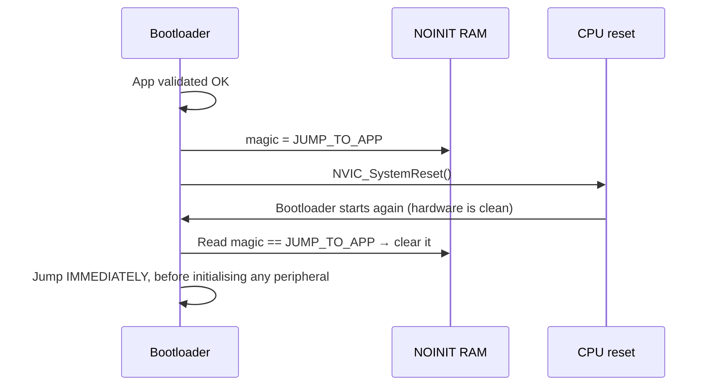

```c
int main(void)
{
    if (g_boot_shared.magic == BOOT_MAGIC_JUMP_TO_APP) {
        g_boot_shared.magic = 0;
        SCB->VTOR = APP_ADDRESS;
        start_app(*(uint32_t *)APP_ADDRESS, *(uint32_t *)(APP_ADDRESS + 4));
    }
    /* ... normal bootloader: init clocks, UART, validate, etc. ... */
}
```

**Why it's good:** peripherals, clocks, and DMA are guaranteed to be at reset state, because they really were just reset. Nothing to forget.

---

### Step 8: Things that are easy to forget

| Item | Why it matters |
| --- | --- |
| **Watchdog** | Once started, the IWDG **can't be stopped** except by reset. The app must refresh it soon after starting. Tell the app team. |
| **Caches (Cortex-M7)** | If you wrote the app to flash with D-cache on, clean/invalidate the caches before the jump (`SCB_CleanInvalidateDCache()`, `SCB_InvalidateICache()`) |
| **MPU** | If the bootloader enabled the MPU, disable it (`MPU->CTRL = 0`) or the app may fault |
| **Privilege / PSP** | If the bootloader ran an RTOS (it shouldn't), you may be in unprivileged Thread mode using PSP. Set `CONTROL = 0` first. |
| **FPU state** | If the bootloader used the FPU with lazy stacking, clear `FPU->FPCCR` state or reset `CONTROL.FPCA` |
| **Pending faults** | Clear `SCB->SHCSR` enables if the bootloader enabled MemManage/BusFault/UsageFault handlers |

---

### Common mistakes

1. **Jumping to `APP_ADDRESS` instead of `*(APP_ADDRESS + 4)`.**
2. **Not stopping SysTick.** The most common "app crashes immediately" cause with HAL.
3. **Forgetting VTOR.** App runs until its first interrupt, then crashes.
4. **Using stack variables after `__set_MSP`.**
5. **No validation.** A fresh device with an empty app region jumps to 0xFFFFFFFF and HardFaults. The device appears dead and can't be updated.
6. **Leaving DMA running.** It keeps writing into RAM the app now owns.

---

### Interview angle

**Q: "Write the code to jump from bootloader to application."**

Write Step 3's code, then say:

> "First I validate the app: word 0 must be a RAM address, word 1 must be an odd address inside the app region, and the CRC or signature must pass. Then I de-init the peripherals and clocks I used, disable interrupts, stop SysTick because the NVIC doesn't control it, and clear all NVIC enable and pending bits. I set VTOR to the app's vector table, load MSP from word 0, do DSB/ISB, and branch to word 1, the app's `Reset_Handler`. I read both words before touching MSP because changing MSP moves the stack. A cleaner option is to set a magic word and do a system reset, then jump before initialising anything."

**Follow-up: "The app works when flashed with the debugger but crashes when started by the bootloader. Why?"**

> "Usually one of: VTOR not set, so the first interrupt goes to the bootloader's handler; SysTick still running; a peripheral or DMA left enabled; the app linked for 0x0800_0000 instead of its slot; or the clock tree left in a state the app's clock config doesn't expect. I'd check the fault registers and VTOR in the debugger right after the jump." (See Module 12.)

---

### Check yourself

1. Why do we read `APP_ADDRESS + 4` and not jump to `APP_ADDRESS`?
2. Why doesn't clearing `NVIC->ICER` stop SysTick?
3. What can go wrong right after `__set_MSP()`?
4. What are three checks you'd do before jumping?
5. Explain the "jump through reset" technique and its advantage.

<details>
<summary>Answers</summary>

1. Word 0 is the initial stack pointer (data). Word 1 holds the address of `Reset_Handler`.
2. SysTick is a core exception (exception 15), not an external IRQ, so the NVIC enable registers don't cover it. You stop it through `SysTick->CTRL`.
3. The stack has moved, so any local variable stored on the old stack is read from the wrong address.
4. SP within RAM, reset vector inside the app region with the Thumb bit set, not erased (0xFFFFFFFF), CRC or signature valid.
5. Store a magic in `.noinit` RAM, reset the MCU, and have the bootloader jump before initialising anything. All peripherals and clocks are really at reset state, so nothing can be left behind.

</details>

---

---

## Module 5: Flash Programming

---

### The idea in one sentence

> Flash can only turn bits from **1 to 0** when you write. To get 1s back you must **erase a whole sector**. So updating firmware is always **unlock → erase → write → verify → lock**.

---

### Step 1: The physics, simply

Think of each flash bit as a tiny bucket that holds charge.

- **Erase** = empty all buckets in a sector at once → every bit reads **1** → bytes read **0xFF**.
- **Program** = add charge to chosen buckets → those bits become **0**.
- You **cannot** add "un-charge" to a single bucket. Only a sector-wide erase empties them.

```text
Erased byte:        1111 1111   (0xFF)
Program 0xA5:       1010 0101   ✓ allowed: only 1→0 changes
Now program 0x5A:   0101 1010   ✗ needs 0→1 on some bits → impossible without erase
Result of trying:   0000 0000   (bits AND together: 0xA5 & 0x5A = 0x00)
```

That's why the rule is **erase before write**.

> **Interview fact:** on STM32F4 you can technically program a word twice if you're only clearing bits, but on parts with **flash ECC** (STM32L4, G4, H7, U5) you can program each double-word **only once** after erase. A second write corrupts the ECC and triggers a fault or error flag.

---

### Step 2: The flash vocabulary

| Term | Meaning | STM32F4 example | STM32L4 example |
| --- | --- | --- | --- |
| **Erase unit** | Smallest area you can erase | Sector (16/64/128 KB) | Page (2 KB) |
| **Program unit** | Smallest write | Byte / half-word / word / double-word (depends on voltage, `PSIZE`) | Double-word (64 bits) only |
| **Erased value** | What erased flash reads as | 0xFF | 0xFF |
| **Endurance** | Erase cycles before wear-out | 10,000 | 10,000 |
| **Erase time** | How long it takes | 16 KB: tens of ms; 128 KB: 1-2 s | 2 KB page: ~22 ms |
| **Read-while-write** | Can you run code from flash while writing it? | No (single bank): the CPU stalls | Only across banks on dual-bank parts |

---

### Step 3: The five-step programming sequence


#### Unlock

The flash control register is locked after reset to stop runaway code from writing flash. You unlock it by writing two magic keys **in order**:

```c
FLASH->KEYR = 0x45670123;   /* KEY1 */
FLASH->KEYR = 0xCDEF89AB;   /* KEY2 */
/* A wrong key or wrong order locks FLASH_CR until the next reset. */
```

#### Erase and write with HAL (STM32F4)

```c
#include "stm32f4xx_hal.h"

/* Erase sectors 4..7 (the application region in our map) */
HAL_StatusTypeDef flash_erase_app(void)
{
    FLASH_EraseInitTypeDef erase = {
        .TypeErase    = FLASH_TYPEERASE_SECTORS,
        .Sector       = FLASH_SECTOR_4,
        .NbSectors    = 4,
        .VoltageRange = FLASH_VOLTAGE_RANGE_3,   /* 2.7-3.6 V → 32-bit writes */
    };
    uint32_t bad_sector = 0;

    HAL_FLASH_Unlock();
    __HAL_FLASH_CLEAR_FLAG(FLASH_FLAG_EOP | FLASH_FLAG_OPERR | FLASH_FLAG_WRPERR |
                           FLASH_FLAG_PGAERR | FLASH_FLAG_PGPERR | FLASH_FLAG_PGSERR);

    HAL_StatusTypeDef st = HAL_FLASHEx_Erase(&erase, &bad_sector);

    HAL_FLASH_Lock();
    return st;          /* on error, bad_sector says which one failed */
}

/* Write a block. addr and len must be 4-byte aligned. */
HAL_StatusTypeDef flash_write(uint32_t addr, const uint8_t *data, uint32_t len)
{
    HAL_StatusTypeDef st = HAL_OK;

    HAL_FLASH_Unlock();
    for (uint32_t i = 0; i < len && st == HAL_OK; i += 4) {
        uint32_t word;
        memcpy(&word, &data[i], 4);        /* data may not be aligned in RAM */
        st = HAL_FLASH_Program(FLASH_TYPEPROGRAM_WORD, addr + i, word);
    }
    HAL_FLASH_Lock();

    /* Verify: never trust a write you haven't read back */
    if (st == HAL_OK && memcmp((void *)addr, data, len) != 0) {
        st = HAL_ERROR;
    }
    return st;
}
```

#### The same thing at register level

Interviewers sometimes ask you to skip HAL:

```c
static void flash_wait(void) { while (FLASH->SR & FLASH_SR_BSY) { } }

void flash_erase_sector(uint32_t sector)
{
    flash_wait();
    FLASH->CR &= ~(FLASH_CR_PSIZE | FLASH_CR_SNB);
    FLASH->CR |= FLASH_CR_PSIZE_1                 /* x32 */
              |  (sector << FLASH_CR_SNB_Pos)
              |  FLASH_CR_SER;                     /* sector erase */
    FLASH->CR |= FLASH_CR_STRT;                    /* start */
    flash_wait();
    FLASH->CR &= ~FLASH_CR_SER;
}

void flash_program_word(uint32_t addr, uint32_t value)
{
    flash_wait();
    FLASH->CR &= ~FLASH_CR_PSIZE;
    FLASH->CR |= FLASH_CR_PSIZE_1 | FLASH_CR_PG;   /* x32, program mode */
    *(volatile uint32_t *)addr = value;            /* the write itself */
    flash_wait();
    FLASH->CR &= ~FLASH_CR_PG;
}
```

---

### Step 4: "The CPU freezes while I erase". Why?

On a **single-bank** chip, the CPU fetches instructions **from the same flash** you're erasing. The flash can't read and erase at once, so the **bus stalls** until the erase finishes. A 128 KB sector erase can freeze the CPU for **1-2 seconds**.

Consequences:

- Interrupts are **delayed**, not lost, but UART bytes arriving during that time **overflow** and are lost.
- The **watchdog** may expire.

Solutions:

| Problem | Solution |
| --- | --- |
| Lost UART bytes | Erase **before** starting the transfer, or have the host wait for an ACK after each erase |
| Watchdog | Erase one sector at a time and refresh the watchdog between sectors |
| Need to keep running | Run the flash routine from **RAM** (below), or use a **dual-bank** chip and erase the other bank |

#### Running flash code from RAM

```c
/* GCC: put the function in .RamFunc; ST's startup copies it with .data */
__attribute__((section(".RamFunc"), noinline))
void flash_program_word_ram(uint32_t addr, uint32_t value) { /* ... */ }
```

> Running from RAM stops the *fetch* stall, but any interrupt handler that lives in flash would still stall. So you either disable interrupts during the operation or put the handlers (and vector table) in RAM too.

---

### Step 5: Write protection: guarding the bootloader

The bootloader must stop *itself* (and a buggy app) from erasing its own sectors.

| Protection | STM32 name | What it does |
| --- | --- | --- |
| **Write protection** | `nWRP` option bits per sector | Blocks erase/program of chosen sectors until the option is changed |
| **Readout protection** | RDP Level 0 / 1 / 2 | Stops debugger and ROM bootloader from reading flash. **Level 2 is permanent**: it disables debug forever. |
| **Proprietary code readout (PCROP)** | PCROP | Code can execute but not be read as data |
| **Secure hide / HDP** | On newer parts (G4, H7, U5) | Makes the bootloader region inaccessible after it jumps to the app |

```c
/* Write-protect sectors 0-2 (the bootloader) */
FLASH_OBProgramInitTypeDef ob = {
    .OptionType = OPTIONBYTE_WRP,
    .WRPState   = OB_WRPSTATE_ENABLE,
    .WRPSector  = OB_WRP_SECTOR_0 | OB_WRP_SECTOR_1 | OB_WRP_SECTOR_2,
    .Banks      = FLASH_BANK_1,
};
HAL_FLASH_Unlock();
HAL_FLASH_OB_Unlock();
HAL_FLASHEx_OBProgram(&ob);
HAL_FLASH_OB_Launch();       /* reloads options; causes a reset on many parts */
```

> Do this during **manufacturing**, not in every boot.

---

### Step 6: Designing the write path in a bootloader

Real bootloaders receive data in chunks (say, 256 bytes over UART). A robust write path looks like this:

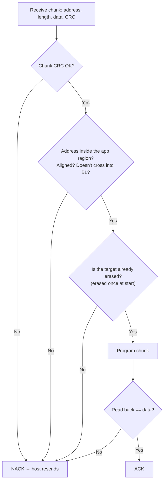

**Never trust the address from the host.** Always check that it is inside the app region. Otherwise a bad (or malicious) packet can overwrite the bootloader.

```c
static int addr_range_ok(uint32_t addr, uint32_t len)
{
    return (addr >= APP_ADDRESS) &&
           (len  <= APP_END - APP_ADDRESS) &&
           (addr <= APP_END - len) &&           /* written to avoid overflow */
           ((addr & 3u) == 0u) && ((len & 3u) == 0u);
}
```

---

### Step 7: Internal flash vs external flash

| | Internal flash | External SPI / QSPI flash |
| --- | --- | --- |
| Where code runs | Directly (execute-in-place) | Needs memory-mapped QSPI (XIP), or copy to RAM |
| Erase unit | KB to 128 KB | 4 KB sector / 64 KB block |
| Speed | Fast | Slower, but big and cheap |
| Typical use in bootloaders | Active app | **Download / staging slot** for OTA; backup image |

A common pattern: download the new image to external flash first, verify it, then the bootloader copies it into internal flash (Module 8).

---

### Common mistakes

1. **Writing without erasing.** Data ANDs with old data and comes out corrupted.
2. **Writing twice to an ECC flash word.** ECC error, NMI, or HardFault.
3. **Wrong `PSIZE` / voltage range.** Program parallelism error (`PGPERR`).
4. **Not clearing old error flags.** The next operation fails because an old flag is still set.
5. **Trusting host addresses.** The bootloader erases itself.
6. **Erasing the whole app region on every chunk.** Erase once at the start, or per sector as you reach it.
7. **Ignoring erase time.** The watchdog fires, or UART overruns.

---

### Interview angle

**Q: "Why must flash be erased before writing?"**

> "Programming can only change bits from 1 to 0. Erase sets a whole sector back to all 1s. If you write over non-erased data you get the AND of old and new. On parts with ECC, you can only program each double-word once after erase."

**Q: "Your bootloader loses UART data during flash erase. Why, and how do you fix it?"**

> "On a single-bank part the CPU stalls while fetching from flash during the erase, so interrupts are delayed and the UART overruns. Fixes: erase before starting the transfer, make the host wait for an ACK after each erase, run the ISR and flash routines from RAM, or use DMA into a buffer. On a dual-bank part, erase the other bank so the CPU keeps running."

---

### Check yourself

1. What value does erased flash read as, and why?
2. You program 0xF0 over an existing 0x3C without erasing. What's stored?
3. Why does the CPU freeze during erase on a single-bank MCU?
4. What's the difference between WRP and RDP?
5. Why should the bootloader validate the address in each write packet?

<details>
<summary>Answers</summary>

1. 0xFF. Erase removes the charge, so every bit reads as 1.
2. 0xF0 & 0x3C = 0x30.
3. The CPU fetches instructions from the same flash array that is busy erasing, so the bus stalls until the erase is done.
4. WRP stops erasing and programming of chosen sectors. RDP stops *reading* flash from outside (debugger, ROM bootloader). Level 2 is permanent.
5. A wrong or malicious address could erase or overwrite the bootloader itself and brick the device.

</details>

---

---

## Module 6: Entering the Bootloader and the Update Protocol

---

### The idea in one sentence

> The bootloader needs **a reason to stay** (button, magic flag, bad app, timeout window), then **a simple, reliable packet protocol** (framing, sequence number, CRC, ACK/NACK, retries) to receive the new firmware.

---

### Part A: How do we enter the bootloader?

#### Step 1: The decision at boot

Every boot, the bootloader answers one question: **"Stay, or jump?"**

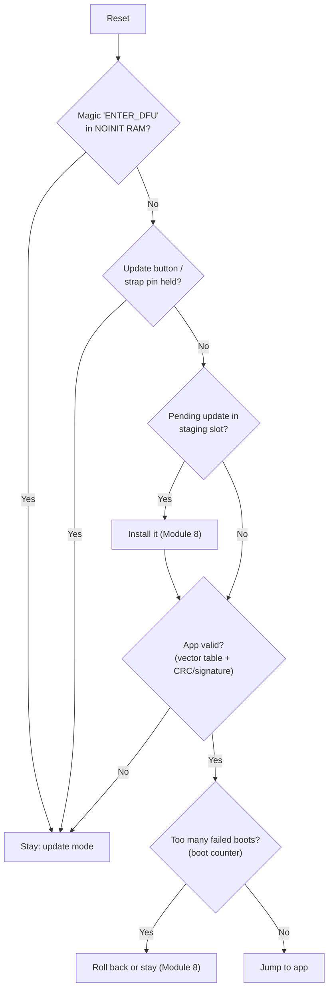

#### Step 2: Entry methods compared

| Method | How it works | Pros | Cons |
| --- | --- | --- | --- |
| **GPIO / button** | Hold a pin low during reset | Works even if the app is broken | Needs physical access, and a spare pin |
| **Magic word in RAM** | App writes magic, then resets (Module 3) | Remote-triggerable, no hardware | Needs a working app |
| **Invalid app** | CRC or vector check fails | Automatic recovery | Only triggers when something is already wrong |
| **Timeout window** | Wait e.g. 500 ms for a sync byte after reset | No button needed | Slows every boot, and noise can trigger it |
| **Metadata flag in flash** | "update pending" survives power loss | Robust | Uses erase cycles |
| **Boot counter** | Too many resets without "confirmed" → stay | Recovers from crash loops | Needs a confirmed/healthy signal from the app |

> **Production rule:** always have **at least one entry method that works when the app is completely broken** (button, invalid-app check, or boot counter). Otherwise a bad app bricks the device.

---

### Part B: Designing the update protocol

#### Step 3: Why not just send the raw `.bin`?

Because UART, RS-485, and CAN links **lose and corrupt bytes**. If you stream raw bytes and one is corrupted, you've programmed a broken image and don't know it. A protocol adds:

| Feature | Protects against |
| --- | --- |
| **Start-of-frame (SOF) byte** | Losing sync with the byte stream |
| **Length field** | Not knowing where a packet ends |
| **Sequence number** | Duplicate or missing packets |
| **CRC per packet** | Corrupted bytes |
| **ACK/NACK + retry** | Transient errors |
| **Timeout** | A host that disappeared mid-transfer |
| **Whole-image CRC/signature at the end** | Everything the per-packet checks missed |

#### Step 4: A packet format

```text
 ┌──────┬──────┬──────┬───────┬─────────────────┬───────┐
 │ SOF  │ CMD  │ SEQ  │  LEN  │     PAYLOAD     │ CRC16 │
 │ 0xA5 │ 1 B  │ 1 B  │ 2 B   │   0..256 bytes  │ 2 B   │
 └──────┴──────┴──────┴───────┴─────────────────┴───────┘
          └─────── CRC is computed over CMD..PAYLOAD ─────┘
```

| CMD | Name | Payload | Meaning |
| --- | --- | --- | --- |
| 0x01 | `START` | image size (4 B), version (4 B), image CRC32 (4 B) | "An update is coming." Bootloader checks size and erases the region. |
| 0x02 | `DATA` | offset (4 B) + up to 252 data bytes | "Write these bytes at this offset." |
| 0x03 | `END` | – | "Done." Bootloader verifies the whole image. |
| 0x04 | `ABORT` | – | Cancel the transfer. |
| 0x05 | `GET_INFO` | – | Returns bootloader version, app version, max packet size |
| 0x06 | `BOOT` | – | Jump to the new app / reset |

Responses: `ACK = 0x79`, `NACK = 0x1F` (the same values ST's ROM bootloader uses), each with the sequence number echoed back.

#### Step 5: The conversation

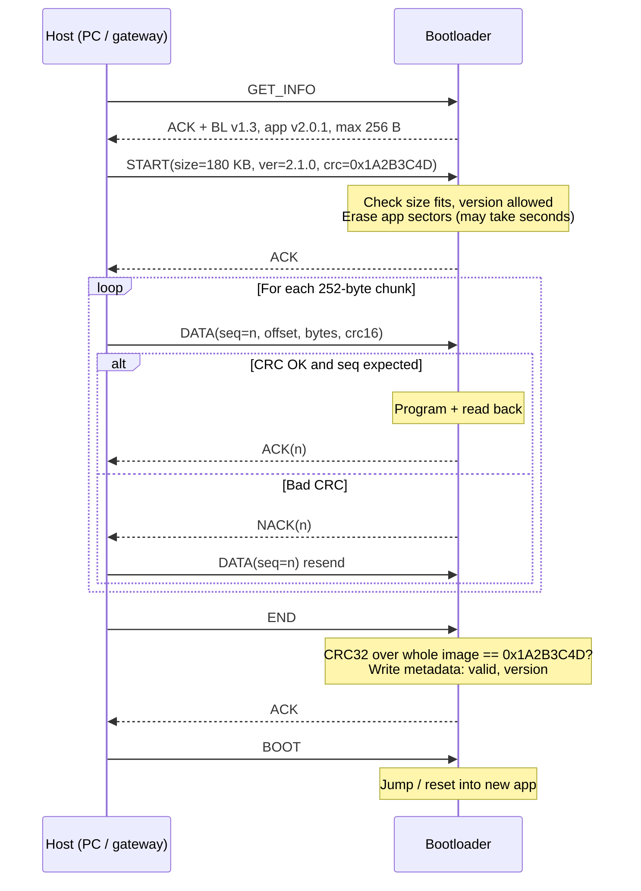

#### Step 6: Handling the tricky cases

| Situation | What the bootloader should do |
| --- | --- |
| Packet CRC bad | NACK, keep the same expected sequence number |
| Sequence = expected − 1 (duplicate: the host missed our ACK) | **Don't write again** (on ECC flash that would fault); just ACK again |
| Sequence jumps ahead | NACK: a packet was lost |
| No byte for N seconds mid-transfer | Abort, mark app invalid, return to waiting |
| Power lost mid-transfer | App region is half-written → CRC fails at next boot → stay in bootloader (Module 8 makes this better) |
| `END` but whole-image CRC fails | NACK, keep app marked invalid, don't jump |

> **Key idea:** mark the app **invalid first** (at `START`), and mark it **valid last** (after the `END` verification). Any interruption in between leaves a clearly-invalid app, never a half-written one that *looks* valid.

---

### Step 7: Device-side code (receiver state machine)

A byte-by-byte parser that works from a UART RX interrupt or DMA ring buffer:

```c
typedef enum { WAIT_SOF, GET_CMD, GET_SEQ, GET_LEN0, GET_LEN1, GET_PAYLOAD,
               GET_CRC0, GET_CRC1 } rx_state_t;

typedef struct {
    uint8_t  cmd, seq;
    uint16_t len;
    uint8_t  payload[256];
    uint16_t crc;
} packet_t;

static rx_state_t st = WAIT_SOF;
static packet_t   pkt;
static uint16_t   idx;

/* Returns 1 when a full packet has arrived (CRC not yet checked) */
int parser_feed(uint8_t b)
{
    switch (st) {
    case WAIT_SOF:   if (b == 0xA5) st = GET_CMD;                break;
    case GET_CMD:    pkt.cmd = b;             st = GET_SEQ;       break;
    case GET_SEQ:    pkt.seq = b;             st = GET_LEN0;      break;
    case GET_LEN0:   pkt.len = b;             st = GET_LEN1;      break;
    case GET_LEN1:   pkt.len |= (uint16_t)b << 8;
                     if (pkt.len > sizeof pkt.payload) { st = WAIT_SOF; break; }
                     idx = 0;
                     st = pkt.len ? GET_PAYLOAD : GET_CRC0;       break;
    case GET_PAYLOAD:pkt.payload[idx++] = b;
                     if (idx == pkt.len) st = GET_CRC0;           break;
    case GET_CRC0:   pkt.crc = b;             st = GET_CRC1;      break;
    case GET_CRC1:   pkt.crc |= (uint16_t)b << 8;
                     st = WAIT_SOF;
                     return 1;
    }
    return 0;
}
```

And the command handler:

```c
static uint8_t  expected_seq;
static uint32_t image_size, image_crc, bytes_written;

void handle_packet(const packet_t *p)
{
    if (crc16_ccitt(&p->cmd, 4, p->payload, p->len) != p->crc) {
        send_nack(p->seq);
        return;
    }

    switch (p->cmd) {
    case CMD_START:
        image_size = rd32(&p->payload[0]);
        image_crc  = rd32(&p->payload[8]);
        if (image_size == 0 || image_size > APP_MAX_SIZE) { send_nack(p->seq); return; }
        meta_mark_app_invalid();                 /* FIRST: invalidate      */
        if (flash_erase_app() != HAL_OK)          { send_nack(p->seq); return; }
        bytes_written = 0;
        expected_seq  = (uint8_t)(p->seq + 1);
        send_ack(p->seq);
        break;

    case CMD_DATA: {
        if (p->seq == (uint8_t)(expected_seq - 1)) { send_ack(p->seq); return; } /* duplicate */
        if (p->seq != expected_seq || p->len < 4)  { send_nack(p->seq); return; }
        uint32_t off = rd32(&p->payload[0]);
        uint32_t n   = p->len - 4u;
        if (off != bytes_written || !addr_range_ok(APP_ADDRESS + off, n) ||
            flash_write(APP_ADDRESS + off, &p->payload[4], n) != HAL_OK) {
            send_nack(p->seq);
            return;
        }
        bytes_written += n;
        expected_seq++;
        send_ack(p->seq);
        break;
    }

    case CMD_END:
        if (bytes_written == image_size &&
            crc32((const uint8_t *)APP_ADDRESS, image_size) == image_crc) {
            meta_mark_app_valid(image_size, image_crc);   /* LAST: validate */
            send_ack(p->seq);
        } else {
            send_nack(p->seq);
        }
        break;

    case CMD_BOOT:
        send_ack(p->seq);
        NVIC_SystemReset();          /* clean start, bootloader will validate + jump */
        break;
    }
}
```

> The host pads the last chunk to a multiple of 4 bytes with 0xFF, so every write is word-aligned.

---

### Step 8: Host-side script (Python)

The PC side is short. Being able to sketch it shows you understand both ends:

```python
import serial, struct, zlib, binascii

SOF, ACK, NACK = 0xA5, 0x79, 0x1F
CMD_START, CMD_DATA, CMD_END, CMD_BOOT = 1, 2, 3, 6

def crc16(data: bytes) -> int:
    return binascii.crc_hqx(data, 0xFFFF)          # CRC-16/CCITT-FALSE

def send(port, cmd, seq, payload=b"", retries=5):
    body = bytes([cmd, seq]) + struct.pack("<H", len(payload)) + payload
    frame = bytes([SOF]) + body + struct.pack("<H", crc16(body))
    for _ in range(retries):
        port.write(frame)
        resp = port.read(2)                       # [ACK/NACK, seq]
        if len(resp) == 2 and resp[0] == ACK and resp[1] == seq:
            return
    raise RuntimeError(f"cmd {cmd} seq {seq} failed")

def flash(path, dev="COM5"):
    img = open(path, "rb").read()
    img += b"\xFF" * (-len(img) % 4)              # pad to a multiple of 4
    crc = zlib.crc32(img) & 0xFFFFFFFF
    with serial.Serial(dev, 115200, timeout=5) as p:   # long timeout: erase is slow
        seq = 0
        send(p, CMD_START, seq, struct.pack("<III", len(img), 0x00020100, crc)); seq += 1
        for off in range(0, len(img), 252):
            send(p, CMD_DATA, seq & 0xFF, struct.pack("<I", off) + img[off:off+252]); seq += 1
        send(p, CMD_END, seq & 0xFF); seq += 1
        send(p, CMD_BOOT, seq & 0xFF)
```

---

### Step 9: Standard protocols you might use instead

You don't always have to invent one:

| Protocol | Transport | Notes |
| --- | --- | --- |
| **XMODEM / YMODEM** | UART | 128/1024-byte blocks, ACK/NAK, CRC16. YMODEM adds file name and size. Any terminal (Tera Term) can send. ST's IAP application note (AN4657) uses YMODEM. |
| **STM32 ROM (AN3155)** | UART | `0x7F` auto-baud; commands like Write Memory `0x31`, each followed by its complement byte (Module 10) |
| **USB DFU** | USB | Standard class; `dfu-util` on the host |
| **SMP / mcumgr** | UART, BLE, UDP | Used with MCUboot and Zephyr |
| **UDS (ISO 14229)** | CAN / DoIP | Automotive: `0x10` session control, `0x27` security access, `0x34` request download, `0x36` transfer data, `0x37` transfer exit |
| **HTTP(S) / MQTT** | Wi-Fi, cellular | Used by the **application** to download OTA images, not usually by the bootloader |

---

### Common mistakes

1. **No per-packet CRC.** One flipped bit = corrupted firmware.
2. **Writing the duplicate packet again** when the host resends because it missed the ACK.
3. **Marking the app valid before the final verification.**
4. **Host timeout shorter than the erase time.** The host gives up while the device is busy erasing.
5. **No escape if the app is broken.** Only the app can trigger update mode.
6. **Unbounded length field.** A length of 0xFFFF overflows the payload buffer. Always check it.

---

### Interview angle

**Q: "Design a UART bootloader protocol."**

> "Framed packets: SOF, command, sequence number, length, payload, CRC16. Commands: start (with size, version, image CRC), data (offset plus bytes), end, boot. Every packet is ACKed or NACKed with the sequence number echoed. Duplicates are ACKed without rewriting. At start I mark the app invalid and erase. I validate each address against the app region, program, and read back. At end I check the CRC32 of the whole image and only then mark it valid. Timeouts abort a stalled transfer. There is always an entry path when the app is broken: button, invalid CRC, or boot counter."

---

### Check yourself

1. List four ways to enter the bootloader. Which work when the app is totally broken?
2. Why do we need a sequence number if we already have a CRC?
3. The host resends packet 7 because the ACK was lost. What should the device do, and why?
4. When should the app be marked invalid, and when valid?
5. Why must the host timeout for `START` be long?

<details>
<summary>Answers</summary>

1. GPIO button, RAM magic word, invalid app detected, timeout window, boot counter, flash flag. Button, invalid-app, timeout window, and boot counter work with a broken app. The RAM magic needs a running app.
2. The CRC catches corrupted bytes. The sequence number catches missing or duplicated packets, which a CRC can't detect.
3. Recognise it as a duplicate (seq = expected − 1) and re-send ACK without writing. Re-writing could corrupt the data, or cause an ECC fault on parts that allow only one write per word.
4. Invalid at the very start (before erasing). Valid only after the whole-image check passes at the end.
5. The device erases the app region on `START`, which can take several seconds and stalls the CPU.

</details>

---

---

## Module 7: Image Validation

---

### The idea in one sentence

> Before running an image, the bootloader asks **"Is it complete and uncorrupted?"** (checksum/CRC/hash) and, for secure products, **"Did *we* make it?"** (digital signature). These are two **different** questions.

---

### Step 1: Four tools, four levels of trust

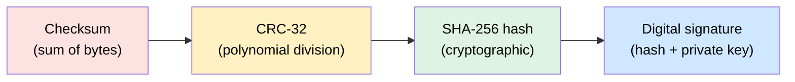

| Tool | Detects accidental corruption? | Detects deliberate tampering? | Proves who made it? | Cost on a Cortex-M4 |
| --- | --- | --- | --- | --- |
| **Checksum** | Some (misses swapped bytes, many multi-bit errors) | No | No | Tiny |
| **CRC-32** | Very well (all burst errors ≤ 32 bits) | **No**: anyone can recompute it | No | Tiny, or free with the hardware CRC unit |
| **SHA-256** | Yes | Only if the expected hash is itself protected | No | ~10-50 ms per 256 KB in software; hardware on many MCUs |
| **Signature (ECDSA P-256, Ed25519, RSA)** | Yes | **Yes** | **Yes** | ~50-200 ms per verify in software |

> **Analogy:**
> - **CRC** is counting the pages in a letter. Good for spotting a missing page, useless against a forger who rewrites the page and fixes the count.
> - **Hash** is a fingerprint of the letter. Any change shows up, but a forger can send their own letter with their own fingerprint.
> - **Signature** is your wax seal. Only you have the stamp (private key). Anyone can check the seal (public key).

---

### Step 2: Checksum: simple and weak

```c
uint8_t checksum8(const uint8_t *p, uint32_t n)
{
    uint8_t s = 0;
    while (n--) s += *p++;
    return s;
}
```

Its weakness: data `{0x01, 0x02}` and `{0x02, 0x01}` give the **same** sum. Swapped bytes go unnoticed. Fine for Intel HEX lines, not good enough for a firmware image.

---

### Step 3: CRC-32: the workhorse

#### What a CRC is, in one paragraph

Treat the whole image as one huge binary number. Divide it by a fixed polynomial (for CRC-32, `0x04C11DB7`) using XOR instead of subtraction. The **remainder** is the CRC. Change any bit and the remainder changes in a way that's very hard to hit by accident.

**Guarantees of CRC-32:** it detects all single-bit errors, all double-bit errors (up to very long lengths), all odd numbers of bit errors, and **every burst error up to 32 bits long**. That's exactly the kind of error UART noise and flash wear produce.

#### Bitwise implementation (small, slow)

```c
/* CRC-32 (IEEE 802.3, same as zlib / Python zlib.crc32) */
uint32_t crc32(const uint8_t *data, uint32_t len)
{
    uint32_t crc = 0xFFFFFFFFu;                 /* initial value */
    while (len--) {
        crc ^= *data++;
        for (int bit = 0; bit < 8; bit++) {
            /* reflected polynomial 0xEDB88320 = bit-reversed 0x04C11DB7 */
            crc = (crc >> 1) ^ (0xEDB88320u & (uint32_t)-(int32_t)(crc & 1u));
        }
    }
    return crc ^ 0xFFFFFFFFu;                   /* final XOR */
}
```

#### Table-driven (fast, costs 1 KB of flash)

```c
static uint32_t table[256];

void crc32_init(void)
{
    for (uint32_t i = 0; i < 256; i++) {
        uint32_t c = i;
        for (int k = 0; k < 8; k++) c = (c & 1) ? (c >> 1) ^ 0xEDB88320u : c >> 1;
        table[i] = c;
    }
}

uint32_t crc32_fast(const uint8_t *p, uint32_t n)
{
    uint32_t crc = 0xFFFFFFFFu;
    while (n--) crc = table[(crc ^ *p++) & 0xFF] ^ (crc >> 8);
    return crc ^ 0xFFFFFFFFu;
}
```

**Test vector:** `crc32("123456789")` must equal `0xCBF43926`. Always test your CRC against this before trusting it.

#### The STM32 hardware CRC unit

Most STM32s have a CRC peripheral. Watch out: on older parts (F1/F2/F4) it's **fixed** to polynomial 0x04C11DB7, 32-bit words, **no bit reflection, no final XOR**. So it gives a **different number** from `zlib.crc32` for the same data. Your build script must use the same CRC variant as the bootloader. Newer parts (F0/F3/L4/G4/H7) have configurable reflection and initial value, so you can match zlib.

```c
/* F4 hardware CRC: word-at-a-time, "CRC-32/MPEG-2" style */
__HAL_RCC_CRC_CLK_ENABLE();
uint32_t crc = HAL_CRC_Calculate(&hcrc, (uint32_t *)APP_ADDRESS, image_size / 4);
```

> **Interview trap:** "My bootloader CRC doesn't match the one my Python script computes." Answer: different CRC variants (reflection, initial value, final XOR, byte vs word order). Pick one and document it: poly, init, refin, refout, xorout.

---

### Step 4: Where does the expected CRC live?

The bootloader needs the *expected* value to compare against. Three options:

```text
Option 1: Header (before the image)      Option 2: Trailer (after the image)
┌─────────────────────┐                  ┌─────────────────────┐
│ header: size, CRC   │                  │ app vector table    │
├─────────────────────┤                  │ app code ...        │
│ app vector table    │                  ├─────────────────────┤
│ app code ...        │                  │ trailer: CRC, magic │
└─────────────────────┘                  └─────────────────────┘

Option 3: Separate metadata sector
┌─────────────────────┐   ┌──────────────────────────┐
│ app image           │   │ metadata: size, CRC, ver │
└─────────────────────┘   └──────────────────────────┘
```

| | Header | Trailer | Metadata sector |
| --- | --- | --- | --- |
| Who adds it | Post-build script | Post-build script | Bootloader at end of update |
| Bootloader knows size up front | Yes | Must search or use fixed position | Yes |
| Vector table alignment | Must pad header (0x200) | Unaffected | Unaffected |
| Used by | MCUboot, ESP-IDF | Many custom bootloaders | Simple UART bootloaders |

> **Include the header in the check.** If the CRC covers only the image body, an attacker or bug can change the header's `version` or `load_addr` undetected. MCUboot's signature covers the header *and* the "protected TLVs".

#### Post-build script that appends a header

```python
import struct, zlib, sys

MAGIC, HDR_SIZE = 0x494D4721, 0x200
body = open(sys.argv[1], "rb").read()
body += b"\xFF" * (-len(body) % 4)
version = 0x01020003                               # v1.2.3
hdr = struct.pack("<IIIIII", MAGIC, HDR_SIZE, len(body), version,
                  0x08010200, zlib.crc32(body) & 0xFFFFFFFF)
hdr = hdr.ljust(HDR_SIZE, b"\xFF")
open(sys.argv[2], "wb").write(hdr + body)
```

---

### Step 5: The bootloader's validation routine

```c
typedef enum { IMG_OK, IMG_EMPTY, IMG_BAD_MAGIC, IMG_BAD_SIZE,
               IMG_BAD_VECTOR, IMG_BAD_CRC, IMG_BAD_SIG } img_status_t;

img_status_t validate_image(uint32_t slot_addr, uint32_t slot_size)
{
    const image_header_t *h = (const image_header_t *)slot_addr;

    if (h->magic == 0xFFFFFFFFu)                     return IMG_EMPTY;
    if (h->magic != IMAGE_MAGIC)                     return IMG_BAD_MAGIC;
    if (h->header_size != sizeof(image_header_t) ||
        h->image_size == 0 ||
        h->image_size > slot_size - h->header_size)  return IMG_BAD_SIZE;

    uint32_t app = slot_addr + h->header_size;
    if (!vector_table_looks_valid(app))              return IMG_BAD_VECTOR;

    if (crc32((const uint8_t *)app, h->image_size) != h->crc32)
                                                     return IMG_BAD_CRC;
#ifdef SECURE_BOOT
    if (!verify_signature(h, (const uint8_t *)app))  return IMG_BAD_SIG;  /* Module 9 */
#endif
    return IMG_OK;
}
```

Return a **reason**, not just pass/fail. Log it or expose it over the protocol. It makes field failures debuggable.

---

### Step 6: Hash and signature: a preview of Module 9

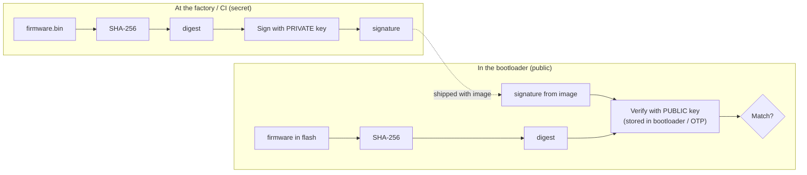

**Why is SHA-256 alone not enough?** If the expected hash is shipped *with* the image, an attacker just replaces both. A signature fixes this, because the attacker can't create a valid signature without the private key.

**Where a hash alone *is* enough:** when the expected hash comes from a trusted place, e.g. an HTTPS-authenticated server manifest, or it's burned into OTP.

---

### Step 7: When to validate

| Moment | Why |
| --- | --- |
| After each packet | Catch transfer errors early (packet CRC, Module 6) |
| After the whole download | Don't install a broken image |
| **Every boot**, before jumping | Flash bits can flip (wear, radiation, brown-out writes). Also catches tampering. |
| After copying/swapping slots | Verify the copy, not just the source |

> **Cost tip:** a full CRC-32 over 400 KB on a 100 MHz Cortex-M4 takes about 5-15 ms in software, and less with the hardware unit. A full ECDSA verify takes 100-200 ms. Measure your boot-time budget and decide.

---

### Common mistakes

1. **Using CRC for security.** It stops accidents, not attackers.
2. **CRC variant mismatch** between build script and bootloader.
3. **Not covering the header** with the CRC or signature.
4. **Trusting `image_size` from the header before range-checking it.** A huge size makes the CRC loop read past flash → BusFault.
5. **Validating only at download time,** never at boot.
6. **Returning plain pass/fail** with no reason code.

---

### Interview angle

**Q: "Checksum vs CRC vs hash vs signature?"**

> "A checksum adds bytes. It's cheap but misses reordering and many multi-bit errors. A CRC is polynomial division. It reliably detects accidental errors, including every burst up to its width, but anyone can recompute it, so it gives no security. A cryptographic hash like SHA-256 makes it infeasible to find two images with the same digest, but if the expected hash travels with the image an attacker replaces both. A signature is the hash signed with a private key and checked with a public key in the device. It proves integrity *and* origin, which is what secure boot needs."

**Q: "Can CRC be used for secure boot?"**

> "No. CRC is linear and has no secret. An attacker can modify the image and recompute the CRC, or even patch four bytes to force any CRC value they want. You need a signature, or at least a hash whose expected value comes from a trusted source."

---

### Check yourself

1. Which errors is CRC-32 guaranteed to detect?
2. What is the CRC-32 of `"123456789"`, and why does it matter?
3. Why might the STM32F4 hardware CRC disagree with Python's `zlib.crc32`?
4. Why should the check cover the header, too?
5. Why isn't a SHA-256 hash stored next to the image enough for security?

<details>
<summary>Answers</summary>

1. All single-bit and double-bit errors, any odd number of bit errors, and all burst errors of length ≤ 32 bits.
2. `0xCBF43926`. It's the standard check value for verifying that your implementation is correct.
3. The F4 unit uses a different variant: no input/output reflection, no final XOR, 32-bit word input. zlib uses reflected CRC-32 with final XOR.
4. Otherwise someone (or a bug) can change size, version, or load address without detection, which can enable downgrades or out-of-range reads.
5. An attacker who can change the image can also change the hash next to it. Only a signature (or a hash from a trusted source) ties the image to you.

</details>

---

---

## Module 8: Fail-Safe Updates: A/B, Swap, and Rollback

---

### The idea in one sentence

> A fail-safe update **never destroys the only working image until the new one is proven good**. Keep a known-good copy, make every step **resumable after power loss**, and let the new firmware **prove itself** before it becomes permanent (otherwise **roll back**).

---

### Step 1: What can go wrong?

Before designing, list the enemies:

| # | Failure | Example |
| --- | --- | --- |
| 1 | **Power loss during download** | Battery dies at 60% of the OTA download |
| 2 | **Power loss during install** (erase/copy) | User unplugs during "Updating… do not power off" |
| 3 | **Corrupted image** | Bit flips on the link, flash wear |
| 4 | **Bad but valid image** | Signed correctly, CRC fine, but crashes on boot |
| 5 | **Bad in a subtle way** | Boots, but can't connect to Wi-Fi, so it can never receive the *next* fix |
| 6 | **Malicious or old image** | Attacker installs an old vulnerable version (Module 9) |

Module 7's validation handles #3. This module handles **#1, #2, #4, and #5**.

---

### Step 2: Strategy 1: Single slot (the baseline)

```text
┌──────────────┬──────────────────────────────────────┐
│ Bootloader   │           Application (one slot)     │
└──────────────┴──────────────────────────────────────┘
```

The bootloader erases the app and writes the new one in its place.

- Power loss mid-update → app is invalid → bootloader stays in update mode → **recoverable** only if the bootloader itself can receive a new image (UART/USB/CAN).
- Bad but valid image → **no way back**.
- The device is **offline during the whole update**.

✅ Simple, uses the least flash. ❌ No rollback. OK for devices updated by a technician over a cable.

---

### Step 3: Strategy 2: Download slot + overwrite

```text
┌──────────────┬──────────────────────┬──────────────────────┐
│ Bootloader   │  ACTIVE (runs here)  │  DOWNLOAD (staging)  │
└──────────────┴──────────────────────┴──────────────────────┘
                        ▲                        │
                        └──── bootloader copies ─┘
```

1. The **application** downloads the new image into the DOWNLOAD slot while it keeps running (OTA over Wi-Fi/cellular/BLE).
2. It verifies the image, sets "update pending", and resets.
3. The **bootloader** verifies again, then copies DOWNLOAD → ACTIVE and clears the flag.

Power loss during the copy? **The source is still intact in DOWNLOAD**, so the bootloader simply restarts the copy on the next boot. ✅

But after the copy, the old version is gone, so a bad-but-valid image can't be reverted. ❌ (Unless you keep a third "golden/factory" image.)

> The DOWNLOAD slot is often in **external SPI flash**, which is cheap and large.

---

### Step 4: Strategy 3: A/B slots (dual-slot, run from either)

```text
┌──────────────┬────────┬──────────────────────┬──────────────────────┐
│ Bootloader   │ META   │   SLOT A  (v1.0) ✓   │   SLOT B  (v1.1) new │
└──────────────┴────────┴──────────────────────┴──────────────────────┘
                   │
                   └── "active = A, pending = B, B.state = TESTING"
```

1. The app running from A downloads v1.1 into B.
2. It marks B as "try once" and resets.
3. The bootloader boots **B** in *test mode*.
4. If B confirms itself healthy → B becomes active, A is the backup.
5. If B crashes or never confirms → the bootloader boots **A** again. **Rollback in one reset, with no copying.**

✅ Fastest, safest, with instant rollback. ❌ Needs 2× app flash.

#### The catch: "which address was the image linked for?"

An image linked for 0x0801_0000 won't run from 0x0804_0000: absolute addresses in its vector table and code point to slot A. Solutions:

| Solution | How |
| --- | --- |
| **Build twice** | CI produces `app_slotA.bin` and `app_slotB.bin`; the device downloads the one for its inactive slot. Simple and common. ESP32 avoids the issue with the MMU (below). |
| **Hardware bank swap** | Many STM32 dual-bank parts (e.g. L4, G4, H7, U5) can **remap** bank 2 to address 0x0800_0000 with an option bit (`BFB2` / `SWAP_BANK`, depending on family; check the reference manual). Both images are linked for the same address. |
| **MMU / flash cache mapping** | ESP32 maps whichever OTA partition is selected to the same virtual address. |
| **Position-independent code** | `-fPIC` / ROPI. Possible, but awkward on MCUs (GOT, vector table must be patched). Rare. |

---

### Step 5: Strategy 4: Swap (MCUboot's default idea)

What if you want rollback but the chip can only run from **one** address? **Swap** the two slots' contents, sector by sector, in a way that survives power loss.

```text
Before:          PRIMARY = v1.0 (runs here)    SECONDARY = v1.1 (new)
Swap (test):     PRIMARY = v1.1                SECONDARY = v1.0 (backup)
If v1.1 fails:   swap back → PRIMARY = v1.0    SECONDARY = v1.1 (rejected)
```

MCUboot supports several modes ([docs](https://docs.mcuboot.com/design.html)):

| Mode | How it swaps | Extra flash | Rollback? |
| --- | --- | --- | --- |
| **Overwrite-only** | Copy secondary over primary | None | ❌ |
| **Swap using scratch** | Uses a scratch sector as temporary storage for each sector swap | 1 scratch area | ✅ |
| **Swap using move** | Shifts primary up by one sector, then swaps | 1 extra sector in primary | ✅ |
| **Swap using offset** | Secondary image stored one sector offset | 1 extra sector in secondary | ✅ (fewer erases) |
| **Direct-XIP** | No copy; runs the newest valid slot in place (images built per slot) | None | ✅ |
| **RAM-load** | Copies newest valid image into RAM and runs it | Enough RAM | ✅ |

How does a swap survive power loss? The bootloader writes a **swap status** record into the image **trailer** after each sector step. On the next boot it reads the status and **resumes exactly where it stopped**.

---

### Step 6: Comparison: pick the right strategy

| | Single slot | Download + overwrite | A/B (XIP) | Swap (MCUboot) |
| --- | --- | --- | --- | --- |
| Flash needed | 1× | 2× (can be external) | 2× internal | 2× + scratch |
| Device usable during download | No | **Yes** | **Yes** | **Yes** |
| Survives power loss in install | Only via BL recovery | **Yes** | **Yes** | **Yes** (swap status) |
| Rollback to previous | No | No (unless golden image) | **Yes, instant** | **Yes** (swap back) |
| Install time | Download time | Copy time | ~0 | 2× copy time |
| Flash wear | Low | Medium | Low | Higher |
| Typical user | Simple UART-updated gadgets | Cost-sensitive IoT with external flash | ESP32, dual-bank STM32 | Zephyr / nRF / TF-M products |

---

### Step 7: Persisting boot state safely

The bootloader and app need shared state that **survives power loss at any moment**: which slot is active, and whether the new image is confirmed. Writing it naively is dangerous:

```text
❌ Erase metadata sector → (power lost here!) → write new metadata
   Result: metadata gone. Which slot is valid? Unknown.
```

#### Technique 1: Two copies with sequence numbers (ESP32's `otadata` does this)

```text
 Metadata copy 0 (sector X)         Metadata copy 1 (sector Y)
┌──────────────────────────┐       ┌──────────────────────────┐
│ seq = 41                 │       │ seq = 42   ← newest wins  │
│ active = A               │       │ active = B               │
│ state  = VALID           │       │ state  = PENDING_VERIFY  │
│ crc    = ...             │       │ crc    = ...             │
└──────────────────────────┘       └──────────────────────────┘
```

Rules:

1. Read both. Ignore any copy whose CRC is bad.
2. Use the valid copy with the **highest seq**.
3. To update: write the new record into the **other** (older) copy's sector with `seq + 1`.

If power dies mid-write, that copy's CRC fails, and the bootloader falls back to the older copy, which is still correct. ✅

```c
typedef struct {
    uint32_t seq;
    uint8_t  active_slot;       /* 0 = A, 1 = B          */
    uint8_t  state;             /* see state machine     */
    uint8_t  boot_attempts;
    uint8_t  pad;
    uint32_t crc;               /* over the fields above */
} boot_meta_t;

const boot_meta_t *meta_load(void)
{
    const boot_meta_t *m0 = (const boot_meta_t *)META0_ADDR;
    const boot_meta_t *m1 = (const boot_meta_t *)META1_ADDR;
    int ok0 = meta_crc_ok(m0), ok1 = meta_crc_ok(m1);

    if (ok0 && ok1) return (m1->seq > m0->seq) ? m1 : m0;
    if (ok0)        return m0;
    if (ok1)        return m1;
    return NULL;                 /* factory default: boot slot A */
}

void meta_store(boot_meta_t *m)
{
    const boot_meta_t *cur = meta_load();
    uint32_t target = (cur == (const boot_meta_t *)META0_ADDR) ? META1_ADDR : META0_ADDR;

    m->seq = cur ? cur->seq + 1 : 1;
    m->crc = crc32((const uint8_t *)m, offsetof(boot_meta_t, crc));
    flash_erase_sector_at(target);                 /* old copy stays valid */
    flash_write(target, (const uint8_t *)m, sizeof *m);
}
```

#### Technique 2: Write-once flags (exploit 1 → 0)

Erased flash is 0xFF. You can clear a byte to 0x00 **without erasing**. MCUboot's trailer uses this: `image_ok` goes from 0xFF (unset) → 0x01 (confirmed) with a single write, no erase. It's atomic enough, because a half-written byte fails the check and is treated as "not confirmed", which is the safe default.

> On ECC flash, each flag needs its own **programming unit** (e.g. 8 or 16 bytes), because you can only write each unit once.

---

### Step 8: Rollback: letting the new firmware prove itself

This is where "bad but valid" firmware (#4, #5) gets caught.

#### The update state machine

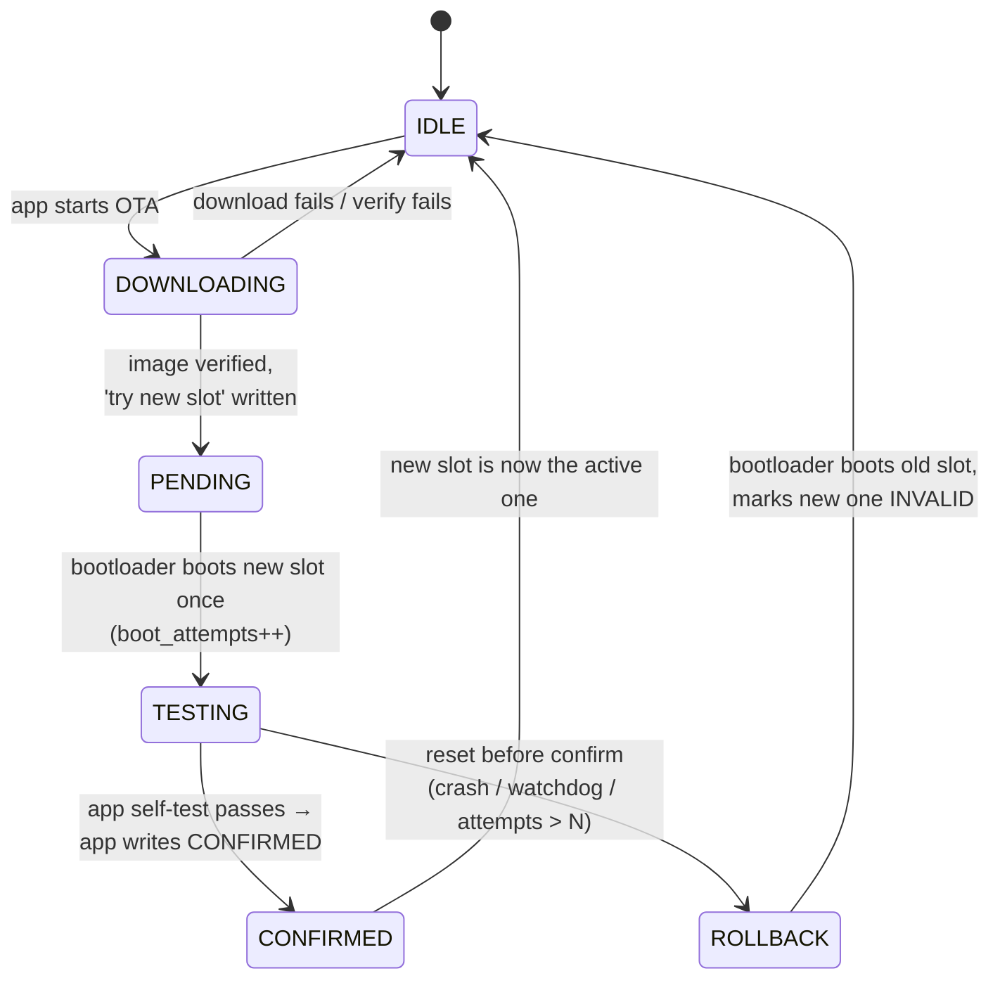

#### Sequence for a successful update and a failed one

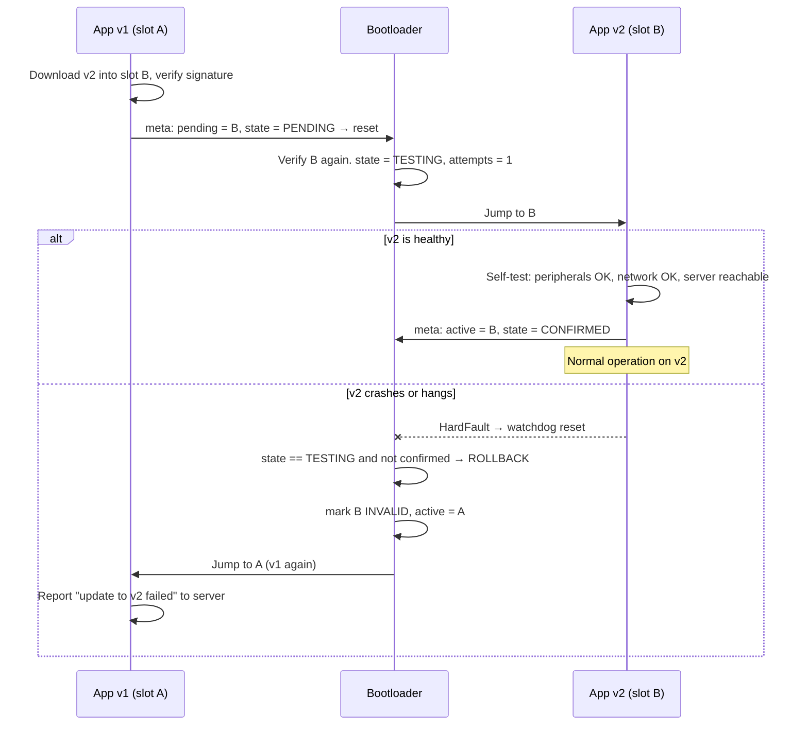

#### What should the self-test check?

The new app should confirm only after proving **it can get the next update**:

- It booted and ran for some time (e.g. 30-60 s) without resetting.
- Critical peripherals initialised (sensors, radio).
- **Network is up and the update server is reachable.** This is what catches failure #5.
- RTOS tasks are alive (watchdog refreshed by a supervisor task).

In ESP-IDF this is `esp_ota_mark_app_valid_cancel_rollback()`. In MCUboot/Zephyr it's `boot_write_img_confirmed()`.

#### The watchdog is part of the design

A hung app never resets on its own, and a hung app never confirms. **Enable the independent watchdog in the bootloader, before jumping**, so a hang in the new app always causes a reset, and the reset leads to rollback.

#### The boot counter

```c
/* In the bootloader */
boot_meta_t m = *meta_load();
if (m.state == STATE_TESTING) {
    if (m.boot_attempts >= MAX_ATTEMPTS) {          /* e.g. 3 */
        m.state       = STATE_IDLE;
        m.active_slot = !m.active_slot;             /* back to the old image */
        mark_slot_invalid(!m.active_slot);
    } else {
        m.boot_attempts++;
    }
    meta_store(&m);
}
jump_to_slot(m.active_slot);
```

---

### Step 9: Power-loss analysis (do this for every design)

Interviewers love: "What if power fails *here*?" Walk through every step of an A/B update:

| Power lost during… | State in flash | What the bootloader does on next boot | Result |
| --- | --- | --- | --- |
| Download into B | A valid, B partial, meta says active = A | Boots A | App re-downloads ✅ |
| Writing the "pending" meta record | Old meta copy still valid | Boots A | App retries ✅ |
| First boot of B (TESTING) | meta = TESTING, attempts = 1 | Tries B again (attempt 2) | ✅ |
| B crash loop | attempts reaches max | Rolls back to A | ✅ |
| Writing "confirmed" | New meta copy CRC bad → older copy (TESTING) used | Tries B again; B confirms again | ✅ |
| Copy step (overwrite design) | Source intact, dest partial, flag still "pending" | Restarts the copy | ✅ |

If any row says "bricked", the design isn't finished.

---

### Step 10: Updating the bootloader itself

The scariest update. Options, from safest to riskiest:

1. **Never update it.** Keep it tiny and well-tested. Most MCU products do this.
2. **Two-stage bootloader:** an immutable tiny **stage 1** (never updated) verifies and picks one of two **stage 2** slots. Stage 2 is updated like an app, A/B-style. (TF-M BL1 → BL2, ESP32 ROM → 2nd stage.)
3. **Bootloader updater app:** a special app image that rewrites the bootloader, with power-loss risk during a very short window. Keep that window as short as possible.

---

### Common mistakes

1. **Erasing the only good image before the new one is verified.**
2. **Single-copy metadata** that is erased then written.
3. **Confirming the new image immediately at startup.** It hasn't proven anything yet.
4. **No watchdog during the test boot.** A hang never rolls back.
5. **A/B with images linked for one address** (without bank swap or per-slot builds).
6. **Rolling back to an image with a known security hole.** Combine with anti-rollback (Module 9).

---

### Interview angle

**Q: "How do you make OTA updates fail-safe?"**

> "I keep a known-good image until the new one proves itself. The app downloads into the inactive slot while still running, verifies the signature, then records 'pending' in power-safe metadata (two copies with a sequence number and CRC) and resets. The bootloader verifies again and boots the new image in a test state with a boot counter and the watchdog enabled. The new app runs a self-test, including checking that it can reach the update server, and only then writes 'confirmed'. If it crashes, hangs, or never confirms, the watchdog resets, the boot counter exceeds its limit, and the bootloader rolls back to the old slot. For each step I check what happens if power fails there, and in every case one valid image remains bootable."

**Q: "A/B partitioning vs dual-bank flash?"**

> "A/B is the software idea of two image slots. Dual-bank is a hardware feature: two independently erasable flash banks, often with read-while-write and an option bit to swap which bank maps to the boot address. Dual-bank makes A/B easier: I can erase and write one bank while running from the other, and both images can be linked for the same address."

---

### Check yourself

1. Which failures does rollback handle that CRC checks can't?
2. Why can't an image linked for slot A simply run from slot B?
3. How do two metadata copies with sequence numbers survive power loss?
4. Why must the self-test include "can I reach the update server"?
5. Why enable the watchdog before jumping to a test image?

<details>
<summary>Answers</summary>

1. A correctly-built, correctly-signed image that crashes, hangs, or loses connectivity (failures #4 and #5).
2. The vector table and absolute addresses in the code point to slot A's addresses. You need per-slot builds, hardware bank remapping, MMU mapping, or position-independent code.
3. Updates always go into the older copy's sector. If power fails mid-write, that copy's CRC fails and the other, older-but-consistent copy is used.
4. A new image that boots but can never receive another update is effectively bricked in the field. Confirmation must mean "this image can be fixed later".
5. A hung app never resets and never confirms. The watchdog turns a hang into a reset, which the boot counter turns into a rollback.

</details>

---

---

## Module 9: Secure Boot

---

### The idea in one sentence

> Secure boot means **each stage cryptographically verifies the next stage before running it**, starting from code and a key that **cannot be changed** (the root of trust). Only firmware signed with **your private key** will ever run.

---

### Step 1: What are we protecting against?

Think like an attacker who has your device on their bench:

| Attack | Goal | Defence (this module) |
| --- | --- | --- |
| Flash their own firmware | Take over the device, build a botnet | **Signature verification** |
| Modify your firmware slightly | Backdoor, bypass licensing | **Signature verification** |
| Install an **older** signed version with a known bug | Exploit a fixed vulnerability | **Anti-rollback counter** |
| Read your firmware out of flash | Steal IP, find bugs, extract keys | **Encryption + readout protection** |
| Attach a debugger | Everything above | **Debug lock (JTAG/SWD disable)** |
| Glitch the power/clock during verification | Skip the "if (valid)" check | **Fault-injection hardening** |
| Swap external flash after verification | Run unverified code (TOCTOU) | **Verify what you execute** (copy to internal RAM/flash first) |

> **Integrity vs authenticity:**
> - **Integrity** = "not changed by accident" → CRC is enough.
> - **Authenticity** = "made by us, not changed by anyone" → needs a signature.
> Secure boot is about **authenticity**.

---

### Step 2: Asymmetric crypto in two minutes

Secure boot uses **public-key (asymmetric) cryptography**:

```text
      PRIVATE KEY                           PUBLIC KEY
  (kept secret, in an HSM              (safe to share, stored
   at the company, never                inside every device)
   on the device)
         │                                     │
         ▼                                     ▼
   SIGN(hash of image)  ── signature ──▶  VERIFY(hash, signature)
                                               │
                                        valid / invalid
```

- Anyone with the **public** key can **check** a signature.
- Only the holder of the **private** key can **create** one.
- So putting the public key in the device lets it check images without being able to create them. Stealing a device reveals nothing useful.

Common algorithm choices:

| Algorithm | Key / signature size | Verify speed on Cortex-M4 (software) | Used by |
| --- | --- | --- | --- |
| **ECDSA P-256** | 64 B public key / 64 B sig | ~100-200 ms | MCUboot, STM32 SBSFU, TF-M |
| **Ed25519** | 32 B / 64 B | ~50-100 ms | MCUboot, many newer designs |
| **RSA-2048 / 3072 (PSS)** | 256 / 384 B | Verify is fast (~10-50 ms), keys are large | ESP32 Secure Boot V2 (RSA-3072-PSS), NXP HAB |

---

### Step 3: Root of trust and chain of trust

The whole chain is only as strong as its **first link**. That link must be **immutable**.

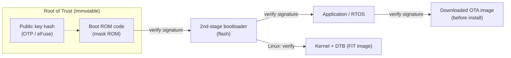

Why store the **hash** of the public key in OTP instead of the key itself? OTP/eFuse space is tiny (a few hundred bits). The full public key (64 B for ECDSA, 384 B for RSA-3072) is stored in flash next to the image. The ROM hashes it and compares with the 32-byte hash in eFuse. A swapped key won't match. ESP32 Secure Boot V2 works exactly this way.

#### No hardware root of trust?

On a simple STM32 without ROM secure boot, you make **your own bootloader** the root of trust:

1. Put the bootloader in the first sectors and **write-protect** them (WRP).
2. Set **RDP Level 2**, which permanently disables debug and ROM bootloader access. The chip can never be reprogrammed from outside.
3. Embed the public key **inside the bootloader binary**, so it's protected by the same WRP.

That's how ST's **X-CUBE-SBSFU** reference works on parts without built-in secure boot.

---

### Step 4: Signing at build time


With MCUboot's `imgtool`, this is one command:

```bash
imgtool sign --key root-ec-p256.pem \
             --header-size 0x200 --align 8 \
             --version 1.2.3 --security-counter 5 \
             --slot-size 0x60000 \
             app.bin app_signed.bin
```

> **Protect the private key like your company depends on it, because it does.** Use an HSM or a cloud KMS. If it leaks, attackers can sign firmware your devices will trust. Never commit keys to git, and don't store them on build agents.

---

### Step 5: Verification in the bootloader

```c
/* Pseudocode: real code uses mbedTLS/PSA Crypto, TinyCrypt, or micro-ecc */
bool secure_boot_verify(const image_header_t *hdr, const uint8_t *body)
{
    uint8_t digest[32];

    /* 1. Hash header + body (whatever was signed) */
    sha256_ctx ctx;
    sha256_init(&ctx);
    sha256_update(&ctx, (const uint8_t *)hdr, hdr->header_size);
    sha256_update(&ctx, body, hdr->image_size);
    sha256_final(&ctx, digest);

    /* 2. Find the public key and check it's the one we trust */
    const uint8_t *pubkey = tlv_find(hdr, TLV_PUBKEY);
    uint8_t key_hash[32];
    sha256(pubkey, 64, key_hash);
    if (!ct_memeq(key_hash, OTP_PUBKEY_HASH, 32))   /* constant-time compare */
        return false;

    /* 3. Verify the signature */
    const uint8_t *sig = tlv_find(hdr, TLV_ECDSA_SIG);
    if (!ecdsa_p256_verify(pubkey, digest, sig))
        return false;

    /* 4. Anti-rollback (Step 7) */
    if (hdr->security_counter < otp_read_security_counter())
        return false;

    return true;
}
```

> **Why constant-time compare (`ct_memeq`)?** A normal `memcmp` returns early at the first mismatch. Timing how long it takes can leak how many bytes matched. Always use constant-time comparison for secrets and hashes.

---

### Step 6: Encryption: keeping the firmware secret

A signature proves **who made it**. It doesn't hide **what's in it**. If your firmware contains valuable IP, or you don't want attackers reverse-engineering it, **encrypt** it too.

| | Signature | Encryption |
| --- | --- | --- |
| Question it answers | "Is it genuine?" | "Can others read it?" |
| Key type | Asymmetric (private sign / public verify) | Usually symmetric (AES) |
| Key in device | Public key (not secret) | **Secret** AES key (must be protected!) |

#### Two places encryption appears

**1. Encrypted OTA images (in transit and in the download slot)**


MCUboot supports this (ECIES-P256 or RSA-OAEP key wrapping + AES-CTR).

**2. Flash encryption at rest (external flash)**

ESP32 **flash encryption** transparently encrypts everything in the external SPI flash with a key in eFuse. Software can't read the key, and the flash cache decrypts on the fly. Reading the flash chip with a programmer gives only ciphertext.

> **Order of operations interviewers ask about:** most firmware schemes **sign the plaintext, then encrypt** (MCUboot, ESP32). The device decrypts, then verifies what it will actually run. For network messages, **authenticated encryption** (AES-GCM) or encrypt-then-MAC is the rule. Know that both exist and why.

#### AES in one table

| Mode | Property | Use in bootloaders |
| --- | --- | --- |
| **AES-ECB** | Same block → same ciphertext. Leaks patterns. | ❌ Never |
| **AES-CBC** | Needs an IV and padding; sequential | Older designs |
| **AES-CTR** | Stream-like, random access, no padding | ✅ Image encryption (MCUboot) |
| **AES-GCM** | CTR + authentication tag | ✅ Encrypted and authenticated transport |
| **AES-XTS** | Designed for storage (sector-based) | ✅ Flash encryption on newer ESP32 chips |

---

### Step 7: Anti-rollback: stop "downgrade attacks"

You release v1.3, which fixes a security hole in v1.2. Both are **validly signed**. Without protection, an attacker simply installs the signed v1.2 and exploits the hole.

**Fix:** a **security counter** that can only go up.

```text
   Image header: security_counter = 5
   Device OTP:   min_security_counter = 4   (stored in eFuse / OTP / monotonic counter)

   Boot rule:  image.counter >= device.min_counter  → allowed
   After the new image is CONFIRMED (Module 8): device.min_counter = image.counter  (burn fuse)
```

| Version | Security counter | After v1.3 confirmed (min = 5) |
| --- | --- | --- |
| v1.1 | 3 | ❌ Rejected |
| v1.2 | 4 | ❌ Rejected (has the vulnerability) |
| v1.3 | 5 | ✅ |
| v1.3.1 (bug fix, not security) | 5 | ✅ (no fuse burned) |

Details that matter:

- The security counter is **separate from the version number**. You only bump it for security fixes, because **eFuses are limited** (e.g. 32 or 64 increments for the lifetime of the device).
- Update the counter **only after the new image is confirmed**. Otherwise a failed update can't roll back to the previous image, because it's now "too old". This is the interaction between Module 8 and Module 9.
- ESP-IDF calls this `secure_version`. MCUboot calls it the security counter (`--security-counter`).

---

### Step 8: Lock the doors: debug and readout protection

Secure boot is pointless if an attacker can connect SWD and write whatever they want.

| Chip | Mechanism |
| --- | --- |
| STM32 (classic) | **RDP Level 1**: debug can't read flash; regressing to L0 mass-erases. **RDP Level 2**: debug is permanently disabled. |
| STM32 with TrustZone (L5, U5, H5) | TZEN, RDP levels, **product state** (H5: "Closed"/"Locked"), debug authentication |
| ESP32 | eFuses: `JTAG_DISABLE`, `DIS_DOWNLOAD_MODE` (or secure download mode), flash encryption "release" mode |
| NXP i.MX | HAB "closed" configuration via fuses; JTAG security modes |

> **Manufacturing order matters:** program the firmware → provision keys → test → **then** lock (burn fuses / set RDP2). Lock too early and you can't test. Forget to lock and secure boot is decoration.

---

### Step 9: Advanced attacks and their defences

These separate a senior answer from a junior one.

#### Fault injection (voltage/clock glitching)

An attacker glitches the supply at the exact moment of `if (verify_ok)`, so the CPU skips the branch.

```c
/* ❌ One check, one glitch away from bypass */
if (verify(img)) jump(img);

/* ✅ Hardened pattern */
volatile uint32_t ok1 = FAIL, ok2 = FAIL;
ok1 = verify(img) ? 0x5A5A5A5A : FAIL;     /* non-trivial "true" values */
random_delay();                            /* makes glitch timing harder */
ok2 = verify(img) ? 0xA5A5A5A5 : FAIL;
if (ok1 == 0x5A5A5A5A && ok2 == 0xA5A5A5A5 && (ok1 ^ ok2) == 0xFFFFFFFF) {
    jump(img);
}
fault_handler_lock_device();               /* default path = fail */
```

Real bootloaders (TF-M, MCUboot with `MCUBOOT_FIH_PROFILE`) use **fault injection hardening (FIH)** libraries for this.

#### TOCTOU (time-of-check to time-of-use)

If you verify the image in **external** flash and then execute it from **external** flash, an attacker can swap the flash contents between check and use. **Fix:** copy into internal RAM or flash, verify *that copy*, then run it. Or use flash encryption so swapped content decrypts to garbage.

#### Side channels

Power and EM analysis can leak AES keys during decryption. Use hardware crypto with side-channel countermeasures, or a secure element.

#### Key storage

Where the secret AES key or device private key lives, from weakest to strongest:

1. In the bootloader binary (readable if RDP is bypassed)
2. OTP/eFuse with read protection
3. TrustZone secure world (TF-M), where the non-secure app can't read it
4. **Secure element** (e.g. Microchip ATECC608, NXP SE050) or on-chip secure enclave: the key never leaves the chip

#### Key revocation

What if a signing key is compromised? Some chips (e.g. newer ESP32 variants, NXP HAB) allow **multiple key slots with revocation bits**: burn a fuse to stop trusting key #1 and switch to key #2. Plan for this **before** shipping. It can't be added later.

---

### Step 10: Real secure-boot flows to name-drop

| Platform | Flow |
| --- | --- |
| **ESP32 Secure Boot V2** | ROM verifies 2nd-stage bootloader (RSA-3072-PSS; SHA-256 of public key in eFuse); bootloader verifies app. Signature block in a 4 KB sector appended to each image. Pair with **flash encryption**. |
| **STM32 + X-CUBE-SBSFU** | Immutable SBSFU in WRP-protected flash + RDP2 + firewall/MPU; ECDSA-P256 verify; AES for image confidentiality |
| **STM32 with TrustZone (L5/U5/H5)** | TF-M: BL2 (MCUboot-based) verifies secure and non-secure images; ST's STiRoT/OEMiRoT on H5 |
| **nRF / Zephyr** | NSIB (immutable) → MCUboot → app, ECDSA/Ed25519 |
| **NXP i.MX** | HAB/AHAB in ROM verifies U-Boot using a fused SRK hash → U-Boot verifies FIT image (kernel + DTB) |
| **Linux (general)** | U-Boot **verified boot** with signed FIT images; kernel dm-verity for the rootfs (Module 11) |

---

### Common mistakes

1. **Calling CRC "secure boot".**
2. **Private key on the build server / in git.**
3. **Forgetting to lock debug**, so secure boot is bypassed with a debugger.
4. **Burning the anti-rollback fuse before the new image is confirmed**, so the device can't roll back.
5. **Verifying external flash, then executing from it** (TOCTOU).
6. **Single-check `if` on the verify result** in high-security products (glitch attacks).
7. **No key-revocation plan.**

---

### Interview angle

**Q: "Explain secure boot."**

> "Secure boot builds a chain of trust from an immutable root: boot ROM code plus a public key hash in OTP. Each stage hashes the next stage, checks its public key against the trusted hash, and verifies an ECDSA or RSA signature over the image and its header before jumping to it. The private key stays in an HSM and never touches the device. I add an anti-rollback security counter in OTP, updated only after the new image is confirmed, so old vulnerable but signed images are rejected. And I lock debug and readout protection in production, otherwise the chain can be bypassed with a debugger. If confidentiality matters, images are also encrypted with AES and flash encryption is enabled."

**Q: "Is SHA-256 enough for secure OTA?"**

> "No. SHA-256 proves integrity only if the expected hash comes from a trusted source. An attacker who can replace the image can replace a hash stored next to it. You need a signature, or an authenticated channel that delivers the hash. For defence in depth, you verify the signature in the device regardless of TLS."

**Q: "Signing vs encryption?"**

> "Signing gives authenticity and integrity, and uses asymmetric keys, so the device only holds a public key. Encryption gives confidentiality, usually with AES, so the device holds a secret key that must be protected. They solve different problems; production OTA usually uses both."

---

### Check yourself

1. What makes something a root of trust?
2. Why store only the *hash* of the public key in eFuse?
3. Why is the security counter separate from the version number?
4. When should the anti-rollback counter be updated, and why then?
5. What is a TOCTOU attack in the context of secure boot?
6. Name two defences against fault injection.

<details>
<summary>Answers</summary>

1. It's trusted without verification, so it must be **immutable** (ROM code, OTP keys) or protected so strongly it effectively is (WRP + RDP2 bootloader).
2. eFuse space is tiny. The 32-byte hash is enough to check a full key stored next to the image.
3. Fuses are limited, so you only increment on security fixes, not on every release.
4. After the new image is confirmed healthy. Burning it earlier blocks rollback to the previous image if the new one fails.
5. The image is verified, then modified (e.g. external flash swapped) before it's executed. Fix: verify what you execute (copy to internal memory first) or use flash encryption.
6. Redundant checks with non-trivial true/false values, random delays, default-fail control flow, and hardware glitch detectors.

</details>

---

---

## Module 10: Real-World Bootloaders: STM32, ESP32, MCUboot

---

### The idea in one sentence

> Every concept from Modules 1-9 appears in real products. **STM32's ROM bootloader** is a fixed recovery tool, **ESP32** is ROM → 2nd-stage → app with a partition table and OTA slots, and **MCUboot** is the open-source secure A/B/swap bootloader used across Zephyr, nRF, and TF-M.

Being able to say "in ESP-IDF this is called X" makes your answers concrete.

---

### Part A: The STM32 System Memory (ROM) Bootloader

#### Step 1: What it is

Every STM32 has a bootloader burned into **system memory** (ROM) by ST. It's documented in **AN2606** (which pins/peripherals per part) and the protocol notes **AN3155** (USART), **AN3156** (USB DFU), **AN4221** (I2C), **AN4286** (SPI), **AN3154** (CAN).

You'll use it for **factory programming** and **last-resort recovery**. It can't be bricked because it's in ROM.

#### Step 2: How to enter it

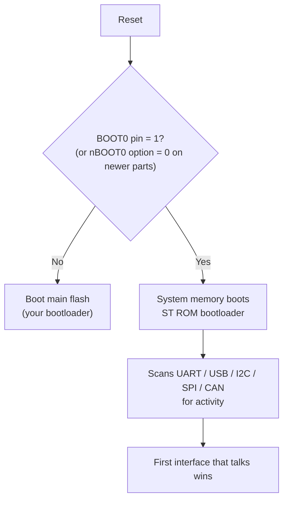

Some parts also enter it automatically when the main flash is **empty** (first word = 0xFFFFFFFF). See the "empty check" pattern in AN2606.

#### Step 3: The USART protocol (AN3155) in short

1. Host sends **0x7F**. The ROM measures it to **auto-detect the baud rate** and replies ACK.
2. Every command is sent as **command byte + its complement** (e.g. `0x31 0xCE`), a simple check.
3. Replies: **ACK = 0x79**, **NACK = 0x1F**.
4. UART framing is **8 data bits, even parity, 1 stop bit** (8E1). A common mistake is using 8N1.

| Command | Code | Purpose |
| --- | --- | --- |
| Get | 0x00 | Bootloader version + list of supported commands |
| Get Version | 0x01 | Version + option bytes |
| Get ID | 0x02 | Chip product ID |
| Read Memory | 0x11 | Read up to 256 bytes |
| Go | 0x21 | Jump to an address |
| Write Memory | 0x31 | Write up to 256 bytes |
| Erase | 0x43 | Erase pages (older parts) |
| Extended Erase | 0x44 | Erase with 2-byte page numbers (newer parts) |
| Write Protect / Unprotect | 0x63 / 0x73 | Change WRP |
| Readout Protect / Unprotect | 0x82 / 0x92 | Change RDP (unprotect mass-erases) |

A Write Memory exchange:

```mermaid
sequenceDiagram
    participant H as Host
    participant R as STM32 ROM
    H->>R: 0x7F (sync, baud detect)
    R-->>H: 0x79 ACK
    H->>R: 0x31 0xCE (Write Memory + complement)
    R-->>H: ACK
    H->>R: address (4 bytes, MSB first) + XOR checksum
    R-->>H: ACK
    H->>R: N-1, N data bytes, XOR checksum
    R-->>H: ACK (after programming)
```

Tools: **STM32CubeProgrammer**, open-source **stm32flash**.

#### Step 4: Jumping to the ROM bootloader from your app

A common interview and real-world task: "Enter the ST bootloader without touching BOOT0."

```c
/* STM32F4: system memory starts at 0x1FFF0000 (check AN2606 for your part) */
#define SYSMEM_ADDR  0x1FFF0000u

void jump_to_system_bootloader(void)
{
    HAL_RCC_DeInit();                        /* ROM expects default clocks */
    HAL_DeInit();
    __disable_irq();
    SysTick->CTRL = 0;
    for (int i = 0; i < 8; i++) { NVIC->ICER[i] = ~0u; NVIC->ICPR[i] = ~0u; }

    __HAL_RCC_SYSCFG_CLK_ENABLE();
    __HAL_SYSCFG_REMAPMEMORY_SYSTEMFLASH();  /* map system memory at 0x0 */

    __set_MSP(*(volatile uint32_t *)SYSMEM_ADDR);
    __enable_irq();
    ((void (*)(void))(*(volatile uint32_t *)(SYSMEM_ADDR + 4)))();
}
```

It's the same jump pattern as Module 4, just a different target. The robust way is again **magic word + reset + jump before any init**.

---

### Part B: The ESP32 Boot Flow

#### Step 5: Three stages

Source: [ESP-IDF application startup flow](https://docs.espressif.com/projects/esp-idf/en/stable/esp32/api-guides/startup.html)

```mermaid
flowchart LR
    A["1st stage:<br/>ROM bootloader<br/>(in chip)"] -->|"loads from flash<br/>offset 0x1000 (ESP32)<br/>0x0 (S3/C3/C6)"| B["2nd stage:<br/>ESP-IDF bootloader<br/>(in flash)"]
    B -->|"reads partition table @ 0x8000<br/>+ otadata"| C["Selects app partition<br/>factory / ota_0 / ota_1"]
    C -->|"verifies, maps via MMU,<br/>loads IRAM/DRAM segments"| D["Application<br/>call_start_cpu0 → app_main()"]
```

| Stage | What it does |
| --- | --- |
| **ROM** | Checks strapping pins (GPIO0 low → **download mode** for `esptool.py`). Otherwise loads the 2nd-stage bootloader into RAM. With Secure Boot V2, verifies its RSA signature. |
| **2nd-stage bootloader** | Reads the **partition table**, reads **otadata** to choose the app slot, validates the image (checksum/SHA-256, signature if secure boot), handles rollback, sets up the **flash MMU** so the app's code appears at its linked virtual address. |
| **App startup** | Starts both cores, starts FreeRTOS, calls `app_main()`. |

#### Step 6: The partition table

A typical OTA-capable table (`partitions.csv`):

```csv
# Name,   Type, SubType, Offset,   Size,  Flags
nvs,      data, nvs,     0x9000,   0x4000,
otadata,  data, ota,     0xd000,   0x2000,
phy_init, data, phy,     0xf000,   0x1000,
factory,  app,  factory, 0x10000,  1M,
ota_0,    app,  ota_0,   ,         1M,
ota_1,    app,  ota_1,   ,         1M,
```

```text
0x0000_1000  2nd-stage bootloader
0x0000_8000  Partition table
0x0000_9000  nvs        (Wi-Fi creds, settings)
0x0000_D000  otadata    (2 sectors: which OTA slot boots, and its state)
0x0001_0000  factory    (optional golden image)
0x0011_0000  ota_0      (slot A)
0x0021_0000  ota_1      (slot B)
```

**otadata** is the Module 8 technique in practice: **two sectors, each with a sequence number and CRC.** The newest valid one decides which slot boots.

#### Step 7: ESP32 OTA API and rollback states

```c
/* In the application: download and install an update */
const esp_partition_t *next = esp_ota_get_next_update_partition(NULL);
esp_ota_handle_t h;
ESP_ERROR_CHECK(esp_ota_begin(next, OTA_SIZE_UNKNOWN, &h));  /* erases slot */
while ((n = http_read(buf, sizeof buf)) > 0) {
    ESP_ERROR_CHECK(esp_ota_write(h, buf, n));
}
ESP_ERROR_CHECK(esp_ota_end(h));                   /* validates image */
ESP_ERROR_CHECK(esp_ota_set_boot_partition(next)); /* updates otadata */
esp_restart();
```

(ESP-IDF also has `esp_https_ota()`, which does all of this in one call over HTTPS.)

With `CONFIG_BOOTLOADER_APP_ROLLBACK_ENABLE`:

```mermaid
stateDiagram-v2
    [*] --> NEW: esp_ota_set_boot_partition()
    NEW --> PENDING_VERIFY: bootloader boots it once
    PENDING_VERIFY --> VALID: app calls<br/>esp_ota_mark_app_valid_cancel_rollback()
    PENDING_VERIFY --> INVALID: app calls<br/>esp_ota_mark_app_invalid_rollback_and_reboot()
    PENDING_VERIFY --> ABORTED: reset before confirming<br/>(bootloader rolls back)
    VALID --> [*]
```

```c
/* In app_main() of the NEW firmware */
esp_ota_img_states_t state;
const esp_partition_t *running = esp_ota_get_running_partition();
if (esp_ota_get_state_partition(running, &state) == ESP_OK &&
    state == ESP_OTA_IMG_PENDING_VERIFY) {
    if (run_diagnostics()) {                          /* Wi-Fi up, server reachable */
        esp_ota_mark_app_valid_cancel_rollback();
    } else {
        esp_ota_mark_app_invalid_rollback_and_reboot();
    }
}
```

Anti-rollback: set `CONFIG_BOOTLOADER_APP_ANTI_ROLLBACK` and the app's `secure_version`. It's compared against an eFuse counter.

---

### Part C: MCUboot

#### Step 8: What MCUboot is

An open-source, **secure bootloader for 32-bit MCUs**, independent of OS and hardware. It's the default bootloader for **Zephyr**, is used by **Nordic nRF Connect SDK**, **TF-M** (as BL2), Mynewt, RIOT, and more. It gives you:

- Signature verification (ECDSA P-256/P-384, Ed25519, RSA)
- Optional image encryption (AES-CTR with ECIES/RSA-OAEP key wrapping)
- All the update strategies from Module 8: overwrite, swap-scratch, swap-move, swap-offset, direct-XIP, RAM-load
- Test/confirm/revert logic and a security counter

#### Step 9: MCUboot image format

```text
┌───────────────────────────────┐ slot start
│ Header (usually 0x200 bytes)  │ magic 0x96f3b83d, load addr, hdr size,
│                               │ protected TLV size, image size, flags, version
├───────────────────────────────┤
│ Image (vector table + code)   │
├───────────────────────────────┤
│ Protected TLVs                │ covered by the signature (e.g. security counter)
│ Unprotected TLVs              │ SHA-256 hash, signature, key hash
├───────────────────────────────┤
│        ... free ...           │
├───────────────────────────────┤
│ Trailer (end of slot)         │ swap status, swap info, copy_done,
│                               │ image_ok, magic
└───────────────────────────────┘ slot end
```

#### Step 10: Test, confirm, revert

Source: [MCUboot design](https://docs.mcuboot.com/design.html)

| Flags in trailer | Meaning | Next boot |
| --- | --- | --- |
| New image written to secondary, `boot_request_upgrade(TEST)` | Test upgrade requested | Swap into primary; run once |
| `copy_done = 0x01`, `image_ok = 0xFF` | Running the test image, not confirmed | If still unconfirmed at next reset → **revert** (swap back) |
| `copy_done = 0x01`, `image_ok = 0x01` | App called `boot_write_img_confirmed()` | Permanent; no revert |

In Zephyr you manage this over SMP with `mcumgr`:

```bash
mcumgr --conn serial image upload app_signed.bin   # to secondary slot
mcumgr --conn serial image list                     # get hash
mcumgr --conn serial image test <hash>              # mark for test boot
mcumgr --conn serial reset
# new image runs; it (or you) confirms:
mcumgr --conn serial image confirm
```

---

### Step 11: Side-by-side

| Concept (Module) | Custom bootloader | ESP32 / ESP-IDF | MCUboot / Zephyr |
| --- | --- | --- | --- |
| Entry / recovery (6) | Button, RAM magic | GPIO0 strap → ROM download mode | Button / serial recovery mode |
| Image header (3, 7) | Your struct | `esp_image_header_t` | 0x96f3b83d header + TLVs |
| Slots (8) | A/B or download | factory, ota_0, ota_1 | primary, secondary (+ scratch) |
| Boot state (8) | Two metadata copies | `otadata` (2 sectors, seq numbers) | Image trailer (copy_done, image_ok) |
| Confirm (8) | Write "confirmed" | `esp_ota_mark_app_valid_cancel_rollback()` | `boot_write_img_confirmed()` |
| Signature (9) | Your ECDSA code | Secure Boot V2 (RSA-3072-PSS) | ECDSA / Ed25519 / RSA |
| Anti-rollback (9) | OTP counter | `secure_version` + eFuse | Security counter TLV |
| Encryption (9) | AES | Flash encryption (eFuse key) | AES-CTR encrypted images |

---

### Common mistakes

1. **STM32 ROM via UART with 8N1.** It needs **8E1** (even parity).
2. **Jumping into STM32 system memory without remapping or clock reset.** The ROM misbehaves.
3. **ESP32: never calling `esp_ota_mark_app_valid_cancel_rollback()`** with rollback enabled. Every reboot rolls back.
4. **MCUboot: forgetting to confirm** the test image. It reverts on the next reset.
5. **MCUboot: slot sizes not matching** the flash sector layout, or the image too big for `slot_size - trailer_size`.

---

### Interview angle

**Q: "How does the ESP32 boot?"**

> "The ROM bootloader in the chip checks strapping pins. GPIO0 low enters download mode for esptool. Otherwise it loads the second-stage bootloader from flash, at 0x1000 on the original ESP32, and verifies it if Secure Boot V2 is on. The second-stage bootloader reads the partition table at 0x8000 and the otadata partition to pick factory, ota_0, or ota_1, verifies the app, handles rollback states, maps the app into the address space with the flash MMU, and jumps to it. The app starts FreeRTOS and calls `app_main`."

**Q: "Have you used MCUboot? How does it do updates?"**

> "MCUboot keeps a primary and a secondary slot. The app downloads a signed image into the secondary and requests a test upgrade. At reboot MCUboot verifies the signature and, in swap mode, swaps the slots sector by sector, recording progress in the trailer so it can resume after power loss. The new image must call `boot_write_img_confirmed()`. If it doesn't before the next reset, MCUboot swaps back."

---

### Check yourself

1. What byte starts communication with the STM32 USART ROM bootloader, and why?
2. What UART framing does it use?
3. Where does ESP32's second-stage bootloader find which app slot to boot?
4. What is the ESP32 state of a new image that has booted once but not confirmed?
5. In MCUboot, what does `image_ok = 0xFF` after a swap mean?

<details>
<summary>Answers</summary>

1. `0x7F`. The ROM uses it to auto-detect the baud rate, then ACKs with `0x79`.
2. 8 data bits, even parity, 1 stop bit (8E1).
3. The `otadata` partition (two sectors with sequence numbers). The partition table (at 0x8000) says where `otadata` and the app slots are.
4. `ESP_OTA_IMG_PENDING_VERIFY`. If it resets without confirming, it becomes `ABORTED` and the bootloader rolls back.
5. The image hasn't been confirmed yet. If the device resets in this state, MCUboot reverts to the previous image.

</details>

---

---

## Module 11: Linux Boot Flow and U-Boot

---

### The idea in one sentence

> An embedded Linux board boots in **stages that grow the available memory step by step**: **Boot ROM** (tiny SRAM) → **SPL** (initialises DRAM) → **U-Boot** (loads kernel + device tree + optional initramfs into DRAM) → **Linux kernel** (mounts rootfs) → **init** (systemd / BusyBox) → your application.

---

### Step 1: Why so many stages?

The core problem: **at reset, DRAM doesn't work yet.** DRAM needs a controller configured with exact timings for that board's memory chips. Until then, the only RAM is a small on-chip SRAM (often 64-256 KB).

A full U-Boot is ~500 KB-1 MB. It doesn't fit in SRAM. So:

```text
Stage        Runs from          Size         Main job
───────────────────────────────────────────────────────────────────────────
Boot ROM     On-chip ROM        fixed        Find a boot device; load SPL into SRAM
SPL          On-chip SRAM       ~30-100 KB   Init clocks + DRAM; load U-Boot into DRAM
U-Boot       DRAM               ~0.5-1 MB    Drivers, env, scripts; load kernel + DTB
Linux        DRAM               MBs          Everything else
```

**SPL** = "Secondary Program Loader", a cut-down build of U-Boot itself. Some SoCs add a **TPL** (Tertiary Program Loader) before SPL when SRAM is *extremely* small. On 64-bit Arm there's also **TF-A** (Trusted Firmware-A: BL1/BL2/BL31) and sometimes **OP-TEE** in the chain.

---

### Step 2: The full picture

```mermaid
flowchart TD
    R["Power on"] --> ROM["Boot ROM<br/>reads boot-mode pins / fuses<br/>(eMMC, SD, SPI-NOR, NAND, USB, UART)"]
    ROM --> SPL["SPL in SRAM<br/>clocks, PMIC, DRAM init"]
    SPL --> TFA["(ARM64) TF-A BL31 + OP-TEE<br/>secure monitor, secure world"]
    SPL --> UB["U-Boot proper in DRAM"]
    TFA --> UB
    UB --> ENV["Read environment<br/>bootcmd, bootargs"]
    ENV --> LOAD["Load into DRAM:<br/>kernel (zImage / Image)<br/>device tree (.dtb)<br/>initramfs (optional)"]
    LOAD --> JUMP["bootz / booti / bootm<br/>pass DTB address to kernel"]
    JUMP --> K["Linux kernel:<br/>decompress, early init, parse DTB,<br/>probe drivers"]
    K --> RFS["Mount rootfs<br/>(root= from bootargs)"]
    RFS --> INIT["Run /sbin/init<br/>systemd / BusyBox init"]
    INIT --> APP["Services + your application"]
```

#### Example: BeagleBone Black (TI AM335x) from SD card

1. **ROM** reads SYSBOOT pins, finds the SD card, loads `MLO` (that's SPL) into 64 KB internal SRAM.
2. **MLO/SPL** configures DDR3, loads `u-boot.img` into DDR.
3. **U-Boot** reads `uEnv.txt` / `extlinux.conf`, loads `zImage` and `am335x-boneblack.dtb` from the ext4 partition.
4. **Kernel** starts, mounts `/dev/mmcblk0p2` as rootfs, runs `systemd`.

#### Example: Raspberry Pi (different)

On older Pis the **GPU** boots first: `bootcode.bin` → `start.elf` (GPU firmware) reads `config.txt` → loads `kernel.img` and the DTB → releases the ARM cores. On Pi 4/5, the boot ROM loads from an **SPI EEPROM** instead of `bootcode.bin`. No U-Boot by default (though you can add it). Interviewers like this as a contrast.

---

### Step 3: U-Boot: what it does for you

U-Boot is like a mini operating system with a shell. Its jobs:

- Initialise just enough hardware: serial console, storage (MMC/NAND/SPI), Ethernet, USB
- Store configuration in an **environment** (in flash, eMMC, or a file)
- Load images from **anywhere**: SD/eMMC, NAND, SPI-NOR, USB, TFTP over Ethernet
- **Verify** images (signed FIT images, Step 7)
- Pass the **device tree** and **kernel command line** to Linux
- Provide a **recovery / update** path (DFU, fastboot, UMS, TFTP)

#### The U-Boot shell

Interrupt autoboot (press a key during the countdown) and you get a prompt:

```text
U-Boot 2024.01 (Jan 10 2024)
DRAM:  512 MiB
MMC:   OMAP SD/MMC: 0, OMAP SD/MMC: 1
Hit any key to stop autoboot:  0
=>
```

| Command | What it does |
| --- | --- |
| `printenv` / `setenv` / `saveenv` | Show / change / persist environment variables |
| `mmc list`, `mmc dev 0`, `ls mmc 0:1` | List MMC devices, pick one, list files |
| `load mmc 0:1 ${loadaddr} zImage` | Load a file from partition 1 into DRAM |
| `tftp ${loadaddr} zImage` | Load over the network from a TFTP server |
| `sf probe; sf read` | Read SPI-NOR flash |
| `nand read` | Read raw NAND |
| `fdt addr ${fdt_addr}; fdt print /chosen` | Inspect or modify the loaded device tree |
| `bootz` | Boot a 32-bit Arm `zImage` |
| `booti` | Boot a 64-bit Arm `Image` |
| `bootm` | Boot a legacy uImage or a **FIT image** |
| `md 0x80000000 20` | Memory display (debugging) |
| `run <var>` | Run the commands stored in an env variable (scripts) |

#### The two most important variables

```bash
# What U-Boot does automatically after the countdown
bootcmd=load mmc 0:1 ${kernel_addr_r} zImage; \
        load mmc 0:1 ${fdt_addr_r} am335x-boneblack.dtb; \
        bootz ${kernel_addr_r} - ${fdt_addr_r}

# The Linux kernel command line
bootargs=console=ttyS0,115200n8 root=/dev/mmcblk0p2 rootfstype=ext4 rootwait rw
```

In `bootz A B C`: A = kernel address, B = initramfs address (`-` = none), C = device tree address.

| `bootargs` part | Meaning |
| --- | --- |
| `console=ttyS0,115200n8` | Where kernel messages go |
| `root=/dev/mmcblk0p2` | Which block device is the root filesystem |
| `rootwait` | Wait for the (slow) SD/eMMC to appear before mounting |
| `rw` / `ro` | Mount root read-write or read-only |
| `init=/bin/sh` | Debug trick: skip init and get a shell |
| `earlycon` | Print messages even before the serial driver probes (debugging hangs) |

Modern U-Boot also supports **standard boot / distro boot**: it scans boot devices for `extlinux/extlinux.conf` or a boot script, so you don't hard-code `bootcmd`.

---

### Step 4: The handoff to the kernel (the "jump" for Linux)

Compare with the MCU jump from Module 4:

| MCU (Module 4) | Linux on Arm |
| --- | --- |
| Set VTOR, MSP | Kernel sets up its own vectors and stacks |
| Branch to Reset_Handler | Branch to kernel entry point |
| Nothing passed | **Registers pass the device tree address** |
| – | MMU **off**, D-cache off (or clean), interrupts disabled |

The Arm boot protocol:

```text
32-bit Arm (bootz):   r0 = 0
                      r1 = machine type (ignored with DT)
                      r2 = physical address of the device tree blob
64-bit Arm (booti):   x0 = physical address of the device tree blob
                      x1 = x2 = x3 = 0
```

Then the kernel decompresses itself (zImage), sets up the MMU, parses the DT to learn what hardware exists, probes drivers, mounts root, and runs `/sbin/init`.

> **Device tree** = a data structure describing the hardware (memory, peripherals, pins, interrupts). The *same* kernel binary can run on many boards; only the `.dtb` changes. U-Boot also edits the DT before handing it over ("fixups"), e.g. memory size and MAC address.

---

### Step 5: Where things live on storage

A typical eMMC/SD layout:

```text
┌────────────┬──────────────┬─────────────────────┬───────────────────────┐
│ Raw area   │ Boot (FAT)   │ rootfs A (ext4)     │ rootfs B (ext4)       │
│ SPL,       │ zImage, dtb, │ /                   │ / (for A/B updates)   │
│ U-Boot,    │ boot.scr     │                     │                       │
│ U-Boot env │              │                     │                       │
└────────────┴──────────────┴─────────────────────┴───────────────────────┘
               + data partition (/data) that survives updates
```

eMMC also has dedicated **boot0/boot1 hardware partitions**, which are good for SPL/U-Boot and can be write-protected.

---

### Step 6: Fail-safe updates on Linux (Module 8, Linux edition)

Same ideas, bigger scale. Common tools: **SWUpdate**, **RAUC**, **Mender**, **OSTree**, Android A/B.

```mermaid
sequenceDiagram
    participant OS as Linux (rootfs A)
    participant UB as U-Boot
    participant NEW as Linux (rootfs B)

    OS->>OS: Download update, write rootfs B, verify signature
    OS->>UB: fw_setenv boot_slot=B, upgrade_available=1, bootcount=0
    OS->>OS: reboot
    UB->>UB: bootcount++ (bootcount > bootlimit? → run altbootcmd)
    UB->>NEW: boot with root=/dev/mmcblk0p3
    alt healthy
        NEW->>UB: fw_setenv upgrade_available=0, bootcount=0 (confirm)
    else crash / hang → watchdog reset
        UB->>UB: bootcount exceeds bootlimit → altbootcmd
        UB->>OS: boot rootfs A again (rollback)
    end
```

U-Boot features used here:

| Feature | Role |
| --- | --- |
| `bootcount` / `bootlimit` | Counts boots since the last "confirmed". Exceeding the limit runs `altbootcmd`. |
| `altbootcmd` | Alternate boot command, i.e. the rollback path |
| `upgrade_available` | Only count boots while an upgrade is being tested |
| `fw_setenv` / `fw_printenv` | Linux user-space tools to edit U-Boot's environment |
| **Redundant environment** | Two env copies (like Module 8's two metadata copies), so a power loss while saving never corrupts it |

---

### Step 7: Secure boot on Linux

The chain of trust (Module 9) extends all the way:

```mermaid
flowchart LR
    ROM["Boot ROM<br/>+ fused key hash"] -->|"HAB / AHAB / TI / Rockchip<br/>secure boot"| SPL["SPL / U-Boot"]
    SPL -->|"FIT signature<br/>(RSA/ECDSA)"| K["Kernel + DTB<br/>+ initramfs"]
    K -->|"dm-verity root hash<br/>(in signed cmdline / initramfs)"| R["Read-only rootfs"]
    R -->|"IMA / signed packages"| A["Applications"]
```

- **FIT image** (Flattened Image Tree) packs kernel + DTB(s) + initramfs + hashes + **signatures** into one file. U-Boot verifies it with a public key embedded in **U-Boot's own control device tree**. Enabled with `CONFIG_FIT_SIGNATURE`.
- **dm-verity** protects the root filesystem: a hash tree over each block, checked on read. Any change → I/O error.
- **Lock the U-Boot shell** in production (`bootdelay=-2` or `CONFIG_AUTOBOOT_KEYED`). Otherwise anyone with a serial cable types `setenv bootargs init=/bin/sh` and gets root.

---

### Step 8: Useful for development: network boot

Don't reflash an SD card for every kernel build. Boot over Ethernet:

```bash
=> setenv serverip 192.168.1.10
=> setenv ipaddr   192.168.1.50
=> tftp ${kernel_addr_r} zImage
=> tftp ${fdt_addr_r}    am335x-boneblack.dtb
=> setenv bootargs console=ttyS0,115200n8 root=/dev/nfs rw \
       nfsroot=192.168.1.10:/srv/nfs/rootfs,v3 ip=dhcp
=> bootz ${kernel_addr_r} - ${fdt_addr_r}
```

The kernel comes from **TFTP** and the root filesystem from **NFS** on your PC. You edit files on the PC and they appear on the board instantly.

---

### Common mistakes

1. **Wrong load addresses.** The kernel, DTB, and initramfs overlap in DRAM, and one overwrites another. Use the board's `kernel_addr_r`, `fdt_addr_r`, `ramdisk_addr_r`.
2. **Missing `rootwait`** with SD/eMMC → "VFS: Unable to mount root fs".
3. **Wrong `console=`** → the kernel boots but you see nothing after "Starting kernel ...".
4. **DTB doesn't match the kernel/board** → drivers don't probe, or a hang early in boot.
5. **Single U-Boot environment copy** → corrupted by power loss during `saveenv`.
6. **Leaving the U-Boot shell open in production.**

---

### Interview angle

**Q: "Explain the Linux boot process on an embedded Arm board."**

> "The Boot ROM reads the boot-mode pins or fuses, finds the boot device, and loads the SPL into on-chip SRAM, because DRAM isn't initialised yet. The SPL sets up clocks, the PMIC, and DRAM, then loads U-Boot into DRAM. On ARM64 it also loads TF-A and maybe OP-TEE. U-Boot initialises storage and console, reads its environment, and runs `bootcmd`: it loads the kernel, the device tree, and optionally an initramfs into DRAM, sets `bootargs`, and jumps to the kernel with the DTB address in r2 (or x0 on ARM64), MMU and caches off. The kernel decompresses, sets up the MMU, parses the device tree, probes drivers, mounts the root filesystem given by `root=`, and runs `/sbin/init` (systemd or BusyBox), which starts services and the application."

**Q: "Why do we need SPL?"**

> "At reset only the small on-chip SRAM is usable. DRAM needs its controller configured first. Full U-Boot is too large for SRAM, so a small SPL runs from SRAM, initialises DRAM, and loads the full U-Boot into it."

**Q: "The board prints 'Starting kernel ...' and then nothing. What do you check?"**

> "First the `console=` argument and the serial port name. Then enable `earlycon` / `earlyprintk` to see whether the kernel is running at all. Then check the DTB matches the board, the load addresses don't overlap, and the kernel was built for this SoC. If early output shows a panic about mounting root, check `root=`, `rootwait`, and that the filesystem driver is built in."

---

### Check yourself

1. Why can't the Boot ROM load U-Boot directly into DRAM?
2. What are `bootcmd` and `bootargs`?
3. On 64-bit Arm, how does the kernel find the device tree?
4. What does a FIT image contain, and why is it useful for secure boot?
5. How do `bootcount`, `bootlimit`, and `altbootcmd` implement rollback?

<details>
<summary>Answers</summary>

1. DRAM isn't initialised at reset. Its controller needs board-specific timing setup, which SPL does.
2. `bootcmd` is the command script U-Boot runs automatically after the countdown. `bootargs` is the kernel command line passed to Linux.
3. U-Boot puts the DTB's physical address in register x0 before jumping to the kernel.
4. Kernel, DTB(s), initramfs, plus hashes and signatures in one file. U-Boot can verify the signatures with an embedded public key before booting.
5. U-Boot increments `bootcount` on each boot while `upgrade_available` is set. If it exceeds `bootlimit` (because the new system never confirmed and reset the counter), U-Boot runs `altbootcmd`, which boots the previous slot.

</details>

---

---

## Module 12: Debugging Bootloaders

---

### The idea in one sentence

> Most bootloader bugs happen at the **boundary**: the jump, the memory map, or leftover hardware state. Debug them by **checking the CPU state at the moment of the handover** (VTOR, MSP, PC, fault registers) and by **loading both programs' symbols** into the debugger.

Interviewers love "tell me about a hard bug you fixed". Bootloader bugs make great stories. This module gives you the toolkit and the vocabulary.

---

### Step 1: Symptom → likely cause

| Symptom | Most likely causes | First thing to check |
| --- | --- | --- |
| HardFault **immediately** after the jump | Jumped to wrong address (`APP_ADDRESS` instead of `*(APP_ADDRESS+4)`), Thumb bit clear, app not flashed (0xFFFFFFFF) | Value you branched to; memory at `APP_ADDRESS` |
| App runs, then crashes on **first interrupt** | **VTOR not set**; app's vector table not aligned | `SCB->VTOR` in debugger |
| App crashes on first `HAL_Delay()` / timeout | **SysTick** still running from bootloader, or `uwTick` handler mismatch | `SysTick->CTRL` at app entry |
| App's clock config fails (`HAL_RCC_OscConfig` error) | Bootloader left PLL as system clock | `RCC->CFGR` SWS bits |
| Random RAM corruption in the app | **DMA** still running from bootloader; MSP not updated | DMA stream enable bits; MSP |
| App works under debugger, fails standalone | Debugger resets/initialises differently; app linked for 0x0800_0000 and debugger flashes it there | Linker `ORIGIN`; `objdump -h` |
| Watchdog resets during update | Long flash erase without refresh | Erase time vs IWDG timeout |
| UART bytes lost during update | CPU stalled during flash erase | Erase-before-transfer / flow control |
| Update "succeeds" but app won't boot | CRC variant mismatch; header size/alignment wrong; last chunk not padded | Compare CRC from script vs device |
| Device stuck in bootloader forever | Magic word never cleared; "valid" flag never written; boot counter never reset | NOINIT RAM contents, metadata |
| Boot loop after OTA | New app never confirms → rollback → retry | Confirm call, rollback state |
| Linux: nothing after "Starting kernel ..." | Wrong `console=`, wrong DTB, overlapping load addresses | `earlycon`, load addresses |

---

### Step 2: Reading the fault registers (Cortex-M3/M4/M7)

When a HardFault happens, the CPU records **why** in the System Control Block. Learn these four:

| Register | Address | Tells you |
| --- | --- | --- |
| **HFSR** | 0xE000_ED2C | `FORCED` bit = a configurable fault escalated to HardFault |
| **CFSR** | 0xE000_ED28 | The real reason: split into MMFSR / BFSR / UFSR |
| **MMFAR** | 0xE000_ED34 | Faulting address for MemManage (if `MMARVALID`) |
| **BFAR** | 0xE000_ED38 | Faulting address for BusFault (if `BFARVALID`) |

The CFSR bits you'll actually see in bootloader bugs:

| CFSR bit | Name | Meaning in bootloader context |
| --- | --- | --- |
| UFSR `INVSTATE` | Invalid state | Branched to an **even address** (Thumb bit missing) |
| UFSR `UNDEFINSTR` | Undefined instruction | Executing garbage: erased flash (0xFFFF…) or data |
| BFSR `IBUSERR` | Instruction bus error | Fetched code from an invalid address |
| BFSR `PRECISERR` + BFAR | Precise data bus error | Read/wrote an invalid address, e.g. a CRC loop past end of flash |
| MMFSR `IACCVIOL` | Instruction access violation | MPU left enabled by bootloader, or executing from an XN region |

#### Get the faulting PC from the stack

On exception entry the CPU pushes 8 registers. The 7th word is the **PC at the fault**:

```c
/* Captures the stack frame that was active when the fault happened */
__attribute__((naked)) void HardFault_Handler(void)
{
    __asm volatile(
        "tst lr, #4        \n"   /* which stack was in use? */
        "ite eq            \n"
        "mrseq r0, msp     \n"
        "mrsne r0, psp     \n"
        "b hardfault_c     \n");
}

void hardfault_c(uint32_t *frame)
{
    volatile uint32_t r0  = frame[0], r1 = frame[1], r2 = frame[2], r3 = frame[3];
    volatile uint32_t r12 = frame[4];
    volatile uint32_t lr  = frame[5];   /* return address of the caller     */
    volatile uint32_t pc  = frame[6];   /* instruction that faulted         */
    volatile uint32_t psr = frame[7];
    volatile uint32_t cfsr = SCB->CFSR, hfsr = SCB->HFSR, bfar = SCB->BFAR;
    (void)r0; (void)r1; (void)r2; (void)r3; (void)r12; (void)lr; (void)psr;
    (void)cfsr; (void)hfsr; (void)bfar; (void)pc;
    __BKPT(0);                          /* stop here in the debugger */
    while (1) { }
}
```

Then map the PC to a source line:

```bash
arm-none-eabi-addr2line -e app.elf -f -C 0x08012A4C
```

> **In a bootloader,** also save the CFSR and PC into NOINIT RAM before resetting, and report them on the next boot. It's your black box recorder for field failures.

---

### Step 3: Debugging across the jump with GDB

The debugger only knows the symbols of the ELF you loaded. After the jump, it shows **garbage function names** because it's using the bootloader's symbols for app addresses. Fix: **load both**.

```bash
arm-none-eabi-gdb bootloader.elf
(gdb) target extended-remote :3333          # OpenOCD / ST-LINK GDB server
(gdb) monitor reset halt
(gdb) add-symbol-file app.elf               # newer GDB takes addresses from the ELF
(gdb) hbreak Reset_Handler                  # ambiguous: both have one!
(gdb) hbreak *0x080102A8                    # app's Reset_Handler (from word 1, minus Thumb bit)
(gdb) continue
```

Once stopped at the app's entry point, check the handover state:

```bash
(gdb) p/x *(uint32_t*)0xE000ED08            # VTOR  → should be 0x08010000
(gdb) p/x $msp                              # should equal word 0 of the app
(gdb) p/x *(uint32_t*)0xE000E010            # SysTick CTRL → should be 0
(gdb) p/x *(uint32_t*)0xE000E200            # NVIC ISPR0 → pending IRQs? should be 0
```

> **Use hardware breakpoints (`hbreak`) in flash.** Software breakpoints patch memory. In flash that either fails or, worse, the debugger rewrites flash, which is exactly what you're trying to test.

#### Other debugger tricks

| Trick | When |
| --- | --- |
| **Watchpoint** on the metadata flag (`watch g_boot_shared.magic`) | "Who cleared my magic word?" |
| **Vector catch** (`monitor cortex_m vector_catch all` in OpenOCD) | Stop at the *first* fault, before your handler runs |
| **Attach without reset** (connect under "hot plug") | Inspect a device stuck in the field state without disturbing it |
| **SWO / ITM trace** or **RTT** | Print debug logs with minimal timing impact |
| **Dump flash** (`dump binary memory app.bin 0x08010000 0x08080000`) | Compare what's in flash against the file you sent |

---

### Step 4: Make the bootloader observable

A bootloader with no output is a black box. Add cheap visibility:

```c
/* 1. Why did we reset? (STM32F4: RCC->CSR) */
uint32_t csr = RCC->CSR;
const char *reason =
    (csr & RCC_CSR_IWDGRSTF) ? "IWDG"   :
    (csr & RCC_CSR_WWDGRSTF) ? "WWDG"   :
    (csr & RCC_CSR_SFTRSTF)  ? "SW"     :
    (csr & RCC_CSR_PORRSTF)  ? "POR"    :
    (csr & RCC_CSR_BORRSTF)  ? "BOR"    :
    (csr & RCC_CSR_PINRSTF)  ? "PIN"    : "?";
RCC->CSR |= RCC_CSR_RMVF;      /* clear flags for next time */

/* 2. A single line on UART per boot */
printf("BL v1.3 reset=%s slot=%c state=%d app=%s\r\n",
       reason, meta->active_slot ? 'B' : 'A', meta->state, img_status_str(st));
```

Also useful:

- **LED blink codes** when there's no UART (e.g. 2 blinks = CRC fail, 3 = signature fail).
- **A `GET_INFO` / `GET_LOG` command** in the update protocol (Module 6).
- **Pass the reset reason to the app** via NOINIT RAM, because the bootloader has already cleared `RCC->CSR`.

---

### Step 5: Testing a bootloader properly

A bootloader bug in the field can brick devices, so test more than usual.

| Test | How |
| --- | --- |
| **Power-cut test** | Relay or programmable supply cuts power at random points during update. Run it **hundreds of times**. Device must always boot something valid. |
| **Corrupted image** | Flip random bits in the image, truncate it, send wrong size. Must be rejected. |
| **Wrong signature / wrong key** | Sign with another key. Must be rejected. |
| **Downgrade** | Send an older image with a lower security counter. Must be rejected. |
| **Crashing new image** | Build an app that HardFaults or hangs on purpose. Must roll back. |
| **Protocol fuzzing** | Random bytes, oversized length fields, duplicate / out-of-order packets |
| **Host unit tests** | Compile protocol parser, metadata logic, and CRC for the PC with a fake flash (RAM array). Test thousands of scenarios in seconds. |
| **Every slot, every direction** | A→B, B→A, factory → OTA, OTA → OTA, rollback from both sides |

> **Fake flash for unit tests:** implement `flash_erase()` and `flash_write()` over a RAM array that enforces the real rules (writes only clear bits, erase = 0xFF, write-once on ECC). Then inject a "power cut" by stopping after N operations and restarting the bootloader logic. This finds power-loss bugs before hardware does.

---

### Step 6: A real-style debugging story (practise telling it)

Use the **STAR** format (Situation, Task, Action, Result). The story below is an **example of the shape**. In an interview, tell a story from your own projects, since interviewers dig into details.

> **Situation:** After adding a USB CDC update path to our STM32F4 bootloader, about 1 in 20 boots into the app crashed within a second.
>
> **Task:** Find out why only some boots failed.
>
> **Action:** I caught the fault with vector catch and read CFSR: a precise BusFault. The faulting PC was inside the app's USB interrupt handler, but the app hadn't initialised USB yet. The NVIC showed the OTG_FS IRQ pending. The bootloader de-initialised the UART but not USB, and the host's enumeration traffic set a pending interrupt. When the app enabled interrupts globally, that stale IRQ fired into an uninitialised handler.
>
> **Result:** I switched to the "magic word + system reset + jump before init" pattern, so every peripheral is at reset state, and added NVIC clear-pending as a second layer. We ran a 1,000-boot test with zero failures, and I added that test to CI on the hardware rig.

---

### Common mistakes

1. **Debugging with only the bootloader's symbols loaded.**
2. **Software breakpoints in flash.**
3. **Not recording the reset reason and fault info.**
4. **Only testing the happy path.** No power-cut or corruption tests.
5. **Assuming the debugger's reset behaves like a real power-on.** It may skip BOOT pin sampling or leave peripherals initialised.

---

### Interview angle

**Q: "Your app crashes right after the bootloader jumps to it. How do you debug?"**

> "I'd load both ELFs in GDB and set a hardware breakpoint at the app's `Reset_Handler`, the address from word 1 of its vector table. At that point I check VTOR equals the app base, MSP equals the app's word 0, SysTick is off, and no NVIC interrupts are pending. If it faults, I read CFSR, HFSR, and BFAR and get the stacked PC from the exception frame, then use addr2line. INVSTATE means a Thumb-bit problem, UNDEFINSTR usually means I jumped into erased flash, and a crash on the first interrupt means VTOR. I'd also check the app's linker script origin matches the slot."

---

### Check yourself

1. Which CFSR bit points to a missing Thumb bit?
2. How do you find the faulting instruction's address after a HardFault?
3. Why use `hbreak` instead of `break` when debugging code in flash?
4. How do you get GDB to show correct function names after the jump?
5. Describe a power-cut test.

<details>
<summary>Answers</summary>

1. UFSR `INVSTATE`.
2. Read the stacked PC (7th word of the exception stack frame on MSP or PSP, depending on LR bit 2), then `addr2line`.
3. Software breakpoints need to write a BKPT instruction into memory. Flash can't be written that way (or the debugger reprograms it). Hardware breakpoints use the FPB comparators instead.
4. `add-symbol-file app.elf` so GDB knows both programs' symbols.
5. Automatically cut power at random moments during updates (relay or programmable PSU), hundreds of times, and verify the device always boots a valid image afterwards.

</details>

---

---

## Module 13: Interview Drill and Cheat Sheet

---

### How to use this module

1. **Rapid-fire drill (Part A):** cover the answer, say yours out loud, then compare.
2. **The design question (Part B):** practise the full 10-15 minute answer on a whiteboard or paper.
3. **Cheat sheet (Part C):** read it the morning of the interview.

After this, drill with the [Part 2: Question Bank](#part-2-question-bank).

---

### Part A: Rapid-fire questions

Aim for **2-3 sentences** each. The module in brackets is where to re-study.

#### Fundamentals

<details>
<summary><b>1. What is a bootloader? [M1]</b></summary>

A small program that runs first after reset. It validates the application, can update it, and then transfers control to it. It exists so firmware can be updated and recovered in the field without a debugger.

</details>

<details>
<summary><b>2. Boot ROM vs bootloader? [M1]</b></summary>

The Boot ROM is written by the chip vendor, lives in mask ROM, and can't change. It does basic loading or recovery (e.g. STM32 system memory over UART/USB). Your bootloader lives in flash, is written by you, and implements your update, validation, and security policy.

</details>

<details>
<summary><b>3. What happens when a Cortex-M comes out of reset? [M2]</b></summary>

VTOR = 0. The CPU loads MSP from word 0 and PC from word 1 of the vector table (Thumb bit set). `Reset_Handler` runs `SystemInit`, copies `.data` from flash to RAM, zeroes `.bss`, runs constructors, and calls `main`.

</details>

<details>
<summary><b>4. Why is the first vector-table entry the stack pointer? [M2]</b></summary>

So there's a valid stack before any instruction runs, for `Reset_Handler`'s C code and for any exception that might happen immediately.

</details>

<details>
<summary><b>5. What is VTOR and why must it change? [M2, M4]</b></summary>

The Vector Table Offset Register tells the CPU where the vector table is. It must point at the app's table, otherwise the app's interrupts run the bootloader's handlers.

</details>

<details>
<summary><b>6. Why must the bootloader and app boundary be on a sector boundary? [M3]</b></summary>

Flash erases whole sectors. A shared sector means updating the app erases part of the bootloader.

</details>

<details>
<summary><b>7. How does the app ask the bootloader to enter update mode? [M3, M6]</b></summary>

It writes a 32-bit magic value to a `.noinit` RAM variable (or an RTC backup register) and resets. The bootloader checks and clears it early in `main`.

</details>

#### The jump

<details>
<summary><b>8. List the steps to jump to the application. [M4]</b></summary>

Validate (SP in RAM, reset vector odd and inside the app, CRC/signature). De-init peripherals and clocks. Disable IRQs. Stop SysTick. Clear NVIC enable and pending bits. Set VTOR. Set MSP from word 0. DSB/ISB. Branch to word 1.

</details>

<details>
<summary><b>9. Why <code>APP_ADDRESS + 4</code>? [M4]</b></summary>

Word 0 is the initial stack pointer value (data). Word 1 holds the address of `Reset_Handler`.

</details>

<details>
<summary><b>10. Why stop SysTick separately? [M4]</b></summary>

SysTick is a core exception, not an NVIC IRQ, so `NVIC->ICER` doesn't disable it. If it keeps running, the app gets a tick before it's ready.

</details>

<details>
<summary><b>11. What's risky about <code>__set_MSP()</code> in C? [M4]</b></summary>

Changing MSP moves the stack, so any local variable on the old stack is lost. Read everything first, or do the final MSP-and-branch in assembly.

</details>

<details>
<summary><b>12. What is "jump through reset"? [M4]</b></summary>

Set a magic in NOINIT RAM, reset, and have the bootloader jump before initialising anything. The hardware is guaranteed clean.

</details>

#### Flash and protocol

<details>
<summary><b>13. Why erase before write? [M5]</b></summary>

Programming only changes 1→0. Erase sets a whole sector to 0xFF. Writing without erasing ANDs old and new data. ECC flash allows only one write per unit after erase.

</details>

<details>
<summary><b>14. Why does the CPU freeze during flash erase? [M5]</b></summary>

On a single-bank part the CPU fetches code from the flash that is busy, so the bus stalls. Run from RAM, or use dual-bank to avoid it.

</details>

<details>
<summary><b>15. What goes in a bootloader packet? [M6]</b></summary>

SOF, command, sequence number, length, payload, and CRC. Reply with ACK/NACK echoing the sequence number. Handle retries, duplicates, and timeouts.

</details>

<details>
<summary><b>16. When do you mark the app invalid and valid? [M6]</b></summary>

Invalid first, before erasing. Valid last, after the whole-image check passes.

</details>

#### Validation and security

<details>
<summary><b>17. Checksum vs CRC vs hash vs signature? [M7]</b></summary>

Checksum: weak accident detection. CRC: strong accident detection, no security. Hash: tamper-evident only if the expected hash is trusted. Signature: integrity and authenticity through the private/public key pair.

</details>

<details>
<summary><b>18. Why is CRC not secure? [M7]</b></summary>

It has no secret. Anyone who modifies the image can recompute the CRC, or patch 4 bytes to force any CRC value.

</details>

<details>
<summary><b>19. What is secure boot? [M9]</b></summary>

A chain of trust from an immutable root (ROM + fused public-key hash). Each stage verifies the signature of the next before running it. Plus anti-rollback and locked debug.

</details>

<details>
<summary><b>20. Integrity vs authenticity vs confidentiality? [M9]</b></summary>

Integrity: not changed (CRC/hash). Authenticity: from us (signature). Confidentiality: nobody else can read it (encryption, AES).

</details>

<details>
<summary><b>21. What is anti-rollback? [M9]</b></summary>

A monotonic security counter in OTP. Images with a lower counter are refused. It's bumped only after the new image is confirmed, and only for security fixes.

</details>

<details>
<summary><b>22. Where do you keep the private signing key? [M9]</b></summary>

In an HSM or cloud KMS at the company, never in the device and never in git. The device holds only the public key or its hash.

</details>

<details>
<summary><b>23. What is a TOCTOU attack on boot? [M9]</b></summary>

The image is verified, then swapped (e.g. external flash) before execution. Fix: verify what you execute (copy to internal memory first) or use flash encryption.

</details>

#### Fail-safe updates

<details>
<summary><b>24. What if power fails during an update? [M8]</b></summary>

With A/B or a staging slot, the old image is untouched and still boots. Metadata uses two copies with sequence numbers and CRCs, so a half-written record is ignored. Copies and swaps record progress and resume.

</details>

<details>
<summary><b>25. What is A/B partitioning? [M8]</b></summary>

Two app slots. Update the inactive one while running from the active one, test-boot it, and switch only after it confirms. Otherwise roll back to the old slot.

</details>

<details>
<summary><b>26. How does rollback work? [M8]</b></summary>

The new image boots in a "testing" state with a boot counter and watchdog. It must confirm after a self-test. A crash, hang, or too many boot attempts makes the bootloader return to the old image.

</details>

<details>
<summary><b>27. What should the self-test check before confirming? [M8]</b></summary>

Stable uptime, critical peripherals, and above all that it can reach the update server, so that it can receive the next fix.

</details>

<details>
<summary><b>28. A/B vs dual-bank? [M8]</b></summary>

A/B is the software concept of two slots. Dual-bank is hardware: two independently erasable banks with read-while-write, often with a bank-swap option so both images link at the same address.

</details>

<details>
<summary><b>29. How do you update the bootloader itself? [M8]</b></summary>

Ideally never. Otherwise use an immutable stage 1 that A/B-selects between two stage-2 bootloaders. A direct overwrite always has a brick window.

</details>

#### Platforms

<details>
<summary><b>30. How does ESP32 boot? [M10]</b></summary>

ROM (strapping pins; GPIO0 low = download mode) → second-stage bootloader from flash (0x1000 on ESP32) → partition table (0x8000) + otadata → pick factory/ota_0/ota_1 → verify → map with MMU → app → `app_main`.

</details>

<details>
<summary><b>31. How do you enter the STM32 ROM bootloader? [M10]</b></summary>

BOOT0 high at reset (or option bytes), or jump to system memory from the app after de-init and memory remap. The USART protocol syncs with 0x7F, uses 8E1, ACK 0x79 / NACK 0x1F.

</details>

<details>
<summary><b>32. What is MCUboot? [M10]</b></summary>

An open-source secure bootloader for MCUs (Zephyr, nRF, TF-M). It has primary and secondary slots, signed images, swap/overwrite/direct-XIP modes, and test/confirm/revert through the image trailer.

</details>

<details>
<summary><b>33. Explain the Linux boot flow. [M11]</b></summary>

ROM → SPL (in SRAM, initialises DRAM) → U-Boot (in DRAM, loads kernel + DTB + initramfs, sets bootargs) → kernel (DTB address in r2/x0) → mount rootfs → `/sbin/init`.

</details>

<details>
<summary><b>34. Why SPL? [M11]</b></summary>

DRAM isn't initialised at reset, and full U-Boot doesn't fit in on-chip SRAM. SPL is small enough to run from SRAM and brings up DRAM.

</details>

<details>
<summary><b>35. App crashes right after the jump. How do you debug it? [M12]</b></summary>

Load both ELFs in GDB and break at the app's `Reset_Handler`. Check VTOR, MSP, SysTick, and pending IRQs. If it faults, read CFSR/HFSR/BFAR and the stacked PC.

</details>

---

### Part B: The system design question

> **"Design a secure, fail-safe OTA bootloader for a battery-powered IoT sensor."**
> (STM32 with 512 KB internal flash, 4 MB external SPI flash, cellular modem.)

This is the "6-8 years experience" question. A structured answer beats a long one. Use this **7-step framework**:

```mermaid
flowchart LR
    A["1. Clarify<br/>requirements"] --> B["2. Memory map"]
    B --> C["3. Boot flow"]
    C --> D["4. Update flow"]
    D --> E["5. Failure handling"]
    E --> F["6. Security"]
    F --> G["7. Testing +<br/>trade-offs"]
```

#### 1. Clarify requirements (ask first, 1-2 minutes)

- How is it updated? OTA only, or also UART/USB in the factory?
- Is rollback required? (Yes, for remote devices.)
- Security needs: signatures only, or confidentiality too? Any certification (IEC 62443, ETSI EN 303 645)?
- Image size vs flash? Boot-time budget? Battery: can it survive a long install?
- Is updating the bootloader itself required?

#### 2. Memory map

```text
INTERNAL FLASH (512 KB)                      EXTERNAL SPI FLASH (4 MB)
┌──────────────────────────┐ 0x0808_0000     ┌──────────────────────────┐
│ ACTIVE app slot (448 KB) │                 │ DOWNLOAD slot (448 KB+)  │
│  header + vector table   │                 │  (encrypted, signed)     │
├──────────────────────────┤ 0x0801_0000     ├──────────────────────────┤
│ Metadata ×2 (sectors 2,3)│                 │ BACKUP slot (previous    │
├──────────────────────────┤ 0x0800_8000     │  version for rollback)   │
│ Bootloader (32 KB)       │                 ├──────────────────────────┤
│ WRP + RDP2, public key   │                 │ Logs / data              │
└──────────────────────────┘ 0x0800_0000     └──────────────────────────┘
```

> Why this layout? The app must run from internal flash at a fixed address, and there's no room for a second internal slot. So: **download to external, back up the current image to external, and copy in.** That's an "overwrite with backup" design (like MCUboot's swap, but with external storage).

#### 3. Boot flow

```mermaid
flowchart TD
    R["Reset"] --> IW["Start IWDG"]
    IW --> M["Load metadata (newest valid copy)"]
    M --> P{"state == PENDING?"}
    P -- Yes --> V1{"Verify DOWNLOAD<br/>signature + counter"}
    V1 -- Bad --> CL["Clear pending, log"] --> A
    V1 -- OK --> BK["Copy ACTIVE → BACKUP<br/>(if not already done)"]
    BK --> CP["Decrypt + copy DOWNLOAD → ACTIVE<br/>(record progress per sector)"]
    CP --> T["state = TESTING, attempts = 0"] --> A
    P -- No --> A{"state == TESTING?"}
    A -- Yes --> C{"attempts ≥ 3?"}
    C -- Yes --> RB["Restore BACKUP → ACTIVE<br/>state = IDLE, report failure"] --> VA
    C -- No --> INC["attempts++"] --> VA
    A -- No --> VA{"Verify ACTIVE<br/>signature"}
    VA -- OK --> J["Jump to app"]
    VA -- Bad --> REC["Try BACKUP, else<br/>recovery mode (UART)"]
```

#### 4. Update flow (in the application)

1. Check the server over TLS for a manifest (version, size, hash, security counter).
2. Check the battery is high enough for the whole update. Postpone if not.
3. Download in chunks to the external DOWNLOAD slot, **resumable** with HTTP range requests (cellular drops out).
4. Verify the signature on the device (don't rely on TLS alone).
5. Write metadata `PENDING` (two-copy scheme) → reset at a convenient time.
6. After the bootloader installs it, the new app self-tests (sensors, modem, **server reachable**) → writes `CONFIRMED` → reports its version.

#### 5. Failure handling: walk the table

| Failure | Handling |
| --- | --- |
| Power loss while downloading | Old app untouched; resume download |
| Power loss while copying | Progress record → resume copy; DOWNLOAD and BACKUP still intact |
| Bad signature | Reject, report, stay on current version |
| New app crashes / hangs | Watchdog + boot counter → restore BACKUP |
| New app can't reach server | Doesn't confirm → rollback |
| Active image corrupted (bit rot) | Boot-time verify fails → restore BACKUP → else UART recovery |
| Low battery | App defers the install; bootloader checks voltage before copying (brown-out on flash write is dangerous) |

#### 6. Security

- ECDSA-P256 signatures; public key inside the WRP-protected bootloader; private key in an HSM.
- AES-CTR encrypted images (in external flash they're readable with a clip).
- Security counter in OTP; bumped only after confirm.
- RDP Level 2 + WRP on bootloader sectors in production.
- Verify **after** copying into internal flash (TOCTOU), not only in external flash.
- TLS for transport, with the device certificate in a secure element if the budget allows.

#### 7. Testing and trade-offs

- Power-cut rig, corrupted/unsigned/downgrade images, crash-on-boot test app, host unit tests with a fake flash.
- **Trade-offs to mention:**
  - External backup costs install time and flash wear vs. internal A/B, which needs a 1 MB+ part.
  - Full signature verify at every boot costs ~150 ms and energy. Alternative: verify fully after install, CRC at boot. That's weaker, so decide from the threat model.
  - Delta updates (bsdiff/detools) save cellular data but add complexity and RAM use.
  - The bootloader is **not** field-updatable, which keeps it small and immutable. Accept that.

> **Closing line:** "The guiding principle: there's always one verified image that can boot, and every step can be interrupted by power loss and resumed."

---

### Part C: One-page cheat sheet

#### Numbers and constants

| Item | Value |
| --- | --- |
| Cortex-M vector table | word 0 = MSP, word 1 = Reset_Handler \| 1 |
| VTOR address | `0xE000_ED08` |
| VTOR alignment | table size rounded up to a power of 2, min 128 B (typ. 0x200) |
| Erased flash | `0xFF` |
| STM32 flash keys | `0x45670123`, `0xCDEF89AB` |
| STM32 ROM USART | sync `0x7F`, ACK `0x79`, NACK `0x1F`, 8E1 |
| STM32F4 system memory | `0x1FFF_0000` |
| CRC-32 poly / check | `0x04C11DB7` (reflected `0xEDB88320`); CRC("123456789") = `0xCBF43926` |
| MCUboot header magic | `0x96f3b83d` |
| ESP32 bootloader offset | `0x1000` (ESP32), `0x0` (S3/C3/C6); partition table `0x8000` |
| Arm Linux DTB register | r2 (32-bit), x0 (64-bit) |
| Fault registers | CFSR `0xE000_ED28`, HFSR `0xE000_ED2C`, BFAR `0xE000_ED38` |

#### The jump (memorise)

```c
validate();  deinit_peripherals();  HAL_RCC_DeInit();
__disable_irq();  SysTick->CTRL = 0;
for (i = 0; i < 8; i++) { NVIC->ICER[i] = ~0u; NVIC->ICPR[i] = ~0u; }
SCB->VTOR = APP;  __set_MSP(*(uint32_t *)APP);  __DSB(); __ISB();
((void (*)(void))*(uint32_t *)(APP + 4))();
```

#### Principles to say out loud

1. **Keep one verified bootable image at all times.**
2. **Invalidate first, validate last.**
3. **Every step must survive power loss** (two-copy metadata, progress records).
4. **New firmware must prove itself** (test boot, watchdog, boot counter, confirm).
5. **CRC for accidents, signatures for attackers.**
6. **The root of trust must be immutable** (ROM/OTP, or WRP + RDP2).
7. **Anti-rollback only after confirm.**
8. **Keep the bootloader small**, because it's usually not updatable.

#### Words that signal experience

A/B slots · swap with scratch · image trailer · confirm/revert · boot counter · two-copy metadata with sequence numbers · security counter · root of trust · chain of trust · FIT signature · dm-verity · TOCTOU · fault-injection hardening · jump through reset · read-while-write · ECC write-once · VTOR alignment · power-cut testing

---

### Red flags to avoid in answers

| Don't say | Say instead |
| --- | --- |
| "We use CRC for secure boot" | "CRC for integrity, ECDSA signatures for authenticity" |
| "Just jump to the app address" | "Load MSP from word 0, branch to word 1, after VTOR and cleanup" |
| "Power loss won't happen during update" | "Here's what happens if power fails at each step" |
| "The app confirms itself at startup" | "The app confirms after its self-test, including server connectivity" |
| "We'll update the bootloader OTA too" (casually) | "The bootloader is immutable; if it must update, stage 1 is immutable and stage 2 is A/B" |

---

### Good questions to ask the interviewer

- "Is your bootloader in-house, or based on MCUboot / U-Boot / a vendor SDK?"
- "How do you handle rollback and anti-rollback today?"
- "Do you run power-cut or fault-injection testing on the update path?"
- "How are signing keys managed in your build pipeline?"

---

**You've finished the course.** Go back to the [course map](#course-map), pick the module you feel weakest on, and teach it out loud once more.

---

# Part 2: Question Bank

How to use this part: read the **Short answer**, then the details. Q1 to Q45 are the numbered questions. After them come the OTA walkthrough and the SHA-256 and AES notes, which are the most-asked topics.

## Question Bank Contents

| Section | Topic | Questions |
| --- | --- | --- |
| Basics | What a bootloader is and why it exists | 1-5 |
| STM32 specifics | MSP, VTOR | 6-10 |
| Firmware validation | Checksum, CRC, hash, signature | 11-14 |
| Jumping to the application | The jump sequence | 15-17 |
| Firmware update | Interfaces, flash programming, power loss | 18-22 |
| OTA | Over-the-air updates, A/B, rollback | 23-26 |
| Secure boot | Integrity vs authentication | 27-31 |
| Advanced | Dual bank, chain loading, cleanup, flash protection | 32-40 |
| Real-project | Production design questions | 41-45 |
| Study notes | Jump sequence, 16-step OTA, SHA-256, AES | - |

---

## Basic Questions

### 1. What is a bootloader?

**Short answer:** A small program that runs right after reset, before the main application.

It initializes hardware, verifies firmware integrity, supports firmware updates, and transfers execution to the application.

### 2. Why do we need a bootloader?

**Short answer:** To update, recover, and validate firmware without special tools.

- Firmware updates without a debugger
- Recovery from corrupted firmware
- Secure firmware validation
- OTA updates
- Manufacturing and programming support

### 3. What happens after MCU reset?

```mermaid
flowchart TD
    A["Reset"] --> B["CPU loads MSP from vector table word 0"]
    B --> C["CPU loads Reset Handler from word 1"]
    C --> D["Bootloader starts"]
    D --> E["Initialize hardware"]
    E --> F["Validate firmware"]
    F --> G["Jump to application"]
```

### 4. What is the difference between Boot ROM and a bootloader?

| Boot ROM | Bootloader |
| --- | --- |
| Factory programmed | User programmed |
| Cannot be modified | Can be modified |
| Limited functionality | Custom functionality |
| Permanent | Upgradeable |

Example: the STM32 ROM bootloader supports flashing over UART and USB.

### 5. Where is the bootloader stored?

**Short answer:** Usually in a protected flash region at the start of flash.

```text
0x08000000 - 0x0800FFFF   Bootloader
0x08010000 - end          Application
```

---

## STM32-Specific Questions

### 6. What is MSP?

**Short answer:** MSP is the Main Stack Pointer. The first word of the vector table holds its initial value.

```c
__set_MSP(*(uint32_t *)APP_ADDR);     /* load the application's initial stack pointer from its vector table */
```

### 7. Why must MSP be changed before jumping to the application?

**Short answer:** The application has its own stack location.

Without updating MSP, the application keeps using the bootloader's stack, which can corrupt memory.

### 8. What is VTOR?

**Short answer:** The Vector Table Offset Register. It points to the interrupt vector table.

```c
SCB->VTOR = APP_ADDR;       /* make interrupts use the application's vector table */
```

### 9. Why update VTOR before jumping?

**Short answer:** Otherwise interrupts still use the bootloader's handlers.

```mermaid
flowchart LR
    A["Interrupt"] --> B["Bootloader ISR (wrong table)"] --> C["Crash"]
```

### 10. What happens if VTOR is not updated?

**Short answer:** Interrupts run the wrong handlers.

Common symptoms: HardFault, random resets, unexpected behaviour.

---

## Firmware Validation

### 11. How do you verify firmware before execution?

| Method | Detects | Security |
| --- | --- | --- |
| Checksum | Simple errors | None |
| CRC | Corruption, burst errors | None |
| SHA hash | Any modification | None by itself |
| Digital signature | Modification and untrusted source | Yes |

### 12. What is the difference between a checksum and CRC?

| Checksum | CRC |
| --- | --- |
| Simple addition | Polynomial based |
| Fast | Fast with hardware or tables |
| Weak detection | Strong error detection |
| Two errors can cancel out | Widely used in protocols and storage |

### 13. Why is CRC preferred?

**Short answer:** It detects single-bit errors, burst errors, and communication corruption much better than a plain sum.

### 14. Can CRC provide security?

**Short answer:** No. CRC checks integrity only, and anyone can recompute it.

For security use SHA-256 with an RSA or ECC signature.

---

## Jumping to the Application

### 15. How does a bootloader jump to the application?

```c
typedef void (*app_entry_t)(void);

void jump_to_app(uint32_t app_addr)
{
    uint32_t app_msp   = *(volatile uint32_t *)(app_addr);        /* word 0: application's stack pointer */
    uint32_t app_reset = *(volatile uint32_t *)(app_addr + 4u);   /* word 1: application's reset handler */

    __disable_irq();                    /* no interrupt may fire during the switch */
    SCB->VTOR = app_addr;               /* use the application's vector table */
    __set_MSP(app_msp);                 /* switch to the application's stack */
    ((app_entry_t)app_reset)();         /* branch to the reset handler; never returns */
}
```

### 16. Why is `APP_ADDR + 4` used?

**Short answer:** The vector table layout puts the reset handler in word 1.

| Offset | Content |
| --- | --- |
| 0 | Initial MSP |
| 4 | Reset handler address |

### 17. What checks should be performed before jumping?

- Valid stack pointer
- Valid reset handler
- CRC (or hash and signature) OK
- Application exists (flash is not erased)

```c
bool app_looks_valid(uint32_t app_addr)
{
    uint32_t msp   = *(volatile uint32_t *)app_addr;
    uint32_t reset = *(volatile uint32_t *)(app_addr + 4u);

    /* The stack pointer must point into RAM (0x2000xxxx on many STM32 parts). */
    if ((msp & 0x2FFE0000u) != 0x20000000u) return false;

    /* The reset handler must lie inside flash, and have the Thumb bit set. */
    if (reset < app_addr || reset >= FLASH_END || (reset & 1u) == 0u) return false;

    return true;   /* then verify CRC or signature before jumping */
}
```

---

## Firmware Update Questions

### 18. What interfaces can be used for bootloader updates?

UART, CAN, USB, SPI, Ethernet, BLE, Wi-Fi, LTE.

### 19. Explain the UART bootloader flow

```mermaid
flowchart LR
    A["Enter boot mode"] --> B["Receive image"] --> C["Erase flash"] --> D["Write flash"] --> E["Verify CRC"] --> F["Reset MCU"]
```

### 20. How is flash programmed?

```mermaid
flowchart LR
    A["Unlock flash"] --> B["Erase sector"] --> C["Program data"] --> D["Verify data"] --> E["Lock flash"]
```

```c
HAL_FLASH_Unlock();                                       /* 1. unlock the flash controller */
/* 2. erase the sector (HAL_FLASHEx_Erase) */
HAL_FLASH_Program(FLASH_TYPEPROGRAM_WORD, addr, data);    /* 3. program one word */
/* 4. read back and compare */
HAL_FLASH_Lock();                                         /* 5. lock again so stray writes fail */
```

### 21. Why erase flash before programming?

**Short answer:** Programming can only change bits from 1 to 0. Only an erase sets them back to 1.

```text
1 -> 0 is possible by programming
0 -> 1 is impossible without erasing the whole sector
```

### 22. What happens if power fails during an update?

**Short answer:** The firmware may be corrupted, so design for it.

Solutions: dual bank, backup image, rollback.

---

## OTA Questions

### 23. What is OTA?

**Short answer:** Over-The-Air update. Firmware is downloaded remotely over Wi-Fi, LTE, or BLE.

### 24. How do you prevent a device from being bricked during OTA?

- A/B partitions
- Rollback
- Image validation
- Watchdog recovery

### 25. What is A/B partitioning?

**Short answer:** Two application slots. Update the inactive one first.

```text
Flash
+--------------------+
| Bootloader         |
+--------------------+
| App A (current)    |
+--------------------+
| App B (new image)  |
+--------------------+
```

### 26. What is rollback?

**Short answer:** If the new firmware fails, the bootloader restores the old image.

---

## Secure Boot Questions

### 27. What is Secure Boot?

**Short answer:** Only authenticated firmware is allowed to execute.

### 28. What is the difference between integrity and authentication?

| Property | Question it answers |
| --- | --- |
| Integrity | Was the firmware modified? |
| Authentication | Is the firmware source trusted? |

### 29. How is firmware authentication implemented?

SHA-256 hash of the image, signed with an RSA or ECC private key. The device verifies with the public key.

### 30. Why is CRC not enough for Secure Boot?

**Short answer:** An attacker can recalculate the CRC, and CRC does not verify who created the firmware.

### 31. Explain the Secure Boot flow

```mermaid
flowchart TD
    A["Power on"] --> B["Verify signature"]
    B --> C{"Valid?"}
    C -->|Yes| D["Run firmware"]
    C -->|No| E["Halt (or recovery mode)"]
```

---

## Advanced Questions

### 32. What is a dual-bank bootloader?

**Short answer:** Two flash banks. One runs while the other is updated.

```mermaid
flowchart TB
    BL["Bootloader"] --- A["Bank A (running)"]
    BL --- B["Bank B (being updated)"]
```

### 33. What are the benefits of a dual-bank update?

- No downtime during the update
- Rollback is possible
- Safer OTA

### 34. What is chain loading?

**Short answer:** One bootloader loads another.

```mermaid
flowchart LR
    A["ROM bootloader"] --> B["Stage 1"] --> C["Stage 2"] --> D["Application"]
```

### 35. What is a second-stage bootloader?

**Short answer:** A larger, more capable bootloader loaded by the small ROM bootloader.

Example: the ESP32 ROM bootloader loads a second-stage bootloader, which then loads the application.

### 36. Why disable interrupts before the jump?

```c
__disable_irq();       /* stop any ISR from running during the transition */
```

To avoid an ISR running while the stack and vector table are half-switched.

### 37. What should be cleaned before jumping?

- Interrupts and pending IRQs
- SysTick
- DMA
- Peripherals the bootloader used

### 38. Why stop SysTick?

**Short answer:** The bootloader's SysTick configuration can conflict with the application's (for example a tick interrupt firing into the wrong handler).

### 39. What happens if the watchdog expires during an update?

**Short answer:** The MCU resets. The bootloader should resume the update or roll back.

### 40. How do you protect the bootloader from accidental overwrite?

Use flash protection: write protection, read protection, and option bytes.

---

## Real-Project Questions (6 to 8 Years of Experience)

### 41. How would you design a production OTA bootloader?

Expected answer:

- Secure boot
- AES encryption
- SHA-256 verification
- Dual-bank firmware
- Rollback
- Watchdog recovery
- Version control

### 42. How would you detect corrupted firmware?

CRC, SHA hash, and signature verification.

### 43. How would you recover if firmware is corrupted?

- Stay in the bootloader (recovery mode)
- UART or USB update
- Rollback

### 44. How would you update 1000 deployed devices remotely?

- OTA server
- Version management
- A/B images
- Rollback
- Secure boot
- Staged rollout (small group first, then wider)

### 45. Why do automotive ECUs require robust bootloaders?

Because failed firmware can affect engine control, braking, steering, and safety systems.

Hence they use secure boot, dual-bank update, rollback, and CAN or Ethernet flashing.

---

## Interview Favorite: Explain the Bootloader Jump Sequence

```mermaid
flowchart TD
    A["Disable interrupts"] --> B["Validate firmware"] --> C["Set MSP"] --> D["Set SCB->VTOR = APP_ADDR"] --> E["Read reset handler from APP_ADDR + 4"] --> F["Jump to application"]
```

A concise answer:

> "The bootloader validates the firmware, disables interrupts, updates MSP and VTOR to the application's vector table, fetches the application's reset handler address from APP_ADDR + 4, and branches to it. After that, the application runs as if it had booted directly after reset."

---

## Detailed OTA Walkthrough

### What OTA is

OTA allows a device to update its firmware remotely without physical access.

Examples: smart TVs, smart watches, ESP32 devices, IoT sensors, automotive ECUs, cameras.

### High-level OTA flow

```mermaid
flowchart TD
    A["Developer builds firmware"] --> B["Upload to OTA server"]
    B --> C["Cloud / OTA server"]
    C --> D["Internet / Wi-Fi / LTE"]
    D --> E["Device downloads firmware"]
    E --> F["Verify image"]
    F --> G["Store in inactive partition"]
    G --> H["Reboot"]
    H --> I["Bootloader verification"]
    I --> J["Switch partition"]
    J --> K["New firmware runs"]
```

### Flash layout for OTA

**Single image (unsafe):**

```text
Flash
+------------------+
| Bootloader       |
+------------------+
| Application      |
+------------------+

Power failure during update -> device bricked
```

**Dual partition (recommended):**

```text
Flash
+------------------+
| Bootloader       |
+------------------+
| App A (running)  |
+------------------+
| App B (OTA)      |
+------------------+

App A = active, App B = empty. New firmware goes into App B.
```

### Step 1: Firmware creation

The developer builds `app_v1.0.bin` with a toolchain such as `arm-none-eabi-gcc`, producing `firmware.bin`.

### Step 2: Generate metadata

Information created with the image:

- Version
- Size
- CRC
- Hash
- Signature

```c
typedef struct {
    uint32_t magic;          /* identifies a valid image header, e.g. 0x46574D44 */
    uint32_t version;        /* e.g. 2.0 encoded as 0x00020000 */
    uint32_t size;           /* image size in bytes, e.g. 512 KB */
    uint32_t crc32;          /* quick corruption check */
    uint8_t  sha256[32];     /* hash of the image */
    uint8_t  signature[64];  /* ECDSA signature over the hash */
} image_header_t;
```

### Step 3: Upload firmware to the OTA server

Stored on AWS, Azure, GCP, or a private server, for example `https://server.com/fw/v2.bin`.

### Step 4: Device checks for an update

```c
void ota_task(void *arg)
{
    for (;;) {
        check_server();                               /* HTTP GET to the update server */
        vTaskDelay(pdMS_TO_TICKS(CHECK_INTERVAL_MS));
    }
}
```

```mermaid
sequenceDiagram
    participant Device
    participant Server
    Device->>Server: HTTP GET {"device":"camera01","version":"1.0"}
    Server-->>Device: {"latest":"2.0","url":"firmware.bin"}
```

### Step 5: Version comparison

```c
if (server_version > current_version) {     /* compare as numbers, not text: "1.10" > "1.9" */
    start_update();
}
```

### Step 6: Download the firmware

Protocols: HTTP, HTTPS, MQTT, FTP. Mostly **HTTPS**, for security.

Download in chunks (for example 1024 bytes each), because firmware may be 500 KB, 1 MB, or 10 MB and cannot be held entirely in RAM.

### Step 7: Store the image in the inactive partition

```text
Current:  App A running at 0x08010000
New:      write to App B at 0x08100000
```

```mermaid
flowchart LR
    A["Erase flash"] --> B["Write chunk"] --> C["Verify chunk"] --> D["Repeat"]
```

### Step 8: Verify the downloaded firmware

**CRC check:**

```c
uint32_t crc = CalculateCRC();
if (crc == received_crc) { /* image intact */ }
```

**SHA-256 check:** the generated hash must match the stored hash.

**Digital signature check:** verify with RSA or ECC to ensure the firmware is from a trusted source.

```mermaid
flowchart LR
    A["Without a signature: attacker uploads fake firmware"] --> B["Device installs malware"]
    C["With a signature: invalid signature"] --> D["Rejected"]
```

### Step 9: Mark the update as pending

```c
ota_flag = OTA_PENDING;      /* stored in flash, EEPROM, or NVS so it survives reset */
```

### Step 10: Reboot the device

```c
NVIC_SystemReset();
```

### Step 11: Bootloader starts

```mermaid
flowchart TD
    A["Power on"] --> B["Bootloader"] --> C{"OTA pending?"}
    C -->|No| D["Boot App A"]
    C -->|Yes| E["Continue OTA verification"]
```

### Step 12: Validate the new firmware again

The bootloader checks CRC, SHA-256, signature, header, and version.

```c
if (image_valid()) {
    activate_image();
}
```

### Step 13: Switch the active partition

```text
Before: Active = App A
After:  Active = App B
```

Stored in a flash config area, EEPROM, or a metadata sector.

### Step 14: Jump to the new firmware

Set MSP, set VTOR, jump to the reset handler. The new firmware starts.

### Step 15: Self-test

The new firmware runs diagnostics: RAM test, sensor test, network test, filesystem test.

```c
if (all_tests_pass()) {
    OTA_SUCCESS = TRUE;
}
```

### Step 16: Confirm the firmware

The new firmware tells the bootloader it is healthy by storing `BOOT_OK = TRUE`.

### Rollback mechanism

If the new firmware crashes before confirmation, the bootloader sees `BOOT_OK = FALSE` and rolls back.

```mermaid
flowchart TD
    A["Bootloader"] --> B["New firmware"] --> C["Crash"] --> D["Reset"] --> E["Bootloader sees BOOT_OK = FALSE"] --> F["Rollback"] --> G["Old firmware"]
```

### A/B OTA update example

```text
Before:  App A <- running    App B <- empty
Download: write the new firmware to App B
After verification:  App B <- active
```

### Security in OTA

| Mechanism | Protects against |
| --- | --- |
| HTTPS | Man-in-the-middle attack |
| SHA-256 | Corruption |
| RSA or ECC signature | Unauthorized firmware |
| AES encryption | Loss of firmware confidentiality |

### Failure scenarios

| Case | Result |
| --- | --- |
| Wi-Fi lost during download | Resume the download |
| Power failure during download | App A is still active; the device is safe |
| Corrupted firmware (CRC fail) | Reject the update |
| New firmware crashes | Rollback |

### OTA state machine

```mermaid
stateDiagram-v2
    [*] --> IDLE
    IDLE --> CHECK_VERSION
    CHECK_VERSION --> DOWNLOAD
    DOWNLOAD --> VERIFY
    VERIFY --> STORE
    STORE --> REBOOT
    REBOOT --> BOOTLOADER_VERIFY
    BOOTLOADER_VERIFY --> ACTIVATE
    ACTIVATE --> SELF_TEST
    SELF_TEST --> CONFIRM
    CONFIRM --> SUCCESS
    SUCCESS --> [*]
```

### Production OTA design summary

Expected answer:

- Bootloader with A/B partitions
- HTTPS download
- SHA-256 verification
- RSA or ECC signature check
- AES encryption
- Watchdog recovery
- Rollback support
- Version control
- Power-failure recovery

### The 6 to 8 years experience answer

> "In OTA, the device periodically checks a server for a newer firmware version. If available, it downloads the image in chunks and stores it in an inactive partition. After download, the image is verified using CRC, SHA-256, and digital signature checks. An OTA pending flag is set and the device reboots. The bootloader validates the new image again, switches the active partition, and boots the new firmware. The application performs self-tests and confirms successful boot. If confirmation is not received due to crashes or resets, the bootloader rolls back to the previous firmware, ensuring the device never becomes unusable."

---

## SHA-256 and AES Study Notes

### SHA-256 versus AES: the key difference

They solve different security problems.

| Feature | SHA-256 | AES |
| --- | --- | --- |
| Type | Cryptographic hash | Symmetric encryption |
| Main purpose | Integrity, fingerprint | Confidentiality |
| Reversible? | No | Yes, with the key |
| Key required? | No | Yes |
| Output | 256 bits (32 bytes) | Same size as the input (block cipher) |
| Typical use | Firmware verification, signatures | Encrypt firmware or data |
| Example | `SHA256(firmware)` | `AES(key, firmware)` |

**Analogy:** suppose your firmware is a document.

- SHA-256: "Give me a unique fingerprint of this document."
- AES: "Lock this document so only someone with the key can read it."

So SHA-256 answers "has the data changed?" and AES answers "can someone read the data?".

### SHA-256 in detail

SHA-256 is the Secure Hash Algorithm with a 256-bit output, from the SHA-2 family. It takes an input of practically any length and produces exactly 256 bits, which is 32 bytes or 64 hexadecimal characters.

Changing the input even slightly (for example `Hello` versus `hello`) changes the hash dramatically.

### SHA-256 properties

- **Fixed-size output:** 10 bytes or 10 MB in, 256 bits out.
- **One-way:** you cannot practically recover the data from `SHA256(data)`.
- **Avalanche effect:** one changed bit gives a completely different hash.

```mermaid
flowchart LR
    A["Firmware V1"] --> B["SHA-256"] --> C["ABC123..."]
    D["Firmware V1 + 1 bit changed"] --> E["SHA-256"] --> F["91F8A2... (completely different)"]
```

### How SHA-256 works internally

```mermaid
flowchart TD
    A["Input"] --> B["Padding"] --> C["512-bit blocks"] --> D["Initialize hash state"] --> E["Message schedule"] --> F["64 compression rounds"] --> G["256-bit hash"]
```

SHA-256 operates on 512-bit blocks. Its internal state is eight 32-bit words, H0 to H7 (8 x 32 = 256 bits).

**Padding:** append a 1 bit, then 0 bits, then the original message length, so the total is a multiple of 512 bits.

**Compression:** each block goes through 64 rounds using XOR, AND, NOT, right rotation, right shift, and addition modulo 2^32. Two key functions:

```text
Ch(x,y,z)  = (x AND y) XOR (NOT x AND z)
Maj(x,y,z) = (x AND y) XOR (x AND z) XOR (y AND z)
```

There are also the Sigma functions built from rotations and shifts. You do not need to memorize all 64 rounds unless you implement cryptography yourself.

### SHA-256 in OTA

The server computes `SHA256(firmware.bin)` and stores the expected hash. The device downloads the image, computes `SHA256(downloaded_firmware)`, and compares.

- Expected equals calculated: the image is unaltered with respect to that hash
- Not equal: reject the image

### Interview trap: is SHA-256 enough for secure OTA?

**No.** An attacker can replace the firmware **and** the expected hash. Then `SHA256(malicious firmware)` equals the attacker's hash, and the comparison passes.

A plain hash does not authenticate who created the firmware. Use a digital signature:

```mermaid
flowchart LR
    A["Firmware"] --> B["SHA-256"] --> C["Hash"] --> D["Sign with private key"] --> E["Digital signature"]
```

The device verifies the signature using the manufacturer's **public key**.

### SHA-256 versus encryption

```mermaid
flowchart LR
    A["Data"] --> B["SHA-256"] --> C["Hash (cannot be decrypted)"]
    D["Plaintext"] --> E["AES + key"] --> F["Ciphertext (can be decrypted with the key)"]
```

Hashing is not encryption.

### AES in detail

AES is the Advanced Encryption Standard, a **symmetric-key block cipher**. The same secret key encrypts and decrypts.

```mermaid
flowchart LR
    A["Plaintext"] -->|"AES + key"| B["Ciphertext"] -->|"AES + same key"| C["Plaintext"]
```

### AES key sizes and block size

| Variant | Key size | Rounds |
| --- | --- | --- |
| AES-128 | 128 bits | 10 |
| AES-192 | 192 bits | 12 |
| AES-256 | 256 bits | 14 |

**Block size is always 128 bits (16 bytes), regardless of key size.** AES-256 means a 256-bit key, not a 256-bit block.

### AES encryption structure

```mermaid
flowchart TD
    A["Plaintext"] --> B["Initial AddRoundKey"] --> C["Round 1"] --> D["Round 2"] --> E["..."] --> F["Final round"] --> G["Ciphertext"]
```

### AES main operations

Each round uses four operations:

1. **SubBytes:** each byte is substituted using the S-box.
2. **ShiftRows:** rows are cyclically shifted (row 0 by 0, row 1 by 1, row 2 by 2, row 3 by 3).

   ```text
   Before:        After:
   A B C D        A B C D
   E F G H        F G H E
   I J K L        K L I J
   M N O P        P M N O
   ```

3. **MixColumns:** bytes within each column are mixed for diffusion. The final round omits this step.
4. **AddRoundKey:** the state is XORed with a round key. This is where the key directly influences the state.

### AES modes of operation

AES works on a 16-byte block. To encrypt more data securely you need a **mode**: ECB, CBC, CTR, GCM, CCM.

**ECB (avoid):** each block is encrypted independently, so identical plaintext blocks give identical ciphertext blocks and reveal patterns. Not recommended for structured data.

**CBC (Cipher Block Chaining):** each plaintext block is XORed with the previous ciphertext block before encryption. It needs an **IV** (initialization vector). The IV need not be secret, but must be unpredictable or unique as the scheme requires. CBC gives confidentiality only, not authentication.

**CTR (Counter mode):** AES encrypts a counter to make a keystream, which is XORed with the plaintext. It behaves like a stream cipher. The counter or nonce must **never repeat** with the same key.

**AES-GCM:** provides confidentiality, integrity, and authentication together. It is an AEAD mode (Authenticated Encryption with Associated Data).

```mermaid
flowchart LR
    P["Plaintext"] --> G["AES-GCM + key + nonce"]
    G --> C["Ciphertext"]
    G --> T["Authentication tag"]
```

On decryption, the tag is verified first. If valid, the plaintext is returned. If invalid, reject.

### Why AES-GCM is useful for OTA

The firmware is encrypted and produces an authentication tag. The device decrypts only after successful authentication. That protects confidentiality and detects modification of the encrypted data.

For firmware **authenticity** (who made it), production secure-boot designs commonly also use a digital signature.

### AES and SHA-256 together in OTA

```mermaid
flowchart TD
    subgraph Server
        A["Firmware image"] --> B["SHA-256 hash"] --> C["Digital signature"] --> D["Encrypt"]
    end
    D --> E["Internet"] --> F["Device downloads"]
    F --> G["AES decryption"] --> H["SHA-256 / signature verification"] --> I["Bootloader"] --> J["Application"]
```

The exact order depends on the product's security architecture.

### AES versus SHA-256 in OTA

| Requirement | SHA-256 | AES |
| --- | --- | --- |
| Detect modification | Yes, as a hash primitive | Not by encryption alone |
| Encrypt firmware | No | Yes |
| Decrypt firmware | No | Yes |
| Hide firmware contents | No | Yes |
| Requires a secret key | No | Yes |
| Used for digital signatures | The hash is part of the signature process | No |
| Confidentiality | No | Yes |

### Important: hashing is not authentication

"If I calculate SHA-256 on firmware, is the firmware secure?" **Not by itself.** A publicly known or attacker-replaceable hash does not authenticate the firmware source. For secure boot and OTA, use a digital signature or another properly designed authenticated mechanism.

### Important: AES does not provide integrity by itself

"If firmware is encrypted using AES, is it automatically secure?" **No.** Encryption provides confidentiality. You also need integrity and authentication, such as AES-GCM or CCM, or a separate signature.

### Where are keys stored in an embedded system?

Possible locations:

- Secure element
- OTP memory
- eFuse
- Protected flash
- TPM
- Hardware security module
- MCU key storage

Secret keys should not be ordinary plaintext constants in application flash. Avoid this in production:

```c
#define AES_KEY "1234567890123456"     /* bad: readable by anyone who dumps the flash */
```

### Hardware crypto acceleration

Many MCUs have a crypto accelerator. Instead of software AES on the CPU, the CPU hands the work to crypto hardware for AES and SHA.

Benefits: lower CPU usage, better performance, lower energy, and sometimes stronger key isolation. The exact capabilities depend on the MCU.

### Embedded example

The device receives `firmware_v2.bin`. The OTA metadata says: Version 2, Size 512 KB, SHA-256 `ABCD...`, Signature `XYZ...`.

1. Download the encrypted firmware
2. Decrypt and authenticate it with the configured AES scheme
3. Check the firmware hash and signature
4. Store it in the inactive flash partition
5. The bootloader verifies the image again
6. The bootloader starts the firmware
7. The firmware performs a self-test
8. The firmware marks the update successful

If anything fails: rollback to the previous firmware.

---

## Quick Interview Review

### Q1. What is SHA-256?

A cryptographic hash function from the SHA-2 family that maps input of any length to a fixed 256-bit digest. Used for integrity checking and as part of digital signatures.

### Q2. Is SHA-256 encryption?

No. It is hashing and is not reversible.

### Q3. What is AES?

A symmetric block cipher with a 128-bit block size and 128-, 192-, or 256-bit keys.

### Q4. What does AES-256 mean?

A 256-bit key, not a 256-bit block.

### Q5. How many rounds does AES-256 have?

14 rounds.

### Q6. What is an IV or nonce?

Extra per-operation input used by many encryption modes. Its required properties depend on the mode. For GCM, reusing a nonce with the same key is especially dangerous and must be prevented.

### Q7. Why use AES-GCM?

It provides authenticated encryption: confidentiality plus integrity and authentication.

### Q8. Can SHA-256 protect against a malicious firmware replacement?

A bare hash comparison cannot authenticate the firmware source. Use a digital signature or another authenticated mechanism.

### Q9. Can AES alone guarantee firmware authenticity?

No. Encryption alone does not establish who created the firmware.

### Q10. SHA-256 plus AES: why use both?

A typical design uses:

| Tool | Job |
| --- | --- |
| AES | Confidentiality |
| SHA-256 | Cryptographic digest |
| Signature | Firmware authenticity |

Or it uses an authenticated encryption mode such as AES-GCM for confidentiality and data authentication, while still using a digital signature for publisher authenticity.

---

## The 30-Second Interview Answer

> "A bootloader is a small program that runs first after reset. It checks that the application image is valid, using a CRC for corruption and a signature for authenticity. It also handles firmware updates: for OTA I keep two slots, download into the inactive one, verify it, mark it pending, and reboot. The bootloader then re-verifies it, sets MSP and the vector table offset to the new image, and jumps to its reset handler. The new firmware must confirm it is healthy, and if it crashes first, the bootloader rolls back to the old image. That way a power loss or a bad update never bricks the device."
