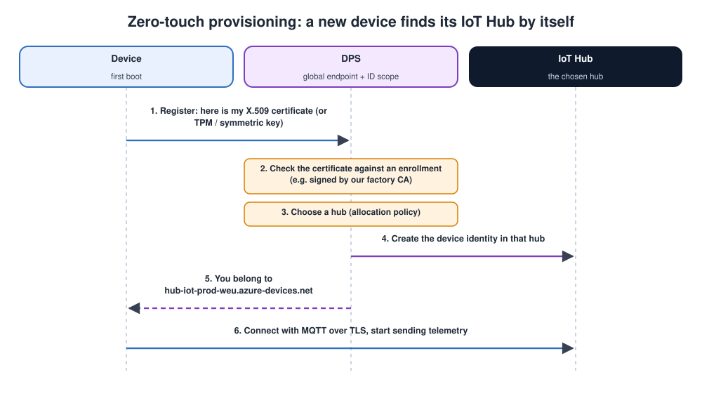

# Microsoft Azure, AKS and Azure IoT

## Contents

| # | Section | In one line |
| --- | --- | --- |
| – | [Abbreviations](#abbreviations) | Every short form used in these notes, written in full |
| | **Part A: Azure fundamentals** | |
| 1 | [What is cloud computing and Azure?](#1-what-is-cloud-computing-and-azure) | Definition, block diagram, analogy, IaaS / PaaS / SaaS |
| 2 | [Global infrastructure](#2-global-infrastructure-regions-and-availability-zones) | Regions, availability zones, pairs, SLAs |
| 3 | [How Azure is organised](#3-how-azure-is-organised) | Tenant, subscriptions, resource groups, tags, policy |
| 4 | [Tools: portal, CLI, infrastructure as code](#4-tools-portal-cli-and-infrastructure-as-code) | `az` commands and a Bicep example |
| 5 | [Identity and access](#5-identity-and-access-entra-id-rbac-managed-identities) | Entra ID, RBAC, managed identities |
| 6 | [A tour of the core services](#6-a-tour-of-the-core-services) | Compute, storage, networking, data, security, monitoring |
| 7 | [Cost](#7-cost-how-you-pay-and-how-to-save) | Pricing models and how to save |
| | **Part B: Containers and Kubernetes on Azure** | |
| 8 | [Container services on Azure](#8-container-services-on-azure) | ACR, ACI, Container Apps, App Service, AKS, Arc |
| 9 | [AKS architecture](#9-aks-architecture) | What Azure runs and what you run |
| 10 | [Creating an AKS cluster and deploying an app](#10-creating-an-aks-cluster-and-deploying-an-app) | Step by step with the CLI |
| 11 | [Key AKS features](#11-key-aks-features) | Scaling, networking, ingress, storage, identity, upgrades |
| 12 | [AKS troubleshooting](#12-aks-troubleshooting) | Common problems and fixes |
| | **Part C: Azure IoT** | |
| 13 | [Azure IoT: the big picture](#13-azure-iot-the-big-picture) | A device-to-dashboard reference architecture |
| 14 | [IoT Hub](#14-iot-hub) | Identities, telemetry, commands, twins, routing, MQTT topics |
| 15 | [Device Provisioning Service](#15-device-provisioning-service-dps) | Zero-touch onboarding of thousands of devices |
| 16 | [IoT Edge and Device Update](#16-iot-edge-and-device-update) | Containers on gateways; over-the-air updates |
| 17 | [Other IoT building blocks](#17-other-iot-building-blocks) | Event Grid MQTT broker, IoT Operations, ADX, Digital Twins |
| 18 | [Security checklist](#18-security-checklist-for-an-azure-iot-solution) | Device to cloud |
| 19 | [Simple code examples](#19-simple-code-examples) | Device telemetry, a direct method, the device twin, a backend reading the messages |
| 20 | [Interview quick answers](#20-interview-quick-answers) | Short answers to say out loud |

---

## Abbreviations

| Short form | Full form | In one line |
| --- | --- | --- |
| ACI | Azure Container Instances | Run one container without a cluster |
| ACR | Azure Container Registry | Private image registry |
| ADX | Azure Data Explorer | Fast analytics on time-series and logs |
| AGIC | Application Gateway Ingress Controller | Kubernetes ingress through Application Gateway |
| AKS | Azure Kubernetes Service | Azure's managed Kubernetes |
| AMQP | Advanced Message Queuing Protocol | A messaging protocol supported by IoT Hub |
| API | Application Programming Interface | A set of calls a service exposes |
| ARM | Azure Resource Manager | The service that creates every Azure resource (also "ARM templates") |
| AZ | Availability Zone | A separate datacenter location inside a region |
| BI | Business Intelligence | Reports and dashboards (Power BI) |
| C2D / D2C | Cloud-to-Device / Device-to-Cloud | Message direction in IoT Hub |
| CA | Certificate Authority | Signs certificates |
| CDN | Content Delivery Network | Caches content close to users |
| CI | Continuous Integration | The automated build pipeline |
| CLI | Command-Line Interface | The `az` tool |
| CNI | Container Network Interface | How Kubernetes pods get network addresses |
| CPU | Central Processing Unit | The processor |
| CSI | Container Storage Interface | How Kubernetes attaches storage |
| Dapr | Distributed Application Runtime | Building blocks for microservices |
| DDoS | Distributed Denial of Service | An attack that floods a service with traffic |
| DNS | Domain Name System | Turns names into IP addresses |
| DPS | Device Provisioning Service | Zero-touch device onboarding for IoT Hub |
| eBPF | extended Berkeley Packet Filter | Safe programs inside the Linux kernel, used for fast networking |
| EFLOW | Azure IoT Edge for Linux on Windows | Runs IoT Edge on Windows machines |
| GRS / LRS / ZRS / GZRS | Geo- / Locally / Zone- / Geo-zone-redundant storage | Storage redundancy options |
| HPA | Horizontal Pod Autoscaler | Scales pod replicas |
| HTTP(S) | Hypertext Transfer Protocol (Secure) | The web protocol |
| IaaS / PaaS / SaaS | Infrastructure / Platform / Software as a Service | Cloud service models |
| IoT | Internet of Things | Connected devices |
| IP | Internet Protocol | Network addressing |
| JSON | JavaScript Object Notation | A common text data format |
| K3s | (lightweight Kubernetes) | A small, certified Kubernetes for the edge |
| KEDA | Kubernetes Event-Driven Autoscaling | Scales pods on events, even to zero |
| KQL | Kusto Query Language | The query language of Log Analytics and ADX |
| LTS | Long-Term Support | A version maintained for several years |
| MCU | Microcontroller Unit | Small chip with CPU, flash and RAM inside |
| MFA | Multi-Factor Authentication | Sign-in with a second factor |
| ML | Machine Learning | Trained models, e.g. for detection |
| MQTT | Message Queuing Telemetry Transport | Lightweight IoT messaging protocol |
| NAT | Network Address Translation | Shares one public IP |
| NFS / SMB | Network File System / Server Message Block | File-sharing protocols |
| NIC | Network Interface Card | A VM's network adapter |
| NSG | Network Security Group | A firewall for subnets and NICs |
| OIDC | OpenID Connect | Standard for identity tokens, used by workload identity |
| OPC UA | Open Platform Communications Unified Architecture | Industrial data-exchange standard |
| OS | Operating System | e.g. Linux |
| OT | Operational Technology | Industrial control systems |
| OTA | Over-The-Air (update) | Remote firmware update |
| PDB | PodDisruptionBudget | Limits how many pods may be down at once |
| RBAC | Role-Based Access Control | Who may do what, where |
| SAS | Shared Access Signature | A signed, time-limited token |
| SCADA | Supervisory Control and Data Acquisition | Industrial monitoring and control software |
| SDK | Software Development Kit | Libraries and tools for developers |
| SIEM | Security Information and Event Management | Collects and analyses security events |
| SLA | Service Level Agreement | Microsoft's uptime commitment |
| SQL | Structured Query Language | The language of relational databases |
| SSH | Secure Shell | Encrypted remote login |
| TCP / UDP | Transmission Control Protocol / User Datagram Protocol | Transport protocols |
| TLS | Transport Layer Security | Encryption for connections |
| TPM | Trusted Platform Module | A security chip that stores keys |
| vCPU | Virtual CPU | One CPU core of a VM |
| VM | Virtual Machine | A computer emulated in software |
| VNet | Virtual Network | Your private network in Azure |
| VPN | Virtual Private Network | An encrypted tunnel between networks |
| WAF | Web Application Firewall | Blocks web attacks |
| X.509 | (ITU-T standard number) | The standard certificate format |
| YAML | YAML Ain't Markup Language | A text format for configuration files |

---

## Part A: Azure fundamentals

## 1. What is cloud computing and Azure?

> **Microsoft Azure** is a **public cloud**: computing power, storage, networking and hundreds of ready-made services that you **rent on demand over the internet**, paying only for what you use, instead of buying and running your own servers.

### The Azure block diagram

![Microsoft Azure at a glance: where it runs (a geography containing a region with three availability zones of datacenters, and a paired region for disaster recovery); how it's organised (Microsoft Entra tenant, management groups, subscriptions, resource groups, resources); what it offers (compute, containers, storage, databases, networking, identity and security, IoT, monitoring); and how you work with it (portal, Azure CLI, PowerShell, Bicep or ARM templates, and Terraform all go through Azure Resource Manager, which checks identity and policy before creating resources in your subscription)](images/azure_big_picture.svg)

The diagram answers four questions about Azure:

1. **Where does it run?**
   - In a **geography** (e.g. Europe) there are **regions**.
   - Each region has several **availability zones**: separate datacenter locations.
   - A **paired region** is used for disaster recovery (section 2).
2. **How is it organised?** From the top down (section 3):
   - a **Microsoft Entra tenant** (your organisation's identities)
   - **management groups**
   - **subscriptions**
   - **resource groups**
   - **resources**
3. **What does it offer?** Compute, containers, storage, databases, networking, identity and security, IoT, and monitoring (sections 6-17).
4. **How do you work with it?** Through these tools (section 4):
   - the web portal
   - the **CLI** (Command-Line Interface)
   - PowerShell
   - Bicep or ARM templates
   - Terraform

   Every one of them goes through **Azure Resource Manager (ARM)**, which checks your identity and the policies before it creates anything in your subscription.

> Cloud services change often: new features appear and old ones are retired. The concepts here are stable, but check the Azure documentation for current limits, prices and availability before designing a product.

### An analogy: electricity from the grid

| Running your own servers | The cloud |
| --- | --- |
| Building your own power station | Plugging into the electricity grid |
| Big upfront cost, sized for your peak | No upfront cost, pay per unit used |
| You maintain the generators | The utility maintains everything |
| Adding capacity takes months | More capacity in minutes |
| If it breaks, you fix it | Redundancy is built in |

### The main benefits

| Benefit | Meaning |
| --- | --- |
| **Elasticity** | Scale up for peaks and down when quiet, automatically |
| **Pay as you go** | Operating expense instead of large capital expense |
| **Global reach** | Deploy near your users and devices, in many countries |
| **Managed services** | Databases, Kubernetes and IoT platforms without running the servers yourself |
| **Reliability** | Availability zones, backups and geo-redundancy |
| **Security and compliance** | Physical security, certifications and security tooling |

### Service models: IaaS, PaaS, SaaS


### Where your code can run, and who manages what

1. **The compute options** run from **most control** to **least to manage**:
   - **Virtual machines:** you manage the OS, the patches and everything above.
   - **AKS** sits in the middle: Azure runs Kubernetes' control plane, and you run the worker nodes and your apps.
   - **Functions:** you only write the code.
2. **The shared responsibility model** says who looks after each layer (data, application, runtime, operating system, virtualisation, the physical datacenter):
   - **On-premises** (your own servers): you look after everything.
   - **IaaS** (VMs): Microsoft looks after the hardware and virtualisation; you look after the operating system and up.
   - **PaaS** (App Service): Microsoft also looks after the OS and runtime.
   - **SaaS** (Microsoft 365): you just use the software.
3. **One thing never moves:** your **data, and who can access it**, are always your responsibility, whichever model you use.

| Model | You get | You manage | Azure examples |
| --- | --- | --- | --- |
| **IaaS** (Infrastructure as a Service) | Virtual machines, disks, networks | OS and everything above | Virtual Machines, VM Scale Sets, Managed Disks |
| **PaaS** (Platform as a Service) | A platform to run your code | Your application and data | App Service, Azure SQL Database, AKS (partly), IoT Hub |
| **Serverless** | Code runs on events; no servers to think about | Just the code | Functions, Container Apps, Logic Apps |
| **SaaS** (Software as a Service) | Finished software | Your data and users | Microsoft 365, Dynamics 365 |

---

## 2. Global infrastructure: regions and availability zones

| Term | Meaning | Why you care |
| --- | --- | --- |
| **Geography** | A market area such as Europe or India | Data residency and compliance |
| **Region** | A set of datacenters in one area (e.g. West Europe, Central India) | Pick one near your users and devices for low latency; prices and services vary by region |
| **Availability Zone (AZ)** | Physically separate locations inside a region, each with independent power, cooling and networking (typically 3) | Spread VMs and AKS nodes across zones so one zone failing doesn't stop your app |
| **Region pair** | Two regions in the same geography, paired for disaster recovery | Geo-redundant storage replicates to the pair; updates are rolled out to pairs one at a time |
| **SLA** (Service Level Agreement) | Microsoft's uptime commitment per service | Higher SLAs need zone-redundant or multi-region designs |

**Designing for failure, simply:**

| Level | Survives | How |
| --- | --- | --- |
| Single instance | Nothing | One VM |
| Multiple instances in one zone | One server failing | VM Scale Set / several AKS nodes |
| **Zone-redundant** | A whole datacenter failing | Spread across availability zones; zone-redundant services |
| **Multi-region** | A whole region failing | Deploy in two regions, with Front Door or Traffic Manager in front |

---

## 3. How Azure is organised

| Level | What it is | Typical use |
| --- | --- | --- |
| **Microsoft Entra tenant** | Your organisation's identity directory: users, groups, apps | One per company |
| **Management groups** | Folders of subscriptions | Apply policies and access to many subscriptions at once |
| **Subscription** | A billing and limits boundary | Separate `dev`, `test` and `prod`, or separate products |
| **Resource group** | A container for resources that share a lifecycle | One app or one environment; delete the group to delete everything in it |
| **Resource** | One service instance | A VM, a storage account, an AKS cluster, an IoT Hub |

**Tools for keeping order:**

| Tool | Does | Example |
| --- | --- | --- |
| **Naming convention** | Readable, consistent names | `rg-iot-prod-weu`, `aks-iot-prod-weu` |
| **Tags** | Key-value labels on resources | `env=prod`, `owner=iot-team`, `costcentre=1234`, used to split costs |
| **Resource locks** | Stop accidental changes or deletion | `CanNotDelete` on production databases |
| **Azure Policy** | Rules checked on every change | "Only West Europe and North Europe", "every resource must have an `owner` tag", "no public IPs" |
| **Quotas** | Limits per subscription and region | vCPU quota: request an increase before creating a big AKS cluster |

---

## 4. Tools: portal, CLI and infrastructure as code

| Tool | Best for |
| --- | --- |
| **Azure portal** (web) | Learning, exploring, quick checks |
| **Azure CLI** (Command-Line Interface, `az`) | Scripts and daily work on Linux, Mac and Windows |
| **Azure PowerShell** | Windows-centric teams |
| **Cloud Shell** | A browser terminal with `az`, `kubectl` and `terraform` already installed |
| **Bicep / ARM templates** | Azure's own infrastructure as code |
| **Terraform** | Infrastructure as code across several clouds |

### The Azure CLI in five commands

```bash
az login                                                  # sign in (opens a browser)
az account set --subscription "IoT-Dev"                   # choose a subscription
az group create --name rg-iot-demo --location westeurope  # a resource group
az resource list --resource-group rg-iot-demo --output table
az group delete --name rg-iot-demo --yes                  # delete EVERYTHING in it
```

### Infrastructure as code with Bicep

Describe resources in a file, keep it in git, and deploy the same way every time:

```bicep
// storage.bicep: a storage account for raw IoT data
param location string = resourceGroup().location

resource sa 'Microsoft.Storage/storageAccounts@2023-05-01' = {
  name: 'stiotraw${uniqueString(resourceGroup().id)}'
  location: location
  sku: { name: 'Standard_ZRS' }          // zone-redundant
  kind: 'StorageV2'
  properties: {
    minimumTlsVersion: 'TLS1_2'
    allowBlobPublicAccess: false
  }
}
```

```bash
az deployment group create --resource-group rg-iot-demo --template-file storage.bicep
```

> **Why infrastructure as code?** Environments can be recreated exactly, every change is reviewed in git, and dev, test and prod stay identical. Clicking in the portal doesn't scale.

---

## 5. Identity and access: Entra ID, RBAC, managed identities

### Microsoft Entra ID

**Microsoft Entra ID** (formerly Azure Active Directory) is Azure's identity service. It signs in users, groups and applications, and provides multi-factor authentication (MFA) and conditional access (for example, "admins only from managed laptops").

### Role-based access control (RBAC)

Every permission in Azure is a **role assignment** with three parts:

```text
WHO (security principal)  +  WHAT (role)  +  WHERE (scope)
e.g. group "iot-devs"     +  Contributor  +  resource group rg-iot-dev
```

| Built-in role | Can |
| --- | --- |
| **Owner** | Everything, including granting access to others |
| **Contributor** | Create and manage resources, but not grant access |
| **Reader** | View only |
| **User Access Administrator** | Manage access only |
| Service-specific roles | e.g. *Azure Kubernetes Service RBAC Reader*, *IoT Hub Data Contributor*, *Key Vault Secrets User* |

Access granted at a higher scope is **inherited** below it: management group → subscription → resource group → resource.

### Managed identities: no passwords in your code

A **managed identity** is an identity Azure creates for a resource (a VM, a Function, an AKS pod through workload identity). Your code gets **tokens automatically**. You grant that identity a role, for example *Key Vault Secrets User*, and **never store a password or key** in config files.

| Type | Lifecycle |
| --- | --- |
| **System-assigned** | Created with the resource, deleted with it |
| **User-assigned** | A standalone identity you can attach to several resources |

> **Principle of least privilege:** give each person and each app only the role it needs, at the smallest scope that works. Avoid long-lived keys and connection strings wherever a managed identity can be used instead.

---

## 6. A tour of the core services

### Compute

| Service | What it is | Typical IoT use |
| --- | --- | --- |
| **Virtual Machines** | Your own Linux or Windows VM | A legacy **SCADA** (Supervisory Control and Data Acquisition) server, a build machine |
| **VM Scale Sets** | Many identical, autoscaled VMs | The node pools under AKS |
| **App Service** | Hosting for web apps and APIs | A device-management web portal |
| **Functions** | Event-driven serverless code | Process each IoT Hub message; react to alerts |
| **Container Apps** | Serverless containers with autoscaling | Protocol adapters, APIs, workers |
| **AKS** (Azure Kubernetes Service) | Managed Kubernetes | Large microservice back-ends (Part B) |

### Storage

| Service | Stores | Use |
| --- | --- | --- |
| **Blob Storage** / **Data Lake Storage** | Objects (files) of any size | Raw telemetry archives, firmware images, logs |
| **Azure Files** | **SMB** (Server Message Block) / **NFS** (Network File System) file shares | Shared files, shared volumes for AKS |
| **Managed Disks** | Block disks for VMs | VM and AKS persistent volumes |
| **Queue / Table Storage** | Simple queues / key-value tables | Lightweight messaging and state |

**Blob access tiers** (cheaper storage, higher access cost): **Hot → Cool → Cold → Archive**. Move old telemetry down the tiers automatically with lifecycle rules.

**Redundancy options:**

| Option | Copies | Survives |
| --- | --- | --- |
| **LRS** (locally redundant) | 3 copies in one datacenter | Disk / server failure |
| **ZRS** (zone-redundant) | 3 copies across availability zones | A datacenter failure |
| **GRS** (geo-redundant) | LRS + 3 more copies in the paired region | A region failure |
| **GZRS** (geo-zone-redundant) | ZRS + copies in the paired region | Both |

### Networking

| Service | Does |
| --- | --- |
| **Virtual Network (VNet)** + subnets | Your private network in Azure |
| **Network Security Group (NSG)** | A firewall for subnets / **NICs** (Network Interface Cards): allow or deny by IP and port |
| **Private Endpoint** | Reach a PaaS service (Storage, IoT Hub, Key Vault) over a **private IP**, not the internet |
| **VPN** (Virtual Private Network) **Gateway / ExpressRoute** | Connect your factory or office network to Azure |
| **Load Balancer** | Layer 4 (TCP/UDP) load balancing inside a region |
| **Application Gateway** | Layer 7 (HTTP) load balancing with a web application firewall, inside a region |
| **Front Door** | Global Layer 7 entry point: **CDN** (Content Delivery Network), **WAF** (Web Application Firewall), routing to the nearest healthy region |
| **Azure DNS** | DNS hosting |

### Databases

| Service | Type | Use |
| --- | --- | --- |
| **Azure SQL Database** | Managed SQL Server | Relational data: users, assets, orders |
| **Azure Database for PostgreSQL / MySQL** | Managed open-source relational databases | Same, with open-source engines |
| **Cosmos DB** | Globally distributed NoSQL, very low latency | Latest device state, device metadata |
| **Azure Data Explorer** | Very fast analytics on huge time-series and logs | IoT telemetry analysis |
| **Azure Cache for Redis** | In-memory cache | Fast lookups, sessions |

### Security

| Service | Does |
| --- | --- |
| **Key Vault** | Stores secrets, keys and certificates; hardware-backed options |
| **Microsoft Defender for Cloud** | Security posture score, recommendations and threat protection (VMs, containers, storage, IoT) |
| **Microsoft Sentinel** | **SIEM** (Security Information and Event Management): collects and analyses security events |
| **Azure Policy** | Enforce rules on every resource |
| **DDoS** (Distributed Denial of Service) **Protection, Azure Firewall, WAF** | Network protection |

### Monitoring

| Service | Does |
| --- | --- |
| **Azure Monitor** | The umbrella: metrics, logs, alerts, dashboards |
| **Log Analytics** | Stores logs; query with **KQL** (Kusto Query Language) |
| **Application Insights** | Application performance monitoring: requests, errors, traces |
| **Container Insights / Managed Prometheus / Managed Grafana** | Kubernetes monitoring (section 11) |

A small KQL query ("which AKS pods restarted most in the last day?"):

```kusto
KubePodInventory
| where TimeGenerated > ago(1d)
| summarize Restarts = max(ContainerRestartCount) by Name, Namespace
| top 10 by Restarts
```

---

## 7. Cost: how you pay and how to save

| Pricing option | Meaning | Good for |
| --- | --- | --- |
| **Pay-as-you-go** | Per second / hour / GB / message | Variable or unknown workloads |
| **Reservations** | Commit to 1 or 3 years of a specific resource for a big discount | Steady VMs, databases |
| **Savings plan for compute** | Commit to an hourly spend on compute for a discount | Steady but changing compute mix |
| **Spot VMs** | Spare capacity at a deep discount; can be evicted at short notice | Batch jobs, AKS spot node pools, CI |
| **Azure Hybrid Benefit** | Reuse existing Windows Server / SQL Server licences | Microsoft-licensed workloads |
| **Free tier / free services** | Some services have free amounts (e.g. IoT Hub F1) | Learning and prototypes |

**Keeping costs under control:**

| Practice | Tool |
| --- | --- |
| Estimate before building | **Pricing calculator** |
| See where money goes | **Cost Management** (by subscription, resource group, tag) |
| Get warned early | **Budgets** with alerts |
| Right-size and clean up | **Azure Advisor** recommendations; delete unused disks, IPs and old resource groups |
| Stop dev resources out of hours | Auto-shutdown of VMs; scale AKS user node pools to zero |
| Keep data cheap | Blob lifecycle rules (Hot → Cool → Archive); sensible log retention |

---

## Part B: Containers and Kubernetes on Azure

## 8. Container services on Azure

Azure offers several ways to run the same container images (the [Docker notes](docker_and_kubernates.md) explain the images themselves):

| Service | What it is | You manage | Choose it when |
| --- | --- | --- | --- |
| **Azure Container Registry (ACR)** | Private registry for images and Helm charts | Images | **Always**: store your images here, close to where they run |
| **Azure Container Instances (ACI)** | Run a single container on demand, no cluster | The container | One-off jobs, simple tasks, bursting |
| **Azure Container Apps** | Serverless containers built on Kubernetes (with **KEDA**, Kubernetes Event-Driven Autoscaling, and **Dapr**, the Distributed Application Runtime), autoscaling to zero | Containers + scaling rules | Microservices and APIs **without** managing Kubernetes |
| **App Service (containers)** | Web hosting that runs your container | The container | Web apps and APIs with simple needs |
| **AKS** | Managed Kubernetes | Nodes, Kubernetes objects, apps | Full Kubernetes control, many services, custom networking, operators |
| **Azure Red Hat OpenShift** | Managed OpenShift | Like AKS | Teams standardised on OpenShift |
| **Azure Arc-enabled Kubernetes** | Manage clusters **outside** Azure (on-premises, edge, other clouds) from Azure | Your own clusters | Factory or edge clusters managed centrally |
| **AKS Edge Essentials / AKS on Azure Local** | Microsoft's Kubernetes on your own edge or on-premises hardware | The hardware | Kubernetes at the edge, with Azure management |

**How to choose:**

Answer these questions from the top, and stop at the first "yes":

1. **Do I just need to run one container, now and then** (a job, a script, a quick test)? → **Azure Container Instances**: no cluster, pay per second.
2. **Do I need the full Kubernetes API** (operators, Helm charts, DaemonSets, custom networking)? → **AKS** in Azure. At a factory, the edge or on-premises, use Arc-enabled Kubernetes, AKS Edge Essentials or K3s.
3. **Is it a simple web app or API?** → **App Service**.
4. **Otherwise** → **Container Apps**: microservices, events, autoscaling to zero, without managing Kubernetes.


---

## 9. AKS architecture

![AKS architecture: kubectl or a CI pipeline talks to the AKS control plane (API server, etcd, scheduler, controllers), run and patched by Azure on the Free or Standard tier; in your subscription's node resource group, a virtual network contains a system node pool, a user node pool that autoscales for your app pods, and a spot node pool, each a VM Scale Set; alongside are Azure Load Balancer, ingress through App Routing or Application Gateway, and storage with Azure Disks and Azure Files; integrations include Container Registry, Microsoft Entra ID, Key Vault, workload identity and Azure Monitor](images/aks_architecture.svg)

### How an AKS cluster is built

1. **The control plane is run by Azure.** The API server, etcd, scheduler and controllers are created, patched, scaled and backed up for you. You don't see these machines, and there's no charge for them on the Free tier. The **Standard** tier adds a financially backed uptime SLA for production.
2. **The worker nodes live in your subscription.** They're ordinary Azure VMs in **VM Scale Sets**, grouped into **node pools**, inside a **virtual network**. They sit in a separate resource group whose name starts with `MC_`, and **you pay for them**.
   - **System node pool:** runs Kubernetes' own components (CoreDNS, metrics). Keep your apps off it.
   - **User node pools:** run your applications and can autoscale.
   - **Spot node pools:** much cheaper, but Azure can take the VMs back at short notice. Fine for batch or fault-tolerant work.
3. **Azure building blocks plug in.** A Kubernetes `Service` of type LoadBalancer automatically creates an **Azure Load Balancer** and public IP. **Ingress** is handled by the managed **App Routing** add-on (NGINX) or **Application Gateway**. `PersistentVolumeClaims` become **Azure Disks** or **Azure Files**.
4. **Integrations.** Images come from **ACR**. People sign in with **Entra ID**. Secrets come from **Key Vault**. Pods get Azure access through **workload identity** instead of passwords. **Azure Monitor** collects logs and metrics.

> **AKS is still normal Kubernetes.** Everything in the [Kubernetes notes](docker_and_kubernates.md#part-b-kubernetes) (Deployments, Services, probes, `kubectl`, Helm) works the same. AKS takes away the work of running the control plane and adds Azure integrations.

---

## 10. Creating an AKS cluster and deploying an app

A complete path from nothing to a running app, using the collector image from the Docker notes.

### Step 1: a resource group and a container registry

```bash
az group create --name rg-iot-demo --location westeurope

az acr create --resource-group rg-iot-demo --name acriotdemo123 --sku Basic
az acr build  --registry acriotdemo123 --image collector:1.0 .     # build in the cloud, from your Dockerfile
```

### Step 2: the AKS cluster

```bash
az aks create \
  --resource-group rg-iot-demo \
  --name aks-iot-demo \
  --node-count 2 \
  --network-plugin azure --network-plugin-mode overlay \
  --attach-acr acriotdemo123 \
  --enable-oidc-issuer --enable-workload-identity \
  --generate-ssh-keys
```

| Option | Why |
| --- | --- |
| `--node-count 2` | Two worker nodes in the default (system) pool |
| `--network-plugin azure --network-plugin-mode overlay` | **Azure CNI Overlay** (CNI = Container Network Interface): the recommended networking for new clusters; pods get IPs from a separate range, so they don't use up your VNet addresses |
| `--attach-acr` | Lets the cluster pull images from your registry without passwords |
| `--enable-oidc-issuer --enable-workload-identity` | Lets pods use Azure identities instead of secrets (**OIDC** = OpenID Connect) |

### Step 3: connect kubectl

```bash
az aks get-credentials --resource-group rg-iot-demo --name aks-iot-demo
kubectl get nodes
```

### Step 4: deploy

Use the Deployment and Service YAML from the [Kubernetes notes, section 12](docker_and_kubernates.md#12-deploying-an-app-step-by-step), with the image changed to `acriotdemo123.azurecr.io/collector:1.0`:

```bash
kubectl apply -f collector.yaml
kubectl get pods,svc
```

A Service of `type: LoadBalancer` gets a public IP from Azure within a minute or two (`kubectl get svc -w`).

### Step 5: add a user node pool and clean up

```bash
# A separate pool for applications, with the cluster autoscaler
az aks nodepool add --resource-group rg-iot-demo --cluster-name aks-iot-demo \
  --name apps --node-count 1 --enable-cluster-autoscaler --min-count 1 --max-count 5

# When you're done learning: delete everything (nodes cost money every hour)
az group delete --name rg-iot-demo --yes --no-wait
```

---

## 11. Key AKS features

### AKS scaling

| Level | Tool | Scales |
| --- | --- | --- |
| **Pods** | Horizontal Pod Autoscaler (**HPA**) | Replicas, by CPU or memory |
| **Pods, by events** | **KEDA** add-on | Replicas by queue length, Event Hubs lag, custom metrics, down to zero |
| **Nodes** | **Cluster autoscaler** | Adds nodes when pods can't be scheduled, removes idle ones |
| **Nodes, managed** | **Node auto-provisioning** / **AKS Automatic** | Azure chooses and manages node sizes and pools for you |

### AKS networking

| Option | How pods get IPs | Notes |
| --- | --- | --- |
| **Azure CNI Overlay** | From a private range separate from the VNet | **Recommended default**; saves VNet address space |
| **Azure CNI (VNet IPs)** | Directly from your VNet subnet | Pods reachable directly from the VNet; plan subnet size carefully |
| **Azure CNI powered by Cilium** | **eBPF** (extended Berkeley Packet Filter) data plane | High-performance networking and network policies |
| kubenet | Legacy | **Being retired**; don't use it for new clusters |

Also: **private clusters** (API server reachable only from your network), **network policies** (which pods may talk to which), and **egress control** through Azure Firewall or a NAT gateway.

### AKS ingress: getting HTTP(S) traffic in

| Option | Notes |
| --- | --- |
| **App Routing add-on** | Managed NGINX ingress with Azure DNS and Key Vault certificate integration |
| **Application Gateway for Containers / AGIC** (Application Gateway Ingress Controller) | Azure's Layer 7 load balancer with WAF, driven by Kubernetes ingress / Gateway API |
| Your own controller (NGINX, Traefik ...) | Installed with Helm; you maintain it |

### AKS storage

| StorageClass | Backed by | Access |
| --- | --- | --- |
| `managed-csi` / `managed-csi-premium` | Azure Disks | One node at a time (ReadWriteOnce): databases |
| `azurefile-csi` | Azure Files | Many pods at once (ReadWriteMany): shared files |
| Blob CSI | Blob storage | Large object data mounted as files |

### AKS identity and secrets

| Need | AKS answer |
| --- | --- |
| **Who can use kubectl?** | Entra ID integration + **Azure RBAC for Kubernetes** (or Kubernetes RBAC with Entra groups) |
| **Pod needs to call Azure** (Storage, Key Vault, IoT Hub) | **Workload identity**: a Kubernetes service account federated with a managed identity, so no keys in the pod |
| **Pod needs secrets or certificates** | **Key Vault Secrets Store CSI driver** (CSI = Container Storage Interface): mounts Key Vault secrets as files |
| **Pull images from ACR** | `--attach-acr` (the kubelet's managed identity gets *AcrPull*) |

### AKS monitoring

| Tool | Gives you |
| --- | --- |
| **Container Insights** | Node and pod metrics, container logs in Log Analytics (KQL) |
| **Azure Monitor managed Prometheus** | Prometheus metrics without running Prometheus |
| **Azure Managed Grafana** | Dashboards on top of Prometheus and Azure Monitor |
| **Diagnostic settings** | Control plane logs (API server, audit) into Log Analytics |

### AKS upgrades and tiers

| Topic | What to know |
| --- | --- |
| **Kubernetes versions** | AKS supports a window of recent minor versions. Upgrade regularly, or clusters fall out of support. |
| **Upgrading** | `az aks get-upgrades` / `az aks upgrade`. Nodes are replaced one by one (cordon, drain, new node). |
| **Auto-upgrade channels** | `patch`, `stable`, `rapid`, `node-image`, with **planned maintenance windows** |
| **Node OS image** | Security-patched regularly; enable node-image auto-upgrade |
| **Pricing tiers** | **Free** (no SLA, for dev/test), **Standard** (uptime SLA, for production), **Premium** (Standard + long-term support versions) |

### AKS security

| Practice | How |
| --- | --- |
| Private API server or authorised IP ranges | `--enable-private-cluster` / `--api-server-authorized-ip-ranges` |
| Policy enforcement | **Azure Policy for AKS** (e.g. no privileged containers, only images from your ACR) |
| Threat detection and image scanning | **Microsoft Defender for Containers** |
| Least-privilege access | Entra groups + Azure RBAC; no shared admin kubeconfig |
| Secrets | Key Vault + CSI driver; never plain Kubernetes Secrets in git |

---

## 12. AKS troubleshooting

| Symptom | Likely cause | Check / fix |
| --- | --- | --- |
| `az aks create` fails with a **quota** error | Not enough vCPU quota for that VM family in the region | Request a quota increase, or use a smaller or different VM size |
| Pods in **ImagePullBackOff** with `401 Unauthorized` from `*.azurecr.io` | ACR not attached, or wrong image name | `az aks check-acr --resource-group rg --name aks --acr <name>.azurecr.io`; `az aks update --attach-acr` |
| `kubectl`: **"You must be logged in to the server (Unauthorized)"** | Stale credentials, or an Entra-integrated cluster without kubelogin | `az aks get-credentials` again; install and use `kubelogin`; check your Azure RBAC role |
| Service `EXTERNAL-IP` stuck at **`<pending>`** | Public IP quota, missing permissions for the cluster identity on the subnet, or policy blocking public IPs | `kubectl describe svc` events; check the identity's role on the VNet and your IP quota |
| Node **NotReady** | VM problem, disk pressure, network (e.g. a firewall blocking required egress) | `kubectl describe node`; Container Insights; check required outbound rules |
| Pods can't get IPs (Azure CNI with VNet IPs) | **Subnet out of addresses** | Bigger subnet, or use **CNI Overlay** |
| Upgrade stuck draining nodes | A **PodDisruptionBudget** (PDB) that never allows a pod to move | Adjust the PDB (e.g. `maxUnavailable: 1`), or scale up first |
| Pod can't read Key Vault via workload identity | Federated credential doesn't match the namespace or service account, or a role is missing | Check the service account annotation, federated credential subject, and *Key Vault Secrets User* role |
| High cost | Oversized node pools, idle dev clusters | Autoscaler, spot pools for batch, stop dev clusters (`az aks stop`), right-size VMs |

**Useful commands:**

```bash
az aks show -g rg-iot-demo -n aks-iot-demo -o table    # cluster state, version, tier
az aks nodepool list -g rg-iot-demo --cluster-name aks-iot-demo -o table
kubectl get events -A --sort-by=.lastTimestamp          # what just happened, cluster-wide
kubectl describe pod <name>                             # always the first stop for a failing pod
```

---

## Part C: Azure IoT

## 13. Azure IoT: the big picture

![IoT on Azure from device to dashboard: an MCU sensor with MQTT over TLS and an X.509 certificate, and a Linux gateway running the Azure IoT Edge runtime with modules for Modbus, filtering and AI, connected to leaf devices; on first boot devices contact the Device Provisioning Service, which assigns them to an IoT Hub; IoT Hub manages identities, telemetry, commands, twins and routing; messages are routed to Event Hubs, Stream Analytics and Functions, then stored and used in Blob or Data Lake, Azure Data Explorer, Cosmos DB, dashboards and alerts, and back-end services on AKS or Container Apps; commands, configuration and Device Update go back down; for a full MQTT broker use Event Grid MQTT broker or Azure IoT Operations; security from end to end](images/azure_iot_architecture.svg)

### How an Azure IoT solution works, step by step

1. **Devices.**
   - A **microcontroller sensor** connects directly with MQTT over TLS, identified by its own X.509 certificate ([MQTT notes](MQTT_and_TLS.md)).
   - A **Linux gateway** runs **Azure IoT Edge**. Its modules are containers, for example one reading Modbus from older **leaf devices** that can't connect to the cloud themselves.
2. **Step 1: provisioning.** On first boot, a device asks the **Device Provisioning Service (DPS)** "which IoT Hub do I belong to?". DPS checks its certificate and registers it. No per-device setup is needed in the factory.
3. **Step 2: IoT Hub.** The front door for devices. It knows every device's **identity**, receives **telemetry**, sends **commands**, keeps a **device twin** (the desired and reported state of each device), and **routes** messages onwards.
4. **Route and process.**
   - **Event Hubs** carries high-volume streams.
   - **Stream Analytics** runs SQL-like queries on live data (for example "average temperature per minute, alert above 80 °C").
   - **Functions** run code on each message.
5. **Store and use.** Keep raw data cheaply in **Blob / Data Lake**. Analyse history fast in **Azure Data Explorer**. Keep the latest state in **Cosmos DB**. Show **dashboards and alerts**, and run your **back-end services** on AKS or Container Apps.
6. **Back down to devices.** Settings through **device twins**, actions through **direct methods**, and firmware or OS updates through **Device Update for IoT Hub**.
7. **Need a real MQTT broker?** IoT Hub uses a fixed set of MQTT topics. For custom topics and device-to-device messaging, use the **Event Grid MQTT broker** in the cloud, or **Azure IoT Operations** at the edge.

---

## 14. IoT Hub

> **Azure IoT Hub** is a managed cloud gateway that gives **every device its own identity** and provides **secure, two-way communication** at scale: telemetry up, commands and configuration down.

### The core concepts

| Concept | Direction | What it's for | Example |
| --- | --- | --- | --- |
| **Device identity** | – | Registry entry per device, with its authentication (X.509 or SAS key) | `device-001` |
| **Device-to-cloud (D2C) telemetry** | Up | Sensor readings, events | `{"temp": 23.5}` every 10 s |
| **Cloud-to-device (C2D) messages** | Down | One-way notifications, queued for offline devices | "new config available" |
| **Direct methods** | Down, with a reply | Request/response commands; the device must be online | `reboot`, `getDiagnostics` |
| **Device twin** | Both | A JSON document: **desired** properties (set by the cloud) and **reported** properties (set by the device). Syncs when the device reconnects. | desired `{"interval": 30}` → reported `{"interval": 30, "fw": "1.4.2"}` |
| **Module identity / module twin** | Both | Identities for individual modules on one device (used by IoT Edge) | `modbus-reader` module |
| **Message routing** | Cloud-side | Send messages to Event Hubs, Storage, Service Bus, based on properties or body | `temp > 80` → alerts queue |
| **File upload** | Up | Devices upload large files to Blob storage | Logs, images |

**When to use which "down" mechanism:**

| Need | Use |
| --- | --- |
| Change a setting, and have it applied even if the device is offline now | **Desired property** in the device twin |
| An action with an immediate answer | **Direct method** |
| A notification that can wait in a queue | **C2D message** |

### Protocols and tiers

| Protocol | Port | Notes |
| --- | --- | --- |
| **MQTT 3.1.1** | 8883 (or 443 over WebSockets) | Most common for devices |
| **AMQP** (Advanced Message Queuing Protocol) | 5671 (or 443 over WebSockets) | Efficient for gateways multiplexing many devices |
| **HTTPS** | 443 | For devices that only wake up occasionally; no server push |

| Tier | Includes |
| --- | --- |
| **Free (F1)** | A small daily message allowance: learning and prototypes |
| **Basic (B1-B3)** | Telemetry in and routing only: **no** cloud-to-device, twins, direct methods or IoT Edge |
| **Standard (S1-S3)** | Everything: C2D, twins, methods, IoT Edge, Device Update. **The usual choice.** |

### Device authentication

| Method | How | Use |
| --- | --- | --- |
| **X.509 CA-signed certificates** | Each device has a unique certificate signed by your CA; the hub trusts the CA | **Production** (keys can live in a secure element) |
| **X.509 self-signed (thumbprint)** | The hub stores each device's certificate thumbprint | Small fleets, testing |
| **Symmetric key (SAS, Shared Access Signature, token)** | A shared key per device generates time-limited tokens | Prototypes; devices without certificate support |

### IoT Hub over plain MQTT (without an SDK)

IoT Hub isn't a general MQTT broker. It uses **fixed topic names**:

| Setting / action | Value |
| --- | --- |
| Host / port | `<hub-name>.azure-devices.net:8883`, TLS required |
| Client ID | `device-001` (the device ID) |
| Username | `<hub-name>.azure-devices.net/device-001/?api-version=2021-04-12` |
| Password | A SAS token, or empty when authenticating with an X.509 client certificate |
| **Send telemetry** | Publish to `devices/device-001/messages/events/` |
| **Receive C2D messages** | Subscribe to `devices/device-001/messages/devicebound/#` |
| **Device twin** | `$iothub/twin/res/#`, `$iothub/twin/GET/?$rid=1`, `$iothub/twin/PATCH/properties/reported/?$rid=2` |
| **Direct methods** | Subscribe to `$iothub/methods/POST/#`, reply on `$iothub/methods/res/200/?$rid=<id>` |

> In practice, use the **Azure IoT device SDKs** (C, Python, .NET, Java, Node.js) or the **Azure IoT middleware for FreeRTOS / Azure SDK for Embedded C** on microcontrollers. They handle reconnects, twins, methods and DPS for you.

### Trying it with the CLI

```bash
az extension add --name azure-iot                       # IoT commands for the Azure CLI

az iot hub create --name hub-iot-demo --resource-group rg-iot-demo --sku S1
az iot hub device-identity create --hub-name hub-iot-demo --device-id device-001

az iot hub monitor-events --hub-name hub-iot-demo --device-id device-001      # watch telemetry
az iot hub invoke-device-method --hub-name hub-iot-demo --device-id device-001 \
   --method-name reboot                                                       # a direct method
az iot hub device-twin update --hub-name hub-iot-demo --device-id device-001 \
   --desired '{"interval": 30}'                                               # change a setting
```

---

## 15. Device Provisioning Service (DPS)

> **DPS** lets a device **register itself** with the right IoT Hub on first boot, securely and without human help. Every device can ship with the same firmware, and each finds its own place in the cloud.

How a new device finds its hub, step by step:

1. **Register.** The new device only knows the DPS address and the ID scope. It introduces itself with its X.509 certificate (or a **TPM**, Trusted Platform Module, or a symmetric key).
2. **Check.** DPS checks the certificate against an **enrollment**, for example "signed by our factory CA".
3. **Choose a hub** using the allocation policy.
4. **Create the identity.** DPS registers the device in that IoT Hub, so the hub will accept it.
5. **Reply.** DPS tells the device its hub's address, for example `hub-iot-prod-weu.azure-devices.net`.
6. **Connect.** From now on the device talks directly to its IoT Hub, with MQTT over TLS, and starts sending telemetry.



| Term | Meaning |
| --- | --- |
| **ID scope** | Identifies your DPS instance; the only DPS setting baked into the firmware |
| **Enrollment group** | A rule for many devices, e.g. "every device with a certificate signed by our factory CA" |
| **Individual enrollment** | A rule for one specific device |
| **Attestation** | How a device proves its identity: **X.509**, **TPM** (Trusted Platform Module), or **symmetric key** |
| **Allocation policy** | How to pick a hub: evenly weighted, lowest latency, static, or custom (an Azure Function) |
| **Re-provisioning** | Devices can be moved to another hub later (e.g. new customer, new region) |

---

## 16. IoT Edge and Device Update

### Azure IoT Edge

**Azure IoT Edge** turns a Linux gateway into a managed edge device. It runs cloud-deployed **modules**, which are standard **Docker-compatible containers**, so the [Docker notes](docker_and_kubernates.md) apply directly.

| Part | Role |
| --- | --- |
| **IoT Edge runtime** | Installed on the gateway (Linux; Windows through **EFLOW**, IoT Edge for Linux on Windows) |
| **edgeAgent** module | Pulls and runs the modules listed in the **deployment manifest**, reports their health |
| **edgeHub** module | A local IoT Hub: routes messages between modules and to the cloud; **stores and forwards when offline** |
| **Your modules** | Protocol adapters (Modbus, **OPC UA**, Open Platform Communications Unified Architecture), filtering and aggregation, **ML** (machine learning) models, Stream Analytics or Functions at the edge |
| **Deployment manifest** | JSON listing which module images (from ACR) to run, with their settings and routes; applied to one device or thousands by tag |

**Why process at the edge?**

| Reason | Example |
| --- | --- |
| **Less data to the cloud** | Send one-minute averages instead of 100 samples per second |
| **Low latency** | Stop a machine locally in milliseconds, without a cloud round trip |
| **Offline operation** | The factory keeps working when the internet link is down |
| **Legacy protocols** | Translate Modbus/OPC UA from old equipment into IoT Hub messages |
| **Privacy** | Keep raw video on site; send only detected events |

> Use a supported **long-term-support (LTS) release** of the IoT Edge runtime, and build the gateway's OS with the same care as any product. [Yocto_fundamentals.md](Yocto_fundamentals.md) can include the container runtime.

### Device Update for IoT Hub

A managed **over-the-air (OTA) update** service built on IoT Hub:

| Feature | Detail |
| --- | --- |
| Update types | Whole image (A/B partitions, e.g. with SWUpdate), packages (apt), or scripts |
| Targeting | Groups of devices by tags; staged rollouts; compliance view |
| Device side | The Device Update agent on Linux devices |
| Security | Signed update manifests; the device verifies them before installing |

It fits the fail-safe A/B and rollback ideas in [Bootloader.md](Bootloader.md): the cloud decides **what** and **when**, and the device's bootloader and update agent make it **safe**.

---

## 17. Other IoT building blocks

| Service | What it is | Use when |
| --- | --- | --- |
| **Event Grid MQTT broker** | A cloud MQTT broker (MQTT 3.1.1 and 5) with **custom topic hierarchies** and many-to-many messaging | Devices must talk to each other, or you need normal MQTT topics and features, not IoT Hub's fixed ones |
| **Azure IoT Operations** | Edge data services (MQTT broker, connectors, data flows) on **Arc-enabled Kubernetes** | Industrial sites running Kubernetes at the edge |
| **Event Hubs** | High-throughput event streaming (Kafka-compatible endpoint) | Ingesting millions of events per second into analytics |
| **Stream Analytics** | Real-time SQL-like queries on streams | Windowed aggregations, threshold alerts |
| **Azure Data Explorer** | Fast analytics on time-series and logs (KQL) | Exploring months of telemetry in seconds |
| **Azure Digital Twins** | A graph model of a building, factory or grid | Relating devices to rooms, machines and processes |
| **Microsoft Fabric / Power BI** | Analytics platform and business dashboards | Reports for operations and management |
| **Microsoft Defender for IoT** | Security monitoring for IoT/**OT** (Operational Technology) networks and devices | Detecting threats and vulnerable devices |

---

## 18. Security checklist for an Azure IoT solution

| ✔ | Item |
| --- | --- |
| ☐ | **Unique identity per device**: X.509 CA-signed certificates, private keys in a secure element or TPM |
| ☐ | **Zero-touch provisioning** with DPS enrollment groups; revoke individual devices when needed |
| ☐ | **TLS everywhere**; devices verify the hub's certificate chain and keep a correct clock |
| ☐ | **Signed firmware and signed updates**, secure boot on the device ([Bootloader.md](Bootloader.md)) |
| ☐ | **No keys or connection strings in code**: managed identities and workload identity for cloud services; Key Vault for secrets |
| ☐ | **Least privilege**: Entra groups + RBAC at the smallest scope; separate dev, test and prod subscriptions |
| ☐ | **Private endpoints** for IoT Hub, Storage, Key Vault and databases where devices and services allow it |
| ☐ | **Azure Policy** guardrails: allowed regions, required tags, no public IPs on sensitive resources |
| ☐ | **Monitoring and alerts**: Azure Monitor, Defender for Cloud and Defender for IoT; alert on unusual device behaviour |
| ☐ | **Validate every message** in the cloud (size, schema, ranges); never trust device input |
| ☐ | **Infrastructure as code** (Bicep or Terraform), reviewed in git |
| ☐ | **Cost guardrails**: budgets, alerts and tags per environment |

---

## 19. Simple code examples

Four small Python programs covering both sides of Azure IoT Hub: the **device** (send telemetry, receive a command, use the device twin) and the **backend** (read what devices send). The device examples use `pip install azure-iot-device`, and the backend uses `pip install azure-eventhub`.

> **About the connection strings:** a device connection string with a shared key is fine for learning. Real products use X.509 certificates and **DPS** (Device Provisioning Service), and never put keys in source code.

Get a test device's connection string:

```bash
az iot hub device-identity create --hub-name myhub --device-id device-001
az iot hub device-identity connection-string show --hub-name myhub --device-id device-001
```

### Example 1: A device sends telemetry

```python
import json
import random
import time
from azure.iot.device import IoTHubDeviceClient, Message

CONN_STR = "HostName=myhub.azure-devices.net;DeviceId=device-001;SharedAccessKey=..."

client = IoTHubDeviceClient.create_from_connection_string(CONN_STR)
client.connect()

for _ in range(10):
    msg = Message(json.dumps({"temp": round(20 + random.random() * 5, 2)}))
    msg.content_type = "application/json"        # lets IoT Hub message routing read the body
    msg.content_encoding = "utf-8"
    msg.custom_properties["alert"] = "false"     # an application property, usable in routing queries
    client.send_message(msg)
    print("sent", msg)
    time.sleep(5)

client.shutdown()
```

**Watch the messages arrive in the cloud:**

```bash
az iot hub monitor-events --hub-name myhub --device-id device-001
```

### Example 2: A device receives a command (direct method)

```python
from azure.iot.device import IoTHubDeviceClient, MethodResponse

client = IoTHubDeviceClient.create_from_connection_string(CONN_STR)

def on_method(request):
    if request.name == "reboot":
        print("reboot requested, payload:", request.payload)
        status, payload = 200, {"result": "rebooting"}
    else:
        status, payload = 404, {"error": f"unknown method {request.name}"}
    response = MethodResponse.create_from_method_request(request, status, payload)
    client.send_method_response(response)        # the caller waits for this answer

client.on_method_request_received = on_method
client.connect()
input("Waiting for direct methods. Press Enter to quit.\n")
client.shutdown()
```

**Call it from the cloud side:**

```bash
az iot hub invoke-device-method --hub-name myhub --device-id device-001 \
    --method-name reboot --method-payload '{"delay": 5}'
```

The command returns the device's answer: status 200 and `{"result": "rebooting"}`. If the device is offline, the call fails at once. That's the difference from a cloud-to-device message, which waits in a queue.

### Example 3: The device twin: desired and reported settings

```python
from azure.iot.device import IoTHubDeviceClient

client = IoTHubDeviceClient.create_from_connection_string(CONN_STR)

def on_patch(patch):                                    # the cloud changed a desired setting
    print("new desired properties:", patch)
    if "telemetryInterval" in patch:
        client.patch_twin_reported_properties({"telemetryInterval": patch["telemetryInterval"]})

client.on_twin_desired_properties_patch_received = on_patch
client.connect()

twin = client.get_twin()                                # the whole twin, once, at start-up
interval = twin["desired"].get("telemetryInterval", 60)
print("desired interval:", interval)
client.patch_twin_reported_properties({"telemetryInterval": interval, "firmware": "1.4.2"})

input("Waiting for twin changes. Press Enter to quit.\n")
client.shutdown()
```

**Change the setting from the cloud:**

```bash
az iot hub device-twin update --hub-name myhub --device-id device-001 --desired '{"telemetryInterval": 30}'
az iot hub device-twin show   --hub-name myhub --device-id device-001    # "reported" now says 30 too
```

**Desired** is what the cloud wants, and **reported** is what the device actually has. When they match, the device has applied the change.

### Example 4: The backend reads every device's messages

IoT Hub has a built-in **Event Hub-compatible endpoint**, so any Event Hubs client can read the telemetry.

```python
from azure.eventhub import EventHubConsumerClient

# from: az iot hub connection-string show --hub-name myhub --default-eventhub
CONN = "Endpoint=sb://....servicebus.windows.net/;SharedAccessKeyName=iothubowner;SharedAccessKey=...;EntityPath=myhub"

def on_event(partition_context, event):
    device = event.system_properties.get(b"iothub-connection-device-id", b"?").decode()
    print(f"partition {partition_context.partition_id}  {device}: {event.body_as_str()}")

client = EventHubConsumerClient.from_connection_string(CONN, consumer_group="$Default")
with client:
    client.receive(on_event=on_event, starting_position="-1")   # "-1" = from the oldest message kept
```

In production this job is usually done by **Azure Functions** or **Stream Analytics** with message routing, not a script. Each reader should use its **own consumer group**, so readers don't take messages from each other.

---

## 20. Interview quick answers

**Q: What is Azure, and what are IaaS, PaaS and SaaS?**

> "Azure is Microsoft's public cloud: compute, storage, networking and managed services rented on demand. With IaaS, like Virtual Machines, Microsoft runs the hardware and virtualisation and I manage the OS and up. With PaaS, like App Service, Azure SQL or IoT Hub, Microsoft also runs the OS and runtime and I manage my app and data. With SaaS, like Microsoft 365, I just use the software. My data and access control are always my responsibility."

**Q: What are regions and availability zones?**

> "A region is a set of datacenters in one area, like West Europe. Availability zones are physically separate locations within a region, with independent power, cooling and networking. Spreading VMs or AKS nodes across zones protects against a datacenter failure. For a whole-region failure you deploy to a second region, often the paired region, with Front Door or Traffic Manager in front."

**Q: How is an Azure environment organised?**

> "An Entra tenant holds the identities. Management groups group subscriptions so policies and access can be applied centrally. Subscriptions are billing and quota boundaries, often per environment. Resource groups hold resources that share a lifecycle. Access is granted with RBAC (who, which role, at which scope) and it's inherited downwards. Azure Policy, tags and locks keep things governed."

**Q: What is a managed identity and why use it?**

> "An identity Azure creates for a resource, so its code gets tokens automatically instead of storing passwords, keys or connection strings. I grant the identity only the roles it needs, like Key Vault Secrets User. In AKS, workload identity links a Kubernetes service account to a managed identity so pods get the same benefit."

**Q: What is AKS, and what does Azure manage versus you?**

> "AKS is Azure's managed Kubernetes. Azure runs and patches the control plane (API server, etcd, scheduler, controllers), free on the Free tier or with an uptime SLA on Standard. I manage the node pools, which are VM Scale Sets in my subscription, plus my Kubernetes objects and apps, and I pay for the nodes. It integrates with ACR for images, Entra ID for access, Key Vault for secrets, Azure Monitor for observability, and Azure load balancers and disks for Services and volumes."

**Q: AKS, Container Apps or App Service?**

> "App Service for straightforward web apps and APIs. Container Apps for microservices and event-driven workers when I want autoscaling, even to zero, without managing Kubernetes. AKS when I need the full Kubernetes API: operators, Helm charts, DaemonSets, custom networking, or many services with fine control. Container Instances for one-off containers."

**Q: How do you scale in AKS?**

> "Pods scale with the Horizontal Pod Autoscaler on CPU or memory, or with KEDA on events like queue length, even to zero. Nodes scale with the cluster autoscaler, which adds nodes when pods are pending and removes idle ones. Separate user node pools and spot pools help control cost."

**Q: What is IoT Hub, and how is it different from a normal MQTT broker?**

> "IoT Hub is a managed device gateway. Every device has its own identity and authentication (X.509 or SAS), and it provides telemetry in, cloud-to-device messages, direct methods, device twins and message routing, at scale. It supports MQTT 3.1.1 but only with fixed topics per device, like `devices/{id}/messages/events/`, so it isn't a general broker. For custom topics and device-to-device messaging, Azure has the Event Grid MQTT broker, or IoT Operations at the edge."

**Q: Device twin vs direct method vs cloud-to-device message?**

> "A device twin holds desired and reported properties. It's for state and configuration and syncs whenever the device connects, so it works for offline devices. A direct method is a request/response command that needs the device online, like reboot. A C2D message is a one-way queued notification. Settings go in the twin, immediate actions use methods."

**Q: How do thousands of devices get onto IoT Hub without manual setup?**

> "With the Device Provisioning Service. Devices ship with the DPS ID scope and a unique X.509 certificate signed by our factory CA. On first boot they contact DPS, which validates the certificate against an enrollment group, picks a hub by allocation policy, creates the identity and tells the device which hub to use. Then the device connects to that hub over MQTT and TLS."

**Q: What is Azure IoT Edge?**

> "A runtime that makes a Linux gateway a managed edge device. It runs modules, which are Docker-compatible containers deployed from the cloud through a deployment manifest. edgeAgent manages the modules, and edgeHub routes messages and stores and forwards them when offline. It's used for protocol translation like Modbus to IoT Hub, filtering and aggregation to cut cloud traffic, local low-latency decisions and running ML models on site."

**Q: Design a secure IoT solution on Azure.**

> "Devices with a secure element hold unique X.509 keys, run signed firmware with secure boot, and verify TLS. They onboard through DPS to IoT Hub on the Standard tier, possibly through IoT Edge gateways for legacy equipment. IoT Hub routes telemetry to Event Hubs and Stream Analytics for alerts, raw data to Data Lake, history to Data Explorer and latest state to Cosmos DB. Back-end services run on AKS or Container Apps with workload identity and Key Vault. Settings go down through twins and firmware through Device Update. Everything is defined in Bicep or Terraform, locked down with RBAC, private endpoints and Azure Policy, and monitored with Azure Monitor and Defender, with budgets for cost."

---

**Related notes:** [docker_and_kubernates.md](docker_and_kubernates.md) · [MQTT_and_TLS.md](MQTT_and_TLS.md) · [Yocto_fundamentals.md](Yocto_fundamentals.md) · [Bootloader.md](Bootloader.md) · [Linux_Fundamentals_and_Troubleshooting.md](Linux_Fundamentals_and_Troubleshooting.md)
