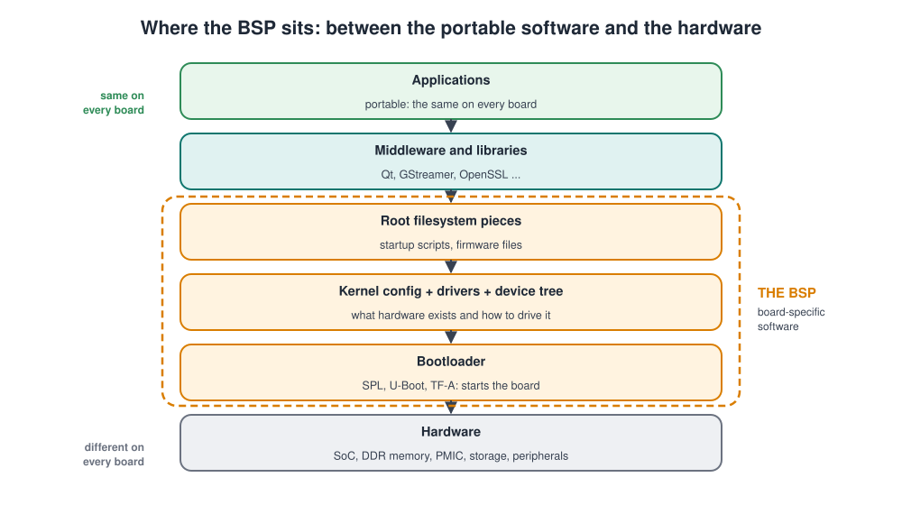
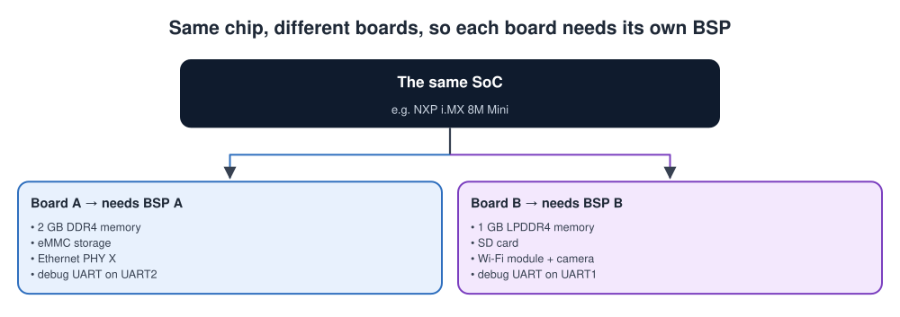
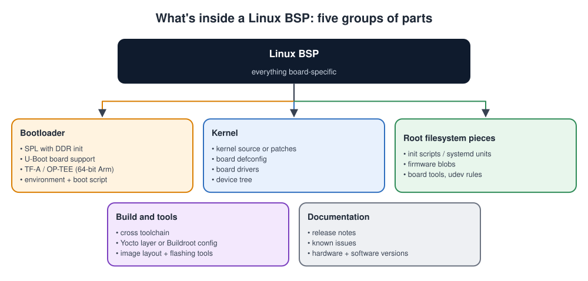
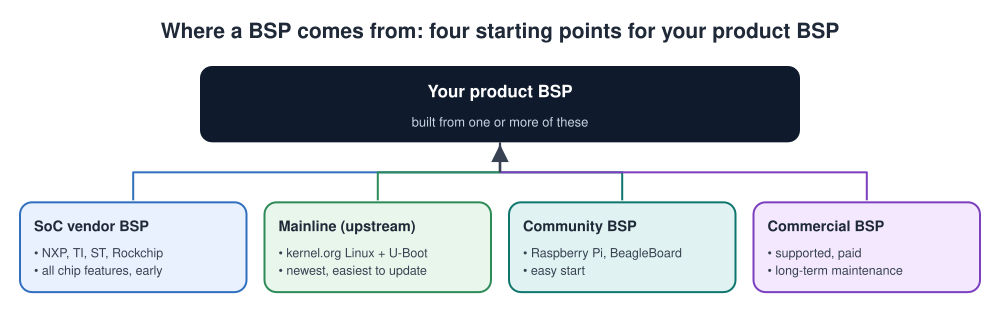
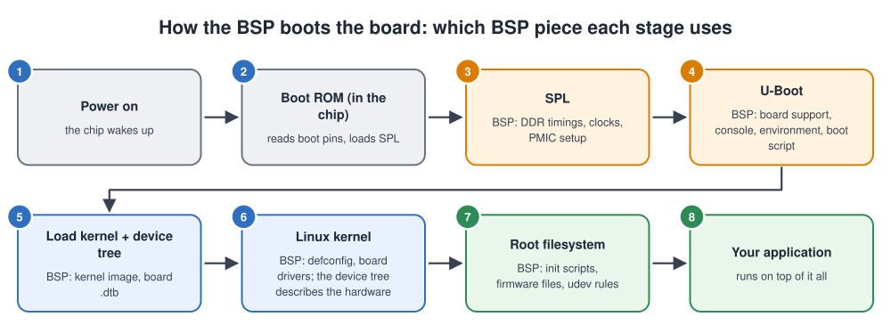
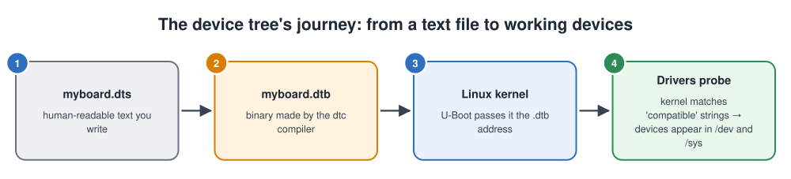
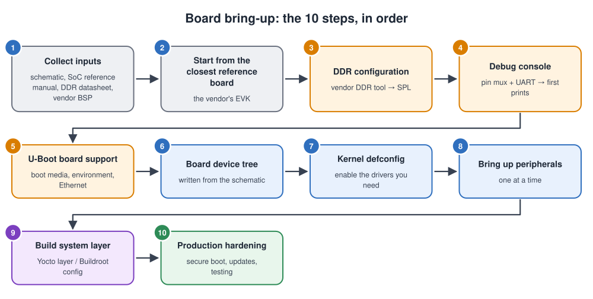
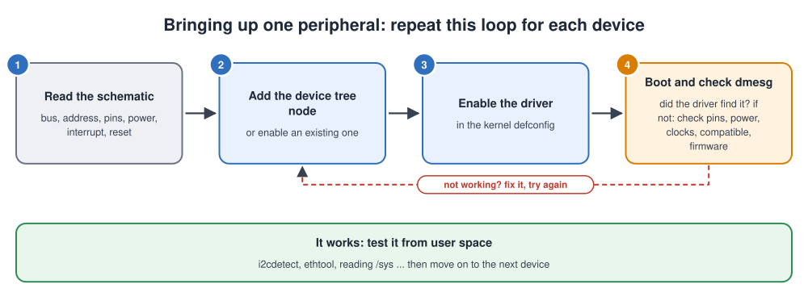
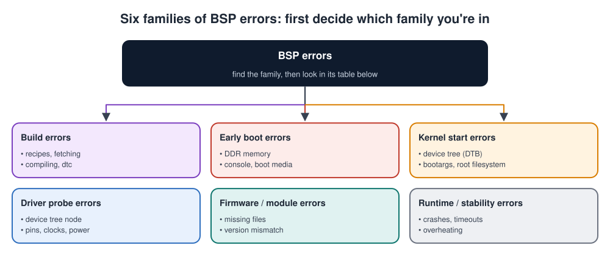

# BSP (Board Support Package)

## Contents

| # | Section | What you'll learn |
| --- | --- | --- |
| – | [Abbreviations](#abbreviations) | Every short form used in these notes, written in full |
| 1 | [What is a BSP?](#1-what-is-a-bsp) | The definition, an analogy, and where the BSP sits |
| 2 | [Why do we need one?](#2-why-do-we-need-a-bsp) | Why generic Linux can't just run on a new board |
| 3 | [What's inside a BSP](#3-whats-inside-a-bsp) | Every component and its job |
| 4 | [Where BSPs come from](#4-where-bsps-come-from) | Vendor, mainline, community, commercial, and your own |
| 5 | [How the BSP boots the board](#5-how-the-bsp-boots-the-board) | Which BSP part does what, stage by stage |
| 6 | [The device tree](#6-the-device-tree-the-heart-of-a-linux-bsp) | The heart of a Linux BSP, with an example |
| 7 | [Building a BSP: Yocto and Buildroot](#7-building-a-bsp-yocto-and-buildroot) | Layer structure, key settings, commands |
| 8 | [Making a custom BSP](#8-making-a-custom-bsp-board-bring-up) | Board bring-up, step by step, with milestones |
| 9 | [Errors a BSP can get](#9-errors-a-bsp-can-get) | Build, boot and driver errors, and how to debug them |
| 10 | [Maintaining a BSP](#10-maintaining-a-bsp) | Kernel versions, security updates, upstreaming |
| 11 | [Simple code examples](#11-simple-code-examples) | U-Boot defconfig and board file, kernel config fragment, flashing an SD card, a bring-up check script |
| 12 | [Interview quick answers](#12-interview-quick-answers) | Short answers to say out loud |

---

## Abbreviations

| Short form | Full form | In one line |
| --- | --- | --- |
| ACPI | Advanced Configuration and Power Interface | How a PC's firmware describes its hardware to the OS |
| BSP | Board Support Package | Board-specific software that lets an OS run on a board |
| CPU | Central Processing Unit | The processor core |
| CVE | Common Vulnerabilities and Exposures | Public ID numbers for security bugs |
| DDR | Double Data Rate (memory) | The type of external DRAM; LPDDR = Low-Power DDR |
| defconfig | Default configuration | A saved kernel or U-Boot configuration file |
| DRAM | Dynamic Random Access Memory | Large external working memory |
| DTB / DTS / DTSI / DTBO | Device Tree Blob / Source / Source Include / Blob Overlay | The device tree file types |
| dtc | Device Tree Compiler | Turns `.dts` text into a `.dtb` binary |
| eMMC | embedded MultiMediaCard | Flash storage chip soldered on the board |
| EVK | Evaluation Kit | The chip vendor's reference board |
| GIC | Generic Interrupt Controller | Arm's interrupt controller |
| GNU | GNU's Not Unix | The free-software project behind many Linux tools and the GPL |
| GPIO | General-Purpose Input/Output | A pin controlled directly by software |
| GPL | GNU General Public License | The open-source licence used by Linux |
| GPU | Graphics Processing Unit | The graphics processor |
| HAL | Hardware Abstraction Layer | Functions that hide hardware registers |
| hwmon | Hardware monitoring | The Linux subsystem for temperature, voltage and fan sensors |
| I2C | Inter-Integrated Circuit | A 2-wire bus for slow chips such as sensors |
| IC | Integrated Circuit | A chip |
| IRQ | Interrupt Request | An interrupt line |
| LED | Light-Emitting Diode | An indicator light |
| LTS | Long-Term Support | A kernel version maintained for several years |
| MAC | Media Access Controller | The Ethernet controller inside the SoC |
| MMC | MultiMediaCard | The card/storage family that includes SD and eMMC |
| NPU | Neural Processing Unit | Hardware accelerator for machine learning |
| NXP / ST / TI | NXP Semiconductors / STMicroelectronics / Texas Instruments | Chip vendors |
| OP-TEE | Open Portable Trusted Execution Environment | Secure-world OS on Arm |
| OS | Operating System | e.g. Linux |
| PC | Personal Computer | A desktop or laptop computer |
| PCI | Peripheral Component Interconnect | The PC expansion bus that can announce devices |
| PHY | Physical-layer chip | Converts digital signals to the cable signals (e.g. Ethernet) |
| PMIC | Power Management Integrated Circuit | The chip that supplies the board's voltages |
| RAM | Random Access Memory | Working memory |
| ROM | Read-Only Memory | Memory that can't be changed |
| rootfs | Root filesystem | The filesystem mounted at `/` |
| SD | Secure Digital | Removable memory card |
| SDK | Software Development Kit | Tools and libraries for application developers |
| SoC | System on Chip | Processor chip with many peripherals built in |
| SPI | Serial Peripheral Interface | A fast 4-wire bus (in `GIC_SPI`: Shared Peripheral Interrupt) |
| SPL | Secondary Program Loader | U-Boot's small first stage that initialises DRAM |
| TF-A | Trusted Firmware-A | Arm's secure firmware for application processors |
| U-Boot | Universal Boot Loader | The standard embedded Linux bootloader |
| UART | Universal Asynchronous Receiver-Transmitter | A simple serial port, used for the debug console |
| udev | Userspace device manager | Creates `/dev` entries and applies rules |
| URL | Uniform Resource Locator | A web address |
| USB | Universal Serial Bus | The standard PC connection |
| VFS | Virtual File System | The kernel layer that handles all filesystems |
| VPU | Video Processing Unit | Hardware video encoder/decoder |

---

## 1. What is a BSP?

> A **Board Support Package** is the collection of **board-specific software** (bootloader, kernel configuration, drivers, device tree, root filesystem pieces and build recipes) that lets a **standard operating system like Linux boot and run on one particular piece of hardware**.

### Key terms

| Word | Meaning |
| --- | --- |
| **SoC** (System on Chip) | The main processor chip. It contains the CPU (Central Processing Unit) cores plus many built-in peripherals (UART, I2C, SPI, USB, Ethernet controllers). |
| **Board** | The printed circuit board built around the SoC: memory, power chips, connectors, sensors. |
| **Bootloader** | The first software that runs after power-on. It prepares the hardware and starts Linux (see [Bootloader.md](Bootloader.md)). |
| **Kernel** | The core of Linux: it manages the CPU, memory and hardware drivers. |
| **Driver** | Kernel code that knows how to operate one kind of hardware. |
| **Device tree** | A text description of the board's hardware that the kernel reads at boot (explained in [section 6](#6-the-device-tree-the-heart-of-a-linux-bsp)). |
| **Root filesystem** (rootfs) | The files Linux runs from after boot: `/bin`, `/etc`, `/lib`, your programs. |

### The BSP block diagram


### An analogy: moving into a new house

| Moving house | Running Linux on a new board |
| --- | --- |
| Your furniture and appliances | Linux and your application: generic, they work anywhere |
| The new house: its own wiring, sockets, plumbing | The new board: its own memory chip, power chip, pins, peripherals |
| The electrician's plan showing where every socket and circuit is | The **device tree**: where every device is and how it's connected |
| Adapters and fittings made for this house | **Drivers and board configuration** |
| The front-door key and the main switch | The **bootloader**: gets you in and turns the power on |
| The whole kit, packed and labelled for this house | The **BSP** |

Your furniture doesn't change from house to house. The kit that connects it to the house does. In the same way, Linux and your application stay the same, and the BSP changes for each board.

### Where the BSP sits

The software on a board is built in layers. From top to bottom:

1. **Applications:** your programs. They are portable, so they are the same on every board.
2. **Middleware and libraries:** for example Qt (graphics), GStreamer (audio/video) and OpenSSL (cryptography). Also portable.
3. **The BSP (board-specific):**
   - root filesystem pieces: startup scripts and firmware files
   - kernel configuration, board drivers and the device tree
   - the bootloader
4. **Hardware:** the SoC, memory, power chips, storage and peripherals.



> **BSP vs HAL vs SDK: three words people mix up**
>
> | Term | What it is | Example |
> | --- | --- | --- |
> | **BSP** (Board Support Package) | Everything needed to boot an OS (Operating System) on a specific board | NXP i.MX 8M BSP (U-Boot, kernel, Yocto layer) |
> | **HAL** (Hardware Abstraction Layer) | A code layer that hides hardware registers behind functions, mainly on microcontrollers | STM32 HAL (`HAL_GPIO_WritePin()`) |
> | **SDK** (Software Development Kit) | Tools and libraries for writing *applications* on top of the BSP | The toolchain and headers a Yocto build exports |

---

## 2. Why do we need a BSP?

Linux itself is generic. It runs on thousands of different boards, but it can't guess the details of yours. Two boards can use the **same SoC** and still be completely different underneath:



In this example both boards use the same NXP i.MX 8M Mini chip, but they differ in:

- **Memory:** 2 GB **DDR4** vs 1 GB **LPDDR4**. DDR = Double Data Rate memory; LP = Low Power.
- **Storage:** **eMMC** (embedded MultiMediaCard, soldered flash) vs an **SD** (Secure Digital) card.
- **Extra chips:** an Ethernet **PHY** (physical-layer chip) vs a Wi-Fi module and a camera.
- **Debug port:** the debug **UART** (Universal Asynchronous Receiver-Transmitter, the serial console) is on UART2 vs UART1.

Because Linux must know all of these details, each board needs its own BSP.

What Linux doesn't know, and what the BSP adds:

| What Linux doesn't know | What goes wrong without a BSP | What the BSP provides |
| --- | --- | --- |
| Which DDR chip is fitted and its timings | Memory doesn't work, so nothing boots | DDR settings in the bootloader's first stage, **SPL** (Secondary Program Loader) |
| Which UART is the debug console | No output at all; you're debugging blind | Console settings in U-Boot and the kernel command line |
| Which peripherals exist and where | Drivers never load; devices are missing | The **device tree** |
| How the pins are routed (**pin mux**, pin multiplexing: each chip pin can carry one of several signals) | Signals come out on the wrong pins | Pin configuration in the device tree |
| Which power rails and clocks each device needs | Devices stay powered off or unstable | Regulator and clock descriptions |
| Which drivers to include | The kernel is too big, or a driver is missing | A kernel **defconfig** (default configuration file) for the board |
| Which firmware files chips need (Wi-Fi, **GPU** (Graphics Processing Unit), **VPU** (Video Processing Unit)) | The device is detected but doesn't work | Firmware files in the root filesystem |
| How to build and flash it all | Every developer builds a different image | Build recipes and flashing tools |

**In short:** the BSP turns "a board that powers on" into "a board that runs Linux reliably, with every peripheral working, built the same way every time."

---

## 3. What's inside a BSP

A BSP has five groups of parts:

1. **The bootloader** starts the board.
2. **The kernel parts** run Linux on it.
3. **The root filesystem pieces** configure it after boot.
4. **The build tools** build everything the same way every time.
5. **The documentation** tells users what they are getting.



| Component | What it is | Its job | Typical files |
| --- | --- | --- | --- |
| **Bootloader** | SPL + U-Boot (Universal Boot Loader). On 64-bit Arm it also includes **TF-A** (Trusted Firmware-A) and **OP-TEE** (Open Portable Trusted Execution Environment), which run the chip's secure side | Initialise DDR and clocks; load and start the kernel | `u-boot.img`, `SPL`/`MLO`, `boot.scr` |
| **Kernel source / patches** | The Linux kernel, often with vendor patches | The operating system core | A git tree or a set of patches |
| **Kernel config** | A `defconfig` for the board | Choose which drivers and features are built | `arch/arm64/configs/myboard_defconfig` |
| **Device tree** | A hardware description (`.dts`, `.dtsi`, compiled to `.dtb`) | Tell the kernel which devices exist and how they're wired | `myboard.dts` → `myboard.dtb` |
| **Board drivers** | Drivers for board-specific chips: the **PMIC** (Power Management IC), audio codec, display | Make each peripheral work | `drivers/...` patches or out-of-tree modules |
| **Firmware blobs** | Binary files that chips load at run time | Run Wi-Fi, Bluetooth, GPU, video and DDR training | `/lib/firmware/...` |
| **Root filesystem pieces** | Startup scripts, services, **udev** rules (rules for the Linux device manager), board tools | Configure the board after the kernel starts | systemd units, `/etc/...` |
| **Toolchain** | A **cross-compiler**: runs on a PC but produces code for the board's CPU | Build everything on a PC for the board | `aarch64-linux-gnu-gcc` or a Yocto SDK |
| **Build recipes** | A Yocto BSP layer or a Buildroot board configuration | Build every piece the same way every time | `meta-myboard/`, `board/myco/myboard/` |
| **Image and flashing tools** | The partition layout, plus tools to write it | Produce and install a bootable image | `.wic`, `sdcard.img`, `uuu`, `dd` |
| **Documentation** | Release notes, supported features, known issues | Tell users what works and which versions | `README`, release notes |

---

## 4. Where BSPs come from

A product's BSP is usually built from one or more of four sources. Most products start from the **vendor's BSP** and move towards **mainline** over time, so updates stay easy.



| Source | What you get | Strengths | Weaknesses |
| --- | --- | --- | --- |
| **SoC vendor** (NXP, TI, ST, Rockchip) | Vendor kernel + U-Boot + Yocto layer, for their **EVK** (Evaluation Kit, the vendor's reference board) | Supports every SoC feature (GPU, VPU, **NPU** (Neural Processing Unit)) early; well tested on the EVK | Often an older kernel with many out-of-tree patches; harder to update |
| **Mainline / upstream** | The standard kernel.org Linux and U-Boot, with your board's device tree | Latest kernel, security fixes, long-term maintainability | Some SoC features (GPU, video) may arrive later or be missing |
| **Community** (Raspberry Pi, BeagleBoard) | A ready kernel, bootloader and images for that board | Easy to start, many users | Tied to that board; you don't control the release schedule |
| **Commercial** (OS vendors, consultancies) | A supported BSP with long-term maintenance | Support contracts, certifications, security updates | Cost; less control |
| **Your own** | A BSP for your custom board, usually built from the vendor or mainline BSP | Fits your product exactly | You own the maintenance |

**The usual real-world path:**

1. Start from the **vendor BSP for the evaluation kit**.
2. Add a **layer for your board**: its device tree, defconfig, U-Boot board support and fixes.
3. Over time, move closer to **mainline** so updates stay easy.

---

## 5. How the BSP boots the board

Each boot stage uses a different piece of the BSP:



Step by step:

1. **Power on.** The chip wakes up.
2. **Boot ROM** (Read-Only Memory code inside the chip). It reads the boot pins and loads the SPL. It is not part of the BSP, because it can't be changed.
3. **SPL.** Uses the BSP's **DDR timings**, clock and PMIC setup to bring up the external memory.
4. **U-Boot.** Uses the BSP's **board support**: the console, the environment (saved settings) and the boot script.
5. **Load the kernel and device tree.** U-Boot loads the BSP's kernel image and the board's `.dtb` into memory.
6. **Linux kernel.** Uses the BSP's **defconfig** and board drivers. The device tree tells it what hardware exists.
7. **Root filesystem.** Uses the BSP's **init scripts, firmware files and udev rules**.
8. **Your application** runs on top of all of this.

If a stage fails, the BSP piece used by that stage is the first thing to check:

| Stage | BSP piece used | If this piece is wrong |
| --- | --- | --- |
| SPL | DDR configuration | A hang right after power-on, or random crashes later |
| U-Boot | Board support, console, environment | No U-Boot prompt; wrong boot device |
| Kernel start | Kernel image + device tree + `bootargs` (the kernel command line) | Hangs after "Starting kernel ..." |
| Driver probe (a driver checking and starting its device) | Device tree nodes + drivers in the defconfig | Devices missing from `/dev`; "probe failed" in `dmesg` (the kernel log) |
| User space | Firmware files, init scripts | Wi-Fi or GPU present but not working; services failing |

For the details of the SPL and U-Boot stages, see [Bootloader.md, section 5](Bootloader.md#5-boot-flow-linux-vs-iot-mcu).

---

## 6. The device tree: the heart of a Linux BSP

> The device tree has its own notes: [Device_tree.md](Device_tree.md) explains the file types, the syntax, compiling, overlays and debugging, with examples. This section covers only **what the BSP has to provide**.

Most embedded hardware can't announce itself to Linux the way PC hardware can. So a Linux BSP must include a **description of the board**, the **device tree**, kept separate from the kernel code so that one kernel image can support many boards.



1. **You write** the board description as a text file: `myboard.dts`.
2. **The `dtc` compiler** turns it into a small binary: `myboard.dtb`.
3. **At boot, U-Boot** loads the `.dtb` and gives its address to the kernel.
4. **The kernel** matches each node's `compatible` string to a driver, and the device appears in `/dev` and `/sys`.

**What the BSP provides:**

| Piece | Who writes it | What it holds |
| --- | --- | --- |
| The SoC `.dtsi` | The chip vendor | Everything inside the chip, mostly `disabled` |
| The board `.dts` | **You**, from the schematic | Includes the `.dtsi`, enables what the board uses, adds the chips outside the SoC |
| Overlays (`.dtbo`), if needed | You | Add-on boards and product variants |

A complete board example, line by line, is in [Device_tree.md, section 6](Device_tree.md#6-a-complete-board-example). If a device is missing or its driver doesn't probe, use the checks in [Device_tree.md, section 13](Device_tree.md#13-debugging-a-device-tree).

---

## 7. Building a BSP: Yocto and Buildroot

A BSP isn't a pile of files you copy by hand. It's **recipes** that a build system uses to produce everything from source, identically, every time. The two common build systems are **Yocto** (large and flexible; see [Yocto_fundamentals.md](Yocto_fundamentals.md)) and **Buildroot** (small and simple).

### 7.1 Yocto: the BSP is a layer

In Yocto, a BSP is a **layer**, usually called `meta-<something>`, that you add on top of the standard layers.

```text
meta-myboard/
├── conf/
│   ├── layer.conf                     ← declares the layer
│   └── machine/
│       └── myboard.conf               ← THE machine definition
├── recipes-bsp/
│   └── u-boot/
│       ├── u-boot-imx_%.bbappend      ← add board support / patches to U-Boot
│       └── files/0001-add-myboard.patch
├── recipes-kernel/
│   └── linux/
│       ├── linux-imx_%.bbappend       ← add device tree, defconfig, patches
│       └── files/
│           ├── myboard.dts
│           ├── defconfig
│           └── 0001-fix-pmic.patch
└── wic/
    └── myboard.wks                    ← SD card / eMMC partition layout
```

The **machine file** is where the board is defined:

```bash
# conf/machine/myboard.conf  (simplified)
require conf/machine/include/imx8mm-evk.inc     # start from the vendor's EVK
PREFERRED_PROVIDER_virtual/kernel     = "linux-imx"
PREFERRED_PROVIDER_virtual/bootloader = "u-boot-imx"
UBOOT_CONFIG[sd]   = "myboard_defconfig,sdcard"
KERNEL_DEVICETREE  = "freescale/myboard.dtb"
SERIAL_CONSOLES    = "115200;ttymxc1"
WKS_FILE           = "myboard.wks"
```

`ttymxc1` is the Linux name of the second serial port on NXP i.MX chips ("mxc" is NXP's driver name; numbering starts at 0).

Building it:

```bash
source oe-init-build-env build
bitbake-layers add-layer ../meta-myboard
echo 'MACHINE = "myboard"' >> conf/local.conf
bitbake core-image-minimal            # the image to flash
bitbake core-image-minimal -c populate_sdk   # SDK for application developers
```

### 7.2 Buildroot: the BSP is a board config

Buildroot is simpler: one configuration file plus a board folder.

```text
configs/myboard_defconfig        ← all choices: toolchain, kernel, U-Boot, packages
board/mycompany/myboard/
├── myboard.dts
├── linux.config                 ← kernel defconfig
├── genimage.cfg                 ← SD card layout
├── post-image.sh                ← builds the final image
└── rootfs_overlay/              ← files copied into the root filesystem
```

```bash
make myboard_defconfig
make                              # output/images/sdcard.img
```

### 7.3 Which one?

| | **Yocto** | **Buildroot** |
| --- | --- | --- |
| Learning curve | Steep | Gentle |
| Build time | Long first build (hours) | Shorter |
| Package management | Yes (rpm/ipk/deb), updatable packages | No; a single firmware image |
| Scale | Large products, many variants, long-term maintenance | Small, fixed-function products |
| Vendor support | Most SoC vendors ship Yocto BSP layers | Many boards in the tree, less vendor focus |
| SDK for app teams | Built in (`populate_sdk`) | Possible, less polished |

---

## 8. Making a custom BSP (board bring-up)

**Board bring-up** is the process of taking a brand-new custom board and getting Linux running on it, one piece at a time.

### 8.1 The steps



1. **Collect the inputs:** the schematic, the SoC reference manual, the DDR memory datasheet and the vendor BSP.
2. **Start from the closest reference board** (the vendor's EVK) and note every difference from your board.
3. **DDR configuration:** generate the memory timings with the vendor's DDR tool and put them into SPL.
4. **Debug console:** set the pin mux for the debug UART, so SPL prints its first messages.
5. **U-Boot board support:** boot media, environment, Ethernet.
6. **Board device tree:** written from the schematic, one node per device.
7. **Kernel defconfig:** enable the drivers the board needs.
8. **Bring up the peripherals one at a time** (see 8.3).
9. **Build system layer:** capture everything in a Yocto layer or Buildroot configuration, so the build is repeatable.
10. **Production hardening:** secure boot, updates, stress and power-cycle testing.

### 8.2 Milestones: know where you are

Bring-up is easier when you celebrate small wins in order. Each milestone depends on the one before it.

| # | Milestone | What it proves | If you're stuck here, check |
| --- | --- | --- | --- |
| 1 | **SPL prints on the serial console** | Power, clocks, boot pins and the UART pin mux are right | Boot-mode pins, UART pins and baud rate, SPL written to the right offset |
| 2 | **DDR passes a memory test** | The DDR configuration is right | DDR timings from the vendor's DDR tool; board layout issues |
| 3 | **The U-Boot prompt appears** | U-Boot runs from DRAM (Dynamic RAM); board support is basically correct | U-Boot defconfig, boot media driver |
| 4 | **The kernel prints its first messages** | The kernel image, device tree and `console=` are right | `bootargs`, device tree address, `earlycon` (early console output) |
| 5 | **The root filesystem mounts and you get a shell** | Storage driver, `root=`, filesystem support | `root=`, `rootwait`, ext4 enabled |
| 6 | **Each peripheral works** | Device tree + drivers + firmware per device | `dmesg`, `/sys/kernel/debug/devices_deferred`, the schematic |
| 7 | **Clean, repeatable build** | Anyone can rebuild the same image | Yocto layer / Buildroot config committed and versioned |
| 8 | **Production ready** | Secure, updatable, tested | Secure boot, A/B updates, stress and power-cycle tests |

### 8.3 Bringing up one peripheral: the loop

Repeat this loop for each device on the schematic: an I2C sensor, **SPI** (Serial Peripheral Interface) flash, an Ethernet PHY, a display, and so on.



1. **Read the schematic** for the device: its bus, address, pins, power supply, interrupt and reset lines.
2. **Add or enable its device tree node.**
3. **Enable its driver** in the kernel defconfig.
4. **Boot and check `dmesg`:** did the driver find the device?
5. **If it doesn't work,** check the pins, power, clocks, the `compatible` string and any firmware file, and measure with an oscilloscope if needed. Then go back to step 2 with a fix.
6. **When it works,** test it from user space (for example with `i2cdetect`, `ethtool` or by reading `/sys`), then move on to the next device.

**Handy tools during bring-up:**

| Tool | Checks |
| --- | --- |
| `dmesg` | The kernel log: which drivers probed and which failed |
| `i2cdetect -y 1` | Which I2C addresses answer on bus 1 |
| `gpioinfo` / `gpioset` (libgpiod) | GPIO line names and states |
| `cat /sys/kernel/debug/pinctrl/*/pinmux-pins` | Which function each pin is set to |
| `ethtool eth0`, `ip link` | Ethernet link and PHY |
| `cat /proc/interrupts` | Whether a device's interrupt is firing |
| `memtester` | DRAM stability under load |
| Oscilloscope / logic analyser | Whether the signal really comes out of the pin |

### 8.4 Custom BSP checklist

| ✔ | Item |
| --- | --- |
| ☐ | Started from the closest vendor reference board; differences documented |
| ☐ | DDR configuration generated with the vendor tool and stress-tested |
| ☐ | Debug console works from SPL to Linux |
| ☐ | Board device tree written from the schematic, one node per device |
| ☐ | Kernel defconfig trimmed to what the board needs |
| ☐ | Every peripheral tested from user space |
| ☐ | Firmware blobs included, with licences checked |
| ☐ | Yocto layer or Buildroot config in version control; builds are reproducible |
| ☐ | Kernel, U-Boot and BSP versions recorded in release notes |
| ☐ | SDK available for application developers |
| ☐ | Secure boot, update mechanism and debug-port lockdown planned |
| ☐ | Stress, temperature and power-cycle tests pass |

---

## 9. Errors a BSP can get

### 9.1 The families of errors



Every BSP problem belongs to one of six families, roughly in the order things happen:

1. **Build errors:** recipes, fetching source code, compiling, `dtc`.
2. **Early boot errors:** DDR memory, the console, boot media.
3. **Kernel start errors:** the device tree, boot arguments, the root filesystem.
4. **Driver probe errors:** device tree nodes, pins, clocks, power.
5. **Firmware and module errors:** missing files, version mismatches.
6. **Runtime and stability errors:** crashes, timeouts, overheating.

Decide which family you're in first, then use the matching table below.

### 9.2 Common errors: what they mean and how to fix them

#### Build time (Yocto, Buildroot, kernel build)

| Error / symptom | What it means | Likely cause | Fix |
| --- | --- | --- | --- |
| **`ERROR: Nothing PROVIDES 'xyz'`** (Yocto) | No recipe in your layers supplies `xyz` | Layer not added, or a wrong `PREFERRED_PROVIDER` | `bitbake-layers add-layer ...`; check the machine file |
| **`Fetcher failure`** / `do_fetch` failed (Yocto) | The source couldn't be downloaded | Wrong URL or git revision, no network, missing checksum | Fix `SRC_URI` / `SRCREV`; set up a download mirror |
| **`dtc` reports a syntax error** | The device tree didn't compile | Missing `;`, wrong label, missing `#include` | Fix the line `dtc` names; check the `&label` names exist in the `.dtsi` |
| **Kernel build fails after applying a patch** | The patch doesn't match this kernel version | BSP patch written for a different kernel | Rebase the patch; pin the kernel version |

#### Early boot and kernel start

| Error / symptom | What it means | Likely cause | Fix |
| --- | --- | --- | --- |
| **No output at all** | Nothing reaches the serial console | Boot pins, UART pin mux, baud rate, SPL location | Check the boot mode, UART wiring and baud rate; see [Bootloader.md, section 7](Bootloader.md#7-errors-a-bootloader-can-get) |
| **Random crashes, memory corruption** | DRAM is unstable | DDR timings slightly wrong, board signal issues | Re-run the vendor DDR tool; run `memtester` |
| **Hangs after `Starting kernel ...`** | The kernel started but can't print | Wrong `console=`, wrong **DTB** (Device Tree Blob), kernel not built for this SoC | Fix `console=`; add `earlycon`; check the DTB |
| **`VFS: Unable to mount root fs`** | The kernel can't find or read the root filesystem (**VFS** = Virtual File System, the kernel's filesystem layer) | Wrong `root=`, no `rootwait`, storage driver or ext4 not built in | Fix `bootargs`; enable the **MMC** (MultiMediaCard, covers SD and eMMC) driver and ext4 in the defconfig |

#### Drivers and device tree

| Error / symptom | What it means | Likely cause | Fix |
| --- | --- | --- | --- |
| **Device missing, probe deferred (`-517`) or rejected (`-22`), pin conflicts** | A device tree or driver problem | See the full table in [Device_tree.md, section 13.3](Device_tree.md#133-common-errors) | Follow the checks there, in order |
| **I2C transfers time out / `i2cdetect` shows nothing** | Nothing answers on the bus | Wrong pins, no pull-up resistors, device not powered or held in reset | Check the pin mux, pull-ups, power rail and reset GPIO; probe with an oscilloscope |
| **Ethernet: no link, PHY not found** | The **MAC** (Media Access Controller, the Ethernet controller inside the SoC) can't talk to the PHY | Wrong PHY address, reset GPIO, clock or `phy-mode` | Match the PHY address and `phy-mode` to the schematic |

#### Firmware and modules

| Error / symptom | What it means | Likely cause | Fix |
| --- | --- | --- | --- |
| **`Direct firmware load for <file> failed with error -2`** | The driver asked for a firmware file that isn't there (-2 = `ENOENT`, "no such file") | Firmware blob missing from the rootfs | Add the firmware package / file under `/lib/firmware` |
| **`Unknown symbol`** when loading a module | The module needs a function the kernel doesn't provide | Feature not enabled, or module built for another kernel | Enable the feature; rebuild the module against this kernel |
| **`disagrees about version of symbol`** | The module was built for a different kernel build | Kernel and modules out of sync | Rebuild and deploy the kernel and modules together |
| **`Unable to handle kernel NULL pointer dereference`** | A driver crashed | A driver bug, often triggered by unexpected device tree data | Read the stack trace; check the driver's probe path |

### 9.3 A simple method for BSP debugging


Answer these questions in order:

1. **Does the build fail?** Read the **first** error, not the last. Check the layers, versions and the `dtc` line.
2. **Is there any serial output?** If not, check the hardware first: power, boot pins, UART and DDR (see [Bootloader.md](Bootloader.md)).
3. **Does the kernel reach a shell?** If not, check the boot settings: `console=`, the device tree, `root=` and the storage driver.
4. **Is only one device missing?** Follow this chain:
   1. read `dmesg`
   2. check `devices_deferred`
   3. check the device tree node
   4. check the defconfig
   5. check the pins, power and clocks
   6. measure the signals with an oscilloscope

**Golden rules for BSP work:**

1. **The schematic is the source of truth.** The device tree must match it line for line.
2. **Change one thing at a time**, and keep every change in the build system, not only on the board.
3. **Read `dmesg` from the top.** The first error usually causes the later ones.
4. **Compare with the reference board.** If it works on the EVK and not on yours, the difference is your answer.
5. **When software looks right, measure the hardware.** An oscilloscope settles arguments quickly.

---

## 10. Maintaining a BSP

A BSP isn't finished when the board boots. It lives as long as the product.

| Topic | Why it matters | Good practice |
| --- | --- | --- |
| **Kernel version** | Vendor kernels age quickly; old kernels stop getting fixes | Prefer an **LTS** (Long-Term Support) kernel; plan how to move to the next one |
| **Security updates** | The kernel, U-Boot, OpenSSL and others regularly get **CVEs** (Common Vulnerabilities and Exposures: publicly numbered security bugs) | Track CVEs; ship updates with an A/B update system |
| **Upstreaming** | Patches kept only in your tree must be re-applied on every upgrade | Send device tree and driver changes to mainline where possible |
| **Version pinning** | "Latest" today is different tomorrow | Pin every git revision; keep build mirrors |
| **Reproducible builds** | You must be able to rebuild an old release years later | Keep layers, toolchains and downloads archived |
| **Documentation** | Customers and new engineers need to know what works | Release notes: versions, supported features, known issues |
| **Licensing** | **GPL** (GNU General Public License) code and firmware blobs have legal obligations | Generate a licence manifest (Yocto does this); keep sources available |

---

## 11. Simple code examples

Small examples of the files and commands you touch when you make a BSP, in the order of board bring-up ([section 8](#8-making-a-custom-bsp-board-bring-up)). The names (`myboard`, `mycompany`) are placeholders.

### Example 1: The U-Boot board configuration (defconfig)

`configs/myboard_defconfig` in the U-Boot source holds every choice for your board. A short extract:

```text
CONFIG_ARM=y
CONFIG_ARCH_IMX8M=y
CONFIG_TARGET_MYBOARD=y                   # selects board/mycompany/myboard/
CONFIG_DEFAULT_DEVICE_TREE="myboard"      # U-Boot's own device tree
CONFIG_SPL=y                              # build the first stage (SPL) too
CONFIG_SPL_SERIAL=y                       # SPL may print to the UART
CONFIG_SPL_MMC=y                          # SPL can load U-Boot from SD / eMMC
CONFIG_BOOTDELAY=2                        # 2-second countdown before booting
CONFIG_ENV_IS_IN_MMC=y                    # save settings (saveenv) on the eMMC
CONFIG_CMD_I2C=y                          # the "i2c" command, useful in bring-up
```

**Build it:**

```bash
make myboard_defconfig                                  # load the board's settings
make menuconfig                                         # optional: change them in a menu
make -j$(nproc) CROSS_COMPILE=aarch64-linux-gnu-        # → SPL and u-boot.itb (or u-boot.img)
make savedefconfig && cp defconfig configs/myboard_defconfig   # keep your changes
```

On i.MX 8M, U-Boot also needs the TF-A and DDR firmware files next to it. The vendor's board guide lists them.

### Example 2: The U-Boot board file

`board/mycompany/myboard/myboard.c` holds the few things that are special about this board:

```c
#include <init.h>
#include <env.h>

int board_init(void)            /* runs in U-Boot proper, after DRAM works */
{
    /* board-only set-up: e.g. switch on the Ethernet PHY's power, release a reset GPIO */
    return 0;
}

int board_late_init(void)       /* runs just before the boot countdown */
{
    env_set("board_name", "myboard");
    env_set("fdtfile", "myboard.dtb");      /* which device tree the boot script loads */
    return 0;
}
```

### Example 3: The kernel configuration for the board

Keep the board's kernel options in a small **fragment** file, `myboard.config`:

```text
CONFIG_LEDS_GPIO=y           # LEDs from the device tree
CONFIG_SPI_IMX=y             # the SoC's SPI controller
CONFIG_MTD_SPI_NOR=y         # the SPI flash chip on the board
CONFIG_SENSORS_TMP102=m      # the temperature sensor, as a module
CONFIG_CAN_FLEXCAN=m         # the SoC's CAN controller
```

**Merge it into a standard configuration and build:**

```bash
export ARCH=arm64 CROSS_COMPILE=aarch64-linux-gnu-
make defconfig                                              # the generic arm64 base
scripts/kconfig/merge_config.sh -m .config myboard.config   # add the board's options
make olddefconfig                                           # fill in anything they depend on
make -j$(nproc) Image modules dtbs                          # kernel, modules, device trees
```

In Yocto, the same fragment goes into the kernel `.bbappend` as `SRC_URI += "file://myboard.config"` ([Yocto_fundamentals.md](Yocto_fundamentals.md)).

### Example 4: Write the image to an SD card

```bash
lsblk                                            # find the SD card, e.g. /dev/sdb. Check twice!
sudo dd if=myboard-image.wic of=/dev/sdb bs=4M conv=fsync status=progress

# Faster: bmaptool skips the empty parts (Yocto makes a .bmap file next to the image)
sudo bmaptool copy myboard-image.wic.gz /dev/sdb
```

> **`dd` writes to whatever device you name.** Giving it your PC's own disk by mistake erases it. Always check the device name with `lsblk` first.

### Example 5: A bring-up check script

Run it on the board after the first boot, and compare the output with the schematic: every chip and port on the board should appear.

```sh
#!/bin/sh
# bringup-check.sh: a quick report of what the kernel found on this board

echo "== Board ==";        cat /proc/device-tree/model; echo
echo "== Kernel ==";       uname -r
echo "== Memory ==";       grep MemTotal /proc/meminfo
echo "== Storage ==";      lsblk -d -o NAME,SIZE,TYPE
echo "== Network ==";      ip -br link
echo "== Serial ports =="; ls /dev/ttymxc* /dev/ttyS* 2>/dev/null
echo "== I2C buses ==";    ls /dev/i2c-* 2>/dev/null
echo "== SPI flash ==";    cat /proc/mtd
echo "== LEDs ==";         ls /sys/class/leds/
echo "== Waiting devices =="
cat /sys/kernel/debug/devices_deferred 2>/dev/null || echo "(mount debugfs to see this)"
echo "== Errors and warnings =="
dmesg --level=err,warn | tail -20
```

**How to read it:**

1. The **memory** size must match the board's DDR (for example 2 GB).
2. Every **port** on the schematic should be listed: UARTs, I2C buses, network interfaces.
3. **Waiting devices** should be empty. Anything listed is missing a clock, regulator or GPIO ([section 9](#9-errors-a-bsp-can-get)).
4. Read every **error and warning** line once, and explain it.

---

## 12. Interview quick answers

**Q: What is a BSP?**

> "A Board Support Package is the board-specific software that lets a standard OS like Linux boot and run on a particular board: the bootloader with DDR setup, the kernel configuration and drivers, the device tree describing the hardware, root filesystem pieces like firmware and startup scripts, and the build recipes, usually a Yocto layer or a Buildroot config, that build it all reproducibly."

**Q: Why can't we just use a generic Linux image?**

> "Linux can't discover most embedded hardware by itself. It needs to know the DDR configuration, which UART is the console, which peripherals exist, how pins are muxed, and which regulators and clocks each device needs. That board knowledge lives in the BSP, mostly in the bootloader and the device tree."

**Q: What is a device tree and why is it used?**

> "A data structure that describes the board's hardware (devices, addresses, interrupts, clocks, pins, power) separately from the kernel code. The bootloader passes the compiled `.dtb` to the kernel, and the kernel matches each node's `compatible` string to a driver. That lets one kernel binary support many boards, and adding a board is mostly writing a new `.dts`."

**Q: How would you bring up Linux on a new custom board?**

> "Start from the closest vendor reference board. Get the DDR configuration from the vendor's tool into SPL, then get the debug UART printing. Next, U-Boot with the boot media, then the kernel with a board device tree written from the schematic and a trimmed defconfig. Bring up peripherals one at a time using `dmesg` and the deferred-probe list, and finally capture everything in a Yocto layer or Buildroot config so the build is reproducible. My milestones are: SPL prints, DDR passes a memory test, U-Boot prompt, kernel prints, rootfs mounts, then each peripheral."

**Q: Vendor BSP or mainline?**

> "The vendor BSP gets you running fastest and supports every SoC feature, but it's often an older, heavily patched kernel that's hard to update. Mainline is better for long-term security and maintenance. A common strategy is to start from the vendor BSP and move towards mainline over the product's life, upstreaming our own device tree and driver changes."

**Q: A driver doesn't load on your board. How do you debug it?**

> "First check whether it's silent or failing. If silent, the driver probably isn't in the defconfig, the `compatible` string doesn't match, or the node is disabled. If `dmesg` shows `-517`, it's a deferred probe, so I look at `/sys/kernel/debug/devices_deferred` to see which clock, regulator or GPIO is missing. Then I check pins, power and clocks against the schematic, and finally measure the signals with a scope."

**Q: Yocto or Buildroot?**

> "Buildroot for small, fixed-function products where a single image is enough. It's simpler and builds faster. Yocto for larger products with many variants, package management, SDKs for app teams and long maintenance. It's also what most SoC vendors ship their BSPs for."

---

**Related notes:** [Bootloader.md](Bootloader.md) covers the SPL and U-Boot stages of the BSP in depth, including secure boot and cryptography.
