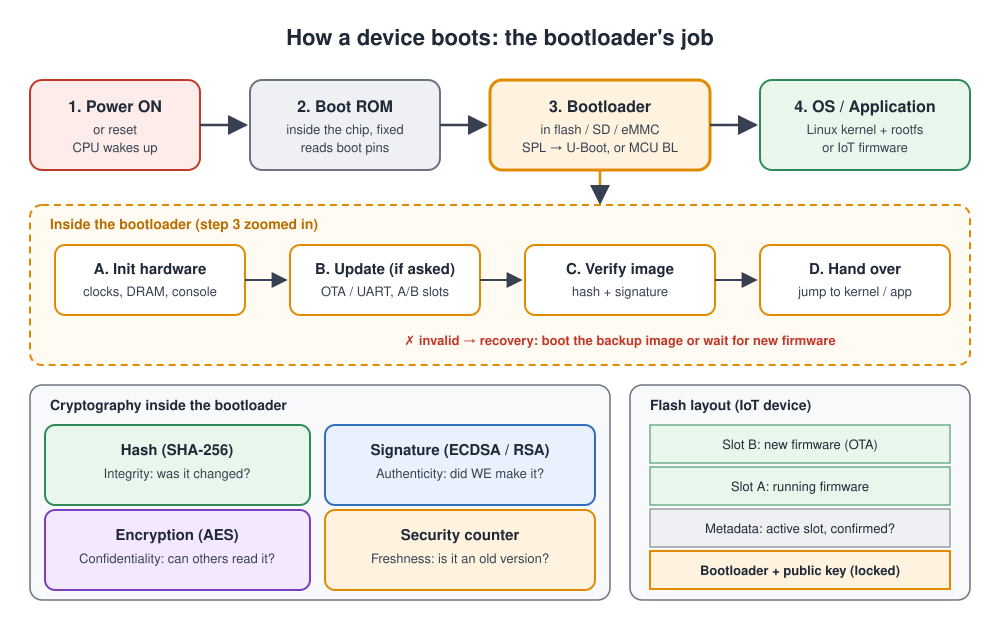
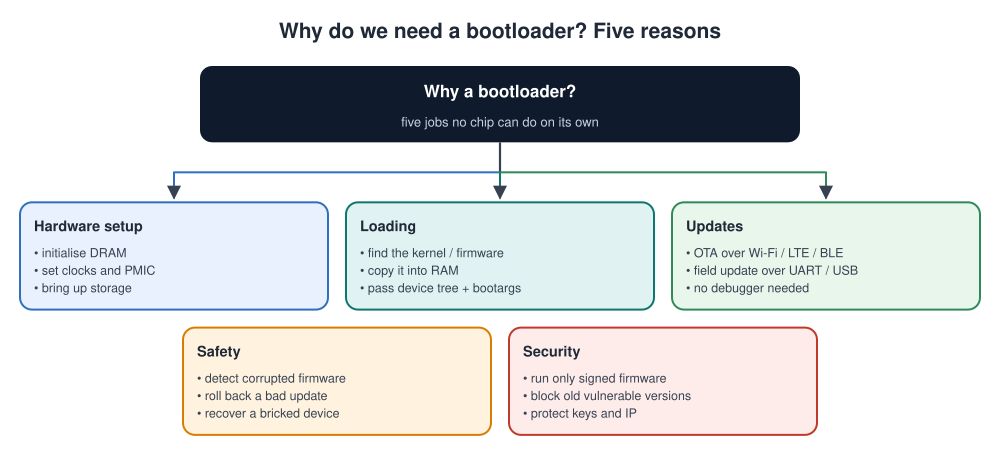
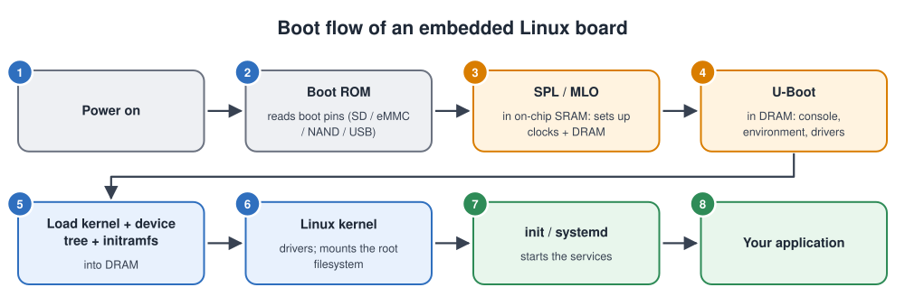
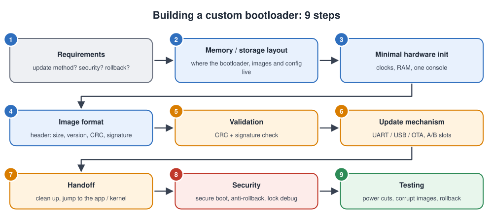
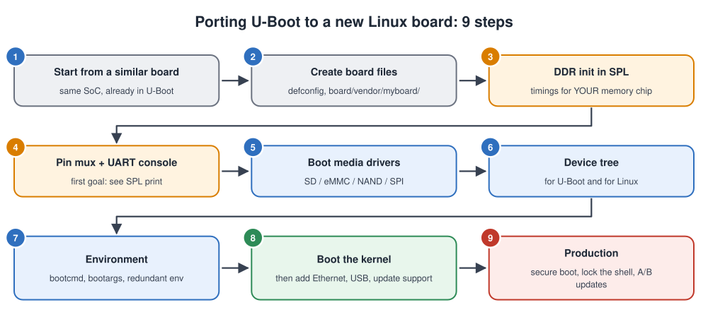
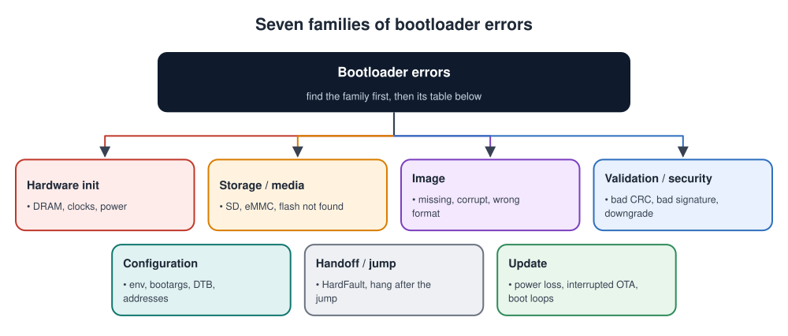
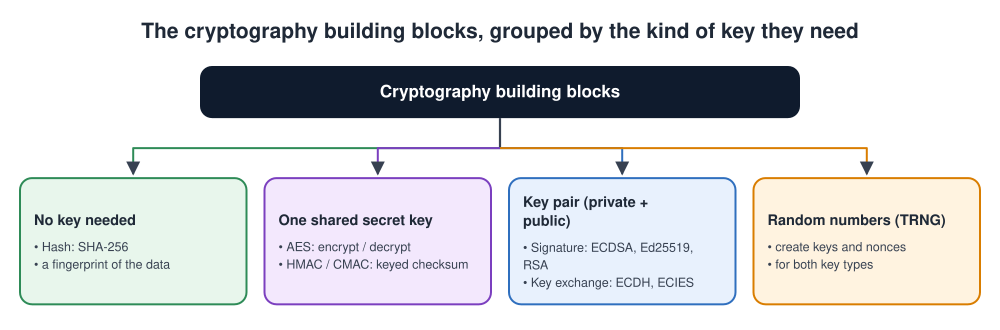
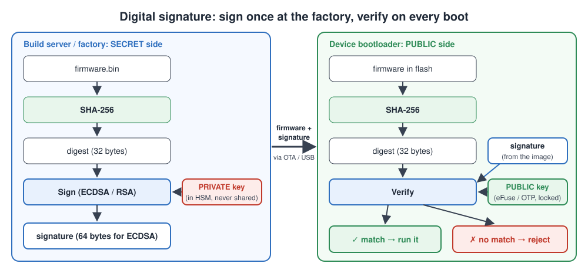
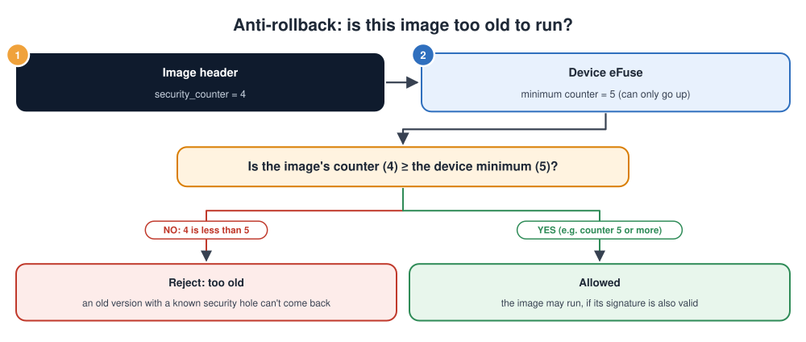
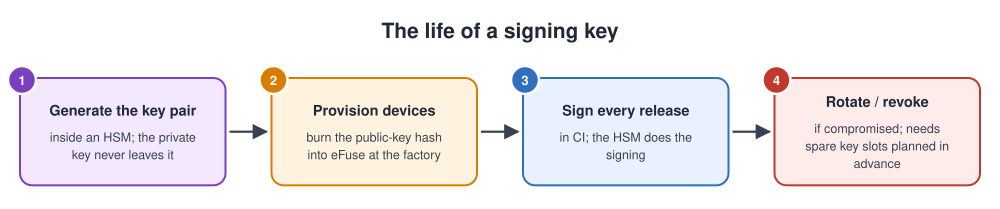

# Bootloader

## Contents

| # | Section | What you'll learn |
| --- | --- | --- |
| – | [Abbreviations](#abbreviations) | Every short form used in these notes, written in full |
| 1 | [What is a bootloader?](#1-what-is-a-bootloader) | The definition, the block diagram, the basic flow, and what a bootloader does |
| 2 | [Why do we need one?](#2-why-do-we-need-a-bootloader) | The problems a bootloader solves |
| 3 | [How the chip finds the bootloader](#3-how-the-chip-finds-the-bootloader-boot-rom-boot-pins-and-otp) | The 5 boot steps, the Boot ROM, boot pins, OTP / eFuse settings and boot order |
| 4 | [Types of bootloaders](#4-types-of-bootloaders) | Bootloaders you already know; type 1, by stages (first and second stage and their work); type 2, by extra job |
| 5 | [Boot flow: Linux vs IoT MCU](#5-boot-flow-linux-vs-iot-mcu) | The two boot sequences, step by step and side by side |
| 6 | [Making a custom bootloader](#6-making-a-custom-bootloader) | The steps, decisions and checklist for building your own |
| 7 | [Errors a bootloader can get](#7-errors-a-bootloader-can-get) | Common error messages, their causes and fixes, and a debugging method |
| 8 | [Bootloader cryptography](#8-bootloader-cryptography) | Hashes, signatures, encryption, keys, chain of trust, anti-rollback |
| 9 | [A real secure bootloader: ST SBSFU](#9-a-real-secure-bootloader-st-sbsfu) | What SBSFU is, its three parts, flash layout, image format, crypto schemes, boot steps, protections, and a first run on a Nucleo board |
| 10 | [Simple code examples](#10-simple-code-examples) | First stage (SPL), second stage (U-Boot commands, boot script, A/B), an MCU bootloader: decide, check, jump; linker scripts; network boot |
| 11 | [Interview quick answers](#11-interview-quick-answers) | Short answers to say out loud |

---

## Abbreviations

| Short form | Full form | In one line |
| --- | --- | --- |
| A/B | Two slots, A and B | Two copies of the firmware so one can be updated while the other still works |
| ABL | Android Boot Loader | The bootloader on Qualcomm-based Android phones |
| ACK / NACK | Acknowledge / Negative Acknowledge | "Received correctly" / "please resend" |
| AEAD | Authenticated Encryption with Associated Data | Encryption that also detects tampering (e.g. AES-GCM) |
| AES | Advanced Encryption Standard | The standard symmetric encryption algorithm |
| AHAB | Advanced High Assurance Boot | NXP's secure boot on newer i.MX chips |
| ARM | Advanced RISC Machines | The CPU family in most embedded chips |
| BL2 | Boot Loader stage 2 | TF-A's stage that sets up DRAM on some 64-bit Arm chips |
| BLE | Bluetooth Low Energy | Low-power short-range radio |
| BSD | Berkeley Software Distribution | Here: a permissive open-source licence |
| CAN | Controller Area Network | The field bus used in cars and machines |
| CBC / CTR / ECB / GCM / XTS | Cipher Block Chaining / Counter / Electronic Codebook / Galois/Counter Mode / XEX-based Tweaked-codebook with ciphertext Stealing | Ways of using AES on data longer than one block |
| CI | Continuous Integration | The automated build-and-test system |
| CLI | Command-Line Interface | A text prompt for typing commands |
| CMAC | Cipher-based Message Authentication Code | A MAC built from AES |
| CMSIS | Common Microcontroller Software Interface Standard | Arm's standard names for Cortex-M registers and functions (`SCB`, `NVIC`, `__set_MSP`) |
| CPU | Central Processing Unit | The processor core |
| CRC | Cyclic Redundancy Check | A checksum that detects accidental corruption |
| DDR | Double Data Rate (memory) | The type of external DRAM used on Linux boards |
| DFU | Device Firmware Upgrade | Updating firmware through a bootloader (also a USB standard) |
| DIP | Dual In-line Package (switch) | A row of small on/off switches on a board |
| DRAM | Dynamic Random Access Memory | Large external memory; must be initialised before use |
| DTB | Device Tree Blob | The compiled device tree passed to Linux |
| ECDH | Elliptic Curve Diffie-Hellman | A way for two parties to agree on a shared secret |
| ECDSA | Elliptic Curve Digital Signature Algorithm | A common, compact digital-signature algorithm |
| ECIES | Elliptic Curve Integrated Encryption Scheme | Encrypts data (e.g. an AES key) for one public key |
| Ed25519 | Edwards-curve Digital Signature Algorithm on Curve25519 | A fast, simple modern signature algorithm |
| EEPROM | Electrically Erasable Programmable Read-Only Memory | Small non-volatile memory chip |
| eFuse | Electronic fuse | One-time-programmable bits inside the chip |
| eMMC | embedded MultiMediaCard | Flash storage chip soldered on the board |
| ESP-IDF | Espressif IoT Development Framework | Espressif's official SDK for ESP32 |
| EVK | Evaluation Kit | The chip vendor's reference board |
| ext4 | fourth extended filesystem | The standard Linux filesystem |
| FAT | File Allocation Table | A simple filesystem used on SD cards and USB sticks |
| FIPS | Federal Information Processing Standard | US government security standards |
| FIT | Flattened Image Tree | U-Boot's signed container for kernel + DTB + initramfs |
| GNU | GNU's Not Unix | The free-software project behind the GPL licence and many Linux tools |
| GPIO | General-Purpose Input/Output | A pin controlled directly by software |
| GPL | GNU General Public License | An open-source licence |
| GPU | Graphics Processing Unit | The graphics processor |
| GRUB | GRand Unified Bootloader | The common PC Linux bootloader |
| HAB | High Assurance Boot | NXP's secure boot for i.MX chips |
| HAL | Hardware Abstraction Layer | The vendor's driver library on an MCU |
| HDP | Hide Protection | Makes a flash area (e.g. the Secure Engine) invisible after boot, on newer STM32 |
| HMAC | Hash-based Message Authentication Code | A MAC built from a hash such as SHA-256 |
| HSM | Hardware Security Module | A tamper-resistant device that stores keys and signs |
| IC | Integrated Circuit | A chip |
| initramfs | Initial RAM filesystem | A small root filesystem loaded into RAM at boot |
| IoT | Internet of Things | Connected devices such as sensors and meters |
| IP | Intellectual Property | The company's valuable know-how in the firmware |
| IV | Initialisation Vector | A starting value that makes each encryption different |
| IWDG | Independent Watchdog | An STM32 watchdog that runs on its own clock and resets a stuck chip |
| JTAG | Joint Test Action Group | The standard hardware debug port |
| KMS | Key Management Service | A cloud service that stores and uses keys |
| LK | Little Kernel | A small bootloader used on Android devices |
| LMS | Leighton-Micali Signature | A hash-based, post-quantum signature |
| MAC | Message Authentication Code | A keyed checksum proving integrity and authenticity |
| MCU | Microcontroller Unit | A small chip with CPU, flash and RAM inside |
| MIPS | Microprocessor without Interlocked Pipeline Stages | A CPU family, used in some routers |
| ML-DSA | Module-Lattice-based Digital Signature Algorithm | A post-quantum signature (FIPS 204) |
| MLO | MMC Loader | TI's name for its first-stage loader |
| MMC | MultiMediaCard | The card/storage family that includes SD and eMMC |
| MPU | Memory Protection Unit | Hardware that limits which memory each piece of code can access |
| MSP | Main Stack Pointer | The Cortex-M stack pointer used after reset |
| NAND | "Not AND" (flash type) | High-density flash memory, named after its logic structure |
| NFS | Network File System | Mounting files over the network |
| NIST | National Institute of Standards and Technology | US standards body for cryptography |
| NOR | NOR flash (named after the NOR logic gate) | Small flash that can run code in place |
| NSIB | nRF Secure Immutable Bootloader | Nordic's never-updated first-stage bootloader, which checks MCUboot |
| NXP / ST / TI | NXP Semiconductors / STMicroelectronics / Texas Instruments | Chip vendors |
| OAEP | Optimal Asymmetric Encryption Padding | The safe way of encrypting with RSA |
| OEM | Original Equipment Manufacturer | The company that makes the final product |
| OEMiROT | OEM immutable Root of Trust | ST's MCUboot-based secure bootloader that the product maker (OEM) controls |
| OP-TEE | Open Portable Trusted Execution Environment | Secure-world operating system on Arm |
| OS | Operating System | e.g. Linux |
| OTA | Over-The-Air | Updating firmware through a wireless or network link |
| OTP | One-Time Programmable (memory) | Memory that can be written once and never erased |
| PBL / SBL | Primary / Secondary Boot Loader | Early boot stages on phones |
| PC | Personal Computer | A desktop or laptop computer |
| PCROP | Proprietary Code Readout Protection | STM32 flash areas whose code can run but can't be read |
| PLL | Phase-Locked Loop | The circuit that multiplies a slow crystal clock up to the CPU clock |
| PMIC | Power Management Integrated Circuit | The chip that supplies the board's voltages |
| PSS | Probabilistic Signature Scheme | The safe way of making RSA signatures |
| PXE | Preboot Execution Environment | Booting a PC over the network |
| RAM | Random Access Memory | Working memory |
| RAUC | Robust Auto-Update Controller | An A/B update tool for embedded Linux |
| RDP | Readout Protection | STM32 protection levels that lock debug and flash readout |
| RFC | Request for Comments | Internet standard documents |
| RISC | Reduced Instruction Set Computer | The CPU design style of Arm and RISC-V |
| ROM | Read-Only Memory | Memory that can't be changed |
| rootfs | Root filesystem | The filesystem mounted at `/` |
| RSA | Rivest-Shamir-Adleman | The classic public-key algorithm, named after its inventors |
| RTOS | Real-Time Operating System | A small OS for MCUs (FreeRTOS, Zephyr) |
| SBSFU | Secure Boot and Secure Firmware Update | ST's reference secure bootloader for STM32 (X-CUBE-SBSFU) |
| SD | Secure Digital | Removable memory card |
| SE | Secure Engine | SBSFU's isolated area holding the keys and crypto functions |
| sfb | Secure Firmware Binary | SBSFU's update file: signed header + encrypted firmware |
| SHA | Secure Hash Algorithm | The standard hash family (SHA-256, SHA-384) |
| SoC | System on Chip | A processor chip with many peripherals built in |
| SP | Special Publication | A NIST document series (e.g. SP 800-208) |
| SPI | Serial Peripheral Interface | A fast 4-wire serial bus, often used for flash |
| SPL | Secondary Program Loader | U-Boot's small first stage that initialises DRAM |
| SRAM | Static Random Access Memory | Small, fast on-chip memory, ready at reset |
| STiROT | ST immutable Root of Trust | ST's own secure first-stage boot on the STM32H5 |
| SWD | Serial Wire Debug | Arm's 2-wire debug port |
| TF-A / TF-M | Trusted Firmware-A / Trusted Firmware-M | Arm's reference secure firmware for A-class / M-class cores |
| TF-M | Trusted Firmware-M | Open-source secure firmware for Arm Cortex-M with TrustZone |
| TFTP | Trivial File Transfer Protocol | A simple protocol for loading files over a network |
| TLS | Transport Layer Security | Encryption for network connections |
| TOCTOU | Time-Of-Check to Time-Of-Use | A bug where data changes between checking and using it |
| TPL | Tertiary Program Loader | An extra, even smaller boot stage before SPL on some chips |
| TRNG | True Random Number Generator | Hardware source of real randomness |
| U-Boot | Universal Boot Loader | The standard bootloader for embedded Linux |
| UART | Universal Asynchronous Receiver-Transmitter | A simple serial port |
| UDS | Unified Diagnostic Services | The automotive diagnostic and update protocol |
| UEFI | Unified Extensible Firmware Interface | Modern PC firmware |
| USB | Universal Serial Bus | The standard PC connection |
| uuu | Universal Update Utility | NXP's PC tool for programming i.MX chips over USB |
| VFS | Virtual File System | The kernel layer that handles all filesystems |
| VTOR | Vector Table Offset Register | Tells a Cortex-M where the interrupt table is |
| WRP | Write Protection | Flash protection against writing and erasing |
| XIP | Execute In Place | Running code directly from flash, without copying it to RAM |
| XMSS | eXtended Merkle Signature Scheme | A hash-based, post-quantum signature |
| YMODEM | (a file-transfer protocol, successor of XMODEM) | Sends files over a serial line in checked blocks |

---

## 1. What is a bootloader?

A **bootloader** is the **first software of ours that runs after power-on or reset**. It **prepares the hardware**, **finds and checks** the main software (a Linux kernel or IoT firmware), and **hands control** to it.

It sits between two other pieces of software:

- **Before it: the Boot ROM** (Read-Only Memory), a small program built into the chip by the chip maker. It runs first after every reset, can never be changed, and its only job is to find and start the bootloader.
- **After it: the firmware**, the main software stored in the device's flash memory. On a small device that's the whole application; on a Linux board it's the kernel and the root filesystem. Firmware is stored as an **image**: one complete, ready-to-flash file, such as `app.bin` or a Linux `zImage`.

### The bootloader block diagram



### The basic flow


Every bootloader makes the same two decisions after power-on:

1. **Power on.** The chip runs its Boot ROM, which starts the bootloader.
2. **The bootloader prepares the hardware:** clocks, RAM (Random Access Memory), storage and a debug console.
3. **Decision 1: is an update requested?** If yes, the bootloader enters **update mode**. It receives the new firmware, writes it to flash, checks it, and then continues.
4. **Decision 2: is the firmware valid?** The bootloader checks the image. If it is corrupted or not genuine, the bootloader goes into **recovery**: it starts a backup image or waits for new firmware. It never runs software it can't trust.
5. **Hand over.** Only a valid image is started: the Linux kernel or the IoT application.

### What a bootloader does, step by step

1. **Wakes up the hardware:** sets the clocks and configures RAM. On Linux boards the large external **DRAM** (Dynamic RAM) must be initialised before anything big can be loaded.
2. **Finds the software:** in internal flash, on an **SD** (Secure Digital) card, on **eMMC** (embedded MultiMediaCard, a soldered-down flash chip), in **NAND** flash (a high-density flash type), in **SPI** (Serial Peripheral Interface) flash, or even over the network.
3. **Checks it:** is it complete, and is it genuine?
   - **Complete** is checked with a **CRC** (Cyclic Redundancy Check): a short checksum that detects accidental corruption.
   - **Genuine** is checked with a **digital signature**: cryptographic proof that the manufacturer made it (explained in [section 8](#8-bootloader-cryptography)).
4. **Updates it, if asked:** receives new firmware over one of these links:
   - **UART** (Universal Asynchronous Receiver-Transmitter, a simple serial port)
   - **USB** (Universal Serial Bus)
   - Ethernet or Wi-Fi
   - **BLE** (Bluetooth Low Energy)
   - cellular
5. **Starts it:** copies it into RAM if needed, passes information to it, and jumps to its first instruction (its **entry point**). The information passed to a Linux kernel includes the **device tree** (a description of the board's hardware) and the boot arguments.

---

## 2. Why do we need a bootloader?

The **CPU** (Central Processing Unit) alone doesn't know how to find or start your software. On top of that, real products have needs that the chip alone can't meet.



| Need | Without a bootloader | With a bootloader |
| --- | --- | --- |
| **Start big software** | The Boot ROM can only load a tiny image into the small on-chip **SRAM** (Static RAM) | The bootloader brings up the large DRAM, then loads a large kernel into it |
| **Firmware updates** | Every fix needs a technician with a debugger | Devices update themselves **OTA** (Over-The-Air: through Wi-Fi, cellular or another wireless link) |
| **Corrupted firmware** | The device crashes or is dead ("bricked") | The bootloader detects it, boots a backup, or waits for a fix |
| **Bad update** | Stuck on broken firmware | **Rollback** to the previous working version |
| **Security** | Anyone can flash malicious code | Only firmware signed by the manufacturer runs |
| **Flexibility** | One fixed image, one fixed location | Choose between images, boot from SD/eMMC/network, pass options |
| **Manufacturing** | Slow, special tools | Program and test devices quickly over UART or USB |

### An IoT example

A company has **50,000 smart meters** installed in homes. A bug is found in the energy calculation.

- **Without a bootloader:** a technician must visit 50,000 homes. That's impossible.
- **With a bootloader and OTA updates:**
  1. The meters download the fix at night.
  2. Each meter verifies the new firmware, switches to it, and reports success.
  3. If a meter fails to boot the new version, it rolls back automatically.

---

## 3. How the chip finds the bootloader: Boot ROM, boot pins and OTP

Before our bootloader can run, the chip has to answer one question: **where is the bootloader stored?** It might be in internal flash, on an external flash chip, on an SD card, or it might not be on the board at all yet. This section explains how the chip decides.

### 3.1 From reset to your application: the 5 steps


1. **Reset.**
   - The power supply becomes stable and the reset signal is released. This happens at power-on, after a reset button press, or after a **watchdog** reset (a hardware timer that resets a stuck chip).
   - The CPU always starts at the same fixed address, the **reset vector**. On most chips that address is inside the Boot ROM.
2. **Read the boot settings.** The Boot ROM finds out where to look for the bootloader:
   - first it checks the **OTP / eFuse** boot settings, if they have been programmed ([3.4](#34-otp-and-efuse-boot-settings)),
   - otherwise it reads the **boot pins** ([3.3](#33-boot-pins)).
3. **Load the bootloader** from the chosen source.
   - On a **microcontroller**, the bootloader is in internal flash and runs **in place** (straight from flash, without copying).
   - On a **Linux SoC**, the Boot ROM copies it from the SD card, eMMC or flash into the small on-chip SRAM.
   - If the chip supports secure boot, the Boot ROM **checks its signature** first ([section 8](#8-bootloader-cryptography)).
4. **The bootloader runs.** It sets up the hardware, checks the firmware, updates it if asked, and loads it ([section 1](#1-what-is-a-bootloader)).
5. **The application or operating system** starts and takes over the device.

Steps 1 to 3 are done by the **chip maker's code**, which you can't change. You control them only through the **boot pins and OTP settings**. Step 4 is **your** bootloader.

### 3.2 The Boot ROM

1. **What it is:** a small program stored in **mask ROM** (Read-Only Memory whose contents are fixed when the chip is manufactured) by the chip maker.
2. **It can never be changed or erased.** This makes it the one piece of code that always works, even when everything in flash is broken.
3. **Its jobs, in order:**
   1. read the boot settings (OTP / eFuse, or boot pins)
   2. start a very small driver for the chosen boot device (SD, eMMC, SPI flash, USB, UART)
   3. find the bootloader image on that device
   4. optionally check its signature, with a key hash burned into eFuse (the **root of trust**)
   5. copy it to SRAM if needed, and jump to it
4. **If nothing valid is found**, most Boot ROMs fall back to **serial download mode**: they wait for a PC to send a bootloader over USB or UART ([3.5](#35-boot-order-and-serial-download-mode)).

> Some chips, such as the STM32, also have a **ROM bootloader** (ST calls it "system memory"). It is a ready-made update bootloader built into the chip, which can program the flash over UART, USB or CAN. It is chosen with the boot pins.

### 3.3 Boot pins


1. **What they are:** dedicated chip pins (often called **BOOT** or **boot mode** pins, or **strapping pins**) that the Boot ROM **reads once, right after reset**.
2. **How they are set:** each pin is held HIGH (1) or LOW (0) by a resistor on the board. Development boards often use a **DIP switch** (a row of small on/off switches) or a jumper, so you can change them by hand.
3. **What they choose:** the combination of HIGH and LOW levels selects the boot source, as in the picture. After boot, many boot pins go back to being normal GPIO pins.
4. **Why they exist:** you can switch the boot source **without changing any firmware**:
   - **Development:** boot a test image from an SD card instead of the flash.
   - **Factory:** put a new, empty board into USB download mode and program it.
   - **Recovery:** bring back a board whose flash contains broken firmware.

**Real examples:**

| Chip | Boot pins | What they select |
| --- | --- | --- |
| **STM32F4** (microcontroller) | BOOT0, BOOT1 | BOOT0 = 0: main flash (normal boot). BOOT0 = 1, BOOT1 = 0: the built-in ROM bootloader (program over UART / USB). BOOT0 = 1, BOOT1 = 1: internal SRAM (for debugging). |
| **ESP32** (IoT SoC) | GPIO0 (and a few others) | GPIO0 HIGH at reset: normal boot from SPI flash. GPIO0 LOW: **download mode**, for flashing over UART. The **BOOT** button on ESP32 boards pulls GPIO0 low. |
| **NXP i.MX 8M** (Linux SoC) | BOOT_MODE[1:0] | 00: boot using the fuse settings. 01: **serial downloader** (USB). 10: internal boot, where more boot-configuration pins or fuses pick SD, eMMC or flash. |
| **TI AM335x** (BeagleBone) | SYSBOOT[15:0] | Sets the **order** of boot devices. Holding the BeagleBone's **BOOT button** at power-on changes the order so the SD card is tried first. |
| **Raspberry Pi 4 / 5** | No boot pins | The boot order is stored in a setting in its EEPROM (`BOOT_ORDER`), changed with a software tool. |

**Design tips for your own board:**

- Give every boot pin a **defined level** with a pull-up or pull-down resistor. A floating pin can boot the board from the wrong source at random.
- Don't connect a boot pin to anything that **drives it at reset**, such as another chip's output.
- Put the boot pins on **test points or a jumper**, so a board can always be forced into download mode for recovery.

### 3.4 OTP and eFuse boot settings

1. **OTP** (One-Time Programmable) memory, called **eFuse** on many chips, is a set of bits inside the chip that can be written **once** and never erased. Writing them is called **burning** or **blowing** the fuses.
2. The factory can burn the **boot settings** into these fuses. After that:
   - the Boot ROM **uses the fuse settings and ignores the boot pins**, so nobody can change the boot source by changing the pins
   - serial download mode can be **turned off**, so no one can load their own code over USB
   - the **JTAG** (Joint Test Action Group) debug port can be locked
3. The same fuses hold the **hash of the secure boot public key**, which the Boot ROM uses to check the bootloader's signature ([section 8](#8-bootloader-cryptography)).
4. **Order of priority:** if the boot fuses are programmed, they win. If not, the boot pins decide.

> **Burning fuses can't be undone.** A wrong boot setting or a wrong key hash leaves a board that can never boot again. Test the settings on a few boards first, and burn them only in production.

### 3.5 Boot order and serial download mode

1. Many Boot ROMs don't try one source only. They try a **list, in order**, for example: eMMC, then SD card, then USB.
2. For each source, the Boot ROM checks whether a **valid bootloader image** is there (the right header, and a valid signature if secure boot is on). If not, it tries the next source.
3. If **no source** has a valid image, the Boot ROM enters **serial download mode** (also called recovery or USB boot mode). It waits for a PC to send a bootloader over USB or UART.
4. Each chip maker has a PC tool for this mode:

| Chip family | PC tool for download mode |
| --- | --- |
| STM32 | STM32CubeProgrammer |
| ESP32 | `esptool.py` |
| NXP i.MX | `uuu` (Universal Update Utility) |
| Rockchip | `rkdeveloptool` |
| Raspberry Pi | `rpiboot` (for the Compute Module) |

**Why this matters:** because the Boot ROM can't be erased, a board with this mode **can almost never be bricked for good**. Even with completely broken flash, you set the boot pins to download mode, connect USB, and program it again.

---

## 4. Types of bootloaders

The easiest way to learn the types is to start from devices you have already used, then sort them with **two simple questions**.

### 4.1 Bootloaders you have already met

| Device | Its bootloader | Where you have seen it working |
| --- | --- | --- |
| **Arduino Uno** | **Optiboot**, a tiny bootloader in the chip's flash | When you click **Upload** in the Arduino software, the bootloader receives your program over USB and writes it into flash. That's why you don't need a separate programmer. |
| **A smart plug or other ESP32 gadget** | The **ESP-IDF** (Espressif IoT Development Framework) bootloader | When the phone app updates the plug over Wi-Fi, the new firmware is saved next to the old one. At the next restart the bootloader starts the new copy. |
| **Raspberry Pi** | The Pi's own firmware, optionally followed by **U-Boot** | The files `start.elf` and `config.txt` on the SD card belong to it. It runs before Linux. |
| **Laptop or desktop PC** | **UEFI** (Unified Extensible Firmware Interface) firmware, then **GRUB** (GRand Unified Bootloader) | The menu at power-on that lets you choose between Ubuntu and Windows is GRUB. |
| **Android phone** | **ABL** (Android Boot Loader) or **LK** (Little Kernel) | On many phones, hold **Power + Volume Down** to see its "fastboot mode" screen. "Unlocking the bootloader" means switching off its signature check. |

Look at these examples and two differences stand out:

1. **Some start in one step, others in several.** The Arduino goes straight from its bootloader to your program. The Raspberry Pi and the phone pass through several programs before the operating system starts.
2. **They do different extra jobs.** The Arduino's receives new programs. The phone's refuses unofficial software. The smart plug's can switch back to the old firmware.

Those two differences are the **two ways to group bootloaders**:

- **Type 1, by stages:** how many steps does it take to start the device? ([4.2](#42-type-1-by-stages-single-stage-or-multi-stage))
- **Type 2, by extra job:** what else does it do besides starting the software? ([4.3](#43-type-2-by-extra-job-update-secure-ab-recovery-network))

### 4.2 Type 1, by stages: single-stage or multi-stage

![Type 1, by stages, in three columns. Single-stage, on simple microcontrollers such as Arduino and basic STM32: 1, the Boot ROM finds the bootloader; 2, the bootloader in flash checks the app and can update it; 3, your application runs straight from flash; one step is enough because flash and SRAM work at power-on, but the bootloader itself can't be updated safely. Multi-stage microcontroller, on secure MCUs such as nRF with NSIB and MCUboot, and STM32H5: 1, the Boot ROM; 2, stage 1, immutable, never changes and checks stage 2's signature; 3, stage 2, updatable, for example MCUboot, checks and updates the app; 4, your application runs from flash; two stages let the bootloader itself be updated securely. Multi-stage Linux board, such as Raspberry Pi, BeagleBone and i.MX: 1, the Boot ROM finds stage 1; 2, stage 1, SPL or MLO, is tiny, runs in SRAM and switches on DRAM; 3, stage 2, U-Boot, is the full bootloader, runs in DRAM and loads Linux; 4, the Linux kernel starts; a relay is needed because the big DRAM is off at power-on](images/bootloader_types.svg)

There are **three common cases**, one per column of the picture. Note that **microcontrollers appear in two of them**: a microcontroller can use one stage or two.

#### Single-stage (left column)

Used on **simple microcontrollers** (a small chip with the CPU, flash and RAM inside):

1. **Boot ROM.** A small program built into the chip by the chip maker. It can't be changed. It finds the bootloader in flash.
2. **Bootloader.** Your one bootloader, in flash. It checks the application and, if needed, updates it.
3. **Your application** starts. It runs **in place** from flash: this is called **XIP** (Execute In Place), meaning the CPU reads the instructions directly from flash without copying them to RAM first.

**Its limit:** the bootloader itself **can't be updated safely**. If a power cut happens while the bootloader is being rewritten, nothing is left to start the chip, and the device is bricked. So a single-stage bootloader is usually written once at the factory and never changed.

#### Multi-stage on a microcontroller (middle column)

Many **secure** microcontrollers split the bootloader in two:

1. **Boot ROM.** Built into the chip. It starts stage 1.
2. **Stage 1, the immutable bootloader.** Very small and simple. It is **never updated**: it sits in write-protected (or one-time-programmable) flash. Its only job is to **check the signature of stage 2** and start it.
3. **Stage 2, the updatable bootloader** (often **MCUboot**). It does all the real work: checking the application, installing updates, A/B slots and rollback. Because it is bigger, it can have bugs, so it must be **updatable**.
4. **Your application** starts, from flash.

**Why use two stages on a chip that has no DRAM to set up?** The reason isn't memory, as on Linux boards. It is **updating and security**:

1. **The bootloader itself can be updated.** A security bug found in stage 2 can be fixed in the field, because stage 1 checks the new stage 2 before running it. Some designs keep **two copies of stage 2**, so stage 1 can fall back to the old copy if an update of stage 2 fails.
2. **A root of trust that never changes.** Stage 1 and the key hash it uses can't be modified, so the whole **chain of trust** ([section 8.8](#88-chain-of-trust-crypto-at-every-stage)) starts from code that an attacker can't touch.
3. **TrustZone chips** (a hardware split into a secure and a non-secure world) boot a secure image and a normal image, and the boot stages set that split up.
4. **External memory.** A few large microcontrollers keep the application in external flash or RAM, which, just like DRAM on a Linux board, must be set up by an early stage first.

**Real examples:**

| Chip / platform | Stage 1 (immutable) | Stage 2 (updatable) |
| --- | --- | --- |
| Nordic **nRF52 / nRF53 / nRF91** (nRF Connect SDK) | **NSIB** (nRF Secure Immutable Bootloader, also called `b0`) | **MCUboot**, with two copies (`s0` / `s1`) so it can be updated |
| **STM32H5** | **STiROT** (ST immutable Root of Trust), from ST, in the chip | **OEMiROT** (based on MCUboot), controlled by the product maker |
| Arm **TF-M** platforms (Trusted Firmware-M) | **BL1**, in ROM or protected flash | **BL2**, which is MCUboot |

#### Multi-stage on a Linux board (right column)

On **Linux boards** there are always several stages. It works like a **relay race**: each runner hands the baton to the next.

1. **Boot ROM.** Built into the chip. It finds stage 1 on the SD card, eMMC or flash.
2. **Stage 1, the first-stage bootloader** (called **SPL** or **MLO**). Tiny. It runs in the chip's small internal memory, and its main job is to **switch on the big external memory**.
3. **Stage 2, the second-stage bootloader** (usually **U-Boot**). The full bootloader. It runs in the big memory and loads Linux.
4. **The Linux kernel** starts.

#### Why can't a Linux board use one stage? The small room and the big hall

Think of a building at night:

| In the building | In the chip |
| --- | --- |
| A **small room** whose light is always on | **SRAM** (Static RAM): 64-512 KB inside the chip, usable from the first moment |
| A **big hall**, completely dark. Its light switch needs a special setting that's different in every building. | **DRAM** (Dynamic RAM): 256 MB-4 GB outside the chip. It only works after the memory controller is set up with this board's exact memory timings. |
| The **furniture team** that needs the big hall to work | **U-Boot**: 500 KB-1 MB, too big for the small room |
| A **caretaker** who fits in the small room and knows how to switch on the hall light | **Stage 1 (SPL)**: small enough for SRAM, and its main job is to switch on DRAM |

So the caretaker goes first, switches on the hall, and then the furniture team can come in. That's the relay.

A **microcontroller** doesn't have a dark hall: its flash and SRAM work from power-on. So when a microcontroller uses two stages, it is for a **different reason**: to make the bootloader itself updatable and secure, as explained above.

> **A note on names:** vendors count stages differently. ESP32 documents call the Boot ROM the "first-stage bootloader" and their bootloader in flash the "second-stage bootloader". In this document the Boot ROM is "stage 0", so the ESP32 bootloader is a single-stage design here. When you meet a new chip, don't rely on the names: ask **which program runs, from which memory, and what it checks**.

#### The first-stage bootloader (SPL / MLO)

**What it is:** a very small program (typically 32-200 KB), built from the same U-Boot source code, that the Boot ROM loads into **on-chip SRAM**.

**Its work, in order:**

1. **Set up the clocks.** Switch the CPU from the slow reset clock to its full speed.
2. **Set up the power.** Program the **PMIC** (Power Management IC) so the memory and the CPU get the right voltages.
3. **Initialise the DRAM.** This is its main job:
   1. Program the DDR (Double Data Rate) memory controller with the timings of this board's memory chip.
   2. Run **DDR training**, which fine-tunes the signal timing.
   3. Optionally run a quick memory test.
4. **Start a debug console** (UART), so problems can be seen from the first moments.
5. **Load the second stage.** Read U-Boot from SD, eMMC, NAND or SPI flash into the now-working DRAM.
6. **Optionally verify it** (secure boot: check its signature).
7. **Jump to the second stage** in DRAM.

**What it does *not* do:** no user interface, no network, no file browsing, no updates. It has only enough code to reach DRAM and load the next stage.

**Names you will see:**

- **SPL** (Secondary Program Loader): U-Boot's name for it.
- **MLO** (MMC Loader): TI's name for the file on an SD card.
- **TPL** (Tertiary Program Loader): an even smaller stage used on a few chips with very little SRAM.
- **TF-A BL2** (Trusted Firmware-A, Boot Loader stage 2): the same job on some 64-bit Arm chips.

#### The second-stage bootloader (U-Boot proper)

**What it is:** the full bootloader, loaded by the first stage into **DRAM**, where there is plenty of space.

**Its work, in order:**

1. **Initialise the rest of the board's hardware** it needs: storage, Ethernet, USB, display.
2. **Read its environment:** the saved settings, such as `bootcmd` (what to boot) and `bootargs` (options for the kernel).
3. **Offer a console.** If you press a key during the countdown, you get a command prompt for debugging, loading files and changing settings.
4. **Decide what to boot:**
   - normal boot or update mode
   - slot A or slot B
   - from local storage or from the network
5. **Load the software into DRAM:** the Linux kernel, the device tree (DTB) and optionally an initramfs.
6. **Verify it** (secure boot: check the signature of a FIT image).
7. **Hand over to Linux:** jump to the kernel's entry point and pass it the device tree address and the boot arguments.

#### First stage vs second stage on a Linux board, side by side

| | **First stage (SPL / MLO)** | **Second stage (U-Boot)** |
| --- | --- | --- |
| Loaded by | The Boot ROM | The first stage |
| Runs from | On-chip SRAM (small) | External DRAM (large) |
| Size | 32-200 KB | 500 KB-1 MB |
| Main job | Clocks, power, **DRAM initialisation**, load stage 2 | Drivers, console, environment, updates, **load and start Linux** |
| User interaction | None | Command prompt, scripts |
| Board-specific part | DDR timings, PMIC settings | Boot media, environment, boot script |
| Typical failure | Hangs right after power-on; memory test fails | "Unable to read file", wrong `bootargs`, hang after "Starting kernel" |

### 4.3 Type 2, by extra job: update, secure, A/B, recovery, network

![Type 2, by extra job. Every bootloader starts the software, and many also do extra jobs: 1, update (DFU) receives and installs new firmware, like installing an update on a phone, for example Arduino, STM32 ROM and USB DFU; 2, secure runs only firmware signed by the maker, like a locked phone refusing unofficial software, for example ESP32 Secure Boot and MCUboot; 3, A/B dual-slot keeps two copies and goes back to the old one if the new one fails, like a phone update that can't brick it, for example ESP32 OTA, RAUC and Mender; 4, recovery is a safe mode when the main firmware is broken, like phone recovery mode, for example a factory golden image; 5, network loads the software from a server over Ethernet, like office PCs that boot from the network, for example U-Boot tftp and PXE](images/bootloader_features.svg)

Every bootloader starts the software. Most real ones also do **one or more** extra jobs. Each is described below with an everyday example first.

1. **Update bootloader (DFU, Device Firmware Upgrade).**
   - **Everyday example:** the Arduino "Upload" button, or "Installing update..." on a phone.
   - **What it does:** receives new firmware and writes it to flash. The firmware can arrive over UART, USB, **CAN** (Controller Area Network, the bus used in cars) or the network.
   - **When you need it:** almost always. Without it, every update needs a technician with a debugger.
   - **Examples:** the STM32 built-in ROM bootloader, USB DFU, **UDS** (Unified Diagnostic Services) over CAN in cars.
2. **Secure bootloader.**
   - **Everyday example:** a phone with a locked bootloader refuses to start unofficial software.
   - **What it does:** checks the **digital signature** of the firmware before running it, so only firmware signed by the manufacturer can run ([section 8](#8-bootloader-cryptography)).
   - **When you need it:** for any connected product, so attackers can't install their own firmware.
   - **Examples:** ESP32 Secure Boot V2, NXP **HAB** (High Assurance Boot), U-Boot verified boot, MCUboot.
3. **A/B (dual-slot) bootloader.**
   - **Everyday example:** a phone update installs in the background and needs only one restart. If it goes wrong, the phone still starts.
   - **What it does:** keeps **two copies** of the firmware, slot A and slot B. The update is written to the unused slot. If the new version fails to start, the bootloader **rolls back** to the old one.
   - **When you need it:** for any device updated remotely, so a bad update can never **brick** it (leave it dead and unrecoverable).
   - **Examples:** ESP-IDF OTA, MCUboot, U-Boot with an update tool such as **RAUC** (Robust Auto-Update Controller), SWUpdate or Mender.
4. **Recovery bootloader.**
   - **Everyday example:** a phone's recovery mode (on many phones, Power + Volume Up), used when the phone won't start normally.
   - **What it does:** a minimal "safe mode" that still works when the main firmware is completely broken. It can reinstall the firmware, or start a factory ("golden") copy.
   - **When you need it:** as the last line of defence, so a device can always be brought back.
   - **Examples:** a golden image in protected flash, Android recovery, a "hold this button at power-on" update mode.
5. **Network bootloader.**
   - **Everyday example:** office or lab PCs that start their operating system from a server instead of their own disk.
   - **What it does:** loads the software over Ethernet, using **TFTP** (Trivial File Transfer Protocol), **NFS** (Network File System) or **PXE** (Preboot Execution Environment).
   - **When you need it:** mostly in **development**: a new kernel can be tested in seconds, without writing it to the board's storage each time.
   - **Examples:** U-Boot's `tftp` command, PXE on PCs.

#### Other features you will see

Besides the five main jobs, bootloaders often have these smaller features:

| Feature | What it does | Example |
| --- | --- | --- |
| **Command line** (**CLI**, Command-Line Interface) | A text prompt on the debug UART. You can change boot settings, load files, test memory and debug. | U-Boot: press a key during the countdown to get the `=>` prompt |
| **Filesystem support** | Reads files from a normal filesystem on SD, eMMC or USB, so the kernel is just a file | U-Boot reads **FAT** (File Allocation Table) and **ext4** (fourth extended filesystem) partitions |
| **Boot logo** (splash screen) | Shows a picture on the display during boot, so the product looks alive at once | The logo on a car's dashboard screen, or on a phone at power-on |
| **Self-test** | Tests RAM, flash and key peripherals before starting the firmware | A quick DRAM test in SPL; a factory test mode |
| **Tamper detection** | Notices that the firmware or the device was changed without permission, using hashes or the chip's security hardware | Common in automotive, payment and industrial devices |
| **Boot counter + watchdog** | Counts failed boots and resets a stuck device; used by the A/B rollback | U-Boot `bootcount`, `bootlimit` |

### 4.4 Putting the two types together

Any bootloader can be described in one line: **its stages + its extra jobs**.

| Bootloader | Type 1: stages | Type 2: extra jobs |
| --- | --- | --- |
| Arduino (Optiboot) | Single-stage | Update |
| ESP32 smart plug (ESP-IDF bootloader) | Single-stage (from flash) | Update, secure, A/B |
| Nordic nRF product (NSIB + MCUboot) | Multi-stage, on a microcontroller | Update (including the bootloader), secure, A/B |
| Industrial Linux gateway (SPL + U-Boot) | Multi-stage | Update, secure, A/B, network (in development) |
| Android phone (ABL / LK) | Multi-stage | Update (fastboot), secure, A/B, recovery |
| Laptop (UEFI + GRUB) | Multi-stage | Secure (UEFI Secure Boot), network (PXE) |

**In an interview**, this is a good way to answer "What types of bootloader are there?": *"Bootloaders are single-stage or multi-stage. Linux boards always need several stages, because a tiny first stage must set up the DRAM. Microcontrollers can use one stage, or two when the bootloader itself must be updatable behind an immutable first stage. On top of that they add features: update, secure boot, A/B slots, recovery and network boot. For example, U-Boot is a multi-stage bootloader with update, secure boot, A/B and network features."*

### 4.5 Popular bootloaders

| Bootloader | Used on | Main points | Licence |
| --- | --- | --- | --- |
| **U-Boot** (Universal Boot Loader) | Embedded Linux boards (Arm, RISC-V, MIPS, PowerPC) | The standard for embedded Linux: SPL, network boot, USB, filesystems, scripts, verified boot | **GPL** (GNU General Public License) 2.0 |
| **Barebox** | Embedded Linux boards | A cleaner, U-Boot-like design with a Linux-style driver model and shell | GPL 2.0 |
| **MCUboot** | Microcontrollers (Zephyr, Mbed, NuttX, ESP32) | Secure boot and A/B or swap updates; the usual choice for secure MCU firmware | Apache 2.0 |
| **ESP-IDF bootloader** | ESP32 family | Chooses the OTA slot, secure boot, flash encryption | Apache 2.0 |
| **TF-A** (Trusted Firmware-A) | 64-bit Arm SoCs | The secure first stages before U-Boot; sets up the chip's secure side | BSD-3-Clause |
| **GRUB** (GRand Unified Bootloader) | PCs and servers | Boot menu, many operating systems, scripting | GPL 3.0 |
| **coreboot** | PCs, Chromebooks | A fast, minimal open-source replacement for PC firmware | GPL 2.0 |
| **ABL / LK** | Android phones | fastboot, Android Verified Boot, A/B slots | Vendor-specific |
| **Vendor ROM bootloaders** | STM32, NXP, TI and other chips | Built into the chip; program the flash over UART, USB or CAN | Built-in (not changeable) |

---

## 5. Boot flow: Linux vs IoT MCU

### 5.1 Embedded Linux board (e.g. BeagleBone, i.MX, STM32MP1)



Step by step:

1. **Power on.** The processor comes out of reset.
2. **Boot ROM.** It reads the **boot pins** (resistors on the board that select SD, eMMC, NAND or USB) and loads the first stage from that device.
3. **SPL.** It runs inside the small on-chip SRAM, sets up the clocks and **initialises the external DRAM**, then loads U-Boot into DRAM.
4. **U-Boot.** It runs from DRAM and has a console, saved settings (its **environment**) and drivers for storage and network.
5. **Load the software.** U-Boot copies the Linux kernel, the device tree and (optionally) the initramfs from storage into DRAM.
6. **Linux kernel.** U-Boot jumps to the kernel. The kernel starts its drivers and mounts the **root filesystem** (rootfs: the partition holding `/bin`, `/etc` and your programs).
7. **init / systemd.** The first user program. It starts all services.
8. **Your application** starts as one of those services.

Remember: *small SRAM first, then DRAM*. That's why there are two bootloader stages.

Key U-Boot ideas:

| Item | Meaning | Example |
| --- | --- | --- |
| `bootcmd` | The commands U-Boot runs automatically at boot | `load mmc 0:1 ${kernel_addr_r} zImage; bootz ...` |
| `bootargs` | The kernel command line: settings passed to Linux | `console=ttyS0,115200 root=/dev/mmcblk0p2 rootwait` |
| Device tree (`.dtb`) | Describes the board's hardware to Linux | `am335x-boneblack.dtb` |
| Environment | Saved settings (in flash, eMMC or a file) | `printenv`, `setenv`, `saveenv` |

In the `bootargs` example:

- `console=ttyS0,115200` sends kernel messages to the first serial port at 115200 baud.
- `root=/dev/mmcblk0p2` names the partition that holds the root filesystem (partition 2 of the first **MMC** (MultiMediaCard) device, which covers SD and eMMC).

### 5.2 IoT microcontroller (e.g. STM32, ESP32, nRF)


Step by step:

1. **Power on.**
2. **Boot ROM.** It checks the boot pins. ESP32 calls them **strap pins**; STM32 uses the **BOOT0** pin. They decide between normal boot and the chip's built-in programming mode.
3. **The bootloader starts from internal flash.** On a secure MCU with two stages, an immutable first stage checks the bootloader's signature before starting it ([section 4.2](#42-type-1-by-stages-single-stage-or-multi-stage)).
4. **Is an OTA update waiting?** If a new image has been downloaded, the bootloader verifies it and installs it.
5. **Verify the image** with a CRC and a signature.
6. **Jump to the application.** On an MCU the application usually **runs directly from flash** ("execute in place"). Nothing is copied to RAM, and there's no DRAM to set up.
7. **The application confirms it is healthy.** For example, it connects to the cloud and then marks itself "good". If it never confirms, the bootloader **rolls back** to the previous version at the next reset. This is the most important step for safe updates.

### 5.3 Side by side

| | Embedded Linux | IoT MCU |
| --- | --- | --- |
| Stages | ROM → SPL → U-Boot → kernel | ROM → bootloader → app, or on secure MCUs ROM → immutable stage 1 → updatable stage 2 (e.g. MCUboot) → app |
| Why several stages | DRAM must be set up before the big bootloader fits | To update the bootloader itself securely (not needed for memory) |
| RAM setup | Must initialise **external DRAM** | Internal SRAM is ready at reset |
| What's loaded | Kernel + DTB + initramfs **copied to DRAM** | The app usually **runs in place** from flash |
| Size of the bootloader | Hundreds of KB (U-Boot) | 8-64 KB |
| Storage | SD, eMMC, NAND, SPI-NOR flash | Internal flash (+ external SPI flash) |
| Update tools | SWUpdate, RAUC, Mender, OSTree | ESP-IDF OTA, MCUboot, custom |
| Handoff | Jump to the kernel with the DTB address in a register | Set the stack pointer and vector table, then jump to the app's reset handler |

---

## 6. Making a custom bootloader

"Custom bootloader" means one of two things. Know which one the interviewer means:

| | **A. Custom MCU / IoT bootloader** | **B. Custom Linux board bring-up (porting U-Boot)** |
| --- | --- | --- |
| What you do | Write a bootloader from scratch (or on top of MCUboot) | Adapt U-Boot to a new board |
| Typical work | Memory map, update protocol, validation, jump to the app | **DDR** (Double Data Rate memory, i.e. DRAM) initialisation, board configuration, device tree, boot media, environment |
| Size | A small C project | Configuring and patching a large open-source project |

### 6.1 The big-picture steps (both cases)



The nine steps fall into three groups:

- **Plan and prepare (steps 1-3):** requirements, memory layout, minimal hardware setup.
- **Check, update and start the app (steps 4-7):** image format, validation, the update path, handover.
- **Make it secure and prove it works (steps 8-9):** security, then testing the bad cases, such as a power cut in the middle of an update.

Section 6.2 explains each step for an MCU, and section 6.3 does the same for a Linux board.

### 6.2 Step by step for a custom MCU / IoT bootloader

#### Step 1: Decide the requirements (before any code)

Ask these questions:

- How will the firmware arrive? UART, USB, CAN, Wi-Fi, BLE, cellular?
- Is **rollback** required? (For remote IoT devices: yes.)
- Is **secure boot** (running only signed firmware) required? (For connected products: yes.)
- How much flash do we have? Is there external flash?
- What happens if power fails in the middle of an update? (It must never brick the device.)

#### Step 2: Plan the memory layout

The flash is divided into regions. **Slot A** holds the running application; **Slot B** receives the new one. The **metadata** records which slot is active and whether it has been confirmed. It is stored twice, so a power cut while writing one copy never loses it.

```text
Internal flash
┌────────────────────────┐  end of flash
│  Slot B (new image)    │  ← OTA downloads here
├────────────────────────┤
│  Slot A (running app)  │
├────────────────────────┤
│  Metadata ×2           │  ← which slot is active, confirmed or not
├────────────────────────┤
│  Bootloader            │  ← write-protected, runs first
└────────────────────────┘  start of flash (reset address)
```

Rules:

- Every region starts on a **flash sector boundary**, because flash can only be erased one whole sector at a time.
- The bootloader and the app each get their own **linker script** (the file that tells the compiler at which address the program lives).

#### Step 3: Keep hardware initialisation minimal

Initialise only what the bootloader itself needs: the clock, flash, one UART for logs, and perhaps a **GPIO** (General-Purpose Input/Output) pin for a "force update" button. The app initialises everything else.

#### Step 4: Define an image header

Each image starts with a small **header**: a fixed structure that describes the image.

```c
typedef struct {
    uint32_t magic;          /* "is there an image here?"           */
    uint32_t version;        /* e.g. 0x01020003 = v1.2.3            */
    uint32_t size;           /* image size in bytes                 */
    uint32_t crc32;          /* detects corruption                  */
    uint32_t security_ctr;   /* anti-rollback counter               */
    uint8_t  signature[64];  /* ECDSA signature: proves it's ours   */
} image_header_t;
```

#### Step 5: Validate before running

- **CRC-32** catches **accidental** corruption.
- A **signature** catches **deliberate** tampering. Three algorithms are common (all explained in section 8):
  - **ECDSA** (Elliptic Curve Digital Signature Algorithm)
  - **Ed25519** (the Edwards-curve signature algorithm on Curve25519)
  - **RSA** (Rivest-Shamir-Adleman, named after its three inventors)
- Check that the app's stack pointer and reset address look sane. Erased flash reads as `0xFFFFFFFF`, which is not a valid address.

#### Step 6: Build the update path

1. Receive the image in **packets**. Each packet has a sequence number and a CRC, and is answered with **ACK** (Acknowledge: received correctly) or **NACK** (Negative Acknowledge: please resend).
2. **Mark the target image invalid first**, then erase, write and verify it, and **mark it valid last**. A power cut at any point then leaves a clearly invalid image, never a half-written "valid" one.
3. Use **A/B slots**, so the old version keeps working until the new one is proven.
4. The new firmware must **confirm itself** after a self-test. Otherwise the bootloader **rolls back**.

#### Step 7: Hand over cleanly

On an Arm Cortex-M MCU the handover is:

1. De-initialise the peripherals the bootloader used.
2. Stop **SysTick** (the system tick timer) so it can't fire during the jump.
3. Disable and clear all interrupts.
4. Set **VTOR** (Vector Table Offset Register) to the app's vector table, which is the table of interrupt handler addresses.
5. Set **MSP** (Main Stack Pointer) to the app's initial stack value.
6. Jump to the app's reset handler.

#### Step 8: Add security

- Store the public key in protected memory.
- Verify signatures.
- Add an anti-rollback counter.
- Write-protect the bootloader.
- Lock the debug port in production.

#### Step 9: Test the bad cases, not just the good one

Cut power at random moments during updates, send corrupted and unsigned images, and install a firmware that crashes on purpose. The device must always come back to a working state.

### 6.3 Step by step for a custom Linux board (porting U-Boot)



Steps 3 and 4 are the big milestone. Once the DDR memory works and the serial console prints, you can see what is happening, and every later step becomes much easier.

Two terms used below:

- **EVK** (Evaluation Kit): the vendor's reference board.
- **Pin mux** (pin multiplexing): choosing which function each chip pin has, because most pins can act as several different signals.

| Step | What you actually do | Typical first problem |
| --- | --- | --- |
| 1. Reference board | Copy the configuration of the closest EVK (e.g. `mx6ull_evk_defconfig`) | Your board has a different **PMIC** (Power Management IC) or DRAM than the EVK |
| 2. Board files | Create `configs/myboard_defconfig`, `board/<vendor>/myboard/` and `arch/arm/dts/myboard.dts` | Build errors from missing symbols |
| 3. DDR initialisation | Enter the DRAM timings (from the vendor's DDR tool) into SPL | **The most common bring-up blocker:** SPL hangs or the memory test fails |
| 4. Console | Set the pin mux for the debug UART and match the baud rate | Nothing prints at all |
| 5. Boot media | Enable the MMC, NAND or SPI drivers and their pins | "Card did not respond" / "SPL: failed to boot from all boot devices" |
| 6. Device tree | Describe your board's peripherals | The kernel boots but drivers don't start |
| 7. Environment | Set `bootcmd`, `bootargs`, where the environment is stored, and a **redundant** (second) copy | "bad CRC, using default environment" |
| 8. Boot Linux | Load the kernel and DTB, and boot with `bootz` (32-bit) or `booti` (64-bit) | Hangs after "Starting kernel ..." |
| 9. Production | **FIT** (Flattened Image Tree) signature verification, `bootdelay=-2` (no console interruption), A/B with `bootcount` | An open U-Boot shell is a security hole |

### 6.4 Custom bootloader checklist

| ✔ | Item |
| --- | --- |
| ☐ | The bootloader is small and write-protected |
| ☐ | Regions are aligned to flash sectors, with separate linker scripts |
| ☐ | Image header with size, version, CRC and signature |
| ☐ | The image is validated on **every** boot |
| ☐ | An update survives power loss at **any** step |
| ☐ | A/B slots with confirmation and automatic rollback |
| ☐ | Watchdog (a timer that resets a hung CPU) enabled during the test boot of new firmware |
| ☐ | At least one recovery path that works with a totally broken app (button, UART or backup image) |
| ☐ | Secure boot + anti-rollback + debug port locked (production) |
| ☐ | Logs the reset reason and the boot decision on a console |
| ☐ | Power-cut and corrupt-image tests pass hundreds of times |

---

## 7. Errors a bootloader can get

### 7.1 The families of errors



Every boot problem belongs to one of seven families. They follow the boot order:

1. **Hardware initialisation:** DRAM, clocks, power.
2. **Storage / media:** the SD card, eMMC or flash isn't found.
3. **Image:** missing, corrupted or in the wrong format.
4. **Validation / security:** a bad CRC, a bad signature, or a version that's too old.
5. **Configuration:** wrong environment, boot arguments, device tree or load addresses.
6. **Handoff / jump:** a crash (for example a **HardFault**, the Cortex-M crash exception) or a hang right after the jump.
7. **Update:** a power loss or interrupted OTA download, or boot loops.

Name the family first, then look for the exact message in the tables below.

### 7.2 Embedded Linux (SPL / U-Boot / kernel handoff)

| Error message / symptom | What it means | Likely cause | Fix |
| --- | --- | --- | --- |
| **Nothing on the serial console** | The Boot ROM or SPL didn't start, or the console isn't set up | Wrong boot pins, SPL not at the right offset, wrong UART pins or baud rate | Check the boot-mode pins, write SPL to the correct offset, check the pin mux and baud rate (usually 115200 8N1) |
| **SPL hangs after "DRAM:" / memory test fails** | DRAM isn't initialised correctly | Wrong DDR timings for this board's memory chip | Regenerate the timings with the vendor's DDR tool; run memory tests in SPL |
| **`SPL: failed to boot from all boot devices`** | SPL couldn't find or load U-Boot | U-Boot missing, wrong offset or partition, media driver not enabled | Check where `u-boot.img` is written; enable the MMC/SPI driver in SPL |
| **`Card did not respond to voltage select!`** | The SD card or eMMC isn't detected | No card, bad pins or power, wrong MMC configuration | Check the card, pin mux and regulator; confirm the MMC device number |
| **`*** Warning - bad CRC, using default environment`** | The saved environment is missing or corrupted | First boot (never saved), or power lost during `saveenv` | Run `saveenv` once; use a **redundant environment** in production |
| **`** Unable to read file zImage **`** | The kernel file isn't found | Wrong partition, filename or filesystem | Check with `ls mmc 0:1`; fix `bootcmd` |
| **`Bad Linux ARM zImage magic!`** | What was loaded isn't a valid zImage | Wrong file, wrong load address, corrupted image, or a 64-bit Arm `Image` loaded with `bootz` | Use `booti` for a 64-bit `Image`; re-copy the kernel; check the address |
| **`Wrong Image Format for bootm command`** | `bootm` got an image it doesn't understand | A plain zImage passed to `bootm`, or a corrupted FIT/uImage | Use `bootz`/`booti` for raw kernels, or build a proper FIT/uImage |
| **`ERROR: Did not find a cmdline Flattened Device Tree`** | No device tree at the given address | DTB not loaded, or wrong `fdt_addr_r` | Load the `.dtb` and pass its address to `bootz`/`booti` |
| **Hangs after `Starting kernel ...`** | The kernel started but printed nothing | Wrong `console=` in bootargs, wrong DTB, overlapping load addresses, kernel not built for this SoC | Fix `console=`; add `earlycon` (early console output); check the DTB and addresses |
| **`Kernel panic - not syncing: VFS: Unable to mount root fs`** | The kernel can't find or mount the root filesystem (**VFS** = Virtual File System, the kernel's filesystem layer) | Wrong `root=`, missing `rootwait`, filesystem driver not built in | Fix `root=/dev/mmcblk0pX`, add `rootwait`, enable ext4 in the kernel |
| **`Verification failed` / FIT signature error** | Secure boot rejected the image | Unsigned image, wrong key, modified image | Sign with the right key; make sure U-Boot has the matching public key |
| **Boot loop after an update** | The new system never confirms, so `bootcount` keeps rising | Broken new rootfs; `bootcount`/`altbootcmd` not set up | Configure `bootlimit` + `altbootcmd` for rollback; check the new image |

### 7.3 IoT MCU (STM32 / ESP32 / nRF)

| Error / symptom | What it means | Likely cause | Fix |
| --- | --- | --- | --- |
| **HardFault right after the jump** | The CPU crashed entering the app | Jumped to the wrong address, app not flashed (`0xFFFFFFFF`), Thumb bit missing | Validate the vector table; jump to the address stored at `APP + 4` |
| **App crashes on its first interrupt** | The interrupt used the bootloader's handler | **VTOR** not set to the app's vector table | Set `SCB->VTOR` in the bootloader or in the app's `SystemInit()` |
| **App crashes on its first `HAL_Delay()`** | A leftover SysTick interrupt from the bootloader (**HAL** = Hardware Abstraction Layer, the vendor's driver library) | SysTick not stopped before the jump | Stop SysTick and clear pending interrupts before jumping |
| **App works with the debugger, fails from the bootloader** | The app is linked for the wrong address | The linker script's origin doesn't match the slot | Fix `FLASH ORIGIN` in the app's linker script |
| **Update "succeeds" but the app won't boot** | The image was written wrongly, or the check doesn't match | CRC variant mismatch, last chunk not padded, wrong offset | Use the same CRC settings in the build script and the bootloader; read back and compare |
| **UART data lost during an update** | The CPU stalled during a flash erase | Single-bank flash blocks code fetching while it erases | Erase before the transfer, or make the host wait for the ACK after an erase |
| **Watchdog reset during an update** | The update took longer than the watchdog timeout | A long sector erase without refreshing the watchdog | Erase sector by sector and refresh the watchdog in between |
| **Stuck in the bootloader forever** | The bootloader never decides the app is valid | The "valid" flag is never written, or the magic word is never cleared | Mark valid after verification; clear request flags after reading them |
| **Boot loop / constant rollback after OTA** | The new firmware never confirms | The app never calls the "confirm" function | Call the confirm function after the self-test passes |
| **ESP32: `invalid header: 0xffffffff`** | The ROM found erased flash where the bootloader or app should be | Wrong flash offset, or erased flash | Flash the bootloader, partition table and app at the correct offsets |
| **ESP32: `No bootable app partitions in the partition table`** | The bootloader found no valid app | Wrong partition table, or all apps invalid | Check `partitions.csv`; flash a valid app |
| **ESP32: `Brownout detector was triggered`** | The supply voltage dropped too low | Weak USB port, cable or regulator; Wi-Fi current spikes | Use a better power supply and add decoupling capacitors |
| **Secure boot: signature / verification failed** | The image isn't signed by the trusted key | Unsigned build, wrong key, modified image | Sign with the production key; check the key hash in **eFuse**/**OTP** (see section 8) |
| **Anti-rollback: image rejected as too old** | The image's security counter is lower than the device's minimum | Tried to install an older version | Build with the correct (equal or higher) security version |

### 7.4 How to debug any boot error: a simple method


1. **Connect the serial console** and watch the whole boot.
2. **Find where it stops:** the last message printed tells you the stage.

   | Where it stops | Where to look |
   | --- | --- |
   | Nothing printed at all | Power, boot pins, UART wiring and baud rate, bootloader written at the right offset |
   | In SPL | DDR timings, SD/eMMC access |
   | In U-Boot or the MCU bootloader | Environment, file names, load addresses, image format, signature |
   | Right after the jump | MCU: VTOR, SysTick. Linux: `console=`, the DTB, `root=` |
   | It boots, then resets | Watchdog, brownout, or the new app never confirms |

3. **Fix it, retest it, and add a test** so the same bug can't come back.

**Golden rules:**

1. **Always have a serial console.** It's the most useful debugging tool for a bootloader.
2. **Find the last message printed.** The bug is just after it.
3. **Log the reset reason** (power-on, watchdog, brownout, software) on every boot.
4. **Change one thing at a time.**

---

## 8. Bootloader cryptography

### 8.1 Why does a bootloader need cryptography?

A connected device will run **whatever firmware is in its flash**. Without cryptography, anyone who can reach the device (over the air, a USB cable, or a flash programmer) can make it run their code.

Cryptography lets the bootloader answer **four questions** before it runs anything:

| # | Question | Property | Tool | Without it |
| --- | --- | --- | --- | --- |
| 1 | *Was the image changed or corrupted?* | **Integrity** | A hash, e.g. **SHA-256** (Secure Hash Algorithm, 256-bit output) | Corrupted firmware runs and crashes |
| 2 | *Did **we** make it?* | **Authenticity** | A digital signature (ECDSA, Ed25519, RSA) | An attacker's firmware runs; the device joins a botnet |
| 4 | *Can someone else read it?* | **Confidentiality** | Encryption, e.g. **AES** (Advanced Encryption Standard) | Competitors copy your **IP** (intellectual property); attackers study your code for bugs |
| 5 | *Is it an old, vulnerable version?* | **Freshness / anti-rollback** | A security counter stored in **OTP** (One-Time Programmable memory) or **eFuse** (electronic fuses: bits that can be burned once and never erased) | An attacker installs an old signed version with a known security hole |

> **Remember:** a CRC only detects **accidents**. Anyone can recompute a CRC, so it gives **no security**. Cryptography protects against **attackers**.

### 8.2 The building blocks at a glance

The tools are grouped by the kind of key they need:

- **No key:** a hash.
- **One shared secret key** (called **symmetric**): AES and the MAC checks.
- **A key pair** (called **asymmetric**): a private key that only the owner has, and a public key that everyone can know. Used for signatures and key exchange.

All of them depend on good random numbers to create keys safely. Secure boot mainly uses a **hash** plus a **signature**.



| Building block | Key? | What it gives | Where the bootloader uses it |
| --- | --- | --- | --- |
| **Hash** (SHA-256, SHA-384) | None | A fixed-size fingerprint; any change gives a completely different result | Fingerprint the image before checking the signature; check the public key against the hash in eFuse |
| **Symmetric encryption** (AES-128 / AES-256, the number is the key length in bits) | One shared secret | Confidentiality | Decrypt encrypted firmware; flash encryption |
| **MAC** (Message Authentication Code): **HMAC** (Hash-based MAC, e.g. HMAC-SHA256) or **CMAC** (Cipher-based MAC, e.g. AES-CMAC) | One shared secret | Integrity + authenticity, *only between parties that share the key* | Protect metadata or a local channel; rarely used for firmware authenticity at scale |
| **Digital signature** (ECDSA P-256, Ed25519, RSA-PSS) | The private key signs; the public key verifies | Integrity + authenticity, and the device holds **no secret** | **The core of secure boot:** verify every image before running it |
| **Key exchange / key wrapping**: **ECDH** (Elliptic Curve Diffie-Hellman), **ECIES** (Elliptic Curve Integrated Encryption Scheme), **RSA-OAEP** (RSA with Optimal Asymmetric Encryption Padding) | Key pair | Delivers an AES key safely to one device | Encrypted OTA: the AES key travels "wrapped" (encrypted) for this device only |
| **TRNG** (True Random Number Generator) | – | Unpredictable random numbers from a hardware noise source | Key generation, **nonces** (numbers used only once), protection against fault attacks |

Notes on the names:

- **P-256** is the standard 256-bit elliptic curve defined by **NIST** (the US National Institute of Standards and Technology).
- **PSS** (Probabilistic Signature Scheme) is the modern, safe way of making RSA signatures.

### 8.3 Hash: the fingerprint

A hash turns data of any size into a **fixed-size fingerprint** (32 bytes for SHA-256).

```text
$ echo -n "hello" | sha256sum
2cf24dba5fb0a30e26e83b2ac5b9e29e1b161e5c1fa7425e73043362938b9824

$ echo -n "Hello" | sha256sum        ← one letter changed
185f8db32271fe25f561a6fc938b2e264306ec304eda518007d1764826381969
```

Properties to remember:

| Property | Meaning | Why the bootloader cares |
| --- | --- | --- |
| **Fixed size** | 1 KB or 1 GB in, 32 bytes out | Signing 32 bytes is fast, however big the image is |
| **One-way** | You can't get the data back from the hash | – |
| **Avalanche** | Changing 1 bit changes about half of the output bits | Any tampering is visible |
| **Collision-resistant** | Nobody can find two different images with the same hash | An attacker can't make a malicious image that matches yours |

> **Trap:** a hash alone is **not** secure boot. If the expected hash is stored next to the image, an attacker replaces both. The hash must be **signed**, or come from a trusted place (OTP, or a signed list of hashes called a **manifest**).

### 8.4 Symmetric vs asymmetric keys: the analogy

| | **Symmetric** (AES, HMAC) | **Asymmetric** (ECDSA, RSA) |
| --- | --- | --- |
| Analogy | **One house key.** Everyone who can lock can also unlock. | **A wax seal.** Only you own the stamp (private key), but everyone knows what your seal looks like (public key). |
| Keys | One secret key, shared | Private key (secret) + public key (not secret) |
| Speed | Very fast | Slower |
| Risk in devices | The **same secret is in every device**. Extract it from one and you can forge firmware for all of them. | The device holds only the **public key**. Stealing it lets nobody sign firmware. |
| Bootloader use | Decrypting firmware, flash encryption | **Verifying firmware signatures** |

This is why **secure boot uses signatures, not AES or HMAC, to decide what may run.**

### 8.5 Digital signature: sign at the factory, verify at boot



**Step by step:**

1. **On the build server:**
   1. Hash the firmware with SHA-256.
   2. Sign the hash with the **private key**. The key is kept inside an **HSM** (Hardware Security Module: a tamper-resistant box that stores keys and signs without ever revealing them).
   3. Attach the signature to the image.
2. **Ship** the firmware and its signature over OTA or USB. Neither needs to be secret.
3. **In the device bootloader:**
   1. Hash the firmware in flash.
   2. Verify the signature with the **public key** stored in locked memory.
   3. Run the firmware only if the check passes.

**Try it yourself with OpenSSL** (this is exactly what a signing server does). The curve `prime256v1` is OpenSSL's name for P-256.

```bash
# 1. Create a key pair once (in production this happens inside an HSM)
openssl ecparam -name prime256v1 -genkey -noout -out private.pem
openssl ec -in private.pem -pubout -out public.pem

# 2. Sign the firmware (build server)
openssl dgst -sha256 -sign private.pem -out firmware.sig firmware.bin

# 3. Verify (what the bootloader does in C)
openssl dgst -sha256 -verify public.pem -signature firmware.sig firmware.bin
# → Verified OK

# 4. Change one byte of firmware.bin and verify again
# → Verification Failure
```

What it looks like inside a bootloader (simplified):

```c
bool image_is_genuine(const uint8_t *img, uint32_t len, const uint8_t *sig)
{
    uint8_t digest[32];
    sha256(img, len, digest);                          /* 1. fingerprint      */
    return ecdsa_p256_verify(PUBLIC_KEY, digest, sig); /* 2. check the seal   */
}

if (!image_is_genuine(app, app_len, app_sig)) {
    enter_recovery();          /* never run an unverified image */
}
```

### 8.6 Which signature algorithm?

The last two rows are **post-quantum** algorithms, designed to stay secure even against future quantum computers:

- **LMS** (Leighton-Micali Signature) and **XMSS** (eXtended Merkle Signature Scheme) are hash-based signatures.
- **ML-DSA** (Module-Lattice-based Digital Signature Algorithm) is standardised in **FIPS** 204 (a US Federal Information Processing Standard).

| Algorithm | Public key | Signature | Verify speed (Cortex-M4, software) | Notes / used by |
| --- | --- | --- | --- | --- |
| **RSA-2048 / RSA-3072 (PSS)** | 256 / 384 B | 256 / 384 B | Fast verify, big keys | ESP32 Secure Boot V2 (RSA-3072-PSS), NXP HAB, U-Boot FIT |
| **ECDSA P-256** | 64 B | 64 B | ~100-200 ms | MCUboot, STM32, **TF-M** (Trusted Firmware-M, for Cortex-M). Very common. |
| **Ed25519** | 32 B | 64 B | ~50-100 ms | MCUboot, newer designs. Simple and safe. |
| **LMS / XMSS** (hash-based) | Small | ~1-5 KB | Fast (only hashing) | Post-quantum firmware signing (NIST SP 800-208). Required by some government profiles. |
| **ML-DSA** (FIPS 204) | ~1.3 KB | ~2.4 KB | Moderate | General-purpose post-quantum signature; emerging in secure boot |

> **Interview tip:** "ECDSA P-256 or Ed25519 for small MCUs because keys and signatures are small; RSA where the chip's ROM requires it. For products with a 10-20 year life, I'd look at hash-based signatures like LMS, because they're quantum-resistant and verify with just SHA-256."

### 8.7 Encrypting firmware (confidentiality)

A signature proves who made the firmware. It doesn't **hide** it. Encrypt when the firmware contains valuable IP, or to make reverse-engineering harder.


Encryption appears in two separate places.

**1. Encrypted OTA images (protecting the firmware while it travels):**

1. The build server **signs** the firmware.
2. It **encrypts** the signed image with a fresh, random AES key.
3. It **wraps** that AES key for the target device (for example with ECIES), so only that device can recover it.
4. The encrypted image is sent over the air. It is safe even if someone intercepts it.
5. The device bootloader **unwraps** the AES key with the device's private key and **decrypts** the image.
6. It then **verifies the signature** on exactly what it is about to run.

**2. Flash encryption at rest (protecting the firmware stored on the device):**

- The firmware in external flash is stored encrypted.
- The chip's hardware decrypts it on the fly as code is read, using a key locked in eFuse.
- Someone who removes the flash chip and dumps it sees only noise.

**AES modes, and which to use.** AES encrypts one 16-byte block at a time. The **mode** decides how the blocks are chained together.

| Mode | Behaviour | Use in bootloaders |
| --- | --- | --- |
| **ECB** (Electronic Codebook) | The same block in always gives the same block out, so patterns leak | ❌ Never |
| **CBC** (Cipher Block Chaining) | Each block depends on the previous one; needs an **IV** (Initialisation Vector) and padding | Older designs |
| **CTR** (Counter mode) | Works like a stream cipher; allows random access; the nonce must never repeat | ✅ Image encryption (MCUboot) |
| **GCM** (Galois/Counter Mode) | CTR plus an authentication tag. It is an **AEAD** mode (Authenticated Encryption with Associated Data): it encrypts and detects tampering at the same time | ✅ Encrypted and authenticated transport / packages |
| **XTS** (XEX-based Tweaked-codebook mode with ciphertext Stealing) | Designed for storage sectors | ✅ Flash encryption (newer ESP32 chips) |

> **Order:** most firmware schemes **sign the plaintext, then encrypt**. The bootloader decrypts, then verifies the signature on exactly what it will run.

### 8.8 Chain of trust: crypto at every stage

Each stage **verifies the next one before running it**. The first link must be **immutable** (unchangeable): the ROM code plus a key hash burned into eFuse or OTP. This first link is called the **root of trust**.


Step by step:

1. **Root of trust.** The Boot ROM verifies the bootloader's signature, using the public-key hash in eFuse.
2. **Bootloader.** It verifies the signature of the kernel and device tree (Linux) or of the application firmware (MCU).
3. **Kernel.** It protects the root filesystem and applications, for example with **dm-verity** (device-mapper verity: a Linux feature that checks every block read from disk against a signed hash tree) or with signed packages.
4. **Updates.** The running system verifies every downloaded update the same way before installing it.

If any check fails, the chain stops, so unsigned code never runs.

**Why store only a *hash* of the public key in eFuse?**

1. eFuse space is tiny, while the full key is 64-384 bytes.
2. So the full key travels with the image.
3. The ROM hashes that key and compares the result with the 32-byte hash in eFuse.
4. A swapped key won't match.

**The same idea on each platform:**

| Platform | Crypto chain |
| --- | --- |
| **Embedded Linux (i.MX, STM32MP1, TI)** | ROM (HAB, or **AHAB** (Advanced High Assurance Boot) on newer i.MX, with a fused key hash) → SPL/U-Boot → U-Boot verifies a **signed FIT image** (kernel + DTB + initramfs) → the kernel mounts a **dm-verity** rootfs |
| **ESP32** | The ROM verifies the second-stage bootloader (**Secure Boot V2**, RSA-3072-PSS; key digest in eFuse) → the bootloader verifies the app. **Flash encryption** uses an AES key in eFuse. |
| **STM32 / nRF with MCUboot** | An immutable first stage (or **WRP** (Write Protection) + **RDP** level 2 (Readout Protection, which permanently disables debug access)) → **MCUboot** verifies the ECDSA/Ed25519 signature → app. AES-encrypted images are optional. |

**U-Boot signed FIT image (Linux):**

```bash
# image.its describes kernel + DTB + a signature node (sha256,rsa2048 or ecdsa256)
mkimage -f image.its -k keys/ -K u-boot.dtb -r image.fit
#   -k keys/     directory with the private key
#   -K u-boot.dtb  write the PUBLIC key into U-Boot's own device tree
#   -r           mark the key "required": unsigned images are refused
# U-Boot must be built with CONFIG_FIT_SIGNATURE=y
```

**MCUboot (IoT):**

```bash
imgtool sign --key root-ec-p256.pem --header-size 0x200 --align 8 \
             --version 1.2.0 --security-counter 3 --slot-size 0x60000 \
             app.bin app_signed.bin
```

### 8.9 Anti-rollback: the "freshness" check

**The problem:** you fix a security bug in v1.3, but the old v1.2 is still **validly signed**. Without protection, an attacker installs v1.2 and uses the bug.



**How the check works:**

1. Every image header carries a **security counter** (in the example: 4).
2. The device keeps a **minimum security counter** in eFuse or OTP (in the example: 5). It can only go up, never down.
3. At boot the bootloader compares the two numbers.
4. The image runs only if its counter is **equal to or higher than** the device minimum. Here 4 is lower than 5, so the image is **refused**, even though its signature is valid.

**Rules:**

- Raise the device minimum **only after the new firmware is confirmed healthy**. Otherwise rolling back to the previous version stops working.
- Increase the counter only for **security** fixes, because eFuse bits are limited.

### 8.10 Where do the keys live?

| Key | Secret? | Where it should be | Never |
| --- | --- | --- | --- |
| **Signing private key** | Yes, the most important secret | An **HSM** or a cloud **KMS** (Key Management Service) at the company; signing done by a controlled **CI** (Continuous Integration: the automated build system) step | In git, on a laptop, on build agents, in the device |
| **Verification public key** (or its hash) | No, but it must not be **replaceable** | eFuse or OTP, or inside the write-protected bootloader | In a writable flash area |
| **Firmware / flash encryption AES key** | Yes | eFuse with read protection, a secure element, or the TrustZone secure world (Arm's hardware-isolated secure side of the CPU) | As a `#define` in firmware |
| **Device identity key** (for **TLS**, Transport Layer Security, to the cloud) | Yes | A **secure element** (a small tamper-resistant key-storage chip, e.g. ATECC608, SE050) or TrustZone | Plain text in flash |

**The life of a signing key:**



1. **Generate** the key pair inside an HSM. The private key never leaves it.
2. **Provision** the devices: burn the hash of the public key into eFuse at the factory, so each device knows which key to trust.
3. **Sign** every release automatically in CI, with the HSM doing the signing.
4. **Rotate or revoke** the key if it is ever compromised. This only works if spare key slots were planned in advance.

> Plan **key revocation** before shipping. Some chips let you burn several key hashes and revoke one later. That can't be added after the fuses are locked.

### 8.11 Crypto mistakes that break secure boot

| Mistake | What goes wrong | Do this instead |
| --- | --- | --- |
| Using a **CRC** as "security" | The attacker recomputes the CRC | Signature verification |
| A **hash stored next to the image** as the only check | The attacker replaces both | Sign the hash |
| An **AES key hard-coded** in firmware | Dump the flash → get the key → decrypt or forge everything | Key in eFuse or a secure element |
| **HMAC with one shared key in all devices** | Extract it from one device → forge firmware for all | Asymmetric signatures |
| **Reusing a nonce** in AES-CTR/GCM, or the random value in ECDSA | Leaks the plaintext, or even the **private key**. The PlayStation 3 signing key was recovered in 2010 because the ECDSA random value was never changed. | Unique nonces; deterministic ECDSA (**RFC** 6979, an internet standard; RFC = Request for Comments) or Ed25519 |
| **AES-ECB** | Patterns in the firmware are visible | CTR / GCM / XTS |
| **`memcmp` for hashes or MACs** | Its timing leaks how many bytes matched | A constant-time compare |
| **Verify in external flash, then execute from it**: a **TOCTOU** bug (Time-Of-Check to Time-Of-Use) | The attacker swaps the flash contents after the check | Copy to internal memory, verify, then run; or use flash encryption |
| **One single `if (verified)` check** | A voltage or clock **glitch** (a deliberate short disturbance) skips it | Double checks, non-trivial true/false values, a fail-closed default |
| **Debug port left open** | The attacker simply writes flash with a debugger | Lock **JTAG** (Joint Test Action Group, the standard debug port) and **SWD** (Serial Wire Debug, Arm's 2-wire debug port) with RDP2 or eFuse in production |
| **Private key in the repository** | Anyone can sign firmware your devices trust | HSM + a controlled signing pipeline |

### 8.12 Cryptography in one sentence per tool

| Tool | One sentence to remember |
| --- | --- |
| **Hash (SHA-256)** | "A fingerprint: any change to the firmware changes it completely." |
| **Signature (ECDSA / RSA / Ed25519)** | "A seal only we can make, but every device can check." |
| **AES** | "A lock that hides the firmware; the key must stay secret." |
| **Security counter** | "A ratchet that stops old, vulnerable versions from coming back." |
| **eFuse / OTP key hash** | "The unchangeable anchor that the whole chain of trust hangs from." |

---

## 9. A real secure bootloader: ST SBSFU

The sections above explain the pieces one at a time: boot pins, signatures, encryption, A/B slots, anti-rollback. **SBSFU** puts all of them together in one real, free bootloader for STM32 microcontrollers. Reading and running it is one of the best ways to see how a production secure bootloader is built.

### 9.1 What is SBSFU?

1. **SBSFU** stands for **Secure Boot and Secure Firmware Update**. ST (STMicroelectronics) delivers it as a free software package called **X-CUBE-SBSFU**, with ready-to-build projects for many STM32 boards (Nucleo and Discovery kits of the F4, F7, G0, G4, H7, L0, L1, L4, WB and WL families).
2. Its name lists its two jobs:
   - **Secure Boot:** at every reset, check that the firmware in flash is **genuine and unchanged** before running it.
   - **Secure Firmware Update:** receive a new firmware (encrypted and signed), check it, decrypt it and install it, **safely even if the power fails** halfway.
3. It is a **reference design**: you copy it, put in **your own keys** and memory layout, and build your product's bootloader from it.

> **Newer STM32 chips** with Arm **TrustZone** (a hardware split into a secure and a non-secure world), such as the STM32L5, U5 and H5, use newer ST solutions for the same job: SBSFU built on **TF-M** (Trusted Firmware-M), and on the H5 **STiROT** / **OEMiROT** (ST / OEM immutable Root of Trust), which are based on MCUboot. The ideas in this section apply to all of them.

### 9.2 The three parts

![SBSFU in the STM32 flash, a typical dual-slot layout from the start of flash at 0x08000000 to the end: the SE, Secure Engine, holds the keys and the crypto functions with one entry point, protected by PCROP, Firewall or HDP plus the MPU so the keys can't be read; SBSFU, the bootloader with its state machine, installer and YMODEM local loader, protected by WRP so it can't be erased or changed; slot 0, the active slot with the header and the running UserApp, whose signature and hash are checked at every boot; the swap area, temporary space while installing so a power cut can be resumed; and slot 1, the download slot holding the new encrypted .sfb firmware as received, where the UserApp writes over the air. The whole chip uses RDP level 2 in production, which switches the debug port off for good](images/sbsfu_layout.svg)

SBSFU is really **three programs** in one flash:

1. **SE (Secure Engine).**
   - A small, isolated area that holds **the keys** and **the crypto functions** (signature check, decryption, hashing).
   - Other code can use it only through **one entry point** (a "call gate"). Nobody, not even SBSFU, can read the keys directly.
2. **SBSFU (the bootloader itself).**
   - Runs first after every reset.
   - Checks the protections, installs new firmware, checks the active firmware, and starts the application.
   - Contains a **local loader**: it can receive a new firmware over UART with **YMODEM** (a simple file-transfer protocol that terminal programs such as Tera Term support).
3. **UserApp (your application).**
   - Runs from **slot 0**.
   - Can download a new firmware over the network (OTA) into **slot 1**, then reset so SBSFU installs it.

### 9.3 The flash layout

| Region | What it holds | How it is protected |
| --- | --- | --- |
| **SE** | The keys and crypto code | **PCROP** (Proprietary Code Readout Protection: code can run but can't be read), or the **Firewall** (STM32L0 / L4) or **HDP** (Hide Protection, on newer families), plus the **MPU** (Memory Protection Unit) |
| **SBSFU** | The bootloader code | **WRP** (Write Protection): it can't be erased or changed, even by a bug in the app |
| **Slot 0** (active slot) | A header + the running firmware, decrypted | Its signature and hash are checked at **every** boot |
| **Swap area** | Temporary space used while installing | Lets an install **continue after a power cut** |
| **Slot 1** (download slot) | The new firmware, still **encrypted**, as it was received | Nothing to protect: it's encrypted and signed, so it's safe to store as it is |

**Two layouts are offered:**

- **Dual image** (as in the picture): the app downloads the new firmware into slot 1 while it keeps running. This is the one used for OTA updates.
- **Single image:** there's no slot 1. Updates arrive only through SBSFU's local loader, which writes straight into slot 0. It needs less flash, but the device is down during the update, and a failed update leaves no working copy.

### 9.4 The firmware image (`.sfb`)

An update for SBSFU is one file, the **`.sfb`** (Secure Firmware Binary):

```text
┌───────────────────────────────────────────────┐
│ Header                                        │
│   magic ("SFU1")       is this an SBSFU image?│
│   firmware version     for anti-rollback      │
│   firmware size                               │
│   nonce / IV           input for decryption   │
│   tag = SHA-256        hash of the firmware   │
│   signature (ECDSA)    signs the whole header │
├───────────────────────────────────────────────┤
│ Firmware, encrypted with AES                  │
└───────────────────────────────────────────────┘
```

**How SBSFU checks it:**

1. Verify the **header signature** with the **public key** stored in the SE. This proves the header, and so the hash and version inside it, came from you.
2. Check the **version** is not older than the installed one (**anti-rollback**, [section 8.9](#89-anti-rollback-the-freshness-check)).
3. **Decrypt** the firmware with the **AES key** stored in the SE.
4. Compute its **SHA-256** and compare it with the tag in the header. If they match, every byte is exactly what you signed.

**How the files are made at build time:**

1. Build the three projects **in order**: `SECoreBin` (the SE, with the keys built in), then `SBSFU`, then `UserApp`.
2. After the UserApp build, a script (ST's `prepareimage` tool) encrypts the app, hashes it, and signs the header with your **private key**. It produces two files:
   - **`UserApp.sfb`**: the update file, for OTA or YMODEM
   - **`SBSFU_UserApp.bin`**: SBSFU and the app in one file, for programming a new board at the factory

### 9.5 The crypto schemes you can choose

The setting `SECBOOT_CRYPTO_SCHEME` picks one of these:

| Scheme | Authenticity (who made it) | Confidentiality (can others read it) | Keys on the device |
| --- | --- | --- | --- |
| `SECBOOT_ECCDSA_WITH_AES128_CBC_SHA256` (the **default**) | **ECDSA** P-256 signature + SHA-256 | **AES-128-CBC** encryption | A public key (harmless if read) + a secret AES key (must stay hidden) |
| `SECBOOT_ECCDSA_WITHOUT_ENCRYPT_SHA256` | ECDSA P-256 + SHA-256 | **None**: the firmware can be read | Only a public key |
| `SECBOOT_AES128_GCM_AES128_GCM_AES128_GCM` | **AES-GCM** tag (symmetric) | AES-GCM encryption | One secret key, used for everything |

**How to choose:**

- The **default** is the usual choice: an attacker who extracts the AES key can read your firmware, but still can't **sign** a fake one, because the private signing key never leaves your company.
- **Without encryption** is fine when the firmware isn't secret (for example open-source code). It is simpler, with no secret on the device.
- **AES-GCM only** is the smallest and fastest, but it is **symmetric**: whoever extracts that one key can both read **and** create valid firmware. Use it only when the key is very well protected. Symmetric vs asymmetric keys are explained in [section 8.4](#84-symmetric-vs-asymmetric-keys-the-analogy).

### 9.6 What happens at every reset

![What SBSFU does at every reset: 1, check the protections, RDP, WRP, PCROP and MPU, and start the watchdog IWDG; 2, if a local update is asked for with a button held at reset, receive a .sfb over UART with YMODEM; 3, if there is new firmware in slot 1, check its signature and version, decrypt it, check its hash and install it into slot 0; 4, check the active firmware, header signature with ECDSA plus the SHA-256 of the whole firmware; 5, lock the Secure Engine by setting the MPU so the app can't reach the SE or SBSFU; 6, run the UserApp in slot 0. If any check fails, the bad image is erased, the old firmware stays in place and the error is recorded; with no valid firmware at all, SBSFU waits for a local update](images/sbsfu_boot_flow.svg)

1. **Check the protections.** SBSFU checks that RDP, WRP, PCROP and the MPU are set as expected, and starts the **IWDG** (Independent Watchdog), so a hang anywhere leads to a reset instead of a dead device. If a protection is missing, that's treated as an attack.
2. **Local update asked for?** If the user button is held at reset, SBSFU's local loader receives a `.sfb` over UART with YMODEM.
3. **New firmware in slot 1?** If so, SBSFU checks it as in [9.4](#94-the-firmware-image-sfb), decrypts it, and installs it into slot 0, using the swap area so a power cut can be resumed.
4. **Check the active firmware.** Before **every** start, it checks the header signature and the SHA-256 of the whole firmware in slot 0. Changing one byte of the flash stops the device from running that firmware.
5. **Lock the Secure Engine.** It sets the MPU so that the application can't reach the SE or SBSFU.
6. **Run the UserApp.**

**If any check fails**, the bad image is erased, the old firmware stays, and the error is recorded so the app can report it. If there's no valid firmware at all, SBSFU stays in the local loader and waits.

> **Rollback after a bad update:** optional **image state handling** (in newer SBSFU versions) marks a freshly installed firmware as "new". The app must **confirm** it after a self-test; if it doesn't, SBSFU restores the previous version at the next reset. This is the same idea as the A/B confirmation in [section 6.2](#62-step-by-step-for-a-custom-mcu--iot-bootloader).

### 9.7 The STM32 protections it relies on

Software checks alone aren't enough: an attacker with a debugger could simply skip them. SBSFU relies on the chip's **hardware** protections:

| Protection | Full name | What it stops |
| --- | --- | --- |
| **RDP** level 1 / 2 | Readout Protection | Level 1: the debugger can't read the flash. **Level 2**: the debug port is **switched off for good**. Level 2 can **never be undone**. |
| **WRP** | Write Protection | Erasing or changing the SBSFU and SE areas |
| **PCROP** | Proprietary Code Readout Protection | Reading the SE's code and keys; they can only be executed |
| **Firewall** / **HDP** | Firewall (L0, L4) / Hide Protection | Any access to the SE from outside its one entry point |
| **MPU** | Memory Protection Unit | The application reaching SBSFU or SE memory |
| **IWDG** | Independent Watchdog | A hang: the chip resets itself |
| **Tamper** | Anti-tamper input pins | Opening the case: the chip can react, for example by erasing secrets |

**Development vs production:** while you develop, the example projects let you switch the protections off (the define `SECBOOT_DISABLE_SECURITY_IPS`), so you can still use a debugger. Remove it, and set RDP level 2, **only** in the production build, after everything else has been tested.

### 9.8 Try it: a first run on a Nucleo board

1. **Get it.** Download **X-CUBE-SBSFU** from st.com and open the example for your board, for example `Projects/NUCLEO-L476RG/Applications/2_Images` (the dual-image version).
2. **Build the three projects in order** in STM32CubeIDE (or IAR or Keil): `2_Images_SECoreBin`, then `2_Images_SBSFU`, then `2_Images_UserApp`.
3. **Program the combined file** `SBSFU_UserApp.bin` at address `0x08000000` with **STM32CubeProgrammer**.
4. **Open a terminal** at 115200 8N1 on the board's ST-LINK virtual COM port, and reset. SBSFU prints what it checks, then the UserApp shows its menu.
5. **Do an update.** Change something visible in the UserApp (for example its version text), build it again, then send the new `UserApp.sfb`:
   - **from SBSFU:** hold the user button while pressing reset, then in Tera Term use *File → Transfer → YMODEM → Send*
   - **or from the UserApp menu:** choose "download a new firmware", send it, then reset so SBSFU installs it
6. **Try to break it** (this is the best way to learn):

| What you do | What SBSFU does |
| --- | --- |
| Change one byte in the `.sfb` before sending it | Rejects it: the signature or the SHA-256 tag doesn't match |
| Send an **older** version | Rejects it: anti-rollback |
| Pull the power during the install | Continues the install at the next boot, thanks to the swap area |
| Sign an image with a different key | Rejects it: the signature doesn't match the public key in the SE |

> **Before any real product, replace the example keys.** The keys shipped in the `SECoreBin` project's `Binary` folder are public: everyone who downloaded X-CUBE-SBSFU has them. Generate your own, and keep the private signing key off the build PCs, ideally in an HSM ([section 8.10](#810-where-do-the-keys-live)).

### 9.9 SBSFU compared with MCUboot

| | **ST SBSFU** | **MCUboot** |
| --- | --- | --- |
| Made by | ST, for STM32 only | Open source (Linaro / TrustedFirmware.org), for many chips |
| Used with | STM32Cube (bare metal or FreeRTOS) | Zephyr, Mbed, NuttX, ESP-IDF, and ST's own newer STM32 solutions |
| Hardware protections | Uses STM32 protections directly (RDP, WRP, PCROP, Firewall, MPU) | Portable; you add the chip's protections yourself |
| Key storage | Keys isolated in the Secure Engine | Public key in the bootloader; secrets depend on the port |
| Update tool | `prepareimage` produces the `.sfb` | `imgtool` signs the image ([section 8](#8-bootloader-cryptography)) |
| Best for | A fast start on STM32, with the chip's protections already set up | Portability across chips, and a large community |

---

## 10. Simple code examples

Small examples of each part of the boot chain, **in the order they run**: the first stage, the second stage, then a microcontroller bootloader. The code is shortened from real projects (U-Boot, Cortex-M bootloaders) to show the idea clearly. In a real product you start from U-Boot's or your chip vendor's code.

### Example 1: First-stage bootloader (SPL): switch on DRAM, then load U-Boot

The board's SPL file in U-Boot, for example `board/mycompany/myboard/spl.c` (simplified from the i.MX 8M boards):

```c
#include <init.h>
#include <spl.h>

/* SPL starts here. Only the small on-chip SRAM works at this point. */
void board_init_f(ulong dummy)
{
    arch_cpu_init();              /* 1. CPU and clocks: switch to full speed          */
    board_early_init_f();         /* 2. pin mux for the debug UART                     */
    timer_init();                 /*    a timer, needed for delays                     */
    preloader_console_init();     /* 3. first message on the UART: "U-Boot SPL ..."    */
    power_init_board();           /* 4. PMIC: the right voltages for the DDR and CPU   */
    spl_dram_init();              /* 5. THE main job: set up and train the DDR memory  */

    board_init_r(NULL, 0);        /* 6. continue: find, load and start the next stage  */
}

/* SPL asks the board: where is the next stage (U-Boot) stored? */
u32 spl_boot_device(void)
{
    return BOOT_DEVICE_MMC1;      /* the SD card; others: BOOT_DEVICE_MMC2 (eMMC), BOOT_DEVICE_SPI */
}
```

**What happens:** steps 1 to 5 are the first-stage work from [section 4.2](#42-type-1-by-stages-single-stage-or-multi-stage). After `spl_dram_init()`, the big DRAM works, so `board_init_r()` can load the full U-Boot into it and jump there.

**What you see on the debug UART** (typical output on an i.MX 8M Mini):

```text
U-Boot SPL 2024.04 (Jan 10 2025 - 10:00:00 +0000)
DDRINFO: start DRAM init
DDRINFO: DRAM rate 3000MTS
DDRINFO:ddrphy calibration done
Normal Boot
Trying to boot from MMC1
```

If the output stops at `DDRINFO: start DRAM init`, the DDR settings are wrong for this board's memory chip.

### Example 2: Second-stage bootloader (U-Boot): the boot commands

At the U-Boot prompt (press a key during the countdown), these commands boot Linux by hand:

```text
=> setenv bootargs "console=ttymxc1,115200 root=/dev/mmcblk1p2 rootwait rw"
=> load mmc 1:1 ${kernel_addr_r} Image          # 1. the kernel, from partition 1 of MMC device 1
=> load mmc 1:1 ${fdt_addr_r} myboard.dtb       # 2. the device tree
=> booti ${kernel_addr_r} - ${fdt_addr_r}       # 3. start Linux ("-" = no initramfs)
```

To boot this way **automatically** at every power-on, save the commands in `bootcmd`:

```text
=> setenv bootcmd 'load mmc 1:1 ${kernel_addr_r} Image; load mmc 1:1 ${fdt_addr_r} myboard.dtb; booti ${kernel_addr_r} - ${fdt_addr_r}'
=> saveenv                                      # write the settings to storage
```

**Why single quotes:** they keep `${...}` as text, so the values are filled in at boot time, not when you type the command.

### Example 3: A boot script (`boot.scr`)

Instead of typing commands, put them in a file on the boot partition. U-Boot's standard boot finds `boot.scr` and runs it.

`boot.cmd` (the text you write):

```text
echo "== myboard boot script =="
setenv bootargs "console=ttymxc1,115200 root=/dev/mmcblk1p2 rootwait"
load ${devtype} ${devnum}:1 ${kernel_addr_r} Image
load ${devtype} ${devnum}:1 ${fdt_addr_r} myboard.dtb
booti ${kernel_addr_r} - ${fdt_addr_r}
```

Turn it into `boot.scr` (U-Boot runs only the wrapped version) and copy it to the boot partition:

```bash
mkimage -A arm64 -T script -C none -d boot.cmd boot.scr
```

`${devtype}` and `${devnum}` are filled in by U-Boot with the device it found the script on, so the same script works from SD and eMMC.

### Example 4: A/B slots with a boot counter (U-Boot script)

A simplified A/B choice: if the current slot has failed to boot 3 times, switch to the other one.

```text
# boot_slot = A or B (saved in the environment); bootcount goes up by 1 at every boot
if test ${bootcount} -gt 3; then
    echo "Slot ${boot_slot} failed 3 times: rolling back"
    if test "${boot_slot}" = "A"; then setenv boot_slot B; else setenv boot_slot A; fi
    setenv bootcount 0
    saveenv
fi

if test "${boot_slot}" = "A"; then setenv rootpart 2; else setenv rootpart 3; fi
setenv bootargs "console=ttymxc1,115200 root=/dev/mmcblk1p${rootpart} rootwait"
load mmc 1:${rootpart} ${kernel_addr_r} /boot/Image
load mmc 1:${rootpart} ${fdt_addr_r} /boot/myboard.dtb
booti ${kernel_addr_r} - ${fdt_addr_r}
```

**The other half is in Linux:** when the new version has started correctly and passed its self-test, it resets the counter:

```bash
fw_setenv bootcount 0          # "I booted fine": no rollback
```

If Linux never gets that far, the counter keeps growing and the bootloader rolls back. U-Boot's built-in `bootlimit` and `altbootcmd` settings do the same job, and update tools such as RAUC and Mender set them up for you.

### Example 5: Microcontroller bootloader: the main decision

The whole decision of a microcontroller bootloader fits in one `main()`. It follows the basic flow from [section 1](#the-basic-flow): update? valid? start.

```c
#define SLOT_ADDR  0x08010000u              /* slot A: 64 KB into flash               */
#define SLOT_SIZE  (192u * 1024u)           /* 192 KB                                 */
#define HDR_SIZE   0x200u                   /* 512-byte image header before the app   */
#define APP_ADDR   (SLOT_ADDR + HDR_SIZE)   /* the app's vector table starts here     */

int main(void)
{
    clock_init();
    uart_init();                                     /* for logs and for updates        */

    if (update_button_pressed() || update_flag_set()) {
        receive_and_flash_update(SLOT_ADDR);         /* update mode: stay in the bootloader */
    }

    if (app_is_valid(SLOT_ADDR)) {
        jump_to_app(APP_ADDR);                       /* normal boot: never returns      */
    }

    uart_puts("No valid app: waiting for an update\r\n");
    for (;;) {
        receive_and_flash_update(SLOT_ADDR);         /* recovery: wait for new firmware */
        if (app_is_valid(SLOT_ADDR)) {
            jump_to_app(APP_ADDR);
        }
    }
}
```

### Example 6: Check the app before running it

This uses the `image_header_t` from [section 6.2, step 4](#step-4-define-an-image-header). The header sits at the start of the slot, and the app follows it.

```c
#define IMAGE_MAGIC  0x494D4721u     /* "IMG!" */

bool app_is_valid(uint32_t slot)
{
    const image_header_t *hdr = (const image_header_t *)slot;
    const uint8_t  *app     = (const uint8_t *)(slot + HDR_SIZE);
    const uint32_t *vectors = (const uint32_t *)(slot + HDR_SIZE);

    if (hdr->magic != IMAGE_MAGIC)                 return false;  /* empty flash, or not an image */
    if (hdr->size == 0 || hdr->size > SLOT_SIZE - HDR_SIZE)
                                                   return false;  /* the size must make sense     */
    if (crc32(app, hdr->size) != hdr->crc32)       return false;  /* corrupted                    */

    uint32_t sp    = vectors[0];                                  /* the app's first stack value  */
    uint32_t reset = vectors[1];                                  /* the app's reset handler      */
    if (sp < RAM_START || sp > RAM_END)            return false;  /* the stack must be in RAM     */
    if (reset < APP_ADDR || reset >= APP_ADDR + hdr->size)
                                                   return false;  /* reset must be inside the app */

    return true;   /* a secure bootloader also verifies hdr->signature here (section 8) */
}
```

Each check catches a different problem: **erased flash** (the magic number), a **half-written update** (the CRC), and an image **built for the wrong address** (the vector table).

### Example 7: Jump from the bootloader to the app (Arm Cortex-M)

The six handover steps from [section 6.2, step 7](#step-7-hand-over-cleanly), in code (CMSIS names):

```c
typedef void (*reset_handler_t)(void);

void jump_to_app(uint32_t app_addr)
{
    const uint32_t *vectors = (const uint32_t *)app_addr;
    uint32_t app_sp    = vectors[0];          /* word 0 of the vector table: initial stack pointer */
    uint32_t app_reset = vectors[1];          /* word 1: address of the reset handler              */

    uart_deinit();                            /* 1. undo what the bootloader set up        */
    SysTick->CTRL = 0;                        /* 2. stop the system tick timer             */
    __disable_irq();                          /* 3. no interrupts during the switch        */
    for (int i = 0; i < 8; i++) {
        NVIC->ICER[i] = 0xFFFFFFFF;           /*    disable every interrupt                */
        NVIC->ICPR[i] = 0xFFFFFFFF;           /*    and clear any pending ones             */
    }

    SCB->VTOR = app_addr;                     /* 4. use the app's interrupt table          */
    __DSB();
    __ISB();                                  /*    make sure the CPU sees the change      */
    __set_MSP(app_sp);                        /* 5. use the app's stack                    */
    __enable_irq();                           /*    the app enables its own interrupts     */

    ((reset_handler_t)app_reset)();           /* 6. jump: this call never returns          */
}
```

### Example 8: Linker scripts: where each program lives

The bootloader and the app are **two separate programs**, and each linker script tells the compiler where its program sits in flash. They must match the addresses in Example 5.

`bootloader.ld`:

```text
MEMORY
{
    FLASH (rx)  : ORIGIN = 0x08000000, LENGTH = 64K       /* the first 64 KB of flash */
    RAM   (rwx) : ORIGIN = 0x20000000, LENGTH = 128K
}
```

`app.ld`:

```text
MEMORY
{
    FLASH (rx)  : ORIGIN = 0x08010200, LENGTH = 0x2FE00   /* slot A (192 KB) minus the 512-byte header */
    RAM   (rwx) : ORIGIN = 0x20000000, LENGTH = 128K
}
```

The 512-byte header is added **after** the build, by the signing tool, for example `imgtool sign --header-size 0x200 ...` ([section 8](#8-bootloader-cryptography)). If the app is linked at the wrong address, Example 6 rejects it, because its reset handler points outside the slot.

### Example 9: Network boot during development (U-Boot and TFTP)

Load a freshly built kernel from your PC in seconds, without writing anything to the board's storage:

```text
=> setenv serverip 192.168.1.10                  # the PC running a TFTP server
=> setenv ipaddr   192.168.1.50                  # the board's own address
=> tftp ${kernel_addr_r} Image                   # download the kernel into RAM
=> tftp ${fdt_addr_r} myboard.dtb                # download the device tree
=> setenv bootargs "console=ttymxc1,115200 root=/dev/nfs nfsroot=192.168.1.10:/srv/nfs/rootfs,v3 ip=dhcp"
=> booti ${kernel_addr_r} - ${fdt_addr_r}
```

With `root=/dev/nfs`, even the root filesystem comes from the PC over **NFS** (Network File System), so you can change files on the PC and see them on the board at once.

---

## 11. Interview quick answers

**What is SBSFU?**
ST's Secure Boot and Secure Firmware Update reference bootloader for STM32. At every boot it checks the firmware's ECDSA signature and SHA-256 hash. It installs encrypted, signed updates (`.sfb` files) with anti-rollback and power-cut safety. The keys sit in an isolated Secure Engine, and the chip's protections (RDP, WRP, PCROP, MPU) stop anyone from reading or bypassing it.

**What are boot pins?**
Pins that the chip's Boot ROM reads once, right after reset, to decide where to load the bootloader from (internal flash, external flash, SD card, USB). Resistors or switches on the board set them. If the boot settings are burned into OTP / eFuse, the fuses win over the pins.

**How do you recover a bricked board?**
Set the boot pins to serial download mode, connect USB or UART, and use the chip maker's tool (STM32CubeProgrammer, esptool, uuu) to program a working bootloader. The Boot ROM can't be erased, so this almost always works, unless download mode was disabled in the fuses.

**Q: What is a bootloader?**

> "The first software that runs after reset. It initialises the minimum hardware, finds and verifies the main software (the Linux kernel or the IoT firmware), can update it, and then hands control over to it."

**Q: Why do we need one?**

> "To load large software (the ROM can only load something tiny into SRAM, so the bootloader brings up DRAM first), to update firmware in the field without a debugger, to recover from corrupted or bad updates with rollback, and to enforce secure boot so only signed firmware runs."

**Q: What types of bootloaders are there?**

> "Two ways to group them. By stages: single-stage, like an Arduino or a simple STM32 bootloader, or multi-stage. Linux boards are always multi-stage, because a tiny first stage (SPL) must set up the DRAM before U-Boot fits. Secure microcontrollers are often multi-stage too, for a different reason: an immutable first stage, like Nordic's NSIB or ST's STiROT, checks an updatable second stage like MCUboot, so the bootloader itself can be updated securely. By extra job: update (DFU), secure boot, A/B slots, recovery and network boot."

**Q: Can a microcontroller have a first-stage and a second-stage bootloader?**

> "Yes. It doesn't need two stages for memory, because its flash and SRAM work at reset, but secure designs use them anyway. Stage 1 is small and immutable, in write-protected flash, and only verifies stage 2's signature. Stage 2, usually MCUboot, does the updates and rollback, and can itself be updated in the field. Examples are Nordic's NSIB plus MCUboot, STM32H5's STiROT plus OEMiROT, and TF-M's BL1 plus BL2."

**Q: Explain the Linux boot flow.**

> "Boot ROM → SPL in SRAM initialises DRAM → U-Boot in DRAM reads its environment and loads the kernel, device tree, and initramfs → it jumps to the kernel with the DTB address → the kernel probes drivers and mounts the root filesystem → init or systemd starts the application."

**Q: How would you design a custom bootloader for an IoT device?**

> "Start with requirements: update path, rollback, security. Lay out flash with a write-protected bootloader, power-safe metadata, and A/B slots aligned to sectors. Keep init minimal. Define an image header with size, version, CRC, and signature. Validate on every boot. Receive updates in CRC-checked packets into the inactive slot. Boot the new image in a test mode with a watchdog, and roll back if it doesn't confirm. Hand over cleanly by setting VTOR and MSP. Add secure boot and anti-rollback. Test power cuts and corrupt images."

**Q: What errors have you seen in bootloaders?**

> "On Linux boards: DRAM init failures in SPL, 'bad CRC, using default environment', 'Bad Linux ARM zImage magic', and hangs after 'Starting kernel' caused by a wrong console or device tree. On MCUs: HardFaults after the jump because VTOR or SysTick weren't handled, apps linked at the wrong address, and rollback loops because the new firmware never confirmed itself. My approach is always: serial console, find the last message, check the reset reason, and change one thing at a time."

**Q: What cryptography does a secure bootloader use?**

> "A hash like SHA-256 to fingerprint the image; a digital signature, usually ECDSA P-256, Ed25519, or RSA, to prove we made it, verified with a public key whose hash is in eFuse; optionally AES to encrypt the firmware for confidentiality; and a security counter in OTP for anti-rollback."

**Q: Why use a signature instead of AES or HMAC to authenticate firmware?**

> "With AES or HMAC the same secret key must be in every device, so extracting it from one device lets an attacker forge firmware for all of them. With a signature the device only holds the public key, which is useless for signing. The private key never leaves the HSM."

**Q: Is SHA-256 enough for secure boot?**

> "No. If the expected hash sits next to the image, an attacker replaces both. The hash must be signed, or come from a trusted source such as OTP or a signed manifest."

**Q: What is a chain of trust?**

> "Each boot stage verifies the next one's signature before running it, starting from an immutable root: ROM code plus a public-key hash in eFuse. On Linux: ROM → U-Boot → signed FIT kernel and device tree → dm-verity rootfs. On ESP32: ROM → second-stage bootloader → app, with Secure Boot V2. On a Nordic nRF: ROM → immutable NSIB → MCUboot → app."

**Q: Where do you keep the keys?**

> "The signing private key lives in an HSM and is never on a laptop or in git. The device holds the public key or its hash in eFuse/OTP or in the write-protected bootloader. Secret AES keys go in read-protected eFuse, a secure element, or TrustZone, never in firmware as a constant."

---

**Next:** go deeper with the full study guide in [../BOOTLOADER/bootloader.md](../BOOTLOADER/bootloader.md): reset internals, the jump code, flash programming, update protocols, A/B design, secure boot, and debugging.
