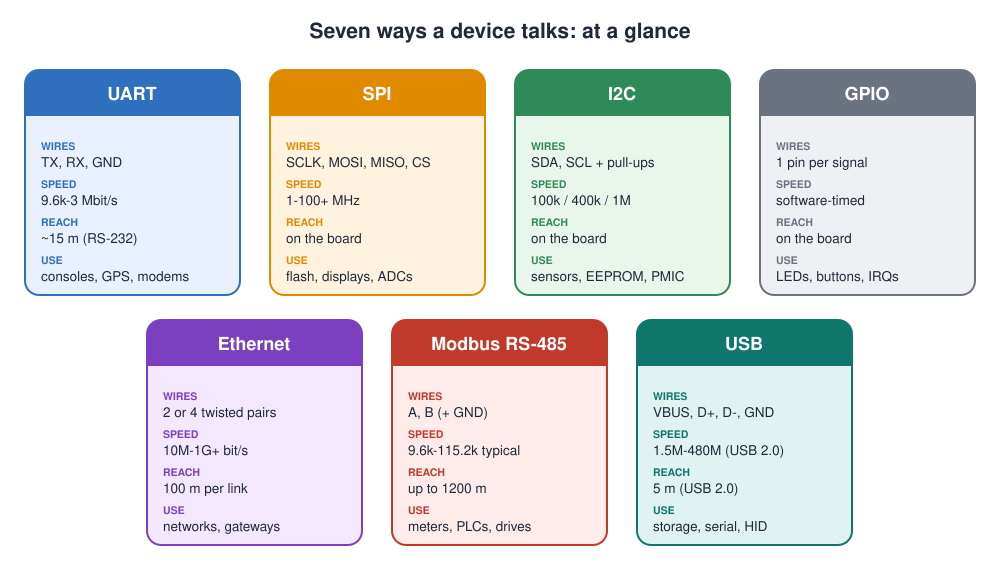
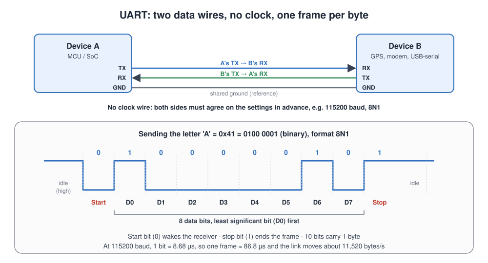
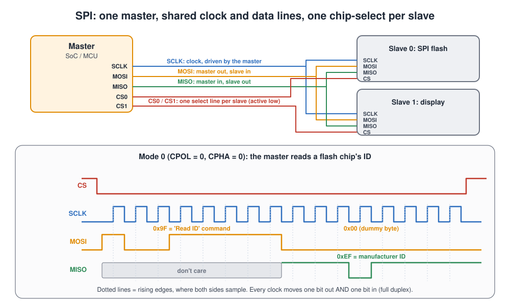
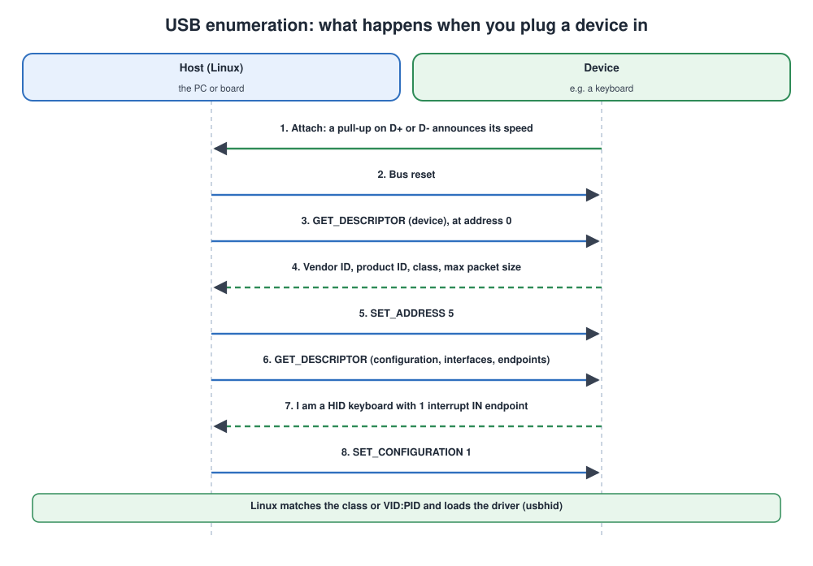

# Embedded Communication Protocols

## Contents

| # | Section | In one line |
| --- | --- | --- |
| – | [Abbreviations](#abbreviations) | Every short form used in these notes, written in full |
| – | [Words you need first](#words-you-need-first) | Serial, clock, duplex, master and slave |
| 1 | [UART](#1-uart) | Two wires, no clock, the debug console of every board |
| 2 | [SPI](#2-spi) | Fast, four wires, one chip-select per device |
| 3 | [I2C](#3-i2c) | Two wires, many devices, each with an address |
| 4 | [GPIO](#4-gpio) | One pin, one bit: outputs, inputs, interrupts |
| 5 | [Ethernet](#5-ethernet) | The network: MAC, PHY, frames and layers |
| 6 | [Modbus over RS-485](#6-modbus-over-rs-485) | The industrial workhorse: long cable, many devices |
| 7 | [USB](#7-usb) | Host-controlled plug-and-play |
| 8 | [Comparing and choosing](#8-comparing-and-choosing) | One table, one decision guide |
| 9 | [Simple code examples](#9-simple-code-examples) | UART in C and Python, I2C, SPI and GPIO in Python, a TCP client and server, listing USB devices |
| 10 | [Interview quick answers](#10-interview-quick-answers) | Short answers to say out loud |

---

## Abbreviations

| Short form | Full form | In one line |
| --- | --- | --- |
| ACK / NACK / NAK | Acknowledge / Not Acknowledge / Negative Acknowledge | "Received" / "not received or stop" |
| ADC / DAC | Analog-to-Digital / Digital-to-Analog Converter | Converts between voltages and numbers |
| ALSA | Advanced Linux Sound Architecture | The Linux audio subsystem |
| AMBA | Advanced Microcontroller Bus Architecture | Arm's on-chip bus family (PL011 UART → `ttyAMA`) |
| ARP | Address Resolution Protocol | Finds the MAC address for an IP address |
| BSP | Board Support Package | The board-specific software (see BSP.md) |
| CAN | Controller Area Network | The field bus used in cars and machines |
| CDC-ACM | Communications Device Class, Abstract Control Model | USB serial-port class (`/dev/ttyACM0`) |
| CDC-ECM / NCM | CDC Ethernet / Network Control Model | USB Ethernet classes |
| CMOS | Complementary Metal-Oxide-Semiconductor | Standard chip logic technology and its voltage levels |
| COM | Communication port | The PC name for a serial port (COM1 = ttyS0) |
| CPOL / CPHA | Clock Polarity / Clock Phase | The two settings that make the four SPI modes |
| CPU | Central Processing Unit | The processor |
| CRC | Cyclic Redundancy Check | A checksum that detects transmission errors |
| CS | Chip Select | The SPI line that selects one slave |
| DE / RE | Driver Enable / Receiver Enable | RS-485 transceiver direction pins |
| DFU | Device Firmware Upgrade | USB class for firmware updates |
| DMA | Direct Memory Access | Hardware copies data without the CPU |
| DNS | Domain Name System | Turns names into IP addresses |
| EEPROM | Electrically Erasable Programmable Read-Only Memory | Small non-volatile memory chip |
| EOP | End Of Packet | USB packet end marker |
| FCS | Frame Check Sequence | The CRC-32 at the end of an Ethernet frame |
| FTDI | Future Technology Devices International | A maker of USB-serial chips |
| GND | Ground | The 0 V reference |
| GPIO | General-Purpose Input/Output | A pin controlled directly by software |
| GPS | Global Positioning System | Satellite positioning receiver |
| HID | Human Interface Device | USB class for keyboards, mice |
| HTTP | Hypertext Transfer Protocol | The web protocol |
| I2C | Inter-Integrated Circuit | 2-wire bus for slow chips |
| I3C | Improved Inter-Integrated Circuit | Faster successor of I2C |
| IMU | Inertial Measurement Unit | Accelerometer + gyroscope chip |
| IoT | Internet of Things | Connected devices |
| IP | Internet Protocol | Network-layer addressing and routing |
| IPv4 / IPv6 | Internet Protocol version 4 / version 6 | The two versions of IP addressing |
| IRQ | Interrupt Request | An interrupt signal to the CPU |
| JEDEC | Joint Electron Device Engineering Council | Standards body for memory chips |
| LED | Light-Emitting Diode | An indicator light |
| LSB / MSB | Least / Most Significant Bit (or Byte) | The lowest / highest bit or byte of a value |
| MAC | Media Access Controller (also the MAC address) | The Ethernet controller and its 48-bit hardware address |
| MBAP | Modbus Application Protocol (header) | The 7-byte header of Modbus TCP |
| MCU | Microcontroller Unit | Small chip with CPU, flash and RAM |
| MDIO / MDC | Management Data Input/Output / Management Data Clock | The Ethernet PHY management bus |
| MII / RMII / RGMII / SGMII | Media-Independent Interface / Reduced / Reduced Gigabit / Serial Gigabit | MAC-to-PHY connections |
| MISO / MOSI | Master In Slave Out / Master Out Slave In | The two SPI data lines |
| MQTT | Message Queuing Telemetry Transport | Lightweight IoT messaging protocol |
| MSC | Mass Storage Class | USB class for flash drives |
| MTD | Memory Technology Device | The Linux subsystem for raw flash |
| MTU | Maximum Transmission Unit | Largest payload in one frame (1500 bytes) |
| NOR | NOR flash (named after the NOR logic gate) | Small flash that can run code in place |
| NXP / ST / TI | NXP Semiconductors / STMicroelectronics / Texas Instruments | Chip vendors |
| OPC UA | Open Platform Communications Unified Architecture | Industrial data-exchange standard |
| OTG | On-The-Go | A USB port that can be host or device |
| OTP | One-Time Programmable (memory) | Can be written once, never erased |
| PC | Personal Computer | A desktop or laptop computer |
| PHY | Physical-layer transceiver | Chip that drives the cable |
| PID / VID | Product ID / Vendor ID | USB identity numbers |
| PMBus / SMBus | Power Management Bus / System Management Bus | Stricter I2C profiles |
| PMIC | Power Management Integrated Circuit | Supplies the board's voltages |
| PSRAM | Pseudo-Static Random Access Memory | External RAM on an SPI-style bus |
| QSPI | Quad Serial Peripheral Interface | SPI with 4 data lines |
| RAM | Random Access Memory | Working memory |
| RJ45 | Registered Jack 45 | The standard Ethernet socket |
| RNDIS | Remote Network Driver Interface Specification | Microsoft's USB Ethernet protocol |
| RS-232 / RS-485 | Recommended Standard 232 / 485 | Serial line electrical standards |
| RTC | Real-Time Clock | Keeps the time, often with a battery |
| RTS / CTS | Request To Send / Clear To Send | UART hardware flow control |
| RTU | Remote Terminal Unit | The binary serial form of Modbus |
| RX / TX | Receive / Transmit | Data direction |
| SCL / SDA | Serial Clock / Serial Data | The two I2C lines |
| SCLK | Serial Clock | The SPI clock line |
| SD | Secure Digital | Removable memory card |
| SFD | Start Frame Delimiter | Marks the start of an Ethernet frame |
| SoC | System on Chip | Processor chip with peripherals built in |
| SPI | Serial Peripheral Interface | Fast 4-wire bus |
| TCP / UDP | Transmission Control Protocol / User Datagram Protocol | Reliable / fast transport protocols |
| TTL | Transistor-Transistor Logic | Normal chip logic levels |
| tty | TeleTYpewriter | Linux name for any terminal-like device |
| UAC / UVC | USB Audio Class / USB Video Class | USB audio and webcam classes |
| UART | Universal Asynchronous Receiver-Transmitter | Simple serial port |
| USB | Universal Serial Bus | Standard plug-and-play connection |
| V4L2 | Video4Linux 2 | The Linux camera/video subsystem |
| VBUS | Voltage Bus | The USB 5 V supply wire |
| VLAN | Virtual Local Area Network | Splits one Ethernet network into several |
| xHCI | eXtensible Host Controller Interface | The modern USB host controller standard |
| XIP | eXecute In Place | Running code directly from flash |
| XON / XOFF | Transmit On / Transmit Off | UART software flow control characters |

---

## Words you need first

| Term | Meaning | Example |
| --- | --- | --- |
| **Serial** | Bits travel one after another on one wire | All seven interfaces here are serial except GPIO |
| **Synchronous** | A **clock wire** tells the receiver when to read each bit | SPI, I2C |
| **Asynchronous** | **No clock**; both sides agree on the speed in advance | UART, RS-485 |
| **Full duplex** | Sending and receiving at the same time | UART, SPI, Ethernet |
| **Half duplex** | One direction at a time | I2C, 2-wire RS-485, USB 2.0 |
| **Master / slave** (also controller / target) | The master starts every transfer; slaves answer | SPI, I2C, Modbus, USB (host / device) |
| **Single-ended** | The signal is measured against ground | UART (TTL levels), SPI, I2C |
| **Differential** | The signal is the *difference* between two wires, so noise that hits both wires cancels out | RS-485, USB, Ethernet |
| **Baud rate** | Symbols per second; for UART, bits per second | 115200 baud |
| **SoC** (System on Chip) | The main processor chip, with the controllers for all these interfaces built in | NXP i.MX 8, TI AM335x |
| **Device tree** | The file that tells Linux which interfaces exist on the board and which pins they use | See [BSP.md](BSP.md#6-the-device-tree-the-heart-of-a-linux-bsp) |

---

### The seven interfaces at a glance



## 1. UART

> **UART** (Universal Asynchronous Receiver-Transmitter) sends bytes over **two data wires with no clock**. Each byte is wrapped in a start bit and a stop bit, and both sides must agree on the speed in advance.



### UART key facts

| Property | Value |
| --- | --- |
| Wires | **TX** (transmit), **RX** (receive), **GND** (ground). Optional **RTS/CTS** (Request To Send / Clear To Send) for flow control. |
| Clock | None (asynchronous) |
| Duplex | Full duplex |
| Topology | Point-to-point: exactly two devices |
| Typical speeds | 9600, 115200 (most common), up to about 3-4 Mbaud |
| Distance | Centimetres at 3.3 V logic; about 15 m as RS-232; much further as RS-485 |
| Used for | The **Linux debug console**, **GPS** (Global Positioning System) receivers, cellular and Wi-Fi modules, Bluetooth modules, USB-serial adapters |

### How a byte travels

1. **Idle:** the line rests **high**.
2. **Start bit:** the sender pulls the line **low** for one bit time. That falling edge tells the receiver "a byte is coming, start your timer."
3. **Data bits:** 8 bits follow, **least significant bit (LSB) first**. For 'A' (0x41 = 0100 0001) the order on the wire is 1, 0, 0, 0, 0, 0, 1, 0.
4. **Parity (optional):** one extra bit for a simple error check.
5. **Stop bit:** the line goes **high** for at least one bit time, ready for the next byte.

The receiver samples each bit in the **middle** of its time slot, counted from the start bit's edge. That's why both sides must use the **same baud rate**. A mismatch of more than a few percent gives garbage characters.

### Settings: what "115200 8N1" means

| Setting | Meaning | Common value |
| --- | --- | --- |
| Baud rate | Bits per second | 115200 |
| Data bits | Bits per character | **8** |
| Parity | None, Even or Odd | **N** (none) |
| Stop bits | 1 or 2 | **1** |
| Flow control | None, hardware (RTS/CTS) or software (**XON/XOFF**: special "pause" and "resume" characters) | None for consoles; RTS/CTS for modems |

### Voltage levels: same protocol, different wires

| Level | Voltages | Where |
| --- | --- | --- |
| **TTL / CMOS UART** (Transistor-Transistor Logic / Complementary Metal-Oxide-Semiconductor: normal chip logic levels) | 0 V and 3.3 V (or 1.8 V, 5 V) | Between chips on a board |
| **RS-232** (Recommended Standard 232) | About ±3 to ±15 V, **inverted** | Old PC COM ports, industrial equipment |
| **RS-485** (Recommended Standard 485) | Differential pair, A/B | Long industrial buses ([section 6](#6-modbus-over-rs-485)) |

> **Never connect RS-232 directly to a 3.3 V SoC pin.** The ±12 V levels can damage it. Use a level shifter such as a MAX3232.

### UART from Linux

In Linux every serial port appears as a file under `/dev`. You open that file to send and receive bytes.

| Device name | What it is |
| --- | --- |
| `/dev/ttyS0` | The first on-chip UART handled by the standard "8250/16550" serial driver (PCs, TI, Rockchip, Allwinner and many others) |
| `/dev/ttyAMA0` | The first UART of the Arm PL011 type (Raspberry Pi and other Arm boards) |
| `/dev/ttymxc0` | The first UART on NXP i.MX chips |
| `/dev/ttyUSB0` | A USB-serial adapter chip (**FTDI** (Future Technology Devices International), CP210x, CH340) |
| `/dev/ttyACM0` | A USB **CDC-ACM** device (Communications Device Class, Abstract Control Model): many MCU boards and modems |

### Why is it called `/dev/ttyS0`?

The name has three parts, and each part has a reason:

| Part | Meaning | Why |
| --- | --- | --- |
| `/dev/` | The **device directory** | Linux represents hardware as files. Every device node lives in `/dev`. |
| `tty` | **TeleTYpewriter** | The first computer terminals were electric typewriters connected over a serial line. Unix called them "tty", and Linux still uses that name for **anything that behaves like a terminal**: serial ports, consoles and terminal windows. |
| `S` | **Serial** | Marks the classic serial-port driver (the "8250/16550" UART driver, named after the original PC UART chips). |
| `0` | **The port number** | Counting starts at 0. `ttyS0` is the **first** serial port (COM1 on a PC), `ttyS1` the second (COM2), and so on. |

**The prefix depends on the driver, not on the protocol.** The kernel driver that handles the UART chooses the name:

| Name | Driver / hardware |
| --- | --- |
| `ttyS*` | 8250/16550-compatible UARTs (x86 PCs, TI AM335x, Rockchip, Allwinner) |
| `ttyAMA*` | Arm **AMBA** (Advanced Microcontroller Bus Architecture) PL011 UART, e.g. Raspberry Pi |
| `ttymxc*` | NXP i.MX UART |
| `ttySTM*` | STMicroelectronics STM32MP UART |
| `ttyUSB*` | USB-to-serial converter chips |
| `ttyACM*` | USB CDC-ACM devices |
| `ttyGS*` | The board acting as a USB serial *gadget* for a PC (section 7) |

**Why `ttyS0` appears everywhere in these notes:**

- It is the most common name, so it's used in examples and in the kernel command line. For example, `console=ttyS0,115200` tells Linux to print its messages on the first serial port at 115200 baud.
- On most boards the **first UART is wired to the debug console**, so `ttyS0` is usually *taken* by the console.
- That's why the examples below use `ttyS1` for a modem and `ttyS2` for Modbus: they are the second and third ports, left free for other devices.

To see which serial ports your board really has:

```bash
dmesg | grep tty          # which UARTs the kernel found, and their names
ls -l /dev/ttyS* /dev/ttyAMA* /dev/ttymxc* 2>/dev/null
cat /proc/cmdline         # shows console=... : the port used by the console
```

Using a port:

```bash
stty -F /dev/ttyS1 115200 cs8 -parenb -cstopb raw   # set 115200 8N1 on the second port
echo "AT" > /dev/ttyS1                               # send an "AT" (ATtention) command to a modem
picocom -b 115200 /dev/ttyUSB0                       # interactive terminal
```

To enable a UART in the device tree, set its `status` to `"okay"` and choose its pins: see [Device_tree.md, Example 3](Device_tree.md#example-3-switch-on-a-uart).

### UART: common problems

| Symptom | Likely cause | Fix |
| --- | --- | --- |
| Garbage characters | Baud-rate mismatch | Same baud on both sides; check the clock source |
| Nothing received | TX connected to TX | Cross over: TX → RX, RX → TX |
| Works, then random errors | No common ground | Connect GND between the devices |
| Chip got hot or died | RS-232 levels on a 3.3 V pin | Use a level shifter |
| Lost bytes at high speed | No flow control, slow reader | Enable RTS/CTS, use **DMA** (Direct Memory Access: hardware copies data without the CPU), read faster |

---

## 2. SPI

> **SPI** (Serial Peripheral Interface) is a **fast, clocked, full-duplex** bus. The master drives the clock, sends data on MOSI, receives on MISO, and picks which slave to talk to with a separate **chip-select** line per slave.



### SPI key facts

| Property | Value |
| --- | --- |
| Wires | **SCLK** (Serial Clock), **MOSI** (Master Out, Slave In), **MISO** (Master In, Slave Out), **CS** (Chip Select, one per slave, active low) |
| Clock | Yes, driven by the master |
| Duplex | **Full duplex**: one bit out and one bit in on every clock |
| Topology | One master, several slaves; each slave has its own CS line |
| Typical speeds | 1 to 50 MHz; 100+ MHz for fast flash; much more with Quad-SPI |
| Distance | On the board (centimetres) |
| Addressing | None: the CS line *is* the address |
| Used for | SPI NOR flash, SD cards, displays, **ADCs/DACs** (Analog-to-Digital / Digital-to-Analog Converters), touch controllers, some Ethernet, **CAN** (Controller Area Network) and Wi-Fi chips |

### How a transfer works

1. The master pulls the slave's **CS low**. Only that slave now listens.
2. The master toggles **SCLK**. On each clock, both sides put one bit on their output line and read one bit from their input line.
3. After 8 clocks, one byte has gone out on MOSI **and** one byte has come back on MISO.
4. The master raises **CS high** to end the transaction.

**The example in the picture:**

1. The master sends `0x9F`, the standard "Read **JEDEC** ID" command for SPI flash. JEDEC (Joint Electron Device Engineering Council) is the standards body that defines it.
2. The first byte the flash returns is meaningless, because it hasn't received the command yet.
3. During the second byte the master sends a dummy `0x00`, just to generate clocks.
4. The flash answers `0xEF`, the manufacturer ID for Winbond.

> **Key idea:** SPI is a **shift register exchange**. To read, the master must still send something (usually `0x00` or `0xFF`) to produce the clock.

### The four SPI modes

The master and slave must agree on clock polarity (**CPOL**, the idle level) and clock phase (**CPHA**, which edge samples the data):

| Mode | CPOL | CPHA | Clock idles | Data sampled on | Notes |
| --- | --- | --- | --- | --- | --- |
| **0** | 0 | 0 | Low | Rising edge | Most common (the picture) |
| 1 | 0 | 1 | Low | Falling edge | |
| 2 | 1 | 0 | High | Falling edge | |
| **3** | 1 | 1 | High | Rising edge | Also common; many flash chips support 0 and 3 |

The device's datasheet tells you the mode. A wrong mode gives values shifted by one bit, or garbage.

### Variants

| Variant | Data lines | Used for |
| --- | --- | --- |
| Standard SPI | 1 out + 1 in | Sensors, displays |
| Dual SPI | 2 (bidirectional) | Faster flash reads |
| **Quad SPI (QSPI)** | 4 | Boot flash; can be memory-mapped to run code directly (**XIP**, eXecute In Place) |
| Octal SPI | 8 | High-speed flash and **PSRAM** (Pseudo-Static RAM) |

### SPI from Linux

| Path | What it is |
| --- | --- |
| `/dev/spidev0.0` | Raw user-space access to bus 0, chip select 0 (needs the `spidev` driver bound to a node) |
| `/dev/mtd0` | SPI NOR flash, handled by the `spi-nor` / **MTD** (Memory Technology Device) driver |
| `/sys/bus/spi/devices/` | Every SPI device the kernel knows about |

Describing a SPI flash chip in the device tree is shown in [Device_tree.md, Example 5](Device_tree.md#example-5-add-an-spi-flash-chip). On SPI, `reg` is the **chip-select number**, not an address.

```bash
cat /proc/mtd                            # partitions of the SPI flash
flash_erase /dev/mtd0 0 0                # erase (mtd-utils)
spi-pipe -d /dev/spidev0.0 -s 1000000 < cmd.bin   # raw transfer (spi-tools)
```

### SPI: common problems

| Symptom | Likely cause | Fix |
| --- | --- | --- |
| Reads all `0xFF` or all `0x00` | CS not asserted, MISO not connected, slave not powered | Check CS polarity and wiring; look at MISO with an oscilloscope |
| Data shifted by one bit | Wrong SPI mode | Match CPOL/CPHA to the datasheet |
| Works slowly, fails fast | Signal integrity, long wires | Lower `spi-max-frequency`; shorten the traces |
| Two slaves answer at once | Shared CS, or a slave doesn't release MISO | One CS per slave; check that MISO goes high-impedance (tri-state) |

---

## 3. I2C

> **I2C** (Inter-Integrated Circuit) connects **many chips over just two wires**, SDA (data) and SCL (clock). Every device has a **7-bit address**, and the receiver **acknowledges** every byte.


### I2C key facts

| Property | Value |
| --- | --- |
| Wires | **SDA** (Serial Data), **SCL** (Serial Clock), plus **pull-up resistors** (typically 2.2-10 kΩ) |
| Clock | Yes, driven by the master (slaves can hold it low: "clock stretching") |
| Duplex | Half duplex |
| Topology | Shared bus: many masters and slaves on the same two wires |
| Addressing | 7-bit address (112 usable), 10-bit rarely |
| Speeds | 100 kHz (Standard), 400 kHz (Fast), 1 MHz (Fast-mode Plus), 3.4 MHz (High-speed) |
| Distance | On the board; bus capacitance limit of about 400 pF |
| Used for | Temperature/humidity sensors, **IMUs** (Inertial Measurement Units), **EEPROMs** (Electrically Erasable Programmable Read-Only Memory), **RTCs** (Real-Time Clocks), **PMICs** (Power Management ICs), touch controllers, camera control |

### Why pull-up resistors?

1. I2C lines are **open-drain**: a device can only pull the line **low**.
2. When nobody pulls, the resistor pulls it **high**.
3. This lets many devices share a wire without fighting.
4. It also makes the acknowledgement possible: the receiver simply pulls SDA low.

### How a read works

The master wants the temperature register (register `0x00`) from the sensor at address `0x48`:

1. **S (START):** SDA falls while SCL is high. Everyone on the bus listens.
2. **Address + W:** `1001000` + `0` = byte **`0x90`**. "Sensor 0x48, I'm going to write."
3. **A (ACK, Acknowledge):** the sensor pulls SDA low: "I'm here."
4. **Register `0x00`:** "I want register 0." The sensor ACKs.
5. **Sr (repeated START):** start again without releasing the bus.
6. **Address + R:** `1001000` + `1` = byte **`0x91`**. "Now I'm going to read." The sensor ACKs.
7. **MSB, LSB** (Most / Least Significant Byte): the sensor sends two data bytes. The master ACKs the first, then **NACKs** (Not Acknowledge) the last to say "that's enough."
8. **P (STOP):** SDA rises while SCL is high. The bus is free.

> **Rule:** SDA may only change while SCL is **low**. A change while SCL is high is a START or STOP.

### Other I2C features

| Feature | Meaning |
| --- | --- |
| **Clock stretching** | A slow slave holds SCL low until it's ready |
| **Multi-master arbitration** | Two masters start together; the one that sends a 1 while the other sends a 0 loses, and backs off |
| **Repeated START** | Change direction (write → read) without letting another master grab the bus |
| **SMBus / PMBus** (System Management Bus / Power Management Bus) | Stricter I2C profiles used in PCs and power supplies |
| **I3C** (Improved Inter-Integrated Circuit) | The newer, faster successor (12.5 MHz, in-band interrupts), backward compatible with many I2C devices |

### I2C from Linux

```bash
i2cdetect -l                  # list I2C buses
i2cdetect -y 1                # scan bus 1: shows addresses that ACK
#      0  1  2  3  4  5  6  7  8  9  a  b  c  d  e  f
# 40: -- -- -- -- -- -- -- -- 48 -- -- -- -- -- -- --
# 50: 50 -- -- -- -- -- -- -- -- -- -- -- -- -- -- --
i2cget -y 1 0x48 0x00 w       # read a 16-bit word from register 0x00
i2cset -y 1 0x50 0x00 0xAB    # write 0xAB to the EEPROM at address 0x00
i2cdump -y 1 0x50             # dump all registers
```

> `UU` in the `i2cdetect` output means a **kernel driver already owns** that address. That's good: the device was found and bound.

Describing an I2C sensor in the device tree (a child node of the bus, with `reg` = its I2C address) is shown in [Device_tree.md, Example 4](Device_tree.md#example-4-add-an-i2c-temperature-sensor).

### I2C: common problems

| Symptom | Likely cause | Fix |
| --- | --- | --- |
| `i2cdetect` shows nothing | No pull-ups, wrong pins, device unpowered or in reset | Check the pull-ups, pin mux (pin function selection), power and reset lines |
| Device found at an unexpected address | Address pins (A0-A2) strapped differently | Check the schematic and datasheet |
| Two devices with the same address | Address conflict | Change the strapping, or use an I2C multiplexer (e.g. TCA9548A) |
| Bus stuck with SDA low | A slave was interrupted mid-byte | Toggle SCL 9 times to release it (many drivers do this: "bus recovery") |
| Errors at 400 kHz, fine at 100 kHz | Pull-ups too weak or bus too long | Stronger pull-ups (lower resistance), shorter bus, lower speed |

---

## 4. GPIO

> A **GPIO** (General-Purpose Input/Output) is a pin that software can **drive high or low**, **read**, or use to **trigger an interrupt**. It's the simplest interface on the board.


### GPIO key facts

| Property | Value |
| --- | --- |
| Wires | One pin per signal |
| Directions | Input or output (set by software) |
| Levels | 0 = low (0 V), 1 = high (the pin's voltage: **1.8 V or 3.3 V** on most SoCs, **not 5 V tolerant** unless stated) |
| Speed | Whatever software can do; microseconds to milliseconds from Linux user space |
| Current | A few mA per pin: enough for an **LED** (Light-Emitting Diode), **not** for a motor or relay |
| Used for | LEDs, buttons, chip resets and enables, interrupt lines from chips, relays (via a transistor) |

### The GPIO modes

| Mode | How it behaves | Typical use |
| --- | --- | --- |
| **Output, push-pull** | Actively drives high **and** low | LEDs, enable pins, reset pins |
| **Output, open-drain** | Can only pull low; a resistor pulls high | Shared lines: I2C, wired-OR interrupt lines, level shifting |
| **Input, floating** | Reads whatever the outside drives | Signals from another chip |
| **Input, pull-up / pull-down** | An internal or external resistor sets a default level | Buttons, jumpers |
| **Interrupt** | An edge (rising, falling or both) or a level triggers an **IRQ** (Interrupt Request) | "Data ready" lines from sensors, buttons |

> **Debouncing:** a mechanical button doesn't switch cleanly. It "bounces" for a few milliseconds. Without debouncing, one press looks like several. Wait 10-20 ms for the level to settle, in software or with the kernel's debounce support.

### GPIO from Linux

Modern Linux uses the **GPIO character device** (`/dev/gpiochipN`) and the **libgpiod** tools. The old `/sys/class/gpio` interface is **deprecated**.

```bash
gpiodetect                          # list GPIO controllers
gpioinfo gpiochip0                  # every line: name, direction, who uses it
gpioset gpiochip0 17=1              # drive line 17 high (libgpiod v1 syntax)
gpioget gpiochip0 27                # read line 27
gpiomon gpiochip0 27                # wait for and print edge events
```

> libgpiod v2 changed the syntax slightly (for example `gpioset -c gpiochip0 17=1`). Check `gpioset --help` on your board.

**Better still, let the kernel own the GPIO** by describing it in the device tree. The LED then appears in `/sys/class/leds/` and the button as an input event: see [Device_tree.md, Examples 1 and 2](Device_tree.md#example-1-blink-an-led).

### GPIO: common problems

| Symptom | Likely cause | Fix |
| --- | --- | --- |
| Pin doesn't change | Pin muxed to another function | Set the pin mux to GPIO in the device tree |
| "Device or resource busy" | A kernel driver already owns the line | Check `gpioinfo`; release it or use the driver's interface |
| Input reads random values | Floating input, no pull resistor | Enable a pull-up/down |
| One press = many events | Button bounce | Debounce (`debounce-interval`) |
| Pin or chip damaged | 5 V on a 3.3 V/1.8 V pin, or too much current | Level shifter; transistor or driver chip for loads |

---

## 5. Ethernet

> **Ethernet** connects devices into a **network**. Inside the board, the SoC's **MAC** builds frames and a separate **PHY** chip turns them into signals on the cable. On top of Ethernet run **IP, TCP/UDP** and your application protocol.

The terms in that sentence:

- **MAC** (Media Access Controller) is the Ethernet controller inside the SoC.
- **PHY** (physical-layer transceiver) is the chip that drives the cable.
- **IP** (Internet Protocol) carries the addresses and routing.
- **TCP** (Transmission Control Protocol) and **UDP** (User Datagram Protocol) carry the ports and delivery.


### Ethernet key facts

| Property | Value |
| --- | --- |
| Medium | Twisted-pair copper (Cat5e/Cat6), also fibre; single-pair variants for automotive/industrial |
| Speeds | 10 Mbit/s, 100 Mbit/s (Fast Ethernet), 1 Gbit/s, 2.5/5/10 Gbit/s and beyond |
| Distance | **100 m** per copper link; switches extend it |
| Topology | Star: every device connects to a switch |
| Duplex | Full duplex on modern links |
| Addressing | A 48-bit **MAC address** per interface (layer 2); IP addresses on top (layer 3) |
| Used for | IoT gateways, cameras, industrial controllers, anything that talks to the cloud |

### Inside the board: MAC and PHY

| Part | Where | Job |
| --- | --- | --- |
| **MAC** | Inside the SoC | Builds and checks frames, handles the MAC address, uses DMA to move data to memory. Layer 2. |
| **MAC-PHY interface** | Board traces | Carries frame data between the MAC and the PHY (table below) |
| **PHY** | A separate chip | Converts bits to the electrical signals on the cable; auto-negotiates speed and duplex. Layer 1. |
| **MDIO / MDC** (Management Data Input/Output / Management Data Clock) | Two management wires | The MAC reads and configures the PHY's registers: link up/down, speed |
| **Magnetics** | A transformer module, or inside the **RJ45** (Registered Jack 45) socket | Electrical isolation and signal coupling |

| MAC-PHY interface | Data width | Clock | Speed |
| --- | --- | --- | --- |
| **MII** (Media-Independent Interface) | 4 bits | 25 MHz | 100 Mbit/s |
| **RMII** (Reduced MII) | 2 bits | 50 MHz | 100 Mbit/s (fewer pins) |
| **RGMII** (Reduced Gigabit MII) | 4 bits, both clock edges | 125 MHz | 1 Gbit/s |
| **SGMII** (Serial Gigabit MII) | Serial pair | 1.25 Gbaud | 1 Gbit/s |

### The Ethernet frame

| Field | Size | Example | Meaning |
| --- | --- | --- | --- |
| Preamble + **SFD** (Start Frame Delimiter) | 7 + 1 bytes | `55 … 55 D5` | Lets the receiver lock on; not counted in the frame size |
| Destination MAC | 6 bytes | `00:1A:2B:3C:4D:5E` | Who should receive it (`FF:FF:FF:FF:FF:FF` = broadcast) |
| Source MAC | 6 bytes | `02:42:AC:11:00:02` | Who sent it |
| EtherType | 2 bytes | `0x0800` | What's inside: IPv4. Others: `0x0806` **ARP** (Address Resolution Protocol), `0x86DD` IPv6, `0x8100` **VLAN** (Virtual Local Area Network) tag |
| Payload | 46-1500 bytes | IP packet | Padded to 46 bytes if shorter |
| **FCS** (Frame Check Sequence) | 4 bytes | CRC-32 (Cyclic Redundancy Check) | Error check; a bad frame is silently dropped |

A frame is **64 to 1518 bytes** (1522 with a VLAN tag). The 1500-byte payload limit is the familiar **MTU** (Maximum Transmission Unit).

### Layers: who does what

| Layer | Protocol | Adds | Who handles it in Linux |
| --- | --- | --- | --- |
| Application (7) | **MQTT** (Message Queuing Telemetry Transport), **HTTP** (Hypertext Transfer Protocol), Modbus TCP, **OPC UA** (Open Platform Communications Unified Architecture) | Your data | Your program |
| Transport (4) | TCP (reliable) / UDP (fast) | Ports, e.g. 1883 for MQTT | The kernel network stack |
| Network (3) | IP | IP addresses, routing | The kernel network stack |
| Data link (2) | Ethernet | MAC addresses, FCS | The kernel + the MAC driver |
| Physical (1) | Ethernet PHY | Signals on the cable | The PHY driver + hardware |

### Ethernet from Linux

```bash
ip link                               # interfaces and their state (UP / DOWN)
ip addr add 192.168.1.20/24 dev eth0  # set an IP address
ethtool eth0                          # link speed, duplex, auto-negotiation
ping 192.168.1.1                      # basic reachability
tcpdump -i eth0 -e -n                 # watch frames, including MAC addresses
```

```dts
&fec1 {
    phy-mode = "rgmii-id";            /* RGMII with internal delays */
    phy-handle = <&ethphy0>;
    status = "okay";

    mdio {
        #address-cells = <1>;
        #size-cells = <0>;
        ethphy0: ethernet-phy@0 {
            reg = <0>;                /* PHY address on the MDIO bus */
        };
    };
};
```

### Ethernet: common problems

| Symptom | Likely cause | Fix |
| --- | --- | --- |
| The interface exists, but the link never comes up | PHY not found: wrong MDIO address, PHY held in reset | Check the `reg` of the PHY node and the reset GPIO |
| Link up, but no traffic or CRC errors | RGMII timing delays wrong | Try `rgmii-id` / `rgmii-rxid` / `rgmii-txid` to match the board |
| Only 100 Mbit/s instead of 1 Gbit/s | Cable, or auto-negotiation limited | Check the cable and the `ethtool` advertised modes |
| Same MAC address on every board | MAC address not programmed | Store a unique MAC in **OTP** (One-Time Programmable memory) or an EEPROM; U-Boot passes it to Linux |
| Can ping by IP but not by name | **DNS** (Domain Name System) not configured | Set up `/etc/resolv.conf` or systemd-resolved |

---

## 6. Modbus over RS-485

Two separate things are combined here, and it helps to keep them apart:

- **RS-485** is the **physical layer**: the wires and voltages.
- **Modbus** is the **protocol**: the message format and its meaning.

> **RS-485** is a **differential, multi-drop** bus that carries data reliably over **long, noisy cables**. **Modbus RTU** (Remote Terminal Unit, the binary form of Modbus) is the simple **master-slave message format** that most industrial devices speak over it.


### RS-485: the physical layer

| Property | Value |
| --- | --- |
| Wires | **A** and **B** twisted pair (plus a ground reference) |
| Signalling | **Differential**: the receiver looks at A − B, so noise that hits both wires cancels out |
| Topology | **Multi-drop bus**: one daisy-chained cable, many devices (no star wiring) |
| Devices | **32 unit loads** per segment (more with low-load transceivers) |
| Distance | Up to **1200 m** at low speeds |
| Speed | Up to 10 Mbit/s over short cables; Modbus typically uses **9600-115200 baud** |
| Duplex | **2-wire = half duplex** (most common); 4-wire = full duplex |
| Termination | A **120 Ω resistor at both ends** of the cable, to stop reflections |
| Biasing | A pull-up on A and a pull-down on B at one point, so the idle bus has a defined state |

**The transceiver** (for example a MAX485) sits between the SoC's UART and the bus.

1. The bus is half duplex, so only one device may drive it at a time.
2. The transceiver therefore has a **DE/RE** pin (Driver Enable / Receiver Enable).
3. Software or hardware must switch it to *transmit* while sending, and back to *receive* immediately afterwards.
4. Getting this timing wrong is the most common RS-485 bug.

### Modbus RTU: the protocol

Every exchange is **one request from the master and one response from the addressed slave**. Slaves never speak unless asked.

| Field | Size | Meaning |
| --- | --- | --- |
| Slave address | 1 byte | 1-247 (0 = broadcast, no response) |
| Function code | 1 byte | What to do: read, write, and so on |
| Data | 0-252 bytes | Register addresses, counts, values |
| CRC | 2 bytes | CRC-16/Modbus, **low byte first** |

Frames are separated by **at least 3.5 character times of silence**. That gap is how receivers know one frame ended and the next began.

### The example in the picture, byte by byte

**Request:** `01 03 00 00 00 02 C4 0B`

| Bytes | Meaning |
| --- | --- |
| `01` | To slave 1 (the energy meter) |
| `03` | Function 3: read holding registers |
| `00 00` | Starting at register 0 |
| `00 02` | Read 2 registers |
| `C4 0B` | CRC-16 of the six bytes before it |

**Response:** `01 03 04 00 0A 00 14 DA 3E`

| Bytes | Meaning |
| --- | --- |
| `01 03` | From slave 1, answering function 3 |
| `04` | 4 data bytes follow |
| `00 0A` | Register 0 = 10 |
| `00 14` | Register 1 = 20 |
| `DA 3E` | CRC-16 |

**If something is wrong**, the slave replies with the function code **+ 0x80** and an exception code. For example `01 83 02 …` means "function 3 failed: illegal data address."

### Common function codes

| Code | Name | Data type |
| --- | --- | --- |
| `01` | Read coils | 1-bit outputs (read/write) |
| `02` | Read discrete inputs | 1-bit inputs (read-only) |
| `03` | **Read holding registers** | 16-bit values (read/write): settings, setpoints |
| `04` | Read input registers | 16-bit values (read-only): measurements |
| `05` | Write single coil | One output on/off |
| `06` | Write single register | One 16-bit value |
| `0F` (15) | Write multiple coils | Several outputs |
| `10` (16) | Write multiple registers | Several 16-bit values |

> **Modbus TCP** uses the same function codes over Ethernet (TCP port **502**). It replaces the address and CRC with a 7-byte **MBAP header** (Modbus Application Protocol header: transaction ID, protocol ID, length, unit ID). TCP already handles error checking.

### Modbus from Linux

Linux can drive the RS-485 direction pin automatically using the UART's **RTS** line:

```dts
&uart3 {
    linux,rs485-enabled-at-boot-time;   /* RS-485 mode from boot */
    rs485-rts-delay = <0 0>;            /* delay before / after sending, in ms */
    status = "okay";
};
```

Reading the two registers from the example. The Modbus port is `/dev/ttyS2`, the third serial port, because `ttyS0` is normally the debug console.

```bash
# mbpoll: RTU, slave 1, 9600 baud, no parity, holding registers, 2 values from reference 1 (= address 0)
mbpoll -m rtu -a 1 -b 9600 -P none -t 4 -r 1 -c 2 /dev/ttyS2
```

```c
#include <modbus.h>                         /* libmodbus */

modbus_t *ctx = modbus_new_rtu("/dev/ttyS2", 9600, 'N', 8, 1);
modbus_set_slave(ctx, 1);                   /* talk to slave 1 */
modbus_rtu_set_serial_mode(ctx, MODBUS_RTU_RS485);
modbus_connect(ctx);

uint16_t regs[2];
if (modbus_read_registers(ctx, 0, 2, regs) == 2)   /* function 03, start 0, count 2 */
    printf("reg0=%u reg1=%u\n", regs[0], regs[1]); /* → reg0=10 reg1=20 */

modbus_close(ctx);
modbus_free(ctx);
```

### Modbus: common problems

| Symptom | Likely cause | Fix |
| --- | --- | --- |
| No response at all | A and B swapped (vendors label them differently) | Swap A and B |
| Works on the bench, fails in the field | No termination or no biasing | 120 Ω at both ends; bias resistors at one point |
| The first bytes of every reply are lost | The transceiver is still in transmit mode | Fix the DE/RE timing; use the kernel's RS-485 mode |
| CRC errors | Baud/parity mismatch, noise, no ground reference | Match the settings; use twisted, shielded cable; connect signal ground |
| Wrong values (e.g. 2560 instead of 10) | Byte or word order, or off-by-one register numbering | Check the device's register map: "register 40001" usually means address 0 |

---

## 7. USB

> **USB** (Universal Serial Bus) is **host-controlled plug-and-play**: the **host** starts every transfer, and each **device** describes itself so the host can load the right driver automatically.


### USB key facts

| Property | Value |
| --- | --- |
| Wires (USB 2.0) | **VBUS** (the 5 V bus supply), **D+ and D−** (differential data), **GND**. USB 3.x adds extra high-speed pairs. |
| Roles | **Host** (PC, SoC), **device** (keyboard, flash drive), **OTG** (On-The-Go) / dual-role: can be either |
| Topology | Tiered star through hubs; up to **127 devices** per host controller |
| Speeds | Low 1.5 Mbit/s · Full 12 Mbit/s · **High 480 Mbit/s** (USB 2.0) · SuperSpeed 5-20 Gbit/s (USB 3.x) · USB4 40-80 Gbit/s |
| Distance | About 5 m for USB 2.0 cables |
| Power | 5 V from the host: 500 mA (USB 2.0), 900 mA (USB 3.x), much more with USB Power Delivery |
| Used for | Storage, keyboards, USB-serial, cameras, Wi-Fi and cellular modules, device firmware update |

### Endpoints and transfer types

A device exposes **endpoints**: numbered data channels. **Endpoint 0** always exists and is used for control. Each other endpoint uses one transfer type:

| Transfer type | Guarantees | Used for |
| --- | --- | --- |
| **Control** | Reliable, small messages | Setup and configuration (always on endpoint 0) |
| **Bulk** | Reliable, uses spare bandwidth, no timing guarantee | Flash drives, printers, USB-serial data |
| **Interrupt** | Reliable, polled at a fixed interval | Keyboards, mice, sensors |
| **Isochronous** | Guaranteed bandwidth and timing, **no retries** | Audio, video |

### One transaction, step by step

"Interrupt" transfers aren't really interrupts. The **host polls** the keyboard regularly:

1. **Token packet (host → device):** `IN` to address 5, endpoint 1: "Do you have data for me?"
2. **Data packet (device → host):** `DATA1` with an 8-byte report. `00 00 04 00 00 00 00 00` means no modifier keys, and key code `0x04` = the letter 'a'.
3. **Handshake (host → device):** `ACK`: "Got it."

Other rules:

- If the keyboard has nothing new, it answers `NAK` (Negative Acknowledge) instead of data. `STALL` means an error.
- Every packet starts with a **SYNC** (synchronisation) pattern and ends with **EOP** (End Of Packet), and is protected by a CRC.

### Enumeration: what happens when you plug a device in

**Enumeration** is the conversation in which the host discovers a newly connected device and gives it an address.



Step by step:

1. **Attach:** the device connects a pull-up resistor on D+ or D−. That tells the host a device is present, and its speed.
2. **Bus reset:** the host resets the device. It now answers at the default **address 0**.
3. **Get the device descriptor:** the host asks "who are you?" The device answers with its **VID** (Vendor ID), **PID** (Product ID), device class and maximum packet size.
4. **Set address:** the host gives the device its own address (for example 5).
5. **Get the configuration descriptor:** the host asks what the device can do. The device lists its interfaces and endpoints: "I am a **HID** (Human Interface Device) keyboard with 1 interrupt IN endpoint."
6. **Set configuration:** the host switches the device on.
7. **Load a driver:** Linux matches the class or the VID:PID pair to a driver (here `usbhid`), and the device becomes usable.

### Device classes: why most USB devices need no special driver

| Class | Examples | Linux driver → what you see |
| --- | --- | --- |
| **HID** (Human Interface Device) | Keyboard, mouse, barcode scanner | `usbhid` → `/dev/input/event*` |
| **MSC** (Mass Storage Class) | Flash drive, card reader | `usb-storage` → `/dev/sda` |
| **CDC-ACM** (Communications Device Class, Abstract Control Model) | MCU (microcontroller) boards, modems | `cdc_acm` → `/dev/ttyACM0` |
| **CDC-ECM / NCM** (Ethernet / Network Control Model), **RNDIS** (Remote Network Driver Interface Specification) | USB Ethernet, phone tethering | Network interface `usb0` |
| **UVC / UAC** (USB Video Class / USB Audio Class) | Webcams / USB audio | **V4L2** (Video4Linux 2) `/dev/video0` / **ALSA** (Advanced Linux Sound Architecture) |
| **DFU** (Device Firmware Upgrade) | Firmware update mode | `dfu-util` from user space |
| Vendor-specific | FTDI, CP210x serial chips | `ftdi_sio`, `cp210x` → `/dev/ttyUSB0` |

### USB from Linux

```bash
lsusb                       # every device: bus, address, VID:PID
lsusb -t                    # the tree: hubs, ports, speeds, drivers
lsusb -v -d 0403:6001       # full descriptors of one device
dmesg -w                    # watch enumeration live while plugging in
```

Typical `dmesg` when a USB-serial adapter is plugged in (**xHCI** = eXtensible Host Controller Interface, the USB host controller):

```text
usb 1-1: new full-speed USB device number 5 using xhci_hcd
usb 1-1: New USB device found, idVendor=0403, idProduct=6001
ftdi_sio 1-1:1.0: FTDI USB Serial Device converter detected
usb 1-1: FTDI USB Serial Device converter now attached to ttyUSB0
```

**The other direction:** a Linux board can also **act as a USB device** using the **USB gadget** framework (configured through configfs). For example, it can appear to a PC as a serial port (`/dev/ttyGS0` on the board) or as a USB Ethernet adapter.

### USB: common problems

| Symptom | Likely cause | Fix |
| --- | --- | --- |
| `device descriptor read/64, error -71` | A signal or power problem during enumeration | A different cable or port; check the VBUS supply and D+/D− routing |
| `over-current condition` | The device draws too much, or a short circuit | Check the power budget; use a powered hub |
| The device enumerates, but there's no `/dev` node | No driver for its VID:PID or class | Enable the class driver in the kernel config; check `lsusb -t` |
| Only full speed on a high-speed port | Cable, hub or signal integrity | A better cable; check the layout of the D+/D− pair |
| An OTG port won't act as host | Role not set, ID pin or VBUS not provided | Set `dr_mode` (dual-role mode) in the device tree; supply VBUS |

---

## 8. Comparing and choosing

### Side by side

| | **UART** | **SPI** | **I2C** | **GPIO** | **Ethernet** | **RS-485 / Modbus** | **USB 2.0** |
| --- | --- | --- | --- | --- | --- | --- | --- |
| Wires | 2 + GND | 4 + 1 CS per slave | 2 + pull-ups | 1 per signal | 2-4 pairs | 2 + GND | 4 |
| Clock | No | Yes | Yes | – | Embedded in the signal | No | Embedded in the signal |
| Duplex | Full | Full | Half | – | Full | Half (2-wire) | Half |
| Devices | 2 | 1 master + several slaves | Up to ~112 addresses | 1 per pin | Many (via switches) | 32 unit loads per segment | 127 per host |
| Addressing | None | CS line | 7-bit address | – | MAC + IP | 1-byte slave address | Assigned at enumeration |
| Typical speed | 115.2 kbit/s | 1-50 MHz | 100-400 kHz | Software | 100 Mbit/s-1 Gbit/s | 9.6-115.2 kbit/s | 480 Mbit/s |
| Distance | Board (TTL) | Board | Board | Board | 100 m | 1200 m | 5 m |
| Noise immunity | Low | Low | Low | Low | High (differential) | **High** (differential) | High (differential) |
| Linux interface | `/dev/tty*` | `spidev`, MTD, drivers | `/dev/i2c-*`, drivers | `/dev/gpiochip*` | `eth0`, sockets | `/dev/tty*` + libmodbus | `/dev/ttyACM*`, `/dev/sd*`, … |

### How to choose


Ask two questions, in this order.

**1. Where is the other device?**

- **On the same board** (a chip next to the processor):
  - **GPIO:** a simple on/off signal or an interrupt line.
  - **I2C:** many slow chips (sensors, EEPROM, RTC) using only two pins.
  - **SPI:** speed matters (flash, display, ADC).
  - **UART:** a module that talks serial (GPS, modem), or the debug console.
- **In another box** (connected by a cable):
  - **Ethernet:** a network, IP, the cloud, high speed.
  - **RS-485 + Modbus:** industrial equipment, a long noisy cable, many devices.
  - **USB:** plug-and-play to a PC, or storage.

**2. What does it need?** Pick the option in that group whose description matches. For example, a temperature sensor chip next to the processor is on the same board and slow, so the answer is **I2C**.

---

## 9. Simple code examples

Small programs that use each interface from **user space**, in the same order as the sections above. They run on any embedded Linux board (or a Raspberry Pi) once the interface is enabled in the device tree. The Python examples need one `pip install` each, shown in the first line.

### Example 1: UART in C (termios)

Send `AT` to a modem on `/dev/ttyS1` and print the reply.

```c
#include <fcntl.h>
#include <stdio.h>
#include <string.h>
#include <termios.h>
#include <unistd.h>

int main(void)
{
    int fd = open("/dev/ttyS1", O_RDWR | O_NOCTTY);   /* O_NOCTTY: don't make it our terminal */
    if (fd < 0) { perror("open"); return 1; }

    struct termios tio;
    tcgetattr(fd, &tio);
    cfmakeraw(&tio);                        /* raw bytes: no echo, no line editing       */
    cfsetspeed(&tio, B115200);              /* 115200 baud                               */
    tio.c_cflag &= ~(PARENB | CSTOPB);      /* no parity, 1 stop bit                     */
    tio.c_cflag |= CS8 | CLOCAL | CREAD;    /* 8 data bits; switch the receiver on       */
    tio.c_cc[VMIN]  = 0;                    /* read() returns what it has ...            */
    tio.c_cc[VTIME] = 10;                   /* ... after at most 1 s (unit: 0.1 s)       */
    tcsetattr(fd, TCSANOW, &tio);

    const char *cmd = "AT\r\n";
    write(fd, cmd, strlen(cmd));            /* send */

    char buf[64];
    int n = read(fd, buf, sizeof(buf) - 1); /* receive, or time out */
    if (n > 0) {
        buf[n] = '\0';
        printf("reply: %s\n", buf);
    } else {
        printf("no reply\n");
    }
    close(fd);
    return 0;
}
```

These settings are **8N1** at 115200 baud: 8 data bits, no parity, 1 stop bit ([section 1](#1-uart)).

### Example 2: UART in Python (pyserial)

The same exchange in five lines:

```python
import serial                                         # pip install pyserial

with serial.Serial("/dev/ttyS1", 115200, timeout=1) as port:   # 8N1 is the default
    port.write(b"AT\r\n")
    reply = port.readline()                           # up to '\n', or the 1 s timeout
    print("reply:", reply.decode(errors="replace").strip())
```

### Example 3: I2C in Python (smbus2): read a temperature sensor

A TMP102 at address `0x48` on bus 1:

```python
from smbus2 import SMBus                              # pip install smbus2

with SMBus(1) as bus:                                 # /dev/i2c-1
    hi, lo = bus.read_i2c_block_data(0x48, 0x00, 2)   # address 0x48, register 0, 2 bytes
    raw = ((hi << 8) | lo) >> 4                       # a 12-bit value
    if raw & 0x800:
        raw -= 4096                                   # negative temperatures
    print(f"temperature: {raw * 0.0625:.2f} C")       # 0.0625 °C per step
```

**What happens on the bus:** a write of the register number (`0x00`), then a **repeated START**, then a read of 2 bytes. That's the "write register, read data" pattern from [section 3](#3-i2c).

### Example 4: SPI in Python (spidev): read a flash chip's ID

```python
import spidev                                         # pip install spidev

spi = spidev.SpiDev()
spi.open(0, 0)                                        # /dev/spidev0.0: bus 0, chip select 0
spi.max_speed_hz = 1_000_000                          # 1 MHz
spi.mode = 0                                          # clock idle low, sample on the rising edge

rx = spi.xfer2([0x9F, 0, 0, 0])                       # command + 3 dummy bytes to clock the answer in
print(f"manufacturer 0x{rx[1]:02x}, device 0x{rx[2]:02x}{rx[3]:02x}")
spi.close()
```

**Why 4 bytes for a 3-byte answer:** SPI is full duplex, so a byte comes back for every byte sent. The first one arrives while the command is still going out, so it's ignored ([section 2](#2-spi)).

### Example 5: GPIO in Python (libgpiod): blink an LED, read a button

```python
import time
import gpiod                                          # libgpiod 2.x Python bindings
from gpiod.line import Bias, Direction, Value

LED, BUTTON = 17, 27                                  # line numbers on gpiochip0

with gpiod.request_lines(
    "/dev/gpiochip0",
    consumer="demo",                                  # the name shown by the gpioinfo tool
    config={
        LED:    gpiod.LineSettings(direction=Direction.OUTPUT),
        BUTTON: gpiod.LineSettings(direction=Direction.INPUT, bias=Bias.PULL_UP),
    },
) as lines:
    for _ in range(5):
        lines.set_value(LED, Value.ACTIVE)            # LED on
        time.sleep(0.5)
        lines.set_value(LED, Value.INACTIVE)          # LED off
        time.sleep(0.5)
        pressed = lines.get_value(BUTTON) == Value.INACTIVE   # pull-up: pressed = LOW
        print("button:", "pressed" if pressed else "released")
```

The lines are **released automatically** when the `with` block ends, so another program can use them.

### Example 6: Ethernet: a TCP server and client in Python

**On the PC (the server):**

```python
import socket

with socket.create_server(("", 5000)) as srv:        # listen on every interface, port 5000
    conn, addr = srv.accept()                         # wait for one client
    with conn:
        print("from", addr, conn.recv(1024))
        conn.sendall(b"ok\n")
```

**On the board (the client):**

```python
import socket

with socket.create_connection(("192.168.1.10", 5000), timeout=5) as s:   # the PC's IP and port
    s.sendall(b"temp=23.5\n")
    print("server replied:", s.recv(1024))
```

If the client says **"Connection refused"**, the server isn't running or the port is wrong. If it **times out**, it's usually the IP address, the route or a firewall ([section 5](#5-ethernet)).

### Example 7: USB: list the connected devices in Python

```python
import usb.core                                       # pip install pyusb (needs libusb)

for dev in usb.core.find(find_all=True):
    print(f"{dev.idVendor:04x}:{dev.idProduct:04x}  bus {dev.bus} address {dev.address}")
```

This prints the same **VID:PID** (Vendor ID : Product ID) pairs as `lsusb` ([section 7](#7-usb)).

---

## 10. Interview quick answers

**Q: UART vs SPI vs I2C?**

> "UART is asynchronous: two data wires, no clock, point-to-point, both sides agree on the baud rate. It's the usual debug console. SPI is synchronous and full duplex with four wires. The master drives the clock and selects each slave with its own chip-select, so it's fast (tens of MHz) and suits flash and displays. I2C uses two open-drain wires with pull-ups, addresses every device with a 7-bit address and acknowledges every byte. It's slower (100-400 kHz) but connects many sensors with very few pins."

**Q: Why does I2C need pull-up resistors?**

> "The lines are open-drain: devices can only pull them low. The pull-ups bring the line high when nobody drives it. That lets many devices share the bus without short circuits, and makes ACK and clock stretching possible."

**Q: What are SPI modes?**

> "Four combinations of clock polarity (CPOL: idle low or high) and clock phase (CPHA: sample on the first or second edge). Mode 0 is idle low, sample on the rising edge. Master and slave must use the same mode, or data comes out shifted or corrupted."

**Q: What does 115200 8N1 mean, and what happens with a baud mismatch?**

> "115200 bits per second, 8 data bits, no parity, 1 stop bit. With no clock line, the receiver times each bit from the start bit. A mismatch of a few percent makes it sample the wrong bits, and you see garbage characters."

**Q: Why is the serial port called /dev/ttyS0?**

> "`tty` comes from teletypewriter, the original serial terminals, and Linux uses it for anything that behaves like a terminal. `S` means the standard 8250/16550 serial driver, and `0` is the first port. Other drivers use other prefixes: `ttyAMA` for the Arm PL011, `ttymxc` for i.MX, `ttyUSB` for USB-serial chips. On most boards `ttyS0` is the debug console, set with `console=ttyS0,115200`."

**Q: What is the difference between the MAC and the PHY?**

> "The MAC is inside the SoC and works at layer 2: it builds and checks frames, handles MAC addresses and DMA. The PHY is usually a separate chip at layer 1: it turns bits into signals on the cable and negotiates speed. They talk over RGMII or RMII for data and MDIO for management."

**Q: Why RS-485 for industrial systems, and what is Modbus?**

> "RS-485 is differential, so noise cancels out, and it's multi-drop, so one twisted pair up to about 1200 m can connect up to 32 devices. It needs 120-ohm termination at both ends and direction control, because 2-wire RS-485 is half-duplex. Modbus RTU is the master-slave protocol on top: slave address, function code, data and CRC-16, with 3.5-character gaps between frames. For example `01 03 00 00 00 02 C4 0B` reads two holding registers from slave 1."

**Q: What happens when you plug in a USB device?**

> "The device pulls D+ or D− up to announce its speed. The host resets it, reads its device descriptor at address 0, assigns an address, reads the configuration, interface and endpoint descriptors, and selects a configuration. Linux then matches the class or vendor and product ID to a driver. A CDC-ACM device appears as `/dev/ttyACM0`, a flash drive as `/dev/sda`."

**Q: How do you access these from Linux?**

> "UARTs are `/dev/tty*` devices configured with `stty` or termios. I2C uses `/dev/i2c-N` and the i2c-tools, though real devices get kernel drivers bound through the device tree. SPI uses kernel drivers or `spidev` for raw access. GPIO uses the `/dev/gpiochipN` character device and libgpiod, since sysfs GPIO is deprecated. Ethernet appears as a network interface configured with `ip` and checked with `ethtool`. USB devices show up in `lsusb`, with class drivers creating the device nodes."

---

**Related notes:** [BSP.md](BSP.md) shows how these interfaces are enabled in the device tree during board bring-up. [Bootloader.md](Bootloader.md) covers how firmware updates travel over UART, USB and Ethernet.
