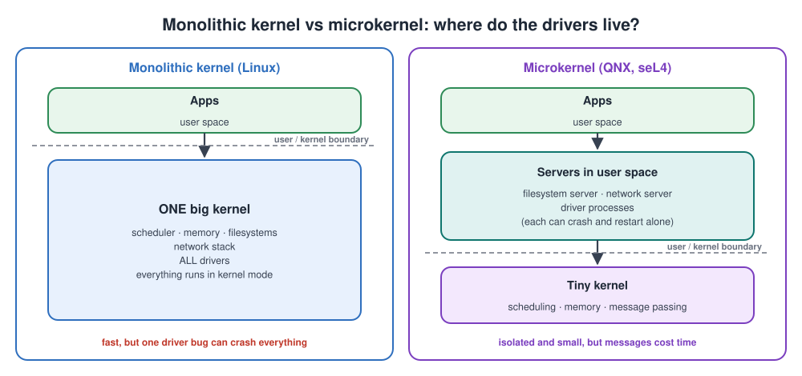
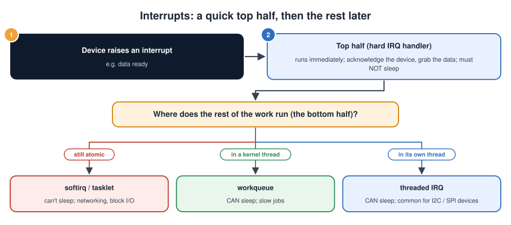
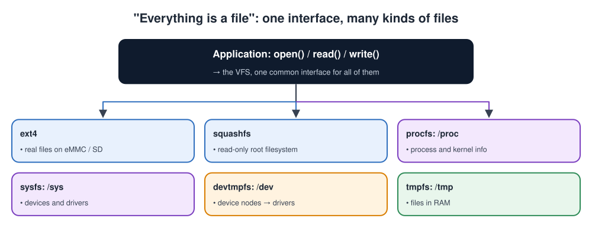

# Linux Kernel

## Contents

| # | Section | What you'll learn |
| --- | --- | --- |
| – | [Abbreviations](#abbreviations) | Every short form used in these notes, written in full |
| 1 | [What is the kernel?](#1-what-is-the-kernel) | Definition, block diagram, an analogy, kernel vs OS vs distribution |
| 2 | [Why do we need a kernel?](#2-why-do-we-need-a-kernel) | The problems it solves for every program |
| 3 | [User space, kernel space and system calls](#3-user-space-kernel-space-and-system-calls) | The privilege boundary and how programs cross it |
| 4 | [Kernel architecture](#4-kernel-architecture) | Monolithic vs microkernel; the subsystems; the source tree |
| 5 | [How the kernel boots](#5-how-the-kernel-boots) | From the bootloader's jump to `/sbin/init` |
| 6 | [Processes and scheduling](#6-processes-and-scheduling) | Tasks, states, schedulers, real-time |
| 7 | [Memory management](#7-memory-management) | Virtual memory, the MMU, allocators, OOM |
| 8 | [Interrupts and deferred work](#8-interrupts-and-deferred-work) | Top half, bottom half, workqueues, threaded IRQs |
| 9 | [Device drivers and kernel modules](#9-device-drivers-and-kernel-modules) | Driver types, the device model, a first module |
| 10 | [Synchronisation](#10-synchronisation) | Spinlocks, mutexes, atomics, RCU, and when to use each |
| 11 | [Filesystems and the VFS](#11-filesystems-and-the-vfs) | "Everything is a file", pseudo-filesystems, embedded filesystems |
| 12 | [Configuring and building the kernel](#12-configuring-and-building-the-kernel) | Kconfig, defconfig, cross-compiling, versions |
| 13 | [Debugging the kernel](#13-debugging-the-kernel) | Tools, and the error messages you'll meet |
| 14 | [Simple code examples](#14-simple-code-examples) | Module parameters, a timer, a workqueue, a kernel thread, mutex vs spinlock, a /proc file, a system call |
| 15 | [Interview quick answers](#15-interview-quick-answers) | Short answers to say out loud |

---

## Abbreviations

| Short form | Full form | In one line |
| --- | --- | --- |
| ALSA | Advanced Linux Sound Architecture | The Linux audio subsystem |
| API | Application Programming Interface | A set of functions or calls a program exposes |
| BSP | Board Support Package | The board-specific software (see BSP.md) |
| CFS | Completely Fair Scheduler | Linux's normal scheduler before kernel 6.6 |
| CIP SLTS | Civil Infrastructure Platform, Super Long-Term Support | Kernels maintained for about 10 years |
| CMA | Contiguous Memory Allocator | Reserves memory for large physically contiguous buffers |
| CPU | Central Processing Unit | The processor core |
| DMA | Direct Memory Access | A device copies data to/from memory without the CPU |
| DRM | Direct Rendering Manager | The Linux display/graphics subsystem |
| DTB | Device Tree Blob | The compiled device tree passed by the bootloader |
| EEVDF | Earliest Eligible Virtual Deadline First | Linux's normal scheduler from kernel 6.6 |
| EL0-EL3 | Exception Level 0-3 | Arm's privilege levels (EL0 = user, EL1 = kernel) |
| ELF | Executable and Linkable Format | The standard format of Linux programs and `vmlinux` |
| eret | Exception return | Arm instruction that returns from the kernel to user space |
| ext4 | Fourth extended filesystem | The standard Linux read-write filesystem |
| F2FS | Flash-Friendly File System | Filesystem designed for eMMC/SD flash |
| FIFO | First In, First Out | A queue; also a hardware buffer in a UART |
| GNU | GNU's Not Unix | The free-software project behind many Linux tools and the GPL |
| GPIO | General-Purpose Input/Output | A pin controlled directly by software |
| GPL | GNU General Public License | The licence of the Linux kernel |
| hwmon | Hardware monitoring | Subsystem for temperature/voltage/fan sensors |
| I/O | Input/Output | Reading and writing devices or storage |
| I2C | Inter-Integrated Circuit | 2-wire bus for slow chips |
| IIO | Industrial Input/Output | Linux subsystem for sensors and ADCs |
| IoT | Internet of Things | Connected devices |
| IPC | Inter-Process Communication | Pipes, shared memory, message queues, sockets |
| IRQ | Interrupt Request | A hardware interrupt |
| JFFS2 | Journalling Flash File System 2 | Filesystem for small raw flash |
| JTAG | Joint Test Action Group | Hardware debug port |
| kgdb | Kernel GNU Debugger | Debugging the kernel with gdb |
| LSM | Linux Security Module | Security frameworks such as SELinux and AppArmor |
| LTS | Long-Term Support | A kernel maintained for several years |
| MCU | Microcontroller Unit | Small chip with CPU, flash and RAM inside |
| MMU | Memory Management Unit | Hardware that translates virtual to physical addresses |
| NAND / NOR | Types of flash memory | NAND: dense, for storage; NOR: small, can run code in place |
| OOM | Out Of Memory | The system has no free memory left |
| OS | Operating System | e.g. Linux |
| PC | Personal Computer | A desktop or laptop computer |
| PCI | Peripheral Component Interconnect | The PC expansion bus |
| PID | Process ID | The number that identifies a process |
| QNX | (product name, originally "Quick UNIX") | A commercial real-time microkernel OS |
| RAM | Random Access Memory | Working memory |
| RCU | Read-Copy-Update | Lock-free mechanism for read-mostly data |
| RISC | Reduced Instruction Set Computer | The CPU design style of Arm and RISC-V |
| RT / PREEMPT_RT | Real-Time / preemptible real-time kernel | Linux configured for predictable latency |
| RTOS | Real-Time Operating System | Small OS for MCUs (FreeRTOS, Zephyr) |
| SD | Secure Digital | Removable memory card |
| seL4 | secure embedded L4 | A formally verified microkernel |
| SELinux | Security-Enhanced Linux | A mandatory access-control LSM |
| SoC | System on Chip | Processor chip with peripherals built in |
| SPI | Serial Peripheral Interface | Fast 4-wire bus |
| SSD | Solid-State Drive | Flash-based disk |
| svc | Supervisor call | Arm instruction that enters the kernel |
| SysRq | System Request (key) | Emergency kernel commands |
| TCP/IP | Transmission Control Protocol / Internet Protocol | The internet protocol suite |
| TF-A | Trusted Firmware-A | Arm's secure firmware (runs at EL3) |
| TLB | Translation Lookaside Buffer | Cache of recent address translations |
| tty | TeleTYpewriter | Linux name for terminal-like devices |
| TX / RX | Transmit / Receive | Data direction |
| UART | Universal Asynchronous Receiver-Transmitter | Simple serial port |
| UBI / UBIFS | Unsorted Block Images / UBI File System | Wear-levelling layer and filesystem for raw NAND |
| USB | Universal Serial Bus | Standard plug-and-play connection |
| V4L2 | Video4Linux 2 | The Linux camera/video subsystem |
| VFS | Virtual File System | One file API over all filesystems and devices |
| VID:PID | Vendor ID : Product ID | USB device identity |

---

## 1. What is the kernel?

> The **kernel** is the core of the operating system. It is the one program that runs with **full control of the hardware**, and it **shares the CPU, memory and devices safely** between all the other programs.

### The kernel block diagram


The system is built in layers, from top to bottom:

1. **User space:** your applications and the C library (glibc or musl). Programs here cannot touch the hardware.
2. **The system call interface:** the only door from user space into the kernel (`open`, `read`, `write`, `ioctl`, and so on).
3. **Kernel space**, with six main subsystems:
   - **Process management:** creating tasks and deciding which one runs (the scheduler).
   - **Memory management:** virtual memory and page tables.
   - **VFS and filesystems:** one file interface over ext4, `/proc`, `/sys`, `/dev` and others.
   - **Networking:** sockets and the TCP/IP stack.
   - **Device drivers:** the code that talks to each piece of hardware.
   - **IPC and security:** communication between processes, users, permissions, namespaces.
4. **Architecture code:** the CPU-specific part (Arm, x86, RISC-V): boot, exceptions, the MMU and context switching.
5. **Hardware:** CPU, RAM, storage and peripherals.

### An analogy: a restaurant

| Restaurant | Linux system |
| --- | --- |
| Customers | Applications |
| The menu and the waiters taking orders | **System calls**: the only way to ask for something |
| The kitchen manager | **The kernel** |
| Deciding which order is cooked next | **Scheduler** (process management) |
| Assigning counter space to each cook | **Memory management** |
| The pantry and its labelled shelves | **Filesystems** |
| Specialist cooks for each appliance | **Device drivers** |
| The ovens, fridges and hobs | **Hardware** |

Customers never walk into the kitchen and use the oven themselves. They order through the waiter, and the kitchen manager decides how and when it happens. That's exactly how applications and the kernel work.

### Kernel vs operating system vs distribution

| Term | What it is | Example |
| --- | --- | --- |
| **Kernel** | The privileged core: scheduling, memory, drivers, filesystems, networking | Linux 6.x |
| **Operating system** | Kernel + core user-space parts (C library, init system, shell, tools) | "GNU/Linux" |
| **Distribution** | A complete, packaged OS with a package manager and defaults | Debian, Ubuntu, Yocto Poky, Buildroot output |

On an embedded board you usually build your own "distribution" with Yocto or Buildroot ([BSP.md, section 7](BSP.md#7-building-a-bsp-yocto-and-buildroot)).

---

## 2. Why do we need a kernel?

Imagine every program on a device talking to the hardware directly:

- Two programs write to the same **UART** (serial port) at once, and the output is scrambled.
- A bug in one program overwrites another program's memory.
- A crashed app leaves the Ethernet controller half-configured.

The kernel exists to prevent all of this.

| Problem | Without a kernel | What the kernel provides |
| --- | --- | --- |
| **Sharing the CPU** | One busy program freezes everything | The **scheduler** gives each task fair turns, or strict priorities |
| **Protecting memory** | A bug in one app corrupts another app | **Virtual memory**: each process has a private address space |
| **Hardware differences** | Every app must know every chip's registers | **Drivers** behind standard interfaces (`read`, `write`, sockets) |
| **Safe access to devices** | Two apps drive the same device at once | Drivers **serialise** access; permissions decide who may use what |
| **Storage** | Every app must understand raw flash blocks | **Filesystems**: files and directories |
| **Networking** | Every app implements TCP/IP itself | One shared **network stack** behind sockets |
| **Security** | Any app can do anything | **Users, permissions, capabilities, namespaces, LSMs** (Linux Security Modules such as SELinux and AppArmor) |
| **Reliability** | One crash takes down the whole device | A crashing process is cleaned up; the rest keep running |

---

## 3. User space, kernel space and system calls

### Two privilege levels

The CPU itself enforces the boundary. On 64-bit Arm the levels are called **Exception Levels (EL)**:

| Level | Who runs there | What it can do |
| --- | --- | --- |
| **EL0** (user space) | Applications, libraries, services | Only its own memory; no direct hardware access |
| **EL1** (kernel space) | The Linux kernel | Everything: all memory, all devices, page tables, interrupts |
| EL2 | A hypervisor (if any) | Runs virtual machines |
| EL3 | The secure monitor (**TF-A**, Trusted Firmware-A) | Switches between the secure and normal worlds |

On x86 the same idea is called **ring 3** (user) and **ring 0** (kernel).

### A system call, step by step

A **system call** is the controlled way a program asks the kernel to do something for it.


1. Your app calls `write(fd, "hi\n", 3)`. `fd` is a **file descriptor**: the number of an open file.
2. The C library puts the **system call number** (64 for `write` on arm64) in register `x8` and the arguments in `x0`-`x2`.
3. It executes **`svc #0`** (supervisor call), a special instruction that **traps** into the kernel and switches the CPU to EL1.
4. The kernel's exception entry saves the app's registers and looks up handler number 64 in the system call table.
5. **`sys_write()`** finds the open file behind `fd`.
6. The **VFS** (Virtual File System) sees it's a character device and passes the data to the **tty layer** (the terminal/serial layer).
7. The **UART driver** copies the bytes into the hardware **FIFO** (First-In-First-Out buffer), and they leave on the TX pin.
8. The kernel puts the result in `x0` and executes **`eret`** (exception return). The CPU drops back to EL0 and `write()` returns 3.

> **Why the extra steps?** The trap is the controlled entry point. The kernel checks every argument (is `fd` valid? is the buffer really the app's memory?) before acting, so a buggy or malicious app can't harm the system.

### Common system calls

| Group | Examples |
| --- | --- |
| Files and devices | `open`, `read`, `write`, `close`, `ioctl` (input/output control), `mmap`, `poll` |
| Processes | `fork` / `clone`, `execve`, `exit`, `wait4`, `kill` |
| Memory | `brk`, `mmap`, `munmap`, `mprotect` |
| Networking | `socket`, `bind`, `connect`, `sendto`, `recvfrom` |
| Time | `clock_gettime`, `nanosleep`, `timerfd_create` |

```bash
strace ./app                  # every system call the program makes
strace -c ./app               # a summary: which calls, how many, how long
ltrace ./app                  # library calls (printf, malloc, ...) instead
```

---

## 4. Kernel architecture

### Monolithic vs microkernel

There are two main ways to design a kernel. The difference is **where the drivers live**:

- **Monolithic kernel (Linux).** Everything, including all drivers, runs inside **one big kernel** in privileged mode. It is fast, but a bad driver can crash the whole system.
- **Microkernel** (QNX, seL4). Only a tiny kernel (scheduling, memory, message passing) runs in privileged mode. Drivers and services run **as normal user processes** above it. A crash stays contained, but passing messages costs time.



| | **Monolithic (Linux)** | **Microkernel (QNX, seL4)** |
| --- | --- | --- |
| Where drivers run | Inside the kernel (EL1) | As separate user-space processes |
| Speed | Fast: a function call between subsystems | Slower: messages between processes |
| Fault isolation | A driver bug can crash the whole kernel | A crashed driver can be restarted |
| Size | Large | Small, easier to verify |

Linux is **monolithic but modular**: most drivers can be built as **loadable modules** (`.ko` files, "kernel object") and inserted or removed at run time, without rebooting.

### The main subsystems

| Subsystem | Its job | You meet it as |
| --- | --- | --- |
| **Process management** | Create, schedule and destroy tasks; signals | `ps`, `top`, `nice`, `chrt` |
| **Memory management** | Virtual memory, page tables, allocation, swapping | `free`, `/proc/meminfo`, the OOM (Out Of Memory) killer |
| **VFS + filesystems** | One file API over many filesystems and devices | `mount`, `/proc`, `/sys`, `/dev` |
| **Networking** | Sockets, TCP/IP, routing, firewall | `ip`, `ss`, `iptables` / `nft` |
| **Device drivers** | Talk to hardware; present standard interfaces | `/dev/*`, `dmesg`, `lsmod` |
| **IPC + security** | **IPC** (Inter-Process Communication): pipes, shared memory, message queues. Security: users, namespaces, LSMs | Containers, SELinux / AppArmor |
| **Architecture code** | CPU-specific boot, the MMU, exceptions, context switching | `arch/arm64/`, `arch/arm/`, `arch/riscv/` |

### A quick tour of the source tree

| Directory | What's in it |
| --- | --- |
| `arch/` | CPU-specific code, plus device trees for Arm boards (`arch/arm64/boot/dts/`) |
| `kernel/` | The core: scheduler, signals, timers, interrupt core |
| `mm/` | Memory management |
| `fs/` | The VFS and every filesystem |
| `net/` | The network stack |
| `drivers/` | All device drivers (the largest part of the kernel) |
| `include/` | Kernel headers |
| `init/` | Boot-time startup (`start_kernel()`) |
| `Documentation/` | Documentation, including device tree bindings |

---

## 5. How the kernel boots

The bootloader (U-Boot) has loaded the kernel image and the device tree into RAM, and jumped to the kernel with the **DTB** (Device Tree Blob) address in a register ([Bootloader.md, section 5](Bootloader.md#5-boot-flow-linux-vs-iot-mcu)). From there:


Step by step:

1. **The bootloader jumps to the kernel.** The device tree address is in a register (`x0` on arm64).
2. **Early start.** A compressed kernel (`zImage`) decompresses itself, then sets up the **MMU** (Memory Management Unit) and a stack.
3. **`start_kernel()`** runs. It is the first C function of the kernel.
4. **`setup_arch()`** reads the device tree: memory size, CPU type, console.
5. **The core subsystems start:** memory management, the scheduler, interrupts, timers.
6. **The console is ready.** From here on, `printk` messages appear on the serial port.
7. **`rest_init()`** starts the kernel threads.
8. **Drivers initialise.** Buses come first, then each device described in the device tree is probed.
9. **The root filesystem is mounted,** using `root=` from the boot arguments, or an initramfs.
10. **`/sbin/init` runs as process 1** (**PID** 1, Process ID 1). This is systemd or BusyBox init.
11. **Services and your application** are started by init.

If boot stops, the last message you saw tells you which step you reached.

What it looks like on the serial console:

```text
[    0.000000] Booting Linux on physical CPU 0x0000000000 [0x410fd034]
[    0.000000] Linux version 6.6.23 (builder@host) (aarch64-linux-gnu-gcc 12.3) #1 SMP PREEMPT
[    0.000000] Machine model: MyCompany MyBoard
[    0.000000] Kernel command line: console=ttymxc1,115200 root=/dev/mmcblk2p2 rootwait
[    0.023456] Memory: 1987654K/2097152K available
[    1.234567] imx-i2c 30a20000.i2c: probe ... done
[    2.345678] EXT4-fs (mmcblk2p2): mounted filesystem ...
[    2.456789] Run /sbin/init as init process
```

| Line | What it tells you |
| --- | --- |
| `Machine model:` | The device tree loaded is the one you expected |
| `Kernel command line:` | The `bootargs` U-Boot passed: console and root filesystem |
| `Memory:` | How much RAM the kernel found (from the device tree) |
| Driver probe lines | Which drivers found their hardware |
| `Run /sbin/init` | The kernel has finished booting; user space starts now |

`SMP` in the version line means Symmetric Multi-Processing (several CPU cores). `PREEMPT` means the kernel can be interrupted to run a higher-priority task.

---

## 6. Processes and scheduling

### Processes and threads

To the Linux kernel, both processes and threads are **tasks**, each described by a `struct task_struct`. The difference is what they share:

| | Process | Thread |
| --- | --- | --- |
| Memory (address space) | Its own | Shared with the other threads of the same process |
| Open files | Its own table | Shared |
| Created by | `fork()` then `execve()` | `pthread_create()` (uses `clone()`) |
| Crash impact | Only itself | The whole process |

### Task states

Every task is always in one **state**. The arrows in the diagram show what moves it from one state to another.


1. **Created:** `fork()` or `clone()` makes a new task.
2. **Runnable (R):** ready to run, waiting for a CPU.
3. **Running (R):** the scheduler picked it, and it is on a CPU now. When its time slice ends or a higher-priority task appears (**preemption**), it goes back to Runnable.
4. **Sleeping (S or D):** it waits for something, such as data, a lock or a timer. When the event arrives (data, an interrupt, a timeout), it becomes Runnable again.
   - **S** (interruptible sleep): a signal can wake it.
   - **D** (uninterruptible sleep): usually waiting for disk I/O (Input/Output); it can't be woken early.
5. **Stopped (T):** paused by the `SIGSTOP` signal; `SIGCONT` resumes it.
6. **Zombie (Z):** it has finished (`exit()`), but its parent hasn't yet collected its exit status.
7. **Gone:** the parent called `wait()`, and the task is removed completely.

These letters are exactly what `ps` shows in its state column.

### Scheduling policies

| Policy | Type | Behaviour | Use for |
| --- | --- | --- | --- |
| `SCHED_OTHER` (normal) | Fair-share | Every task gets a fair share, weighted by `nice` (-20 to 19). The scheduler was **CFS** (Completely Fair Scheduler), replaced by **EEVDF** (Earliest Eligible Virtual Deadline First) from kernel 6.6. | Almost everything |
| `SCHED_FIFO` | Real-time | The highest priority (1-99) runs until it blocks or yields | Hard timing loops |
| `SCHED_RR` (Round Robin) | Real-time | Like FIFO, but tasks of equal priority take turns | Several real-time tasks at one priority |
| `SCHED_DEADLINE` | Real-time | Runs within a given runtime / period / deadline | Periodic control tasks |

```bash
ps -eo pid,cls,rtprio,ni,stat,comm   # policy, priority, nice, state
chrt -f 80 ./control_loop            # run as SCHED_FIFO priority 80
taskset -c 2 ./control_loop          # pin to CPU core 2
```

### Real-time Linux

Standard Linux is optimised for **throughput** (total work done), not for guaranteed response time. For tight timing on embedded systems:

- **`PREEMPT_RT`** makes almost all kernel code preemptible and turns interrupt handlers into threads, so latency becomes predictable (typically tens of microseconds). It has been part of **mainline Linux since 6.12**.
- Measure latency with **`cyclictest`** (from rt-tests).
- For hard real-time in the microsecond range, many products put that part on a separate **MCU** (Microcontroller Unit) or core running an **RTOS** (Real-Time Operating System), and let Linux handle the rest.

---

## 7. Memory management

### Virtual memory


How virtual memory works, step by step:

1. **Every process sees its own, complete address space.** Processes A and B both have a stack, heap and code at similar **virtual** addresses.
2. **The MMU translates every address** the CPU uses. It looks in the process's **page table** to find the **physical page** in RAM. Pages are usually **4 KB**.
3. **The pages of A and B land in different physical places,** so neither process can see or damage the other's memory.
4. **Shared code** (like the C library) is stored **once** in RAM and mapped into both processes, which saves memory.
5. **The kernel** is mapped into every process's address space, but that region can only be accessed when the CPU is in kernel mode.

### Key ideas

| Idea | Meaning |
| --- | --- |
| **MMU** (Memory Management Unit) | Hardware that translates virtual addresses to physical addresses on every access |
| **Page** | The unit of memory management, typically 4 KB |
| **Page table** | The per-process map from virtual pages to physical pages |
| **TLB** (Translation Lookaside Buffer) | A cache of recent translations inside the CPU |
| **Page fault** | An access to a page that isn't mapped yet. The kernel either maps it (normal: first touch, file loading) or kills the process (a **segmentation fault**) |
| **Demand paging** | Memory is only really allocated when it is first touched |
| **Swap** | Moving unused pages to storage. Usually **disabled on embedded flash**, because it wears the flash out |
| **OOM killer** | When memory runs out, the kernel kills a process so the system survives |

### Allocating memory inside the kernel

| Function | Gives you | Physically contiguous? | Use for |
| --- | --- | --- | --- |
| `kmalloc()` / `kzalloc()` | Small blocks (bytes to a few pages) | Yes | Most driver structures |
| `vmalloc()` | Large blocks | No (only virtually contiguous) | Big buffers the hardware doesn't touch |
| `devm_kzalloc()` | Like `kzalloc`, freed automatically when the driver detaches | Yes | Drivers: avoids memory leaks on errors |
| `dma_alloc_coherent()` | Memory a device can write into by **DMA** (Direct Memory Access) | Yes, device-visible | DMA buffers |
| Slab caches (`kmem_cache_*`) | Many objects of the same size | Yes | Frequently allocated structures |

> **Embedded note: CMA.** Cameras, displays and video codecs need large **physically contiguous** buffers. The **Contiguous Memory Allocator** reserves a region at boot (set with `cma=` on the command line or in the device tree), so these allocations still succeed after the system has been running for a while.

```bash
free -h                       # total, used, available memory
cat /proc/meminfo             # detailed breakdown
cat /proc/<pid>/maps          # a process's virtual memory map
dmesg | grep -i "out of memory"   # did the OOM killer run?
```

---

## 8. Interrupts and deferred work

When hardware needs attention (a UART received a byte, a packet arrived, a timer expired), it raises an **interrupt** (**IRQ**, Interrupt Request). The CPU stops what it's doing and runs the kernel's handler. Handlers must be **fast** and **can't sleep**, so Linux splits the work in two.



Step by step:

1. **The device raises an interrupt,** for example "data ready".
2. **The top half** (the hard IRQ handler) runs immediately. It does only the urgent minimum: acknowledge the device and grab the data. It is **not allowed to sleep**.
3. **The rest of the work is deferred** to a **bottom half**, which runs a little later. Choose it by whether the work needs to sleep:
   - **softirq or tasklet:** still can't sleep. Used for networking and block I/O.
   - **workqueue:** runs in a kernel thread and **can** sleep. Used for slow jobs.
   - **threaded IRQ:** its own thread per interrupt, and **can** sleep. Common for I2C and SPI devices.

| Mechanism | Context | Can sleep? | Typical use |
| --- | --- | --- | --- |
| **Hard IRQ handler** | Interrupt | No | Acknowledge the device, read a status register, schedule more work |
| **Softirq** | Interrupt (deferred) | No | Networking, block I/O, timers (kernel core only) |
| **Tasklet** | Built on softirq | No | Older drivers (being phased out in favour of workqueues) |
| **Workqueue** | Kernel thread | **Yes** | Anything slow: I2C transfers, firmware loading |
| **Threaded IRQ** (`request_threaded_irq`) | A kernel thread per IRQ | **Yes** | Devices behind slow buses (an I2C sensor's "data ready" pin) |

> **Why threaded IRQs matter in embedded work:** reading an **I2C** (Inter-Integrated Circuit) sensor takes milliseconds, and the I2C calls sleep. That's impossible in a hard IRQ handler. A threaded IRQ lets the driver do it simply and safely.

```bash
cat /proc/interrupts          # count of each interrupt per CPU: is my device's IRQ firing?
```

---

## 9. Device drivers and kernel modules

### Kinds of driver

Drivers are grouped by how data flows: **character** (a byte stream, such as `/dev/ttyS0`), **block** (storage, such as `/dev/mmcblk0`) and **network** (interfaces such as `eth0`, with no `/dev` node). Most drivers also plug into a **subsystem framework**, such as hwmon for temperature sensors or input for buttons. Both are explained, with tables, in [Linux_device_drivers.md, section 2](Linux_device_drivers.md#2-types-of-drivers).

### The device model: how a driver finds its hardware

Four words first:

- **Bus:** the way devices are connected: platform (on-chip), I2C, **SPI** (Serial Peripheral Interface), USB, PCI.
- **Device:** one piece of hardware, usually created from a device tree node.
- **Driver:** code that knows how to handle a type of device.
- **Probe:** the driver's start-up function for one device.


Step by step:

1. **The device tree describes the device,** with a `compatible` string such as `"acme,sensor"`.
2. **The kernel creates a device** on the matching bus.
3. **The driver registers** and lists the `compatible` strings it supports in its match table.
4. **The bus core compares** the two. The same string means a match. (For USB, the vendor and product ID pair, **VID:PID**, is used instead.)
5. **The driver's `probe()` runs.** It maps the registers, gets the IRQ and clocks, and registers with a subsystem.
6. **The device appears** in `/dev` and `/sys`. When the device goes away, the kernel calls the driver's `remove()`.

### Your first kernel module

```c
// hello.c: the smallest useful kernel module
#include <linux/module.h>
#include <linux/init.h>

static int __init hello_init(void)
{
    pr_info("hello: loaded\n");      /* goes to the kernel log (dmesg) */
    return 0;                        /* non-zero would cancel loading */
}

static void __exit hello_exit(void)
{
    pr_info("hello: unloaded\n");
}

module_init(hello_init);
module_exit(hello_exit);
MODULE_LICENSE("GPL");
MODULE_DESCRIPTION("Hello world module");
```

```makefile
# Makefile
obj-m += hello.o
```

```bash
# Native build (on the board, or a PC with kernel headers)
make -C /lib/modules/$(uname -r)/build M=$PWD modules

# Cross-compile for an arm64 board
make -C ~/linux ARCH=arm64 CROSS_COMPILE=aarch64-linux-gnu- M=$PWD modules

sudo insmod hello.ko          # load    → dmesg shows "hello: loaded"
lsmod | grep hello            # is it loaded?
sudo rmmod hello              # unload  → "hello: unloaded"
modinfo hello.ko              # licence, description, dependencies
```

`MODULE_LICENSE("GPL")` declares the **GPL** (GNU General Public License). Without it, the module can't use many kernel functions.

### A real driver

A real driver is a module that registers with a bus and lists the `compatible` strings it handles. The full code, with everything `probe()` needs, is in [Linux_device_drivers.md, section 6](Linux_device_drivers.md#6-platform-drivers-and-the-device-tree).

**Commands for modules:**

| Command | Purpose |
| --- | --- |
| `insmod file.ko` / `rmmod name` | Load / unload one module (no dependency handling) |
| `modprobe name` | Load a module **and its dependencies** |
| `lsmod` | List loaded modules |
| `modinfo file.ko` | Show a module's details |
| `ls /sys/bus/platform/drivers/` | Registered drivers on the platform bus |

> **Built-in vs module:** in the kernel config, `y` builds a driver **into** the kernel image and `m` builds it as a **module**. Drivers needed to mount the root filesystem (storage, filesystem) must be built in, or be in an initramfs (initial RAM filesystem).

---

## 10. Synchronisation

The kernel runs code **concurrently**: several CPU cores, preemption, and interrupts arriving at any moment. Shared data needs protection.

| Tool | How it waits | Can the holder sleep? | Use when |
| --- | --- | --- | --- |
| **Atomic ops** (`atomic_t`, `atomic_inc()`) | No waiting | – | A single counter or flag |
| **Spinlock** (`spin_lock()`) | Busy-waits (spins in a loop) | **No** | Short critical sections, and data shared with **interrupt handlers** (`spin_lock_irqsave()`) |
| **Mutex** (mutual exclusion, `mutex_lock()`) | Sleeps until free | Yes | Longer sections in process context, e.g. around an I2C transfer |
| **Semaphore** | Sleeps; allows N holders | Yes | Counting resources (a mutex is preferred for plain locking) |
| **RCU** (Read-Copy-Update) | Readers never block | Readers: no | Read-mostly data (routing tables, lists) |
| **Completion** | Sleeps until signalled | Yes | "Wait until the DMA / interrupt says it's done" |

**Two golden rules:**

1. **Never sleep while holding a spinlock or in an interrupt handler.** That includes `mutex_lock()`, `msleep()`, `kmalloc(GFP_KERNEL)` and I2C/SPI transfers. The kernel warns: *"BUG: sleeping function called from invalid context."*
2. **Always take locks in the same order** everywhere, or two paths can wait for each other forever (**deadlock**). Enable `CONFIG_PROVE_LOCKING` (lockdep, the lock dependency checker) during development to catch this automatically.

---

## 11. Filesystems and the VFS

### "Everything is a file"

The **Virtual File System (VFS)** gives one API (`open`, `read`, `write`, `close`) for very different things:



An application uses the same few calls for everything, and the VFS sends each call to the right place:

| Where the call goes | What it really is |
| --- | --- |
| **ext4** (fourth extended filesystem) | Real files on eMMC or an SD card |
| **squashfs** | A compressed, read-only root filesystem |
| **procfs** (`/proc`) | Process and kernel information, generated on the fly |
| **sysfs** (`/sys`) | Devices and drivers, generated on the fly |
| **devtmpfs** (`/dev`) | Device nodes that lead to drivers |
| **tmpfs** (`/tmp`) | Files kept only in RAM |

### Pseudo-filesystems: the kernel's control panel

A **pseudo-filesystem** has no storage behind it. The kernel generates its files when you read them.

| Mount | What's there | Example |
| --- | --- | --- |
| `/proc` | Processes and kernel status | `cat /proc/cpuinfo`, `/proc/interrupts`, `/proc/<pid>/status` |
| `/sys` | The device model: every bus, device and driver; many settings | `cat /sys/class/thermal/thermal_zone0/temp` |
| `/dev` | Device nodes, created automatically (devtmpfs + udev/mdev) | `/dev/ttyS0`, `/dev/i2c-1` |
| `/sys/kernel/debug` | debugfs: driver debug information | `mount -t debugfs none /sys/kernel/debug` |
| `/sys/kernel/tracing` | tracefs: ftrace (function tracer) | See [section 13](#13-debugging-the-kernel) |

### Filesystems for embedded storage

| Filesystem | Storage | Strengths | Typical use |
| --- | --- | --- | --- |
| **ext4** | eMMC, SD, **SSD** (Solid-State Drive) | Journaled, mature | Read-write root and data partitions |
| **squashfs** | Any | Compressed, **read-only** | Robust root filesystem; combine with overlayfs |
| **overlayfs** | On top of others | A writable layer over a read-only base | Read-only rootfs with persistent changes |
| **UBIFS** (UBI File System, on **UBI**, Unsorted Block Images) | Raw NAND flash | Wear levelling, power-cut tolerant | NAND-based boards |
| **JFFS2** (Journalling Flash File System 2) | Small raw NOR/NAND flash | Simple, wear levelling | Small legacy flash partitions |
| **F2FS** (Flash-Friendly File System) | eMMC, SD | Designed for flash translation layers | Write-heavy data |
| **tmpfs** | RAM | Fast, lost at reboot | `/tmp`, `/run` |

---

## 12. Configuring and building the kernel

### Configuration (Kconfig)

The kernel has **thousands of options**. Each one is set to `y` (built in), `m` (module) or `n` (off), and they're stored in a `.config` file.

| Command | Purpose |
| --- | --- |
| `make ARCH=arm64 defconfig` | Start from the architecture's default configuration |
| `make ARCH=arm64 myboard_defconfig` | Start from your board's configuration |
| `make ARCH=arm64 menuconfig` | A text menu to change options (search with `/`) |
| `make ARCH=arm64 savedefconfig` | Save a minimal `defconfig` to keep in your BSP (Board Support Package) |
| `scripts/config --enable CONFIG_...` | Change options from a script |

### Cross-compiling for an arm64 board

**Cross-compiling** means building on a PC for a different CPU (here 64-bit Arm).

```bash
export ARCH=arm64
export CROSS_COMPILE=aarch64-linux-gnu-

make myboard_defconfig
make -j$(nproc) Image dtbs modules                   # kernel, device trees, modules
make modules_install INSTALL_MOD_PATH=/path/to/rootfs
```

| Output | Where | What it is |
| --- | --- | --- |
| `Image` | `arch/arm64/boot/Image` | The uncompressed arm64 kernel (`booti` in U-Boot) |
| `zImage` | `arch/arm/boot/zImage` | The compressed 32-bit Arm kernel (`bootz`) |
| `*.dtb` | `arch/arm64/boot/dts/<vendor>/` | Compiled device trees |
| `*.ko` | Installed under `/lib/modules/<version>/` | Loadable modules |
| `vmlinux` | Top of the tree | The kernel as an **ELF** (Executable and Linkable Format) file with symbols, for debugging (not booted) |
| `System.map` | Top of the tree | Symbol addresses, for decoding crashes |

In practice, Yocto or Buildroot run these steps for you ([BSP.md, section 7](BSP.md#7-building-a-bsp-yocto-and-buildroot)).

### Kernel versions

| Kind | Meaning | For products |
| --- | --- | --- |
| **Mainline** | Linus Torvalds' tree; a new release about every 9-10 weeks | Newest features, short support |
| **Stable** | Bug-fix updates to a release (6.x.**y**) | Supported only briefly |
| **LTS** (Long-Term Support) | One release a year, maintained for several years | **Recommended for products** |
| **CIP SLTS** (Civil Infrastructure Platform, Super Long-Term Support) | Maintained for about 10 years | Industrial and infrastructure products |
| **Vendor kernel** | The SoC vendor's fork of an LTS with extra patches | What most BSPs ship |

Check current versions at [kernel.org](https://www.kernel.org/). `uname -r` shows the running kernel's version.

---

## 13. Debugging the kernel

### The toolbox

| Tool | What it's for | Example |
| --- | --- | --- |
| **`dmesg` / printk** | The kernel log: the first place to look | `dmesg -w`, `dmesg --level=err,warn` |
| **Log levels** | `pr_err`, `pr_warn`, `pr_info`, `pr_debug`, and the `dev_*()` versions for drivers | `dev_err(dev, "timeout\n")` |
| **Dynamic debug** | Turn `pr_debug` messages on at run time, per file or module | `echo 'module mydrv +p' > /sys/kernel/debug/dynamic_debug/control` |
| **`earlycon`** | Console output before the real serial driver loads | Add `earlycon` to `bootargs` |
| **ftrace** | Trace kernel functions and events with timing | `echo function_graph > /sys/kernel/tracing/current_tracer` |
| **`trace-cmd` / `perf`** | Friendlier tracing; CPU profiling | `perf top`, `trace-cmd record -e irq` |
| **Magic SysRq** (System Request) | Emergency actions and dumps | `echo t > /proc/sysrq-trigger` (dump all tasks) |
| **pstore / ramoops** | Keep the last kernel log across a crash and reboot | Read it from `/sys/fs/pstore/` after reboot |
| **kgdb** (Kernel GNU Debugger) / **JTAG** (Joint Test Action Group debug port) | Step through kernel code with a debugger | For the hardest bugs |
| **`addr2line` / `faddr2line`** | Turn a crash address into a source line | `./scripts/faddr2line vmlinux func+0x48/0x100` |

### Reading an oops

When the kernel hits a serious bug in a driver, it prints an **oops** (a crash report):

```text
Unable to handle kernel NULL pointer dereference at virtual address 0000000000000008
...
pc : sensor_read+0x24/0x80 [acme_sensor]
lr : sensor_probe+0x5c/0x120 [acme_sensor]
Call trace:
 sensor_read+0x24/0x80 [acme_sensor]
 sensor_probe+0x5c/0x120 [acme_sensor]
 platform_probe+0x68/0xe0
 really_probe+0x150/0x3c0
```

How to read it:

1. **The first line** says what went wrong: a NULL pointer, at offset 8 of a structure.
2. **`pc`** (program counter) says where it crashed: 0x24 bytes into `sensor_read()` in module `acme_sensor`. **`lr`** (link register) is the function that called it.
3. **The call trace** shows how it got there, read from the top down: `probe()` called `sensor_read()`.
4. **Turn `sensor_read+0x24` into a source line** with `faddr2line`, then look for a pointer that wasn't set.

### Error messages you'll meet

| Message | Meaning | Usual cause |
| --- | --- | --- |
| **`Unable to handle kernel NULL pointer dereference`** | Oops: a driver used a NULL pointer | A missing check, or data used before probe finished |
| **`BUG: scheduling while atomic`** | Code slept while holding a spinlock or in an interrupt | `msleep()`, `mutex_lock()` or an I2C call in the wrong context |
| **`BUG: sleeping function called from invalid context`** | The same family, caught earlier | As above; move the work to a workqueue or threaded IRQ |
| **`watchdog: BUG: soft lockup - CPU#0 stuck for 22s!`** | A CPU ran kernel code without yielding for too long | An endless loop, or polling hardware that never responds |
| **`INFO: task ... blocked for more than 120 seconds`** | A task has been waiting (state D) too long | Deadlock, or I/O that never completes |
| **`rcu: INFO: rcu_sched detected stalls`** | A CPU isn't passing through RCU quiescent states | Long loops with interrupts or preemption disabled |
| **`Out of memory: Killed process 1234 (app)`** | The OOM killer freed memory | A memory leak, or not enough RAM for the workload |
| **`Kernel panic - not syncing: VFS: Unable to mount root fs`** | No root filesystem | Wrong `root=`, missing `rootwait`, storage or ext4 not built in |
| **`Kernel panic - not syncing: Attempted to kill init!`** | PID 1 died | A broken init, missing libraries in the rootfs, wrong architecture |
| **`disagrees about version of symbol`** / **`Unknown symbol`** | Module built for another kernel, or needs a missing feature | Rebuild the modules together with the kernel; enable the option |
| **`probe of ... failed with error -517`** | Deferred probe: a dependency isn't ready yet | See [BSP.md, section 9](BSP.md#9-errors-a-bsp-can-get) |

**A simple method for kernel problems:**

1. **Read `dmesg` from the top.** The first error usually causes the rest.
2. **Reproduce** it with the smallest possible test.
3. **Find where:** decode the call trace with `faddr2line`, or add `pr_info` / dynamic debug around the suspect code.
4. **Check the context:** is this code running in an interrupt, under a spinlock, or in a thread that may sleep?
5. **Keep the evidence:** enable pstore/ramoops so a crash log survives the reboot.

---

## 14. Simple code examples

Small kernel modules and programs, each showing one idea from these notes. They build with the same `Makefile` as the hello module in [section 9](#9-device-drivers-and-kernel-modules): change `obj-m` to the new file name.

### Example 1: Module parameters

Pass settings to a module when you load it.

```c
#include <linux/module.h>
#include <linux/moduleparam.h>

static int count = 3;
static char *name = "world";
module_param(count, int, 0644);    /* readable and writable in /sys/module/params_demo/parameters/ */
module_param(name, charp, 0444);   /* read-only there */
MODULE_PARM_DESC(count, "How many times to greet");

static int __init params_init(void)
{
    for (int i = 0; i < count; i++)
        pr_info("hello, %s (%d)\n", name, i);
    return 0;
}

static void __exit params_exit(void)
{
    pr_info("bye, %s\n", name);
}

module_init(params_init);
module_exit(params_exit);
MODULE_LICENSE("GPL");
```

**Try it:**

```bash
sudo insmod params_demo.ko count=2 name=board
dmesg | tail -2                                        # hello, board (0) / hello, board (1)
cat /sys/module/params_demo/parameters/count           # 2
modinfo params_demo.ko                                 # lists the parameters and their descriptions
```

### Example 2: A kernel timer: run a function every second

```c
#include <linux/module.h>
#include <linux/timer.h>
#include <linux/jiffies.h>

static struct timer_list tick_timer;
static unsigned int ticks;

static void tick_fn(struct timer_list *t)
{
    pr_info("tick %u\n", ++ticks);             /* runs in interrupt context: must NOT sleep */
    mod_timer(&tick_timer, jiffies + HZ);      /* run again in 1 s (HZ jiffies = 1 second) */
}

static int __init tick_init(void)
{
    timer_setup(&tick_timer, tick_fn, 0);
    mod_timer(&tick_timer, jiffies + HZ);      /* first run in 1 s */
    return 0;
}

static void __exit tick_exit(void)
{
    timer_delete_sync(&tick_timer);            /* wait until it's really stopped (del_timer_sync before 6.2) */
}

module_init(tick_init);
module_exit(tick_exit);
MODULE_LICENSE("GPL");
```

**The rule to remember:** a timer function runs in **interrupt context**, so it can't sleep: no `msleep()`, no mutex, no I2C transfer. For work that needs to sleep, use Example 3.

### Example 3: A workqueue: work that is allowed to sleep

```c
#include <linux/workqueue.h>
#include <linux/delay.h>

static void slow_work_fn(struct work_struct *w)
{
    msleep(100);                        /* allowed: this runs in a kernel thread */
    pr_info("slow work done\n");
}
static DECLARE_WORK(slow_work, slow_work_fn);

/* From a timer or an interrupt handler: "do this soon, in a context that may sleep" */
schedule_work(&slow_work);

/* In the module's exit function: wait for it to finish */
cancel_work_sync(&slow_work);
```

This is the usual pattern: the interrupt handler does the minimum, then **hands the slow part to a workqueue** ([section 8](#8-interrupts-and-deferred-work)).

### Example 4: A kernel thread

A thread that loops in the background, like a small daemon inside the kernel:

```c
#include <linux/kthread.h>
#include <linux/delay.h>

static struct task_struct *worker;

static int worker_fn(void *data)
{
    while (!kthread_should_stop()) {           /* true when kthread_stop() is called */
        pr_info("worker: polling the sensor\n");
        msleep_interruptible(1000);
    }
    return 0;
}

/* In init: create and start it. It appears in ps as [my_worker]. */
worker = kthread_run(worker_fn, NULL, "my_worker");
if (IS_ERR(worker))
    return PTR_ERR(worker);

/* In exit: ask it to stop, and wait until it has */
kthread_stop(worker);
```

### Example 5: Protecting shared data: mutex or spinlock

```c
static DEFINE_MUTEX(cfg_lock);         /* waiting = sleeping: process context only       */
static DEFINE_SPINLOCK(stats_lock);    /* waiting = spinning: safe in interrupt context  */

static int config_value;
static unsigned long irq_count;

void set_config(int v)                 /* called from a write() system call */
{
    mutex_lock(&cfg_lock);
    config_value = v;                  /* may sleep inside, e.g. for an I2C transfer */
    mutex_unlock(&cfg_lock);
}

irqreturn_t my_irq(int irq, void *dev) /* interrupt handler */
{
    spin_lock(&stats_lock);
    irq_count++;
    spin_unlock(&stats_lock);
    return IRQ_HANDLED;
}

unsigned long get_irq_count(void)      /* normal code that shares data with the interrupt */
{
    unsigned long flags, n;

    spin_lock_irqsave(&stats_lock, flags);   /* also blocks the interrupt on this CPU */
    n = irq_count;
    spin_unlock_irqrestore(&stats_lock, flags);
    return n;
}
```

**Which to use when** is in the table in [section 10](#10-synchronisation). `spin_lock_irqsave()` matters: without it, the interrupt can arrive while normal code holds the lock on the same CPU, and the interrupt handler then spins forever (a **deadlock**).

### Example 6: A file in `/proc`

Show the module's state as a readable file:

```c
#include <linux/proc_fs.h>
#include <linux/seq_file.h>

static int status_show(struct seq_file *m, void *v)
{
    seq_printf(m, "ticks: %u\n", ticks);      /* print like printf, into the file */
    return 0;
}

/* In init: creates /proc/my_status */
proc_create_single("my_status", 0444, NULL, status_show);

/* In exit */
remove_proc_entry("my_status", NULL);
```

**Try it:** `cat /proc/my_status`. For a **device's** settings, drivers use sysfs attributes instead ([Linux_device_drivers.md](Linux_device_drivers.md)).

### Example 7: A system call from user space, two ways

```c
#include <unistd.h>
#include <sys/syscall.h>

int main(void)
{
    write(1, "via libc\n", 9);                        /* the normal way: the C library's wrapper */
    syscall(SYS_write, 1, "via syscall()\n", 14);     /* the same system call, made directly     */
    return 0;
}
```

**Try it:**

```bash
gcc sys.c -o sys
strace -e trace=write ./sys        # both lines show up as the same write(1, ...) system call
```

`printf()`, `write()` and `syscall()` all end up in the same place: the kernel's `write` system call ([section 3](#3-user-space-kernel-space-and-system-calls)).

---

## 15. Interview quick answers

**Q: What is the Linux kernel?**

> "The privileged core of the operating system. It schedules tasks on the CPU, gives every process its own protected virtual memory, provides filesystems and the network stack, and runs the device drivers. Applications can't touch hardware directly. They ask the kernel through system calls."

**Q: What happens during a system call?**

> "The C library puts the system call number and arguments in registers (on arm64, the number in x8 and arguments in x0 to x5) and executes `svc #0`. That traps the CPU into EL1. The kernel saves the registers, validates the arguments, runs the handler (for `write` that goes through the VFS to the driver), puts the result in x0 and returns with `eret`."

**Q: Monolithic vs microkernel? Which is Linux?**

> "In a monolithic kernel, drivers, filesystems and the network stack all run in kernel space, which is fast but a driver bug can crash the system. A microkernel keeps only scheduling, memory and IPC in the kernel and runs everything else as user processes, which is more isolated but slower. Linux is monolithic but modular: drivers can be loadable modules."

**Q: Process vs thread?**

> "Both are tasks to the Linux kernel, each with a `task_struct`. A process has its own address space and file table. Threads share them with the other threads of the same process. A thread crash takes down the whole process."

**Q: What is virtual memory and why is it useful?**

> "Each process sees its own address space, and the MMU translates virtual addresses to physical pages through per-process page tables. It isolates processes from each other, lets shared code be stored once, allows memory to be allocated lazily on first touch, and gives the kernel a protected region no user process can access."

**Q: What is the top half and bottom half of an interrupt?**

> "The top half is the hard IRQ handler: it runs immediately, can't sleep, and does the minimum, like acknowledging the device and grabbing the data. The rest is deferred to a bottom half: a softirq or tasklet if it must stay atomic, or a workqueue or threaded IRQ if it needs to sleep, for example to talk over I2C."

**Q: Spinlock or mutex?**

> "A spinlock busy-waits and the holder must not sleep. It's for short sections and anything shared with interrupt handlers, using the irqsave variant. A mutex puts the waiter to sleep, so it's for longer sections in process context where you might sleep, like around a bus transfer. Never sleep while holding a spinlock."

**Q: How does a driver get bound to its device?**

> "Through the device model. The device tree creates a device on a bus, such as platform or I2C, with a `compatible` string. The driver registers an `of_match_table` with the same string. The bus core matches them and calls the driver's `probe()`, which maps registers, requests the IRQ, gets clocks and regulators, and registers with a subsystem so the device appears in `/dev` or `/sys`."

**Q: How would you debug a kernel crash on an embedded board?**

> "Capture the oops from the serial console, or from pstore/ramoops if it rebooted. Read the first line for the fault type, the `pc` for where it happened, and the call trace for how it got there. Decode the address with `faddr2line` against the matching `vmlinux` or module, and check the code for a missing NULL check or sleeping in atomic context. Then reproduce it and confirm the fix. Dynamic debug and ftrace help when there's no crash, just wrong behaviour."

**Q: How is Linux made real-time?**

> "With `PREEMPT_RT`, which is now in mainline. It makes almost all kernel code preemptible and runs interrupt handlers as threads, so latency becomes bounded. You then run the time-critical task as `SCHED_FIFO` with a high priority, pin it to a core, and measure with `cyclictest`. For microsecond-level hard real-time, a separate MCU or RTOS core is still common."

---

**Related notes:** [Bootloader.md](Bootloader.md) · [BSP.md](BSP.md) · [Embedded_communication_protocols.md](Embedded_communication_protocols.md)
