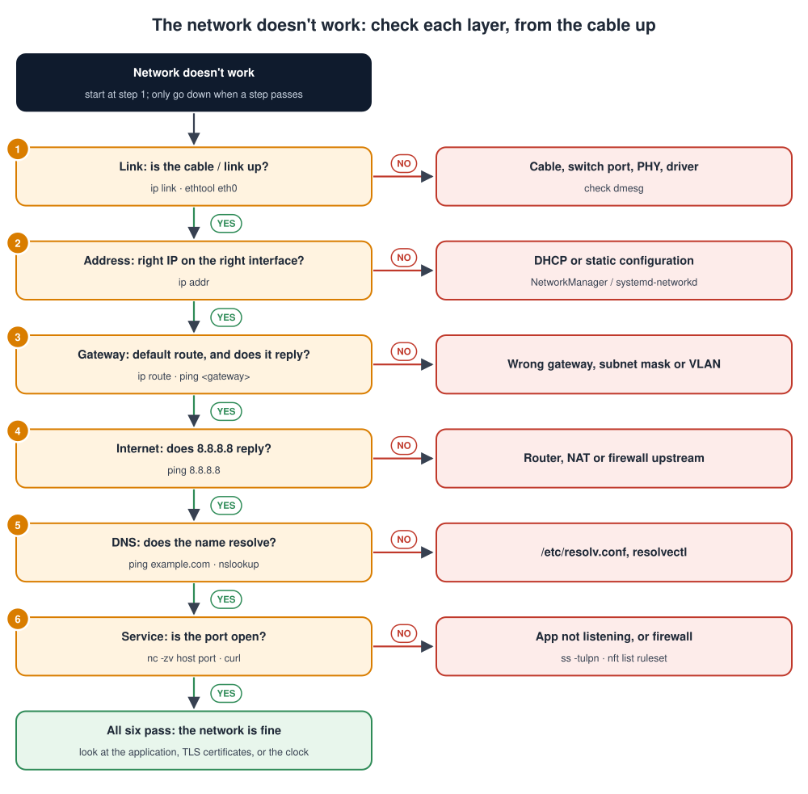

# Linux Fundamentals and Troubleshooting

## Contents

| # | Section | In one line |
| --- | --- | --- |
| – | [Abbreviations](#abbreviations) | Every short form used in these notes, written in full |
| | **Part A: Fundamentals** | |
| 1 | [What is Linux?](#1-what-is-linux) | Kernel, shell, distribution, the block diagram, and how you connect |
| 2 | [The filesystem](#2-the-filesystem) | One tree from `/`; what each directory is for |
| 3 | [Command-line essentials](#3-command-line-essentials) | Navigation, files, help, pipes, redirection, exit codes |
| 4 | [Text tools: finding things fast](#4-text-tools-finding-things-fast) | grep, find, awk, sed and friends |
| 5 | [Users, groups and permissions](#5-users-groups-and-permissions) | rwx, chmod, chown, sudo, device access |
| 6 | [Processes and signals](#6-processes-and-signals) | ps, top, kill, background jobs |
| 7 | [Services and systemd](#7-services-and-systemd) | systemctl, unit files, journalctl |
| 8 | [Networking basics](#8-networking-basics) | ip, ping, ss, DNS, ssh |
| 9 | [Storage and filesystems](#9-storage-and-filesystems) | df, du, mount, fstab, read-only root |
| 10 | [Logs and monitoring](#10-logs-and-monitoring) | dmesg, journalctl, load, memory |
| 11 | [Shell scripting basics](#11-shell-scripting-basics) | A safe script template and a health check |
| | **Part B: Troubleshooting** | |
| 12 | [The troubleshooting method](#12-the-troubleshooting-method) | Six steps and a layer-by-layer check |
| 13 | [Troubleshooting playbooks](#13-troubleshooting-playbooks) | Eleven common problems, step by step |
| 14 | [Command cheat sheet](#14-command-cheat-sheet) | The commands on one page |
| 15 | [Simple code examples](#15-simple-code-examples) | Run a script on a schedule with a systemd timer, and a program that stops cleanly on SIGTERM |
| 16 | [Interview quick answers](#16-interview-quick-answers) | Short answers to say out loud |

---

## Abbreviations

| Short form | Full form | In one line |
| --- | --- | --- |
| A/B | Two slots, A and B | Two copies of the system so one can be updated safely |
| ADB | Android Debug Bridge | Command-line access to Android-based boards |
| API | Application Programming Interface | A set of functions or calls a program exposes |
| BSP | Board Support Package | The board-specific software (see BSP.md) |
| cgroup | Control group | Kernel feature that limits a group of processes' CPU and memory |
| CPU | Central Processing Unit | The processor |
| cron | (from Chronos, Greek for time) | The service that runs scheduled jobs |
| DHCP | Dynamic Host Configuration Protocol | Gives a device its IP address automatically |
| DNS | Domain Name System | Turns names like `example.com` into IP addresses |
| eMMC | embedded MultiMediaCard | Flash storage chip soldered on the board |
| fsck | File System Consistency Check | Checks and repairs a filesystem |
| fstab | File Systems Table | `/etc/fstab`: what to mount at boot |
| GPIO | General-Purpose Input/Output | A pin controlled directly by software |
| GPS | Global Positioning System | Satellite positioning receiver |
| HTTP | Hypertext Transfer Protocol | The web protocol |
| I/O | Input/Output | Reading and writing disks and devices |
| I2C | Inter-Integrated Circuit | 2-wire bus for slow chips |
| inode | Index node | The record that describes one file on a filesystem |
| IP | Internet Protocol | Network addressing and routing |
| NAT | Network Address Translation | A router sharing one public IP among many devices |
| NTP | Network Time Protocol | Sets the clock from a time server |
| OOM | Out Of Memory | The system has no free memory left |
| PC | Personal Computer | A desktop or laptop computer |
| PHY | Physical-layer transceiver | The chip that drives the network cable |
| PID | Process ID | The number that identifies a process |
| POSIX | Portable Operating System Interface | The standard for Unix-like shells and APIs |
| RAM | Random Access Memory | Working memory |
| RSS | Resident Set Size | How much RAM a process really uses |
| RTC | Real-Time Clock | Hardware clock, often with a battery |
| SCP | Secure Copy Protocol | Copying files over SSH |
| SD | Secure Digital | Removable memory card |
| SELinux | Security-Enhanced Linux | A security module that can block access even for root |
| SSH | Secure Shell | Encrypted remote login |
| SysV | UNIX System V | The classic init-script system (`/etc/init.d/`) |
| TCP | Transmission Control Protocol | Reliable network connections |
| TLS | Transport Layer Security | Encryption for network connections |
| udev | Userspace device manager | Creates `/dev` entries and applies rules |
| USB | Universal Serial Bus | Standard plug-and-play connection |
| UUID | Universally Unique Identifier | A unique ID, e.g. for a filesystem |
| VLAN | Virtual Local Area Network | Splits one physical network into several |

---

## Part A: Fundamentals

## 1. What is Linux?

> **Linux** is an operating system made of a **kernel**, which controls the hardware, plus the **user-space programs** (shell, tools, services and your application) that run on top of it.

### Key terms

| Term | Meaning |
| --- | --- |
| **Kernel** | The core that controls the hardware, memory and processes ([Kernal.md](Kernal.md)) |
| **User space** | Everything else: programs, libraries, services |
| **Shell** | The program that reads your commands: `bash` on PCs, often BusyBox `sh` (ash) on small devices |
| **Distribution** | A complete system: Debian, Ubuntu, Fedora, or a custom image built with Yocto or Buildroot |
| **Root** | The administrator account (user ID 0), allowed to do anything |
| **Terminal / console** | Where you type commands: a serial console, an **SSH** (Secure Shell) session, or a desktop terminal |

### The Linux system block diagram


A running Linux system can be understood as six areas. Each area answers one question:

| Area | The question it answers | Key commands | Section |
| --- | --- | --- | --- |
| **Files and directories** | Where is everything? | `ls`, `cd`, `find`, `cat` | [2](#2-the-filesystem), [3](#3-command-line-essentials), [4](#4-text-tools-finding-things-fast) |
| **Users and permissions** | Who is allowed to do what? | `id`, `chmod`, `chown`, `sudo` | [5](#5-users-groups-and-permissions) |
| **Processes** | What is running right now? | `ps`, `top`, `kill` | [6](#6-processes-and-signals) |
| **Services (systemd)** | What starts at boot, and is it healthy? | `systemctl`, `journalctl` | [7](#7-services-and-systemd) |
| **Networking** | Can the device talk to others? | `ip`, `ping`, `ss` | [8](#8-networking-basics) |
| **Storage and logs** | Is there space, and what happened? | `df`, `mount`, `dmesg` | [9](#9-storage-and-filesystems), [10](#10-logs-and-monitoring) |

**Troubleshooting** (Part B) means asking each area in turn: "Is the problem here?"

### How you usually reach an embedded board

| Way in | When | Command |
| --- | --- | --- |
| **Serial console** | Always works, even when networking is broken; shows boot messages | `picocom -b 115200 /dev/ttyUSB0` |
| **SSH** | Normal remote access over the network | `ssh root@192.168.1.20` |
| **Copy files** (**SCP**, Secure Copy) | Deploy a binary or fetch logs | `scp app root@192.168.1.20:/usr/bin/` |
| **ADB** (Android Debug Bridge) / USB gadget serial | Some boards (Android-based, or with a USB gadget configured) | `adb shell` / `/dev/ttyACM0` |

> **Tip:** keep a serial console connected while working on a board. When SSH stops working, it's often the only way to see what happened.

---

## 2. The filesystem


### How the filesystem is organised

1. **Everything hangs off one tree that starts at `/`** (called "root").
   - There are no drive letters.
   - A USB stick or SD card is **mounted** into the tree, for example at `/media/sdcard`.
2. **Programs and libraries** live in `/usr`, `/lib`, `/bin`, `/sbin`, `/opt` and `/boot`. They don't change while the system runs, so on embedded devices they can live on a **read-only** partition.
3. **Configuration** lives in `/etc`: network settings, service settings, which filesystems to mount.
4. **Data that changes** lives here:
   - logs in `/var/log`
   - users' files in `/home` (and `/root` for the administrator)
   - on many embedded products, an application partition such as `/data`
5. **Virtual directories** are not on the disk at all. `/dev`, `/proc`, `/sys`, `/run` and often `/tmp` are created by the kernel or live in RAM.
6. **Mount points** `/mnt` and `/media` are empty directories where other storage is attached.

### "Everything is a file"

Linux uses the same file operations for very different things:

| What | Looks like | Try it |
| --- | --- | --- |
| A normal file | `/etc/hostname` | `cat /etc/hostname` |
| A directory | `/var/log/` | `ls /var/log` |
| A device | `/dev/ttyS0`, `/dev/mmcblk0` | `ls -l /dev/ttyS0` |
| Kernel information | `/proc/cpuinfo`, `/proc/meminfo` | `cat /proc/meminfo` |
| A device setting | `/sys/class/leds/.../brightness` | `echo 1 > /sys/class/leds/status/brightness` |

**File types in `ls -l`** (the first character):

| Char | Type |
| --- | --- |
| `-` | Regular file |
| `d` | Directory |
| `l` | Symbolic link |
| `c` | Character device (serial port, I2C) |
| `b` | Block device (disk, SD card) |
| `s` / `p` | Socket / named pipe |

**Paths:**

- An **absolute** path starts at `/` (`/etc/hosts`).
- A **relative** path starts from where you are (`logs/app.log`).
- `.` is the current directory, `..` the parent, and `~` your home directory.

---

## 3. Command-line essentials

### Moving around and managing files

| Task | Command | Example |
| --- | --- | --- |
| Where am I? | `pwd` (print working directory) | `/home/user` |
| List files (long, hidden, human sizes) | `ls -lah` | |
| Change directory | `cd` | `cd /var/log`, `cd ..`, `cd ~` |
| Make a directory (with parents) | `mkdir -p` | `mkdir -p /data/app/config` |
| Copy / move / rename | `cp`, `mv` | `cp -r src/ backup/` |
| Delete (carefully!) | `rm`, `rm -r` | `rm old.log` |
| Create a link | `ln -s` | `ln -s /data/app/current /opt/app` |
| View a file | `cat`, `less` | `less /var/log/syslog` (`q` to quit, `/` to search) |
| First / last lines | `head`, `tail` | `tail -n 50 app.log` |
| **Follow a growing log** | `tail -f` | `tail -f /var/log/messages` |
| Archive / extract | `tar` (tape archive) | `tar czf logs.tar.gz /var/log` · `tar xzf logs.tar.gz` |

> **`rm` has no undo.** Be extra careful with `rm -rf` and with wildcards.

### Getting help

| Command | Gives you |
| --- | --- |
| `man ls` | The full manual page (may be missing on small embedded images) |
| `ls --help` | A short usage summary |
| `busybox --help` | Which commands a BusyBox system has |
| `type ls` / `which ls` | Where a command comes from |

### Pipes and redirection: joining commands together

| Symbol | Meaning | Example |
| --- | --- | --- |
| `\|` | Send one command's output into the next | `dmesg \| grep -i usb` |
| `>` | Write output to a file (**overwrite**) | `ps > procs.txt` |
| `>>` | **Append** to a file | `date >> boot.log` |
| `2>` | Redirect **errors** | `app 2> errors.txt` |
| `2>&1` | Send errors to the same place as output | `app > all.log 2>&1` |
| `<` | Read input from a file | `sort < names.txt` |
| `&&` / `\|\|` | Run the next command only if the previous one succeeded / failed | `make && ./app` |

### Variables and the environment

```bash
echo $PATH                       # where the shell looks for commands
export APP_MODE=debug            # set a variable for this shell and its children
env | grep APP                   # list environment variables
NAME="sensor1"; echo "$NAME"     # always quote variables
```

### Exit codes: did it work?

Every command returns a number when it finishes. **0 = success**, anything else = a problem.

```bash
./app
echo $?                           # show the last exit code
```

| Code | Usual meaning |
| --- | --- |
| `0` | Success |
| `1` | General error |
| `2` | Wrong usage (bad arguments) |
| `126` | Found, but not executable (permissions) |
| `127` | Command not found (check `PATH` and spelling) |
| `130` | Stopped by Ctrl+C (128 + signal 2) |
| `137` | Killed by SIGKILL (128 + 9), **often the out-of-memory killer** |
| `139` | Segmentation fault (128 + 11): the program crashed |

> **Codes above 128 mean "killed by a signal".** Subtract 128 to get the signal number.

---

## 4. Text tools: finding things fast

| Tool | Does | Example |
| --- | --- | --- |
| `grep` (global regular expression print) | Find lines matching a pattern | `grep -i error /var/log/messages` |
| `grep -r` | Search every file in a directory | `grep -rn "baudrate" /etc` |
| `find` | Find files by name, size, time | `find / -name "*.conf" 2>/dev/null` |
| `wc -l` (word count, lines) | Count lines | `grep -c error app.log` |
| `sort`, `uniq -c` | Sort, then count duplicates | `sort errors.txt \| uniq -c \| sort -rn` |
| `cut` | Pick columns | `cut -d: -f1 /etc/passwd` |
| `awk` (named after its authors Aho, Weinberger, Kernighan) | Pick and process columns | `df -h \| awk '$5+0 > 80 {print $6, $5}'` |
| `sed` (stream editor) | Find and replace | `sed -i 's/9600/115200/' app.conf` |
| `xargs` | Turn output into arguments | `find /tmp -name "*.tmp" \| xargs rm -f` |
| `diff` | Compare two files | `diff old.conf new.conf` |

**Real examples you'll actually use:**

```bash
# The 10 most frequent errors in a log
grep -i error app.log | sort | uniq -c | sort -rn | head

# Everything the kernel said about USB since boot
dmesg | grep -i usb

# Files changed in /etc in the last day
find /etc -mtime -1 -type f

# Which filesystems are more than 80 % full?
df -h | awk 'NR>1 && $5+0 > 80 {print $6, $5}'

# The 5 biggest directories under /var
du -sh /var/* 2>/dev/null | sort -rh | head -5
```

---

## 5. Users, groups and permissions


### How permissions work, step by step

1. `ls -l` shows ten characters, for example `-rwxr-x---`.
2. The **first** character is the file type (`-` = regular file).
3. The next **nine** are three groups of three: permissions for the **owner**, the **group**, and **everyone else** (others).
4. Each group can have:
   - **r** (read)
   - **w** (write)
   - **x** (execute)
   - `-` means "not allowed".
5. Each letter has a value: **r = 4, w = 2, x = 1**. Add them per group: `rwx` = 7, `r-x` = 5, `---` = 0. So `-rwxr-x---` is **750**.
6. On a **directory**, the letters mean something slightly different:
   - `r` lists the names inside
   - `w` creates and deletes files inside
   - `x` lets you enter it

### Users and groups

```bash
whoami                        # your user name
id                            # your user ID, group ID and all your groups
sudo command                  # run one command as root ("superuser do")
sudo -i                       # become root (careful)
sudo usermod -aG dialout $USER   # add yourself to a group (log out and in again!)
```

### Changing permissions and owners

| Command | Does | Example |
| --- | --- | --- |
| `chmod` (change mode, numbers) | Set all permissions at once | `chmod 755 run.sh` |
| `chmod` (letters) | Add or remove one permission | `chmod +x run.sh`, `chmod o-r secret.key` |
| `chown` (change owner) | Change owner and group | `chown app:app /data/app -R` |
| `umask` (user file-creation mask) | Default permissions for new files | `umask 022` → new files are 644 |

### Device access: the embedded classic

Devices in `/dev` have permissions too. A normal user usually can't open a serial port until they join its group:

```bash
ls -l /dev/ttyUSB0
# crw-rw---- 1 root dialout 188, 0 Sep 23 12:00 /dev/ttyUSB0
#                 ^^^^^^^ only root and members of "dialout" may use it
```

| Device | Typical group |
| --- | --- |
| Serial ports (`/dev/tty*`) | `dialout` (named after the old dial-up modems on serial ports) |
| I2C (`/dev/i2c-*`) | `i2c` |
| GPIO (`/dev/gpiochip*`) | `gpio` (on some distributions) |
| Video (`/dev/video*`) | `video` |

**Make permissions (and names) stick with a udev rule.** **udev** is the service that creates `/dev` entries when devices appear.

```bash
# /etc/udev/rules.d/99-gps.rules: the USB GPS always appears as /dev/gps, usable by "dialout"
SUBSYSTEM=="tty", ATTRS{idVendor}=="0403", ATTRS{idProduct}=="6001", SYMLINK+="gps", GROUP="dialout", MODE="0660"
```

```bash
sudo udevadm control --reload && sudo udevadm trigger   # apply without rebooting
```

> **Principle of least privilege:** run applications as their own user with only the groups they need, not as root.

---

## 6. Processes and signals

A **process** is a running program. Each one has a **PID** (Process ID).

### Seeing what runs

| Command | Shows |
| --- | --- |
| `ps aux` | Every process: user, PID, CPU %, memory %, command |
| `ps -ef --forest` | The parent/child tree |
| `top` / `htop` | A live view, sorted by CPU (press `M` to sort by memory) |
| `pgrep -a app` | Find processes by name |
| `pstree` | A tree of processes |
| `ls /proc/<pid>/` | Everything about one process: `status`, `cmdline`, `fd/` (open files) |
| `lsof -p <pid>` | Files and sockets a process has open ("list open files") |

### Signals: messages to processes

| Signal | Number | Meaning | Sent by |
| --- | --- | --- | --- |
| `SIGHUP` (hang up) | 1 | "Reload your configuration" (by convention) | `kill -HUP <pid>` |
| `SIGINT` (interrupt) | 2 | Interrupt | **Ctrl+C** |
| `SIGKILL` | 9 | Stop immediately. **Can't be caught**, no clean-up. | `kill -9 <pid>`, the OOM killer |
| `SIGSEGV` (segmentation violation) | 11 | Invalid memory access (crash) | The kernel |
| `SIGTERM` (terminate) | 15 | "Please stop cleanly" (the **default**) | `kill <pid>`, systemd |
| `SIGSTOP` / `SIGCONT` | 19 / 18 | Pause / resume | **Ctrl+Z** sends SIGTSTP (20), a catchable pause |

> **Always try `kill <pid>` (SIGTERM) first.** Use `kill -9` only if the process ignores it, because SIGKILL gives no chance to save data or release resources.

### Foreground and background

```bash
./long_task &          # start in the background
jobs                   # list background jobs
fg %1                  # bring job 1 to the foreground
Ctrl+Z, then bg        # pause the current job, continue it in the background
nohup ./task &         # keep running after you log out ("no hang up")
nice -n 10 ./task      # start with lower priority (-20 highest ... 19 lowest)
```

---

## 7. Services and systemd

A **service** (daemon) is a program that runs in the background, usually started at boot: SSH, networking, your application. On most modern Linux systems, **systemd** starts and supervises them. It is **PID 1**, the first process.

### systemctl: controlling services

| Command | Does |
| --- | --- |
| `systemctl status app` | Is it running? Recent log lines, PID, memory |
| `systemctl start` / `stop` / `restart app` | Control it now |
| `systemctl enable` / `disable app` | Start (or don't start) it at boot |
| `systemctl enable --now app` | Enable and start in one go |
| `systemctl --failed` | **Every service that failed** (a great first check) |
| `systemctl list-units --type=service` | All services |
| `systemctl daemon-reload` | Re-read unit files after editing them |
| `systemctl reboot` / `poweroff` | Restart / shut down |

### A unit file for your application

A **unit file** tells systemd how to run one service.

```ini
# /etc/systemd/system/sensor-collector.service
[Unit]
Description=Sensor collector
After=network-online.target
Wants=network-online.target

[Service]
ExecStart=/usr/bin/sensor-collector --config /etc/sensor.conf
Restart=on-failure          # restart automatically if it crashes
RestartSec=5
User=sensor                 # don't run as root
Group=dialout               # allowed to use serial ports

[Install]
WantedBy=multi-user.target  # start during normal boot
```

```bash
sudo systemctl daemon-reload
sudo systemctl enable --now sensor-collector
systemctl status sensor-collector
journalctl -u sensor-collector -f        # follow its logs
```

### journalctl: reading the logs

| Command | Shows |
| --- | --- |
| `journalctl -u app` | One service's log |
| `journalctl -f` | Follow new messages live |
| `journalctl -b` | Everything since this boot (`-b -1` = the previous boot) |
| `journalctl -p err -b` | Only errors and worse, this boot |
| `journalctl --since "10 min ago"` | A time window |
| `journalctl -k` | Kernel messages only (like `dmesg`) |
| `journalctl --disk-usage` | How much space the logs use |

> **Small devices without systemd** often use **BusyBox init** or **SysV init** (the classic UNIX System V scripts). Services are scripts in `/etc/init.d/` (`/etc/init.d/S50app start`), and logs go to `/var/log/messages` through syslog.

---

## 8. Networking basics

| Task | Command | What to look for |
| --- | --- | --- |
| Interfaces and link state | `ip link` | `state UP`, `LOWER_UP` = cable/link present |
| **IP** (Internet Protocol) addresses | `ip addr` (`ip a`) | An `inet` address on the right interface |
| Routes | `ip route` | A `default via <gateway>` line |
| Reachability | `ping -c 3 192.168.1.1` | Replies and time |
| **DNS** (Domain Name System: names → IP addresses) | `nslookup example.com` / `resolvectl status` | Does the name resolve? |
| Open ports / listening services | `ss -tulpn` (socket statistics) | Is my app listening on the expected port? |
| Test a web or API endpoint | `curl -v http://server:8080/health` | **HTTP** status, **TLS** (Transport Layer Security) errors |
| Test any **TCP** port | `nc -zv server 1883` | "succeeded" or "refused" |
| Path to a host | `traceroute host` / `tracepath host` | Where packets stop |
| Link speed and duplex | `ethtool eth0` | `Speed: 1000Mb/s`, `Link detected: yes` |
| Watch packets | `tcpdump -i eth0 -n port 1883` | Is traffic really leaving or arriving? |

**Temporary configuration** (lost on reboot, handy for testing):

```bash
ip addr add 192.168.1.20/24 dev eth0
ip link set eth0 up
ip route add default via 192.168.1.1
echo "nameserver 8.8.8.8" > /etc/resolv.conf
```

**Permanent configuration** depends on the system:

- **systemd-networkd** (`/etc/systemd/network/*.network`)
- **NetworkManager** (`nmcli`)
- **ifupdown** (`/etc/network/interfaces`) on Debian and BusyBox systems

**Remote access and copying:**

```bash
ssh user@host                       # log in
ssh -v user@host                    # verbose: shows why a login fails
scp file user@host:/path/           # copy a file
rsync -av dir/ user@host:/path/     # copy a directory efficiently
```

---

## 9. Storage and filesystems

| Task | Command |
| --- | --- |
| List disks and partitions | `lsblk` · `lsblk -f` (with filesystem types) |
| Free space per filesystem | `df -h` ("disk free") |
| **Free inodes** (an inode is the record for one file, so this is the number of files) | `df -i` |
| Size of a directory | `du -sh /var/log` ("disk usage") |
| What is mounted where | `mount` · `findmnt` |
| Mount / unmount | `mount /dev/mmcblk1p1 /mnt` · `umount /mnt` |
| Permanent mounts | `/etc/fstab` (File Systems Table) |
| Filesystem **UUIDs** (Universally Unique Identifiers) | `blkid` |
| Check / repair (unmounted!) | `fsck /dev/mmcblk1p1` (File System Consistency Check) |
| Flush writes to storage | `sync` |
| Write a raw image | `dd if=image.img of=/dev/sdX bs=4M status=progress` (**double-check `of=`!**) |

**A line of `/etc/fstab`:**

```text
# device           mount point  type  options           dump pass
/dev/mmcblk2p3     /data        ext4  defaults,noatime  0    2
```

### Embedded storage habits

| Habit | Why |
| --- | --- |
| **Read-only root filesystem** | Power loss can't corrupt the system; updates replace it as a whole (A/B) |
| **Writable data on its own partition** (`/data`) | Separates app data from the system |
| **`noatime`** mount option (no access-time updates) | Fewer writes: longer flash life |
| **Logs in RAM or size-limited** (`journald` `SystemMaxUse=`) | Flash wears out with constant writes |
| **Call `sync` before cutting power** in tests | Data may still be in RAM caches |

---

## 10. Logs and monitoring

### Where to look

| Source | Contains | Command |
| --- | --- | --- |
| **Kernel log** | Hardware, drivers, crashes, OOM (Out Of Memory) kills | `dmesg -T` · `dmesg -w` · `journalctl -k` |
| **systemd journal** | Services and the system | `journalctl -b`, `journalctl -u app` |
| **`/var/log/`** | Classic text logs (syslog, messages, auth, app logs) | `tail -f /var/log/messages` |
| **Service status** | The last few lines + state | `systemctl status app` |

### Checking the system's health

| Question | Command | What it tells you |
| --- | --- | --- |
| How long up? How busy? | `uptime` | **Load average**: roughly how many tasks were waiting to run over the last 1, 5 and 15 minutes. Compare it with the number of CPU cores (`nproc`). |
| What uses the CPU? | `top`, `htop`, `pidstat 1` | The busiest processes |
| Memory | `free -h` | Look at **available**, not "free". Linux uses spare RAM as cache, which is fine. |
| Memory per process | `ps aux --sort=-rss \| head` | The biggest users (**RSS** = Resident Set Size, the RAM really used) |
| Disk activity | `iostat -x 1`, `iotop` | Is storage the bottleneck? |
| Overall | `vmstat 1` | CPU, memory, swap, I/O every second |
| Temperature | `cat /sys/class/thermal/thermal_zone0/temp` | In millidegrees: 52000 = 52 °C |

---

## 11. Shell scripting basics

A safe template for small automation scripts:

```bash
#!/bin/sh
# check_health.sh: print a short health report for a device
set -eu                                  # stop on errors and on unset variables

echo "== $(hostname) at $(date) =="
echo "Uptime:      $(uptime)"
echo "Memory:      $(free -m | awk '/Mem:/ {print $7 " MB available"}')"
echo "Disk /data:  $(df -h /data | awk 'NR==2 {print $5 " used"}')"

if systemctl is-active --quiet sensor-collector; then
    echo "Service:     running"
else
    echo "Service:     NOT running"
    exit 1                               # non-zero exit = problem, for monitoring tools
fi

TEMP=$(cat /sys/class/thermal/thermal_zone0/temp)
if [ "$TEMP" -gt 80000 ]; then
    echo "WARNING: CPU temperature $((TEMP / 1000)) °C"
fi
```

| Building block | Syntax |
| --- | --- |
| Variable | `NAME=value` (no spaces around `=`), used as `"$NAME"` |
| Command output | `NOW=$(date)` |
| If | `if [ "$A" = "b" ]; then ...; fi` |
| Numbers | `[ "$N" -gt 5 ]`, `$((N + 1))` |
| Loop | `for f in /var/log/*.log; do echo "$f"; done` |
| Function | `log() { echo "$(date) $*"; }` |
| Safety | `set -eu` at the top; quote every variable |

> **Bash vs sh:** on embedded devices `/bin/sh` is often BusyBox **ash**, not bash. Stick to **POSIX** (Portable Operating System Interface) `sh` syntax, as above, so scripts run everywhere.

---

## Part B: Troubleshooting

## 12. The troubleshooting method


### The six steps

1. **Describe** the problem precisely. "The app is broken" is not a description. "The collector stops sending data about 2 hours after boot, since Tuesday's update" is.
2. **Collect** evidence before touching anything: logs, service status, error messages, exit codes.
3. **Locate** the broken layer. Work **from the bottom up**, or jump straight to the layer the evidence points to. The layers are:
   1. hardware and power
   2. kernel and drivers
   3. storage and filesystem
   4. network
   5. the service
   6. the application
4. **Test** one hypothesis at a time with one change, so you know what actually fixed it.
5. **Fix and verify** that the original symptom is really gone, not just that the error message changed.
6. **Prevent** it from happening again: a monitor, a test, a note in the documentation.

**Start almost every investigation with these three commands:**

```bash
dmesg | tail -50              # what did the kernel complain about?
journalctl -b -p err          # which errors were logged since boot?
systemctl --failed            # which services failed?
```

---

## 13. Troubleshooting playbooks

Each playbook follows the same shape: **symptom → check → likely cause → fix**.

### 13.1 A service won't start (or keeps restarting)

```bash
systemctl status app              # state, exit code, last log lines
journalctl -u app -b --no-pager   # the full story since boot
```

| What you see | Likely cause | Fix |
| --- | --- | --- |
| `code=exited, status=203/EXEC` | Binary missing, not executable, or wrong path in `ExecStart` | Check the path; `chmod +x`; use the full path |
| `status=127` in a script | A command inside isn't found | Full paths, or set `PATH` in the unit |
| `Permission denied` | The service's `User=` can't read a file or open a device | Fix ownership, or add the user to the device's group |
| `Address already in use` | Another process has the port | `ss -tulpn \| grep :8080`, stop the other process |
| `status=137` / `Killed` | The out-of-memory killer | See 13.5 |
| Starts, then restarts in a loop | The app crashes or exits right away | Run the `ExecStart` command by hand to see its output |
| Starts before the network is ready | Missing ordering | `After=network-online.target` + `Wants=network-online.target` |

### 13.2 "No space left on device"

```bash
df -h                              # which filesystem is full?
df -i                              # or out of inodes (too many small files)?
du -sh /var/* | sort -rh | head    # what is using the space?
```

| Cause | Fix |
| --- | --- |
| Logs grew forever | `journalctl --vacuum-size=50M`; set `SystemMaxUse=` in `/etc/systemd/journald.conf`; configure logrotate |
| Core dumps, old updates, temp files | Delete them; clean `/tmp` at boot |
| `df` says full but `du` finds nothing | A **deleted file is still open** by a process: `lsof +L1`, then restart that process |
| Out of inodes (`df -i` at 100 %) | Millions of tiny files, often a cache or queue directory. Delete them; fix the app. |

### 13.3 "Read-only file system"

```bash
mount | grep " / "                 # is root mounted ro?
dmesg | grep -iE "ext4|i/o error|remount"
```

| Cause | Fix |
| --- | --- |
| An **intended** read-only root on an embedded product | Write to `/data` or `/tmp` instead, or remount temporarily: `mount -o remount,rw /` |
| The kernel remounted it after **filesystem errors** | Check `dmesg` for EXT4 or I/O errors; run `fsck` from another system; check the storage hardware |
| A worn-out SD card / eMMC (embedded MultiMediaCard) | Replace it; reduce writes (see section 9) |

### 13.4 The system is slow / high CPU

```bash
uptime                             # load average vs nproc
top                                # which process? (press 1 to see each core)
vmstat 1                           # high "wa" = waiting for disk; high "si/so" = swapping
```

| Clue | Likely cause | Next step |
| --- | --- | --- |
| One process at 100 % CPU | A busy loop, polling, a bug | `strace -p <pid>`, `perf top`; check the code |
| High load but low CPU use | Tasks waiting on **I/O** (state `D`) | `iostat -x 1`; slow or failing storage |
| `kworker` / `ksoftirqd` busy | An interrupt or driver storm | `cat /proc/interrupts` twice and compare; check `dmesg` |
| Slow only when hot | **Thermal throttling** | Check the temperature; improve cooling |

### 13.5 Out of memory: processes killed

```bash
dmesg | grep -iE "out of memory|killed process"
free -h
ps aux --sort=-rss | head          # biggest memory users
```

| Clue | Meaning | Fix |
| --- | --- | --- |
| `Out of memory: Killed process 1234 (app)` | The kernel killed a process to survive | Find why memory grew |
| The same process's memory grows over hours | A **memory leak** | Watch `VmRSS` in `/proc/<pid>/status` over time; fix the leak; use `valgrind` in development |
| A limit hit, not the whole system | A cgroup (control group) / systemd `MemoryMax=` limit | Raise the limit or reduce usage |
| Exit code 137 | SIGKILL, usually the OOM killer | As above |

### 13.6 The network doesn't work

Work **up the stack**. Each step only makes sense when the one before it works:



| Step | Check | Command | If it fails, fix |
| --- | --- | --- | --- |
| 1 | **Link:** is the cable / link up? | `ip link` · `ethtool eth0` | Cable, switch port, PHY, driver (check `dmesg`) |
| 2 | **Address:** the right IP on the right interface? | `ip addr` | DHCP (Dynamic Host Configuration Protocol) or static configuration |
| 3 | **Gateway:** a default route, and does it reply? | `ip route` · `ping <gateway>` | Wrong gateway, subnet mask or VLAN |
| 4 | **Internet:** does 8.8.8.8 reply? | `ping 8.8.8.8` | Router, **NAT** (Network Address Translation) or firewall upstream |
| 5 | **DNS:** does the name resolve? | `ping example.com` · `nslookup` | `/etc/resolv.conf`, `resolvectl` |
| 6 | **Service:** is the port open? | `nc -zv host port` · `curl` | App not listening (`ss -tulpn`), or a firewall (`nft list ruleset`) |

If all six pass, the network is fine. Look at the application, the TLS certificates, or the clock.

> **The most common embedded surprise:** the network is fine, but **TLS connections fail because the clock is wrong** (see 13.8).

### 13.7 "Permission denied"

| Where | Check | Fix |
| --- | --- | --- |
| Running a script | `ls -l script.sh`: is `x` set? | `chmod +x script.sh` |
| Opening `/dev/ttyUSB0`, `/dev/i2c-1` | `ls -l /dev/...` and `id`: are you in its group? | `usermod -aG dialout user`, then **log out and in** |
| Writing a file | The owner and mode of the file **and its directory** | `chown` / `chmod`, or write somewhere else |
| As root, still denied | A read-only filesystem, or a security module (**SELinux**, Security-Enhanced Linux, or AppArmor) | `mount`; check the audit log |
| SSH key login refused | `~/.ssh` must be `700`, `authorized_keys` `600`, owned by the user | Fix the modes; read the `ssh -v` output |

### 13.8 The time is wrong

A wrong time breaks **TLS certificates, log timestamps, cron jobs (scheduled tasks) and updates**.

```bash
date                               # system time
timedatectl                        # time zone, NTP sync status
hwclock -r                         # the battery-backed RTC
chronyc tracking                   # if chrony is used for NTP
```

| Cause | Fix |
| --- | --- |
| No **NTP** (Network Time Protocol) sync: no network at boot, or NTP disabled | Enable systemd-timesyncd or chrony; `timedatectl set-ntp true` |
| No **RTC** (Real-Time Clock), or its battery is missing | The clock resets to 1970 at every boot. Sync from NTP before starting TLS services; add an RTC. |
| Wrong time zone | `timedatectl set-timezone Europe/Berlin` (or link `/etc/localtime`) |

### 13.9 A device isn't detected

```bash
dmesg | grep -iE "usb|i2c|spi|error|fail"
lsusb ; i2cdetect -y 1 ; ls /dev
```

| Clue | Likely cause | See |
| --- | --- | --- |
| Nothing in `dmesg` at all | Hardware, power, cable, or no driver | [Embedded_communication_protocols.md](Embedded_communication_protocols.md) |
| `probe ... failed with error -517` | The driver is waiting for a dependency | [Linux_device_drivers.md, section 14](Linux_device_drivers.md#14-debugging-drivers) |
| Found, but no `/dev` node | Driver not built, or a udev rule missing | `lsmod`, the kernel config, udev rules |
| USB `error -71` | A power or signal problem | Another cable or port; a powered hub |

### 13.10 Can't log in over SSH

| Check | Command |
| --- | --- |
| Is the device reachable? | `ping <ip>` |
| Is the SSH server running and listening? | `systemctl status sshd` (or `ssh`, or `dropbear`) · `ss -tlnp \| grep :22` |
| What does the client say? | `ssh -v user@host` |
| Host key changed (device reflashed) | `ssh-keygen -R <ip>` on your PC |
| Root login disabled | `PermitRootLogin` in `/etc/ssh/sshd_config`; use a normal user + sudo |
| Still stuck | Use the **serial console** to look from the inside |

### 13.11 The board doesn't boot at all

This is before Linux user space, so the tools above don't help yet. Use the serial console and see:

- [Bootloader.md, section 7](Bootloader.md#7-errors-a-bootloader-can-get): U-Boot and kernel handoff errors.
- [BSP.md, section 9](BSP.md#9-errors-a-bsp-can-get): bring-up and device tree problems.
- [Kernal.md, section 13](Kernal.md#13-debugging-the-kernel): kernel panics such as "Unable to mount root fs".

---

## 14. Command cheat sheet

| Area | Commands |
| --- | --- |
| **Files** | `ls -lah` · `cd` · `pwd` · `cp -r` · `mv` · `rm` · `mkdir -p` · `ln -s` · `cat` · `less` · `head` · `tail -f` · `tar czf / xzf` |
| **Search** | `grep -rin` · `find / -name` · `which` · `locate` |
| **Text** | `sort` · `uniq -c` · `wc -l` · `cut` · `awk` · `sed -i` · `diff` · `xargs` |
| **Users** | `whoami` · `id` · `sudo` · `usermod -aG` · `passwd` |
| **Permissions** | `chmod 755` · `chmod +x` · `chown user:group` · `umask` |
| **Processes** | `ps aux` · `top` / `htop` · `pgrep` · `kill` · `kill -9` · `nice` · `jobs` / `fg` / `bg` · `lsof` · `strace` |
| **Services** | `systemctl status / start / stop / restart / enable` · `systemctl --failed` · `journalctl -u -b -p -f` |
| **Network** | `ip a` · `ip r` · `ip link` · `ping` · `ss -tulpn` · `curl -v` · `nc -zv` · `ethtool` · `tcpdump` · `ssh` · `scp` |
| **Storage** | `lsblk -f` · `df -h` · `df -i` · `du -sh` · `mount` · `umount` · `blkid` · `fsck` · `sync` |
| **Logs** | `dmesg -T` · `dmesg -w` · `journalctl` · `tail -f /var/log/messages` |
| **Health** | `uptime` · `free -h` · `vmstat 1` · `iostat -x 1` · `nproc` · thermal zone temperature |
| **Hardware** | `lsusb` · `lspci` · `i2cdetect -y 1` · `gpioinfo` · `cat /proc/cpuinfo` · `cat /proc/interrupts` |
| **Time** | `date` · `timedatectl` · `hwclock -r` · `chronyc tracking` |

---

## 15. Simple code examples

Two small examples that add to the scripts and commands above. They run on any Linux system with systemd.

### Example 1: Run the health check every 5 minutes (systemd timer)

This runs the `check_health.sh` script from [section 11](#11-shell-scripting-basics) on a schedule.

`/etc/systemd/system/health.service`: **what** to run.

```ini
[Unit]
Description=Health check

[Service]
Type=oneshot
ExecStart=/usr/local/bin/check_health.sh
```

`/etc/systemd/system/health.timer`: **when** to run it.

```ini
[Unit]
Description=Run the health check every 5 minutes

[Timer]
OnBootSec=2min             # first run 2 minutes after boot
OnUnitActiveSec=5min       # then every 5 minutes

[Install]
WantedBy=timers.target
```

**Switch it on and check it:**

```bash
sudo systemctl daemon-reload
sudo systemctl enable --now health.timer
systemctl list-timers health.timer        # when it ran last, and when it runs next
journalctl -u health.service -n 20        # the script's output
```

**The older way, with cron:** add the line `*/5 * * * * /usr/local/bin/check_health.sh >> /var/log/health.log 2>&1` with `crontab -e`. A timer is better on systemd systems, because its output goes to the journal and it can't run twice at the same time.

### Example 2: A C program that stops cleanly

When `systemctl stop` or `kill` sends **SIGTERM**, a well-behaved program finishes its work and exits, instead of dying halfway through writing a file.

```c
#include <signal.h>
#include <stdio.h>
#include <unistd.h>

static volatile sig_atomic_t running = 1;

static void on_signal(int sig)
{
    (void)sig;
    running = 0;                             /* only set a flag inside a signal handler */
}

int main(void)
{
    struct sigaction sa = { .sa_handler = on_signal };
    sigaction(SIGTERM, &sa, NULL);           /* sent by systemctl stop and by kill */
    sigaction(SIGINT,  &sa, NULL);           /* sent by Ctrl+C */

    while (running) {
        printf("working...\n");
        fflush(stdout);
        sleep(1);
    }

    printf("saving state and exiting cleanly\n");    /* close files, flush data here */
    return 0;
}
```

**Try it:**

```bash
gcc stop.c -o stop
./stop &                  # start it in the background
kill $!                   # sends SIGTERM: it prints "saving state ..." and exits with 0
```

If a program ignores SIGTERM, systemd waits 90 seconds and then sends **SIGKILL**, which can't be caught ([section 6](#6-processes-and-signals)).


---

## 16. Interview quick answers

**Q: How do you start troubleshooting an unknown problem on a Linux device?**

> "Describe the symptom exactly and find out what changed. Collect evidence before changing anything: `dmesg`, `journalctl -b -p err`, `systemctl --failed`, the app's exit code. Then locate the layer, working bottom-up from hardware, kernel and drivers, storage and network to the service and the app, or following the evidence. I test one hypothesis at a time, verify the symptom is really gone, and add a check so it can't come back silently."

**Q: What's the difference between `kill` and `kill -9`?**

> "`kill` sends SIGTERM, a polite request the process can catch to clean up and exit. `kill -9` sends SIGKILL, which can't be caught: the kernel stops the process immediately with no clean-up, so data can be lost. Always try SIGTERM first."

**Q: What does `chmod 750` mean?**

> "Owner: read, write, execute (4+2+1 = 7). Group: read and execute (4+1 = 5). Others: nothing (0). So the owner has full control, the group can run it, and nobody else can touch it."

**Q: A user gets "Permission denied" opening `/dev/ttyUSB0`. Why, and how do you fix it?**

> "The device node is usually owned by root with group `dialout` and mode 660, so only members of that group can open it. Add the user with `usermod -aG dialout user` and have them log in again. For a service, set `SupplementaryGroups=dialout` in the unit file, or write a udev rule for the permissions."

**Q: `df` shows the disk is full, but `du` can't find the files. What's happening?**

> "A process still has a deleted file open, often a log that was removed while the app kept writing. The space isn't freed until the file is closed. `lsof +L1` shows these files, and restarting the process releases the space. Another possibility is running out of inodes, which `df -i` shows."

**Q: How do you create a service that starts at boot and restarts if it crashes?**

> "Write a systemd unit in `/etc/systemd/system/` with `ExecStart`, `Restart=on-failure`, a dedicated `User=`, and `WantedBy=multi-user.target` in the Install section. Then `systemctl daemon-reload` and `systemctl enable --now app`, and check it with `systemctl status` and `journalctl -u app`."

**Q: How do you debug a network problem?**

> "Layer by layer: link state with `ip link` or `ethtool`, the address with `ip addr`, the default route and a ping to the gateway, then a ping to an outside IP, then DNS, then the specific port with `nc` or `curl`, and finally the firewall. Each step only makes sense once the previous one works. On embedded devices I also check the clock, because a wrong date breaks TLS."

**Q: What is the load average?**

> "Roughly the average number of tasks that were running or waiting to run over the last 1, 5 and 15 minutes, including tasks waiting on disk I/O. Compare it with the number of cores: a load of 4 on a 4-core system is fully busy, on a 1-core system it's overloaded. High load with low CPU use usually means I/O waits."

**Q: A process exited with code 137. What happened?**

> "Codes above 128 mean killed by a signal. 137 minus 128 is 9, SIGKILL, which on embedded systems is very often the out-of-memory killer. I'd check `dmesg` for 'Out of memory: Killed process' and then look for a memory leak or a memory limit."

**Q: Why use a read-only root filesystem on an embedded device?**

> "Power can be cut at any time. A read-only root can't be corrupted by an interrupted write, and it makes updates atomic: you replace the whole image, often with A/B slots. Data that must change goes to a separate writable partition like `/data`, or to RAM (`/tmp`, `/run`). It also cuts flash wear."

---

**Related notes:** [Kernal.md](Kernal.md) · [Linux_device_drivers.md](Linux_device_drivers.md) · [BSP.md](BSP.md) · [Bootloader.md](Bootloader.md) · [Embedded_communication_protocols.md](Embedded_communication_protocols.md)
