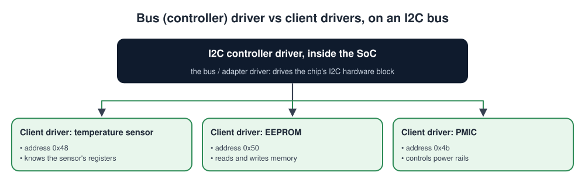
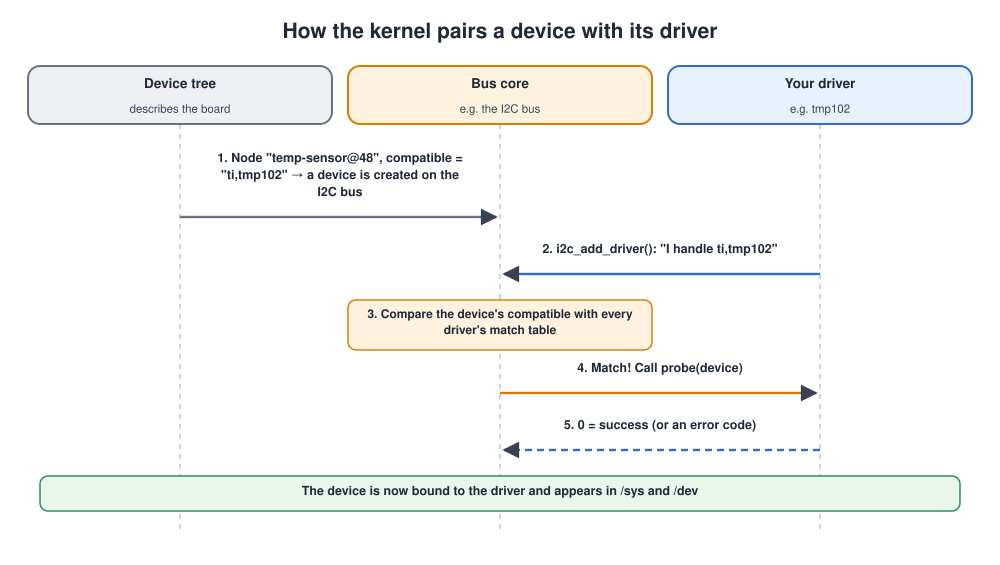
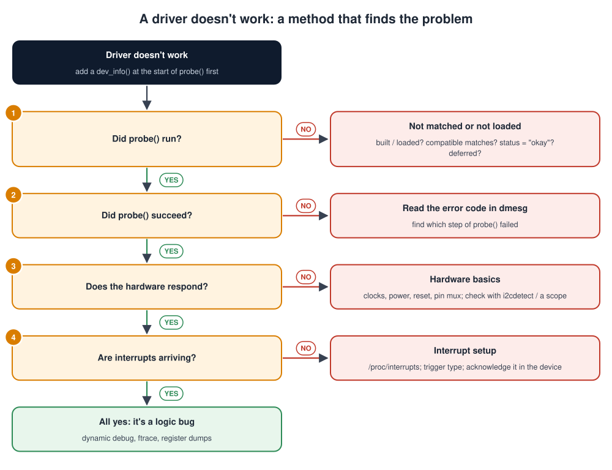

# Linux Device Drivers

## Contents

| # | Section | What you'll learn |
| --- | --- | --- |
| – | [Abbreviations](#abbreviations) | Every short form used in these notes, written in full |
| 1 | [What is a device driver?](#1-what-is-a-device-driver) | Definition, block diagram, an analogy, what a driver is responsible for |
| 2 | [Types of drivers](#2-types-of-drivers) | Character, block and network; bus vs client drivers; kernel vs user space |
| 3 | [The device model](#3-the-device-model-bus-device-driver) | Bus, device, driver, class; matching; sysfs |
| 4 | [The driver lifecycle](#4-the-driver-lifecycle) | Load, match, probe, run, remove, and deferred probe |
| 5 | [Writing a character driver](#5-writing-a-character-driver) | `file_operations`, `copy_to_user`, a complete misc driver, ioctl |
| 6 | [Platform drivers and the device tree](#6-platform-drivers-and-the-device-tree) | Getting registers, IRQs and clocks in `probe()` |
| 7 | [I2C and SPI client drivers](#7-i2c-and-spi-client-drivers) | Talking to chips over a bus; regmap |
| 8 | [Use a framework when one exists](#8-use-a-framework-when-one-exists) | IIO, input, hwmon, GPIO, LED, tty, net and more |
| 9 | [Interrupts, waiting and timing](#9-interrupts-waiting-and-timing) | Threaded IRQs, wait queues, workqueues, delays |
| 10 | [Memory, registers and DMA](#10-memory-registers-and-dma) | `ioremap`, `readl`/`writel`, the DMA API |
| 11 | [Managed resources and error handling](#11-managed-resources-and-error-handling) | `devm_*`, `dev_err_probe()`, error codes |
| 12 | [Power management](#12-power-management) | Runtime PM and system suspend |
| 13 | [User-space drivers](#13-user-space-drivers-when-you-dont-need-a-kernel-driver) | When you don't need a kernel driver |
| 14 | [Debugging drivers](#14-debugging-drivers) | Tools, common errors and a method |
| 15 | [Best-practice checklist](#15-best-practice-checklist) | What a good driver looks like |
| 16 | [Simple code examples](#16-simple-code-examples) | A sysfs setting, and a GPIO button interrupt |
| 17 | [Interview quick answers](#17-interview-quick-answers) | Short answers to say out loud |

---

## Abbreviations

| Short form | Full form | In one line |
| --- | --- | --- |
| ACPI | Advanced Configuration and Power Interface | How PC firmware describes hardware |
| ADC | Analog-to-Digital Converter | Turns a voltage into a number |
| ALSA / ASoC | Advanced Linux Sound Architecture / ALSA System on Chip | Linux audio, and its embedded layer |
| API | Application Programming Interface | A set of functions to call |
| BSP | Board Support Package | The board-specific software (see BSP.md) |
| CAN | Controller Area Network | Field bus used in cars and machines |
| CPU | Central Processing Unit | The processor |
| DAI | Digital Audio Interface | The audio link between SoC and codec (e.g. I2S) |
| DMA | Direct Memory Access | The device copies data to/from RAM itself |
| DRM / KMS | Direct Rendering Manager / Kernel Mode Setting | Linux display and graphics subsystem |
| EEPROM | Electrically Erasable Programmable Read-Only Memory | Small non-volatile memory chip |
| FPGA | Field-Programmable Gate Array | A chip whose logic you can reprogram |
| GNU | GNU's Not Unix | The free-software project behind many Linux tools and the GPL |
| GPIO | General-Purpose Input/Output | A pin controlled directly by software |
| GPL | GNU General Public License | The Linux kernel's licence |
| GPS | Global Positioning System | Satellite positioning receiver |
| GPU | Graphics Processing Unit | The graphics processor |
| hwmon | Hardware monitoring | Subsystem for temperature/voltage/fan sensors |
| I/O | Input/Output | Reading and writing devices |
| I2C | Inter-Integrated Circuit | 2-wire bus for slow chips |
| IC | Integrated Circuit | A chip |
| IIO | Industrial Input/Output | Linux subsystem for sensors and ADCs |
| IMU | Inertial Measurement Unit | Accelerometer + gyroscope |
| ioctl | Input/Output Control | A system call for device-specific commands |
| IOMMU | Input/Output Memory Management Unit | An MMU that protects memory from devices' DMA |
| IP (block) | Intellectual Property block | A ready-made hardware function inside an SoC or FPGA |
| IRQ | Interrupt Request | A hardware interrupt |
| JEDEC | Joint Electron Device Engineering Council | Standards body for memory chips |
| LED | Light-Emitting Diode | An indicator light |
| MMIO | Memory-Mapped Input/Output | Registers accessed like memory |
| MMU | Memory Management Unit | Translates virtual to physical addresses |
| MSB | Most Significant Byte | The high byte of a value |
| MTD | Memory Technology Device | Linux subsystem for raw flash |
| NVMe | Non-Volatile Memory Express | Fast SSD interface over PCIe |
| PCI / PCIe | Peripheral Component Interconnect (Express) | Expansion bus |
| PHY | Physical-layer transceiver | e.g. the Ethernet chip that drives the cable |
| PM | Power Management | Switching hardware off when idle |
| PMIC | Power Management Integrated Circuit | Supplies the board's voltages |
| PWM | Pulse-Width Modulation | A square wave with adjustable duty cycle |
| RAM | Random Access Memory | Working memory |
| RISC | Reduced Instruction Set Computer | The CPU design style of Arm and RISC-V |
| RTC | Real-Time Clock | Keeps the time |
| SD | Secure Digital | Removable memory card |
| SMBus | System Management Bus | A stricter I2C profile |
| SoC | System on Chip | Processor chip with peripherals built in |
| SPI | Serial Peripheral Interface | Fast 4-wire bus |
| SSD | Solid-State Drive | Flash-based disk |
| tty | TeleTYpewriter | Linux name for serial and terminal devices |
| UART | Universal Asynchronous Receiver-Transmitter | Simple serial port |
| UIO | Userspace I/O | Kernel helper for user-space drivers |
| USB | Universal Serial Bus | Standard plug-and-play connection |
| V4L2 | Video4Linux 2 | Linux camera/video subsystem |
| VFIO | Virtual Function I/O | Safe user-space access to PCIe devices |
| VFS | Virtual File System | The kernel's common file layer |

---

## 1. What is a device driver?

> A **device driver** is kernel code that **knows how to operate one kind of hardware**, and **presents it to the rest of the system through a standard interface**, so applications never need to know the hardware's registers.

### The driver block diagram


A driver sits in the middle of a stack. From top to bottom:

1. **User-space applications** reach the device through standard doors:
   - a `/dev` node
   - a sysfs file under `/sys`
   - a network interface
   - **ioctl** (input/output control) commands
2. **Subsystem frameworks** (for example input, IIO, hwmon, tty, netdev) provide those standard doors, so every driver of the same kind looks the same to applications.
3. **Your driver** contains four main parts:
   - `probe()`, which starts the device
   - `remove()`, which stops it
   - the callbacks the framework calls
   - the interrupt handler
4. **The bus core** matches devices with drivers, using the **device tree** (the board's hardware description).
5. **Kernel services** give the driver what it needs:
   - memory
   - **DMA** (Direct Memory Access)
   - clocks and regulators (power supplies)
   - pin control
   - **GPIO** (General-Purpose Input/Output)
   - interrupts
6. **The hardware** is at the bottom.

### An analogy: an interpreter

| Meeting with an interpreter | Linux with a driver |
| --- | --- |
| A visitor who only speaks your language | An application that only knows `read()` and `write()` |
| A local expert who only speaks their own language | A hardware chip that only understands its registers |
| The **interpreter** who speaks both | The **device driver** |
| The interpreter's phrasebook for this expert | The chip's **datasheet**, turned into code |
| The meeting room's booking rules | The kernel **framework** the driver plugs into |

The visitor never learns the expert's language. The application never learns the chip's registers. The interpreter (the driver) does the translation, both ways.

### What a driver is responsible for

| Responsibility | Example for a temperature sensor |
| --- | --- |
| **Detect** the hardware | Read its ID register in `probe()`: is the right chip really there? |
| **Initialise** it | Enable its clock, set the sample rate, release reset |
| **Expose** it | Register with the hwmon or IIO framework, so `/sys/.../temp1_input` appears |
| **Move data** | Read the temperature registers when user space asks |
| **Handle interrupts** | "Data ready" or "over-temperature alarm" |
| **Manage power** | Put the chip to sleep when nobody is reading |
| **Clean up** | Stop the chip and release everything in `remove()` |
| **Report errors** | Clear messages in `dmesg` and correct error codes to user space |

---

## 2. Types of drivers

### By how data flows: character, block, network

| Type | Data model | User space sees | Examples |
| --- | --- | --- | --- |
| **Character** | A stream of bytes, read and written in order | A file in `/dev` (`/dev/ttyS0`, `/dev/i2c-1`) | Serial ports, sensors, GPIO, custom **FPGA** (Field-Programmable Gate Array) blocks |
| **Block** | Fixed-size blocks, random access, cached by the kernel | A block device (`/dev/mmcblk0`, `/dev/sda`), usually mounted | eMMC, SD cards, USB drives, **NVMe** (Non-Volatile Memory Express) SSDs |
| **Network** | Packets | A network interface (`eth0`, `wlan0`) and sockets. **No `/dev` node.** | Ethernet, Wi-Fi, **CAN** (Controller Area Network, `can0`) |

### By position on a bus: bus drivers vs client drivers

On a bus such as **I2C** (Inter-Integrated Circuit) there are two kinds of driver:

- **One controller driver** makes the **SoC**'s (System on Chip's) I2C hardware work. It is usually written by the chip vendor and is already in the kernel.
- **Each chip on the bus has its own client driver,** which knows that chip's registers. The client drivers use the controller driver to send their bytes.



In the example, one I2C bus carries three chips:

- a temperature sensor at address 0x48
- an **EEPROM** (Electrically Erasable Programmable Read-Only Memory) at 0x50
- a **PMIC** (Power Management IC) at 0x4b

Each chip has its own client driver.

| Kind | What it drives | Who usually writes it |
| --- | --- | --- |
| **Controller (bus / adapter) driver** | The bus hardware inside the SoC: I2C controller, **SPI** (Serial Peripheral Interface) controller, USB host | The SoC vendor; usually already in the kernel |
| **Client (device) driver** | A chip on that bus: sensor, EEPROM, display | You, if the chip isn't supported yet |
| **Platform driver** | A block memory-mapped into the SoC (UART, timer, your FPGA **IP** block, i.e. a reusable hardware design) | The SoC vendor, or you for custom IP |

> **Most embedded driver work is writing client drivers** for chips on I2C/SPI, and **platform drivers** for custom memory-mapped IP (for example in an FPGA). The bus controller drivers usually already exist.

### Kernel driver or user-space driver?

| | Kernel driver | User-space driver |
| --- | --- | --- |
| Where it runs | In the kernel (privileged) | In a normal process |
| Interrupts | Handled directly and quickly | Only through a kernel helper (**UIO**, Userspace I/O, or GPIO events) |
| A bug can | Crash the whole system | Crash only that process |
| Development speed | Slower: rebuild, reload, reboot | Fast: normal debugging tools |
| Licence | Must be **GPL** (GNU General Public License) compatible to use most kernel APIs | Any licence |
| Best for | Anything other programs share, fast interrupts, DMA, standard interfaces | Prototypes, simple or slow devices, one application owning the device |

[Section 13](#13-user-space-drivers-when-you-dont-need-a-kernel-driver) covers the user-space options.

---

## 3. The device model: bus, device, driver

Linux describes all hardware with four objects:

| Object | Meaning | Example |
| --- | --- | --- |
| **Bus** | How devices are connected | `platform`, `i2c`, `spi`, `usb`, `pci` |
| **Device** | One piece of hardware on a bus, usually created from the device tree | The TMP102 at I2C address 0x48 |
| **Driver** | Code that can handle a type of device | The `tmp102` driver |
| **Class** | What the device *is*, whatever bus it's on | `hwmon`, `input`, `net`, `leds`, `tty` |

### How matching works



Step by step:

1. **The device tree creates a device.** The node `temp-sensor@48` with `compatible = "ti,tmp102"` becomes a device on the I2C bus.
2. **Your driver registers.** `i2c_add_driver()` announces: "I handle `ti,tmp102`."
3. **The bus core compares** the device's `compatible` string with every driver's match table.
4. **On a match, it calls `probe(device)`.**
5. **`probe()` returns 0 for success** (or an error code).
6. **The device is now bound** to the driver and appears in `/sys` and `/dev`.

**Ways a device can match a driver:**

| Match by | Where it comes from | Used for |
| --- | --- | --- |
| **`of_match_table`** (compatible string; "of" = Open Firmware, where the device tree came from) | The device tree | Almost everything on Arm/RISC-V embedded boards |
| **`id_table`** (device name) | Board code or manual device creation | I2C and SPI devices created without a device tree |
| **USB / PCI IDs** | The hardware reports its vendor and product IDs | Plug-in devices (**PCI** = Peripheral Component Interconnect) |
| **ACPI IDs** (Advanced Configuration and Power Interface) | Firmware tables | x86 systems |

### Seeing the device model in sysfs

```bash
ls /sys/bus/                                  # all bus types
ls /sys/bus/i2c/devices/                      # e.g. 1-0048 = bus 1, address 0x48
ls /sys/bus/i2c/drivers/                      # all I2C drivers loaded
readlink /sys/bus/i2c/devices/1-0048/driver   # which driver is bound to it
cat /sys/bus/i2c/devices/1-0048/modalias      # the ID used for module autoloading
ls /sys/class/hwmon/                          # the same device, seen by class
```

**Binding and unbinding by hand** (useful when testing a driver):

```bash
echo 1-0048 > /sys/bus/i2c/drivers/tmp102/unbind    # detach: remove() runs
echo 1-0048 > /sys/bus/i2c/drivers/tmp102/bind      # attach: probe() runs again
```

---

## 4. The driver lifecycle


### The lifecycle, step by step

1. **Load.** The driver is loaded, as a module or because it is built into the kernel.
2. **Register.** The driver registers with its bus: "I can handle devices with this ID."
3. **Match.** The bus core pairs it with any device that has the same ID.
4. **`probe()`**, the most important function in a driver. It prepares the hardware in a fixed order:
   1. allocate memory for the driver's own state
   2. map the registers
   3. enable the clocks and power
   4. take the GPIOs and release reset
   5. read the chip ID to check that the chip really answers
   6. request the interrupt
   7. register with a framework, so user space can see the device
5. **Running.** The driver answers user-space requests and interrupts.
6. **`remove()`.** The driver unregisters and stops the hardware. Resources taken with `devm_*` functions are released automatically.
7. **Unload.** The module is removed from memory.

**Deferred probe.** If something the driver needs isn't ready yet (a clock, a regulator, or a GPIO controller whose driver hasn't loaded), `probe()` returns `-EPROBE_DEFER` and the kernel **tries again later**. This is normal during boot.

### The smallest possible driver: a module

The smallest driver is a plain kernel module with an init and an exit function. Its code, and the commands to build, load and unload it, are in [Kernal.md, section 9](Kernal.md#9-device-drivers-and-kernel-modules). Real drivers rarely use `module_init()` directly. They use a **bus helper** that registers the driver and generates the init and exit code:

| Helper macro | For |
| --- | --- |
| `module_platform_driver(drv)` | Platform drivers (memory-mapped blocks) |
| `module_i2c_driver(drv)` | I2C client drivers |
| `module_spi_driver(drv)` | SPI client drivers |
| `module_usb_driver(drv)` | USB drivers |
| `module_misc_device(dev)` | Simple character devices |

---

## 5. Writing a character driver


### One read, step by step

1. The app calls `read()` on `/dev/mysensor`.
2. The **VFS** (Virtual File System) sees that this file is a character device with a **major:minor number** (here 240:0), and finds the driver that owns it.
3. The driver's **`file_operations`** table says which function handles `read`: `my_read()`.
4. There's no new sample yet, so `my_read()` **sleeps on a wait queue** instead of spinning. The CPU is free for other work.
5. The sensor raises an **interrupt** (**IRQ**, Interrupt Request). The handler reads the sample into a kernel buffer and **wakes up** the wait queue.
6. `my_read()` wakes and **copies the data to user space** with `copy_to_user()`.
7. `read()` returns 8 bytes to the app.

### The pieces of a character driver

| Piece | What it is |
| --- | --- |
| **Major:minor number** | Identifies the driver (major) and the individual device (minor). `ls -l /dev/ttyS0` shows e.g. `4, 64`. |
| **`struct file_operations`** | The table of functions called for `open`, `read`, `write`, `unlocked_ioctl`, `poll`, `mmap`, `release` |
| **`struct cdev`** | Connects a range of device numbers to your `file_operations` |
| **Device node** | The file in `/dev`, created automatically by devtmpfs/udev when you call `device_create()` or register a misc device |
| **`copy_to_user()` / `copy_from_user()`** | The **only** safe way to move data between kernel and user memory |

> **Why `copy_to_user()`?** A user pointer may be invalid, point into kernel memory, or refer to a page that isn't loaded yet. `copy_to_user()` checks all of that and returns an error instead of crashing the kernel. **Never dereference a `__user` pointer directly.**

### A complete, working misc driver

A **misc device** is the simplest way to create a character device. The kernel picks a minor number and creates `/dev/<name>` for you.

```c
// hello_chardev.c: /dev/hello stores the last thing written to it
#include <linux/module.h>
#include <linux/miscdevice.h>
#include <linux/fs.h>
#include <linux/uaccess.h>
#include <linux/mutex.h>

#define BUF_SIZE 64

static char buf[BUF_SIZE];
static size_t buf_len;
static DEFINE_MUTEX(buf_lock);               /* two processes may call us at once */

static ssize_t hello_read(struct file *file, char __user *ubuf,
                          size_t count, loff_t *ppos)
{
    ssize_t ret;

    mutex_lock(&buf_lock);
    if (*ppos >= buf_len) {                  /* nothing left: end of file */
        ret = 0;
        goto out;
    }
    count = min(count, buf_len - (size_t)*ppos);
    if (copy_to_user(ubuf, buf + *ppos, count)) {
        ret = -EFAULT;                       /* bad user pointer */
        goto out;
    }
    *ppos += count;
    ret = count;
out:
    mutex_unlock(&buf_lock);
    return ret;
}

static ssize_t hello_write(struct file *file, const char __user *ubuf,
                           size_t count, loff_t *ppos)
{
    size_t n = min(count, (size_t)BUF_SIZE);

    mutex_lock(&buf_lock);
    if (copy_from_user(buf, ubuf, n)) {
        mutex_unlock(&buf_lock);
        return -EFAULT;
    }
    buf_len = n;
    mutex_unlock(&buf_lock);
    return n;                                /* bytes accepted */
}

static const struct file_operations hello_fops = {
    .owner = THIS_MODULE,
    .read  = hello_read,
    .write = hello_write,
};

static struct miscdevice hello_dev = {
    .minor = MISC_DYNAMIC_MINOR,             /* let the kernel choose */
    .name  = "hello",                        /* creates /dev/hello */
    .fops  = &hello_fops,
    .mode  = 0666,
};

module_misc_device(hello_dev);
MODULE_LICENSE("GPL");
MODULE_DESCRIPTION("Minimal misc character driver");
```

Trying it:

```bash
sudo insmod hello_chardev.ko
echo "embedded" > /dev/hello
cat /dev/hello                # → embedded
ls -l /dev/hello              # crw-rw-rw- 1 root root 10, 123 ... /dev/hello  (10 = misc major)
```

### Commands beyond read and write: ioctl

`ioctl` carries **control commands** that don't fit `read`/`write`, like "set the sample rate" or "reset the device". Commands are defined with macros that encode the direction and argument size:

```c
/* shared header, used by the driver AND the application */
#define MYSENSOR_MAGIC        'M'
#define MYSENSOR_SET_RATE     _IOW(MYSENSOR_MAGIC, 1, __u32)   /* app → driver */
#define MYSENSOR_GET_RATE     _IOR(MYSENSOR_MAGIC, 2, __u32)   /* driver → app */

static long my_ioctl(struct file *f, unsigned int cmd, unsigned long arg)
{
    u32 rate;

    switch (cmd) {
    case MYSENSOR_SET_RATE:
        if (copy_from_user(&rate, (void __user *)arg, sizeof(rate)))
            return -EFAULT;
        if (rate == 0 || rate > 1000)
            return -EINVAL;                  /* always validate user input */
        /* ... program the hardware ... */
        return 0;
    default:
        return -ENOTTY;                      /* "not a command I know" */
    }
}
/* in file_operations: .unlocked_ioctl = my_ioctl */
```

> **Before inventing ioctls, check for a framework.** Sensors should use IIO, buttons input, LEDs the LED class. A custom ioctl interface is for devices no framework covers (custom FPGA blocks, for example).

---

## 6. Platform drivers and the device tree

A **platform device** is a hardware block **memory-mapped** into the SoC's address space: its registers appear at a fixed physical address. Examples are on-chip UARTs, timers, and custom IP in an FPGA. It has no discoverable bus, so the **device tree describes it**.

### The device tree node

```dts
sensor@30a00000 {
    compatible = "acme,sensor";              /* which driver */
    reg = <0x30a00000 0x1000>;               /* register block: base address, size */
    interrupts = <GIC_SPI 45 IRQ_TYPE_LEVEL_HIGH>;
    clocks = <&clk 42>;                      /* the clock that feeds it */
    acme,sample-rate = <200>;                /* a custom property */
};
```

### The driver: everything `probe()` needs

```c
#include <linux/module.h>
#include <linux/platform_device.h>
#include <linux/of.h>
#include <linux/io.h>
#include <linux/clk.h>
#include <linux/interrupt.h>
#include <linux/property.h>

#define SENSOR_ID       0x00                 /* register offsets from the datasheet */
#define SENSOR_CTRL     0x04
#define SENSOR_CTRL_EN  BIT(0)

struct sensor {
    void __iomem *base;                      /* mapped registers */
    struct clk   *clk;
    u32           rate;
};

static irqreturn_t sensor_irq_thread(int irq, void *data)
{
    struct sensor *s = data;
    /* read the new sample from s->base, wake readers, ... */
    return IRQ_HANDLED;
}

static int sensor_probe(struct platform_device *pdev)
{
    struct device *dev = &pdev->dev;
    struct sensor *s;
    int irq, ret;

    s = devm_kzalloc(dev, sizeof(*s), GFP_KERNEL);          /* 1. driver state */
    if (!s)
        return -ENOMEM;

    s->base = devm_platform_ioremap_resource(pdev, 0);      /* 2. map "reg" */
    if (IS_ERR(s->base))
        return PTR_ERR(s->base);

    s->clk = devm_clk_get_enabled(dev, NULL);               /* 3. clock on */
    if (IS_ERR(s->clk))
        return dev_err_probe(dev, PTR_ERR(s->clk), "no clock\n");

    if (device_property_read_u32(dev, "acme,sample-rate", &s->rate))
        s->rate = 100;                                      /* default if missing */

    irq = platform_get_irq(pdev, 0);                        /* 4. interrupt */
    if (irq < 0)
        return irq;
    ret = devm_request_threaded_irq(dev, irq, NULL, sensor_irq_thread,
                                    IRQF_ONESHOT, dev_name(dev), s);
    if (ret)
        return dev_err_probe(dev, ret, "cannot request IRQ %d\n", irq);

    writel(SENSOR_CTRL_EN, s->base + SENSOR_CTRL);          /* 5. start it */
    platform_set_drvdata(pdev, s);
    dev_info(dev, "ready, id=0x%08x, rate=%u Hz\n",
             readl(s->base + SENSOR_ID), s->rate);
    return 0;
}

static const struct of_device_id sensor_of_match[] = {
    { .compatible = "acme,sensor" },
    { }
};
MODULE_DEVICE_TABLE(of, sensor_of_match);   /* lets udev load the module automatically */

static struct platform_driver sensor_driver = {
    .probe  = sensor_probe,
    .driver = {
        .name           = "acme-sensor",
        .of_match_table = sensor_of_match,
    },
};
module_platform_driver(sensor_driver);
MODULE_LICENSE("GPL");
```

**What each device tree property becomes in the driver:**

| Device tree | Driver call |
| --- | --- |
| `compatible` | `of_match_table` → `probe()` is called |
| `reg` | `devm_platform_ioremap_resource()` → `void __iomem *` |
| `interrupts` | `platform_get_irq()` → an IRQ number |
| `clocks` | `devm_clk_get_enabled()` |
| `*-supply` | `devm_regulator_get()` + `regulator_enable()` |
| `*-gpios` | `devm_gpiod_get()` |
| `pinctrl-0` | Applied automatically before `probe()` |
| Custom `vendor,property` | `device_property_read_u32()` / `_string()` / `_bool()` |

---

## 7. I2C and SPI client drivers

These drivers don't map registers. They talk to their chip **over a bus**, with functions that **may sleep**. So they can't be called from a hard interrupt handler; use a threaded IRQ.

### An I2C client driver

Reading the temperature register of a TMP102-style sensor (the same example as in [Embedded_communication_protocols.md, section 3](Embedded_communication_protocols.md#3-i2c)):

```c
#include <linux/module.h>
#include <linux/i2c.h>
#include <linux/of.h>

#define TMP_REG_TEMP  0x00

static int tmp_probe(struct i2c_client *client)
{
    int raw = i2c_smbus_read_word_swapped(client, TMP_REG_TEMP);  /* MSB first on the wire */

    if (raw < 0)
        return dev_err_probe(&client->dev, raw, "chip not responding\n");

    /* 12-bit value in the top bits, 0.0625 °C per step */
    dev_info(&client->dev, "temperature: %d m°C\n", ((s16)raw >> 4) * 625 / 10);
    return 0;
}

static const struct of_device_id tmp_of_match[] = {
    { .compatible = "acme,tmp" },
    { }
};
MODULE_DEVICE_TABLE(of, tmp_of_match);

static struct i2c_driver tmp_driver = {
    .driver = {
        .name           = "acme-tmp",
        .of_match_table = tmp_of_match,
    },
    .probe = tmp_probe,
};
module_i2c_driver(tmp_driver);
MODULE_LICENSE("GPL");
```

The `i2c_smbus_*` functions follow **SMBus** (System Management Bus), a stricter profile of I2C.

| Common I2C calls | Does |
| --- | --- |
| `i2c_smbus_read_byte_data(client, reg)` | Read one 8-bit register |
| `i2c_smbus_write_byte_data(client, reg, val)` | Write one 8-bit register |
| `i2c_smbus_read_word_swapped(client, reg)` | Read a 16-bit register sent **MSB** (Most Significant Byte) first |
| `i2c_transfer(adap, msgs, n)` | Any sequence of raw messages, with repeated starts |

### An SPI client driver, in brief

This reads a flash chip's **JEDEC** (Joint Electron Device Engineering Council) ID, the `0x9F` command from the SPI picture in the protocols notes:

```c
static int flashid_probe(struct spi_device *spi)
{
    u8 cmd = 0x9F, id[3];
    int ret = spi_write_then_read(spi, &cmd, 1, id, sizeof(id));

    if (ret)
        return dev_err_probe(&spi->dev, ret, "read ID failed\n");
    dev_info(&spi->dev, "JEDEC ID %02x %02x %02x\n", id[0], id[1], id[2]);
    return 0;
}
/* struct spi_driver + of_match_table + module_spi_driver(), as for I2C */
```

The SPI mode and maximum speed come from the device tree (`spi-max-frequency`, `spi-cpol`, `spi-cpha`).

### regmap: one register API for any bus

Most sensor and PMIC drivers use **regmap** instead of raw bus calls:

1. You describe the register layout once.
2. You then call `regmap_read()`, `regmap_write()` and `regmap_update_bits()` the same way over I2C, SPI or **MMIO** (Memory-Mapped I/O).
3. You also get caching, locking and a debugfs register dump for free.

```c
static const struct regmap_config tmp_regmap_cfg = {
    .reg_bits = 8,
    .val_bits = 16,
};
/* in probe():  map = devm_regmap_init_i2c(client, &tmp_regmap_cfg);
 *              regmap_read(map, TMP_REG_TEMP, &val);                */
```

---

## 8. Use a framework when one exists

Don't write a raw character driver for a device the kernel already has a framework for. The framework gives users a **standard interface**, so existing tools and libraries just work.

| Device kind | Framework | You implement | User space sees |
| --- | --- | --- | --- |
| Sensors: **ADC** (Analog-to-Digital Converter), **IMU** (Inertial Measurement Unit), light, pressure | **IIO** (Industrial I/O) | Channel descriptions, `read_raw()` | `/sys/bus/iio/devices/iio:deviceN/in_*_raw`, buffered streaming |
| Temperature, voltage, fan monitors | **hwmon** (hardware monitoring) | `read()` per channel | `/sys/class/hwmon/hwmonN/temp1_input` |
| Buttons, keys, touchscreens | **input** | Report events (`input_report_key()`) | `/dev/input/eventN` |
| GPIO expanders | **gpiolib** (`gpio_chip`) | `get`, `set`, `direction_*` | `/dev/gpiochipN` |
| LEDs | **LED class** | `brightness_set()` | `/sys/class/leds/<name>/brightness`, triggers |
| **PWM** (Pulse-Width Modulation) controllers | **PWM** | `apply()` | `/sys/class/pwm/` |
| **RTCs** (Real-Time Clocks) | **RTC** | `read_time()`, `set_time()` | `/dev/rtc0`, `hwclock` |
| Watchdogs | **watchdog** | `start()`, `ping()` | `/dev/watchdog` |
| Serial ports | **serial core / tty** | `uart_ops` | `/dev/ttyXXX` |
| Network interfaces | **netdev** | `net_device_ops` (open, `start_xmit`) | `eth0`, sockets |
| Storage | **block (blk-mq)** / **MTD** (Memory Technology Device) | Queue and request handling | `/dev/mmcblk*`, `/dev/mtd*` |
| Audio | **ALSA / ASoC** (Advanced Linux Sound Architecture / ALSA System on Chip) | Codec and **DAI** (Digital Audio Interface) drivers | `aplay`, `arecord` |
| Cameras, video | **V4L2** (Video4Linux 2) | Device and buffer ops | `/dev/videoN` |
| Displays, GPUs | **DRM / KMS** (Direct Rendering Manager / Kernel Mode Setting) | Display pipeline ops | `/dev/dri/card0` |
| Power supplies | **regulator** | Regulator ops | Used by other drivers |

---

## 9. Interrupts, waiting and timing

### Requesting an interrupt

```c
/* Fast, memory-mapped device: split handler */
ret = devm_request_threaded_irq(dev, irq,
                                my_hardirq,      /* top half: quick, can't sleep */
                                my_thread_fn,    /* bottom half: may sleep */
                                IRQF_ONESHOT, "mydev", priv);

/* Device behind I2C/SPI: everything in the thread (the bus calls sleep) */
ret = devm_request_threaded_irq(dev, irq, NULL, my_thread_fn,
                                IRQF_ONESHOT, "mydev", priv);
```

| Handler returns | Meaning |
| --- | --- |
| `IRQ_HANDLED` | It was our interrupt and we handled it |
| `IRQ_NONE` | Not ours (important on shared IRQ lines) |
| `IRQ_WAKE_THREAD` | Top half done; run the threaded handler |

See [Kernal.md, section 8](Kernal.md#8-interrupts-and-deferred-work) for top halves, bottom halves and workqueues.

### Waiting for the hardware

| Tool | Use it when | Key calls |
| --- | --- | --- |
| **Wait queue** | A reader waits for a condition (new data) | `wait_event_interruptible(wq, cond)`, `wake_up(&wq)` |
| **Completion** | Wait for one event to finish (a transfer, a reset) | `wait_for_completion_timeout()`, `complete()` |
| **Workqueue** | Do something later, in a context that can sleep | `INIT_WORK()`, `schedule_work()` |
| **Delayed work** | Do something after a delay, e.g. polling | `schedule_delayed_work(&dw, msecs_to_jiffies(100))` |
| **Timer / hrtimer** (high-resolution timer) | Run a short callback at a set time (atomic context) | `timer_setup()`, `mod_timer()`, `hrtimer_start()` |

> **Always use a timeout** when waiting on hardware (`wait_event_interruptible_timeout`, `wait_for_completion_timeout`). Hardware that never answers must not hang a process forever.

### Delays: which function?

| Delay needed | Function | Context |
| --- | --- | --- |
| Less than about 10 µs | `udelay()` / `ndelay()` | Anywhere (busy-waits) |
| 10 µs to 20 ms | `usleep_range(min, max)` | Process context only (sleeps) |
| More than 10-20 ms | `msleep()` | Process context only (sleeps) |
| Not sure | `fsleep(us)` | Picks the right one; process context |

---

## 10. Memory, registers and DMA

### Register access (memory-mapped I/O)

```c
void __iomem *base = devm_platform_ioremap_resource(pdev, 0);

u32 status = readl(base + REG_STATUS);         /* 32-bit read  */
writel(CTRL_START, base + REG_CTRL);           /* 32-bit write */
```

| Rule | Why |
| --- | --- |
| Always go through `ioremap` | Physical register addresses aren't directly usable in the kernel's virtual address space |
| Use `readl()` / `writel()`, not plain pointers | They add the right memory barriers and stop the compiler reordering or merging accesses |
| `readl_relaxed()` / `writel_relaxed()` | Faster, without barriers. Only when ordering with DMA doesn't matter. |
| `readl_poll_timeout()` | Poll a status bit **with a timeout**, instead of an endless `while` loop |

### DMA: letting the device copy data itself

For high-throughput devices (Ethernet, audio, cameras, SPI flash) the CPU shouldn't copy every byte. The device reads or writes RAM directly with **DMA** (Direct Memory Access). The driver must use the **DMA API**, which handles address translation and **CPU cache coherency**.

| Mapping type | Lifetime | API | Use for |
| --- | --- | --- | --- |
| **Coherent** | Long-lived; the CPU and the device both see changes | `dma_alloc_coherent()` | Descriptor rings, control structures |
| **Streaming** | One transfer | `dma_map_single()` → transfer → `dma_unmap_single()` | Data buffers |

```c
dma_set_mask_and_coherent(dev, DMA_BIT_MASK(32));       /* device can address 32 bits */

dma_addr_t handle = dma_map_single(dev, buf, len, DMA_TO_DEVICE);
if (dma_mapping_error(dev, handle))
    return -ENOMEM;
/* ... give 'handle' (a bus address) to the hardware, start the transfer, wait ... */
dma_unmap_single(dev, handle, len, DMA_TO_DEVICE);
```

> **Classic bug:** the CPU writes a buffer, the data is still sitting in the **cache**, and the device reads stale RAM through DMA. `dma_map_single()` flushes the cache for you. Skipping the DMA API causes random, hard-to-reproduce corruption.

For SoCs with a shared DMA controller, peripheral drivers use the **dmaengine** API (`dma_request_chan()` and friends) instead of programming the DMA controller themselves.

---

## 11. Managed resources and error handling

### The problem `devm_*` solves

`probe()` acquires many resources in order. If step 5 fails, steps 1-4 must be undone in reverse. Written by hand, that's a ladder of `goto` labels, and a common source of leaks and crashes:

```c
/* The old way: manual unwinding */
ret = clk_prepare_enable(clk);   if (ret) goto err_free;
ret = request_irq(...);          if (ret) goto err_clk;
ret = register_thing(...);       if (ret) goto err_irq;
return 0;
err_irq:  free_irq(...);
err_clk:  clk_disable_unprepare(clk);
err_free: kfree(priv);
return ret;
```

**Managed (`devm_*`, "device-managed") resources** are tied to the device. They're released **automatically, in reverse order**, when `probe()` fails or the driver is removed. Most modern drivers have little or no cleanup code at all.

| Manual | Managed |
| --- | --- |
| `kzalloc` / `kfree` | `devm_kzalloc` |
| `ioremap` / `iounmap` | `devm_platform_ioremap_resource` |
| `request_irq` / `free_irq` | `devm_request_threaded_irq` |
| `clk_get` + enable / disable + put | `devm_clk_get_enabled` |
| `gpiod_get` / `gpiod_put` | `devm_gpiod_get` |
| `regulator_get` / `regulator_put` | `devm_regulator_get` |

### `dev_err_probe()`: the right way to fail in `probe()`

```c
return dev_err_probe(dev, ret, "failed to get reset GPIO\n");
```

- It prints the error with the device name, **unless** it's `-EPROBE_DEFER`, which isn't really an error.
- It records the deferral reason in `/sys/kernel/debug/devices_deferred`.
- It returns `ret`, so it fits on one line.

### Error codes you'll return and see

| Code | Name | Typical meaning in a driver |
| --- | --- | --- |
| `-ENOMEM` (-12) | Out of memory | An allocation failed |
| `-ENODEV` (-19) | No such device | The chip didn't answer, or has the wrong ID |
| `-EINVAL` (-22) | Invalid argument | A bad device tree property or bad user input |
| `-EBUSY` (-16) | Busy | Resource already taken (IRQ, GPIO, registers) |
| `-EIO` (-5) | I/O error | A bus transfer failed |
| `-ETIMEDOUT` (-110) | Timed out | The hardware never became ready |
| `-EFAULT` (-14) | Bad address | `copy_to_user` / `copy_from_user` failed |
| `-ENOTTY` (-25) | Wrong ioctl | Unknown ioctl command |
| `-EPROBE_DEFER` (-517) | Try again later | A dependency isn't ready yet |

---

## 12. Power management

Battery-powered IoT devices depend on drivers switching hardware off when it isn't needed. **PM** stands for Power Management.

| Kind | When it happens | Driver provides |
| --- | --- | --- |
| **Runtime PM** | While the system runs: an idle device is powered down | `runtime_suspend()` / `runtime_resume()` callbacks |
| **System sleep** | The whole system suspends (`echo mem > /sys/power/state`) | `suspend()` / `resume()` callbacks |

```c
/* In probe(): enable runtime PM with auto-suspend after 1 s idle */
pm_runtime_set_autosuspend_delay(dev, 1000);
pm_runtime_use_autosuspend(dev);
devm_pm_runtime_enable(dev);

/* Around each hardware access */
ret = pm_runtime_resume_and_get(dev);     /* power up if needed */
if (ret)
    return ret;
/* ... use the hardware ... */
pm_runtime_mark_last_busy(dev);
pm_runtime_put_autosuspend(dev);          /* allow power-down later */
```

In the runtime-suspend callback, the driver turns off the device's clock and regulator. In resume, it turns them back on and restores any registers that were lost.

---

## 13. User-space drivers: when you don't need a kernel driver

| Option | Gives user space | Good for |
| --- | --- | --- |
| **`i2c-dev`** (`/dev/i2c-N`) | Raw I2C transfers | Prototyping, simple sensors read by one app |
| **`spidev`** (`/dev/spidevB.C`) | Raw SPI transfers | Same, for SPI |
| **libgpiod** (`/dev/gpiochipN`) | GPIO lines and edge events | Buttons, relays, enable pins |
| **UIO** (Userspace I/O) | `mmap` of registers + interrupt notification through `read()` | Simple memory-mapped FPGA blocks |
| **VFIO** (Virtual Function I/O) | Safe device access with **IOMMU** (I/O Memory Management Unit) protection | High-performance **PCIe** devices, virtualisation |
| **serial `/dev/tty*`** | A UART, with the protocol in user space | Modbus, GPS, modems |

> With `i2c-dev`, the `I2C_SLAVE` call fails with `EBUSY` if a kernel driver already owns that address. Unbind the driver first, or read the value through the driver's own files instead.

**Choose a kernel driver when:** several programs must share the device, interrupts must be handled fast, you need DMA, or a standard framework exists so existing tools work.

**Choose user space when:** one application owns the device, timing is relaxed, and you want fast development and safer crashes.

---

## 14. Debugging drivers

### The toolbox

| Tool | Use |
| --- | --- |
| `dmesg -w` | Watch the kernel log live while loading or using the driver |
| `dev_info()`, `dev_warn()`, `dev_err()` | Log messages with the device name attached |
| `dev_dbg()` + dynamic debug | Debug messages switched on at run time: `echo 'module mydrv +p' > /sys/kernel/debug/dynamic_debug/control` |
| `/sys/kernel/debug/devices_deferred` | Which devices are waiting, and why |
| `/sys/kernel/debug/regmap/<dev>/registers` | Dump a regmap device's registers |
| `/proc/interrupts` | Is my IRQ firing, and on which CPU? |
| `/sys/kernel/debug/gpio`, `/sys/kernel/debug/pinctrl/` | GPIO and pin mux state |
| `/sys/kernel/debug/clk/clk_summary` | Which clocks are on, at what rate |
| ftrace function tracer | Trace your driver's functions and their timing |
| `i2cdetect`, `i2cget` / `spidev_test` | Check the bus and the chip outside your driver |
| Oscilloscope / logic analyser | Is the signal actually on the wire? |

### Common driver errors

| Symptom / message | Likely cause | Fix |
| --- | --- | --- |
| **`probe()` never runs, no error** | Driver not built or loaded; `compatible` mismatch; node `status = "disabled"` | Check `lsmod` and the config option, and compare the strings character by character |
| **`probe of ... failed with error -517`** / stays deferred | A clock, regulator, GPIO or **PHY** (physical-layer chip) provider never appeared | `cat /sys/kernel/debug/devices_deferred`; fix the provider's node or driver |
| **`failed with error -22`** | A missing or wrong device tree property | Check against the binding in `Documentation/devicetree/bindings/` |
| **`genirq: Flags mismatch`** / **`request_irq` failed -16** | IRQ already claimed, or shared with different flags | Use `IRQF_SHARED` consistently, or fix the IRQ number |
| **`Unable to handle kernel paging request at virtual address ...`** | Accessing registers that aren't mapped, or a freed pointer | Map with `ioremap`; check `reg` in the device tree; check for use-after-free in `remove()` |
| **`BUG: sleeping function called from invalid context`** | An I2C/SPI call, `msleep()` or `mutex_lock()` in a hard IRQ handler or under a spinlock | Move the work to a threaded IRQ or workqueue; use a mutex, not a spinlock |
| **Interrupt storm** / `irq N: nobody cared` | The handler doesn't clear the device's interrupt, or returns `IRQ_NONE` wrongly | Acknowledge the interrupt in the device; check the trigger type (level vs edge) |
| **Works once, fails after unload/reload** | Resources not released in `remove()`, or the hardware left running | Use `devm_*`; stop the hardware in `remove()` |
| **Random data corruption with DMA** | Cache not maintained, or buffer freed during a transfer | Use the DMA API; unmap only after completion |
| **Reads return stale or garbage values** | Wrong register width, endianness or offset | Check the datasheet; use `readl`/`writel` and regmap with the right format |

### A method that works



First add a `dev_info()` at the start of `probe()`. Then answer these questions in order, and stop at the first "no":

1. **Did `probe()` run?** If not, the driver wasn't matched or loaded. Check that it is built and loaded, that `compatible` matches, that `status = "okay"`, and whether it is deferred.
2. **Did `probe()` succeed?** If not, read the error code in `dmesg` and find which step of `probe()` failed.
3. **Does the hardware respond?** If not, check the hardware basics: clocks, power, reset and pin mux. Test with `i2cdetect` or an oscilloscope.
4. **Are interrupts arriving?** If not, check `/proc/interrupts`, the trigger type, and that the handler acknowledges the interrupt in the device.
5. **All yes?** The setup is right, and the bug is in the driver's logic. Use dynamic debug, ftrace and register dumps.

---

## 15. Best-practice checklist

| ✔ | A good driver ... |
| --- | --- |
| ☐ | Uses the **right framework** (IIO, input, hwmon, ...) instead of a custom interface |
| ☐ | Gets everything from the **device tree**, with no hard-coded addresses or IRQ numbers |
| ☐ | Uses **`devm_*`** resources and **`dev_err_probe()`** |
| ☐ | **Checks the chip ID** in `probe()` and fails cleanly if it's wrong |
| ☐ | Never sleeps in atomic context; uses **threaded IRQs** for bus devices |
| ☐ | Protects shared state with the **right lock** |
| ☐ | Uses **timeouts** on every wait for hardware |
| ☐ | Uses **`copy_to_user` / `copy_from_user`** and validates all user input |
| ☐ | Uses **`readl`/`writel`** or regmap, and the **DMA API** for DMA |
| ☐ | Supports **runtime PM** if the device can be powered down |
| ☐ | Cleans up completely in **`remove()`**, so unload and reload works |
| ☐ | Has a **device tree binding** document, follows the kernel coding style (`scripts/checkpatch.pl`), and is **upstreamed** where possible |

---

## 16. Simple code examples

Two small examples that add to the ones in the sections above. For talking to I2C, SPI and GPIO **from user space**, with no driver of your own, see the ready-to-run examples in [Embedded_communication_protocols.md, section 9](Embedded_communication_protocols.md#9-simple-code-examples).

### Example 1: A setting in sysfs

Let user space read and change a driver setting through a file such as `/sys/bus/platform/devices/<device>/threshold`.

```c
static int threshold = 50;

static ssize_t threshold_show(struct device *dev, struct device_attribute *attr, char *buf)
{
    return sysfs_emit(buf, "%d\n", threshold);            /* the text the user reads */
}

static ssize_t threshold_store(struct device *dev, struct device_attribute *attr,
                               const char *buf, size_t count)
{
    int ret = kstrtoint(buf, 10, &threshold);             /* text → number, with checks */
    return ret ? ret : count;
}
static DEVICE_ATTR_RW(threshold);                         /* joins the two functions above */

static struct attribute *demo_attrs[] = { &dev_attr_threshold.attr, NULL };
ATTRIBUTE_GROUPS(demo);                                   /* creates "demo_groups" */

static struct platform_driver demo_driver = {
    .probe  = demo_probe,
    .driver = {
        .name           = "demo",
        .of_match_table = demo_of_match,
        .dev_groups     = demo_groups,    /* files appear after probe, disappear on remove */
    },
};
```

**Try it:**

```bash
cd /sys/bus/platform/devices/<device>/
cat threshold                       # 50
echo 75 | sudo tee threshold        # change it
echo abc | sudo tee threshold       # rejected: "Invalid argument"
```

> A real driver keeps `threshold` in its private data (one value per device), not in a global variable. The global keeps the example short.

### Example 2: A button with a GPIO interrupt

**The device tree node:**

```dts
my-button {
    compatible = "mycompany,button";
    button-gpios = <&gpio1 7 GPIO_ACTIVE_LOW>;     /* pressed = pin pulled low */
};
```

**The driver's probe and interrupt handler:**

```c
static irqreturn_t button_thread(int irq, void *data)
{
    struct device *dev = data;

    dev_info(dev, "button pressed\n");       /* threaded handler: allowed to sleep and log */
    return IRQ_HANDLED;
}

static int button_probe(struct platform_device *pdev)
{
    struct device *dev = &pdev->dev;
    struct gpio_desc *btn;
    int irq;

    btn = devm_gpiod_get(dev, "button", GPIOD_IN);             /* from "button-gpios" */
    if (IS_ERR(btn))
        return dev_err_probe(dev, PTR_ERR(btn), "no button-gpios\n");

    irq = gpiod_to_irq(btn);                                   /* the GPIO's interrupt number */
    if (irq < 0)
        return irq;

    return devm_request_threaded_irq(dev, irq, NULL, button_thread,
                                     IRQF_TRIGGER_FALLING | IRQF_ONESHOT,
                                     "my-button", dev);        /* name shown in /proc/interrupts */
}
```

**Try it:** press the button and watch `dmesg -w`. The count in `grep my-button /proc/interrupts` goes up.

**What's still missing for a real product:** a real button **bounces** (it makes several contacts in a few milliseconds), so you would see several messages per press. For a plain button, the ready-made `gpio-keys` driver already handles debouncing ([Device_tree.md](Device_tree.md), Example 2).


---

## 17. Interview quick answers

**Q: What is a device driver?**

> "Kernel code that knows how to operate a specific piece of hardware and presents it through a standard interface: a `/dev` node, sysfs, a network interface, or a framework like IIO or input. Applications use normal calls like `read()` and `write()` and never touch the registers."

**Q: Character vs block vs network drivers?**

> "Character drivers handle a stream of bytes through a `/dev` node, like UARTs or sensors. Block drivers handle fixed-size blocks with random access and kernel caching, like eMMC and SD cards, usually with a filesystem on top. Network drivers handle packets through an interface like `eth0` and the socket API, with no `/dev` node."

**Q: How does Linux know which driver to use for a device?**

> "Through the device model. The device tree creates a device on a bus with a `compatible` string. Each driver registers a match table. The bus core compares them and calls the matching driver's `probe()`. USB and PCI match on vendor and product IDs instead, and `MODULE_DEVICE_TABLE` lets udev load the right module automatically."

**Q: What does `probe()` do?**

> "It sets up the hardware in order: allocate driver state, map the registers, enable clocks and regulators, take GPIOs and release reset, check the chip ID, request the interrupt, and finally register with a framework so the device appears to user space. With `devm_` functions, everything is released automatically if a later step fails."

**Q: What is deferred probe?**

> "If a driver needs a resource whose provider isn't ready yet, like a clock, regulator or GPIO controller, `probe()` returns `-EPROBE_DEFER` and the kernel retries after other drivers have probed. It's normal during boot, but a device stuck in deferral means a dependency is missing. `/sys/kernel/debug/devices_deferred` shows the reason."

**Q: Why use `copy_to_user()` instead of `memcpy()`?**

> "A user pointer can be invalid, point into kernel memory, or refer to a page that isn't resident. `copy_to_user()` validates the address, handles page faults safely, and returns an error instead of crashing or leaking kernel memory."

**Q: How do you handle an interrupt from an I2C sensor?**

> "With a threaded IRQ: `devm_request_threaded_irq()` with no top-half handler and `IRQF_ONESHOT`. I2C transfers sleep, so they can't run in hard IRQ context. The thread reads the sensor over I2C, clears the interrupt in the chip, and wakes any waiting readers or pushes data to the IIO buffer."

**Q: How do you access registers, and why not a plain pointer?**

> "Map the physical range with `ioremap`, usually through `devm_platform_ioremap_resource()`, then use `readl()` and `writel()`. They include the right memory barriers and stop the compiler from reordering or merging the accesses, which a plain pointer dereference doesn't guarantee."

**Q: What's the difference between coherent and streaming DMA mappings?**

> "Coherent mappings from `dma_alloc_coherent()` are long-lived buffers that the CPU and device both see consistently, like descriptor rings. Streaming mappings with `dma_map_single()` are for one transfer: mapping hands the buffer to the device and does any cache maintenance, and unmapping gives it back to the CPU. Skipping the DMA API leads to cache-coherency corruption."

**Q: When would you write a user-space driver instead?**

> "When one application owns the device, timing isn't critical, and there's no need for DMA or fast interrupts. For example, a slow I2C sensor through `i2c-dev`, GPIOs through libgpiod, or a simple FPGA block through UIO. It's faster to develop and a crash can't take down the kernel. If several programs share the device, or a framework exists, a kernel driver is the better choice."

---

**Related notes:** [Kernal.md](Kernal.md) · [BSP.md](BSP.md) · [Embedded_communication_protocols.md](Embedded_communication_protocols.md) · [Bootloader.md](Bootloader.md)
