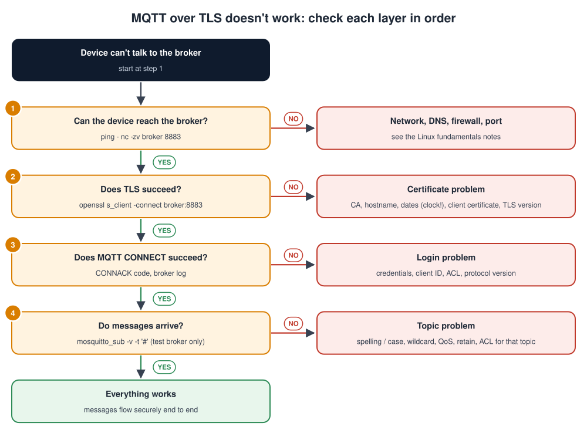

# MQTT and TLS

## Contents

| # | Section | In one line |
| --- | --- | --- |
| – | [Abbreviations](#abbreviations) | Every short form used in these notes, written in full |
| | **Part A: MQTT** | |
| 1 | [What is MQTT?](#1-what-is-mqtt) | Definition, block diagram, analogy, why IoT uses it |
| 2 | [Publish / subscribe and the broker](#2-publish--subscribe-and-the-broker) | Roles, and why decoupling matters |
| 3 | [Topics and wildcards](#3-topics-and-wildcards) | Naming, `+` and `#`, design rules |
| 4 | [QoS and the MQTT packet](#4-qos-and-the-mqtt-packet) | Delivery guarantees; a message byte by byte |
| 5 | [Sessions, retained messages, last will, keep-alive](#5-sessions-retained-messages-last-will-keep-alive) | The features that make MQTT reliable |
| 6 | [What MQTT 5 adds](#6-what-mqtt-5-adds) | Reason codes, expiry, shared subscriptions |
| 7 | [MQTT vs HTTP vs CoAP](#7-mqtt-vs-http-vs-coap) | Choosing a protocol |
| 8 | [Hands-on: Mosquitto from the command line](#8-hands-on-mosquitto-from-the-command-line) | A broker and clients in minutes |
| 9 | [MQTT in code: Python and ESP32](#9-mqtt-in-code-python-and-esp32) | Real client examples |
| | **Part B: TLS** | |
| 10 | [What is TLS?](#10-what-is-tls) | What it protects, and where it sits |
| 11 | [The cryptography inside TLS](#11-the-cryptography-inside-tls) | Key exchange, signatures, encryption |
| 12 | [The TLS 1.3 handshake](#12-the-tls-13-handshake) | Step by step |
| 13 | [Certificates and the chain of trust](#13-certificates-and-the-chain-of-trust) | X.509, CAs, validation, inspecting with OpenSSL |
| 14 | [Authenticating devices](#14-authenticating-devices-mutual-tls-and-alternatives) | Mutual TLS, passwords, tokens, PSK |
| 15 | [Hands-on: a test CA and a TLS broker](#15-hands-on-a-test-ca-and-a-tls-broker) | Certificates, Mosquitto with mTLS, ACLs |
| 16 | [TLS on embedded devices](#16-tls-on-embedded-devices) | Memory, time, keys, libraries |
| | **Part C: Putting it together** | |
| 17 | [Securing an MQTT system](#17-securing-an-mqtt-system-checklist) | A checklist |
| 18 | [Troubleshooting MQTT and TLS](#18-troubleshooting-mqtt-and-tls) | A method, common errors and fixes |
| 19 | [Simple code examples](#19-simple-code-examples) | A sensor with a last will, a device that takes commands, TLS on its own |
| 20 | [Interview quick answers](#20-interview-quick-answers) | Short answers to say out loud |

---

## Abbreviations

| Short form | Full form | In one line |
| --- | --- | --- |
| ACK | Acknowledgement | "I received it" |
| ACL | Access Control List | Which client may read or write which topics |
| AEAD | Authenticated Encryption with Associated Data | Encryption that also detects tampering |
| AES-GCM | Advanced Encryption Standard, Galois/Counter Mode | The most common TLS data cipher |
| ALPN | Application-Layer Protocol Negotiation | TLS extension that says which protocol runs inside |
| AWS | Amazon Web Services | Amazon's cloud |
| CA | Certificate Authority | The party that signs certificates |
| CBC | Cipher Block Chaining | An older AES mode |
| CBOR | Concise Binary Object Representation | A compact binary alternative to JSON |
| CCM | Counter with CBC-MAC | An AEAD mode used on small devices |
| CDN | Content Delivery Network | Servers worldwide that deliver large files fast |
| CN | Common Name | The old name field in a certificate |
| CoAP | Constrained Application Protocol | A small REST protocol over UDP |
| CRL | Certificate Revocation List | A list of cancelled certificates |
| CSR | Certificate Signing Request | A request to a CA to sign a public key |
| DNS | Domain Name System | Turns names into IP addresses |
| DTLS | Datagram Transport Layer Security | TLS for UDP |
| DUP | Duplicate (flag) | MQTT flag on a resent message |
| ECC | Elliptic Curve Cryptography | Small, fast public-key cryptography |
| ECDHE | Elliptic Curve Diffie-Hellman Ephemeral | Key exchange with fresh keys each session |
| ECDSA | Elliptic Curve Digital Signature Algorithm | A compact digital signature |
| ESP-IDF | Espressif IoT Development Framework | The SDK for ESP32 chips |
| GCM | Galois/Counter Mode | An AES mode that also detects tampering |
| GUI | Graphical User Interface | A windowed application |
| HSM | Hardware Security Module | A tamper-resistant box that stores keys |
| HTTP(S) | Hypertext Transfer Protocol (Secure) | The web protocol (over TLS) |
| IoT | Internet of Things | Connected devices |
| IP | Internet Protocol | Network addressing and routing |
| IPv4 / IPv6 | Internet Protocol version 4 / version 6 | The two versions of IP addressing |
| ISO / IEC | International Organization for Standardization / International Electrotechnical Commission | International standards bodies |
| JSON | JavaScript Object Notation | A common text data format |
| JWT | JSON Web Token | A signed, time-limited login token |
| LAN | Local Area Network | The network inside a building |
| 6LoWPAN | IPv6 over Low-Power Wireless Personal Area Networks | IP for tiny radio devices |
| LWT | Last Will and Testament | The message the broker sends if a client vanishes |
| MAC | Message Authentication Code | A keyed checksum |
| MCU | Microcontroller Unit | A small chip with CPU, flash and RAM inside |
| MQTT | Message Queuing Telemetry Transport | Lightweight publish/subscribe IoT protocol |
| mTLS | Mutual TLS | Both sides prove their identity with certificates |
| NAT | Network Address Translation | A router sharing one public IP among many devices |
| NTP | Network Time Protocol | Sets the clock from a time server |
| OASIS | Organization for the Advancement of Structured Information Standards | The body that publishes MQTT |
| OCSP | Online Certificate Status Protocol | Asking a server whether a certificate is revoked |
| PKI | Public Key Infrastructure | The system of CAs, certificates and keys |
| PSK | Pre-Shared Key | A secret both sides know in advance |
| QoS | Quality of Service | MQTT's delivery guarantee level |
| QUIC | (a name, originally "Quick UDP Internet Connections") | Fast transport under HTTP/3 |
| RAM | Random Access Memory | Working memory |
| REST | Representational State Transfer | The request/response style of web APIs |
| RFC | Request for Comments | Internet standard documents |
| RSA | Rivest-Shamir-Adleman | The classic public-key algorithm |
| RTC | Real-Time Clock | Hardware clock |
| SAN | Subject Alternative Name | The certificate field listing valid host names and IPs |
| SAS | Shared Access Signature | Azure's signed token |
| SDK | Software Development Kit | Libraries and tools for developers |
| SHA | Secure Hash Algorithm | Standard hash family (SHA-256) |
| SNI | Server Name Indication | The client says which server name it wants |
| SSE | Server-Sent Events | A one-way push channel over HTTP |
| SSL | Secure Sockets Layer | The old, broken predecessor of TLS |
| TCP | Transmission Control Protocol | Reliable network connections |
| TLS | Transport Layer Security | Encryption and authentication for connections |
| UDP | User Datagram Protocol | Fast, connectionless transport |
| UTF-8 | Unicode Transformation Format, 8-bit | The standard text encoding |
| X.509 | (ITU-T standard number) | The standard certificate format |

---

## Part A: MQTT

## 1. What is MQTT?

> **MQTT** (Message Queuing Telemetry Transport) is a **lightweight publish/subscribe messaging protocol**. Devices send small messages to named **topics** on a central **broker**, and the broker delivers them to everyone who **subscribed** to those topics.

### The MQTT block diagram


How a message travels, step by step:

1. **Publishers** (a temperature sensor, a door sensor, a smart meter) each open one connection to the broker and **publish** messages to topics, for example `home/livingroom/temp`.
2. **The broker** receives every message and compares its topic with all the subscriptions it knows.
3. **Subscribers** (a dashboard, a database, a phone app, an energy service) registered **topic filters** in advance, for example `home/#`.
4. **The broker forwards a copy** of the message to every subscriber whose filter matches.
5. **Every connection is protected by TLS** (Transport Layer Security) on port **8883** (Part B).
6. **Topics form a tree** separated by `/`, and the wildcards `+` and `#` let one subscription match many topics (section 3).

### An analogy: a radio station

| Radio | MQTT |
| --- | --- |
| A presenter speaks on a channel | A device **publishes** to a topic |
| The radio mast broadcasts it | The **broker** forwards it |
| Listeners tune in to the channels they like | Clients **subscribe** to topics |
| The presenter doesn't know who's listening | Publishers don't know the subscribers |
| New listeners can tune in at any time | New subscribers can be added at any time |

### Why IoT uses MQTT

| Property | Why it matters for devices |
| --- | --- |
| **Tiny overhead** | A message can be under 20 bytes of protocol. Good for slow or metered networks (cellular, satellite). |
| **One long-lived connection** | The device connects **out** to the broker. That works through **NAT** (Network Address Translation) routers and firewalls, and the device needs no open ports. |
| **Push, not polling** | Data and commands arrive the moment they're sent |
| **Built-in reliability options** | **QoS** (Quality of Service) levels, sessions, retained messages, last will |
| **Runs over TCP + TLS** | Standard, secure transport (**TCP** = Transmission Control Protocol) |
| **Small client libraries** | Runs on microcontrollers with a few tens of KB of RAM (plus TLS) |
| **Open standard** | **OASIS** MQTT 3.1.1 (also ISO/IEC 20922) and MQTT 5.0; supported by **AWS** (Amazon Web Services) IoT Core, Azure IoT Hub, HiveMQ, EMQX, Mosquitto |

---

## 2. Publish / subscribe and the broker

| Role | Does | Examples |
| --- | --- | --- |
| **Publisher** | Sends messages to topics | Sensors, meters, gateways |
| **Subscriber** | Receives messages for the topic filters it registered | Dashboards, databases, alarm services, phone apps |
| **Broker** | Accepts connections, authenticates clients, routes messages, stores sessions and retained messages | Mosquitto, EMQX, HiveMQ, VerneMQ, AWS IoT Core |

> A client can be **both** a publisher and a subscriber. A device typically publishes its readings and subscribes to its own command topic.

### Why "decoupling" is the big idea

| Decoupled in | Meaning | Benefit |
| --- | --- | --- |
| **Space** | The publisher and subscriber don't know each other's address | Add or replace systems without touching devices |
| **Time** | They don't need to be online together (with persistent sessions or retained messages) | Devices that sleep still get their commands later |
| **Synchronisation** | Publishing doesn't wait for subscribers to process the message | Devices stay simple and fast |

**Compare with the request/response style (HTTP, Hypertext Transfer Protocol):** with HTTP, the dashboard would poll every sensor ("any news?") over and over. With MQTT, each sensor speaks once and everyone interested hears it.

---

## 3. Topics and wildcards

A **topic** is a **UTF-8** text string, split into **levels** by `/`. Topics are **case-sensitive** and are created simply by publishing to them. There's no setup step.

```text
factory/line1/press3/temperature
factory/line1/press3/status
devices/device-001/telemetry
devices/device-001/commands
```

### Wildcards (for subscribing only)

| Wildcard | Meaning | Example filter | Matches | Doesn't match |
| --- | --- | --- | --- | --- |
| `+` | **Exactly one** level | `home/+/temp` | `home/kitchen/temp` | `home/kitchen/oven/temp` |
| `#` | **Any number** of levels, must be last | `home/#` | `home/door/state`, `home/kitchen/temp` | `office/door` |
| (none) | Exactly that topic | `home/door/state` | Only that | Everything else |

> Publishers always use a **full topic**. Wildcards are only allowed in **subscriptions**.

**Special topics:** topics starting with `$`, like `$SYS/broker/clients/connected`, are reserved for the broker's own statistics. They're **not** matched by `#`.

### Topic design rules

| Rule | Good | Avoid |
| --- | --- | --- |
| Start general, get more specific | `site/building/room/sensor/metric` | Random order |
| Put the **device ID** in the topic | `devices/device-001/telemetry` | One shared topic for all devices |
| Separate data and commands | `.../telemetry`, `.../commands`, `.../status` | Mixing both on one topic |
| No leading `/`, no spaces, lower case | `home/door/state` | `/Home/Door State` |
| Plan access control around topics | Each device writes only under its own ID | Every device allowed to write everywhere |
| Keep payloads self-describing | **JSON** (JavaScript Object Notation) / **CBOR** (Concise Binary Object Representation) / Protobuf with a version field | Unlabelled numbers, if the format may change |

---

## 4. QoS and the MQTT packet


### The three QoS levels

**QoS** (Quality of Service) decides how hard MQTT tries to deliver a message.

1. **QoS 0: at most once.**
   - One packet, no acknowledgement.
   - Fast and cheap, but a message can be lost if the connection drops.
2. **QoS 1: at least once.**
   - The receiver answers `PUBACK` (publish acknowledgement).
   - If no **ACK** (acknowledgement) arrives, the sender **resends**, so a message can arrive **twice**. Your application should handle duplicates.
3. **QoS 2: exactly once.**
   - A four-step exchange guarantees exactly one delivery: `PUBLISH` → `PUBREC` (received) → `PUBREL` (release) → `PUBCOMP` (complete).
   - It's the slowest option, and brokers and devices pay for it in memory and round trips.

| QoS | Guarantee | Packets | Use for |
| --- | --- | --- | --- |
| **0** | At most once | 1 | Frequent readings where the next one replaces a lost one (temperature every second) |
| **1** | At least once | 2 | **Most IoT data and commands**; make handlers tolerate duplicates |
| **2** | Exactly once | 4 | Rare: billing events, counters that must never double |

> **QoS applies per hop.** Publisher-to-broker and broker-to-subscriber are separate. A subscriber gets **the lower** of the publish QoS and its own subscription QoS.

### One PUBLISH packet, byte by byte

This is a real **PUBLISH** packet in MQTT 3.1.1, sending `23.5` to `home/temp` at QoS 0:

| Bytes | Meaning |
| --- | --- |
| `30` | **Fixed header.** Upper 4 bits = packet type 3 (PUBLISH). Lower 4 bits = flags: **DUP** (duplicate) 0, QoS 00, RETAIN 0. |
| `0F` | **Remaining length** = 15 bytes follow (variable-length encoding: 1 byte up to 127) |
| `00 09` | **Topic length** = 9 |
| `68 6F 6D 65 2F 74 65 6D 70` | The topic `home/temp` in UTF-8 |
| `32 33 2E 35` | The payload `23.5`. MQTT doesn't care what's in it: text, JSON or binary. |

**The whole message is 17 bytes.** A QoS 1 or 2 PUBLISH also carries a 2-byte **packet identifier** after the topic, so the ACK can refer to it.

### The packet types

| Type | Name | Direction | Purpose |
| --- | --- | --- | --- |
| 1 | CONNECT | Client → broker | Open a session: client ID, keep-alive, credentials, last will |
| 2 | CONNACK | Broker → client | Accepted or rejected (with a reason code) |
| 3 | PUBLISH | Both | Carry a message |
| 4 | PUBACK | Both | QoS 1 acknowledgement |
| 5-7 | PUBREC / PUBREL / PUBCOMP | Both | QoS 2 handshake |
| 8 / 9 | SUBSCRIBE / SUBACK | Client ↔ broker | Register topic filters; granted QoS per filter |
| 10 / 11 | UNSUBSCRIBE / UNSUBACK | Client ↔ broker | Remove filters |
| 12 / 13 | PINGREQ / PINGRESP | Client ↔ broker | Keep-alive heartbeat |
| 14 | DISCONNECT | Client → broker (both in MQTT 5) | Clean close: the last will is **not** sent |
| 15 | AUTH | Both (MQTT 5 only) | Extended authentication |

---

## 5. Sessions, retained messages, last will, keep-alive

These four features make MQTT dependable on unreliable networks.

### Retained messages: "the last known value"

Publish with the **retain** flag and the broker **keeps the last message** on that topic. Any client that subscribes later gets it **immediately**, instead of waiting for the next update.

```bash
mosquitto_pub -t devices/device-001/status -m "online" -r -q 1
```

- There is one retained message per topic. A new one replaces the old one.
- To **delete** it, publish an **empty** retained message: `mosquitto_pub -t devices/device-001/status -r -n`.
- It is ideal for status, configuration and the latest reading.

### Last will and testament (LWT): "tell everyone if I vanish"

In `CONNECT` the device gives the broker a message to publish **if the device disappears without a clean `DISCONNECT`** (power loss, network drop, crash).

```text
Will topic:   devices/device-001/status
Will message: offline      (retained, QoS 1)
```

A common pattern:

1. On connect, the device publishes a retained `online` to its status topic.
2. It registers a retained `offline` as its last will on the same topic.
3. Anyone subscribing to `devices/+/status` then always sees an up-to-date online/offline state for every device.

### Keep-alive: "are you still there?"

1. The client promises to send *something* at least every **keep-alive** seconds (for example 60).
2. If it has nothing to send, it sends `PINGREQ` (ping request), and the broker answers `PINGRESP`.
3. If the broker hears nothing for **1.5 × keep-alive**, it closes the connection and publishes the last will.

| Keep-alive | Trade-off |
| --- | --- |
| Short (10-30 s) | Dead devices are detected fast, but more traffic and battery use |
| Long (60-300 s) | Less traffic, but slower detection; NAT routers may drop idle connections first |

### Sessions: "remember me while I'm away"

| | Clean session (3.1.1: `clean session = 1`; 5: `clean start` + expiry 0) | Persistent session |
| --- | --- | --- |
| On reconnect | Starts fresh: must subscribe again | Subscriptions are remembered |
| While offline | Messages for it are dropped | The broker **queues** QoS 1/2 messages for it |
| Use for | Simple publish-only sensors | Devices that must not miss commands while sleeping or offline |

> **Client IDs must be unique.** If a second client connects with the **same client ID**, the broker **disconnects the first one**. Two devices sharing an ID will kick each other off in an endless loop, a classic bug.

---

## 6. What MQTT 5 adds

MQTT 5.0 (2019) keeps the same model and adds features large deployments asked for:

| Feature | What it gives you |
| --- | --- |
| **Reason codes** on every ACK | Know *why* something failed (e.g. `0x87 Not authorized`, `0x97 Quota exceeded`) |
| **Session expiry interval** | Persistent sessions that clean themselves up after a set time |
| **Message expiry interval** | Queued messages that go stale are dropped, not delivered hours late |
| **Shared subscriptions** `$share/group/topic` | Several back-end workers **share** a topic's load, each message going to one of them |
| **User properties** | Key-value metadata on messages (like HTTP headers) |
| **Request / response** | A response topic + correlation data, for commands with replies |
| **Topic aliases** | Replace a long topic with a short number, saving bandwidth |
| **Flow control** (receive maximum) | Stops a fast sender overwhelming a slow receiver |
| **Server-sent DISCONNECT** | The broker can say why it's closing the connection |

---

## 7. MQTT vs HTTP vs CoAP

**CoAP** (Constrained Application Protocol) is a small web-style protocol for very limited devices.

| | **MQTT** | **HTTP(S)** | **CoAP** |
| --- | --- | --- | --- |
| Model | Publish / subscribe via a broker | Request / response, client → server | Request / response (**REST**, Representational State Transfer), plus "observe" |
| Transport | TCP (+ TLS) | TCP (+ TLS); HTTP/3 over **QUIC** | **UDP** (User Datagram Protocol) (+ **DTLS**, Datagram TLS) |
| Overhead | Very small (2-byte fixed header) | Large text headers | Very small (4-byte header) |
| Connection | Long-lived, device connects out | Usually short, per request | Connectionless |
| Server → device push | Built in (subscribe) | Awkward (polling, WebSockets, **SSE** (Server-Sent Events)) | "Observe" option |
| Best for | Telemetry and commands for many devices | Web APIs, large file transfer, firmware downloads | Very constrained devices on lossy networks (**6LoWPAN**, i.e. IPv6 over Low-Power Wireless Personal Area Networks; Thread) |

> Many real products use **both**: MQTT for telemetry and commands, and **HTTPS for firmware downloads** (large files, **CDN**-friendly, i.e. Content Delivery Network), with the update announced over MQTT.

---

## 8. Hands-on: Mosquitto from the command line

**Eclipse Mosquitto** is a small, popular open-source broker, and its tools are the fastest way to learn.

```bash
sudo apt install mosquitto mosquitto-clients      # Debian/Ubuntu
```

> **Mosquitto 2.x is secure by default.** It only listens on `localhost` and refuses anonymous clients unless you configure a listener. For a quick **LAN test only**, add `listener 1883` and `allow_anonymous true` to `/etc/mosquitto/conf.d/test.conf`. Never use that in production (see section 15).

### Terminal 1: subscribe to everything under `home/`

```bash
mosquitto_sub -h localhost -t 'home/#' -v
```

### Terminal 2: publish

```bash
mosquitto_pub -h localhost -t home/livingroom/temp -m 23.5
mosquitto_pub -h localhost -t home/door/state -m open -q 1 -r   # QoS 1, retained
```

**Terminal 1 prints:**

```text
home/livingroom/temp 23.5
home/door/state open
```

| Option | Meaning |
| --- | --- |
| `-h` / `-p` | Broker host / port (1883 plain, 8883 TLS) |
| `-t` | Topic (publish) or topic filter (subscribe) |
| `-m` / `-n` | Message / empty message |
| `-q` | QoS 0, 1 or 2 |
| `-r` | Retain |
| `-v` | Print the topic with each message |
| `-i` | Client ID |
| `-u` / `-P` | Username / password |
| `--will-topic`, `--will-payload` | Set a last will |
| `-d` | Debug: print every MQTT packet sent and received |
| `--cafile`, `--cert`, `--key` | TLS settings (section 15) |

### Common ports

| Port | Use |
| --- | --- |
| **1883** | MQTT without TLS (testing only) |
| **8883** | **MQTT over TLS** |
| 443 | MQTT over TLS through firewalls (WebSockets, or **ALPN** (Application-Layer Protocol Negotiation) on some cloud brokers) |
| 8080 / 8081 (varies) | MQTT over WebSockets, for browser apps |

---

## 9. MQTT in code: Python and ESP32

### Python (paho-mqtt 2.x)

```python
import paho.mqtt.client as mqtt

def on_connect(client, userdata, flags, reason_code, properties):
    print("connected:", reason_code)
    client.subscribe("home/#", qos=1)            # subscribe after (re)connecting

def on_message(client, userdata, msg):
    print(msg.topic, msg.payload.decode())

client = mqtt.Client(mqtt.CallbackAPIVersion.VERSION2, client_id="dashboard-1")
client.tls_set(ca_certs="ca.crt")                # verify the broker's certificate
# mutual TLS: also prove who WE are, with tls_set(ca_certs=..., certfile="client.crt", keyfile="client.key")
client.on_connect = on_connect
client.on_message = on_message
client.connect("broker.local", 8883, keepalive=60)
client.loop_forever()                            # handles reconnects and keep-alive
```

Publishing from Python is one line: `client.publish("home/livingroom/temp", "23.5", qos=1, retain=True)`.

> **Subscribe inside `on_connect`**, not once at start-up. After a reconnect with a clean session, subscriptions must be made again.

### ESP32 (ESP-IDF MQTT client, TLS with a device certificate)

**ESP-IDF** is the Espressif IoT Development Framework, the official SDK for ESP32.

```c
#include "mqtt_client.h"

extern const char ca_pem[];      /* CA that signed the broker's certificate */
extern const char dev_crt[];     /* this device's certificate               */
extern const char dev_key[];     /* this device's private key               */

void mqtt_start(void)
{
    const esp_mqtt_client_config_t cfg = {
        .broker.address.uri               = "mqtts://broker.example.com:8883",
        .broker.verification.certificate  = ca_pem,
        .credentials.client_id            = "device-001",
        .credentials.authentication.certificate = dev_crt,
        .credentials.authentication.key         = dev_key,
        .session.last_will = {
            .topic = "devices/device-001/status",
            .msg = "offline", .qos = 1, .retain = 1,
        },
    };
    esp_mqtt_client_handle_t client = esp_mqtt_client_init(&cfg);
    esp_mqtt_client_register_event(client, ESP_EVENT_ANY_ID, mqtt_event_handler, NULL);
    esp_mqtt_client_start(client);
}

/* later, e.g. from a sensor task: topic, data, len (0 = strlen), QoS, retain */
esp_mqtt_client_publish(client, "devices/device-001/temp", "23.5", 0, 1, 0);
```

Other common embedded clients: **Eclipse Paho** (C/C++), **coreMQTT** (FreeRTOS, used with AWS IoT), **Zephyr's MQTT library**, and **libmosquitto** on Linux.

---

## Part B: TLS

## 10. What is TLS?

> **TLS** (Transport Layer Security) wraps a TCP connection so that the data is **private**, **tamper-proof**, and sent to the **right party**, proven with certificates.

### An analogy: a courier with sealed envelopes and ID checks

| Courier service | TLS |
| --- | --- |
| Checking the receiver's official ID before handing over | **Authentication**: the certificate proves the server is really `broker.example.com` |
| A sealed, opaque envelope | **Confidentiality**: encryption; eavesdroppers see noise |
| A tamper-evident seal | **Integrity**: any change is detected and the connection is dropped |
| Both sides show ID (optional) | **Mutual TLS**: the device proves its identity too |

### Where TLS sits

| Layer | Protocol |
| --- | --- |
| Application | MQTT (or HTTP, which becomes HTTPS) |
| **Security** | **TLS** |
| Transport | TCP |
| Network | **IP** (Internet Protocol) |
| Link / physical | Ethernet, Wi-Fi, cellular |

MQTT doesn't change at all: it just runs inside the TLS tunnel. That's why the port changes from 1883 to **8883**.

### Versions

| Version | Status |
| --- | --- |
| **SSL** (Secure Sockets Layer) 2.0 / 3.0 | Broken, never use. ("SSL" is still used informally to mean TLS.) |
| TLS 1.0 / 1.1 | Deprecated (**RFC** 8996; RFC = Request for Comments, the internet standards), disable them |
| **TLS 1.2** | Still widely used and safe with modern cipher suites |
| **TLS 1.3** | Current (RFC 8446): faster (1 round trip), simpler, only strong algorithms. **Prefer it.** |

---

## 11. The cryptography inside TLS

TLS combines the building blocks explained in [Bootloader.md, section 8](Bootloader.md#8-bootloader-cryptography):

| Job | Building block | Typical choice | Why this type |
| --- | --- | --- | --- |
| Agree on a shared secret over an open network | **Key exchange** | **ECDHE** (Elliptic Curve Diffie-Hellman Ephemeral) with X25519 or P-256 | Both sides compute the same key without ever sending it. "Ephemeral" = new keys each session, which gives **forward secrecy**: stealing a key later can't decrypt old sessions. |
| Prove identity | **Digital signature** + **certificate** | **ECDSA** (Elliptic Curve Digital Signature Algorithm) P-256, or **RSA** (Rivest-Shamir-Adleman) 2048+ | Only the owner of the private key can sign |
| Encrypt the data | **Symmetric AEAD cipher** (Authenticated Encryption with Associated Data) | **AES-128-GCM** (Advanced Encryption Standard, Galois/Counter Mode) or **ChaCha20-Poly1305** | Fast; encrypts **and** detects tampering |
| Fingerprint the handshake | **Hash** | **SHA-256 / SHA-384** (Secure Hash Algorithm) | Detects any change to the handshake messages |

> **Why both kinds of crypto?** Asymmetric crypto (ECDHE, ECDSA) solves "we've never met, how do we agree on a key and trust each other?", but it's slow. Symmetric crypto (AES) is fast, but needs a shared key. TLS uses the slow kind **once**, in the handshake, to set up keys for the fast kind.

**TLS 1.3 cipher suites** (only five exist, all strong): `TLS_AES_128_GCM_SHA256`, `TLS_AES_256_GCM_SHA384`, `TLS_CHACHA20_POLY1305_SHA256`, plus two **CCM** (Counter with CBC-MAC) suites for constrained devices.

**A good TLS 1.2 choice for IoT:** `ECDHE-ECDSA-AES128-GCM-SHA256`.

---

## 12. The TLS 1.3 handshake

![TLS 1.3 handshake between an IoT device and an MQTT broker: ClientHello with versions, cipher suites, key share and SNI; ServerHello with the chosen suite and server key share; both compute the shared secret and everything after is encrypted; the server sends its certificate, CertificateVerify and Finished; the device checks the chain, name and dates; with mutual TLS the device sends its own certificate and CertificateVerify; the device sends Finished; then encrypted application data carries MQTT CONNECT, CONNACK and PUBLISH](images/tls_handshake.svg)

### The handshake, step by step

1. **ClientHello.** The device sends:
   - the TLS versions and cipher suites it supports
   - its half of the key exchange (an **ECDHE public key**)
   - the name of the server it wants (**SNI**, Server Name Indication), for example `broker.example.com`
2. **ServerHello.** The broker picks a cipher suite and sends **its** key-exchange half. **Now both sides can compute the same secret** without ever sending it. Everything after this step is encrypted.
3. **Certificate.** The broker sends its certificate chain.
4. **CertificateVerify.** The broker signs the handshake with its **private key**. This proves it really owns the certificate, rather than just having a copy.
5. **Finished.** A check value over the whole handshake: if anyone changed anything, it won't match.
6. **The device checks the certificate:**
   - Does the chain lead to a root it trusts?
   - Does the name match?
   - Are the dates valid?
7. **Mutual TLS only:** the device sends **its own** certificate and signature, so the broker knows exactly which device this is.
8. **Finished** from the device.
9. **Application data flows:** MQTT `CONNECT`, `CONNACK`, `PUBLISH`, all encrypted with AES-GCM or ChaCha20-Poly1305.

> **Speed:** TLS 1.3 needs **one round trip** before data flows, where TLS 1.2 needed two. **Session resumption** lets a reconnecting device skip the certificate work, which matters on battery-powered devices.

---

## 13. Certificates and the chain of trust


### How a certificate chain works, step by step

1. **A certificate binds a public key to an identity** (like `broker.example.com`) for a **time period**. It is **signed** by a **Certificate Authority (CA)**. The standard format is **X.509**.
2. **CAs form a chain:**
   - the **root CA** signs an **intermediate CA**
   - the intermediate CA signs the **server certificate**
3. **The root is self-signed,** so nobody else can verify it. It's trusted because its certificate was **installed on the device in advance**, in the trust store or in a CA file built into the firmware.
4. **When the device connects,** it walks the chain up to a root it trusts and makes five checks (table below).
5. **If any check fails, it refuses to connect.** That's what stops an attacker's fake broker.

An X.509 certificate contains:

- the **subject** (who it belongs to)
- the **issuer** (who signed it)
- the **validity dates**
- the **public key**
- the **SAN** (Subject Alternative Name: the valid host names and IPs)
- the issuer's **signature**

### The five checks, and what breaks each one

| Check | Fails when | Typical error |
| --- | --- | --- |
| **Signatures up to a trusted root** | The device doesn't have the right CA, or the server doesn't send the intermediate | `unable to get local issuer certificate`, `unknown ca` |
| **Name** | The device connects by IP or by another name that isn't in the certificate's SAN | `hostname mismatch` |
| **Dates** | The certificate expired, **or the device's clock is wrong** (e.g. 1970 after boot) | `certificate has expired` / `certificate is not yet valid` |
| **Purpose** | Wrong key usage / extended key usage | `unsupported certificate purpose` |
| **Revocation** | The certificate was revoked: **CRL** (Certificate Revocation List) or **OCSP** (Online Certificate Status Protocol) | Often not checked on MCUs, which is one reason to keep lifetimes short |

> **The Subject Alternative Name (SAN)** is what clients check today, not the old **CN** (Common Name). A certificate for `broker.example.com` doesn't match a connection to `192.168.1.10` unless that IP is also in the SAN.

### Inspecting certificates with OpenSSL

```bash
# Connect like a client and show the server's chain and the verification result
openssl s_client -connect broker.example.com:8883 -servername broker.example.com \
                 -CAfile ca.crt -showcerts
# look for:  Verify return code: 0 (ok)

# Read a certificate file
openssl x509 -in server.crt -noout -subject -issuer -dates -ext subjectAltName

# Check that a certificate was signed by a CA
openssl verify -CAfile ca.crt server.crt           # → server.crt: OK
```

---

## 14. Authenticating devices: mutual TLS and alternatives

Normal TLS proves **the server** to the device. The broker still needs to know **which device** is connecting.

| Method | How the device proves itself | Pros | Cons | Seen in |
| --- | --- | --- | --- | --- |
| **Username + password** (over TLS) | Sent in MQTT `CONNECT` | Simple | Shared or weak passwords; secrets must be stored on the device | Small private deployments |
| **Client certificate (mutual TLS, mTLS)** | A device certificate + signature in the TLS handshake | **Strong, unique per device**; the private key never leaves the device (ideally in a secure element) | Needs a **PKI** (Public Key Infrastructure): issuing, renewing, revoking | AWS IoT Core, Azure IoT Hub (X.509), industrial IoT |
| **Tokens**: **JWT** (JSON Web Token), **SAS** (Shared Access Signature) | A signed, time-limited token as the MQTT password | Short-lived; easy to revoke by expiry | The device needs a correct clock and a way to refresh tokens | Azure IoT Hub (SAS), some clouds |
| **TLS-PSK** (Pre-Shared Key) | Both sides know a secret key; no certificates | Very small code and fast | Key distribution and rotation are hard; no PKI | Very constrained devices |

**With mutual TLS, a good pattern:**

1. Each device gets a **unique key pair**, ideally **generated inside a secure element** (ATECC608, SE050) or TrustZone during manufacturing, so the private key is never exposed.
2. A factory CA signs the device's certificate, with the **device ID in the CN/SAN**.
3. The broker trusts the factory CA and uses the certificate's identity as the **username** for access control.
4. A stolen device can be **revoked** without affecting any other device.

---

## 15. Hands-on: a test CA and a TLS broker

> These commands build a **test** PKI for learning. In production, keep CA keys offline or in an **HSM** (Hardware Security Module), and automate issuing and renewal.

### 1. Create a CA, a broker certificate and a device certificate

A **CSR** (Certificate Signing Request) is the request a key owner sends to the CA to get a certificate.

```bash
# The CA (the root everyone will trust)
openssl ecparam -name prime256v1 -genkey -noout -out ca.key
openssl req -x509 -new -key ca.key -sha256 -days 3650 -subj "/CN=My Test CA" -out ca.crt

# The broker's certificate. The SAN must contain the name AND/OR IP clients use.
openssl ecparam -name prime256v1 -genkey -noout -out server.key
openssl req -new -key server.key -subj "/CN=broker.local" -out server.csr
printf "subjectAltName=DNS:broker.local,IP:192.168.1.10\n" > san.ext
openssl x509 -req -in server.csr -CA ca.crt -CAkey ca.key -CAcreateserial \
             -days 825 -sha256 -extfile san.ext -out server.crt

# A device certificate (the CN becomes the device's identity)
openssl ecparam -name prime256v1 -genkey -noout -out device-001.key
openssl req -new -key device-001.key -subj "/CN=device-001" -out device-001.csr
openssl x509 -req -in device-001.csr -CA ca.crt -CAkey ca.key -CAcreateserial \
             -days 365 -sha256 -out device-001.crt
```

### 2. Configure Mosquitto for TLS and mutual TLS

```text
# /etc/mosquitto/conf.d/tls.conf
listener 8883
cafile   /etc/mosquitto/certs/ca.crt
certfile /etc/mosquitto/certs/server.crt
keyfile  /etc/mosquitto/certs/server.key
require_certificate true          # mutual TLS: clients must present a certificate
use_identity_as_username true     # the certificate CN becomes the username
allow_anonymous false
acl_file /etc/mosquitto/acl
```

### 3. Limit each device to its own topics (ACL)

An **ACL** (Access Control List) says which client may read or write which topics.

```text
# /etc/mosquitto/acl
# %u = the username (here: the certificate CN, e.g. device-001)
pattern write devices/%u/#
pattern read  commands/%u/#

# A back-end service that may read all devices
user dashboard
topic read devices/#
```

### 4. Connect as the device

```bash
mosquitto_pub -h broker.local -p 8883 \
  --cafile ca.crt --cert device-001.crt --key device-001.key \
  -t devices/device-001/temp -m 23.5 -q 1

# The ACL blocks writing to another device's topic:
mosquitto_pub ... -t devices/device-002/temp -m 99     # silently dropped / not authorised
```

---

## 16. TLS on embedded devices

Running TLS on a **microcontroller** (MCU) is very doable, but these points matter:

| Topic | What to know | What to do |
| --- | --- | --- |
| **RAM** | A TLS session needs buffers of up to about 16 KB for incoming records, plus handshake state. Running out of memory in the handshake is a classic MCU failure. | Use **ECC** (Elliptic Curve Cryptography, smaller than RSA); negotiate **max fragment length** or smaller records if both sides support it; check the free heap |
| **Libraries** | **Mbed TLS** (ESP-IDF, Zephyr, many SDKs), **wolfSSL**, BearSSL; OpenSSL on Linux | Use the SDK's integrated version and keep it patched |
| **Time** | Certificate dates can't be checked without the correct time. Devices often boot in 1970. | Get the time from **NTP** (Network Time Protocol), cellular network time or an **RTC** (Real-Time Clock) **before** connecting; consider allowing a known-good build date as a minimum |
| **Private key storage** | A key in plain flash can be read out | A **secure element** (ATECC608, SE050), TrustZone, or at least flash encryption + locked debug |
| **CA bundle** | A full browser CA bundle is ~200 KB | Ship only the CA(s) you actually use; plan how to update them |
| **Certificate lifetime and rotation** | Device certificates expire; CAs change | Build renewal into the product (over MQTT or HTTPS) before the first expiry |
| **Hardware crypto** | Many MCUs accelerate AES, SHA and ECC | Enable it in the TLS library config: faster handshakes, less energy |
| **Handshake cost** | ECDHE + ECDSA on a Cortex-M4 takes hundreds of ms | Keep connections open; use **session resumption** instead of reconnecting often |
| **Provisioning** | Each device needs a unique identity | Generate keys and certificates at the factory, or use a cloud's fleet provisioning |

---

## Part C: Putting it together

## 17. Securing an MQTT system: checklist

| ✔ | Item |
| --- | --- |
| ☐ | **TLS on every connection** (8883). Port 1883 closed to the outside. |
| ☐ | Devices **verify the broker's certificate** (CA pinned in firmware); never "skip verification" in production |
| ☐ | **Unique identity per device** (a client certificate or unique credentials); no shared passwords |
| ☐ | Private keys in a **secure element** or protected storage |
| ☐ | **Anonymous access disabled** on the broker |
| ☐ | **ACLs**: each device may only publish under its own topics and read its own commands |
| ☐ | **Unique client IDs** (usually = the device ID) |
| ☐ | **Validate every payload** on the receiving side (size, format, ranges). MQTT carries anything. |
| ☐ | Rate limits and a maximum message size on the broker |
| ☐ | **Correct time** on devices (NTP) before TLS |
| ☐ | Certificate **expiry monitoring** and a working **renewal** path |
| ☐ | Firmware updates **signed and verified** by the device ([Bootloader.md, section 8](Bootloader.md#8-bootloader-cryptography)) |
| ☐ | Broker logs monitored for failed logins and unusual traffic |

---

## 18. Troubleshooting MQTT and TLS

### Work up the stack



Check the layers in order: network, then TLS, then the MQTT login, then topics. Go to the next step only when the current one works.

| Step | Question | How to check | If not, it's a ... |
| --- | --- | --- | --- |
| 1 | Can the device reach the broker? | `ping` · `nc -zv broker 8883` | **Network problem:** DNS, firewall, port (see [Linux_Fundamentals_and_Troubleshooting.md, 13.6](Linux_Fundamentals_and_Troubleshooting.md#136-the-network-doesnt-work)) |
| 2 | Does TLS succeed? | `openssl s_client -connect broker:8883` | **Certificate problem:** CA, hostname, dates (the clock!), client certificate, TLS version |
| 3 | Does MQTT CONNECT succeed? | The CONNACK code, the broker log | **Login problem:** credentials, client ID, ACL, protocol version |
| 4 | Do messages arrive? | `mosquitto_sub -v -t '#'` (test broker only) | **Topic problem:** spelling or case, wildcard, QoS, retain, ACL for that topic |

Most real-world failures are at **step 2**, and very often because the device's clock is wrong.

### Common errors

| Symptom / message | Likely cause | Fix |
| --- | --- | --- |
| **Connection refused** | Broker not running, wrong port, firewall, or Mosquitto 2.x listening on localhost only | `systemctl status mosquitto`; `ss -tlnp \| grep 8883`; add a `listener` |
| **`certificate verify failed`** / `unable to get local issuer certificate` | The device has the wrong CA, or the server doesn't send its intermediate | Give the device the right CA file; configure the full chain on the broker |
| **`hostname mismatch`** | Connected by IP or by an alias not in the SAN | Connect with the name in the certificate, or reissue it with the right SAN |
| **`certificate is not yet valid`** / `has expired` | **Device clock wrong** (often 1970), or the certificate really expired | Sync the time via NTP before connecting; renew the certificate |
| **`tlsv1 alert unknown ca`** (in the broker log) | The **broker** doesn't trust the **device's** certificate | Put the device CA in the broker's `cafile` |
| **`handshake failure`** | No common TLS version or cipher suite, or a client certificate is required but not sent | Check versions and ciphers on both sides; send the client certificate |
| **Out of memory in the TLS handshake** (Mbed TLS: `MBEDTLS_ERR_SSL_ALLOC_FAILED`, -0x7F00) | Not enough heap for TLS buffers on an MCU | Free RAM; smaller record buffers; ECC instead of RSA |
| **CONNACK: bad username or password / not authorized** (3.1.1 codes 4 / 5; MQTT 5 `0x86` / `0x87`) | Wrong credentials, or the ACL/identity isn't allowed | Check the credentials; check the broker's auth and ACL config |
| **Keeps disconnecting every few seconds** | **Two clients with the same client ID** kicking each other off | Make client IDs unique (broker log: `already connected, closing old connection`) |
| **Disconnects after a period of silence** | Keep-alive not honoured, or NAT/firewall dropping idle connections | Make sure the client loop runs; use a shorter keep-alive |
| **Subscribed but no messages** | Topic typo or **case** difference, wrong wildcard, the ACL denies reading, or subscribed after the message was sent (not retained) | `mosquitto_sub -v -t '#'` on a test broker to see the real topic names; use retained messages for state |
| **Messages arrive twice** | QoS 1 redelivery (normal) | Make message handling idempotent (safe to repeat), or use QoS 2 if you really must |
| **An offline device misses commands** | Clean session, or QoS 0 | Persistent session + QoS 1 for commands |

### Tools

| Tool | Use |
| --- | --- |
| `mosquitto_sub -d` / `mosquitto_pub -d` | Print every MQTT packet (CONNECT, CONNACK, SUBACK, ...) |
| `openssl s_client` | Test TLS and certificates independently of MQTT |
| Broker logs (`journalctl -u mosquitto -f`) | Why the broker rejected or dropped a client |
| **Wireshark** | Decodes MQTT; can decrypt TLS if the client writes its keys to a file via `SSLKEYLOGFILE` (development only) |
| MQTT Explorer / MQTTX | **GUI** (Graphical User Interface) clients to browse topics and retained messages |

---

## 19. Simple code examples

Three small Python programs that build on [section 9](#9-mqtt-in-code-python-and-esp32): a device that publishes, a device that takes commands, and TLS on its own. They use **paho-mqtt 2.x** (`pip install paho-mqtt`) and a broker such as Mosquitto.

### Example 1: A sensor device: JSON, QoS 1, last will

```python
import json
import random
import time
import paho.mqtt.client as mqtt

DEVICE = "device-001"
STATUS = f"devices/{DEVICE}/status"

def on_connect(client, userdata, flags, reason_code, properties):
    if not reason_code.is_failure:
        client.publish(STATUS, "online", qos=1, retain=True)    # replaces the "offline" will

client = mqtt.Client(mqtt.CallbackAPIVersion.VERSION2, client_id=DEVICE)
client.will_set(STATUS, "offline", qos=1, retain=True)           # the broker sends this if we vanish
client.on_connect = on_connect
client.connect("broker.local", 1883, keepalive=30)
client.loop_start()                                              # network loop in a background thread

while True:
    reading = {"temp": round(20 + random.random() * 5, 2), "ts": int(time.time())}
    client.publish(f"devices/{DEVICE}/telemetry", json.dumps(reading), qos=1)
    print("sent", reading)
    time.sleep(5)
```

**Try it:** in another terminal run `mosquitto_sub -h broker.local -t 'devices/#' -v`. Stop the device with Ctrl+C: within about 1.5 × 30 s the broker publishes `offline`, the **last will**.

### Example 2: A device that takes commands

The device listens on a **command topic** and answers on an **acknowledge topic**.

```python
import paho.mqtt.client as mqtt

DEVICE = "device-001"

def set_led(on):
    print("LED", "on" if on else "off")          # real code would drive a GPIO here

def on_connect(client, userdata, flags, reason_code, properties):
    client.subscribe(f"devices/{DEVICE}/cmd", qos=1)

def on_message(client, userdata, msg):
    cmd = msg.payload.decode()
    if cmd == "led_on":
        set_led(True)
    elif cmd == "led_off":
        set_led(False)
    else:
        client.publish(f"devices/{DEVICE}/ack", f"unknown command: {cmd}", qos=1)
        return
    client.publish(f"devices/{DEVICE}/ack", f"done: {cmd}", qos=1)

client = mqtt.Client(mqtt.CallbackAPIVersion.VERSION2, client_id=f"{DEVICE}-cmd")
client.on_connect = on_connect
client.on_message = on_message
client.connect("broker.local", 1883)
client.loop_forever()
```

**Try it:**

```bash
mosquitto_sub -h broker.local -t 'devices/device-001/ack' -v &
mosquitto_pub -h broker.local -t 'devices/device-001/cmd' -m led_on     # → done: led_on
```

### Example 3: TLS on its own, without MQTT

Python's `ssl` module shows what TLS does, step by step:

```python
import socket
import ssl

ctx = ssl.create_default_context(cafile="ca.crt")   # checks the certificate AND the host name
ctx.minimum_version = ssl.TLSVersion.TLSv1_2        # refuse older, weaker versions

with socket.create_connection(("broker.example.com", 8883)) as raw:          # 1. plain TCP
    with ctx.wrap_socket(raw, server_hostname="broker.example.com") as tls:  # 2. the TLS handshake
        print("TLS version:", tls.version())                                 # e.g. TLSv1.3
        print("cipher:     ", tls.cipher()[0])                               # e.g. TLS_AES_256_GCM_SHA384
        print("server cert:", tls.getpeercert()["subject"])                  # who we're talking to
```

1. `create_connection()` opens a normal TCP connection.
2. `wrap_socket()` runs the **handshake** from [section 12](#12-the-tls-13-handshake): it checks the certificate chain and the host name, and agrees on keys.
3. After that, everything sent over `tls` is encrypted. MQTT over TLS is exactly this, with MQTT packets inside.

---

## 20. Interview quick answers

**Q: What is MQTT and why is it popular in IoT?**

> "A lightweight publish/subscribe protocol over TCP. Devices publish small messages to topics on a broker, and the broker delivers them to subscribers. It's popular because the protocol overhead is tiny, the device keeps one outgoing connection so it works behind NAT and firewalls, the server can push commands instantly, and it has built-in reliability: QoS levels, persistent sessions, retained messages and last will."

**Q: Explain the QoS levels.**

> "QoS 0 is at most once: fire and forget, messages can be lost. QoS 1 is at least once: the receiver acknowledges with PUBACK and the sender retries, so duplicates are possible. QoS 2 is exactly once, using a four-step PUBLISH, PUBREC, PUBREL, PUBCOMP exchange, which is the slowest. QoS applies per hop, and most IoT systems use QoS 1 with idempotent handling."

**Q: What are retained messages and the last will?**

> "A retained message is the last message the broker keeps for a topic and sends immediately to new subscribers. It's used for status and the latest value. The last will is a message the client registers at CONNECT, which the broker publishes if the client disappears without a clean DISCONNECT. Together they give a reliable online/offline status: publish a retained 'online' on connect, with 'offline' as the retained will."

**Q: What's the difference between `+` and `#`?**

> "`+` matches exactly one topic level, so `home/+/temp` matches `home/kitchen/temp`. `#` matches any number of levels and must be last, so `home/#` matches everything under `home`. Wildcards are only allowed when subscribing, never when publishing."

**Q: What does TLS provide?**

> "Confidentiality through encryption, integrity through authenticated encryption and handshake MACs, and authentication through certificates. The server always proves its identity, and with mutual TLS the client does too. MQTT runs unchanged inside the TLS tunnel, on port 8883."

**Q: Walk me through a TLS 1.3 handshake.**

> "The client sends ClientHello with its versions, cipher suites and an ECDHE key share. The server replies with ServerHello and its key share. Both now derive the same secret, and everything after is encrypted. The server sends its certificate, a CertificateVerify signature proving it owns the private key, and Finished. The client validates the chain, the hostname and the dates, optionally sends its own certificate for mutual TLS, and sends Finished. Then application data flows with AES-GCM or ChaCha20. It's one round trip, versus two in TLS 1.2."

**Q: How does a device know it's talking to the real broker?**

> "The broker presents a certificate chain. The device checks that each certificate is signed by the one above it, up to a root CA it already trusts because it's built into the firmware. It also checks that the SAN matches the hostname it connected to and that the certificate is valid at the current time. CertificateVerify then proves the broker holds the matching private key, so a copied certificate isn't enough."

**Q: What is mutual TLS and why use it for IoT?**

> "Mutual TLS means the client also presents a certificate and proves ownership of its private key. For IoT it gives every device a strong, unique identity with no shared passwords. The private key can stay inside a secure element. The broker can map the certificate to the device's identity for access control, and a compromised device can be revoked individually."

**Q: Why does a wrong clock break TLS?**

> "Certificates have a validity window. A device that boots with the clock at 1970 sees every certificate as 'not yet valid' and rejects the connection. So devices sync time via NTP, cellular time or an RTC before starting TLS. Token-based authentication has the same dependency."

**Q: How would you secure an MQTT deployment of thousands of devices?**

> "TLS everywhere, with devices pinning the broker's CA. A unique client certificate per device, provisioned at the factory with the key in a secure element. Anonymous access disabled, and ACLs so each device can only publish under its own topic and read its own commands. Unique client IDs, payload validation and rate limits on the broker side, correct time on devices, certificate expiry monitoring with a renewal path, and signed firmware updates."

---

**Related notes:** [Embedded_communication_protocols.md](Embedded_communication_protocols.md) · [Bootloader.md](Bootloader.md) · [Linux_Fundamentals_and_Troubleshooting.md](Linux_Fundamentals_and_Troubleshooting.md) · [Kernal.md](Kernal.md)
