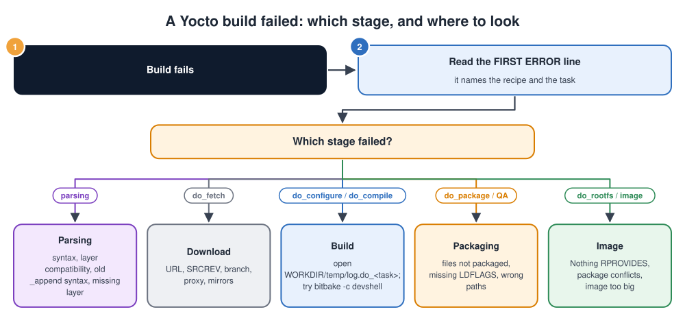

# Yocto Fundamentals

## Contents

| # | Section | In one line |
| --- | --- | --- |
| – | [Abbreviations](#abbreviations) | Every short form used in these notes, written in full |
| 1 | [What is Yocto?](#1-what-is-yocto) | Definition, block diagram, names you'll hear, and why products use it |
| 2 | [Yocto vs Buildroot vs a desktop distribution](#2-yocto-vs-buildroot-vs-a-desktop-distribution) | Choosing a build approach |
| 3 | [The vocabulary](#3-the-vocabulary) | Recipe, layer, class, task, package, image, sstate |
| 4 | [Your first build](#4-your-first-build) | Clone, configure, build, run in QEMU |
| 5 | [Layers](#5-layers) | Stacking, your own layer, bbappends |
| 6 | [Recipes and tasks](#6-recipes-and-tasks) | Anatomy of a recipe, the task pipeline, variable syntax |
| 7 | [MACHINE, DISTRO and IMAGE](#7-machine-distro-and-image) | The three settings that decide everything |
| 8 | [Creating your own image](#8-creating-your-own-image) | An image recipe for a gateway |
| 9 | [Customising existing software](#9-customising-existing-software-with-bbappend) | Kernel config, device tree, config files |
| 10 | [The developer workflow: SDK and devtool](#10-the-developer-workflow-sdk-and-devtool) | Building apps without rebuilding the world |
| 11 | [Everyday BitBake commands](#11-everyday-bitbake-commands) | The commands you'll use daily |
| 12 | [Faster builds](#12-faster-builds) | sstate, shared downloads, rm_work |
| 13 | [Licences, security and maintenance](#13-licences-security-and-maintenance) | Compliance, CVEs, LTS, updates |
| 14 | [Troubleshooting Yocto builds](#14-troubleshooting-yocto-builds) | A method, common errors and fixes |
| 15 | [Simple code examples](#15-simple-code-examples) | A hello-world recipe in C, a Python script recipe, adding a user to the image |
| 16 | [Interview quick answers](#16-interview-quick-answers) | Short answers to say out loud |

---

## Abbreviations

| Short form | Full form | In one line |
| --- | --- | --- |
| A/B | Two slots, A and B | Two copies of the system for safe updates |
| BSP | Board Support Package | The board-specific software (see [BSP.md](BSP.md)) |
| CAN | Controller Area Network | The field bus used in cars and machines |
| CI | Continuous Integration | The automated build server |
| CPU | Central Processing Unit | The processor |
| CVE | Common Vulnerabilities and Exposures | Public ID numbers for security bugs |
| DISTRO | Distribution | Yocto's setting for build policies |
| DL_DIR | Download directory | Where Yocto keeps fetched sources |
| eMMC | embedded MultiMediaCard | Flash storage chip soldered on the board |
| eSDK | Extensible Software Development Kit | An SDK that also contains devtool |
| FIT | Flattened Image Tree | U-Boot's signed image format |
| GNU | GNU's Not Unix | The free-software project behind many Linux tools and the GPL |
| GPL / LGPL | GNU General Public License / GNU Lesser General Public License | Common open-source licences |
| IoT | Internet of Things | Connected devices |
| ipk / rpm / deb | Itsy Package / RPM Package Manager / Debian package | Package formats Yocto can produce |
| LTS | Long-Term Support | A release maintained for several years |
| MIT | Massachusetts Institute of Technology (licence) | A short, permissive open-source licence |
| MQTT | Message Queuing Telemetry Transport | Lightweight IoT messaging protocol |
| NFS | Network File System | Files shared over a network |
| NXP / TI / ST | NXP Semiconductors / Texas Instruments / STMicroelectronics | Chip vendors |
| OE | OpenEmbedded | The build framework Yocto is built on |
| PC | Personal Computer | A desktop or laptop computer |
| QA | Quality Assurance | Automatic checks on each built package |
| QEMU | Quick Emulator | Runs an image for another CPU on your PC |
| RAM | Random Access Memory | Working memory |
| SBOM | Software Bill of Materials | A list of every software component in the image |
| SD | Secure Digital | Removable memory card |
| SDK | Software Development Kit | Toolchain and libraries for app developers |
| SoC | System on Chip | Processor chip with peripherals built in |
| SPDX | Software Package Data Exchange | A standard SBOM format |
| SRC_URI | Source Uniform Resource Identifier | Where a recipe gets its source code |
| SSD | Solid-State Drive | Fast flash-based disk |
| SSH | Secure Shell | Encrypted remote login |
| sstate | Shared state | Yocto's cache of task results |
| URL | Uniform Resource Locator | A web address |
| WIC | OpenEmbedded Image Creator | Yocto's tool for flashable disk images (`.wic`) |

---

## 1. What is Yocto?

> The **Yocto Project** is **not a Linux distribution**. It's a **set of tools and build instructions for creating your own custom Linux distribution**, tailored to your hardware and product, built entirely from source.

The examples in these notes follow **Yocto 5.0 "Scarthgap"**, an **LTS** (Long-Term Support) release. The concepts are the same in every release; small details change between versions, and are noted where it matters.

### The Yocto block diagram


How a Yocto build works, step by step:

1. **Three inputs go in:**
   - **Layers of metadata:** folders of recipes (build instructions) from Yocto, the chip vendor and you.
   - **Configuration:** which board, which policies, which image.
   - **Upstream source code:** downloaded from the internet (git, tar archives).
2. **BitBake**, the build engine, then:
   1. reads every recipe
   2. works out which recipe depends on which
   3. runs thousands of small tasks in parallel
   4. reuses cached results (**sstate**, shared state) whenever nothing has changed
3. **The outputs** appear in `tmp/deploy/images/`:
   - the bootloader
   - the kernel and device tree
   - the root filesystem image
   - the packages
   - an **SDK** (Software Development Kit) for application developers
   - a licence manifest

**A kitchen analogy helps remember the words:**

| Kitchen | Yocto |
| --- | --- |
| A recipe for one dish | A **recipe** (`.bb` file) for one piece of software |
| A cookbook | A **layer** (a folder of recipes) |
| The chef | **BitBake** |
| The finished meal | The **image** |

### Names you'll hear

| Name | What it is |
| --- | --- |
| **Yocto Project** | The umbrella open-source project (Linux Foundation) |
| **OpenEmbedded (OE)** | The build framework and community; Yocto is built on it |
| **OE-core** (`meta`) | The core layer: recipes for the essentials (toolchain, glibc, busybox, systemd, openssl, ...) |
| **BitBake** | The build engine that reads recipes and runs tasks |
| **Poky** | The **reference distribution**: BitBake + OE-core + `meta-poky` + example BSPs. The usual starting point. |
| **Release names** | Each release has a codename, e.g. **Kirkstone** (4.0 LTS), **Scarthgap** (5.0 LTS). LTS releases get about 4 years of maintenance. |

### Why products use Yocto

| Need | How Yocto helps |
| --- | --- |
| **Only what you need** on the device | You choose every package: a small, fast-booting, secure image |
| **Your exact hardware** | **BSP** (Board Support Package) layers from **SoC** (System on Chip) vendors (NXP, TI, ST, Intel, Raspberry Pi) plug straight in |
| **Reproducible builds** | The same inputs give the same image, years later; essential for maintenance and certification |
| **Long product life** | LTS releases, security fixes, and the ability to rebuild anything from source |
| **Licence compliance** | Automatic licence manifests, source archiving and **SBOMs** (Software Bills of Materials) |
| **One build for many products** | Change `MACHINE` or the image recipe, and reuse everything else |
| **Industry standard** | Most SoC vendors ship their Linux BSPs as Yocto layers |

---

## 2. Yocto vs Buildroot vs a desktop distribution

| | **Yocto** | **Buildroot** | **Debian / Ubuntu on the board** |
| --- | --- | --- | --- |
| Approach | Build a custom distro from recipes, in layers | Build a single firmware image from one config | Install a ready-made distro and add packages |
| Learning curve | Steep | Gentle | Easy |
| First build | Hours | Tens of minutes | None (download an image) |
| Package management | Yes (ipk / rpm / deb), optional package feeds | No: the image is one unit | Yes (apt) |
| Image size | As small as you want | Very small | Large |
| Reproducibility and licence tooling | Excellent | Good | Harder to control |
| Vendor BSP support | **Best**: most vendors ship Yocto layers | Good for many boards | Depends on the vendor |
| Best for | Products with long lives, many variants, teams | Small, fixed-function devices | Prototypes and early development |

More on Yocto vs Buildroot for BSPs: [BSP.md, section 7](BSP.md#7-building-a-bsp-yocto-and-buildroot).

---

## 3. The vocabulary

| Term | File / example | Meaning |
| --- | --- | --- |
| **Recipe** | `collector_1.0.bb` | How to fetch, build and install **one** piece of software |
| **Append file** | `linux-imx_%.bbappend` | Changes to an existing recipe, kept in **your** layer |
| **Class** | `cmake.bbclass`, `systemd.bbclass` | Shared build logic that a recipe `inherit`s |
| **Include file** | `*.inc` | Shared settings `require`d by several recipes |
| **Configuration file** | `local.conf`, `layer.conf`, `machine/*.conf`, `distro/*.conf` | Global settings |
| **Layer** | `meta-mycompany/` | A folder grouping related recipes and configuration |
| **Task** | `do_compile` | One step of building a recipe |
| **Package** | `collector`, `collector-dbg` | One installable output of a recipe (a recipe can produce several) |
| **Image** | `core-image-minimal`, `gateway-image` | A special recipe that assembles packages into a root filesystem |
| **MACHINE** | `imx8mm-evk`, `qemuarm64` | Which hardware you build for |
| **DISTRO** | `poky`, `mydistro` | Which policies and features the build follows |
| **sstate cache** | `sstate-cache/` | Saved task results, reused so work is never done twice |
| **DL_DIR** | `downloads/` | Downloaded source archives and git clones |
| **TMPDIR / WORKDIR** | `tmp/`, `tmp/work/.../collector/1.0/` | Where the building happens |
| **SDK / eSDK** | `*.sh` installer | A cross-toolchain and libraries for application developers (**eSDK** = extensible SDK) |

---

## 4. Your first build

### What you need

- A Linux build host (a supported Ubuntu, Debian, Fedora or openSUSE version). A container can help on other systems.
- **Roughly 100 GB of free disk** (an **SSD**, Solid-State Drive, is strongly recommended), and as many CPU cores and as much RAM as you can get.
- The host packages listed in the **Yocto Project Quick Build** guide for your release.

### Build and run an image in QEMU

**QEMU** (Quick Emulator) runs an image built for another CPU on your PC, so you can try Yocto without a board.

```bash
git clone -b scarthgap https://git.yoctoproject.org/poky
cd poky
source oe-init-build-env build          # creates build/ and moves you into it

# Choose the target in conf/local.conf:
#   MACHINE ?= "qemuarm64"
bitbake core-image-minimal              # the first build takes a few hours

runqemu qemuarm64 nographic             # boot it in an emulator; log in as root
```

> Newer releases may change how the repositories are set up. Always follow the **Quick Build** guide that matches the release you use.

### What you get

```text
poky/
├─ bitbake/                  the build engine
├─ meta/                     OE-core
├─ meta-poky/                reference distro
└─ build/
   ├─ conf/local.conf        YOUR settings (MACHINE, parallelism, ...)
   ├─ conf/bblayers.conf     which layers are used
   ├─ downloads/             fetched sources
   ├─ sstate-cache/          reusable results
   └─ tmp/deploy/images/qemuarm64/
        ├─ Image                             kernel
        ├─ core-image-minimal-qemuarm64.ext4 root filesystem
        └─ ...
```

**For a real board:**

1. Add its BSP layer (for example `meta-raspberrypi` or `meta-freescale`).
2. Set its `MACHINE`.
3. Build the image.
4. Write the `.wic` image (**WIC** = OpenEmbedded Image Creator) to an SD card or eMMC.

```bash
bitbake-layers add-layer ../meta-raspberrypi
# local.conf:  MACHINE = "raspberrypi4-64"
bitbake core-image-base
# find the .wic(.bz2) in tmp/deploy/images/raspberrypi4-64/ and flash it with bmaptool or dd
```

---

## 5. Layers


### How layers work

1. **Layers stack.** From the bottom up:
   1. the Yocto core (**poky**: BitBake, OE-core and `meta-poky`)
   2. extra community software (**meta-openembedded**)
   3. your **board's BSP layer**, from the chip vendor
   4. **your own layer**, on top
2. **Higher layers are applied later and win,** so your layer can change what lower layers do.
3. **A `.bbappend` file** in your layer **modifies an existing recipe** from a lower layer without copying or editing it. For example, it can add your device tree to the vendor's kernel.
4. **The golden rule:** never edit poky or vendor layers.
   - When the vendor releases an update, you simply update their layer.
   - Your changes stay safe in yours.

### What goes where

| Layer type | Contains | Example |
| --- | --- | --- |
| **Core** | Essential recipes and classes | `meta` (OE-core), `meta-poky` |
| **Software** | Extra applications and libraries | `meta-openembedded` (`meta-oe`, `meta-python`, `meta-networking`), `meta-qt6`, `meta-virtualization` |
| **BSP** | Machine configs, bootloader, kernel, firmware | `meta-freescale`, `meta-ti`, `meta-st-stm32mp`, `meta-raspberrypi` |
| **Distro** | Policies: init system, features, versions | Your `conf/distro/mydistro.conf` |
| **Product (yours)** | Your apps, images, bbappends | `meta-mycompany` |

Find existing layers and recipes in the **OpenEmbedded Layer Index** before writing your own.

### Working with layers

```bash
bitbake-layers create-layer ../meta-mycompany      # new layer skeleton
bitbake-layers add-layer ../meta-mycompany         # add it to bblayers.conf
bitbake-layers show-layers                          # layers in use + priorities
bitbake-layers show-recipes "collector*"            # which layer provides a recipe
bitbake-layers show-appends                         # which bbappends apply to what
```

**`conf/layer.conf`** tells BitBake about the layer:

```bash
BBPATH .= ":${LAYERDIR}"
BBFILES += "${LAYERDIR}/recipes-*/*/*.bb ${LAYERDIR}/recipes-*/*/*.bbappend"
BBFILE_COLLECTIONS += "mycompany"
BBFILE_PATTERN_mycompany = "^${LAYERDIR}/"
BBFILE_PRIORITY_mycompany = "10"
LAYERDEPENDS_mycompany = "core"
LAYERSERIES_COMPAT_mycompany = "scarthgap"    # which Yocto releases it supports
```

---

## 6. Recipes and tasks

![A recipe's tasks in order: do_fetch downloads the source, do_unpack extracts it into WORKDIR, do_patch applies patches, do_configure runs cmake or configure, do_compile builds with the cross-compiler, do_install copies results into D, do_package splits them into packages, and the image's do_rootfs puts them in the image; the build directory tree shows downloads, sstate-cache, and tmp/work with sources, build, image, packages-split and temp logs, then tmp/deploy with packages and images; variables S, B, D, bindir, sysconfdir, libdir, CC and CFLAGS; when a build fails, read the error, open the task log, and try the fix in devshell](images/yocto_recipe_tasks.svg)

### The tasks of every recipe, in order

1. **`do_fetch`** downloads the source.
2. **`do_unpack`** extracts it into the recipe's work folder (`WORKDIR`).
3. **`do_patch`** applies patches.
4. **`do_configure`** runs the configure step (for example CMake or `./configure`).
5. **`do_compile`** builds the software with the **cross-compiler** (a compiler that runs on the PC but produces code for the board).
6. **`do_install`** copies the results into a **fake root folder**, `${D}`.
7. **`do_package`** splits the installed files into packages and runs **QA** (Quality Assurance) checks.
8. **`do_rootfs`** (in the image recipe) installs those packages into the root filesystem.

### Where each task works

Each recipe has its own folder under `tmp/work/`. The **variables** let a recipe refer to these places without hard-coding paths:

| Variable | Folder | Holds |
| --- | --- | --- |
| `${S}` | the source folder | The unpacked source code |
| `${B}` | the build folder | The compiler output |
| `${D}` | `image/` | The installed files (the fake root) |
| – | `packages-split/` | The files split into packages |
| – | `temp/` | **A log for every task** (`log.do_compile`, ...) |
| `${bindir}`, `${sysconfdir}`, `${libdir}` | `/usr/bin`, `/etc`, `/usr/lib` on the target | Standard install locations |
| `${CC}`, `${CFLAGS}`, `${LDFLAGS}` | – | The cross-compiler and its flags |

**When a build fails:**

1. Read the error BitBake prints.
2. Open that task's log in `temp/`.
3. If needed, open a **devshell** (`bitbake -c devshell <recipe>`) and try the fix by hand.

### Anatomy of a recipe

This is a recipe for the **MQTT** (Message Queuing Telemetry Transport) collector from the [MQTT notes](MQTT_and_TLS.md). It lives in `meta-mycompany/recipes-apps/collector/collector_1.0.bb`, with its source files in `files/` next to it:

```bash
SUMMARY = "MQTT sensor collector"
LICENSE = "MIT"
LIC_FILES_CHKSUM = "file://${COMMON_LICENSE_DIR}/MIT;md5=0835ade698e0bcf8506ecda2f7b4f302"

SRC_URI = "file://collector.c \
           file://collector.service"
S = "${WORKDIR}"                       # Scarthgap; see the note below for 5.1+

DEPENDS = "mosquitto"                  # BUILD-time: headers + library to link against

inherit systemd
SYSTEMD_SERVICE:${PN} = "collector.service"

do_compile() {
    ${CC} ${CFLAGS} ${LDFLAGS} collector.c -o collector -lmosquitto
}

do_install() {
    install -d ${D}${bindir}
    install -m 0755 collector ${D}${bindir}/
    install -d ${D}${systemd_system_unitdir}
    install -m 0644 collector.service ${D}${systemd_system_unitdir}/
}
```

> **Release note:** from Yocto 5.1 onwards, local `file://` sources are unpacked into `${UNPACKDIR}`, and setting `S = "${WORKDIR}"` is no longer allowed. Use `S = "${UNPACKDIR}"` there.

| Line | Why it's there |
| --- | --- |
| `SUMMARY` | A human description |
| `LICENSE`, `LIC_FILES_CHKSUM` | **Mandatory.** The licence (here **MIT**, a short permissive licence) and a checksum of its text, so a silent licence change breaks the build instead of slipping through |
| `SRC_URI` | Where the source comes from: `file://`, `git://...;branch=main;protocol=https`, `https://.../x.tar.gz` |
| `SRCREV` | (For git sources) the exact commit to build, for reproducibility |
| `DEPENDS` | **Build-time** dependencies: other recipes that must be built first |
| `RDEPENDS:${PN}` | **Run-time** dependencies: packages that must be installed on the device too (shared libraries are detected automatically). `${PN}` = the package name. |
| `inherit` | Reuse a class: `cmake`, `autotools`, `meson`, `setuptools3`, `systemd`, `update-rc.d`, `useradd` |
| `do_compile` / `do_install` | Override a task. With `inherit cmake` you usually need neither. |

**For a CMake project on GitHub**, a recipe can be this short:

```bash
SUMMARY = "Sensor library"
LICENSE = "Apache-2.0"
LIC_FILES_CHKSUM = "file://LICENSE;md5=<checksum of that file>"
SRC_URI = "git://github.com/example/sensorlib.git;branch=main;protocol=https"
SRCREV = "<exact commit hash>"
S = "${WORKDIR}/git"
inherit cmake
```

### Variable syntax: the BitBake operators

| Syntax | Meaning | Example |
| --- | --- | --- |
| `=` | Set (expanded when used) | `A = "value"` |
| `?=` | Set only if not already set (a default) | `MACHINE ?= "qemuarm64"` |
| `??=` | The weakest default | `DISTRO ??= "poky"` |
| `:=` | Set, expanded immediately | `FILESEXTRAPATHS:prepend := "${THISDIR}/files:"` |
| `+=` / `=+` | Append / prepend **with** a space | `SRC_URI += "file://fix.patch"` |
| `:append` / `:prepend` | Append / prepend at the end of parsing (**no** automatic space) | `IMAGE_INSTALL:append = " collector"` |
| `:remove` | Remove words | `DISTRO_FEATURES:remove = "x11"` |
| `:<override>` | Apply only in a condition (machine, package, class) | `KERNEL_DEVICETREE:imx8mm-evk = "..."`, `RDEPENDS:${PN}` |

> **The colon syntax (`:append`, `RDEPENDS:${PN}`) replaced the old underscore syntax (`_append`, `RDEPENDS_${PN}`)** in 2021 (Yocto 3.4). Old layers must be converted, or newer BitBake refuses to parse them.
> **A classic mistake:** `IMAGE_INSTALL:append = "collector"` without the **leading space** glues the name onto the previous word.

---

## 7. MACHINE, DISTRO and IMAGE

![Three settings decide what you build: MACHINE answers which hardware, for example imx8mm-evk defined in the BSP layer's machine configuration, deciding CPU tuning, U-Boot, kernel, device trees, serial console and image format; DISTRO answers which rules and policies, for example mydistro in your layer, deciding the init system, C library, distro features and security flags; IMAGE answers which software is on the device, for example gateway-image, deciding the packages, image features and file system types; together, one command builds one image for that board, following those rules, containing that software](images/yocto_three_settings.svg)

### The three settings

Three independent settings decide what a build produces:

1. **MACHINE: which hardware?**
   - Set in `local.conf`, and defined by the BSP layer (for example `imx8mm-evk`).
   - It picks the CPU tuning, the bootloader and kernel, the device tree, the serial console and the image format.
2. **DISTRO (distribution): which rules?**
   - Defined in your layer (for example `mydistro`).
   - It picks the init system (systemd or SysV), the C library, and the features the whole build should support, such as Wi-Fi, Bluetooth or Wayland.
3. **IMAGE: which software?**
   - An image recipe in your layer (for example `gateway-image`).
   - It lists the packages, the image features (SSH server, read-only root filesystem) and the output formats.

**Together:** one command builds one image, for that board, following those rules, containing that software. Because the three are independent, changing only `MACHINE` builds the same product for a different board. That's one of Yocto's biggest strengths.

### A minimal distro of your own

`meta-mycompany/conf/distro/mydistro.conf`:

```bash
require conf/distro/poky.conf           # start from poky's policies
DISTRO = "mydistro"
DISTRO_NAME = "MyCompany Linux"
DISTRO_VERSION = "1.0"

INIT_MANAGER = "systemd"                # use systemd instead of SysV init
DISTRO_FEATURES:append = " wifi bluetooth"
DISTRO_FEATURES:remove = "x11"          # headless gateway: no X11
```

Select it in `local.conf` with `DISTRO = "mydistro"`.

> **`local.conf` is for your personal build settings** (parallelism, download directory). **Product settings belong in your layer** (distro and image recipes), so every developer and the **CI** (Continuous Integration) server build exactly the same thing.

### Useful `local.conf` settings

| Setting | Example | Purpose |
| --- | --- | --- |
| `MACHINE` | `"imx8mm-evk"` | Target board |
| `DISTRO` | `"mydistro"` | Policies |
| `DL_DIR` | `"/srv/yocto/downloads"` | Share downloads between builds |
| `SSTATE_DIR` | `"/srv/yocto/sstate"` | Share cached results between builds |
| `BB_NUMBER_THREADS` / `PARALLEL_MAKE` | `"16"` / `"-j 16"` | Parallelism (defaults to the number of CPUs) |
| `INHERIT += "rm_work"` | | Delete work folders after each recipe to save disk |
| `EXTRA_IMAGE_FEATURES` | `"allow-root-login empty-root-password"` | **Development only** conveniences (older releases: `debug-tweaks`) |

---

## 8. Creating your own image

`meta-mycompany/recipes-images/images/gateway-image.bb`:

```bash
SUMMARY = "IoT gateway image"
LICENSE = "MIT"

inherit core-image

IMAGE_FEATURES += "ssh-server-openssh"
IMAGE_INSTALL += "packagegroup-core-boot \
                  collector \
                  mosquitto \
                  ca-certificates \
                  tzdata"

IMAGE_FSTYPES = "wic.gz ext4"       # a flashable disk image + a plain root filesystem
```

```bash
bitbake gateway-image
```

### Reference images to start from

| Image | Contains |
| --- | --- |
| `core-image-minimal` | Just enough to boot to a shell |
| `core-image-base` | Minimal plus full hardware support for the machine |
| `core-image-full-cmdline` | A more complete command-line system |
| `core-image-weston` | A Wayland / Weston graphical system |
| `core-image-sato` | A demo graphical environment |

### Useful `IMAGE_FEATURES`

| Feature | Adds |
| --- | --- |
| `ssh-server-openssh` / `ssh-server-dropbear` | An **SSH** (Secure Shell) server |
| `read-only-rootfs` | Mounts the root filesystem read-only (see the Linux fundamentals notes) |
| `package-management` | Keeps the package database so you can install updates with opkg / dnf / apt |
| `tools-debug` | gdb, strace |
| `dbg-pkgs` / `dev-pkgs` | Debug symbols / headers for everything (development only) |

> **How big is my image, and what's in it?** Look in `tmp/deploy/images/<machine>/*.manifest` (the package list), and use the `buildhistory` class (`INHERIT += "buildhistory"`), which records image contents and sizes for every build so you can compare them.

---

## 9. Customising existing software with .bbappend

Don't copy a recipe to change it. **Append** to it from your layer.

### Add a kernel config option and your device tree

`meta-mycompany/recipes-kernel/linux/linux-imx_%.bbappend` (the `%` matches any version):

```bash
FILESEXTRAPATHS:prepend := "${THISDIR}/files:"     # look for files in my layer first

SRC_URI += "file://0001-add-myboard-device-tree.patch \
            file://can.cfg"                          # kernel config fragment

KERNEL_DEVICETREE:append = " freescale/imx8mm-myboard.dtb"
```

`files/can.cfg` (enables the **CAN**, Controller Area Network, bus drivers):

```text
CONFIG_CAN=y
CONFIG_CAN_FLEXCAN=y
```

> Config fragments (`.cfg`) work with kernel recipes that support them (all `linux-yocto` based recipes, and many vendor kernels). Otherwise, provide a complete `defconfig`.

### Replace a configuration file of another package

`meta-mycompany/recipes-connectivity/mosquitto/mosquitto_%.bbappend`:

```bash
FILESEXTRAPATHS:prepend := "${THISDIR}/files:"
SRC_URI += "file://mosquitto.conf"

do_install:append() {
    install -m 0644 ${WORKDIR}/mosquitto.conf ${D}${sysconfdir}/mosquitto/mosquitto.conf
}
```

### Change the kernel configuration interactively

```bash
bitbake -c menuconfig virtual/kernel        # change options in the menu
bitbake -c diffconfig virtual/kernel        # save ONLY your changes as a .cfg fragment
# copy the fragment into your layer and add it to SRC_URI as above
```

---

## 10. The developer workflow: SDK and devtool

### The SDK: for application developers

Application developers shouldn't need to run BitBake. Give them an SDK built from **your** image, so they compile against exactly the libraries that are on the device:

```bash
bitbake gateway-image -c populate_sdk          # → tmp/deploy/sdk/*.sh installer

# On the developer's machine:
./mycompany-glibc-x86_64-gateway-image-cortexa53-...-toolchain-1.0.sh
source /opt/mydistro/1.0/environment-setup-cortexa53-poky-linux
$CC collector.c -o collector -lmosquitto        # cross-compiled for the board
```

`-c populate_sdk_ext` builds the **extensible SDK (eSDK)**, which also includes `devtool`.

### devtool: changing recipes the easy way


The devtool loop, step by step:

1. **`devtool add` or `devtool modify`** checks the source out into a workspace folder you can edit.
2. **Edit the code.**
3. **`devtool build`** rebuilds just that recipe, quickly and incrementally.
4. **`devtool deploy-target`** copies the result onto a running board over SSH, where you test it.
5. **If it's not right yet,** go back to step 2.
6. **When it works, `devtool finish`** writes the recipe or patches into your layer.

| Command | Does |
| --- | --- |
| `devtool add collector https://github.com/example/collector.git` | Create a new recipe from a source tree, detecting the build system |
| `devtool modify linux-imx` | Check out an existing recipe's source so you can change it |
| `devtool build collector` | Build just that recipe |
| `devtool deploy-target collector root@192.168.1.20` | Copy the result onto a running board over SSH |
| `devtool finish collector ../meta-mycompany` | Turn your changes into a recipe or patches in your layer |
| `devtool reset collector` | Remove it from the workspace |

---

## 11. Everyday BitBake commands

| Task | Command |
| --- | --- |
| Build an image or a recipe | `bitbake gateway-image` · `bitbake collector` |
| Run one task | `bitbake -c compile collector` · `bitbake -c listtasks collector` |
| Rebuild one recipe from scratch | `bitbake -c cleansstate collector && bitbake collector` |
| Keep going after errors | `bitbake -k gateway-image` |
| A shell inside the build environment | `bitbake -c devshell collector` |
| **Show a variable's final value** (and where it was set) | `bitbake -e collector \| grep ^SRC_URI=` · `bitbake-getvar -r collector SRC_URI` |
| Dependency graph | `bitbake -g gateway-image` (writes `task-depends.dot`) |
| Kernel menuconfig | `bitbake -c menuconfig virtual/kernel` |
| Which package contains a file? | `oe-pkgdata-util find-path /usr/bin/collector` |
| Which files are in a package? | `oe-pkgdata-util list-pkg-files collector` |
| Layers and recipes | `bitbake-layers show-layers` · `show-recipes` · `show-appends` |
| Boot an emulator image | `runqemu qemuarm64 nographic` |

---

## 12. Faster builds

| Technique | How | Effect |
| --- | --- | --- |
| **Shared sstate cache** | `SSTATE_DIR` on a shared disk, or `SSTATE_MIRRORS` pointing at a CI server | Developers reuse CI results: builds in minutes |
| **Shared downloads** | A common `DL_DIR`; `BB_GENERATE_MIRROR_TARBALLS = "1"` for an offline mirror | No repeated downloads; builds work without internet |
| **Hash equivalence** | `BB_HASHSERVE` (on by default in poky) | Skips rebuilding things whose output didn't actually change |
| **`rm_work`** | `INHERIT += "rm_work"` | Saves a lot of disk space |
| **Fast local disk** | Keep `TMPDIR` on an SSD, **not** on **NFS** (Network File System) | A big speed-up; NFS for `TMPDIR` is unsupported |
| **Right parallelism** | `BB_NUMBER_THREADS`, `PARALLEL_MAKE` | Use all cores without running out of RAM |

---

## 13. Licences, security and maintenance

### Licences

| Tool | What it gives you |
| --- | --- |
| `LICENSE` + `LIC_FILES_CHKSUM` in every recipe | The build knows every licence, and notices if one changes |
| `tmp/deploy/licenses/` | A **licence manifest** for each image |
| `INCOMPATIBLE_LICENSE = "GPL-3.0* LGPL-3.0*"` | Refuses to build licences your product can't accept (**GPL** = GNU General Public License, **LGPL** = GNU Lesser GPL) |
| `archiver` class | Collects the exact source code you must publish for GPL compliance |
| `create-spdx` class | An **SPDX** (Software Package Data Exchange) **SBOM**, increasingly required by customers and regulation |

### Security and maintenance

| Practice | Why / how |
| --- | --- |
| **Use an LTS release** | Security fixes for years; plan the move to the next LTS |
| **Follow the stable branch** | Pull point-release updates regularly; rebuild and test |
| **CVE scanning** (Common Vulnerabilities and Exposures) | `INHERIT += "cve-check"` lists known vulnerabilities in your image's packages |
| **Pin every revision** | `SRCREV`s and layer commits (e.g. with `kas` or `repo` manifests) make builds reproducible |
| **Minimal image** | Fewer packages, fewer vulnerabilities |
| **Read-only rootfs + A/B updates** | Layers exist for SWUpdate, RAUC and Mender (`meta-swupdate`, `meta-rauc`, `meta-mender`) |
| **Secure boot and signed images** | U-Boot **FIT** (Flattened Image Tree) signing and vendor secure boot are supported by BSP layers ([Bootloader.md, section 8](Bootloader.md#8-bootloader-cryptography)) |
| **Archive everything** | Layers, downloads and sstate for each release, so you can rebuild it years later |

---

## 14. Troubleshooting Yocto builds

### A method for any build error



1. **Read the first `ERROR` line.** It names the recipe and the task that failed.
2. **Use the task name to find the stage,** then look in the matching place:

   | Stage (typical task) | Where to look |
   | --- | --- |
   | **Parsing** (before any task runs) | Syntax, layer compatibility, the old `_append` syntax, a missing layer |
   | **Download** (`do_fetch`) | The URL, `SRCREV`, the branch, the proxy, mirrors |
   | **Build** (`do_configure` / `do_compile`) | Open `WORKDIR/temp/log.do_<task>`; try `bitbake -c devshell` |
   | **Packaging** (`do_package` / QA) | Files not packaged, missing `LDFLAGS`, wrong paths |
   | **Image** (`do_rootfs`) | "Nothing RPROVIDES", package conflicts, the image is too big |

3. **Use the table below** for the exact messages and fixes.

### Common errors

| Error message (shortened) | Meaning | Fix |
| --- | --- | --- |
| **`Nothing PROVIDES 'xyz'`** | No recipe in your layers builds `xyz` (build-time) | Add the layer that has it (search the Layer Index); check the spelling |
| **`Nothing RPROVIDES 'xyz'`** | A package listed in `IMAGE_INSTALL` or `RDEPENDS` doesn't exist | Use the real **package** name (`oe-pkgdata-util`), or add the layer |
| **`Fetcher failure`** / `do_fetch` failed | The source couldn't be downloaded | Check `SRC_URI`, the branch, `SRCREV`, the network or proxy; use a mirror |
| **`The LIC_FILES_CHKSUM does not match`** | The licence file changed upstream | Read the new licence, then update the md5 in the recipe |
| **`... is not compatible with the core layer which only supports these series`** | A layer's `LAYERSERIES_COMPAT` doesn't include your release | Use the layer's branch that matches your release (e.g. `scarthgap`) |
| **`... contains an operation using the old override syntax`** | The old `_append` / `RDEPENDS_${PN}` syntax | Convert to `:append` / `RDEPENDS:${PN}` (OE ships a conversion script) |
| **`do_compile: oe_runmake failed`** / compiler errors | The software didn't build | Read `temp/log.do_compile`; a missing `DEPENDS`, or a patch needed for cross-compiling |
| **`QA Issue: ... installed but not shipped in any package [installed-vs-shipped]`** | `do_install` put files where no package collects them | Add them to `FILES:${PN}`, or don't install them |
| **`QA Issue: ... doesn't have GNU_HASH (didn't pass LDFLAGS?) [ldflags]`** | The build ignored Yocto's linker flags | Pass `${LDFLAGS}` in the build (as in the recipe above) |
| **`QA Issue: ... rdepends on ... but it isn't a build dependency [build-deps]`** | A runtime dependency without a matching `DEPENDS` | Add the recipe to `DEPENDS` |
| **`No space left on device`** | The build disk is full | `rm_work`, clean the old `tmp/`, more disk |
| **`Taskhash mismatch`** / odd rebuild problems | Non-deterministic metadata, or cache confusion | Find the variable that changes between parses (often a date or path) |
| The change doesn't appear in the image | The recipe wasn't rebuilt, or the bbappend didn't apply | `bitbake-layers show-appends`; `bitbake -e` to check the value; `-c cleansstate` |

### Where to look

| What | Where |
| --- | --- |
| A task's full log | `tmp/work/<arch>/<recipe>/<version>/temp/log.do_<task>` |
| The exact script a task ran | `.../temp/run.do_<task>` |
| The final value of any variable | `bitbake -e <recipe>` |
| What ended up in the image | `tmp/deploy/images/<machine>/*.manifest`, buildhistory |
| Console output from the cooker (BitBake's main process) | `tmp/log/cooker/<machine>/` |

---

## 15. Simple code examples

Small, complete recipes to add to the ones above. Changing existing recipes, devtool and the everyday BitBake commands are covered in sections 9 to 11. They go in your own layer, `meta-mycompany` ([section 5](#5-layers)). The recipes use the Scarthgap (5.0) syntax; see the note in [section 6](#6-recipes-and-tasks) for 5.1 and later.

### Example 1: The smallest recipe: hello world in C

**Files:**

```text
meta-mycompany/recipes-apps/hello/
├── hello_1.0.bb
└── files/
    └── hello.c
```

`files/hello.c`:

```c
#include <stdio.h>

int main(void)
{
    printf("Hello from Yocto!\n");
    return 0;
}
```

`hello_1.0.bb`:

```bash
SUMMARY = "Hello world example"
LICENSE = "MIT"
LIC_FILES_CHKSUM = "file://${COMMON_LICENSE_DIR}/MIT;md5=0835ade698e0bcf8506ecda2f7b4f302"

SRC_URI = "file://hello.c"
S = "${WORKDIR}"

do_compile() {
    ${CC} ${CFLAGS} ${LDFLAGS} hello.c -o hello      # the cross-compiler for the target board
}

do_install() {
    install -d ${D}${bindir}                         # ${bindir} = /usr/bin
    install -m 0755 hello ${D}${bindir}/
}
```

**Build it and add it to the image:**

```bash
bitbake hello                                   # build only this recipe
echo 'IMAGE_INSTALL:append = " hello"' >> conf/local.conf    # note the space before "hello"
bitbake core-image-minimal                      # then run "hello" on the board
```

### Example 2: A Python script (nothing to compile)

```bash
SUMMARY = "Sensor reader script"
LICENSE = "MIT"
LIC_FILES_CHKSUM = "file://${COMMON_LICENSE_DIR}/MIT;md5=0835ade698e0bcf8506ecda2f7b4f302"

SRC_URI = "file://read_sensor.py"
S = "${WORKDIR}"

RDEPENDS:${PN} = "python3-core python3-smbus2"   # must be on the device when it runs

do_install() {
    install -d ${D}${bindir}
    install -m 0755 read_sensor.py ${D}${bindir}/read-sensor
}
```

No `do_compile` is needed. `RDEPENDS` makes sure Python and the `smbus2` library are installed on the device too. `python3-smbus2` comes from the `meta-python` layer in meta-openembedded.

### Example 3: Add a user to the image

Packages and image features are covered in [section 8](#8-creating-your-own-image). A user account is added with the `extrausers` class, in your image recipe:

```bash
inherit extrausers
EXTRA_USERS_PARAMS = "useradd -m -G dialout operator;"            # a user who may use serial ports
```

**Check what ended up in the image** without flashing it:

```bash
cat tmp/deploy/images/${MACHINE}/core-image-minimal-${MACHINE}.rootfs.manifest | grep hello
```


---

## 16. Interview quick answers

**Q: What is the Yocto Project?**

> "An open-source project that provides the tools and metadata to build a custom embedded Linux distribution from source. BitBake is the build engine, OpenEmbedded-Core provides the core recipes, and Poky is the reference distribution. You add your board's BSP layer and your own layer, and it produces a bootloader, kernel, root filesystem image, packages and an SDK, reproducibly."

**Q: What's the difference between a recipe, a layer, a class and a bbappend?**

> "A recipe (.bb) describes how to fetch, build and install one piece of software. A layer is a folder of related recipes and configuration, like a BSP layer or my product layer. A class (.bbclass) is shared build logic that recipes inherit, like cmake or systemd. A .bbappend lives in my layer and modifies an existing recipe from another layer without copying it."

**Q: What are MACHINE, DISTRO and IMAGE?**

> "MACHINE selects the hardware: CPU tuning, bootloader, kernel, device tree. It's defined in the BSP layer. DISTRO selects the policies: init system, C library, distro-wide features like Wi-Fi or Wayland. IMAGE is a recipe that selects which packages and image features go into the root filesystem. They're independent, so the same image can be built for another board by changing only MACHINE."

**Q: What's the difference between DEPENDS and RDEPENDS?**

> "DEPENDS is build-time: recipes that must be built first because this one needs their headers or tools. RDEPENDS is runtime: packages that must also be installed on the target. Shared-library runtime dependencies are usually detected automatically."

**Q: Describe the tasks a recipe goes through.**

> "do_fetch downloads the source, do_unpack extracts it into WORKDIR, do_patch applies patches, do_configure and do_compile build it with the cross-toolchain, do_install copies the results into the ${D} staging root, and do_package splits them into packages and runs QA checks. The image recipe's do_rootfs then installs the packages into the root filesystem. Each task has a log in WORKDIR/temp."

**Q: What is the sstate cache?**

> "Shared state: BitBake saves the output of each task under a hash of all its inputs. If a later build has the same hash, it reuses the saved result instead of rebuilding. Sharing sstate from a CI server brings developer builds down from hours to minutes."

**Q: How do you add your own application and your own device tree?**

> "I create my own layer. The application gets a recipe with SRC_URI, license checksum, DEPENDS and do_install, or just `inherit cmake`, and I add it to my image's IMAGE_INSTALL. For the device tree I add a bbappend for the vendor's kernel recipe that adds my .dts patch through SRC_URI with FILESEXTRAPATHS, and appends the .dtb to KERNEL_DEVICETREE. I never edit poky or vendor layers directly."

**Q: How do application developers work without building the whole image?**

> "They use the SDK generated with `bitbake <image> -c populate_sdk`: a cross-toolchain and sysroot matching the image. With the extensible SDK or in the build environment, devtool lets them modify a recipe's source, build it incrementally, deploy it to a running board over SSH, and finish it back into a layer."

**Q: Yocto or Buildroot?**

> "Buildroot is simpler and faster for small, fixed-function devices that ship one firmware image. Yocto is better for products with long lifetimes, several hardware variants and teams, because of its layer model, vendor BSP support, package management, SDKs, licence and SBOM tooling, and LTS releases."

**Q: A Yocto build fails. How do you debug it?**

> "Read the first ERROR to see the recipe and task. For parse errors I check syntax and layer compatibility. For fetch errors, SRC_URI, SRCREV and the network. For compile errors, I open temp/log.do_compile in the recipe's WORKDIR and reproduce it with `bitbake -c devshell`. For QA errors, the message names the issue, like files not shipped or LDFLAGS ignored. `bitbake -e` shows the final value of any variable, and `bitbake-layers show-appends` confirms my bbappends are applied."

---

**Related notes:** [BSP.md](BSP.md) · [Bootloader.md](Bootloader.md) · [Kernal.md](Kernal.md) · [Linux_device_drivers.md](Linux_device_drivers.md) · [docker_and_kubernates.md](docker_and_kubernates.md)
