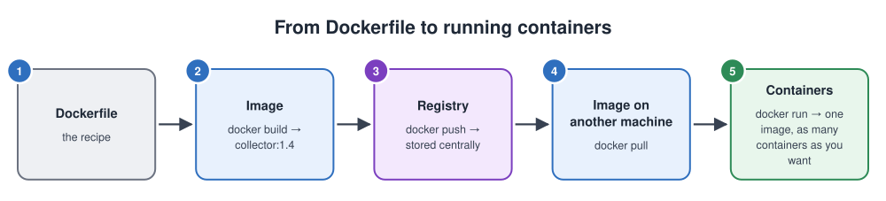
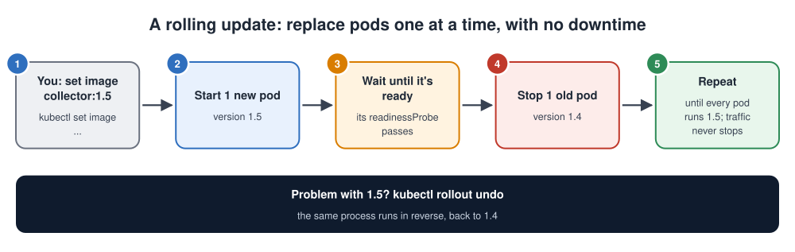
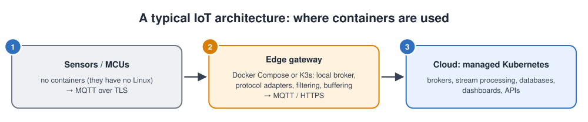

# Docker and Kubernetes

## Contents

| # | Section | In one line |
| --- | --- | --- |
| – | [Abbreviations](#abbreviations) | Every short form used in these notes, written in full |
| | **Part A: Containers and Docker** | |
| 1 | [What is a container?](#1-what-is-a-container) | Definition, block diagram, the problem containers solve, an analogy |
| 2 | [How a container really works](#2-how-a-container-really-works) | Namespaces, cgroups, layered filesystems |
| 3 | [Docker's core ideas](#3-dockers-core-ideas) | Image, container, Dockerfile, registry, volume, network |
| 4 | [Dockerfiles and image layers](#4-dockerfiles-and-image-layers) | Writing images well, with examples |
| 5 | [Everyday Docker commands](#5-everyday-docker-commands) | Run, inspect, debug, clean up |
| 6 | [Data, networking and devices](#6-data-networking-and-devices) | Volumes, ports, serial ports and GPIO |
| 7 | [Docker Compose](#7-docker-compose-several-containers-together) | A broker + collector stack in one file |
| 8 | [Containers on IoT gateways](#8-containers-on-iot-gateways-and-embedded-linux) | ARM images, limits, updates, Yocto |
| | **Part B: Kubernetes** | |
| 9 | [What is Kubernetes?](#9-what-is-kubernetes) | Orchestration and desired state |
| 10 | [Kubernetes architecture](#10-kubernetes-architecture) | Control plane and worker nodes |
| 11 | [The main Kubernetes objects](#11-the-main-kubernetes-objects) | Pod, Deployment, Service, Ingress, ConfigMap, Secret, ... |
| 12 | [Deploying an app, step by step](#12-deploying-an-app-step-by-step) | YAML, apply, scale, update, roll back |
| 13 | [Health checks, resources and self-healing](#13-health-checks-resources-and-self-healing) | Probes, requests and limits |
| 14 | [kubectl cheat sheet](#14-kubectl-cheat-sheet) | The commands you'll use daily |
| 15 | [Kubernetes at the edge](#15-kubernetes-at-the-edge-k3s-microk8s-kubeedge) | K3s, MicroK8s, KubeEdge |
| | **Part C: Putting it together** | |
| 16 | [Troubleshooting Docker and Kubernetes](#16-troubleshooting-docker-and-kubernetes) | Common failures and fixes |
| 17 | [Choosing the right tool, and staying secure](#17-choosing-the-right-tool-and-staying-secure) | systemd vs Docker vs Compose vs Kubernetes |
| 18 | [Simple code examples](#18-simple-code-examples) | A container with a health check, a ConfigMap and a Secret, a DaemonSet, a CronJob |
| 19 | [Interview quick answers](#19-interview-quick-answers) | Short answers to say out loud |

---

## Abbreviations

| Short form | Full form | In one line |
| --- | --- | --- |
| AKS / EKS / GKE | Azure Kubernetes Service / Amazon Elastic Kubernetes Service / Google Kubernetes Engine | Managed Kubernetes in the three big clouds |
| API | Application Programming Interface | A set of calls a program exposes |
| ARM | Advanced RISC Machines | The CPU family in most gateways and phones (arm64, armv7) |
| AWS | Amazon Web Services | Amazon's cloud |
| cgroups | Control groups | Kernel feature that limits CPU, memory and I/O |
| CI | Continuous Integration | The automated build server |
| CLI | Command-Line Interface | A program you type commands into |
| CPU | Central Processing Unit | The processor |
| CRI / CRI-O | Container Runtime Interface / its "Open Container Initiative" implementation | How Kubernetes talks to container runtimes |
| DNS | Domain Name System | Turns names into IP addresses |
| ECR | Elastic Container Registry | Amazon's image registry |
| etcd | "/etc distributed" | The key-value database that stores Kubernetes' state |
| GID | Group ID | The number of a Linux group |
| GPIO | General-Purpose Input/Output | A pin controlled directly by software |
| GPS | Global Positioning System | Satellite positioning receiver |
| gRPC | gRPC Remote Procedure Calls | A fast protocol for service-to-service calls |
| HTTP(S) | Hypertext Transfer Protocol (Secure) | The web protocol (over TLS) |
| I/O | Input/Output | Reading and writing disks and devices |
| I2C | Inter-Integrated Circuit | 2-wire bus for slow chips |
| IoT | Internet of Things | Connected devices |
| IP | Internet Protocol | Network addressing |
| K3s | (lightweight Kubernetes) | A small, certified Kubernetes for the edge |
| K8s | Kubernetes ("K", 8 letters, "s") | The container orchestrator |
| LAN | Local Area Network | The network inside a building |
| MCU | Microcontroller Unit | A small chip with CPU, flash and RAM inside |
| MQTT | Message Queuing Telemetry Transport | Lightweight IoT messaging protocol |
| OCI | Open Container Initiative | The standard for container images and runtimes |
| OOM | Out Of Memory | Killed for using too much memory |
| OS | Operating System | e.g. Linux |
| OTA | Over-The-Air (update) | Updating firmware remotely |
| PC | Personal Computer | A desktop or laptop computer |
| PID | Process ID | The number that identifies a process |
| PVC | PersistentVolumeClaim | A Kubernetes request for storage |
| QEMU | Quick Emulator | Runs code for another CPU |
| RAM | Random Access Memory | Working memory |
| RBAC | Role-Based Access Control | Who may do what in the cluster |
| TLS | Transport Layer Security | Encryption for network connections |
| USB | Universal Serial Bus | Standard plug-and-play connection |
| VM | Virtual Machine | A whole computer emulated in software |
| YAML | YAML Ain't Markup Language | The text format of Kubernetes and Compose files |

---

## Part A: Containers and Docker

## 1. What is a container?

> A **container** packages an application **together with everything it needs** (libraries, runtime, configuration) so it runs **the same way on any Linux machine**, isolated from other applications.

### The container block diagram


The diagram compares the two ways of running several isolated applications on one machine:

1. **Virtual machines (VMs):**
   - A **hypervisor** runs several complete, virtual computers.
   - Each VM has its **own guest operating system and kernel**, plus the app.
   - Strong isolation, but each VM is gigabytes in size and takes minutes to boot.
2. **Containers:**
   - All containers **share the host's one Linux kernel**.
   - A **container runtime** (such as containerd) starts each app as an isolated process.
   - Each container carries only the app and its libraries: megabytes in size, and it starts in seconds.
3. **The Docker workflow** (bottom of the diagram), from source to running app:
   1. Write a **Dockerfile**.
   2. Build it into an **image**.
   3. Push the image to a **registry**.
   4. Pull it and run it as a **container**.

### The problem: "it works on my machine"

| Without containers | With containers |
| --- | --- |
| The app works on the developer's PC but fails on the server: different library versions | The image carries its own libraries, so what you tested is what runs |
| Two apps need different versions of Python or OpenSSL: conflicts | Each container has its own versions |
| Setting up a new machine means a long install guide | `docker run` and it's running |
| Rolling back means reinstalling the old version by hand | Run the previous image tag |
| One app's crash or memory leak affects the others | Limits and isolation per container |

### An analogy: shipping containers

| Shipping | Software |
| --- | --- |
| Goods of every shape: furniture, food, machines | Apps in every language: C, Python, Java, Node.js |
| One **standard box** for all of them | One **standard image format**, **OCI** (Open Container Initiative) |
| Any ship, crane or truck can carry any box | Any Linux host with a container runtime can run any image |
| The port doesn't care what's inside | The host doesn't care what's inside |
| A port manager decides which ship gets which box | **Kubernetes** decides which machine runs which container |

---

## 2. How a container really works

A container is **not a tiny virtual machine**. It's a normal Linux process that the kernel restricts in three ways:

| Kernel feature | What it does | Example |
| --- | --- | --- |
| **Namespaces** | Limit what the process can **see** | Its own process list (it sees itself as **PID** 1, Process ID 1), its own network interfaces, its own hostname, its own view of the filesystem |
| **cgroups** (control groups) | Limit what the process can **use** | At most 256 MB of RAM, half a CPU core, a certain **I/O** (Input/Output) rate |
| **Layered filesystem** (OverlayFS) | Gives it its own **files**, stacked in read-only layers plus one writable layer | Its own `/usr/lib`, different from the host's |

```bash
docker run -d --name demo alpine sleep 1000
ps aux | grep "sleep 1000"     # on the HOST: just a normal process with a normal PID
docker exec demo ps            # INSIDE: it thinks it's alone; "sleep 1000" is PID 1
```

**Consequences worth remembering:**

- A container uses the **host's kernel**.
  - It can't carry its own kernel or kernel modules.
  - An **arm64 image won't run natively on an x86 host** (or the other way round) without emulation.
- Isolation is **good but weaker than a VM**, because all containers share one kernel. Don't run untrusted code as root in a container.
- Containers start in **milliseconds to seconds**, because nothing boots. A process just starts.

---

## 3. Docker's core ideas

| Idea | Meaning | Analogy |
| --- | --- | --- |
| **Image** | A read-only package: files, libraries, settings, the start command | A class, or a meal that's already cooked and frozen |
| **Container** | A running (or stopped) instance of an image, with its own writable layer | An object created from the class |
| **Dockerfile** | The text recipe used to **build** an image | Source code for the image |
| **Registry** | A server that stores images: Docker Hub, GitHub Container Registry, AWS **ECR** (Elastic Container Registry), a private one | An app store for images |
| **Tag** | A version label on an image: `collector:1.4`, `collector:latest` | A release number |
| **Volume** | Storage that **outlives** the container | An external hard drive |
| **Network** | A virtual network that connects containers; they reach each other by name | A private **LAN** (Local Area Network) |
| **Docker Engine** | The daemon (`dockerd`) that builds and runs containers, using **containerd** and **runc** underneath | The engine room |



From Dockerfile to running containers, step by step:

1. **Dockerfile:** the recipe.
2. **`docker build`** turns the recipe into an **image**, for example `collector:1.4`.
3. **`docker push`** uploads the image to a **registry**.
4. **`docker pull`** downloads it on any other machine.
5. **`docker run`** starts it as a **container**. You can start as many containers from one image as you want.

> **Standards:** Docker images follow the **OCI** format. That's why images built with Docker also run with Podman, containerd and Kubernetes.

---

## 4. Dockerfiles and image layers


### How image layers work

1. **Each instruction that changes files** (`FROM`, `WORKDIR`, `COPY`, `RUN`) creates a **layer**.
2. **The layers stack** on top of each other to make the **image**, which is **read-only**.
3. **`USER` and `CMD` don't add files.** They're **settings** stored with the image.
4. **A running container adds a thin writable layer** on top.
   - Anything written there **disappears** when the container is removed.
   - Data that must survive goes into a **volume**.
5. **Layers are cached and shared.** If only `collector.py` changes, Docker rebuilds, uploads and downloads **only the top layer**. That's why the order matters: the things that change least go first.

### The Python collector from the diagram

```dockerfile
FROM python:3.12-slim                  # small official base image
WORKDIR /app
COPY requirements.txt .                # copy the dependency list first ...
RUN pip install --no-cache-dir -r requirements.txt   # ... so this layer stays cached
COPY collector.py .                    # code last: it changes most often
USER 1000                              # don't run as root
CMD ["python", "collector.py"]
```

```bash
docker build -t collector:1.0 .
docker run -d --name collector -e MQTT_HOST=192.168.1.10 collector:1.0
```

### A multi-stage build for a C program

Compilers and headers are needed to **build**, but not to **run**. A multi-stage build keeps them out of the final image:

```dockerfile
# Stage 1: build with the full toolchain
FROM debian:bookworm AS build
RUN apt-get update && apt-get install -y --no-install-recommends \
        gcc libc6-dev libmosquitto-dev && rm -rf /var/lib/apt/lists/*
COPY collector.c /src/
RUN gcc -O2 -o /src/collector /src/collector.c -lmosquitto

# Stage 2: a small runtime image with only what's needed
FROM debian:bookworm-slim
RUN apt-get update && apt-get install -y --no-install-recommends \
        libmosquitto1 && rm -rf /var/lib/apt/lists/*
COPY --from=build /src/collector /usr/local/bin/collector
USER 1000
CMD ["collector"]
```

The final image contains the program and its runtime library, but no compiler. It's much smaller and gives an attacker less to use.

### Dockerfile instructions

| Instruction | Does |
| --- | --- |
| `FROM` | The base image to start from |
| `WORKDIR` | Set (and create) the working directory |
| `COPY` / `ADD` | Copy files from the build context into the image (prefer `COPY`) |
| `RUN` | Run a command at **build** time (install packages, compile) |
| `ENV` | Set an environment variable |
| `EXPOSE` | Document which port the app listens on (doesn't publish it) |
| `USER` | Run as this user from here on |
| `ENTRYPOINT` / `CMD` | What runs when the container **starts** |
| `HEALTHCHECK` | A command Docker runs to see whether the app is healthy |

### Best practices

| Practice | Why |
| --- | --- |
| **Small base images** (`-slim`, `alpine`, distroless) | Faster downloads, less to patch, smaller attack surface |
| **Multi-stage builds** | No compilers or build tools in the final image |
| **Order for caching**: dependencies before code | Rebuilds take seconds, not minutes |
| **`.dockerignore`** (`.git`, build output, secrets) | A smaller build context; no secrets baked into images |
| **Pin versions** (`python:3.12-slim`, not `latest`) | Reproducible builds |
| **Run as a non-root `USER`** | A compromised app has fewer rights |
| **One main process per container** | Easier restarts, logs and scaling |
| **Never put secrets in the image** | Anyone who can pull the image can read them. Pass them at run time. |
| **Log to stdout/stderr** | `docker logs` and Kubernetes collect them automatically |

---

## 5. Everyday Docker commands

| Task | Command |
| --- | --- |
| Run a container in the background, publish a port | `docker run -d --name web -p 8080:80 nginx:1.27` |
| Run interactively and remove it on exit | `docker run --rm -it debian:bookworm bash` |
| List running containers (`-a` = all) | `docker ps` · `docker ps -a` |
| Logs (follow) | `docker logs -f web` |
| Open a shell inside | `docker exec -it web sh` |
| Stop / start / restart | `docker stop web` · `docker start web` · `docker restart web` |
| Remove a container | `docker rm web` (`-f` to force a running one) |
| Details (IP, mounts, env, restart count) | `docker inspect web` |
| Live CPU and memory use | `docker stats` |
| List / pull / remove images | `docker images` · `docker pull redis:7` · `docker rmi redis:7` |
| Build and tag | `docker build -t myapp:1.0 .` |
| Tag for a registry and push | `docker tag myapp:1.0 ghcr.io/me/myapp:1.0` · `docker push ghcr.io/me/myapp:1.0` |
| Disk usage / clean up unused data | `docker system df` · `docker system prune` |

**Restart policies** keep a container running across crashes and reboots:

| Policy | Behaviour |
| --- | --- |
| `no` (default) | Never restart |
| `on-failure` | Restart only if it exits with an error |
| `always` | Always restart, including after a reboot |
| `unless-stopped` | Like `always`, unless you stopped it by hand. **A good default for gateways.** |

```bash
docker run -d --restart unless-stopped --name collector collector:1.0
```

---

## 6. Data, networking and devices

### Storing data

| Type | Syntax | Use for |
| --- | --- | --- |
| **Named volume** (managed by Docker) | `-v broker-data:/mosquitto/data` | Databases, broker persistence |
| **Bind mount** (a host directory) | `-v /etc/app/config.yaml:/app/config.yaml:ro` | Config files, development |
| **tmpfs** (RAM only) | `--tmpfs /tmp` | Scratch data; saves flash wear on gateways |

> **Anything written inside the container without a volume is lost** when the container is removed, for example during an update.

### Networking

| Need | How |
| --- | --- |
| Reach the container from outside | Publish a port: `-p 1883:1883` (host port : container port) |
| Containers talk to each other | Put them on the same user-defined network (Compose does this) and use the **container name** as the host name: `mqtt://broker:1883` |
| Use the host's network directly | `--network host` (no isolation; sometimes needed for multicast or discovery) |

### Hardware access: important for IoT

By default a container **can't see host devices**. Give it only what it needs:

```bash
# A USB GPS / serial device, readable by the container's user
docker run -d --device /dev/ttyUSB0 --group-add 20 gps-reader:1.0     # 20 = dialout GID on Debian

# An I2C bus and a GPIO chip
docker run -d --device /dev/i2c-1 --device /dev/gpiochip0 sensor-app:1.0
```

**GID** is the Group ID: here the number of the `dialout` group, whose members may open serial ports.

> **Avoid `--privileged`.** It gives the container nearly full access to the host, including all devices. Pass specific devices with `--device` instead.

### Limiting resources

```bash
docker run -d --memory 256m --cpus 0.5 --restart unless-stopped collector:1.0
```

A container that goes over its memory limit is killed (**exit code 137, OOMKilled**, i.e. Out Of Memory), which protects everything else on the gateway.

---

## 7. Docker Compose: several containers together

Real systems have several parts. **Docker Compose** describes them in one **YAML** file and starts them with one command. Here's an **MQTT** (Message Queuing Telemetry Transport) broker plus the collector, matching the [MQTT notes](MQTT_and_TLS.md):

```yaml
# compose.yaml
services:
  broker:
    image: eclipse-mosquitto:2
    ports:
      - "1883:1883"
    volumes:
      - ./mosquitto.conf:/mosquitto/config/mosquitto.conf:ro
      - broker-data:/mosquitto/data
    restart: unless-stopped

  collector:
    build: .                        # built from the Dockerfile in this folder
    environment:
      MQTT_HOST: broker             # the service name works as a host name
    depends_on:
      - broker
    devices:
      - /dev/ttyUSB0:/dev/ttyUSB0   # a serial sensor on the gateway
    group_add:
      - "20"                        # dialout group ID, to open the serial port
    restart: unless-stopped

volumes:
  broker-data:
```

```text
# mosquitto.conf (LAN testing only: see the MQTT notes for TLS)
listener 1883
allow_anonymous true
persistence true
persistence_location /mosquitto/data/
```

> **Mosquitto 2 gotcha:** without a config file that declares a `listener`, the broker in the official image only accepts connections from **inside** its own container. That's why the config file is mounted above.

| Command | Does |
| --- | --- |
| `docker compose up -d` | Build (if needed) and start everything in the background |
| `docker compose ps` | Status of each service |
| `docker compose logs -f collector` | Follow one service's logs |
| `docker compose pull && docker compose up -d` | Update to newer images |
| `docker compose down` | Stop and remove the containers (volumes are kept) |

---

## 8. Containers on IoT gateways and embedded Linux

Containers are increasingly used on **Linux-based edge gateways** (Raspberry Pi, i.MX, industrial PCs). Microcontrollers can't run them, because containers need a Linux kernel.

| Topic | What to know |
| --- | --- |
| **CPU architecture** | Gateways are often **arm64** or **armv7** (**ARM**, the processor family). An image must be built for that architecture. |
| **Multi-architecture images** | One tag, several architectures; Docker picks the right one automatically on `pull`. Build with `docker buildx build --platform linux/amd64,linux/arm64 -t ghcr.io/me/collector:1.0 --push .` To build ARM images on an x86 PC, first install **QEMU** (Quick Emulator) emulation: `docker run --privileged --rm tonistiigi/binfmt --install all`. |
| **Storage and flash wear** | Images take space. Keep them small, and put logs in RAM or size-limited volumes. Prune old images after updates. |
| **Memory** | Set `--memory` limits so one container can't starve the gateway |
| **Updates** | Updating a container means pulling a new image and restarting: small, fast and easy to roll back. Many IoT platforms work this way (AWS IoT Greengrass, Azure IoT Edge, balena). |
| **Base OS** | Keep the host minimal and read-only (built with Yocto or Buildroot), and run the applications in containers. Yocto's `meta-virtualization` layer provides Docker and containerd. |
| **Hardware access** | Pass only the needed devices (`--device`); avoid `--privileged` |
| **Boot time** | Starting containers adds a little time; usually fine for gateways, not for hard real-time tasks |

---

## Part B: Kubernetes

## 9. What is Kubernetes?

> **Kubernetes** (**K8s**: "K", then 8 letters, then "s") is a system that **runs containers across a group of machines**. You tell it the **desired state** ("3 copies of the collector, version 1.4"), and it **continuously makes reality match**: starting, restarting, moving and updating containers for you.

### An analogy: an orchestra conductor

| Orchestra | Kubernetes |
| --- | --- |
| The score says what should be played | Your YAML says what should be running |
| The conductor watches and corrects | Controllers watch and correct |
| A musician falls ill: a substitute plays the part | A pod crashes or a node dies: a replacement starts elsewhere |
| More violins for a louder passage | `kubectl scale`: more replicas under load |
| A new arrangement is introduced section by section | A **rolling update** replaces pods a few at a time |

### What problems does it solve that Docker alone doesn't?

| Need | Docker on one machine | Kubernetes |
| --- | --- | --- |
| Run on many machines | Manual, machine by machine | Schedules containers across the cluster |
| Survive a machine failure | Everything on it stops | Pods are restarted on healthy nodes |
| Scale up and down | Start and stop containers by hand | `replicas: 5`, or automatic scaling |
| Zero-downtime updates | Stop old, start new: a gap | Rolling updates with health checks, one-command rollback |
| Find other services | Fixed addresses | Services with stable **DNS** (Domain Name System) names |
| Configuration and secrets | Env vars and files per machine | ConfigMaps and Secrets, managed centrally |

---

## 10. Kubernetes architecture


### How the cluster is built

1. **You** never talk to the machines directly. You send your desired state to the **API server** (Application Programming Interface) with `kubectl`.
2. **The control plane is the brain:**

   | Part | Job |
   | --- | --- |
   | **API server** | The single front door; everything goes through it |
   | **etcd** | The database that stores the cluster's desired and actual state |
   | **Scheduler** | Picks which node each new pod should run on, based on free CPU and memory and your rules |
   | **Controller manager** | Many small control loops that keep the actual state equal to the desired state |
   | **Cloud controller** | Talks to the cloud provider for load balancers and disks |

3. **The worker nodes do the work.** Each node runs:

   | Part | Job |
   | --- | --- |
   | **kubelet** | Receives instructions and makes sure the right pods are running |
   | **kube-proxy** | Routes traffic sent to Services |
   | **containerd** | Actually runs the containers |

### The reconciliation loop: the heart of Kubernetes

1. **Desired state:** you declared 3 replicas.
2. **Observe:** a controller sees only 2 pods running.
3. **Act:** it starts one more.
4. **Repeat forever.** This is why crashed pods and dead nodes are healed automatically.

> **Kubernetes and Docker today:** Kubernetes no longer uses the Docker Engine to run containers (the "dockershim" was removed in version 1.24). It talks to **containerd** or **CRI-O** directly through the **CRI** (Container Runtime Interface). **Images built with Docker still work unchanged**, because they're standard OCI images.

---

## 11. The main Kubernetes objects


### How the objects work together, step by step

1. **Deployment** says *what* to run and *how many*: 3 pods of image version 1.4.
2. **ReplicaSet** (created by the Deployment) makes sure exactly 3 pods exist at all times.
3. **Pods** are temporary. They come and go, and their IP addresses change.
4. **Service** gives them **one stable name and address**, and spreads traffic across whichever pods currently match its **label selector** (`app=collector`).
5. **Ingress** exposes **HTTP(S)** routes (by host name and path) to the outside world, often handling **TLS** (Transport Layer Security).
6. **ConfigMaps** and **Secrets** inject settings, and **PersistentVolumes** keep data safe when pods are replaced.

### The objects in a table

| Object | What it is | Example |
| --- | --- | --- |
| **Pod** | The smallest unit: one or more containers that share a network address and storage | The collector container |
| **Deployment** | Runs N identical, **stateless** pods, with rolling updates and rollback | 3 collectors |
| **ReplicaSet** | Keeps N pods running (usually managed by a Deployment) | – |
| **StatefulSet** | Pods with **stable names and their own storage** | Databases, brokers with persistence |
| **DaemonSet** | **One pod on every node** | A log collector, a monitoring agent, an agent on every edge gateway |
| **Job / CronJob** | Runs to completion / on a schedule | A nightly data export |
| **Service** | A stable name + virtual IP that load-balances to matching pods | `collector` → 3 pods |
| **Ingress** | HTTP(S) routing from outside into Services | `api.example.com/collector` |
| **ConfigMap** | Non-secret settings as environment variables or files | The broker host name, the log level |
| **Secret** | Sensitive settings (base64-encoded, encrypted at rest if configured) | Passwords, TLS keys, device certificates |
| **PersistentVolumeClaim** (**PVC**) | A request for storage, bound to a real disk (PersistentVolume) | 10 GB for a database |
| **Namespace** | A virtual partition of the cluster | `dev`, `production`, `team-iot` |

**Service types:**

| Type | Reachable from | Use for |
| --- | --- | --- |
| **ClusterIP** (default) | Inside the cluster only | Internal services (database, broker for internal clients) |
| **NodePort** | Every node's IP on a port in 30000-32767 | Simple setups, edge clusters without load balancers |
| **LoadBalancer** | A cloud load balancer's public IP | Public services in the cloud |

---

## 12. Deploying an app, step by step

### The YAML: a Deployment and a Service

```yaml
# collector.yaml
apiVersion: apps/v1
kind: Deployment
metadata:
  name: collector
spec:
  replicas: 3
  selector:
    matchLabels:
      app: collector
  template:                          # the pod "template": what each pod looks like
    metadata:
      labels:
        app: collector               # the label the Service will look for
    spec:
      containers:
        - name: collector
          image: ghcr.io/example/collector:1.4
          env:
            - name: MQTT_HOST
              value: broker
          ports:
            - containerPort: 8080
          resources:
            requests: { cpu: 100m, memory: 64Mi }    # guaranteed, used for scheduling
            limits:   { cpu: 500m, memory: 128Mi }   # hard ceiling
          readinessProbe:                            # ready to receive traffic?
            httpGet: { path: /ready, port: 8080 }
          livenessProbe:                             # still alive? if not, restart it
            httpGet: { path: /healthz, port: 8080 }
            initialDelaySeconds: 10
---
apiVersion: v1
kind: Service
metadata:
  name: collector
spec:
  selector:
    app: collector                   # send traffic to pods with this label
  ports:
    - port: 80                       # the Service's port
      targetPort: 8080               # the container's port
```

### The lifecycle in commands

```bash
kubectl apply -f collector.yaml                  # create or update: "make it so"
kubectl get pods -l app=collector -o wide        # see the 3 pods and their nodes
kubectl scale deployment collector --replicas=5  # scale out

# Rolling update to a new version
kubectl set image deployment/collector collector=ghcr.io/example/collector:1.5
kubectl rollout status deployment/collector      # watch it replace pods one by one

# Something's wrong with 1.5? Go back.
kubectl rollout undo deployment/collector
```

### A rolling update, step by step



1. **You ask for the new version:** `kubectl set image ... collector:1.5`.
2. **Kubernetes starts one new pod** running version 1.5.
3. **It waits until that pod is ready,** meaning its readiness probe passes.
4. **It stops one old pod** running version 1.4.
5. **It repeats** until every pod runs 1.5. Traffic never stops, so users never notice a gap.
6. **If 1.5 has a problem,** `kubectl rollout undo` runs the same process in reverse, back to 1.4.

> **Declarative, not imperative:** keep the YAML files in git and always `kubectl apply` them. The files are the truth about what should run. This approach is called **GitOps** when a tool (Argo CD, Flux) applies them automatically.

---

## 13. Health checks, resources and self-healing

### Probes: how Kubernetes knows an app is healthy

| Probe | Question | If it fails |
| --- | --- | --- |
| **startupProbe** | "Have you finished starting?" | Other probes wait; after too many failures, the container restarts |
| **readinessProbe** | "Can you take traffic right now?" | The pod is **removed from the Service** (no restart). Used during start-up, overload, or a lost broker connection. |
| **livenessProbe** | "Are you stuck?" | The container is **restarted** |

Probe types: `httpGet` (an HTTP endpoint), `tcpSocket` (is the port open?), `exec` (run a command inside), `grpc` (**gRPC**, a remote procedure call protocol).

### Requests and limits

| Setting | Meaning | If exceeded |
| --- | --- | --- |
| **requests** | What the pod is **guaranteed**; the scheduler uses it to place pods | – |
| **limits: cpu** | The most CPU the pod may use | It's **throttled** (slowed down) |
| **limits: memory** | The most memory the pod may use | It's **killed**: `OOMKilled`, exit code 137 |

CPU is in millicores (`500m` = half a core). Memory is in `Mi` / `Gi` (mebibytes / gibibytes).

### What self-healing looks like

| Event | What Kubernetes does |
| --- | --- |
| A container crashes | kubelet restarts it (with increasing back-off delays) |
| A liveness probe fails | The container is restarted |
| A node dies | Its pods are recreated on other nodes |
| A pod is deleted by mistake | The ReplicaSet creates a new one |
| Traffic grows | A HorizontalPodAutoscaler adds replicas based on CPU or custom metrics |

---

## 14. kubectl cheat sheet

| Task | Command |
| --- | --- |
| Which cluster am I using? | `kubectl config get-contexts` · `kubectl config use-context edge-site-1` |
| List things | `kubectl get pods` · `get deploy,svc,ingress` · `get nodes -o wide` · `get all -n iot` |
| Details and **recent events** (the first stop when debugging) | `kubectl describe pod <name>` |
| Logs (and the previous crashed run) | `kubectl logs <pod>` · `logs -f <pod>` · `logs --previous <pod>` |
| A shell inside a pod | `kubectl exec -it <pod> -- sh` |
| Apply / delete from files | `kubectl apply -f dir/` · `kubectl delete -f collector.yaml` |
| Scale | `kubectl scale deploy collector --replicas=5` |
| Update the image / watch / roll back | `kubectl set image ...` · `rollout status ...` · `rollout undo ...` |
| Reach a service from your PC | `kubectl port-forward svc/collector 8080:80` |
| Cluster events, newest last | `kubectl get events --sort-by=.lastTimestamp` |
| Resource usage (needs metrics-server) | `kubectl top pods` · `kubectl top nodes` |
| Output as YAML | `kubectl get deploy collector -o yaml` |
| Built-in documentation | `kubectl explain deployment.spec.strategy` |

Add `-n <namespace>` to work in a namespace other than `default`.

---

## 15. Kubernetes at the edge: K3s, MicroK8s, KubeEdge

Full Kubernetes is heavy for a small gateway. Lighter distributions bring the same API to the edge:

| Distribution | What it is | Good for |
| --- | --- | --- |
| **K3s** | A lightweight, certified Kubernetes in a single binary; runs well on ARM (Raspberry Pi, industrial gateways) | Edge sites, small clusters, labs |
| **MicroK8s** | A small Kubernetes from Canonical, installed as a snap | Workstations, small edge clusters |
| **KubeEdge** | Keeps the control plane in the cloud and runs lightweight agents on edge nodes; handles **unreliable connectivity** and has device-management features | Many remote gateways managed centrally |
| **Managed cloud K8s**: **EKS** (Amazon Elastic Kubernetes Service), **AKS** (Azure Kubernetes Service), **GKE** (Google Kubernetes Engine) | The provider runs the control plane | The cloud back-end: brokers, databases, dashboards |

### A typical IoT architecture



1. **Sensors and MCUs** (Microcontroller Units) run firmware, not containers, because they have no Linux. They send data with MQTT over TLS.
2. **The edge gateway** runs a few containers with Docker Compose or K3s: a local broker, protocol adapters, filtering and buffering. It forwards data over MQTT or HTTPS.
3. **The cloud** runs many services on managed Kubernetes: brokers, stream processing, databases, dashboards and APIs.

Containers appear from step 2 onwards, wherever there's a Linux machine.

> **Don't over-engineer.** A single gateway running three containers is well served by **Docker Compose**, or even **systemd**. Kubernetes pays off when you have **many** machines, need automatic failover, or run a fleet of edge sites with the same tooling as the cloud.

---

## Part C: Putting it together

## 16. Troubleshooting Docker and Kubernetes

### Docker

| Symptom | Likely cause | Check / fix |
| --- | --- | --- |
| The container exits immediately | The main process ends or crashes | `docker ps -a` for the exit code; `docker logs <name>` |
| **Exit code 137** | Killed: the **out-of-memory** limit, or `docker kill` | `docker inspect <name> \| grep -i oom`; raise the limit or fix the leak |
| Exit code 126 / 127 | Command not executable / not found in the image | Check `CMD`/`ENTRYPOINT`, file permissions, architecture |
| **`exec format error`** | The image was built for **another CPU architecture** (an x86 image on an ARM gateway) | Build a multi-arch image with `buildx` |
| `port is already allocated` | Another container or process uses that host port | `ss -tulpn`; pick another host port |
| The app can't reach another container | Not on the same network, or using `localhost` | Use the service or container name (`broker`), not `localhost` |
| "Permission denied" on a device or volume | The container user lacks rights | `--device`, `--group-add`, fix ownership of bind mounts |
| Data gone after an update | Written to the container layer, not a volume | Use volumes for anything that must persist |
| Disk full on the gateway | Old images, stopped containers, logs | `docker system df`; `docker system prune`; log size limits |
| Code changes not in the image | A stale cache or the wrong build context | `docker build --no-cache`; check `.dockerignore` |

### Kubernetes: read the pod status

```bash
kubectl get pods                 # the STATUS column
kubectl describe pod <name>      # the Events section at the bottom explains why
```

| Status | Meaning | Usual cause | Fix |
| --- | --- | --- | --- |
| **Pending** | Not scheduled on any node yet | Not enough CPU/memory for the **requests**, a node selector or taint mismatch, a PVC not bound | `describe pod` events; lower requests; add nodes; fix storage |
| **ContainerCreating** (for a long time) | Scheduled, but can't start | A volume can't mount, the image is still pulling | `describe pod` |
| **ImagePullBackOff** / **ErrImagePull** | Can't download the image | Wrong name or tag, a private registry without credentials, wrong architecture | Fix the image name; add `imagePullSecrets` |
| **CrashLoopBackOff** | Starts, crashes, restarts, over and over | An app error, missing config, a dependency it can't reach, a failing liveness probe | `kubectl logs --previous <pod>`; check env and ConfigMaps |
| **OOMKilled** (last state) | Exceeded its memory limit | A leak, or the limit is too low | Raise `limits.memory`, or fix the app |
| **CreateContainerConfigError** | A referenced ConfigMap or Secret is missing | A typo, or it was created in another namespace | Create it in the same namespace |
| **Running but 0/1 READY** | The readiness probe is failing | App not ready, wrong probe path or port | Check the probe; `kubectl exec` and curl it |
| **Evicted** | The node ran low on memory or disk | Node pressure | Set requests/limits; free node disk |

**The Service doesn't answer?**

| Check | Command |
| --- | --- |
| Does the Service have endpoints (matching, ready pods)? | `kubectl get endpoints collector` (empty = the **label selector doesn't match**, or pods aren't ready) |
| Do the labels match exactly? | `kubectl get pods --show-labels` vs the Service `selector` |
| The right `targetPort`? | It must equal the port the container really listens on |
| Test from inside the cluster | `kubectl run tmp --rm -it --image=busybox -- wget -qO- http://collector` |

---

## 17. Choosing the right tool, and staying secure

### Which tool for which job?

| Situation | Good choice | Why |
| --- | --- | --- |
| One app on an embedded device, tight resources | **A systemd service** (no containers) | The smallest footprint, the simplest |
| A few apps on one gateway, updated independently | **Docker / Podman + Compose** | Isolation, easy updates and rollback |
| Many gateways or servers, high availability | **Kubernetes** (K3s at the edge, managed K8s in the cloud) | Scheduling, self-healing, rolling updates, one API everywhere |
| Microcontrollers | **Neither**: firmware + **OTA** (Over-The-Air) updates ([Bootloader.md](Bootloader.md)) | Containers need a Linux kernel |

**Docker vs Podman:** Podman runs the same images and has a Docker-compatible **CLI** (Command-Line Interface), but needs **no background daemon** and runs **rootless** by default. It's a popular choice on hardened systems.

### Security checklist

| ✔ | Item |
| --- | --- |
| ☐ | Use small, **pinned** base images from trusted sources; rebuild regularly for security patches |
| ☐ | **Scan images** for known vulnerabilities (e.g. Trivy, Grype) in **CI** (Continuous Integration) |
| ☐ | Run containers as a **non-root user**; drop unneeded capabilities |
| ☐ | **No secrets in images or git**: use run-time env vars, Docker secrets, or Kubernetes Secrets (with encryption at rest) |
| ☐ | Avoid `--privileged`; pass specific `--device`s only |
| ☐ | Set **memory and CPU limits** |
| ☐ | Use a **read-only root filesystem** for the container where possible (`--read-only`) |
| ☐ | Restrict network access: publish only the needed ports; Kubernetes **NetworkPolicies** |
| ☐ | Sign images and verify the signatures before deploying (e.g. cosign) |
| ☐ | Kubernetes: **RBAC** (Role-Based Access Control) with least privilege; don't give apps cluster-admin |

---

## 18. Simple code examples

Small, complete examples that add to the sections above: a container with a health check, settings kept out of the Deployment, and two object types used a lot on edge systems. Multi-architecture builds for Arm boards are in [section 8](#8-containers-on-iot-gateways-and-embedded-linux).

### Example 1: A tiny app, containerised properly

`app.py`: a web server with a health endpoint, using only Python's standard library.

```python
from http.server import BaseHTTPRequestHandler, HTTPServer

class Handler(BaseHTTPRequestHandler):
    def do_GET(self):
        body = b"ok\n" if self.path == "/health" else b"hello from the container\n"
        self.send_response(200)
        self.end_headers()
        self.wfile.write(body)

HTTPServer(("", 8080), Handler).serve_forever()
```

`Dockerfile`:

```dockerfile
FROM python:3.12-slim
WORKDIR /app
COPY app.py .
RUN useradd --no-create-home appuser     # never run as root inside the container
USER appuser
EXPOSE 8080
HEALTHCHECK --interval=30s --timeout=3s \
    CMD python -c "import urllib.request; urllib.request.urlopen('http://localhost:8080/health')"
CMD ["python", "app.py"]
```

**Build, run and check it:**

```bash
docker build -t hello-web:1.0 .
docker run -d -p 8080:8080 --name web hello-web:1.0
curl localhost:8080                      # hello from the container
docker ps                                # STATUS shows "(healthy)" after the first check
docker logs web                          # the server's request log
```

### Example 2: Settings from a ConfigMap and a Secret

The Deployment and Service from [section 12](#12-deploying-an-app-step-by-step) set `MQTT_HOST` directly in the YAML. To keep settings **out of the image and the Deployment**, put them in a ConfigMap (normal settings) and a Secret (passwords and keys):

```yaml
apiVersion: v1
kind: ConfigMap
metadata:
  name: collector-config
data:
  MQTT_HOST: "broker"
  LOG_LEVEL: "info"
---
apiVersion: v1
kind: Secret
metadata:
  name: collector-secret
type: Opaque
stringData:                      # plain text here; Kubernetes stores it base64-encoded
  API_KEY: "change-me"
```

Then, in the collector's container in the Deployment, replace the `env:` list with:

```yaml
          envFrom:                                   # every key becomes an environment variable
            - configMapRef: { name: collector-config }
            - secretRef:    { name: collector-secret }
```

**Apply and check it:**

```bash
kubectl apply -f collector-config.yaml -f collector.yaml
kubectl exec deploy/collector -- env | grep -E "MQTT_HOST|LOG_LEVEL|API_KEY"   # the settings arrived
```

After changing a ConfigMap, run `kubectl rollout restart deployment/collector`: environment variables are read only when a pod starts.

### Example 3: A DaemonSet: one agent on every node

A DaemonSet runs **exactly one pod per node**, which suits monitoring or log agents, and gateway software at the edge.

```yaml
apiVersion: apps/v1
kind: DaemonSet
metadata:
  name: node-agent
spec:
  selector:
    matchLabels: { app: node-agent }
  template:
    metadata:
      labels: { app: node-agent }
    spec:
      containers:
        - name: agent
          image: busybox:1.36
          env:
            - name: NODE_NAME
              valueFrom: { fieldRef: { fieldPath: spec.nodeName } }   # which node this pod is on
          command: ["sh", "-c", "while true; do echo \"$NODE_NAME load: $(cat /host/proc/loadavg)\"; sleep 60; done"]
          volumeMounts:
            - { name: proc, mountPath: /host/proc, readOnly: true }
      volumes:
        - name: proc
          hostPath: { path: /proc }                                   # the node's own /proc
```

**Check it:** `kubectl get pods -l app=node-agent -o wide` shows one pod per node. Add a node, and a new pod starts on it automatically.

### Example 4: A CronJob: a task on a schedule

```yaml
apiVersion: batch/v1
kind: CronJob
metadata:
  name: cleanup
spec:
  schedule: "0 2 * * *"              # every day at 02:00 (cron format)
  jobTemplate:
    spec:
      template:
        spec:
          restartPolicy: OnFailure   # retry if the task fails
          containers:
            - name: cleanup
              image: busybox:1.36
              command: ["sh", "-c", "echo cleaning old data; date"]
```

**Test it without waiting until 02:00:**

```bash
kubectl create job cleanup-now --from=cronjob/cleanup
kubectl logs job/cleanup-now
```

---

## 19. Interview quick answers

**Q: What is a container, and how is it different from a virtual machine?**

> "A container packages an app with its libraries and runs it as an isolated process on the host's kernel. Namespaces control what it can see, cgroups control what it can use, and a layered filesystem gives it its own files. A VM virtualises the whole machine and runs its own kernel on a hypervisor. VMs give stronger isolation, but are gigabytes in size and take minutes to boot. Containers are megabytes and start in seconds."

**Q: Image vs container?**

> "An image is a read-only, layered package: files, libraries and the start command. A container is a running instance of an image, with a thin writable layer on top. You can run many containers from one image, and anything written in the container layer is lost when the container is removed, unless it's in a volume."

**Q: How do you make Docker images small and fast to build?**

> "Use a slim or distroless base image, use multi-stage builds so compilers stay out of the final image, order the Dockerfile so dependencies come before the code to make good use of the layer cache, add a `.dockerignore`, and combine package install and clean-up in one RUN step."

**Q: How would you run containers on an ARM IoT gateway?**

> "Build multi-architecture images with `docker buildx` for linux/arm64 and armv7, so the same tag works on the gateway and on x86. Run them with a restart policy and memory limits, pass only the devices they need with `--device` instead of `--privileged`, keep persistent data in volumes and logs size-limited to protect the flash, and update by pulling a new image tag, which also makes rollback easy. For a few services, Docker Compose is enough."

**Q: What is Kubernetes and why use it?**

> "A container orchestrator. You declare the desired state (which images, how many replicas, how to expose them) and Kubernetes' controllers keep the actual state matching it across a cluster. You get scheduling across nodes, self-healing when containers or nodes fail, scaling, rolling updates with rollback, service discovery, and central configuration and secrets."

**Q: Explain the Kubernetes architecture.**

> "The control plane has the API server as the single entry point, etcd storing the cluster state, the scheduler placing pods on nodes, and the controller manager running reconciliation loops. Each worker node runs the kubelet, which starts and monitors pods, kube-proxy for Service networking, and a container runtime like containerd."

**Q: Pod vs Deployment vs Service?**

> "A pod is the smallest unit: one or more containers sharing a network address. A Deployment manages identical, stateless pods through a ReplicaSet and handles scaling, rolling updates and rollback. A Service gives a changing set of pods one stable name and virtual IP, and load-balances to the pods whose labels match its selector."

**Q: What's the difference between liveness and readiness probes?**

> "Readiness answers 'can you take traffic now?'. If it fails, the pod is removed from the Service's endpoints but not restarted. Liveness answers 'are you stuck?'. If it fails, the container is restarted. A startup probe protects slow-starting apps from being killed too early."

**Q: A pod is in CrashLoopBackOff. How do you debug it?**

> "`kubectl describe pod` for the events and the last state, including exit code and OOMKilled, then `kubectl logs --previous` to see why the last run crashed. Common causes are a missing ConfigMap or Secret value, a dependency the app can't reach, a wrong command, a memory limit that's too low (exit 137), or a liveness probe that fails too early."

**Q: Does Kubernetes still use Docker?**

> "Not the Docker Engine as its runtime. The dockershim was removed in 1.24, and Kubernetes now talks to containerd or CRI-O through the Container Runtime Interface. Docker is still widely used to build images, and those images run unchanged because they follow the OCI standard."

**Q: When would you NOT use Kubernetes?**

> "On a single small device or gateway with a handful of services, where Docker Compose or systemd is simpler and lighter. On microcontrollers, which can't run containers at all. And whenever the team doesn't need multi-node scheduling and failover. Kubernetes' complexity pays off for fleets and high availability."

---

**Related notes:** [Kernal.md](Kernal.md) · [MQTT_and_TLS.md](MQTT_and_TLS.md) · [Linux_Fundamentals_and_Troubleshooting.md](Linux_Fundamentals_and_Troubleshooting.md) · [Bootloader.md](Bootloader.md)
