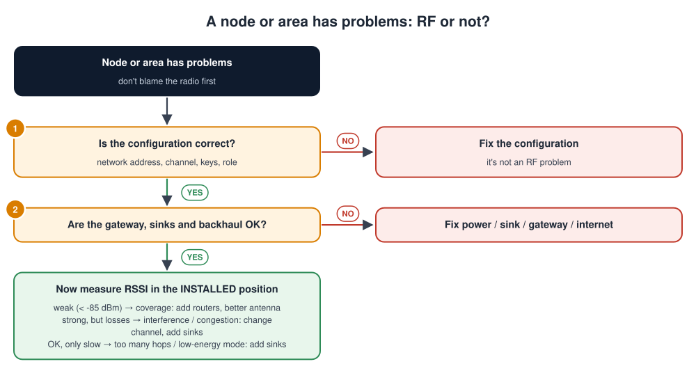

# Wirepas Mesh and IoT Data Models (ZCL, Matter / CHIP TLV)

## Contents

| # | Section | In one line |
| --- | --- | --- |
| – | [Abbreviations](#abbreviations) | Every short form used in these notes, written in full |
| | **Part A: The Wirepas mesh network** | |
| 1 | [What is Wirepas?](#1-what-is-wirepas) | Definition, block diagram, analogy, comparison with other IoT radios |
| 2 | [Nodes, sinks, gateways and the backend](#2-nodes-sinks-gateways-and-the-backend) | Roles and addressing |
| 3 | [How routing works](#3-how-routing-works) | Cost-based, decentralised, self-healing |
| 4 | [How data flows end to end](#4-how-data-flows-end-to-end) | From a sensor to the cloud and back |
| 5 | [Diagnostics, OTAP and security](#5-diagnostics-otap-and-security) | Managing a large network |
| 6 | [RF basics and RF symptoms](#6-rf-basics-and-rf-symptoms) | Recognising and fixing radio problems |
| | **Part B: The application data model** | |
| 7 | [Why a data model? And a word of warning](#7-why-a-data-model-and-a-word-of-warning) | Same words, different meanings |
| 8 | [ZCL: endpoints, clusters, attributes, commands](#8-zcl-endpoints-clusters-attributes-commands) | The Zigbee Cluster Library model |
| 9 | [Matter (CHIP) data model and interaction model](#9-matter-chip-data-model-and-interaction-model) | Read, subscribe, write, invoke, report |
| 10 | [CHIP / Matter TLV encoding](#10-chip--matter-tlv-encoding) | Control byte, tags, types, containers |
| 11 | [The report data message, byte by byte](#11-the-report-data-message-byte-by-byte) | ZCL, Matter, and a custom report over Wirepas |
| 12 | [Designing your own report message](#12-designing-your-own-report-message-over-wirepas) | Practical rules |
| | **Part C: Putting it together** | |
| 13 | [End-to-end troubleshooting](#13-end-to-end-troubleshooting) | "No data in the cloud" and decoding problems |
| 14 | [Simple code examples](#14-simple-code-examples) | Build a TLV report on the node, send it into the mesh, decode it in the backend, send a message down |
| 15 | [Interview quick answers](#15-interview-quick-answers) | Short answers to say out loud |

---

## Abbreviations

| Short form | Full form | In one line |
| --- | --- | --- |
| AES | Advanced Encryption Standard | The standard symmetric encryption (AES-128 on the radio) |
| API | Application Programming Interface | Functions a library or service offers |
| APS | Application Support sublayer | The Zigbee layer that carries endpoint and cluster IDs |
| BLE | Bluetooth Low Energy | Low-power short-range radio |
| CHIP | Connected Home over IP | The project name Matter was developed under |
| dBm | Decibel-milliwatts | Unit of radio signal power (0 dBm = 1 mW) |
| DECT NR+ | Digital Enhanced Cordless Telecommunications, New Radio+ | A non-cellular 5G standard for massive IoT |
| ETSI | European Telecommunications Standards Institute | Publishes DECT-2020 NR |
| GHz | Gigahertz | Radio frequency (2.4 GHz band) |
| IAS | Intruder Alarm System | ZCL security clusters (IAS Zone) |
| IB | Information Block | A building block of a Matter message |
| ID | Identifier | A number that names something |
| IoT | Internet of Things | Connected devices |
| IP / IPv6 | Internet Protocol (version 6) | Network addressing |
| JSON | JavaScript Object Notation | A text data format (too big for mesh payloads) |
| LED | Light-Emitting Diode | An indicator light |
| LoRaWAN | Long Range Wide Area Network | Long-range, low-rate star network |
| MCU | Microcontroller Unit | Small chip with CPU, flash and RAM inside |
| MQTT | Message Queuing Telemetry Transport | Lightweight IoT messaging protocol |
| OTAP | Over-The-Air Programming | Wirepas firmware update over the mesh |
| PER | Packet Error Rate | Share of packets that fail |
| protobuf | Protocol Buffers | Google's compact binary message format |
| QoS | Quality of Service | Priority/delivery class of a message |
| RF | Radio Frequency | The radio side of the system |
| RSSI | Received Signal Strength Indicator | How strong a received signal is, in dBm |
| SDK | Software Development Kit | Libraries and tools for developers |
| SoC | System on Chip | A chip with CPU, radio and peripherals built in |
| TCP / UDP | Transmission Control Protocol / User Datagram Protocol | Internet transport protocols |
| TLS | Transport Layer Security | Encryption for network connections |
| TLV | Tag, Length, Value | A self-describing binary encoding |
| UART | Universal Asynchronous Receiver-Transmitter | The serial link between sink and gateway |
| UPS | Uninterruptible Power Supply | Battery backup for a gateway |
| USB | Universal Serial Bus | Standard plug-and-play connection |
| UTF-8 | Unicode Transformation Format, 8-bit | The standard text encoding |
| WNT | Wirepas Network Tool | Wirepas's network management and diagnostics tool |
| ZCL | Zigbee Cluster Library | The catalogue of standard device features |
| ZDO | Zigbee Device Object | Zigbee's device-management function on endpoint 0 |

---

## Part A: The Wirepas mesh network

## 1. What is Wirepas?

> **Wirepas** (Wirepas Mesh, originally *Wirepas Massive*) is a **decentralised wireless mesh networking stack** for large IoT installations. Thousands to millions of low-power devices **relay each other's messages**, **choose their own routes**, and deliver data to one or more **sinks** without a central coordinator.

These notes cover two things you need together when building large wireless sensor networks:

- **Part A, the network:** how Wirepas, a self-organising wireless **mesh**, moves data: nodes, sinks, gateways, routing, and how to recognise and fix **RF** (radio frequency) problems.
- **Part B, the meaning of the data:** how the bytes inside each message are structured, using the **endpoint → cluster → attribute** model from **ZCL** (Zigbee Cluster Library) and **Matter** (formerly **CHIP**, Connected Home over IP), encoded in **TLV** (Tag, Length, Value), and sent as a **report data message**.

> **About accuracy:** Wirepas is a commercial stack. Exact API names, reserved endpoint numbers, payload limits and gateway topic formats depend on the **SDK and gateway version** you use, so check the official Wirepas documentation for your release. The ZCL and Matter encodings shown here follow those specifications. Your product's own message format is defined by **your** application specification.

### The Wirepas block diagram


How the network is built, from the sensors to the cloud:

1. **Non-router nodes** (usually battery-powered sensors) attach to a nearby router. They send their own data and sleep most of the time.
2. **Router nodes** relay messages for each other, hop by hop. Together they form the mesh.
3. **Sinks** are the exits of the mesh. There are usually two or more, and each connects over a **UART** (serial) link to a Linux **gateway**.
4. **The gateway** runs a **sink service** and a **transport service**. They forward the data over **MQTT** (Message Queuing Telemetry Transport) protected by **TLS** (Transport Layer Security).
5. **The backend** contains an MQTT broker, the network management tool and your cloud application.
6. **Two key rules:**
   - There is **no central coordinator**: every node chooses its own route to any sink.
   - **Downlink** traffic (commands, configuration, firmware) enters the mesh through the sinks.

### An analogy: passing notes in a stadium

| Stadium | Wirepas mesh |
| --- | --- |
| People pass a note row by row towards the exit | Nodes relay a message hop by hop towards a sink |
| Each person hands it to whichever neighbour is closest to an exit | Each node picks the neighbour with the **lowest route cost** |
| There are several exits | There are several **sinks** |
| If someone leaves, notes flow around them | If a node or link fails, routes **heal themselves** |
| Nobody plans all the routes centrally | **No central coordinator**: each node decides locally |
| A crowded aisle slows down | Congestion near a sink increases latency: add sinks |

### Why a mesh, and why Wirepas?

| Property | Why it matters |
| --- | --- |
| **Range through relaying** | Every router extends coverage; no need for a strong radio at every device |
| **Decentralised routing** | No single point of failure; scales to very large networks |
| **Density** | Designed for many devices close together: buildings, factories, cities |
| **Low power** | Non-router nodes sleep; with low-energy operation even routers can run on batteries |
| **Self-healing** | Routes adapt automatically when devices move, fail or are added |
| **Runs on common radio chips** | Radio **SoCs** (Systems on Chip) such as Nordic nRF52 or Silicon Labs EFR32, usually in the 2.4 GHz band (sub-GHz variants exist) |
| **Standardised successor** | Wirepas also developed the stack for **DECT NR+** (Digital Enhanced Cordless Telecommunications New Radio+, standardised by **ETSI**, the European Telecommunications Standards Institute, as DECT-2020 NR), a non-cellular 5G standard for massive IoT |

Typical uses: smart metering, lighting control, asset tracking and indoor positioning, building sensors, warehouse and factory monitoring.

### How it compares

| | **Wirepas** | **Zigbee** | **Thread / Matter** | **BLE** (Bluetooth Low Energy) **Mesh** | **LoRaWAN** (Long Range Wide Area Network) |
| --- | --- | --- | --- | --- | --- |
| Topology | Mesh, decentralised | Mesh with a coordinator | IP mesh (IPv6) with border routers | Flooding-based mesh | Star (devices → gateways) |
| Scale focus | Very large, dense networks | Home / building | Home / building | Home / building | Wide area, low data rate |
| IP to the device | No (gateway translates) | No | **Yes** (IPv6) | No | No |
| Application data model | Defined by the product (e.g. TLV, ZCL-style) | ZCL | Matter data model (from ZCL) | Mesh models | Defined by the product |
| Range per hop | Short (tens of metres indoors) | Short | Short | Short | Kilometres |

---

## 2. Nodes, sinks, gateways and the backend

### Roles in the network

| Role | What it does | Power | Example device |
| --- | --- | --- | --- |
| **Non-router node** (subnode) | Sends its own data; **doesn't relay** others | Lowest: sleeps most of the time | Battery temperature sensor, asset tag |
| **Router node** (headnode) | Relays other nodes' data and offers a route to the sink | Higher: must listen regularly (mains, or battery in low-energy mode) | Light fitting, mains-powered meter |
| **Autorole** | The node decides by itself whether to act as a router, depending on the network's needs | Varies | Mixed deployments |
| **Sink** | The network's exit and entry point: receives uplink data, injects downlink data | Mains powered, always on | A Wirepas module on a UART/USB interface inside a gateway |
| **Gateway** | Linux computer connecting sinks to the backend | Mains | Industrial gateway, Raspberry Pi-class box |
| **Backend** | MQTT broker, network management tool, your application | Cloud or on-premises | Broker + **WNT** (Wirepas Network Tool) + your services |

> **Plan router density.** Non-router nodes need a router (or sink) in reach, and routers need other routers or a sink in reach. Most coverage problems are "not enough routers in the right places".

### Addressing: the numbers every message carries

| Identifier | Meaning | Rule of thumb |
| --- | --- | --- |
| **Network address** | Identifies *your* network; nodes only join a network with the same address | Same on every device of one network |
| **Network channel** | Radio channel the network uses | Same on every device of one network |
| **Node address** | Unique ID of each device in the network | Unique per device; often derived from a serial number |
| **Endpoints (source / destination)** | Numbers like port numbers that say **which application stream** a message belongs to | Your app picks its own; some values are reserved by the stack for its own services |
| **Network keys** | Encryption and authentication keys shared by the network | Provisioned securely; never hard-coded in public firmware |

> **Wirepas "endpoints" are like TCP/UDP ports.** They separate data streams: sensor reports on one endpoint, configuration commands on another. They are **not** ZCL or Matter endpoints ([section 7](#7-why-a-data-model-and-a-word-of-warning)).

---

## 3. How routing works

![Routing in a Wirepas mesh: each router advertises its cost to reach a sink; router A has cost 2 and B has cost 1; router C can reach the sink via A for a total of 3 or via B for 4, so it chooses A, and a sensor joins C; when the link from A to the sink is lost, C automatically re-routes via B without any central re-planning; terms: a router with its attached non-router nodes is sometimes called a cluster in mesh terminology, hop count and route cost appear in diagnostics, uplink goes to any sink and downlink comes from a sink](images/wirepas_routing.svg)

### How routing works, step by step

1. **Choosing a route.** Every link has a **cost**: worse link quality or a busier router means a higher cost. Routers advertise **their total cost to reach a sink**. Router C adds its own link cost to each neighbour's advertised cost (via A: 2 + 1 = 3, via B: 1 + 3 = 4) and picks the **cheapest**, A. The sensor then attaches to C.
2. **Self-healing.** When A's link to the sink disappears, A's cost rises, and C **simply switches** to B. Nothing central has to recalculate anything, so the network keeps working as devices fail, move or join.
3. **A word on vocabulary.** A router with the non-router nodes attached to it is sometimes called a *cluster* in mesh terms. That is a completely different thing from a ZCL or Matter *cluster*.

### Routing concepts

| Concept | Meaning |
| --- | --- |
| **Decentralised routing** | Each node makes its own routing decision from what its neighbours advertise |
| **Route cost** | A number combining link quality (and load) along the path; lower is better |
| **Hop count** | How many relays a message crosses to reach a sink |
| **Uplink (anycast to sinks)** | A node sends "to the sink"; the network delivers it to the **best available** sink |
| **Downlink** | From a sink to one node (unicast) or to many nodes (broadcast) |
| **Neighbours** | Nearby nodes a node can hear; reported in diagnostics with their signal strength |
| **Multiple sinks** | Share the load and provide redundancy; a key tool for scaling |

### Energy vs latency

| Operating choice | Behaviour | Trade-off |
| --- | --- | --- |
| **Low-energy operation** | Routers wake on a schedule; long battery life | Messages wait for the next wake-up, so **latency is higher** |
| **Low-latency operation** | Routers listen more; messages move quickly | **More power**; usually needs mains-powered routers |

Choose per network, or per device role, depending on whether you need battery life (sensors, tags) or responsiveness (lighting commands).

---

## 4. How data flows end to end

1. **Uplink (sensor to cloud):**
   1. The sensor node sends a report on its **Wirepas endpoint**, with a **QoS** (Quality of Service) class.
   2. The routers relay it hop by hop along the cheapest route.
   3. It arrives at the best available sink.
   4. The sink passes it to the gateway over UART.
   5. The gateway publishes it over MQTT with TLS, as a **protobuf** (Protocol Buffers) message. The message carries the node address, the endpoints, the hop count and the payload.
   6. The backend decodes the payload and stores it, raises alerts and updates dashboards.
2. **Downlink (cloud to device):** a command or configuration change travels the same way in reverse: backend → gateway → UART → sink → mesh → the node.


### What the application on a node does

On a **single-MCU** (Microcontroller Unit) design, your application runs on the same radio chip as the Wirepas stack and uses the stack's library API to:

- **send data** (destination address, endpoints, QoS, payload),
- **receive data** for its endpoints (a callback),
- read its role, neighbours and network state,
- sleep between reports to save energy.

On a **dual-MCU** design, your application runs on a separate microcontroller and talks to the Wirepas module over UART. A **sink** is essentially a Wirepas device in this role, attached to the gateway.

### Payloads are small

A Wirepas data packet carries only **about 100 bytes** of application payload (the exact maximum depends on the stack version and radio). Keep report messages compact: binary TLV or ZCL, not JSON.

### What the gateway sends to the cloud

The Wirepas open-source gateway publishes **protobuf** messages over **MQTT**. Received data includes the source node address, source and destination endpoints, travel time, hop count and the payload. Topics follow a structured pattern along the lines of:

```text
gw-event/received_data/<gateway_id>/<sink_id>/<network_address>/<source_ep>/<destination_ep>
gw-request/send_data/<gateway_id>/<sink_id>          ← the backend asks the gateway to send downlink data
```

> Check the gateway API documentation for your version for the exact topics and protobuf definitions. Because each stream has its own **endpoints** in the topic, your cloud app can subscribe only to the reports it cares about.

---

## 5. Diagnostics, OTAP and security

### Diagnostics

Nodes can periodically send **diagnostic data** to the sinks. It typically includes:

| Diagnostic | Tells you |
| --- | --- |
| **Role** | Router or non-router right now |
| **Next hop / neighbours + RSSI** | Who it talks to, and how strong those links are |
| **Hop count, route cost** | How far from a sink, and how good the path is |
| **Travel time / latency** | How long messages take to reach a sink |
| **Buffer usage, dropped messages** | Whether the node or path is congested |
| **Supply / battery voltage** | Remaining battery; brown-out risk |
| **Scan and connection statistics** | Stability of links over time |

A network management tool (such as Wirepas's **WNT**, Wirepas Network Tool) shows these as a map and graphs: the first place to look when something is wrong.

### OTAP: Over-The-Air Programming

Firmware (stack and application) is updated **over the mesh**:

1. The backend sends a new firmware image (the **scratchpad**) to the sinks.
2. The image **spreads through the network**, node to node, into each node's scratchpad storage area.
3. The backend tells the network to **activate** it (optionally at a scheduled time).
4. Each node verifies the image and reboots into the new version, using its bootloader.

> This is the mesh version of the ideas in [Bootloader.md](Bootloader.md): verify before running, never brick the device, and plan how to recover if the new version misbehaves.

### Security

| Layer | Protection |
| --- | --- |
| **Radio (network) layer** | Messages are **encrypted and authenticated** with network keys (**AES-128**, Advanced Encryption Standard with a 128-bit key); devices without the keys can't join or read traffic |
| **Firmware** | Signed / verified images for OTAP |
| **Gateway → cloud** | **MQTT over TLS** with certificates ([MQTT_and_TLS.md](MQTT_and_TLS.md)) |
| **Application** | Optional end-to-end protection of sensitive payloads; validate every message in the backend |
| **Keys and provisioning** | Load keys securely at manufacturing; protect debug ports; rotate keys if a device is compromised |

---

## 6. RF basics and RF symptoms

### Five RF words to know

| Term | Meaning | Rule of thumb (typical 2.4 GHz radios) |
| --- | --- | --- |
| **RSSI** (Received Signal Strength Indicator) | How strong the received signal is, in **dBm** (decibel-milliwatts) (negative numbers; closer to 0 = stronger) | better than **-70 dBm** excellent · **-70 to -85** good · **-85 to -92** marginal · worse than **-92** unreliable |
| **Sensitivity** | The weakest signal the radio can still decode | Often around -95 to -100 dBm; check your radio's datasheet |
| **Noise floor / interference** | Background radio energy (Wi-Fi, Bluetooth, microwave ovens, other meshes) | A high noise floor makes even "good" RSSI links lossy |
| **PER** (Packet Error Rate) | Share of packets that fail | A few percent is normal; rising PER = trouble |
| **Link budget** | Transmit power + antenna gains − losses − sensitivity | Every wall, floor, metal cabinet and human body eats into it |

**What weakens a 2.4 GHz link:** distance, walls (concrete and metal especially), metal enclosures and shelves, water (including people), detuned or badly oriented antennas, and interference on the same frequencies.

### RF symptoms: what you see, why, and what to do

| Symptom | What you'll see | Likely causes | Check | Fix |
| --- | --- | --- | --- | --- |
| **Node never joins** | Device missing from diagnostics | Wrong network address, channel or keys (config, not RF!); out of range; antenna blocked by the enclosure | Config values; RSSI to the nearest router during a site test | Correct config; add a router nearby; improve antenna placement |
| **Works on the bench, fails on site** | Good in the lab, missing or lossy after installation | Metal cabinets, concrete, installed orientation, antenna detuned by the housing | Measure RSSI **in the final installed position** | External antenna, different mounting, extra routers; do a **site survey** before rollout |
| **Intermittent gaps in data** | Missing reports, rising PER | Interference (Wi-Fi on overlapping channels, microwaves), marginal links, moving obstacles (people, forklifts, doors) | Does it correlate with time of day or activity? RSSI and PER trends; spectrum analyser | Change the network channel; add routers for redundant paths; move away from interferers |
| **Good RSSI but still losing packets** | Strong signal, high PER | High noise floor or interference; congestion and collisions | Noise measurements; traffic volume near the sink | Change channel; reduce reporting rate; add sinks |
| **Routes keep changing ("flapping")** | Next hop changes often in diagnostics | Links close to the sensitivity limit; several near-equal paths | RSSI of the links used (around -90 dBm is marginal) | Add routers or reposition them so there's one clearly good path |
| **High latency** | Reports arrive late; slow commands | Many hops; low-energy mode; congestion near a busy sink | Hop count, travel time, sink buffer usage | Add sinks closer to the load; low-latency mode for critical routers; fewer, batched reports |
| **Battery drains too fast** | Voltage dropping faster than modelled | Node acting as a **router** (autorole); many retransmissions over poor links; reporting too often | Node role, neighbour RSSI, report interval | Force the non-router role; improve links; reduce the report rate |
| **A whole area goes silent** | Many nodes disappear together | A key router lost power; a sink or gateway is down; backhaul to the cloud is down | Gateway and sink status; which router was their common next hop | Redundant paths (2+ routers in reach), **2+ sinks**, a **UPS** (Uninterruptible Power Supply) on gateways, alerts on sink/gateway health |
| **Downlink fails, uplink works** | Reports arrive, commands don't | Asymmetric links, node sleeping, wrong destination endpoint or address | Downlink delivery status; the node's role and wake schedule | Retry with an acknowledgement at application level; check the addressing |

### A method for RF problems

Don't blame the radio first. Answer these questions in order:

1. **Is the configuration correct?** Check the network address, channel, keys and role. If not, fix the configuration: it isn't an RF problem.
2. **Are the gateway, sinks and backhaul (the internet link) OK?** If not, fix the power, sink, gateway or internet connection.
3. **Now measure the RSSI in the *installed* position.** The result tells you which kind of radio problem it is:

   | RSSI result | Problem | Fix |
   | --- | --- | --- |
   | Weak (worse than -85 dBm) | Coverage | Add routers; use a better antenna or mounting |
   | Strong, but packets are lost | Interference or congestion | Change the channel; add sinks; reduce traffic |
   | OK, but only slow | Too many hops, or low-energy mode | Add sinks; adjust the mode |



---

## Part B: The application data model

## 7. Why a data model? And a word of warning

**Wirepas moves bytes; it doesn't say what they mean.** A packet arriving on an endpoint is just a payload. Your application must define:

- **what** is being reported (temperature? battery? relay state?),
- **where** in the device it comes from (which sensor, which output),
- **how** it's encoded (types, units, byte order).

Instead of inventing all this from scratch, many products borrow the proven model from **ZCL** (Zigbee Cluster Library) and **Matter**: **Node → Endpoint → Cluster → Attribute / Command / Event**. They encode it compactly, often with **TLV**.

![The application data model: a node (one physical device) has endpoint 0 for root and utility functions with the Basic or Basic Information cluster, endpoint 1 as a temperature sensor with the Temperature Measurement cluster 0x0402 whose MeasuredValue attribute is 2355 meaning 23.55 degrees, plus the Power Configuration cluster, and endpoint 2 as a relay with the On/Off cluster 0x0006; definitions of node, endpoint, cluster, attribute, command and event; and a warning that endpoint and cluster mean different things in Wirepas and in ZCL or Matter](images/app_data_model.svg)

### The model, level by level

1. A **node** is one physical device.
2. An **endpoint** is one **function** inside it. Endpoint 0 is for device-wide management (vendor, model, firmware version), endpoint 1 is the temperature sensor, endpoint 2 is a relay output.
3. A **cluster** is a **standard feature set**, identified by a number. *Temperature Measurement* is `0x0402` and *On/Off* is `0x0006`. Using the standard numbers means any tool that knows ZCL or Matter understands your device.
4. An **attribute** is **one value** inside a cluster. `MeasuredValue` (`0x0000`) holds the temperature in hundredths of a degree, so `2355` means **23.55 °C**.
5. **Commands** are actions (`On`, `Off`, `Toggle`). **Events** (Matter) record things that happened.

### The warning: same words, different meanings

| Word | In **Wirepas** | In **ZCL / Matter** |
| --- | --- | --- |
| **Endpoint** | A **port number** for a data stream on the mesh (source / destination endpoint, 0-255) | A **function inside the device** (e.g. endpoint 1 = temperature sensor) |
| **Cluster** | In mesh terminology, a **router and the nodes attached to it** | A **standard feature set** of attributes and commands (e.g. `0x0402`) |

So a single message might travel **on Wirepas endpoint 10** while its payload says "**ZCL endpoint 1, cluster 0x0402**". Always say which one you mean.

---

## 8. ZCL: endpoints, clusters, attributes, commands

The **Zigbee Cluster Library** is a catalogue of standard device features, used by Zigbee and (through Matter) by much of the smart-building world.

### The pieces

| Piece | Details |
| --- | --- |
| **Endpoint** | 1-240 for applications; 0 is used for device management (**ZDO**, Zigbee Device Object); 255 = broadcast to all endpoints |
| **Cluster** | 16-bit ID. Each cluster has a **server** side (holds the attributes, e.g. the sensor) and a **client** side (reads or controls them, e.g. a controller or gateway). |
| **Attribute** | 16-bit ID + data type + value + access (read, write, reportable) |
| **Command** | **Global** (the same for every cluster: read, write, report) or **cluster-specific** (e.g. On/Off's `Toggle`) |
| **Manufacturer-specific** | Vendors can add their own clusters and attributes, marked with a manufacturer code |

### Common clusters

| ID | Cluster | Example attributes / commands |
| --- | --- | --- |
| `0x0000` | Basic | Manufacturer name, model identifier, software build |
| `0x0001` | Power Configuration | Battery voltage, battery percentage remaining |
| `0x0003` | Identify | Blink an LED to find the device |
| `0x0006` | On/Off | `OnOff` attribute; `Off`, `On`, `Toggle` commands |
| `0x0008` | Level Control | Current level; move-to-level (dimming) |
| `0x0300` | Color Control | Hue, saturation, colour temperature |
| `0x0402` | Temperature Measurement | `MeasuredValue` (int16, 0.01 °C) |
| `0x0405` | Relative Humidity Measurement | `MeasuredValue` (uint16, 0.01 %) |
| `0x0406` | Occupancy Sensing | Occupancy bitmap |
| `0x0500` | IAS (Intruder Alarm System) Zone | Alarms: door contact, motion, smoke |
| `0x0702` | Metering | Energy consumption (smart meters) |
| `0x0B04` | Electrical Measurement | Voltage, current, power |

### Common data types

| Type ID | Type | Size |
| --- | --- | --- |
| `0x10` | Boolean | 1 byte |
| `0x18` | 8-bit bitmap | 1 byte |
| `0x20` / `0x21` / `0x23` | Unsigned int 8 / 16 / 32 | 1 / 2 / 4 bytes |
| `0x28` / `0x29` / `0x2B` | Signed int 8 / 16 / 32 | 1 / 2 / 4 bytes |
| `0x30` | 8-bit enumeration | 1 byte |
| `0x39` | Single-precision float | 4 bytes |
| `0x42` | Character string | Length byte + characters |

### Global commands

| ID | Command | Purpose |
| --- | --- | --- |
| `0x00` / `0x01` | Read Attributes / Read Attributes Response | Ask for values / get them |
| `0x02` / `0x04` | Write Attributes / Write Attributes Response | Change settings |
| `0x06` / `0x07` | Configure Reporting / Response | "Report this attribute at least every *max* seconds, at most every *min* seconds, or when it changes by *delta*" |
| **`0x0A`** | **Report Attributes** | The device **pushes** attribute values (the report data message) |
| `0x0B` | Default Response | Generic success/failure acknowledgement |
| `0x0C` | Discover Attributes | "Which attributes do you have?" |

### Attribute reporting: push, don't poll

Instead of the gateway asking every sensor again and again (expensive on a mesh), the sensor **reports** by itself:

| Setting | Example | Meaning |
| --- | --- | --- |
| **Minimum interval** | 60 s | Never report more often than this, even if the value jumps around |
| **Maximum interval** | 900 s | Report at least this often, even if nothing changed (a heartbeat) |
| **Reportable change** | 0.5 °C (`50`) | Report early if the value changes by at least this much |

This is exactly what keeps a large battery-powered mesh efficient.

---

## 9. Matter (CHIP) data model and interaction model

**Matter** (developed under the name **CHIP**, *Connected Home over IP*) is the smart-home standard from the Connectivity Standards Alliance. Its data model is **built on ZCL**, so the concepts and most cluster IDs are the same.

### The Matter data model

| Level | Matter details |
| --- | --- |
| **Node** | A device on the network with a 64-bit **Node ID** |
| **Endpoint** | 16-bit number. **Endpoint 0 is the Root Node** (device-wide clusters: Basic Information `0x0028`, network commissioning, access control). Other endpoints are functions. |
| **Device type** | What an endpoint *is*, e.g. Temperature Sensor `0x0302`, On/Off Light `0x0100`, On/Off Plug-in Unit `0x010A` |
| **Cluster** | 32-bit ID (standard ones match ZCL: Temperature Measurement `0x0402`, On/Off `0x0006`) |
| **Attribute** | Current state, e.g. `MeasuredValue` |
| **Command** | Action, e.g. `Toggle` |
| **Event** | A timestamped record of something that happened, e.g. `SwitchPressed` |

A value is addressed by its **path**: `endpoint / cluster / attribute`, e.g. `1 / 0x0402 / 0x0000`.

### The interaction model: how devices talk

| Interaction | Flow | Use |
| --- | --- | --- |
| **Read** | ReadRequest → **ReportData** | Get current values once |
| **Subscribe** | SubscribeRequest (min / max interval) → **ReportData** … → SubscribeResponse, then ReportData whenever values change or the max interval passes | Keep a controller up to date (like ZCL reporting) |
| **Write** | WriteRequest → WriteResponse | Change settings |
| **Invoke** | InvokeRequest → InvokeResponse | Run a command (e.g. `Toggle`) |
| **Timed** | TimedRequest before a write or invoke | Protect sensitive actions (e.g. door locks) against delayed replays |

> **ReportData is the report data message of Matter.** It answers reads and carries every subscription update. [Section 11](#11-the-report-data-message-byte-by-byte) shows it byte by byte.

---

## 10. CHIP / Matter TLV encoding

**TLV = Tag, Length, Value.** CHIP / Matter TLV is a compact, **self-describing** binary format: each element says **what it is** (its tag), **what type** it is, and carries its value. A receiver can **skip elements it doesn't understand**, so you can add new fields without breaking older devices.

![A report message in layers, from the radio frame, through the Wirepas packet with node addresses, endpoints and QoS, to the application payload and the value; option A encodes it as a ZCL Report Attributes frame 18 01 0A 00 00 29 33 09, meaning frame control, sequence number, command Report Attributes, attribute ID 0x0000 MeasuredValue, data type int16 and value 0x0933 = 2355 = 23.55 degrees; option B encodes the value as Matter TLV 21 02 33 09, where control byte 0x21 splits into tag control 001 (context tag) and element type 00001 (signed 2-byte integer), tag 2 means Data, and 33 09 is 2355 little-endian; container types 15 structure, 16 array, 17 list and 18 end of container](images/report_message_tlv.svg)

### How a report message is layered and encoded

1. **The layers.** The **radio frame** carries a **Wirepas packet** (node addresses, **Wirepas endpoints**, QoS). Inside is **your application payload**, the report data message. Inside that is the **value**.
2. **Option A: ZCL.** A fixed layout: header, then "attribute ID, data type, value" records.
3. **Option B: Matter TLV.** Every element starts with a **control byte** whose top 3 bits are the **tag control** (how the tag is written) and bottom 5 bits the **element type**. `0x21` = `001 00001` = "context-specific tag, signed 2-byte integer". The next byte `02` is the tag, and `33 09` is 2355 in little-endian.
4. **Containers** (structure `15`, array `16`, list `17`) group elements and are closed with `18`.

### The control byte

```text
  bit:   7  6  5 | 4  3  2  1  0
        tag control | element type
```

**Tag control (top 3 bits):**

| Bits | Tag form | Tag bytes that follow |
| --- | --- | --- |
| `000` | Anonymous (no tag) | 0 |
| `001` | **Context-specific**: a small number meaningful inside its container | 1 |
| `010` / `011` | Common profile | 2 / 4 |
| `100` / `101` | Implicit profile | 2 / 4 |
| `110` / `111` | Fully qualified (vendor + profile + tag) | 6 / 8 |

**Element type (bottom 5 bits):**

| Type | Meaning | Type | Meaning |
| --- | --- | --- | --- |
| `0x00`-`0x03` | Signed int, 1 / 2 / 4 / 8 bytes | `0x0C`-`0x0F` | UTF-8 string, length in 1 / 2 / 4 / 8 bytes |
| `0x04`-`0x07` | Unsigned int, 1 / 2 / 4 / 8 bytes | `0x10`-`0x13` | Byte string, length in 1 / 2 / 4 / 8 bytes |
| `0x08` / `0x09` | Boolean false / true | `0x14` | Null |
| `0x0A` / `0x0B` | Float / double | `0x15` / `0x16` / `0x17` | **Structure / array / list** |
| | | `0x18` | **End of container** |

### Worked examples (all little-endian)

| Bytes | Decoded | How |
| --- | --- | --- |
| `24 02 01` | tag 2 = 1 (unsigned) | `0x24` = context tag + uint8 |
| `25 03 02 04` | tag 3 = 0x0402 | `0x25` = context tag + uint16; `02 04` = 0x0402 |
| `21 02 33 09` | tag 2 = 2355 (signed) | `0x21` = context tag + int16 |
| `29 05` | tag 5 = true | `0x29` = context tag + boolean true (no value bytes) |
| `2C 01 03 32 33 35` | tag 1 = "235" | `0x2C` = context tag + UTF-8 string, 1-byte length (3) |
| `15 … 18` | anonymous structure | `0x15` opens, `0x18` closes |

> **Integers use the smallest size that fits.** Matter decoders accept any integer width, so a 32-bit field holding `5` can be sent as `24 xx 05`. This saves bytes, which matters on a mesh.

---

## 11. The report data message, byte by byte

The same fact (**endpoint 1's temperature is 23.55 °C**) in three encodings.

### A. ZCL Report Attributes (8 bytes)

Sent by the Temperature Measurement cluster **server** (the sensor) to the **client**:

| Bytes | Field | Meaning |
| --- | --- | --- |
| `18` | Frame control | Global command (`00`), not manufacturer-specific, **direction server → client** (`0x08`), **disable default response** (`0x10`) |
| `01` | Sequence number | Matches replies to requests |
| `0A` | Command ID | **Report Attributes** |
| `00 00` | Attribute ID | `0x0000` = MeasuredValue |
| `29` | Data type | int16 |
| `33 09` | Value | 0x0933 = **2355 → 23.55 °C** |

The **cluster ID (`0x0402`)** and the **endpoint** travel in the layer below the ZCL frame (in Zigbee that's the **APS**, Application Support sublayer, header; in a custom Wirepas design, your own small header).

### B. Matter ReportData (simplified)

```text
15                      ReportDataMessage                   (anonymous structure)
   36 01                AttributeReports [1]                (array)
      15                AttributeReportIB                   (anonymous structure)
         35 01          AttributeData [1]                   (structure)
            24 00 05    DataVersion [0] = 5
            37 01       Path [1]                            (list)
               24 02 01       Endpoint [2]  = 1
               25 03 02 04    Cluster [3]   = 0x0402
               24 04 00       Attribute [4] = 0x0000 (MeasuredValue)
            18          end of Path
            21 02 33 09 Data [2] = 2355  → 23.55 °C
         18             end of AttributeData
      18                end of AttributeReportIB
   18                   end of AttributeReports
18                      end of ReportDataMessage
```

| Part | Why it's there |
| --- | --- |
| **AttributeReports** array | One message can carry **many** attribute values at once (**IB** = Information Block) |
| **Path** (endpoint / cluster / attribute) | Says exactly **which** value this is |
| **DataVersion** | Increments when the cluster's data changes, so a controller knows its cached copy is current |
| **Data** | The value itself, typed by its control byte |

> Real Matter messages also carry fields such as the SubscriptionId `[0]` (for subscription reports) and an InteractionModelRevision, and they travel inside Matter's secure session (encrypted and authenticated). Use a Matter SDK rather than hand-encoding in production. This breakdown is for understanding and for debugging captures.

### C. A custom report over Wirepas (an example design)

Wirepas carries the payload on your chosen **Wirepas endpoint** (say source and destination endpoint `10`, meaning "sensor reports"). Inside, a product might use a compact TLV report built on the ZCL/Matter model:

```text
15                      report (anonymous structure)
   24 00 01             [0] format version = 1
   26 01 A0 86 01 00    [1] sequence / timestamp = 100000 (uint32)
   36 02                [2] records (array)
      15                one record
         24 00 01       [0] endpoint  = 1
         25 01 02 04    [1] cluster   = 0x0402 (Temperature Measurement)
         24 02 00       [2] attribute = 0x0000 (MeasuredValue)
         21 03 33 09    [3] value     = 2355 → 23.55 °C
      18
   18
18                      ≈ 30 bytes: several records still fit in one mesh packet
```

> This is an **illustrative design, not a Wirepas standard.** Your product's specification defines the real format. The ideas (a version field, a sequence number, and records of endpoint / cluster / attribute / value) apply to most good designs.

### How the backend decodes it

1. **Receive** the MQTT message from the gateway (protobuf).
2. **Read the header:** the node address, the Wirepas endpoints, the hop count and the travel time.
3. **Route by Wirepas endpoint:**
   - endpoint `10` = reports, so parse it
   - other endpoints go to other handlers (configuration replies, diagnostics)
4. **Parse the TLV payload** into records.
5. **Look up each record** by endpoint / cluster / attribute to get its name, type and unit. For example, cluster `0x0402` = temperature.
6. **Apply the scaling** (2355 × 0.01 = 23.55 °C), then store the value, check alarms and update dashboards.


---

## 12. Designing your own report message over Wirepas

| Rule | Why |
| --- | --- |
| **Reuse ZCL/Matter cluster and attribute IDs** where they fit | Standard meaning, units and scaling; easier integration with other systems |
| **Add a format version** as the first field | You can evolve the format; old and new devices can coexist |
| **Use TLV (or another self-describing format)** | New fields don't break old decoders; unknown tags are skipped |
| **Keep it small**: integers in the smallest width, no text keys | The mesh payload is about 100 bytes; less airtime = less battery and less congestion |
| **Batch several attributes** in one report | One packet instead of many, but stay under the payload limit |
| **Include a sequence number** | Detect missing or duplicated reports, and reorder late arrivals |
| **Define units and scaling explicitly** (e.g. 0.01 °C) | No floating point needed on the device; no ambiguity in the cloud |
| **Report on change, with min/max intervals** | ZCL-style reporting: responsive and battery-friendly |
| **Separate Wirepas endpoints per message family** | Reports, configuration and diagnostics are easy to route and filter at the gateway |
| **Use application-level acknowledgements for important downlink commands** | Confirms the command was executed, not just delivered |
| **Document everything in an interface specification** | Firmware and cloud teams must agree byte for byte |

---

## Part C: Putting it together

## 13. End-to-end troubleshooting

### "The sensor's data doesn't show up in the cloud"

Follow the data from the device to the dashboard; the first place it's missing is the problem:

| Step | Question | How to check |
| --- | --- | --- |
| 1 | Is the node alive and in the network? | Network tool / diagnostics: does the node appear, with a route to a sink? |
| 2 | Is the radio link healthy? | Neighbour RSSI, hop count, travel time ([section 6](#6-rf-basics-and-rf-symptoms)) |
| 3 | Is the sink receiving it? | Gateway sink-service logs for that node address |
| 4 | Is the gateway publishing? | Subscribe to the gateway's MQTT topics for that endpoint (on a test broker) |
| 5 | Is the backend receiving and decoding? | Backend logs: decoding errors, unknown endpoint, unknown version |
| 6 | Is the value correct? | Compare the raw payload bytes with the specification (scaling, byte order, sign) |

### Common data-model and decoding mistakes

| Symptom | Likely cause | Fix |
| --- | --- | --- |
| Temperature shows 130.65 °C instead of 23.55 °C | **Byte order**: `33 09` read as big-endian (0x3309 = 13065) | ZCL and Matter TLV are **little-endian** |
| Negative temperatures show as ~650 °C (e.g. -5 °C) | Value read as **unsigned** instead of int16 | Respect the data type (`0x29` / TLV signed int) |
| Values 100× too big | Scaling (0.01 °C) not applied | Apply the cluster's documented unit |
| New firmware's reports rejected by the backend | Format changed without a version bump, or the decoder fails on unknown tags | Version field; decoders must skip unknown TLV tags |
| Reports from one device type land in the wrong handler | Wrong **Wirepas endpoint**, or Wirepas endpoints confused with ZCL endpoints | Keep a clear endpoint map in the interface specification |
| Duplicate readings in the database | Retransmissions / QoS redelivery | De-duplicate by node address + sequence number |
| "Unsupported attribute" / "unsupported cluster" | Device and backend disagree on the model | Discover Attributes / check the device's cluster list; align versions |

---

## 14. Simple code examples

Four small examples that follow one temperature reading from the node to the backend and back, using the TLV report from [section 11](#11-the-report-data-message-byte-by-byte). The node code is C; the backend code is Python with `pip install paho-mqtt wirepas_mesh_messaging`.

> **Check your versions:** Wirepas SDK and `wirepas_mesh_messaging` names change a little between releases. The examples show the idea; compare the names with the documentation of the version you use.

### Example 1: The node builds a TLV report (C)

```c
#include <stdint.h>
#include <stddef.h>

typedef struct { uint8_t *buf; size_t len; } tlv_t;

static void put(tlv_t *t, uint8_t b) { t->buf[t->len++] = b; }

/* each helper writes: control byte, context tag, value (little-endian) */
static void tlv_u8 (tlv_t *t, uint8_t tag, uint8_t v)  { put(t, 0x24); put(t, tag); put(t, v); }
static void tlv_u16(tlv_t *t, uint8_t tag, uint16_t v) { put(t, 0x25); put(t, tag); put(t, v & 0xFF); put(t, v >> 8); }
static void tlv_i16(tlv_t *t, uint8_t tag, int16_t v)  { put(t, 0x21); put(t, tag);
                                                         put(t, (uint16_t)v & 0xFF); put(t, (uint16_t)v >> 8); }
static void tlv_struct(tlv_t *t) { put(t, 0x15); }     /* open an anonymous structure */
static void tlv_end(tlv_t *t)    { put(t, 0x18); }     /* close it                    */

size_t build_report(uint8_t *out, int16_t temp_centi)
{
    tlv_t t = { out, 0 };
    tlv_struct(&t);
    tlv_u8 (&t, 0, 1);              /* [0] endpoint  = 1                          */
    tlv_u16(&t, 1, 0x0402);         /* [1] cluster   = Temperature Measurement    */
    tlv_u8 (&t, 2, 0x00);           /* [2] attribute = MeasuredValue              */
    tlv_i16(&t, 3, temp_centi);     /* [3] value     = e.g. 2355 → 23.55 °C       */
    tlv_end(&t);
    return t.len;   /* 15 24 00 01 25 01 02 04 24 02 00 21 03 33 09 18 = 16 bytes */
}
```

### Example 2: The node sends it into the mesh (Wirepas SDK, simplified)

```c
#define REPORT_EP  10                            /* our "sensor reports" endpoint */

static void send_temperature(int16_t temp_centi)
{
    uint8_t payload[32];
    size_t len = build_report(payload, temp_centi);

    app_lib_data_to_send_t data = {
        .bytes         = payload,
        .num_bytes     = len,
        .dest_address  = APP_ADDR_ANYSINK,       /* to whichever sink (gateway) is best */
        .src_endpoint  = REPORT_EP,
        .dest_endpoint = REPORT_EP,
        .qos           = APP_LIB_DATA_QOS_NORMAL,
        .delay         = 0,
        .flags         = APP_LIB_DATA_SEND_FLAG_NONE,
    };
    if (lib_data->sendData(&data) != APP_LIB_DATA_SEND_RES_SUCCESS) {
        /* the buffer is full or the node has no route yet: try again later */
    }
}
```

**`APP_ADDR_ANYSINK`** means "send it towards the network's sinks". The mesh chooses the route and the gateway, so the node never needs to know which one ([section 4](#4-how-data-flows-end-to-end)).

### Example 3: The backend receives and decodes it (Python)

```python
import struct
import paho.mqtt.client as mqtt
import wirepas_mesh_messaging as wmm

REPORT_EP = 10

def decode_report(data: bytes):
    """Decode 15 { 24 00 ep, 25 01 cluster, 24 02 attr, 21 03 value } 18."""
    if data[0] != 0x15:
        raise ValueError("not a structure")
    fields, i = {}, 1
    while data[i] != 0x18:                          # until "end of container"
        ctrl, tag = data[i], data[i + 1]
        i += 2
        etype = ctrl & 0x1F                         # bottom 5 bits: the element type
        if etype == 0x04:                           # unsigned, 1 byte
            value = data[i]; i += 1
        elif etype == 0x05:                         # unsigned, 2 bytes
            value = struct.unpack_from("<H", data, i)[0]; i += 2
        elif etype == 0x01:                         # signed, 2 bytes
            value = struct.unpack_from("<h", data, i)[0]; i += 2
        else:
            raise ValueError(f"element type 0x{etype:02x} not handled")
        fields[tag] = value
    rec = {"endpoint": fields[0], "cluster": fields[1], "attribute": fields[2], "raw": fields[3]}
    if rec["cluster"] == 0x0402:
        rec["temperature_c"] = rec["raw"] / 100     # the cluster's scaling: 0.01 °C per step
    return rec

def on_connect(client, userdata, flags, reason_code, properties):
    client.subscribe("gw-event/received_data/#", qos=1)       # every gateway, every sink

def on_message(client, userdata, msg):
    event = wmm.ReceivedDataEvent.from_payload(msg.payload)   # protobuf → Python object
    if event.destination_endpoint != REPORT_EP:
        return                                                # not a report: another handler's job
    print(f"node {event.source_address}:", decode_report(event.data_payload))

client = mqtt.Client(mqtt.CallbackAPIVersion.VERSION2, client_id="report-decoder")
client.on_connect = on_connect
client.on_message = on_message
client.connect("broker.local", 1883)
client.loop_forever()
```

**Test the decoder alone**, with the bytes from Example 1:

```python
>>> decode_report(bytes.fromhex("15 24 00 01 25 01 02 04 24 02 00 21 03 33 09 18"))
{'endpoint': 1, 'cluster': 1026, 'attribute': 0, 'raw': 2355, 'temperature_c': 23.55}
```

(`1026` is `0x0402` written in decimal.)

### Example 4: The backend sends a message down to a node

For example, a configuration message that the node's application handles on the same endpoint:

```python
import wirepas_mesh_messaging as wmm

GATEWAY_ID, SINK_ID, NODE = "gw-001", "sink0", 12345

req = wmm.SendDataRequest(
    dest_add=NODE,                              # the node's address
    src_ep=REPORT_EP, dst_ep=REPORT_EP,         # our application endpoints
    qos=0,                                      # normal priority
    payload=bytes.fromhex("15 24 00 3C 18"),    # e.g. { [0] report interval = 60 s }
    sink_id=SINK_ID,
)
client.publish(f"gw-request/send_data/{GATEWAY_ID}/{SINK_ID}", req.payload, qos=1)
```

The gateway answers on `gw-response/send_data/...` with the result. The message then travels **down** the mesh to the node, which is usually slower than uplink, because many nodes sleep most of the time ([section 13](#13-end-to-end-troubleshooting)).

---

## 15. Interview quick answers

**Q: What is Wirepas?**

> "A decentralised wireless mesh networking stack for large-scale IoT. Nodes relay each other's messages, and each node picks its own route to one of several sinks based on route cost, so there's no central coordinator. It scales to very dense networks, heals itself when nodes or links fail, and supports low-energy operation where even routers can run on batteries. Sinks connect to Linux gateways, which forward the data to the backend over MQTT."

**Q: What are nodes, sinks and gateways?**

> "Non-router nodes are usually battery sensors that only send their own data. Router nodes also relay traffic for others. A sink is the network's exit and entry point: a Wirepas device attached to a gateway over UART that receives uplink data and injects downlink data. The gateway is a Linux box running a sink service and a transport service that publishes to an MQTT broker over TLS. The backend manages the network, decodes the payloads and sends commands back down."

**Q: How does routing work in Wirepas?**

> "It's decentralised and cost-based. Every router advertises its cost to reach a sink, based on link quality and load. Each node adds its own link cost and chooses the neighbour with the lowest total. Uplink traffic goes to any available sink, which balances load across multiple sinks. When a link fails, costs change and nodes re-route by themselves, so the network is self-healing."

**Q: What RF problems do you look for, and how?**

> "I start from the diagnostics: neighbour RSSI, hop count, route cost, travel time and battery voltage. Weak RSSI, worse than about -85 dBm in the installed position, means a coverage problem: add routers or improve antenna placement. Strong RSSI with packet loss points to interference or congestion: change channel, add sinks, reduce traffic. High latency means too many hops or low-energy mode. Fast battery drain often means a node is acting as a router or retransmitting over poor links. I always check configuration and gateway health before blaming RF, and do a site survey before a big rollout."

**Q: What are endpoints, clusters and attributes in ZCL?**

> "A device has endpoints, each one function of it: endpoint 1 might be a temperature sensor, endpoint 2 a relay. Each endpoint implements clusters, which are standard feature sets identified by ID, like Temperature Measurement 0x0402 or On/Off 0x0006. A cluster has attributes, which are typed values like MeasuredValue in hundredths of a degree, and commands, like Toggle. The server side holds the attributes and the client side reads or controls them."

**Q: What's the difference between a Wirepas endpoint and a ZCL endpoint?**

> "A Wirepas endpoint is like a port number: it identifies which application data stream a mesh packet belongs to. A ZCL or Matter endpoint is a function inside the device. A report can travel on Wirepas endpoint 10 while its payload says ZCL endpoint 1, cluster 0x0402. Likewise, 'cluster' in mesh terms can mean a router and its nodes, while a ZCL cluster is a feature set."

**Q: What is a ZCL Report Attributes message?**

> "It's global command 0x0A, sent by a cluster server to push attribute values without being polled. For a temperature of 23.55 °C it's `18 01 0A 00 00 29 33 09`: frame control (server to client, no default response), sequence number, command 0x0A, attribute 0x0000, type int16, then 2355 little-endian. Configure Reporting sets the minimum and maximum intervals and the reportable change, which keeps a mesh efficient."

**Q: Explain CHIP / Matter TLV.**

> "A compact, self-describing binary encoding. Each element has a control byte: the top 3 bits say how the tag is encoded (anonymous, context-specific, profile) and the bottom 5 bits give the type (signed or unsigned ints of 1 to 8 bytes, booleans, floats, strings, null, structure, array, list, end-of-container). Then comes the tag, a length for strings, and the value, little-endian. `21 02 33 09` is context tag 2 holding int16 2355. Because decoders can skip unknown tags, formats can evolve without breaking old devices."

**Q: What is a Matter ReportData message?**

> "The interaction-model message that carries attribute and event values: the reply to a Read, and every update of a Subscribe. It contains an array of AttributeReportIBs, each with a DataVersion, a path of endpoint, cluster and attribute, and the data, all TLV-encoded inside Matter's secure session."

**Q: How would you design the payload format for sensors on a Wirepas network?**

> "Reuse ZCL/Matter cluster and attribute IDs for meaning and units, and encode compact TLV with a version field and a sequence number. Batch several attributes per report while staying under the roughly 100-byte payload, use ZCL-style reporting with minimum and maximum intervals and a change threshold, and put different message families on different Wirepas endpoints. The backend decodes by endpoint, skips unknown tags, applies scaling, and de-duplicates by node and sequence number. It's all documented in an interface specification shared by firmware and cloud teams."

---

**Related notes:** [Embedded_communication_protocols.md](Embedded_communication_protocols.md) · [MQTT_and_TLS.md](MQTT_and_TLS.md) · [Azure.md](Azure.md) · [Bootloader.md](Bootloader.md) · [Linux_Fundamentals_and_Troubleshooting.md](Linux_Fundamentals_and_Troubleshooting.md)
