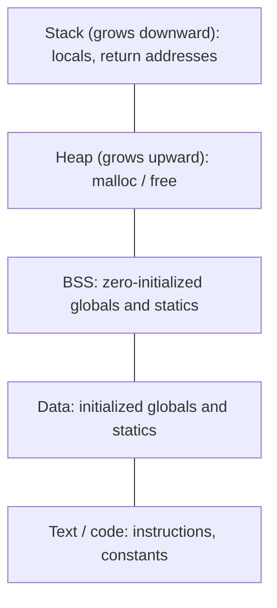
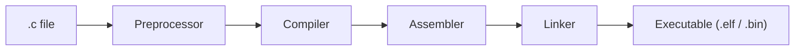
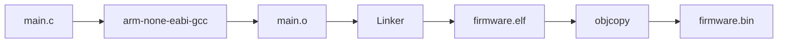

# C Interview Questions (Basics)

How to use this file: read the **Short answer** first, then the explanation and the commented example. Each section restarts its numbering.

## Contents

| Section | Topic | Questions |
| --- | --- | --- |
| 1 | Core C for embedded | 1-12 |
| 2 | Pointers | 1-25 |
| 3 | Memory layout | 1-28 |
| 4 | Storage classes | 1-10 |
| 5 | Bit manipulation | 1-18 |
| 6 | Compilation pipeline | 1-50 |
| 7 | Structures and unions | 1-30 |

---

## Section 1: Core C for embedded

### 1.1 Why is `volatile` used in embedded C?

**Short answer:** It tells the compiler a value can change outside the code it can see, so every access must really happen.

Typical cases: memory-mapped registers, variables changed by an ISR, values updated by hardware or DMA.

```c
volatile uint32_t *status = (volatile uint32_t *)STATUS_REG;   /* pointer to a hardware register */
while ((*status & READY_BIT) == 0U) {
    /* wait: volatile forces a fresh read of the register on every pass */
}
```

`volatile` does **not** make an operation atomic, does not give mutual exclusion, and does not replace a mutex or memory barrier.

### 1.2 `const` vs `volatile`?

**Short answer:** `const` restricts modification through that expression. `volatile` controls how the compiler may optimize accesses.

A hardware status register is often both: software may read it but must not write it, and hardware changes it.

```c
volatile const uint32_t *STATUS = (volatile const uint32_t *)0x40000004u;
```

The exact form depends on the device header and register access model.

### 1.3 Pointer vs array?

**Short answer:** An array is the storage. A pointer holds an address.

```c
int a[10];
int *p = a;      /* the array name decays to a pointer to a[0] */
/* sizeof(a) = 10 * sizeof(int);  sizeof(p) = size of a pointer */
```

### 1.4 What is pointer arithmetic (quick view)?

**Short answer:** `p + 1` moves by `sizeof(T)` bytes, where `T` is the pointed-to type.

That is why `a[i]` equals `*(a + i)`.

### 1.5 What is a function pointer, and why is it useful in embedded systems?

**Short answer:** A variable that holds a function's address. Used for callbacks, driver abstraction, interrupt dispatch, and state handlers.

```c
typedef void (*callback_t)(uint8_t event);    /* a pointer to a function taking a uint8_t */
void register_callback(callback_t cb);        /* the caller supplies the function to call later */
```

### 1.6 Macro vs `const` vs `enum`?

**Short answer:** Prefer typed constructs.

| Tool | What it is | Type checked |
| --- | --- | --- |
| `#define` | Text substitution by the preprocessor | No |
| `const` | A typed read-only object | Yes |
| `enum` | Named integer constants | Partly |

### 1.7 What does `static` mean in C?

**Short answer:** At file scope it makes the symbol private to the file. Inside a function it keeps the value between calls.

### 1.8 Stack vs heap (quick view)?

**Short answer:** Stack for automatic storage, heap for dynamic allocation.

In embedded systems, uncontrolled heap use causes fragmentation, non-deterministic timing, and failure after long runs. Static allocation or bounded memory pools are preferred.

### 1.9 What is undefined behavior?

**Short answer:** The standard gives no meaning to the code. It may "work on the board" and still be wrong.

Examples: signed overflow, out-of-bounds access, use after free, invalid shifts. Compilers optimize aggressively around undefined behaviour.

### 1.10 What is endianness?

**Short answer:** The byte order of multi-byte values in memory.

| | Lowest address holds |
| --- | --- |
| Little-endian | Least-significant byte |
| Big-endian | Most-significant byte |

Protocols define their own byte order. Never assume the CPU's order equals the wire order.

### 1.11 Why use fixed-width integer types?

**Short answer:** `uint8_t`, `uint16_t`, `uint32_t`, and `int32_t` state the exact width. Ideal for register fields and packet formats.

### 1.12 What makes code reentrant?

**Short answer:** It can be interrupted and called again, or run concurrently, without corrupting shared state.

Avoid hidden mutable globals, protect shared resources, and be careful in functions called from ISRs.

### Quick revision

- `volatile`: compiler-visible external changes; not synchronization.
- `static`: lifetime and linkage control.
- `const`: prevents modification through that access path.
- Function pointers: the callback and dispatch mechanism.
- Undefined behaviour: never rely on the observed output.

---

## Section 2: Pointers

### 2.1 What is a pointer in C?

**Short answer:** A variable that stores the address of another object.

```c
int a = 10;
int *ptr = &a;      /* ptr holds the address of a */
/* *ptr reads or writes a. '&' takes an address; '*' follows an address. */
```

### 2.2 Why are pointers important in embedded systems?

**Short answer:** Register access, buffers, peripherals, callbacks, and passing data without copying.

```c
#define GPIO_REG (*(volatile unsigned int *)0x40021018)    /* a register at a fixed address */
```

### 2.3 Difference between `ptr` and `*ptr`?

```c
int x = 5;
int *ptr = &x;
```

| Expression | Meaning |
| --- | --- |
| `ptr` | The address stored in the pointer |
| `*ptr` | The value at that address |

### 2.4 What is pointer arithmetic?

**Short answer:** Adding or subtracting to move through memory in units of the pointed-to type.

```c
int arr[3] = {10, 20, 30};
int *ptr = arr;
ptr++;                    /* now points to arr[1] (advanced by sizeof(int) bytes) */
```

### 2.5 Can we add two pointers?

**Short answer:** No. Adding two pointers is not defined.

Valid operations: increment or decrement, add or subtract an integer, and subtract two pointers into the same array.

### 2.6 What is pointer subtraction?

**Short answer:** The number of elements between two pointers into the same array.

```c
int arr[5];
int *p1 = &arr[1];
int *p2 = &arr[4];
printf("%td", p2 - p1);     /* prints 3: three elements apart */
```

### 2.7 What is a pointer to pointer?

**Short answer:** A pointer that stores the address of another pointer.

```c
int x = 10;
int *p = &x;
int **pp = &p;
/* p  -> address of x          *p  -> value of x
   pp -> address of p          *pp -> p (the address of x)      **pp -> value of x */
```

### 2.8 Where are double pointers used?

**Short answer:** When a function must change the caller's pointer, and in arrays of pointers and linked structures.

```c
void allocate(int **ptr)
{
    *ptr = malloc(sizeof(int));     /* changes the caller's pointer, not just a copy */
}
```

### 2.9 What is a function pointer?

**Short answer:** A pointer to a function.

```c
/* Syntax: return_type (*name)(arguments); */
int add(int a, int b) { return a + b; }

int (*fp)(int, int);        /* fp can point to any function taking two ints and returning int */
fp = add;
printf("%d", fp(2, 3));     /* prints 5 */
```

### 2.10 Why are function pointers used in embedded systems?

**Short answer:** Callbacks, interrupt and event handlers, driver abstraction, state machines, and table-driven logic.

```c
void UART_Callback(void) { printf("Data received"); }
/* A driver stores the callback's address and calls it when the event occurs. */
```

### 2.11 What is a void pointer?

**Short answer:** A generic object pointer that can hold the address of any object type.

```c
int x = 10;
void *ptr = &x;
printf("%d", *(int *)ptr);     /* cast to the real type before dereferencing */
```

### 2.12 Why is a void pointer called a generic pointer?

**Short answer:** Any object pointer converts to and from `void *`, so generic functions can work with any type.

You must still know the original type before dereferencing.

### 2.13 Can pointer arithmetic be done on a void pointer?

**Short answer:** Not in standard C, because `void` has no size. Some compilers allow it as an extension. Do not rely on it.

### 2.14 What is a dangling pointer?

**Short answer:** A pointer to an object that no longer exists.

```c
int *ptr = malloc(sizeof(int));
free(ptr);          /* the memory is released, but ptr still holds the old address */
ptr = NULL;         /* good habit: makes accidental use easy to detect */
```

Dereferencing a dangling pointer is undefined behaviour.

### 2.15 What is an uninitialized pointer?

**Short answer:** A pointer with an indeterminate value.

```c
int *ptr;           /* points to nowhere in particular */
*ptr = 10;          /* undefined behaviour */
```

### 2.16 What is a wild pointer?

**Short answer:** An informal name for a pointer that was never set to a valid address.

### 2.17 What is an invalid dereference?

**Short answer:** Accessing memory through a pointer that does not refer to a valid object.

```c
int *ptr = NULL;
printf("%d", *ptr);      /* undefined behaviour; on many MCUs this raises a fault */
```

### 2.18 NULL pointer vs wild pointer?

| Type | Meaning |
| --- | --- |
| Null pointer | Explicitly set to the null value; not a valid object address |
| Wild pointer | Uninitialized or invalid; points somewhere unknown |

### 2.19 What happens when dereferencing a NULL pointer?

**Short answer:** Undefined behaviour. On many embedded systems it triggers a HardFault, BusFault, or MemManage fault, depending on the MCU and memory setup.

### 2.20 What is a memory leak?

**Short answer:** Allocated memory that is no longer reachable but was never freed.

```c
int *ptr = malloc(sizeof(int));     /* if ptr is lost without free(ptr), the memory is gone */
```

Long-running embedded systems must avoid leaks and fragmentation.

### 2.21 Array vs pointer?

| Array | Pointer |
| --- | --- |
| Reserves storage for its elements | Stores an address |
| The name is not a modifiable pointer | Can normally be reassigned |
| `sizeof(array)` is the total size | `sizeof(pointer)` is the pointer size |
| Size fixed for a fixed-size array | Does not define the size of what it points to |

### 2.22 What is `NULL`?

**Short answer:** A macro for the null pointer constant.

```c
int *ptr = NULL;      /* "points to nothing" */
```

### 2.23 What is the size of a pointer?

**Short answer:** It depends on the architecture and ABI.

| Architecture | Typical pointer size |
| --- | --- |
| 32-bit | 4 bytes |
| 64-bit | 8 bytes |

Do not assume. The target compiler decides.

### 2.24 Explain pointer increment internally

**Short answer:** `ptr++` adds `sizeof(T)` to the address.

For an `int *` with 4-byte `int`, the address advances by 4.

### 2.25 What are the advantages of pointers?

**Short answer:** Efficient access to existing objects, no copying when passing data, buffers, dynamic memory, hardware registers, callbacks, and data structures.

### Quick revision: pointers

- `&x`: address of `x`. `*p`: the object accessed through `p`.
- `p + 1`: the next object of the pointed-to type.
- Wild pointer: uninitialized or invalid. Dangling pointer: object no longer valid.
- `void *`: generic object pointer. `T **`: pointer to a pointer.

---

## Section 3: Memory layout

### 3.1 What is memory layout in C?

**Short answer:** How a running program is organized in memory: text, data, BSS, heap, and stack.

### 3.2 Explain the basic memory layout



In a typical layout the stack grows downward and the heap grows upward. On MCUs the exact layout is set by the linker script.

### 3.3 What is the text (code) segment?

**Short answer:** Executable instructions, and sometimes read-only constants.

Features: read-only, fixed size, sometimes shared among processes.

### 3.4 What is the data segment?

**Short answer:** Initialized global and static variables.

```c
int global = 10;           /* data segment */
static int s = 20;         /* data segment */
```

### 3.5 What is the BSS segment?

**Short answer:** Uninitialized global and static variables, automatically set to zero at startup.

```c
int global;                /* BSS */
static int s;              /* BSS */
```

BSS stands for "Block Started by Symbol".

### 3.6 Data vs BSS?

| Data segment | BSS segment |
| --- | --- |
| Initialized globals and statics | Uninitialized globals and statics |
| Occupies space in the executable image | Stores no initial values in the image |

```c
int x = 5;      /* data */
int y;          /* BSS */
```

### 3.7 What is stack memory?

**Short answer:** Locals, parameters, and return addresses, created and removed automatically with each call.

```c
void fun(void)
{
    int x = 10;      /* x lives on the stack while fun() runs */
}
```

### 3.8 What is heap memory?

**Short answer:** Memory obtained at run time with `malloc()`, `calloc()`, or `realloc()`, released with `free()`.

```c
int *ptr = malloc(sizeof(int));     /* heap allocation */
```

### 3.9 Stack vs heap?

| Stack | Heap |
| --- | --- |
| Automatic allocation | Manual allocation |
| Faster | Slower |
| Limited size | Larger |
| Managed by the compiler | Managed by the programmer |
| Local variables | Dynamic memory |

### 3.10 Why is the stack faster than the heap?

**Short answer:** Stack allocation is just moving a pointer. The heap must search for space and handle fragmentation.

### 3.11 What is stack overflow?

**Short answer:** The stack grows past its limit.

Causes: deep recursion, large local arrays, infinite recursion.

```c
void fun(void)
{
    fun();          /* each call adds a stack frame: eventually overflows */
}
```

### 3.12 What is heap fragmentation?

**Short answer:** Free memory is split into small scattered blocks, so a large allocation can fail even when total free memory is enough.

Very important in embedded systems.

### 3.13 Why is dynamic allocation risky in embedded systems?

**Short answer:** Fragmentation, leaks, non-deterministic timing, and allocation failure. Many embedded systems avoid `malloc` and `free`.

### 3.14 What is a memory leak in the heap?

**Short answer:** Heap memory that is never freed.

### 3.15 What is memory lifetime?

**Short answer:** How long memory stays valid.

| Variable type | Lifetime |
| --- | --- |
| Local variable | Function execution |
| Global variable | Entire program |
| Static variable | Entire program |
| Heap memory | Until `free()` |

### 3.16 What is a local variable?

**Short answer:** A variable declared inside a function. Stored on the stack.

### 3.17 What is a global variable?

**Short answer:** Declared outside all functions and accessible throughout the program. Stored in data or BSS.

### 3.18 What is a static variable?

**Short answer:** It keeps its value between calls.

```c
void fun(void)
{
    static int count = 0;      /* initialized only once */
    count++;                   /* remembers its value across calls */
}
```

It is stored in data or BSS and lives for the entire program.

### 3.19 Static vs global variable?

| Static variable | Global variable |
| --- | --- |
| Scope can be limited | Accessible globally |
| Lifetime is the entire program | Lifetime is the entire program |
| Internal linkage possible | External linkage |

### 3.20 What is the scope of a local variable?

**Short answer:** Only inside the function or block where it is declared.

### 3.21 What happens to local variables after a function returns?

**Short answer:** They are destroyed, because the stack frame is removed.

### 3.22 Why is returning the address of a local variable dangerous?

**Short answer:** The variable is destroyed when the function returns, leaving a dangling pointer.

```c
int *fun(void)
{
    int x = 10;
    return &x;         /* wrong: x no longer exists after return */
}
```

### 3.23 Where are string literals stored?

**Short answer:** Usually in read-only memory (the text or read-only data section).

```c
char *str = "Hello";       /* points to a read-only literal */
```

### 3.24 `char str[]` vs `char *str`?

```c
char str[] = "Hello";      /* an array: a writable copy of the characters */
char *str2 = "Hello";      /* a pointer to a read-only string literal: do not modify */
```

### 3.25 Explain function call memory behaviour

**Short answer:** Each call creates a stack frame, and returning removes it.

- A stack frame is created
- Parameters are passed (stack or registers)
- Locals are allocated
- The return address is stored
- After return, the frame is removed

### 3.26 What is a stack frame?

**Short answer:** The block of memory for one function call.

It contains locals, parameters, the return address, and saved registers.

### 3.27 What is recursion memory behaviour?

**Short answer:** Every recursive call adds a new stack frame. Infinite recursion overflows the stack.

### 3.28 Why are static variables useful in embedded systems?

**Short answer:** State retention, counters, persistent task variables, and ISR communication.

```c
static uint8_t uart_state;      /* private to this file, keeps its value */
```

---

## Section 4: Storage classes

### 4.1 What is a storage class in C?

**Short answer:** It says where a variable is stored, how long it lives, and where it is visible. The classes are `auto`, `static`, `register`, and `extern`.

### 4.2 What is the `auto` storage class?

**Short answer:** The default for local variables.

```c
void fun(void)
{
    int x = 10;      /* auto by default */
}
```

### 4.3 What is the `static` storage class?

**Short answer:** Keeps its value between calls and lives for the whole program.

```c
void counter(void)
{
    static int count = 0;
    count++;
}
```

### 4.4 What is the `register` storage class?

**Short answer:** A hint to keep the variable in a CPU register. The compiler may ignore it.

```c
register int i = 0;
```

### 4.5 What is the `extern` storage class?

**Short answer:** Declares a variable or function defined in another file.

```c
extern int global_count;
```

### 4.6 `auto` vs `static`?

| `auto` | `static` |
| --- | --- |
| Local variable | Retains value across calls |
| Usually stack allocated | Static storage duration |
| Lifetime limited to the function call | Lifetime is the entire program |

### 4.7 What is the scope of a `static` variable?

**Short answer:** At file scope it has internal linkage. Inside a function it is local to that function but keeps its value.

### 4.8 `extern` vs `static`?

**Short answer:** `extern` shares across files; `static` restricts visibility to the current file.

### 4.9 Why are storage classes important in embedded systems?

**Short answer:** They control memory allocation, lifetime, and behaviour of variables in drivers, timers, state machines, and interrupt handlers.

### 4.10 Which storage class is most useful for ISR variables?

**Short answer:** `static` combined with `volatile`.

```c
static volatile uint8_t rx_flag;     /* private, keeps state, and is re-read every time */
```

---

## Section 5: Bit manipulation

### 5.1 What is bit manipulation?

**Short answer:** Working directly on individual bits with bitwise operators. Used in drivers, protocols, and register programming.

### 5.2 Why is it important in embedded systems?

**Short answer:** Hardware registers are controlled bit by bit.

Benefits: faster execution, less memory, direct hardware control, efficient protocols.

### 5.3 What are the bitwise operators in C?

| Operator | Name |
| --- | --- |
| `&` | AND |
| `\|` | OR |
| `^` | XOR |
| `~` | NOT |
| `<<` | Left shift |
| `>>` | Right shift |

### 5.4 Bitwise AND (`&`)

**Short answer:** 1 only if both bits are 1.

```text
5 & 3      0101
           0011
           ----
           0001   = 1
```

### 5.5 Bitwise OR (`|`)

**Short answer:** 1 if either bit is 1.

```text
5 | 3      0101
           0011
           ----
           0111   = 7
```

### 5.6 Bitwise XOR (`^`)

**Short answer:** 1 if the bits are different.

```text
5 ^ 3      0101
           0011
           ----
           0110   = 6
```

### 5.7 Bitwise NOT (`~`)

**Short answer:** Inverts every bit.

```c
~5        /* for a 32-bit int: 0xFFFFFFFA, which is -6 */
```

### 5.8 Left shift (`<<`)

**Short answer:** Moves bits left. Shifting by 1 is roughly multiplying by 2.

```text
5 << 1     0101 -> 1010   = 10
```

### 5.9 Right shift (`>>`)

**Short answer:** Moves bits right. Shifting by 1 is roughly dividing by 2.

```text
8 >> 1     1000 -> 0100   = 4
```

### 5.10 How do you set a bit?

**Short answer:** OR with a mask.

```c
num |= (1 << pos);

/* Example */
num = 5;                /* 0101 */
num |= (1 << 1);        /* 0111 = 7 */
```

### 5.11 How do you clear a bit?

**Short answer:** AND with an inverted mask.

```c
num &= ~(1 << pos);
```

### 5.12 How do you toggle a bit?

**Short answer:** XOR with a mask.

```c
num ^= (1 << pos);
```

### 5.13 How do you check whether a bit is set?

```c
if (num & (1 << pos))
{
    /* the bit is set */
}
```

### 5.14 What is masking?

**Short answer:** Using a bit pattern to extract or modify specific bits.

```c
status = reg & 0x0F;      /* keep only the lower 4 bits */
```

### 5.15 What is a mask?

**Short answer:** A bit pattern used in a bit operation, for example `0x0F` is `00001111`.

### 5.16 What is bit-field extraction?

**Short answer:** Retrieving specific bits from a value.

```c
data = (value >> 4) & 0x0F;      /* shift bits 4..7 down, then keep 4 bits */
```

### 5.17 What is bit packing?

**Short answer:** Combining several small signals into one variable or frame. Used in CAN, LIN, and UART protocols.

```c
uint8_t data = (signal1 << 4) | signal2;     /* two 4-bit signals in one byte */
```

### 5.18 Why is bit packing useful?

**Short answer:** It saves bandwidth and memory and makes communication efficient.

---

## Section 6: Compilation pipeline (embedded focus)

### 6.1 What is the compilation pipeline?

**Short answer:** The steps that turn C source into machine code: preprocessing, compilation, assembly, linking.

### 6.2 What are the stages of compilation?



### 6.3 What is preprocessing?

**Short answer:** Handling macros, header includes, and conditional compilation before real compilation starts.

### 6.4 Which symbol starts a preprocessing directive?

**Short answer:** `#`, as in `#include`, `#define`, `#ifdef`, `#ifndef`.

### 6.5 What does `#include` do?

**Short answer:** Copies the header's contents into the source file.

### 6.6 What is a macro?

**Short answer:** Text substitution done by the preprocessor.

```c
#define PI 3.14
```

### 6.7 Advantages of macros?

No function call overhead, reusable code, and fast execution.

### 6.8 Disadvantages of macros?

No type checking, hard debugging, and multiple evaluation of arguments.

```c
#define SQUARE(x) x*x
SQUARE(1+2)               /* expands to 1+2*1+2 = 5, NOT 9 */

#define SQUARE_SAFE(x) ((x) * (x))     /* safe version: ((1+2) * (1+2)) = 9 */
```

### 6.9 What is conditional compilation?

```c
#ifdef DEBUG
printf("Debug mode");        /* compiled only when DEBUG is defined */
#endif
```

### 6.10 What is the compilation stage?

**Short answer:** The compiler turns preprocessed C into assembly. It also does syntax checking, semantic analysis, and optimization.

### 6.11 What errors are detected during compilation?

Syntax errors, type mismatches, and undeclared variables.

### 6.12 What is the assembly stage?

**Short answer:** The assembler turns assembly into object code. Output is `.o` (or `.obj`).

### 6.13 What is an object file?

**Short answer:** Intermediate machine code that contains machine instructions, a symbol table, and relocation information.

### 6.14 What is linking?

**Short answer:** Combining object files and libraries into the final executable.

### 6.15 What does the linker do?

Resolves symbols, combines object files, relocates addresses, and creates the executable.

### 6.16 What is symbol resolution?

**Short answer:** The linker matches each reference to its definition.

```c
extern int count;      /* a reference: the linker finds the real definition of count */
```

### 6.17 What is relocation?

**Short answer:** Adjusting memory addresses during linking or loading.

### 6.18 What happens if the linker cannot resolve a symbol?

**Short answer:** A linker error, typically `undefined reference to ...`.

### 6.19 Compiler error vs linker error?

| Compiler error | Linker error |
| --- | --- |
| Syntax or type issue | Missing definition |
| Happens during compilation | Happens during linking |

### 6.20 What is an executable file?

**Short answer:** The final runnable machine code: `.exe`, `.out`, `.elf`, `.bin`, or `.hex`.

### 6.21 What is an ELF file in embedded systems?

**Short answer:** Executable and Linkable Format. It holds code, data, symbol table, and debug info, and is used for debugging and programming.

### 6.22 What is a BIN file?

**Short answer:** Raw binary machine code, used for flashing microcontrollers.

### 6.23 ELF vs BIN?

| ELF | BIN |
| --- | --- |
| Contains debug info | Raw binary only |
| Larger | Smaller |
| Used for debugging | Used for flashing |

### 6.24 What is a HEX file?

**Short answer:** An Intel HEX text file with address, data, and checksum. Used for MCU programming.

### 6.25 What happens when you write a function?

**Short answer:** The compiler creates a symbol table entry, generates assembly, and creates stack frame logic.

### 6.26 What is a symbol table?

**Short answer:** Information about variables, functions, addresses, and scope.

### 6.27 What is stack frame generation?

**Short answer:** Compiler-generated logic for local variable allocation, parameter handling, and return address handling.

### 6.28 What happens during a function call internally?

1. Parameters are placed on the stack or in registers
2. The return address is stored
3. A stack frame is created
4. The function executes
5. The stack is restored on return

### 6.29 What is name mangling?

**Short answer:** Mostly a C++ feature where the compiler changes function names internally. C usually does not do it.

### 6.30 What is startup code in embedded systems?

**Short answer:** Code that runs before `main()`: initialize the stack pointer, copy `.data`, clear `.bss`, and configure the runtime.

### 6.31 What is a linker script?

**Short answer:** It defines the memory layout: flash and RAM regions, stack location, and heap location.

### 6.32 Why is a linker script important in embedded systems?

**Short answer:** Embedded systems have fixed memory addresses, so code, ISR vectors, stack, and heap must be placed correctly.

### 6.33 What is static linking?

**Short answer:** Libraries are copied into the executable. It is standalone but larger.

### 6.34 What is dynamic linking?

**Short answer:** Libraries are loaded at run time. Common on Linux, uncommon in bare-metal embedded systems.

### 6.35 What is a relocation table?

**Short answer:** The list of addresses that need adjusting during linking or loading.

### 6.36 What is cross compilation?

**Short answer:** Compiling on one machine for another architecture, for example on a PC for an ARM Cortex MCU.

### 6.37 What is a cross compiler?

**Short answer:** A compiler that generates code for a different CPU, for example `arm-none-eabi-gcc`.

### 6.38 What is compiler optimization?

**Short answer:** Improving speed, code size, and efficiency.

### 6.39 Common GCC optimization levels

| Level | Meaning |
| --- | --- |
| `-O0` | No optimization |
| `-O1` | Basic optimization |
| `-O2` | Moderate optimization |
| `-O3` | Aggressive optimization |
| `-Os` | Optimize for size |

### 6.40 Why is debugging difficult with optimization?

**Short answer:** The compiler may remove variables, inline functions, and reorder instructions.

### 6.41 What is an inline function?

**Short answer:** The compiler may replace the call with the function's code.

```c
static inline int add(int a, int b)     /* 'static inline' avoids link errors in C99 and later */
{
    return a + b;
}
```

A plain `inline` in C99 without an external definition can cause "undefined reference" at link time.

### 6.42 Advantages of inline functions?

Faster execution and no call overhead.

### 6.43 Macro vs inline function?

| Macro | Inline function |
| --- | --- |
| No type checking | Type safe |
| Handled by the preprocessor | Handled by the compiler |
| Hard to debug | Easier to debug |

### 6.44 What is dead code elimination?

**Short answer:** The compiler removes code that can never affect the result.

### 6.45 What is dependency in compilation?

**Short answer:** Header and source relationships. Changing a header may force recompilation of every file that includes it.

### 6.46 What is an incremental build?

**Short answer:** Only modified files are recompiled, which reduces build time.

### 6.47 What is a Makefile?

**Short answer:** An automation file for the build. It defines the compiler, flags, dependencies, and build steps.

### 6.48 Example GCC compilation command

```bash
gcc main.c -o app          # compile and link main.c into an executable called app
```

### 6.49 Embedded compilation flow example



### 6.50 Interview-level summary

| Stage | Output |
| --- | --- |
| Preprocessing | Expanded source |
| Compilation | Assembly code |
| Assembly | Object file (`.o`) |
| Linking | Executable (`.elf` / `.bin`) |

---

## Section 7: Structures and unions (basic)

### 7.1 What is a structure in C?

**Short answer:** A user-defined type that groups variables of different types under one name.

```c
struct Employee {
    int   id;
    char  grade;
    float salary;
};
```

### 7.2 Why are structures used in embedded systems?

**Short answer:** They group related hardware, configuration, sensor, protocol, and application data into one object.

### 7.3 How do you declare a structure variable?

```c
struct Employee e1;
```

### 7.4 How do you access structure members?

**Short answer:** With the dot operator.

```c
e1.id = 10;
e1.salary = 50000.0f;
```

### 7.5 What is a union?

**Short answer:** A type where all members share the same memory.

```c
union Data {
    int   i;
    float f;
    char  c;
};
```

### 7.6 Structure vs union: the main difference?

**Short answer:** A structure gives each member its own storage. Union members share storage.

### 7.7 What is the size of a structure?

**Short answer:** Not simply the sum of the member sizes, because of alignment and padding.

### 7.8 What is the size of a union?

**Short answer:** At least the size of its largest member, plus any alignment requirement.

### 7.9 Can a structure contain different data types?

Yes.

```c
struct Sensor {
    int   id;
    float temperature;
    char  status;
};
```

### 7.10 Can a structure contain another structure?

Yes.

```c
struct Date { int day; int month; };

struct Employee {
    int id;
    struct Date joining_date;      /* a structure inside a structure */
};
```

### 7.11 Can a union contain different data types?

Yes, but all members occupy the same storage.

### 7.12 Can a structure contain a pointer?

Yes. This is how linked lists work.

```c
struct Node {
    int data;
    struct Node *next;
};
```

### 7.13 What is a `typedef` with a structure?

```c
typedef struct {
    int   id;
    float value;
} Sensor;

Sensor s1;          /* no need to write "struct" each time */
```

### 7.14 What is structure initialization?

```c
struct Sensor s = {1, 25.5f};             /* in member order */

struct Sensor s2 = {                      /* designated initialization: order does not matter */
    .value = 25.5f,
    .id = 1
};
```

### 7.15 What is a structure pointer?

**Short answer:** A pointer that stores the address of a structure.

```c
struct Sensor s;
struct Sensor *p = &s;
```

### 7.16 How do you access members through a structure pointer?

**Short answer:** With the arrow operator.

```c
p->id = 10;        /* same as (*p).id = 10 */
```

### 7.17 Can structures be passed to functions?

**Short answer:** Yes, by value or by pointer. A pointer avoids copying the whole structure.

```c
void process(struct Sensor *s);
```

### 7.18 Can a structure be returned from a function?

Yes.

```c
struct Sensor get_sensor(void);
```

### 7.19 What is padding?

**Short answer:** Unused bytes the compiler inserts between or after members to satisfy alignment.

### 7.20 What is alignment?

**Short answer:** The requirement that an object starts at an address suitable for its type.

### 7.21 Why is padding important in embedded systems?

**Short answer:** It can increase RAM and flash use and affects binary layouts for communication, storage, and registers.

### 7.22 What is a bit-field?

**Short answer:** A structure member that occupies a specified number of bits.

```c
struct Flags {
    unsigned int ready : 1;     /* 1 bit */
    unsigned int error : 1;     /* 1 bit */
};
```

### 7.23 Why are bit-fields useful?

**Short answer:** Compact flags and status fields.

### 7.24 What is a bit-field limitation?

**Short answer:** Layout and allocation order are implementation-defined. Be careful using them for portable protocol or register layouts.

### 7.25 What is the memory layout of a structure?

**Short answer:** Members appear in declaration order, with possible padding between them and at the end.

### 7.26 What is the memory layout of a union?

**Short answer:** All members start at the same address.

### 7.27 Which operator accesses union members?

**Short answer:** `.` for a union object and `->` for a pointer to a union.

### 7.28 When should you use a union?

**Short answer:** When different representations share storage and only one is active at a time.

### 7.29 When should you use a structure?

**Short answer:** When several fields must exist at the same time.

### 7.30 Simple structure vs union picture

```text
Structure:
+---------+---------+---------+
|   int   |  float  |  char   |
+---------+---------+---------+

Union:
+-----------------------------+
| shared memory for one member|
+-----------------------------+
```
