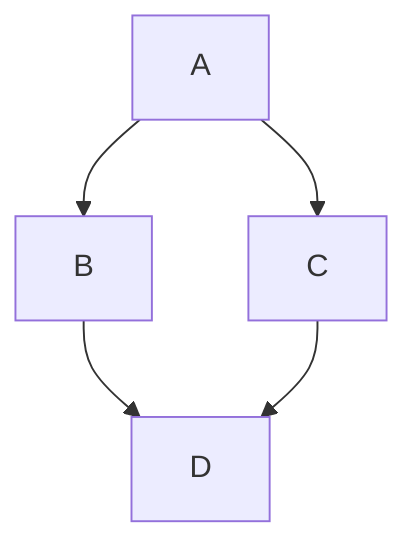

# C++ Interview Questions for Embedded

How to use this file: read the **Short answer** first, then the details and the commented example. Q26 to Q35 are written the way you would say them aloud in an interview.

## Contents

| Questions | Topic |
| --- | --- |
| 1-10 | Core C++ for embedded |
| 11-25 | Commonly asked language and memory questions |
| 26-35 | OOP concepts, answered as spoken interview answers |

## Interview tip

Interviewers care less about syntax and more about whether you understand the **cost of abstraction**: memory, timing, startup behaviour, allocation, and generated code.

---

## 1. Why use C++ in embedded systems?

**Short answer:** Stronger abstraction, RAII, templates, namespaces, and type safety, while keeping low-level control.

Whether to use a feature depends on compiler support, code size and runtime limits, safety rules, and team standards.

## 2. What is a constructor?

**Short answer:** It initializes an object when its lifetime begins. Prefer member-initializer lists.

```cpp
class Uart {
public:
    explicit Uart(uint32_t baud) : baud_(baud) {}   // member-initializer list: baud_ is built directly
private:
    uint32_t baud_;
};
```

`explicit` stops accidental conversions like `Uart u = 9600;`.

## 3. What is RAII?

**Short answer:** Resource Acquisition Is Initialization: the resource's lifetime is tied to an object's lifetime.

```cpp
class CriticalSection {
public:
    CriticalSection()  { __disable_irq(); }     // acquire when created
    ~CriticalSection() { __enable_irq(); }      // release when destroyed, on every exit path
};

void update() {
    CriticalSection cs;     // interrupts off
    shared_++;
}                           // interrupts back on, even after an early return
```

Usable for locks, peripheral ownership, and critical sections, provided the generated code meets timing and exception constraints.

## 4. What is a virtual function?

**Short answer:** It enables runtime polymorphism through a base-class interface. It usually needs a vtable, which costs memory and time.

## 5. What is a pure virtual function?

**Short answer:** A function declared `= 0`. A class with at least one is abstract.

```cpp
class Driver {
public:
    virtual bool init() = 0;              // no body: derived classes must implement it
    virtual ~Driver() = default;
};
```

## 6. What are templates useful for in embedded systems?

**Short answer:** Compile-time generic code that avoids runtime polymorphism. A fixed-size ring buffer is a classic example.

```cpp
template <typename T, size_t N>
class RingBuffer {
    T data_[N];              // capacity is known at compile time: no heap
    size_t head_ = 0, tail_ = 0;
};
RingBuffer<uint8_t, 64> rx;  // a 64-byte buffer, sized by the type
```

## 7. Why can exceptions and RTTI be disabled?

**Short answer:** To reduce binary size, avoid dynamic runtime machinery, simplify failure behaviour, or follow coding standards. It is a project decision.

Compiler flags: `-fno-exceptions -fno-rtti`.

## 8. What is the Rule of 0, 3, and 5?

| Rule | Meaning |
| --- | --- |
| Rule of 0 | Let standard and member types manage resources, so you write no special members |
| Rule of 3 | If you need a custom destructor, copy constructor, or copy assignment, you probably need all three |
| Rule of 5 | Adds the move constructor and move assignment (modern C++) |

## 9. `nullptr` vs `NULL`

**Short answer:** `nullptr` is a dedicated, type-safe null pointer literal. `NULL` is a macro that may be an integer constant.

```cpp
void f(int);
void f(char *);
f(NULL);        // may call f(int): ambiguous or wrong
f(nullptr);     // always calls f(char *)
```

## 10. STL in embedded systems

**Short answer:** Do not ban it categorically. Evaluate worst-case memory, determinism, exceptions, and fragmentation.

`std::array` is excellent. `std::vector` can be valid if its allocation behaviour is understood.

---

## 11. `const` correctness: what does `const` mean in different positions?

**Short answer:** Read the declaration right to left.

| Declaration | Meaning |
| --- | --- |
| `const int *p` | The data cannot change through `p`; `p` can move |
| `int *const p` | `p` cannot move; the data can change |
| `const int *const p` | Neither can change |
| `void f() const` | The method promises not to modify the object |

```cpp
class Sensor {
public:
    int read() const { return cached_value_; }    // callable on a const Sensor
    void update(int v) { cached_value_ = v; }     // not callable on a const Sensor
private:
    int cached_value_;
};
```

## 12. `static` at file scope, on a class member, and inside a function

| Where | Meaning |
| --- | --- |
| File or namespace scope | Internal linkage: visible only in this file |
| Class member | One copy shared by all instances |
| Local variable | Initialized once, keeps its value between calls |

**Watch out:** a function-local static is only thread-safe if the compiler implements C++11 "magic statics". On some small toolchains it does not, so lazy initialization can race.

## 13. `#define` vs `const` vs `constexpr`

| | `#define` | `const` | `constexpr` |
| --- | --- | --- | --- |
| Type checking | No | Yes | Yes |
| Scope | None | Yes | Yes |
| Value known at compile time | Yes (text) | Not necessarily | Required |

```cpp
#define SQUARE(x) x*x            // SQUARE(a+b) breaks
constexpr int kSize = 32;        // usable as an array size or template argument; often placed in flash
```

Prefer `constexpr` for named constants.

## 14. What is name mangling, and why does `extern "C"` matter?

**Short answer:** C++ encodes parameter types into function names (for overloading). C does not. `extern "C"` turns mangling off.

```cpp
extern "C" {
    #include "vendor_hal.h"     // C header: the linker looks for the plain C names
}
```

Without it, the linker cannot find the C library's symbols.

## 15. What is operator overloading, and where is it risky in embedded code?

**Short answer:** It lets a class define `+`, `==`, `[]`, `()`. It is risky because a simple-looking `a + b` can hide an allocation, a loop, or a syscall.

That makes worst-case timing and code size hard to see at the call site, so some coding standards restrict overloads that allocate.

## 16. What is undefined behaviour, and give an embedded example

**Short answer:** Behaviour the standard puts no requirements on. The optimizer may assume it never happens.

- **Signed overflow** (`INT_MAX + 1`) is undefined. Unsigned overflow wraps.
- **Reading an uninitialized variable** is undefined.
- **Strict-aliasing violations** (reinterpreting byte buffers through the wrong pointer type)

```cpp
float f = 1.0f;
uint32_t bits;
std::memcpy(&bits, &f, sizeof bits);      // the safe way to reinterpret the bytes
```

## 17. What is placement new, and why is it used in embedded systems?

**Short answer:** It constructs an object at an address you provide, avoiding the heap.

```cpp
alignas(MyClass) static uint8_t storage[sizeof(MyClass)];
MyClass *obj = new (storage) MyClass(args);     // construct in the static buffer
obj->~MyClass();                                // destroy by hand: delete cannot be used
```

## 18. Stack, heap, and static allocation: why forbid heap after initialization?

| | Stack | Static | Heap |
| --- | --- | --- | --- |
| Speed | Fast, deterministic | Fixed address | Non-deterministic |
| Size | Limited | Fixed at link time | Flexible |
| Lifetime | Scope | Whole program | Until freed |
| Risk | Overflow | RAM permanently used | Fragmentation, allocation failure |

Many standards (MISRA C++ and project rules) forbid or restrict heap use after initialization, and prefer static pools or placement new.

## 19. What if a destructor is not `virtual` in a polymorphic base class?

**Short answer:** Deleting through a base pointer skips the derived destructor. That is undefined behaviour and leaks resources.

```cpp
Base *p = new Derived();
delete p;        // if ~Base() is not virtual, ~Derived() never runs
```

**Remember:** any class with a virtual function needs a virtual destructor.

## 20. Lambda capture by reference vs by value

**Short answer:** By value copies. By reference stores a reference, which is dangerous if the variable dies first.

```cpp
int x = 5;
auto by_value = [x]() { use(x); };       // safe: has its own copy
auto by_ref   = [&x]() { use(x); };      // dangling if x goes out of scope before the call
```

In ISR or RTOS callbacks that run later, capture by value.

## 21. `std::array` vs a raw C array

**Short answer:** Same storage and no runtime cost, but safer.

- Does not decay to a pointer when passed to a function (no `sizeof` surprise)
- Provides `.size()` and `.at()`
- Works with range-based `for` and STL algorithms

## 22. Memory-mapped registers in C++, and why `volatile` is still needed

```cpp
struct GpioRegs {
    volatile uint32_t data;
    volatile uint32_t dir;
};
auto *const gpio = reinterpret_cast<GpioRegs *>(0x40020000u);   // base address from the reference manual
gpio->dir = 0x1u;
```

C++ typing does not tell the optimizer that hardware can change these locations. Without `volatile`, it may cache or drop accesses.

## 23. Templates vs virtual functions for embedded polymorphism

| | Templates (compile time) | Virtual functions (runtime) |
| --- | --- | --- |
| Dispatch | Resolved at build time | Through a vtable |
| Speed | Can be fully inlined | Indirect call |
| Code size | One copy per instantiation (bloat) | One shared implementation |
| Flexibility | Type fixed at build | Type can change at run time |

Use templates when the type is known at build time. Use virtual functions when it really varies at run time.

## 24. What does `noexcept` mean, and why does it matter with exceptions disabled?

**Short answer:** It promises the function will not throw. If it does, `std::terminate()` is called.

It matters even with `-fno-exceptions` because containers like `std::vector` only **move** elements (instead of copying) if the move constructor is `noexcept`. So it can change performance.

## 25. `struct` vs `class`

**Short answer:** The only difference is default access: `struct` is public, `class` is private.

Register-overlay structs are plain data by convention. Keep them free of virtual functions and extra members, and guard the layout:

```cpp
static_assert(sizeof(GpioRegs) == 8, "register map size changed");
```

---

## Advanced OOP concepts: answered the way you would say them

## 26. Explain the four pillars of OOP with embedded examples

**Short answer:** Encapsulation, abstraction, inheritance, polymorphism.

> "Encapsulation means bundling data with the functions that use it and controlling access. In a driver, I keep the register pointer and state `private` and expose only `init()`, `read()`, `write()`, so a caller cannot break an invariant.
>
> Abstraction hides how something works behind a simpler interface. `readCelsius()` hides the I2C transaction, the ADC conversion, and the calibration.
>
> Inheritance expresses an 'is-a' relationship. `Accelerometer` and `Gyroscope` derive from `Sensor`, so code that needs 'any sensor' works against the base type.
>
> Polymorphism lets me call `sensor->read()` through a `Sensor *` and get the right derived version at runtime through virtual dispatch. I always mention the cost too: a vtable pointer per object and an indirect call."

## 27. Compile-time vs runtime polymorphism: when do you pick which?

> "Compile-time polymorphism is overloading and templates. The compiler decides at build time. Runtime polymorphism is virtual functions, resolved through a vtable.
>
> On an embedded target I lean towards templates when the type is known at build time and size or speed matters, for example a fixed SPI flash driver. The compiler can inline everything.
>
> I use virtual functions when the concrete type is genuinely unknown until runtime, for example a sensor chosen by reading an ID register at startup. There I accept the vtable cost because I need the flexibility."

## 28. Why make a destructor virtual, and what breaks if you forget?

> "I make it virtual whenever a class is used polymorphically, meaning someone might delete a `Derived` through a `Base *`.
>
> Without it, `delete p` runs only `~Base()`. `~Derived()` never runs, so any buffer, mutex, or peripheral handle it owns leaks, and the standard calls this undefined behaviour.
>
> My rule: one virtual function means a virtual destructor. If I want to forbid deleting through the base pointer, I make the destructor `protected` and non-virtual, so it becomes a compile error."

## 29. What is the diamond problem, and how does C++ solve it?



> "With multiple inheritance, `D` derives from `B` and `C`, and both derive from `A`. Without special handling `D` gets two copies of `A`, and accessing `A`'s members is ambiguous.
>
> C++ solves it with virtual inheritance: `class B : public virtual A`. Then `D` gets exactly one shared `A`.
>
> In embedded code I try to avoid deep multiple inheritance because it adds vtable and layout complexity. I prefer composition: hold a member object."

## 30. Overloading vs overriding

```cpp
class Port {
public:
    void write(uint8_t b);                          // overloading: same name, different parameters
    void write(const uint8_t *p, size_t n);
    virtual void flush();
};
class Uart : public Port {
public:
    void flush() override;                          // overriding: same signature, replaces the virtual
};
```

> "Overloading is the same name with different parameters in one scope, resolved at compile time. Overriding is a derived class replacing a virtual function with the same signature, resolved at runtime.
>
> A bug I watch for is thinking you are overriding when you changed the signature slightly, so you accidentally overloaded and hid the base version. That is why I always write `override`: the compiler then catches it."

## 31. Composition vs inheritance for driver design

| | Inheritance | Composition |
| --- | --- | --- |
| Relationship | is-a | has-a |
| Coupling | Tight | Loose |
| Flexibility | Base changes ripple down | Swap a member easily |

> "Favour composition over inheritance. Inheritance is for genuine is-a relationships where I need polymorphic dispatch through a common interface. My `ImuManager` should hold an `Accelerometer` and a `Gyroscope` as members. That lets me swap an implementation without changing the class hierarchy, and avoids vtable and multiple-inheritance overhead. In practice that is most of the time."

## 32. What is object slicing, and how have you seen it cause a bug?

```cpp
void log(Sensor s);          // takes Sensor BY VALUE

Accelerometer accel;
log(accel);                  // the Accelerometer part is sliced away; log() sees only a Sensor
```

> "Slicing happens when you copy a derived object into a base object by value. The derived parts are cut off. I saw a teammate declare `std::vector<Sensor>`. Every element pushed in was sliced to the base class, so calls that should reach the derived `read()` silently used the base version. No error, no crash, just wrong behaviour.
>
> The fix: never store or pass polymorphic types by value. Use references, pointers, or smart pointers."

## 33. How would you implement a Singleton for a UART driver, and what are the risks?

```cpp
class Uart {
public:
    static Uart& instance() {
        static Uart uart;                        // created once, on first use (Meyers' Singleton)
        return uart;
    }
    void send(uint8_t byte);
private:
    Uart() = default;
    Uart(const Uart&) = delete;                  // no copies
    Uart& operator=(const Uart&) = delete;
};
```

> "This is thread-safe under C++11 magic statics, on toolchains that implement it. The risks: on some smaller embedded compilers that guarantee is not implemented, so a call from several contexts before startup is finished can race. Singletons also make unit testing harder because you cannot substitute a mock. And if a product needs a second UART, the class needs restructuring. I only use a true Singleton when the hardware is inherently singular. Otherwise I pass a driver instance explicitly."

## 34. Abstract class vs interface in C++

```cpp
class ITransport {                                    // a pure interface: no data, only pure virtuals
public:
    virtual bool send(const uint8_t *data, size_t len) = 0;
    virtual ~ITransport() = default;
};
```

> "C++ has no `interface` keyword, so an interface is an abstract class where every method is pure virtual and there is a virtual destructor. A general abstract class can also hold shared data or default behaviour, so it is a superset. I use the pure-interface style to decouple application logic from a concrete implementation, for example UART versus a TCP socket underneath."

## 35. What does multiple inheritance do to the vtable layout, and why use it sparingly?

> "With single inheritance, an object has one vtable pointer, so a virtual call is one indirect jump. With multiple inheritance from several bases that each have virtual functions, the object needs several vtable pointers, one per base subobject, and the compiler inserts small adjuster thunks to fix the `this` pointer when calling through a different base. That adds memory, adds a little run-time cost, and makes the object layout harder to reason about.
>
> So I use multiple inheritance sparingly, mainly to combine thin pure interfaces such as `ITransport` and `ILoggable`, and I avoid mixing it with virtual inheritance unless there is a real shared-base need."
