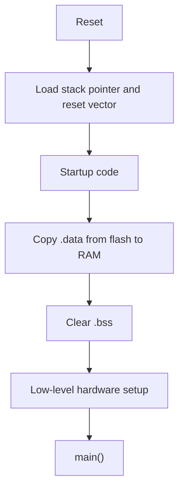

# Embedded C Interview Questions

How to use this file: read the **Short answer** first, then the explanation and the commented example. Each question ends with a **Remember** line you can say in an interview.

## Contents

- Hardware access and concurrency (Q1-Q7)
- Bits, linker, and startup (Q8-Q10)
- Pointers, memory, and data types (Q11-Q27)
- Build errors, assertions, and input safety (Q28-Q30)

---

## 1. What is memory-mapped I/O?

**Short answer:** Hardware registers live at fixed memory addresses, so normal loads and stores control the hardware.

```c
/* Idea: writing to this address writes to a peripheral register, not to RAM. */
#define GPIOA_ODR   (*(volatile uint32_t *)0x40020014u)   /* output data register */

GPIOA_ODR |= (1u << 5);       /* set pin 5 high */
```

In real code, use the device header (`GPIOA->ODR`) instead of raw addresses. It gives typed definitions and bit masks.

**Remember:** a register access is just a memory access, so the compiler must be told not to optimize it (`volatile`).

## 2. Why must peripheral registers often be `volatile`?

**Short answer:** A register can change without any C statement changing it, so the compiler must read it every time.

```c
/* Without volatile the compiler may read STATUS once and loop forever. */
while ((UART->STATUS & RX_READY) == 0u) {
    /* wait: with volatile, every loop iteration performs a real read */
}
```

**Remember:** `volatile` means "do not assume this value stays the same". It does not make an access atomic.

## 3. What is a critical section?

**Short answer:** Code protected so no other context can interfere with it.

| Who shares the data | Typical protection |
| --- | --- |
| Main code and an ISR | Briefly disable that interrupt |
| Two RTOS tasks | A mutex |
| A single variable | An atomic operation |

**Remember:** the right mechanism depends on who shares the resource. Keep the section short.

## 4. Why should an ISR be short?

**Short answer:** A long ISR delays other interrupts and higher-priority work.

Do this in an ISR:

1. Capture the minimum required state
2. Clear the interrupt source
3. Defer processing to a task or the main loop

**Remember:** ISR = grab the data and leave.

## 5. What is a watchdog?

**Short answer:** A timer that resets the system unless software keeps servicing it.

**Good design:** the watchdog should reflect real system health, not just be kicked everywhere. Kick it only after all critical tasks report progress.

```c
if (sensor_task_ok && comms_task_ok && control_task_ok) {
    watchdog_kick();          /* only kick when EVERYTHING important is healthy */
}
```

**Remember:** a watchdog that is kicked from a timer interrupt proves nothing.

## 6. Polling vs interrupt?

**Short answer:** Polling checks repeatedly; interrupts let the hardware announce an event.

| | Polling | Interrupt |
| --- | --- | --- |
| Complexity | Simple | Higher (concurrency) |
| CPU cost | Wastes time waiting | Efficient for rare events |
| Response time | Variable | Fast and consistent |

**Remember:** polling for short, bounded waits; interrupts for sparse asynchronous events.

## 7. What is DMA?

**Short answer:** Direct Memory Access moves data without the CPU copying each byte.

Correct use needs:

- Clear **buffer ownership** (CPU or DMA, never both)
- Alignment
- **Cache coherency** on CPUs with a data cache
- Completion and error handling

**Remember:** while DMA owns a buffer, the CPU must not touch it.

## 8. Why use bit masks?

**Short answer:** To change only the intended bits of a register.

```c
reg |=  (1U << 3);      /* set bit 3:    OR forces the bit to 1 */
reg &= ~(1U << 3);      /* clear bit 3:  AND with the inverse forces it to 0 */
reg ^=  (1U << 3);      /* toggle bit 3: XOR flips it */
```

**Remember:** other bits stay unchanged.

## 9. What is a linker script used for?

**Short answer:** It decides where each section goes in memory.

It commonly places the vector table, code, initialized data, zero-initialized data, the stack, and special memory regions.

```text
FLASH: vector table, .text (code), .rodata (constants), initial values of .data
RAM:   .data (variables with a start value), .bss (zeroed variables), heap, stack
```

**Remember:** the linker script plus the map file explain most memory problems.

## 10. What happens after reset?

**Short answer:** The CPU loads the stack pointer and reset handler from the vector table, then runs startup code, then `main()`.



Exact behaviour depends on the architecture and toolchain.

**Remember:** `.data` is copied, `.bss` is cleared, then `main()` starts.

## 11. What is the difference between a pointer and an array?

**Short answer:** An array owns a fixed block of memory; a pointer just holds an address.

```c
uint8_t buffer[16];          /* 16 bytes of real storage */
uint8_t *cursor = buffer;    /* the array name converts to a pointer to its first element */

cursor[0] = 0x55;            /* writes buffer[0] */
/* sizeof(buffer) is 16, but sizeof(cursor) is the size of a pointer (for example 4) */
```

**Remember:** an array name often converts to a pointer, but they are not the same type.

## 12. Why should pointer bounds be checked?

**Short answer:** A bad pointer or index can overwrite unrelated memory or registers.

```c
bool read_byte(const uint8_t *data, size_t length, size_t index, uint8_t *value)
{
    if (data == NULL || value == NULL || index >= length) {
        return false;                 /* reject bad input instead of touching memory */
    }

    *value = data[index];             /* safe: index is known to be inside the buffer */
    return true;
}
```

**Remember:** validate lengths before every copy and access.

## 13. What is the difference between `memcpy` and `memmove`?

**Short answer:** `memcpy` needs non-overlapping regions; `memmove` handles overlap.

```c
char text[16] = "abcdef";
memmove(&text[1], &text[0], 5);   /* overlapping copy: safe with memmove, undefined with memcpy */
```

**Remember:** if the regions might overlap, use `memmove`.

## 14. Why is `sizeof` safer than hard-coded buffer sizes?

**Short answer:** It follows the declaration, so changing the array size cannot leave a stale number behind.

```c
uint8_t packet[32];
memset(packet, 0, sizeof(packet));    /* still correct if packet grows to 64 */
```

**Watch out:** `sizeof` on a pointer parameter gives the pointer size, not the array size.

## 15. What is the difference between stack and static storage?

**Short answer:** Stack objects live for one function call; static objects live for the whole program.

```c
void sample_task(void)
{
    uint8_t local_buffer[64];       /* stack: created on entry, gone on return */
    static uint32_t call_count;     /* static: one copy, keeps its value between calls */
    call_count++;
    (void)local_buffer;             /* silence "unused" warning in this example */
}
```

**Remember:** big local arrays risk stack overflow; static data uses RAM permanently.

## 16. Why should recursion usually be avoided in small firmware?

**Short answer:** Each call uses stack, so worst-case memory is hard to prove.

```c
uint32_t factorial_iterative(uint32_t value)
{
    uint32_t result = 1u;
    while (value > 1u) {            /* a loop uses constant stack, unlike recursion */
        result *= value--;
    }
    return result;
}
```

**Remember:** iterative code has a bounded stack use.

## 17. What are structures useful for in embedded C?

**Short answer:** Grouping related fields such as configuration, messages, and register views.

```c
typedef struct {
    uint16_t sample;      /* ADC value */
    uint8_t  channel;     /* which input */
    uint8_t  valid;       /* 1 = usable */
} sensor_result_t;
```

**Watch out:** padding and alignment matter for hardware or wire formats.

## 18. Why can packed structures be dangerous?

**Short answer:** They can create misaligned members, which are slower or fault on some cores.

```c
/* Safer for protocols: decode bytes explicitly, independent of struct layout. */
uint32_t decode_le32(const uint8_t bytes[4])
{
    return ((uint32_t)bytes[0])         |    /* lowest byte first: little-endian */
           ((uint32_t)bytes[1] << 8)    |
           ((uint32_t)bytes[2] << 16)   |
           ((uint32_t)bytes[3] << 24);
}
```

**Remember:** explicit byte serialization is portable; casting a byte buffer to a packed struct is not.

## 19. What is an enumeration useful for?

**Short answer:** Named states and modes make code easier to read and review.

```c
typedef enum {
    DRIVER_IDLE,       /* 0 */
    DRIVER_BUSY,       /* 1 */
    DRIVER_ERROR       /* 2 */
} driver_state_t;
```

## 20. What is the purpose of `static` at file scope?

**Short answer:** It hides a function or variable inside its own `.c` file (internal linkage).

```c
static uint32_t error_count;        /* invisible to other files */

static void record_error(void)      /* private helper */
{
    error_count++;
}
```

**Remember:** `static` at file scope means private to this file.

## 21. What is `extern` used for?

**Short answer:** It declares something defined in another file. It must be defined exactly once.

```c
/* public_status.h: declaration only (no memory allocated here) */
extern volatile uint32_t system_status;

/* status.c: the one and only definition */
volatile uint32_t system_status;
```

## 22. Why use include guards?

**Short answer:** They stop a header from being processed twice in one source file.

```c
#ifndef SENSOR_DRIVER_H       /* if not already defined... */
#define SENSOR_DRIVER_H       /* ...define it, so the next include is skipped */

void sensor_init(void);

#endif
```

## 23. What is a function pointer used for in firmware?

**Short answer:** Callbacks, interrupt dispatch tables, and hardware abstraction without long `if` chains.

```c
typedef void (*event_handler_t)(uint32_t event);   /* a pointer to a function taking uint32_t */

static event_handler_t handler;                    /* stores the callback */

void register_handler(event_handler_t callback)
{
    handler = callback;                            /* the caller supplies the behaviour */
}
/* Later: if (handler != NULL) { handler(event); } */
```

## 24. What are the `const` pointer forms?

**Short answer:** Read the declaration right to left.

| Declaration | Meaning |
| --- | --- |
| `const uint8_t *p` | Cannot change the data through `p`; `p` can move |
| `uint8_t *const p` | `p` cannot move; data can change |
| `const uint8_t *const p` | Neither can change |

```c
void inspect(const uint8_t *data, size_t length)   /* promises not to modify the caller's data */
{
    for (size_t index = 0; index < length; ++index) {
        process(data[index]);
    }
}
```

## 25. Why are integer widths important in embedded C?

**Short answer:** `uint8_t` and `uint32_t` make register fields and packet layouts explicit across toolchains.

```c
uint32_t control = 0u;
control |= UINT32_C(1) << 31;      /* UINT32_C makes the constant a real unsigned 32-bit value */
```

**Remember:** `int` can be 16 or 32 bits depending on the target.

## 26. What is integer promotion?

**Short answer:** Small integer types are converted to `int` before arithmetic.

```c
uint8_t  value   = 0x80u;
uint32_t shifted = (uint32_t)value << 8;   /* cast first, so the shift happens in 32 bits */
```

**Watch out:** `~value` on a `uint8_t` gives a large `int`, not a byte. Cast the result back.

## 27. Why prefer unsigned types for bit manipulation?

**Short answer:** Unsigned shifts and overflow are well defined; signed ones can be undefined or implementation-defined.

```c
uint32_t mask  = UINT32_C(1) << bit_index;          /* mask with one bit set */
uint32_t field = (register_value & mask) != 0u;     /* 1 if that bit is set, else 0 */
```

## 28. What is a linker error versus a compiler error?

**Short answer:** A compiler error is in one source file; a linker error is when combining files.

```c
/* Compiles fine, but fails at link time: nobody defines missing_symbol. */
extern int missing_symbol;
int read_symbol(void) { return missing_symbol; }
```

Typical linker messages: "undefined reference to ..." or "section will not fit in region".

## 29. Why use assertions in embedded C?

**Short answer:** They catch violated assumptions during development.

```c
assert(buffer != NULL);
assert(length <= BUFFER_CAPACITY);
```

**Watch out:** decide what happens in production. Stopping in an assertion handler may hurt availability.

## 30. How should embedded C handle external input safely?

**Short answer:** Treat all external data as untrusted. Validate before use.

```c
bool accept_frame(const uint8_t *frame, size_t length)
{
    if (frame == NULL || length < 3u || length > 64u) {
        return false;                                          /* reject bad size first */
    }

    return crc8(frame, length - 1u) == frame[length - 1u];     /* then check integrity */
}
```

**Remember:** validate length, range, type, state, and checksum, and reject bad input without corrupting parser state.
