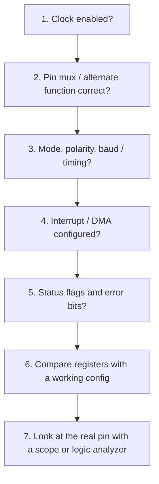

# STM32 Interview Questions

How to use this file: read the **Short answer**, explain it aloud, then check the details and the commented example. Each question ends with a **Remember** line.

## 1. What is the role of the STM32 reference manual?

**Short answer:** The datasheet tells you what the chip is; the reference manual tells you how to program it.

| Document | Contains |
| --- | --- |
| Datasheet | Electrical characteristics, package, pinout, device limits |
| Reference manual | Peripheral behaviour, registers, bit fields, clocking, interrupts |

Firmware work needs both (and the errata sheet).

**Remember:** electrical questions go to the datasheet, register questions go to the reference manual.

## 2. What is RCC in STM32?

**Short answer:** Reset and Clock Control. It turns clocks on for peripherals and manages resets.

```c
/* A peripheral does nothing until its clock is enabled. */
RCC->AHB1ENR |= RCC_AHB1ENR_GPIOAEN;    /* enable the clock for GPIOA */
(void)RCC->AHB1ENR;                     /* dummy read: makes sure the write has taken effect */
GPIOA->MODER |= (1U << (5 * 2));        /* now it is safe to configure pin PA5 as output */
```

**Remember:** if a peripheral seems dead, check that its clock is enabled first.

## 3. What is a GPIO alternate function?

**Short answer:** It connects a physical pin to a peripheral signal (UART TX, SPI SCK, timer PWM, and so on).

- One pin can have several possible alternate functions (AF0 to AF15)
- You select one in the GPIO configuration registers
- The datasheet has the **alternate function table** showing which pin can do what

**Remember:** pin mux is a common reason a peripheral produces no output.

## 4. How does PWM work?

**Short answer:** A timer counts up and down; the output changes when the counter matches a compare value.

```text
Counter:  0 1 2 3 4 5 6 7 8 9 (ARR = 9) then wraps to 0
Output:   ##### ......         (high while counter < CCR, here CCR = 5, so 50% duty)
```

- **Frequency** = timer clock / ((PSC + 1) x (ARR + 1))
- **Duty cycle** = CCR / (ARR + 1)

**Example:** 84 MHz timer clock, PSC = 83, ARR = 999 gives 84 MHz / (84 x 1000) = 1 kHz. CCR = 250 gives 25 percent duty.

**Remember:** PSC and ARR set the frequency; CCR sets the duty.

## 5. What is EXTI?

**Short answer:** The External Interrupt/Event controller. It routes GPIO edges or levels to interrupt lines.

Configuration steps:

1. Choose the GPIO source for the EXTI line
2. Choose rising, falling, or both edges
3. Enable the interrupt
4. Set up the NVIC (priority and enable)

**Remember:** on many families only one port's pin per line number can be the source (for example, PA0 or PB0, not both).

## 6. UART interrupt receive design

**Short answer:** The interrupt only stores the byte; a task does the parsing.

```c
void USART2_IRQHandler(void)
{
    if (USART2->ISR & USART_ISR_RXNE) {           /* a byte has arrived */
        uint8_t byte = (uint8_t)USART2->RDR;      /* reading RDR also clears the flag */
        ring_push(&rx_ring, byte);                /* O(1): store and leave */
        /* optionally notify the parser task (ISR-safe RTOS call) */
    }
}
```

**Avoid:** running a full text parser inside the ISR.

**Remember:** ISR = store, task = interpret.

## 7. ADC: what does resolution mean?

**Short answer:** An N-bit ADC gives up to 2^N digital codes.

| Bits | Codes | Step at 3.3 V |
| --- | --- | --- |
| 10 | 1024 | about 3.2 mV |
| 12 | 4096 | about 0.8 mV |

**Resolution is not accuracy.** Reference quality, noise, offset, gain error, layout, and sampling behaviour all affect the real result.

**Remember:** a 12-bit ADC is not automatically accurate to 12 bits.

## 8. Why are timers so important in STM32?

**Short answer:** They provide periodic interrupts, PWM, input capture, output compare, pulse measurement, encoder interfaces, and one-pulse mode.

Interviewers use timers to test whether you can reason along the chain:

```text
clock tree -> prescaler -> counter -> event rate
```

**Remember:** always trace the timer's input clock first (it depends on the APB prescaler).

## 9. HAL vs LL vs register-level

**Short answer:** Trade convenience for control.

| Approach | Level | Good for | Cost |
| --- | --- | --- | --- |
| HAL | High-level, portable | Fast development | Larger code, more overhead |
| LL | Thin, near registers | Efficient, readable | Less portable |
| Registers | Direct | Maximum control | Hard to maintain, chip-specific |

The right choice depends on project constraints and team standards.

**Remember:** know how to read register-level code even if you use HAL.

## 10. How would you debug a peripheral that does not work?

**Short answer:** Check the basics in a fixed order, then compare against a known working setup.



**Remember:** most failures are clock, pin mux, or a missed flag.

## References

- https://www.st.com/en/microcontrollers-microprocessors/stm32-32-bit-arm-cortex-m-mcus.html
- https://www.st.com/resource/en/reference_manual/rm0008-stm32f101xx-stm32f102xx-stm32f103xx-stm32f105xx-and-stm32f107xx-advanced-armbased-32bit-mcus-stmicroelectronics.pdf
