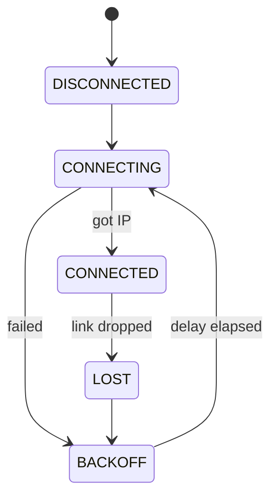
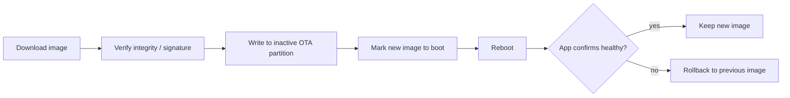

# ESP32 Interview Questions

How to use this file: read the **Short answer**, explain it aloud, then check the details. Each question ends with a **Remember** line.

## 1. What is ESP-IDF?

**Short answer:** Espressif's official framework for ESP32-family chips.

It provides drivers, networking, FreeRTOS integration, build and configuration tools (`idf.py`, `menuconfig`), and chip-specific APIs.

**Remember:** ESP-IDF is the production-grade toolchain; Arduino is a layer on top of it.

## 2. Arduino framework vs ESP-IDF

**Short answer:** Arduino is simpler; ESP-IDF gives more control.

| | Arduino | ESP-IDF |
| --- | --- | --- |
| Learning curve | Easy | Steeper |
| Control over chip features | Limited | Full |
| Ecosystem of libraries | Very large | Growing |
| Typical use | Prototypes | Production firmware |

Choose by required control, maintainability, performance, and team expertise.

**Remember:** prototype in Arduino if you like, but decide the framework for production deliberately.

## 3. Why is FreeRTOS relevant on ESP32?

**Short answer:** ESP-IDF is built on FreeRTOS, so tasks, queues, semaphores, and timers are the normal way to structure an application.

Some ESP32 variants have two cores, so also think about:

- **Task affinity:** which core a task runs on (`xTaskCreatePinnedToCore`)
- **Cross-core synchronization:** shared data between cores needs proper locking

**Remember:** on a dual-core ESP32, shared data between tasks can be accessed truly in parallel.

## 4. How would you design Wi-Fi reconnect logic?

**Short answer:** Treat the connection as a state machine with bounded retry and backoff.



Design points:

- Increase the delay between retries (backoff) and cap it
- Do not block application-critical work while the network is down
- Report connection state to the rest of the system

**Remember:** the application should keep working when Wi-Fi is down.

## 5. What is NVS?

**Short answer:** Non-Volatile Storage, a key-value store in flash for data that must survive a reset.

```c
nvs_handle_t h;
nvs_open("config", NVS_READWRITE, &h);       /* open a namespace called "config" */
nvs_set_u32(h, "boot_count", count);         /* stage the value */
nvs_commit(h);                               /* write it to flash (do not forget this) */
nvs_close(h);
```

Typical use: configuration, calibration, small state.

**Watch out:** flash wears out. Do not write frequently-changing data (such as a value updated every second) without considering endurance.

**Remember:** `nvs_commit`, and mind the wear.

## 6. What is the typical approach to OTA?

**Short answer:** Download to the inactive slot, verify, mark it for boot, and roll back if it fails validation.



The exact mechanism depends on the ESP-IDF version and partition table.

**Remember:** the running image is never overwritten while it runs.

## 7. How would you debug a crash?

**Short answer:** Capture the backtrace, decode it against the exact binary, classify the fault, and reproduce it.

Steps:

1. Capture the panic message and backtrace
2. Decode addresses against the **same** `.elf` that was flashed (for example with `idf.py monitor` or `addr2line`)
3. Classify: memory corruption, stack overflow, invalid access, watchdog timeout, or another fault
4. Reproduce with instrumentation

**Remember:** a backtrace is only meaningful with the exact matching ELF file.

## 8. What should you consider for low-power ESP32 firmware?

**Short answer:** Wake up less, sleep deeper, turn off what you do not use, and measure on the real board.

- Reduce wakeups and batch work
- Choose the right sleep mode (light sleep, deep sleep)
- Shut down unused peripherals and the radio
- Measure actual current with the real hardware

The right design depends on radio duty cycle, wake latency, RAM retention, and external hardware.

**Remember:** estimates lie. Measure with a current meter.

## References

- https://docs.espressif.com/projects/esp-idf/en/latest/esp32/get-started/
- https://docs.espressif.com/projects/esp-idf/en/latest/esp32/api-reference/
