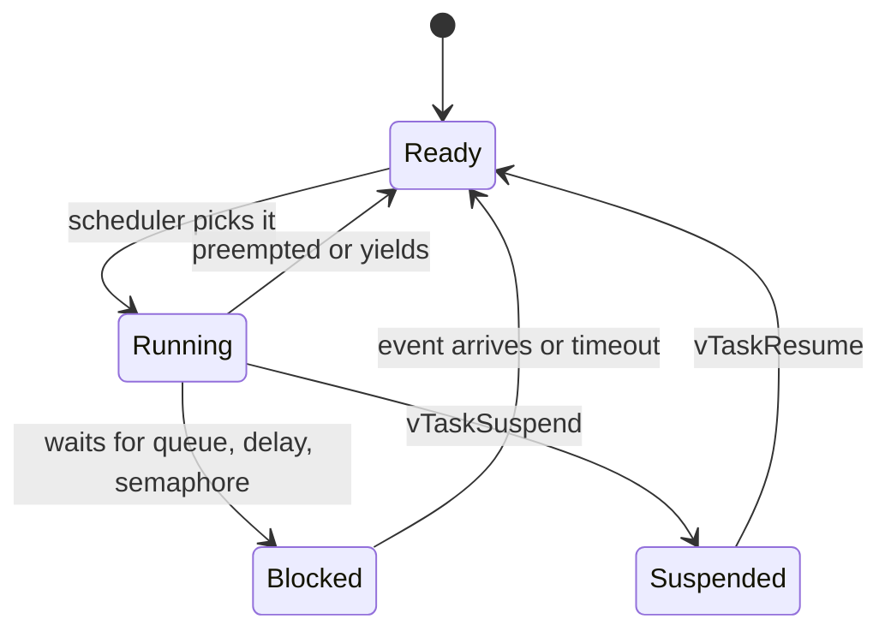
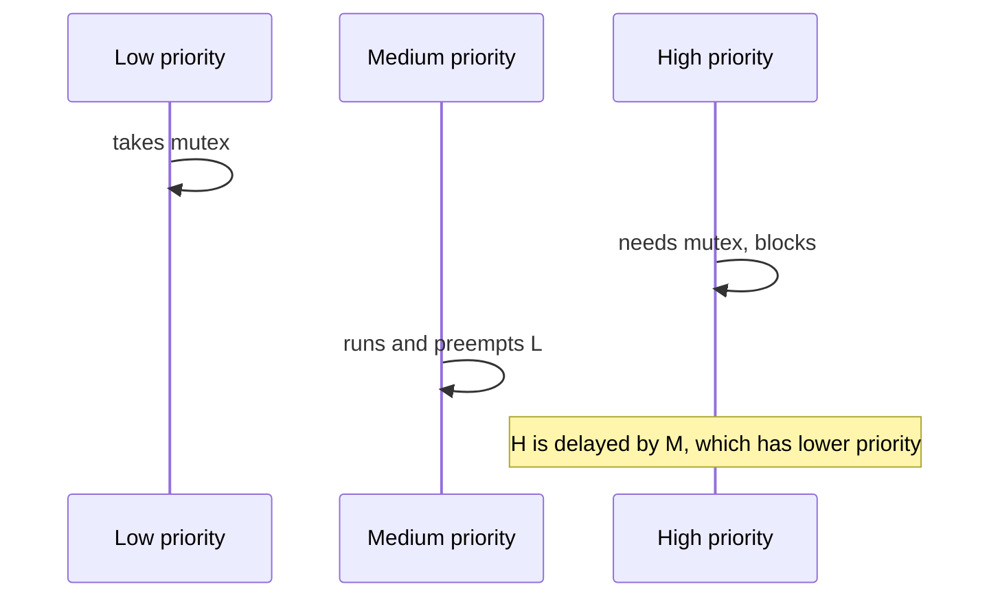

# FreeRTOS Interview Questions

How to use this file: read the **Short answer**, explain it aloud, then check the details and the commented example. Each question ends with a **Remember** line.

## 1. What is a task?

**Short answer:** An independent flow of execution with its own stack, scheduled by the RTOS.



**Remember:** a blocked task uses no CPU. That is the main benefit of an RTOS.

## 2. Why use an RTOS?

**Short answer:** To structure concurrent activities (communication, sampling, logging, control) with predictable blocking and coordination.

The value is **predictable coordination**, not that the code becomes faster.

**Remember:** an RTOS adds structure and determinism, not speed.

## 3. Mutex vs binary semaphore

**Short answer:** A mutex protects a resource and has an owner. A binary semaphore signals an event.

| | Mutex | Binary semaphore |
| --- | --- | --- |
| Purpose | Mutual exclusion | Signalling |
| Ownership | Yes (the task that took it gives it back) | No |
| Priority inheritance | Usually yes | No |
| Give from an ISR | No | Yes |

```c
/* Mutex: take, use the shared resource, give back (same task). */
xSemaphoreTake(bus_mutex, portMAX_DELAY);
spi_transfer(...);
xSemaphoreGive(bus_mutex);

/* Binary semaphore: the ISR gives, a task takes (different contexts). */
void EXTI_IRQHandler(void) {
    BaseType_t woken = pdFALSE;
    xSemaphoreGiveFromISR(event_sem, &woken);   /* ISR-safe version */
    portYIELD_FROM_ISR(woken);
}
```

**Remember:** mutex means ownership, semaphore means signalling.

## 4. Why use a queue instead of a semaphore for data?

**Short answer:** A semaphore says "something happened". A queue carries the actual data.

- Semaphore: event or resource available (no payload)
- Queue: discrete data items are copied through it

If the receiver needs the value or bytes, use a queue (or another buffering primitive).

**Remember:** use a queue when the receiver needs the data itself.

## 5. What is priority inversion?

**Short answer:** A high-priority task waits on a low-priority task, while a medium-priority task runs freely.



**Fix:** priority inheritance. The mutex holder temporarily gets the priority of the highest waiter, so the medium task cannot preempt it.

**Remember:** use a mutex (not a binary semaphore) for shared resources so you get priority inheritance.

## 6. What is deadlock?

**Short answer:** Tasks wait forever on each other in a cycle.

```text
Task A holds Lock 1, waits for Lock 2
Task B holds Lock 2, waits for Lock 1     -> neither can continue
```

Prevention:

- Always take locks in the same global order
- Keep locks short
- Use timeouts where appropriate
- Prefer simpler ownership models

**Remember:** consistent lock ordering removes the cycle.

## 7. What should an ISR do?

**Short answer:** The minimum time-critical work, using ISR-safe APIs, then defer the rest to a task.

```c
void UART_IRQHandler(void)
{
    uint8_t byte = UART->RDR;                       /* 1. grab the data before it is overwritten */
    BaseType_t woken = pdFALSE;
    xQueueSendFromISR(rx_queue, &byte, &woken);     /* 2. hand it to a task (note: ...FromISR) */
    portYIELD_FROM_ISR(woken);                      /* 3. switch to the task now if it is higher priority */
}
```

**Never** call a normal task API from an ISR just because a similar name exists. Use the `...FromISR` version.

**Remember:** in an ISR, use only `...FromISR` functions.

## 8. Tick, SysTick, and software timer

**Short answer:** They are three different things.

| Term | Meaning |
| --- | --- |
| RTOS tick | The periodic time base the scheduler uses |
| SysTick | One hardware timer on Cortex-M that can generate that tick |
| Software timer | An RTOS-managed callback that runs after a delay or periodically |

A software timer callback runs in the timer service task, so it must not block.

**Remember:** tick is the heartbeat, SysTick is a common source, software timers are callbacks built on top.

## 9. What is stack overflow in a task?

**Short answer:** A task used more stack than it was given, corrupting nearby memory.

Causes: large local variables, deep call chains, recursion, library code such as `printf`.

```c
/* How much stack has this task ever left unused? Smaller number = closer to overflow. */
UBaseType_t left = uxTaskGetStackHighWaterMark(NULL);
```

Use overflow detection (`configCHECK_FOR_STACK_OVERFLOW`), the high-water mark during validation, and fault logging.

**Remember:** check the high-water mark under the worst-case workload.

## 10. How do you measure CPU load?

**Short answer:** Measure how much time is spent in the idle task.

```c
static volatile uint32_t idle_count;

void vApplicationIdleHook(void) { idle_count++; }     /* runs only when nothing else can run */

/* Every second: load % = 100 - (idle_count / idle_count_when_system_is_idle * 100) */
```

Account for measurement overhead and interrupt time. `configGENERATE_RUN_TIME_STATS` can break the time down per task.

**Remember:** CPU load equals time not spent idle.

## 11. When would you use task notification?

**Short answer:** For lightweight, direct signalling to one task.

```c
/* ISR or another task wakes the parser task: no queue or semaphore object needed. */
xTaskNotifyGive(parser_task_handle);

/* In the parser task: sleep until notified. */
ulTaskNotifyTake(pdTRUE, portMAX_DELAY);
```

Notifications use less RAM and are faster than a general semaphore, and they work as event bits or counts.

**Remember:** notification = a tiny signal built into each task.

## 12. How should a 1 ms periodic task be implemented?

**Short answer:** Use `vTaskDelayUntil`, not `vTaskDelay`.

```c
void control_task(void *arg)
{
    TickType_t last_wake = xTaskGetTickCount();          /* reference point */
    for (;;) {
        control_step();                                   /* must finish within the period */
        vTaskDelayUntil(&last_wake, pdMS_TO_TICKS(1));    /* wake at fixed times: no drift */
    }
}
```

`vTaskDelay(1)` waits 1 tick after the work finishes, so the period stretches by the work time and drifts.

**Remember:** absolute period (`vTaskDelayUntil`), and the work must fit inside it.

## References

- https://www.freertos.org/Documentation/
- https://www.freertos.org/Documentation/02-Kernel/02-Kernel-features/02-Queues-mutexes-and-semaphores/04-Mutexes
