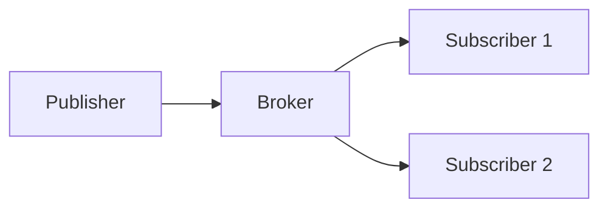

# Embedded Communication Protocol Interview Questions (Basics)

How to use this file: read the **Short answer** first, then the details. Each section covers one protocol.

## Quick comparison

| Protocol | Clock | Wires | Devices | Speed | Typical use |
| --- | --- | --- | --- | --- | --- |
| UART | Asynchronous (none) | 2 (TX, RX) | 2 (point to point) | Low to medium | Debug console, modems, GPS |
| SPI | Synchronous | 4 (SCK, MOSI, MISO, CS) | Many (one CS each) | High | Flash, displays, fast sensors |
| I2C | Synchronous | 2 (SDA, SCL) | Many (addressed) | Low to medium | Sensors, EEPROM, RTC |
| CAN | Asynchronous, differential | 2 (CANH, CANL) | Many (multi-master) | Medium | Vehicles, industrial |
| Modbus | Serial or TCP | Varies | Many (master-slave) | Low | Industrial sensors, PLCs |
| MQTT | n/a (over TCP) | n/a | Many (via broker) | n/a | IoT telemetry |

---

## UART

### What is UART?

**Short answer:** An asynchronous serial interface with independently configured baud rate, framing, and optional flow control.

```text
Idle(1) | Start(0) | D0 D1 D2 D3 D4 D5 D6 D7 | [Parity] | Stop(1) | Idle(1)
```

### What is baud rate?

**Short answer:** The number of symbols sent per second. In common binary UART, one symbol is one bit.

```text
115200 baud with 8N1 (10 bits per byte)  ->  about 11520 bytes per second
```

### What are the parts of a UART frame?

- One **start bit** (always 0): marks the beginning of a frame
- 5 to 9 **data bits** (8 is most common)
- An optional **parity bit** for error detection
- 1 or 2 **stop bits** (always 1): the line returns to idle

Both sides must agree on all of these in advance, because there is no shared clock to negotiate them.

### What are a start bit and a stop bit used for?

**Short answer:** The start bit's falling edge tells the receiver where to begin sampling. The stop bit returns the line to idle and guarantees a gap before the next frame.

### Synchronous vs asynchronous communication

| | Synchronous (SPI) | Asynchronous (UART) |
| --- | --- | --- |
| Clock | Shared clock line | No clock line |
| Timing | Both sides use the clock | Both sides must be pre-configured to the same baud |

### What is UART hardware flow control?

**Short answer:** RTS and CTS lines let a receiver tell the sender to pause when its buffer is nearly full.

It is optional. Many simple links (debug consoles) do not use it.

---

## SPI

### Why is SPI faster than I2C in many designs?

**Short answer:** SPI uses push-pull signalling and simple framing, so it can run at higher rates. The trade-off is more wires and one chip-select per slave.

### Is SPI full duplex?

**Short answer:** Yes. Separate MOSI and MISO lines let data go both ways at the same time.

### What are the four SPI signal lines?

| Line | Meaning | Driven by |
| --- | --- | --- |
| SCK | Serial clock | Master |
| MOSI | Master Out, Slave In | Master |
| MISO | Master In, Slave Out | Slave |
| CS / SS | Chip select (active low) | Master |

### Why does SPI need a chip-select line per slave?

**Short answer:** MOSI, MISO, and SCK are shared by all slaves, so nothing else says which slave should respond.

The master pulls exactly one slave's CS low. Every other slave ignores the bus while its CS is high.

### What are CPOL and CPHA?

**Short answer:** CPOL is the clock idle level (0 = low, 1 = high). CPHA picks the sampling edge (0 = first, 1 = second).

| Mode | CPOL | CPHA |
| --- | --- | --- |
| 0 | 0 | 0 |
| 1 | 0 | 1 |
| 2 | 1 | 0 |
| 3 | 1 | 1 |

Master and slave must use the same mode, or data is sampled at the wrong instant and corrupted.

### Does SPI have standard addressing like I2C?

**Short answer:** No. It relies on chip-select lines, and the data format is chosen by each chip.

That makes SPI simple and fast, but it needs more pins as devices are added.

---

## I2C

### Why does I2C use open-drain signalling?

**Short answer:** Devices only pull the line low, and pull-up resistors restore the high level. Many devices can share the bus without driving opposing levels.

### What is clock stretching?

**Short answer:** A slave holds SCL low to delay the master, where the device and controller support it.

### What are the two I2C signal lines?

- **SDA:** serial data
- **SCL:** serial clock, driven by the master

Only two wires are needed, however many devices share the bus.

### How does I2C addressing work?

**Short answer:** Each device has a unique address (usually 7-bit, so up to 128). The master sends the address plus a read/write bit, and only the matching device answers.

```text
START | 7-bit address | R/W | ACK | data | ACK | ... | STOP
```

### What is ACK and NACK in I2C?

**Short answer:** After every byte, the receiver pulls SDA low for one clock to acknowledge (ACK). If it leaves SDA high, that is a NACK.

A NACK can mean "no device at that address", "cannot accept more data", or an error.

### Standard, Fast, and Fast mode+?

| Mode | Maximum clock |
| --- | --- |
| Standard | 100 kHz |
| Fast | 400 kHz |
| Fast mode+ | 1 MHz |
| High-speed | 3.4 MHz |

Higher speed needs stronger pull-ups and shorter, lower-capacitance wiring.

---

## CAN

### Why is CAN robust in noisy environments?

**Short answer:** It uses differential signalling and arbitration built for multi-node buses, and nodes detect several kinds of errors.

### What is arbitration?

**Short answer:** When several nodes start together, the frame with the higher-priority identifier continues, and the others stop without corrupting it.

### What are CANH and CANL?

**Short answer:** Two wires carrying a differential signal. The receiver looks at the difference, so noise picked up equally by both wires cancels out.

### Dominant vs recessive bits

| Bit | Logic level | Behaviour |
| --- | --- | --- |
| Dominant | 0 | Actively drives the bus; wins |
| Recessive | 1 | Lets the bus float to idle; loses |

If one node drives dominant and another recessive at the same time, dominant wins. Arbitration relies on this.

### What are the main fields in a CAN frame?

```text
SOF | Identifier (11 or 29 bits) | Control (DLC) | Data (0-8 bytes) | CRC | ACK | EOF
```

There is no destination address. The identifier represents the meaning of the message, and each node decides whether to accept it.

### Is CAN master-slave?

**Short answer:** No. It is multi-master. Any node can transmit when the bus is idle, and arbitration resolves conflicts.

---

## Modbus

### RTU vs TCP?

**Short answer:** RTU runs over a serial link such as RS-485. TCP carries Modbus data over TCP/IP.

### Is Modbus master-slave or peer-to-peer?

**Short answer:** Master-slave (client-server). The master starts every request. Slaves only answer when addressed.

The master must poll each device, because slaves never send data unprompted.

### What is a function code?

**Short answer:** A number in the request that says what to do, for example read holding registers or write a single register.

The response echoes the function code, or a modified version with an error flag set.

---

## MQTT

### Why is MQTT used in IoT?

**Short answer:** It is a lightweight publish/subscribe protocol for constrained devices and unreliable or limited links. A broker decouples publishers from subscribers.

### What is QoS?

| Level | Name | Meaning |
| --- | --- | --- |
| 0 | At most once | Sent once, may be lost |
| 1 | At least once | May be delivered more than once |
| 2 | Exactly once | Delivered once, with the highest overhead |

Weigh reliability, bandwidth, latency, and duplicate handling together.

### What is a topic in MQTT?

**Short answer:** A slash-separated string that says what a message is about, for example `home/livingroom/temperature`.

Publishers send to a topic. Subscribers register interest, including wildcards, and the broker routes messages.

### What is a broker, and why is it needed?

**Short answer:** The central server all clients connect to. It receives every published message and forwards it to the subscribers of that topic.



### What transport does MQTT normally use?

**Short answer:** TCP, often with TLS. Its own headers are very small, which is why it is called lightweight.

---

## USB

### What is USB, and why is it used in embedded systems?

**Short answer:** A widely supported connector and protocol with hot-plug and power over the same cable.

Common uses: firmware flashing and debugging, a virtual COM port, mass storage, and HID input devices.

### Host vs device roles

**Short answer:** The host controls the bus and starts all communication. A device only responds when addressed.

Some systems support USB OTG, where one port can act as either role.

### Common USB speed classes

| Class | Speed |
| --- | --- |
| Low Speed | 1.5 Mbps (simple HID) |
| Full Speed | 12 Mbps |
| High Speed | 480 Mbps (USB 2.0) |
| SuperSpeed | 5 Gbps and above (USB 3.x) |

Most simple embedded peripherals only need Full Speed or High Speed.

---

## Ethernet

### What is Ethernet, and what does a frame contain?

```text
| Dest MAC | Source MAC | Type/Length | Payload | FCS (checksum) |
```

### What is a MAC address?

**Short answer:** A 48-bit hardware address, usually fixed by the manufacturer, that identifies a device on its local network segment.

| Address | Layer | Used for |
| --- | --- | --- |
| MAC | Link | Local delivery |
| IP | Network | Routing across networks |

### Switch vs hub

| Hub | Switch |
| --- | --- |
| Repeats every signal to all ports | Forwards a frame only to the port of the destination MAC |
| One shared collision domain | Devices talk at the same time without collisions |

Virtually all embedded Ethernet designs use switches.

---

## TCP/IP

### TCP vs UDP

**Short answer:** TCP is connection-oriented and reliable. UDP is connectionless, with lower overhead and no delivery guarantee.

UDP suits simple sensor telemetry or streaming, where an occasional dropped packet is acceptable.

### IPv4 vs IPv6

| | IPv4 | IPv6 |
| --- | --- | --- |
| Address size | 32 bits | 128 bits |
| Written as | `192.168.1.10` | Hexadecimal groups |
| Addresses | About 4.3 billion (exhausted) | Vastly larger space |

### What is a port number?

**Short answer:** A number from 0 to 65535 that identifies an application on a device, on top of the IP address that identifies the device.

Examples: 80 for HTTP, 1883 for MQTT.

---

## Interview exercise

Given a sensor MCU connected to a modem, explain how you would choose between UART, SPI, I2C, CAN, and MQTT.

A strong answer starts from distance, topology, and the electrical layer, then covers throughput, latency, reliability, addressing, software complexity, and system architecture.
