# Advanced Coding — 01 State Machines

These are design-oriented interview exercises for senior/staff embedded engineers and embedded architects. A strong solution should state assumptions, interfaces, memory ownership, timing constraints, concurrency model, failure behavior, and test strategy — and, at this level, should also justify *why* a given implementation pattern (switch-case, table-driven, hierarchical) was chosen over the alternatives.

## Reference pattern: a table-driven FSM

Most of the design questions below are best answered by first anchoring on a concrete implementation pattern rather than jumping straight to a `switch` statement. A table-driven FSM separates the *transition data* (which states/events map to which next-state and action) from the *dispatch logic* (a small, fixed loop that looks up the table), which makes the state machine easier to review, unit test, and even auto-generate from a state chart.

```c
typedef enum { ST_IDLE, ST_ARMED, ST_ACTIVE, ST_FAULT, ST_COUNT } state_t;
typedef enum { EV_START, EV_TRIGGER, EV_STOP, EV_FAULT, EV_COUNT } event_t;

typedef void (*action_fn)(void *ctx);

typedef struct {
    state_t next_state;
    action_fn on_transition; /* NULL if no action, never blocks */
} transition_t;

/* transition_table[state][event] -- unreachable combinations map to
 * {current-state-equivalent, NULL} rather than being left undefined. */
static const transition_t transition_table[ST_COUNT][EV_COUNT] = {
    [ST_IDLE]   = { [EV_START]   = { ST_ARMED,  arm_outputs } },
    [ST_ARMED]  = { [EV_TRIGGER] = { ST_ACTIVE, start_actuator },
                    [EV_STOP]    = { ST_IDLE,   disarm_outputs } },
    [ST_ACTIVE] = { [EV_STOP]    = { ST_IDLE,   stop_actuator },
                    [EV_FAULT]   = { ST_FAULT,  enter_safe_state } },
    [ST_FAULT]  = { [EV_STOP]    = { ST_IDLE,   clear_fault } },
};

bool fsm_dispatch(state_t *state, event_t event, void *ctx)
{
    const transition_t *t = &transition_table[*state][event];

    if (t->next_state == *state && t->on_transition == NULL) {
        return false; /* illegal transition for this state/event pair */
    }
    if (t->on_transition != NULL) {
        t->on_transition(ctx);
    }
    *state = t->next_state;
    return true;
}
```

The senior-level talking points this unlocks: the table is data, so it can be reviewed line-by-line against a state chart in a design review; adding a state/event is a table edit, not a restructured `switch`; illegal transitions are explicit (rather than silently falling through a `default` case); and the whole table can be validated at compile/startup time (e.g., asserting no `NULL` function pointer is called unexpectedly) or even generated from a `.dot`/state-chart tool.

## Platform examples: STM32 and ESP32

Interviewers at this level often ask you to ground a design in a real platform's timer/interrupt/event model rather than leaving it purely abstract — here's the button-debounce FSM (Q1) and the Wi-Fi reconnect FSM (Q4) tied to concrete STM32 (HAL, bare interrupt + timer) and ESP32 (FreeRTOS + `esp_event`) implementations.

### STM32: button debounce FSM driven by a hardware timer tick

On STM32, the idiomatic approach is an EXTI interrupt to catch the raw edge and arm a periodic hardware timer (e.g., `TIM6` at 1 kHz via `HTIM_Base` in HAL) to re-sample the pin a fixed number of times before accepting the new logical state — this keeps debounce timing independent of main-loop jitter and avoids `HAL_Delay()` (which blocks the whole core) inside interrupt or FSM code entirely.

```c
/* Called from TIM6 update IRQ (HAL_TIM_PeriodElapsedCallback), every 1 ms. */
typedef enum { BTN_STABLE_RELEASED, BTN_DEBOUNCE_PRESS, BTN_STABLE_PRESSED, BTN_DEBOUNCE_RELEASE } btn_state_t;

#define DEBOUNCE_TICKS 20u /* 20 ms stable window */

void button_fsm_tick(btn_state_t *state, uint8_t *counter, bool pin_is_low)
{
    switch (*state) {
    case BTN_STABLE_RELEASED:
        if (pin_is_low) { *state = BTN_DEBOUNCE_PRESS; *counter = 0u; }
        break;
    case BTN_DEBOUNCE_PRESS:
        if (!pin_is_low) { *state = BTN_STABLE_RELEASED; }
        else if (++(*counter) >= DEBOUNCE_TICKS) { *state = BTN_STABLE_PRESSED; on_button_pressed(); }
        break;
    case BTN_STABLE_PRESSED:
        if (!pin_is_low) { *state = BTN_DEBOUNCE_RELEASE; *counter = 0u; }
        break;
    case BTN_DEBOUNCE_RELEASE:
        if (pin_is_low) { *state = BTN_STABLE_PRESSED; }
        else if (++(*counter) >= DEBOUNCE_TICKS) { *state = BTN_STABLE_RELEASED; on_button_released(); }
        break;
    }
}
```

The senior-level detail worth stating out loud: `HAL_GPIO_EXTI_Callback()` only wakes the timer/enables sampling (or, more simply, the timer just runs continuously at low cost) — the actual FSM logic never lives inside the EXTI ISR itself, since keeping ISRs to "acknowledge and arm" is what keeps worst-case interrupt latency bounded on a shared interrupt-heavy STM32 project.

### ESP32: Wi-Fi reconnect FSM driven by `esp_event` and FreeRTOS

On ESP32 (ESP-IDF), the Wi-Fi/IP stack posts events (`WIFI_EVENT_STA_DISCONNECTED`, `IP_EVENT_STA_GOT_IP`, etc.) through the `esp_event` loop rather than the application polling connection status — so the reconnect FSM should be driven as an event handler, with backoff implemented via a FreeRTOS software timer rather than blocking the handler itself.

```c
typedef enum { WIFI_ST_DISCONNECTED, WIFI_ST_CONNECTING, WIFI_ST_BACKOFF, WIFI_ST_READY, WIFI_ST_FATAL } wifi_state_t;

static wifi_state_t s_state = WIFI_ST_DISCONNECTED;
static uint8_t s_retry_count = 0u;
static TimerHandle_t s_backoff_timer;

static void wifi_event_handler(void *arg, esp_event_base_t base, int32_t id, void *data)
{
    if (base == WIFI_EVENT && id == WIFI_EVENT_STA_START) {
        s_state = WIFI_ST_CONNECTING;
        esp_wifi_connect();
    } else if (base == WIFI_EVENT && id == WIFI_EVENT_STA_DISCONNECTED) {
        if (s_state == WIFI_ST_FATAL) {
            return; /* bad credentials etc. — do not auto-retry */
        }
        if (++s_retry_count > MAX_RETRIES) {
            s_state = WIFI_ST_FATAL;
            report_persistent_fault();
            return;
        }
        s_state = WIFI_ST_BACKOFF;
        /* exponential backoff with jitter, capped, run on a software timer
         * rather than vTaskDelay() inside the event-handler task */
        uint32_t delay_ms = backoff_delay_ms(s_retry_count);
        xTimerChangePeriod(s_backoff_timer, pdMS_TO_TICKS(delay_ms), 0);
        xTimerStart(s_backoff_timer, 0);
    } else if (base == IP_EVENT && id == IP_EVENT_STA_GOT_IP) {
        s_retry_count = 0u;
        s_state = WIFI_ST_READY;
    }
}

/* FreeRTOS timer callback fires after the backoff interval elapses */
static void backoff_timer_callback(TimerHandle_t xTimer)
{
    s_state = WIFI_ST_CONNECTING;
    esp_wifi_connect();
}
```

The senior-level detail worth calling out: the event handler never blocks (no `vTaskDelay`) — backoff is delegated to a FreeRTOS software timer callback, since the `esp_event` default loop runs handlers on a shared task, and blocking there would stall delivery of every other pending system event, not just Wi-Fi ones.

## 1. Design a button debounce FSM

Define stable/reject states, sample timing, press/release events, and ensure no blocking delay.

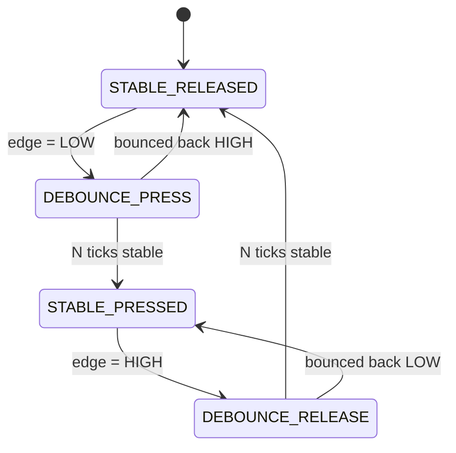

### What the interviewer should hear

- Time-based, not loop-count-based: sample on a periodic tick (5-10 ms) so timing survives main-loop jitter
- A transient DEBOUNCE state per edge, not a single counter — bouncing back cancels the debounce and returns to the prior stable state
- No `delay()`/blocking wait — advance via timer tick/scheduler only, or one task stalls every other
- Surface a stuck-high/stuck-low fault instead of silently ignoring it

## 2. Design an AT modem command FSM

Separate SEND, WAIT, PARSE, RETRY, TIMEOUT, and ERROR; handle unsolicited responses independently.

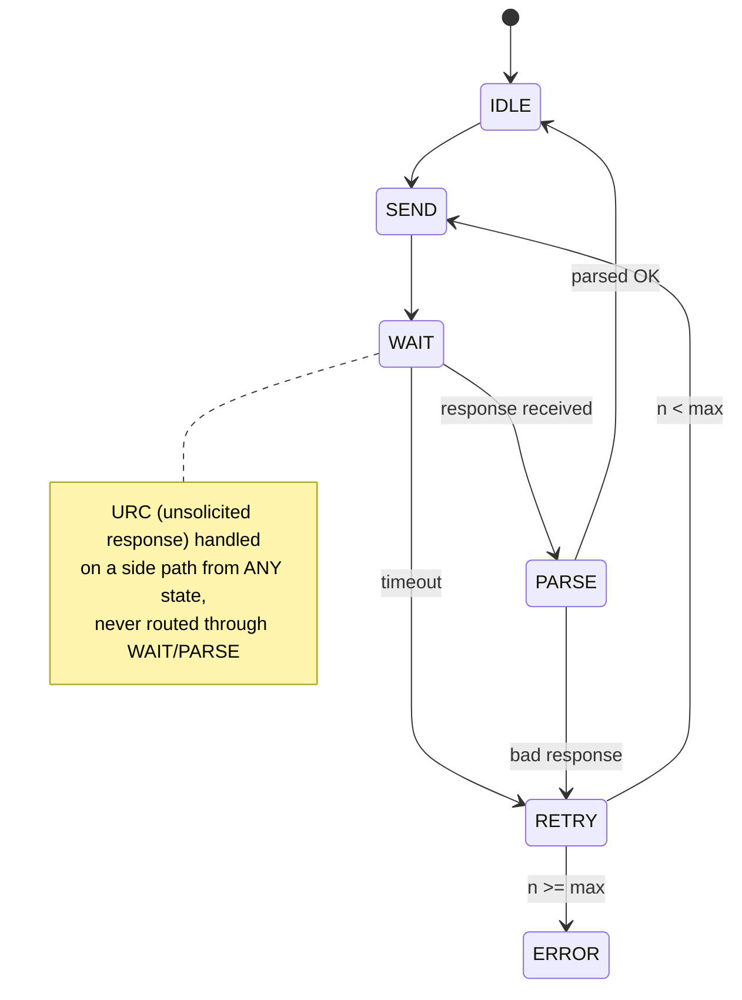

### What the interviewer should hear

- One response-wait timer per command, armed only on entering WAIT — a hung modem can't block the FSM forever
- URCs (unsolicited responses) handled on a side path from *any* state, never routed through command/response states
- Bounded retries with backoff, terminal ERROR/FATAL only after retries exhaust — never an infinite loop
- Explicit policy for a second command arriving mid-WAIT: queued, rejected, or asserted

## 3. Design a firmware update FSM

Use DOWNLOAD, VERIFY, STAGE, ACTIVATE, BOOT_VALIDATE, CONFIRMED, and ROLLBACK states.

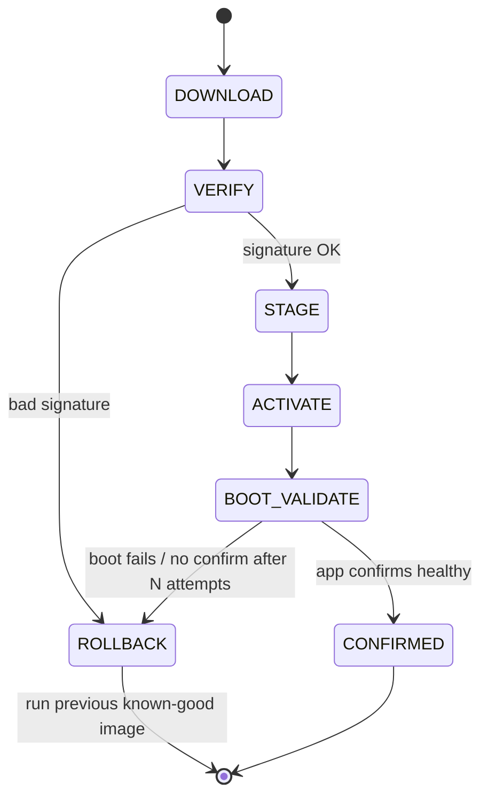

### What the interviewer should hear

- Persisted state (active slot, pending status) must survive power loss at *any* transition — one atomic write per change, never a multi-step update
- BOOT_VALIDATE has a bounded retry count before auto-ROLLBACK, preventing an infinite boot-crash-reboot brick loop
- Signature/hash check happens in VERIFY *before* ACTIVATE ever runs the image — order is the whole point of the scheme
- CONFIRMED means "the app says it's good," not just "it booted" — a boot-successful-but-broken image should still roll back

## 4. Design a Wi-Fi reconnect FSM

Separate disconnected, connecting, network-ready, application-ready, backoff, and fatal states.

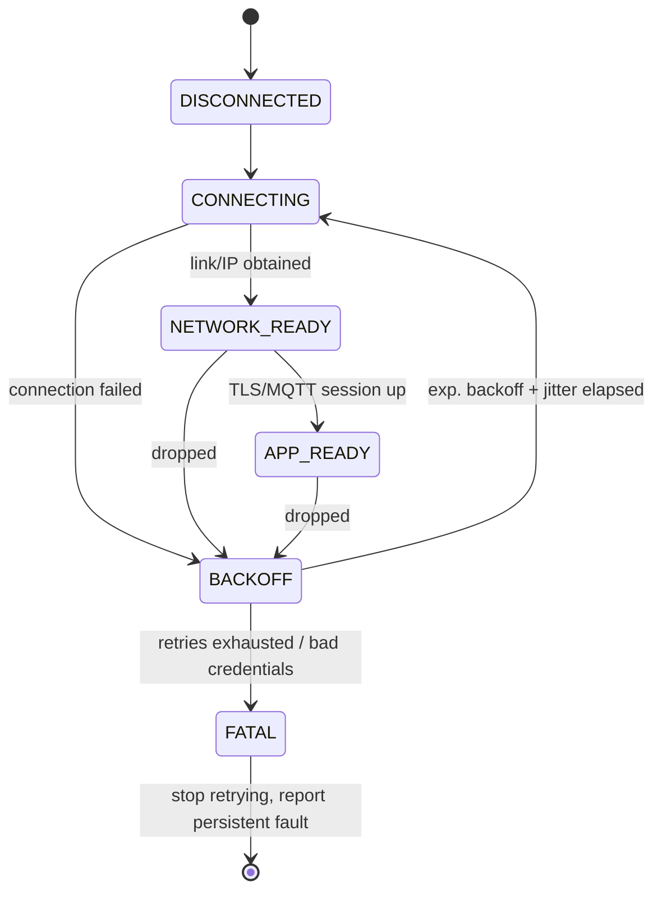

### What the interviewer should hear

- Exponential backoff with a cap and jitter — avoids hammering a down AP and avoids many devices retrying in lockstep
- NETWORK_READY (link/IP) is explicitly separate from APP_READY (MQTT/TLS session) — conflating them misreports connectivity
- Transient failure (retry) vs fatal failure (bad credentials) must be distinguished — fatal stops retrying and surfaces a fault
- Explicit policy for outbound data during BACKOFF: queued, dropped, or blocked — a deliberate choice, not an accident

## 5. Design a motor controller FSM

Include startup, ramp, run, stop, fault, and recovery with current/speed guards.

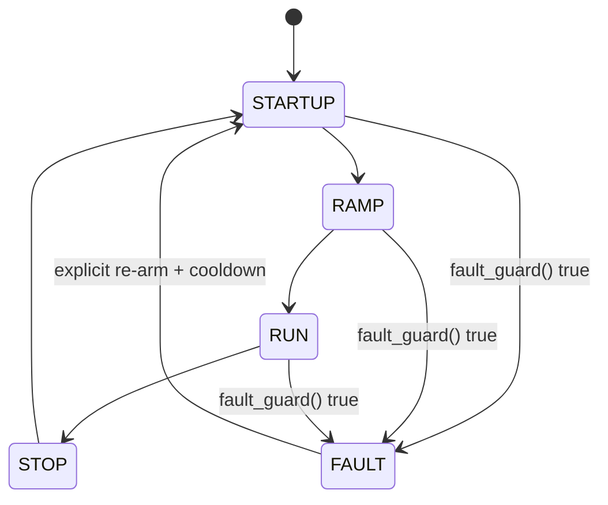

### What the interviewer should hear

- fault_guard() (overcurrent/stall/overspeed) is checked from every state, not just RUN — a fault during RAMP must trip FAULT immediately
- FAULT's entry action cuts power unconditionally, regardless of which state it was entered from
- Recovery needs an explicit, deliberate re-arm (+ cooldown) — never auto-retry re-energizing a just-faulted motor
- Guards are named boolean predicates evaluated once per tick, not comparisons duplicated across states

## 6. Design a battery charger FSM

Model idle, precharge, constant-current, constant-voltage, termination, fault, and thermal limits.

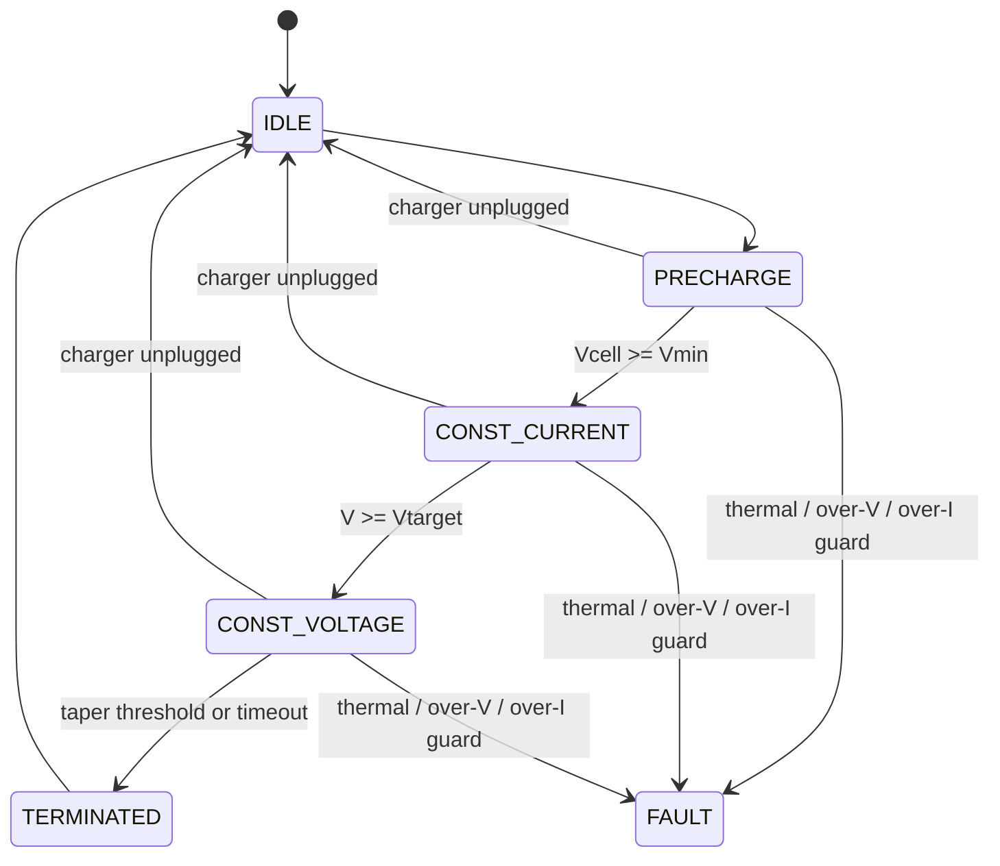

### What the interviewer should hear

- Thermal/voltage/current limits are cross-cutting guards checked in *every* charging state — an overriding supervisory layer, not "one more state"
- Named, explicit transition thresholds (Vmin for precharge exit, Vtarget for CC→CV) — a silently wrong threshold here is a safety defect
- Termination must be bounded by a timeout as well as the taper threshold, so a bad cell can't charge forever
- Charger-unplug mid-cycle is a first-class transition from every state, not an unhandled case

## 7. Design a packet parser FSM

Use sync/header/payload/CRC states with bounded length and guaranteed recovery after malformed input.

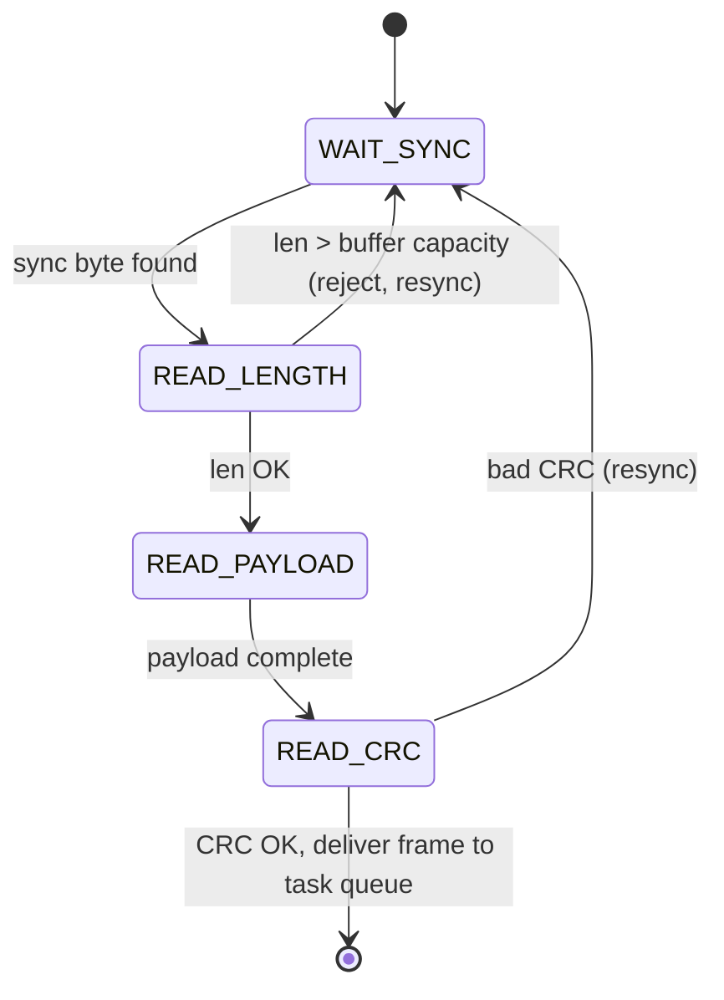

### What the interviewer should hear

- Every state has a byte-count/timeout bound — a malformed or malicious stream can't stall the parser forever
- Any validation failure returns to WAIT_SYNC to scan for the next sync marker, not a retry of the same byte
- Declared length is checked against buffer capacity *before* copying — this is the parsing-bug-vs-overflow line
- Byte-level parsing (ISR/lightweight) is separate from message handling (task) — coupling them risks dropped bytes

## 8. Design a USB-like enumeration FSM

Represent reset, descriptor exchange, configuration, operational, and error states; define timeout handling.

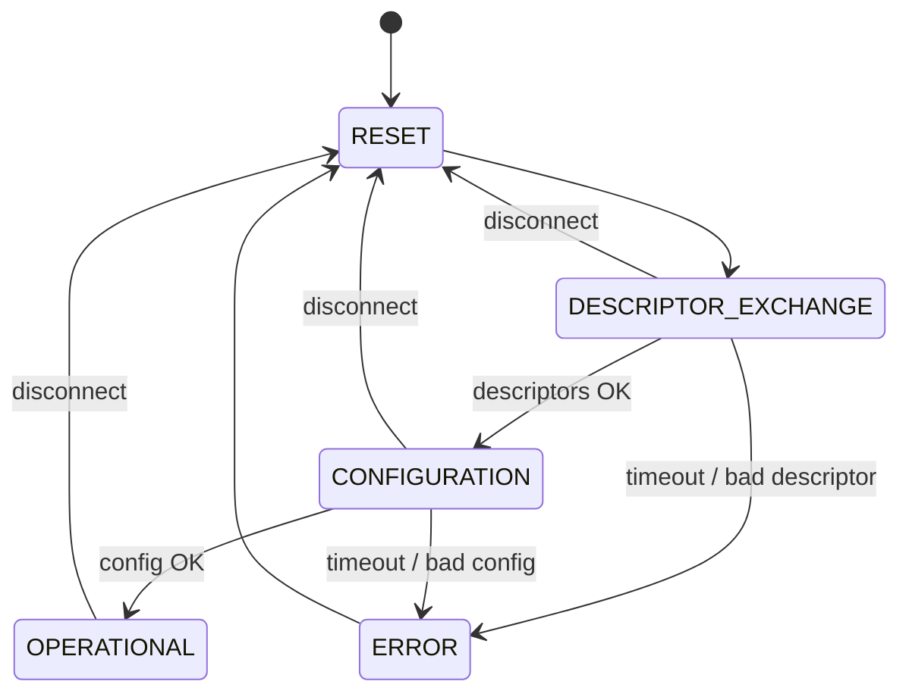

### What the interviewer should hear

- Every response-waiting state has its own timeout — a non-compliant/disconnected peer can't hang the controller
- Disconnect is an explicit transition back to RESET from *every* intermediate state, not just the expected ones
- Protocol errors (bad descriptor) and timeout errors are distinguished — they may need different retry/logging behavior
- Enumeration can be cleanly re-entered after failure without requiring a full power cycle

## 9. Design an elevator controller FSM

Identify motion, door, request, obstruction, timeout, and fault states before implementing outputs.

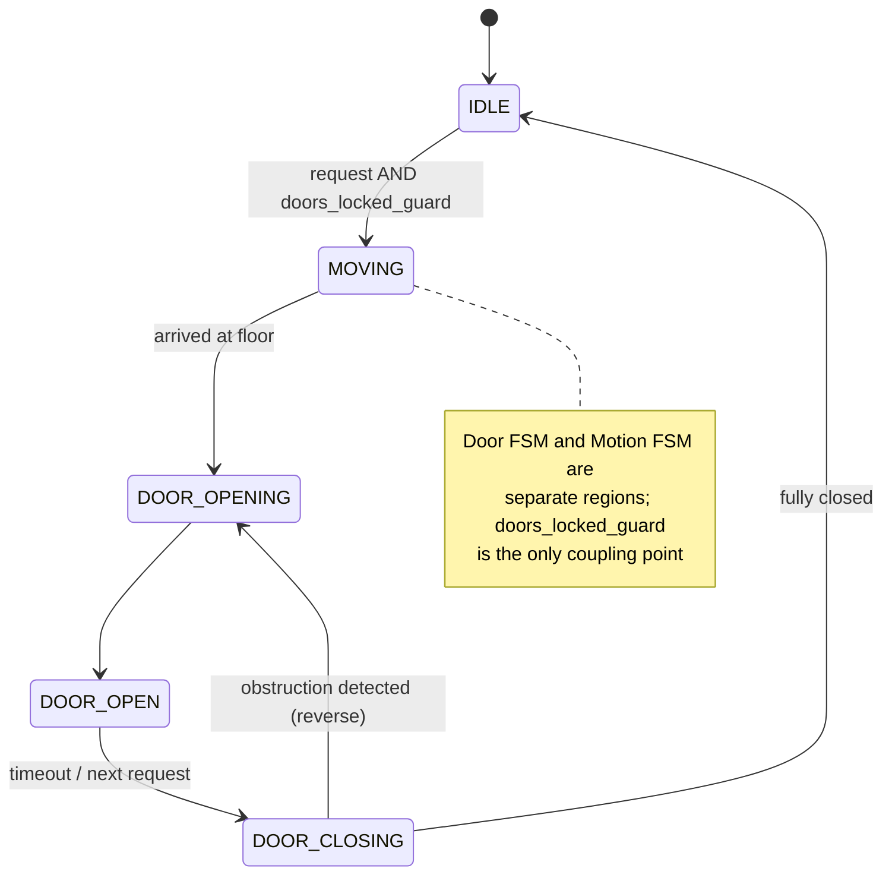

### What the interviewer should hear

- Door and motion are loosely-coupled orthogonal regions; "can't move unless doors_locked" is a structural guard, not a remembered check
- Obstruction interrupts DOOR_CLOSING at any point and reverses to DOOR_OPENING — a safety requirement, not a UX nicety
- The floor-request queue is a separate concern from current motion state — the FSM just consumes "next request"
- Fault (e.g., stuck between floors) has a defined safe state plus an alarm path, distinct from "idle, waiting for a request"

## 10. Design a safe-state supervisor FSM

Every fault path must converge on a defined safe state and a bounded recovery/escalation policy.

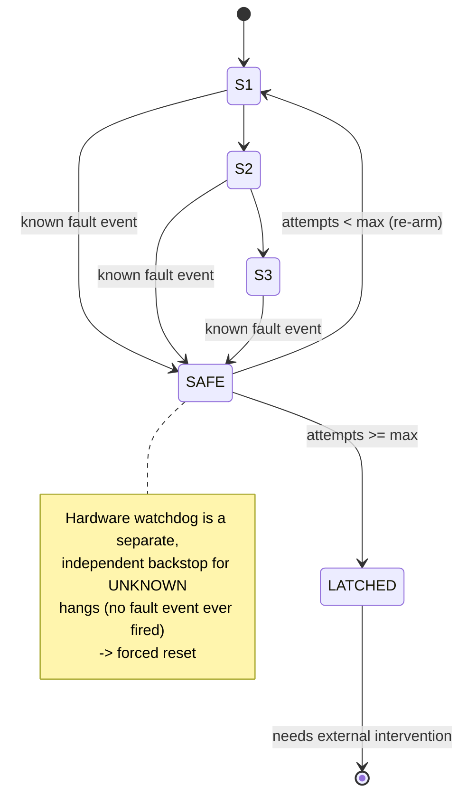

### What the interviewer should hear

- A single SAFE sink state reachable from every state, verified as a direct edge — not indirectly through a state that might itself be stuck
- SAFE's entry action is unconditional and side-effect-guaranteed (e.g., disable outputs), even on unexpected/undefined input
- A bounded, explicit escalation policy: N recovery attempts, then LATCHED requiring external intervention
- The supervisor (known faults) and hardware watchdog (unknown hangs) are complementary — neither replaces the other

## Senior / Staff / Architect-Level Questions

## 11. What is a hierarchical (nested) state machine, and why would you use one over a flat FSM?

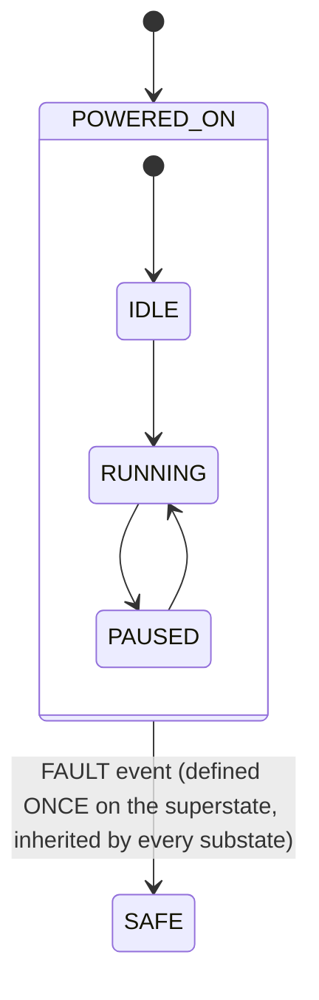

A hierarchical state machine lets states contain sub-states, so a set of common transitions/guards defined on a "superstate" apply automatically to every sub-state nested within it, instead of being duplicated on each one — the diagram above shows one `FAULT -> SAFE` edge covering `IDLE`, `RUNNING`, and `PAUSED` at once. This matters at scale because a flat FSM with N states and a handful of cross-cutting events grows transition tables combinatorially (and error-pronely, since it's easy to forget a `FAULT` transition on a newly added state), while a hierarchical design lets you add a new substate under an existing superstate and get its safety transitions "for free." The trade-off is added implementation complexity (entry/exit actions must run correctly across nested boundaries, e.g., using UML statechart semantics), so I'd justify it specifically when there's a real, recurring set of cross-cutting transitions — not just because it "seems more proper."

## 12. How would you formally verify that a state machine design has no unreachable states, no deadlock states, and no undefined transitions before writing any code?

At the architecture level, I'd model the FSM as a directed graph (states as nodes, transitions as edges) and run graph-level checks: reachability analysis from the initial state to confirm every defined state is actually reachable (an unreachable state usually indicates a design error or dead code waiting to happen); a check for any non-terminal state with no outgoing transition for a required recovery/fault event (a deadlock candidate); and completeness — for every (state, event) pair that's physically possible, confirming there's a defined transition or an explicit "ignored, no-op" entry, rather than leaving it undefined and hoping it's never hit. For anything safety-relevant, I'd consider a model checker (e.g., SPIN, or even a simple exhaustive-enumeration script against the transition table) that can prove properties like "SAFE is reachable from every state" rather than relying on manual review, since manual review of a large transition table reliably misses cases as the state count grows.

## 13. How do you unit test a state machine to get meaningful coverage, beyond just testing the "happy path" transitions?

I aim for transition coverage, not just line coverage: every (state, event) pair in the table gets a test, including the ones expected to be illegal/no-ops, asserting the FSM stays in its current state and doesn't silently do something unexpected. Beyond that, I specifically test: every fault-injection path (forcing a FAULT event from each state, not just from RUNNING); every timeout path (using a fake/mockable clock so tests don't actually sleep for real timeout durations); sequences that exercise re-entrancy (e.g., can a FAULT event correctly interrupt a RAMP-to-RUN transition mid-flight, not just from a settled state); and, for a table-driven FSM specifically, I write a small property-based/exhaustive test that walks every table cell and confirms the declared next-state is itself a valid enum value and every action function pointer is non-dangling — catching table-authoring mistakes that a human reviewer might miss.

## 14. How would you design an FSM implementation to be safely shared between an ISR and a task context?

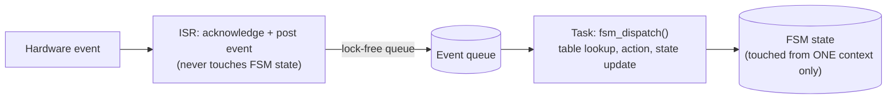

The core design decision is to never let the same state variable be read-modify-written from both contexts without protection, and to minimize what actually happens in the ISR. My usual pattern: the ISR only posts a lightweight event (an enum value) into a small lock-free/interrupt-safe queue (or increments an atomic event counter for coalescable events like "byte received"), and the actual `fsm_dispatch()` call — the table lookup, running the action function, updating `state` — happens entirely in task context, processing events off that queue. This means the FSM's mutable state is only ever touched from one context, sidestepping the need for a mutex around the dispatch itself (mutexes in ISR context are a hazard on most RTOSes anyway). If a mutex-protected FSM is unavoidable (e.g., two different tasks can post events), I'd make sure action functions never block while holding that lock, since that turns a lock meant to protect a few table lookups into a potential priority-inversion source.

## 15. How would you evolve a state machine's design over multiple firmware releases without breaking devices already in the field (state machine versioning)?

This is really a persistence-compatibility problem layered on top of the FSM design: if any part of the FSM's state is persisted (e.g., an OTA update FSM's current stage, stored in flash so it survives reboot), I make sure the persisted representation includes an explicit version/format tag, and that a new firmware version can recognize an old-format record and either migrate it explicitly or force a defined safe re-initialization rather than reinterpreting old state bits under a new enum numbering (a classic bug: adding a new enum value in the middle of an existing `enum state_t` silently renumbers everything after it, corrupting any persisted raw integer). At the design level, I prefer to add new states/events strictly at the *end* of their enums (never insert or reorder) and to treat the transition table itself as versioned data, so a device that's mid-update when new firmware lands has a well-defined path to reconcile its old in-progress state rather than landing in an undefined table cell for a (state, event) combination that didn't exist when it started.

## 16. How would you design a state machine architecture for a product that must run several independent state machines concurrently (e.g., separate FSMs for charging, connectivity, and a user-facing UI) without them interfering with each other?

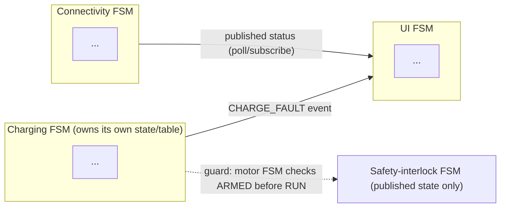

I'd keep each FSM's transition table, state variable, and event queue fully independent and owned by a single task/module — no FSM should reach into another's state directly. Cross-FSM coordination happens through explicit, narrow interfaces: either one FSM posts an event into another's event queue (e.g., the charging FSM posts a `CHARGE_FAULT` event that the UI FSM reacts to by displaying a warning), or through a small set of published status variables/observers that other FSMs poll or subscribe to, rather than a tangle of direct function calls between FSM modules. At the architecture level I'd also identify whether any invariant must hold *across* FSMs (e.g., "the motor FSM must never be in RUN while the safety-interlock FSM is not in ARMED") and implement that as an explicit guard check at the point of the risky transition, referencing the other FSM's published state — making the cross-cutting safety dependency visible in code and in review, rather than an implicit assumption that two independently-evolving state machines happen to stay in sync.

## 17. What are the trade-offs between a switch-case FSM, a table-driven FSM, and a full statechart code-generation tool (e.g., generated from a `.dot`/SCXML model)?

A `switch`-based FSM is the fastest to write and easiest for a newcomer to read for a small number of states, but transition logic is spread across the codebase (implicit `if` conditions buried in each case), it's hard to get a bird's-eye view of the whole transition table for review, and it's easy to accidentally add a valid-looking transition path that wasn't in the design. A table-driven FSM (as in the reference pattern above) makes the transition set an explicit, reviewable data structure, is well suited to automated exhaustiveness checks, and keeps dispatch code identical regardless of how many states exist — at the cost of a layer of indirection (function pointers) that can be marginally less debugger-friendly and requires care to keep the table itself correct. A generated statechart (from a modeling tool) gives the strongest guarantee that the implementation matches an agreed design artifact reviewable by non-programmers (systems engineers, safety reviewers), and can auto-generate the exhaustiveness/reachability proofs — the cost is added toolchain dependency, generated-code review overhead, and a steeper ramp for anyone maintaining it without the tool. My answer as an architect: switch-case for a handful of simple, rarely-changing states; table-driven as the default for anything safety-relevant or with more than ~6-8 states; generated statecharts when the FSM is central to certification (e.g., IEC 61508/ISO 26262 contexts) and a traceable, reviewable design artifact is itself a requirement.

## 18. How do you decide what belongs in a state's entry/exit action versus in the transition itself?

Entry actions should capture "whatever must always be true immediately upon becoming this state," regardless of which state you transitioned from — e.g., FAULT's entry action disables outputs, full stop, no matter whether the fault occurred from RAMP or RUN. Exit actions capture cleanup that must happen no matter which state you're leaving to — e.g., stopping a per-state timer. Anything that depends on the *specific* (from-state, to-state, event) combination belongs on the transition itself, not squeezed into entry/exit — for example, "log a warning only when transitioning from RUN to FAULT due to overcurrent specifically" is transition-specific, not a general FAULT-entry behavior. Getting this split right is what makes hierarchical/nested states actually pay off (per my hierarchical-FSM answer above): if a behavior is correctly placed as superstate entry/exit, adding new substates automatically inherits it; if it's incorrectly duplicated across each transition instead, every newly added substate is one more place someone can forget to add it.

## 19. Walk through how you'd design the state machine for a safety-critical fail-operational system — say, a dual-redundant flight-control or automotive actuator — where simply moving to a "safe/off" state on fault isn't acceptable

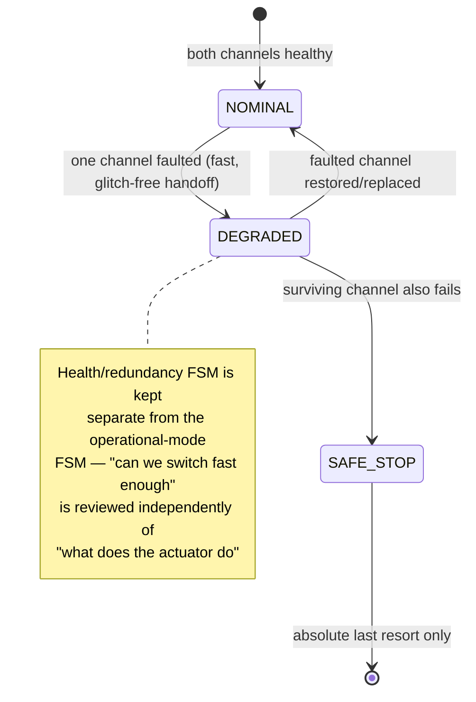

For a fail-operational (not just fail-safe) requirement, the state machine design itself typically needs a redundancy dimension baked in, not just a single-thread fault path. I'd design the FSM to track not just "what am I doing" but "what is my current health/redundancy state" as an orthogonal region — e.g., `NOMINAL` (both channels healthy), `DEGRADED` (one channel faulted, other carrying full load), and only `SAFE_STOP` as an absolute last resort once no channel can safely continue. The transition into `DEGRADED` must itself be provably fast and glitch-free (the handoff from a faulted channel to the surviving one can't produce an unintended actuator transient), which usually means the switchover logic is validated with its own dedicated timing analysis and hardware-in-the-loop fault injection, not just reviewed as "another FSM transition." I'd also make sure the health-state FSM and the operational-mode FSM are cleanly separated (per my answer on concurrent FSMs above) so a reviewer can reason about "can we detect and switch channels fast enough" completely independently from "what does the actuator do once it knows which channel is live" — conflating the two into one giant state machine is exactly what makes these designs unreviewable and, historically, is where subtle certification-blocking bugs hide.

## 20. As an architect, what do you look for when reviewing someone else's state machine design or implementation?

First, whether the state diagram (or table) is the actual source of truth reviewed here, or whether it's a stale diagram next to code that's already diverged — I ask to see the two side by side. Second, I check for the "implicit state" smell: extra boolean flags or counters living outside the declared state variable that, in combination with the declared state, actually encode additional states the diagram doesn't show (a very common way FSMs quietly become buggier than their documentation implies). Third, I check that every state reachable in practice has a bounded exit condition — no state that can only be left by an event that might never arrive, without an accompanying timeout. Fourth, for anything touching hardware or safety, I explicitly trace every fault-input path to confirm it reaches a safe state from every state it can occur in, not just the ones the author happened to think of. And finally, I look at the test suite before the implementation — if the tests only cover the happy path transitions and none of the illegal-transition or timeout cases, that tells me more about the design's real robustness than the code does.
