# Advanced Coding — 02 Driver Design

These are design-oriented interview exercises for senior/staff embedded engineers and embedded architects. A strong solution should state assumptions, interfaces, memory ownership, timing constraints, concurrency model, failure behavior, and test strategy — and back it with a small, concrete example rather than staying purely abstract.

## Reference pattern: layered driver architecture

Almost every question below is best answered by first anchoring on where the layers sit, since that's what determines what's testable without hardware, what's ISR-safe, and what's portable to a different MCU.

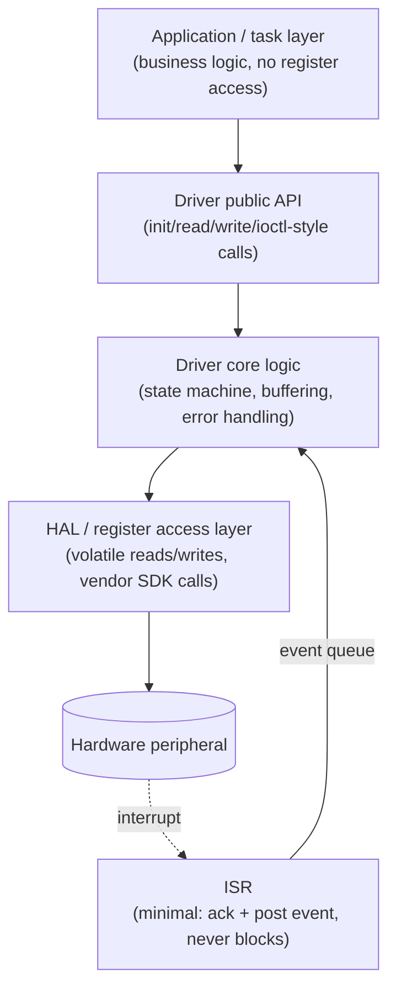

The senior-level point to make explicit: **CORE** never talks to hardware directly, and **HAL** never contains state-machine logic — this split is what lets you unit-test `CORE` on a host machine with a fake HAL, and port the driver to a new chip by rewriting only the HAL layer.

## 1. Design a UART driver

Define init, TX, RX, DMA/ISR, ring buffers, error handling, ownership, and thread safety.

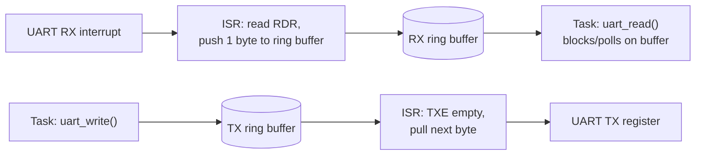

```c
typedef struct {
    uint8_t buf[128];
    volatile uint16_t head, tail;
} uart_ring_t;

/* ISR context: minimal work, never blocks */
void USART_RX_IRQHandler(void)
{
    uint8_t byte = (uint8_t)(USART->RDR);
    uint16_t next = (uint16_t)((rx_ring.head + 1u) % 128u);
    if (next != rx_ring.tail) {           /* drop-on-full policy, never overwrite */
        rx_ring.buf[rx_ring.head] = byte;
        rx_ring.head = next;
    } else {
        rx_overrun_count++;               /* observable, not silent */
    }
}
```

### What the interviewer should hear

- ISR does the absolute minimum (register read/write + buffer index update) — never parses, never blocks, never calls `printf`
- RX and TX ring buffers are separate, each sized for the worst-case burst and documented full/empty policy (drop vs overwrite, and which one and why)
- Overrun/framing/parity errors are counted and exposed, not silently dropped — a senior answer treats "bytes lost" as a metric, not a footnote
- Thread-safety story is explicit: single-producer(ISR)/single-consumer(task) needs no lock if implemented correctly; multiple writer tasks calling `uart_write()` need a mutex around the *enqueue*, not around the ISR

## 2. Design an SPI driver for multiple slaves

Define bus ownership, chip-select management, transaction serialization, and device-specific mode setup.

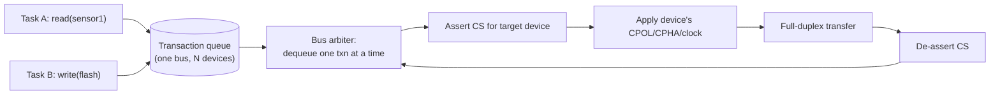

```c
typedef struct {
    uint8_t cs_pin;
    spi_mode_t mode;
    uint32_t clock_hz;
    const uint8_t *tx;
    uint8_t *rx;
    size_t len;
    void (*done_cb)(void *ctx, bool ok);
    void *ctx;
} spi_txn_t;

bool spi_submit(spi_txn_t *txn); /* enqueues; bus arbiter serializes, never blocks caller */
```

### What the interviewer should hear

- The bus is a single shared resource — a transaction queue plus an arbiter is how you avoid one task's CS assertion colliding with another's
- Every device's mode/clock is re-applied per-transaction (not assumed to persist) since two devices on the same bus may need different CPOL/CPHA/speed
- CS is asserted for the *whole* transaction, including any register-address-then-data phases, and de-asserted even on error/timeout — a leaked-asserted CS hangs every other device on the bus
- A senior answer flags DMA-vs-polled trade-offs: DMA frees the CPU during large transfers but needs its own completion-callback path back into the arbiter

## 3. Design an I2C recovery routine

Detect stuck lines, reset/reconfigure the controller, perform bus recovery where supported, and surface errors.

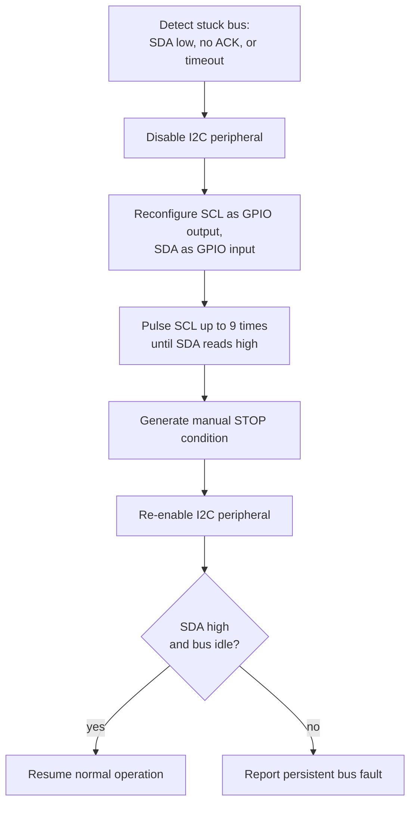

```c
bool i2c_recover_bus(void)
{
    i2c_disable_peripheral();
    gpio_configure_scl_output();
    gpio_configure_sda_input();

    for (uint8_t pulse = 0u; pulse < 9u && !gpio_read_sda(); pulse++) {
        gpio_write_scl(false); delay_us(5u);
        gpio_write_scl(true);  delay_us(5u);
    }
    i2c_generate_stop();
    i2c_enable_peripheral();
    return gpio_read_sda(); /* true = recovered */
}
```

### What the interviewer should hear

- The classic failure mode this fixes: a slave left driving SDA low mid-transaction (e.g., reset while clocking out a bit) — up to 9 manual SCL pulses lets it finish shifting out and release the line
- Recovery must be bounded (9 pulses, not "until it works") and must report failure explicitly if SDA is still stuck afterward, rather than silently retrying forever
- This is a controller-level, driver-internal operation — it shouldn't require an application restart, and every call site that talks to I2C should treat a NACK/timeout as "maybe try recovery," not immediately fatal
- A senior answer also asks: is there a hardware reset line to the affected slave as a stronger fallback if bus recovery alone doesn't clear it?

## 4. Design an ADC streaming driver

Use timer triggering plus DMA, define buffer ownership, half/full callbacks, and overrun handling.

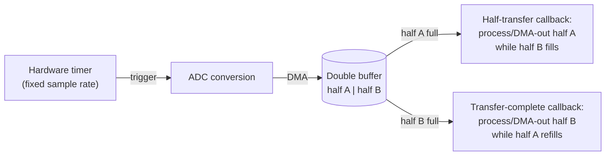

### What the interviewer should hear

- The double-buffer (ping-pong) pattern is the whole point: the DMA controller keeps filling one half while the application processes the other, so there's no window where the CPU must "catch up" before the next sample arrives
- Ownership is explicit and time-boxed: the application only owns a half-buffer between its callback firing and the *next* callback of the same half — touching it later reads data the DMA has already overwritten
- Overrun (the application's half-buffer callback hasn't finished before the DMA wants to write there again) must be detected (a DMA error flag or a timestamp check) and surfaced as a real fault, not silently ignored — a silent overrun means you're now processing partially-overwritten data
- Callbacks fire in interrupt context, so "process" in the diagram above means "copy out or kick off further deferred work," never a slow filter or logging call

## 5. Design a CAN driver

Define TX queues, RX filters, error states, bus-off recovery, timestamps, and bounded buffering.

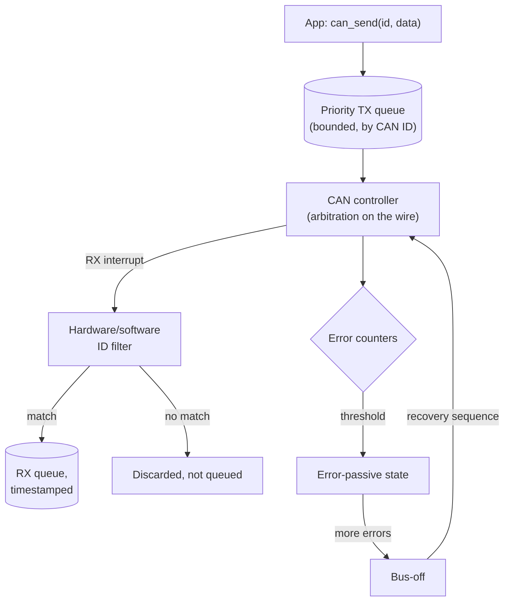

### What the interviewer should hear

- TX queue is bounded and ideally priority-ordered by CAN ID, matching how arbitration itself prioritizes lower IDs on the wire — a design that queues FIFO regardless of ID can starve a high-priority message behind low-priority ones already queued
- RX filtering (hardware mailbox filters where available) happens before software ever sees the frame, so the driver doesn't spend cycles/queue space on traffic the application never wanted
- Every RX frame is timestamped as close to the wire as possible (hardware timestamp if the peripheral supports it) since application-level timestamping after queuing/task-wakeup latency isn't accurate enough for many CAN use cases
- Bus-off recovery must be a defined, bounded sequence (not "just keep retrying transmit") — and the driver should expose the error-passive/bus-off transition as an observable event so the application can react (e.g., stop assuming a peer is reachable)

## 6. Design a GPIO abstraction

Separate pin identity, mode, electrical configuration, and board mapping while keeping the API simple.


```c
typedef enum { PIN_LED_STATUS, PIN_BUTTON_USER, PIN_COUNT } logical_pin_t;

typedef struct { GPIO_TypeDef *port; uint16_t pin; gpio_mode_t mode; } pin_desc_t;

static const pin_desc_t pin_map[PIN_COUNT] = {
    [PIN_LED_STATUS] = { GPIOB, GPIO_PIN_5, GPIO_MODE_OUTPUT_PP },
    [PIN_BUTTON_USER] = { GPIOC, GPIO_PIN_13, GPIO_MODE_INPUT },
};

void gpio_set(logical_pin_t pin, bool level)
{
    HAL_GPIO_WritePin(pin_map[pin].port, pin_map[pin].pin,
                       level ? GPIO_PIN_SET : GPIO_PIN_RESET);
}
```

### What the interviewer should hear

- Application/business logic refers to pins by *logical name* (`PIN_LED_STATUS`), never by port/pin number — this is what lets the same application code run unmodified on a board revision that moves the LED to a different physical pin
- The mapping table is the single place board-specific wiring lives, making a board variant a data change, not a code change scattered across call sites
- The abstraction still needs to expose electrical details that matter functionally (open-drain vs push-pull, pull-up/down, active-high vs active-low) — hiding *too much* leads to a driver that can't correctly express "this output is active-low" without the caller inverting logic themselves
- A senior answer flags that `gpio_set()` here is a trivial wrapper by design — the value is entirely in the mapping table and the logical-name API, not in adding cleverness to the call itself

## 7. Design a watchdog service

Aggregate subsystem health and refresh hardware only when required components report progress.

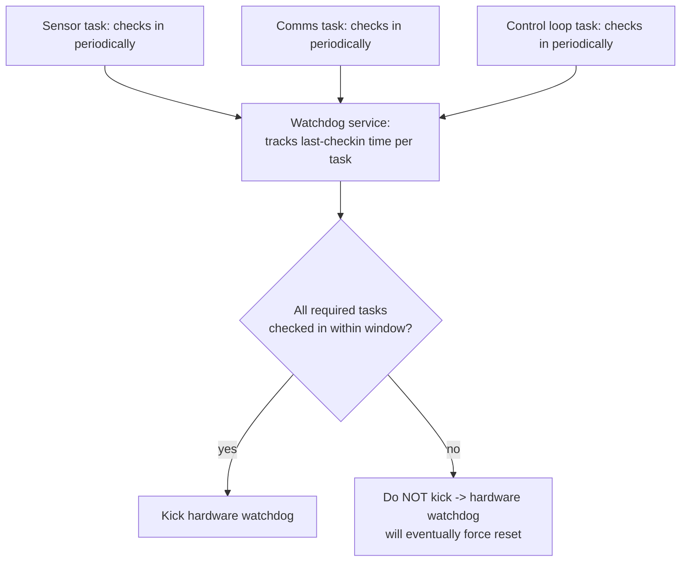

```c
#define TASK_COUNT 3u
static volatile uint32_t last_checkin_tick[TASK_COUNT];

void watchdog_checkin(size_t task_id) { last_checkin_tick[task_id] = get_tick(); }

void watchdog_service_tick(void)
{
    uint32_t now = get_tick();
    for (size_t i = 0u; i < TASK_COUNT; i++) {
        if (now - last_checkin_tick[i] > TASK_TIMEOUT_TICKS) {
            return; /* at least one task is livelocked: withhold the kick */
        }
    }
    hw_watchdog_kick();
}
```

### What the interviewer should hear

- This is a two-tier design specifically to catch a *livelocked-but-still-running* application: a task stuck in a bad loop can still be "alive" enough to let a naive single kick-on-any-activity watchdog pass, while this per-task check-in model catches it
- The hardware watchdog itself must remain the last-resort, dumb, unconditional backstop — the software service decides *whether* to kick it, but the hardware timer's own expiry behavior (forced reset) is never software-overridable, or the whole safety property is gone
- Task timeout windows should be set per-task based on that task's actual worst-case legitimate work interval, not one global number — a control-loop task and an infrequent housekeeping task have very different legitimate check-in periods
- A senior answer distinguishes this software supervisor from the FSM-based safe-state supervisor pattern (see the state-machines topic) — they're complementary layers, not substitutes for each other

## 8. Design a flash storage driver

Handle erase/program granularity, alignment, wear, CRC/versioning, and power-loss recovery.

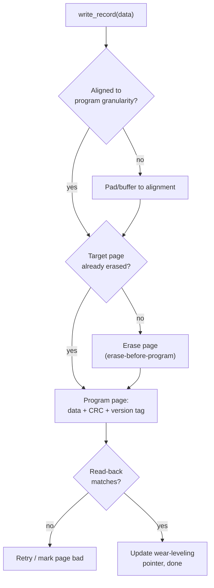

### What the interviewer should hear

- Flash's erase granularity (a whole sector/page) is almost always larger than its program granularity (a word/byte) — the driver must never program the same bits twice without an erase between, or the write is silently corrupted (NAND/NOR-dependent specifics, but the erase-before-reprogram rule holds broadly)
- Every stored record needs a CRC and a version/sequence tag, because power can be lost mid-program — on next boot, the driver must be able to tell "this record is complete and valid," "this record is a torn/partial write," and "this is stale data from before the last successful write," from the CRC/version alone
- Wear leveling (spreading writes across pages/sectors rather than always reusing the same one) matters because flash has a finite erase-cycle lifetime — a design that always logs to the same fixed sector will wear that sector out long before the rest of the device's flash
- Power-loss recovery specifically means: on boot, scan for the latest valid (CRC-passing, highest version) record rather than assuming the last write attempt succeeded — the write that was in progress at power-loss must be detectable as invalid, not silently treated as current

## 9. Design a sensor driver without hardware

Inject transport/register operations so protocol and state logic can be unit-tested.

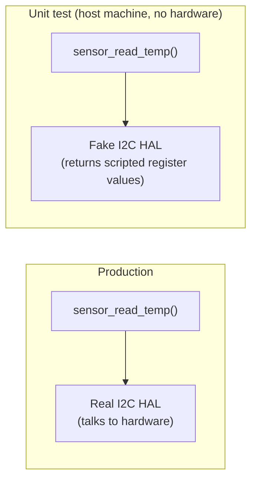

```c
typedef struct {
    bool (*i2c_write)(uint8_t addr, const uint8_t *data, size_t len);
    bool (*i2c_read)(uint8_t addr, uint8_t *data, size_t len);
} sensor_transport_t;

float sensor_read_temp(const sensor_transport_t *bus)
{
    uint8_t raw[2];
    if (!bus->i2c_read(SENSOR_ADDR, raw, sizeof(raw))) {
        return NAN; /* transport failure surfaced, not swallowed */
    }
    return convert_raw_to_celsius((int16_t)((raw[0] << 8) | raw[1]));
}
```

### What the interviewer should hear

- The driver's protocol/conversion logic (`convert_raw_to_celsius`, register sequencing) is completely separated from the transport, via a small function-pointer or interface struct injected at call time — this is what makes it testable on a laptop with zero target hardware
- A test double can now script exact byte sequences to verify edge cases that are hard to force on real hardware: a NACK mid-transaction, a plausible-looking but out-of-range raw value, or a transport timeout
- This same seam is what lets the identical driver run against a real I2C HAL in production and a mock in CI, with no `#ifdef TEST` branches inside the driver logic itself
- A senior answer notes the cost: one extra indirection per call (a function-pointer struct instead of calling the HAL directly) — usually negligible next to the testability win, but worth naming as a real trade-off rather than a free lunch

## 10. Design a driver error model

Create stable status codes, classify retryable versus fatal errors, and document recovery semantics.

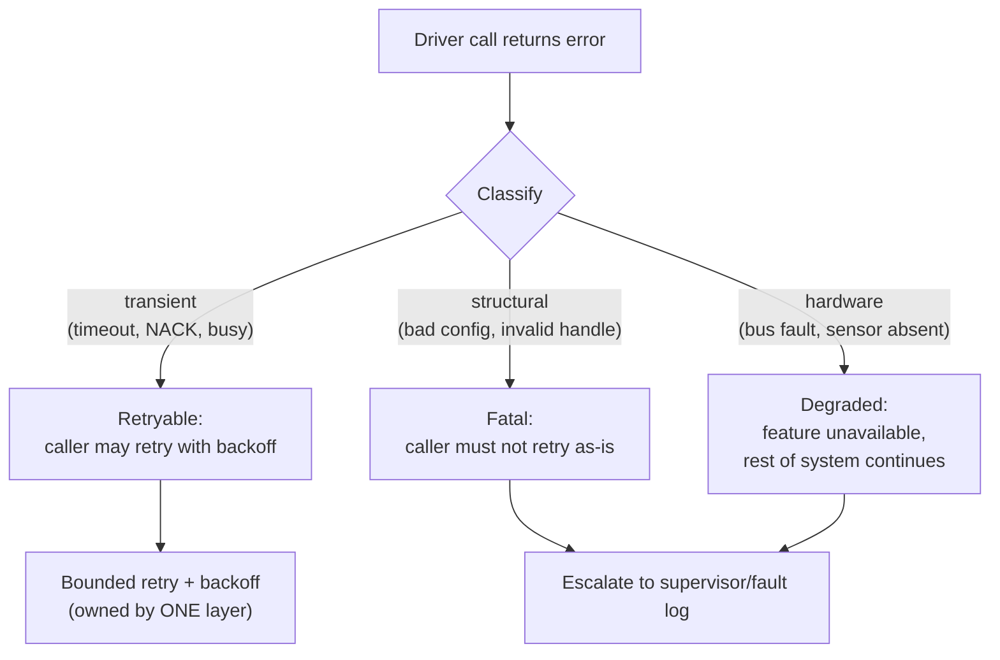

```c
typedef enum {
    DRV_OK = 0,
    DRV_ERR_TIMEOUT,     /* retryable */
    DRV_ERR_NACK,        /* retryable */
    DRV_ERR_BAD_CONFIG,  /* fatal: caller misused the API */
    DRV_ERR_BUS_FAULT,   /* degraded: hardware-level, may need recovery routine */
} drv_status_t;
```

### What the interviewer should hear

- Status codes are a stable, driver-wide enum (not scattered `bool`/`errno`-alone returns) so every call site can be reasoned about the same way, and so logging/telemetry can aggregate error types meaningfully
- Every error code is explicitly classified as retryable, fatal, or degraded *in the driver's documentation*, not left for each caller to guess — this is what prevents one caller retrying a fatal error forever and another giving up on a purely transient one
- Retry policy (bounded count, backoff) should be owned by exactly one layer — usually the driver itself for transport-level transience, with the application only handling higher-level retries — to avoid retry amplification (see the communication-protocols topic for the same principle)
- A senior answer ties this back to the driver's testability: a good error model means unit tests can inject `DRV_ERR_NACK` via the fake transport (Q9) and assert the retry policy actually behaves as documented, rather than only testing the success path

## Senior / Staff / Architect-Level Questions

## 11. How do you design a driver's public API so it stays stable (ABI/API-compatible) across chip variants and future feature additions?

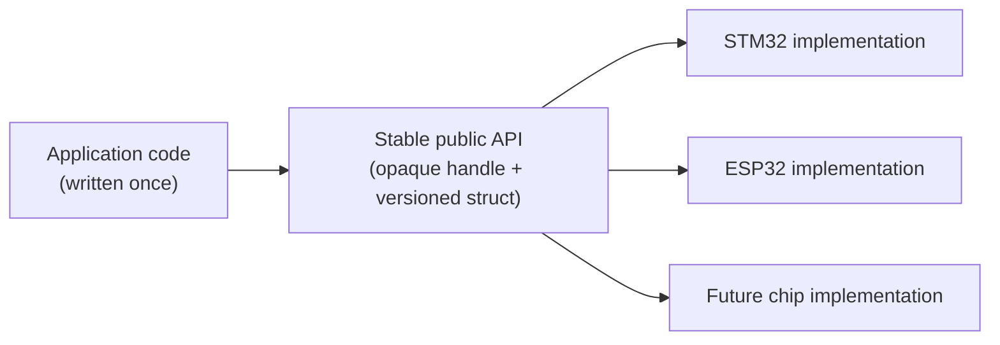

I design the public header around an opaque handle (`typedef struct uart_driver *uart_handle_t;`, with the real struct definition hidden in the `.c` file) so callers never depend on internal layout, and a versioned configuration struct (with a `size`/`version` field checked at `init()`) so new optional fields can be appended without breaking binary compatibility for callers built against an older header. I explicitly avoid ever inserting new enum values in the middle of an existing public enum — always append at the end — since inserting shifts every subsequent value's integer representation and silently breaks any code (including persisted config data) that stored the old numeric value. Every new capability is added as a new optional field or a new function, never by changing the meaning of an existing parameter, so an application written against version 1 of the driver keeps compiling and behaving identically against version 2.

## 12. How do you decide what belongs in the ISR versus a deferred task, and how do you defend that boundary in a design review?

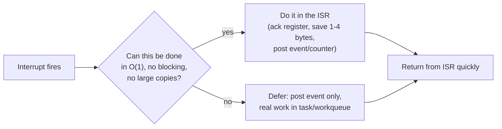

My rule of thumb: the ISR does exactly the work that (a) must happen immediately to prevent data loss (reading a register that would otherwise be overwritten by the next byte/sample) and (b) is bounded, small, and non-blocking — everything else, including any parsing, any computation more than a few cycles, any call that could block or take a lock, gets deferred to a task or workqueue via a lightweight event post. In review, I defend this by asking the author to state the worst-case cycle count for everything inside the ISR and comparing it against the system's real-time budget (how often does this interrupt fire, and what's the deadline for the next-highest-priority interrupt to be serviced) — if the answer is vague ("it's just a quick parse"), that's the review flag, because "quick" isn't a number and a parser's worst case (a maliciously/accidentally malformed frame) is often far from its typical case.

## 13. How would you design a driver to support both blocking and non-blocking/asynchronous call styles from the same core implementation, without duplicating logic?

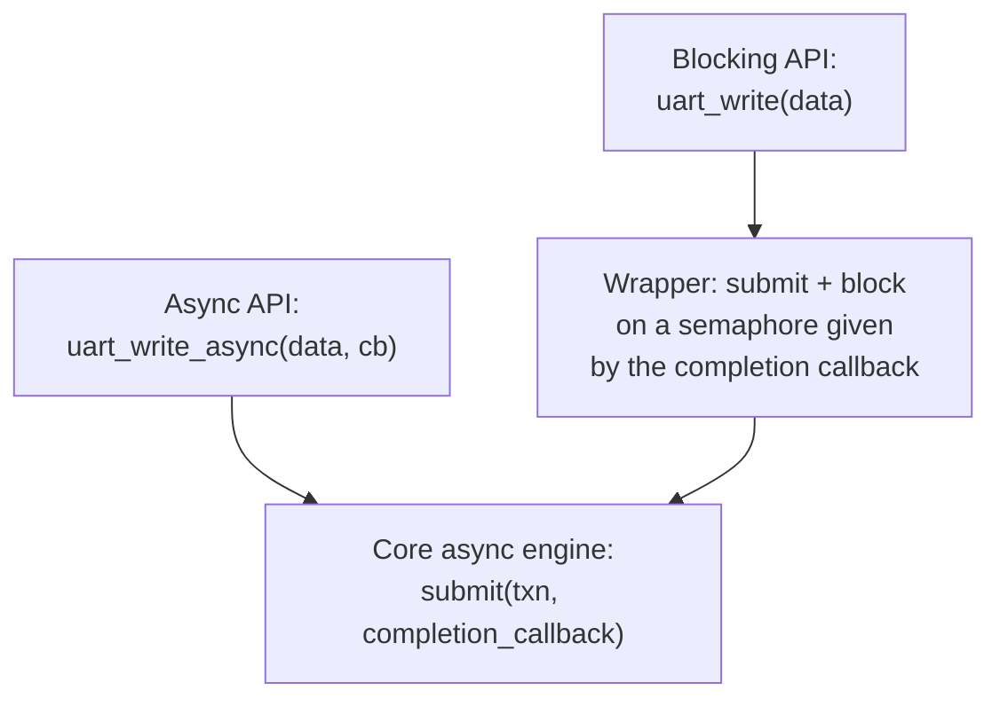

I implement one core engine that's inherently asynchronous — every operation is `submit(transaction, completion_callback)` — and build the blocking variant as a thin wrapper on top: `uart_write()` calls `submit()` with a completion callback that simply signals a semaphore, then blocks on that semaphore (with a timeout) before returning. This avoids ever writing the transaction/state-machine logic twice, which is the real risk in a driver that supports both styles — a genuinely separate blocking implementation tends to drift from the async one over time as bugs get fixed in only one path. The one thing I'm careful about: the blocking wrapper must never be callable from ISR context (blocking on a semaphore in an ISR is a hard error on most RTOSes), so the public header clearly documents which functions are task-context-only.

## 14. How do you approach power management inside a driver — e.g., a peripheral that needs to support sleep/wake without losing state or corrupting an in-flight transaction?

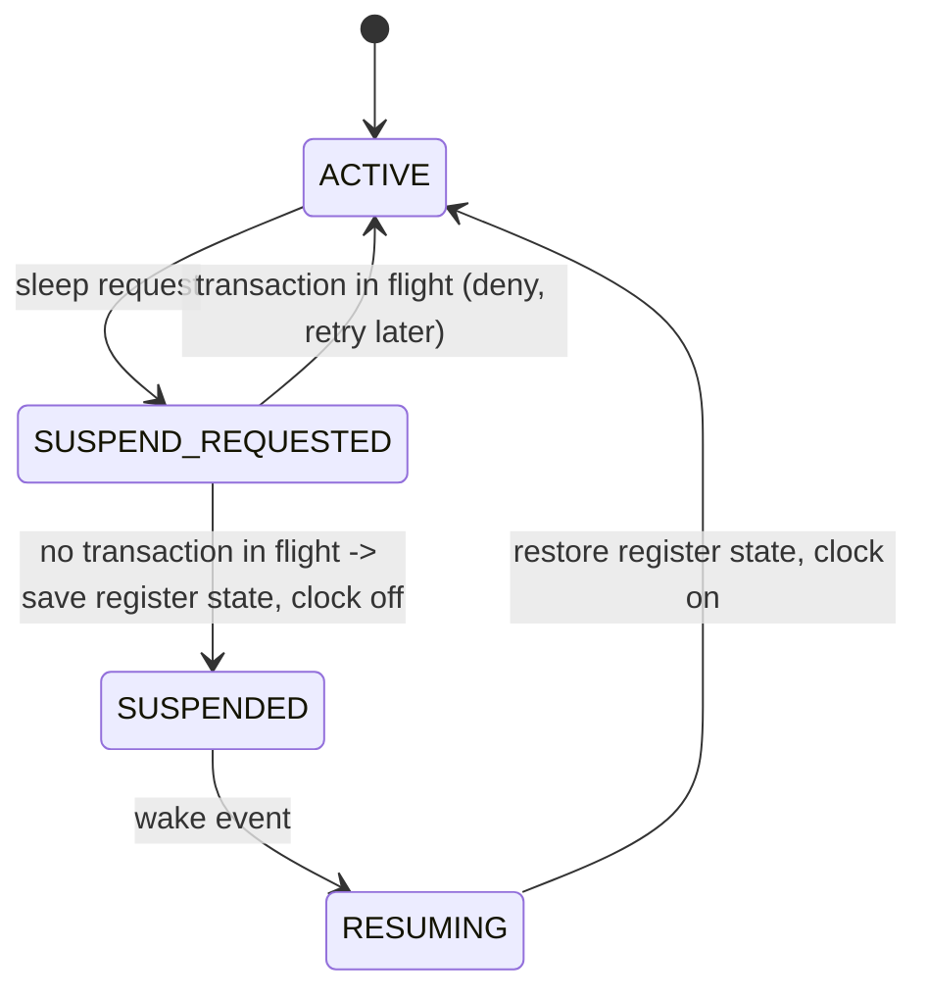

The core rule is that a driver must never allow the system to suspend a peripheral mid-transaction — the driver needs a way to say "not right now" to a power-management request when it has an outstanding transfer, and the PM framework needs to honor that rather than forcing suspension. On the way down, the driver explicitly saves whatever register state won't survive a clock/power gate (peripheral configuration registers are often lost on some low-power modes even though SRAM survives) and restores it explicitly on wake — I never rely on "the peripheral remembers its own configuration" without checking the specific chip's datasheet for that exact low-power mode, since this varies significantly even within one vendor's product line. I also design the wake path to re-validate rather than assume: after resume, before completing any pended request, confirm the peripheral actually came back in the expected state (a quick register read-back) rather than optimistically continuing.

## 15. How do you handle a driver that must arbitrate access to a shared peripheral across multiple RTOS priorities without causing priority inversion?

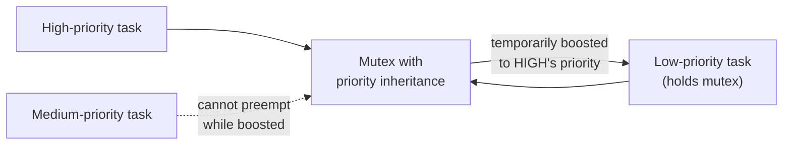

I use a mutex with priority inheritance (available on most RTOSes — FreeRTOS's `xSemaphoreCreateMutex()`, as opposed to a plain binary semaphore) for any shared-resource lock a high-priority task might need, specifically so that if a low-priority task is holding the driver's lock when a high-priority task blocks on it, the low-priority task is temporarily boosted to the high-priority task's level — preventing a medium-priority task from preempting the low-priority holder and indefinitely delaying the high-priority task (the classic priority-inversion scenario, notably responsible for the Mars Pathfinder watchdog resets). Beyond just picking the right primitive, I keep the critical section as short as possible (never do the actual slow hardware transfer while holding the lock if it can be started and then released to wait asynchronously) and document the maximum time any task can hold the driver's lock, so a reviewer can compute the worst-case blocking time for the high-priority task rather than trusting it "should be fine."

## 16. How do you validate a driver against timing/real-time requirements before it ships, beyond functional unit tests?

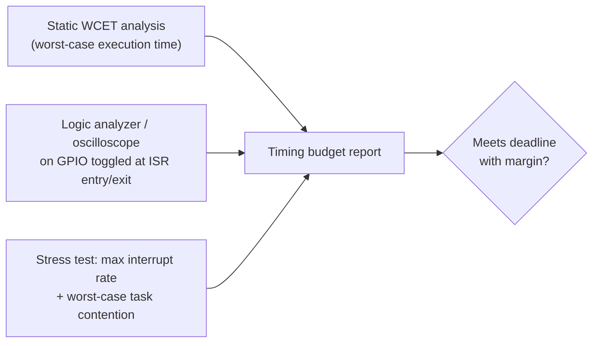

Functional unit tests confirm correctness of behavior, not timing, so I add a separate timing validation pass: static worst-case-execution-time (WCET) analysis or at minimum careful manual cycle-counting for anything in an ISR or a hard-real-time path; empirical measurement using a GPIO toggled at entry/exit of the critical section observed on a logic analyzer or oscilloscope, run under the worst-case load the system can realistically produce (maximum legitimate interrupt rate, other tasks contending for shared locks); and an explicit stress test that deliberately creates the worst-case scenario the static analysis assumed (e.g., flooding UART RX at max baud while other high-priority interrupts are also firing) rather than only testing typical traffic. I insist on a documented margin (not just "it met the deadline in this test run") because manufacturing variation, temperature, and voltage all affect real timing, and a design that passes with zero margin in the lab is a field failure waiting to happen.

## 17. How do you keep a large driver codebase MISRA-C (or similar safety-coding-standard) compliant without it becoming an obstacle to normal development velocity?

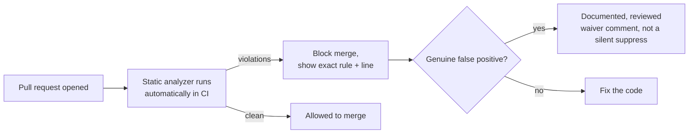

I integrate the MISRA checker into CI so violations are caught automatically on every pull request rather than relying on manual review — by the time a human reviewer looks at the diff, obvious rule violations are already flagged with the specific rule number and line. For any violation the team judges a genuine false positive for that specific context (MISRA explicitly anticipates this with its "deviation" process), the exception is documented inline with a comment explaining *why*, reviewed and approved like any other code change, and tracked — never a blanket suppression of a whole rule project-wide, which defeats the point of adopting the standard. I also make sure new engineers get the checker's feedback locally (a pre-commit hook or IDE plugin) rather than only discovering violations after opening a PR, since fast local feedback is what keeps a coding standard from feeling like a tax paid only at the end.

## 18. Describe how you'd design a driver so the exact same source builds for both a bare-metal target and an RTOS target, given that blocking primitives (mutex, semaphore) don't exist the same way in both

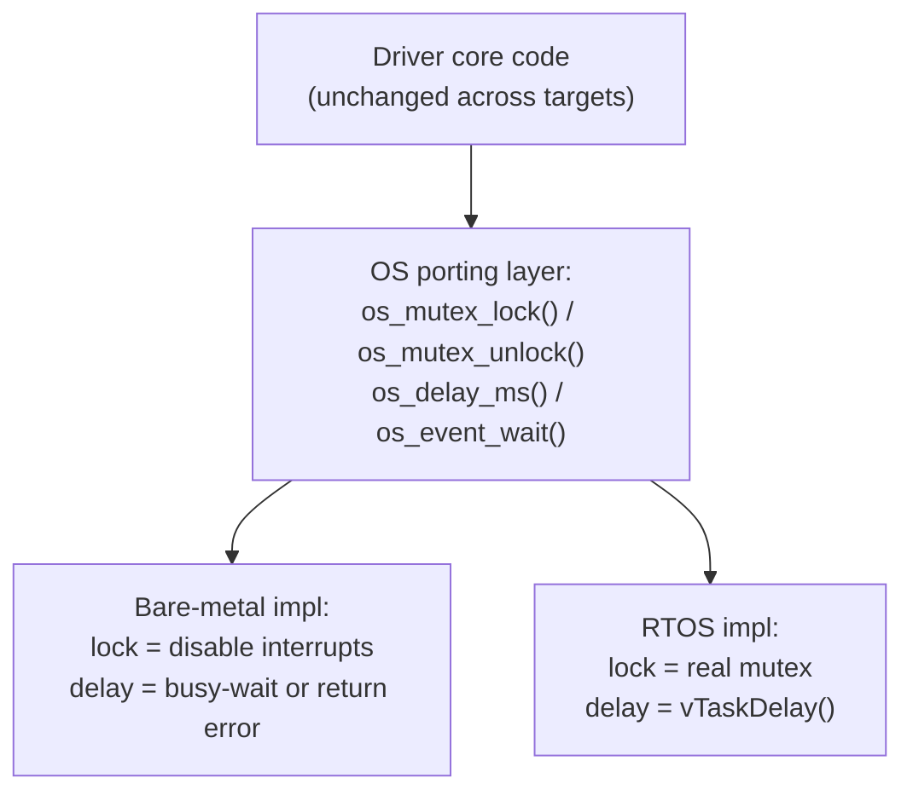

I introduce a thin OS-abstraction porting layer with a handful of primitives the driver core actually needs (`os_mutex_lock/unlock`, `os_event_wait/signal`, `os_delay_ms`), and the driver core is written exclusively against that porting layer — never against `FreeRTOS.h` or a raw `__disable_irq()` directly. The bare-metal backend implements the same function signatures using interrupt masking for "mutual exclusion" and either a busy-wait or an explicit "operation not supported in this build" for anything that would require blocking without a scheduler; the RTOS backend implements them with real mutexes and task delays. The payoff is that the driver's actual logic (state machine, buffering, error handling) is compiled and tested exactly once and is identical in both builds — only the thin porting layer differs, and it's small enough to review and verify independently for each target.

## 19. When would you choose a polling-based driver architecture over an interrupt-driven one, and how do you defend that choice against "interrupts are always better" pushback?

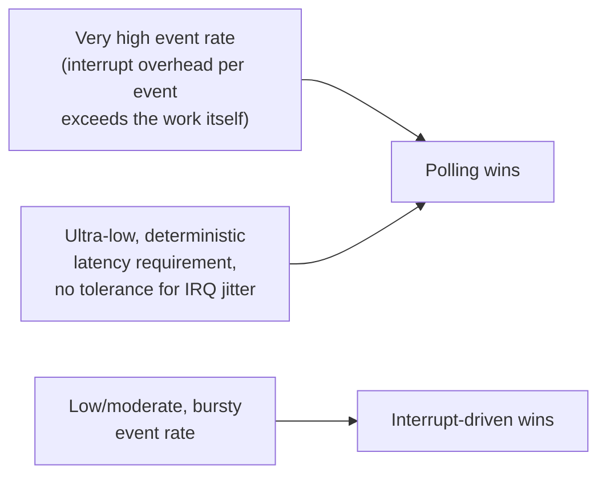

I choose polling specifically when the event rate is high enough that the fixed per-interrupt overhead (context save/restore, vector dispatch) starts to rival or exceed the actual work per event — this is the same reasoning behind DPDK-style user-space polling network drivers, and it shows up in embedded contexts like very high-rate ADC sampling or a tight sensor-fusion loop where the CPU is dedicated to that one job anyway. I also choose polling when a hard latency bound must never depend on interrupt jitter (interrupt latency isn't perfectly deterministic on most cores once you factor in higher-priority interrupts, disabled-interrupt critical sections elsewhere in the system, and cache effects) — a busy-wait polling loop with no other work competing for the core can have tighter, more provable worst-case latency. I defend it in review with actual numbers: measured or calculated interrupt overhead per event versus the event rate, and the specific jitter sources that make interrupt-driven timing unsuitable for this particular deadline — "interrupts are always better" is true for the common case of low-to-moderate, bursty event rates where the CPU has other work to do between events, which is most drivers, but not universally.

## 20. As an architect, what's your checklist when reviewing a new driver before it's approved to merge?

```mermaid
flowchart TB
    R1["1. Is ISR work bounded and minimal?\n(Q12)"]
    R2["2. Is there a documented,\nclassified error model?\n(Q10)"]
    R3["3. Can this be unit-tested\nwithout real hardware?\n(Q9)"]
    R4["4. Is shared-resource access\nrace-free and inversion-free?\n(Q15)"]
    R5["5. Does the public API hide\nimplementation, stay stable\nacross variants? (Q11)"]
    R6["6. Are timing claims backed\nby measurement, not assumption?\n(Q16)"]
    R1 --> R2 --> R3 --> R4 --> R5 --> R6 --> APPROVE["Approve"]
```

My checklist, roughly in the order I actually read the code: is the ISR (if any) doing strictly bounded, minimal work with everything else deferred; is there a documented, classified error model rather than ad hoc return codes; can the core logic be exercised in a unit test without real hardware, via an injected transport/HAL seam; is every shared-resource access (bus, buffer, state) race-free, and if a lock is involved, is priority inversion actually addressed rather than assumed away; does the public API hide implementation details behind a stable interface that will survive a chip variant or a future feature addition; and are any timing/real-time claims in the design doc backed by an actual measurement or WCET analysis rather than "it's fast enough in practice." If a driver is missing more than one of these, I don't approve it with review comments alone — a driver's mistakes here tend to surface as field failures under load, not code-review-visible bugs, so I'd rather block and get it right than iterate on it in production telemetry.
