# Advanced Coding — 03 RTOS Design

These are design-oriented interview exercises for senior/staff embedded engineers and embedded architects. A strong solution should state assumptions, interfaces, memory ownership, timing constraints, concurrency model, failure behavior, and test strategy — and back it with a small, concrete example rather than staying purely abstract.

## Reference pattern: task/queue/ISR topology

Nearly every question below is a variation of the same underlying shape — a producer (often an ISR) handing bounded, owned data to a consumer task through a queue, with an explicit policy for what happens when the queue is full.

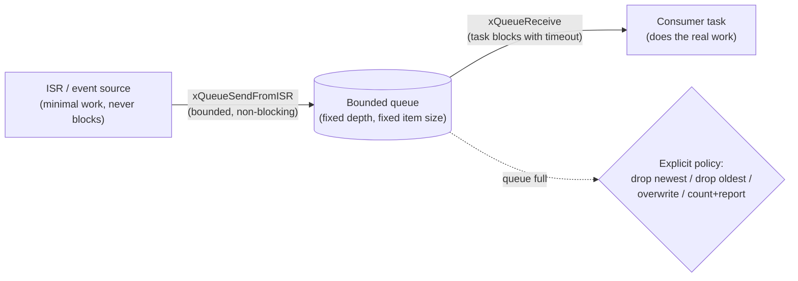

The senior-level point to make explicit every time: a queue with no defined full-policy is a latent bug — `xQueueSendFromISR()` returning `false` on a full queue is not a code path anyone can afford to ignore, and "drop vs block vs overwrite" is a design decision, not an accident of whatever the default happened to do.

## 1. Design ISR-to-task UART reception

ISR records bytes/positions and signals a parser task; parser performs framing and application dispatch.

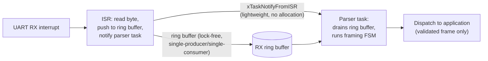

```c
void USART_IRQHandler(void)
{
    uint8_t byte = (uint8_t)USART->RDR;
    ring_buffer_push(&rx_rb, byte);            /* O(1), no blocking */
    BaseType_t woken = pdFALSE;
    vTaskNotifyGiveFromISR(parser_task_handle, &woken);
    portYIELD_FROM_ISR(woken);
}

void parser_task(void *arg)
{
    for (;;) {
        ulTaskNotifyTake(pdTRUE, portMAX_DELAY);   /* wake only when bytes arrived */
        uint8_t byte;
        while (ring_buffer_pop(&rx_rb, &byte)) {
            parser_push(byte);                      /* framing FSM does the real work */
        }
    }
}
```

### What the interviewer should hear

- A task notification (`vTaskNotifyGiveFromISR`), not a full queue, is enough to wake the parser — it's lighter weight than a queue send when you only need "something happened," not to transfer data through the notification itself
- The ring buffer is the actual data path; the notification is just a wake-up signal — draining the whole buffer in one wake (the `while` loop) avoids one notify-per-byte overhead
- The framing FSM lives entirely in task context, never in the ISR — this is the same principle from the driver-design and state-machine topics: keep ISR work O(1) and bounded
- Explicit backpressure story: if the parser task is somehow starved long enough for the ring buffer to fill, the ISR's `ring_buffer_push` must have a defined full-behavior (drop-newest here) rather than corrupting the buffer

## 2. Design a producer-consumer pipeline

Use bounded queues/ring buffers and define a policy for full buffers.

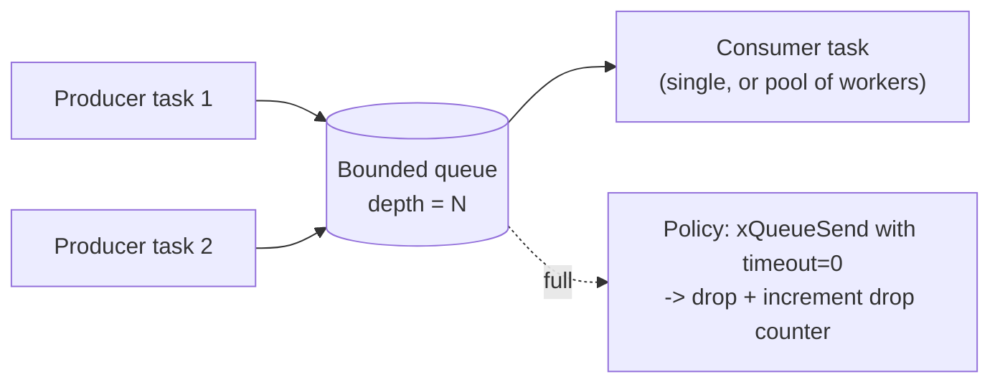

```c
QueueHandle_t work_queue = xQueueCreate(32, sizeof(work_item_t));

bool submit_work(const work_item_t *item)
{
    if (xQueueSend(work_queue, item, 0) != pdTRUE) {  /* timeout=0: never block producer */
        dropped_item_count++;                          /* observable, not silent */
        return false;
    }
    return true;
}
```

### What the interviewer should hear

- Queue depth is sized from worst-case burst rate × consumer service time, not a guessed round number — and that math should be stated out loud in the interview
- The full-queue policy is explicit and chosen deliberately: block-the-producer (fine if the producer can tolerate it), drop-with-a-counter (fine if occasional loss is acceptable and must be observable), or grow-dynamically (usually wrong on an embedded target — unbounded memory use)
- Multiple producers into one queue need no extra locking — the queue itself is the synchronization primitive — but the consumer's *processing* of an item might still need its own locking if it touches shared state
- A senior answer asks whether backpressure should propagate to the producer (block it) rather than silently dropping, since dropping is only safe if the data is genuinely disposable (e.g., a sensor sample superseded by the next one) rather than a command that must not be lost

## 3. Design a periodic 1 ms control task

Use absolute-period scheduling, bounded work, and a measurable execution-time budget.

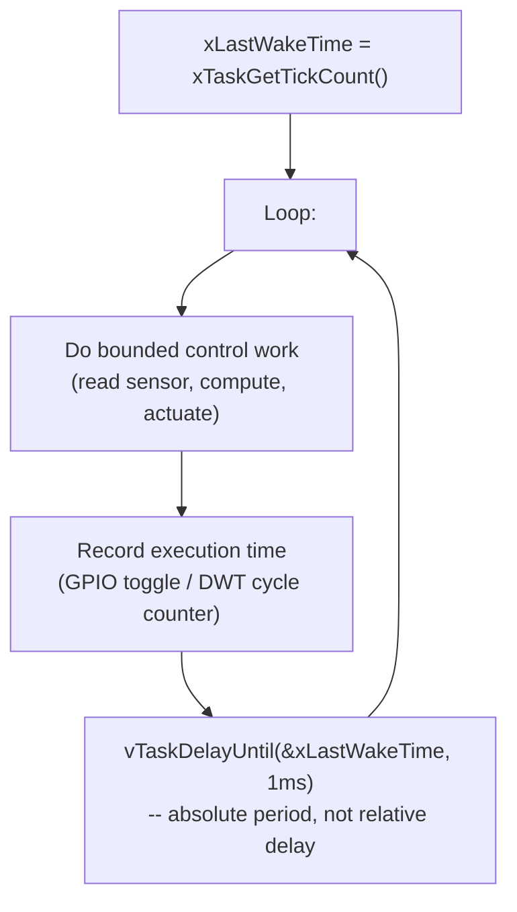

```c
void control_task(void *arg)
{
    TickType_t last_wake = xTaskGetTickCount();
    const TickType_t period = pdMS_TO_TICKS(1);

    for (;;) {
        uint32_t start = DWT->CYCCNT;
        control_loop_step();               /* bounded, deterministic work only */
        uint32_t elapsed = DWT->CYCCNT - start;
        record_execution_time(elapsed);     /* for offline WCET/margin analysis */

        vTaskDelayUntil(&last_wake, period); /* corrects drift; NOT vTaskDelay() */
    }
}
```

### What the interviewer should hear

- `vTaskDelayUntil()`, not `vTaskDelay()` — the former schedules from an absolute reference tick and self-corrects for jitter in the loop body's execution time, so periods don't drift; the latter measures from "now," so a slow iteration permanently shifts every future wake time
- The control work itself must be bounded and have no unbounded loops, no blocking I/O, no unpredictable-latency calls (`malloc`, most driver calls that might retry) — anything that can take an unknown amount of time inside a 1 ms period threatens every other task's schedulability
- Execution time is measured every cycle (cheap: a cycle-counter read), feeding an offline analysis of worst-case time versus the 1 ms budget, with margin — not just "it worked in testing"
- A senior answer flags what happens on an overrun (control work takes longer than the period): does the task simply run late (fine for soft real-time), or is a missed deadline itself a fault condition that needs detection and escalation (more likely for a genuinely hard-real-time control loop)?

## 4. Design a high-throughput logger

Use a lock-safe bounded buffer and a dedicated DMA-backed logger task.

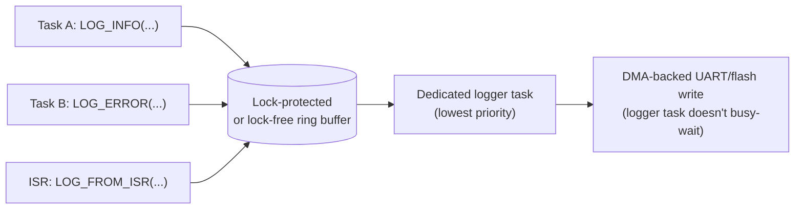

### What the interviewer should hear

- Log *formatting* (`snprintf`-style work) happens at the call site into a pre-sized buffer, but the *slow I/O* (writing to UART/flash) happens only in the dedicated logger task — this keeps a high-priority task's log call fast and bounded rather than blocking it on physical I/O
- The logger task runs at low priority specifically so it never competes with real application work for the CPU — logging must never be able to starve a control loop
- DMA offloads the actual byte transfer so the logger task isn't busy-waiting on the UART's transmit-empty flag — it kicks off a DMA transfer and can immediately go back to draining the ring buffer
- Overflow policy matters here more than almost anywhere else: dropping the *oldest* log entries under overflow (keeping the most recent, most relevant-to-a-current-fault entries) is often preferred over dropping the newest, and this should be a stated design decision, not an accident

## 5. Design a priority scheme

Rank tasks from timing/criticality, then analyze blocking and higher-priority interference.

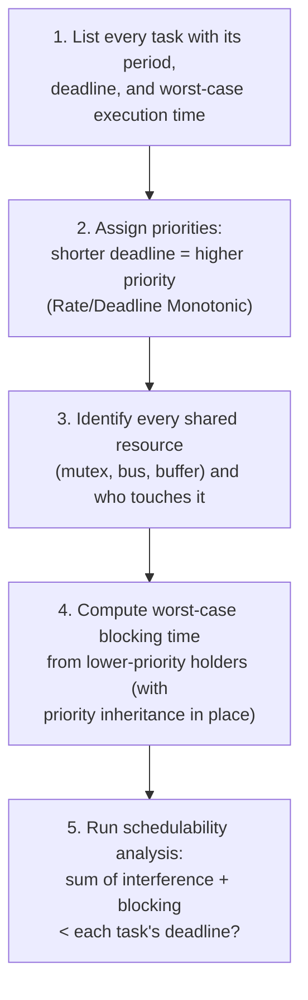

### What the interviewer should hear

- Priority assignment isn't arbitrary — Rate-Monotonic (shorter period = higher priority) or Deadline-Monotonic (shorter deadline = higher priority) are the standard, analyzable starting points, not "gut feel about what seems important"
- Every shared resource crossing priority levels is a potential blocking source — the analysis must enumerate them, not just hope a review would catch a missed one
- Worst-case blocking time must be computed *with* priority inheritance assumed (or whatever protocol is actually implemented — priority ceiling is stronger but less commonly available) — without it, blocking time is theoretically unbounded
- The deliverable a senior candidate should mention explicitly: a schedulability calculation (even a simple utilization bound check, or better, full response-time analysis) that's revisited whenever a task's WCET or period changes — priority assignment is not a one-time exercise

## 6. Design a deadlock-resistant locking strategy

Define global lock order and avoid holding locks across blocking I/O.

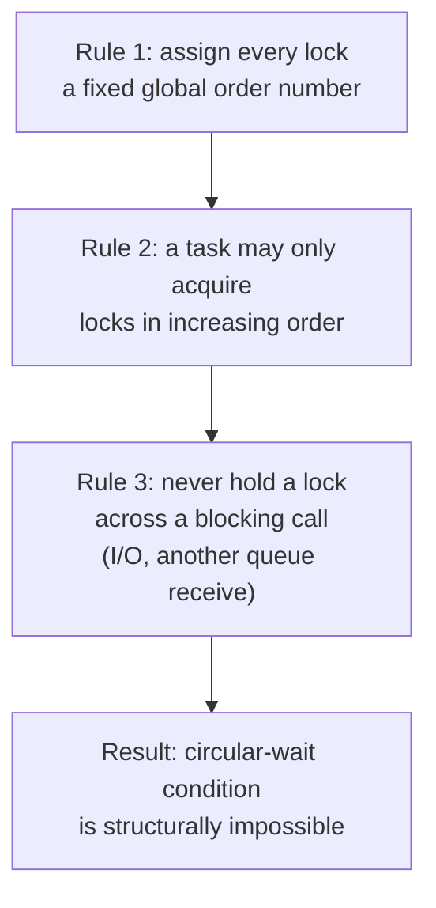

```c
/* Locks are always acquired in this fixed order: bus_lock (1) before state_lock (2) */
void transfer_and_update(void)
{
    xSemaphoreTake(bus_lock, portMAX_DELAY);      /* order 1 */
    xSemaphoreTake(state_lock, portMAX_DELAY);    /* order 2 -- never the reverse, anywhere */
    do_transfer_and_update();
    xSemaphoreGive(state_lock);
    xSemaphoreGive(bus_lock);
}
```

### What the interviewer should hear

- A global, documented lock ordering is what actually eliminates deadlock — it breaks the "circular wait" precondition (one of the four Coffman conditions) structurally, rather than relying on careful coding discipline alone
- Never hold a lock across a call that can block indefinitely (another semaphore take, a blocking driver call) — if you must wait for something else while holding a lock, that's a design smell suggesting the lock's scope is too broad
- A senior answer proposes making the ordering rule *enforceable*, not just documented — e.g., a debug build that asserts a task never acquires a lower-ordered lock while holding a higher-ordered one, catching violations in testing rather than trusting code review alone
- Timeouts on lock acquisition (`portMAX_DELAY` is fine when correctness is otherwise guaranteed, but a bounded timeout plus an assert/error path is a valuable second line of defense against a bug that does slip through)

## 7. Design CPU-load telemetry

Measure idle/execution time with bounded instrumentation and avoid perturbing critical paths.

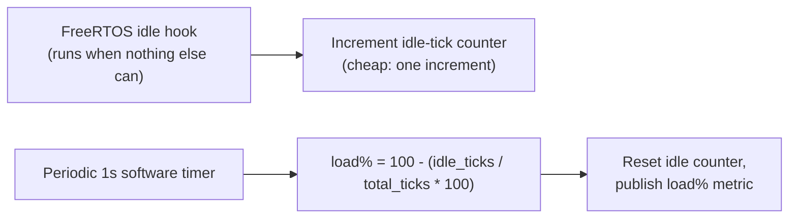

```c
static volatile uint32_t idle_ticks;

void vApplicationIdleHook(void) { idle_ticks++; }  /* cheap, no blocking, no locks */

void load_report_timer_callback(TimerHandle_t xTimer)
{
    uint32_t ticks_this_period = pdMS_TO_TICKS(1000);
    uint8_t load_pct = (uint8_t)(100u - (idle_ticks * 100u / ticks_this_period));
    idle_ticks = 0u;
    publish_cpu_load(load_pct);
}
```

### What the interviewer should hear

- The idle hook increment must be as close to free as possible (a single counter increment, no locks, no function calls) — instrumentation that perturbs the very thing it's measuring is a classic observer-effect bug, and a heavy idle hook actively steals the CPU time it's supposed to be measuring as available
- Per-task CPU usage (not just overall load) usually needs the RTOS's own runtime-stats feature (`configGENERATE_RUN_TIME_STATS` in FreeRTOS) backed by a free-running hardware timer with resolution finer than the tick — the tick counter alone is too coarse to break down time between tasks
- Reporting/publishing the metric happens on its own low-priority timer/task, decoupled from the measurement itself, so a slow telemetry consumer (e.g., logging load over UART) never delays the measurement
- A senior answer notes what load telemetry is actually for: catching a slow trend toward saturation before it causes missed deadlines, not just a dashboard number — so it should feed an alerting threshold, not just be displayed

## 8. Design task health monitoring

Each critical task provides a progress indicator; a supervisor evaluates freshness and dependencies.

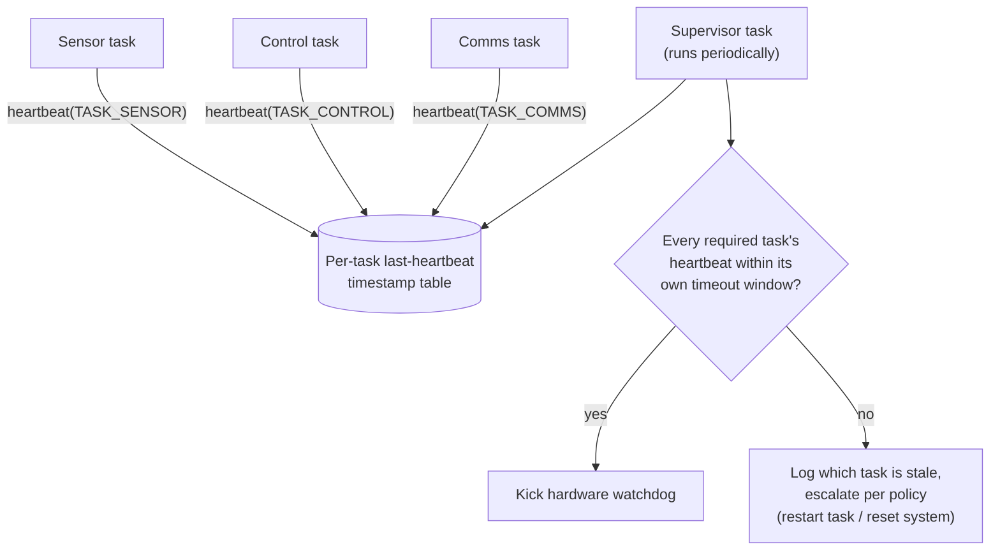

### What the interviewer should hear

- Each task's timeout window is sized from *that task's* legitimate worst-case work interval, not one global number — a control loop and a housekeeping task have very different legitimate heartbeat periods
- "Heartbeat" must reflect genuine forward progress (e.g., completed one full loop iteration), not just "the task got CPU time" — a task spinning uselessly but still calling `heartbeat()` defeats the entire point
- This connects directly to the watchdog-service pattern from driver design: the supervisor only kicks the hardware watchdog when every required task is healthy, catching a livelocked-but-still-running task that a naive single global kick would miss
- Escalation policy should be tiered where practical: log + attempt a targeted task restart before falling back to a full system reset, since a full reset is disruptive and a targeted recovery may resolve a one-off issue with less impact

## 9. Design a memory-pool message system

Use fixed-size blocks, ownership transfer, and pool exhaustion statistics.

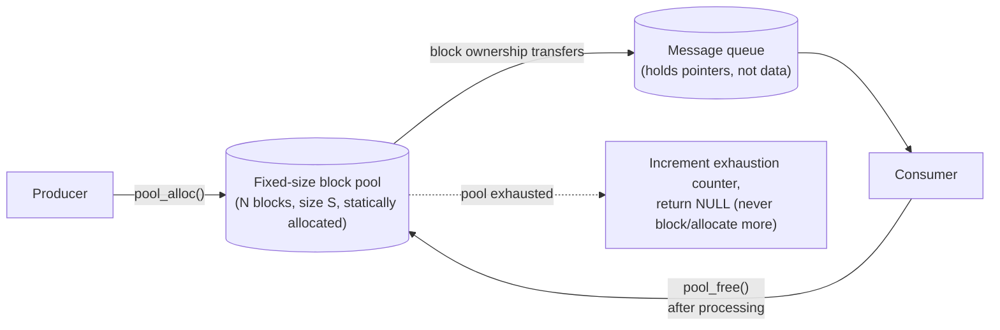

```c
typedef struct { uint8_t data[64]; } msg_block_t;

static msg_block_t pool_storage[16];
static msg_block_t *free_list[16];
static uint8_t free_count = 16u;
static uint32_t exhaustion_count;

msg_block_t *pool_alloc(void)
{
    if (free_count == 0u) { exhaustion_count++; return NULL; }  /* never silently block-allocate */
    return free_list[--free_count];
}

void pool_free(msg_block_t *block) { free_list[free_count++] = block; }
```

### What the interviewer should hear

- Fixed-size blocks from a statically-allocated pool sidestep heap fragmentation entirely — this is the standard embedded alternative to `malloc`/`free` for message passing, and the pool size (16 here) is a hard, known-at-compile-time memory budget
- Ownership is single and explicit at every point in time: the producer owns the block until it hands it to the queue, the consumer owns it after dequeuing until it calls `pool_free()` — a design that lets two owners touch the same block concurrently is a use-after-free/data-race waiting to happen
- Exhaustion returns `NULL` and increments an observable counter rather than blocking indefinitely or trying to grow the pool — a producer must have a defined behavior for "no blocks available" (drop the message, or block the producer if that's acceptable for that specific producer)
- A senior answer suggests sizing the pool from worst-case in-flight message count (how many messages can be allocated-but-not-yet-freed simultaneously under worst-case load), the same reasoning as queue depth sizing in Q2

## 10. Design a graceful shutdown path

Stop producers, drain or discard queues by policy, close peripherals, persist required state, then power down.

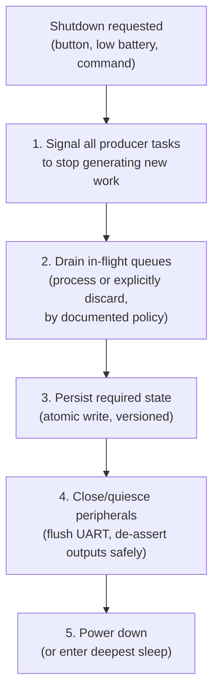

### What the interviewer should hear

- The order matters: stop producers *before* draining, so the drain phase has a bounded amount of work rather than chasing a queue that keeps refilling
- "Drain" needs an explicit per-queue policy stated up front — some queues should be fully processed before shutdown (a pending command that must complete), others can be safely discarded (stale sensor samples) — this isn't uniform across a system
- Persisting state must follow the same atomic-write discipline as the flash-driver topic (a single atomic write per logical update, with CRC/versioning) since shutdown can itself be interrupted (e.g., battery dies mid-shutdown) and must not corrupt what's already persisted
- Peripheral shutdown order matters for safety, not just tidiness — e.g., an actuator output must be driven to a safe state *before* its enabling power rail is cut, not after, or it can glitch to an undefined level during power-down

## Senior / Staff / Architect-Level Questions

## 11. How do you choose between a preemptive and a cooperative (run-to-completion) scheduler for a given embedded product?

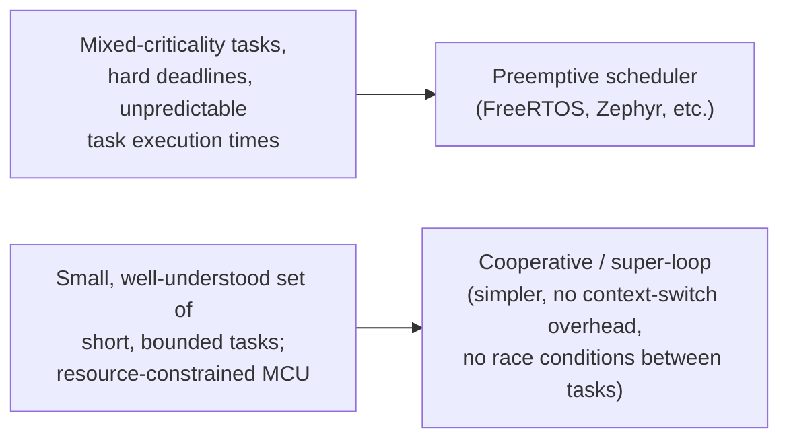

I choose preemptive scheduling whenever the system has genuinely mixed criticality — some work has a hard deadline that must never be delayed by lower-priority work, regardless of how long that lower-priority work happens to run — since only a preemptive scheduler can guarantee a high-priority task interrupts a long-running low-priority one. I choose a cooperative/super-loop design when the task set is small, each task's execution time is well-understood and short, and the product is tightly resource-constrained (a few KB of RAM where an RTOS's per-task stack overhead is a real cost) — cooperative scheduling also structurally eliminates whole classes of race conditions between tasks (since a task never gets preempted mid-operation by another task), which can be a legitimate simplicity/reliability win for the right problem size. The mistake I watch for in review is a cooperative design that's grown organically past its original scope — once one "task" in the super-loop starts taking unpredictably long, every other task's latency degrades, and that's usually the sign it's time to migrate to a real preemptive scheduler rather than patch around it with more manual yielding.

## 12. Walk through how you'd perform a formal schedulability analysis (e.g., Rate-Monotonic Analysis) for a set of periodic tasks, and what it actually proves versus what it doesn't

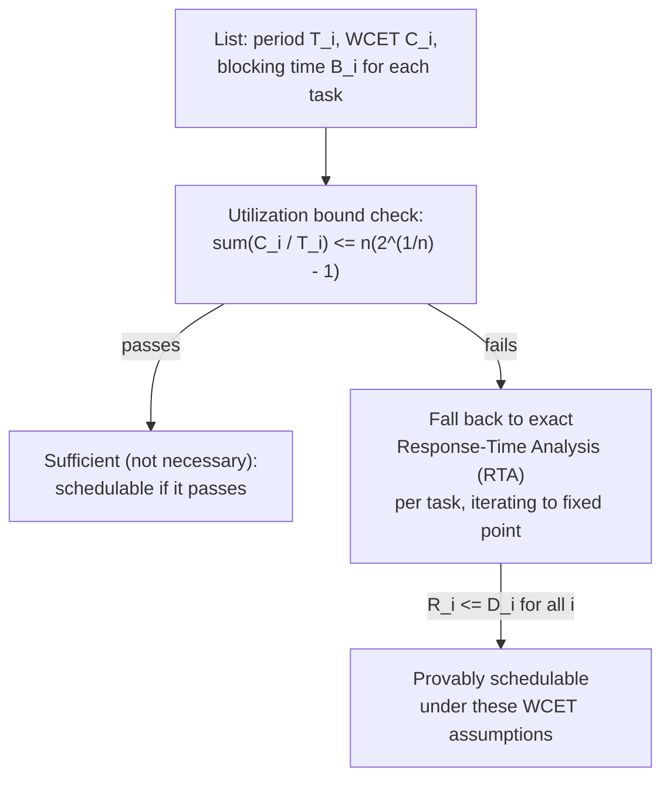

I start by tabulating every periodic task's period, worst-case execution time, and any blocking time it can suffer from lower-priority tasks holding shared resources. The classic Liu & Layland utilization bound (`sum(C_i/T_i) <= n(2^(1/n)-1)`) is a quick sufficient-but-not-necessary test — passing it proves schedulability, but failing it doesn't prove the opposite, since it's a conservative bound. When it fails (common with more than a handful of tasks, since the bound tightens toward ~69% utilization as task count grows), I fall back to exact Response-Time Analysis: iteratively computing each task's actual worst-case response time accounting for higher-priority interference and blocking, until it converges, and checking that against its deadline. The critical thing I always state explicitly to a team: this analysis only proves what it claims *given the WCET numbers fed into it* — if the WCET figures themselves are wrong (measured under non-worst-case conditions, or a code path added later that wasn't included), the "proof" is worthless; schedulability analysis is only as trustworthy as the WCET analysis underneath it.

## 13. How do you design task stack sizes so you neither waste RAM nor risk stack overflow, on a target where RAM is the scarcest resource?

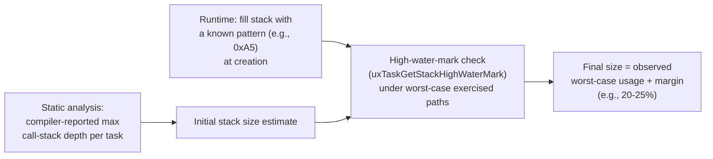

I start from static analysis where the toolchain supports it (some compilers/linkers can report worst-case call-stack depth per entry point, though recursion and function pointers can defeat this and need manual bounding), then validate empirically: fill each task's stack with a known pattern at creation and, after exercising the system through its worst-case call paths (including every ISR that can nest on top of that task's stack, and every fault/error path — those are the ones people forget to exercise), check the high-water mark (`uxTaskGetStackHighWaterMark()` in FreeRTOS) to see how much was actually ever used. I size the final allocation as the observed worst-case usage plus a real margin (not zero) to absorb variance from paths the test run didn't hit, and I enable a stack-overflow check mechanism (a guard region, or the RTOS's built-in overflow detection) in every build, not just debug builds, since a stack overflow silently corrupting adjacent memory is one of the nastiest classes of embedded bug to diagnose after the fact.

## 14. How would you design an RTOS-based system to be safely testable — running deterministic, repeatable tests despite the inherent non-determinism of task scheduling?

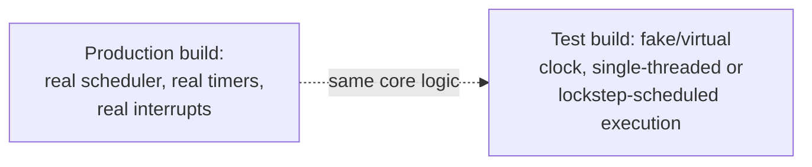

I structure the core application logic so it's driven by an injected time/event source rather than calling `vTaskDelay`/hardware timers directly wherever business logic lives, so tests can substitute a virtual clock that advances deterministically under the test's control instead of real wall-clock time. For genuinely multi-task interactions I favor host-based tests that run the relevant tasks under a controlled, single-stepped scheduler (some RTOSes and test harnesses support "lockstep" scheduling specifically for this, advancing exactly one task at a time to a known point) rather than relying on real concurrent execution and hoping a race reproduces — real scheduling non-determinism is exactly what makes concurrency bugs "work on my machine" and disappear under a debugger. For the interactions that genuinely can't be host-simulated (real interrupt timing, real DMA), I accept that those specific tests run on hardware-in-the-loop and are inherently less repeatable, and I keep as much logic as possible out of that category by pushing it into the host-testable core — the same "separate core logic from I/O" principle as the injected-transport sensor driver pattern.

## 15. How do you handle a shared resource that must be accessed from both a high-frequency ISR and a low-priority task, when a mutex can't be used from interrupt context?

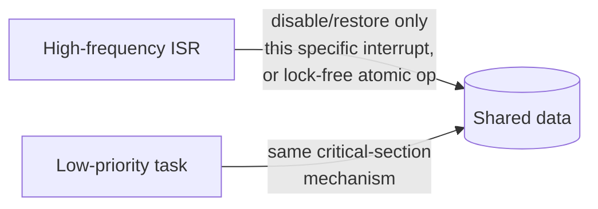

Since a blocking mutex is unusable from ISR context on essentially every RTOS, I use one of two approaches depending on the data: for simple data (a counter, a flag, a small struct that fits a single atomic write), a genuinely lock-free approach — atomic operations, or a single-writer/single-reader pattern that needs no lock at all by construction (the ISR is the only writer, the task is the only reader, or vice versa) — is preferable since it has zero blocking risk in either direction. When the data genuinely needs a true critical section (multi-step update that must be atomic with respect to the ISR), I use a short interrupt-disable/restore around the *task-side* access (disabling only the specific interrupt that can preempt it, for the shortest possible duration) rather than a global interrupt disable, and I make sure that critical section is provably short (a few instructions) since it directly adds to worst-case interrupt latency for that source. What I explicitly avoid is designing the ISR itself to ever wait on anything — if the ISR needs to coordinate with the task beyond a lock-free handoff, the right tool is deferring the actual coordination to the task via a notification/queue (per Q1), not trying to make a heavier synchronization primitive ISR-safe.

## 16. How would you migrate a large, mature RTOS-based codebase from one RTOS (or one major version) to another with minimal risk?

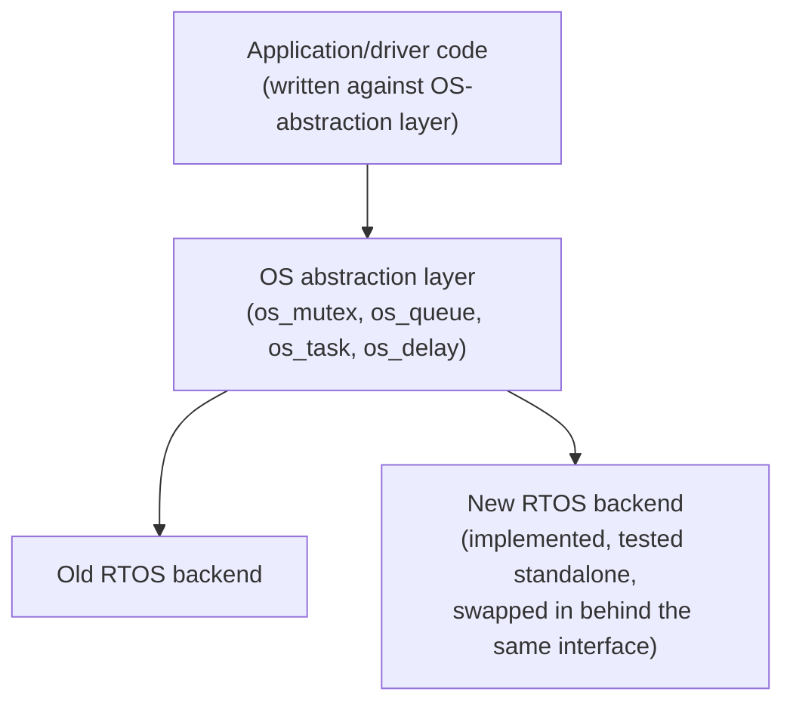

The risk-reducing move is the same OS-abstraction-porting-layer pattern used for bare-metal/RTOS portability (see the driver-design topic): if the application and driver code were already written against a thin `os_*` porting layer rather than calling the RTOS's native API directly everywhere, migration means writing and independently testing one new backend implementation of that porting layer, then swapping it in — the application logic itself, which is the overwhelming majority of the codebase and the highest-risk part to introduce regressions into, doesn't change at all. If the codebase *wasn't* written this way (the common, harder case — direct RTOS API calls scattered everywhere), I'd introduce the abstraction layer incrementally, module by module, verifying each module still behaves identically on the *old* RTOS through that new layer before touching the RTOS itself — proving the abstraction is faithful first, then changing the backend, rather than changing both the structure and the underlying RTOS simultaneously, which makes it impossible to isolate which change caused a regression if one appears.

## 17. What's your strategy for finding and fixing a rare, intermittent race condition that only reproduces after days of field operation?

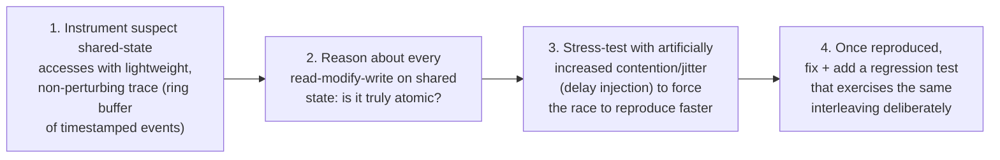

I start by instrumenting every access to the shared state under suspicion with a lightweight, always-on trace — a compact ring buffer of timestamped events (task ID, access type, value) — deliberately kept cheap enough to run in production without perturbing timing (since a heavy trace, or worse, print statements, can hide a race by changing the very timing that causes it — the classic "Heisenbug"). In parallel, I do a careful manual audit of every read-modify-write on that shared state, asking specifically whether it's truly atomic given the actual hardware/compiler (a `++` on a multi-byte variable is not atomic on most embedded cores without an explicit atomic instruction or a critical section) and whether every access path is covered by the same lock/atomicity mechanism — a race is often just one access path that was missed when the locking scheme was designed. To reproduce faster than "days," I add deliberate jitter/delay injection around the suspect access points in a test build, which increases the probability of hitting the narrow timing window that causes the race, then once it reproduces reliably, I fix it and — critically — turn the reproduction technique itself into a permanent regression test, since a race fixed without a regression test protecting it is a race that can silently come back after the next refactor.

## 18. How do you decide what should be a separate RTOS task versus a callback/state-machine step running within an existing task's context?

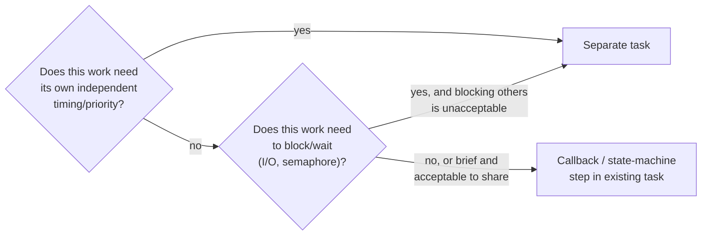

I create a new task when the work genuinely needs its own priority and timing characteristics distinct from everything else in the system (it must preempt or be preempted independently), or when it needs to block/wait on something in a way that would be unacceptable to make every other piece of logic sharing that context wait for. I keep something as a callback or a state-machine step within an existing task's run loop when it's brief, non-blocking, and doesn't need independent scheduling — every new task carries a real cost (its own stack allocation, TCB memory, and one more entity the schedulability analysis from Q12 has to account for), so "just make it a task" isn't free architecturally even though it's often the easiest thing to type. The mistake I see most often in review is task-per-feature sprawl — a system that's accumulated 30 tasks because each new feature defaulted to "give it a task" rather than asking whether it actually needed independent scheduling, which makes the whole system's timing behavior much harder to reason about and analyze.

## 19. How do you architect an RTOS-based system so a single misbehaving task (runaway loop, memory corruption) can't take down the whole system?

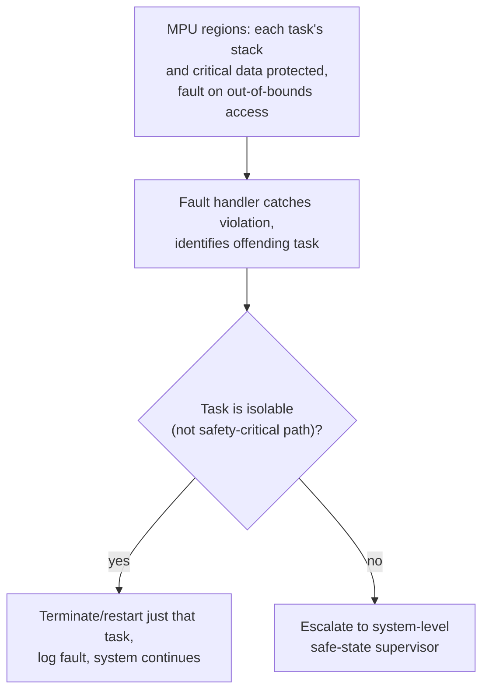

Where the MCU has an MPU (increasingly common even on Cortex-M targets), I use it to give each task's stack a protected region so a stack overflow or an out-of-bounds write from one task faults immediately rather than silently corrupting an adjacent task's memory — turning a corruption bug into an immediately-detectable fault is most of the value here. On top of that, I design fault handling to distinguish "this specific task misbehaved" from "the system's safety-critical core is compromised": if the offending task is something isolable and non-critical (a UI task, a diagnostics task), the fault handler can terminate and restart just that task and let the rest of the system continue; if it's ambiguous or touches a safety-critical path, the fault must escalate to the system-level safe-state supervisor (the same convergent-safe-state pattern from the state-machines topic) rather than attempting a local recovery that might mask a more serious problem. I explicitly avoid a design where a fault handler tries to "just keep going" without classifying the fault's blast radius first — that's how corrupted state quietly propagates instead of being caught at the boundary where it happened.

## 20. As an architect, what's your review checklist for a new RTOS task before it's approved to merge?

```mermaid
flowchart TB
    R1["1. Priority justified by\nRM/DM analysis, not guesswork?\n(Q5, Q12)"]
    R2["2. Stack size backed by\nhigh-water-mark data,\nnot a guessed constant? (Q13)"]
    R3["3. Every shared-resource access\nrace-free, lock-order documented?\n(Q6, Q15)"]
    R4["4. Does it need to be a task\nat all, vs a callback? (Q18)"]
    R5["5. Health/heartbeat wired into\nthe supervisor if critical? (Q8)"]
    R6["6. Fault isolation: can this task's\nfailure be contained? (Q19)"]
    R1 --> R2 --> R3 --> R4 --> R5 --> R6 --> APPROVE["Approve"]
```

My checklist, in the order I actually apply it: is the assigned priority justified by an actual schedulability argument rather than "it felt important"; is the stack size backed by high-water-mark measurement under worst-case exercised paths rather than a round-number guess; is every piece of shared state this task touches covered by a documented, race-free synchronization strategy with a clear lock order; could this genuinely be a callback/state-machine step instead of a whole new task, given the real cost every task adds to the system's analyzability; if this task is safety- or availability-critical, is it wired into the health-monitoring supervisor with an appropriately-sized timeout; and finally, if this task misbehaves (runaway loop, corrupted memory), is the blast radius contained, or can it take down unrelated parts of the system? A new task that can't answer these cleanly is exactly the kind of thing that looks fine in code review and then causes a field escalation months later once it's under real load — which is why I'd rather push back at merge time than rely on catching it afterward.
