# Advanced Coding — 04 Protocol Design

These are design-oriented interview exercises for senior/staff embedded engineers and embedded architects. A strong solution should state assumptions, interfaces, memory ownership, timing constraints, concurrency model, failure behavior, and test strategy — and back it with a small, concrete example rather than staying purely abstract.

## Reference pattern: layered protocol stack

Almost every question below maps onto the same layering: a transport that only moves bytes/frames, a framing layer that carves those bytes into discrete messages, and an application layer that only ever sees validated, complete messages.

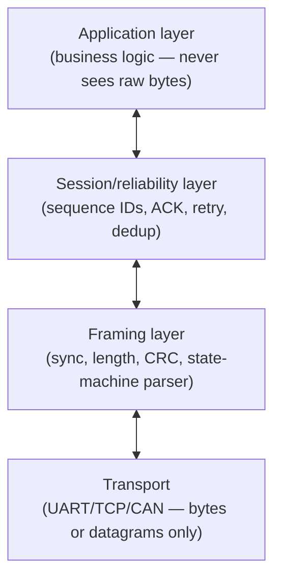
```mermaid
flowchart TB
    APP["Application layer\n(business logic — never sees raw bytes)"]
    SESSION["Session/reliability layer\n(sequence IDs, ACK, retry, dedup)"]
    FRAMING["Framing layer\n(sync, length, CRC, state-machine parser)"]
    TRANSPORT["Transport\n(UART/TCP/CAN — bytes or datagrams only)"]

    APP <--> SESSION <--> FRAMING <--> TRANSPORT
```

The senior-level point worth stating up front in every answer below: reliability (retries, dedup, sequencing) belongs in exactly one layer — usually the session layer — never duplicated at both the transport and application layers, or you get retry amplification (multiple layers each retrying the same underlying failure and multiplying traffic).

## 1. Design a framed binary protocol

Define sync, length, type, payload, CRC, maximum frame size, and parser recovery.

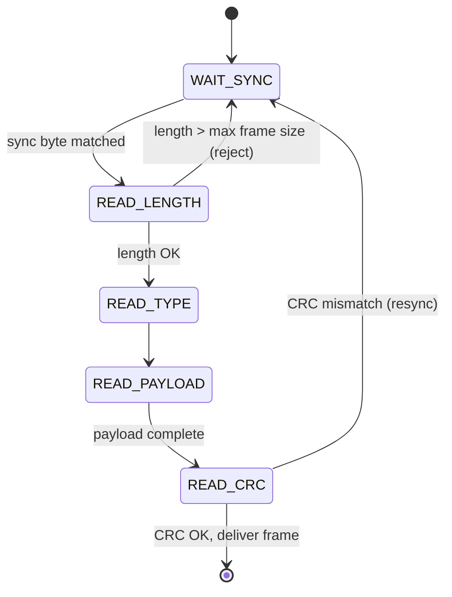
```mermaid
stateDiagram-v2
    [*] --> WAIT_SYNC
    WAIT_SYNC --> READ_LENGTH: sync byte matched
    READ_LENGTH --> WAIT_SYNC: length > max frame size (reject)
    READ_LENGTH --> READ_TYPE: length OK
    READ_TYPE --> READ_PAYLOAD
    READ_PAYLOAD --> READ_CRC: payload complete
    READ_CRC --> WAIT_SYNC: CRC mismatch (resync)
    READ_CRC --> [*]: CRC OK, deliver frame
```

```c
typedef struct { uint8_t sync; uint8_t type; uint16_t length; } frame_header_t;
/* Wire layout: [SYNC(1)][TYPE(1)][LEN(2)][PAYLOAD(LEN)][CRC16(2)] */

#define MAX_PAYLOAD 240u

bool validate_length(uint16_t len) { return len <= MAX_PAYLOAD; }  /* checked before any copy */
```

### What the interviewer should hear

- The declared length is validated against the parser's fixed buffer capacity *before* any byte is copied — this is the line between a parsing bug and a buffer overflow
- Any validation failure (bad length, bad CRC) returns to a resync state that scans for the next sync byte, rather than resetting and immediately retrying the same corrupted byte
- Maximum frame size is a hard, compile-time constant, not something derived at runtime from an attacker/noise-controlled length field
- CRC polynomial/init/reflection parameters must be pinned exactly (see Q7) — "CRC" alone isn't a complete specification

## 2. Design a reliable command protocol over UART

Add sequence IDs, acknowledgements, timeouts, retries, and duplicate handling.

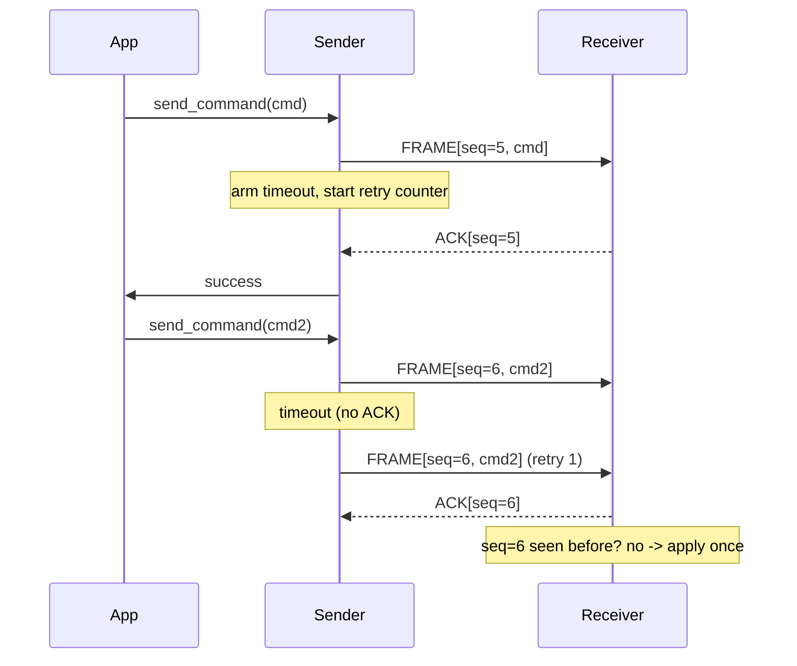
```mermaid
sequenceDiagram
    participant App
    participant Sender
    participant Receiver
    App->>Sender: send_command(cmd)
    Sender->>Receiver: FRAME[seq=5, cmd]
    Note over Sender: arm timeout, start retry counter
    Receiver-->>Sender: ACK[seq=5]
    Sender->>App: success

    App->>Sender: send_command(cmd2)
    Sender->>Receiver: FRAME[seq=6, cmd2]
    Note over Sender: timeout (no ACK)
    Sender->>Receiver: FRAME[seq=6, cmd2] (retry 1)
    Receiver-->>Sender: ACK[seq=6]
    Note over Receiver: seq=6 seen before? no -> apply once
```

### What the interviewer should hear

- One response-wait timer per outstanding command, armed on send and cleared on matching ACK — a lost ACK must be distinguishable from a lost command, but the sender's action (retry) is the same either way
- Sequence IDs let the receiver detect a duplicate delivery (a retried command whose original ACK was lost, not the command) and apply it exactly once rather than twice
- Bounded retry count with backoff, and a terminal failure reported to the application after retries exhaust — never an infinite retry loop
- Non-idempotent commands (e.g., "increment counter") absolutely require the dedup-by-sequence-ID check; idempotent commands (e.g., "set output = ON") are safe either way but should still dedup for consistency

## 3. Design a protocol over TCP

Add application framing because TCP is a byte stream; define reconnect/session semantics.

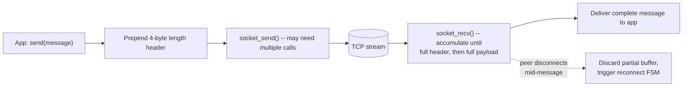
```mermaid
flowchart LR
    SEND["App: send(message)"] --> ENC["Prepend 4-byte length header"] --> SOCK["socket_send() -- may need multiple calls"]
    SOCK --> WIRE[("TCP stream")]
    WIRE --> RECV["socket_recv() -- accumulate until\nfull header, then full payload"]
    RECV --> DEC["Deliver complete message to app"]
    RECV -.->|"peer disconnects\nmid-message"| DISCARD["Discard partial buffer,\ntrigger reconnect FSM"]
```

```c
bool receive_exact(socket_t s, uint8_t *buf, size_t len)
{
    size_t got = 0u;
    while (got < len) {
        int n = socket_receive(s, buf + got, len - got);
        if (n <= 0) return false;      /* 0 = orderly close, <0 = error */
        got += (size_t)n;
    }
    return true;
}
```

### What the interviewer should hear

- TCP delivers a byte stream, not messages — a length-prefix header (or a delimiter, for text protocols) is mandatory application-level framing, never optional
- `send()`/`recv()` can each transfer fewer bytes than requested — the receive loop must accumulate until the declared length is met, never assume one call equals one message
- Session/reconnect semantics must be explicit: does a new TCP connection resume a prior session (requiring the app to track session state) or start fresh? A design that's silent on this loses in-flight application state silently on every reconnect
- A partial message buffered when the connection drops mid-receive must be discarded, not "completed" from the next connection's bytes — treating them as continuous is a serious framing bug

## 4. Design an MQTT message lifecycle

Define publish queueing, QoS choice, reconnect behavior, deduplication, and offline policy.

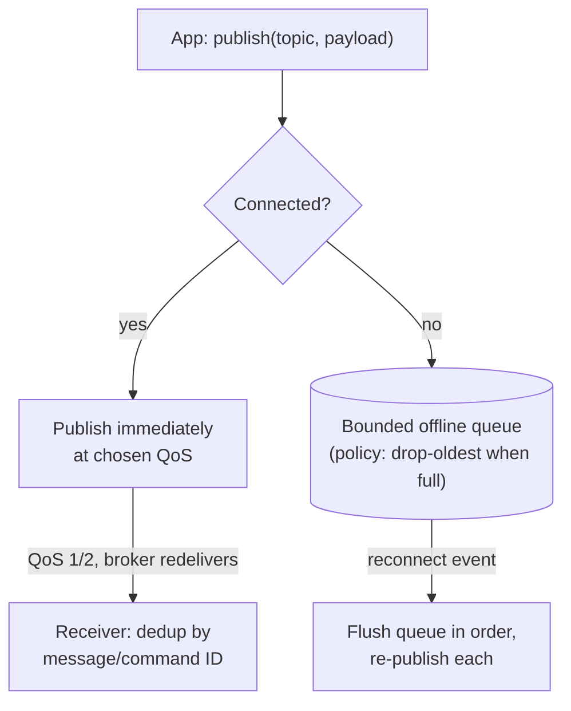
```mermaid
flowchart TB
    APP["App: publish(topic, payload)"] --> QCHECK{"Connected?"}
    QCHECK -->|yes| SEND["Publish immediately\nat chosen QoS"]
    QCHECK -->|no| OFFQ[("Bounded offline queue\n(policy: drop-oldest when full)")]
    OFFQ -->|"reconnect event"| FLUSH["Flush queue in order,\nre-publish each"]
    SEND -->|"QoS 1/2, broker redelivers"| DEDUP["Receiver: dedup by\nmessage/command ID"]
```

### What the interviewer should hear

- QoS is chosen per message type, not globally: QoS 0 for high-rate telemetry where a dropped sample doesn't matter, QoS 1 (at-least-once) for commands where delivery matters more than avoiding duplicates, since QoS 1 can redeliver
- QoS delivery guarantees are transport-level, not application-level — a redelivered QoS-1 command must still be deduplicated by the application using its own command ID, exactly as in Q2, since MQTT's guarantee is "the broker got it," not "your handler ran exactly once"
- Offline queueing needs an explicit bounded size and full-policy (drop-oldest is common, prioritizing recent state over stale backlog) — an unbounded queue during a long outage is a memory-exhaustion risk
- Last-will and retained-message behavior should be part of the explicit design (what does a subscriber see immediately after connecting, and what does the broker publish if this device disappears ungracefully) rather than left to library defaults

## 5. Design a Modbus master

Implement request sequencing, response validation, timeout/retry, exception responses, and device addressing.

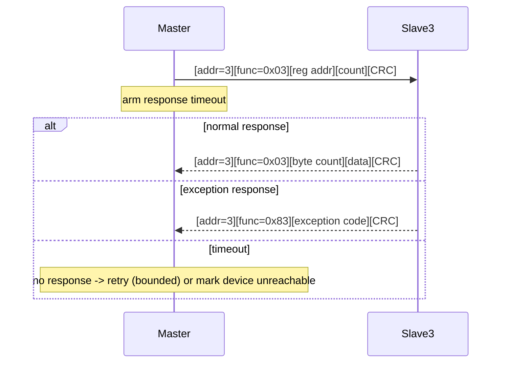
```mermaid
sequenceDiagram
    participant Master
    participant Slave3
    Master->>Slave3: [addr=3][func=0x03][reg addr][count][CRC]
    Note over Master: arm response timeout
    alt normal response
        Slave3-->>Master: [addr=3][func=0x03][byte count][data][CRC]
    else exception response
        Slave3-->>Master: [addr=3][func=0x83][exception code][CRC]
    else timeout
        Note over Master: no response -> retry (bounded) or mark device unreachable
    end
```

### What the interviewer should hear

- Modbus is strictly master-initiated — the master must serialize requests one at a time per bus and never have two outstanding requests, since slaves never send unsolicited data and there's no way to distinguish which response answers which request otherwise
- An exception response (function code with the high bit set, e.g., `0x83` answering a `0x03` request) is a valid, well-formed response, not a transport error — it must be parsed and surfaced as a specific Modbus exception code, not treated the same as a timeout
- Bounded retry-then-mark-unreachable per device, so one unresponsive slave on an RS-485 multidrop bus doesn't stall the master from ever polling the other devices
- CRC-16 (Modbus's specific variant, poly 0xA001 reflected) is checked before any response field is trusted — a corrupted response with a byte count that happens to look plausible must never be parsed past the CRC check

## 6. Design a CAN transport layer

Split larger messages into frames, maintain sequence state, timeouts, and reassembly limits.

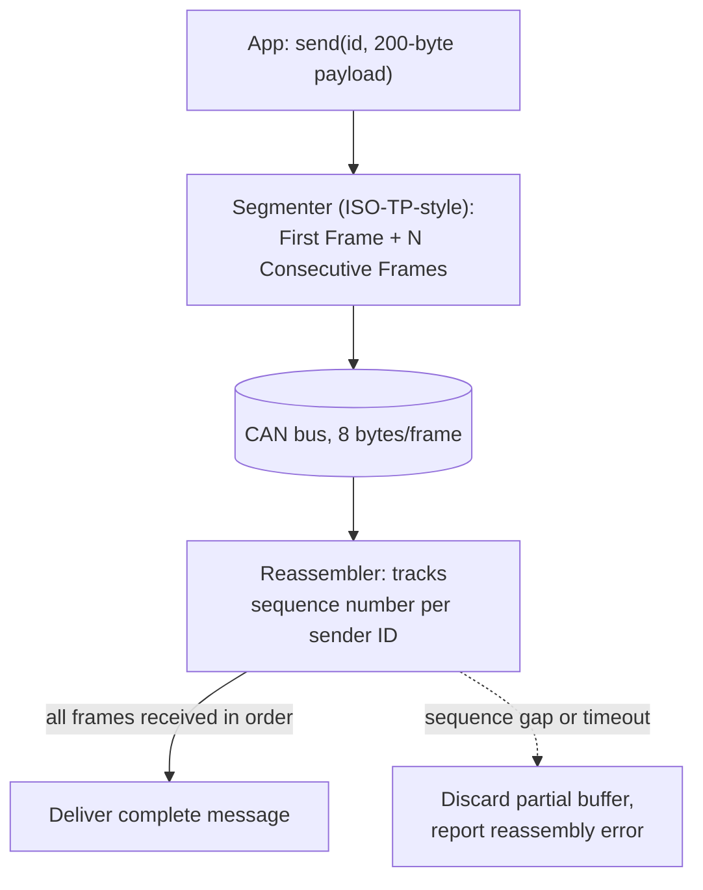
```mermaid
flowchart TB
    APP["App: send(id, 200-byte payload)"] --> SPLIT["Segmenter (ISO-TP-style):\nFirst Frame + N Consecutive Frames"]
    SPLIT --> BUS[("CAN bus, 8 bytes/frame")]
    BUS --> REASM["Reassembler: tracks\nsequence number per sender ID"]
    REASM -->|"all frames received in order"| DELIVER["Deliver complete message"]
    REASM -.->|"sequence gap or timeout"| ABORT["Discard partial buffer,\nreport reassembly error"]
```

### What the interviewer should hear

- CAN's 8-byte (classic) payload forces segmentation for anything larger — an ISO-TP-style scheme (First Frame carrying total length, Consecutive Frames each carrying a rolling sequence number) is the standard approach, and interviewers want to hear you know the sequence number exists specifically to detect a dropped/reordered frame
- Reassembly state is per-sender (keyed by CAN ID) and must have a bounded timeout — a partially-received message that never completes must be discarded and reported, not held forever waiting for frames that may never arrive
- A sequence-number gap (frame 3 arrives after frame 1, frame 2 never seen) must abort that reassembly rather than silently concatenating out-of-order or incomplete data
- Reassembly buffer size is a hard bound (maximum supported message size), and a First Frame declaring a length beyond that bound is rejected immediately rather than accepted and overflowed into

## 7. Design CRC test vectors

Document exact polynomial, width, init, reflection, xorout, and known input/output vectors.

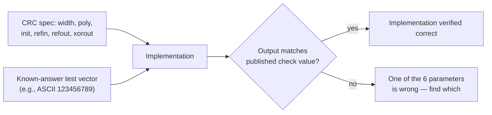
```mermaid
flowchart LR
    SPEC["CRC spec: width, poly,\ninit, refin, refout, xorout"] --> IMPL["Implementation"]
    KNOWN["Known-answer test vector\n(e.g., ASCII 123456789)"] --> IMPL
    IMPL --> CHECK{"Output matches\npublished check value?"}
    CHECK -->|yes| TRUST["Implementation verified correct"]
    CHECK -->|no| BUG["One of the 6 parameters\nis wrong — find which"]
```

```text
CRC-16/MODBUS:  width=16  poly=0x8005  init=0xFFFF  refin=true  refout=true  xorout=0x0000
                check("123456789") = 0x4B37
```

### What the interviewer should hear

- "CRC-16" alone is not a specification — width, polynomial, initial value, input reflection, output reflection, and final XOR must all be pinned exactly, since two "CRC-16" implementations with different parameters produce different results on identical input and will silently fail to interoperate
- A standard published check value (computing the CRC of the ASCII string `"123456789"` is the conventional test vector for nearly every named CRC) is how you verify an implementation against the spec without needing the other vendor's code to compare against
- Test vectors should include not just the happy-path check value but edge cases: empty input, single-byte input, and the maximum-length input the protocol allows
- If two systems disagree on the "same" CRC, checking `refin`/`refout` (bit reflection) first is usually the fastest diagnosis, since it's the parameter most commonly mismatched between vendors

## 8. Design protocol versioning

Define backward-compatible fields, version negotiation, and behavior for unknown fields.

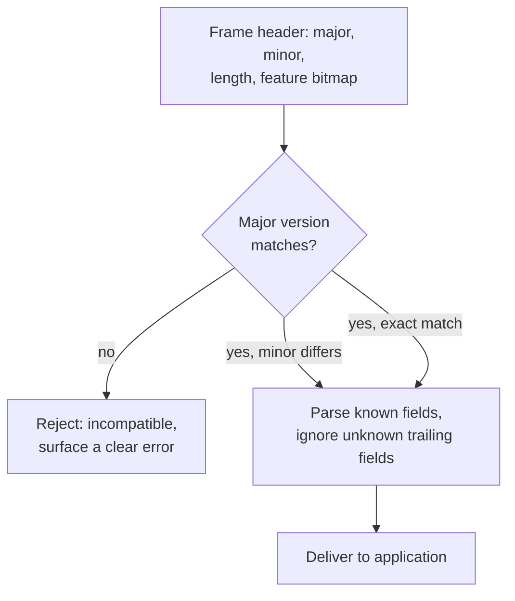
```mermaid
flowchart TB
    HDR["Frame header: major, minor,\nlength, feature bitmap"] --> CHECK{"Major version\nmatches?"}
    CHECK -->|no| REJECT["Reject: incompatible,\nsurface a clear error"]
    CHECK -->|yes, minor differs| PARSE["Parse known fields,\nignore unknown trailing fields"]
    CHECK -->|yes, exact match| PARSE
    PARSE --> APP["Deliver to application"]
```

### What the interviewer should hear

- Major version changes mean "wire-incompatible" and should be rejected outright with a clear error; minor version changes mean "backward-compatible addition" and older parsers should tolerate them by ignoring unrecognized trailing fields
- New fields are appended after existing ones, never inserted in the middle — inserting shifts every subsequent field's offset and breaks every parser that doesn't know about the insertion, including the sender's own old firmware still in the field
- A feature/capability bitmap in the header lets each side communicate what it actually supports, so negotiation doesn't require guessing from version numbers alone (a device might implement most of v2 but not one specific optional feature)
- Golden-vector regression tests should include an old client talking to a new server and a new client talking to an old server, not just same-version pairs, since that cross-version interaction is exactly where subtle compatibility bugs hide

## 9. Design a command-line protocol

Separate lexical parsing, validation, dispatch, response formatting, and error reporting.

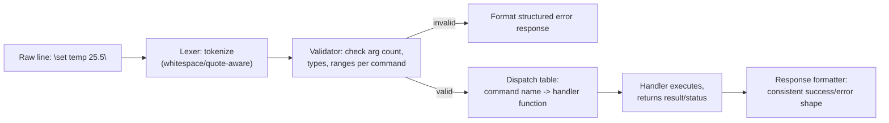
```mermaid
flowchart LR
    INPUT["Raw line: \"set temp 25.5\""] --> LEX["Lexer: tokenize\n(whitespace/quote-aware)"]
    LEX --> VALIDATE["Validator: check arg count,\ntypes, ranges per command"]
    VALIDATE -->|invalid| ERR["Format structured error response"]
    VALIDATE -->|valid| DISPATCH["Dispatch table:\ncommand name -> handler function"]
    DISPATCH --> HANDLER["Handler executes,\nreturns result/status"]
    HANDLER --> FORMAT["Response formatter:\nconsistent success/error shape"]
```

### What the interviewer should hear

- Each stage is independently testable when kept separate: the lexer can be tested with malformed quoting/whitespace without touching any command logic, and a handler can be tested by calling it directly with already-validated arguments
- A dispatch table (command name → handler function pointer) rather than a large `if`/`else if` chain keeps adding new commands a data change, and makes it trivial to enumerate all supported commands (for a `help` command, or documentation generation)
- Validation happens once, in one place, before dispatch — handlers should never need to re-validate argument count/type, which both avoids duplication and prevents a handler from being reachable with malformed input via some path that skipped validation
- Error responses need a consistent, parseable shape (for a scripted/automated caller, not just a human at a terminal) — "error: something went wrong" as free text is a design smell for anything beyond a purely interactive debug console

## 10. Design an encrypted application protocol

Separate transport security from application authentication, key management, replay protection, and framing.

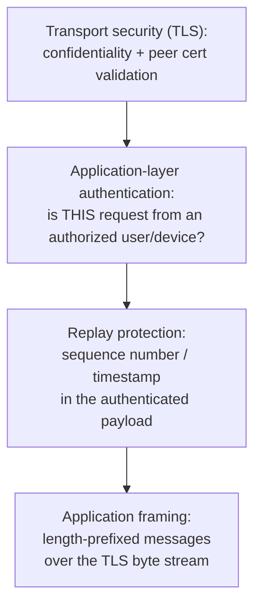
```mermaid
flowchart TB
    TLS["Transport security (TLS):\nconfidentiality + peer cert validation"]
    APPAUTH["Application-layer authentication:\nis THIS request from an authorized user/device?"]
    REPLAY["Replay protection:\nsequence number / timestamp\nin the authenticated payload"]
    FRAME["Application framing:\nlength-prefixed messages\nover the TLS byte stream"]

    TLS --> APPAUTH --> REPLAY --> FRAME
```

### What the interviewer should hear

- TLS proves *which server/device* you're talking to (peer certificate validation) — it does not by itself prove *which user/role* is issuing a given application request, which is why application-layer authentication (a token, a signed command) is a separate concern layered on top, not a redundant one
- Replay protection is needed even over an encrypted, authenticated channel: TLS doesn't stop a captured, still-validly-encrypted request from being replayed within its session or after session resumption unless the application itself includes a sequence number or timestamp inside the authenticated payload
- Application framing (length-prefix, per Q3) is still required inside the TLS stream — encryption doesn't create message boundaries, it just protects the bytes that still need framing
- Key management (how device credentials/keys are provisioned, rotated, and revoked) deserves its own explicit design — "we use TLS" says nothing about what happens when a device's key needs to be revoked after a suspected compromise

## Senior / Staff / Architect-Level Questions

### At a glance (one line each, for quick revision)

| Q | Topic | One-line answer |
| --- | --- | --- |
| 11 | Transport-agnostic errors | One application status enum; each transport only serializes it |
| 12 | Resumable large transfer | Receiver decides the resume point, per-chunk CRC, final hash check |
| 13 | Fuzzing | An isolated parser entry point; assert bounded memory, progress, and valid states |
| 14 | Extensibility | Receivers ignore unknown types; type values are append-only |
| 15 | Where to put security | TLS by default; whole-frame AEAD when there is no TLS; per-field only when required |
| 16 | Interoperability | A precise spec, shared golden vectors, and live differential decoding |
| 17 | Diagnostics logging | Compact binary records, redact secrets at the source, bounded ring, export on demand |
| 18 | Adaptive timeouts | Measure round-trip time, derive the timeout from it, and cap it |
| 19 | Build vs adopt | Adopt a standard by default; go custom only for a verified constraint |
| 20 | Design review checklist | One retry owner, pinned wire format, unknown-field rule, bounded parsing, security model, vectors |

## 11. How do you design a protocol's error/status model so it works consistently across drastically different transports (UART, TCP, MQTT) in the same product line?

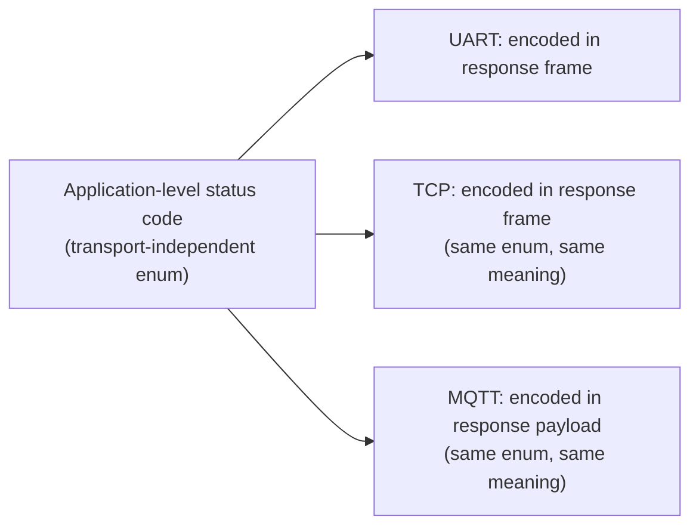
```mermaid
flowchart LR
    APPERR["Application-level status code\n(transport-independent enum)"] --> UART_MAP["UART: encoded in response frame"]
    APPERR --> TCP_MAP["TCP: encoded in response frame\n(same enum, same meaning)"]
    APPERR --> MQTT_MAP["MQTT: encoded in response payload\n(same enum, same meaning)"]
```

I define one application-level status/error enum that's completely transport-agnostic — it describes outcomes in terms the business logic cares about (`CMD_OK`, `CMD_INVALID_PARAM`, `CMD_DEVICE_BUSY`, `CMD_UNAUTHORIZED`), never transport-specific concepts like "TCP connection reset" or "UART framing error," which belong to a separate transport-level error reporting path entirely. Each transport binding is then just a serialization concern: how does this same enum get encoded into a UART response frame's status byte, versus a JSON field in an MQTT payload, versus an HTTP status code mapping. This is what lets application logic, and critically, test code and documentation, be written once against the stable enum and reused regardless of which transport a given product variant uses — and it prevents the common failure mode where three different transports each invent their own incompatible error vocabulary that a shared application layer then has to translate between everywhere it's used.

## 12. Walk through how you'd design a protocol to survive a partial/interrupted transfer of a large payload (e.g., a multi-megabyte firmware image) over an unreliable link

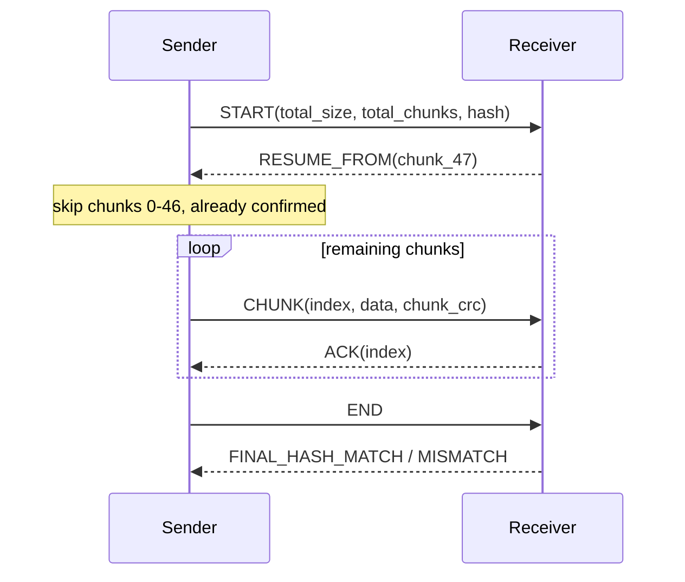
```mermaid
sequenceDiagram
    participant Sender
    participant Receiver
    Sender->>Receiver: START(total_size, total_chunks, hash)
    Receiver-->>Sender: RESUME_FROM(chunk_47)
    Note over Sender: skip chunks 0-46, already confirmed
    loop remaining chunks
        Sender->>Receiver: CHUNK(index, data, chunk_crc)
        Receiver-->>Sender: ACK(index)
    end
    Sender->>Receiver: END
    Receiver-->>Sender: FINAL_HASH_MATCH / MISMATCH
```

The key design decision is making the receiver, not the sender, the authority on what's already been received — on reconnect after an interruption, the receiver reports the last confirmed contiguous chunk (persisted to non-volatile storage as each chunk is confirmed, exactly like the flash-driver power-loss-recovery pattern), and the sender resumes from there rather than either restarting from zero or assuming the sender's own in-memory progress is still valid. Each chunk carries its own CRC so a corrupted chunk is caught and re-requested immediately rather than only discovered at the final whole-image hash check; the final end-to-end hash check remains as a defense-in-depth confirmation that chunk-level CRCs alone can't fully guarantee (e.g., against a systematic bug that corrupts the same way every time). I size the chunk to balance overhead (larger chunks amortize per-chunk header cost) against retry cost (a corrupted or lost chunk means re-sending only that chunk, not the whole transfer) — for a genuinely unreliable link, smaller chunks with more frequent ACKs usually win despite the overhead.

## 13. How do you approach designing a protocol to be fuzz-tested effectively, and what specifically should the fuzzer be checking for beyond "does it crash"?

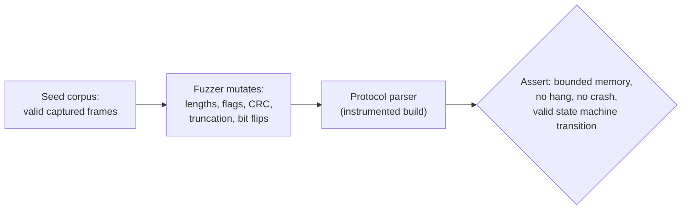
```mermaid
flowchart LR
    SEED["Seed corpus:\nvalid captured frames"] --> MUTATE["Fuzzer mutates:\nlengths, flags, CRC,\ntruncation, bit flips"]
    MUTATE --> PARSER["Protocol parser\n(instrumented build)"]
    PARSER --> ASSERT{"Assert: bounded memory,\nno hang, no crash,\nvalid state machine transition"}
```

I structure the parser so it can be fuzzed as an isolated unit — a single entry point that takes a byte buffer and runs it through the exact same parsing logic as production, with no real hardware/network dependency, which is the same injected-transport testability principle used for driver design applied to protocol code. Beyond "does it crash," I specifically assert: memory usage stays within its declared static bound regardless of input (a length field can't be used to make the parser allocate or copy more than its fixed buffer, even under a deliberately malicious length value); the parser always makes forward progress or returns an error within a bounded number of iterations (no fuzzer-discoverable infinite loop); and the parser's internal state machine only ever occupies states and takes transitions that are in the documented design — an unexpected/undefined state reachable through some byte sequence is itself a bug even if it doesn't crash. I run this continuously in CI with a persistent corpus (coverage-guided fuzzing, e.g., libFuzzer or AFL, seeded with real captured traffic) rather than as a one-time pre-release exercise, since a single new code path added later can reintroduce a previously-fixed class of bug.

## 14. How would you design a protocol so it can be extended with new message types over the product's lifetime without ever breaking devices already deployed in the field?

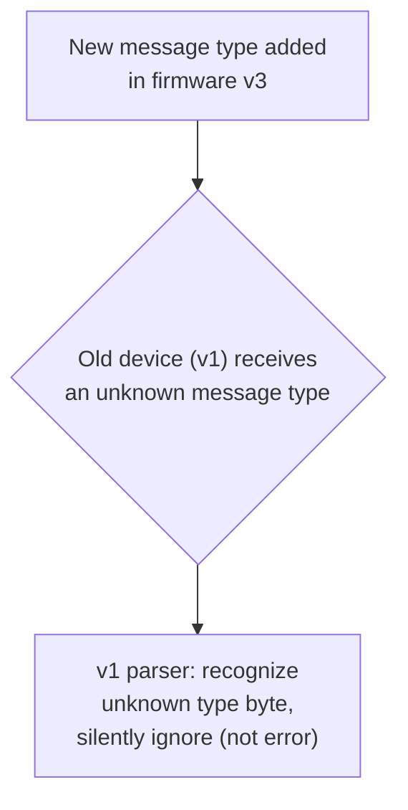
```mermaid
flowchart TB
    NEW["New message type added\nin firmware v3"] --> OLDCHECK{"Old device (v1) receives\nan unknown message type"}
    OLDCHECK --> IGNORE["v1 parser: recognize\nunknown type byte,\nsilently ignore (not error)"]
```

The critical design decision is deciding, from day one, exactly what an implementation does when it encounters a message type it doesn't recognize — and the answer needs to be "ignore it gracefully" (perhaps logging it at a low severity), not "treat it as a parse error" or, worse, undefined behavior. This means the very first version of the protocol needs a type/tag field with room for growth (not a value tightly packed against its own maximum) and an explicit statement in the spec itself: "receivers must silently ignore message types they don't recognize." I also keep type values append-only, exactly like the enum-ordering rule from protocol versioning (Q8) — a type value, once shipped, is never reused for something else, even after that message type is deprecated, because a mixed-fleet deployment (old and new devices coexisting for months or years, which is the normal case for embedded products) means an old device could still see traffic referencing that value from a message a different, newer device sent.

## 15. How do you decide where to put protocol-level security (authentication, encryption) — at the transport layer, wrapped around the whole frame, or embedded per-field — and what drives that decision?

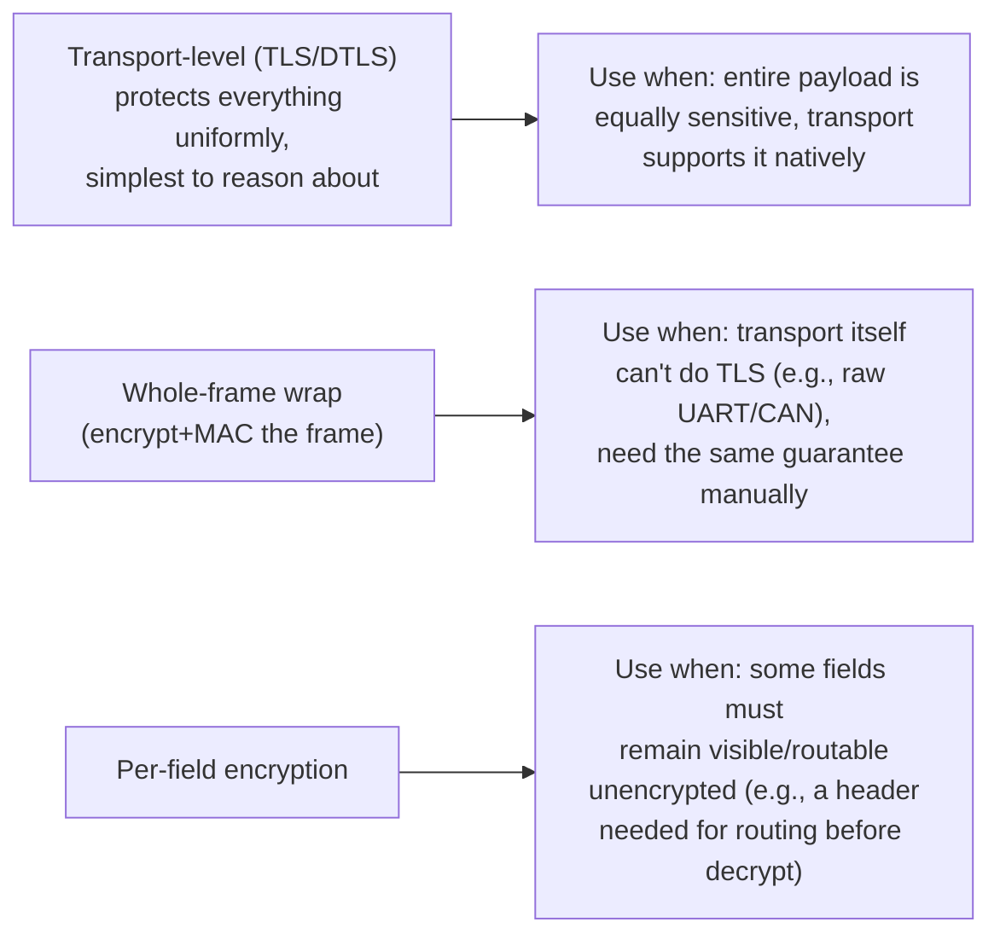
```mermaid
flowchart LR
    A["Transport-level (TLS/DTLS)\nprotects everything uniformly,\nsimplest to reason about"] --> WHEN_A["Use when: entire payload is\nequally sensitive, transport\nsupports it natively"]
    B["Whole-frame wrap\n(encrypt+MAC the frame)"] --> WHEN_B["Use when: transport itself\ncan't do TLS (e.g., raw UART/CAN),\nneed the same guarantee manually"]
    C["Per-field encryption"] --> WHEN_C["Use when: some fields must\nremain visible/routable\nunencrypted (e.g., a header\nneeded for routing before decrypt)"]
```

My default is transport-level security (TLS/DTLS) whenever the transport supports it, since it's the best-reviewed, hardest-to-get-wrong option and protects the entire payload uniformly without the application needing to think about it per-message. When the transport genuinely can't support that (raw UART, CAN, or a proprietary RF link with no TLS implementation available), I wrap the whole frame with an AEAD construction (encrypt-then-MAC, or better, a combined AEAD cipher like AES-GCM) manually at the framing layer, giving the same confidentiality-plus-integrity guarantee TLS would have provided. I only reach for per-field encryption when there's a genuine architectural reason some fields must remain visible to an intermediary that isn't the final decryption endpoint — for example, a gateway that needs to route a message based on a device ID field without being able to decrypt the message's actual payload — and I treat that as the exception requiring extra justification, not a default, since per-field schemes are far easier to get subtly wrong (e.g., accidentally leaving a sensitive field unencrypted, or letting an attacker infer information from which fields are and aren't encrypted).

## 16. How do you design and enforce interoperability across multiple independent implementations of the same protocol (e.g., your firmware and a third-party vendor's gateway)?

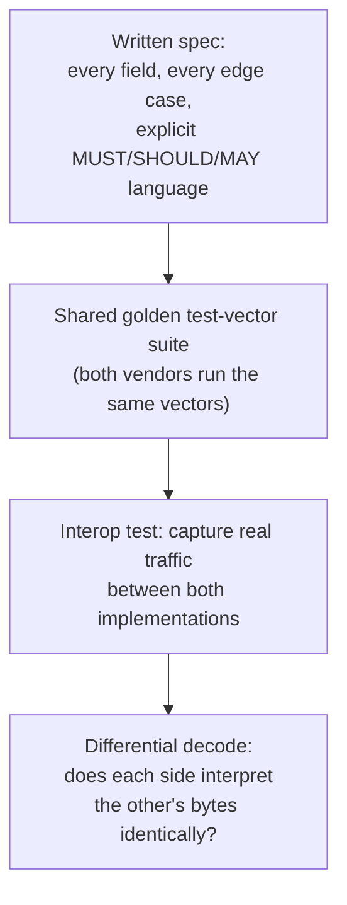
```mermaid
flowchart TB
    SPEC["Written spec:\nevery field, every edge case,\nexplicit MUST/SHOULD/MAY language"] --> VECTORS["Shared golden test-vector suite\n(both vendors run the same vectors)"]
    VECTORS --> CAPTURE["Interop test: capture real traffic\nbetween both implementations"]
    CAPTURE --> DIFF["Differential decode:\ndoes each side interpret\nthe other's bytes identically?"]
```

I insist on a written specification precise enough to remove ambiguity — using explicit MUST/SHOULD/MAY language (RFC 2119-style) for every field and edge case, since "the length field should probably be big-endian" is exactly the kind of ambiguity that produces two compliant-sounding but incompatible implementations. From that spec, I build a shared, versioned golden-vector test suite (exact byte sequences with their expected decoded meaning, including deliberately tricky edge cases: maximum values, reserved fields, zero-length payloads) that both my team and the third-party vendor run independently against their own implementations — agreement on the vectors is a much stronger signal than "we both read the same spec and think we agree." Beyond static vectors, I push for an actual interop test capturing live traffic between both real implementations and differentially decoding it with both sides' parsers, since that's what catches the class of bug where both implementations pass the static vectors but still disagree on some interaction the vectors didn't happen to cover.

## 17. What's your approach to instrumenting/logging a protocol implementation for field diagnostics, without either bloating flash/bandwidth or leaking sensitive data?

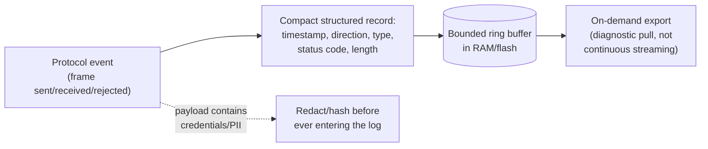
```mermaid
flowchart LR
    EVENT["Protocol event\n(frame sent/received/rejected)"] --> COMPACT["Compact structured record:\ntimestamp, direction, type,\nstatus code, length"]
    COMPACT --> RB[("Bounded ring buffer\nin RAM/flash")]
    RB --> EXPORT["On-demand export\n(diagnostic pull, not\ncontinuous streaming)"]
    EVENT -.->|"payload contains\ncredentials/PII"| REDACT["Redact/hash before\never entering the log"]
```

I log compact, structured binary records (timestamp, direction, message type, status/error code, length) rather than formatted text — this is both far cheaper to store (critical when logging happens near an ISR or a bandwidth-constrained radio link) and far easier to parse programmatically later, deferring human-readable formatting to an offline tool that decodes the binary log rather than paying that cost on the device. I explicitly design what's excluded from the log at the point of logging, not as an afterthought: any field that could contain credentials, tokens, or personally identifiable information is redacted or hashed before it ever enters the log buffer, since "we'll scrub the logs before sharing them" is a policy that reliably fails the one time someone forgets. Storage is a bounded ring buffer (RAM for recent history, optionally flushed to flash for surviving a reset) with an explicit overwrite-oldest policy, and export is on-demand (a diagnostic pull triggered by a support request or a detected fault condition) rather than continuous streaming, which would itself consume the bandwidth/power budget the product may not have to spare.

## 18. How would you design a protocol's retry/timeout values so they're correct across a wide range of deployment conditions (a UART link near-instant, an LTE-M link with seconds of latency) rather than one hardcoded number?

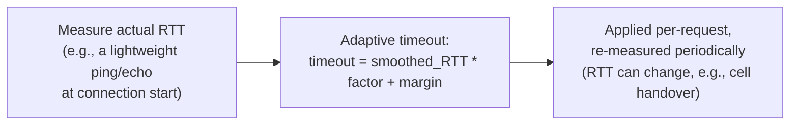
```mermaid
flowchart LR
    MEASURE["Measure actual RTT\n(e.g., a lightweight ping/echo\nat connection start)"] --> ADAPT["Adaptive timeout:\ntimeout = smoothed_RTT * factor + margin"]
    ADAPT --> USE["Applied per-request,\nre-measured periodically\n(RTT can change, e.g., cell handover)"]
```

I avoid a single hardcoded timeout constant and instead measure the actual round-trip characteristics of the link the device is currently using — similar in spirit to TCP's own RTT estimation (a smoothed RTT average with a variance-based margin, the same idea behind TCP's Jacobson/Karels algorithm) — and derive the timeout from that measurement rather than a number tuned for whichever transport the developer happened to be testing on. This matters enormously for a product line that might run the same application-level protocol over UART (sub-millisecond RTT) and cellular (multi-second RTT with real variance) — a timeout tuned for UART will falsely trigger retries constantly over cellular, and a timeout generous enough for cellular wastes real time detecting a genuinely dead UART link. I re-measure periodically rather than once at startup, since a link's characteristics can change during operation (a cellular handover, a Wi-Fi channel change), and I make sure the retry/backoff policy built on top of this adaptive timeout still has an absolute cap, so a pathological RTT measurement (a fluke very slow first response) can't produce an unreasonably long timeout for every subsequent request.

## 19. As an architect, how do you approach the trade-off between designing a protocol from scratch versus adopting an existing standard (CoAP, MQTT, a proprietary binary format) for a new product?

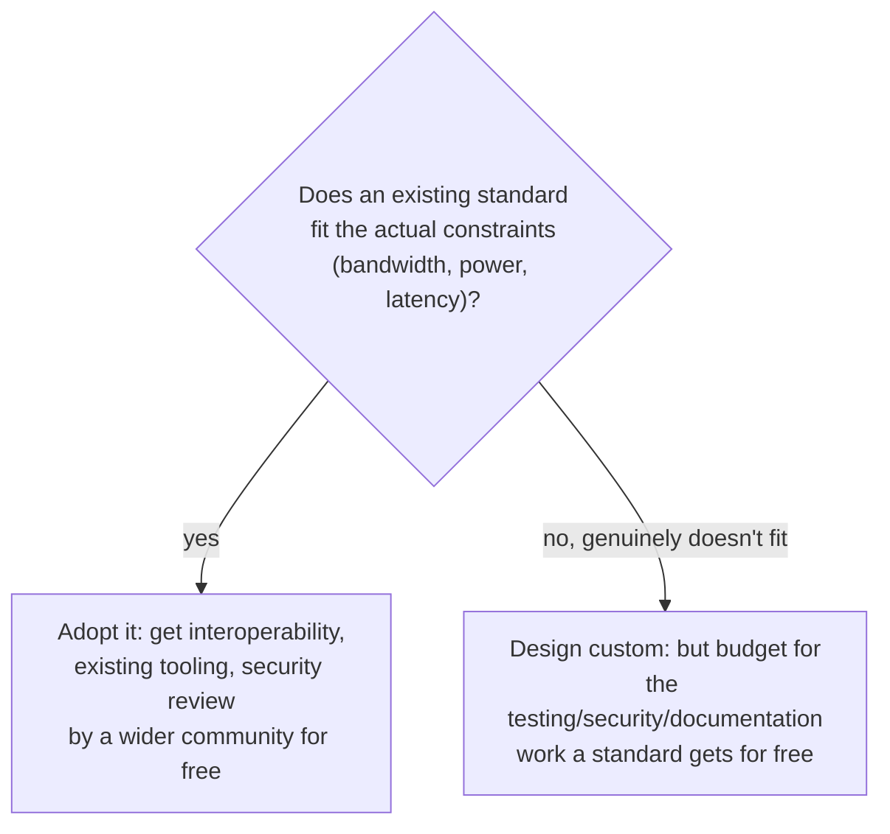
```mermaid
flowchart TB
    Q1{"Does an existing standard\nfit the actual constraints\n(bandwidth, power, latency)?"}
    Q1 -->|yes| ADOPT["Adopt it: get interoperability,\nexisting tooling, security review\nby a wider community for free"]
    Q1 -->|no, genuinely doesn't fit| CUSTOM["Design custom: but budget for\nthe testing/security/documentation\nwork a standard gets for free"]
```

My default bias is strongly toward adopting an existing, well-reviewed standard, because a mature standard has already absorbed years of real-world edge cases, security review, and available tooling (parsers, test suites, wireshark dissectors) that a custom protocol starts with none of — reinventing a framing/reliability scheme from scratch is rarely where a product's actual differentiation lies. I'd design something custom specifically when there's a genuine, quantified constraint an existing standard doesn't meet — for example, MQTT's per-message overhead being too large for a truly bandwidth/power-starved LPWAN link where every byte transmitted has a real energy cost, or a latency requirement tighter than a general-purpose standard's typical implementation can meet. Critically, if I do go custom, I explicitly budget for everything a standard gets "for free" — a written spec precise enough for third-party interoperability, a fuzz-tested and security-reviewed implementation, comprehensive test vectors — because the real cost of a custom protocol isn't the initial design, it's carrying all of that maintenance burden for the product's entire lifetime without the benefit of a wider community sharing the load.

## 20. As an architect, what's your review checklist for a new protocol design document before implementation begins?

```mermaid
flowchart TB
    R1["1. Is reliability (retry/dedup)\nowned by exactly one layer?\n(reference pattern)"]
    R2["2. Is every field's exact wire\nformat pinned (endianness,\nCRC params, no ambiguity)? (Q7)"]
    R3["3. Explicit behavior for unknown\nfields/message types\n(forward compatibility)? (Q8, Q14)"]
    R4["4. Bounded memory/timeouts for\nevery state, malicious-input safe? (Q1, Q13)"]
    R5["5. Security: transport vs\napplication-layer auth,\nreplay protection? (Q10, Q15)"]
    R6["6. Golden test vectors and\ninterop plan defined upfront? (Q16)"]
    R1 --> R2 --> R3 --> R4 --> R5 --> R6 --> APPROVE["Approve for implementation"]
```

My checklist, applied before a single line of implementation code is written: is reliability (sequencing, ACK, retry, dedup) clearly owned by exactly one layer, with every other layer explicitly deferring to it rather than adding its own overlapping retry logic; is every field's wire format completely unambiguous (byte order, exact CRC parameters, fixed vs variable length) such that two independent teams implementing from the spec alone would produce interoperable code; does the spec explicitly state what a receiver does with an unrecognized field or message type, since that's the single decision that determines whether the protocol can evolve without breaking deployed devices; does every parser state have a bounded memory and time cost even under adversarial/malformed input, not just well-formed test input; is the security model explicit about what transport-level protection provides versus what application-level authentication and replay protection must additionally provide; and finally, does the design document include (or commit to producing before ship) a golden test-vector suite and an interoperability test plan, rather than treating those as an afterthought for whoever implements it. A protocol design that can't answer these cleanly on paper will surface its gaps as interoperability bugs and security findings after devices are already deployed, which is a far more expensive place to discover them than a design review.
