# Advanced Coding — 05 System Architecture

These are design-oriented interview exercises for senior/staff embedded engineers and embedded architects. A strong solution should state assumptions, interfaces, memory ownership, timing constraints, concurrency model, failure behavior, and test strategy — and back it with a small, concrete example rather than staying purely abstract.

## Reference pattern: layered system architecture

Almost every question below is a variation of the same overall shape — hardware isolated behind a HAL, drivers built on that HAL, services/business logic built on the drivers, and a supervisory layer that spans everything to guarantee the system can always reach a safe, observable, recoverable state.

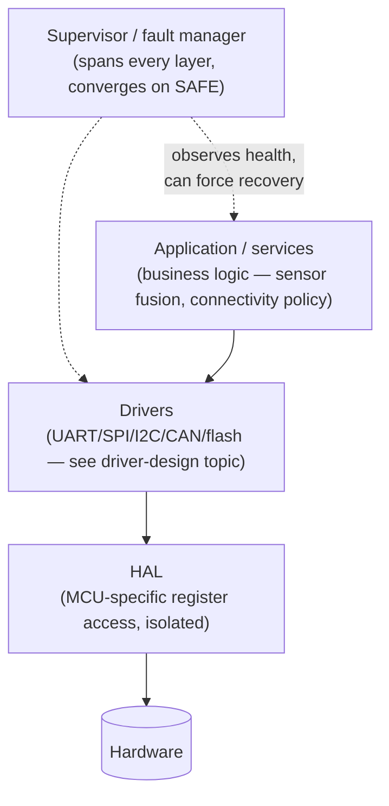

The senior-level point worth stating up front in every answer below: the supervisor/fault-manager layer is not "one more module" — it's a cross-cutting concern that must be able to reach every other layer's recovery hooks, which is exactly why it's drawn spanning the stack rather than sitting inside it.

## 1. Design a battery-powered IoT node

Partition sensing, processing, storage, connectivity, power, watchdog, diagnostics, and update logic.

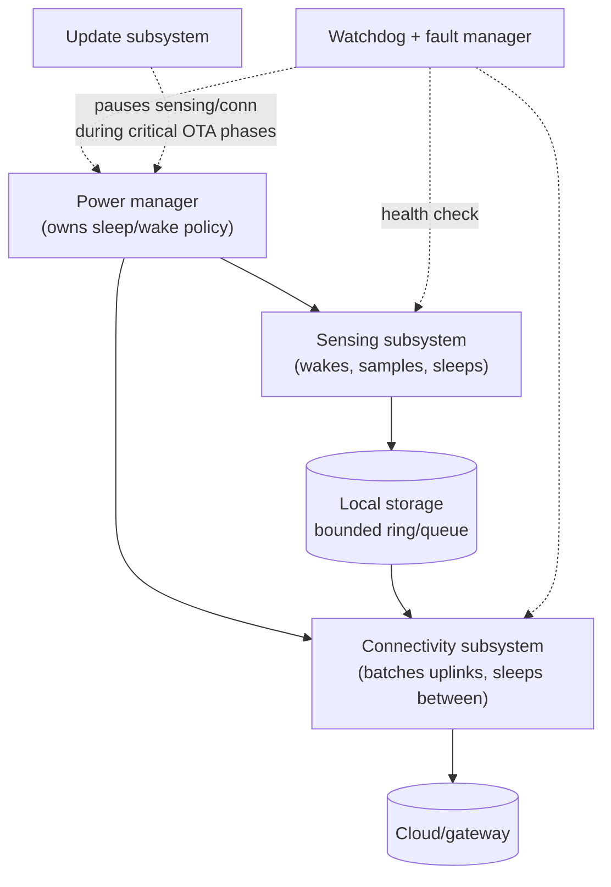

### What the interviewer should hear

- Power is the organizing constraint, not an afterthought bolted on last — every subsystem's design (how often it wakes, how much it buffers before transmitting) should be derived from the energy budget, not fitted to it after the fact
- Sensing and connectivity are decoupled through local, bounded storage — this lets the device keep sampling during a connectivity outage and lets the radio batch/coalesce uplinks to minimize the energy cost of radio wake time (typically the single largest power draw)
- The watchdog/fault manager must be able to observe every subsystem's health independently, since "the device is alive" (single global kick) hides a livelocked sensing task with a still-transmitting connectivity task
- Firmware updates need explicit interaction with the power manager — an OTA in progress must not be interrupted by a scheduled deep-sleep, and a critically low battery should be able to defer/abort a non-critical update rather than risk a power-loss mid-flash-write

## 2. Design a modem controller

Create a transport/parser/command engine with explicit ownership and recovery.

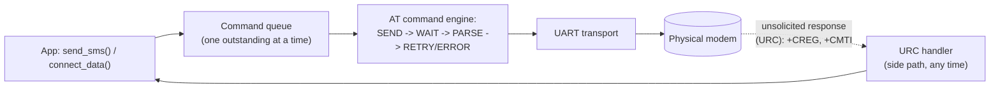

### What the interviewer should hear

- This is the AT-command FSM from the state-machines topic, embedded in a larger architecture: the command engine, the URC (unsolicited response) side-channel, and the transport are three cleanly separated concerns, not one tangled parser
- Only one command is outstanding at a time on a single UART-connected modem — the command queue enforces this serialization so a second command can't be sent while the first is still awaiting its response
- URCs (network status changes, incoming SMS notification) can arrive at any moment, including between a command and its response, and must be recognized and routed to interested application code without disrupting the command engine's state
- Modem resets/power-cycling need to be a first-class recovery path the controller can trigger itself (many modems become unresponsive in ways only a hardware reset line resolves) — a design that can only report "modem not responding" without a recovery action is incomplete

## 3. Design a firmware update architecture

Define image metadata, validation, storage, activation, rollback, and power-loss recovery.

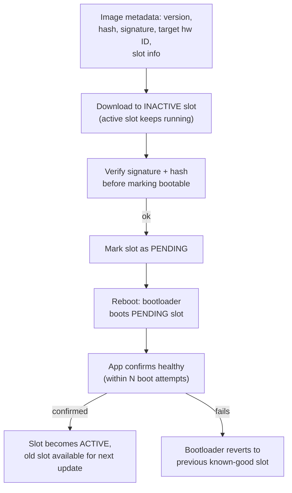

### What the interviewer should hear

- This is the firmware-update FSM (state-machines topic) realized as a full system architecture: A/B (dual-slot) storage is what makes "download while running" and "instant rollback" both possible, since the currently-running image is never overwritten by the update itself
- Every persisted metadata write (slot state, pending/active/confirmed flags) must be a single atomic write, since power can be lost at literally any point in this flow, and the bootloader must be able to make a safe decision from whatever state was last durably written
- Signature and hash verification happens before a slot is ever marked bootable — a corrupted or malicious image must never reach the point where the bootloader would execute it
- Bounded boot-attempt counting before automatic rollback is what prevents a subtly-broken image (boots, but crashes 10 seconds in) from bricking the device via an infinite boot-crash-reboot cycle — this must be implemented in the bootloader itself, independent of the application, since a broken application can't be trusted to trigger its own rollback

## 4. Design a fault manager

Classify faults, preserve context, coordinate recovery, and escalate safely.

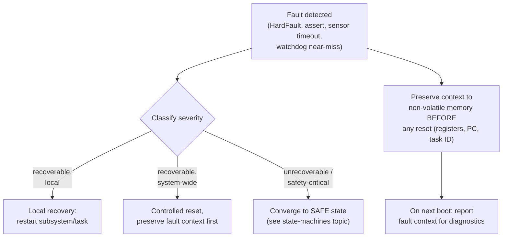

### What the interviewer should hear

- Fault context (which task, what type of fault, register/stack state at the time) must be captured and persisted to non-volatile memory *before* any reset happens — a HardFault handler that just resets without recording anything throws away the one chance to diagnose what actually happened
- Classification (local-recoverable vs system-wide-recoverable vs unrecoverable) determines the response, and this classification logic itself needs to be simple and robust — a fault handler is exactly the wrong place for complex logic that could itself fault
- This fault manager is the software layer reacting to *known* fault conditions; it's complementary to, not a replacement for, the hardware watchdog's backstop role for genuinely unknown hangs — the same distinction as the safe-state supervisor in the state-machines topic
- A senior answer asks: is fault context readable after the *next* reboot for field diagnostics (e.g., surfaced over a diagnostic protocol, or included in the next telemetry upload), since a fault that's recorded but never actually retrieved provides no real debugging value

## 5. Design a logging architecture

Use asynchronous bounded transport and define drop/backpressure policy.

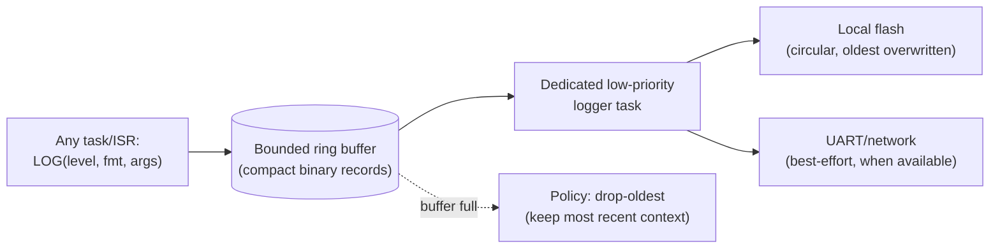

### What the interviewer should hear

- This is the high-throughput logger pattern from the RTOS-design topic, generalized to a system-wide architecture: every producer (any task, any ISR) writes cheap, compact binary records into a bounded buffer, and only the dedicated logger task does the actual slow I/O
- The overflow policy (drop-oldest here) is a deliberate choice — keeping the most recent entries is usually more valuable for diagnosing a fault than preserving the oldest, since the interesting context is almost always right before the fault, not at buffer creation
- Multiple sinks (local flash for post-mortem analysis, live UART/network for real-time monitoring when available) should be independent — a live monitoring session being disconnected must never block or slow down the local flash write
- Log verbosity should be runtime-adjustable (not just compile-time), since a field issue that only reproduces occasionally can't wait for a rebuild-and-redeploy cycle to get more detailed logging in place

## 6. Design a sensor aggregation service

Normalize timestamps/units, handle missing sensors, and expose a stable consumer API.

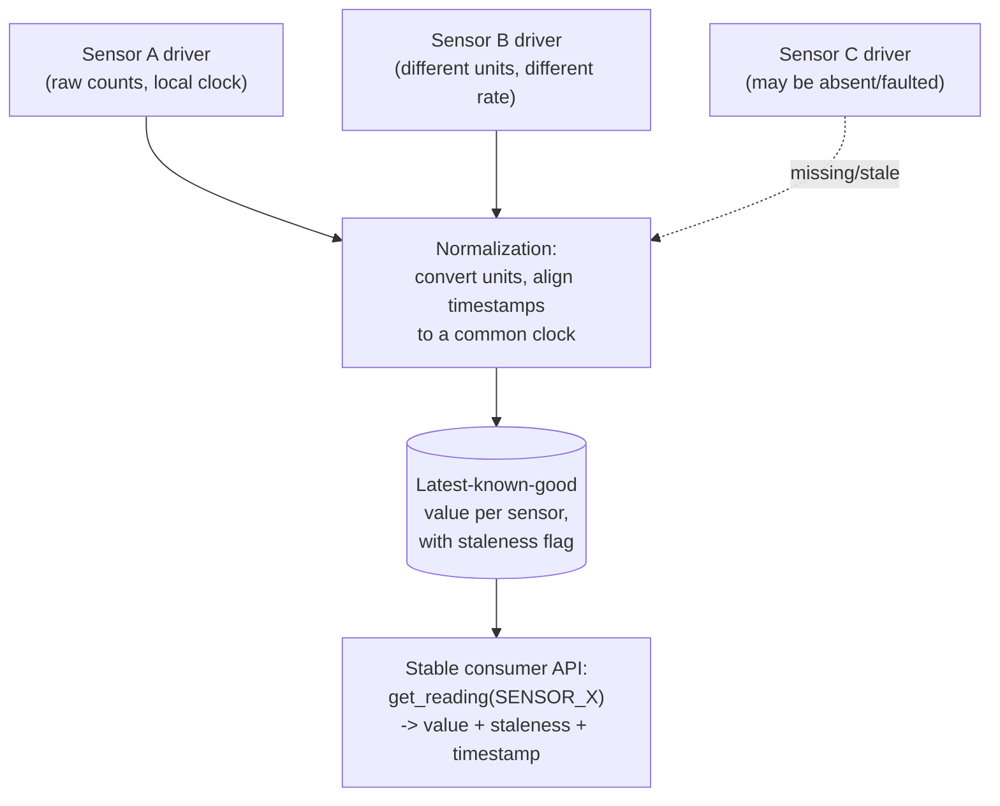

### What the interviewer should hear

- Every driver reports in its own native units/rate/clock domain — normalization is a single, centralized responsibility, not something every consumer re-implements slightly differently
- A missing or faulted sensor must be an explicit, observable state in the API (a staleness flag or an explicit "unavailable" result), never silently returning a stale or zeroed value indistinguishable from a genuine fresh reading of zero
- Timestamp alignment matters for anything that fuses multiple sensors (e.g., comparing two sensors' readings to detect a discrepancy) — readings taken at genuinely different times but presented without timestamps invite subtly wrong fusion logic
- The consumer-facing API should be stable even as underlying sensors are added, removed, or replaced with a different part — this is the same "stable public API over a changing implementation" principle from driver design, applied at the service layer

## 7. Design a hardware abstraction layer

Keep MCU/board details below stable driver interfaces and isolate conditional compilation.

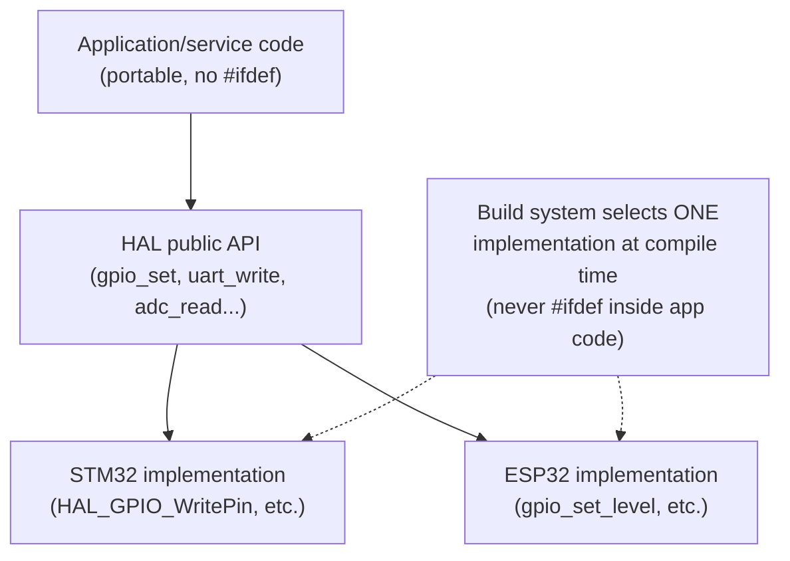

### What the interviewer should hear

- Conditional compilation (`#ifdef STM32` / `#ifdef ESP32`) is isolated entirely inside the HAL implementation files — application and service code calls the same function names regardless of target, and never contains a chip-specific `#ifdef` itself
- The HAL's public API should be shaped around what the application actually needs semantically (`gpio_set(LOGICAL_PIN, level)`), not a thin pass-through of whatever the vendor SDK happens to expose — a HAL that just renames vendor functions doesn't actually provide portability
- The build system (not runtime logic) selects which implementation compiles in for a given target — this keeps flash usage minimal (no dead code for chips this build will never run on) and catches a missing implementation at link time rather than as a runtime surprise
- A senior answer explicitly scopes what the HAL does *not* try to abstract — some hardware differences (a chip with vs without a hardware CRC unit, differing DMA channel counts) may need to be surfaced upward as capability flags rather than fully hidden, since pretending away a fundamental capability difference produces a leaky abstraction

## 8. Design a bootloader/application contract

Define memory map, vector handoff, versioning, metadata, trust, and reset behavior.

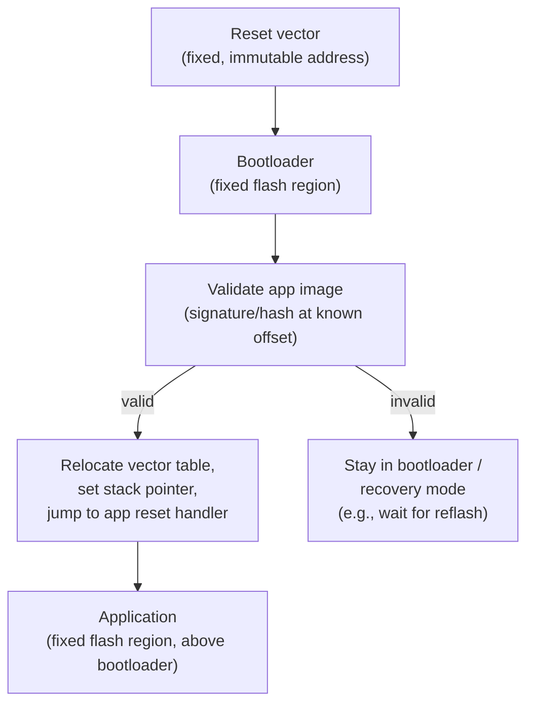

### What the interviewer should hear

- The memory map (which flash addresses belong to the bootloader versus the application, and where metadata/signature lives) must be a fixed, documented contract that both sides are built against — a bootloader and application built against mismatched memory maps is a common, hard-to-diagnose bring-up bug
- The vector table relocation and stack pointer reset during handoff are not optional details — jumping to the application's reset handler without first relocating the vector table (`SCB->VTOR` on Cortex-M) means the application's interrupts fire using the bootloader's vector table, a subtle and confusing failure mode
- Version/metadata format at a fixed, known offset lets the bootloader validate an image without needing to understand the application's internal structure — the contract is deliberately minimal and stable so the bootloader rarely needs to change even as the application evolves significantly
- What happens when validation fails needs to be a defined, tested path (drop into a recovery/DFU mode) — a bootloader design that has no path forward when the application image is invalid effectively bricks the device on any corruption

## 9. Design system observability

Include software version, reset reason, state, counters, event IDs, and compact fault context.

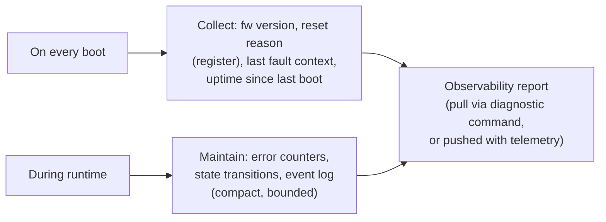

### What the interviewer should hear

- Reset reason (most MCUs expose a hardware register distinguishing power-on, watchdog, brown-out, software reset) is one of the highest-value, lowest-cost pieces of observability — it immediately narrows "why did this device restart" without any additional instrumentation
- Observability should be designed to answer specific field-support questions in advance: "what firmware version is this," "has it faulted recently and why," "how long has it been running," "how healthy are its subsystems right now" — designed reactively after a field issue is much more expensive than designed proactively
- Everything here needs to be *compact* (a counter, an enum, a fixed-size struct) since it's often collected under constrained conditions (right before/after a fault, over a bandwidth-limited link) — verbose text logs are for the local logging architecture (Q5), not this always-on observability surface
- A senior answer connects this to the fault manager (Q4): the fault context captured there is exactly the kind of data this observability surface needs to expose, so the two should share a data model rather than be designed independently

## 10. Design for field recovery

Plan watchdog reset, rollback, safe defaults, persistent diagnostics, and recoverable update state.

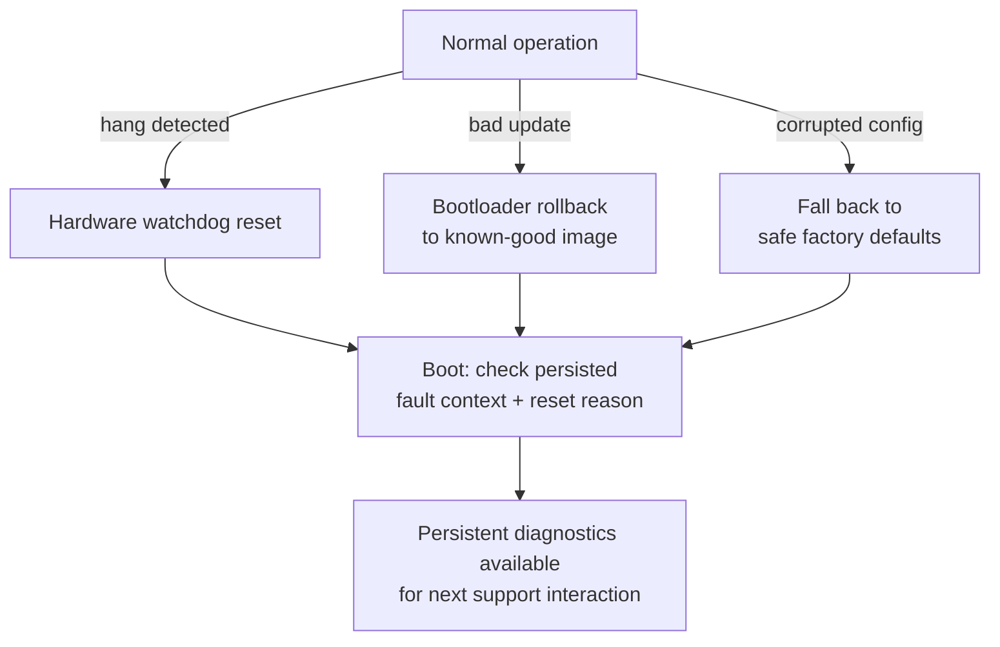

### What the interviewer should hear

- Every recovery mechanism here (watchdog, rollback, safe defaults) is a specific answer to a specific failure mode — a senior answer explicitly maps which mechanism handles which failure, rather than treating "recovery" as one generic capability
- Safe defaults specifically address configuration corruption (a flash page failure, a bad write) — the system must be able to detect corrupted configuration (via CRC/versioning, as in the flash-driver topic) and fall back to known-safe values rather than operating on garbage or refusing to boot at all
- Every recovery path should leave a trace in persistent diagnostics — a device that silently rolled back three times in the field with no record of it is nearly undiagnosable when a support case eventually comes in
- The overarching design goal is that no single failure mode should be able to permanently brick the device without physical reflashing being the only option — every layer (watchdog, bootloader rollback, config defaults) exists specifically to keep the device recoverable purely through its own software

## Senior / Staff / Architect-Level Questions

## 11. How do you architect a product line so the same core firmware runs across multiple hardware variants (different MCU, different sensor mix) without fragmenting into divergent codebases?

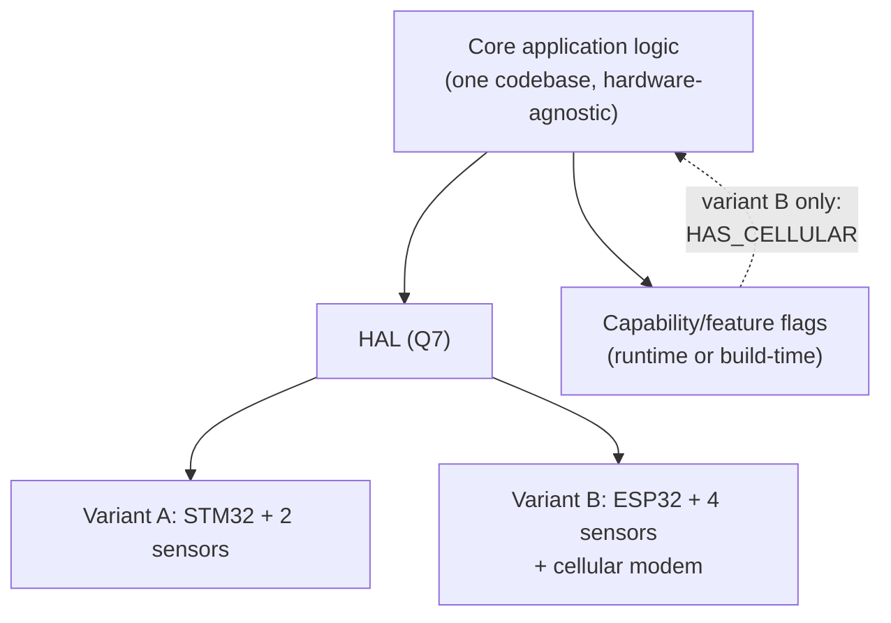

I keep exactly one core application codebase and push every hardware difference down through two mechanisms: the HAL (Q7) for "same capability, different implementation" differences (a GPIO is a GPIO regardless of MCU), and an explicit capability/feature-flag system for "this variant genuinely has different capabilities" differences (a cellular modem present on one variant and absent on another) — the core logic checks a capability flag rather than a build-time `#ifdef VARIANT_B` scattered through business logic. The discipline I enforce in review is that a new hardware variant should require changes only in the HAL implementation and the capability configuration, never in the core application logic — if a new variant keeps forcing changes to shared business logic, that's a sign a hardware-specific assumption leaked into a layer that was supposed to be hardware-agnostic, and I'd push to fix the abstraction rather than accept another special case.

## 12. How do you decide the boundary between what runs on the MCU versus what's offloaded to a companion processor, gateway, or the cloud, in a resource-constrained IoT product?

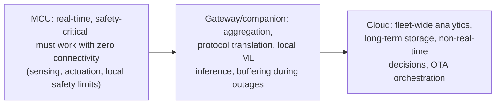

My guiding question for every piece of functionality is: what's the worst-case consequence if connectivity to the next tier up is unavailable right now, and for how long can that be tolerated? Anything with a real-time deadline or a safety implication (reading a sensor and reacting to an out-of-range value, an emergency-stop condition) has to live on the MCU, since it must keep working with zero connectivity indefinitely — I never make safety-relevant behavior dependent on a cloud round-trip. Aggregation, protocol translation, and anything that benefits from more compute/storage than the MCU has but still needs to tolerate the cloud being unreachable (buffering during an outage) belongs on a companion processor or local gateway. True cloud-tier work is anything that's inherently fleet-wide or explicitly non-real-time — analytics across many devices, long-term historical storage, orchestrating which devices get an OTA update and when. Getting this boundary wrong in either direction is expensive to fix later: too much on the MCU wastes its constrained resources on work that didn't need real-time guarantees; too much pushed to the cloud creates a product that's non-functional the moment connectivity drops, for functionality that never actually needed connectivity.

## 13. How do you design a system-level test strategy that gives real confidence in a product's field reliability, beyond unit tests of individual modules?

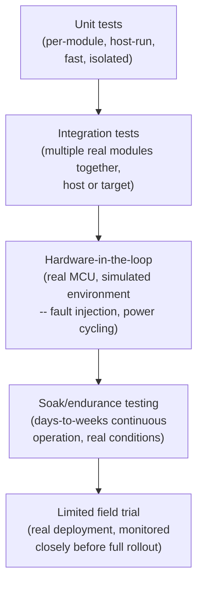

I structure system-level confidence as a pyramid with fast, isolated unit tests as the base (per the injected-transport testability pattern from driver design), integration tests exercising multiple real modules together next, then hardware-in-the-loop testing that specifically injects faults a unit test can't reach — power brownouts mid-write, a sensor disconnected mid-read, a connectivity drop mid-transaction — since these are exactly the conditions that expose gaps in the recovery paths designed in Q3, Q4, and Q10. Above that, soak/endurance testing (continuous operation for days or weeks under realistic conditions) is what catches the failure modes that only emerge from cumulative effects — a slow memory leak, flash wear approaching its limit, a rare race condition that needs many iterations to hit — that no single test run, however thorough, would catch. Finally, a limited, closely-monitored field trial before full rollout catches the class of issue that's specific to real-world variability (RF environment, temperature extremes, actual user behavior patterns) that even a good lab simulation doesn't fully replicate. The architectural point: each layer is designed to catch a different *class* of bug, not just "more of the same testing" — skipping a layer leaves a specific class of field failure with no test coverage at all.

## 14. How would you architect a system's configuration management so devices in the field can have their behavior safely adjusted without a full firmware update, while avoiding configuration drift becoming its own reliability risk?

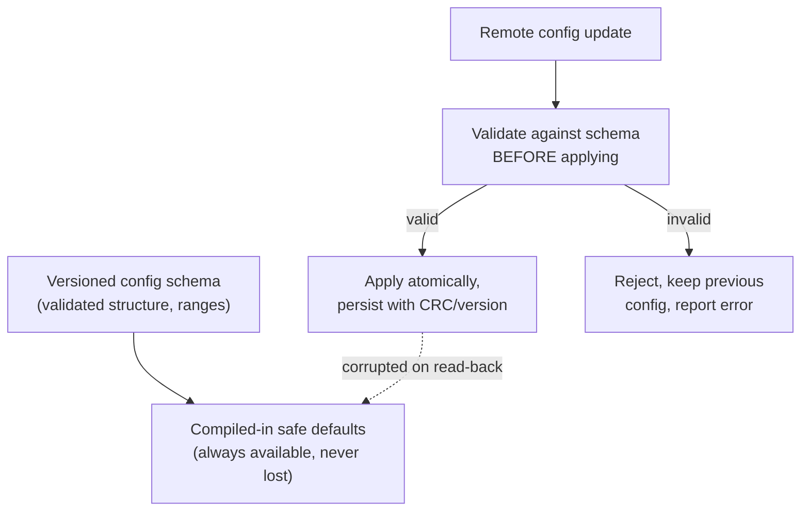

I treat remote configuration the same way I treat any other untrusted external input: it's validated against an explicit schema (types, ranges, required fields) before being applied, never trusted and applied directly, since a malformed or malicious configuration payload is a real attack surface if a device accepts arbitrary values for things like safety limits or connection endpoints. Configuration is layered with compiled-in safe defaults as the unconditional fallback — if persisted configuration is ever found corrupted (CRC/version check fails, same discipline as the flash-driver and safe-defaults recovery pattern) or a remote update is rejected by validation, the device falls back to those defaults rather than running with partially-applied or garbage configuration. I also explicitly design for drift visibility: the device's current configuration version/hash should be part of its observability surface (Q9), so fleet management can detect devices that have drifted from the expected configuration (failed to receive an update, or reverted to defaults after a corruption event) rather than silently assuming the fleet is uniformly configured.

## 15. How do you architect security into an embedded product from the start (secure boot, secure storage, secure communication) rather than bolting it on after the fact?

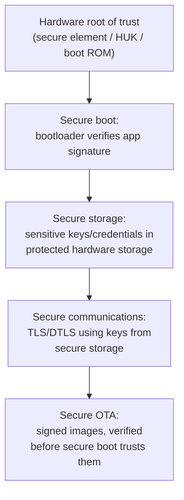

I start from whatever hardware root of trust the chosen SoC actually provides (a secure element, fuse-burned hardware unique key, or an immutable boot ROM) since every higher-level security guarantee is only as strong as this foundation — software-only security claims without a hardware anchor can be defeated by an attacker with physical access reflashing arbitrary code. From there, each layer builds on the one below it in a specific order: secure boot (verified by the root of trust) establishes that only trusted code runs; secure storage (protected by the boot chain) is where credentials and keys actually live, never in plain flash readable by any code that happens to run; secure communications use keys from that secure storage rather than hardcoded or weakly-protected values; and secure OTA ties back into secure boot, since a new firmware image is only as trustworthy as the signature verification the (already-trusted) bootloader performs on it. The architectural mistake I actively watch for is treating any of these as independent, retrofittable features — trying to add "secure storage" after secure boot was designed without it, for example, usually means the storage protection has no real hardware backing and is security theater rather than an actual defense.

## 16. How do you make an architectural decision (e.g., choice of RTOS, choice of MCU, choice of connectivity stack) that the team will need to live with for the product's multi-year lifetime, and how do you document that decision for engineers who join later?

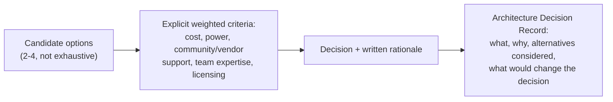

I make long-lived architectural decisions by first constraining the option set to a small number of genuinely viable candidates (not an exhaustive survey — that's analysis paralysis for a decision that needs to actually get made) and scoring them against explicit, weighted criteria decided *before* looking at the options in detail, to reduce the risk of rationalizing a gut preference after the fact: unit cost at production volume, power consumption against the product's energy budget, quality of vendor support and community/ecosystem maturity, the team's existing expertise (a technically superior option the team doesn't know well carries real hidden cost), and licensing terms. I document the outcome as a lightweight Architecture Decision Record — what was decided, why, which alternatives were seriously considered and why they lost, and critically, what circumstances would be enough to revisit the decision — specifically so an engineer joining two years later doesn't waste time re-litigating a decision without knowing what's already been considered, and so the team itself has an honest, written trigger for reconsidering rather than sunk-cost inertia keeping a now-wrong decision in place indefinitely.

## 17. How do you architect a system to support meaningful A/B or canary rollouts of firmware changes across a deployed fleet, and what does the architecture need to provide to make that safe?

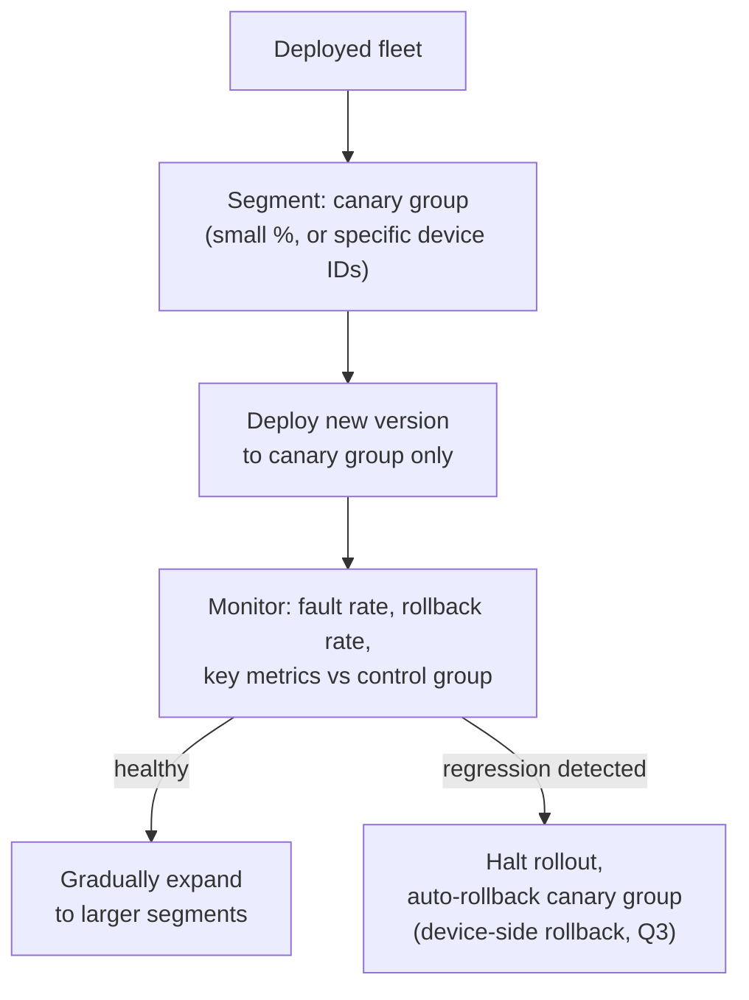

The architecture needs three things to make this genuinely safe, not just a manual "push to some devices and hope": first, the device-side firmware update mechanism itself must already support reliable automatic rollback (Q3) independent of any fleet-management awareness, since a canary device that fails must be able to recover on its own even if the fleet-management system's rollout-halt signal is delayed or lost. Second, the observability surface (Q9) needs to report metrics granular and timely enough to distinguish "the canary group is behaving differently from the control group" quickly — if fault detection takes days, a canary rollout provides little practical protection before the decision to expand further gets made anyway. Third, the fleet-management/deployment system needs the ability to target a specific segment precisely (a percentage, a device-ID list, a hardware-variant filter) and to halt/reverse a rollout without requiring every device to individually opt in to checking again — a design that can only push updates fleet-wide with no segmentation capability can't do canary rollouts at all, regardless of how good the device-side update mechanism is.

## 18. How do you approach the build-vs-buy decision for major subsystems (e.g., writing a custom TCP/IP stack versus using an existing one, building a custom RTOS versus adopting FreeRTOS/Zephyr)?

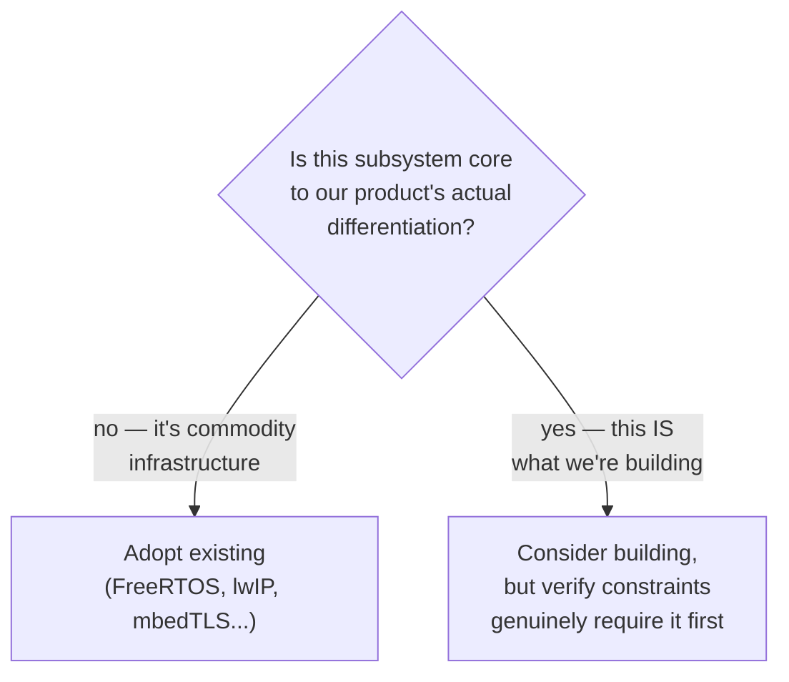

My default, similar in spirit to the protocol build-vs-adopt decision, is to buy/adopt for anything that's commodity infrastructure regardless of how technically interesting it might be to build — a TCP/IP stack, an RTOS kernel, a TLS implementation are all extraordinarily easy to get subtly wrong in ways that only surface as security vulnerabilities or rare field failures, and mature open-source or commercial options have absorbed far more real-world hardening than a small team can replicate. I'd only seriously consider building custom when the subsystem is core to the product's actual differentiation (a genuinely novel scheduling algorithm that's the product's actual innovation, not just "we scheduled some tasks") or when there's a hard, verified constraint no existing option meets (a certified safety requirement no available RTOS satisfies, a memory footprint no existing TCP/IP stack fits into) — and even then, I'd insist the constraint is verified concretely (has someone actually tried the existing options and measured the shortfall) rather than assumed, since "we'll probably need something custom" is a common but often incorrect starting assumption that commits a team to years of unplanned maintenance burden for infrastructure that wasn't the actual product.

## 19. How do you plan for and architect around end-of-life risk for critical components (a specific MCU, a cellular module, a sensor) over a product's multi-year production lifetime?

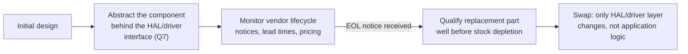

The single highest-leverage architectural decision here is the same HAL/driver abstraction from Q7 and Q11 — if the application never talks directly to a specific MCU's registers or a specific cellular module's AT-command dialect, swapping that component for a pin-compatible or software-compatible alternative when it reaches end-of-life is a bounded, lower-layer change rather than a project that touches the whole codebase. Beyond the technical abstraction, this needs an actual process: tracking vendor lifecycle notices and typical multi-year advance-notice windows for the specific component categories a product depends on, qualifying a replacement part well before the current one's stock is actually exhausted (not after, when lead times for a hasty requalification can stretch into a production-halting gap), and for genuinely sole-sourced or hard-to-replace components, sometimes a strategic last-time-buy of enough stock to cover the qualification and requalification window. I treat this as a real ongoing architectural responsibility with an owner and a review cadence, not a one-time consideration at initial design time, since component lifecycles keep moving throughout a multi-year production run regardless of whether anyone's watching them.

## 20. As an architect, what's your process for reviewing and approving a major system architecture change (e.g., a new subsystem, a significant refactor) before the team commits engineering time to it?

```mermaid
flowchart TB
    R1["1. What failure modes does this\nintroduce or change? (fault manager,\nQ4, must account for them)"]
    R2["2. Does it preserve or break\nlayer boundaries? (HAL/driver/app\nseparation, Q7)"]
    R3["3. Is it testable per the\nsystem test pyramid? (Q13)"]
    R4["4. What's the field-recovery story\nif this specific piece fails? (Q10)"]
    R5["5. What's the long-term ownership\n/ EOL / maintenance cost? (Q16, Q19)"]
    R6["6. Is there a smaller,\nlower-risk path to the\nsame outcome?"]
    R1 --> R2 --> R3 --> R4 --> R5 --> R6 --> APPROVE["Approve / request changes"]
```

## 21. Design a full 5-layer FreeRTOS architecture — Hardware → Driver/HAL → Framework → Application → User Interface — where every layer boundary is a function pointer or callback, never a direct call into the layer above or below

```mermaid
flowchart BT
    HW[("Hardware\n(UART, GPIO, ADC peripherals)")]

    subgraph L1["Layer 1: Driver / HAL"]
        DRV["uart_driver_init(callbacks_t*)\nISR posts event -> calls\nregistered on_rx_byte()"]
    end

    subgraph L2["Layer 2: Framework (FreeRTOS)"]
        FW["Event loop / task, dispatches to\nregistered framework listeners\nvia function-pointer table"]
    end

    subgraph L3["Layer 3: Application"]
        APP["App module registers its\nhandler with the framework;\nframework calls app_on_event()\nvia stored function pointer"]
    end

    subgraph L4["Layer 4: User Interface"]
        UI["UI registers a render/update\ncallback; app calls\nui_update(state) via pointer,\nnever includes UI headers"]
    end

    HW -->|"interrupt"| DRV
    DRV -->|"callback: on_rx_byte(byte)"| FW
    FW -->|"callback: app_on_event(evt)"| APP
    APP -->|"callback: ui_update(state)"| UI
    UI -.->|"user action callback:\non_button_pressed()"| APP
    APP -.->|"command callback:\ndrv->write(cmd)"| DRV
```

Read the diagram bottom-to-top: Hardware is the foundation layer and User Interface sits on top, matching the physical stack of a real device.

The point of this design is that **no layer includes the header of, or calls a named function directly in, the layer above it** — a lower layer only knows about a function-pointer type it was handed at init time, never the concrete function name or the module that implements it. This is what lets the HAL be unit-tested with a fake framework, the framework be reused across completely different applications, and the UI be swapped (a debug UART console today, a real display driver tomorrow) without touching anything below it.

```c
/* ---------- Layer 1: Driver / HAL ---------- */
typedef void (*uart_rx_callback_t)(uint8_t byte);

typedef struct {
    uart_rx_callback_t on_rx_byte;   /* HAL calls this; never knows who implements it */
} uart_callbacks_t;

static uart_callbacks_t s_cb;

void uart_driver_init(uart_callbacks_t callbacks) { s_cb = callbacks; }

void USART_IRQHandler(void)                       /* hardware -> driver */
{
    uint8_t byte = (uint8_t)USART->RDR;
    if (s_cb.on_rx_byte != NULL) {
        s_cb.on_rx_byte(byte);                     /* driver -> framework, via pointer only */
    }
}

/* ---------- Layer 2: Framework (runs as a FreeRTOS task) ---------- */
typedef void (*fw_event_callback_t)(const fw_event_t *evt);

typedef struct {
    fw_event_callback_t on_event;
} fw_listener_t;

static fw_listener_t s_listeners[FW_MAX_LISTENERS];
static QueueHandle_t s_fw_queue;

void framework_on_uart_byte(uint8_t byte)          /* this IS the on_rx_byte callback */
{
    fw_event_t evt = { .type = FW_EVT_BYTE, .data = byte };
    xQueueSendFromISR(s_fw_queue, &evt, NULL);      /* ISR-safe hand-off into the task */
}

void framework_register_listener(fw_event_callback_t cb)
{
    s_listeners[s_listener_count++].on_event = cb;
}

void framework_task(void *arg)
{
    fw_event_t evt;
    for (;;) {
        xQueueReceive(s_fw_queue, &evt, portMAX_DELAY);
        for (size_t i = 0; i < s_listener_count; i++) {
            s_listeners[i].on_event(&evt);          /* framework -> application, via pointer */
        }
    }
}

/* ---------- Layer 3: Application ---------- */
typedef void (*ui_update_callback_t)(const app_state_t *state);
static ui_update_callback_t s_ui_update;

void app_register_ui(ui_update_callback_t cb) { s_ui_update = cb; }

void app_on_framework_event(const fw_event_t *evt)  /* registered with framework in Layer 2 */
{
    app_state_t new_state = process_event(evt);
    if (s_ui_update != NULL) {
        s_ui_update(&new_state);                    /* application -> UI, via pointer */
    }
}

/* ---------- Layer 4: User Interface ---------- */
void ui_render(const app_state_t *state) { /* draw/print state; knows nothing about the framework */ }

/* ---------- Wiring (done once, at startup, in main.c only) ---------- */
void system_init(void)
{
    app_register_ui(ui_render);
    framework_register_listener(app_on_framework_event);
    uart_driver_init((uart_callbacks_t){ .on_rx_byte = framework_on_uart_byte });
    xTaskCreate(framework_task, "fw", 512, NULL, tskIDLE_PRIORITY + 2, NULL);
}
```

### What the interviewer should hear

- The wiring itself (which callback is registered with which layer) happens in exactly one place — `system_init()` in `main.c` — never scattered across the layers themselves; every layer file only ever sees function-pointer *types*, not the concrete function names of its neighbors, which is what actually enforces the boundary rather than just documenting it
- The Hardware→Driver boundary is an ISR calling a stored callback (`s_cb.on_rx_byte`), kept to O(1) work per the ISR-minimalism principle from earlier questions — the actual FreeRTOS-aware hand-off (`xQueueSendFromISR`) happens inside that callback in the framework layer, not in the driver
- The Framework layer is the one layer that's FreeRTOS-aware (owns the task, the queue, the dispatch loop) — the Driver/HAL below it doesn't need to know FreeRTOS exists at all (a callback is just a C function pointer), and the Application above it doesn't need to know a queue or task is involved either, only that its registered callback will be invoked when an event occurs
- This design is testable exactly like the injected-transport sensor driver: a unit test can call `app_on_framework_event()` directly with a synthetic `fw_event_t`, with a fake `ui_update` callback substituted in, without a real UART, a real FreeRTOS scheduler, or a real display ever being involved
- The trade-off worth naming explicitly: an extra indirection (a function-pointer call and table lookup at every layer boundary) versus a direct call — negligible in cycles on any modern MCU, but it's still worth acknowledging rather than presenting this pattern as free, especially if a boundary sits inside a genuinely hot path
- A senior answer also flags the failure mode this pattern must guard against: a `NULL` callback pointer being invoked because a layer was wired up in the wrong order at startup — every callback invocation should be `NULL`-checked (as shown above), and `system_init()`'s registration order should itself be treated as part of the architecture's contract, not an incidental detail

## 22. Design a battery-powered STM32 + FreeRTOS device with separate battery_manager, charger_manager, power_manager, system_manager, and application_manager tasks, communicating via queues, protected by mutexes/semaphores/critical sections, with hardware timers driving ADC sampling

```mermaid
flowchart TB
    subgraph HW["Hardware"]
        ADC_HW["ADC: VBAT, VBUS, I_CHG channels"]
        TIM_HW["TIM6: 100ms periodic trigger -> ADC"]
        CHG_IC["Charger IC (I2C)"]
        GPIO_HW["GPIO: VBUS detect, enable lines"]
    end

    TIM_HW -->|"TRGO"| ADC_HW
    ADC_HW -->|"EOC interrupt"| BATT_ISR["ADC ISR:\ngive binary semaphore"]

    BATT_ISR -->|"xSemaphoreGiveFromISR"| BM["battery_manager task\n(highest of the managers:\nsampling must not be starved)"]
    BM -->|"mutex-protected write:\nsoc, voltage, current"| SHARED[("Shared battery_state_t\n(g_batt_mutex)")]
    BM -->|"xQueueSend: BATT_STATUS"| CM["charger_manager task"]

    GPIO_HW -->|"EXTI: VBUS present/absent"| CM
    CM -->|"I2C"| CHG_IC
    CM -->|"xQueueSend: CHG_EVENT\n(started/done/fault)"| PM["power_manager task"]
    SHARED -.->|"mutex-protected read"| CM

    PM -->|"xQueueSend: PWR_EVENT\n(enter sleep/wake/brownout)"| SM["system_manager task\n(supervisor / fault manager)"]
    SHARED -.->|"mutex-protected read"| PM

    SM -->|"xQueueSend: SYS_EVENT"| AM["application_manager task\n(business logic, lowest priority)"]
    SM -.->|"health check-in\n(critical section on\nshared heartbeat array)"| BM
    SM -.-> CM
    SM -.-> PM
    AM -.->|"xQueueSend: APP_CMD\n(e.g., request shutdown)"| SM
```

```mermaid
sequenceDiagram
    participant TIM as TIM6 (hw timer)
    participant ADC as ADC + DMA
    participant ISR as ADC_IRQHandler
    participant BM as battery_manager task
    participant Mtx as g_batt_mutex
    participant CM as charger_manager task

    TIM->>ADC: TRGO every 100 ms
    ADC->>ADC: convert VBAT, VBUS, I_CHG
    ADC->>ISR: EOC interrupt
    ISR->>BM: xSemaphoreGiveFromISR(adc_done_sem)
    Note over ISR: ISR does nothing else -- no math, no I2C
    BM->>BM: compute SOC/SOH from raw samples
    BM->>Mtx: xSemaphoreTake(g_batt_mutex)
    BM->>Mtx: update shared battery_state_t
    BM->>Mtx: xSemaphoreGive(g_batt_mutex)
    BM->>CM: xQueueSend(batt_status_queue, &status, 0)
```

```c
/* ---------- Shared state + synchronization primitives ---------- */
typedef struct {
    uint16_t voltage_mv;
    int16_t  current_ma;      /* signed: +charging, -discharging */
    uint8_t  soc_pct;
    bool     valid;
} battery_state_t;

static battery_state_t   g_battery_state;
static SemaphoreHandle_t g_batt_mutex;      /* protects g_battery_state (multi-reader, one writer) */
static SemaphoreHandle_t g_adc_done_sem;    /* binary semaphore: ISR -> battery_manager */
static QueueHandle_t     g_batt_to_charger_q;
static QueueHandle_t     g_charger_to_power_q;
static QueueHandle_t     g_power_to_system_q;
static QueueHandle_t     g_system_to_app_q;
static QueueHandle_t     g_app_to_system_q;

/* Per-task heartbeat, protected by a critical section (short, no blocking) */
static volatile uint32_t g_task_heartbeat[TASK_COUNT];

void task_checkin(task_id_t id)
{
    taskENTER_CRITICAL();           /* short, bounded, never blocks -- just a tick write */
    g_task_heartbeat[id] = xTaskGetTickCount();
    taskEXIT_CRITICAL();
}

/* ---------- Hardware timer -> ADC -> ISR -> semaphore ---------- */
void ADC_IRQHandler(void)
{
    ADC1->ISR |= ADC_ISR_EOC;                     /* ack, minimal register work only */
    BaseType_t woken = pdFALSE;
    xSemaphoreGiveFromISR(g_adc_done_sem, &woken);
    portYIELD_FROM_ISR(woken);
}

/* ---------- battery_manager task ---------- */
void battery_manager_task(void *arg)
{
    for (;;) {
        xSemaphoreTake(g_adc_done_sem, portMAX_DELAY);   /* woken exactly on new ADC data */

        uint16_t v_raw = ADC1->JDR1, i_raw = ADC1->JDR2;
        battery_state_t local = {
            .voltage_mv = convert_to_mv(v_raw),
            .current_ma = convert_to_ma(i_raw),
            .soc_pct    = estimate_soc(v_raw, i_raw),
            .valid      = true,
        };

        xSemaphoreTake(g_batt_mutex, portMAX_DELAY);     /* short critical section: struct copy only */
        g_battery_state = local;
        xSemaphoreGive(g_batt_mutex);

        xQueueSend(g_batt_to_charger_q, &local, 0);       /* non-blocking: charger polls, doesn't stall us */
        task_checkin(TASK_BATTERY_MANAGER);
    }
}

/* ---------- charger_manager task (owns the charger FSM from the state-machines topic) ---------- */
void charger_manager_task(void *arg)
{
    battery_state_t status;
    charger_state_t fsm = CHG_IDLE;

    for (;;) {
        if (xQueueReceive(g_batt_to_charger_q, &status, pdMS_TO_TICKS(500)) == pdTRUE) {
            fsm = charger_fsm_step(fsm, &status);         /* precharge/CC/CV/term, per state-machines topic */
        }
        chg_event_t evt = { .fsm_state = fsm };
        xQueueSend(g_charger_to_power_q, &evt, 0);
        task_checkin(TASK_CHARGER_MANAGER);
    }
}
```

### What the interviewer should hear

- **Task priority ordering matters and should be justified, not guessed**: `battery_manager` (feeding the charger's safety-relevant decisions) runs higher priority than `application_manager`, since a starved battery sample means the charger FSM makes decisions on stale data — this is the same Rate/Deadline-Monotonic reasoning from the RTOS-design topic applied to a real product
- **Hardware timer → ADC → DMA/interrupt → semaphore is the correct chain, never a polled ADC read inside a task loop**: `TIM6` triggers conversion in hardware at a fixed, jitter-free period; the ISR does the absolute minimum (acknowledge + give a binary semaphore) and defers all computation (unit conversion, SOC estimation) to `battery_manager`, exactly the ISR-minimalism principle from the driver-design topic
- **Three distinct synchronization primitives are used for three distinct purposes, and mixing them up is the classic mistake**: a **binary semaphore** for the ISR-to-task "something happened" signal (no data transferred through it, just a wake-up); a **mutex** for the shared `battery_state_t` that multiple *tasks* (charger, power, system managers) may read concurrently (a mutex, not a binary semaphore, because it has ownership semantics and supports priority inheritance — see the driver-design topic's discussion of priority inversion); and a **critical section** (`taskENTER_CRITICAL`/`taskEXIT_CRITICAL`) only for the trivial heartbeat-array write, which is short enough to never risk blocking anything and doesn't need a full semaphore's overhead
- **Queues are the backbone of inter-manager communication, and each queue's full-policy is explicit**: `battery_manager` sends to `charger_manager` with a zero timeout (never blocks the safety-relevant sampling loop even if the charger task is momentarily behind), while `charger_manager` reads with a bounded timeout so it still runs its FSM tick periodically even if no new battery status has arrived yet — this mirrors the bounded-queue reference pattern from the RTOS-design topic
- **`system_manager` is the fault-manager/supervisor layer from earlier questions, applied concretely**: it collects heartbeats from every manager task (written via the critical-section-protected array above) and only escalates to `application_manager` — or forces a defined recovery — when a specific manager has gone stale, exactly the two-tier watchdog-service pattern, rather than one global "system alive" flag that would hide a livelocked `charger_manager` still technically running
- **Power management (STM32 Stop/Standby modes) is owned exclusively by `power_manager`, and it must consult both `battery_manager`'s state (via the mutex) and `charger_manager`'s events (via its queue) before deciding to enter a low-power mode** — entering Stop mode while a charge cycle is actively transitioning between CC and CV, or while an I2C transaction to the charger IC is in flight, would corrupt that transaction; this is the same "never suspend a peripheral mid-transaction" rule from the driver-design power-management question
- **`application_manager` sits at the lowest priority and only ever *requests* actions through `g_app_to_system_q`** (e.g., "user requested shutdown") rather than directly manipulating charger or power state — this keeps the safety-relevant managers (battery/charger/power) fully insulated from bugs or blocking behavior in higher-level, more frequently-changed application/UI logic, the same layering discipline as the Hardware→UI callback architecture in Q21

My review process, applied in roughly this order: what new failure modes does this change introduce, and does the existing fault manager and recovery architecture (Q4, Q10) actually account for them, or does this proposal implicitly assume nothing new can go wrong; does it respect the system's existing layer boundaries (HAL, drivers, services, per the reference pattern), or does it create a new cross-layer dependency that will make the system harder to reason about and to port later; can it actually be tested at every level of the test pyramid (Q13), including hardware-in-the-loop fault injection for anything touching real-time or safety behavior, or does the proposal only have a plan for unit-level testing; what's the field-recovery story specifically for this new piece if it fails in production, given that "we'll fix it in the next update" isn't sufficient for anything safety- or availability-critical; and what's the realistic long-term ownership and maintenance cost, including component lifecycle risk if it depends on new hardware. Finally, and I ask this explicitly rather than assume it's been considered: is there a smaller, lower-risk path to substantially the same product outcome — the most valuable thing an architect can sometimes contribute in review isn't approving or rejecting the proposal as written, but pointing out a way to get 80% of the value for 30% of the architectural risk.
