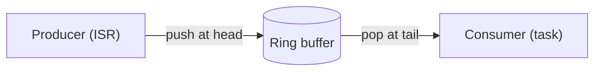
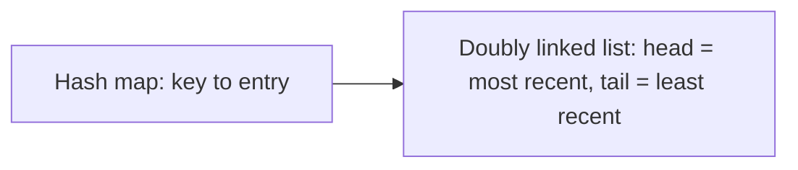

# Basic Embedded Coding: Data Structures

How to use this file: read the **Idea** first, try to write the code yourself, then compare with the commented solution. Each question ends with a **Remember** line.

## Contents

| Questions | Topic |
| --- | --- |
| 1-3, 8 | Linked lists |
| 4-6 | Ring buffers and caches |
| 7, 9-11 | Arrays, stacks, queues, searching |
| 12-14 | Bit tricks |
| 15 | Array vs linked list |

All linked-list examples use this node type:

```c
struct Node {
    int value;               /* the data stored in the node */
    struct Node *next;       /* the next node, or NULL at the end */
};
```

---

## 1. Reverse a singly linked list

**Idea:** Walk the list once and turn each `next` pointer to point backward.

```c
struct Node *reverse(struct Node *head)
{
    struct Node *prev = NULL;        /* the already-reversed part */
    struct Node *curr = head;

    while (curr != NULL) {
        struct Node *next = curr->next;   /* 1. remember the rest of the list */
        curr->next = prev;                /* 2. point this node backward */
        prev = curr;                      /* 3. move both pointers forward */
        curr = next;
    }
    return prev;                          /* prev is the new head */
}
```

**Remember:** three pointers (`prev`, `curr`, `next`), O(n) time, O(1) space.

## 2. Detect a loop: Floyd's algorithm

**Idea:** A slow pointer moves one step and a fast pointer moves two. If there is a cycle, they meet.

```c
bool has_cycle(struct Node *head)
{
    struct Node *slow = head;
    struct Node *fast = head;

    while (fast != NULL && fast->next != NULL) {   /* fast reaches NULL only if there is no loop */
        slow = slow->next;                         /* 1 step */
        fast = fast->next->next;                   /* 2 steps */
        if (slow == fast) {
            return true;                           /* they met inside a cycle */
        }
    }
    return false;
}
```

**Remember:** O(n) time, O(1) extra space.

## 3. Merge two sorted linked lists

**Idea:** Use a dummy head node and repeatedly link the smaller of the two current nodes.

```c
struct Node *merge_sorted(struct Node *a, struct Node *b)
{
    struct Node dummy = {0, NULL};       /* a stack node that removes the "empty result" special case */
    struct Node *tail = &dummy;          /* where the next node is attached */

    while (a != NULL && b != NULL) {
        if (a->value <= b->value) {      /* <= keeps the merge stable */
            tail->next = a;
            a = a->next;
        } else {
            tail->next = b;
            b = b->next;
        }
        tail = tail->next;
    }
    tail->next = (a != NULL) ? a : b;    /* attach whatever is left */
    return dummy.next;                   /* skip the dummy */
}
```

**Remember:** a dummy head avoids special-casing the first node.

## 4. Circular buffer

**Idea:** A fixed array with `head` (write) and `tail` (read) indexes that wrap around. Good for UART RX, logging, and streaming.



```c
#define RB_SIZE 64u

typedef struct {
    uint8_t  buffer[RB_SIZE];
    uint16_t head;    /* next write index */
    uint16_t tail;    /* next read index */
} ring_buffer_t;

bool rb_push(ring_buffer_t *rb, uint8_t byte)
{
    uint16_t next = (uint16_t)((rb->head + 1u) % RB_SIZE);   /* wrap around */
    if (next == rb->tail) {
        return false;                  /* full: one slot is deliberately left unused */
    }
    rb->buffer[rb->head] = byte;       /* store first... */
    rb->head = next;                   /* ...then publish */
    return true;
}

bool rb_pop(ring_buffer_t *rb, uint8_t *byte)
{
    if (rb->head == rb->tail) {
        return false;                  /* empty */
    }
    *byte = rb->buffer[rb->tail];
    rb->tail = (uint16_t)((rb->tail + 1u) % RB_SIZE);
    return true;
}
```

**Remember:** define "full" and "empty" clearly. Empty is `head == tail`. Full leaves one slot unused, or uses a count.

## 5. Ring buffer with an explicit count

**Idea:** Track `count` so all slots are usable. If a producer and consumer run concurrently, `count` becomes shared state and needs protection.

```c
typedef struct {
    int data[32];
    uint8_t head;
    uint8_t tail;
    volatile uint8_t count;    /* shared between an ISR and a task */
} counted_ring_t;

bool counted_ring_push(counted_ring_t *rb, int value)
{
    if (rb->count == 32u) {
        return false;                          /* really full: all 32 slots used */
    }
    rb->data[rb->head] = value;
    rb->head = (uint8_t)((rb->head + 1u) % 32u);
    rb->count++;                               /* NOT atomic: protect it if both sides can run at once */
    return true;
}

bool counted_ring_pop(counted_ring_t *rb, int *value)
{
    if (rb->count == 0u) {
        return false;
    }
    *value = rb->data[rb->tail];
    rb->tail = (uint8_t)((rb->tail + 1u) % 32u);
    rb->count--;                               /* same warning: read-modify-write */
    return true;
}
```

**Watch out:** `volatile` alone does not make `count++` safe when an ISR and a task both change it. Use a critical section or atomics, or use the index-only design from Q4.

## 6. LRU cache

**Idea:** A hash map gives fast lookup, and a doubly linked list keeps recency order. On embedded targets use a fixed pool and no `malloc`.



```c
#define LRU_CAP 4u

typedef struct {
    int  key;
    int  value;
    int  prev, next;     /* indexes into the fixed pool; -1 means none */
    bool used;
} lru_entry_t;

typedef struct {
    lru_entry_t entries[LRU_CAP];    /* the fixed pool: no dynamic allocation */
    int head;                        /* most recently used */
    int tail;                        /* least recently used (evicted first) */
} lru_cache_t;

/* On a hit:  unlink the entry, then relink it at head.
   On a miss with a full cache: evict tail, reuse its slot, link it at head. */
```

**Remember:** lookup O(1) average, update O(1). Ask whether bounded allocation is required.

## 7. Reverse an array in place

**Idea:** Two indexes, one at each end, swap and move inward.

```c
void reverse_array(int *arr, size_t len)
{
    size_t left = 0u;
    size_t right = (len == 0u) ? 0u : len - 1u;    /* avoid unsigned underflow when len is 0 */

    while (left < right) {
        int temp = arr[left];
        arr[left] = arr[right];
        arr[right] = temp;
        left++;
        right--;
    }
}
```

## 8. Find the middle of a linked list in one pass

**Idea:** Same slow and fast pointers as Q2. When `fast` reaches the end, `slow` is at the middle.

```c
struct Node *find_middle(struct Node *head)
{
    struct Node *slow = head;
    struct Node *fast = head;

    while (fast != NULL && fast->next != NULL) {
        slow = slow->next;            /* moves half as fast */
        fast = fast->next->next;
    }
    return slow;                      /* for an even count, this is the second middle node */
}
```

**Remember:** no need for a first pass to count the nodes.

## 9. Fixed-capacity stack using an array

**Idea:** An array and a `top` counter. Push writes and increments. Pop decrements and reads. No `malloc`.

```c
#define STACK_CAP 16u

typedef struct {
    int     data[STACK_CAP];
    uint8_t top;                /* number of elements currently stored */
} stack_t;

bool stack_push(stack_t *s, int value)
{
    if (s->top >= STACK_CAP) return false;   /* overflow: report it */
    s->data[s->top++] = value;
    return true;
}

bool stack_pop(stack_t *s, int *value)
{
    if (s->top == 0u) return false;          /* underflow */
    *value = s->data[--s->top];
    return true;
}
```

## 10. Queue using two stacks

**Idea:** Push always goes to `in_stack`. When `out_stack` is empty, move everything from `in_stack` to `out_stack`, which reverses the order to first-in, first-out. Each element moves at most once, so the amortized cost is O(1).

```c
typedef struct {
    stack_t in_stack;
    stack_t out_stack;
} queue_t;

bool queue_enqueue(queue_t *q, int value)
{
    return stack_push(&q->in_stack, value);
}

bool queue_dequeue(queue_t *q, int *value)
{
    if (q->out_stack.top == 0u) {                       /* refill only when out_stack is empty */
        int temp;
        while (stack_pop(&q->in_stack, &temp)) {
            if (!stack_push(&q->out_stack, temp)) {
                return false;
            }
        }
    }
    return stack_pop(&q->out_stack, value);             /* oldest element is now on top */
}
```

**Remember:** a single dequeue can cost O(n), but the average over many is O(1).

## 11. Binary search on a sorted array

**Idea:** Halve the search range each step. Watch the midpoint overflow and off-by-one traps.

```c
int binary_search(const int *arr, size_t len, int target)
{
    size_t low = 0u;
    size_t high = len;                          /* exclusive upper bound: works for len == 0 */

    while (low < high) {
        size_t mid = low + (high - low) / 2u;   /* avoids overflow of (low + high) */
        if (arr[mid] == target) {
            return (int)mid;
        } else if (arr[mid] < target) {
            low = mid + 1u;                     /* target is in the upper half */
        } else {
            high = mid;                         /* target is in the lower half */
        }
    }
    return -1;                                  /* not found */
}
```

**Remember:** O(log n), and the array must be sorted.

## 12. Swap two variables without a temporary

**Idea:** XOR three times. But if both pointers point at the same variable, it becomes zero.

```c
void swap_xor(int *a, int *b)
{
    if (a == b) {
        return;            /* required guard: a ^= a would zero the variable */
    }
    *a ^= *b;              /* a = a ^ b */
    *b ^= *a;              /* b = b ^ (a ^ b) = original a */
    *a ^= *b;              /* a = (a ^ b) ^ original a = original b */
}
```

**Remember:** a normal temporary variable is usually clearer and just as fast.

## 13. Check if a number is a power of two

**Idea:** A power of two has one set bit. Subtracting 1 flips it and every bit below it, so ANDing gives 0.

```c
bool is_power_of_two(unsigned int n)
{
    return (n != 0u) && ((n & (n - 1u)) == 0u);    /* n != 0 excludes zero */
}
```

Example: `8 = 1000` and `7 = 0111`, so `8 & 7 = 0`.

## 14. Count the set bits (Brian Kernighan's algorithm)

**Idea:** Repeatedly clear the lowest set bit and count how many times you can.

```c
unsigned int count_set_bits(unsigned int n)
{
    unsigned int count = 0u;
    while (n != 0u) {
        n &= (n - 1u);       /* clears the lowest set bit */
        count++;
    }
    return count;            /* runs once per set bit */
}
```

Useful for GPIO registers, where only a few pins are usually set.

## 15. Array vs linked list: when would you use each in an embedded system?

| | Array | Linked list |
| --- | --- | --- |
| Access by index | O(1) | O(n) |
| Insert or delete in the middle | Shift elements | O(1) once you have the node |
| Memory | Contiguous, static allocation possible | Per-node pointer overhead, scattered |
| Cache behaviour | Good | Poor |
| Best fit | Sensor sample buffer, lookup table | Free-list of buffers, list of active timers |

On a memory-constrained target, allocate list nodes from a **static pool**, not the heap.

## References

- Floyd's cycle detection (tortoise and hare)
- Amortized analysis of a queue built from two stacks
