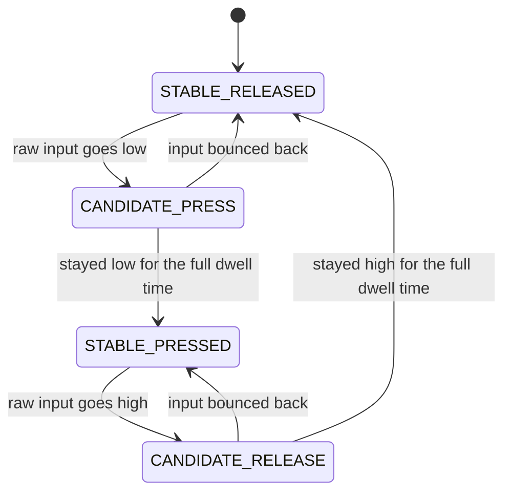
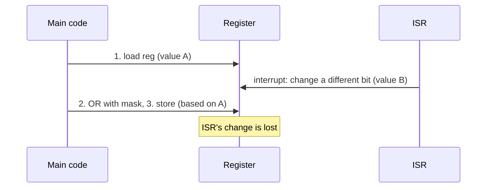

# Basic Embedded Coding Questions

How to use this file: read the **Idea** line first, try to write the code yourself, then compare with the commented solution. Every question ends with a **Remember** line you can say out loud in an interview.

## Table of contents

- Part 1: Core embedded coding (Q1-Q7)
- Part 2: Bitwise operations (Q8-Q35)

---

## Part 1: Core embedded coding

## 1. Set, clear, toggle, and test a bit

**Idea:** Use a mask with only the target bit set, then combine it with OR (set), AND-NOT (clear), XOR (toggle), or AND (test).

```c
/* Build a mask with only bit n set. 1UL makes it an unsigned long,
   so shifting up to bit 31 is safe (plain 1 is a signed int). */
#define BIT(n) (1UL << (n))

reg |= BIT(5);                 /* SET:    OR with the mask forces the bit to 1 */
reg &= ~BIT(5);                /* CLEAR:  AND with the inverted mask forces the bit to 0 */
reg ^= BIT(5);                 /* TOGGLE: XOR flips the bit (0->1, 1->0) */

if ((reg & BIT(5)) != 0U) {    /* TEST:   AND keeps only that bit; non-zero means it is set */
    /* bit 5 is set */
}
```

**Remember:** OR sets, AND-NOT clears, XOR toggles, AND tests. Always use `1UL`, not `1`.

## 2. Safe register field update

**Idea:** To write a multi-bit field, first clear the old bits, then insert the new value. Skipping the clear leaves old bits behind.

```c
/* FIELD_MASK  = the bits that belong to the field (e.g. 0x0F0)
   FIELD_SHIFT = position of the field's lowest bit (e.g. 4)      */
reg = (reg & ~FIELD_MASK)                          /* 1. clear the old field, keep other bits */
    | ((value << FIELD_SHIFT) & FIELD_MASK);       /* 2. move the value into place, and mask it
                                                         so an oversized value cannot spill into
                                                         neighbouring fields */
```

**Why clearing matters:** OR-ing a new value onto an old one gives a mix of both. Example: old field `0b1010`, new value `0b0101`; OR gives `0b1111`, which is neither.

**Remember:** clear, then set. Mask the value too.

## 3. Power-of-two check

**Idea:** A power of two has exactly one bit set. Subtracting 1 flips that bit and everything below it, so AND-ing the two gives zero.

```c
int is_power_of_two(uint32_t x)
{
    /* x != 0      : zero is not a power of two, but 0 & (0-1) is also 0, so exclude it
       x & (x - 1) : clears the lowest set bit; result is 0 only if there was just one bit */
    return x != 0U && (x & (x - 1U)) == 0U;
}
```

Example: `8 = 1000`, `7 = 0111`, `8 & 7 = 0000`, so it is a power of two.

**Remember:** `x & (x - 1)` clears the lowest set bit. This trick is reused in many bit questions.

## 4. Find the missing number from `0..n`

**Idea:** XOR every index and every value. Numbers that appear twice cancel out, leaving only the missing one.

```c
/* array has n numbers taken from 0..n, exactly one is missing */
uint32_t find_missing(const uint32_t *a, uint32_t n)
{
    uint32_t x = n;                 /* start with n, because the loop below only covers 0..n-1 */
    for (uint32_t i = 0U; i < n; i++) {
        x ^= i;                     /* XOR in the expected number */
        x ^= a[i];                  /* XOR in the number actually present */
    }
    return x;                       /* every present number cancelled; the missing one remains */
}
```

Properties used: `a ^ a = 0` and `a ^ 0 = a`.

**Remember:** XOR avoids the overflow that a sum-formula approach can hit on large `n`.

## 5. `memset` vs `memcpy` vs `memmove`

**Idea:** `memset` fills bytes with one value, `memcpy` copies bytes, `memmove` copies bytes even when regions overlap.

```c
uint8_t buf[16];
memset(buf, 0x00, sizeof buf);          /* fill all 16 bytes with 0 */
memcpy(dst, src, len);                  /* copy len bytes; src and dst must NOT overlap */
memmove(buf + 2, buf, 8);               /* overlapping copy is safe here */
```

**Watch out:** `memset(p, 1, n)` on an `int` array sets each *byte* to 1 (giving `0x01010101`), not each int to 1. They also know nothing about C++ object lifetimes or protocol field meaning.

**Remember:** overlap means `memmove`.

## 6. Poll a hardware bit with a timeout

**Idea:** Never wait forever on hardware. Loop while checking the flag, and give up after a limit.

```c
bool wait_ready(volatile uint32_t *reg, uint32_t mask, uint32_t limit)
{
    /* 'volatile' forces a real read of the register on every pass;
       without it the compiler may read it once and loop forever */
    while (limit-- != 0U) {
        if ((*reg & mask) != 0U) {
            return true;            /* hardware set the bit: ready */
        }
    }
    return false;                   /* timed out: caller must handle the failure */
}
```

**Better for production:** use a real time source (a tick counter or timer) when the requirement is in milliseconds. An iteration count changes with clock speed and optimization level.

**Remember:** `volatile` for the register, a bounded loop, and a failure path.

## 7. Debounce a button

**Idea:** A mechanical button bounces for a few milliseconds. Only accept a new state after it stays the same for a set time.



```c
#define DEBOUNCE_TICKS 20U          /* 20 ticks of 1 ms = 20 ms stable time */

static bool    stable_state = false;   /* the debounced value the rest of the code uses */
static uint8_t counter      = 0U;      /* how long the raw input has disagreed with it */

/* Call this from a periodic 1 ms tick. It never blocks. */
void button_tick(bool raw_pressed)
{
    if (raw_pressed == stable_state) {
        counter = 0U;                       /* input agrees: nothing to confirm */
    } else if (++counter >= DEBOUNCE_TICKS) {
        stable_state = raw_pressed;         /* disagreed long enough: accept the change */
        counter = 0U;
    }
}
```

**Remember:** sample on a timer, confirm after a dwell time, never use a blocking delay in the main control path.

---

## Part 2: Bitwise operations

## Rules to state before writing any bit code

| Rule | Why |
| --- | --- |
| Use unsigned types (`uint32_t`) | Shifting or overflowing signed values can be undefined or implementation-defined |
| Write `1UL` or `1U`, not `1` | `1 << 31` on a 32-bit `int` overflows into the sign bit |
| Never shift by the type width or more | `x << 32` on a 32-bit type is undefined behavior |
| Do not right-shift negative signed values and assume a result | The result is implementation-defined |

## Quick map of the bit tricks

| Goal | Trick |
| --- | --- |
| Clear lowest set bit | `x & (x - 1)` |
| Isolate lowest set bit | `x & -x` (or `x & (~x + 1)`) |
| Is power of two | `x && !(x & (x - 1))` |
| Cancel duplicates | `a ^ a = 0` |
| Swap parts | mask with `0xAA..`/`0x55..`, then shift |
| Modulo by power of two | `x & (size - 1)` |

## 8. Extract and insert a multi-bit field

**Idea:** Build a mask of `width` ones, then shift to the field position.

```c
/* MASK(4) = 0b1111.  Builds 'width' ones. */
#define MASK(width)               ((1UL << (width)) - 1UL)

/* Read a field: shift it down to bit 0, then keep only 'w' bits */
#define GET_FIELD(reg, pos, w)    (((reg) >> (pos)) & MASK(w))

/* Write a field: clear the old bits, then OR in the new value (masked to fit) */
#define SET_FIELD(reg, pos, w, v) \
    ((reg) = ((reg) & ~(MASK(w) << (pos))) | (((uint32_t)(v) & MASK(w)) << (pos)))
```

**Watch out:** `MASK(32)` shifts a 32-bit value by 32, which is undefined. Handle full-width fields separately.

**Remember:** shift down and mask to read; clear, mask, shift, OR to write.

## 9. Count the number of set bits

**Idea:** Repeatedly clear the lowest set bit and count how many times you can do it.

```c
uint8_t count_bits(uint32_t x)
{
    uint8_t n = 0U;
    while (x != 0U) {
        x &= (x - 1U);      /* removes exactly one set bit each pass */
        n++;                /* so the loop runs once per set bit */
    }
    return n;
}
```

Example: `x = 1011`, then `1010`, then `1000`, then `0000`: 3 set bits, 3 iterations.

**Remember:** runs in O(number of set bits). `__builtin_popcount(x)` uses a hardware instruction when the core has one.

## 10. Isolate and clear the lowest set bit

**Idea:** `x & -x` keeps only the lowest set bit; `x & (x - 1)` removes it.

```c
uint32_t lowest_set_bit(uint32_t x)   { return x & (~x + 1U); }  /* ~x + 1 is the two's complement, i.e. -x */
uint32_t clear_lowest_bit(uint32_t x) { return x & (x - 1U); }
```

Example: `x = 0b10100`. `-x = 0b01100`. `x & -x = 0b00100`. That is the lowest set bit.

**Use case:** walking through pending-interrupt or event-flag bits: isolate one, handle it, clear it, repeat.

**Remember:** for unsigned values write `~x + 1U`; it avoids negating an unsigned type.

## 11. Find the index of the lowest set bit

**Idea:** Shift right until bit 0 is set, counting the shifts.

```c
int lowest_bit_index(uint32_t x)
{
    if (x == 0U) {
        return -1;                      /* no bit is set: report "not found" */
    }
    int idx = 0;
    while ((x & 1U) == 0U) {            /* bit 0 clear: the lowest set bit is further up */
        x >>= 1;                        /* move everything down one place */
        idx++;                          /* and count the step */
    }
    return idx;
}
```

**Remember:** Cortex-M3/M4/M7 can do this with `RBIT` + `CLZ`. `__builtin_ctz(x)` exposes it, but the result is undefined when `x == 0`, so keep the zero check.

## 12. Reverse the bits of a byte

**Idea:** Swap the two halves, then swap pairs, then swap neighbouring bits. Three steps instead of an 8-iteration loop.

```c
uint8_t reverse_byte(uint8_t b)
{
    /* Step 1: swap the upper and lower nibbles   abcd efgh -> efgh abcd */
    b = (uint8_t)(((b & 0xF0U) >> 4) | ((b & 0x0FU) << 4));
    /* Step 2: swap adjacent 2-bit pairs          efgh abcd -> gh ef cd ab */
    b = (uint8_t)(((b & 0xCCU) >> 2) | ((b & 0x33U) << 2));
    /* Step 3: swap adjacent bits                 gh ef cd ab -> hg fe dc ba */
    b = (uint8_t)(((b & 0xAAU) >> 1) | ((b & 0x55U) << 1));
    return b;
}
```

**Use case:** talking to a device that sends LSB-first when your peripheral is MSB-first.

**Remember:** mask, shift, OR, in halves.

## 13. Swap the two nibbles of a byte

**Idea:** Move the low nibble up and the high nibble down, and combine.

```c
uint8_t swap_nibbles(uint8_t b)
{
    /* b << 4 moves the low nibble to the top (the top part falls off after the cast);
       b >> 4 moves the high nibble to the bottom */
    return (uint8_t)((b << 4) | (b >> 4));
}
```

Example: `0xA5 -> 0x5A`.

**Remember:** a `uint8_t` is promoted to `int` in expressions, so cast back to `uint8_t`.

## 14. Swap the endianness of a 32-bit value

**Idea:** Move each of the four bytes to the opposite position.

```c
uint32_t bswap32(uint32_t x)
{
    return  ((x & 0x000000FFUL) << 24) |   /* byte 0 -> byte 3 */
            ((x & 0x0000FF00UL) <<  8) |   /* byte 1 -> byte 2 */
            ((x & 0x00FF0000UL) >>  8) |   /* byte 2 -> byte 1 */
            ((x & 0xFF000000UL) >> 24);    /* byte 3 -> byte 0 */
}
```

Example: `0x12345678 -> 0x78563412`.

**Remember:** network byte order is big-endian, most MCUs are little-endian. Cortex-M has a single `REV` instruction; `__builtin_bswap32` maps to it.

## 15. Detect endianness at runtime

**Idea:** Store the value 1 in a 16-bit variable and look at the first byte in memory.

```c
bool is_little_endian(void)
{
    uint16_t probe = 0x0001U;
    /* Reading through a byte pointer is always allowed by C aliasing rules.
       Little-endian stores the low byte (0x01) at the lowest address. */
    return *(const uint8_t *)&probe == 0x01U;
}
```

**Remember:** STM32, ESP32 and most ARM targets are little-endian.

## 16. Rotate left and right

**Idea:** A rotate is a shift where the bits that fall off one end re-enter at the other end.

```c
uint32_t rotl32(uint32_t x, uint8_t n)
{
    n &= 31U;                                    /* keep the count in 0..31 */
    /* (32 - n) & 31 turns a shift of 32 (when n == 0) into a shift of 0,
       because shifting a 32-bit value by 32 is undefined */
    return (x << n) | (x >> ((32U - n) & 31U));
}

uint32_t rotr32(uint32_t x, uint8_t n)
{
    n &= 31U;
    return (x >> n) | (x << ((32U - n) & 31U));
}
```

**Remember:** compilers recognise this exact pattern and emit one `ROR` instruction. Rotates are the core of hash, CRC and crypto code.

## 17. Find the single non-repeating element

**Idea:** Every value appears twice except one. XOR everything and the pairs cancel.

```c
uint32_t find_unique(const uint32_t *a, size_t n)
{
    uint32_t r = 0U;                 /* 0 is the identity for XOR */
    for (size_t i = 0U; i < n; i++) {
        r ^= a[i];                   /* duplicates cancel: x ^ x = 0 */
    }
    return r;                        /* only the unpaired value is left */
}
```

**Remember:** O(n) time, O(1) memory, no overflow risk.

## 18. Find the two non-repeating elements

**Idea:** XOR everything to get `x ^ y`. Any set bit in that result is a bit where `x` and `y` differ, so use it to split the numbers into two groups.

```c
void find_two_unique(const uint32_t *a, size_t n, uint32_t *x, uint32_t *y)
{
    uint32_t xor_all = 0U;
    for (size_t i = 0U; i < n; i++) {
        xor_all ^= a[i];                         /* pairs cancel, leaving x ^ y */
    }

    /* Pick one bit where x and y differ (the lowest set bit of x ^ y) */
    uint32_t diff_bit = xor_all & (~xor_all + 1U);

    *x = 0U;
    *y = 0U;
    for (size_t i = 0U; i < n; i++) {
        if ((a[i] & diff_bit) != 0U) {
            *x ^= a[i];                          /* group 1: this bit is set */
        } else {
            *y ^= a[i];                          /* group 2: this bit is clear */
        }
    }
    /* Each group has one unique value plus cancelling pairs */
}
```

**Remember:** x and y land in different groups because they differ at `diff_bit`; duplicates always land together and cancel.

## 19. Check whether two integers have opposite signs

**Idea:** The sign bit of `a ^ b` is 1 exactly when the sign bits of `a` and `b` differ.

```c
bool opposite_signs(int32_t a, int32_t b)
{
    return (a ^ b) < 0;      /* negative XOR result means the sign bits differ */
}
```

**Watch out:** zero counts as non-negative. This avoids multiplying, which could overflow.

## 20. Branch-free absolute value and min

**Idea:** Use the sign as an all-ones or all-zeros mask.

```c
int32_t abs_branchless(int32_t x)
{
    int32_t mask = x >> 31;          /* 0 for x >= 0, -1 (all ones) for x < 0 */
    return (x ^ mask) - mask;        /* for negatives: flip the bits, then add 1 */
}

int32_t min_branchless(int32_t a, int32_t b)
{
    /* -(a < b) is -1 (all ones) when a < b, else 0; it selects the difference */
    return b ^ ((a ^ b) & -(a < b));
}
```

**Interview point:** modern compilers turn `(a < b) ? a : b` into equally fast code, and it is far more readable. Also note that `x >> 31` on a negative value is implementation-defined and `abs(INT32_MIN)` overflows.

## 21. Align a value up or down to a power of two

**Idea:** Add `align - 1`, then clear the low bits. That rounds up to the next multiple.

```c
uint32_t align_up(uint32_t value, uint32_t align)      /* align must be a power of two */
{
    /* ~(align - 1) is a mask that clears the low bits, e.g. align 16 -> ...FFF0 */
    return (value + align - 1U) & ~(align - 1U);
}

uint32_t align_down(uint32_t value, uint32_t align)
{
    return value & ~(align - 1U);                      /* just clear the low bits */
}
```

Example: `align_up(13, 8) = (13 + 7) & ~7 = 20 & ...11111000 = 16`.

**Use case:** DMA buffers, flash page boundaries, stack alignment.

**Watch out:** `value + align - 1` can overflow near `UINT32_MAX`. Assert that `align` is a power of two (Q3).

## 22. Round up to the next power of two

**Idea:** Copy the highest set bit into every lower position, then add 1.

```c
uint32_t next_pow2(uint32_t x)
{
    if (x == 0U) { return 1U; }
    x--;                    /* so an exact power of two maps to itself */
    x |= x >> 1;            /* the next 5 lines "smear" the top set bit downward */
    x |= x >> 2;            /* until every lower bit is 1: 0001xxxx -> 00011111 */
    x |= x >> 4;
    x |= x >> 8;
    x |= x >> 16;
    return x + 1U;          /* 00011111 + 1 = 00100000 */
}
```

**Remember:** used to size ring buffers so wrap-around can be a mask (Q23).

## 23. Ring-buffer wrap with a mask instead of modulo

**Idea:** When the size is a power of two, `% size` equals `& (size - 1)`, and the AND is much cheaper.

```c
#define RING_SIZE 64U                        /* MUST be a power of two */
#define RING_MASK (RING_SIZE - 1U)           /* 63 = 0b111111 */

/* Compile-time guard: fails the build if someone changes the size to 60 */
_Static_assert((RING_SIZE & RING_MASK) == 0U, "RING_SIZE must be a power of two");

head = (head + 1U) & RING_MASK;              /* same as (head + 1) % RING_SIZE, one AND instruction */
```

**Remember:** Cortex-M0 has no hardware divide, so `%` is a slow library call there.

## 24. Parity of a value

**Idea:** XOR-fold the word in halves. Parity is preserved when you XOR two halves together.

```c
bool parity32(uint32_t x)
{
    x ^= x >> 16;            /* fold 32 bits into 16 */
    x ^= x >> 8;             /* 16 -> 8 */
    x ^= x >> 4;             /* 8  -> 4 */
    x ^= x >> 2;             /* 4  -> 2 */
    x ^= x >> 1;             /* 2  -> 1 */
    return (x & 1U) != 0U;   /* true = odd number of set bits */
}
```

**Use case:** UART parity bit, simple error detection.

## 25. Convert between binary and Gray code

**Idea:** In Gray code, consecutive numbers differ by exactly one bit.

```c
uint32_t bin_to_gray(uint32_t b)
{
    return b ^ (b >> 1);              /* each bit is XOR of itself and the bit above it */
}

uint32_t gray_to_bin(uint32_t g)
{
    uint32_t b = g;
    while ((g >>= 1) != 0U) {         /* fold in every higher bit */
        b ^= g;
    }
    return b;
}
```

Example: binary `011 -> 100` becomes Gray `010 -> 110`. Only one bit changes.

**Use case:** rotary encoders and FIFO pointers that cross clock domains, where a value can be sampled mid-change.

## 26. Test a group of bits

**Idea:** AND with the mask, then compare to the mask (all set) or to zero (all clear).

```c
bool bits_all_set(uint32_t reg, uint32_t mask)   { return (reg & mask) == mask; }  /* every bit in mask is 1 */
bool bits_all_clear(uint32_t reg, uint32_t mask) { return (reg & mask) == 0U;   }  /* every bit in mask is 0 */
bool bits_any_set(uint32_t reg, uint32_t mask)   { return (reg & mask) != 0U;   }  /* at least one bit is 1 */
```

**Classic bug:** `if (reg & mask)` means "any bit set", not "all bits set". With a multi-bit mask these differ.

## 27. Write a flag into a bit without if/else

**Idea:** Clear the bit, then OR in the flag shifted into place.

```c
reg = (reg & ~BIT(n))                       /* 1. clear bit n */
    | ((uint32_t)(flag != 0) << n);         /* 2. flag != 0 is 0 or 1; move it to bit n */
```

**Remember:** this is a read-modify-write. See Q29 for when that is unsafe.

## 28. Swap odd and even bits

**Idea:** Pick out the odd bits and even bits with masks, shift each into the other's place, and combine.

```c
uint32_t swap_odd_even_bits(uint32_t x)
{
    return ((x & 0xAAAAAAAAUL) >> 1)    /* 0xAAAAAAAA selects odd bits (1,3,5..): move down one */
         | ((x & 0x55555555UL) << 1);   /* 0x55555555 selects even bits (0,2,4..): move up one */
}
```

Example: `0b0110 -> 0b1001`.

**Remember:** the same mask-and-shift idea as Q12.

## 29. Why is `reg |= BIT(n)` unsafe when an ISR touches the same register?

**Idea:** `|=` is three steps (load, OR, store). An interrupt between load and store gets overwritten.



Fixes, from most to least preferred:

1. Use a dedicated set/clear register (STM32 GPIO `BSRR` sets or clears bits in one write, with no read).
2. Use Cortex-M bit-banding where the device supports it.
3. Disable interrupts around the sequence (keep it short).
4. For shared RAM variables, use atomic operations (`LDREX`/`STREX`, or C11 atomics).

**Remember:** read-modify-write is not atomic.

## 30. `~0`, `~0U`, and `-1`: what is the difference?

**Idea:** All three give "all ones", but their types differ, and small types get promoted.

```c
int      a = ~0;       /* -1, signed int, all ones                       */
unsigned b = ~0U;      /* UINT_MAX, unsigned, all ones                   */
uint32_t c = -1;       /* well-defined: converts to 0xFFFFFFFF           */

uint8_t v = 0x0F;
uint32_t t1 = ~v;              /* 0xFFFFFFF0 : v was promoted to int first */
uint8_t  t2 = (uint8_t)~v;     /* 0xF0       : cast back to get what you meant */
```

**Remember:** `~` on a `uint8_t` or `uint16_t` promotes to `int` first. Cast the result back before comparing.

## 31. Pitfalls of C bit-fields for registers and protocols

**Idea:** The compiler decides how bit-fields are laid out, so they are not portable.

```c
/* Looks convenient, but is NOT reliable for hardware or wire formats */
struct Ctrl {
    uint32_t enable : 1;
    uint32_t mode   : 3;
    uint32_t speed  : 4;
};
```

What is implementation-defined:

- Whether the first field is the least or most significant bit
- Padding and alignment between fields
- Whether a field may straddle a storage unit
- The width of the memory access (a byte write to a 32-bit peripheral register may be illegal)

**Remember:** for registers and protocols, use explicit masks and shifts (Q8).

## 32. Bitmap (bitset) for tracking used and free resources

**Idea:** Use one bit per item. Word index is `i / 32`, bit index is `i % 32`.

```c
#define BITMAP_SIZE 128U
static uint32_t bitmap[BITMAP_SIZE / 32U];       /* 128 bits stored in 4 words */

void bitmap_set(uint32_t i)   { bitmap[i >> 5] |=  (1UL << (i & 31U)); }   /* i>>5 = which word, i&31 = which bit */
void bitmap_clear(uint32_t i) { bitmap[i >> 5] &= ~(1UL << (i & 31U)); }
bool bitmap_test(uint32_t i)  { return (bitmap[i >> 5] & (1UL << (i & 31U))) != 0U; }
```

**Use case:** buffer-pool free lists, RTOS ready-task masks, event flags.

## 33. Multiply and divide by powers of two with shifts

**Idea:** Left shift multiplies by 2 per step; right shift divides by 2 per step.

```c
x << 3;        /* x * 8 */
x >> 3;        /* x / 8, for unsigned x */
```

**Signed trap:** `x >> n` rounds toward negative infinity, but `x / 2` rounds toward zero.

| Expression | Result |
| --- | --- |
| `-3 >> 1` | `-2` |
| `-3 / 2` | `-1` |

**Remember:** compilers already turn `* 8` and `/ 8` into shifts, so write the operator that matches your intent.

## 34. Hamming distance between two words

**Idea:** XOR shows where the words differ; count those bits.

```c
uint8_t hamming_distance(uint32_t a, uint32_t b)
{
    return count_bits(a ^ b);     /* a ^ b has a 1 wherever a and b differ; count_bits is Q9 */
}
```

**Use case:** comparing a received pattern to the expected one.

## 35. What to say out loud in a bitwise interview

- State your assumptions first: bit width and signedness (`uint32_t`, unsigned).
- Point out undefined-behavior traps before the interviewer does: shift by the width or more, left-shifting into the sign bit, signed overflow, right-shifting negatives.
- Mention the hardware angle: single-instruction helpers (`CLZ`, `RBIT`, `REV`, `ROR`), bit-banding, and `BSRR`-style atomic set/clear registers.
- After showing the portable version, name the compiler builtin: `__builtin_popcount`, `__builtin_clz`, `__builtin_ctz`, `__builtin_bswap32`.
