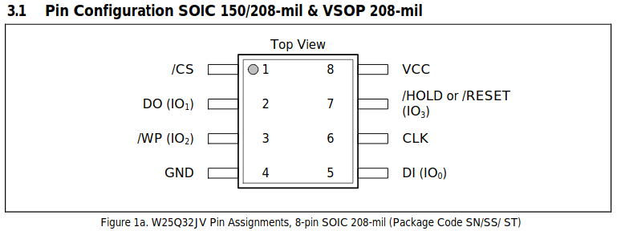
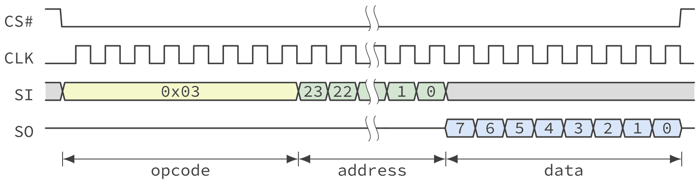
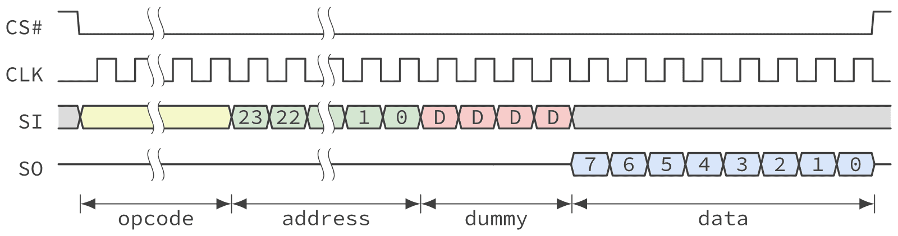
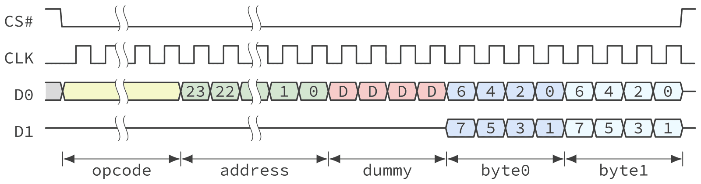
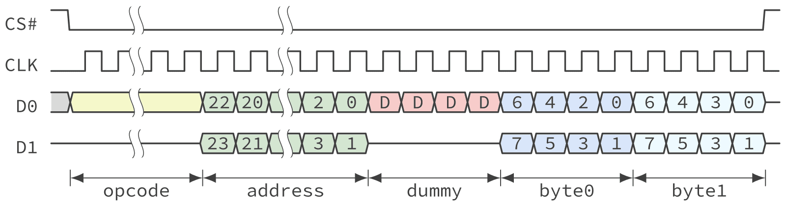
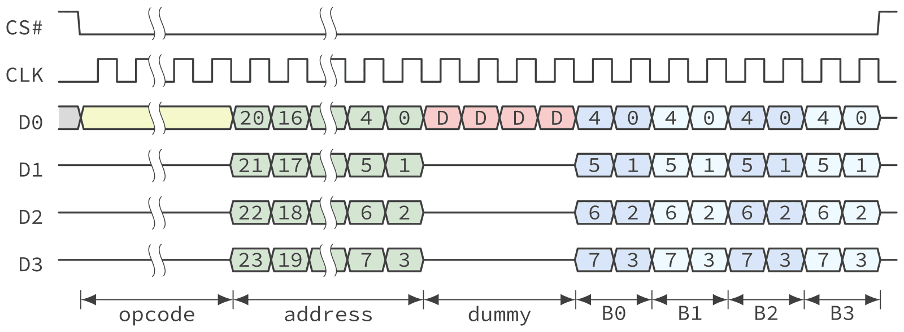
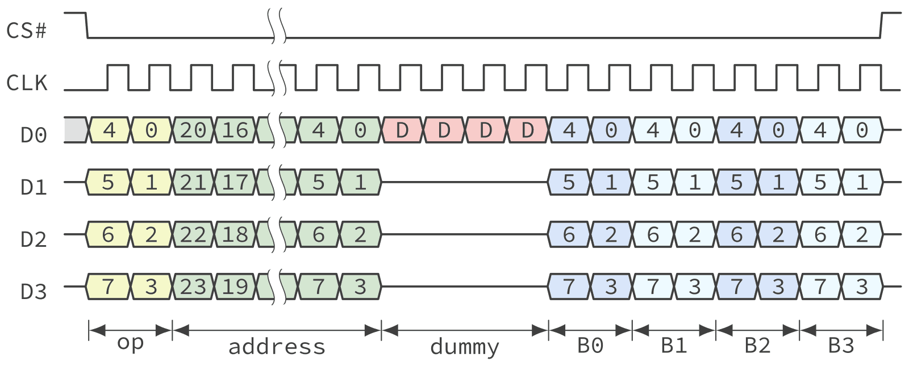
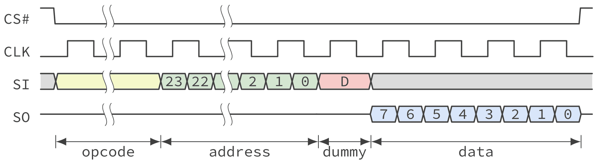

<h1 align="center">
 
  <br />
 QUAD SPI
</h1>

<a href="https://github.com/veer-Singh?tab=followers">
  
</a>


## Summary

This post looks at **SPI** and its wider-bus descendants **Dual / Quad / Octal SPI**,
why they exist, how fast they go, and how QSPI actually differs from the classic
4-wire SPI most people first meet on a microcontroller.

**What is SPI.** The Serial Peripheral Interface is a synchronous, full-duplex,
master–slave serial bus introduced by Motorola in the 1980s. In its classic form it
uses four wires:

```
SCLK  – clock, driven by the master
MOSI  – Master Out, Slave In   (data master → slave)
MISO  – Master In, Slave Out   (data slave  → master)
CS/SS – chip select, one per slave, active low
```

Data is shifted out on one clock edge and sampled on the other (the CPOL/CPHA "mode"
settings pick which). There is no addressing, no acknowledge, and no fixed frame
size — the master simply toggles the clock for as many bits as it wants while a slave
is selected. It is point-to-point per chip select; every extra slave costs another CS
pin.

**Variants.**

| Variant | Data lines | Notes |
| --- | --- | --- |
| Standard SPI (single) | MOSI + MISO (1 bit each way) | classic 4-wire, full-duplex |
| 3-wire / "MicroWire" | 1 bidirectional data line | half-duplex, saves a pin |
| **Dual SPI** | 2 (IO0–IO1) | 2 bits per clock, half-duplex |
| **Quad SPI (QSPI)** | 4 (IO0–IO3) | 4 bits per clock, half-duplex |
| **Twin-Quad / dual-flash** | 4 + 4 (two Quad devices) | controller drives two Quad chips in lock-step on a shared clock/CS; the two nibbles combine into a byte per clock, giving Octal-like bandwidth from standard Quad parts (e.g. STM32 QUADSPI dual-flash mode) |
| **Octal SPI (OSPI)** | 8 (IO0–IO7) | 8 bits per clock on one device, common on HyperBus-class flash |
| **QSPI + DTR/DDR** | 4 or 8 | data on both clock edges, doubles throughput again |

Dual/Quad/Octal are not separate buses — they are transfer *modes* a controller drops
into after sending the command/address on IO0, reusing MOSI/MISO/WP/HOLD pins as extra
bidirectional data lanes.

**Max speed.** Standard SPI has no ceiling in the spec; it is limited by the parts and
the board. Typical microcontroller SPI runs **10–50 MHz**; well-designed links reach
**~60–100 MHz** single-bit (≈ up to ~100 Mbit/s). QSPI NOR flash commonly runs
**80–133 MHz**; at 133 MHz × 4 lines that is about **533 Mbit/s (~66 MB/s)**, and in
DDR mode roughly **1 Gbit/s (~133 MB/s)**. Octal DDR flash pushes past
**~400 MB/s**. As a rule of thumb: each step (Dual → Quad → Octal) roughly doubles
throughput at the same clock, and DDR doubles it once more.

**How QSPI differs from normal SPI.**

- **Bus width.** Normal SPI moves 1 bit per clock per direction on dedicated MOSI and
  MISO lines. QSPI moves **4 bits per clock** over four shared IO lines (IO0–IO3), so
  at the same clock frequency it is ~4× faster.
- **Duplex.** Classic SPI is **full-duplex** — it sends and receives at the same time.
  QSPI is **half-duplex**: the four IO lines are reused for whichever direction is
  active, so a transfer is a phased sequence — *command → address → dummy/turnaround
  cycles → data* — with the lines changing direction between phases.
- **Structured transactions.** Plain SPI is just a raw bitstream the software frames.
  QSPI controllers understand an instruction format (opcode, address width, dummy
  cycles, data), which is why they can offer **execute-in-place (XIP)** — the CPU
  fetches code directly from QSPI flash as if it were memory-mapped.
- **Pin reuse.** QSPI repurposes the SPI `WP#` and `HOLD#` pins as IO2 and IO3, so a
  Quad-capable flash still fits the same 8-pin package.

**Bidirectional or unidirectional?** Both SPI and QSPI are **bidirectional** — data
flows master→slave and slave→master. The difference is *how*: standard SPI is
bidirectional and **simultaneous** (full-duplex, separate wires per direction), while
QSPI is bidirectional but **one direction at a time** (half-duplex, shared IO lines
that reverse between transaction phases). The single data line in 3-wire SPI is
likewise bidirectional/half-duplex.

---
## Pinout: where Dual/Quad get their extra wires from

A Quad-capable NOR flash still ships in the same 8-pin SOIC as a plain SPI part. Two
pins that are barely used in classic SPI get reused as data lines:



| Pin | Standard SPI role | Quad SPI role |
| --- | --- | --- |
| DI  | MOSI (master → slave) | IO0 |
| DO  | MISO (slave → master) | IO1 |
| /WP | write-protect | IO2 |
| /HOLD (or /RESET) | pause the transfer mid-byte | IO3 |

This is *why* Dual/Quad/Octal don't need a different connector or a bigger package —
the controller just switches how it drives pins it already had.

## Anatomy of a transaction: command → address → dummy → data

Every SPI-family transfer to a NOR flash is the same five phases, just with a
different number of wires active in each one. `CS#` drops low once and stays low for
the *entire* transaction — pull it high early and you abort mid-transfer.

**1. Standard READ (0x03) — the simplest case, no dummy phase:**



Opcode goes out 1 bit at a time on SI, then a 24-bit address, then the flash starts
shifting data back on SO on the very next clock. There's no dead time because the
clock is slow enough for the flash's internal read logic to keep up.

**2. FAST READ (0x0B) — same phases, plus dummy cycles:**



Push the clock faster than plain READ can handle and the flash's sense amplifiers
need a head start before the first data bit is valid. That head start is the
**dummy phase** — clock pulses with no defined data, purely so the flash has time to
fetch the first byte internally before it has to shift it out. Every faster read
command (Fast, Dual, Quad, DDR) pays this same tax; only the *count* of dummy cycles
changes, and that count is itself configurable — most Quad-capable flash exposes a
register field for it, because the "safe" number of dummy cycles depends on how fast
you're actually clocking the bus. Set it too low for the clock you're running and
reads come back shifted or garbled, not simply absent — which makes a dummy-cycle
mismatch a nasty first bug to chase during bring-up.

**3. Widening the bus — Dual and Quad:**

The opcode is always sent 1 bit at a time (the flash doesn't know yet how many lines
to expect for the rest of the transaction). What changes is the *address* and *data*
phases:

| Mode notation | Meaning | Diagram |
| --- | --- | --- |
| **1-1-2** Dual Output | opcode 1 line, address 1 line, data 2 lines |  |
| **1-2-2** Dual I/O | opcode 1 line, address **and** data on 2 lines |  |
| **1-1-4** Quad Output | opcode 1 line, address 1 line, data 4 lines | — |
| **1-4-4** Quad I/O | opcode 1 line, address **and** data on 4 lines |  |

The "1-4-4" naming is just "how many lines during opcode - address - data". It's the
number you'll see all over QSPI controller register fields (STM32 `QUADSPI->CCR`,
for example) and in datasheets, so it's worth internalizing.

**4. Going all-in — QPI (4-4-4):**



In QPI mode the flash is told (via a mode-entry command) to treat *every* phase,
including the opcode itself, as 4 lines wide. That single byte opcode now takes 2
clocks instead of 8, shaving a little more latency off every command. It's a
**device-wide mode switch**, not a per-command choice: one command puts the whole
flash into QPI, and every command after that — until an explicit exit command —
is assumed to use 4 lines for its opcode too. The exit command itself has to be
sent 4-lines-wide, since by then that's the only thing the flash is listening for.
Get the enter/exit sequence backwards and the flash stops understanding any command
at all until it's reset.

**5. Doubling up again — DDR:**



Everything above is **SDR** (Single Data Rate): one bit per line per clock *edge*
sampled once per cycle. **DDR** (Double Data Rate, sometimes called DTR) shifts
data on both the rising *and* falling edge, doubling throughput at the same clock
without touching the bus width at all — the last multiplier available once you've
already gone Quad.

## Worked example: why the wider bus actually matters

Say you need to pull 256 bytes out of flash, 24-bit addressing, no QPI:

| Command | Phases (cycles) | Total clocks | @ clock | Time |
| --- | --- | --- | --- | --- |
| READ (0x03), 1-1-1 | 8 (op) + 24 (addr) + 2048 (256B × 8 bits, 1 line) | 2080 | 50 MHz | **41.6 µs** |
| QUAD I/O FAST READ (0xEB), 1-4-4 | 8 (op, 1 line) + 6 (addr, 4 lines) + 8 (dummy) + 512 (256B × 8 bits ÷ 4 lines) | 534 | 100 MHz | **5.3 µs** |

Two things stack: 4× fewer clocks for the same data (wider bus), *and* a higher
clock is now achievable because the dummy phase hides the flash's internal latency.
That's roughly an **8× speedup** — and it's exactly why **execute-in-place (XIP)**
from external NOR is viable at all: a QSPI controller can be told to run this same
1-4-4 read automatically, on demand, whenever the CPU touches a given address range,
so external flash shows up in the memory map like it was internal.

* The external flash becomes **read-only** memory in the MCU's address space while
  mapped this way.
* You **cannot** write or erase through the memory-mapped window — a program/erase
  opcode has to be issued as an ordinary indirect command, with the controller
  taken out of memory-mapped mode first and re-armed afterward.

## Focus points — the things that actually bite during bring-up

- **Dummy-cycle count must match what the flash was configured for.** Get this
  wrong and reads come back shifted/garbage rather than simply failing — a
  deceptively hard first bug to chase.
- **QPI is a device-wide mode switch, not a per-command flag.** Once entered, *every*
  subsequent command — including the one used to exit QPI — must be framed with a
  4-line opcode, or the flash stops responding to anything until it's reset.
- **Read and program don't have to share a line-mode.** A flash can happily read
  1-4-4 while programming 1-1-4 (or vice versa) — always check the opcode table
  per-command, never assume symmetry between read and write paths.
- **3-byte vs 4-byte addressing is a separate axis from Dual/Quad.** Any flash over
  16 MB needs 4-byte addressing regardless of how many data lines you're using —
  the two settings are independent and both have to be right.
- **"Dual-flash mode" is not "Dual SPI."** A controller's dual-flash / multi-die
  option pairs two whole Quad devices for extra bandwidth; it's an orthogonal idea
  to the 2-line Dual SPI *transfer mode* covered above — don't let the shared word
  "dual" conflate them.
- **Memory-mapped (XIP) is read-only and can't observe an in-progress erase.** Any
  program/erase must happen with the controller back in indirect mode; the CPU
  can't safely fetch code from a region that's mid-erase either way.
- **CS# must not glitch high mid-transaction.** Every diagram above shows one
  continuous low pulse for the whole command — a shared CS# line with another
  device on the same bus is a common way to violate this by accident.

  [Next -->  Nor Flash ](./nor_flash.md)


  Reference : 
  [ QUAD-SPI ](https://controllerstech.com/w25q-flash-series-part-7-quadspi-write-read-memory-mapped-mode/)