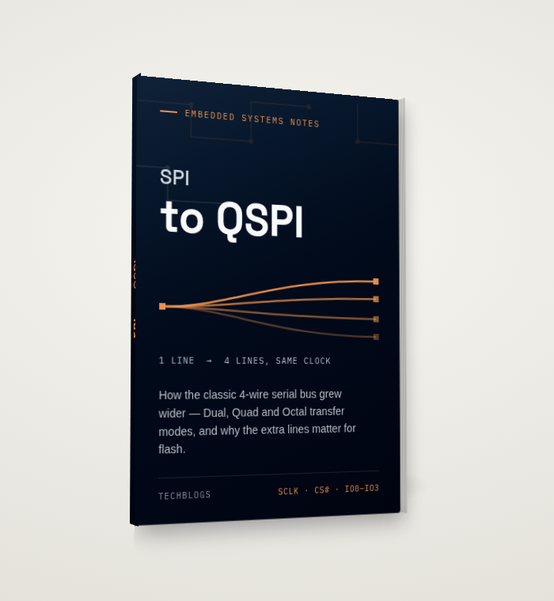

<h1 align="center">
 
  <br />
 NOR FLASH OVER QSPI
</h1>

<a href="https://github.com/veer-Singh?tab=followers">
  
</a>


> **Part 2 of the QSPI notes.** Continues from [**Quad SPI →**](QSPI.md), which
> covered the *bus*: pins, transaction phases, dummy cycles, Dual/Quad/QPI/DDR.
> This page covers the *memory behind the bus* — how a QSPI NOR flash chip is
> actually organized, why it can't just be rewritten like RAM, and how program/erase
> wear is managed (or isn't) on a part like this.
>
> Reference part: **Micron MT25TL01G** — 1-Gbit "Twin-Quad" serial NOR flash, two
> 512-Mbit dies in one package. Datasheet:
> [`data/docs/MT25TL01GBBB8ESF-0AAT.pdf`](../data/docs/MT25TL01GBBB8ESF-0AAT.pdf).

---

## The chip: two dies, one address space

"Twin-Quad" means exactly what it sounds like: this package has **two independent
512-Mbit NOR dies**, each with its own 4-line Quad interface, sharing a single clock
and chip-select. Wired into an STM32 QUADSPI in **dual-flash mode (DFM)**, the
controller drives both dies in lock-step and interleaves their data — even bytes
from die 1, odd bytes from die 2 — so software sees one combined 128 MB device
instead of two 64 MB ones.

This is a different kind of "double bandwidth" than the Quad/Octal/DDR line-width
tricks from Part 1: those widen *one* device's bus. DFM instead runs *two* full
Quad devices in parallel and stitches their output together, which is why the
combined view has everything exactly doubled:

| Unit | Per die | Combined (DFM) |
| --- | --- | --- |
| Die / total capacity | 512 Mbit (64 MB) | 1 Gbit (128 MB) |
| Sector | 64 KB | 128 KB |
| Subsector (large) | 32 KB | 64 KB |
| Subsector (small) | 4 KB | 8 KB |
| Page | 256 B | 512 B |

Because 128 MB is well past the 16 MB ceiling of 3-byte addressing (2²⁴ = 16 MB),
this part is always driven with **4-byte addresses** — a setting that's completely
independent of how many data lines a command uses (see Part 1's focus points).

## The one fact that explains everything else: erase only goes one way

A NOR (and NAND) flash cell can be **programmed** (written) one bit at a time, but
only in one direction: programming can clear a bit from `1` to `0`, never set it
back. The *only* operation that can put a `0` back to `1` is an **erase**, and erase
doesn't work bit-by-bit or even byte-by-byte — it resets an entire sector or
subsector to all-`1`s (`0xFF`) at once.

That asymmetry is why every flash workflow looks like:

```
erase the region (→ all 0xFF)  →  program the bytes you actually want (1s → 0s only)
```

You cannot "just rewrite" three bytes in the middle of a page the way you would in
RAM — if any bit in those bytes needs to go from `0` back to `1`, the whole
containing sector has to be erased first, meaning everything else in that sector has
to be read out, held somewhere, and re-programmed afterward.

**Why erase is coarse and program is fine-grained** comes straight from the
hardware: an erase pumps a much higher voltage across the *entire* sector's cell
array to pull every floating gate's charge off at once — doing that per-byte would
need per-byte high-voltage circuitry, which doesn't scale. Programming only needs to
push charge onto the (much smaller) set of cells being cleared, so it can afford to
work at page granularity. This is also, as covered below, the root cause of flash
wear: **an erase stresses the entire sector even if you only needed to change one
byte in it.**

## Status and flag registers: how software knows what's happening

Two registers do all the bookkeeping for program/erase operations:

**Status Register** (`READ STATUS REGISTER`, per die — this driver ORs both dies
together):

| Bit | Name | Meaning |
| --- | --- | --- |
| 0 | WIP | Write In Progress — `1` while a program/erase/status-write is running |
| 1 | WEL | Write Enable Latch — must be `1` before *any* program/erase/write-status command, and it self-clears when the operation completes |
| 2–4, 6 | BP0–BP3 | Block Protect bits — see below |
| 5 | TB | Top/Bottom — which end of the array the protected region starts from |
| 7 | SRWD | Status Register Write Disable |

**Flag Status Register** (`READ FLAG STATUS REGISTER`) adds the diagnostics the plain
status register doesn't have room for: bit 5 (erase failed/protection error), bit 4
(program failed/protection error), bit 1 (protected-area or locked-OTP violation),
and bit 0 (currently 3-byte vs 4-byte addressing).

WEL existing as a **separate, self-clearing latch** is worth pausing on: it means
"write enable" isn't a mode you turn on once — it's a one-shot permission slip that
has to be re-issued before *every single* program or erase command. Forget it and
the command is silently ignored (WIP never sets, nothing errors, nothing happens).

## Write protection: block-protect bits

The BP3:0 + TB bits in the status register carve out a protected region — anywhere
from **none** to **the entire array** — measured in 64 KB sectors, growing from
either the top or the bottom of the die depending on TB. A firmware image or
bootloader typically lives in a BP-protected region so a runaway pointer or bad OTA
write can't erase it; the datasheet's protected-area table maps every BP3:0/TB
combination to an exact sector range (e.g. `BP=0001, TB=0` protects only the very
last sector; `BP=1011, TB=1` protects sectors `0:511`, the bottom half of the die).
Protection is **nonvolatile** — it survives power loss — which is exactly the point.

## Suspend and resume: letting a read cut in line

A sector erase can take up to **1 second**; even a 4 KB subsector erase can take
**~400 ms**. Without a way to interrupt that, a time-critical read (or a higher
priority write elsewhere in a totally different sector) would stall behind it. The
`PROGRAM/ERASE SUSPEND` and `...RESUME` commands exist for exactly this:

| Transition | Typical latency |
| --- | --- |
| Sector erase → suspend accepted | 150 µs |
| Subsector erase → suspend accepted | 50 µs |
| Program → suspend accepted | 5 µs |
| Suspend → ready for a new program | 7–25 µs |
| Suspend → ready for a new erase | 15–30 µs |

Once suspended, the flash accepts read commands (and, after a program suspend, most
other commands too) against the *rest* of the array, then resumes the paused
operation on request. This matters a lot for the logging/filesystem use case
discussed below — it's what keeps a slow background erase from blocking a
foreground read.

## Endurance and retention — the numbers that create the wear problem

Per the datasheet's feature summary, this part is specified for:

- **Minimum 100,000 erase cycles per sector**
- **20 years (typical) data retention**

100,000 cycles sounds like a lot until you put a realistic access pattern next to
it. A sector erased once a minute hits that floor in about **69 days**. A sector
erased once a second — plausible for, say, a naively-implemented config or log
region — hits it in under a day and a half. Once a sector exceeds its rated
endurance, further erases risk cells that no longer hold their programmed state
reliably (bit errors), which the flag status register's erase/program-fail bits are
there to catch, not prevent.

This is the entire reason **wear leveling** exists as a topic.

## Main notes: how wear and tear is actually managed

Here's the detail that surprises people coming from NAND/eMMC/SSD backgrounds:
**this chip does none of it.** Searching the full MT25TL01G datasheet turns up zero
mentions of "wear," "bad block," or "reclaim." A raw SPI/QSPI NOR part has no
onboard controller tracking erase counts, no spare-block pool, no remapping — it
faithfully executes whatever ERASE/PROGRAM command lands on whatever address it's
given, as many times as you ask, until that sector wears out. Compare that to NAND
flash or an eMMC/SSD, where a **Flash Translation Layer (FTL)** built into the
device itself hides all of this from the host.

For QSPI NOR, the FTL-equivalent job — if it's needed at all — has to live in
**firmware**, one layer above the driver:

**1. Logical-to-physical remapping.** Instead of always erasing-and-reprogramming
the same physical sector for a given logical block, the firmware keeps a small
translation table and always writes the *next* free physical sector for a logical
update, retiring the old one to a "stale, needs erase" pool. A physical sector is
only actually erased once it's cycled back around to be reused.

**2. Erase-count tracking.** Each physical sector's approximate erase count is kept
somewhere durable (its own header/metadata region, or a compact table). Two
strategies build on this:

- **Dynamic wear leveling** — when picking a free sector for new data, prefer the
  one with the lowest erase count. Simple and cheap, but data that's written once
  and never touched again ("cold" data) sits untouched in its original sector
  forever, so that sector never gets a turn — the wear concentrates on whatever
  sectors happen to hold frequently-updated data.
- **Static wear leveling** — periodically relocate even cold, unchanged data into a
  more-worn sector, freeing up an under-used sector for hot data. This levels wear
  across the *entire* device, not just the actively-written part of it, at the cost
  of extra background copy traffic.

**3. Bad-sector retirement.** If a sector fails to verify after an erase or program
(the flag status register's erase-fail / program-fail bits go high), the firmware
marks it dead and stops allocating it — the array shrinks slightly rather than the
whole device becoming unreliable.

**4. Leaning on suspend/resume.** A wear-leveling layer that's relocating data in
the background wants to avoid stalling foreground reads/writes behind a multi-hundred-
millisecond erase — this is exactly what the suspend/resume commands above are for.

### Does *this* chip, in *this* use case, actually need it?

It depends entirely on the access pattern, which is why the driver in
[`nosr_flash.c`](../data/code/nosr_flash.c) (Part 3) doesn't implement any of the
above itself — that decision belongs to whatever sits on top of it:

- **XIP / firmware storage** (the use case this driver's memory-mapped mode is built
  for): code is written rarely — at flash time, or on an OTA update — so a given
  sector might see a few hundred erases over a product's entire lifetime. Nowhere
  near the 100,000-cycle floor. Wear leveling would be solving a problem that
  doesn't exist here.
- **Data logging / a filesystem region**: if the same handful of sectors get
  rewritten every few seconds (rotating logs, frequently-saved config), naive
  erase-in-place burns through 100,000 cycles in hours to days, as shown above. This
  is where a wear-leveling filesystem (LittleFS and SPIFFS both implement exactly
  the dynamic-remapping scheme described here) or a hand-rolled log-structured
  region is not optional.

A useful back-of-envelope check: rotating a fixed workload evenly across **N**
physical sectors (simple dynamic leveling) extends the *pool's* time-to-first-wear-out
by roughly **N×**, since each physical sector now only takes one erase out of every
N logical updates. The earlier once-a-second sector that died in under 1.5 days
survives roughly **16 days** spread round-robin across just 16 sectors — cheap
insurance for anything that writes often enough to matter.

---

Next: [**Part 3 — the driver →**](nor_flash_driver.md) walks
[`nor_flash.h`](../data/code/nor_flash.h) and [`nosr_flash.c`](../data/code/nosr_flash.c)
function by function, tying every command back to the bus mechanics from Part 1 and
the memory model above.
