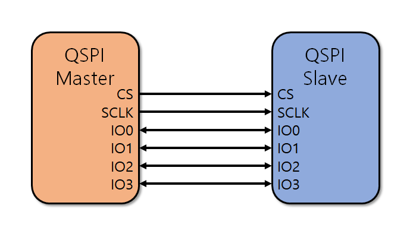

<h1 align="center">
 
  <br />
 THE NOR FLASH DRIVER
</h1>

<a href="https://github.com/veer-Singh?tab=followers">
  
</a>


> **Part 3 of the QSPI notes.** Continues from [**Quad SPI →**](QSPI.md) (the bus:
> pins, phases, dummy cycles, Dual/Quad/QPI/DDR) and
> [**NOR flash over QSPI →**](nor_flash.md) (the memory model: sectors, erase-before-
> program, endurance, wear leveling). This page reads
> [`nor_flash.h`](../data/code/nor_flash.h) and
> [`nosr_flash.c`](../data/code/nosr_flash.c) — the STM32 HAL component driver for
> the Micron MT25TL01G — function by function, tying each one back to those two
> pages.

---

## The line-mode helper: where "1-4-4" becomes code

Every command struct passed to `HAL_QSPI_Command()` needs a line count for its
instruction, address, and data phases. The driver centralizes that choice in one
helper instead of repeating it everywhere:

```c
static uint32_t MT25TL01G_LineMode(MT25TL01G_Transfer_t Mode, uint32_t Phase)
{
  /* Phase: 0 = instruction, 1 = address, 2 = data */
  if (Mode == MT25TL01G_QPI_MODE)
  {
    switch (Phase)
    {
      case 0:  return QSPI_INSTRUCTION_4_LINES;
      case 1:  return QSPI_ADDRESS_4_LINES;
      default: return QSPI_DATA_4_LINES;
    }
  }
  switch (Phase)
  {
    case 0:  return QSPI_INSTRUCTION_1_LINE;
    case 1:  return QSPI_ADDRESS_1_LINE;
    default: return QSPI_DATA_1_LINE;
  }
}
```

`MT25TL01G_Transfer_t` only has two values, `MT25TL01G_SPI_MODE` and
`MT25TL01G_QPI_MODE` — this is Part 1's **4-4-4 QPI mode switch** made concrete:
when the device is in QPI, *every* phase (including the opcode) goes to 4 lines,
because that's a device-wide state, not a per-call choice.

## Commands with no address and no data

`MT25TL01G_SendCommand()` is the building block for anything that's just an opcode —
reset, write-enable, mode entry/exit:

```c
static int32_t MT25TL01G_SendCommand(QSPI_HandleTypeDef *Ctx, MT25TL01G_Transfer_t Mode, uint8_t Instruction)
{
  QSPI_CommandTypeDef s_command = {0};
  s_command.InstructionMode = MT25TL01G_LineMode(Mode, 0);
  s_command.Instruction     = Instruction;
  s_command.AddressMode     = QSPI_ADDRESS_NONE;
  s_command.DataMode        = QSPI_DATA_NONE;
  s_command.DummyCycles     = 0;
  return (HAL_QSPI_Command(Ctx, &s_command, MT25TL01G_CMD_TIMEOUT) == HAL_OK)
           ? MT25TL01G_OK : MT25TL01G_ERROR;
}
```

`MT25TL01G_EnterQPIMode()` and `MT25TL01G_ExitQPIMode()` both go through this
helper, and the `Mode` argument each passes in is the detail Part 1 flagged as a
gotcha, now visible in the actual code:

```c
int32_t MT25TL01G_EnterQPIMode(QSPI_HandleTypeDef *Ctx)
{
  return MT25TL01G_SendCommand(Ctx, MT25TL01G_SPI_MODE, MT25TL01G_ENTER_QUAD_CMD); /* 0x35, sent 1-line */
}
int32_t MT25TL01G_ExitQPIMode(QSPI_HandleTypeDef *Ctx)
{
  return MT25TL01G_SendCommand(Ctx, MT25TL01G_QPI_MODE, MT25TL01G_EXIT_QUAD_CMD);  /* 0xF5, sent 4-line */
}
```

`Enter` has to be framed 1-line because that's the only thing the flash understands
*before* the switch; `Exit` has to be framed 4-line because that's the only thing it
understands *after*. Pass the wrong `Mode` to either call and the opcode byte goes
out on the wrong number of wires — the flash never recognizes it, and every command
after that silently does nothing until the part is reset.

## Write-enable: a self-clearing latch, polled on both dies

[Part 2](nor_flash.md) noted that WEL isn't a mode — it's a one-shot latch that has
to be set before every single program/erase and clears itself once that operation
finishes. `MT25TL01G_WriteEnable()` doesn't just send the command; it **polls until
WEL is confirmed set** using `HAL_QSPI_AutoPolling()`, because a program/erase issued
before WEL actually lands would be silently ignored:

```c
s_config.Match           = (MT25TL01G_SR_WEL << 8) | MT25TL01G_SR_WEL;
s_config.Mask            = (MT25TL01G_SR_WEL << 8) | MT25TL01G_SR_WEL;
s_config.MatchMode       = QSPI_MATCH_MODE_AND;
s_config.StatusBytesSize = 2;
```

`StatusBytesSize = 2` and the mask repeating `SR_WEL` in both the high and low byte
is the Twin-Quad detail from Part 2: in dual-flash mode every status/flag register
read returns **two bytes, one per die**, and the driver requires WEL set on *both*
before it considers the flash ready — a single die still latched from a previous
operation would otherwise let a program silently miss half the combined write.

The same two-bytes-per-die pattern shows up in the plain register reader, which
folds the two dies back into one value the caller can treat as a single flash:

```c
static int32_t MT25TL01G_ReadReg(...)
{
  ...
  /* reg[0] = die 1, reg[1] = die 2 - report their bitwise OR. */
  *Value = (uint8_t)(reg[0] | reg[1]);
  return MT25TL01G_OK;
}
```

OR-ing the two status bytes means "busy" or "error" on *either* die makes the
combined flash report busy/error — the conservative choice, since a caller treating
this as one 128 MB device has no way to act on a single die's status alone.

## Waiting for the flash: `AutoPollingMemReady`

Erase and program commands return to the caller as soon as the *command* has been
issued — the actual erase/program takes anywhere from 2 ms (a page program) to
1 second (a full sector erase, per Part 2's timing table), so nothing about the HAL
call blocks for that. Every erase/program path in this driver instead ends by
calling `MT25TL01G_AutoPollingMemReady()`, which polls the status register's WIP bit
(again, both dies, `Mask = (SR_WIP << 8) | SR_WIP`) until it clears, using the QSPI
peripheral's hardware auto-polling instead of a software loop re-issuing
`READ STATUS REGISTER` — cheaper on bus traffic and CPU time than bit-banging the
same poll manually.

## Dummy cycles: `ConfigureDummyCycles`

Part 1 called out those dummy cycles the flash needs before a fast/Quad read starts
returning valid data — that count is not fixed in silicon, it's a register field
this driver has to set explicitly, once, before the first Quad read:

```c
#define MT25TL01G_DUMMY_CYCLES_READ_QUAD    8U
#define MT25TL01G_VCR_VALUE                 0x8BU  /* 8 dummy cycles, XIP disabled */

int32_t MT25TL01G_ConfigureDummyCycles(QSPI_HandleTypeDef *Ctx, MT25TL01G_Transfer_t Mode)
{
  ...
  MT25TL01G_WriteEnable(Ctx, Mode);
  /* write MT25TL01G_VCR_VALUE to the Volatile Configuration Register, both dies */
  ...
  return MT25TL01G_AutoPollingMemReady(Ctx, Mode);
}
```

This is a **volatile** configuration register — it resets on power-cycle — so a real
init sequence has to call this before the first `MT25TL01G_Read()`, every boot. Skip
it (or the flash powers up with a different dummy-cycle default than the driver
assumes) and reads come back shifted, exactly the "garbage, not an error" failure
mode Part 1 warned about.

## 4-byte addressing: mandatory, not optional, at this size

Part 2 explained why: at 128 MB combined, this part is permanently past the 16 MB
reach of 3-byte addresses. `MT25TL01G_Enter4BytesAddressMode()` follows the same
write-enable → command → poll-ready pattern as every other state-changing command
here, and every read/program/erase function in this file uses the `4_BYTE_*` opcode
variants unconditionally — there's no code path in this driver that ever uses 3-byte
addressing.

## Reading: 1-4-4, 8 dummy cycles, done

`MT25TL01G_Read()` issues exactly one opcode, matching the "reads don't have to
match writes" point from Part 1:

```c
s_command.InstructionMode = QSPI_INSTRUCTION_1_LINE;
s_command.Instruction     = MT25TL01G_4_BYTE_QUAD_INOUT_FAST_READ_CMD;  /* 0xEC: 1-4-4 */
s_command.AddressMode     = QSPI_ADDRESS_4_LINES;
s_command.AddressSize     = QSPI_ADDRESS_32_BITS;
s_command.DummyCycles     = MT25TL01G_DUMMY_CYCLES_READ_QUAD;
s_command.DataMode        = QSPI_DATA_4_LINES;
```

Opcode on 1 line (the flash hasn't been told the transaction's shape yet), then
address *and* data both on 4 lines once it has — the exact 1-4-4 diagram from Part 1,
with the dummy-cycle count from `ConfigureDummyCycles` plugged straight into
`DummyCycles`.

## Programming: 1-1-4, and a page-boundary constraint

`MT25TL01G_PageProgram()` uses a **different** line mode than the read path:

```c
s_command.InstructionMode = QSPI_INSTRUCTION_1_LINE;
s_command.Instruction     = MT25TL01G_4_BYTE_QUAD_IN_FAST_PROG_CMD;  /* 0x34: 1-1-4 */
s_command.AddressMode     = QSPI_ADDRESS_1_LINE;
s_command.DataMode        = QSPI_DATA_4_LINES;
```

Address stays 1-line; only the payload goes out 4-wide. The function comment notes
`Size <= MT25TL01G_PAGE_SIZE` (512 B combined) and that a write **must not cross a
combined-page boundary** — this is the fine-grained side of Part 2's erase/program
asymmetry: programming works in small, page-aligned chunks, and the flash's internal
program logic simply doesn't handle a write that straddles two pages, so the caller
has to split any larger buffer into page-sized, page-aligned calls itself. Every
call is preceded by its own `MT25TL01G_WriteEnable()` — because, again, WEL is
one-shot and clears itself the moment the previous program finished.

## Erasing: the coarse side, and who waits for it

```c
int32_t MT25TL01G_BlockErase(QSPI_HandleTypeDef *Ctx, uint32_t Address, MT25TL01G_Erase_t Size)
{
  ...
  switch (Size)
  {
    case MT25TL01G_ERASE_4K:  s_command.Instruction = MT25TL01G_4_BYTE_SUBSECTOR_ERASE_4K_CMD;  break;
    case MT25TL01G_ERASE_32K: s_command.Instruction = MT25TL01G_4_BYTE_SUBSECTOR_ERASE_32K_CMD; break;
    case MT25TL01G_ERASE_64K:
    default:                 s_command.Instruction = MT25TL01G_4_BYTE_SECTOR_ERASE_64K_CMD;     break;
  }
  ...
  return MT25TL01G_OK; /* caller polls with MT25TL01G_AutoPollingMemReady */
}
```

Notice this function returns as soon as the erase *command* is accepted — it
deliberately does **not** call `AutoPollingMemReady` itself, unlike
`PageProgram`. The comment says why: erase is the operation that can take up to
~1 second (Part 2's endurance table), so baking a blocking poll into every erase
call would stall the caller for that whole window even if it had other work to do
first. Leaving the poll to the caller means erase-then-do-something-else and
erase-then-immediately-wait are both possible with the same function — this is also
exactly the seam where a wear-leveling layer above this driver (Part 2's "main
notes") would insert its own bookkeeping: incrementing an erase counter, checking
the flag status register for an erase failure, before deciding whether that
physical sector is still good to reuse.

`MT25TL01G_ChipErase()` follows the identical shape with the whole-die opcode
(`0xC7`) and the same "caller polls" contract.

## Memory-mapped mode: XIP, and the gap this driver leaves open

`MT25TL01G_EnableMemoryMappedModeSTR()` is Part 1's XIP payoff made concrete —
it hands the *exact same* 1-4-4 quad-I/O-fast-read opcode and dummy-cycle count to
`HAL_QSPI_MemoryMapped()` instead of `HAL_QSPI_Command()`, so the QUADSPI peripheral
replays that read automatically on every CPU access to `0x9000_0000` onward:

```c
s_command.Instruction = MT25TL01G_4_BYTE_QUAD_INOUT_FAST_READ_CMD;
s_command.DummyCycles = MT25TL01G_DUMMY_CYCLES_READ_QUAD;
...
HAL_QSPI_MemoryMapped(Ctx, &s_command, &s_mem_mapped_cfg);
```

What's worth noticing is what's **not** here: there is no
`MT25TL01G_DisableMemoryMappedMode()` in this file. Getting the peripheral back to
indirect mode — required before any program or erase, per Part 1's focus points —
has to be done by the caller directly, typically with `HAL_QSPI_Abort()`, and then
`EnableMemoryMappedModeSTR()` re-armed afterward if XIP needs to resume. Any
integration of this driver has to own that sequencing itself; it's not encapsulated
here.

## Identification and power state — the remaining small pieces

- **`MT25TL01G_ReadID()`** uses the multiple-I/O read-ID opcode (`0xAF`) and expects
  **6 bytes back**, not the usual 3 — because, once again, DFM means every register
  read is duplicated per die: 3 ID bytes from die 1 followed by 3 from die 2.
- **`MT25TL01G_EnterDeepPowerDown()` / `LeaveDeepPowerDown()`** are plain
  `SendCommand()` wrappers around `0xB9`/`0xAB` — no polling needed, since the
  datasheet's deep-power-down entry/exit timing is a fixed delay the caller is
  expected to honor rather than something reflected in a status bit.

## Focus points — porting or extending this driver

- **Never skip `WriteEnable` before a program/erase/write-status call.** It is not
  a mode you set once; it self-clears after every single operation, by design.
- **Treat QPI as global state.** If any code path calls `EnterQPIMode`, every
  subsequent `Mode` argument passed into this file's functions must be
  `MT25TL01G_QPI_MODE` until `ExitQPIMode` runs — mixing them mid-sequence is the
  same "wrong line count" failure Part 1 described, just reached through the API
  instead of the timing diagram.
- **`ConfigureDummyCycles` and `Enter4BytesAddressMode` are volatile-register
  writes.** Both need to re-run after every power-on reset, not just once at
  first boot.
- **`BlockErase`/`ChipErase` do not block until completion** — any caller (including
  a future wear-leveling layer) must call `AutoPollingMemReady` itself, and should
  check the flag status register's erase-fail bit afterward rather than assuming
  success.
- **Memory-mapped mode has no matching disable function here** — budget for
  `HAL_QSPI_Abort()` plus a re-arm call in any code path that needs to interleave
  XIP execution with flash writes.
